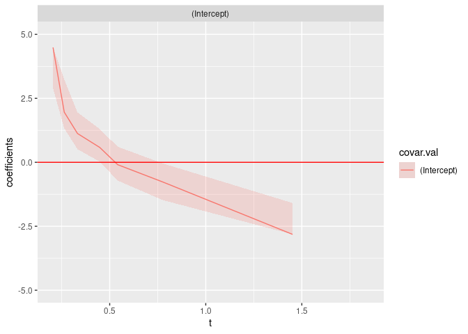

<!-- README.md is generated from README.Rmd. Please edit that file -->

# netidmtpreg

<!-- badges: start -->

[](https://lifecycle.r-lib.org/articles/stages.html)
[](https://github.com/qmarcou/netidmtpreg/actions/workflows/test-coverage.yaml)
[](https://codecov.io/gh/qmarcou/netidmtpreg)
[](https://github.com/qmarcou/netidmtpreg/actions/workflows/R-CMD-check.yaml)
<!-- badges: end -->

The goal of netidmtpreg is to enable net survival estimation through
direct binomial regression, allowing modeling continuous covariate
effects that could not be handled through e.g stratified Pohar-Perme
estimation, all this in a multistate Illness-Death setting.

## Installation

You can install the development version of netidmtpreg like so:

``` r
devtools::install_github("qmarcou/netidmtpreg")
```

If working from source through a git clone, the package should be
installed locally to get tests running `future::multisession` planning
working. This can be accomplished using `devtools`

``` r
devtools::dev_mode(on = TRUE)
devtools::install_local(force = TRUE) # force package update
devtools::load_all() # required to make tests visible
testthat::test_package("netidmtpreg")
# or testthat::test_check("netidmtpreg") to run R CMD check
```

## Example

This is a basic example illustrating net survival estimation on data
simulated using the package. Let’s first generate some data:

``` r
library(netidmtpreg)
library(tidyverse)
#> ── Attaching core tidyverse packages ──────────────────────── tidyverse 2.0.0 ──
#> ✔ dplyr     1.1.4     ✔ readr     2.1.5
#> ✔ forcats   1.0.0     ✔ stringr   1.5.1
#> ✔ ggplot2   3.5.1     ✔ tibble    3.2.1
#> ✔ lubridate 1.9.3     ✔ tidyr     1.3.1
#> ✔ purrr     1.0.2     
#> ── Conflicts ────────────────────────────────────────── tidyverse_conflicts() ──
#> ✖ dplyr::filter() masks stats::filter()
#> ✖ dplyr::lag()    masks stats::lag()
#> ℹ Use the conflicted package (<http://conflicted.r-lib.org/>) to force all conflicts to become errors

n_ind <- 1e2 # number of simulated individuals

# Generate exponentially distributed event times without censoring
synth_idm_data <- generate_uncensored_ind_exp_idm_data(
  n_individuals = n_ind,
  lambda_illness = 1.0,
  lambda_death = 1.0
)

# Generate random age and sex labels
synth_idm_data <-
  synth_idm_data %>% tibble::add_column(
    sex = ifelse(rbinom(n_ind, 1, prob = .5), "male", "female"),
    age = runif(n = n_ind, min = 50, max = 80)
  )

# Generate random start of follow up dates
synth_idm_data <-
  synth_idm_data %>% tibble::add_column(start_date = as.Date.numeric(
    x = rnorm(n = n_ind, mean = 0, sd = 1e2),
    origin = as.Date("15/06/1976", "%d/%m/%Y")
  ))

# Generate population mortality assuming equal constant population rate
l_pop_death <- 1.0 # extra disease mortality doubles the population mortality
population_death_times <- generate_exponential_time_to_event(
  n_individuals = n_ind,
  lambda = l_pop_death
)
# create a corresponding ratetable object
const_ratetable <- survival::survexp.us
const_ratetable[] <- l_pop_death # ratetable's covariate do not matter
# Update death time accordingly to create an observed crude survival dataset
crude_synth_idm_data <- netidmtpreg:::apply_iddata_death(
  synth_idm_data,
  population_death_times
)
```

Now let’s carry the of net survival estimation:

``` r
# Estimation can be sped up and carried in parrallel using futures:
future::plan("multisession") # will work on any OS
# future::plan("multicore") # more efficient but only works on UNIX systems
net_estimate <- renewnetTPreg(
  formula = ~1, # intercept only model, similar to Pohar-Perme estimation
  data = crude_synth_idm_data,
  # Use a standard ratetable
  ratetable = const_ratetable,
  rmap = list(
    age = age,
    sex = sex,
    year = start_date
  ),
  time_dep_popvars = list("age", "year"),
  s = 0.2,
  by = n_ind / 10,
  trans = "11",
  link = "logit",
  R = 100 # Number of bootstraps
)
#> [1] "estimate"
#> [1] "bootstrap"
future::plan("sequential") # close the multisession, see future's documentation
```

We obtain a `TPreg` object with a dedicated plotting method using
ggplot:

``` r
plot(net_estimate) + ggplot2::ylim(-5, 5)
#> Warning: Removed 1 row containing missing values or values outside the scale range
#> (`geom_line()`).
```



Let’s make sure we a More examples to come\!
