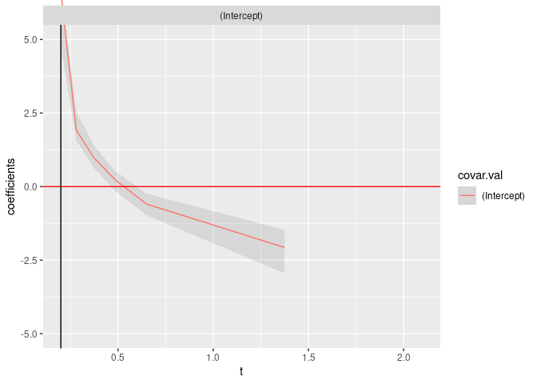

<!-- README.md is generated from README.Rmd. Please edit that file -->

# netidmtpreg

<!-- badges: start -->

[](https://lifecycle.r-lib.org/articles/stages.html)
[](https://github.com/qmarcou/netidmtpreg/actions/workflows/test-coverage.yaml)
[](https://github.com/qmarcou/netidmtpreg/actions/workflows/R-CMD-check.yaml)
<!-- badges: end -->

The goal of netidmtpreg is to enable net survival estimation through
direct binomial regression, allowing modeling continuous covariate
effects that could not be handled through stratified Pohar-Perme
estimation, all this in a multistate Illness-Death setting.

## Installation

You can install the development version of netidmtpreg like so:

``` r
devtools::install_github("qmarcou/netidmtpreg")
```

If working from source through a git clone, the package should be
installed locally to get tests running `future::multisession` planning
working. This can be accomplished using `devtools`

``` r
devtools::dev_mode(on = TRUE)
devtools::install_local(force = TRUE) # force package update
devtools::load_all() # required to make tests visible
testthat::test_package("netidmtpreg")
# or testthat::test_check("netidmtpreg") to run R CMD check
```

## Example

This is a basic example illustrating net survival estimation on data
simulated using the package. Let’s first generate some data:

``` r
library(netidmtpreg)
library(tidyverse)
#> ── Attaching core tidyverse packages ──────────────────────── tidyverse 2.0.0 ──
#> ✔ dplyr     1.1.4     ✔ readr     2.1.5
#> ✔ forcats   1.0.0     ✔ stringr   1.5.1
#> ✔ ggplot2   3.5.1     ✔ tibble    3.2.1
#> ✔ lubridate 1.9.3     ✔ tidyr     1.3.1
#> ✔ purrr     1.0.2     
#> ── Conflicts ────────────────────────────────────────── tidyverse_conflicts() ──
#> ✖ dplyr::filter() masks stats::filter()
#> ✖ dplyr::lag()    masks stats::lag()
#> ℹ Use the conflicted package (<http://conflicted.r-lib.org/>) to force all conflicts to become errors

n_ind <- 1e2 # number of simulated individuals

# Generate exponentially distributed event times without censoring
synth_idm_data <- generate_uncensored_ind_exp_idm_data(
  n_individuals = n_ind,
  lambda_illness = 1.0,
  lambda_death = 0.1
)

# Generate random age and sex labels
synth_idm_data <-
  synth_idm_data %>% tibble::add_column(
    sex = ifelse(rbinom(n_ind, 1, prob = .5), "male", "female"),
    age = runif(n = n_ind, min = 50, max = 80)
  )

# Generate random start of follow up dates
synth_idm_data <-
  synth_idm_data %>% tibble::add_column(start_date = as.Date.numeric(
    x = rnorm(n = n_ind, mean = 0, sd = 1e2),
    origin = as.Date("15/06/1976", "%d/%m/%Y")
  ))

# Generate population mortality assuming equal constant population rate
l_pop_death <- 0.1 # extra disease mortality doubles the population mortality
population_death_times <- generate_exponential_time_to_event(
  n_individuals = n_ind,
  lambda = l_pop_death
)
# create a corresponding ratetable object
const_ratetable <- survival::survexp.us
const_ratetable[] <- l_pop_death # ratetable's covariate do not matter
# Update death time accordingly to create an observed crude survival dataset
crude_synth_idm_data <- netidmtpreg:::apply_iddata_death(
  synth_idm_data,
  population_death_times
)
```

Now let’s carry the of net survival:

``` r
# Estimation can be sped up and carried in parrallel using futures:
future::plan("multisession") # will work on any OS
# future::plan("multicore") # more efficient but only works on UNIX systems
net_estimate <- renewnetTPreg(
  formula = ~ sex,  # intercept + binary covariate
  data = crude_synth_idm_data,
  # Use a standard ratetable
  ratetable = const_ratetable,
  rmap = list(
    age = age,
    sex = sex,
    year = start_date
  ),
  time_dep_popvars = list("age", "year"),
  s = 0.5,
  trans = "13",
  link = "logit",
  R = 100 # Number of bootstraps
)
#> Warning in model.matrix.default(mt, mf, contrasts): non-list contrasts argument
#> ignored
#> [1] "estimate"
#> WARN [2024-05-31 21:20:51]  for transition 13, s=0.5 t=0.514386651315255step size truncated due to divergence
#> 
#> Compact call stack:
#>   1 workRSOCK()
#> 
#> Full call stack:
#>   1 workRSOCK()
#>   2 workLoop(makeSOCKmaster(master, port, setup_timeout, timeout, useXDR, setup
#>   3 workCommand(master)
#>   4 tryCatch({
#>         msg <- recvData(master)
#>         if (msg$type == "DONE") {
#>  
#>   5 tryCatchList(expr, classes, parentenv, handlers)
#>   6 tryCatchOne(expr, names, parentenv, handlers[[1]])
#>   7 doTryCatch(return(expr), name, parentenv, handler)
#>   8 tryCatch(do.call(msg$data$fun, msg$data$args, quote = TRUE), error = handle
#>   9 tryCatchList(expr, classes, parentenv, handlers)
#>   10 tryCatchOne(expr, names, parentenv, handlers[[1]])
#>   11 doTryCatch(return(expr), name, parentenv, handler)
#>   12 do.call(msg$data$fun, msg$data$args, quote = TRUE)
#>   13 (function (expr, substitute = FALSE, envir = .GlobalEnv, enclos = baseenv()
#>   14 eval(expr, envir = envir, enclos = enclos)
#>   15 eval(expr, envir = envir, enclos = enclos)
#>   16 base::tryCatch({
#>         base::withCallingHandlers({
#>             ...future.va
#>   17 tryCatchList(expr, classes, parentenv, handlers)
#>   18 tryCatchOne(expr, names, parentenv, handlers[[1]])
#>   19 doTryCatch(return(expr), name, parentenv, handler)
#>   20 base::withCallingHandlers({
#>         ...future.value <- base::withVisible(bas
#>   21 base::withVisible(base::local({
#>         ...future.makeSendCondition <- base:
#>   22 base::local({
#>         ...future.makeSendCondition <- base::local({
#>           
#>   23 eval.parent(substitute(eval(quote(expr), envir)))
#>   24 eval(expr, p)
#>   25 eval(expr, p)
#>   26 eval(quote({
#>         ...future.makeSendCondition <- base::local({
#>            
#>   27 eval(quote({
#>         ...future.makeSendCondition <- base::local({
#>            
#>   28 withCallingHandlers({
#>         {
#>             do.call(function(...) {
#>           
#>   29 do.call(function(...) {
#>         ...future.globals.maxSize.org <- getOption("
#>   30 (function (...) 
#>     {
#>         ...future.globals.maxSize.org <- getOption("fu
#>   31 lapply(seq_along(...future.elements_ii), FUN = function(jj) {
#>         ...fut
#>   32 FUN(X[[i]], ...)
#>   33 ...future.FUN(...future.X_jj, ...)
#>   34 fit_single_time_point_estimate(s, t = x, transition = trans, X = X_sub, dat
#>   35 mod.glm.fit.callingwrapper(X = X, response = y, family = custom_family, wei
#>   36 mod.glm.fit.errorwrapper(X = X, response = response, family = family, weigh
#>   37 tryCatchLog::tryCatchLog({
#>         withCallingHandlers({
#>             mod.glm.
#>   38 tryCatch(withCallingHandlers(expr, condition = cond.handler), ..., finally 
#>   39 tryCatchList(expr, classes, parentenv, handlers)
#>   40 tryCatchOne(expr, names, parentenv, handlers[[1]])
#>   41 doTryCatch(return(expr), name, parentenv, handler)
#>   42 withCallingHandlers(expr, condition = cond.handler)
#>   43 withCallingHandlers({
#>         mod.glm.fit2(X, response, family = family, wei
#>   44 mod.glm.fit2(X, response, family = family, weights = weights, start = rep.i
#>   45 warning("step size truncated due to divergence", call. = FALSE)
#>   46 .signalSimpleWarning("step size truncated due to divergence", base::quote(N
#>   47 withRestarts({
#>         .Internal(.signalCondition(simpleWarning(msg, call), 
#>   48 withOneRestart(expr, restarts[[1]])
#>   49 doWithOneRestart(return(expr), restart)
#>   50 (function (warn) 
#>     {
#>         if (stringr::str_detect(warn$message, "no obs
#>   51 warning(paste0(warning_str, warn$message))
#>   52 .signalSimpleWarning(" for transition 13, s=0.5 t=0.514386651315255step siz
#>   53 withRestarts({
#>         .Internal(.signalCondition(simpleWarning(msg, call), 
#>   54 withOneRestart(expr, restarts[[1]])
#>   55 doWithOneRestart(return(expr), restart)
#> 
#> 
#> WARN [2024-05-31 21:20:51] step size truncated due to divergence
#> 
#> Compact call stack:
#>   1 workRSOCK()
#> 
#> Full call stack:
#>   1 workRSOCK()
#>   2 workLoop(makeSOCKmaster(master, port, setup_timeout, timeout, useXDR, setup
#>   3 workCommand(master)
#>   4 tryCatch({
#>         msg <- recvData(master)
#>         if (msg$type == "DONE") {
#>  
#>   5 tryCatchList(expr, classes, parentenv, handlers)
#>   6 tryCatchOne(expr, names, parentenv, handlers[[1]])
#>   7 doTryCatch(return(expr), name, parentenv, handler)
#>   8 tryCatch(do.call(msg$data$fun, msg$data$args, quote = TRUE), error = handle
#>   9 tryCatchList(expr, classes, parentenv, handlers)
#>   10 tryCatchOne(expr, names, parentenv, handlers[[1]])
#>   11 doTryCatch(return(expr), name, parentenv, handler)
#>   12 do.call(msg$data$fun, msg$data$args, quote = TRUE)
#>   13 (function (expr, substitute = FALSE, envir = .GlobalEnv, enclos = baseenv()
#>   14 eval(expr, envir = envir, enclos = enclos)
#>   15 eval(expr, envir = envir, enclos = enclos)
#>   16 base::tryCatch({
#>         base::withCallingHandlers({
#>             ...future.va
#>   17 tryCatchList(expr, classes, parentenv, handlers)
#>   18 tryCatchOne(expr, names, parentenv, handlers[[1]])
#>   19 doTryCatch(return(expr), name, parentenv, handler)
#>   20 base::withCallingHandlers({
#>         ...future.value <- base::withVisible(bas
#>   21 base::withVisible(base::local({
#>         ...future.makeSendCondition <- base:
#>   22 base::local({
#>         ...future.makeSendCondition <- base::local({
#>           
#>   23 eval.parent(substitute(eval(quote(expr), envir)))
#>   24 eval(expr, p)
#>   25 eval(expr, p)
#>   26 eval(quote({
#>         ...future.makeSendCondition <- base::local({
#>            
#>   27 eval(quote({
#>         ...future.makeSendCondition <- base::local({
#>            
#>   28 withCallingHandlers({
#>         {
#>             do.call(function(...) {
#>           
#>   29 do.call(function(...) {
#>         ...future.globals.maxSize.org <- getOption("
#>   30 (function (...) 
#>     {
#>         ...future.globals.maxSize.org <- getOption("fu
#>   31 lapply(seq_along(...future.elements_ii), FUN = function(jj) {
#>         ...fut
#>   32 FUN(X[[i]], ...)
#>   33 ...future.FUN(...future.X_jj, ...)
#>   34 fit_single_time_point_estimate(s, t = x, transition = trans, X = X_sub, dat
#>   35 mod.glm.fit.callingwrapper(X = X, response = y, family = custom_family, wei
#>   36 mod.glm.fit.errorwrapper(X = X, response = response, family = family, weigh
#>   37 tryCatchLog::tryCatchLog({
#>         withCallingHandlers({
#>             mod.glm.
#>   38 tryCatch(withCallingHandlers(expr, condition = cond.handler), ..., finally 
#>   39 tryCatchList(expr, classes, parentenv, handlers)
#>   40 tryCatchOne(expr, names, parentenv, handlers[[1]])
#>   41 doTryCatch(return(expr), name, parentenv, handler)
#>   42 withCallingHandlers(expr, condition = cond.handler)
#>   43 withCallingHandlers({
#>         mod.glm.fit2(X, response, family = family, wei
#>   44 mod.glm.fit2(X, response, family = family, weights = weights, start = rep.i
#>   45 warning("step size truncated due to divergence", call. = FALSE)
#>   46 .signalSimpleWarning("step size truncated due to divergence", base::quote(N
#>   47 withRestarts({
#>         .Internal(.signalCondition(simpleWarning(msg, call), 
#>   48 withOneRestart(expr, restarts[[1]])
#>   49 doWithOneRestart(return(expr), restart)
#> 
#> 
#> WARN [2024-05-31 21:20:51]  for transition 13, s=0.5 t=0.514386651315255step size truncated due to increasing deviance
#> 
#> Compact call stack:
#>   1 workRSOCK()
#> 
#> Full call stack:
#>   1 workRSOCK()
#>   2 workLoop(makeSOCKmaster(master, port, setup_timeout, timeout, useXDR, setup
#>   3 workCommand(master)
#>   4 tryCatch({
#>         msg <- recvData(master)
#>         if (msg$type == "DONE") {
#>  
#>   5 tryCatchList(expr, classes, parentenv, handlers)
#>   6 tryCatchOne(expr, names, parentenv, handlers[[1]])
#>   7 doTryCatch(return(expr), name, parentenv, handler)
#>   8 tryCatch(do.call(msg$data$fun, msg$data$args, quote = TRUE), error = handle
#>   9 tryCatchList(expr, classes, parentenv, handlers)
#>   10 tryCatchOne(expr, names, parentenv, handlers[[1]])
#>   11 doTryCatch(return(expr), name, parentenv, handler)
#>   12 do.call(msg$data$fun, msg$data$args, quote = TRUE)
#>   13 (function (expr, substitute = FALSE, envir = .GlobalEnv, enclos = baseenv()
#>   14 eval(expr, envir = envir, enclos = enclos)
#>   15 eval(expr, envir = envir, enclos = enclos)
#>   16 base::tryCatch({
#>         base::withCallingHandlers({
#>             ...future.va
#>   17 tryCatchList(expr, classes, parentenv, handlers)
#>   18 tryCatchOne(expr, names, parentenv, handlers[[1]])
#>   19 doTryCatch(return(expr), name, parentenv, handler)
#>   20 base::withCallingHandlers({
#>         ...future.value <- base::withVisible(bas
#>   21 base::withVisible(base::local({
#>         ...future.makeSendCondition <- base:
#>   22 base::local({
#>         ...future.makeSendCondition <- base::local({
#>           
#>   23 eval.parent(substitute(eval(quote(expr), envir)))
#>   24 eval(expr, p)
#>   25 eval(expr, p)
#>   26 eval(quote({
#>         ...future.makeSendCondition <- base::local({
#>            
#>   27 eval(quote({
#>         ...future.makeSendCondition <- base::local({
#>            
#>   28 withCallingHandlers({
#>         {
#>             do.call(function(...) {
#>           
#>   29 do.call(function(...) {
#>         ...future.globals.maxSize.org <- getOption("
#>   30 (function (...) 
#>     {
#>         ...future.globals.maxSize.org <- getOption("fu
#>   31 lapply(seq_along(...future.elements_ii), FUN = function(jj) {
#>         ...fut
#>   32 FUN(X[[i]], ...)
#>   33 ...future.FUN(...future.X_jj, ...)
#>   34 fit_single_time_point_estimate(s, t = x, transition = trans, X = X_sub, dat
#>   35 mod.glm.fit.callingwrapper(X = X, response = y, family = custom_family, wei
#>   36 mod.glm.fit.errorwrapper(X = X, response = response, family = family, weigh
#>   37 tryCatchLog::tryCatchLog({
#>         withCallingHandlers({
#>             mod.glm.
#>   38 tryCatch(withCallingHandlers(expr, condition = cond.handler), ..., finally 
#>   39 tryCatchList(expr, classes, parentenv, handlers)
#>   40 tryCatchOne(expr, names, parentenv, handlers[[1]])
#>   41 doTryCatch(return(expr), name, parentenv, handler)
#>   42 withCallingHandlers(expr, condition = cond.handler)
#>   43 withCallingHandlers({
#>         mod.glm.fit2(X, response, family = family, wei
#>   44 mod.glm.fit2(X, response, family = family, weights = weights, start = rep.i
#>   45 warning("step size truncated due to increasing deviance", call. = FALSE)
#>   46 .signalSimpleWarning("step size truncated due to increasing deviance", base
#>   47 withRestarts({
#>         .Internal(.signalCondition(simpleWarning(msg, call), 
#>   48 withOneRestart(expr, restarts[[1]])
#>   49 doWithOneRestart(return(expr), restart)
#>   50 (function (warn) 
#>     {
#>         if (stringr::str_detect(warn$message, "no obs
#>   51 warning(paste0(warning_str, warn$message))
#>   52 .signalSimpleWarning(" for transition 13, s=0.5 t=0.514386651315255step siz
#>   53 withRestarts({
#>         .Internal(.signalCondition(simpleWarning(msg, call), 
#>   54 withOneRestart(expr, restarts[[1]])
#>   55 doWithOneRestart(return(expr), restart)
#> 
#> 
#> WARN [2024-05-31 21:20:51] step size truncated due to increasing deviance
#> 
#> Compact call stack:
#>   1 workRSOCK()
#> 
#> Full call stack:
#>   1 workRSOCK()
#>   2 workLoop(makeSOCKmaster(master, port, setup_timeout, timeout, useXDR, setup
#>   3 workCommand(master)
#>   4 tryCatch({
#>         msg <- recvData(master)
#>         if (msg$type == "DONE") {
#>  
#>   5 tryCatchList(expr, classes, parentenv, handlers)
#>   6 tryCatchOne(expr, names, parentenv, handlers[[1]])
#>   7 doTryCatch(return(expr), name, parentenv, handler)
#>   8 tryCatch(do.call(msg$data$fun, msg$data$args, quote = TRUE), error = handle
#>   9 tryCatchList(expr, classes, parentenv, handlers)
#>   10 tryCatchOne(expr, names, parentenv, handlers[[1]])
#>   11 doTryCatch(return(expr), name, parentenv, handler)
#>   12 do.call(msg$data$fun, msg$data$args, quote = TRUE)
#>   13 (function (expr, substitute = FALSE, envir = .GlobalEnv, enclos = baseenv()
#>   14 eval(expr, envir = envir, enclos = enclos)
#>   15 eval(expr, envir = envir, enclos = enclos)
#>   16 base::tryCatch({
#>         base::withCallingHandlers({
#>             ...future.va
#>   17 tryCatchList(expr, classes, parentenv, handlers)
#>   18 tryCatchOne(expr, names, parentenv, handlers[[1]])
#>   19 doTryCatch(return(expr), name, parentenv, handler)
#>   20 base::withCallingHandlers({
#>         ...future.value <- base::withVisible(bas
#>   21 base::withVisible(base::local({
#>         ...future.makeSendCondition <- base:
#>   22 base::local({
#>         ...future.makeSendCondition <- base::local({
#>           
#>   23 eval.parent(substitute(eval(quote(expr), envir)))
#>   24 eval(expr, p)
#>   25 eval(expr, p)
#>   26 eval(quote({
#>         ...future.makeSendCondition <- base::local({
#>            
#>   27 eval(quote({
#>         ...future.makeSendCondition <- base::local({
#>            
#>   28 withCallingHandlers({
#>         {
#>             do.call(function(...) {
#>           
#>   29 do.call(function(...) {
#>         ...future.globals.maxSize.org <- getOption("
#>   30 (function (...) 
#>     {
#>         ...future.globals.maxSize.org <- getOption("fu
#>   31 lapply(seq_along(...future.elements_ii), FUN = function(jj) {
#>         ...fut
#>   32 FUN(X[[i]], ...)
#>   33 ...future.FUN(...future.X_jj, ...)
#>   34 fit_single_time_point_estimate(s, t = x, transition = trans, X = X_sub, dat
#>   35 mod.glm.fit.callingwrapper(X = X, response = y, family = custom_family, wei
#>   36 mod.glm.fit.errorwrapper(X = X, response = response, family = family, weigh
#>   37 tryCatchLog::tryCatchLog({
#>         withCallingHandlers({
#>             mod.glm.
#>   38 tryCatch(withCallingHandlers(expr, condition = cond.handler), ..., finally 
#>   39 tryCatchList(expr, classes, parentenv, handlers)
#>   40 tryCatchOne(expr, names, parentenv, handlers[[1]])
#>   41 doTryCatch(return(expr), name, parentenv, handler)
#>   42 withCallingHandlers(expr, condition = cond.handler)
#>   43 withCallingHandlers({
#>         mod.glm.fit2(X, response, family = family, wei
#>   44 mod.glm.fit2(X, response, family = family, weights = weights, start = rep.i
#>   45 warning("step size truncated due to increasing deviance", call. = FALSE)
#>   46 .signalSimpleWarning("step size truncated due to increasing deviance", base
#>   47 withRestarts({
#>         .Internal(.signalCondition(simpleWarning(msg, call), 
#>   48 withOneRestart(expr, restarts[[1]])
#>   49 doWithOneRestart(return(expr), restart)
#> 
#> 
#> WARN [2024-05-31 21:20:51]  for transition 13, s=0.5 t=0.514386651315255inner loop 3; cannot correct step size
#> 
#> Compact call stack:
#>   1 workRSOCK()
#> 
#> Full call stack:
#>   1 workRSOCK()
#>   2 workLoop(makeSOCKmaster(master, port, setup_timeout, timeout, useXDR, setup
#>   3 workCommand(master)
#>   4 tryCatch({
#>         msg <- recvData(master)
#>         if (msg$type == "DONE") {
#>  
#>   5 tryCatchList(expr, classes, parentenv, handlers)
#>   6 tryCatchOne(expr, names, parentenv, handlers[[1]])
#>   7 doTryCatch(return(expr), name, parentenv, handler)
#>   8 tryCatch(do.call(msg$data$fun, msg$data$args, quote = TRUE), error = handle
#>   9 tryCatchList(expr, classes, parentenv, handlers)
#>   10 tryCatchOne(expr, names, parentenv, handlers[[1]])
#>   11 doTryCatch(return(expr), name, parentenv, handler)
#>   12 do.call(msg$data$fun, msg$data$args, quote = TRUE)
#>   13 (function (expr, substitute = FALSE, envir = .GlobalEnv, enclos = baseenv()
#>   14 eval(expr, envir = envir, enclos = enclos)
#>   15 eval(expr, envir = envir, enclos = enclos)
#>   16 base::tryCatch({
#>         base::withCallingHandlers({
#>             ...future.va
#>   17 tryCatchList(expr, classes, parentenv, handlers)
#>   18 tryCatchOne(expr, names, parentenv, handlers[[1]])
#>   19 doTryCatch(return(expr), name, parentenv, handler)
#>   20 base::withCallingHandlers({
#>         ...future.value <- base::withVisible(bas
#>   21 base::withVisible(base::local({
#>         ...future.makeSendCondition <- base:
#>   22 base::local({
#>         ...future.makeSendCondition <- base::local({
#>           
#>   23 eval.parent(substitute(eval(quote(expr), envir)))
#>   24 eval(expr, p)
#>   25 eval(expr, p)
#>   26 eval(quote({
#>         ...future.makeSendCondition <- base::local({
#>            
#>   27 eval(quote({
#>         ...future.makeSendCondition <- base::local({
#>            
#>   28 withCallingHandlers({
#>         {
#>             do.call(function(...) {
#>           
#>   29 do.call(function(...) {
#>         ...future.globals.maxSize.org <- getOption("
#>   30 (function (...) 
#>     {
#>         ...future.globals.maxSize.org <- getOption("fu
#>   31 lapply(seq_along(...future.elements_ii), FUN = function(jj) {
#>         ...fut
#>   32 FUN(X[[i]], ...)
#>   33 ...future.FUN(...future.X_jj, ...)
#>   34 fit_single_time_point_estimate(s, t = x, transition = trans, X = X_sub, dat
#>   35 mod.glm.fit.callingwrapper(X = X, response = y, family = custom_family, wei
#>   36 mod.glm.fit.errorwrapper(X = X, response = response, family = family, weigh
#>   37 tryCatchLog::tryCatchLog({
#>         withCallingHandlers({
#>             mod.glm.
#>   38 tryCatch(withCallingHandlers(expr, condition = cond.handler), ..., finally 
#>   39 tryCatchList(expr, classes, parentenv, handlers)
#>   40 tryCatchOne(expr, names, parentenv, handlers[[1]])
#>   41 doTryCatch(return(expr), name, parentenv, handler)
#>   42 withCallingHandlers(expr, condition = cond.handler)
#>   43 withCallingHandlers({
#>         mod.glm.fit2(X, response, family = family, wei
#>   44 mod.glm.fit2(X, response, family = family, weights = weights, start = rep.i
#>   45 warning("inner loop 3; cannot correct step size")
#>   46 .signalSimpleWarning("inner loop 3; cannot correct step size", base::quote(
#>   47 withRestarts({
#>         .Internal(.signalCondition(simpleWarning(msg, call), 
#>   48 withOneRestart(expr, restarts[[1]])
#>   49 doWithOneRestart(return(expr), restart)
#>   50 (function (warn) 
#>     {
#>         if (stringr::str_detect(warn$message, "no obs
#>   51 warning(paste0(warning_str, warn$message))
#>   52 .signalSimpleWarning(" for transition 13, s=0.5 t=0.514386651315255inner lo
#>   53 withRestarts({
#>         .Internal(.signalCondition(simpleWarning(msg, call), 
#>   54 withOneRestart(expr, restarts[[1]])
#>   55 doWithOneRestart(return(expr), restart)
#> 
#> 
#> WARN [2024-05-31 21:20:51] inner loop 3; cannot correct step size
#> 
#> Compact call stack:
#>   1 workRSOCK()
#> 
#> Full call stack:
#>   1 workRSOCK()
#>   2 workLoop(makeSOCKmaster(master, port, setup_timeout, timeout, useXDR, setup
#>   3 workCommand(master)
#>   4 tryCatch({
#>         msg <- recvData(master)
#>         if (msg$type == "DONE") {
#>  
#>   5 tryCatchList(expr, classes, parentenv, handlers)
#>   6 tryCatchOne(expr, names, parentenv, handlers[[1]])
#>   7 doTryCatch(return(expr), name, parentenv, handler)
#>   8 tryCatch(do.call(msg$data$fun, msg$data$args, quote = TRUE), error = handle
#>   9 tryCatchList(expr, classes, parentenv, handlers)
#>   10 tryCatchOne(expr, names, parentenv, handlers[[1]])
#>   11 doTryCatch(return(expr), name, parentenv, handler)
#>   12 do.call(msg$data$fun, msg$data$args, quote = TRUE)
#>   13 (function (expr, substitute = FALSE, envir = .GlobalEnv, enclos = baseenv()
#>   14 eval(expr, envir = envir, enclos = enclos)
#>   15 eval(expr, envir = envir, enclos = enclos)
#>   16 base::tryCatch({
#>         base::withCallingHandlers({
#>             ...future.va
#>   17 tryCatchList(expr, classes, parentenv, handlers)
#>   18 tryCatchOne(expr, names, parentenv, handlers[[1]])
#>   19 doTryCatch(return(expr), name, parentenv, handler)
#>   20 base::withCallingHandlers({
#>         ...future.value <- base::withVisible(bas
#>   21 base::withVisible(base::local({
#>         ...future.makeSendCondition <- base:
#>   22 base::local({
#>         ...future.makeSendCondition <- base::local({
#>           
#>   23 eval.parent(substitute(eval(quote(expr), envir)))
#>   24 eval(expr, p)
#>   25 eval(expr, p)
#>   26 eval(quote({
#>         ...future.makeSendCondition <- base::local({
#>            
#>   27 eval(quote({
#>         ...future.makeSendCondition <- base::local({
#>            
#>   28 withCallingHandlers({
#>         {
#>             do.call(function(...) {
#>           
#>   29 do.call(function(...) {
#>         ...future.globals.maxSize.org <- getOption("
#>   30 (function (...) 
#>     {
#>         ...future.globals.maxSize.org <- getOption("fu
#>   31 lapply(seq_along(...future.elements_ii), FUN = function(jj) {
#>         ...fut
#>   32 FUN(X[[i]], ...)
#>   33 ...future.FUN(...future.X_jj, ...)
#>   34 fit_single_time_point_estimate(s, t = x, transition = trans, X = X_sub, dat
#>   35 mod.glm.fit.callingwrapper(X = X, response = y, family = custom_family, wei
#>   36 mod.glm.fit.errorwrapper(X = X, response = response, family = family, weigh
#>   37 tryCatchLog::tryCatchLog({
#>         withCallingHandlers({
#>             mod.glm.
#>   38 tryCatch(withCallingHandlers(expr, condition = cond.handler), ..., finally 
#>   39 tryCatchList(expr, classes, parentenv, handlers)
#>   40 tryCatchOne(expr, names, parentenv, handlers[[1]])
#>   41 doTryCatch(return(expr), name, parentenv, handler)
#>   42 withCallingHandlers(expr, condition = cond.handler)
#>   43 withCallingHandlers({
#>         mod.glm.fit2(X, response, family = family, wei
#>   44 mod.glm.fit2(X, response, family = family, weights = weights, start = rep.i
#>   45 warning("inner loop 3; cannot correct step size")
#>   46 .signalSimpleWarning("inner loop 3; cannot correct step size", base::quote(
#>   47 withRestarts({
#>         .Internal(.signalCondition(simpleWarning(msg, call), 
#>   48 withOneRestart(expr, restarts[[1]])
#>   49 doWithOneRestart(return(expr), restart)
#> Warning in (function (warn) : for transition 13, s=0.5 t=0.514386651315255step
#> size truncated due to divergence
#> Warning: step size truncated due to divergence
#> Warning in (function (warn) : for transition 13, s=0.5 t=0.514386651315255step
#> size truncated due to increasing deviance
#> Warning: step size truncated due to increasing deviance
#> Warning in (function (warn) : for transition 13, s=0.5 t=0.514386651315255inner
#> loop 3; cannot correct step size
#> Warning in mod.glm.fit2(X, response, family = family, weights = weights, :
#> inner loop 3; cannot correct step size
#> [1] "bootstrap"
#> WARN [2024-05-31 21:20:52]  for transition 13, s=0.5 t=0.514386651315255step size truncated due to divergence
#> 
#> Compact call stack:
#>   1 workRSOCK()
#> 
#> Full call stack:
#>   1 workRSOCK()
#>   2 workLoop(makeSOCKmaster(master, port, setup_timeout, timeout, useXDR, setup
#>   3 workCommand(master)
#>   4 tryCatch({
#>         msg <- recvData(master)
#>         if (msg$type == "DONE") {
#>  
#>   5 tryCatchList(expr, classes, parentenv, handlers)
#>   6 tryCatchOne(expr, names, parentenv, handlers[[1]])
#>   7 doTryCatch(return(expr), name, parentenv, handler)
#>   8 tryCatch(do.call(msg$data$fun, msg$data$args, quote = TRUE), error = handle
#>   9 tryCatchList(expr, classes, parentenv, handlers)
#>   10 tryCatchOne(expr, names, parentenv, handlers[[1]])
#>   11 doTryCatch(return(expr), name, parentenv, handler)
#>   12 do.call(msg$data$fun, msg$data$args, quote = TRUE)
#>   13 (function (expr, substitute = FALSE, envir = .GlobalEnv, enclos = baseenv()
#>   14 eval(expr, envir = envir, enclos = enclos)
#>   15 eval(expr, envir = envir, enclos = enclos)
#>   16 base::tryCatch({
#>         base::withCallingHandlers({
#>             ...future.va
#>   17 tryCatchList(expr, classes, parentenv, handlers)
#>   18 tryCatchOne(expr, names, parentenv, handlers[[1]])
#>   19 doTryCatch(return(expr), name, parentenv, handler)
#>   20 base::withCallingHandlers({
#>         ...future.value <- base::withVisible(bas
#>   21 base::withVisible(base::local({
#>         ...future.makeSendCondition <- base:
#>   22 base::local({
#>         ...future.makeSendCondition <- base::local({
#>           
#>   23 eval.parent(substitute(eval(quote(expr), envir)))
#>   24 eval(expr, p)
#>   25 eval(expr, p)
#>   26 eval(quote({
#>         ...future.makeSendCondition <- base::local({
#>            
#>   27 eval(quote({
#>         ...future.makeSendCondition <- base::local({
#>            
#>   28 withCallingHandlers({
#>         {
#>             do.call(function(...) {
#>           
#>   29 do.call(function(...) {
#>         ...future.globals.maxSize.org <- getOption("
#>   30 (function (...) 
#>     {
#>         ...future.globals.maxSize.org <- getOption("fu
#>   31 lapply(seq_along(...future.elements_ii), FUN = function(jj) {
#>         ...fut
#>   32 FUN(X[[i]], ...)
#>   33 ...future.FUN(...future.X_jj, ...)
#>   34 compute_single_time_bootstrap_sample(s = s, t = t, transition = transition,
#>   35 eval(substitute(fit_single_time_point_estimate(s = s, t = t, transition = t
#>   36 eval(substitute(fit_single_time_point_estimate(s = s, t = t, transition = t
#>   37 fit_single_time_point_estimate(s = s, t = t, transition = transition, X = X
#>   38 mod.glm.fit.callingwrapper(X = X, response = y, family = custom_family, wei
#>   39 mod.glm.fit.errorwrapper(X = X, response = response, family = family, weigh
#>   40 tryCatchLog::tryCatchLog({
#>         withCallingHandlers({
#>             mod.glm.
#>   41 tryCatch(withCallingHandlers(expr, condition = cond.handler), ..., finally 
#>   42 tryCatchList(expr, classes, parentenv, handlers)
#>   43 tryCatchOne(expr, names, parentenv, handlers[[1]])
#>   44 doTryCatch(return(expr), name, parentenv, handler)
#>   45 withCallingHandlers(expr, condition = cond.handler)
#>   46 withCallingHandlers({
#>         mod.glm.fit2(X, response, family = family, wei
#>   47 mod.glm.fit2(X, response, family = family, weights = weights, start = rep.i
#>   48 warning("step size truncated due to divergence", call. = FALSE)
#>   49 .signalSimpleWarning("step size truncated due to divergence", base::quote(N
#>   50 withRestarts({
#>         .Internal(.signalCondition(simpleWarning(msg, call), 
#>   51 withOneRestart(expr, restarts[[1]])
#>   52 doWithOneRestart(return(expr), restart)
#>   53 (function (warn) 
#>     {
#>         if (stringr::str_detect(warn$message, "no obs
#>   54 warning(paste0(warning_str, warn$message))
#>   55 .signalSimpleWarning(" for transition 13, s=0.5 t=0.514386651315255step siz
#>   56 withRestarts({
#>         .Internal(.signalCondition(simpleWarning(msg, call), 
#>   57 withOneRestart(expr, restarts[[1]])
#>   58 doWithOneRestart(return(expr), restart)
#> 
#> 
#> WARN [2024-05-31 21:20:52] step size truncated due to divergence
#> 
#> Compact call stack:
#>   1 workRSOCK()
#> 
#> Full call stack:
#>   1 workRSOCK()
#>   2 workLoop(makeSOCKmaster(master, port, setup_timeout, timeout, useXDR, setup
#>   3 workCommand(master)
#>   4 tryCatch({
#>         msg <- recvData(master)
#>         if (msg$type == "DONE") {
#>  
#>   5 tryCatchList(expr, classes, parentenv, handlers)
#>   6 tryCatchOne(expr, names, parentenv, handlers[[1]])
#>   7 doTryCatch(return(expr), name, parentenv, handler)
#>   8 tryCatch(do.call(msg$data$fun, msg$data$args, quote = TRUE), error = handle
#>   9 tryCatchList(expr, classes, parentenv, handlers)
#>   10 tryCatchOne(expr, names, parentenv, handlers[[1]])
#>   11 doTryCatch(return(expr), name, parentenv, handler)
#>   12 do.call(msg$data$fun, msg$data$args, quote = TRUE)
#>   13 (function (expr, substitute = FALSE, envir = .GlobalEnv, enclos = baseenv()
#>   14 eval(expr, envir = envir, enclos = enclos)
#>   15 eval(expr, envir = envir, enclos = enclos)
#>   16 base::tryCatch({
#>         base::withCallingHandlers({
#>             ...future.va
#>   17 tryCatchList(expr, classes, parentenv, handlers)
#>   18 tryCatchOne(expr, names, parentenv, handlers[[1]])
#>   19 doTryCatch(return(expr), name, parentenv, handler)
#>   20 base::withCallingHandlers({
#>         ...future.value <- base::withVisible(bas
#>   21 base::withVisible(base::local({
#>         ...future.makeSendCondition <- base:
#>   22 base::local({
#>         ...future.makeSendCondition <- base::local({
#>           
#>   23 eval.parent(substitute(eval(quote(expr), envir)))
#>   24 eval(expr, p)
#>   25 eval(expr, p)
#>   26 eval(quote({
#>         ...future.makeSendCondition <- base::local({
#>            
#>   27 eval(quote({
#>         ...future.makeSendCondition <- base::local({
#>            
#>   28 withCallingHandlers({
#>         {
#>             do.call(function(...) {
#>           
#>   29 do.call(function(...) {
#>         ...future.globals.maxSize.org <- getOption("
#>   30 (function (...) 
#>     {
#>         ...future.globals.maxSize.org <- getOption("fu
#>   31 lapply(seq_along(...future.elements_ii), FUN = function(jj) {
#>         ...fut
#>   32 FUN(X[[i]], ...)
#>   33 ...future.FUN(...future.X_jj, ...)
#>   34 compute_single_time_bootstrap_sample(s = s, t = t, transition = transition,
#>   35 eval(substitute(fit_single_time_point_estimate(s = s, t = t, transition = t
#>   36 eval(substitute(fit_single_time_point_estimate(s = s, t = t, transition = t
#>   37 fit_single_time_point_estimate(s = s, t = t, transition = transition, X = X
#>   38 mod.glm.fit.callingwrapper(X = X, response = y, family = custom_family, wei
#>   39 mod.glm.fit.errorwrapper(X = X, response = response, family = family, weigh
#>   40 tryCatchLog::tryCatchLog({
#>         withCallingHandlers({
#>             mod.glm.
#>   41 tryCatch(withCallingHandlers(expr, condition = cond.handler), ..., finally 
#>   42 tryCatchList(expr, classes, parentenv, handlers)
#>   43 tryCatchOne(expr, names, parentenv, handlers[[1]])
#>   44 doTryCatch(return(expr), name, parentenv, handler)
#>   45 withCallingHandlers(expr, condition = cond.handler)
#>   46 withCallingHandlers({
#>         mod.glm.fit2(X, response, family = family, wei
#>   47 mod.glm.fit2(X, response, family = family, weights = weights, start = rep.i
#>   48 warning("step size truncated due to divergence", call. = FALSE)
#>   49 .signalSimpleWarning("step size truncated due to divergence", base::quote(N
#>   50 withRestarts({
#>         .Internal(.signalCondition(simpleWarning(msg, call), 
#>   51 withOneRestart(expr, restarts[[1]])
#>   52 doWithOneRestart(return(expr), restart)
#> 
#> 
#> WARN [2024-05-31 21:20:52]  for transition 13, s=0.5 t=0.514386651315255step size truncated due to increasing deviance
#> 
#> Compact call stack:
#>   1 workRSOCK()
#> 
#> Full call stack:
#>   1 workRSOCK()
#>   2 workLoop(makeSOCKmaster(master, port, setup_timeout, timeout, useXDR, setup
#>   3 workCommand(master)
#>   4 tryCatch({
#>         msg <- recvData(master)
#>         if (msg$type == "DONE") {
#>  
#>   5 tryCatchList(expr, classes, parentenv, handlers)
#>   6 tryCatchOne(expr, names, parentenv, handlers[[1]])
#>   7 doTryCatch(return(expr), name, parentenv, handler)
#>   8 tryCatch(do.call(msg$data$fun, msg$data$args, quote = TRUE), error = handle
#>   9 tryCatchList(expr, classes, parentenv, handlers)
#>   10 tryCatchOne(expr, names, parentenv, handlers[[1]])
#>   11 doTryCatch(return(expr), name, parentenv, handler)
#>   12 do.call(msg$data$fun, msg$data$args, quote = TRUE)
#>   13 (function (expr, substitute = FALSE, envir = .GlobalEnv, enclos = baseenv()
#>   14 eval(expr, envir = envir, enclos = enclos)
#>   15 eval(expr, envir = envir, enclos = enclos)
#>   16 base::tryCatch({
#>         base::withCallingHandlers({
#>             ...future.va
#>   17 tryCatchList(expr, classes, parentenv, handlers)
#>   18 tryCatchOne(expr, names, parentenv, handlers[[1]])
#>   19 doTryCatch(return(expr), name, parentenv, handler)
#>   20 base::withCallingHandlers({
#>         ...future.value <- base::withVisible(bas
#>   21 base::withVisible(base::local({
#>         ...future.makeSendCondition <- base:
#>   22 base::local({
#>         ...future.makeSendCondition <- base::local({
#>           
#>   23 eval.parent(substitute(eval(quote(expr), envir)))
#>   24 eval(expr, p)
#>   25 eval(expr, p)
#>   26 eval(quote({
#>         ...future.makeSendCondition <- base::local({
#>            
#>   27 eval(quote({
#>         ...future.makeSendCondition <- base::local({
#>            
#>   28 withCallingHandlers({
#>         {
#>             do.call(function(...) {
#>           
#>   29 do.call(function(...) {
#>         ...future.globals.maxSize.org <- getOption("
#>   30 (function (...) 
#>     {
#>         ...future.globals.maxSize.org <- getOption("fu
#>   31 lapply(seq_along(...future.elements_ii), FUN = function(jj) {
#>         ...fut
#>   32 FUN(X[[i]], ...)
#>   33 ...future.FUN(...future.X_jj, ...)
#>   34 compute_single_time_bootstrap_sample(s = s, t = t, transition = transition,
#>   35 eval(substitute(fit_single_time_point_estimate(s = s, t = t, transition = t
#>   36 eval(substitute(fit_single_time_point_estimate(s = s, t = t, transition = t
#>   37 fit_single_time_point_estimate(s = s, t = t, transition = transition, X = X
#>   38 mod.glm.fit.callingwrapper(X = X, response = y, family = custom_family, wei
#>   39 mod.glm.fit.errorwrapper(X = X, response = response, family = family, weigh
#>   40 tryCatchLog::tryCatchLog({
#>         withCallingHandlers({
#>             mod.glm.
#>   41 tryCatch(withCallingHandlers(expr, condition = cond.handler), ..., finally 
#>   42 tryCatchList(expr, classes, parentenv, handlers)
#>   43 tryCatchOne(expr, names, parentenv, handlers[[1]])
#>   44 doTryCatch(return(expr), name, parentenv, handler)
#>   45 withCallingHandlers(expr, condition = cond.handler)
#>   46 withCallingHandlers({
#>         mod.glm.fit2(X, response, family = family, wei
#>   47 mod.glm.fit2(X, response, family = family, weights = weights, start = rep.i
#>   48 warning("step size truncated due to increasing deviance", call. = FALSE)
#>   49 .signalSimpleWarning("step size truncated due to increasing deviance", base
#>   50 withRestarts({
#>         .Internal(.signalCondition(simpleWarning(msg, call), 
#>   51 withOneRestart(expr, restarts[[1]])
#>   52 doWithOneRestart(return(expr), restart)
#>   53 (function (warn) 
#>     {
#>         if (stringr::str_detect(warn$message, "no obs
#>   54 warning(paste0(warning_str, warn$message))
#>   55 .signalSimpleWarning(" for transition 13, s=0.5 t=0.514386651315255step siz
#>   56 withRestarts({
#>         .Internal(.signalCondition(simpleWarning(msg, call), 
#>   57 withOneRestart(expr, restarts[[1]])
#>   58 doWithOneRestart(return(expr), restart)
#> 
#> 
#> WARN [2024-05-31 21:20:52] step size truncated due to increasing deviance
#> 
#> Compact call stack:
#>   1 workRSOCK()
#> 
#> Full call stack:
#>   1 workRSOCK()
#>   2 workLoop(makeSOCKmaster(master, port, setup_timeout, timeout, useXDR, setup
#>   3 workCommand(master)
#>   4 tryCatch({
#>         msg <- recvData(master)
#>         if (msg$type == "DONE") {
#>  
#>   5 tryCatchList(expr, classes, parentenv, handlers)
#>   6 tryCatchOne(expr, names, parentenv, handlers[[1]])
#>   7 doTryCatch(return(expr), name, parentenv, handler)
#>   8 tryCatch(do.call(msg$data$fun, msg$data$args, quote = TRUE), error = handle
#>   9 tryCatchList(expr, classes, parentenv, handlers)
#>   10 tryCatchOne(expr, names, parentenv, handlers[[1]])
#>   11 doTryCatch(return(expr), name, parentenv, handler)
#>   12 do.call(msg$data$fun, msg$data$args, quote = TRUE)
#>   13 (function (expr, substitute = FALSE, envir = .GlobalEnv, enclos = baseenv()
#>   14 eval(expr, envir = envir, enclos = enclos)
#>   15 eval(expr, envir = envir, enclos = enclos)
#>   16 base::tryCatch({
#>         base::withCallingHandlers({
#>             ...future.va
#>   17 tryCatchList(expr, classes, parentenv, handlers)
#>   18 tryCatchOne(expr, names, parentenv, handlers[[1]])
#>   19 doTryCatch(return(expr), name, parentenv, handler)
#>   20 base::withCallingHandlers({
#>         ...future.value <- base::withVisible(bas
#>   21 base::withVisible(base::local({
#>         ...future.makeSendCondition <- base:
#>   22 base::local({
#>         ...future.makeSendCondition <- base::local({
#>           
#>   23 eval.parent(substitute(eval(quote(expr), envir)))
#>   24 eval(expr, p)
#>   25 eval(expr, p)
#>   26 eval(quote({
#>         ...future.makeSendCondition <- base::local({
#>            
#>   27 eval(quote({
#>         ...future.makeSendCondition <- base::local({
#>            
#>   28 withCallingHandlers({
#>         {
#>             do.call(function(...) {
#>           
#>   29 do.call(function(...) {
#>         ...future.globals.maxSize.org <- getOption("
#>   30 (function (...) 
#>     {
#>         ...future.globals.maxSize.org <- getOption("fu
#>   31 lapply(seq_along(...future.elements_ii), FUN = function(jj) {
#>         ...fut
#>   32 FUN(X[[i]], ...)
#>   33 ...future.FUN(...future.X_jj, ...)
#>   34 compute_single_time_bootstrap_sample(s = s, t = t, transition = transition,
#>   35 eval(substitute(fit_single_time_point_estimate(s = s, t = t, transition = t
#>   36 eval(substitute(fit_single_time_point_estimate(s = s, t = t, transition = t
#>   37 fit_single_time_point_estimate(s = s, t = t, transition = transition, X = X
#>   38 mod.glm.fit.callingwrapper(X = X, response = y, family = custom_family, wei
#>   39 mod.glm.fit.errorwrapper(X = X, response = response, family = family, weigh
#>   40 tryCatchLog::tryCatchLog({
#>         withCallingHandlers({
#>             mod.glm.
#>   41 tryCatch(withCallingHandlers(expr, condition = cond.handler), ..., finally 
#>   42 tryCatchList(expr, classes, parentenv, handlers)
#>   43 tryCatchOne(expr, names, parentenv, handlers[[1]])
#>   44 doTryCatch(return(expr), name, parentenv, handler)
#>   45 withCallingHandlers(expr, condition = cond.handler)
#>   46 withCallingHandlers({
#>         mod.glm.fit2(X, response, family = family, wei
#>   47 mod.glm.fit2(X, response, family = family, weights = weights, start = rep.i
#>   48 warning("step size truncated due to increasing deviance", call. = FALSE)
#>   49 .signalSimpleWarning("step size truncated due to increasing deviance", base
#>   50 withRestarts({
#>         .Internal(.signalCondition(simpleWarning(msg, call), 
#>   51 withOneRestart(expr, restarts[[1]])
#>   52 doWithOneRestart(return(expr), restart)
#> 
#> 
#> WARN [2024-05-31 21:20:52]  for transition 13, s=0.5 t=0.514386651315255inner loop 3; cannot correct step size
#> 
#> Compact call stack:
#>   1 workRSOCK()
#> 
#> Full call stack:
#>   1 workRSOCK()
#>   2 workLoop(makeSOCKmaster(master, port, setup_timeout, timeout, useXDR, setup
#>   3 workCommand(master)
#>   4 tryCatch({
#>         msg <- recvData(master)
#>         if (msg$type == "DONE") {
#>  
#>   5 tryCatchList(expr, classes, parentenv, handlers)
#>   6 tryCatchOne(expr, names, parentenv, handlers[[1]])
#>   7 doTryCatch(return(expr), name, parentenv, handler)
#>   8 tryCatch(do.call(msg$data$fun, msg$data$args, quote = TRUE), error = handle
#>   9 tryCatchList(expr, classes, parentenv, handlers)
#>   10 tryCatchOne(expr, names, parentenv, handlers[[1]])
#>   11 doTryCatch(return(expr), name, parentenv, handler)
#>   12 do.call(msg$data$fun, msg$data$args, quote = TRUE)
#>   13 (function (expr, substitute = FALSE, envir = .GlobalEnv, enclos = baseenv()
#>   14 eval(expr, envir = envir, enclos = enclos)
#>   15 eval(expr, envir = envir, enclos = enclos)
#>   16 base::tryCatch({
#>         base::withCallingHandlers({
#>             ...future.va
#>   17 tryCatchList(expr, classes, parentenv, handlers)
#>   18 tryCatchOne(expr, names, parentenv, handlers[[1]])
#>   19 doTryCatch(return(expr), name, parentenv, handler)
#>   20 base::withCallingHandlers({
#>         ...future.value <- base::withVisible(bas
#>   21 base::withVisible(base::local({
#>         ...future.makeSendCondition <- base:
#>   22 base::local({
#>         ...future.makeSendCondition <- base::local({
#>           
#>   23 eval.parent(substitute(eval(quote(expr), envir)))
#>   24 eval(expr, p)
#>   25 eval(expr, p)
#>   26 eval(quote({
#>         ...future.makeSendCondition <- base::local({
#>            
#>   27 eval(quote({
#>         ...future.makeSendCondition <- base::local({
#>            
#>   28 withCallingHandlers({
#>         {
#>             do.call(function(...) {
#>           
#>   29 do.call(function(...) {
#>         ...future.globals.maxSize.org <- getOption("
#>   30 (function (...) 
#>     {
#>         ...future.globals.maxSize.org <- getOption("fu
#>   31 lapply(seq_along(...future.elements_ii), FUN = function(jj) {
#>         ...fut
#>   32 FUN(X[[i]], ...)
#>   33 ...future.FUN(...future.X_jj, ...)
#>   34 compute_single_time_bootstrap_sample(s = s, t = t, transition = transition,
#>   35 eval(substitute(fit_single_time_point_estimate(s = s, t = t, transition = t
#>   36 eval(substitute(fit_single_time_point_estimate(s = s, t = t, transition = t
#>   37 fit_single_time_point_estimate(s = s, t = t, transition = transition, X = X
#>   38 mod.glm.fit.callingwrapper(X = X, response = y, family = custom_family, wei
#>   39 mod.glm.fit.errorwrapper(X = X, response = response, family = family, weigh
#>   40 tryCatchLog::tryCatchLog({
#>         withCallingHandlers({
#>             mod.glm.
#>   41 tryCatch(withCallingHandlers(expr, condition = cond.handler), ..., finally 
#>   42 tryCatchList(expr, classes, parentenv, handlers)
#>   43 tryCatchOne(expr, names, parentenv, handlers[[1]])
#>   44 doTryCatch(return(expr), name, parentenv, handler)
#>   45 withCallingHandlers(expr, condition = cond.handler)
#>   46 withCallingHandlers({
#>         mod.glm.fit2(X, response, family = family, wei
#>   47 mod.glm.fit2(X, response, family = family, weights = weights, start = rep.i
#>   48 warning("inner loop 3; cannot correct step size")
#>   49 .signalSimpleWarning("inner loop 3; cannot correct step size", base::quote(
#>   50 withRestarts({
#>         .Internal(.signalCondition(simpleWarning(msg, call), 
#>   51 withOneRestart(expr, restarts[[1]])
#>   52 doWithOneRestart(return(expr), restart)
#>   53 (function (warn) 
#>     {
#>         if (stringr::str_detect(warn$message, "no obs
#>   54 warning(paste0(warning_str, warn$message))
#>   55 .signalSimpleWarning(" for transition 13, s=0.5 t=0.514386651315255inner lo
#>   56 withRestarts({
#>         .Internal(.signalCondition(simpleWarning(msg, call), 
#>   57 withOneRestart(expr, restarts[[1]])
#>   58 doWithOneRestart(return(expr), restart)
#> 
#> 
#> WARN [2024-05-31 21:20:52] inner loop 3; cannot correct step size
#> 
#> Compact call stack:
#>   1 workRSOCK()
#> 
#> Full call stack:
#>   1 workRSOCK()
#>   2 workLoop(makeSOCKmaster(master, port, setup_timeout, timeout, useXDR, setup
#>   3 workCommand(master)
#>   4 tryCatch({
#>         msg <- recvData(master)
#>         if (msg$type == "DONE") {
#>  
#>   5 tryCatchList(expr, classes, parentenv, handlers)
#>   6 tryCatchOne(expr, names, parentenv, handlers[[1]])
#>   7 doTryCatch(return(expr), name, parentenv, handler)
#>   8 tryCatch(do.call(msg$data$fun, msg$data$args, quote = TRUE), error = handle
#>   9 tryCatchList(expr, classes, parentenv, handlers)
#>   10 tryCatchOne(expr, names, parentenv, handlers[[1]])
#>   11 doTryCatch(return(expr), name, parentenv, handler)
#>   12 do.call(msg$data$fun, msg$data$args, quote = TRUE)
#>   13 (function (expr, substitute = FALSE, envir = .GlobalEnv, enclos = baseenv()
#>   14 eval(expr, envir = envir, enclos = enclos)
#>   15 eval(expr, envir = envir, enclos = enclos)
#>   16 base::tryCatch({
#>         base::withCallingHandlers({
#>             ...future.va
#>   17 tryCatchList(expr, classes, parentenv, handlers)
#>   18 tryCatchOne(expr, names, parentenv, handlers[[1]])
#>   19 doTryCatch(return(expr), name, parentenv, handler)
#>   20 base::withCallingHandlers({
#>         ...future.value <- base::withVisible(bas
#>   21 base::withVisible(base::local({
#>         ...future.makeSendCondition <- base:
#>   22 base::local({
#>         ...future.makeSendCondition <- base::local({
#>           
#>   23 eval.parent(substitute(eval(quote(expr), envir)))
#>   24 eval(expr, p)
#>   25 eval(expr, p)
#>   26 eval(quote({
#>         ...future.makeSendCondition <- base::local({
#>            
#>   27 eval(quote({
#>         ...future.makeSendCondition <- base::local({
#>            
#>   28 withCallingHandlers({
#>         {
#>             do.call(function(...) {
#>           
#>   29 do.call(function(...) {
#>         ...future.globals.maxSize.org <- getOption("
#>   30 (function (...) 
#>     {
#>         ...future.globals.maxSize.org <- getOption("fu
#>   31 lapply(seq_along(...future.elements_ii), FUN = function(jj) {
#>         ...fut
#>   32 FUN(X[[i]], ...)
#>   33 ...future.FUN(...future.X_jj, ...)
#>   34 compute_single_time_bootstrap_sample(s = s, t = t, transition = transition,
#>   35 eval(substitute(fit_single_time_point_estimate(s = s, t = t, transition = t
#>   36 eval(substitute(fit_single_time_point_estimate(s = s, t = t, transition = t
#>   37 fit_single_time_point_estimate(s = s, t = t, transition = transition, X = X
#>   38 mod.glm.fit.callingwrapper(X = X, response = y, family = custom_family, wei
#>   39 mod.glm.fit.errorwrapper(X = X, response = response, family = family, weigh
#>   40 tryCatchLog::tryCatchLog({
#>         withCallingHandlers({
#>             mod.glm.
#>   41 tryCatch(withCallingHandlers(expr, condition = cond.handler), ..., finally 
#>   42 tryCatchList(expr, classes, parentenv, handlers)
#>   43 tryCatchOne(expr, names, parentenv, handlers[[1]])
#>   44 doTryCatch(return(expr), name, parentenv, handler)
#>   45 withCallingHandlers(expr, condition = cond.handler)
#>   46 withCallingHandlers({
#>         mod.glm.fit2(X, response, family = family, wei
#>   47 mod.glm.fit2(X, response, family = family, weights = weights, start = rep.i
#>   48 warning("inner loop 3; cannot correct step size")
#>   49 .signalSimpleWarning("inner loop 3; cannot correct step size", base::quote(
#>   50 withRestarts({
#>         .Internal(.signalCondition(simpleWarning(msg, call), 
#>   51 withOneRestart(expr, restarts[[1]])
#>   52 doWithOneRestart(return(expr), restart)
#> 
#> 
#> WARN [2024-05-31 21:20:52]  for transition 13, s=0.5 t=0.514386651315255step size truncated due to divergence
#> 
#> Compact call stack:
#>   1 workRSOCK()
#> 
#> Full call stack:
#>   1 workRSOCK()
#>   2 workLoop(makeSOCKmaster(master, port, setup_timeout, timeout, useXDR, setup
#>   3 workCommand(master)
#>   4 tryCatch({
#>         msg <- recvData(master)
#>         if (msg$type == "DONE") {
#>  
#>   5 tryCatchList(expr, classes, parentenv, handlers)
#>   6 tryCatchOne(expr, names, parentenv, handlers[[1]])
#>   7 doTryCatch(return(expr), name, parentenv, handler)
#>   8 tryCatch(do.call(msg$data$fun, msg$data$args, quote = TRUE), error = handle
#>   9 tryCatchList(expr, classes, parentenv, handlers)
#>   10 tryCatchOne(expr, names, parentenv, handlers[[1]])
#>   11 doTryCatch(return(expr), name, parentenv, handler)
#>   12 do.call(msg$data$fun, msg$data$args, quote = TRUE)
#>   13 (function (expr, substitute = FALSE, envir = .GlobalEnv, enclos = baseenv()
#>   14 eval(expr, envir = envir, enclos = enclos)
#>   15 eval(expr, envir = envir, enclos = enclos)
#>   16 base::tryCatch({
#>         base::withCallingHandlers({
#>             ...future.va
#>   17 tryCatchList(expr, classes, parentenv, handlers)
#>   18 tryCatchOne(expr, names, parentenv, handlers[[1]])
#>   19 doTryCatch(return(expr), name, parentenv, handler)
#>   20 base::withCallingHandlers({
#>         ...future.value <- base::withVisible(bas
#>   21 base::withVisible(base::local({
#>         ...future.makeSendCondition <- base:
#>   22 base::local({
#>         ...future.makeSendCondition <- base::local({
#>           
#>   23 eval.parent(substitute(eval(quote(expr), envir)))
#>   24 eval(expr, p)
#>   25 eval(expr, p)
#>   26 eval(quote({
#>         ...future.makeSendCondition <- base::local({
#>            
#>   27 eval(quote({
#>         ...future.makeSendCondition <- base::local({
#>            
#>   28 withCallingHandlers({
#>         {
#>             do.call(function(...) {
#>           
#>   29 do.call(function(...) {
#>         ...future.globals.maxSize.org <- getOption("
#>   30 (function (...) 
#>     {
#>         ...future.globals.maxSize.org <- getOption("fu
#>   31 lapply(seq_along(...future.elements_ii), FUN = function(jj) {
#>         ...fut
#>   32 FUN(X[[i]], ...)
#>   33 ...future.FUN(...future.X_jj, ...)
#>   34 compute_single_time_bootstrap_sample(s = s, t = t, transition = transition,
#>   35 eval(substitute(fit_single_time_point_estimate(s = s, t = t, transition = t
#>   36 eval(substitute(fit_single_time_point_estimate(s = s, t = t, transition = t
#>   37 fit_single_time_point_estimate(s = s, t = t, transition = transition, X = X
#>   38 mod.glm.fit.callingwrapper(X = X, response = y, family = custom_family, wei
#>   39 mod.glm.fit.errorwrapper(X = X, response = response, family = family, weigh
#>   40 tryCatchLog::tryCatchLog({
#>         withCallingHandlers({
#>             mod.glm.
#>   41 tryCatch(withCallingHandlers(expr, condition = cond.handler), ..., finally 
#>   42 tryCatchList(expr, classes, parentenv, handlers)
#>   43 tryCatchOne(expr, names, parentenv, handlers[[1]])
#>   44 doTryCatch(return(expr), name, parentenv, handler)
#>   45 withCallingHandlers(expr, condition = cond.handler)
#>   46 withCallingHandlers({
#>         mod.glm.fit2(X, response, family = family, wei
#>   47 mod.glm.fit2(X, response, family = family, weights = weights, start = rep.i
#>   48 warning("step size truncated due to divergence", call. = FALSE)
#>   49 .signalSimpleWarning("step size truncated due to divergence", base::quote(N
#>   50 withRestarts({
#>         .Internal(.signalCondition(simpleWarning(msg, call), 
#>   51 withOneRestart(expr, restarts[[1]])
#>   52 doWithOneRestart(return(expr), restart)
#>   53 (function (warn) 
#>     {
#>         if (stringr::str_detect(warn$message, "no obs
#>   54 warning(paste0(warning_str, warn$message))
#>   55 .signalSimpleWarning(" for transition 13, s=0.5 t=0.514386651315255step siz
#>   56 withRestarts({
#>         .Internal(.signalCondition(simpleWarning(msg, call), 
#>   57 withOneRestart(expr, restarts[[1]])
#>   58 doWithOneRestart(return(expr), restart)
#> 
#> 
#> WARN [2024-05-31 21:20:52] step size truncated due to divergence
#> 
#> Compact call stack:
#>   1 workRSOCK()
#> 
#> Full call stack:
#>   1 workRSOCK()
#>   2 workLoop(makeSOCKmaster(master, port, setup_timeout, timeout, useXDR, setup
#>   3 workCommand(master)
#>   4 tryCatch({
#>         msg <- recvData(master)
#>         if (msg$type == "DONE") {
#>  
#>   5 tryCatchList(expr, classes, parentenv, handlers)
#>   6 tryCatchOne(expr, names, parentenv, handlers[[1]])
#>   7 doTryCatch(return(expr), name, parentenv, handler)
#>   8 tryCatch(do.call(msg$data$fun, msg$data$args, quote = TRUE), error = handle
#>   9 tryCatchList(expr, classes, parentenv, handlers)
#>   10 tryCatchOne(expr, names, parentenv, handlers[[1]])
#>   11 doTryCatch(return(expr), name, parentenv, handler)
#>   12 do.call(msg$data$fun, msg$data$args, quote = TRUE)
#>   13 (function (expr, substitute = FALSE, envir = .GlobalEnv, enclos = baseenv()
#>   14 eval(expr, envir = envir, enclos = enclos)
#>   15 eval(expr, envir = envir, enclos = enclos)
#>   16 base::tryCatch({
#>         base::withCallingHandlers({
#>             ...future.va
#>   17 tryCatchList(expr, classes, parentenv, handlers)
#>   18 tryCatchOne(expr, names, parentenv, handlers[[1]])
#>   19 doTryCatch(return(expr), name, parentenv, handler)
#>   20 base::withCallingHandlers({
#>         ...future.value <- base::withVisible(bas
#>   21 base::withVisible(base::local({
#>         ...future.makeSendCondition <- base:
#>   22 base::local({
#>         ...future.makeSendCondition <- base::local({
#>           
#>   23 eval.parent(substitute(eval(quote(expr), envir)))
#>   24 eval(expr, p)
#>   25 eval(expr, p)
#>   26 eval(quote({
#>         ...future.makeSendCondition <- base::local({
#>            
#>   27 eval(quote({
#>         ...future.makeSendCondition <- base::local({
#>            
#>   28 withCallingHandlers({
#>         {
#>             do.call(function(...) {
#>           
#>   29 do.call(function(...) {
#>         ...future.globals.maxSize.org <- getOption("
#>   30 (function (...) 
#>     {
#>         ...future.globals.maxSize.org <- getOption("fu
#>   31 lapply(seq_along(...future.elements_ii), FUN = function(jj) {
#>         ...fut
#>   32 FUN(X[[i]], ...)
#>   33 ...future.FUN(...future.X_jj, ...)
#>   34 compute_single_time_bootstrap_sample(s = s, t = t, transition = transition,
#>   35 eval(substitute(fit_single_time_point_estimate(s = s, t = t, transition = t
#>   36 eval(substitute(fit_single_time_point_estimate(s = s, t = t, transition = t
#>   37 fit_single_time_point_estimate(s = s, t = t, transition = transition, X = X
#>   38 mod.glm.fit.callingwrapper(X = X, response = y, family = custom_family, wei
#>   39 mod.glm.fit.errorwrapper(X = X, response = response, family = family, weigh
#>   40 tryCatchLog::tryCatchLog({
#>         withCallingHandlers({
#>             mod.glm.
#>   41 tryCatch(withCallingHandlers(expr, condition = cond.handler), ..., finally 
#>   42 tryCatchList(expr, classes, parentenv, handlers)
#>   43 tryCatchOne(expr, names, parentenv, handlers[[1]])
#>   44 doTryCatch(return(expr), name, parentenv, handler)
#>   45 withCallingHandlers(expr, condition = cond.handler)
#>   46 withCallingHandlers({
#>         mod.glm.fit2(X, response, family = family, wei
#>   47 mod.glm.fit2(X, response, family = family, weights = weights, start = rep.i
#>   48 warning("step size truncated due to divergence", call. = FALSE)
#>   49 .signalSimpleWarning("step size truncated due to divergence", base::quote(N
#>   50 withRestarts({
#>         .Internal(.signalCondition(simpleWarning(msg, call), 
#>   51 withOneRestart(expr, restarts[[1]])
#>   52 doWithOneRestart(return(expr), restart)
#> 
#> 
#> WARN [2024-05-31 21:20:52]  for transition 13, s=0.5 t=0.514386651315255step size truncated due to increasing deviance
#> 
#> Compact call stack:
#>   1 workRSOCK()
#> 
#> Full call stack:
#>   1 workRSOCK()
#>   2 workLoop(makeSOCKmaster(master, port, setup_timeout, timeout, useXDR, setup
#>   3 workCommand(master)
#>   4 tryCatch({
#>         msg <- recvData(master)
#>         if (msg$type == "DONE") {
#>  
#>   5 tryCatchList(expr, classes, parentenv, handlers)
#>   6 tryCatchOne(expr, names, parentenv, handlers[[1]])
#>   7 doTryCatch(return(expr), name, parentenv, handler)
#>   8 tryCatch(do.call(msg$data$fun, msg$data$args, quote = TRUE), error = handle
#>   9 tryCatchList(expr, classes, parentenv, handlers)
#>   10 tryCatchOne(expr, names, parentenv, handlers[[1]])
#>   11 doTryCatch(return(expr), name, parentenv, handler)
#>   12 do.call(msg$data$fun, msg$data$args, quote = TRUE)
#>   13 (function (expr, substitute = FALSE, envir = .GlobalEnv, enclos = baseenv()
#>   14 eval(expr, envir = envir, enclos = enclos)
#>   15 eval(expr, envir = envir, enclos = enclos)
#>   16 base::tryCatch({
#>         base::withCallingHandlers({
#>             ...future.va
#>   17 tryCatchList(expr, classes, parentenv, handlers)
#>   18 tryCatchOne(expr, names, parentenv, handlers[[1]])
#>   19 doTryCatch(return(expr), name, parentenv, handler)
#>   20 base::withCallingHandlers({
#>         ...future.value <- base::withVisible(bas
#>   21 base::withVisible(base::local({
#>         ...future.makeSendCondition <- base:
#>   22 base::local({
#>         ...future.makeSendCondition <- base::local({
#>           
#>   23 eval.parent(substitute(eval(quote(expr), envir)))
#>   24 eval(expr, p)
#>   25 eval(expr, p)
#>   26 eval(quote({
#>         ...future.makeSendCondition <- base::local({
#>            
#>   27 eval(quote({
#>         ...future.makeSendCondition <- base::local({
#>            
#>   28 withCallingHandlers({
#>         {
#>             do.call(function(...) {
#>           
#>   29 do.call(function(...) {
#>         ...future.globals.maxSize.org <- getOption("
#>   30 (function (...) 
#>     {
#>         ...future.globals.maxSize.org <- getOption("fu
#>   31 lapply(seq_along(...future.elements_ii), FUN = function(jj) {
#>         ...fut
#>   32 FUN(X[[i]], ...)
#>   33 ...future.FUN(...future.X_jj, ...)
#>   34 compute_single_time_bootstrap_sample(s = s, t = t, transition = transition,
#>   35 eval(substitute(fit_single_time_point_estimate(s = s, t = t, transition = t
#>   36 eval(substitute(fit_single_time_point_estimate(s = s, t = t, transition = t
#>   37 fit_single_time_point_estimate(s = s, t = t, transition = transition, X = X
#>   38 mod.glm.fit.callingwrapper(X = X, response = y, family = custom_family, wei
#>   39 mod.glm.fit.errorwrapper(X = X, response = response, family = family, weigh
#>   40 tryCatchLog::tryCatchLog({
#>         withCallingHandlers({
#>             mod.glm.
#>   41 tryCatch(withCallingHandlers(expr, condition = cond.handler), ..., finally 
#>   42 tryCatchList(expr, classes, parentenv, handlers)
#>   43 tryCatchOne(expr, names, parentenv, handlers[[1]])
#>   44 doTryCatch(return(expr), name, parentenv, handler)
#>   45 withCallingHandlers(expr, condition = cond.handler)
#>   46 withCallingHandlers({
#>         mod.glm.fit2(X, response, family = family, wei
#>   47 mod.glm.fit2(X, response, family = family, weights = weights, start = rep.i
#>   48 warning("step size truncated due to increasing deviance", call. = FALSE)
#>   49 .signalSimpleWarning("step size truncated due to increasing deviance", base
#>   50 withRestarts({
#>         .Internal(.signalCondition(simpleWarning(msg, call), 
#>   51 withOneRestart(expr, restarts[[1]])
#>   52 doWithOneRestart(return(expr), restart)
#>   53 (function (warn) 
#>     {
#>         if (stringr::str_detect(warn$message, "no obs
#>   54 warning(paste0(warning_str, warn$message))
#>   55 .signalSimpleWarning(" for transition 13, s=0.5 t=0.514386651315255step siz
#>   56 withRestarts({
#>         .Internal(.signalCondition(simpleWarning(msg, call), 
#>   57 withOneRestart(expr, restarts[[1]])
#>   58 doWithOneRestart(return(expr), restart)
#> 
#> 
#> WARN [2024-05-31 21:20:52] step size truncated due to increasing deviance
#> 
#> Compact call stack:
#>   1 workRSOCK()
#> 
#> Full call stack:
#>   1 workRSOCK()
#>   2 workLoop(makeSOCKmaster(master, port, setup_timeout, timeout, useXDR, setup
#>   3 workCommand(master)
#>   4 tryCatch({
#>         msg <- recvData(master)
#>         if (msg$type == "DONE") {
#>  
#>   5 tryCatchList(expr, classes, parentenv, handlers)
#>   6 tryCatchOne(expr, names, parentenv, handlers[[1]])
#>   7 doTryCatch(return(expr), name, parentenv, handler)
#>   8 tryCatch(do.call(msg$data$fun, msg$data$args, quote = TRUE), error = handle
#>   9 tryCatchList(expr, classes, parentenv, handlers)
#>   10 tryCatchOne(expr, names, parentenv, handlers[[1]])
#>   11 doTryCatch(return(expr), name, parentenv, handler)
#>   12 do.call(msg$data$fun, msg$data$args, quote = TRUE)
#>   13 (function (expr, substitute = FALSE, envir = .GlobalEnv, enclos = baseenv()
#>   14 eval(expr, envir = envir, enclos = enclos)
#>   15 eval(expr, envir = envir, enclos = enclos)
#>   16 base::tryCatch({
#>         base::withCallingHandlers({
#>             ...future.va
#>   17 tryCatchList(expr, classes, parentenv, handlers)
#>   18 tryCatchOne(expr, names, parentenv, handlers[[1]])
#>   19 doTryCatch(return(expr), name, parentenv, handler)
#>   20 base::withCallingHandlers({
#>         ...future.value <- base::withVisible(bas
#>   21 base::withVisible(base::local({
#>         ...future.makeSendCondition <- base:
#>   22 base::local({
#>         ...future.makeSendCondition <- base::local({
#>           
#>   23 eval.parent(substitute(eval(quote(expr), envir)))
#>   24 eval(expr, p)
#>   25 eval(expr, p)
#>   26 eval(quote({
#>         ...future.makeSendCondition <- base::local({
#>            
#>   27 eval(quote({
#>         ...future.makeSendCondition <- base::local({
#>            
#>   28 withCallingHandlers({
#>         {
#>             do.call(function(...) {
#>           
#>   29 do.call(function(...) {
#>         ...future.globals.maxSize.org <- getOption("
#>   30 (function (...) 
#>     {
#>         ...future.globals.maxSize.org <- getOption("fu
#>   31 lapply(seq_along(...future.elements_ii), FUN = function(jj) {
#>         ...fut
#>   32 FUN(X[[i]], ...)
#>   33 ...future.FUN(...future.X_jj, ...)
#>   34 compute_single_time_bootstrap_sample(s = s, t = t, transition = transition,
#>   35 eval(substitute(fit_single_time_point_estimate(s = s, t = t, transition = t
#>   36 eval(substitute(fit_single_time_point_estimate(s = s, t = t, transition = t
#>   37 fit_single_time_point_estimate(s = s, t = t, transition = transition, X = X
#>   38 mod.glm.fit.callingwrapper(X = X, response = y, family = custom_family, wei
#>   39 mod.glm.fit.errorwrapper(X = X, response = response, family = family, weigh
#>   40 tryCatchLog::tryCatchLog({
#>         withCallingHandlers({
#>             mod.glm.
#>   41 tryCatch(withCallingHandlers(expr, condition = cond.handler), ..., finally 
#>   42 tryCatchList(expr, classes, parentenv, handlers)
#>   43 tryCatchOne(expr, names, parentenv, handlers[[1]])
#>   44 doTryCatch(return(expr), name, parentenv, handler)
#>   45 withCallingHandlers(expr, condition = cond.handler)
#>   46 withCallingHandlers({
#>         mod.glm.fit2(X, response, family = family, wei
#>   47 mod.glm.fit2(X, response, family = family, weights = weights, start = rep.i
#>   48 warning("step size truncated due to increasing deviance", call. = FALSE)
#>   49 .signalSimpleWarning("step size truncated due to increasing deviance", base
#>   50 withRestarts({
#>         .Internal(.signalCondition(simpleWarning(msg, call), 
#>   51 withOneRestart(expr, restarts[[1]])
#>   52 doWithOneRestart(return(expr), restart)
#> 
#> 
#> WARN [2024-05-31 21:20:52]  for transition 13, s=0.5 t=0.514386651315255inner loop 3; cannot correct step size
#> 
#> Compact call stack:
#>   1 workRSOCK()
#> 
#> Full call stack:
#>   1 workRSOCK()
#>   2 workLoop(makeSOCKmaster(master, port, setup_timeout, timeout, useXDR, setup
#>   3 workCommand(master)
#>   4 tryCatch({
#>         msg <- recvData(master)
#>         if (msg$type == "DONE") {
#>  
#>   5 tryCatchList(expr, classes, parentenv, handlers)
#>   6 tryCatchOne(expr, names, parentenv, handlers[[1]])
#>   7 doTryCatch(return(expr), name, parentenv, handler)
#>   8 tryCatch(do.call(msg$data$fun, msg$data$args, quote = TRUE), error = handle
#>   9 tryCatchList(expr, classes, parentenv, handlers)
#>   10 tryCatchOne(expr, names, parentenv, handlers[[1]])
#>   11 doTryCatch(return(expr), name, parentenv, handler)
#>   12 do.call(msg$data$fun, msg$data$args, quote = TRUE)
#>   13 (function (expr, substitute = FALSE, envir = .GlobalEnv, enclos = baseenv()
#>   14 eval(expr, envir = envir, enclos = enclos)
#>   15 eval(expr, envir = envir, enclos = enclos)
#>   16 base::tryCatch({
#>         base::withCallingHandlers({
#>             ...future.va
#>   17 tryCatchList(expr, classes, parentenv, handlers)
#>   18 tryCatchOne(expr, names, parentenv, handlers[[1]])
#>   19 doTryCatch(return(expr), name, parentenv, handler)
#>   20 base::withCallingHandlers({
#>         ...future.value <- base::withVisible(bas
#>   21 base::withVisible(base::local({
#>         ...future.makeSendCondition <- base:
#>   22 base::local({
#>         ...future.makeSendCondition <- base::local({
#>           
#>   23 eval.parent(substitute(eval(quote(expr), envir)))
#>   24 eval(expr, p)
#>   25 eval(expr, p)
#>   26 eval(quote({
#>         ...future.makeSendCondition <- base::local({
#>            
#>   27 eval(quote({
#>         ...future.makeSendCondition <- base::local({
#>            
#>   28 withCallingHandlers({
#>         {
#>             do.call(function(...) {
#>           
#>   29 do.call(function(...) {
#>         ...future.globals.maxSize.org <- getOption("
#>   30 (function (...) 
#>     {
#>         ...future.globals.maxSize.org <- getOption("fu
#>   31 lapply(seq_along(...future.elements_ii), FUN = function(jj) {
#>         ...fut
#>   32 FUN(X[[i]], ...)
#>   33 ...future.FUN(...future.X_jj, ...)
#>   34 compute_single_time_bootstrap_sample(s = s, t = t, transition = transition,
#>   35 eval(substitute(fit_single_time_point_estimate(s = s, t = t, transition = t
#>   36 eval(substitute(fit_single_time_point_estimate(s = s, t = t, transition = t
#>   37 fit_single_time_point_estimate(s = s, t = t, transition = transition, X = X
#>   38 mod.glm.fit.callingwrapper(X = X, response = y, family = custom_family, wei
#>   39 mod.glm.fit.errorwrapper(X = X, response = response, family = family, weigh
#>   40 tryCatchLog::tryCatchLog({
#>         withCallingHandlers({
#>             mod.glm.
#>   41 tryCatch(withCallingHandlers(expr, condition = cond.handler), ..., finally 
#>   42 tryCatchList(expr, classes, parentenv, handlers)
#>   43 tryCatchOne(expr, names, parentenv, handlers[[1]])
#>   44 doTryCatch(return(expr), name, parentenv, handler)
#>   45 withCallingHandlers(expr, condition = cond.handler)
#>   46 withCallingHandlers({
#>         mod.glm.fit2(X, response, family = family, wei
#>   47 mod.glm.fit2(X, response, family = family, weights = weights, start = rep.i
#>   48 warning("inner loop 3; cannot correct step size")
#>   49 .signalSimpleWarning("inner loop 3; cannot correct step size", base::quote(
#>   50 withRestarts({
#>         .Internal(.signalCondition(simpleWarning(msg, call), 
#>   51 withOneRestart(expr, restarts[[1]])
#>   52 doWithOneRestart(return(expr), restart)
#>   53 (function (warn) 
#>     {
#>         if (stringr::str_detect(warn$message, "no obs
#>   54 warning(paste0(warning_str, warn$message))
#>   55 .signalSimpleWarning(" for transition 13, s=0.5 t=0.514386651315255inner lo
#>   56 withRestarts({
#>         .Internal(.signalCondition(simpleWarning(msg, call), 
#>   57 withOneRestart(expr, restarts[[1]])
#>   58 doWithOneRestart(return(expr), restart)
#> 
#> 
#> WARN [2024-05-31 21:20:52] inner loop 3; cannot correct step size
#> 
#> Compact call stack:
#>   1 workRSOCK()
#> 
#> Full call stack:
#>   1 workRSOCK()
#>   2 workLoop(makeSOCKmaster(master, port, setup_timeout, timeout, useXDR, setup
#>   3 workCommand(master)
#>   4 tryCatch({
#>         msg <- recvData(master)
#>         if (msg$type == "DONE") {
#>  
#>   5 tryCatchList(expr, classes, parentenv, handlers)
#>   6 tryCatchOne(expr, names, parentenv, handlers[[1]])
#>   7 doTryCatch(return(expr), name, parentenv, handler)
#>   8 tryCatch(do.call(msg$data$fun, msg$data$args, quote = TRUE), error = handle
#>   9 tryCatchList(expr, classes, parentenv, handlers)
#>   10 tryCatchOne(expr, names, parentenv, handlers[[1]])
#>   11 doTryCatch(return(expr), name, parentenv, handler)
#>   12 do.call(msg$data$fun, msg$data$args, quote = TRUE)
#>   13 (function (expr, substitute = FALSE, envir = .GlobalEnv, enclos = baseenv()
#>   14 eval(expr, envir = envir, enclos = enclos)
#>   15 eval(expr, envir = envir, enclos = enclos)
#>   16 base::tryCatch({
#>         base::withCallingHandlers({
#>             ...future.va
#>   17 tryCatchList(expr, classes, parentenv, handlers)
#>   18 tryCatchOne(expr, names, parentenv, handlers[[1]])
#>   19 doTryCatch(return(expr), name, parentenv, handler)
#>   20 base::withCallingHandlers({
#>         ...future.value <- base::withVisible(bas
#>   21 base::withVisible(base::local({
#>         ...future.makeSendCondition <- base:
#>   22 base::local({
#>         ...future.makeSendCondition <- base::local({
#>           
#>   23 eval.parent(substitute(eval(quote(expr), envir)))
#>   24 eval(expr, p)
#>   25 eval(expr, p)
#>   26 eval(quote({
#>         ...future.makeSendCondition <- base::local({
#>            
#>   27 eval(quote({
#>         ...future.makeSendCondition <- base::local({
#>            
#>   28 withCallingHandlers({
#>         {
#>             do.call(function(...) {
#>           
#>   29 do.call(function(...) {
#>         ...future.globals.maxSize.org <- getOption("
#>   30 (function (...) 
#>     {
#>         ...future.globals.maxSize.org <- getOption("fu
#>   31 lapply(seq_along(...future.elements_ii), FUN = function(jj) {
#>         ...fut
#>   32 FUN(X[[i]], ...)
#>   33 ...future.FUN(...future.X_jj, ...)
#>   34 compute_single_time_bootstrap_sample(s = s, t = t, transition = transition,
#>   35 eval(substitute(fit_single_time_point_estimate(s = s, t = t, transition = t
#>   36 eval(substitute(fit_single_time_point_estimate(s = s, t = t, transition = t
#>   37 fit_single_time_point_estimate(s = s, t = t, transition = transition, X = X
#>   38 mod.glm.fit.callingwrapper(X = X, response = y, family = custom_family, wei
#>   39 mod.glm.fit.errorwrapper(X = X, response = response, family = family, weigh
#>   40 tryCatchLog::tryCatchLog({
#>         withCallingHandlers({
#>             mod.glm.
#>   41 tryCatch(withCallingHandlers(expr, condition = cond.handler), ..., finally 
#>   42 tryCatchList(expr, classes, parentenv, handlers)
#>   43 tryCatchOne(expr, names, parentenv, handlers[[1]])
#>   44 doTryCatch(return(expr), name, parentenv, handler)
#>   45 withCallingHandlers(expr, condition = cond.handler)
#>   46 withCallingHandlers({
#>         mod.glm.fit2(X, response, family = family, wei
#>   47 mod.glm.fit2(X, response, family = family, weights = weights, start = rep.i
#>   48 warning("inner loop 3; cannot correct step size")
#>   49 .signalSimpleWarning("inner loop 3; cannot correct step size", base::quote(
#>   50 withRestarts({
#>         .Internal(.signalCondition(simpleWarning(msg, call), 
#>   51 withOneRestart(expr, restarts[[1]])
#>   52 doWithOneRestart(return(expr), restart)
#> 
#> 
#> WARN [2024-05-31 21:20:52]  for transition 13, s=0.5 t=0.514386651315255step size truncated due to divergence
#> 
#> Compact call stack:
#>   1 workRSOCK()
#> 
#> Full call stack:
#>   1 workRSOCK()
#>   2 workLoop(makeSOCKmaster(master, port, setup_timeout, timeout, useXDR, setup
#>   3 workCommand(master)
#>   4 tryCatch({
#>         msg <- recvData(master)
#>         if (msg$type == "DONE") {
#>  
#>   5 tryCatchList(expr, classes, parentenv, handlers)
#>   6 tryCatchOne(expr, names, parentenv, handlers[[1]])
#>   7 doTryCatch(return(expr), name, parentenv, handler)
#>   8 tryCatch(do.call(msg$data$fun, msg$data$args, quote = TRUE), error = handle
#>   9 tryCatchList(expr, classes, parentenv, handlers)
#>   10 tryCatchOne(expr, names, parentenv, handlers[[1]])
#>   11 doTryCatch(return(expr), name, parentenv, handler)
#>   12 do.call(msg$data$fun, msg$data$args, quote = TRUE)
#>   13 (function (expr, substitute = FALSE, envir = .GlobalEnv, enclos = baseenv()
#>   14 eval(expr, envir = envir, enclos = enclos)
#>   15 eval(expr, envir = envir, enclos = enclos)
#>   16 base::tryCatch({
#>         base::withCallingHandlers({
#>             ...future.va
#>   17 tryCatchList(expr, classes, parentenv, handlers)
#>   18 tryCatchOne(expr, names, parentenv, handlers[[1]])
#>   19 doTryCatch(return(expr), name, parentenv, handler)
#>   20 base::withCallingHandlers({
#>         ...future.value <- base::withVisible(bas
#>   21 base::withVisible(base::local({
#>         ...future.makeSendCondition <- base:
#>   22 base::local({
#>         ...future.makeSendCondition <- base::local({
#>           
#>   23 eval.parent(substitute(eval(quote(expr), envir)))
#>   24 eval(expr, p)
#>   25 eval(expr, p)
#>   26 eval(quote({
#>         ...future.makeSendCondition <- base::local({
#>            
#>   27 eval(quote({
#>         ...future.makeSendCondition <- base::local({
#>            
#>   28 withCallingHandlers({
#>         {
#>             do.call(function(...) {
#>           
#>   29 do.call(function(...) {
#>         ...future.globals.maxSize.org <- getOption("
#>   30 (function (...) 
#>     {
#>         ...future.globals.maxSize.org <- getOption("fu
#>   31 lapply(seq_along(...future.elements_ii), FUN = function(jj) {
#>         ...fut
#>   32 FUN(X[[i]], ...)
#>   33 ...future.FUN(...future.X_jj, ...)
#>   34 compute_single_time_bootstrap_sample(s = s, t = t, transition = transition,
#>   35 eval(substitute(fit_single_time_point_estimate(s = s, t = t, transition = t
#>   36 eval(substitute(fit_single_time_point_estimate(s = s, t = t, transition = t
#>   37 fit_single_time_point_estimate(s = s, t = t, transition = transition, X = X
#>   38 mod.glm.fit.callingwrapper(X = X, response = y, family = custom_family, wei
#>   39 mod.glm.fit.errorwrapper(X = X, response = response, family = family, weigh
#>   40 tryCatchLog::tryCatchLog({
#>         withCallingHandlers({
#>             mod.glm.
#>   41 tryCatch(withCallingHandlers(expr, condition = cond.handler), ..., finally 
#>   42 tryCatchList(expr, classes, parentenv, handlers)
#>   43 tryCatchOne(expr, names, parentenv, handlers[[1]])
#>   44 doTryCatch(return(expr), name, parentenv, handler)
#>   45 withCallingHandlers(expr, condition = cond.handler)
#>   46 withCallingHandlers({
#>         mod.glm.fit2(X, response, family = family, wei
#>   47 mod.glm.fit2(X, response, family = family, weights = weights, start = rep.i
#>   48 warning("step size truncated due to divergence", call. = FALSE)
#>   49 .signalSimpleWarning("step size truncated due to divergence", base::quote(N
#>   50 withRestarts({
#>         .Internal(.signalCondition(simpleWarning(msg, call), 
#>   51 withOneRestart(expr, restarts[[1]])
#>   52 doWithOneRestart(return(expr), restart)
#>   53 (function (warn) 
#>     {
#>         if (stringr::str_detect(warn$message, "no obs
#>   54 warning(paste0(warning_str, warn$message))
#>   55 .signalSimpleWarning(" for transition 13, s=0.5 t=0.514386651315255step siz
#>   56 withRestarts({
#>         .Internal(.signalCondition(simpleWarning(msg, call), 
#>   57 withOneRestart(expr, restarts[[1]])
#>   58 doWithOneRestart(return(expr), restart)
#> 
#> 
#> WARN [2024-05-31 21:20:52] step size truncated due to divergence
#> 
#> Compact call stack:
#>   1 workRSOCK()
#> 
#> Full call stack:
#>   1 workRSOCK()
#>   2 workLoop(makeSOCKmaster(master, port, setup_timeout, timeout, useXDR, setup
#>   3 workCommand(master)
#>   4 tryCatch({
#>         msg <- recvData(master)
#>         if (msg$type == "DONE") {
#>  
#>   5 tryCatchList(expr, classes, parentenv, handlers)
#>   6 tryCatchOne(expr, names, parentenv, handlers[[1]])
#>   7 doTryCatch(return(expr), name, parentenv, handler)
#>   8 tryCatch(do.call(msg$data$fun, msg$data$args, quote = TRUE), error = handle
#>   9 tryCatchList(expr, classes, parentenv, handlers)
#>   10 tryCatchOne(expr, names, parentenv, handlers[[1]])
#>   11 doTryCatch(return(expr), name, parentenv, handler)
#>   12 do.call(msg$data$fun, msg$data$args, quote = TRUE)
#>   13 (function (expr, substitute = FALSE, envir = .GlobalEnv, enclos = baseenv()
#>   14 eval(expr, envir = envir, enclos = enclos)
#>   15 eval(expr, envir = envir, enclos = enclos)
#>   16 base::tryCatch({
#>         base::withCallingHandlers({
#>             ...future.va
#>   17 tryCatchList(expr, classes, parentenv, handlers)
#>   18 tryCatchOne(expr, names, parentenv, handlers[[1]])
#>   19 doTryCatch(return(expr), name, parentenv, handler)
#>   20 base::withCallingHandlers({
#>         ...future.value <- base::withVisible(bas
#>   21 base::withVisible(base::local({
#>         ...future.makeSendCondition <- base:
#>   22 base::local({
#>         ...future.makeSendCondition <- base::local({
#>           
#>   23 eval.parent(substitute(eval(quote(expr), envir)))
#>   24 eval(expr, p)
#>   25 eval(expr, p)
#>   26 eval(quote({
#>         ...future.makeSendCondition <- base::local({
#>            
#>   27 eval(quote({
#>         ...future.makeSendCondition <- base::local({
#>            
#>   28 withCallingHandlers({
#>         {
#>             do.call(function(...) {
#>           
#>   29 do.call(function(...) {
#>         ...future.globals.maxSize.org <- getOption("
#>   30 (function (...) 
#>     {
#>         ...future.globals.maxSize.org <- getOption("fu
#>   31 lapply(seq_along(...future.elements_ii), FUN = function(jj) {
#>         ...fut
#>   32 FUN(X[[i]], ...)
#>   33 ...future.FUN(...future.X_jj, ...)
#>   34 compute_single_time_bootstrap_sample(s = s, t = t, transition = transition,
#>   35 eval(substitute(fit_single_time_point_estimate(s = s, t = t, transition = t
#>   36 eval(substitute(fit_single_time_point_estimate(s = s, t = t, transition = t
#>   37 fit_single_time_point_estimate(s = s, t = t, transition = transition, X = X
#>   38 mod.glm.fit.callingwrapper(X = X, response = y, family = custom_family, wei
#>   39 mod.glm.fit.errorwrapper(X = X, response = response, family = family, weigh
#>   40 tryCatchLog::tryCatchLog({
#>         withCallingHandlers({
#>             mod.glm.
#>   41 tryCatch(withCallingHandlers(expr, condition = cond.handler), ..., finally 
#>   42 tryCatchList(expr, classes, parentenv, handlers)
#>   43 tryCatchOne(expr, names, parentenv, handlers[[1]])
#>   44 doTryCatch(return(expr), name, parentenv, handler)
#>   45 withCallingHandlers(expr, condition = cond.handler)
#>   46 withCallingHandlers({
#>         mod.glm.fit2(X, response, family = family, wei
#>   47 mod.glm.fit2(X, response, family = family, weights = weights, start = rep.i
#>   48 warning("step size truncated due to divergence", call. = FALSE)
#>   49 .signalSimpleWarning("step size truncated due to divergence", base::quote(N
#>   50 withRestarts({
#>         .Internal(.signalCondition(simpleWarning(msg, call), 
#>   51 withOneRestart(expr, restarts[[1]])
#>   52 doWithOneRestart(return(expr), restart)
#> 
#> 
#> WARN [2024-05-31 21:20:52]  for transition 13, s=0.5 t=0.514386651315255step size truncated due to increasing deviance
#> 
#> Compact call stack:
#>   1 workRSOCK()
#> 
#> Full call stack:
#>   1 workRSOCK()
#>   2 workLoop(makeSOCKmaster(master, port, setup_timeout, timeout, useXDR, setup
#>   3 workCommand(master)
#>   4 tryCatch({
#>         msg <- recvData(master)
#>         if (msg$type == "DONE") {
#>  
#>   5 tryCatchList(expr, classes, parentenv, handlers)
#>   6 tryCatchOne(expr, names, parentenv, handlers[[1]])
#>   7 doTryCatch(return(expr), name, parentenv, handler)
#>   8 tryCatch(do.call(msg$data$fun, msg$data$args, quote = TRUE), error = handle
#>   9 tryCatchList(expr, classes, parentenv, handlers)
#>   10 tryCatchOne(expr, names, parentenv, handlers[[1]])
#>   11 doTryCatch(return(expr), name, parentenv, handler)
#>   12 do.call(msg$data$fun, msg$data$args, quote = TRUE)
#>   13 (function (expr, substitute = FALSE, envir = .GlobalEnv, enclos = baseenv()
#>   14 eval(expr, envir = envir, enclos = enclos)
#>   15 eval(expr, envir = envir, enclos = enclos)
#>   16 base::tryCatch({
#>         base::withCallingHandlers({
#>             ...future.va
#>   17 tryCatchList(expr, classes, parentenv, handlers)
#>   18 tryCatchOne(expr, names, parentenv, handlers[[1]])
#>   19 doTryCatch(return(expr), name, parentenv, handler)
#>   20 base::withCallingHandlers({
#>         ...future.value <- base::withVisible(bas
#>   21 base::withVisible(base::local({
#>         ...future.makeSendCondition <- base:
#>   22 base::local({
#>         ...future.makeSendCondition <- base::local({
#>           
#>   23 eval.parent(substitute(eval(quote(expr), envir)))
#>   24 eval(expr, p)
#>   25 eval(expr, p)
#>   26 eval(quote({
#>         ...future.makeSendCondition <- base::local({
#>            
#>   27 eval(quote({
#>         ...future.makeSendCondition <- base::local({
#>            
#>   28 withCallingHandlers({
#>         {
#>             do.call(function(...) {
#>           
#>   29 do.call(function(...) {
#>         ...future.globals.maxSize.org <- getOption("
#>   30 (function (...) 
#>     {
#>         ...future.globals.maxSize.org <- getOption("fu
#>   31 lapply(seq_along(...future.elements_ii), FUN = function(jj) {
#>         ...fut
#>   32 FUN(X[[i]], ...)
#>   33 ...future.FUN(...future.X_jj, ...)
#>   34 compute_single_time_bootstrap_sample(s = s, t = t, transition = transition,
#>   35 eval(substitute(fit_single_time_point_estimate(s = s, t = t, transition = t
#>   36 eval(substitute(fit_single_time_point_estimate(s = s, t = t, transition = t
#>   37 fit_single_time_point_estimate(s = s, t = t, transition = transition, X = X
#>   38 mod.glm.fit.callingwrapper(X = X, response = y, family = custom_family, wei
#>   39 mod.glm.fit.errorwrapper(X = X, response = response, family = family, weigh
#>   40 tryCatchLog::tryCatchLog({
#>         withCallingHandlers({
#>             mod.glm.
#>   41 tryCatch(withCallingHandlers(expr, condition = cond.handler), ..., finally 
#>   42 tryCatchList(expr, classes, parentenv, handlers)
#>   43 tryCatchOne(expr, names, parentenv, handlers[[1]])
#>   44 doTryCatch(return(expr), name, parentenv, handler)
#>   45 withCallingHandlers(expr, condition = cond.handler)
#>   46 withCallingHandlers({
#>         mod.glm.fit2(X, response, family = family, wei
#>   47 mod.glm.fit2(X, response, family = family, weights = weights, start = rep.i
#>   48 warning("step size truncated due to increasing deviance", call. = FALSE)
#>   49 .signalSimpleWarning("step size truncated due to increasing deviance", base
#>   50 withRestarts({
#>         .Internal(.signalCondition(simpleWarning(msg, call), 
#>   51 withOneRestart(expr, restarts[[1]])
#>   52 doWithOneRestart(return(expr), restart)
#>   53 (function (warn) 
#>     {
#>         if (stringr::str_detect(warn$message, "no obs
#>   54 warning(paste0(warning_str, warn$message))
#>   55 .signalSimpleWarning(" for transition 13, s=0.5 t=0.514386651315255step siz
#>   56 withRestarts({
#>         .Internal(.signalCondition(simpleWarning(msg, call), 
#>   57 withOneRestart(expr, restarts[[1]])
#>   58 doWithOneRestart(return(expr), restart)
#> 
#> 
#> WARN [2024-05-31 21:20:52] step size truncated due to increasing deviance
#> 
#> Compact call stack:
#>   1 workRSOCK()
#> 
#> Full call stack:
#>   1 workRSOCK()
#>   2 workLoop(makeSOCKmaster(master, port, setup_timeout, timeout, useXDR, setup
#>   3 workCommand(master)
#>   4 tryCatch({
#>         msg <- recvData(master)
#>         if (msg$type == "DONE") {
#>  
#>   5 tryCatchList(expr, classes, parentenv, handlers)
#>   6 tryCatchOne(expr, names, parentenv, handlers[[1]])
#>   7 doTryCatch(return(expr), name, parentenv, handler)
#>   8 tryCatch(do.call(msg$data$fun, msg$data$args, quote = TRUE), error = handle
#>   9 tryCatchList(expr, classes, parentenv, handlers)
#>   10 tryCatchOne(expr, names, parentenv, handlers[[1]])
#>   11 doTryCatch(return(expr), name, parentenv, handler)
#>   12 do.call(msg$data$fun, msg$data$args, quote = TRUE)
#>   13 (function (expr, substitute = FALSE, envir = .GlobalEnv, enclos = baseenv()
#>   14 eval(expr, envir = envir, enclos = enclos)
#>   15 eval(expr, envir = envir, enclos = enclos)
#>   16 base::tryCatch({
#>         base::withCallingHandlers({
#>             ...future.va
#>   17 tryCatchList(expr, classes, parentenv, handlers)
#>   18 tryCatchOne(expr, names, parentenv, handlers[[1]])
#>   19 doTryCatch(return(expr), name, parentenv, handler)
#>   20 base::withCallingHandlers({
#>         ...future.value <- base::withVisible(bas
#>   21 base::withVisible(base::local({
#>         ...future.makeSendCondition <- base:
#>   22 base::local({
#>         ...future.makeSendCondition <- base::local({
#>           
#>   23 eval.parent(substitute(eval(quote(expr), envir)))
#>   24 eval(expr, p)
#>   25 eval(expr, p)
#>   26 eval(quote({
#>         ...future.makeSendCondition <- base::local({
#>            
#>   27 eval(quote({
#>         ...future.makeSendCondition <- base::local({
#>            
#>   28 withCallingHandlers({
#>         {
#>             do.call(function(...) {
#>           
#>   29 do.call(function(...) {
#>         ...future.globals.maxSize.org <- getOption("
#>   30 (function (...) 
#>     {
#>         ...future.globals.maxSize.org <- getOption("fu
#>   31 lapply(seq_along(...future.elements_ii), FUN = function(jj) {
#>         ...fut
#>   32 FUN(X[[i]], ...)
#>   33 ...future.FUN(...future.X_jj, ...)
#>   34 compute_single_time_bootstrap_sample(s = s, t = t, transition = transition,
#>   35 eval(substitute(fit_single_time_point_estimate(s = s, t = t, transition = t
#>   36 eval(substitute(fit_single_time_point_estimate(s = s, t = t, transition = t
#>   37 fit_single_time_point_estimate(s = s, t = t, transition = transition, X = X
#>   38 mod.glm.fit.callingwrapper(X = X, response = y, family = custom_family, wei
#>   39 mod.glm.fit.errorwrapper(X = X, response = response, family = family, weigh
#>   40 tryCatchLog::tryCatchLog({
#>         withCallingHandlers({
#>             mod.glm.
#>   41 tryCatch(withCallingHandlers(expr, condition = cond.handler), ..., finally 
#>   42 tryCatchList(expr, classes, parentenv, handlers)
#>   43 tryCatchOne(expr, names, parentenv, handlers[[1]])
#>   44 doTryCatch(return(expr), name, parentenv, handler)
#>   45 withCallingHandlers(expr, condition = cond.handler)
#>   46 withCallingHandlers({
#>         mod.glm.fit2(X, response, family = family, wei
#>   47 mod.glm.fit2(X, response, family = family, weights = weights, start = rep.i
#>   48 warning("step size truncated due to increasing deviance", call. = FALSE)
#>   49 .signalSimpleWarning("step size truncated due to increasing deviance", base
#>   50 withRestarts({
#>         .Internal(.signalCondition(simpleWarning(msg, call), 
#>   51 withOneRestart(expr, restarts[[1]])
#>   52 doWithOneRestart(return(expr), restart)
#> 
#> 
#> WARN [2024-05-31 21:20:52]  for transition 13, s=0.5 t=0.514386651315255inner loop 3; cannot correct step size
#> 
#> Compact call stack:
#>   1 workRSOCK()
#> 
#> Full call stack:
#>   1 workRSOCK()
#>   2 workLoop(makeSOCKmaster(master, port, setup_timeout, timeout, useXDR, setup
#>   3 workCommand(master)
#>   4 tryCatch({
#>         msg <- recvData(master)
#>         if (msg$type == "DONE") {
#>  
#>   5 tryCatchList(expr, classes, parentenv, handlers)
#>   6 tryCatchOne(expr, names, parentenv, handlers[[1]])
#>   7 doTryCatch(return(expr), name, parentenv, handler)
#>   8 tryCatch(do.call(msg$data$fun, msg$data$args, quote = TRUE), error = handle
#>   9 tryCatchList(expr, classes, parentenv, handlers)
#>   10 tryCatchOne(expr, names, parentenv, handlers[[1]])
#>   11 doTryCatch(return(expr), name, parentenv, handler)
#>   12 do.call(msg$data$fun, msg$data$args, quote = TRUE)
#>   13 (function (expr, substitute = FALSE, envir = .GlobalEnv, enclos = baseenv()
#>   14 eval(expr, envir = envir, enclos = enclos)
#>   15 eval(expr, envir = envir, enclos = enclos)
#>   16 base::tryCatch({
#>         base::withCallingHandlers({
#>             ...future.va
#>   17 tryCatchList(expr, classes, parentenv, handlers)
#>   18 tryCatchOne(expr, names, parentenv, handlers[[1]])
#>   19 doTryCatch(return(expr), name, parentenv, handler)
#>   20 base::withCallingHandlers({
#>         ...future.value <- base::withVisible(bas
#>   21 base::withVisible(base::local({
#>         ...future.makeSendCondition <- base:
#>   22 base::local({
#>         ...future.makeSendCondition <- base::local({
#>           
#>   23 eval.parent(substitute(eval(quote(expr), envir)))
#>   24 eval(expr, p)
#>   25 eval(expr, p)
#>   26 eval(quote({
#>         ...future.makeSendCondition <- base::local({
#>            
#>   27 eval(quote({
#>         ...future.makeSendCondition <- base::local({
#>            
#>   28 withCallingHandlers({
#>         {
#>             do.call(function(...) {
#>           
#>   29 do.call(function(...) {
#>         ...future.globals.maxSize.org <- getOption("
#>   30 (function (...) 
#>     {
#>         ...future.globals.maxSize.org <- getOption("fu
#>   31 lapply(seq_along(...future.elements_ii), FUN = function(jj) {
#>         ...fut
#>   32 FUN(X[[i]], ...)
#>   33 ...future.FUN(...future.X_jj, ...)
#>   34 compute_single_time_bootstrap_sample(s = s, t = t, transition = transition,
#>   35 eval(substitute(fit_single_time_point_estimate(s = s, t = t, transition = t
#>   36 eval(substitute(fit_single_time_point_estimate(s = s, t = t, transition = t
#>   37 fit_single_time_point_estimate(s = s, t = t, transition = transition, X = X
#>   38 mod.glm.fit.callingwrapper(X = X, response = y, family = custom_family, wei
#>   39 mod.glm.fit.errorwrapper(X = X, response = response, family = family, weigh
#>   40 tryCatchLog::tryCatchLog({
#>         withCallingHandlers({
#>             mod.glm.
#>   41 tryCatch(withCallingHandlers(expr, condition = cond.handler), ..., finally 
#>   42 tryCatchList(expr, classes, parentenv, handlers)
#>   43 tryCatchOne(expr, names, parentenv, handlers[[1]])
#>   44 doTryCatch(return(expr), name, parentenv, handler)
#>   45 withCallingHandlers(expr, condition = cond.handler)
#>   46 withCallingHandlers({
#>         mod.glm.fit2(X, response, family = family, wei
#>   47 mod.glm.fit2(X, response, family = family, weights = weights, start = rep.i
#>   48 warning("inner loop 3; cannot correct step size")
#>   49 .signalSimpleWarning("inner loop 3; cannot correct step size", base::quote(
#>   50 withRestarts({
#>         .Internal(.signalCondition(simpleWarning(msg, call), 
#>   51 withOneRestart(expr, restarts[[1]])
#>   52 doWithOneRestart(return(expr), restart)
#>   53 (function (warn) 
#>     {
#>         if (stringr::str_detect(warn$message, "no obs
#>   54 warning(paste0(warning_str, warn$message))
#>   55 .signalSimpleWarning(" for transition 13, s=0.5 t=0.514386651315255inner lo
#>   56 withRestarts({
#>         .Internal(.signalCondition(simpleWarning(msg, call), 
#>   57 withOneRestart(expr, restarts[[1]])
#>   58 doWithOneRestart(return(expr), restart)
#> 
#> 
#> WARN [2024-05-31 21:20:52] inner loop 3; cannot correct step size
#> 
#> Compact call stack:
#>   1 workRSOCK()
#> 
#> Full call stack:
#>   1 workRSOCK()
#>   2 workLoop(makeSOCKmaster(master, port, setup_timeout, timeout, useXDR, setup
#>   3 workCommand(master)
#>   4 tryCatch({
#>         msg <- recvData(master)
#>         if (msg$type == "DONE") {
#>  
#>   5 tryCatchList(expr, classes, parentenv, handlers)
#>   6 tryCatchOne(expr, names, parentenv, handlers[[1]])
#>   7 doTryCatch(return(expr), name, parentenv, handler)
#>   8 tryCatch(do.call(msg$data$fun, msg$data$args, quote = TRUE), error = handle
#>   9 tryCatchList(expr, classes, parentenv, handlers)
#>   10 tryCatchOne(expr, names, parentenv, handlers[[1]])
#>   11 doTryCatch(return(expr), name, parentenv, handler)
#>   12 do.call(msg$data$fun, msg$data$args, quote = TRUE)
#>   13 (function (expr, substitute = FALSE, envir = .GlobalEnv, enclos = baseenv()
#>   14 eval(expr, envir = envir, enclos = enclos)
#>   15 eval(expr, envir = envir, enclos = enclos)
#>   16 base::tryCatch({
#>         base::withCallingHandlers({
#>             ...future.va
#>   17 tryCatchList(expr, classes, parentenv, handlers)
#>   18 tryCatchOne(expr, names, parentenv, handlers[[1]])
#>   19 doTryCatch(return(expr), name, parentenv, handler)
#>   20 base::withCallingHandlers({
#>         ...future.value <- base::withVisible(bas
#>   21 base::withVisible(base::local({
#>         ...future.makeSendCondition <- base:
#>   22 base::local({
#>         ...future.makeSendCondition <- base::local({
#>           
#>   23 eval.parent(substitute(eval(quote(expr), envir)))
#>   24 eval(expr, p)
#>   25 eval(expr, p)
#>   26 eval(quote({
#>         ...future.makeSendCondition <- base::local({
#>            
#>   27 eval(quote({
#>         ...future.makeSendCondition <- base::local({
#>            
#>   28 withCallingHandlers({
#>         {
#>             do.call(function(...) {
#>           
#>   29 do.call(function(...) {
#>         ...future.globals.maxSize.org <- getOption("
#>   30 (function (...) 
#>     {
#>         ...future.globals.maxSize.org <- getOption("fu
#>   31 lapply(seq_along(...future.elements_ii), FUN = function(jj) {
#>         ...fut
#>   32 FUN(X[[i]], ...)
#>   33 ...future.FUN(...future.X_jj, ...)
#>   34 compute_single_time_bootstrap_sample(s = s, t = t, transition = transition,
#>   35 eval(substitute(fit_single_time_point_estimate(s = s, t = t, transition = t
#>   36 eval(substitute(fit_single_time_point_estimate(s = s, t = t, transition = t
#>   37 fit_single_time_point_estimate(s = s, t = t, transition = transition, X = X
#>   38 mod.glm.fit.callingwrapper(X = X, response = y, family = custom_family, wei
#>   39 mod.glm.fit.errorwrapper(X = X, response = response, family = family, weigh
#>   40 tryCatchLog::tryCatchLog({
#>         withCallingHandlers({
#>             mod.glm.
#>   41 tryCatch(withCallingHandlers(expr, condition = cond.handler), ..., finally 
#>   42 tryCatchList(expr, classes, parentenv, handlers)
#>   43 tryCatchOne(expr, names, parentenv, handlers[[1]])
#>   44 doTryCatch(return(expr), name, parentenv, handler)
#>   45 withCallingHandlers(expr, condition = cond.handler)
#>   46 withCallingHandlers({
#>         mod.glm.fit2(X, response, family = family, wei
#>   47 mod.glm.fit2(X, response, family = family, weights = weights, start = rep.i
#>   48 warning("inner loop 3; cannot correct step size")
#>   49 .signalSimpleWarning("inner loop 3; cannot correct step size", base::quote(
#>   50 withRestarts({
#>         .Internal(.signalCondition(simpleWarning(msg, call), 
#>   51 withOneRestart(expr, restarts[[1]])
#>   52 doWithOneRestart(return(expr), restart)
#> 
#> 
#> WARN [2024-05-31 21:20:52]  for transition 13, s=0.5 t=0.514386651315255step size truncated due to divergence
#> 
#> Compact call stack:
#>   1 workRSOCK()
#> 
#> Full call stack:
#>   1 workRSOCK()
#>   2 workLoop(makeSOCKmaster(master, port, setup_timeout, timeout, useXDR, setup
#>   3 workCommand(master)
#>   4 tryCatch({
#>         msg <- recvData(master)
#>         if (msg$type == "DONE") {
#>  
#>   5 tryCatchList(expr, classes, parentenv, handlers)
#>   6 tryCatchOne(expr, names, parentenv, handlers[[1]])
#>   7 doTryCatch(return(expr), name, parentenv, handler)
#>   8 tryCatch(do.call(msg$data$fun, msg$data$args, quote = TRUE), error = handle
#>   9 tryCatchList(expr, classes, parentenv, handlers)
#>   10 tryCatchOne(expr, names, parentenv, handlers[[1]])
#>   11 doTryCatch(return(expr), name, parentenv, handler)
#>   12 do.call(msg$data$fun, msg$data$args, quote = TRUE)
#>   13 (function (expr, substitute = FALSE, envir = .GlobalEnv, enclos = baseenv()
#>   14 eval(expr, envir = envir, enclos = enclos)
#>   15 eval(expr, envir = envir, enclos = enclos)
#>   16 base::tryCatch({
#>         base::withCallingHandlers({
#>             ...future.va
#>   17 tryCatchList(expr, classes, parentenv, handlers)
#>   18 tryCatchOne(expr, names, parentenv, handlers[[1]])
#>   19 doTryCatch(return(expr), name, parentenv, handler)
#>   20 base::withCallingHandlers({
#>         ...future.value <- base::withVisible(bas
#>   21 base::withVisible(base::local({
#>         ...future.makeSendCondition <- base:
#>   22 base::local({
#>         ...future.makeSendCondition <- base::local({
#>           
#>   23 eval.parent(substitute(eval(quote(expr), envir)))
#>   24 eval(expr, p)
#>   25 eval(expr, p)
#>   26 eval(quote({
#>         ...future.makeSendCondition <- base::local({
#>            
#>   27 eval(quote({
#>         ...future.makeSendCondition <- base::local({
#>            
#>   28 withCallingHandlers({
#>         {
#>             do.call(function(...) {
#>           
#>   29 do.call(function(...) {
#>         ...future.globals.maxSize.org <- getOption("
#>   30 (function (...) 
#>     {
#>         ...future.globals.maxSize.org <- getOption("fu
#>   31 lapply(seq_along(...future.elements_ii), FUN = function(jj) {
#>         ...fut
#>   32 FUN(X[[i]], ...)
#>   33 ...future.FUN(...future.X_jj, ...)
#>   34 compute_single_time_bootstrap_sample(s = s, t = t, transition = transition,
#>   35 eval(substitute(fit_single_time_point_estimate(s = s, t = t, transition = t
#>   36 eval(substitute(fit_single_time_point_estimate(s = s, t = t, transition = t
#>   37 fit_single_time_point_estimate(s = s, t = t, transition = transition, X = X
#>   38 mod.glm.fit.callingwrapper(X = X, response = y, family = custom_family, wei
#>   39 mod.glm.fit.errorwrapper(X = X, response = response, family = family, weigh
#>   40 tryCatchLog::tryCatchLog({
#>         withCallingHandlers({
#>             mod.glm.
#>   41 tryCatch(withCallingHandlers(expr, condition = cond.handler), ..., finally 
#>   42 tryCatchList(expr, classes, parentenv, handlers)
#>   43 tryCatchOne(expr, names, parentenv, handlers[[1]])
#>   44 doTryCatch(return(expr), name, parentenv, handler)
#>   45 withCallingHandlers(expr, condition = cond.handler)
#>   46 withCallingHandlers({
#>         mod.glm.fit2(X, response, family = family, wei
#>   47 mod.glm.fit2(X, response, family = family, weights = weights, start = rep.i
#>   48 warning("step size truncated due to divergence", call. = FALSE)
#>   49 .signalSimpleWarning("step size truncated due to divergence", base::quote(N
#>   50 withRestarts({
#>         .Internal(.signalCondition(simpleWarning(msg, call), 
#>   51 withOneRestart(expr, restarts[[1]])
#>   52 doWithOneRestart(return(expr), restart)
#>   53 (function (warn) 
#>     {
#>         if (stringr::str_detect(warn$message, "no obs
#>   54 warning(paste0(warning_str, warn$message))
#>   55 .signalSimpleWarning(" for transition 13, s=0.5 t=0.514386651315255step siz
#>   56 withRestarts({
#>         .Internal(.signalCondition(simpleWarning(msg, call), 
#>   57 withOneRestart(expr, restarts[[1]])
#>   58 doWithOneRestart(return(expr), restart)
#> 
#> 
#> WARN [2024-05-31 21:20:52] step size truncated due to divergence
#> 
#> Compact call stack:
#>   1 workRSOCK()
#> 
#> Full call stack:
#>   1 workRSOCK()
#>   2 workLoop(makeSOCKmaster(master, port, setup_timeout, timeout, useXDR, setup
#>   3 workCommand(master)
#>   4 tryCatch({
#>         msg <- recvData(master)
#>         if (msg$type == "DONE") {
#>  
#>   5 tryCatchList(expr, classes, parentenv, handlers)
#>   6 tryCatchOne(expr, names, parentenv, handlers[[1]])
#>   7 doTryCatch(return(expr), name, parentenv, handler)
#>   8 tryCatch(do.call(msg$data$fun, msg$data$args, quote = TRUE), error = handle
#>   9 tryCatchList(expr, classes, parentenv, handlers)
#>   10 tryCatchOne(expr, names, parentenv, handlers[[1]])
#>   11 doTryCatch(return(expr), name, parentenv, handler)
#>   12 do.call(msg$data$fun, msg$data$args, quote = TRUE)
#>   13 (function (expr, substitute = FALSE, envir = .GlobalEnv, enclos = baseenv()
#>   14 eval(expr, envir = envir, enclos = enclos)
#>   15 eval(expr, envir = envir, enclos = enclos)
#>   16 base::tryCatch({
#>         base::withCallingHandlers({
#>             ...future.va
#>   17 tryCatchList(expr, classes, parentenv, handlers)
#>   18 tryCatchOne(expr, names, parentenv, handlers[[1]])
#>   19 doTryCatch(return(expr), name, parentenv, handler)
#>   20 base::withCallingHandlers({
#>         ...future.value <- base::withVisible(bas
#>   21 base::withVisible(base::local({
#>         ...future.makeSendCondition <- base:
#>   22 base::local({
#>         ...future.makeSendCondition <- base::local({
#>           
#>   23 eval.parent(substitute(eval(quote(expr), envir)))
#>   24 eval(expr, p)
#>   25 eval(expr, p)
#>   26 eval(quote({
#>         ...future.makeSendCondition <- base::local({
#>            
#>   27 eval(quote({
#>         ...future.makeSendCondition <- base::local({
#>            
#>   28 withCallingHandlers({
#>         {
#>             do.call(function(...) {
#>           
#>   29 do.call(function(...) {
#>         ...future.globals.maxSize.org <- getOption("
#>   30 (function (...) 
#>     {
#>         ...future.globals.maxSize.org <- getOption("fu
#>   31 lapply(seq_along(...future.elements_ii), FUN = function(jj) {
#>         ...fut
#>   32 FUN(X[[i]], ...)
#>   33 ...future.FUN(...future.X_jj, ...)
#>   34 compute_single_time_bootstrap_sample(s = s, t = t, transition = transition,
#>   35 eval(substitute(fit_single_time_point_estimate(s = s, t = t, transition = t
#>   36 eval(substitute(fit_single_time_point_estimate(s = s, t = t, transition = t
#>   37 fit_single_time_point_estimate(s = s, t = t, transition = transition, X = X
#>   38 mod.glm.fit.callingwrapper(X = X, response = y, family = custom_family, wei
#>   39 mod.glm.fit.errorwrapper(X = X, response = response, family = family, weigh
#>   40 tryCatchLog::tryCatchLog({
#>         withCallingHandlers({
#>             mod.glm.
#>   41 tryCatch(withCallingHandlers(expr, condition = cond.handler), ..., finally 
#>   42 tryCatchList(expr, classes, parentenv, handlers)
#>   43 tryCatchOne(expr, names, parentenv, handlers[[1]])
#>   44 doTryCatch(return(expr), name, parentenv, handler)
#>   45 withCallingHandlers(expr, condition = cond.handler)
#>   46 withCallingHandlers({
#>         mod.glm.fit2(X, response, family = family, wei
#>   47 mod.glm.fit2(X, response, family = family, weights = weights, start = rep.i
#>   48 warning("step size truncated due to divergence", call. = FALSE)
#>   49 .signalSimpleWarning("step size truncated due to divergence", base::quote(N
#>   50 withRestarts({
#>         .Internal(.signalCondition(simpleWarning(msg, call), 
#>   51 withOneRestart(expr, restarts[[1]])
#>   52 doWithOneRestart(return(expr), restart)
#> 
#> 
#> WARN [2024-05-31 21:20:52]  for transition 13, s=0.5 t=0.514386651315255step size truncated due to increasing deviance
#> 
#> Compact call stack:
#>   1 workRSOCK()
#> 
#> Full call stack:
#>   1 workRSOCK()
#>   2 workLoop(makeSOCKmaster(master, port, setup_timeout, timeout, useXDR, setup
#>   3 workCommand(master)
#>   4 tryCatch({
#>         msg <- recvData(master)
#>         if (msg$type == "DONE") {
#>  
#>   5 tryCatchList(expr, classes, parentenv, handlers)
#>   6 tryCatchOne(expr, names, parentenv, handlers[[1]])
#>   7 doTryCatch(return(expr), name, parentenv, handler)
#>   8 tryCatch(do.call(msg$data$fun, msg$data$args, quote = TRUE), error = handle
#>   9 tryCatchList(expr, classes, parentenv, handlers)
#>   10 tryCatchOne(expr, names, parentenv, handlers[[1]])
#>   11 doTryCatch(return(expr), name, parentenv, handler)
#>   12 do.call(msg$data$fun, msg$data$args, quote = TRUE)
#>   13 (function (expr, substitute = FALSE, envir = .GlobalEnv, enclos = baseenv()
#>   14 eval(expr, envir = envir, enclos = enclos)
#>   15 eval(expr, envir = envir, enclos = enclos)
#>   16 base::tryCatch({
#>         base::withCallingHandlers({
#>             ...future.va
#>   17 tryCatchList(expr, classes, parentenv, handlers)
#>   18 tryCatchOne(expr, names, parentenv, handlers[[1]])
#>   19 doTryCatch(return(expr), name, parentenv, handler)
#>   20 base::withCallingHandlers({
#>         ...future.value <- base::withVisible(bas
#>   21 base::withVisible(base::local({
#>         ...future.makeSendCondition <- base:
#>   22 base::local({
#>         ...future.makeSendCondition <- base::local({
#>           
#>   23 eval.parent(substitute(eval(quote(expr), envir)))
#>   24 eval(expr, p)
#>   25 eval(expr, p)
#>   26 eval(quote({
#>         ...future.makeSendCondition <- base::local({
#>            
#>   27 eval(quote({
#>         ...future.makeSendCondition <- base::local({
#>            
#>   28 withCallingHandlers({
#>         {
#>             do.call(function(...) {
#>           
#>   29 do.call(function(...) {
#>         ...future.globals.maxSize.org <- getOption("
#>   30 (function (...) 
#>     {
#>         ...future.globals.maxSize.org <- getOption("fu
#>   31 lapply(seq_along(...future.elements_ii), FUN = function(jj) {
#>         ...fut
#>   32 FUN(X[[i]], ...)
#>   33 ...future.FUN(...future.X_jj, ...)
#>   34 compute_single_time_bootstrap_sample(s = s, t = t, transition = transition,
#>   35 eval(substitute(fit_single_time_point_estimate(s = s, t = t, transition = t
#>   36 eval(substitute(fit_single_time_point_estimate(s = s, t = t, transition = t
#>   37 fit_single_time_point_estimate(s = s, t = t, transition = transition, X = X
#>   38 mod.glm.fit.callingwrapper(X = X, response = y, family = custom_family, wei
#>   39 mod.glm.fit.errorwrapper(X = X, response = response, family = family, weigh
#>   40 tryCatchLog::tryCatchLog({
#>         withCallingHandlers({
#>             mod.glm.
#>   41 tryCatch(withCallingHandlers(expr, condition = cond.handler), ..., finally 
#>   42 tryCatchList(expr, classes, parentenv, handlers)
#>   43 tryCatchOne(expr, names, parentenv, handlers[[1]])
#>   44 doTryCatch(return(expr), name, parentenv, handler)
#>   45 withCallingHandlers(expr, condition = cond.handler)
#>   46 withCallingHandlers({
#>         mod.glm.fit2(X, response, family = family, wei
#>   47 mod.glm.fit2(X, response, family = family, weights = weights, start = rep.i
#>   48 warning("step size truncated due to increasing deviance", call. = FALSE)
#>   49 .signalSimpleWarning("step size truncated due to increasing deviance", base
#>   50 withRestarts({
#>         .Internal(.signalCondition(simpleWarning(msg, call), 
#>   51 withOneRestart(expr, restarts[[1]])
#>   52 doWithOneRestart(return(expr), restart)
#>   53 (function (warn) 
#>     {
#>         if (stringr::str_detect(warn$message, "no obs
#>   54 warning(paste0(warning_str, warn$message))
#>   55 .signalSimpleWarning(" for transition 13, s=0.5 t=0.514386651315255step siz
#>   56 withRestarts({
#>         .Internal(.signalCondition(simpleWarning(msg, call), 
#>   57 withOneRestart(expr, restarts[[1]])
#>   58 doWithOneRestart(return(expr), restart)
#> 
#> 
#> WARN [2024-05-31 21:20:52] step size truncated due to increasing deviance
#> 
#> Compact call stack:
#>   1 workRSOCK()
#> 
#> Full call stack:
#>   1 workRSOCK()
#>   2 workLoop(makeSOCKmaster(master, port, setup_timeout, timeout, useXDR, setup
#>   3 workCommand(master)
#>   4 tryCatch({
#>         msg <- recvData(master)
#>         if (msg$type == "DONE") {
#>  
#>   5 tryCatchList(expr, classes, parentenv, handlers)
#>   6 tryCatchOne(expr, names, parentenv, handlers[[1]])
#>   7 doTryCatch(return(expr), name, parentenv, handler)
#>   8 tryCatch(do.call(msg$data$fun, msg$data$args, quote = TRUE), error = handle
#>   9 tryCatchList(expr, classes, parentenv, handlers)
#>   10 tryCatchOne(expr, names, parentenv, handlers[[1]])
#>   11 doTryCatch(return(expr), name, parentenv, handler)
#>   12 do.call(msg$data$fun, msg$data$args, quote = TRUE)
#>   13 (function (expr, substitute = FALSE, envir = .GlobalEnv, enclos = baseenv()
#>   14 eval(expr, envir = envir, enclos = enclos)
#>   15 eval(expr, envir = envir, enclos = enclos)
#>   16 base::tryCatch({
#>         base::withCallingHandlers({
#>             ...future.va
#>   17 tryCatchList(expr, classes, parentenv, handlers)
#>   18 tryCatchOne(expr, names, parentenv, handlers[[1]])
#>   19 doTryCatch(return(expr), name, parentenv, handler)
#>   20 base::withCallingHandlers({
#>         ...future.value <- base::withVisible(bas
#>   21 base::withVisible(base::local({
#>         ...future.makeSendCondition <- base:
#>   22 base::local({
#>         ...future.makeSendCondition <- base::local({
#>           
#>   23 eval.parent(substitute(eval(quote(expr), envir)))
#>   24 eval(expr, p)
#>   25 eval(expr, p)
#>   26 eval(quote({
#>         ...future.makeSendCondition <- base::local({
#>            
#>   27 eval(quote({
#>         ...future.makeSendCondition <- base::local({
#>            
#>   28 withCallingHandlers({
#>         {
#>             do.call(function(...) {
#>           
#>   29 do.call(function(...) {
#>         ...future.globals.maxSize.org <- getOption("
#>   30 (function (...) 
#>     {
#>         ...future.globals.maxSize.org <- getOption("fu
#>   31 lapply(seq_along(...future.elements_ii), FUN = function(jj) {
#>         ...fut
#>   32 FUN(X[[i]], ...)
#>   33 ...future.FUN(...future.X_jj, ...)
#>   34 compute_single_time_bootstrap_sample(s = s, t = t, transition = transition,
#>   35 eval(substitute(fit_single_time_point_estimate(s = s, t = t, transition = t
#>   36 eval(substitute(fit_single_time_point_estimate(s = s, t = t, transition = t
#>   37 fit_single_time_point_estimate(s = s, t = t, transition = transition, X = X
#>   38 mod.glm.fit.callingwrapper(X = X, response = y, family = custom_family, wei
#>   39 mod.glm.fit.errorwrapper(X = X, response = response, family = family, weigh
#>   40 tryCatchLog::tryCatchLog({
#>         withCallingHandlers({
#>             mod.glm.
#>   41 tryCatch(withCallingHandlers(expr, condition = cond.handler), ..., finally 
#>   42 tryCatchList(expr, classes, parentenv, handlers)
#>   43 tryCatchOne(expr, names, parentenv, handlers[[1]])
#>   44 doTryCatch(return(expr), name, parentenv, handler)
#>   45 withCallingHandlers(expr, condition = cond.handler)
#>   46 withCallingHandlers({
#>         mod.glm.fit2(X, response, family = family, wei
#>   47 mod.glm.fit2(X, response, family = family, weights = weights, start = rep.i
#>   48 warning("step size truncated due to increasing deviance", call. = FALSE)
#>   49 .signalSimpleWarning("step size truncated due to increasing deviance", base
#>   50 withRestarts({
#>         .Internal(.signalCondition(simpleWarning(msg, call), 
#>   51 withOneRestart(expr, restarts[[1]])
#>   52 doWithOneRestart(return(expr), restart)
#> 
#> 
#> WARN [2024-05-31 21:20:52]  for transition 13, s=0.5 t=0.514386651315255inner loop 3; cannot correct step size
#> 
#> Compact call stack:
#>   1 workRSOCK()
#> 
#> Full call stack:
#>   1 workRSOCK()
#>   2 workLoop(makeSOCKmaster(master, port, setup_timeout, timeout, useXDR, setup
#>   3 workCommand(master)
#>   4 tryCatch({
#>         msg <- recvData(master)
#>         if (msg$type == "DONE") {
#>  
#>   5 tryCatchList(expr, classes, parentenv, handlers)
#>   6 tryCatchOne(expr, names, parentenv, handlers[[1]])
#>   7 doTryCatch(return(expr), name, parentenv, handler)
#>   8 tryCatch(do.call(msg$data$fun, msg$data$args, quote = TRUE), error = handle
#>   9 tryCatchList(expr, classes, parentenv, handlers)
#>   10 tryCatchOne(expr, names, parentenv, handlers[[1]])
#>   11 doTryCatch(return(expr), name, parentenv, handler)
#>   12 do.call(msg$data$fun, msg$data$args, quote = TRUE)
#>   13 (function (expr, substitute = FALSE, envir = .GlobalEnv, enclos = baseenv()
#>   14 eval(expr, envir = envir, enclos = enclos)
#>   15 eval(expr, envir = envir, enclos = enclos)
#>   16 base::tryCatch({
#>         base::withCallingHandlers({
#>             ...future.va
#>   17 tryCatchList(expr, classes, parentenv, handlers)
#>   18 tryCatchOne(expr, names, parentenv, handlers[[1]])
#>   19 doTryCatch(return(expr), name, parentenv, handler)
#>   20 base::withCallingHandlers({
#>         ...future.value <- base::withVisible(bas
#>   21 base::withVisible(base::local({
#>         ...future.makeSendCondition <- base:
#>   22 base::local({
#>         ...future.makeSendCondition <- base::local({
#>           
#>   23 eval.parent(substitute(eval(quote(expr), envir)))
#>   24 eval(expr, p)
#>   25 eval(expr, p)
#>   26 eval(quote({
#>         ...future.makeSendCondition <- base::local({
#>            
#>   27 eval(quote({
#>         ...future.makeSendCondition <- base::local({
#>            
#>   28 withCallingHandlers({
#>         {
#>             do.call(function(...) {
#>           
#>   29 do.call(function(...) {
#>         ...future.globals.maxSize.org <- getOption("
#>   30 (function (...) 
#>     {
#>         ...future.globals.maxSize.org <- getOption("fu
#>   31 lapply(seq_along(...future.elements_ii), FUN = function(jj) {
#>         ...fut
#>   32 FUN(X[[i]], ...)
#>   33 ...future.FUN(...future.X_jj, ...)
#>   34 compute_single_time_bootstrap_sample(s = s, t = t, transition = transition,
#>   35 eval(substitute(fit_single_time_point_estimate(s = s, t = t, transition = t
#>   36 eval(substitute(fit_single_time_point_estimate(s = s, t = t, transition = t
#>   37 fit_single_time_point_estimate(s = s, t = t, transition = transition, X = X
#>   38 mod.glm.fit.callingwrapper(X = X, response = y, family = custom_family, wei
#>   39 mod.glm.fit.errorwrapper(X = X, response = response, family = family, weigh
#>   40 tryCatchLog::tryCatchLog({
#>         withCallingHandlers({
#>             mod.glm.
#>   41 tryCatch(withCallingHandlers(expr, condition = cond.handler), ..., finally 
#>   42 tryCatchList(expr, classes, parentenv, handlers)
#>   43 tryCatchOne(expr, names, parentenv, handlers[[1]])
#>   44 doTryCatch(return(expr), name, parentenv, handler)
#>   45 withCallingHandlers(expr, condition = cond.handler)
#>   46 withCallingHandlers({
#>         mod.glm.fit2(X, response, family = family, wei
#>   47 mod.glm.fit2(X, response, family = family, weights = weights, start = rep.i
#>   48 warning("inner loop 3; cannot correct step size")
#>   49 .signalSimpleWarning("inner loop 3; cannot correct step size", base::quote(
#>   50 withRestarts({
#>         .Internal(.signalCondition(simpleWarning(msg, call), 
#>   51 withOneRestart(expr, restarts[[1]])
#>   52 doWithOneRestart(return(expr), restart)
#>   53 (function (warn) 
#>     {
#>         if (stringr::str_detect(warn$message, "no obs
#>   54 warning(paste0(warning_str, warn$message))
#>   55 .signalSimpleWarning(" for transition 13, s=0.5 t=0.514386651315255inner lo
#>   56 withRestarts({
#>         .Internal(.signalCondition(simpleWarning(msg, call), 
#>   57 withOneRestart(expr, restarts[[1]])
#>   58 doWithOneRestart(return(expr), restart)
#> 
#> 
#> WARN [2024-05-31 21:20:52] inner loop 3; cannot correct step size
#> 
#> Compact call stack:
#>   1 workRSOCK()
#> 
#> Full call stack:
#>   1 workRSOCK()
#>   2 workLoop(makeSOCKmaster(master, port, setup_timeout, timeout, useXDR, setup
#>   3 workCommand(master)
#>   4 tryCatch({
#>         msg <- recvData(master)
#>         if (msg$type == "DONE") {
#>  
#>   5 tryCatchList(expr, classes, parentenv, handlers)
#>   6 tryCatchOne(expr, names, parentenv, handlers[[1]])
#>   7 doTryCatch(return(expr), name, parentenv, handler)
#>   8 tryCatch(do.call(msg$data$fun, msg$data$args, quote = TRUE), error = handle
#>   9 tryCatchList(expr, classes, parentenv, handlers)
#>   10 tryCatchOne(expr, names, parentenv, handlers[[1]])
#>   11 doTryCatch(return(expr), name, parentenv, handler)
#>   12 do.call(msg$data$fun, msg$data$args, quote = TRUE)
#>   13 (function (expr, substitute = FALSE, envir = .GlobalEnv, enclos = baseenv()
#>   14 eval(expr, envir = envir, enclos = enclos)
#>   15 eval(expr, envir = envir, enclos = enclos)
#>   16 base::tryCatch({
#>         base::withCallingHandlers({
#>             ...future.va
#>   17 tryCatchList(expr, classes, parentenv, handlers)
#>   18 tryCatchOne(expr, names, parentenv, handlers[[1]])
#>   19 doTryCatch(return(expr), name, parentenv, handler)
#>   20 base::withCallingHandlers({
#>         ...future.value <- base::withVisible(bas
#>   21 base::withVisible(base::local({
#>         ...future.makeSendCondition <- base:
#>   22 base::local({
#>         ...future.makeSendCondition <- base::local({
#>           
#>   23 eval.parent(substitute(eval(quote(expr), envir)))
#>   24 eval(expr, p)
#>   25 eval(expr, p)
#>   26 eval(quote({
#>         ...future.makeSendCondition <- base::local({
#>            
#>   27 eval(quote({
#>         ...future.makeSendCondition <- base::local({
#>            
#>   28 withCallingHandlers({
#>         {
#>             do.call(function(...) {
#>           
#>   29 do.call(function(...) {
#>         ...future.globals.maxSize.org <- getOption("
#>   30 (function (...) 
#>     {
#>         ...future.globals.maxSize.org <- getOption("fu
#>   31 lapply(seq_along(...future.elements_ii), FUN = function(jj) {
#>         ...fut
#>   32 FUN(X[[i]], ...)
#>   33 ...future.FUN(...future.X_jj, ...)
#>   34 compute_single_time_bootstrap_sample(s = s, t = t, transition = transition,
#>   35 eval(substitute(fit_single_time_point_estimate(s = s, t = t, transition = t
#>   36 eval(substitute(fit_single_time_point_estimate(s = s, t = t, transition = t
#>   37 fit_single_time_point_estimate(s = s, t = t, transition = transition, X = X
#>   38 mod.glm.fit.callingwrapper(X = X, response = y, family = custom_family, wei
#>   39 mod.glm.fit.errorwrapper(X = X, response = response, family = family, weigh
#>   40 tryCatchLog::tryCatchLog({
#>         withCallingHandlers({
#>             mod.glm.
#>   41 tryCatch(withCallingHandlers(expr, condition = cond.handler), ..., finally 
#>   42 tryCatchList(expr, classes, parentenv, handlers)
#>   43 tryCatchOne(expr, names, parentenv, handlers[[1]])
#>   44 doTryCatch(return(expr), name, parentenv, handler)
#>   45 withCallingHandlers(expr, condition = cond.handler)
#>   46 withCallingHandlers({
#>         mod.glm.fit2(X, response, family = family, wei
#>   47 mod.glm.fit2(X, response, family = family, weights = weights, start = rep.i
#>   48 warning("inner loop 3; cannot correct step size")
#>   49 .signalSimpleWarning("inner loop 3; cannot correct step size", base::quote(
#>   50 withRestarts({
#>         .Internal(.signalCondition(simpleWarning(msg, call), 
#>   51 withOneRestart(expr, restarts[[1]])
#>   52 doWithOneRestart(return(expr), restart)
#> 
#> 
#> WARN [2024-05-31 21:20:52]  for transition 13, s=0.5 t=0.514386651315255step size truncated due to divergence
#> 
#> Compact call stack:
#>   1 workRSOCK()
#> 
#> Full call stack:
#>   1 workRSOCK()
#>   2 workLoop(makeSOCKmaster(master, port, setup_timeout, timeout, useXDR, setup
#>   3 workCommand(master)
#>   4 tryCatch({
#>         msg <- recvData(master)
#>         if (msg$type == "DONE") {
#>  
#>   5 tryCatchList(expr, classes, parentenv, handlers)
#>   6 tryCatchOne(expr, names, parentenv, handlers[[1]])
#>   7 doTryCatch(return(expr), name, parentenv, handler)
#>   8 tryCatch(do.call(msg$data$fun, msg$data$args, quote = TRUE), error = handle
#>   9 tryCatchList(expr, classes, parentenv, handlers)
#>   10 tryCatchOne(expr, names, parentenv, handlers[[1]])
#>   11 doTryCatch(return(expr), name, parentenv, handler)
#>   12 do.call(msg$data$fun, msg$data$args, quote = TRUE)
#>   13 (function (expr, substitute = FALSE, envir = .GlobalEnv, enclos = baseenv()
#>   14 eval(expr, envir = envir, enclos = enclos)
#>   15 eval(expr, envir = envir, enclos = enclos)
#>   16 base::tryCatch({
#>         base::withCallingHandlers({
#>             ...future.va
#>   17 tryCatchList(expr, classes, parentenv, handlers)
#>   18 tryCatchOne(expr, names, parentenv, handlers[[1]])
#>   19 doTryCatch(return(expr), name, parentenv, handler)
#>   20 base::withCallingHandlers({
#>         ...future.value <- base::withVisible(bas
#>   21 base::withVisible(base::local({
#>         ...future.makeSendCondition <- base:
#>   22 base::local({
#>         ...future.makeSendCondition <- base::local({
#>           
#>   23 eval.parent(substitute(eval(quote(expr), envir)))
#>   24 eval(expr, p)
#>   25 eval(expr, p)
#>   26 eval(quote({
#>         ...future.makeSendCondition <- base::local({
#>            
#>   27 eval(quote({
#>         ...future.makeSendCondition <- base::local({
#>            
#>   28 withCallingHandlers({
#>         {
#>             do.call(function(...) {
#>           
#>   29 do.call(function(...) {
#>         ...future.globals.maxSize.org <- getOption("
#>   30 (function (...) 
#>     {
#>         ...future.globals.maxSize.org <- getOption("fu
#>   31 lapply(seq_along(...future.elements_ii), FUN = function(jj) {
#>         ...fut
#>   32 FUN(X[[i]], ...)
#>   33 ...future.FUN(...future.X_jj, ...)
#>   34 compute_single_time_bootstrap_sample(s = s, t = t, transition = transition,
#>   35 eval(substitute(fit_single_time_point_estimate(s = s, t = t, transition = t
#>   36 eval(substitute(fit_single_time_point_estimate(s = s, t = t, transition = t
#>   37 fit_single_time_point_estimate(s = s, t = t, transition = transition, X = X
#>   38 mod.glm.fit.callingwrapper(X = X, response = y, family = custom_family, wei
#>   39 mod.glm.fit.errorwrapper(X = X, response = response, family = family, weigh
#>   40 tryCatchLog::tryCatchLog({
#>         withCallingHandlers({
#>             mod.glm.
#>   41 tryCatch(withCallingHandlers(expr, condition = cond.handler), ..., finally 
#>   42 tryCatchList(expr, classes, parentenv, handlers)
#>   43 tryCatchOne(expr, names, parentenv, handlers[[1]])
#>   44 doTryCatch(return(expr), name, parentenv, handler)
#>   45 withCallingHandlers(expr, condition = cond.handler)
#>   46 withCallingHandlers({
#>         mod.glm.fit2(X, response, family = family, wei
#>   47 mod.glm.fit2(X, response, family = family, weights = weights, start = rep.i
#>   48 warning("step size truncated due to divergence", call. = FALSE)
#>   49 .signalSimpleWarning("step size truncated due to divergence", base::quote(N
#>   50 withRestarts({
#>         .Internal(.signalCondition(simpleWarning(msg, call), 
#>   51 withOneRestart(expr, restarts[[1]])
#>   52 doWithOneRestart(return(expr), restart)
#>   53 (function (warn) 
#>     {
#>         if (stringr::str_detect(warn$message, "no obs
#>   54 warning(paste0(warning_str, warn$message))
#>   55 .signalSimpleWarning(" for transition 13, s=0.5 t=0.514386651315255step siz
#>   56 withRestarts({
#>         .Internal(.signalCondition(simpleWarning(msg, call), 
#>   57 withOneRestart(expr, restarts[[1]])
#>   58 doWithOneRestart(return(expr), restart)
#> 
#> 
#> WARN [2024-05-31 21:20:53] step size truncated due to divergence
#> 
#> Compact call stack:
#>   1 workRSOCK()
#> 
#> Full call stack:
#>   1 workRSOCK()
#>   2 workLoop(makeSOCKmaster(master, port, setup_timeout, timeout, useXDR, setup
#>   3 workCommand(master)
#>   4 tryCatch({
#>         msg <- recvData(master)
#>         if (msg$type == "DONE") {
#>  
#>   5 tryCatchList(expr, classes, parentenv, handlers)
#>   6 tryCatchOne(expr, names, parentenv, handlers[[1]])
#>   7 doTryCatch(return(expr), name, parentenv, handler)
#>   8 tryCatch(do.call(msg$data$fun, msg$data$args, quote = TRUE), error = handle
#>   9 tryCatchList(expr, classes, parentenv, handlers)
#>   10 tryCatchOne(expr, names, parentenv, handlers[[1]])
#>   11 doTryCatch(return(expr), name, parentenv, handler)
#>   12 do.call(msg$data$fun, msg$data$args, quote = TRUE)
#>   13 (function (expr, substitute = FALSE, envir = .GlobalEnv, enclos = baseenv()
#>   14 eval(expr, envir = envir, enclos = enclos)
#>   15 eval(expr, envir = envir, enclos = enclos)
#>   16 base::tryCatch({
#>         base::withCallingHandlers({
#>             ...future.va
#>   17 tryCatchList(expr, classes, parentenv, handlers)
#>   18 tryCatchOne(expr, names, parentenv, handlers[[1]])
#>   19 doTryCatch(return(expr), name, parentenv, handler)
#>   20 base::withCallingHandlers({
#>         ...future.value <- base::withVisible(bas
#>   21 base::withVisible(base::local({
#>         ...future.makeSendCondition <- base:
#>   22 base::local({
#>         ...future.makeSendCondition <- base::local({
#>           
#>   23 eval.parent(substitute(eval(quote(expr), envir)))
#>   24 eval(expr, p)
#>   25 eval(expr, p)
#>   26 eval(quote({
#>         ...future.makeSendCondition <- base::local({
#>            
#>   27 eval(quote({
#>         ...future.makeSendCondition <- base::local({
#>            
#>   28 withCallingHandlers({
#>         {
#>             do.call(function(...) {
#>           
#>   29 do.call(function(...) {
#>         ...future.globals.maxSize.org <- getOption("
#>   30 (function (...) 
#>     {
#>         ...future.globals.maxSize.org <- getOption("fu
#>   31 lapply(seq_along(...future.elements_ii), FUN = function(jj) {
#>         ...fut
#>   32 FUN(X[[i]], ...)
#>   33 ...future.FUN(...future.X_jj, ...)
#>   34 compute_single_time_bootstrap_sample(s = s, t = t, transition = transition,
#>   35 eval(substitute(fit_single_time_point_estimate(s = s, t = t, transition = t
#>   36 eval(substitute(fit_single_time_point_estimate(s = s, t = t, transition = t
#>   37 fit_single_time_point_estimate(s = s, t = t, transition = transition, X = X
#>   38 mod.glm.fit.callingwrapper(X = X, response = y, family = custom_family, wei
#>   39 mod.glm.fit.errorwrapper(X = X, response = response, family = family, weigh
#>   40 tryCatchLog::tryCatchLog({
#>         withCallingHandlers({
#>             mod.glm.
#>   41 tryCatch(withCallingHandlers(expr, condition = cond.handler), ..., finally 
#>   42 tryCatchList(expr, classes, parentenv, handlers)
#>   43 tryCatchOne(expr, names, parentenv, handlers[[1]])
#>   44 doTryCatch(return(expr), name, parentenv, handler)
#>   45 withCallingHandlers(expr, condition = cond.handler)
#>   46 withCallingHandlers({
#>         mod.glm.fit2(X, response, family = family, wei
#>   47 mod.glm.fit2(X, response, family = family, weights = weights, start = rep.i
#>   48 warning("step size truncated due to divergence", call. = FALSE)
#>   49 .signalSimpleWarning("step size truncated due to divergence", base::quote(N
#>   50 withRestarts({
#>         .Internal(.signalCondition(simpleWarning(msg, call), 
#>   51 withOneRestart(expr, restarts[[1]])
#>   52 doWithOneRestart(return(expr), restart)
#> 
#> 
#> WARN [2024-05-31 21:20:53]  for transition 13, s=0.5 t=0.514386651315255step size truncated due to increasing deviance
#> 
#> Compact call stack:
#>   1 workRSOCK()
#> 
#> Full call stack:
#>   1 workRSOCK()
#>   2 workLoop(makeSOCKmaster(master, port, setup_timeout, timeout, useXDR, setup
#>   3 workCommand(master)
#>   4 tryCatch({
#>         msg <- recvData(master)
#>         if (msg$type == "DONE") {
#>  
#>   5 tryCatchList(expr, classes, parentenv, handlers)
#>   6 tryCatchOne(expr, names, parentenv, handlers[[1]])
#>   7 doTryCatch(return(expr), name, parentenv, handler)
#>   8 tryCatch(do.call(msg$data$fun, msg$data$args, quote = TRUE), error = handle
#>   9 tryCatchList(expr, classes, parentenv, handlers)
#>   10 tryCatchOne(expr, names, parentenv, handlers[[1]])
#>   11 doTryCatch(return(expr), name, parentenv, handler)
#>   12 do.call(msg$data$fun, msg$data$args, quote = TRUE)
#>   13 (function (expr, substitute = FALSE, envir = .GlobalEnv, enclos = baseenv()
#>   14 eval(expr, envir = envir, enclos = enclos)
#>   15 eval(expr, envir = envir, enclos = enclos)
#>   16 base::tryCatch({
#>         base::withCallingHandlers({
#>             ...future.va
#>   17 tryCatchList(expr, classes, parentenv, handlers)
#>   18 tryCatchOne(expr, names, parentenv, handlers[[1]])
#>   19 doTryCatch(return(expr), name, parentenv, handler)
#>   20 base::withCallingHandlers({
#>         ...future.value <- base::withVisible(bas
#>   21 base::withVisible(base::local({
#>         ...future.makeSendCondition <- base:
#>   22 base::local({
#>         ...future.makeSendCondition <- base::local({
#>           
#>   23 eval.parent(substitute(eval(quote(expr), envir)))
#>   24 eval(expr, p)
#>   25 eval(expr, p)
#>   26 eval(quote({
#>         ...future.makeSendCondition <- base::local({
#>            
#>   27 eval(quote({
#>         ...future.makeSendCondition <- base::local({
#>            
#>   28 withCallingHandlers({
#>         {
#>             do.call(function(...) {
#>           
#>   29 do.call(function(...) {
#>         ...future.globals.maxSize.org <- getOption("
#>   30 (function (...) 
#>     {
#>         ...future.globals.maxSize.org <- getOption("fu
#>   31 lapply(seq_along(...future.elements_ii), FUN = function(jj) {
#>         ...fut
#>   32 FUN(X[[i]], ...)
#>   33 ...future.FUN(...future.X_jj, ...)
#>   34 compute_single_time_bootstrap_sample(s = s, t = t, transition = transition,
#>   35 eval(substitute(fit_single_time_point_estimate(s = s, t = t, transition = t
#>   36 eval(substitute(fit_single_time_point_estimate(s = s, t = t, transition = t
#>   37 fit_single_time_point_estimate(s = s, t = t, transition = transition, X = X
#>   38 mod.glm.fit.callingwrapper(X = X, response = y, family = custom_family, wei
#>   39 mod.glm.fit.errorwrapper(X = X, response = response, family = family, weigh
#>   40 tryCatchLog::tryCatchLog({
#>         withCallingHandlers({
#>             mod.glm.
#>   41 tryCatch(withCallingHandlers(expr, condition = cond.handler), ..., finally 
#>   42 tryCatchList(expr, classes, parentenv, handlers)
#>   43 tryCatchOne(expr, names, parentenv, handlers[[1]])
#>   44 doTryCatch(return(expr), name, parentenv, handler)
#>   45 withCallingHandlers(expr, condition = cond.handler)
#>   46 withCallingHandlers({
#>         mod.glm.fit2(X, response, family = family, wei
#>   47 mod.glm.fit2(X, response, family = family, weights = weights, start = rep.i
#>   48 warning("step size truncated due to increasing deviance", call. = FALSE)
#>   49 .signalSimpleWarning("step size truncated due to increasing deviance", base
#>   50 withRestarts({
#>         .Internal(.signalCondition(simpleWarning(msg, call), 
#>   51 withOneRestart(expr, restarts[[1]])
#>   52 doWithOneRestart(return(expr), restart)
#>   53 (function (warn) 
#>     {
#>         if (stringr::str_detect(warn$message, "no obs
#>   54 warning(paste0(warning_str, warn$message))
#>   55 .signalSimpleWarning(" for transition 13, s=0.5 t=0.514386651315255step siz
#>   56 withRestarts({
#>         .Internal(.signalCondition(simpleWarning(msg, call), 
#>   57 withOneRestart(expr, restarts[[1]])
#>   58 doWithOneRestart(return(expr), restart)
#> 
#> 
#> WARN [2024-05-31 21:20:53] step size truncated due to increasing deviance
#> 
#> Compact call stack:
#>   1 workRSOCK()
#> 
#> Full call stack:
#>   1 workRSOCK()
#>   2 workLoop(makeSOCKmaster(master, port, setup_timeout, timeout, useXDR, setup
#>   3 workCommand(master)
#>   4 tryCatch({
#>         msg <- recvData(master)
#>         if (msg$type == "DONE") {
#>  
#>   5 tryCatchList(expr, classes, parentenv, handlers)
#>   6 tryCatchOne(expr, names, parentenv, handlers[[1]])
#>   7 doTryCatch(return(expr), name, parentenv, handler)
#>   8 tryCatch(do.call(msg$data$fun, msg$data$args, quote = TRUE), error = handle
#>   9 tryCatchList(expr, classes, parentenv, handlers)
#>   10 tryCatchOne(expr, names, parentenv, handlers[[1]])
#>   11 doTryCatch(return(expr), name, parentenv, handler)
#>   12 do.call(msg$data$fun, msg$data$args, quote = TRUE)
#>   13 (function (expr, substitute = FALSE, envir = .GlobalEnv, enclos = baseenv()
#>   14 eval(expr, envir = envir, enclos = enclos)
#>   15 eval(expr, envir = envir, enclos = enclos)
#>   16 base::tryCatch({
#>         base::withCallingHandlers({
#>             ...future.va
#>   17 tryCatchList(expr, classes, parentenv, handlers)
#>   18 tryCatchOne(expr, names, parentenv, handlers[[1]])
#>   19 doTryCatch(return(expr), name, parentenv, handler)
#>   20 base::withCallingHandlers({
#>         ...future.value <- base::withVisible(bas
#>   21 base::withVisible(base::local({
#>         ...future.makeSendCondition <- base:
#>   22 base::local({
#>         ...future.makeSendCondition <- base::local({
#>           
#>   23 eval.parent(substitute(eval(quote(expr), envir)))
#>   24 eval(expr, p)
#>   25 eval(expr, p)
#>   26 eval(quote({
#>         ...future.makeSendCondition <- base::local({
#>            
#>   27 eval(quote({
#>         ...future.makeSendCondition <- base::local({
#>            
#>   28 withCallingHandlers({
#>         {
#>             do.call(function(...) {
#>           
#>   29 do.call(function(...) {
#>         ...future.globals.maxSize.org <- getOption("
#>   30 (function (...) 
#>     {
#>         ...future.globals.maxSize.org <- getOption("fu
#>   31 lapply(seq_along(...future.elements_ii), FUN = function(jj) {
#>         ...fut
#>   32 FUN(X[[i]], ...)
#>   33 ...future.FUN(...future.X_jj, ...)
#>   34 compute_single_time_bootstrap_sample(s = s, t = t, transition = transition,
#>   35 eval(substitute(fit_single_time_point_estimate(s = s, t = t, transition = t
#>   36 eval(substitute(fit_single_time_point_estimate(s = s, t = t, transition = t
#>   37 fit_single_time_point_estimate(s = s, t = t, transition = transition, X = X
#>   38 mod.glm.fit.callingwrapper(X = X, response = y, family = custom_family, wei
#>   39 mod.glm.fit.errorwrapper(X = X, response = response, family = family, weigh
#>   40 tryCatchLog::tryCatchLog({
#>         withCallingHandlers({
#>             mod.glm.
#>   41 tryCatch(withCallingHandlers(expr, condition = cond.handler), ..., finally 
#>   42 tryCatchList(expr, classes, parentenv, handlers)
#>   43 tryCatchOne(expr, names, parentenv, handlers[[1]])
#>   44 doTryCatch(return(expr), name, parentenv, handler)
#>   45 withCallingHandlers(expr, condition = cond.handler)
#>   46 withCallingHandlers({
#>         mod.glm.fit2(X, response, family = family, wei
#>   47 mod.glm.fit2(X, response, family = family, weights = weights, start = rep.i
#>   48 warning("step size truncated due to increasing deviance", call. = FALSE)
#>   49 .signalSimpleWarning("step size truncated due to increasing deviance", base
#>   50 withRestarts({
#>         .Internal(.signalCondition(simpleWarning(msg, call), 
#>   51 withOneRestart(expr, restarts[[1]])
#>   52 doWithOneRestart(return(expr), restart)
#> 
#> 
#> WARN [2024-05-31 21:20:53]  for transition 13, s=0.5 t=0.514386651315255inner loop 3; cannot correct step size
#> 
#> Compact call stack:
#>   1 workRSOCK()
#> 
#> Full call stack:
#>   1 workRSOCK()
#>   2 workLoop(makeSOCKmaster(master, port, setup_timeout, timeout, useXDR, setup
#>   3 workCommand(master)
#>   4 tryCatch({
#>         msg <- recvData(master)
#>         if (msg$type == "DONE") {
#>  
#>   5 tryCatchList(expr, classes, parentenv, handlers)
#>   6 tryCatchOne(expr, names, parentenv, handlers[[1]])
#>   7 doTryCatch(return(expr), name, parentenv, handler)
#>   8 tryCatch(do.call(msg$data$fun, msg$data$args, quote = TRUE), error = handle
#>   9 tryCatchList(expr, classes, parentenv, handlers)
#>   10 tryCatchOne(expr, names, parentenv, handlers[[1]])
#>   11 doTryCatch(return(expr), name, parentenv, handler)
#>   12 do.call(msg$data$fun, msg$data$args, quote = TRUE)
#>   13 (function (expr, substitute = FALSE, envir = .GlobalEnv, enclos = baseenv()
#>   14 eval(expr, envir = envir, enclos = enclos)
#>   15 eval(expr, envir = envir, enclos = enclos)
#>   16 base::tryCatch({
#>         base::withCallingHandlers({
#>             ...future.va
#>   17 tryCatchList(expr, classes, parentenv, handlers)
#>   18 tryCatchOne(expr, names, parentenv, handlers[[1]])
#>   19 doTryCatch(return(expr), name, parentenv, handler)
#>   20 base::withCallingHandlers({
#>         ...future.value <- base::withVisible(bas
#>   21 base::withVisible(base::local({
#>         ...future.makeSendCondition <- base:
#>   22 base::local({
#>         ...future.makeSendCondition <- base::local({
#>           
#>   23 eval.parent(substitute(eval(quote(expr), envir)))
#>   24 eval(expr, p)
#>   25 eval(expr, p)
#>   26 eval(quote({
#>         ...future.makeSendCondition <- base::local({
#>            
#>   27 eval(quote({
#>         ...future.makeSendCondition <- base::local({
#>            
#>   28 withCallingHandlers({
#>         {
#>             do.call(function(...) {
#>           
#>   29 do.call(function(...) {
#>         ...future.globals.maxSize.org <- getOption("
#>   30 (function (...) 
#>     {
#>         ...future.globals.maxSize.org <- getOption("fu
#>   31 lapply(seq_along(...future.elements_ii), FUN = function(jj) {
#>         ...fut
#>   32 FUN(X[[i]], ...)
#>   33 ...future.FUN(...future.X_jj, ...)
#>   34 compute_single_time_bootstrap_sample(s = s, t = t, transition = transition,
#>   35 eval(substitute(fit_single_time_point_estimate(s = s, t = t, transition = t
#>   36 eval(substitute(fit_single_time_point_estimate(s = s, t = t, transition = t
#>   37 fit_single_time_point_estimate(s = s, t = t, transition = transition, X = X
#>   38 mod.glm.fit.callingwrapper(X = X, response = y, family = custom_family, wei
#>   39 mod.glm.fit.errorwrapper(X = X, response = response, family = family, weigh
#>   40 tryCatchLog::tryCatchLog({
#>         withCallingHandlers({
#>             mod.glm.
#>   41 tryCatch(withCallingHandlers(expr, condition = cond.handler), ..., finally 
#>   42 tryCatchList(expr, classes, parentenv, handlers)
#>   43 tryCatchOne(expr, names, parentenv, handlers[[1]])
#>   44 doTryCatch(return(expr), name, parentenv, handler)
#>   45 withCallingHandlers(expr, condition = cond.handler)
#>   46 withCallingHandlers({
#>         mod.glm.fit2(X, response, family = family, wei
#>   47 mod.glm.fit2(X, response, family = family, weights = weights, start = rep.i
#>   48 warning("inner loop 3; cannot correct step size")
#>   49 .signalSimpleWarning("inner loop 3; cannot correct step size", base::quote(
#>   50 withRestarts({
#>         .Internal(.signalCondition(simpleWarning(msg, call), 
#>   51 withOneRestart(expr, restarts[[1]])
#>   52 doWithOneRestart(return(expr), restart)
#>   53 (function (warn) 
#>     {
#>         if (stringr::str_detect(warn$message, "no obs
#>   54 warning(paste0(warning_str, warn$message))
#>   55 .signalSimpleWarning(" for transition 13, s=0.5 t=0.514386651315255inner lo
#>   56 withRestarts({
#>         .Internal(.signalCondition(simpleWarning(msg, call), 
#>   57 withOneRestart(expr, restarts[[1]])
#>   58 doWithOneRestart(return(expr), restart)
#> 
#> 
#> WARN [2024-05-31 21:20:53] inner loop 3; cannot correct step size
#> 
#> Compact call stack:
#>   1 workRSOCK()
#> 
#> Full call stack:
#>   1 workRSOCK()
#>   2 workLoop(makeSOCKmaster(master, port, setup_timeout, timeout, useXDR, setup
#>   3 workCommand(master)
#>   4 tryCatch({
#>         msg <- recvData(master)
#>         if (msg$type == "DONE") {
#>  
#>   5 tryCatchList(expr, classes, parentenv, handlers)
#>   6 tryCatchOne(expr, names, parentenv, handlers[[1]])
#>   7 doTryCatch(return(expr), name, parentenv, handler)
#>   8 tryCatch(do.call(msg$data$fun, msg$data$args, quote = TRUE), error = handle
#>   9 tryCatchList(expr, classes, parentenv, handlers)
#>   10 tryCatchOne(expr, names, parentenv, handlers[[1]])
#>   11 doTryCatch(return(expr), name, parentenv, handler)
#>   12 do.call(msg$data$fun, msg$data$args, quote = TRUE)
#>   13 (function (expr, substitute = FALSE, envir = .GlobalEnv, enclos = baseenv()
#>   14 eval(expr, envir = envir, enclos = enclos)
#>   15 eval(expr, envir = envir, enclos = enclos)
#>   16 base::tryCatch({
#>         base::withCallingHandlers({
#>             ...future.va
#>   17 tryCatchList(expr, classes, parentenv, handlers)
#>   18 tryCatchOne(expr, names, parentenv, handlers[[1]])
#>   19 doTryCatch(return(expr), name, parentenv, handler)
#>   20 base::withCallingHandlers({
#>         ...future.value <- base::withVisible(bas
#>   21 base::withVisible(base::local({
#>         ...future.makeSendCondition <- base:
#>   22 base::local({
#>         ...future.makeSendCondition <- base::local({
#>           
#>   23 eval.parent(substitute(eval(quote(expr), envir)))
#>   24 eval(expr, p)
#>   25 eval(expr, p)
#>   26 eval(quote({
#>         ...future.makeSendCondition <- base::local({
#>            
#>   27 eval(quote({
#>         ...future.makeSendCondition <- base::local({
#>            
#>   28 withCallingHandlers({
#>         {
#>             do.call(function(...) {
#>           
#>   29 do.call(function(...) {
#>         ...future.globals.maxSize.org <- getOption("
#>   30 (function (...) 
#>     {
#>         ...future.globals.maxSize.org <- getOption("fu
#>   31 lapply(seq_along(...future.elements_ii), FUN = function(jj) {
#>         ...fut
#>   32 FUN(X[[i]], ...)
#>   33 ...future.FUN(...future.X_jj, ...)
#>   34 compute_single_time_bootstrap_sample(s = s, t = t, transition = transition,
#>   35 eval(substitute(fit_single_time_point_estimate(s = s, t = t, transition = t
#>   36 eval(substitute(fit_single_time_point_estimate(s = s, t = t, transition = t
#>   37 fit_single_time_point_estimate(s = s, t = t, transition = transition, X = X
#>   38 mod.glm.fit.callingwrapper(X = X, response = y, family = custom_family, wei
#>   39 mod.glm.fit.errorwrapper(X = X, response = response, family = family, weigh
#>   40 tryCatchLog::tryCatchLog({
#>         withCallingHandlers({
#>             mod.glm.
#>   41 tryCatch(withCallingHandlers(expr, condition = cond.handler), ..., finally 
#>   42 tryCatchList(expr, classes, parentenv, handlers)
#>   43 tryCatchOne(expr, names, parentenv, handlers[[1]])
#>   44 doTryCatch(return(expr), name, parentenv, handler)
#>   45 withCallingHandlers(expr, condition = cond.handler)
#>   46 withCallingHandlers({
#>         mod.glm.fit2(X, response, family = family, wei
#>   47 mod.glm.fit2(X, response, family = family, weights = weights, start = rep.i
#>   48 warning("inner loop 3; cannot correct step size")
#>   49 .signalSimpleWarning("inner loop 3; cannot correct step size", base::quote(
#>   50 withRestarts({
#>         .Internal(.signalCondition(simpleWarning(msg, call), 
#>   51 withOneRestart(expr, restarts[[1]])
#>   52 doWithOneRestart(return(expr), restart)
#> 
#> 
#> WARN [2024-05-31 21:20:53]  for transition 13, s=0.5 t=0.514386651315255step size truncated due to divergence
#> 
#> Compact call stack:
#>   1 workRSOCK()
#> 
#> Full call stack:
#>   1 workRSOCK()
#>   2 workLoop(makeSOCKmaster(master, port, setup_timeout, timeout, useXDR, setup
#>   3 workCommand(master)
#>   4 tryCatch({
#>         msg <- recvData(master)
#>         if (msg$type == "DONE") {
#>  
#>   5 tryCatchList(expr, classes, parentenv, handlers)
#>   6 tryCatchOne(expr, names, parentenv, handlers[[1]])
#>   7 doTryCatch(return(expr), name, parentenv, handler)
#>   8 tryCatch(do.call(msg$data$fun, msg$data$args, quote = TRUE), error = handle
#>   9 tryCatchList(expr, classes, parentenv, handlers)
#>   10 tryCatchOne(expr, names, parentenv, handlers[[1]])
#>   11 doTryCatch(return(expr), name, parentenv, handler)
#>   12 do.call(msg$data$fun, msg$data$args, quote = TRUE)
#>   13 (function (expr, substitute = FALSE, envir = .GlobalEnv, enclos = baseenv()
#>   14 eval(expr, envir = envir, enclos = enclos)
#>   15 eval(expr, envir = envir, enclos = enclos)
#>   16 base::tryCatch({
#>         base::withCallingHandlers({
#>             ...future.va
#>   17 tryCatchList(expr, classes, parentenv, handlers)
#>   18 tryCatchOne(expr, names, parentenv, handlers[[1]])
#>   19 doTryCatch(return(expr), name, parentenv, handler)
#>   20 base::withCallingHandlers({
#>         ...future.value <- base::withVisible(bas
#>   21 base::withVisible(base::local({
#>         ...future.makeSendCondition <- base:
#>   22 base::local({
#>         ...future.makeSendCondition <- base::local({
#>           
#>   23 eval.parent(substitute(eval(quote(expr), envir)))
#>   24 eval(expr, p)
#>   25 eval(expr, p)
#>   26 eval(quote({
#>         ...future.makeSendCondition <- base::local({
#>            
#>   27 eval(quote({
#>         ...future.makeSendCondition <- base::local({
#>            
#>   28 withCallingHandlers({
#>         {
#>             do.call(function(...) {
#>           
#>   29 do.call(function(...) {
#>         ...future.globals.maxSize.org <- getOption("
#>   30 (function (...) 
#>     {
#>         ...future.globals.maxSize.org <- getOption("fu
#>   31 lapply(seq_along(...future.elements_ii), FUN = function(jj) {
#>         ...fut
#>   32 FUN(X[[i]], ...)
#>   33 ...future.FUN(...future.X_jj, ...)
#>   34 compute_single_time_bootstrap_sample(s = s, t = t, transition = transition,
#>   35 eval(substitute(fit_single_time_point_estimate(s = s, t = t, transition = t
#>   36 eval(substitute(fit_single_time_point_estimate(s = s, t = t, transition = t
#>   37 fit_single_time_point_estimate(s = s, t = t, transition = transition, X = X
#>   38 mod.glm.fit.callingwrapper(X = X, response = y, family = custom_family, wei
#>   39 mod.glm.fit.errorwrapper(X = X, response = response, family = family, weigh
#>   40 tryCatchLog::tryCatchLog({
#>         withCallingHandlers({
#>             mod.glm.
#>   41 tryCatch(withCallingHandlers(expr, condition = cond.handler), ..., finally 
#>   42 tryCatchList(expr, classes, parentenv, handlers)
#>   43 tryCatchOne(expr, names, parentenv, handlers[[1]])
#>   44 doTryCatch(return(expr), name, parentenv, handler)
#>   45 withCallingHandlers(expr, condition = cond.handler)
#>   46 withCallingHandlers({
#>         mod.glm.fit2(X, response, family = family, wei
#>   47 mod.glm.fit2(X, response, family = family, weights = weights, start = rep.i
#>   48 warning("step size truncated due to divergence", call. = FALSE)
#>   49 .signalSimpleWarning("step size truncated due to divergence", base::quote(N
#>   50 withRestarts({
#>         .Internal(.signalCondition(simpleWarning(msg, call), 
#>   51 withOneRestart(expr, restarts[[1]])
#>   52 doWithOneRestart(return(expr), restart)
#>   53 (function (warn) 
#>     {
#>         if (stringr::str_detect(warn$message, "no obs
#>   54 warning(paste0(warning_str, warn$message))
#>   55 .signalSimpleWarning(" for transition 13, s=0.5 t=0.514386651315255step siz
#>   56 withRestarts({
#>         .Internal(.signalCondition(simpleWarning(msg, call), 
#>   57 withOneRestart(expr, restarts[[1]])
#>   58 doWithOneRestart(return(expr), restart)
#> 
#> 
#> WARN [2024-05-31 21:20:53] step size truncated due to divergence
#> 
#> Compact call stack:
#>   1 workRSOCK()
#> 
#> Full call stack:
#>   1 workRSOCK()
#>   2 workLoop(makeSOCKmaster(master, port, setup_timeout, timeout, useXDR, setup
#>   3 workCommand(master)
#>   4 tryCatch({
#>         msg <- recvData(master)
#>         if (msg$type == "DONE") {
#>  
#>   5 tryCatchList(expr, classes, parentenv, handlers)
#>   6 tryCatchOne(expr, names, parentenv, handlers[[1]])
#>   7 doTryCatch(return(expr), name, parentenv, handler)
#>   8 tryCatch(do.call(msg$data$fun, msg$data$args, quote = TRUE), error = handle
#>   9 tryCatchList(expr, classes, parentenv, handlers)
#>   10 tryCatchOne(expr, names, parentenv, handlers[[1]])
#>   11 doTryCatch(return(expr), name, parentenv, handler)
#>   12 do.call(msg$data$fun, msg$data$args, quote = TRUE)
#>   13 (function (expr, substitute = FALSE, envir = .GlobalEnv, enclos = baseenv()
#>   14 eval(expr, envir = envir, enclos = enclos)
#>   15 eval(expr, envir = envir, enclos = enclos)
#>   16 base::tryCatch({
#>         base::withCallingHandlers({
#>             ...future.va
#>   17 tryCatchList(expr, classes, parentenv, handlers)
#>   18 tryCatchOne(expr, names, parentenv, handlers[[1]])
#>   19 doTryCatch(return(expr), name, parentenv, handler)
#>   20 base::withCallingHandlers({
#>         ...future.value <- base::withVisible(bas
#>   21 base::withVisible(base::local({
#>         ...future.makeSendCondition <- base:
#>   22 base::local({
#>         ...future.makeSendCondition <- base::local({
#>           
#>   23 eval.parent(substitute(eval(quote(expr), envir)))
#>   24 eval(expr, p)
#>   25 eval(expr, p)
#>   26 eval(quote({
#>         ...future.makeSendCondition <- base::local({
#>            
#>   27 eval(quote({
#>         ...future.makeSendCondition <- base::local({
#>            
#>   28 withCallingHandlers({
#>         {
#>             do.call(function(...) {
#>           
#>   29 do.call(function(...) {
#>         ...future.globals.maxSize.org <- getOption("
#>   30 (function (...) 
#>     {
#>         ...future.globals.maxSize.org <- getOption("fu
#>   31 lapply(seq_along(...future.elements_ii), FUN = function(jj) {
#>         ...fut
#>   32 FUN(X[[i]], ...)
#>   33 ...future.FUN(...future.X_jj, ...)
#>   34 compute_single_time_bootstrap_sample(s = s, t = t, transition = transition,
#>   35 eval(substitute(fit_single_time_point_estimate(s = s, t = t, transition = t
#>   36 eval(substitute(fit_single_time_point_estimate(s = s, t = t, transition = t
#>   37 fit_single_time_point_estimate(s = s, t = t, transition = transition, X = X
#>   38 mod.glm.fit.callingwrapper(X = X, response = y, family = custom_family, wei
#>   39 mod.glm.fit.errorwrapper(X = X, response = response, family = family, weigh
#>   40 tryCatchLog::tryCatchLog({
#>         withCallingHandlers({
#>             mod.glm.
#>   41 tryCatch(withCallingHandlers(expr, condition = cond.handler), ..., finally 
#>   42 tryCatchList(expr, classes, parentenv, handlers)
#>   43 tryCatchOne(expr, names, parentenv, handlers[[1]])
#>   44 doTryCatch(return(expr), name, parentenv, handler)
#>   45 withCallingHandlers(expr, condition = cond.handler)
#>   46 withCallingHandlers({
#>         mod.glm.fit2(X, response, family = family, wei
#>   47 mod.glm.fit2(X, response, family = family, weights = weights, start = rep.i
#>   48 warning("step size truncated due to divergence", call. = FALSE)
#>   49 .signalSimpleWarning("step size truncated due to divergence", base::quote(N
#>   50 withRestarts({
#>         .Internal(.signalCondition(simpleWarning(msg, call), 
#>   51 withOneRestart(expr, restarts[[1]])
#>   52 doWithOneRestart(return(expr), restart)
#> 
#> 
#> WARN [2024-05-31 21:20:53]  for transition 13, s=0.5 t=0.514386651315255step size truncated due to increasing deviance
#> 
#> Compact call stack:
#>   1 workRSOCK()
#> 
#> Full call stack:
#>   1 workRSOCK()
#>   2 workLoop(makeSOCKmaster(master, port, setup_timeout, timeout, useXDR, setup
#>   3 workCommand(master)
#>   4 tryCatch({
#>         msg <- recvData(master)
#>         if (msg$type == "DONE") {
#>  
#>   5 tryCatchList(expr, classes, parentenv, handlers)
#>   6 tryCatchOne(expr, names, parentenv, handlers[[1]])
#>   7 doTryCatch(return(expr), name, parentenv, handler)
#>   8 tryCatch(do.call(msg$data$fun, msg$data$args, quote = TRUE), error = handle
#>   9 tryCatchList(expr, classes, parentenv, handlers)
#>   10 tryCatchOne(expr, names, parentenv, handlers[[1]])
#>   11 doTryCatch(return(expr), name, parentenv, handler)
#>   12 do.call(msg$data$fun, msg$data$args, quote = TRUE)
#>   13 (function (expr, substitute = FALSE, envir = .GlobalEnv, enclos = baseenv()
#>   14 eval(expr, envir = envir, enclos = enclos)
#>   15 eval(expr, envir = envir, enclos = enclos)
#>   16 base::tryCatch({
#>         base::withCallingHandlers({
#>             ...future.va
#>   17 tryCatchList(expr, classes, parentenv, handlers)
#>   18 tryCatchOne(expr, names, parentenv, handlers[[1]])
#>   19 doTryCatch(return(expr), name, parentenv, handler)
#>   20 base::withCallingHandlers({
#>         ...future.value <- base::withVisible(bas
#>   21 base::withVisible(base::local({
#>         ...future.makeSendCondition <- base:
#>   22 base::local({
#>         ...future.makeSendCondition <- base::local({
#>           
#>   23 eval.parent(substitute(eval(quote(expr), envir)))
#>   24 eval(expr, p)
#>   25 eval(expr, p)
#>   26 eval(quote({
#>         ...future.makeSendCondition <- base::local({
#>            
#>   27 eval(quote({
#>         ...future.makeSendCondition <- base::local({
#>            
#>   28 withCallingHandlers({
#>         {
#>             do.call(function(...) {
#>           
#>   29 do.call(function(...) {
#>         ...future.globals.maxSize.org <- getOption("
#>   30 (function (...) 
#>     {
#>         ...future.globals.maxSize.org <- getOption("fu
#>   31 lapply(seq_along(...future.elements_ii), FUN = function(jj) {
#>         ...fut
#>   32 FUN(X[[i]], ...)
#>   33 ...future.FUN(...future.X_jj, ...)
#>   34 compute_single_time_bootstrap_sample(s = s, t = t, transition = transition,
#>   35 eval(substitute(fit_single_time_point_estimate(s = s, t = t, transition = t
#>   36 eval(substitute(fit_single_time_point_estimate(s = s, t = t, transition = t
#>   37 fit_single_time_point_estimate(s = s, t = t, transition = transition, X = X
#>   38 mod.glm.fit.callingwrapper(X = X, response = y, family = custom_family, wei
#>   39 mod.glm.fit.errorwrapper(X = X, response = response, family = family, weigh
#>   40 tryCatchLog::tryCatchLog({
#>         withCallingHandlers({
#>             mod.glm.
#>   41 tryCatch(withCallingHandlers(expr, condition = cond.handler), ..., finally 
#>   42 tryCatchList(expr, classes, parentenv, handlers)
#>   43 tryCatchOne(expr, names, parentenv, handlers[[1]])
#>   44 doTryCatch(return(expr), name, parentenv, handler)
#>   45 withCallingHandlers(expr, condition = cond.handler)
#>   46 withCallingHandlers({
#>         mod.glm.fit2(X, response, family = family, wei
#>   47 mod.glm.fit2(X, response, family = family, weights = weights, start = rep.i
#>   48 warning("step size truncated due to increasing deviance", call. = FALSE)
#>   49 .signalSimpleWarning("step size truncated due to increasing deviance", base
#>   50 withRestarts({
#>         .Internal(.signalCondition(simpleWarning(msg, call), 
#>   51 withOneRestart(expr, restarts[[1]])
#>   52 doWithOneRestart(return(expr), restart)
#>   53 (function (warn) 
#>     {
#>         if (stringr::str_detect(warn$message, "no obs
#>   54 warning(paste0(warning_str, warn$message))
#>   55 .signalSimpleWarning(" for transition 13, s=0.5 t=0.514386651315255step siz
#>   56 withRestarts({
#>         .Internal(.signalCondition(simpleWarning(msg, call), 
#>   57 withOneRestart(expr, restarts[[1]])
#>   58 doWithOneRestart(return(expr), restart)
#> 
#> 
#> WARN [2024-05-31 21:20:53] step size truncated due to increasing deviance
#> 
#> Compact call stack:
#>   1 workRSOCK()
#> 
#> Full call stack:
#>   1 workRSOCK()
#>   2 workLoop(makeSOCKmaster(master, port, setup_timeout, timeout, useXDR, setup
#>   3 workCommand(master)
#>   4 tryCatch({
#>         msg <- recvData(master)
#>         if (msg$type == "DONE") {
#>  
#>   5 tryCatchList(expr, classes, parentenv, handlers)
#>   6 tryCatchOne(expr, names, parentenv, handlers[[1]])
#>   7 doTryCatch(return(expr), name, parentenv, handler)
#>   8 tryCatch(do.call(msg$data$fun, msg$data$args, quote = TRUE), error = handle
#>   9 tryCatchList(expr, classes, parentenv, handlers)
#>   10 tryCatchOne(expr, names, parentenv, handlers[[1]])
#>   11 doTryCatch(return(expr), name, parentenv, handler)
#>   12 do.call(msg$data$fun, msg$data$args, quote = TRUE)
#>   13 (function (expr, substitute = FALSE, envir = .GlobalEnv, enclos = baseenv()
#>   14 eval(expr, envir = envir, enclos = enclos)
#>   15 eval(expr, envir = envir, enclos = enclos)
#>   16 base::tryCatch({
#>         base::withCallingHandlers({
#>             ...future.va
#>   17 tryCatchList(expr, classes, parentenv, handlers)
#>   18 tryCatchOne(expr, names, parentenv, handlers[[1]])
#>   19 doTryCatch(return(expr), name, parentenv, handler)
#>   20 base::withCallingHandlers({
#>         ...future.value <- base::withVisible(bas
#>   21 base::withVisible(base::local({
#>         ...future.makeSendCondition <- base:
#>   22 base::local({
#>         ...future.makeSendCondition <- base::local({
#>           
#>   23 eval.parent(substitute(eval(quote(expr), envir)))
#>   24 eval(expr, p)
#>   25 eval(expr, p)
#>   26 eval(quote({
#>         ...future.makeSendCondition <- base::local({
#>            
#>   27 eval(quote({
#>         ...future.makeSendCondition <- base::local({
#>            
#>   28 withCallingHandlers({
#>         {
#>             do.call(function(...) {
#>           
#>   29 do.call(function(...) {
#>         ...future.globals.maxSize.org <- getOption("
#>   30 (function (...) 
#>     {
#>         ...future.globals.maxSize.org <- getOption("fu
#>   31 lapply(seq_along(...future.elements_ii), FUN = function(jj) {
#>         ...fut
#>   32 FUN(X[[i]], ...)
#>   33 ...future.FUN(...future.X_jj, ...)
#>   34 compute_single_time_bootstrap_sample(s = s, t = t, transition = transition,
#>   35 eval(substitute(fit_single_time_point_estimate(s = s, t = t, transition = t
#>   36 eval(substitute(fit_single_time_point_estimate(s = s, t = t, transition = t
#>   37 fit_single_time_point_estimate(s = s, t = t, transition = transition, X = X
#>   38 mod.glm.fit.callingwrapper(X = X, response = y, family = custom_family, wei
#>   39 mod.glm.fit.errorwrapper(X = X, response = response, family = family, weigh
#>   40 tryCatchLog::tryCatchLog({
#>         withCallingHandlers({
#>             mod.glm.
#>   41 tryCatch(withCallingHandlers(expr, condition = cond.handler), ..., finally 
#>   42 tryCatchList(expr, classes, parentenv, handlers)
#>   43 tryCatchOne(expr, names, parentenv, handlers[[1]])
#>   44 doTryCatch(return(expr), name, parentenv, handler)
#>   45 withCallingHandlers(expr, condition = cond.handler)
#>   46 withCallingHandlers({
#>         mod.glm.fit2(X, response, family = family, wei
#>   47 mod.glm.fit2(X, response, family = family, weights = weights, start = rep.i
#>   48 warning("step size truncated due to increasing deviance", call. = FALSE)
#>   49 .signalSimpleWarning("step size truncated due to increasing deviance", base
#>   50 withRestarts({
#>         .Internal(.signalCondition(simpleWarning(msg, call), 
#>   51 withOneRestart(expr, restarts[[1]])
#>   52 doWithOneRestart(return(expr), restart)
#> 
#> 
#> WARN [2024-05-31 21:20:53]  for transition 13, s=0.5 t=0.514386651315255inner loop 3; cannot correct step size
#> 
#> Compact call stack:
#>   1 workRSOCK()
#> 
#> Full call stack:
#>   1 workRSOCK()
#>   2 workLoop(makeSOCKmaster(master, port, setup_timeout, timeout, useXDR, setup
#>   3 workCommand(master)
#>   4 tryCatch({
#>         msg <- recvData(master)
#>         if (msg$type == "DONE") {
#>  
#>   5 tryCatchList(expr, classes, parentenv, handlers)
#>   6 tryCatchOne(expr, names, parentenv, handlers[[1]])
#>   7 doTryCatch(return(expr), name, parentenv, handler)
#>   8 tryCatch(do.call(msg$data$fun, msg$data$args, quote = TRUE), error = handle
#>   9 tryCatchList(expr, classes, parentenv, handlers)
#>   10 tryCatchOne(expr, names, parentenv, handlers[[1]])
#>   11 doTryCatch(return(expr), name, parentenv, handler)
#>   12 do.call(msg$data$fun, msg$data$args, quote = TRUE)
#>   13 (function (expr, substitute = FALSE, envir = .GlobalEnv, enclos = baseenv()
#>   14 eval(expr, envir = envir, enclos = enclos)
#>   15 eval(expr, envir = envir, enclos = enclos)
#>   16 base::tryCatch({
#>         base::withCallingHandlers({
#>             ...future.va
#>   17 tryCatchList(expr, classes, parentenv, handlers)
#>   18 tryCatchOne(expr, names, parentenv, handlers[[1]])
#>   19 doTryCatch(return(expr), name, parentenv, handler)
#>   20 base::withCallingHandlers({
#>         ...future.value <- base::withVisible(bas
#>   21 base::withVisible(base::local({
#>         ...future.makeSendCondition <- base:
#>   22 base::local({
#>         ...future.makeSendCondition <- base::local({
#>           
#>   23 eval.parent(substitute(eval(quote(expr), envir)))
#>   24 eval(expr, p)
#>   25 eval(expr, p)
#>   26 eval(quote({
#>         ...future.makeSendCondition <- base::local({
#>            
#>   27 eval(quote({
#>         ...future.makeSendCondition <- base::local({
#>            
#>   28 withCallingHandlers({
#>         {
#>             do.call(function(...) {
#>           
#>   29 do.call(function(...) {
#>         ...future.globals.maxSize.org <- getOption("
#>   30 (function (...) 
#>     {
#>         ...future.globals.maxSize.org <- getOption("fu
#>   31 lapply(seq_along(...future.elements_ii), FUN = function(jj) {
#>         ...fut
#>   32 FUN(X[[i]], ...)
#>   33 ...future.FUN(...future.X_jj, ...)
#>   34 compute_single_time_bootstrap_sample(s = s, t = t, transition = transition,
#>   35 eval(substitute(fit_single_time_point_estimate(s = s, t = t, transition = t
#>   36 eval(substitute(fit_single_time_point_estimate(s = s, t = t, transition = t
#>   37 fit_single_time_point_estimate(s = s, t = t, transition = transition, X = X
#>   38 mod.glm.fit.callingwrapper(X = X, response = y, family = custom_family, wei
#>   39 mod.glm.fit.errorwrapper(X = X, response = response, family = family, weigh
#>   40 tryCatchLog::tryCatchLog({
#>         withCallingHandlers({
#>             mod.glm.
#>   41 tryCatch(withCallingHandlers(expr, condition = cond.handler), ..., finally 
#>   42 tryCatchList(expr, classes, parentenv, handlers)
#>   43 tryCatchOne(expr, names, parentenv, handlers[[1]])
#>   44 doTryCatch(return(expr), name, parentenv, handler)
#>   45 withCallingHandlers(expr, condition = cond.handler)
#>   46 withCallingHandlers({
#>         mod.glm.fit2(X, response, family = family, wei
#>   47 mod.glm.fit2(X, response, family = family, weights = weights, start = rep.i
#>   48 warning("inner loop 3; cannot correct step size")
#>   49 .signalSimpleWarning("inner loop 3; cannot correct step size", base::quote(
#>   50 withRestarts({
#>         .Internal(.signalCondition(simpleWarning(msg, call), 
#>   51 withOneRestart(expr, restarts[[1]])
#>   52 doWithOneRestart(return(expr), restart)
#>   53 (function (warn) 
#>     {
#>         if (stringr::str_detect(warn$message, "no obs
#>   54 warning(paste0(warning_str, warn$message))
#>   55 .signalSimpleWarning(" for transition 13, s=0.5 t=0.514386651315255inner lo
#>   56 withRestarts({
#>         .Internal(.signalCondition(simpleWarning(msg, call), 
#>   57 withOneRestart(expr, restarts[[1]])
#>   58 doWithOneRestart(return(expr), restart)
#> 
#> 
#> WARN [2024-05-31 21:20:53] inner loop 3; cannot correct step size
#> 
#> Compact call stack:
#>   1 workRSOCK()
#> 
#> Full call stack:
#>   1 workRSOCK()
#>   2 workLoop(makeSOCKmaster(master, port, setup_timeout, timeout, useXDR, setup
#>   3 workCommand(master)
#>   4 tryCatch({
#>         msg <- recvData(master)
#>         if (msg$type == "DONE") {
#>  
#>   5 tryCatchList(expr, classes, parentenv, handlers)
#>   6 tryCatchOne(expr, names, parentenv, handlers[[1]])
#>   7 doTryCatch(return(expr), name, parentenv, handler)
#>   8 tryCatch(do.call(msg$data$fun, msg$data$args, quote = TRUE), error = handle
#>   9 tryCatchList(expr, classes, parentenv, handlers)
#>   10 tryCatchOne(expr, names, parentenv, handlers[[1]])
#>   11 doTryCatch(return(expr), name, parentenv, handler)
#>   12 do.call(msg$data$fun, msg$data$args, quote = TRUE)
#>   13 (function (expr, substitute = FALSE, envir = .GlobalEnv, enclos = baseenv()
#>   14 eval(expr, envir = envir, enclos = enclos)
#>   15 eval(expr, envir = envir, enclos = enclos)
#>   16 base::tryCatch({
#>         base::withCallingHandlers({
#>             ...future.va
#>   17 tryCatchList(expr, classes, parentenv, handlers)
#>   18 tryCatchOne(expr, names, parentenv, handlers[[1]])
#>   19 doTryCatch(return(expr), name, parentenv, handler)
#>   20 base::withCallingHandlers({
#>         ...future.value <- base::withVisible(bas
#>   21 base::withVisible(base::local({
#>         ...future.makeSendCondition <- base:
#>   22 base::local({
#>         ...future.makeSendCondition <- base::local({
#>           
#>   23 eval.parent(substitute(eval(quote(expr), envir)))
#>   24 eval(expr, p)
#>   25 eval(expr, p)
#>   26 eval(quote({
#>         ...future.makeSendCondition <- base::local({
#>            
#>   27 eval(quote({
#>         ...future.makeSendCondition <- base::local({
#>            
#>   28 withCallingHandlers({
#>         {
#>             do.call(function(...) {
#>           
#>   29 do.call(function(...) {
#>         ...future.globals.maxSize.org <- getOption("
#>   30 (function (...) 
#>     {
#>         ...future.globals.maxSize.org <- getOption("fu
#>   31 lapply(seq_along(...future.elements_ii), FUN = function(jj) {
#>         ...fut
#>   32 FUN(X[[i]], ...)
#>   33 ...future.FUN(...future.X_jj, ...)
#>   34 compute_single_time_bootstrap_sample(s = s, t = t, transition = transition,
#>   35 eval(substitute(fit_single_time_point_estimate(s = s, t = t, transition = t
#>   36 eval(substitute(fit_single_time_point_estimate(s = s, t = t, transition = t
#>   37 fit_single_time_point_estimate(s = s, t = t, transition = transition, X = X
#>   38 mod.glm.fit.callingwrapper(X = X, response = y, family = custom_family, wei
#>   39 mod.glm.fit.errorwrapper(X = X, response = response, family = family, weigh
#>   40 tryCatchLog::tryCatchLog({
#>         withCallingHandlers({
#>             mod.glm.
#>   41 tryCatch(withCallingHandlers(expr, condition = cond.handler), ..., finally 
#>   42 tryCatchList(expr, classes, parentenv, handlers)
#>   43 tryCatchOne(expr, names, parentenv, handlers[[1]])
#>   44 doTryCatch(return(expr), name, parentenv, handler)
#>   45 withCallingHandlers(expr, condition = cond.handler)
#>   46 withCallingHandlers({
#>         mod.glm.fit2(X, response, family = family, wei
#>   47 mod.glm.fit2(X, response, family = family, weights = weights, start = rep.i
#>   48 warning("inner loop 3; cannot correct step size")
#>   49 .signalSimpleWarning("inner loop 3; cannot correct step size", base::quote(
#>   50 withRestarts({
#>         .Internal(.signalCondition(simpleWarning(msg, call), 
#>   51 withOneRestart(expr, restarts[[1]])
#>   52 doWithOneRestart(return(expr), restart)
#> 
#> 
#> WARN [2024-05-31 21:20:53]  for transition 13, s=0.5 t=0.514386651315255step size truncated due to divergence
#> 
#> Compact call stack:
#>   1 workRSOCK()
#> 
#> Full call stack:
#>   1 workRSOCK()
#>   2 workLoop(makeSOCKmaster(master, port, setup_timeout, timeout, useXDR, setup
#>   3 workCommand(master)
#>   4 tryCatch({
#>         msg <- recvData(master)
#>         if (msg$type == "DONE") {
#>  
#>   5 tryCatchList(expr, classes, parentenv, handlers)
#>   6 tryCatchOne(expr, names, parentenv, handlers[[1]])
#>   7 doTryCatch(return(expr), name, parentenv, handler)
#>   8 tryCatch(do.call(msg$data$fun, msg$data$args, quote = TRUE), error = handle
#>   9 tryCatchList(expr, classes, parentenv, handlers)
#>   10 tryCatchOne(expr, names, parentenv, handlers[[1]])
#>   11 doTryCatch(return(expr), name, parentenv, handler)
#>   12 do.call(msg$data$fun, msg$data$args, quote = TRUE)
#>   13 (function (expr, substitute = FALSE, envir = .GlobalEnv, enclos = baseenv()
#>   14 eval(expr, envir = envir, enclos = enclos)
#>   15 eval(expr, envir = envir, enclos = enclos)
#>   16 base::tryCatch({
#>         base::withCallingHandlers({
#>             ...future.va
#>   17 tryCatchList(expr, classes, parentenv, handlers)
#>   18 tryCatchOne(expr, names, parentenv, handlers[[1]])
#>   19 doTryCatch(return(expr), name, parentenv, handler)
#>   20 base::withCallingHandlers({
#>         ...future.value <- base::withVisible(bas
#>   21 base::withVisible(base::local({
#>         ...future.makeSendCondition <- base:
#>   22 base::local({
#>         ...future.makeSendCondition <- base::local({
#>           
#>   23 eval.parent(substitute(eval(quote(expr), envir)))
#>   24 eval(expr, p)
#>   25 eval(expr, p)
#>   26 eval(quote({
#>         ...future.makeSendCondition <- base::local({
#>            
#>   27 eval(quote({
#>         ...future.makeSendCondition <- base::local({
#>            
#>   28 withCallingHandlers({
#>         {
#>             do.call(function(...) {
#>           
#>   29 do.call(function(...) {
#>         ...future.globals.maxSize.org <- getOption("
#>   30 (function (...) 
#>     {
#>         ...future.globals.maxSize.org <- getOption("fu
#>   31 lapply(seq_along(...future.elements_ii), FUN = function(jj) {
#>         ...fut
#>   32 FUN(X[[i]], ...)
#>   33 ...future.FUN(...future.X_jj, ...)
#>   34 compute_single_time_bootstrap_sample(s = s, t = t, transition = transition,
#>   35 eval(substitute(fit_single_time_point_estimate(s = s, t = t, transition = t
#>   36 eval(substitute(fit_single_time_point_estimate(s = s, t = t, transition = t
#>   37 fit_single_time_point_estimate(s = s, t = t, transition = transition, X = X
#>   38 mod.glm.fit.callingwrapper(X = X, response = y, family = custom_family, wei
#>   39 mod.glm.fit.errorwrapper(X = X, response = response, family = family, weigh
#>   40 tryCatchLog::tryCatchLog({
#>         withCallingHandlers({
#>             mod.glm.
#>   41 tryCatch(withCallingHandlers(expr, condition = cond.handler), ..., finally 
#>   42 tryCatchList(expr, classes, parentenv, handlers)
#>   43 tryCatchOne(expr, names, parentenv, handlers[[1]])
#>   44 doTryCatch(return(expr), name, parentenv, handler)
#>   45 withCallingHandlers(expr, condition = cond.handler)
#>   46 withCallingHandlers({
#>         mod.glm.fit2(X, response, family = family, wei
#>   47 mod.glm.fit2(X, response, family = family, weights = weights, start = rep.i
#>   48 warning("step size truncated due to divergence", call. = FALSE)
#>   49 .signalSimpleWarning("step size truncated due to divergence", base::quote(N
#>   50 withRestarts({
#>         .Internal(.signalCondition(simpleWarning(msg, call), 
#>   51 withOneRestart(expr, restarts[[1]])
#>   52 doWithOneRestart(return(expr), restart)
#>   53 (function (warn) 
#>     {
#>         if (stringr::str_detect(warn$message, "no obs
#>   54 warning(paste0(warning_str, warn$message))
#>   55 .signalSimpleWarning(" for transition 13, s=0.5 t=0.514386651315255step siz
#>   56 withRestarts({
#>         .Internal(.signalCondition(simpleWarning(msg, call), 
#>   57 withOneRestart(expr, restarts[[1]])
#>   58 doWithOneRestart(return(expr), restart)
#> 
#> 
#> WARN [2024-05-31 21:20:53] step size truncated due to divergence
#> 
#> Compact call stack:
#>   1 workRSOCK()
#> 
#> Full call stack:
#>   1 workRSOCK()
#>   2 workLoop(makeSOCKmaster(master, port, setup_timeout, timeout, useXDR, setup
#>   3 workCommand(master)
#>   4 tryCatch({
#>         msg <- recvData(master)
#>         if (msg$type == "DONE") {
#>  
#>   5 tryCatchList(expr, classes, parentenv, handlers)
#>   6 tryCatchOne(expr, names, parentenv, handlers[[1]])
#>   7 doTryCatch(return(expr), name, parentenv, handler)
#>   8 tryCatch(do.call(msg$data$fun, msg$data$args, quote = TRUE), error = handle
#>   9 tryCatchList(expr, classes, parentenv, handlers)
#>   10 tryCatchOne(expr, names, parentenv, handlers[[1]])
#>   11 doTryCatch(return(expr), name, parentenv, handler)
#>   12 do.call(msg$data$fun, msg$data$args, quote = TRUE)
#>   13 (function (expr, substitute = FALSE, envir = .GlobalEnv, enclos = baseenv()
#>   14 eval(expr, envir = envir, enclos = enclos)
#>   15 eval(expr, envir = envir, enclos = enclos)
#>   16 base::tryCatch({
#>         base::withCallingHandlers({
#>             ...future.va
#>   17 tryCatchList(expr, classes, parentenv, handlers)
#>   18 tryCatchOne(expr, names, parentenv, handlers[[1]])
#>   19 doTryCatch(return(expr), name, parentenv, handler)
#>   20 base::withCallingHandlers({
#>         ...future.value <- base::withVisible(bas
#>   21 base::withVisible(base::local({
#>         ...future.makeSendCondition <- base:
#>   22 base::local({
#>         ...future.makeSendCondition <- base::local({
#>           
#>   23 eval.parent(substitute(eval(quote(expr), envir)))
#>   24 eval(expr, p)
#>   25 eval(expr, p)
#>   26 eval(quote({
#>         ...future.makeSendCondition <- base::local({
#>            
#>   27 eval(quote({
#>         ...future.makeSendCondition <- base::local({
#>            
#>   28 withCallingHandlers({
#>         {
#>             do.call(function(...) {
#>           
#>   29 do.call(function(...) {
#>         ...future.globals.maxSize.org <- getOption("
#>   30 (function (...) 
#>     {
#>         ...future.globals.maxSize.org <- getOption("fu
#>   31 lapply(seq_along(...future.elements_ii), FUN = function(jj) {
#>         ...fut
#>   32 FUN(X[[i]], ...)
#>   33 ...future.FUN(...future.X_jj, ...)
#>   34 compute_single_time_bootstrap_sample(s = s, t = t, transition = transition,
#>   35 eval(substitute(fit_single_time_point_estimate(s = s, t = t, transition = t
#>   36 eval(substitute(fit_single_time_point_estimate(s = s, t = t, transition = t
#>   37 fit_single_time_point_estimate(s = s, t = t, transition = transition, X = X
#>   38 mod.glm.fit.callingwrapper(X = X, response = y, family = custom_family, wei
#>   39 mod.glm.fit.errorwrapper(X = X, response = response, family = family, weigh
#>   40 tryCatchLog::tryCatchLog({
#>         withCallingHandlers({
#>             mod.glm.
#>   41 tryCatch(withCallingHandlers(expr, condition = cond.handler), ..., finally 
#>   42 tryCatchList(expr, classes, parentenv, handlers)
#>   43 tryCatchOne(expr, names, parentenv, handlers[[1]])
#>   44 doTryCatch(return(expr), name, parentenv, handler)
#>   45 withCallingHandlers(expr, condition = cond.handler)
#>   46 withCallingHandlers({
#>         mod.glm.fit2(X, response, family = family, wei
#>   47 mod.glm.fit2(X, response, family = family, weights = weights, start = rep.i
#>   48 warning("step size truncated due to divergence", call. = FALSE)
#>   49 .signalSimpleWarning("step size truncated due to divergence", base::quote(N
#>   50 withRestarts({
#>         .Internal(.signalCondition(simpleWarning(msg, call), 
#>   51 withOneRestart(expr, restarts[[1]])
#>   52 doWithOneRestart(return(expr), restart)
#> 
#> 
#> WARN [2024-05-31 21:20:53]  for transition 13, s=0.5 t=0.514386651315255step size truncated due to increasing deviance
#> 
#> Compact call stack:
#>   1 workRSOCK()
#> 
#> Full call stack:
#>   1 workRSOCK()
#>   2 workLoop(makeSOCKmaster(master, port, setup_timeout, timeout, useXDR, setup
#>   3 workCommand(master)
#>   4 tryCatch({
#>         msg <- recvData(master)
#>         if (msg$type == "DONE") {
#>  
#>   5 tryCatchList(expr, classes, parentenv, handlers)
#>   6 tryCatchOne(expr, names, parentenv, handlers[[1]])
#>   7 doTryCatch(return(expr), name, parentenv, handler)
#>   8 tryCatch(do.call(msg$data$fun, msg$data$args, quote = TRUE), error = handle
#>   9 tryCatchList(expr, classes, parentenv, handlers)
#>   10 tryCatchOne(expr, names, parentenv, handlers[[1]])
#>   11 doTryCatch(return(expr), name, parentenv, handler)
#>   12 do.call(msg$data$fun, msg$data$args, quote = TRUE)
#>   13 (function (expr, substitute = FALSE, envir = .GlobalEnv, enclos = baseenv()
#>   14 eval(expr, envir = envir, enclos = enclos)
#>   15 eval(expr, envir = envir, enclos = enclos)
#>   16 base::tryCatch({
#>         base::withCallingHandlers({
#>             ...future.va
#>   17 tryCatchList(expr, classes, parentenv, handlers)
#>   18 tryCatchOne(expr, names, parentenv, handlers[[1]])
#>   19 doTryCatch(return(expr), name, parentenv, handler)
#>   20 base::withCallingHandlers({
#>         ...future.value <- base::withVisible(bas
#>   21 base::withVisible(base::local({
#>         ...future.makeSendCondition <- base:
#>   22 base::local({
#>         ...future.makeSendCondition <- base::local({
#>           
#>   23 eval.parent(substitute(eval(quote(expr), envir)))
#>   24 eval(expr, p)
#>   25 eval(expr, p)
#>   26 eval(quote({
#>         ...future.makeSendCondition <- base::local({
#>            
#>   27 eval(quote({
#>         ...future.makeSendCondition <- base::local({
#>            
#>   28 withCallingHandlers({
#>         {
#>             do.call(function(...) {
#>           
#>   29 do.call(function(...) {
#>         ...future.globals.maxSize.org <- getOption("
#>   30 (function (...) 
#>     {
#>         ...future.globals.maxSize.org <- getOption("fu
#>   31 lapply(seq_along(...future.elements_ii), FUN = function(jj) {
#>         ...fut
#>   32 FUN(X[[i]], ...)
#>   33 ...future.FUN(...future.X_jj, ...)
#>   34 compute_single_time_bootstrap_sample(s = s, t = t, transition = transition,
#>   35 eval(substitute(fit_single_time_point_estimate(s = s, t = t, transition = t
#>   36 eval(substitute(fit_single_time_point_estimate(s = s, t = t, transition = t
#>   37 fit_single_time_point_estimate(s = s, t = t, transition = transition, X = X
#>   38 mod.glm.fit.callingwrapper(X = X, response = y, family = custom_family, wei
#>   39 mod.glm.fit.errorwrapper(X = X, response = response, family = family, weigh
#>   40 tryCatchLog::tryCatchLog({
#>         withCallingHandlers({
#>             mod.glm.
#>   41 tryCatch(withCallingHandlers(expr, condition = cond.handler), ..., finally 
#>   42 tryCatchList(expr, classes, parentenv, handlers)
#>   43 tryCatchOne(expr, names, parentenv, handlers[[1]])
#>   44 doTryCatch(return(expr), name, parentenv, handler)
#>   45 withCallingHandlers(expr, condition = cond.handler)
#>   46 withCallingHandlers({
#>         mod.glm.fit2(X, response, family = family, wei
#>   47 mod.glm.fit2(X, response, family = family, weights = weights, start = rep.i
#>   48 warning("step size truncated due to increasing deviance", call. = FALSE)
#>   49 .signalSimpleWarning("step size truncated due to increasing deviance", base
#>   50 withRestarts({
#>         .Internal(.signalCondition(simpleWarning(msg, call), 
#>   51 withOneRestart(expr, restarts[[1]])
#>   52 doWithOneRestart(return(expr), restart)
#>   53 (function (warn) 
#>     {
#>         if (stringr::str_detect(warn$message, "no obs
#>   54 warning(paste0(warning_str, warn$message))
#>   55 .signalSimpleWarning(" for transition 13, s=0.5 t=0.514386651315255step siz
#>   56 withRestarts({
#>         .Internal(.signalCondition(simpleWarning(msg, call), 
#>   57 withOneRestart(expr, restarts[[1]])
#>   58 doWithOneRestart(return(expr), restart)
#> 
#> 
#> WARN [2024-05-31 21:20:53] step size truncated due to increasing deviance
#> 
#> Compact call stack:
#>   1 workRSOCK()
#> 
#> Full call stack:
#>   1 workRSOCK()
#>   2 workLoop(makeSOCKmaster(master, port, setup_timeout, timeout, useXDR, setup
#>   3 workCommand(master)
#>   4 tryCatch({
#>         msg <- recvData(master)
#>         if (msg$type == "DONE") {
#>  
#>   5 tryCatchList(expr, classes, parentenv, handlers)
#>   6 tryCatchOne(expr, names, parentenv, handlers[[1]])
#>   7 doTryCatch(return(expr), name, parentenv, handler)
#>   8 tryCatch(do.call(msg$data$fun, msg$data$args, quote = TRUE), error = handle
#>   9 tryCatchList(expr, classes, parentenv, handlers)
#>   10 tryCatchOne(expr, names, parentenv, handlers[[1]])
#>   11 doTryCatch(return(expr), name, parentenv, handler)
#>   12 do.call(msg$data$fun, msg$data$args, quote = TRUE)
#>   13 (function (expr, substitute = FALSE, envir = .GlobalEnv, enclos = baseenv()
#>   14 eval(expr, envir = envir, enclos = enclos)
#>   15 eval(expr, envir = envir, enclos = enclos)
#>   16 base::tryCatch({
#>         base::withCallingHandlers({
#>             ...future.va
#>   17 tryCatchList(expr, classes, parentenv, handlers)
#>   18 tryCatchOne(expr, names, parentenv, handlers[[1]])
#>   19 doTryCatch(return(expr), name, parentenv, handler)
#>   20 base::withCallingHandlers({
#>         ...future.value <- base::withVisible(bas
#>   21 base::withVisible(base::local({
#>         ...future.makeSendCondition <- base:
#>   22 base::local({
#>         ...future.makeSendCondition <- base::local({
#>           
#>   23 eval.parent(substitute(eval(quote(expr), envir)))
#>   24 eval(expr, p)
#>   25 eval(expr, p)
#>   26 eval(quote({
#>         ...future.makeSendCondition <- base::local({
#>            
#>   27 eval(quote({
#>         ...future.makeSendCondition <- base::local({
#>            
#>   28 withCallingHandlers({
#>         {
#>             do.call(function(...) {
#>           
#>   29 do.call(function(...) {
#>         ...future.globals.maxSize.org <- getOption("
#>   30 (function (...) 
#>     {
#>         ...future.globals.maxSize.org <- getOption("fu
#>   31 lapply(seq_along(...future.elements_ii), FUN = function(jj) {
#>         ...fut
#>   32 FUN(X[[i]], ...)
#>   33 ...future.FUN(...future.X_jj, ...)
#>   34 compute_single_time_bootstrap_sample(s = s, t = t, transition = transition,
#>   35 eval(substitute(fit_single_time_point_estimate(s = s, t = t, transition = t
#>   36 eval(substitute(fit_single_time_point_estimate(s = s, t = t, transition = t
#>   37 fit_single_time_point_estimate(s = s, t = t, transition = transition, X = X
#>   38 mod.glm.fit.callingwrapper(X = X, response = y, family = custom_family, wei
#>   39 mod.glm.fit.errorwrapper(X = X, response = response, family = family, weigh
#>   40 tryCatchLog::tryCatchLog({
#>         withCallingHandlers({
#>             mod.glm.
#>   41 tryCatch(withCallingHandlers(expr, condition = cond.handler), ..., finally 
#>   42 tryCatchList(expr, classes, parentenv, handlers)
#>   43 tryCatchOne(expr, names, parentenv, handlers[[1]])
#>   44 doTryCatch(return(expr), name, parentenv, handler)
#>   45 withCallingHandlers(expr, condition = cond.handler)
#>   46 withCallingHandlers({
#>         mod.glm.fit2(X, response, family = family, wei
#>   47 mod.glm.fit2(X, response, family = family, weights = weights, start = rep.i
#>   48 warning("step size truncated due to increasing deviance", call. = FALSE)
#>   49 .signalSimpleWarning("step size truncated due to increasing deviance", base
#>   50 withRestarts({
#>         .Internal(.signalCondition(simpleWarning(msg, call), 
#>   51 withOneRestart(expr, restarts[[1]])
#>   52 doWithOneRestart(return(expr), restart)
#> 
#> 
#> WARN [2024-05-31 21:20:53]  for transition 13, s=0.5 t=0.514386651315255inner loop 3; cannot correct step size
#> 
#> Compact call stack:
#>   1 workRSOCK()
#> 
#> Full call stack:
#>   1 workRSOCK()
#>   2 workLoop(makeSOCKmaster(master, port, setup_timeout, timeout, useXDR, setup
#>   3 workCommand(master)
#>   4 tryCatch({
#>         msg <- recvData(master)
#>         if (msg$type == "DONE") {
#>  
#>   5 tryCatchList(expr, classes, parentenv, handlers)
#>   6 tryCatchOne(expr, names, parentenv, handlers[[1]])
#>   7 doTryCatch(return(expr), name, parentenv, handler)
#>   8 tryCatch(do.call(msg$data$fun, msg$data$args, quote = TRUE), error = handle
#>   9 tryCatchList(expr, classes, parentenv, handlers)
#>   10 tryCatchOne(expr, names, parentenv, handlers[[1]])
#>   11 doTryCatch(return(expr), name, parentenv, handler)
#>   12 do.call(msg$data$fun, msg$data$args, quote = TRUE)
#>   13 (function (expr, substitute = FALSE, envir = .GlobalEnv, enclos = baseenv()
#>   14 eval(expr, envir = envir, enclos = enclos)
#>   15 eval(expr, envir = envir, enclos = enclos)
#>   16 base::tryCatch({
#>         base::withCallingHandlers({
#>             ...future.va
#>   17 tryCatchList(expr, classes, parentenv, handlers)
#>   18 tryCatchOne(expr, names, parentenv, handlers[[1]])
#>   19 doTryCatch(return(expr), name, parentenv, handler)
#>   20 base::withCallingHandlers({
#>         ...future.value <- base::withVisible(bas
#>   21 base::withVisible(base::local({
#>         ...future.makeSendCondition <- base:
#>   22 base::local({
#>         ...future.makeSendCondition <- base::local({
#>           
#>   23 eval.parent(substitute(eval(quote(expr), envir)))
#>   24 eval(expr, p)
#>   25 eval(expr, p)
#>   26 eval(quote({
#>         ...future.makeSendCondition <- base::local({
#>            
#>   27 eval(quote({
#>         ...future.makeSendCondition <- base::local({
#>            
#>   28 withCallingHandlers({
#>         {
#>             do.call(function(...) {
#>           
#>   29 do.call(function(...) {
#>         ...future.globals.maxSize.org <- getOption("
#>   30 (function (...) 
#>     {
#>         ...future.globals.maxSize.org <- getOption("fu
#>   31 lapply(seq_along(...future.elements_ii), FUN = function(jj) {
#>         ...fut
#>   32 FUN(X[[i]], ...)
#>   33 ...future.FUN(...future.X_jj, ...)
#>   34 compute_single_time_bootstrap_sample(s = s, t = t, transition = transition,
#>   35 eval(substitute(fit_single_time_point_estimate(s = s, t = t, transition = t
#>   36 eval(substitute(fit_single_time_point_estimate(s = s, t = t, transition = t
#>   37 fit_single_time_point_estimate(s = s, t = t, transition = transition, X = X
#>   38 mod.glm.fit.callingwrapper(X = X, response = y, family = custom_family, wei
#>   39 mod.glm.fit.errorwrapper(X = X, response = response, family = family, weigh
#>   40 tryCatchLog::tryCatchLog({
#>         withCallingHandlers({
#>             mod.glm.
#>   41 tryCatch(withCallingHandlers(expr, condition = cond.handler), ..., finally 
#>   42 tryCatchList(expr, classes, parentenv, handlers)
#>   43 tryCatchOne(expr, names, parentenv, handlers[[1]])
#>   44 doTryCatch(return(expr), name, parentenv, handler)
#>   45 withCallingHandlers(expr, condition = cond.handler)
#>   46 withCallingHandlers({
#>         mod.glm.fit2(X, response, family = family, wei
#>   47 mod.glm.fit2(X, response, family = family, weights = weights, start = rep.i
#>   48 warning("inner loop 3; cannot correct step size")
#>   49 .signalSimpleWarning("inner loop 3; cannot correct step size", base::quote(
#>   50 withRestarts({
#>         .Internal(.signalCondition(simpleWarning(msg, call), 
#>   51 withOneRestart(expr, restarts[[1]])
#>   52 doWithOneRestart(return(expr), restart)
#>   53 (function (warn) 
#>     {
#>         if (stringr::str_detect(warn$message, "no obs
#>   54 warning(paste0(warning_str, warn$message))
#>   55 .signalSimpleWarning(" for transition 13, s=0.5 t=0.514386651315255inner lo
#>   56 withRestarts({
#>         .Internal(.signalCondition(simpleWarning(msg, call), 
#>   57 withOneRestart(expr, restarts[[1]])
#>   58 doWithOneRestart(return(expr), restart)
#> 
#> 
#> WARN [2024-05-31 21:20:53] inner loop 3; cannot correct step size
#> 
#> Compact call stack:
#>   1 workRSOCK()
#> 
#> Full call stack:
#>   1 workRSOCK()
#>   2 workLoop(makeSOCKmaster(master, port, setup_timeout, timeout, useXDR, setup
#>   3 workCommand(master)
#>   4 tryCatch({
#>         msg <- recvData(master)
#>         if (msg$type == "DONE") {
#>  
#>   5 tryCatchList(expr, classes, parentenv, handlers)
#>   6 tryCatchOne(expr, names, parentenv, handlers[[1]])
#>   7 doTryCatch(return(expr), name, parentenv, handler)
#>   8 tryCatch(do.call(msg$data$fun, msg$data$args, quote = TRUE), error = handle
#>   9 tryCatchList(expr, classes, parentenv, handlers)
#>   10 tryCatchOne(expr, names, parentenv, handlers[[1]])
#>   11 doTryCatch(return(expr), name, parentenv, handler)
#>   12 do.call(msg$data$fun, msg$data$args, quote = TRUE)
#>   13 (function (expr, substitute = FALSE, envir = .GlobalEnv, enclos = baseenv()
#>   14 eval(expr, envir = envir, enclos = enclos)
#>   15 eval(expr, envir = envir, enclos = enclos)
#>   16 base::tryCatch({
#>         base::withCallingHandlers({
#>             ...future.va
#>   17 tryCatchList(expr, classes, parentenv, handlers)
#>   18 tryCatchOne(expr, names, parentenv, handlers[[1]])
#>   19 doTryCatch(return(expr), name, parentenv, handler)
#>   20 base::withCallingHandlers({
#>         ...future.value <- base::withVisible(bas
#>   21 base::withVisible(base::local({
#>         ...future.makeSendCondition <- base:
#>   22 base::local({
#>         ...future.makeSendCondition <- base::local({
#>           
#>   23 eval.parent(substitute(eval(quote(expr), envir)))
#>   24 eval(expr, p)
#>   25 eval(expr, p)
#>   26 eval(quote({
#>         ...future.makeSendCondition <- base::local({
#>            
#>   27 eval(quote({
#>         ...future.makeSendCondition <- base::local({
#>            
#>   28 withCallingHandlers({
#>         {
#>             do.call(function(...) {
#>           
#>   29 do.call(function(...) {
#>         ...future.globals.maxSize.org <- getOption("
#>   30 (function (...) 
#>     {
#>         ...future.globals.maxSize.org <- getOption("fu
#>   31 lapply(seq_along(...future.elements_ii), FUN = function(jj) {
#>         ...fut
#>   32 FUN(X[[i]], ...)
#>   33 ...future.FUN(...future.X_jj, ...)
#>   34 compute_single_time_bootstrap_sample(s = s, t = t, transition = transition,
#>   35 eval(substitute(fit_single_time_point_estimate(s = s, t = t, transition = t
#>   36 eval(substitute(fit_single_time_point_estimate(s = s, t = t, transition = t
#>   37 fit_single_time_point_estimate(s = s, t = t, transition = transition, X = X
#>   38 mod.glm.fit.callingwrapper(X = X, response = y, family = custom_family, wei
#>   39 mod.glm.fit.errorwrapper(X = X, response = response, family = family, weigh
#>   40 tryCatchLog::tryCatchLog({
#>         withCallingHandlers({
#>             mod.glm.
#>   41 tryCatch(withCallingHandlers(expr, condition = cond.handler), ..., finally 
#>   42 tryCatchList(expr, classes, parentenv, handlers)
#>   43 tryCatchOne(expr, names, parentenv, handlers[[1]])
#>   44 doTryCatch(return(expr), name, parentenv, handler)
#>   45 withCallingHandlers(expr, condition = cond.handler)
#>   46 withCallingHandlers({
#>         mod.glm.fit2(X, response, family = family, wei
#>   47 mod.glm.fit2(X, response, family = family, weights = weights, start = rep.i
#>   48 warning("inner loop 3; cannot correct step size")
#>   49 .signalSimpleWarning("inner loop 3; cannot correct step size", base::quote(
#>   50 withRestarts({
#>         .Internal(.signalCondition(simpleWarning(msg, call), 
#>   51 withOneRestart(expr, restarts[[1]])
#>   52 doWithOneRestart(return(expr), restart)
#> 
#> 
#> WARN [2024-05-31 21:20:53]  for transition 13, s=0.5 t=0.514386651315255step size truncated due to divergence
#> 
#> Compact call stack:
#>   1 workRSOCK()
#> 
#> Full call stack:
#>   1 workRSOCK()
#>   2 workLoop(makeSOCKmaster(master, port, setup_timeout, timeout, useXDR, setup
#>   3 workCommand(master)
#>   4 tryCatch({
#>         msg <- recvData(master)
#>         if (msg$type == "DONE") {
#>  
#>   5 tryCatchList(expr, classes, parentenv, handlers)
#>   6 tryCatchOne(expr, names, parentenv, handlers[[1]])
#>   7 doTryCatch(return(expr), name, parentenv, handler)
#>   8 tryCatch(do.call(msg$data$fun, msg$data$args, quote = TRUE), error = handle
#>   9 tryCatchList(expr, classes, parentenv, handlers)
#>   10 tryCatchOne(expr, names, parentenv, handlers[[1]])
#>   11 doTryCatch(return(expr), name, parentenv, handler)
#>   12 do.call(msg$data$fun, msg$data$args, quote = TRUE)
#>   13 (function (expr, substitute = FALSE, envir = .GlobalEnv, enclos = baseenv()
#>   14 eval(expr, envir = envir, enclos = enclos)
#>   15 eval(expr, envir = envir, enclos = enclos)
#>   16 base::tryCatch({
#>         base::withCallingHandlers({
#>             ...future.va
#>   17 tryCatchList(expr, classes, parentenv, handlers)
#>   18 tryCatchOne(expr, names, parentenv, handlers[[1]])
#>   19 doTryCatch(return(expr), name, parentenv, handler)
#>   20 base::withCallingHandlers({
#>         ...future.value <- base::withVisible(bas
#>   21 base::withVisible(base::local({
#>         ...future.makeSendCondition <- base:
#>   22 base::local({
#>         ...future.makeSendCondition <- base::local({
#>           
#>   23 eval.parent(substitute(eval(quote(expr), envir)))
#>   24 eval(expr, p)
#>   25 eval(expr, p)
#>   26 eval(quote({
#>         ...future.makeSendCondition <- base::local({
#>            
#>   27 eval(quote({
#>         ...future.makeSendCondition <- base::local({
#>            
#>   28 withCallingHandlers({
#>         {
#>             do.call(function(...) {
#>           
#>   29 do.call(function(...) {
#>         ...future.globals.maxSize.org <- getOption("
#>   30 (function (...) 
#>     {
#>         ...future.globals.maxSize.org <- getOption("fu
#>   31 lapply(seq_along(...future.elements_ii), FUN = function(jj) {
#>         ...fut
#>   32 FUN(X[[i]], ...)
#>   33 ...future.FUN(...future.X_jj, ...)
#>   34 compute_single_time_bootstrap_sample(s = s, t = t, transition = transition,
#>   35 eval(substitute(fit_single_time_point_estimate(s = s, t = t, transition = t
#>   36 eval(substitute(fit_single_time_point_estimate(s = s, t = t, transition = t
#>   37 fit_single_time_point_estimate(s = s, t = t, transition = transition, X = X
#>   38 mod.glm.fit.callingwrapper(X = X, response = y, family = custom_family, wei
#>   39 mod.glm.fit.errorwrapper(X = X, response = response, family = family, weigh
#>   40 tryCatchLog::tryCatchLog({
#>         withCallingHandlers({
#>             mod.glm.
#>   41 tryCatch(withCallingHandlers(expr, condition = cond.handler), ..., finally 
#>   42 tryCatchList(expr, classes, parentenv, handlers)
#>   43 tryCatchOne(expr, names, parentenv, handlers[[1]])
#>   44 doTryCatch(return(expr), name, parentenv, handler)
#>   45 withCallingHandlers(expr, condition = cond.handler)
#>   46 withCallingHandlers({
#>         mod.glm.fit2(X, response, family = family, wei
#>   47 mod.glm.fit2(X, response, family = family, weights = weights, start = rep.i
#>   48 warning("step size truncated due to divergence", call. = FALSE)
#>   49 .signalSimpleWarning("step size truncated due to divergence", base::quote(N
#>   50 withRestarts({
#>         .Internal(.signalCondition(simpleWarning(msg, call), 
#>   51 withOneRestart(expr, restarts[[1]])
#>   52 doWithOneRestart(return(expr), restart)
#>   53 (function (warn) 
#>     {
#>         if (stringr::str_detect(warn$message, "no obs
#>   54 warning(paste0(warning_str, warn$message))
#>   55 .signalSimpleWarning(" for transition 13, s=0.5 t=0.514386651315255step siz
#>   56 withRestarts({
#>         .Internal(.signalCondition(simpleWarning(msg, call), 
#>   57 withOneRestart(expr, restarts[[1]])
#>   58 doWithOneRestart(return(expr), restart)
#> 
#> 
#> WARN [2024-05-31 21:20:53] step size truncated due to divergence
#> 
#> Compact call stack:
#>   1 workRSOCK()
#> 
#> Full call stack:
#>   1 workRSOCK()
#>   2 workLoop(makeSOCKmaster(master, port, setup_timeout, timeout, useXDR, setup
#>   3 workCommand(master)
#>   4 tryCatch({
#>         msg <- recvData(master)
#>         if (msg$type == "DONE") {
#>  
#>   5 tryCatchList(expr, classes, parentenv, handlers)
#>   6 tryCatchOne(expr, names, parentenv, handlers[[1]])
#>   7 doTryCatch(return(expr), name, parentenv, handler)
#>   8 tryCatch(do.call(msg$data$fun, msg$data$args, quote = TRUE), error = handle
#>   9 tryCatchList(expr, classes, parentenv, handlers)
#>   10 tryCatchOne(expr, names, parentenv, handlers[[1]])
#>   11 doTryCatch(return(expr), name, parentenv, handler)
#>   12 do.call(msg$data$fun, msg$data$args, quote = TRUE)
#>   13 (function (expr, substitute = FALSE, envir = .GlobalEnv, enclos = baseenv()
#>   14 eval(expr, envir = envir, enclos = enclos)
#>   15 eval(expr, envir = envir, enclos = enclos)
#>   16 base::tryCatch({
#>         base::withCallingHandlers({
#>             ...future.va
#>   17 tryCatchList(expr, classes, parentenv, handlers)
#>   18 tryCatchOne(expr, names, parentenv, handlers[[1]])
#>   19 doTryCatch(return(expr), name, parentenv, handler)
#>   20 base::withCallingHandlers({
#>         ...future.value <- base::withVisible(bas
#>   21 base::withVisible(base::local({
#>         ...future.makeSendCondition <- base:
#>   22 base::local({
#>         ...future.makeSendCondition <- base::local({
#>           
#>   23 eval.parent(substitute(eval(quote(expr), envir)))
#>   24 eval(expr, p)
#>   25 eval(expr, p)
#>   26 eval(quote({
#>         ...future.makeSendCondition <- base::local({
#>            
#>   27 eval(quote({
#>         ...future.makeSendCondition <- base::local({
#>            
#>   28 withCallingHandlers({
#>         {
#>             do.call(function(...) {
#>           
#>   29 do.call(function(...) {
#>         ...future.globals.maxSize.org <- getOption("
#>   30 (function (...) 
#>     {
#>         ...future.globals.maxSize.org <- getOption("fu
#>   31 lapply(seq_along(...future.elements_ii), FUN = function(jj) {
#>         ...fut
#>   32 FUN(X[[i]], ...)
#>   33 ...future.FUN(...future.X_jj, ...)
#>   34 compute_single_time_bootstrap_sample(s = s, t = t, transition = transition,
#>   35 eval(substitute(fit_single_time_point_estimate(s = s, t = t, transition = t
#>   36 eval(substitute(fit_single_time_point_estimate(s = s, t = t, transition = t
#>   37 fit_single_time_point_estimate(s = s, t = t, transition = transition, X = X
#>   38 mod.glm.fit.callingwrapper(X = X, response = y, family = custom_family, wei
#>   39 mod.glm.fit.errorwrapper(X = X, response = response, family = family, weigh
#>   40 tryCatchLog::tryCatchLog({
#>         withCallingHandlers({
#>             mod.glm.
#>   41 tryCatch(withCallingHandlers(expr, condition = cond.handler), ..., finally 
#>   42 tryCatchList(expr, classes, parentenv, handlers)
#>   43 tryCatchOne(expr, names, parentenv, handlers[[1]])
#>   44 doTryCatch(return(expr), name, parentenv, handler)
#>   45 withCallingHandlers(expr, condition = cond.handler)
#>   46 withCallingHandlers({
#>         mod.glm.fit2(X, response, family = family, wei
#>   47 mod.glm.fit2(X, response, family = family, weights = weights, start = rep.i
#>   48 warning("step size truncated due to divergence", call. = FALSE)
#>   49 .signalSimpleWarning("step size truncated due to divergence", base::quote(N
#>   50 withRestarts({
#>         .Internal(.signalCondition(simpleWarning(msg, call), 
#>   51 withOneRestart(expr, restarts[[1]])
#>   52 doWithOneRestart(return(expr), restart)
#> 
#> 
#> WARN [2024-05-31 21:20:53]  for transition 13, s=0.5 t=0.514386651315255step size truncated due to increasing deviance
#> 
#> Compact call stack:
#>   1 workRSOCK()
#> 
#> Full call stack:
#>   1 workRSOCK()
#>   2 workLoop(makeSOCKmaster(master, port, setup_timeout, timeout, useXDR, setup
#>   3 workCommand(master)
#>   4 tryCatch({
#>         msg <- recvData(master)
#>         if (msg$type == "DONE") {
#>  
#>   5 tryCatchList(expr, classes, parentenv, handlers)
#>   6 tryCatchOne(expr, names, parentenv, handlers[[1]])
#>   7 doTryCatch(return(expr), name, parentenv, handler)
#>   8 tryCatch(do.call(msg$data$fun, msg$data$args, quote = TRUE), error = handle
#>   9 tryCatchList(expr, classes, parentenv, handlers)
#>   10 tryCatchOne(expr, names, parentenv, handlers[[1]])
#>   11 doTryCatch(return(expr), name, parentenv, handler)
#>   12 do.call(msg$data$fun, msg$data$args, quote = TRUE)
#>   13 (function (expr, substitute = FALSE, envir = .GlobalEnv, enclos = baseenv()
#>   14 eval(expr, envir = envir, enclos = enclos)
#>   15 eval(expr, envir = envir, enclos = enclos)
#>   16 base::tryCatch({
#>         base::withCallingHandlers({
#>             ...future.va
#>   17 tryCatchList(expr, classes, parentenv, handlers)
#>   18 tryCatchOne(expr, names, parentenv, handlers[[1]])
#>   19 doTryCatch(return(expr), name, parentenv, handler)
#>   20 base::withCallingHandlers({
#>         ...future.value <- base::withVisible(bas
#>   21 base::withVisible(base::local({
#>         ...future.makeSendCondition <- base:
#>   22 base::local({
#>         ...future.makeSendCondition <- base::local({
#>           
#>   23 eval.parent(substitute(eval(quote(expr), envir)))
#>   24 eval(expr, p)
#>   25 eval(expr, p)
#>   26 eval(quote({
#>         ...future.makeSendCondition <- base::local({
#>            
#>   27 eval(quote({
#>         ...future.makeSendCondition <- base::local({
#>            
#>   28 withCallingHandlers({
#>         {
#>             do.call(function(...) {
#>           
#>   29 do.call(function(...) {
#>         ...future.globals.maxSize.org <- getOption("
#>   30 (function (...) 
#>     {
#>         ...future.globals.maxSize.org <- getOption("fu
#>   31 lapply(seq_along(...future.elements_ii), FUN = function(jj) {
#>         ...fut
#>   32 FUN(X[[i]], ...)
#>   33 ...future.FUN(...future.X_jj, ...)
#>   34 compute_single_time_bootstrap_sample(s = s, t = t, transition = transition,
#>   35 eval(substitute(fit_single_time_point_estimate(s = s, t = t, transition = t
#>   36 eval(substitute(fit_single_time_point_estimate(s = s, t = t, transition = t
#>   37 fit_single_time_point_estimate(s = s, t = t, transition = transition, X = X
#>   38 mod.glm.fit.callingwrapper(X = X, response = y, family = custom_family, wei
#>   39 mod.glm.fit.errorwrapper(X = X, response = response, family = family, weigh
#>   40 tryCatchLog::tryCatchLog({
#>         withCallingHandlers({
#>             mod.glm.
#>   41 tryCatch(withCallingHandlers(expr, condition = cond.handler), ..., finally 
#>   42 tryCatchList(expr, classes, parentenv, handlers)
#>   43 tryCatchOne(expr, names, parentenv, handlers[[1]])
#>   44 doTryCatch(return(expr), name, parentenv, handler)
#>   45 withCallingHandlers(expr, condition = cond.handler)
#>   46 withCallingHandlers({
#>         mod.glm.fit2(X, response, family = family, wei
#>   47 mod.glm.fit2(X, response, family = family, weights = weights, start = rep.i
#>   48 warning("step size truncated due to increasing deviance", call. = FALSE)
#>   49 .signalSimpleWarning("step size truncated due to increasing deviance", base
#>   50 withRestarts({
#>         .Internal(.signalCondition(simpleWarning(msg, call), 
#>   51 withOneRestart(expr, restarts[[1]])
#>   52 doWithOneRestart(return(expr), restart)
#>   53 (function (warn) 
#>     {
#>         if (stringr::str_detect(warn$message, "no obs
#>   54 warning(paste0(warning_str, warn$message))
#>   55 .signalSimpleWarning(" for transition 13, s=0.5 t=0.514386651315255step siz
#>   56 withRestarts({
#>         .Internal(.signalCondition(simpleWarning(msg, call), 
#>   57 withOneRestart(expr, restarts[[1]])
#>   58 doWithOneRestart(return(expr), restart)
#> 
#> 
#> WARN [2024-05-31 21:20:53] step size truncated due to increasing deviance
#> 
#> Compact call stack:
#>   1 workRSOCK()
#> 
#> Full call stack:
#>   1 workRSOCK()
#>   2 workLoop(makeSOCKmaster(master, port, setup_timeout, timeout, useXDR, setup
#>   3 workCommand(master)
#>   4 tryCatch({
#>         msg <- recvData(master)
#>         if (msg$type == "DONE") {
#>  
#>   5 tryCatchList(expr, classes, parentenv, handlers)
#>   6 tryCatchOne(expr, names, parentenv, handlers[[1]])
#>   7 doTryCatch(return(expr), name, parentenv, handler)
#>   8 tryCatch(do.call(msg$data$fun, msg$data$args, quote = TRUE), error = handle
#>   9 tryCatchList(expr, classes, parentenv, handlers)
#>   10 tryCatchOne(expr, names, parentenv, handlers[[1]])
#>   11 doTryCatch(return(expr), name, parentenv, handler)
#>   12 do.call(msg$data$fun, msg$data$args, quote = TRUE)
#>   13 (function (expr, substitute = FALSE, envir = .GlobalEnv, enclos = baseenv()
#>   14 eval(expr, envir = envir, enclos = enclos)
#>   15 eval(expr, envir = envir, enclos = enclos)
#>   16 base::tryCatch({
#>         base::withCallingHandlers({
#>             ...future.va
#>   17 tryCatchList(expr, classes, parentenv, handlers)
#>   18 tryCatchOne(expr, names, parentenv, handlers[[1]])
#>   19 doTryCatch(return(expr), name, parentenv, handler)
#>   20 base::withCallingHandlers({
#>         ...future.value <- base::withVisible(bas
#>   21 base::withVisible(base::local({
#>         ...future.makeSendCondition <- base:
#>   22 base::local({
#>         ...future.makeSendCondition <- base::local({
#>           
#>   23 eval.parent(substitute(eval(quote(expr), envir)))
#>   24 eval(expr, p)
#>   25 eval(expr, p)
#>   26 eval(quote({
#>         ...future.makeSendCondition <- base::local({
#>            
#>   27 eval(quote({
#>         ...future.makeSendCondition <- base::local({
#>            
#>   28 withCallingHandlers({
#>         {
#>             do.call(function(...) {
#>           
#>   29 do.call(function(...) {
#>         ...future.globals.maxSize.org <- getOption("
#>   30 (function (...) 
#>     {
#>         ...future.globals.maxSize.org <- getOption("fu
#>   31 lapply(seq_along(...future.elements_ii), FUN = function(jj) {
#>         ...fut
#>   32 FUN(X[[i]], ...)
#>   33 ...future.FUN(...future.X_jj, ...)
#>   34 compute_single_time_bootstrap_sample(s = s, t = t, transition = transition,
#>   35 eval(substitute(fit_single_time_point_estimate(s = s, t = t, transition = t
#>   36 eval(substitute(fit_single_time_point_estimate(s = s, t = t, transition = t
#>   37 fit_single_time_point_estimate(s = s, t = t, transition = transition, X = X
#>   38 mod.glm.fit.callingwrapper(X = X, response = y, family = custom_family, wei
#>   39 mod.glm.fit.errorwrapper(X = X, response = response, family = family, weigh
#>   40 tryCatchLog::tryCatchLog({
#>         withCallingHandlers({
#>             mod.glm.
#>   41 tryCatch(withCallingHandlers(expr, condition = cond.handler), ..., finally 
#>   42 tryCatchList(expr, classes, parentenv, handlers)
#>   43 tryCatchOne(expr, names, parentenv, handlers[[1]])
#>   44 doTryCatch(return(expr), name, parentenv, handler)
#>   45 withCallingHandlers(expr, condition = cond.handler)
#>   46 withCallingHandlers({
#>         mod.glm.fit2(X, response, family = family, wei
#>   47 mod.glm.fit2(X, response, family = family, weights = weights, start = rep.i
#>   48 warning("step size truncated due to increasing deviance", call. = FALSE)
#>   49 .signalSimpleWarning("step size truncated due to increasing deviance", base
#>   50 withRestarts({
#>         .Internal(.signalCondition(simpleWarning(msg, call), 
#>   51 withOneRestart(expr, restarts[[1]])
#>   52 doWithOneRestart(return(expr), restart)
#> 
#> 
#> WARN [2024-05-31 21:20:53]  for transition 13, s=0.5 t=0.514386651315255inner loop 3; cannot correct step size
#> 
#> Compact call stack:
#>   1 workRSOCK()
#> 
#> Full call stack:
#>   1 workRSOCK()
#>   2 workLoop(makeSOCKmaster(master, port, setup_timeout, timeout, useXDR, setup
#>   3 workCommand(master)
#>   4 tryCatch({
#>         msg <- recvData(master)
#>         if (msg$type == "DONE") {
#>  
#>   5 tryCatchList(expr, classes, parentenv, handlers)
#>   6 tryCatchOne(expr, names, parentenv, handlers[[1]])
#>   7 doTryCatch(return(expr), name, parentenv, handler)
#>   8 tryCatch(do.call(msg$data$fun, msg$data$args, quote = TRUE), error = handle
#>   9 tryCatchList(expr, classes, parentenv, handlers)
#>   10 tryCatchOne(expr, names, parentenv, handlers[[1]])
#>   11 doTryCatch(return(expr), name, parentenv, handler)
#>   12 do.call(msg$data$fun, msg$data$args, quote = TRUE)
#>   13 (function (expr, substitute = FALSE, envir = .GlobalEnv, enclos = baseenv()
#>   14 eval(expr, envir = envir, enclos = enclos)
#>   15 eval(expr, envir = envir, enclos = enclos)
#>   16 base::tryCatch({
#>         base::withCallingHandlers({
#>             ...future.va
#>   17 tryCatchList(expr, classes, parentenv, handlers)
#>   18 tryCatchOne(expr, names, parentenv, handlers[[1]])
#>   19 doTryCatch(return(expr), name, parentenv, handler)
#>   20 base::withCallingHandlers({
#>         ...future.value <- base::withVisible(bas
#>   21 base::withVisible(base::local({
#>         ...future.makeSendCondition <- base:
#>   22 base::local({
#>         ...future.makeSendCondition <- base::local({
#>           
#>   23 eval.parent(substitute(eval(quote(expr), envir)))
#>   24 eval(expr, p)
#>   25 eval(expr, p)
#>   26 eval(quote({
#>         ...future.makeSendCondition <- base::local({
#>            
#>   27 eval(quote({
#>         ...future.makeSendCondition <- base::local({
#>            
#>   28 withCallingHandlers({
#>         {
#>             do.call(function(...) {
#>           
#>   29 do.call(function(...) {
#>         ...future.globals.maxSize.org <- getOption("
#>   30 (function (...) 
#>     {
#>         ...future.globals.maxSize.org <- getOption("fu
#>   31 lapply(seq_along(...future.elements_ii), FUN = function(jj) {
#>         ...fut
#>   32 FUN(X[[i]], ...)
#>   33 ...future.FUN(...future.X_jj, ...)
#>   34 compute_single_time_bootstrap_sample(s = s, t = t, transition = transition,
#>   35 eval(substitute(fit_single_time_point_estimate(s = s, t = t, transition = t
#>   36 eval(substitute(fit_single_time_point_estimate(s = s, t = t, transition = t
#>   37 fit_single_time_point_estimate(s = s, t = t, transition = transition, X = X
#>   38 mod.glm.fit.callingwrapper(X = X, response = y, family = custom_family, wei
#>   39 mod.glm.fit.errorwrapper(X = X, response = response, family = family, weigh
#>   40 tryCatchLog::tryCatchLog({
#>         withCallingHandlers({
#>             mod.glm.
#>   41 tryCatch(withCallingHandlers(expr, condition = cond.handler), ..., finally 
#>   42 tryCatchList(expr, classes, parentenv, handlers)
#>   43 tryCatchOne(expr, names, parentenv, handlers[[1]])
#>   44 doTryCatch(return(expr), name, parentenv, handler)
#>   45 withCallingHandlers(expr, condition = cond.handler)
#>   46 withCallingHandlers({
#>         mod.glm.fit2(X, response, family = family, wei
#>   47 mod.glm.fit2(X, response, family = family, weights = weights, start = rep.i
#>   48 warning("inner loop 3; cannot correct step size")
#>   49 .signalSimpleWarning("inner loop 3; cannot correct step size", base::quote(
#>   50 withRestarts({
#>         .Internal(.signalCondition(simpleWarning(msg, call), 
#>   51 withOneRestart(expr, restarts[[1]])
#>   52 doWithOneRestart(return(expr), restart)
#>   53 (function (warn) 
#>     {
#>         if (stringr::str_detect(warn$message, "no obs
#>   54 warning(paste0(warning_str, warn$message))
#>   55 .signalSimpleWarning(" for transition 13, s=0.5 t=0.514386651315255inner lo
#>   56 withRestarts({
#>         .Internal(.signalCondition(simpleWarning(msg, call), 
#>   57 withOneRestart(expr, restarts[[1]])
#>   58 doWithOneRestart(return(expr), restart)
#> 
#> 
#> WARN [2024-05-31 21:20:53] inner loop 3; cannot correct step size
#> 
#> Compact call stack:
#>   1 workRSOCK()
#> 
#> Full call stack:
#>   1 workRSOCK()
#>   2 workLoop(makeSOCKmaster(master, port, setup_timeout, timeout, useXDR, setup
#>   3 workCommand(master)
#>   4 tryCatch({
#>         msg <- recvData(master)
#>         if (msg$type == "DONE") {
#>  
#>   5 tryCatchList(expr, classes, parentenv, handlers)
#>   6 tryCatchOne(expr, names, parentenv, handlers[[1]])
#>   7 doTryCatch(return(expr), name, parentenv, handler)
#>   8 tryCatch(do.call(msg$data$fun, msg$data$args, quote = TRUE), error = handle
#>   9 tryCatchList(expr, classes, parentenv, handlers)
#>   10 tryCatchOne(expr, names, parentenv, handlers[[1]])
#>   11 doTryCatch(return(expr), name, parentenv, handler)
#>   12 do.call(msg$data$fun, msg$data$args, quote = TRUE)
#>   13 (function (expr, substitute = FALSE, envir = .GlobalEnv, enclos = baseenv()
#>   14 eval(expr, envir = envir, enclos = enclos)
#>   15 eval(expr, envir = envir, enclos = enclos)
#>   16 base::tryCatch({
#>         base::withCallingHandlers({
#>             ...future.va
#>   17 tryCatchList(expr, classes, parentenv, handlers)
#>   18 tryCatchOne(expr, names, parentenv, handlers[[1]])
#>   19 doTryCatch(return(expr), name, parentenv, handler)
#>   20 base::withCallingHandlers({
#>         ...future.value <- base::withVisible(bas
#>   21 base::withVisible(base::local({
#>         ...future.makeSendCondition <- base:
#>   22 base::local({
#>         ...future.makeSendCondition <- base::local({
#>           
#>   23 eval.parent(substitute(eval(quote(expr), envir)))
#>   24 eval(expr, p)
#>   25 eval(expr, p)
#>   26 eval(quote({
#>         ...future.makeSendCondition <- base::local({
#>            
#>   27 eval(quote({
#>         ...future.makeSendCondition <- base::local({
#>            
#>   28 withCallingHandlers({
#>         {
#>             do.call(function(...) {
#>           
#>   29 do.call(function(...) {
#>         ...future.globals.maxSize.org <- getOption("
#>   30 (function (...) 
#>     {
#>         ...future.globals.maxSize.org <- getOption("fu
#>   31 lapply(seq_along(...future.elements_ii), FUN = function(jj) {
#>         ...fut
#>   32 FUN(X[[i]], ...)
#>   33 ...future.FUN(...future.X_jj, ...)
#>   34 compute_single_time_bootstrap_sample(s = s, t = t, transition = transition,
#>   35 eval(substitute(fit_single_time_point_estimate(s = s, t = t, transition = t
#>   36 eval(substitute(fit_single_time_point_estimate(s = s, t = t, transition = t
#>   37 fit_single_time_point_estimate(s = s, t = t, transition = transition, X = X
#>   38 mod.glm.fit.callingwrapper(X = X, response = y, family = custom_family, wei
#>   39 mod.glm.fit.errorwrapper(X = X, response = response, family = family, weigh
#>   40 tryCatchLog::tryCatchLog({
#>         withCallingHandlers({
#>             mod.glm.
#>   41 tryCatch(withCallingHandlers(expr, condition = cond.handler), ..., finally 
#>   42 tryCatchList(expr, classes, parentenv, handlers)
#>   43 tryCatchOne(expr, names, parentenv, handlers[[1]])
#>   44 doTryCatch(return(expr), name, parentenv, handler)
#>   45 withCallingHandlers(expr, condition = cond.handler)
#>   46 withCallingHandlers({
#>         mod.glm.fit2(X, response, family = family, wei
#>   47 mod.glm.fit2(X, response, family = family, weights = weights, start = rep.i
#>   48 warning("inner loop 3; cannot correct step size")
#>   49 .signalSimpleWarning("inner loop 3; cannot correct step size", base::quote(
#>   50 withRestarts({
#>         .Internal(.signalCondition(simpleWarning(msg, call), 
#>   51 withOneRestart(expr, restarts[[1]])
#>   52 doWithOneRestart(return(expr), restart)
#> 
#> 
#> WARN [2024-05-31 21:20:53]  for transition 13, s=0.5 t=0.514386651315255step size truncated due to divergence
#> 
#> Compact call stack:
#>   1 workRSOCK()
#> 
#> Full call stack:
#>   1 workRSOCK()
#>   2 workLoop(makeSOCKmaster(master, port, setup_timeout, timeout, useXDR, setup
#>   3 workCommand(master)
#>   4 tryCatch({
#>         msg <- recvData(master)
#>         if (msg$type == "DONE") {
#>  
#>   5 tryCatchList(expr, classes, parentenv, handlers)
#>   6 tryCatchOne(expr, names, parentenv, handlers[[1]])
#>   7 doTryCatch(return(expr), name, parentenv, handler)
#>   8 tryCatch(do.call(msg$data$fun, msg$data$args, quote = TRUE), error = handle
#>   9 tryCatchList(expr, classes, parentenv, handlers)
#>   10 tryCatchOne(expr, names, parentenv, handlers[[1]])
#>   11 doTryCatch(return(expr), name, parentenv, handler)
#>   12 do.call(msg$data$fun, msg$data$args, quote = TRUE)
#>   13 (function (expr, substitute = FALSE, envir = .GlobalEnv, enclos = baseenv()
#>   14 eval(expr, envir = envir, enclos = enclos)
#>   15 eval(expr, envir = envir, enclos = enclos)
#>   16 base::tryCatch({
#>         base::withCallingHandlers({
#>             ...future.va
#>   17 tryCatchList(expr, classes, parentenv, handlers)
#>   18 tryCatchOne(expr, names, parentenv, handlers[[1]])
#>   19 doTryCatch(return(expr), name, parentenv, handler)
#>   20 base::withCallingHandlers({
#>         ...future.value <- base::withVisible(bas
#>   21 base::withVisible(base::local({
#>         ...future.makeSendCondition <- base:
#>   22 base::local({
#>         ...future.makeSendCondition <- base::local({
#>           
#>   23 eval.parent(substitute(eval(quote(expr), envir)))
#>   24 eval(expr, p)
#>   25 eval(expr, p)
#>   26 eval(quote({
#>         ...future.makeSendCondition <- base::local({
#>            
#>   27 eval(quote({
#>         ...future.makeSendCondition <- base::local({
#>            
#>   28 withCallingHandlers({
#>         {
#>             do.call(function(...) {
#>           
#>   29 do.call(function(...) {
#>         ...future.globals.maxSize.org <- getOption("
#>   30 (function (...) 
#>     {
#>         ...future.globals.maxSize.org <- getOption("fu
#>   31 lapply(seq_along(...future.elements_ii), FUN = function(jj) {
#>         ...fut
#>   32 FUN(X[[i]], ...)
#>   33 ...future.FUN(...future.X_jj, ...)
#>   34 compute_single_time_bootstrap_sample(s = s, t = t, transition = transition,
#>   35 eval(substitute(fit_single_time_point_estimate(s = s, t = t, transition = t
#>   36 eval(substitute(fit_single_time_point_estimate(s = s, t = t, transition = t
#>   37 fit_single_time_point_estimate(s = s, t = t, transition = transition, X = X
#>   38 mod.glm.fit.callingwrapper(X = X, response = y, family = custom_family, wei
#>   39 mod.glm.fit.errorwrapper(X = X, response = response, family = family, weigh
#>   40 tryCatchLog::tryCatchLog({
#>         withCallingHandlers({
#>             mod.glm.
#>   41 tryCatch(withCallingHandlers(expr, condition = cond.handler), ..., finally 
#>   42 tryCatchList(expr, classes, parentenv, handlers)
#>   43 tryCatchOne(expr, names, parentenv, handlers[[1]])
#>   44 doTryCatch(return(expr), name, parentenv, handler)
#>   45 withCallingHandlers(expr, condition = cond.handler)
#>   46 withCallingHandlers({
#>         mod.glm.fit2(X, response, family = family, wei
#>   47 mod.glm.fit2(X, response, family = family, weights = weights, start = rep.i
#>   48 warning("step size truncated due to divergence", call. = FALSE)
#>   49 .signalSimpleWarning("step size truncated due to divergence", base::quote(N
#>   50 withRestarts({
#>         .Internal(.signalCondition(simpleWarning(msg, call), 
#>   51 withOneRestart(expr, restarts[[1]])
#>   52 doWithOneRestart(return(expr), restart)
#>   53 (function (warn) 
#>     {
#>         if (stringr::str_detect(warn$message, "no obs
#>   54 warning(paste0(warning_str, warn$message))
#>   55 .signalSimpleWarning(" for transition 13, s=0.5 t=0.514386651315255step siz
#>   56 withRestarts({
#>         .Internal(.signalCondition(simpleWarning(msg, call), 
#>   57 withOneRestart(expr, restarts[[1]])
#>   58 doWithOneRestart(return(expr), restart)
#> 
#> 
#> WARN [2024-05-31 21:20:53] step size truncated due to divergence
#> 
#> Compact call stack:
#>   1 workRSOCK()
#> 
#> Full call stack:
#>   1 workRSOCK()
#>   2 workLoop(makeSOCKmaster(master, port, setup_timeout, timeout, useXDR, setup
#>   3 workCommand(master)
#>   4 tryCatch({
#>         msg <- recvData(master)
#>         if (msg$type == "DONE") {
#>  
#>   5 tryCatchList(expr, classes, parentenv, handlers)
#>   6 tryCatchOne(expr, names, parentenv, handlers[[1]])
#>   7 doTryCatch(return(expr), name, parentenv, handler)
#>   8 tryCatch(do.call(msg$data$fun, msg$data$args, quote = TRUE), error = handle
#>   9 tryCatchList(expr, classes, parentenv, handlers)
#>   10 tryCatchOne(expr, names, parentenv, handlers[[1]])
#>   11 doTryCatch(return(expr), name, parentenv, handler)
#>   12 do.call(msg$data$fun, msg$data$args, quote = TRUE)
#>   13 (function (expr, substitute = FALSE, envir = .GlobalEnv, enclos = baseenv()
#>   14 eval(expr, envir = envir, enclos = enclos)
#>   15 eval(expr, envir = envir, enclos = enclos)
#>   16 base::tryCatch({
#>         base::withCallingHandlers({
#>             ...future.va
#>   17 tryCatchList(expr, classes, parentenv, handlers)
#>   18 tryCatchOne(expr, names, parentenv, handlers[[1]])
#>   19 doTryCatch(return(expr), name, parentenv, handler)
#>   20 base::withCallingHandlers({
#>         ...future.value <- base::withVisible(bas
#>   21 base::withVisible(base::local({
#>         ...future.makeSendCondition <- base:
#>   22 base::local({
#>         ...future.makeSendCondition <- base::local({
#>           
#>   23 eval.parent(substitute(eval(quote(expr), envir)))
#>   24 eval(expr, p)
#>   25 eval(expr, p)
#>   26 eval(quote({
#>         ...future.makeSendCondition <- base::local({
#>            
#>   27 eval(quote({
#>         ...future.makeSendCondition <- base::local({
#>            
#>   28 withCallingHandlers({
#>         {
#>             do.call(function(...) {
#>           
#>   29 do.call(function(...) {
#>         ...future.globals.maxSize.org <- getOption("
#>   30 (function (...) 
#>     {
#>         ...future.globals.maxSize.org <- getOption("fu
#>   31 lapply(seq_along(...future.elements_ii), FUN = function(jj) {
#>         ...fut
#>   32 FUN(X[[i]], ...)
#>   33 ...future.FUN(...future.X_jj, ...)
#>   34 compute_single_time_bootstrap_sample(s = s, t = t, transition = transition,
#>   35 eval(substitute(fit_single_time_point_estimate(s = s, t = t, transition = t
#>   36 eval(substitute(fit_single_time_point_estimate(s = s, t = t, transition = t
#>   37 fit_single_time_point_estimate(s = s, t = t, transition = transition, X = X
#>   38 mod.glm.fit.callingwrapper(X = X, response = y, family = custom_family, wei
#>   39 mod.glm.fit.errorwrapper(X = X, response = response, family = family, weigh
#>   40 tryCatchLog::tryCatchLog({
#>         withCallingHandlers({
#>             mod.glm.
#>   41 tryCatch(withCallingHandlers(expr, condition = cond.handler), ..., finally 
#>   42 tryCatchList(expr, classes, parentenv, handlers)
#>   43 tryCatchOne(expr, names, parentenv, handlers[[1]])
#>   44 doTryCatch(return(expr), name, parentenv, handler)
#>   45 withCallingHandlers(expr, condition = cond.handler)
#>   46 withCallingHandlers({
#>         mod.glm.fit2(X, response, family = family, wei
#>   47 mod.glm.fit2(X, response, family = family, weights = weights, start = rep.i
#>   48 warning("step size truncated due to divergence", call. = FALSE)
#>   49 .signalSimpleWarning("step size truncated due to divergence", base::quote(N
#>   50 withRestarts({
#>         .Internal(.signalCondition(simpleWarning(msg, call), 
#>   51 withOneRestart(expr, restarts[[1]])
#>   52 doWithOneRestart(return(expr), restart)
#> 
#> 
#> WARN [2024-05-31 21:20:53]  for transition 13, s=0.5 t=0.514386651315255step size truncated due to increasing deviance
#> 
#> Compact call stack:
#>   1 workRSOCK()
#> 
#> Full call stack:
#>   1 workRSOCK()
#>   2 workLoop(makeSOCKmaster(master, port, setup_timeout, timeout, useXDR, setup
#>   3 workCommand(master)
#>   4 tryCatch({
#>         msg <- recvData(master)
#>         if (msg$type == "DONE") {
#>  
#>   5 tryCatchList(expr, classes, parentenv, handlers)
#>   6 tryCatchOne(expr, names, parentenv, handlers[[1]])
#>   7 doTryCatch(return(expr), name, parentenv, handler)
#>   8 tryCatch(do.call(msg$data$fun, msg$data$args, quote = TRUE), error = handle
#>   9 tryCatchList(expr, classes, parentenv, handlers)
#>   10 tryCatchOne(expr, names, parentenv, handlers[[1]])
#>   11 doTryCatch(return(expr), name, parentenv, handler)
#>   12 do.call(msg$data$fun, msg$data$args, quote = TRUE)
#>   13 (function (expr, substitute = FALSE, envir = .GlobalEnv, enclos = baseenv()
#>   14 eval(expr, envir = envir, enclos = enclos)
#>   15 eval(expr, envir = envir, enclos = enclos)
#>   16 base::tryCatch({
#>         base::withCallingHandlers({
#>             ...future.va
#>   17 tryCatchList(expr, classes, parentenv, handlers)
#>   18 tryCatchOne(expr, names, parentenv, handlers[[1]])
#>   19 doTryCatch(return(expr), name, parentenv, handler)
#>   20 base::withCallingHandlers({
#>         ...future.value <- base::withVisible(bas
#>   21 base::withVisible(base::local({
#>         ...future.makeSendCondition <- base:
#>   22 base::local({
#>         ...future.makeSendCondition <- base::local({
#>           
#>   23 eval.parent(substitute(eval(quote(expr), envir)))
#>   24 eval(expr, p)
#>   25 eval(expr, p)
#>   26 eval(quote({
#>         ...future.makeSendCondition <- base::local({
#>            
#>   27 eval(quote({
#>         ...future.makeSendCondition <- base::local({
#>            
#>   28 withCallingHandlers({
#>         {
#>             do.call(function(...) {
#>           
#>   29 do.call(function(...) {
#>         ...future.globals.maxSize.org <- getOption("
#>   30 (function (...) 
#>     {
#>         ...future.globals.maxSize.org <- getOption("fu
#>   31 lapply(seq_along(...future.elements_ii), FUN = function(jj) {
#>         ...fut
#>   32 FUN(X[[i]], ...)
#>   33 ...future.FUN(...future.X_jj, ...)
#>   34 compute_single_time_bootstrap_sample(s = s, t = t, transition = transition,
#>   35 eval(substitute(fit_single_time_point_estimate(s = s, t = t, transition = t
#>   36 eval(substitute(fit_single_time_point_estimate(s = s, t = t, transition = t
#>   37 fit_single_time_point_estimate(s = s, t = t, transition = transition, X = X
#>   38 mod.glm.fit.callingwrapper(X = X, response = y, family = custom_family, wei
#>   39 mod.glm.fit.errorwrapper(X = X, response = response, family = family, weigh
#>   40 tryCatchLog::tryCatchLog({
#>         withCallingHandlers({
#>             mod.glm.
#>   41 tryCatch(withCallingHandlers(expr, condition = cond.handler), ..., finally 
#>   42 tryCatchList(expr, classes, parentenv, handlers)
#>   43 tryCatchOne(expr, names, parentenv, handlers[[1]])
#>   44 doTryCatch(return(expr), name, parentenv, handler)
#>   45 withCallingHandlers(expr, condition = cond.handler)
#>   46 withCallingHandlers({
#>         mod.glm.fit2(X, response, family = family, wei
#>   47 mod.glm.fit2(X, response, family = family, weights = weights, start = rep.i
#>   48 warning("step size truncated due to increasing deviance", call. = FALSE)
#>   49 .signalSimpleWarning("step size truncated due to increasing deviance", base
#>   50 withRestarts({
#>         .Internal(.signalCondition(simpleWarning(msg, call), 
#>   51 withOneRestart(expr, restarts[[1]])
#>   52 doWithOneRestart(return(expr), restart)
#>   53 (function (warn) 
#>     {
#>         if (stringr::str_detect(warn$message, "no obs
#>   54 warning(paste0(warning_str, warn$message))
#>   55 .signalSimpleWarning(" for transition 13, s=0.5 t=0.514386651315255step siz
#>   56 withRestarts({
#>         .Internal(.signalCondition(simpleWarning(msg, call), 
#>   57 withOneRestart(expr, restarts[[1]])
#>   58 doWithOneRestart(return(expr), restart)
#> 
#> 
#> WARN [2024-05-31 21:20:53] step size truncated due to increasing deviance
#> 
#> Compact call stack:
#>   1 workRSOCK()
#> 
#> Full call stack:
#>   1 workRSOCK()
#>   2 workLoop(makeSOCKmaster(master, port, setup_timeout, timeout, useXDR, setup
#>   3 workCommand(master)
#>   4 tryCatch({
#>         msg <- recvData(master)
#>         if (msg$type == "DONE") {
#>  
#>   5 tryCatchList(expr, classes, parentenv, handlers)
#>   6 tryCatchOne(expr, names, parentenv, handlers[[1]])
#>   7 doTryCatch(return(expr), name, parentenv, handler)
#>   8 tryCatch(do.call(msg$data$fun, msg$data$args, quote = TRUE), error = handle
#>   9 tryCatchList(expr, classes, parentenv, handlers)
#>   10 tryCatchOne(expr, names, parentenv, handlers[[1]])
#>   11 doTryCatch(return(expr), name, parentenv, handler)
#>   12 do.call(msg$data$fun, msg$data$args, quote = TRUE)
#>   13 (function (expr, substitute = FALSE, envir = .GlobalEnv, enclos = baseenv()
#>   14 eval(expr, envir = envir, enclos = enclos)
#>   15 eval(expr, envir = envir, enclos = enclos)
#>   16 base::tryCatch({
#>         base::withCallingHandlers({
#>             ...future.va
#>   17 tryCatchList(expr, classes, parentenv, handlers)
#>   18 tryCatchOne(expr, names, parentenv, handlers[[1]])
#>   19 doTryCatch(return(expr), name, parentenv, handler)
#>   20 base::withCallingHandlers({
#>         ...future.value <- base::withVisible(bas
#>   21 base::withVisible(base::local({
#>         ...future.makeSendCondition <- base:
#>   22 base::local({
#>         ...future.makeSendCondition <- base::local({
#>           
#>   23 eval.parent(substitute(eval(quote(expr), envir)))
#>   24 eval(expr, p)
#>   25 eval(expr, p)
#>   26 eval(quote({
#>         ...future.makeSendCondition <- base::local({
#>            
#>   27 eval(quote({
#>         ...future.makeSendCondition <- base::local({
#>            
#>   28 withCallingHandlers({
#>         {
#>             do.call(function(...) {
#>           
#>   29 do.call(function(...) {
#>         ...future.globals.maxSize.org <- getOption("
#>   30 (function (...) 
#>     {
#>         ...future.globals.maxSize.org <- getOption("fu
#>   31 lapply(seq_along(...future.elements_ii), FUN = function(jj) {
#>         ...fut
#>   32 FUN(X[[i]], ...)
#>   33 ...future.FUN(...future.X_jj, ...)
#>   34 compute_single_time_bootstrap_sample(s = s, t = t, transition = transition,
#>   35 eval(substitute(fit_single_time_point_estimate(s = s, t = t, transition = t
#>   36 eval(substitute(fit_single_time_point_estimate(s = s, t = t, transition = t
#>   37 fit_single_time_point_estimate(s = s, t = t, transition = transition, X = X
#>   38 mod.glm.fit.callingwrapper(X = X, response = y, family = custom_family, wei
#>   39 mod.glm.fit.errorwrapper(X = X, response = response, family = family, weigh
#>   40 tryCatchLog::tryCatchLog({
#>         withCallingHandlers({
#>             mod.glm.
#>   41 tryCatch(withCallingHandlers(expr, condition = cond.handler), ..., finally 
#>   42 tryCatchList(expr, classes, parentenv, handlers)
#>   43 tryCatchOne(expr, names, parentenv, handlers[[1]])
#>   44 doTryCatch(return(expr), name, parentenv, handler)
#>   45 withCallingHandlers(expr, condition = cond.handler)
#>   46 withCallingHandlers({
#>         mod.glm.fit2(X, response, family = family, wei
#>   47 mod.glm.fit2(X, response, family = family, weights = weights, start = rep.i
#>   48 warning("step size truncated due to increasing deviance", call. = FALSE)
#>   49 .signalSimpleWarning("step size truncated due to increasing deviance", base
#>   50 withRestarts({
#>         .Internal(.signalCondition(simpleWarning(msg, call), 
#>   51 withOneRestart(expr, restarts[[1]])
#>   52 doWithOneRestart(return(expr), restart)
#> 
#> 
#> WARN [2024-05-31 21:20:53]  for transition 13, s=0.5 t=0.514386651315255inner loop 3; cannot correct step size
#> 
#> Compact call stack:
#>   1 workRSOCK()
#> 
#> Full call stack:
#>   1 workRSOCK()
#>   2 workLoop(makeSOCKmaster(master, port, setup_timeout, timeout, useXDR, setup
#>   3 workCommand(master)
#>   4 tryCatch({
#>         msg <- recvData(master)
#>         if (msg$type == "DONE") {
#>  
#>   5 tryCatchList(expr, classes, parentenv, handlers)
#>   6 tryCatchOne(expr, names, parentenv, handlers[[1]])
#>   7 doTryCatch(return(expr), name, parentenv, handler)
#>   8 tryCatch(do.call(msg$data$fun, msg$data$args, quote = TRUE), error = handle
#>   9 tryCatchList(expr, classes, parentenv, handlers)
#>   10 tryCatchOne(expr, names, parentenv, handlers[[1]])
#>   11 doTryCatch(return(expr), name, parentenv, handler)
#>   12 do.call(msg$data$fun, msg$data$args, quote = TRUE)
#>   13 (function (expr, substitute = FALSE, envir = .GlobalEnv, enclos = baseenv()
#>   14 eval(expr, envir = envir, enclos = enclos)
#>   15 eval(expr, envir = envir, enclos = enclos)
#>   16 base::tryCatch({
#>         base::withCallingHandlers({
#>             ...future.va
#>   17 tryCatchList(expr, classes, parentenv, handlers)
#>   18 tryCatchOne(expr, names, parentenv, handlers[[1]])
#>   19 doTryCatch(return(expr), name, parentenv, handler)
#>   20 base::withCallingHandlers({
#>         ...future.value <- base::withVisible(bas
#>   21 base::withVisible(base::local({
#>         ...future.makeSendCondition <- base:
#>   22 base::local({
#>         ...future.makeSendCondition <- base::local({
#>           
#>   23 eval.parent(substitute(eval(quote(expr), envir)))
#>   24 eval(expr, p)
#>   25 eval(expr, p)
#>   26 eval(quote({
#>         ...future.makeSendCondition <- base::local({
#>            
#>   27 eval(quote({
#>         ...future.makeSendCondition <- base::local({
#>            
#>   28 withCallingHandlers({
#>         {
#>             do.call(function(...) {
#>           
#>   29 do.call(function(...) {
#>         ...future.globals.maxSize.org <- getOption("
#>   30 (function (...) 
#>     {
#>         ...future.globals.maxSize.org <- getOption("fu
#>   31 lapply(seq_along(...future.elements_ii), FUN = function(jj) {
#>         ...fut
#>   32 FUN(X[[i]], ...)
#>   33 ...future.FUN(...future.X_jj, ...)
#>   34 compute_single_time_bootstrap_sample(s = s, t = t, transition = transition,
#>   35 eval(substitute(fit_single_time_point_estimate(s = s, t = t, transition = t
#>   36 eval(substitute(fit_single_time_point_estimate(s = s, t = t, transition = t
#>   37 fit_single_time_point_estimate(s = s, t = t, transition = transition, X = X
#>   38 mod.glm.fit.callingwrapper(X = X, response = y, family = custom_family, wei
#>   39 mod.glm.fit.errorwrapper(X = X, response = response, family = family, weigh
#>   40 tryCatchLog::tryCatchLog({
#>         withCallingHandlers({
#>             mod.glm.
#>   41 tryCatch(withCallingHandlers(expr, condition = cond.handler), ..., finally 
#>   42 tryCatchList(expr, classes, parentenv, handlers)
#>   43 tryCatchOne(expr, names, parentenv, handlers[[1]])
#>   44 doTryCatch(return(expr), name, parentenv, handler)
#>   45 withCallingHandlers(expr, condition = cond.handler)
#>   46 withCallingHandlers({
#>         mod.glm.fit2(X, response, family = family, wei
#>   47 mod.glm.fit2(X, response, family = family, weights = weights, start = rep.i
#>   48 warning("inner loop 3; cannot correct step size")
#>   49 .signalSimpleWarning("inner loop 3; cannot correct step size", base::quote(
#>   50 withRestarts({
#>         .Internal(.signalCondition(simpleWarning(msg, call), 
#>   51 withOneRestart(expr, restarts[[1]])
#>   52 doWithOneRestart(return(expr), restart)
#>   53 (function (warn) 
#>     {
#>         if (stringr::str_detect(warn$message, "no obs
#>   54 warning(paste0(warning_str, warn$message))
#>   55 .signalSimpleWarning(" for transition 13, s=0.5 t=0.514386651315255inner lo
#>   56 withRestarts({
#>         .Internal(.signalCondition(simpleWarning(msg, call), 
#>   57 withOneRestart(expr, restarts[[1]])
#>   58 doWithOneRestart(return(expr), restart)
#> 
#> 
#> WARN [2024-05-31 21:20:53] inner loop 3; cannot correct step size
#> 
#> Compact call stack:
#>   1 workRSOCK()
#> 
#> Full call stack:
#>   1 workRSOCK()
#>   2 workLoop(makeSOCKmaster(master, port, setup_timeout, timeout, useXDR, setup
#>   3 workCommand(master)
#>   4 tryCatch({
#>         msg <- recvData(master)
#>         if (msg$type == "DONE") {
#>  
#>   5 tryCatchList(expr, classes, parentenv, handlers)
#>   6 tryCatchOne(expr, names, parentenv, handlers[[1]])
#>   7 doTryCatch(return(expr), name, parentenv, handler)
#>   8 tryCatch(do.call(msg$data$fun, msg$data$args, quote = TRUE), error = handle
#>   9 tryCatchList(expr, classes, parentenv, handlers)
#>   10 tryCatchOne(expr, names, parentenv, handlers[[1]])
#>   11 doTryCatch(return(expr), name, parentenv, handler)
#>   12 do.call(msg$data$fun, msg$data$args, quote = TRUE)
#>   13 (function (expr, substitute = FALSE, envir = .GlobalEnv, enclos = baseenv()
#>   14 eval(expr, envir = envir, enclos = enclos)
#>   15 eval(expr, envir = envir, enclos = enclos)
#>   16 base::tryCatch({
#>         base::withCallingHandlers({
#>             ...future.va
#>   17 tryCatchList(expr, classes, parentenv, handlers)
#>   18 tryCatchOne(expr, names, parentenv, handlers[[1]])
#>   19 doTryCatch(return(expr), name, parentenv, handler)
#>   20 base::withCallingHandlers({
#>         ...future.value <- base::withVisible(bas
#>   21 base::withVisible(base::local({
#>         ...future.makeSendCondition <- base:
#>   22 base::local({
#>         ...future.makeSendCondition <- base::local({
#>           
#>   23 eval.parent(substitute(eval(quote(expr), envir)))
#>   24 eval(expr, p)
#>   25 eval(expr, p)
#>   26 eval(quote({
#>         ...future.makeSendCondition <- base::local({
#>            
#>   27 eval(quote({
#>         ...future.makeSendCondition <- base::local({
#>            
#>   28 withCallingHandlers({
#>         {
#>             do.call(function(...) {
#>           
#>   29 do.call(function(...) {
#>         ...future.globals.maxSize.org <- getOption("
#>   30 (function (...) 
#>     {
#>         ...future.globals.maxSize.org <- getOption("fu
#>   31 lapply(seq_along(...future.elements_ii), FUN = function(jj) {
#>         ...fut
#>   32 FUN(X[[i]], ...)
#>   33 ...future.FUN(...future.X_jj, ...)
#>   34 compute_single_time_bootstrap_sample(s = s, t = t, transition = transition,
#>   35 eval(substitute(fit_single_time_point_estimate(s = s, t = t, transition = t
#>   36 eval(substitute(fit_single_time_point_estimate(s = s, t = t, transition = t
#>   37 fit_single_time_point_estimate(s = s, t = t, transition = transition, X = X
#>   38 mod.glm.fit.callingwrapper(X = X, response = y, family = custom_family, wei
#>   39 mod.glm.fit.errorwrapper(X = X, response = response, family = family, weigh
#>   40 tryCatchLog::tryCatchLog({
#>         withCallingHandlers({
#>             mod.glm.
#>   41 tryCatch(withCallingHandlers(expr, condition = cond.handler), ..., finally 
#>   42 tryCatchList(expr, classes, parentenv, handlers)
#>   43 tryCatchOne(expr, names, parentenv, handlers[[1]])
#>   44 doTryCatch(return(expr), name, parentenv, handler)
#>   45 withCallingHandlers(expr, condition = cond.handler)
#>   46 withCallingHandlers({
#>         mod.glm.fit2(X, response, family = family, wei
#>   47 mod.glm.fit2(X, response, family = family, weights = weights, start = rep.i
#>   48 warning("inner loop 3; cannot correct step size")
#>   49 .signalSimpleWarning("inner loop 3; cannot correct step size", base::quote(
#>   50 withRestarts({
#>         .Internal(.signalCondition(simpleWarning(msg, call), 
#>   51 withOneRestart(expr, restarts[[1]])
#>   52 doWithOneRestart(return(expr), restart)
#> Warning in (function (warn) : for transition 13, s=0.5 t=0.514386651315255step
#> size truncated due to divergence
#> Warning: step size truncated due to divergence
#> Warning in (function (warn) : for transition 13, s=0.5 t=0.514386651315255step
#> size truncated due to increasing deviance
#> Warning: step size truncated due to increasing deviance
#> Warning in (function (warn) : for transition 13, s=0.5 t=0.514386651315255inner
#> loop 3; cannot correct step size
#> Warning in mod.glm.fit2(X, response, family = family, weights = weights, :
#> inner loop 3; cannot correct step size
#> Warning in (function (warn) : for transition 13, s=0.5 t=0.514386651315255step
#> size truncated due to divergence
#> Warning: step size truncated due to divergence
#> Warning in (function (warn) : for transition 13, s=0.5 t=0.514386651315255step
#> size truncated due to increasing deviance
#> Warning: step size truncated due to increasing deviance
#> Warning in (function (warn) : for transition 13, s=0.5 t=0.514386651315255inner
#> loop 3; cannot correct step size
#> Warning in mod.glm.fit2(X, response, family = family, weights = weights, :
#> inner loop 3; cannot correct step size
#> Warning in (function (warn) : for transition 13, s=0.5 t=0.514386651315255step
#> size truncated due to divergence
#> Warning: step size truncated due to divergence
#> Warning in (function (warn) : for transition 13, s=0.5 t=0.514386651315255step
#> size truncated due to increasing deviance
#> Warning: step size truncated due to increasing deviance
#> Warning in (function (warn) : for transition 13, s=0.5 t=0.514386651315255inner
#> loop 3; cannot correct step size
#> Warning in mod.glm.fit2(X, response, family = family, weights = weights, :
#> inner loop 3; cannot correct step size
#> Warning in (function (warn) : for transition 13, s=0.5 t=0.514386651315255step
#> size truncated due to divergence
#> Warning: step size truncated due to divergence
#> Warning in (function (warn) : for transition 13, s=0.5 t=0.514386651315255step
#> size truncated due to increasing deviance
#> Warning: step size truncated due to increasing deviance
#> Warning in (function (warn) : for transition 13, s=0.5 t=0.514386651315255inner
#> loop 3; cannot correct step size
#> Warning in mod.glm.fit2(X, response, family = family, weights = weights, :
#> inner loop 3; cannot correct step size
#> Warning in (function (warn) : for transition 13, s=0.5 t=0.514386651315255step
#> size truncated due to divergence
#> Warning: step size truncated due to divergence
#> Warning in (function (warn) : for transition 13, s=0.5 t=0.514386651315255step
#> size truncated due to increasing deviance
#> Warning: step size truncated due to increasing deviance
#> Warning in (function (warn) : for transition 13, s=0.5 t=0.514386651315255inner
#> loop 3; cannot correct step size
#> Warning in mod.glm.fit2(X, response, family = family, weights = weights, :
#> inner loop 3; cannot correct step size
#> Warning in (function (warn) : for transition 13, s=0.5 t=0.514386651315255step
#> size truncated due to divergence
#> Warning: step size truncated due to divergence
#> Warning in (function (warn) : for transition 13, s=0.5 t=0.514386651315255step
#> size truncated due to increasing deviance
#> Warning: step size truncated due to increasing deviance
#> Warning in (function (warn) : for transition 13, s=0.5 t=0.514386651315255inner
#> loop 3; cannot correct step size
#> Warning in mod.glm.fit2(X, response, family = family, weights = weights, :
#> inner loop 3; cannot correct step size
#> Warning in (function (warn) : for transition 13, s=0.5 t=0.514386651315255step
#> size truncated due to divergence
#> Warning: step size truncated due to divergence
#> Warning in (function (warn) : for transition 13, s=0.5 t=0.514386651315255step
#> size truncated due to increasing deviance
#> Warning: step size truncated due to increasing deviance
#> Warning in (function (warn) : for transition 13, s=0.5 t=0.514386651315255inner
#> loop 3; cannot correct step size
#> Warning in mod.glm.fit2(X, response, family = family, weights = weights, :
#> inner loop 3; cannot correct step size
#> Warning in (function (warn) : for transition 13, s=0.5 t=0.514386651315255step
#> size truncated due to divergence
#> Warning: step size truncated due to divergence
#> Warning in (function (warn) : for transition 13, s=0.5 t=0.514386651315255step
#> size truncated due to increasing deviance
#> Warning: step size truncated due to increasing deviance
#> Warning in (function (warn) : for transition 13, s=0.5 t=0.514386651315255inner
#> loop 3; cannot correct step size
#> Warning in mod.glm.fit2(X, response, family = family, weights = weights, :
#> inner loop 3; cannot correct step size
#> Warning in mod.glm.fit.callingwrapper(X = X, response = y, family =
#> custom_family, : All provided responses are equal for transition 13, s=0.5
#> t=0.514386651315255, cannot fit GLM, returning NA
#> Warning in (function (warn) : for transition 13, s=0.5 t=0.514386651315255step
#> size truncated due to divergence
#> Warning: step size truncated due to divergence
#> Warning in (function (warn) : for transition 13, s=0.5 t=0.514386651315255step
#> size truncated due to increasing deviance
#> Warning: step size truncated due to increasing deviance
#> Warning in (function (warn) : for transition 13, s=0.5 t=0.514386651315255inner
#> loop 3; cannot correct step size
#> Warning in mod.glm.fit2(X, response, family = family, weights = weights, :
#> inner loop 3; cannot correct step size
#> Warning in mod.glm.fit.callingwrapper(X = X, response = y, family =
#> custom_family, : All provided responses are equal for transition 13, s=0.5
#> t=0.514386651315255, cannot fit GLM, returning NA
#> Warning in mod.glm.fit.callingwrapper(X = X, response = y, family =
#> custom_family, : All provided responses are equal for transition 13, s=0.5
#> t=0.514386651315255, cannot fit GLM, returning NA
#> Warning in mod.glm.fit.callingwrapper(X = X, response = y, family =
#> custom_family, : All provided responses are equal for transition 13, s=0.5
#> t=0.514386651315255, cannot fit GLM, returning NA
#> WARN [2024-05-31 21:20:52]  for transition 13, s=0.5 t=0.514386651315255step size truncated due to divergence
#> 
#> Compact call stack:
#>   1 workRSOCK()
#> 
#> Full call stack:
#>   1 workRSOCK()
#>   2 workLoop(makeSOCKmaster(master, port, setup_timeout, timeout, useXDR, setup
#>   3 workCommand(master)
#>   4 tryCatch({
#>         msg <- recvData(master)
#>         if (msg$type == "DONE") {
#>  
#>   5 tryCatchList(expr, classes, parentenv, handlers)
#>   6 tryCatchOne(expr, names, parentenv, handlers[[1]])
#>   7 doTryCatch(return(expr), name, parentenv, handler)
#>   8 tryCatch(do.call(msg$data$fun, msg$data$args, quote = TRUE), error = handle
#>   9 tryCatchList(expr, classes, parentenv, handlers)
#>   10 tryCatchOne(expr, names, parentenv, handlers[[1]])
#>   11 doTryCatch(return(expr), name, parentenv, handler)
#>   12 do.call(msg$data$fun, msg$data$args, quote = TRUE)
#>   13 (function (expr, substitute = FALSE, envir = .GlobalEnv, enclos = baseenv()
#>   14 eval(expr, envir = envir, enclos = enclos)
#>   15 eval(expr, envir = envir, enclos = enclos)
#>   16 base::tryCatch({
#>         base::withCallingHandlers({
#>             ...future.va
#>   17 tryCatchList(expr, classes, parentenv, handlers)
#>   18 tryCatchOne(expr, names, parentenv, handlers[[1]])
#>   19 doTryCatch(return(expr), name, parentenv, handler)
#>   20 base::withCallingHandlers({
#>         ...future.value <- base::withVisible(bas
#>   21 base::withVisible(base::local({
#>         ...future.makeSendCondition <- base:
#>   22 base::local({
#>         ...future.makeSendCondition <- base::local({
#>           
#>   23 eval.parent(substitute(eval(quote(expr), envir)))
#>   24 eval(expr, p)
#>   25 eval(expr, p)
#>   26 eval(quote({
#>         ...future.makeSendCondition <- base::local({
#>            
#>   27 eval(quote({
#>         ...future.makeSendCondition <- base::local({
#>            
#>   28 withCallingHandlers({
#>         {
#>             do.call(function(...) {
#>           
#>   29 do.call(function(...) {
#>         ...future.globals.maxSize.org <- getOption("
#>   30 (function (...) 
#>     {
#>         ...future.globals.maxSize.org <- getOption("fu
#>   31 lapply(seq_along(...future.elements_ii), FUN = function(jj) {
#>         ...fut
#>   32 FUN(X[[i]], ...)
#>   33 ...future.FUN(...future.X_jj, ...)
#>   34 compute_single_time_bootstrap_sample(s = s, t = t, transition = transition,
#>   35 eval(substitute(fit_single_time_point_estimate(s = s, t = t, transition = t
#>   36 eval(substitute(fit_single_time_point_estimate(s = s, t = t, transition = t
#>   37 fit_single_time_point_estimate(s = s, t = t, transition = transition, X = X
#>   38 mod.glm.fit.callingwrapper(X = X, response = y, family = custom_family, wei
#>   39 mod.glm.fit.errorwrapper(X = X, response = response, family = family, weigh
#>   40 tryCatchLog::tryCatchLog({
#>         withCallingHandlers({
#>             mod.glm.
#>   41 tryCatch(withCallingHandlers(expr, condition = cond.handler), ..., finally 
#>   42 tryCatchList(expr, classes, parentenv, handlers)
#>   43 tryCatchOne(expr, names, parentenv, handlers[[1]])
#>   44 doTryCatch(return(expr), name, parentenv, handler)
#>   45 withCallingHandlers(expr, condition = cond.handler)
#>   46 withCallingHandlers({
#>         mod.glm.fit2(X, response, family = family, wei
#>   47 mod.glm.fit2(X, response, family = family, weights = weights, start = rep.i
#>   48 warning("step size truncated due to divergence", call. = FALSE)
#>   49 .signalSimpleWarning("step size truncated due to divergence", base::quote(N
#>   50 withRestarts({
#>         .Internal(.signalCondition(simpleWarning(msg, call), 
#>   51 withOneRestart(expr, restarts[[1]])
#>   52 doWithOneRestart(return(expr), restart)
#>   53 (function (warn) 
#>     {
#>         if (stringr::str_detect(warn$message, "no obs
#>   54 warning(paste0(warning_str, warn$message))
#>   55 .signalSimpleWarning(" for transition 13, s=0.5 t=0.514386651315255step siz
#>   56 withRestarts({
#>         .Internal(.signalCondition(simpleWarning(msg, call), 
#>   57 withOneRestart(expr, restarts[[1]])
#>   58 doWithOneRestart(return(expr), restart)
#> 
#> 
#> WARN [2024-05-31 21:20:52] step size truncated due to divergence
#> 
#> Compact call stack:
#>   1 workRSOCK()
#> 
#> Full call stack:
#>   1 workRSOCK()
#>   2 workLoop(makeSOCKmaster(master, port, setup_timeout, timeout, useXDR, setup
#>   3 workCommand(master)
#>   4 tryCatch({
#>         msg <- recvData(master)
#>         if (msg$type == "DONE") {
#>  
#>   5 tryCatchList(expr, classes, parentenv, handlers)
#>   6 tryCatchOne(expr, names, parentenv, handlers[[1]])
#>   7 doTryCatch(return(expr), name, parentenv, handler)
#>   8 tryCatch(do.call(msg$data$fun, msg$data$args, quote = TRUE), error = handle
#>   9 tryCatchList(expr, classes, parentenv, handlers)
#>   10 tryCatchOne(expr, names, parentenv, handlers[[1]])
#>   11 doTryCatch(return(expr), name, parentenv, handler)
#>   12 do.call(msg$data$fun, msg$data$args, quote = TRUE)
#>   13 (function (expr, substitute = FALSE, envir = .GlobalEnv, enclos = baseenv()
#>   14 eval(expr, envir = envir, enclos = enclos)
#>   15 eval(expr, envir = envir, enclos = enclos)
#>   16 base::tryCatch({
#>         base::withCallingHandlers({
#>             ...future.va
#>   17 tryCatchList(expr, classes, parentenv, handlers)
#>   18 tryCatchOne(expr, names, parentenv, handlers[[1]])
#>   19 doTryCatch(return(expr), name, parentenv, handler)
#>   20 base::withCallingHandlers({
#>         ...future.value <- base::withVisible(bas
#>   21 base::withVisible(base::local({
#>         ...future.makeSendCondition <- base:
#>   22 base::local({
#>         ...future.makeSendCondition <- base::local({
#>           
#>   23 eval.parent(substitute(eval(quote(expr), envir)))
#>   24 eval(expr, p)
#>   25 eval(expr, p)
#>   26 eval(quote({
#>         ...future.makeSendCondition <- base::local({
#>            
#>   27 eval(quote({
#>         ...future.makeSendCondition <- base::local({
#>            
#>   28 withCallingHandlers({
#>         {
#>             do.call(function(...) {
#>           
#>   29 do.call(function(...) {
#>         ...future.globals.maxSize.org <- getOption("
#>   30 (function (...) 
#>     {
#>         ...future.globals.maxSize.org <- getOption("fu
#>   31 lapply(seq_along(...future.elements_ii), FUN = function(jj) {
#>         ...fut
#>   32 FUN(X[[i]], ...)
#>   33 ...future.FUN(...future.X_jj, ...)
#>   34 compute_single_time_bootstrap_sample(s = s, t = t, transition = transition,
#>   35 eval(substitute(fit_single_time_point_estimate(s = s, t = t, transition = t
#>   36 eval(substitute(fit_single_time_point_estimate(s = s, t = t, transition = t
#>   37 fit_single_time_point_estimate(s = s, t = t, transition = transition, X = X
#>   38 mod.glm.fit.callingwrapper(X = X, response = y, family = custom_family, wei
#>   39 mod.glm.fit.errorwrapper(X = X, response = response, family = family, weigh
#>   40 tryCatchLog::tryCatchLog({
#>         withCallingHandlers({
#>             mod.glm.
#>   41 tryCatch(withCallingHandlers(expr, condition = cond.handler), ..., finally 
#>   42 tryCatchList(expr, classes, parentenv, handlers)
#>   43 tryCatchOne(expr, names, parentenv, handlers[[1]])
#>   44 doTryCatch(return(expr), name, parentenv, handler)
#>   45 withCallingHandlers(expr, condition = cond.handler)
#>   46 withCallingHandlers({
#>         mod.glm.fit2(X, response, family = family, wei
#>   47 mod.glm.fit2(X, response, family = family, weights = weights, start = rep.i
#>   48 warning("step size truncated due to divergence", call. = FALSE)
#>   49 .signalSimpleWarning("step size truncated due to divergence", base::quote(N
#>   50 withRestarts({
#>         .Internal(.signalCondition(simpleWarning(msg, call), 
#>   51 withOneRestart(expr, restarts[[1]])
#>   52 doWithOneRestart(return(expr), restart)
#> 
#> 
#> WARN [2024-05-31 21:20:53]  for transition 13, s=0.5 t=0.514386651315255step size truncated due to increasing deviance
#> 
#> Compact call stack:
#>   1 workRSOCK()
#> 
#> Full call stack:
#>   1 workRSOCK()
#>   2 workLoop(makeSOCKmaster(master, port, setup_timeout, timeout, useXDR, setup
#>   3 workCommand(master)
#>   4 tryCatch({
#>         msg <- recvData(master)
#>         if (msg$type == "DONE") {
#>  
#>   5 tryCatchList(expr, classes, parentenv, handlers)
#>   6 tryCatchOne(expr, names, parentenv, handlers[[1]])
#>   7 doTryCatch(return(expr), name, parentenv, handler)
#>   8 tryCatch(do.call(msg$data$fun, msg$data$args, quote = TRUE), error = handle
#>   9 tryCatchList(expr, classes, parentenv, handlers)
#>   10 tryCatchOne(expr, names, parentenv, handlers[[1]])
#>   11 doTryCatch(return(expr), name, parentenv, handler)
#>   12 do.call(msg$data$fun, msg$data$args, quote = TRUE)
#>   13 (function (expr, substitute = FALSE, envir = .GlobalEnv, enclos = baseenv()
#>   14 eval(expr, envir = envir, enclos = enclos)
#>   15 eval(expr, envir = envir, enclos = enclos)
#>   16 base::tryCatch({
#>         base::withCallingHandlers({
#>             ...future.va
#>   17 tryCatchList(expr, classes, parentenv, handlers)
#>   18 tryCatchOne(expr, names, parentenv, handlers[[1]])
#>   19 doTryCatch(return(expr), name, parentenv, handler)
#>   20 base::withCallingHandlers({
#>         ...future.value <- base::withVisible(bas
#>   21 base::withVisible(base::local({
#>         ...future.makeSendCondition <- base:
#>   22 base::local({
#>         ...future.makeSendCondition <- base::local({
#>           
#>   23 eval.parent(substitute(eval(quote(expr), envir)))
#>   24 eval(expr, p)
#>   25 eval(expr, p)
#>   26 eval(quote({
#>         ...future.makeSendCondition <- base::local({
#>            
#>   27 eval(quote({
#>         ...future.makeSendCondition <- base::local({
#>            
#>   28 withCallingHandlers({
#>         {
#>             do.call(function(...) {
#>           
#>   29 do.call(function(...) {
#>         ...future.globals.maxSize.org <- getOption("
#>   30 (function (...) 
#>     {
#>         ...future.globals.maxSize.org <- getOption("fu
#>   31 lapply(seq_along(...future.elements_ii), FUN = function(jj) {
#>         ...fut
#>   32 FUN(X[[i]], ...)
#>   33 ...future.FUN(...future.X_jj, ...)
#>   34 compute_single_time_bootstrap_sample(s = s, t = t, transition = transition,
#>   35 eval(substitute(fit_single_time_point_estimate(s = s, t = t, transition = t
#>   36 eval(substitute(fit_single_time_point_estimate(s = s, t = t, transition = t
#>   37 fit_single_time_point_estimate(s = s, t = t, transition = transition, X = X
#>   38 mod.glm.fit.callingwrapper(X = X, response = y, family = custom_family, wei
#>   39 mod.glm.fit.errorwrapper(X = X, response = response, family = family, weigh
#>   40 tryCatchLog::tryCatchLog({
#>         withCallingHandlers({
#>             mod.glm.
#>   41 tryCatch(withCallingHandlers(expr, condition = cond.handler), ..., finally 
#>   42 tryCatchList(expr, classes, parentenv, handlers)
#>   43 tryCatchOne(expr, names, parentenv, handlers[[1]])
#>   44 doTryCatch(return(expr), name, parentenv, handler)
#>   45 withCallingHandlers(expr, condition = cond.handler)
#>   46 withCallingHandlers({
#>         mod.glm.fit2(X, response, family = family, wei
#>   47 mod.glm.fit2(X, response, family = family, weights = weights, start = rep.i
#>   48 warning("step size truncated due to increasing deviance", call. = FALSE)
#>   49 .signalSimpleWarning("step size truncated due to increasing deviance", base
#>   50 withRestarts({
#>         .Internal(.signalCondition(simpleWarning(msg, call), 
#>   51 withOneRestart(expr, restarts[[1]])
#>   52 doWithOneRestart(return(expr), restart)
#>   53 (function (warn) 
#>     {
#>         if (stringr::str_detect(warn$message, "no obs
#>   54 warning(paste0(warning_str, warn$message))
#>   55 .signalSimpleWarning(" for transition 13, s=0.5 t=0.514386651315255step siz
#>   56 withRestarts({
#>         .Internal(.signalCondition(simpleWarning(msg, call), 
#>   57 withOneRestart(expr, restarts[[1]])
#>   58 doWithOneRestart(return(expr), restart)
#> 
#> 
#> WARN [2024-05-31 21:20:53] step size truncated due to increasing deviance
#> 
#> Compact call stack:
#>   1 workRSOCK()
#> 
#> Full call stack:
#>   1 workRSOCK()
#>   2 workLoop(makeSOCKmaster(master, port, setup_timeout, timeout, useXDR, setup
#>   3 workCommand(master)
#>   4 tryCatch({
#>         msg <- recvData(master)
#>         if (msg$type == "DONE") {
#>  
#>   5 tryCatchList(expr, classes, parentenv, handlers)
#>   6 tryCatchOne(expr, names, parentenv, handlers[[1]])
#>   7 doTryCatch(return(expr), name, parentenv, handler)
#>   8 tryCatch(do.call(msg$data$fun, msg$data$args, quote = TRUE), error = handle
#>   9 tryCatchList(expr, classes, parentenv, handlers)
#>   10 tryCatchOne(expr, names, parentenv, handlers[[1]])
#>   11 doTryCatch(return(expr), name, parentenv, handler)
#>   12 do.call(msg$data$fun, msg$data$args, quote = TRUE)
#>   13 (function (expr, substitute = FALSE, envir = .GlobalEnv, enclos = baseenv()
#>   14 eval(expr, envir = envir, enclos = enclos)
#>   15 eval(expr, envir = envir, enclos = enclos)
#>   16 base::tryCatch({
#>         base::withCallingHandlers({
#>             ...future.va
#>   17 tryCatchList(expr, classes, parentenv, handlers)
#>   18 tryCatchOne(expr, names, parentenv, handlers[[1]])
#>   19 doTryCatch(return(expr), name, parentenv, handler)
#>   20 base::withCallingHandlers({
#>         ...future.value <- base::withVisible(bas
#>   21 base::withVisible(base::local({
#>         ...future.makeSendCondition <- base:
#>   22 base::local({
#>         ...future.makeSendCondition <- base::local({
#>           
#>   23 eval.parent(substitute(eval(quote(expr), envir)))
#>   24 eval(expr, p)
#>   25 eval(expr, p)
#>   26 eval(quote({
#>         ...future.makeSendCondition <- base::local({
#>            
#>   27 eval(quote({
#>         ...future.makeSendCondition <- base::local({
#>            
#>   28 withCallingHandlers({
#>         {
#>             do.call(function(...) {
#>           
#>   29 do.call(function(...) {
#>         ...future.globals.maxSize.org <- getOption("
#>   30 (function (...) 
#>     {
#>         ...future.globals.maxSize.org <- getOption("fu
#>   31 lapply(seq_along(...future.elements_ii), FUN = function(jj) {
#>         ...fut
#>   32 FUN(X[[i]], ...)
#>   33 ...future.FUN(...future.X_jj, ...)
#>   34 compute_single_time_bootstrap_sample(s = s, t = t, transition = transition,
#>   35 eval(substitute(fit_single_time_point_estimate(s = s, t = t, transition = t
#>   36 eval(substitute(fit_single_time_point_estimate(s = s, t = t, transition = t
#>   37 fit_single_time_point_estimate(s = s, t = t, transition = transition, X = X
#>   38 mod.glm.fit.callingwrapper(X = X, response = y, family = custom_family, wei
#>   39 mod.glm.fit.errorwrapper(X = X, response = response, family = family, weigh
#>   40 tryCatchLog::tryCatchLog({
#>         withCallingHandlers({
#>             mod.glm.
#>   41 tryCatch(withCallingHandlers(expr, condition = cond.handler), ..., finally 
#>   42 tryCatchList(expr, classes, parentenv, handlers)
#>   43 tryCatchOne(expr, names, parentenv, handlers[[1]])
#>   44 doTryCatch(return(expr), name, parentenv, handler)
#>   45 withCallingHandlers(expr, condition = cond.handler)
#>   46 withCallingHandlers({
#>         mod.glm.fit2(X, response, family = family, wei
#>   47 mod.glm.fit2(X, response, family = family, weights = weights, start = rep.i
#>   48 warning("step size truncated due to increasing deviance", call. = FALSE)
#>   49 .signalSimpleWarning("step size truncated due to increasing deviance", base
#>   50 withRestarts({
#>         .Internal(.signalCondition(simpleWarning(msg, call), 
#>   51 withOneRestart(expr, restarts[[1]])
#>   52 doWithOneRestart(return(expr), restart)
#> 
#> 
#> WARN [2024-05-31 21:20:53]  for transition 13, s=0.5 t=0.514386651315255inner loop 3; cannot correct step size
#> 
#> Compact call stack:
#>   1 workRSOCK()
#> 
#> Full call stack:
#>   1 workRSOCK()
#>   2 workLoop(makeSOCKmaster(master, port, setup_timeout, timeout, useXDR, setup
#>   3 workCommand(master)
#>   4 tryCatch({
#>         msg <- recvData(master)
#>         if (msg$type == "DONE") {
#>  
#>   5 tryCatchList(expr, classes, parentenv, handlers)
#>   6 tryCatchOne(expr, names, parentenv, handlers[[1]])
#>   7 doTryCatch(return(expr), name, parentenv, handler)
#>   8 tryCatch(do.call(msg$data$fun, msg$data$args, quote = TRUE), error = handle
#>   9 tryCatchList(expr, classes, parentenv, handlers)
#>   10 tryCatchOne(expr, names, parentenv, handlers[[1]])
#>   11 doTryCatch(return(expr), name, parentenv, handler)
#>   12 do.call(msg$data$fun, msg$data$args, quote = TRUE)
#>   13 (function (expr, substitute = FALSE, envir = .GlobalEnv, enclos = baseenv()
#>   14 eval(expr, envir = envir, enclos = enclos)
#>   15 eval(expr, envir = envir, enclos = enclos)
#>   16 base::tryCatch({
#>         base::withCallingHandlers({
#>             ...future.va
#>   17 tryCatchList(expr, classes, parentenv, handlers)
#>   18 tryCatchOne(expr, names, parentenv, handlers[[1]])
#>   19 doTryCatch(return(expr), name, parentenv, handler)
#>   20 base::withCallingHandlers({
#>         ...future.value <- base::withVisible(bas
#>   21 base::withVisible(base::local({
#>         ...future.makeSendCondition <- base:
#>   22 base::local({
#>         ...future.makeSendCondition <- base::local({
#>           
#>   23 eval.parent(substitute(eval(quote(expr), envir)))
#>   24 eval(expr, p)
#>   25 eval(expr, p)
#>   26 eval(quote({
#>         ...future.makeSendCondition <- base::local({
#>            
#>   27 eval(quote({
#>         ...future.makeSendCondition <- base::local({
#>            
#>   28 withCallingHandlers({
#>         {
#>             do.call(function(...) {
#>           
#>   29 do.call(function(...) {
#>         ...future.globals.maxSize.org <- getOption("
#>   30 (function (...) 
#>     {
#>         ...future.globals.maxSize.org <- getOption("fu
#>   31 lapply(seq_along(...future.elements_ii), FUN = function(jj) {
#>         ...fut
#>   32 FUN(X[[i]], ...)
#>   33 ...future.FUN(...future.X_jj, ...)
#>   34 compute_single_time_bootstrap_sample(s = s, t = t, transition = transition,
#>   35 eval(substitute(fit_single_time_point_estimate(s = s, t = t, transition = t
#>   36 eval(substitute(fit_single_time_point_estimate(s = s, t = t, transition = t
#>   37 fit_single_time_point_estimate(s = s, t = t, transition = transition, X = X
#>   38 mod.glm.fit.callingwrapper(X = X, response = y, family = custom_family, wei
#>   39 mod.glm.fit.errorwrapper(X = X, response = response, family = family, weigh
#>   40 tryCatchLog::tryCatchLog({
#>         withCallingHandlers({
#>             mod.glm.
#>   41 tryCatch(withCallingHandlers(expr, condition = cond.handler), ..., finally 
#>   42 tryCatchList(expr, classes, parentenv, handlers)
#>   43 tryCatchOne(expr, names, parentenv, handlers[[1]])
#>   44 doTryCatch(return(expr), name, parentenv, handler)
#>   45 withCallingHandlers(expr, condition = cond.handler)
#>   46 withCallingHandlers({
#>         mod.glm.fit2(X, response, family = family, wei
#>   47 mod.glm.fit2(X, response, family = family, weights = weights, start = rep.i
#>   48 warning("inner loop 3; cannot correct step size")
#>   49 .signalSimpleWarning("inner loop 3; cannot correct step size", base::quote(
#>   50 withRestarts({
#>         .Internal(.signalCondition(simpleWarning(msg, call), 
#>   51 withOneRestart(expr, restarts[[1]])
#>   52 doWithOneRestart(return(expr), restart)
#>   53 (function (warn) 
#>     {
#>         if (stringr::str_detect(warn$message, "no obs
#>   54 warning(paste0(warning_str, warn$message))
#>   55 .signalSimpleWarning(" for transition 13, s=0.5 t=0.514386651315255inner lo
#>   56 withRestarts({
#>         .Internal(.signalCondition(simpleWarning(msg, call), 
#>   57 withOneRestart(expr, restarts[[1]])
#>   58 doWithOneRestart(return(expr), restart)
#> 
#> 
#> WARN [2024-05-31 21:20:53] inner loop 3; cannot correct step size
#> 
#> Compact call stack:
#>   1 workRSOCK()
#> 
#> Full call stack:
#>   1 workRSOCK()
#>   2 workLoop(makeSOCKmaster(master, port, setup_timeout, timeout, useXDR, setup
#>   3 workCommand(master)
#>   4 tryCatch({
#>         msg <- recvData(master)
#>         if (msg$type == "DONE") {
#>  
#>   5 tryCatchList(expr, classes, parentenv, handlers)
#>   6 tryCatchOne(expr, names, parentenv, handlers[[1]])
#>   7 doTryCatch(return(expr), name, parentenv, handler)
#>   8 tryCatch(do.call(msg$data$fun, msg$data$args, quote = TRUE), error = handle
#>   9 tryCatchList(expr, classes, parentenv, handlers)
#>   10 tryCatchOne(expr, names, parentenv, handlers[[1]])
#>   11 doTryCatch(return(expr), name, parentenv, handler)
#>   12 do.call(msg$data$fun, msg$data$args, quote = TRUE)
#>   13 (function (expr, substitute = FALSE, envir = .GlobalEnv, enclos = baseenv()
#>   14 eval(expr, envir = envir, enclos = enclos)
#>   15 eval(expr, envir = envir, enclos = enclos)
#>   16 base::tryCatch({
#>         base::withCallingHandlers({
#>             ...future.va
#>   17 tryCatchList(expr, classes, parentenv, handlers)
#>   18 tryCatchOne(expr, names, parentenv, handlers[[1]])
#>   19 doTryCatch(return(expr), name, parentenv, handler)
#>   20 base::withCallingHandlers({
#>         ...future.value <- base::withVisible(bas
#>   21 base::withVisible(base::local({
#>         ...future.makeSendCondition <- base:
#>   22 base::local({
#>         ...future.makeSendCondition <- base::local({
#>           
#>   23 eval.parent(substitute(eval(quote(expr), envir)))
#>   24 eval(expr, p)
#>   25 eval(expr, p)
#>   26 eval(quote({
#>         ...future.makeSendCondition <- base::local({
#>            
#>   27 eval(quote({
#>         ...future.makeSendCondition <- base::local({
#>            
#>   28 withCallingHandlers({
#>         {
#>             do.call(function(...) {
#>           
#>   29 do.call(function(...) {
#>         ...future.globals.maxSize.org <- getOption("
#>   30 (function (...) 
#>     {
#>         ...future.globals.maxSize.org <- getOption("fu
#>   31 lapply(seq_along(...future.elements_ii), FUN = function(jj) {
#>         ...fut
#>   32 FUN(X[[i]], ...)
#>   33 ...future.FUN(...future.X_jj, ...)
#>   34 compute_single_time_bootstrap_sample(s = s, t = t, transition = transition,
#>   35 eval(substitute(fit_single_time_point_estimate(s = s, t = t, transition = t
#>   36 eval(substitute(fit_single_time_point_estimate(s = s, t = t, transition = t
#>   37 fit_single_time_point_estimate(s = s, t = t, transition = transition, X = X
#>   38 mod.glm.fit.callingwrapper(X = X, response = y, family = custom_family, wei
#>   39 mod.glm.fit.errorwrapper(X = X, response = response, family = family, weigh
#>   40 tryCatchLog::tryCatchLog({
#>         withCallingHandlers({
#>             mod.glm.
#>   41 tryCatch(withCallingHandlers(expr, condition = cond.handler), ..., finally 
#>   42 tryCatchList(expr, classes, parentenv, handlers)
#>   43 tryCatchOne(expr, names, parentenv, handlers[[1]])
#>   44 doTryCatch(return(expr), name, parentenv, handler)
#>   45 withCallingHandlers(expr, condition = cond.handler)
#>   46 withCallingHandlers({
#>         mod.glm.fit2(X, response, family = family, wei
#>   47 mod.glm.fit2(X, response, family = family, weights = weights, start = rep.i
#>   48 warning("inner loop 3; cannot correct step size")
#>   49 .signalSimpleWarning("inner loop 3; cannot correct step size", base::quote(
#>   50 withRestarts({
#>         .Internal(.signalCondition(simpleWarning(msg, call), 
#>   51 withOneRestart(expr, restarts[[1]])
#>   52 doWithOneRestart(return(expr), restart)
#> 
#> 
#> WARN [2024-05-31 21:20:53]  for transition 13, s=0.5 t=0.514386651315255step size truncated due to divergence
#> 
#> Compact call stack:
#>   1 workRSOCK()
#> 
#> Full call stack:
#>   1 workRSOCK()
#>   2 workLoop(makeSOCKmaster(master, port, setup_timeout, timeout, useXDR, setup
#>   3 workCommand(master)
#>   4 tryCatch({
#>         msg <- recvData(master)
#>         if (msg$type == "DONE") {
#>  
#>   5 tryCatchList(expr, classes, parentenv, handlers)
#>   6 tryCatchOne(expr, names, parentenv, handlers[[1]])
#>   7 doTryCatch(return(expr), name, parentenv, handler)
#>   8 tryCatch(do.call(msg$data$fun, msg$data$args, quote = TRUE), error = handle
#>   9 tryCatchList(expr, classes, parentenv, handlers)
#>   10 tryCatchOne(expr, names, parentenv, handlers[[1]])
#>   11 doTryCatch(return(expr), name, parentenv, handler)
#>   12 do.call(msg$data$fun, msg$data$args, quote = TRUE)
#>   13 (function (expr, substitute = FALSE, envir = .GlobalEnv, enclos = baseenv()
#>   14 eval(expr, envir = envir, enclos = enclos)
#>   15 eval(expr, envir = envir, enclos = enclos)
#>   16 base::tryCatch({
#>         base::withCallingHandlers({
#>             ...future.va
#>   17 tryCatchList(expr, classes, parentenv, handlers)
#>   18 tryCatchOne(expr, names, parentenv, handlers[[1]])
#>   19 doTryCatch(return(expr), name, parentenv, handler)
#>   20 base::withCallingHandlers({
#>         ...future.value <- base::withVisible(bas
#>   21 base::withVisible(base::local({
#>         ...future.makeSendCondition <- base:
#>   22 base::local({
#>         ...future.makeSendCondition <- base::local({
#>           
#>   23 eval.parent(substitute(eval(quote(expr), envir)))
#>   24 eval(expr, p)
#>   25 eval(expr, p)
#>   26 eval(quote({
#>         ...future.makeSendCondition <- base::local({
#>            
#>   27 eval(quote({
#>         ...future.makeSendCondition <- base::local({
#>            
#>   28 withCallingHandlers({
#>         {
#>             do.call(function(...) {
#>           
#>   29 do.call(function(...) {
#>         ...future.globals.maxSize.org <- getOption("
#>   30 (function (...) 
#>     {
#>         ...future.globals.maxSize.org <- getOption("fu
#>   31 lapply(seq_along(...future.elements_ii), FUN = function(jj) {
#>         ...fut
#>   32 FUN(X[[i]], ...)
#>   33 ...future.FUN(...future.X_jj, ...)
#>   34 compute_single_time_bootstrap_sample(s = s, t = t, transition = transition,
#>   35 eval(substitute(fit_single_time_point_estimate(s = s, t = t, transition = t
#>   36 eval(substitute(fit_single_time_point_estimate(s = s, t = t, transition = t
#>   37 fit_single_time_point_estimate(s = s, t = t, transition = transition, X = X
#>   38 mod.glm.fit.callingwrapper(X = X, response = y, family = custom_family, wei
#>   39 mod.glm.fit.errorwrapper(X = X, response = response, family = family, weigh
#>   40 tryCatchLog::tryCatchLog({
#>         withCallingHandlers({
#>             mod.glm.
#>   41 tryCatch(withCallingHandlers(expr, condition = cond.handler), ..., finally 
#>   42 tryCatchList(expr, classes, parentenv, handlers)
#>   43 tryCatchOne(expr, names, parentenv, handlers[[1]])
#>   44 doTryCatch(return(expr), name, parentenv, handler)
#>   45 withCallingHandlers(expr, condition = cond.handler)
#>   46 withCallingHandlers({
#>         mod.glm.fit2(X, response, family = family, wei
#>   47 mod.glm.fit2(X, response, family = family, weights = weights, start = rep.i
#>   48 warning("step size truncated due to divergence", call. = FALSE)
#>   49 .signalSimpleWarning("step size truncated due to divergence", base::quote(N
#>   50 withRestarts({
#>         .Internal(.signalCondition(simpleWarning(msg, call), 
#>   51 withOneRestart(expr, restarts[[1]])
#>   52 doWithOneRestart(return(expr), restart)
#>   53 (function (warn) 
#>     {
#>         if (stringr::str_detect(warn$message, "no obs
#>   54 warning(paste0(warning_str, warn$message))
#>   55 .signalSimpleWarning(" for transition 13, s=0.5 t=0.514386651315255step siz
#>   56 withRestarts({
#>         .Internal(.signalCondition(simpleWarning(msg, call), 
#>   57 withOneRestart(expr, restarts[[1]])
#>   58 doWithOneRestart(return(expr), restart)
#> 
#> 
#> WARN [2024-05-31 21:20:53] step size truncated due to divergence
#> 
#> Compact call stack:
#>   1 workRSOCK()
#> 
#> Full call stack:
#>   1 workRSOCK()
#>   2 workLoop(makeSOCKmaster(master, port, setup_timeout, timeout, useXDR, setup
#>   3 workCommand(master)
#>   4 tryCatch({
#>         msg <- recvData(master)
#>         if (msg$type == "DONE") {
#>  
#>   5 tryCatchList(expr, classes, parentenv, handlers)
#>   6 tryCatchOne(expr, names, parentenv, handlers[[1]])
#>   7 doTryCatch(return(expr), name, parentenv, handler)
#>   8 tryCatch(do.call(msg$data$fun, msg$data$args, quote = TRUE), error = handle
#>   9 tryCatchList(expr, classes, parentenv, handlers)
#>   10 tryCatchOne(expr, names, parentenv, handlers[[1]])
#>   11 doTryCatch(return(expr), name, parentenv, handler)
#>   12 do.call(msg$data$fun, msg$data$args, quote = TRUE)
#>   13 (function (expr, substitute = FALSE, envir = .GlobalEnv, enclos = baseenv()
#>   14 eval(expr, envir = envir, enclos = enclos)
#>   15 eval(expr, envir = envir, enclos = enclos)
#>   16 base::tryCatch({
#>         base::withCallingHandlers({
#>             ...future.va
#>   17 tryCatchList(expr, classes, parentenv, handlers)
#>   18 tryCatchOne(expr, names, parentenv, handlers[[1]])
#>   19 doTryCatch(return(expr), name, parentenv, handler)
#>   20 base::withCallingHandlers({
#>         ...future.value <- base::withVisible(bas
#>   21 base::withVisible(base::local({
#>         ...future.makeSendCondition <- base:
#>   22 base::local({
#>         ...future.makeSendCondition <- base::local({
#>           
#>   23 eval.parent(substitute(eval(quote(expr), envir)))
#>   24 eval(expr, p)
#>   25 eval(expr, p)
#>   26 eval(quote({
#>         ...future.makeSendCondition <- base::local({
#>            
#>   27 eval(quote({
#>         ...future.makeSendCondition <- base::local({
#>            
#>   28 withCallingHandlers({
#>         {
#>             do.call(function(...) {
#>           
#>   29 do.call(function(...) {
#>         ...future.globals.maxSize.org <- getOption("
#>   30 (function (...) 
#>     {
#>         ...future.globals.maxSize.org <- getOption("fu
#>   31 lapply(seq_along(...future.elements_ii), FUN = function(jj) {
#>         ...fut
#>   32 FUN(X[[i]], ...)
#>   33 ...future.FUN(...future.X_jj, ...)
#>   34 compute_single_time_bootstrap_sample(s = s, t = t, transition = transition,
#>   35 eval(substitute(fit_single_time_point_estimate(s = s, t = t, transition = t
#>   36 eval(substitute(fit_single_time_point_estimate(s = s, t = t, transition = t
#>   37 fit_single_time_point_estimate(s = s, t = t, transition = transition, X = X
#>   38 mod.glm.fit.callingwrapper(X = X, response = y, family = custom_family, wei
#>   39 mod.glm.fit.errorwrapper(X = X, response = response, family = family, weigh
#>   40 tryCatchLog::tryCatchLog({
#>         withCallingHandlers({
#>             mod.glm.
#>   41 tryCatch(withCallingHandlers(expr, condition = cond.handler), ..., finally 
#>   42 tryCatchList(expr, classes, parentenv, handlers)
#>   43 tryCatchOne(expr, names, parentenv, handlers[[1]])
#>   44 doTryCatch(return(expr), name, parentenv, handler)
#>   45 withCallingHandlers(expr, condition = cond.handler)
#>   46 withCallingHandlers({
#>         mod.glm.fit2(X, response, family = family, wei
#>   47 mod.glm.fit2(X, response, family = family, weights = weights, start = rep.i
#>   48 warning("step size truncated due to divergence", call. = FALSE)
#>   49 .signalSimpleWarning("step size truncated due to divergence", base::quote(N
#>   50 withRestarts({
#>         .Internal(.signalCondition(simpleWarning(msg, call), 
#>   51 withOneRestart(expr, restarts[[1]])
#>   52 doWithOneRestart(return(expr), restart)
#> 
#> 
#> WARN [2024-05-31 21:20:53]  for transition 13, s=0.5 t=0.514386651315255step size truncated due to increasing deviance
#> 
#> Compact call stack:
#>   1 workRSOCK()
#> 
#> Full call stack:
#>   1 workRSOCK()
#>   2 workLoop(makeSOCKmaster(master, port, setup_timeout, timeout, useXDR, setup
#>   3 workCommand(master)
#>   4 tryCatch({
#>         msg <- recvData(master)
#>         if (msg$type == "DONE") {
#>  
#>   5 tryCatchList(expr, classes, parentenv, handlers)
#>   6 tryCatchOne(expr, names, parentenv, handlers[[1]])
#>   7 doTryCatch(return(expr), name, parentenv, handler)
#>   8 tryCatch(do.call(msg$data$fun, msg$data$args, quote = TRUE), error = handle
#>   9 tryCatchList(expr, classes, parentenv, handlers)
#>   10 tryCatchOne(expr, names, parentenv, handlers[[1]])
#>   11 doTryCatch(return(expr), name, parentenv, handler)
#>   12 do.call(msg$data$fun, msg$data$args, quote = TRUE)
#>   13 (function (expr, substitute = FALSE, envir = .GlobalEnv, enclos = baseenv()
#>   14 eval(expr, envir = envir, enclos = enclos)
#>   15 eval(expr, envir = envir, enclos = enclos)
#>   16 base::tryCatch({
#>         base::withCallingHandlers({
#>             ...future.va
#>   17 tryCatchList(expr, classes, parentenv, handlers)
#>   18 tryCatchOne(expr, names, parentenv, handlers[[1]])
#>   19 doTryCatch(return(expr), name, parentenv, handler)
#>   20 base::withCallingHandlers({
#>         ...future.value <- base::withVisible(bas
#>   21 base::withVisible(base::local({
#>         ...future.makeSendCondition <- base:
#>   22 base::local({
#>         ...future.makeSendCondition <- base::local({
#>           
#>   23 eval.parent(substitute(eval(quote(expr), envir)))
#>   24 eval(expr, p)
#>   25 eval(expr, p)
#>   26 eval(quote({
#>         ...future.makeSendCondition <- base::local({
#>            
#>   27 eval(quote({
#>         ...future.makeSendCondition <- base::local({
#>            
#>   28 withCallingHandlers({
#>         {
#>             do.call(function(...) {
#>           
#>   29 do.call(function(...) {
#>         ...future.globals.maxSize.org <- getOption("
#>   30 (function (...) 
#>     {
#>         ...future.globals.maxSize.org <- getOption("fu
#>   31 lapply(seq_along(...future.elements_ii), FUN = function(jj) {
#>         ...fut
#>   32 FUN(X[[i]], ...)
#>   33 ...future.FUN(...future.X_jj, ...)
#>   34 compute_single_time_bootstrap_sample(s = s, t = t, transition = transition,
#>   35 eval(substitute(fit_single_time_point_estimate(s = s, t = t, transition = t
#>   36 eval(substitute(fit_single_time_point_estimate(s = s, t = t, transition = t
#>   37 fit_single_time_point_estimate(s = s, t = t, transition = transition, X = X
#>   38 mod.glm.fit.callingwrapper(X = X, response = y, family = custom_family, wei
#>   39 mod.glm.fit.errorwrapper(X = X, response = response, family = family, weigh
#>   40 tryCatchLog::tryCatchLog({
#>         withCallingHandlers({
#>             mod.glm.
#>   41 tryCatch(withCallingHandlers(expr, condition = cond.handler), ..., finally 
#>   42 tryCatchList(expr, classes, parentenv, handlers)
#>   43 tryCatchOne(expr, names, parentenv, handlers[[1]])
#>   44 doTryCatch(return(expr), name, parentenv, handler)
#>   45 withCallingHandlers(expr, condition = cond.handler)
#>   46 withCallingHandlers({
#>         mod.glm.fit2(X, response, family = family, wei
#>   47 mod.glm.fit2(X, response, family = family, weights = weights, start = rep.i
#>   48 warning("step size truncated due to increasing deviance", call. = FALSE)
#>   49 .signalSimpleWarning("step size truncated due to increasing deviance", base
#>   50 withRestarts({
#>         .Internal(.signalCondition(simpleWarning(msg, call), 
#>   51 withOneRestart(expr, restarts[[1]])
#>   52 doWithOneRestart(return(expr), restart)
#>   53 (function (warn) 
#>     {
#>         if (stringr::str_detect(warn$message, "no obs
#>   54 warning(paste0(warning_str, warn$message))
#>   55 .signalSimpleWarning(" for transition 13, s=0.5 t=0.514386651315255step siz
#>   56 withRestarts({
#>         .Internal(.signalCondition(simpleWarning(msg, call), 
#>   57 withOneRestart(expr, restarts[[1]])
#>   58 doWithOneRestart(return(expr), restart)
#> 
#> 
#> WARN [2024-05-31 21:20:53] step size truncated due to increasing deviance
#> 
#> Compact call stack:
#>   1 workRSOCK()
#> 
#> Full call stack:
#>   1 workRSOCK()
#>   2 workLoop(makeSOCKmaster(master, port, setup_timeout, timeout, useXDR, setup
#>   3 workCommand(master)
#>   4 tryCatch({
#>         msg <- recvData(master)
#>         if (msg$type == "DONE") {
#>  
#>   5 tryCatchList(expr, classes, parentenv, handlers)
#>   6 tryCatchOne(expr, names, parentenv, handlers[[1]])
#>   7 doTryCatch(return(expr), name, parentenv, handler)
#>   8 tryCatch(do.call(msg$data$fun, msg$data$args, quote = TRUE), error = handle
#>   9 tryCatchList(expr, classes, parentenv, handlers)
#>   10 tryCatchOne(expr, names, parentenv, handlers[[1]])
#>   11 doTryCatch(return(expr), name, parentenv, handler)
#>   12 do.call(msg$data$fun, msg$data$args, quote = TRUE)
#>   13 (function (expr, substitute = FALSE, envir = .GlobalEnv, enclos = baseenv()
#>   14 eval(expr, envir = envir, enclos = enclos)
#>   15 eval(expr, envir = envir, enclos = enclos)
#>   16 base::tryCatch({
#>         base::withCallingHandlers({
#>             ...future.va
#>   17 tryCatchList(expr, classes, parentenv, handlers)
#>   18 tryCatchOne(expr, names, parentenv, handlers[[1]])
#>   19 doTryCatch(return(expr), name, parentenv, handler)
#>   20 base::withCallingHandlers({
#>         ...future.value <- base::withVisible(bas
#>   21 base::withVisible(base::local({
#>         ...future.makeSendCondition <- base:
#>   22 base::local({
#>         ...future.makeSendCondition <- base::local({
#>           
#>   23 eval.parent(substitute(eval(quote(expr), envir)))
#>   24 eval(expr, p)
#>   25 eval(expr, p)
#>   26 eval(quote({
#>         ...future.makeSendCondition <- base::local({
#>            
#>   27 eval(quote({
#>         ...future.makeSendCondition <- base::local({
#>            
#>   28 withCallingHandlers({
#>         {
#>             do.call(function(...) {
#>           
#>   29 do.call(function(...) {
#>         ...future.globals.maxSize.org <- getOption("
#>   30 (function (...) 
#>     {
#>         ...future.globals.maxSize.org <- getOption("fu
#>   31 lapply(seq_along(...future.elements_ii), FUN = function(jj) {
#>         ...fut
#>   32 FUN(X[[i]], ...)
#>   33 ...future.FUN(...future.X_jj, ...)
#>   34 compute_single_time_bootstrap_sample(s = s, t = t, transition = transition,
#>   35 eval(substitute(fit_single_time_point_estimate(s = s, t = t, transition = t
#>   36 eval(substitute(fit_single_time_point_estimate(s = s, t = t, transition = t
#>   37 fit_single_time_point_estimate(s = s, t = t, transition = transition, X = X
#>   38 mod.glm.fit.callingwrapper(X = X, response = y, family = custom_family, wei
#>   39 mod.glm.fit.errorwrapper(X = X, response = response, family = family, weigh
#>   40 tryCatchLog::tryCatchLog({
#>         withCallingHandlers({
#>             mod.glm.
#>   41 tryCatch(withCallingHandlers(expr, condition = cond.handler), ..., finally 
#>   42 tryCatchList(expr, classes, parentenv, handlers)
#>   43 tryCatchOne(expr, names, parentenv, handlers[[1]])
#>   44 doTryCatch(return(expr), name, parentenv, handler)
#>   45 withCallingHandlers(expr, condition = cond.handler)
#>   46 withCallingHandlers({
#>         mod.glm.fit2(X, response, family = family, wei
#>   47 mod.glm.fit2(X, response, family = family, weights = weights, start = rep.i
#>   48 warning("step size truncated due to increasing deviance", call. = FALSE)
#>   49 .signalSimpleWarning("step size truncated due to increasing deviance", base
#>   50 withRestarts({
#>         .Internal(.signalCondition(simpleWarning(msg, call), 
#>   51 withOneRestart(expr, restarts[[1]])
#>   52 doWithOneRestart(return(expr), restart)
#> 
#> 
#> WARN [2024-05-31 21:20:53]  for transition 13, s=0.5 t=0.514386651315255inner loop 3; cannot correct step size
#> 
#> Compact call stack:
#>   1 workRSOCK()
#> 
#> Full call stack:
#>   1 workRSOCK()
#>   2 workLoop(makeSOCKmaster(master, port, setup_timeout, timeout, useXDR, setup
#>   3 workCommand(master)
#>   4 tryCatch({
#>         msg <- recvData(master)
#>         if (msg$type == "DONE") {
#>  
#>   5 tryCatchList(expr, classes, parentenv, handlers)
#>   6 tryCatchOne(expr, names, parentenv, handlers[[1]])
#>   7 doTryCatch(return(expr), name, parentenv, handler)
#>   8 tryCatch(do.call(msg$data$fun, msg$data$args, quote = TRUE), error = handle
#>   9 tryCatchList(expr, classes, parentenv, handlers)
#>   10 tryCatchOne(expr, names, parentenv, handlers[[1]])
#>   11 doTryCatch(return(expr), name, parentenv, handler)
#>   12 do.call(msg$data$fun, msg$data$args, quote = TRUE)
#>   13 (function (expr, substitute = FALSE, envir = .GlobalEnv, enclos = baseenv()
#>   14 eval(expr, envir = envir, enclos = enclos)
#>   15 eval(expr, envir = envir, enclos = enclos)
#>   16 base::tryCatch({
#>         base::withCallingHandlers({
#>             ...future.va
#>   17 tryCatchList(expr, classes, parentenv, handlers)
#>   18 tryCatchOne(expr, names, parentenv, handlers[[1]])
#>   19 doTryCatch(return(expr), name, parentenv, handler)
#>   20 base::withCallingHandlers({
#>         ...future.value <- base::withVisible(bas
#>   21 base::withVisible(base::local({
#>         ...future.makeSendCondition <- base:
#>   22 base::local({
#>         ...future.makeSendCondition <- base::local({
#>           
#>   23 eval.parent(substitute(eval(quote(expr), envir)))
#>   24 eval(expr, p)
#>   25 eval(expr, p)
#>   26 eval(quote({
#>         ...future.makeSendCondition <- base::local({
#>            
#>   27 eval(quote({
#>         ...future.makeSendCondition <- base::local({
#>            
#>   28 withCallingHandlers({
#>         {
#>             do.call(function(...) {
#>           
#>   29 do.call(function(...) {
#>         ...future.globals.maxSize.org <- getOption("
#>   30 (function (...) 
#>     {
#>         ...future.globals.maxSize.org <- getOption("fu
#>   31 lapply(seq_along(...future.elements_ii), FUN = function(jj) {
#>         ...fut
#>   32 FUN(X[[i]], ...)
#>   33 ...future.FUN(...future.X_jj, ...)
#>   34 compute_single_time_bootstrap_sample(s = s, t = t, transition = transition,
#>   35 eval(substitute(fit_single_time_point_estimate(s = s, t = t, transition = t
#>   36 eval(substitute(fit_single_time_point_estimate(s = s, t = t, transition = t
#>   37 fit_single_time_point_estimate(s = s, t = t, transition = transition, X = X
#>   38 mod.glm.fit.callingwrapper(X = X, response = y, family = custom_family, wei
#>   39 mod.glm.fit.errorwrapper(X = X, response = response, family = family, weigh
#>   40 tryCatchLog::tryCatchLog({
#>         withCallingHandlers({
#>             mod.glm.
#>   41 tryCatch(withCallingHandlers(expr, condition = cond.handler), ..., finally 
#>   42 tryCatchList(expr, classes, parentenv, handlers)
#>   43 tryCatchOne(expr, names, parentenv, handlers[[1]])
#>   44 doTryCatch(return(expr), name, parentenv, handler)
#>   45 withCallingHandlers(expr, condition = cond.handler)
#>   46 withCallingHandlers({
#>         mod.glm.fit2(X, response, family = family, wei
#>   47 mod.glm.fit2(X, response, family = family, weights = weights, start = rep.i
#>   48 warning("inner loop 3; cannot correct step size")
#>   49 .signalSimpleWarning("inner loop 3; cannot correct step size", base::quote(
#>   50 withRestarts({
#>         .Internal(.signalCondition(simpleWarning(msg, call), 
#>   51 withOneRestart(expr, restarts[[1]])
#>   52 doWithOneRestart(return(expr), restart)
#>   53 (function (warn) 
#>     {
#>         if (stringr::str_detect(warn$message, "no obs
#>   54 warning(paste0(warning_str, warn$message))
#>   55 .signalSimpleWarning(" for transition 13, s=0.5 t=0.514386651315255inner lo
#>   56 withRestarts({
#>         .Internal(.signalCondition(simpleWarning(msg, call), 
#>   57 withOneRestart(expr, restarts[[1]])
#>   58 doWithOneRestart(return(expr), restart)
#> 
#> 
#> WARN [2024-05-31 21:20:53] inner loop 3; cannot correct step size
#> 
#> Compact call stack:
#>   1 workRSOCK()
#> 
#> Full call stack:
#>   1 workRSOCK()
#>   2 workLoop(makeSOCKmaster(master, port, setup_timeout, timeout, useXDR, setup
#>   3 workCommand(master)
#>   4 tryCatch({
#>         msg <- recvData(master)
#>         if (msg$type == "DONE") {
#>  
#>   5 tryCatchList(expr, classes, parentenv, handlers)
#>   6 tryCatchOne(expr, names, parentenv, handlers[[1]])
#>   7 doTryCatch(return(expr), name, parentenv, handler)
#>   8 tryCatch(do.call(msg$data$fun, msg$data$args, quote = TRUE), error = handle
#>   9 tryCatchList(expr, classes, parentenv, handlers)
#>   10 tryCatchOne(expr, names, parentenv, handlers[[1]])
#>   11 doTryCatch(return(expr), name, parentenv, handler)
#>   12 do.call(msg$data$fun, msg$data$args, quote = TRUE)
#>   13 (function (expr, substitute = FALSE, envir = .GlobalEnv, enclos = baseenv()
#>   14 eval(expr, envir = envir, enclos = enclos)
#>   15 eval(expr, envir = envir, enclos = enclos)
#>   16 base::tryCatch({
#>         base::withCallingHandlers({
#>             ...future.va
#>   17 tryCatchList(expr, classes, parentenv, handlers)
#>   18 tryCatchOne(expr, names, parentenv, handlers[[1]])
#>   19 doTryCatch(return(expr), name, parentenv, handler)
#>   20 base::withCallingHandlers({
#>         ...future.value <- base::withVisible(bas
#>   21 base::withVisible(base::local({
#>         ...future.makeSendCondition <- base:
#>   22 base::local({
#>         ...future.makeSendCondition <- base::local({
#>           
#>   23 eval.parent(substitute(eval(quote(expr), envir)))
#>   24 eval(expr, p)
#>   25 eval(expr, p)
#>   26 eval(quote({
#>         ...future.makeSendCondition <- base::local({
#>            
#>   27 eval(quote({
#>         ...future.makeSendCondition <- base::local({
#>            
#>   28 withCallingHandlers({
#>         {
#>             do.call(function(...) {
#>           
#>   29 do.call(function(...) {
#>         ...future.globals.maxSize.org <- getOption("
#>   30 (function (...) 
#>     {
#>         ...future.globals.maxSize.org <- getOption("fu
#>   31 lapply(seq_along(...future.elements_ii), FUN = function(jj) {
#>         ...fut
#>   32 FUN(X[[i]], ...)
#>   33 ...future.FUN(...future.X_jj, ...)
#>   34 compute_single_time_bootstrap_sample(s = s, t = t, transition = transition,
#>   35 eval(substitute(fit_single_time_point_estimate(s = s, t = t, transition = t
#>   36 eval(substitute(fit_single_time_point_estimate(s = s, t = t, transition = t
#>   37 fit_single_time_point_estimate(s = s, t = t, transition = transition, X = X
#>   38 mod.glm.fit.callingwrapper(X = X, response = y, family = custom_family, wei
#>   39 mod.glm.fit.errorwrapper(X = X, response = response, family = family, weigh
#>   40 tryCatchLog::tryCatchLog({
#>         withCallingHandlers({
#>             mod.glm.
#>   41 tryCatch(withCallingHandlers(expr, condition = cond.handler), ..., finally 
#>   42 tryCatchList(expr, classes, parentenv, handlers)
#>   43 tryCatchOne(expr, names, parentenv, handlers[[1]])
#>   44 doTryCatch(return(expr), name, parentenv, handler)
#>   45 withCallingHandlers(expr, condition = cond.handler)
#>   46 withCallingHandlers({
#>         mod.glm.fit2(X, response, family = family, wei
#>   47 mod.glm.fit2(X, response, family = family, weights = weights, start = rep.i
#>   48 warning("inner loop 3; cannot correct step size")
#>   49 .signalSimpleWarning("inner loop 3; cannot correct step size", base::quote(
#>   50 withRestarts({
#>         .Internal(.signalCondition(simpleWarning(msg, call), 
#>   51 withOneRestart(expr, restarts[[1]])
#>   52 doWithOneRestart(return(expr), restart)
#> 
#> 
#> WARN [2024-05-31 21:20:53]  for transition 13, s=0.5 t=0.514386651315255step size truncated due to divergence
#> 
#> Compact call stack:
#>   1 workRSOCK()
#> 
#> Full call stack:
#>   1 workRSOCK()
#>   2 workLoop(makeSOCKmaster(master, port, setup_timeout, timeout, useXDR, setup
#>   3 workCommand(master)
#>   4 tryCatch({
#>         msg <- recvData(master)
#>         if (msg$type == "DONE") {
#>  
#>   5 tryCatchList(expr, classes, parentenv, handlers)
#>   6 tryCatchOne(expr, names, parentenv, handlers[[1]])
#>   7 doTryCatch(return(expr), name, parentenv, handler)
#>   8 tryCatch(do.call(msg$data$fun, msg$data$args, quote = TRUE), error = handle
#>   9 tryCatchList(expr, classes, parentenv, handlers)
#>   10 tryCatchOne(expr, names, parentenv, handlers[[1]])
#>   11 doTryCatch(return(expr), name, parentenv, handler)
#>   12 do.call(msg$data$fun, msg$data$args, quote = TRUE)
#>   13 (function (expr, substitute = FALSE, envir = .GlobalEnv, enclos = baseenv()
#>   14 eval(expr, envir = envir, enclos = enclos)
#>   15 eval(expr, envir = envir, enclos = enclos)
#>   16 base::tryCatch({
#>         base::withCallingHandlers({
#>             ...future.va
#>   17 tryCatchList(expr, classes, parentenv, handlers)
#>   18 tryCatchOne(expr, names, parentenv, handlers[[1]])
#>   19 doTryCatch(return(expr), name, parentenv, handler)
#>   20 base::withCallingHandlers({
#>         ...future.value <- base::withVisible(bas
#>   21 base::withVisible(base::local({
#>         ...future.makeSendCondition <- base:
#>   22 base::local({
#>         ...future.makeSendCondition <- base::local({
#>           
#>   23 eval.parent(substitute(eval(quote(expr), envir)))
#>   24 eval(expr, p)
#>   25 eval(expr, p)
#>   26 eval(quote({
#>         ...future.makeSendCondition <- base::local({
#>            
#>   27 eval(quote({
#>         ...future.makeSendCondition <- base::local({
#>            
#>   28 withCallingHandlers({
#>         {
#>             do.call(function(...) {
#>           
#>   29 do.call(function(...) {
#>         ...future.globals.maxSize.org <- getOption("
#>   30 (function (...) 
#>     {
#>         ...future.globals.maxSize.org <- getOption("fu
#>   31 lapply(seq_along(...future.elements_ii), FUN = function(jj) {
#>         ...fut
#>   32 FUN(X[[i]], ...)
#>   33 ...future.FUN(...future.X_jj, ...)
#>   34 compute_single_time_bootstrap_sample(s = s, t = t, transition = transition,
#>   35 eval(substitute(fit_single_time_point_estimate(s = s, t = t, transition = t
#>   36 eval(substitute(fit_single_time_point_estimate(s = s, t = t, transition = t
#>   37 fit_single_time_point_estimate(s = s, t = t, transition = transition, X = X
#>   38 mod.glm.fit.callingwrapper(X = X, response = y, family = custom_family, wei
#>   39 mod.glm.fit.errorwrapper(X = X, response = response, family = family, weigh
#>   40 tryCatchLog::tryCatchLog({
#>         withCallingHandlers({
#>             mod.glm.
#>   41 tryCatch(withCallingHandlers(expr, condition = cond.handler), ..., finally 
#>   42 tryCatchList(expr, classes, parentenv, handlers)
#>   43 tryCatchOne(expr, names, parentenv, handlers[[1]])
#>   44 doTryCatch(return(expr), name, parentenv, handler)
#>   45 withCallingHandlers(expr, condition = cond.handler)
#>   46 withCallingHandlers({
#>         mod.glm.fit2(X, response, family = family, wei
#>   47 mod.glm.fit2(X, response, family = family, weights = weights, start = rep.i
#>   48 warning("step size truncated due to divergence", call. = FALSE)
#>   49 .signalSimpleWarning("step size truncated due to divergence", base::quote(N
#>   50 withRestarts({
#>         .Internal(.signalCondition(simpleWarning(msg, call), 
#>   51 withOneRestart(expr, restarts[[1]])
#>   52 doWithOneRestart(return(expr), restart)
#>   53 (function (warn) 
#>     {
#>         if (stringr::str_detect(warn$message, "no obs
#>   54 warning(paste0(warning_str, warn$message))
#>   55 .signalSimpleWarning(" for transition 13, s=0.5 t=0.514386651315255step siz
#>   56 withRestarts({
#>         .Internal(.signalCondition(simpleWarning(msg, call), 
#>   57 withOneRestart(expr, restarts[[1]])
#>   58 doWithOneRestart(return(expr), restart)
#> 
#> 
#> WARN [2024-05-31 21:20:53] step size truncated due to divergence
#> 
#> Compact call stack:
#>   1 workRSOCK()
#> 
#> Full call stack:
#>   1 workRSOCK()
#>   2 workLoop(makeSOCKmaster(master, port, setup_timeout, timeout, useXDR, setup
#>   3 workCommand(master)
#>   4 tryCatch({
#>         msg <- recvData(master)
#>         if (msg$type == "DONE") {
#>  
#>   5 tryCatchList(expr, classes, parentenv, handlers)
#>   6 tryCatchOne(expr, names, parentenv, handlers[[1]])
#>   7 doTryCatch(return(expr), name, parentenv, handler)
#>   8 tryCatch(do.call(msg$data$fun, msg$data$args, quote = TRUE), error = handle
#>   9 tryCatchList(expr, classes, parentenv, handlers)
#>   10 tryCatchOne(expr, names, parentenv, handlers[[1]])
#>   11 doTryCatch(return(expr), name, parentenv, handler)
#>   12 do.call(msg$data$fun, msg$data$args, quote = TRUE)
#>   13 (function (expr, substitute = FALSE, envir = .GlobalEnv, enclos = baseenv()
#>   14 eval(expr, envir = envir, enclos = enclos)
#>   15 eval(expr, envir = envir, enclos = enclos)
#>   16 base::tryCatch({
#>         base::withCallingHandlers({
#>             ...future.va
#>   17 tryCatchList(expr, classes, parentenv, handlers)
#>   18 tryCatchOne(expr, names, parentenv, handlers[[1]])
#>   19 doTryCatch(return(expr), name, parentenv, handler)
#>   20 base::withCallingHandlers({
#>         ...future.value <- base::withVisible(bas
#>   21 base::withVisible(base::local({
#>         ...future.makeSendCondition <- base:
#>   22 base::local({
#>         ...future.makeSendCondition <- base::local({
#>           
#>   23 eval.parent(substitute(eval(quote(expr), envir)))
#>   24 eval(expr, p)
#>   25 eval(expr, p)
#>   26 eval(quote({
#>         ...future.makeSendCondition <- base::local({
#>            
#>   27 eval(quote({
#>         ...future.makeSendCondition <- base::local({
#>            
#>   28 withCallingHandlers({
#>         {
#>             do.call(function(...) {
#>           
#>   29 do.call(function(...) {
#>         ...future.globals.maxSize.org <- getOption("
#>   30 (function (...) 
#>     {
#>         ...future.globals.maxSize.org <- getOption("fu
#>   31 lapply(seq_along(...future.elements_ii), FUN = function(jj) {
#>         ...fut
#>   32 FUN(X[[i]], ...)
#>   33 ...future.FUN(...future.X_jj, ...)
#>   34 compute_single_time_bootstrap_sample(s = s, t = t, transition = transition,
#>   35 eval(substitute(fit_single_time_point_estimate(s = s, t = t, transition = t
#>   36 eval(substitute(fit_single_time_point_estimate(s = s, t = t, transition = t
#>   37 fit_single_time_point_estimate(s = s, t = t, transition = transition, X = X
#>   38 mod.glm.fit.callingwrapper(X = X, response = y, family = custom_family, wei
#>   39 mod.glm.fit.errorwrapper(X = X, response = response, family = family, weigh
#>   40 tryCatchLog::tryCatchLog({
#>         withCallingHandlers({
#>             mod.glm.
#>   41 tryCatch(withCallingHandlers(expr, condition = cond.handler), ..., finally 
#>   42 tryCatchList(expr, classes, parentenv, handlers)
#>   43 tryCatchOne(expr, names, parentenv, handlers[[1]])
#>   44 doTryCatch(return(expr), name, parentenv, handler)
#>   45 withCallingHandlers(expr, condition = cond.handler)
#>   46 withCallingHandlers({
#>         mod.glm.fit2(X, response, family = family, wei
#>   47 mod.glm.fit2(X, response, family = family, weights = weights, start = rep.i
#>   48 warning("step size truncated due to divergence", call. = FALSE)
#>   49 .signalSimpleWarning("step size truncated due to divergence", base::quote(N
#>   50 withRestarts({
#>         .Internal(.signalCondition(simpleWarning(msg, call), 
#>   51 withOneRestart(expr, restarts[[1]])
#>   52 doWithOneRestart(return(expr), restart)
#> 
#> 
#> WARN [2024-05-31 21:20:53]  for transition 13, s=0.5 t=0.514386651315255step size truncated due to increasing deviance
#> 
#> Compact call stack:
#>   1 workRSOCK()
#> 
#> Full call stack:
#>   1 workRSOCK()
#>   2 workLoop(makeSOCKmaster(master, port, setup_timeout, timeout, useXDR, setup
#>   3 workCommand(master)
#>   4 tryCatch({
#>         msg <- recvData(master)
#>         if (msg$type == "DONE") {
#>  
#>   5 tryCatchList(expr, classes, parentenv, handlers)
#>   6 tryCatchOne(expr, names, parentenv, handlers[[1]])
#>   7 doTryCatch(return(expr), name, parentenv, handler)
#>   8 tryCatch(do.call(msg$data$fun, msg$data$args, quote = TRUE), error = handle
#>   9 tryCatchList(expr, classes, parentenv, handlers)
#>   10 tryCatchOne(expr, names, parentenv, handlers[[1]])
#>   11 doTryCatch(return(expr), name, parentenv, handler)
#>   12 do.call(msg$data$fun, msg$data$args, quote = TRUE)
#>   13 (function (expr, substitute = FALSE, envir = .GlobalEnv, enclos = baseenv()
#>   14 eval(expr, envir = envir, enclos = enclos)
#>   15 eval(expr, envir = envir, enclos = enclos)
#>   16 base::tryCatch({
#>         base::withCallingHandlers({
#>             ...future.va
#>   17 tryCatchList(expr, classes, parentenv, handlers)
#>   18 tryCatchOne(expr, names, parentenv, handlers[[1]])
#>   19 doTryCatch(return(expr), name, parentenv, handler)
#>   20 base::withCallingHandlers({
#>         ...future.value <- base::withVisible(bas
#>   21 base::withVisible(base::local({
#>         ...future.makeSendCondition <- base:
#>   22 base::local({
#>         ...future.makeSendCondition <- base::local({
#>           
#>   23 eval.parent(substitute(eval(quote(expr), envir)))
#>   24 eval(expr, p)
#>   25 eval(expr, p)
#>   26 eval(quote({
#>         ...future.makeSendCondition <- base::local({
#>            
#>   27 eval(quote({
#>         ...future.makeSendCondition <- base::local({
#>            
#>   28 withCallingHandlers({
#>         {
#>             do.call(function(...) {
#>           
#>   29 do.call(function(...) {
#>         ...future.globals.maxSize.org <- getOption("
#>   30 (function (...) 
#>     {
#>         ...future.globals.maxSize.org <- getOption("fu
#>   31 lapply(seq_along(...future.elements_ii), FUN = function(jj) {
#>         ...fut
#>   32 FUN(X[[i]], ...)
#>   33 ...future.FUN(...future.X_jj, ...)
#>   34 compute_single_time_bootstrap_sample(s = s, t = t, transition = transition,
#>   35 eval(substitute(fit_single_time_point_estimate(s = s, t = t, transition = t
#>   36 eval(substitute(fit_single_time_point_estimate(s = s, t = t, transition = t
#>   37 fit_single_time_point_estimate(s = s, t = t, transition = transition, X = X
#>   38 mod.glm.fit.callingwrapper(X = X, response = y, family = custom_family, wei
#>   39 mod.glm.fit.errorwrapper(X = X, response = response, family = family, weigh
#>   40 tryCatchLog::tryCatchLog({
#>         withCallingHandlers({
#>             mod.glm.
#>   41 tryCatch(withCallingHandlers(expr, condition = cond.handler), ..., finally 
#>   42 tryCatchList(expr, classes, parentenv, handlers)
#>   43 tryCatchOne(expr, names, parentenv, handlers[[1]])
#>   44 doTryCatch(return(expr), name, parentenv, handler)
#>   45 withCallingHandlers(expr, condition = cond.handler)
#>   46 withCallingHandlers({
#>         mod.glm.fit2(X, response, family = family, wei
#>   47 mod.glm.fit2(X, response, family = family, weights = weights, start = rep.i
#>   48 warning("step size truncated due to increasing deviance", call. = FALSE)
#>   49 .signalSimpleWarning("step size truncated due to increasing deviance", base
#>   50 withRestarts({
#>         .Internal(.signalCondition(simpleWarning(msg, call), 
#>   51 withOneRestart(expr, restarts[[1]])
#>   52 doWithOneRestart(return(expr), restart)
#>   53 (function (warn) 
#>     {
#>         if (stringr::str_detect(warn$message, "no obs
#>   54 warning(paste0(warning_str, warn$message))
#>   55 .signalSimpleWarning(" for transition 13, s=0.5 t=0.514386651315255step siz
#>   56 withRestarts({
#>         .Internal(.signalCondition(simpleWarning(msg, call), 
#>   57 withOneRestart(expr, restarts[[1]])
#>   58 doWithOneRestart(return(expr), restart)
#> 
#> 
#> WARN [2024-05-31 21:20:53] step size truncated due to increasing deviance
#> 
#> Compact call stack:
#>   1 workRSOCK()
#> 
#> Full call stack:
#>   1 workRSOCK()
#>   2 workLoop(makeSOCKmaster(master, port, setup_timeout, timeout, useXDR, setup
#>   3 workCommand(master)
#>   4 tryCatch({
#>         msg <- recvData(master)
#>         if (msg$type == "DONE") {
#>  
#>   5 tryCatchList(expr, classes, parentenv, handlers)
#>   6 tryCatchOne(expr, names, parentenv, handlers[[1]])
#>   7 doTryCatch(return(expr), name, parentenv, handler)
#>   8 tryCatch(do.call(msg$data$fun, msg$data$args, quote = TRUE), error = handle
#>   9 tryCatchList(expr, classes, parentenv, handlers)
#>   10 tryCatchOne(expr, names, parentenv, handlers[[1]])
#>   11 doTryCatch(return(expr), name, parentenv, handler)
#>   12 do.call(msg$data$fun, msg$data$args, quote = TRUE)
#>   13 (function (expr, substitute = FALSE, envir = .GlobalEnv, enclos = baseenv()
#>   14 eval(expr, envir = envir, enclos = enclos)
#>   15 eval(expr, envir = envir, enclos = enclos)
#>   16 base::tryCatch({
#>         base::withCallingHandlers({
#>             ...future.va
#>   17 tryCatchList(expr, classes, parentenv, handlers)
#>   18 tryCatchOne(expr, names, parentenv, handlers[[1]])
#>   19 doTryCatch(return(expr), name, parentenv, handler)
#>   20 base::withCallingHandlers({
#>         ...future.value <- base::withVisible(bas
#>   21 base::withVisible(base::local({
#>         ...future.makeSendCondition <- base:
#>   22 base::local({
#>         ...future.makeSendCondition <- base::local({
#>           
#>   23 eval.parent(substitute(eval(quote(expr), envir)))
#>   24 eval(expr, p)
#>   25 eval(expr, p)
#>   26 eval(quote({
#>         ...future.makeSendCondition <- base::local({
#>            
#>   27 eval(quote({
#>         ...future.makeSendCondition <- base::local({
#>            
#>   28 withCallingHandlers({
#>         {
#>             do.call(function(...) {
#>           
#>   29 do.call(function(...) {
#>         ...future.globals.maxSize.org <- getOption("
#>   30 (function (...) 
#>     {
#>         ...future.globals.maxSize.org <- getOption("fu
#>   31 lapply(seq_along(...future.elements_ii), FUN = function(jj) {
#>         ...fut
#>   32 FUN(X[[i]], ...)
#>   33 ...future.FUN(...future.X_jj, ...)
#>   34 compute_single_time_bootstrap_sample(s = s, t = t, transition = transition,
#>   35 eval(substitute(fit_single_time_point_estimate(s = s, t = t, transition = t
#>   36 eval(substitute(fit_single_time_point_estimate(s = s, t = t, transition = t
#>   37 fit_single_time_point_estimate(s = s, t = t, transition = transition, X = X
#>   38 mod.glm.fit.callingwrapper(X = X, response = y, family = custom_family, wei
#>   39 mod.glm.fit.errorwrapper(X = X, response = response, family = family, weigh
#>   40 tryCatchLog::tryCatchLog({
#>         withCallingHandlers({
#>             mod.glm.
#>   41 tryCatch(withCallingHandlers(expr, condition = cond.handler), ..., finally 
#>   42 tryCatchList(expr, classes, parentenv, handlers)
#>   43 tryCatchOne(expr, names, parentenv, handlers[[1]])
#>   44 doTryCatch(return(expr), name, parentenv, handler)
#>   45 withCallingHandlers(expr, condition = cond.handler)
#>   46 withCallingHandlers({
#>         mod.glm.fit2(X, response, family = family, wei
#>   47 mod.glm.fit2(X, response, family = family, weights = weights, start = rep.i
#>   48 warning("step size truncated due to increasing deviance", call. = FALSE)
#>   49 .signalSimpleWarning("step size truncated due to increasing deviance", base
#>   50 withRestarts({
#>         .Internal(.signalCondition(simpleWarning(msg, call), 
#>   51 withOneRestart(expr, restarts[[1]])
#>   52 doWithOneRestart(return(expr), restart)
#> 
#> 
#> WARN [2024-05-31 21:20:53]  for transition 13, s=0.5 t=0.514386651315255inner loop 3; cannot correct step size
#> 
#> Compact call stack:
#>   1 workRSOCK()
#> 
#> Full call stack:
#>   1 workRSOCK()
#>   2 workLoop(makeSOCKmaster(master, port, setup_timeout, timeout, useXDR, setup
#>   3 workCommand(master)
#>   4 tryCatch({
#>         msg <- recvData(master)
#>         if (msg$type == "DONE") {
#>  
#>   5 tryCatchList(expr, classes, parentenv, handlers)
#>   6 tryCatchOne(expr, names, parentenv, handlers[[1]])
#>   7 doTryCatch(return(expr), name, parentenv, handler)
#>   8 tryCatch(do.call(msg$data$fun, msg$data$args, quote = TRUE), error = handle
#>   9 tryCatchList(expr, classes, parentenv, handlers)
#>   10 tryCatchOne(expr, names, parentenv, handlers[[1]])
#>   11 doTryCatch(return(expr), name, parentenv, handler)
#>   12 do.call(msg$data$fun, msg$data$args, quote = TRUE)
#>   13 (function (expr, substitute = FALSE, envir = .GlobalEnv, enclos = baseenv()
#>   14 eval(expr, envir = envir, enclos = enclos)
#>   15 eval(expr, envir = envir, enclos = enclos)
#>   16 base::tryCatch({
#>         base::withCallingHandlers({
#>             ...future.va
#>   17 tryCatchList(expr, classes, parentenv, handlers)
#>   18 tryCatchOne(expr, names, parentenv, handlers[[1]])
#>   19 doTryCatch(return(expr), name, parentenv, handler)
#>   20 base::withCallingHandlers({
#>         ...future.value <- base::withVisible(bas
#>   21 base::withVisible(base::local({
#>         ...future.makeSendCondition <- base:
#>   22 base::local({
#>         ...future.makeSendCondition <- base::local({
#>           
#>   23 eval.parent(substitute(eval(quote(expr), envir)))
#>   24 eval(expr, p)
#>   25 eval(expr, p)
#>   26 eval(quote({
#>         ...future.makeSendCondition <- base::local({
#>            
#>   27 eval(quote({
#>         ...future.makeSendCondition <- base::local({
#>            
#>   28 withCallingHandlers({
#>         {
#>             do.call(function(...) {
#>           
#>   29 do.call(function(...) {
#>         ...future.globals.maxSize.org <- getOption("
#>   30 (function (...) 
#>     {
#>         ...future.globals.maxSize.org <- getOption("fu
#>   31 lapply(seq_along(...future.elements_ii), FUN = function(jj) {
#>         ...fut
#>   32 FUN(X[[i]], ...)
#>   33 ...future.FUN(...future.X_jj, ...)
#>   34 compute_single_time_bootstrap_sample(s = s, t = t, transition = transition,
#>   35 eval(substitute(fit_single_time_point_estimate(s = s, t = t, transition = t
#>   36 eval(substitute(fit_single_time_point_estimate(s = s, t = t, transition = t
#>   37 fit_single_time_point_estimate(s = s, t = t, transition = transition, X = X
#>   38 mod.glm.fit.callingwrapper(X = X, response = y, family = custom_family, wei
#>   39 mod.glm.fit.errorwrapper(X = X, response = response, family = family, weigh
#>   40 tryCatchLog::tryCatchLog({
#>         withCallingHandlers({
#>             mod.glm.
#>   41 tryCatch(withCallingHandlers(expr, condition = cond.handler), ..., finally 
#>   42 tryCatchList(expr, classes, parentenv, handlers)
#>   43 tryCatchOne(expr, names, parentenv, handlers[[1]])
#>   44 doTryCatch(return(expr), name, parentenv, handler)
#>   45 withCallingHandlers(expr, condition = cond.handler)
#>   46 withCallingHandlers({
#>         mod.glm.fit2(X, response, family = family, wei
#>   47 mod.glm.fit2(X, response, family = family, weights = weights, start = rep.i
#>   48 warning("inner loop 3; cannot correct step size")
#>   49 .signalSimpleWarning("inner loop 3; cannot correct step size", base::quote(
#>   50 withRestarts({
#>         .Internal(.signalCondition(simpleWarning(msg, call), 
#>   51 withOneRestart(expr, restarts[[1]])
#>   52 doWithOneRestart(return(expr), restart)
#>   53 (function (warn) 
#>     {
#>         if (stringr::str_detect(warn$message, "no obs
#>   54 warning(paste0(warning_str, warn$message))
#>   55 .signalSimpleWarning(" for transition 13, s=0.5 t=0.514386651315255inner lo
#>   56 withRestarts({
#>         .Internal(.signalCondition(simpleWarning(msg, call), 
#>   57 withOneRestart(expr, restarts[[1]])
#>   58 doWithOneRestart(return(expr), restart)
#> 
#> 
#> WARN [2024-05-31 21:20:53] inner loop 3; cannot correct step size
#> 
#> Compact call stack:
#>   1 workRSOCK()
#> 
#> Full call stack:
#>   1 workRSOCK()
#>   2 workLoop(makeSOCKmaster(master, port, setup_timeout, timeout, useXDR, setup
#>   3 workCommand(master)
#>   4 tryCatch({
#>         msg <- recvData(master)
#>         if (msg$type == "DONE") {
#>  
#>   5 tryCatchList(expr, classes, parentenv, handlers)
#>   6 tryCatchOne(expr, names, parentenv, handlers[[1]])
#>   7 doTryCatch(return(expr), name, parentenv, handler)
#>   8 tryCatch(do.call(msg$data$fun, msg$data$args, quote = TRUE), error = handle
#>   9 tryCatchList(expr, classes, parentenv, handlers)
#>   10 tryCatchOne(expr, names, parentenv, handlers[[1]])
#>   11 doTryCatch(return(expr), name, parentenv, handler)
#>   12 do.call(msg$data$fun, msg$data$args, quote = TRUE)
#>   13 (function (expr, substitute = FALSE, envir = .GlobalEnv, enclos = baseenv()
#>   14 eval(expr, envir = envir, enclos = enclos)
#>   15 eval(expr, envir = envir, enclos = enclos)
#>   16 base::tryCatch({
#>         base::withCallingHandlers({
#>             ...future.va
#>   17 tryCatchList(expr, classes, parentenv, handlers)
#>   18 tryCatchOne(expr, names, parentenv, handlers[[1]])
#>   19 doTryCatch(return(expr), name, parentenv, handler)
#>   20 base::withCallingHandlers({
#>         ...future.value <- base::withVisible(bas
#>   21 base::withVisible(base::local({
#>         ...future.makeSendCondition <- base:
#>   22 base::local({
#>         ...future.makeSendCondition <- base::local({
#>           
#>   23 eval.parent(substitute(eval(quote(expr), envir)))
#>   24 eval(expr, p)
#>   25 eval(expr, p)
#>   26 eval(quote({
#>         ...future.makeSendCondition <- base::local({
#>            
#>   27 eval(quote({
#>         ...future.makeSendCondition <- base::local({
#>            
#>   28 withCallingHandlers({
#>         {
#>             do.call(function(...) {
#>           
#>   29 do.call(function(...) {
#>         ...future.globals.maxSize.org <- getOption("
#>   30 (function (...) 
#>     {
#>         ...future.globals.maxSize.org <- getOption("fu
#>   31 lapply(seq_along(...future.elements_ii), FUN = function(jj) {
#>         ...fut
#>   32 FUN(X[[i]], ...)
#>   33 ...future.FUN(...future.X_jj, ...)
#>   34 compute_single_time_bootstrap_sample(s = s, t = t, transition = transition,
#>   35 eval(substitute(fit_single_time_point_estimate(s = s, t = t, transition = t
#>   36 eval(substitute(fit_single_time_point_estimate(s = s, t = t, transition = t
#>   37 fit_single_time_point_estimate(s = s, t = t, transition = transition, X = X
#>   38 mod.glm.fit.callingwrapper(X = X, response = y, family = custom_family, wei
#>   39 mod.glm.fit.errorwrapper(X = X, response = response, family = family, weigh
#>   40 tryCatchLog::tryCatchLog({
#>         withCallingHandlers({
#>             mod.glm.
#>   41 tryCatch(withCallingHandlers(expr, condition = cond.handler), ..., finally 
#>   42 tryCatchList(expr, classes, parentenv, handlers)
#>   43 tryCatchOne(expr, names, parentenv, handlers[[1]])
#>   44 doTryCatch(return(expr), name, parentenv, handler)
#>   45 withCallingHandlers(expr, condition = cond.handler)
#>   46 withCallingHandlers({
#>         mod.glm.fit2(X, response, family = family, wei
#>   47 mod.glm.fit2(X, response, family = family, weights = weights, start = rep.i
#>   48 warning("inner loop 3; cannot correct step size")
#>   49 .signalSimpleWarning("inner loop 3; cannot correct step size", base::quote(
#>   50 withRestarts({
#>         .Internal(.signalCondition(simpleWarning(msg, call), 
#>   51 withOneRestart(expr, restarts[[1]])
#>   52 doWithOneRestart(return(expr), restart)
#> 
#> 
#> WARN [2024-05-31 21:20:53]  for transition 13, s=0.5 t=0.514386651315255step size truncated due to divergence
#> 
#> Compact call stack:
#>   1 workRSOCK()
#> 
#> Full call stack:
#>   1 workRSOCK()
#>   2 workLoop(makeSOCKmaster(master, port, setup_timeout, timeout, useXDR, setup
#>   3 workCommand(master)
#>   4 tryCatch({
#>         msg <- recvData(master)
#>         if (msg$type == "DONE") {
#>  
#>   5 tryCatchList(expr, classes, parentenv, handlers)
#>   6 tryCatchOne(expr, names, parentenv, handlers[[1]])
#>   7 doTryCatch(return(expr), name, parentenv, handler)
#>   8 tryCatch(do.call(msg$data$fun, msg$data$args, quote = TRUE), error = handle
#>   9 tryCatchList(expr, classes, parentenv, handlers)
#>   10 tryCatchOne(expr, names, parentenv, handlers[[1]])
#>   11 doTryCatch(return(expr), name, parentenv, handler)
#>   12 do.call(msg$data$fun, msg$data$args, quote = TRUE)
#>   13 (function (expr, substitute = FALSE, envir = .GlobalEnv, enclos = baseenv()
#>   14 eval(expr, envir = envir, enclos = enclos)
#>   15 eval(expr, envir = envir, enclos = enclos)
#>   16 base::tryCatch({
#>         base::withCallingHandlers({
#>             ...future.va
#>   17 tryCatchList(expr, classes, parentenv, handlers)
#>   18 tryCatchOne(expr, names, parentenv, handlers[[1]])
#>   19 doTryCatch(return(expr), name, parentenv, handler)
#>   20 base::withCallingHandlers({
#>         ...future.value <- base::withVisible(bas
#>   21 base::withVisible(base::local({
#>         ...future.makeSendCondition <- base:
#>   22 base::local({
#>         ...future.makeSendCondition <- base::local({
#>           
#>   23 eval.parent(substitute(eval(quote(expr), envir)))
#>   24 eval(expr, p)
#>   25 eval(expr, p)
#>   26 eval(quote({
#>         ...future.makeSendCondition <- base::local({
#>            
#>   27 eval(quote({
#>         ...future.makeSendCondition <- base::local({
#>            
#>   28 withCallingHandlers({
#>         {
#>             do.call(function(...) {
#>           
#>   29 do.call(function(...) {
#>         ...future.globals.maxSize.org <- getOption("
#>   30 (function (...) 
#>     {
#>         ...future.globals.maxSize.org <- getOption("fu
#>   31 lapply(seq_along(...future.elements_ii), FUN = function(jj) {
#>         ...fut
#>   32 FUN(X[[i]], ...)
#>   33 ...future.FUN(...future.X_jj, ...)
#>   34 compute_single_time_bootstrap_sample(s = s, t = t, transition = transition,
#>   35 eval(substitute(fit_single_time_point_estimate(s = s, t = t, transition = t
#>   36 eval(substitute(fit_single_time_point_estimate(s = s, t = t, transition = t
#>   37 fit_single_time_point_estimate(s = s, t = t, transition = transition, X = X
#>   38 mod.glm.fit.callingwrapper(X = X, response = y, family = custom_family, wei
#>   39 mod.glm.fit.errorwrapper(X = X, response = response, family = family, weigh
#>   40 tryCatchLog::tryCatchLog({
#>         withCallingHandlers({
#>             mod.glm.
#>   41 tryCatch(withCallingHandlers(expr, condition = cond.handler), ..., finally 
#>   42 tryCatchList(expr, classes, parentenv, handlers)
#>   43 tryCatchOne(expr, names, parentenv, handlers[[1]])
#>   44 doTryCatch(return(expr), name, parentenv, handler)
#>   45 withCallingHandlers(expr, condition = cond.handler)
#>   46 withCallingHandlers({
#>         mod.glm.fit2(X, response, family = family, wei
#>   47 mod.glm.fit2(X, response, family = family, weights = weights, start = rep.i
#>   48 warning("step size truncated due to divergence", call. = FALSE)
#>   49 .signalSimpleWarning("step size truncated due to divergence", base::quote(N
#>   50 withRestarts({
#>         .Internal(.signalCondition(simpleWarning(msg, call), 
#>   51 withOneRestart(expr, restarts[[1]])
#>   52 doWithOneRestart(return(expr), restart)
#>   53 (function (warn) 
#>     {
#>         if (stringr::str_detect(warn$message, "no obs
#>   54 warning(paste0(warning_str, warn$message))
#>   55 .signalSimpleWarning(" for transition 13, s=0.5 t=0.514386651315255step siz
#>   56 withRestarts({
#>         .Internal(.signalCondition(simpleWarning(msg, call), 
#>   57 withOneRestart(expr, restarts[[1]])
#>   58 doWithOneRestart(return(expr), restart)
#> 
#> 
#> WARN [2024-05-31 21:20:53] step size truncated due to divergence
#> 
#> Compact call stack:
#>   1 workRSOCK()
#> 
#> Full call stack:
#>   1 workRSOCK()
#>   2 workLoop(makeSOCKmaster(master, port, setup_timeout, timeout, useXDR, setup
#>   3 workCommand(master)
#>   4 tryCatch({
#>         msg <- recvData(master)
#>         if (msg$type == "DONE") {
#>  
#>   5 tryCatchList(expr, classes, parentenv, handlers)
#>   6 tryCatchOne(expr, names, parentenv, handlers[[1]])
#>   7 doTryCatch(return(expr), name, parentenv, handler)
#>   8 tryCatch(do.call(msg$data$fun, msg$data$args, quote = TRUE), error = handle
#>   9 tryCatchList(expr, classes, parentenv, handlers)
#>   10 tryCatchOne(expr, names, parentenv, handlers[[1]])
#>   11 doTryCatch(return(expr), name, parentenv, handler)
#>   12 do.call(msg$data$fun, msg$data$args, quote = TRUE)
#>   13 (function (expr, substitute = FALSE, envir = .GlobalEnv, enclos = baseenv()
#>   14 eval(expr, envir = envir, enclos = enclos)
#>   15 eval(expr, envir = envir, enclos = enclos)
#>   16 base::tryCatch({
#>         base::withCallingHandlers({
#>             ...future.va
#>   17 tryCatchList(expr, classes, parentenv, handlers)
#>   18 tryCatchOne(expr, names, parentenv, handlers[[1]])
#>   19 doTryCatch(return(expr), name, parentenv, handler)
#>   20 base::withCallingHandlers({
#>         ...future.value <- base::withVisible(bas
#>   21 base::withVisible(base::local({
#>         ...future.makeSendCondition <- base:
#>   22 base::local({
#>         ...future.makeSendCondition <- base::local({
#>           
#>   23 eval.parent(substitute(eval(quote(expr), envir)))
#>   24 eval(expr, p)
#>   25 eval(expr, p)
#>   26 eval(quote({
#>         ...future.makeSendCondition <- base::local({
#>            
#>   27 eval(quote({
#>         ...future.makeSendCondition <- base::local({
#>            
#>   28 withCallingHandlers({
#>         {
#>             do.call(function(...) {
#>           
#>   29 do.call(function(...) {
#>         ...future.globals.maxSize.org <- getOption("
#>   30 (function (...) 
#>     {
#>         ...future.globals.maxSize.org <- getOption("fu
#>   31 lapply(seq_along(...future.elements_ii), FUN = function(jj) {
#>         ...fut
#>   32 FUN(X[[i]], ...)
#>   33 ...future.FUN(...future.X_jj, ...)
#>   34 compute_single_time_bootstrap_sample(s = s, t = t, transition = transition,
#>   35 eval(substitute(fit_single_time_point_estimate(s = s, t = t, transition = t
#>   36 eval(substitute(fit_single_time_point_estimate(s = s, t = t, transition = t
#>   37 fit_single_time_point_estimate(s = s, t = t, transition = transition, X = X
#>   38 mod.glm.fit.callingwrapper(X = X, response = y, family = custom_family, wei
#>   39 mod.glm.fit.errorwrapper(X = X, response = response, family = family, weigh
#>   40 tryCatchLog::tryCatchLog({
#>         withCallingHandlers({
#>             mod.glm.
#>   41 tryCatch(withCallingHandlers(expr, condition = cond.handler), ..., finally 
#>   42 tryCatchList(expr, classes, parentenv, handlers)
#>   43 tryCatchOne(expr, names, parentenv, handlers[[1]])
#>   44 doTryCatch(return(expr), name, parentenv, handler)
#>   45 withCallingHandlers(expr, condition = cond.handler)
#>   46 withCallingHandlers({
#>         mod.glm.fit2(X, response, family = family, wei
#>   47 mod.glm.fit2(X, response, family = family, weights = weights, start = rep.i
#>   48 warning("step size truncated due to divergence", call. = FALSE)
#>   49 .signalSimpleWarning("step size truncated due to divergence", base::quote(N
#>   50 withRestarts({
#>         .Internal(.signalCondition(simpleWarning(msg, call), 
#>   51 withOneRestart(expr, restarts[[1]])
#>   52 doWithOneRestart(return(expr), restart)
#> 
#> 
#> WARN [2024-05-31 21:20:53]  for transition 13, s=0.5 t=0.514386651315255step size truncated due to increasing deviance
#> 
#> Compact call stack:
#>   1 workRSOCK()
#> 
#> Full call stack:
#>   1 workRSOCK()
#>   2 workLoop(makeSOCKmaster(master, port, setup_timeout, timeout, useXDR, setup
#>   3 workCommand(master)
#>   4 tryCatch({
#>         msg <- recvData(master)
#>         if (msg$type == "DONE") {
#>  
#>   5 tryCatchList(expr, classes, parentenv, handlers)
#>   6 tryCatchOne(expr, names, parentenv, handlers[[1]])
#>   7 doTryCatch(return(expr), name, parentenv, handler)
#>   8 tryCatch(do.call(msg$data$fun, msg$data$args, quote = TRUE), error = handle
#>   9 tryCatchList(expr, classes, parentenv, handlers)
#>   10 tryCatchOne(expr, names, parentenv, handlers[[1]])
#>   11 doTryCatch(return(expr), name, parentenv, handler)
#>   12 do.call(msg$data$fun, msg$data$args, quote = TRUE)
#>   13 (function (expr, substitute = FALSE, envir = .GlobalEnv, enclos = baseenv()
#>   14 eval(expr, envir = envir, enclos = enclos)
#>   15 eval(expr, envir = envir, enclos = enclos)
#>   16 base::tryCatch({
#>         base::withCallingHandlers({
#>             ...future.va
#>   17 tryCatchList(expr, classes, parentenv, handlers)
#>   18 tryCatchOne(expr, names, parentenv, handlers[[1]])
#>   19 doTryCatch(return(expr), name, parentenv, handler)
#>   20 base::withCallingHandlers({
#>         ...future.value <- base::withVisible(bas
#>   21 base::withVisible(base::local({
#>         ...future.makeSendCondition <- base:
#>   22 base::local({
#>         ...future.makeSendCondition <- base::local({
#>           
#>   23 eval.parent(substitute(eval(quote(expr), envir)))
#>   24 eval(expr, p)
#>   25 eval(expr, p)
#>   26 eval(quote({
#>         ...future.makeSendCondition <- base::local({
#>            
#>   27 eval(quote({
#>         ...future.makeSendCondition <- base::local({
#>            
#>   28 withCallingHandlers({
#>         {
#>             do.call(function(...) {
#>           
#>   29 do.call(function(...) {
#>         ...future.globals.maxSize.org <- getOption("
#>   30 (function (...) 
#>     {
#>         ...future.globals.maxSize.org <- getOption("fu
#>   31 lapply(seq_along(...future.elements_ii), FUN = function(jj) {
#>         ...fut
#>   32 FUN(X[[i]], ...)
#>   33 ...future.FUN(...future.X_jj, ...)
#>   34 compute_single_time_bootstrap_sample(s = s, t = t, transition = transition,
#>   35 eval(substitute(fit_single_time_point_estimate(s = s, t = t, transition = t
#>   36 eval(substitute(fit_single_time_point_estimate(s = s, t = t, transition = t
#>   37 fit_single_time_point_estimate(s = s, t = t, transition = transition, X = X
#>   38 mod.glm.fit.callingwrapper(X = X, response = y, family = custom_family, wei
#>   39 mod.glm.fit.errorwrapper(X = X, response = response, family = family, weigh
#>   40 tryCatchLog::tryCatchLog({
#>         withCallingHandlers({
#>             mod.glm.
#>   41 tryCatch(withCallingHandlers(expr, condition = cond.handler), ..., finally 
#>   42 tryCatchList(expr, classes, parentenv, handlers)
#>   43 tryCatchOne(expr, names, parentenv, handlers[[1]])
#>   44 doTryCatch(return(expr), name, parentenv, handler)
#>   45 withCallingHandlers(expr, condition = cond.handler)
#>   46 withCallingHandlers({
#>         mod.glm.fit2(X, response, family = family, wei
#>   47 mod.glm.fit2(X, response, family = family, weights = weights, start = rep.i
#>   48 warning("step size truncated due to increasing deviance", call. = FALSE)
#>   49 .signalSimpleWarning("step size truncated due to increasing deviance", base
#>   50 withRestarts({
#>         .Internal(.signalCondition(simpleWarning(msg, call), 
#>   51 withOneRestart(expr, restarts[[1]])
#>   52 doWithOneRestart(return(expr), restart)
#>   53 (function (warn) 
#>     {
#>         if (stringr::str_detect(warn$message, "no obs
#>   54 warning(paste0(warning_str, warn$message))
#>   55 .signalSimpleWarning(" for transition 13, s=0.5 t=0.514386651315255step siz
#>   56 withRestarts({
#>         .Internal(.signalCondition(simpleWarning(msg, call), 
#>   57 withOneRestart(expr, restarts[[1]])
#>   58 doWithOneRestart(return(expr), restart)
#> 
#> 
#> WARN [2024-05-31 21:20:53] step size truncated due to increasing deviance
#> 
#> Compact call stack:
#>   1 workRSOCK()
#> 
#> Full call stack:
#>   1 workRSOCK()
#>   2 workLoop(makeSOCKmaster(master, port, setup_timeout, timeout, useXDR, setup
#>   3 workCommand(master)
#>   4 tryCatch({
#>         msg <- recvData(master)
#>         if (msg$type == "DONE") {
#>  
#>   5 tryCatchList(expr, classes, parentenv, handlers)
#>   6 tryCatchOne(expr, names, parentenv, handlers[[1]])
#>   7 doTryCatch(return(expr), name, parentenv, handler)
#>   8 tryCatch(do.call(msg$data$fun, msg$data$args, quote = TRUE), error = handle
#>   9 tryCatchList(expr, classes, parentenv, handlers)
#>   10 tryCatchOne(expr, names, parentenv, handlers[[1]])
#>   11 doTryCatch(return(expr), name, parentenv, handler)
#>   12 do.call(msg$data$fun, msg$data$args, quote = TRUE)
#>   13 (function (expr, substitute = FALSE, envir = .GlobalEnv, enclos = baseenv()
#>   14 eval(expr, envir = envir, enclos = enclos)
#>   15 eval(expr, envir = envir, enclos = enclos)
#>   16 base::tryCatch({
#>         base::withCallingHandlers({
#>             ...future.va
#>   17 tryCatchList(expr, classes, parentenv, handlers)
#>   18 tryCatchOne(expr, names, parentenv, handlers[[1]])
#>   19 doTryCatch(return(expr), name, parentenv, handler)
#>   20 base::withCallingHandlers({
#>         ...future.value <- base::withVisible(bas
#>   21 base::withVisible(base::local({
#>         ...future.makeSendCondition <- base:
#>   22 base::local({
#>         ...future.makeSendCondition <- base::local({
#>           
#>   23 eval.parent(substitute(eval(quote(expr), envir)))
#>   24 eval(expr, p)
#>   25 eval(expr, p)
#>   26 eval(quote({
#>         ...future.makeSendCondition <- base::local({
#>            
#>   27 eval(quote({
#>         ...future.makeSendCondition <- base::local({
#>            
#>   28 withCallingHandlers({
#>         {
#>             do.call(function(...) {
#>           
#>   29 do.call(function(...) {
#>         ...future.globals.maxSize.org <- getOption("
#>   30 (function (...) 
#>     {
#>         ...future.globals.maxSize.org <- getOption("fu
#>   31 lapply(seq_along(...future.elements_ii), FUN = function(jj) {
#>         ...fut
#>   32 FUN(X[[i]], ...)
#>   33 ...future.FUN(...future.X_jj, ...)
#>   34 compute_single_time_bootstrap_sample(s = s, t = t, transition = transition,
#>   35 eval(substitute(fit_single_time_point_estimate(s = s, t = t, transition = t
#>   36 eval(substitute(fit_single_time_point_estimate(s = s, t = t, transition = t
#>   37 fit_single_time_point_estimate(s = s, t = t, transition = transition, X = X
#>   38 mod.glm.fit.callingwrapper(X = X, response = y, family = custom_family, wei
#>   39 mod.glm.fit.errorwrapper(X = X, response = response, family = family, weigh
#>   40 tryCatchLog::tryCatchLog({
#>         withCallingHandlers({
#>             mod.glm.
#>   41 tryCatch(withCallingHandlers(expr, condition = cond.handler), ..., finally 
#>   42 tryCatchList(expr, classes, parentenv, handlers)
#>   43 tryCatchOne(expr, names, parentenv, handlers[[1]])
#>   44 doTryCatch(return(expr), name, parentenv, handler)
#>   45 withCallingHandlers(expr, condition = cond.handler)
#>   46 withCallingHandlers({
#>         mod.glm.fit2(X, response, family = family, wei
#>   47 mod.glm.fit2(X, response, family = family, weights = weights, start = rep.i
#>   48 warning("step size truncated due to increasing deviance", call. = FALSE)
#>   49 .signalSimpleWarning("step size truncated due to increasing deviance", base
#>   50 withRestarts({
#>         .Internal(.signalCondition(simpleWarning(msg, call), 
#>   51 withOneRestart(expr, restarts[[1]])
#>   52 doWithOneRestart(return(expr), restart)
#> 
#> 
#> WARN [2024-05-31 21:20:53]  for transition 13, s=0.5 t=0.514386651315255inner loop 3; cannot correct step size
#> 
#> Compact call stack:
#>   1 workRSOCK()
#> 
#> Full call stack:
#>   1 workRSOCK()
#>   2 workLoop(makeSOCKmaster(master, port, setup_timeout, timeout, useXDR, setup
#>   3 workCommand(master)
#>   4 tryCatch({
#>         msg <- recvData(master)
#>         if (msg$type == "DONE") {
#>  
#>   5 tryCatchList(expr, classes, parentenv, handlers)
#>   6 tryCatchOne(expr, names, parentenv, handlers[[1]])
#>   7 doTryCatch(return(expr), name, parentenv, handler)
#>   8 tryCatch(do.call(msg$data$fun, msg$data$args, quote = TRUE), error = handle
#>   9 tryCatchList(expr, classes, parentenv, handlers)
#>   10 tryCatchOne(expr, names, parentenv, handlers[[1]])
#>   11 doTryCatch(return(expr), name, parentenv, handler)
#>   12 do.call(msg$data$fun, msg$data$args, quote = TRUE)
#>   13 (function (expr, substitute = FALSE, envir = .GlobalEnv, enclos = baseenv()
#>   14 eval(expr, envir = envir, enclos = enclos)
#>   15 eval(expr, envir = envir, enclos = enclos)
#>   16 base::tryCatch({
#>         base::withCallingHandlers({
#>             ...future.va
#>   17 tryCatchList(expr, classes, parentenv, handlers)
#>   18 tryCatchOne(expr, names, parentenv, handlers[[1]])
#>   19 doTryCatch(return(expr), name, parentenv, handler)
#>   20 base::withCallingHandlers({
#>         ...future.value <- base::withVisible(bas
#>   21 base::withVisible(base::local({
#>         ...future.makeSendCondition <- base:
#>   22 base::local({
#>         ...future.makeSendCondition <- base::local({
#>           
#>   23 eval.parent(substitute(eval(quote(expr), envir)))
#>   24 eval(expr, p)
#>   25 eval(expr, p)
#>   26 eval(quote({
#>         ...future.makeSendCondition <- base::local({
#>            
#>   27 eval(quote({
#>         ...future.makeSendCondition <- base::local({
#>            
#>   28 withCallingHandlers({
#>         {
#>             do.call(function(...) {
#>           
#>   29 do.call(function(...) {
#>         ...future.globals.maxSize.org <- getOption("
#>   30 (function (...) 
#>     {
#>         ...future.globals.maxSize.org <- getOption("fu
#>   31 lapply(seq_along(...future.elements_ii), FUN = function(jj) {
#>         ...fut
#>   32 FUN(X[[i]], ...)
#>   33 ...future.FUN(...future.X_jj, ...)
#>   34 compute_single_time_bootstrap_sample(s = s, t = t, transition = transition,
#>   35 eval(substitute(fit_single_time_point_estimate(s = s, t = t, transition = t
#>   36 eval(substitute(fit_single_time_point_estimate(s = s, t = t, transition = t
#>   37 fit_single_time_point_estimate(s = s, t = t, transition = transition, X = X
#>   38 mod.glm.fit.callingwrapper(X = X, response = y, family = custom_family, wei
#>   39 mod.glm.fit.errorwrapper(X = X, response = response, family = family, weigh
#>   40 tryCatchLog::tryCatchLog({
#>         withCallingHandlers({
#>             mod.glm.
#>   41 tryCatch(withCallingHandlers(expr, condition = cond.handler), ..., finally 
#>   42 tryCatchList(expr, classes, parentenv, handlers)
#>   43 tryCatchOne(expr, names, parentenv, handlers[[1]])
#>   44 doTryCatch(return(expr), name, parentenv, handler)
#>   45 withCallingHandlers(expr, condition = cond.handler)
#>   46 withCallingHandlers({
#>         mod.glm.fit2(X, response, family = family, wei
#>   47 mod.glm.fit2(X, response, family = family, weights = weights, start = rep.i
#>   48 warning("inner loop 3; cannot correct step size")
#>   49 .signalSimpleWarning("inner loop 3; cannot correct step size", base::quote(
#>   50 withRestarts({
#>         .Internal(.signalCondition(simpleWarning(msg, call), 
#>   51 withOneRestart(expr, restarts[[1]])
#>   52 doWithOneRestart(return(expr), restart)
#>   53 (function (warn) 
#>     {
#>         if (stringr::str_detect(warn$message, "no obs
#>   54 warning(paste0(warning_str, warn$message))
#>   55 .signalSimpleWarning(" for transition 13, s=0.5 t=0.514386651315255inner lo
#>   56 withRestarts({
#>         .Internal(.signalCondition(simpleWarning(msg, call), 
#>   57 withOneRestart(expr, restarts[[1]])
#>   58 doWithOneRestart(return(expr), restart)
#> 
#> 
#> WARN [2024-05-31 21:20:53] inner loop 3; cannot correct step size
#> 
#> Compact call stack:
#>   1 workRSOCK()
#> 
#> Full call stack:
#>   1 workRSOCK()
#>   2 workLoop(makeSOCKmaster(master, port, setup_timeout, timeout, useXDR, setup
#>   3 workCommand(master)
#>   4 tryCatch({
#>         msg <- recvData(master)
#>         if (msg$type == "DONE") {
#>  
#>   5 tryCatchList(expr, classes, parentenv, handlers)
#>   6 tryCatchOne(expr, names, parentenv, handlers[[1]])
#>   7 doTryCatch(return(expr), name, parentenv, handler)
#>   8 tryCatch(do.call(msg$data$fun, msg$data$args, quote = TRUE), error = handle
#>   9 tryCatchList(expr, classes, parentenv, handlers)
#>   10 tryCatchOne(expr, names, parentenv, handlers[[1]])
#>   11 doTryCatch(return(expr), name, parentenv, handler)
#>   12 do.call(msg$data$fun, msg$data$args, quote = TRUE)
#>   13 (function (expr, substitute = FALSE, envir = .GlobalEnv, enclos = baseenv()
#>   14 eval(expr, envir = envir, enclos = enclos)
#>   15 eval(expr, envir = envir, enclos = enclos)
#>   16 base::tryCatch({
#>         base::withCallingHandlers({
#>             ...future.va
#>   17 tryCatchList(expr, classes, parentenv, handlers)
#>   18 tryCatchOne(expr, names, parentenv, handlers[[1]])
#>   19 doTryCatch(return(expr), name, parentenv, handler)
#>   20 base::withCallingHandlers({
#>         ...future.value <- base::withVisible(bas
#>   21 base::withVisible(base::local({
#>         ...future.makeSendCondition <- base:
#>   22 base::local({
#>         ...future.makeSendCondition <- base::local({
#>           
#>   23 eval.parent(substitute(eval(quote(expr), envir)))
#>   24 eval(expr, p)
#>   25 eval(expr, p)
#>   26 eval(quote({
#>         ...future.makeSendCondition <- base::local({
#>            
#>   27 eval(quote({
#>         ...future.makeSendCondition <- base::local({
#>            
#>   28 withCallingHandlers({
#>         {
#>             do.call(function(...) {
#>           
#>   29 do.call(function(...) {
#>         ...future.globals.maxSize.org <- getOption("
#>   30 (function (...) 
#>     {
#>         ...future.globals.maxSize.org <- getOption("fu
#>   31 lapply(seq_along(...future.elements_ii), FUN = function(jj) {
#>         ...fut
#>   32 FUN(X[[i]], ...)
#>   33 ...future.FUN(...future.X_jj, ...)
#>   34 compute_single_time_bootstrap_sample(s = s, t = t, transition = transition,
#>   35 eval(substitute(fit_single_time_point_estimate(s = s, t = t, transition = t
#>   36 eval(substitute(fit_single_time_point_estimate(s = s, t = t, transition = t
#>   37 fit_single_time_point_estimate(s = s, t = t, transition = transition, X = X
#>   38 mod.glm.fit.callingwrapper(X = X, response = y, family = custom_family, wei
#>   39 mod.glm.fit.errorwrapper(X = X, response = response, family = family, weigh
#>   40 tryCatchLog::tryCatchLog({
#>         withCallingHandlers({
#>             mod.glm.
#>   41 tryCatch(withCallingHandlers(expr, condition = cond.handler), ..., finally 
#>   42 tryCatchList(expr, classes, parentenv, handlers)
#>   43 tryCatchOne(expr, names, parentenv, handlers[[1]])
#>   44 doTryCatch(return(expr), name, parentenv, handler)
#>   45 withCallingHandlers(expr, condition = cond.handler)
#>   46 withCallingHandlers({
#>         mod.glm.fit2(X, response, family = family, wei
#>   47 mod.glm.fit2(X, response, family = family, weights = weights, start = rep.i
#>   48 warning("inner loop 3; cannot correct step size")
#>   49 .signalSimpleWarning("inner loop 3; cannot correct step size", base::quote(
#>   50 withRestarts({
#>         .Internal(.signalCondition(simpleWarning(msg, call), 
#>   51 withOneRestart(expr, restarts[[1]])
#>   52 doWithOneRestart(return(expr), restart)
#> 
#> 
#> WARN [2024-05-31 21:20:53]  for transition 13, s=0.5 t=0.514386651315255step size truncated due to divergence
#> 
#> Compact call stack:
#>   1 workRSOCK()
#> 
#> Full call stack:
#>   1 workRSOCK()
#>   2 workLoop(makeSOCKmaster(master, port, setup_timeout, timeout, useXDR, setup
#>   3 workCommand(master)
#>   4 tryCatch({
#>         msg <- recvData(master)
#>         if (msg$type == "DONE") {
#>  
#>   5 tryCatchList(expr, classes, parentenv, handlers)
#>   6 tryCatchOne(expr, names, parentenv, handlers[[1]])
#>   7 doTryCatch(return(expr), name, parentenv, handler)
#>   8 tryCatch(do.call(msg$data$fun, msg$data$args, quote = TRUE), error = handle
#>   9 tryCatchList(expr, classes, parentenv, handlers)
#>   10 tryCatchOne(expr, names, parentenv, handlers[[1]])
#>   11 doTryCatch(return(expr), name, parentenv, handler)
#>   12 do.call(msg$data$fun, msg$data$args, quote = TRUE)
#>   13 (function (expr, substitute = FALSE, envir = .GlobalEnv, enclos = baseenv()
#>   14 eval(expr, envir = envir, enclos = enclos)
#>   15 eval(expr, envir = envir, enclos = enclos)
#>   16 base::tryCatch({
#>         base::withCallingHandlers({
#>             ...future.va
#>   17 tryCatchList(expr, classes, parentenv, handlers)
#>   18 tryCatchOne(expr, names, parentenv, handlers[[1]])
#>   19 doTryCatch(return(expr), name, parentenv, handler)
#>   20 base::withCallingHandlers({
#>         ...future.value <- base::withVisible(bas
#>   21 base::withVisible(base::local({
#>         ...future.makeSendCondition <- base:
#>   22 base::local({
#>         ...future.makeSendCondition <- base::local({
#>           
#>   23 eval.parent(substitute(eval(quote(expr), envir)))
#>   24 eval(expr, p)
#>   25 eval(expr, p)
#>   26 eval(quote({
#>         ...future.makeSendCondition <- base::local({
#>            
#>   27 eval(quote({
#>         ...future.makeSendCondition <- base::local({
#>            
#>   28 withCallingHandlers({
#>         {
#>             do.call(function(...) {
#>           
#>   29 do.call(function(...) {
#>         ...future.globals.maxSize.org <- getOption("
#>   30 (function (...) 
#>     {
#>         ...future.globals.maxSize.org <- getOption("fu
#>   31 lapply(seq_along(...future.elements_ii), FUN = function(jj) {
#>         ...fut
#>   32 FUN(X[[i]], ...)
#>   33 ...future.FUN(...future.X_jj, ...)
#>   34 compute_single_time_bootstrap_sample(s = s, t = t, transition = transition,
#>   35 eval(substitute(fit_single_time_point_estimate(s = s, t = t, transition = t
#>   36 eval(substitute(fit_single_time_point_estimate(s = s, t = t, transition = t
#>   37 fit_single_time_point_estimate(s = s, t = t, transition = transition, X = X
#>   38 mod.glm.fit.callingwrapper(X = X, response = y, family = custom_family, wei
#>   39 mod.glm.fit.errorwrapper(X = X, response = response, family = family, weigh
#>   40 tryCatchLog::tryCatchLog({
#>         withCallingHandlers({
#>             mod.glm.
#>   41 tryCatch(withCallingHandlers(expr, condition = cond.handler), ..., finally 
#>   42 tryCatchList(expr, classes, parentenv, handlers)
#>   43 tryCatchOne(expr, names, parentenv, handlers[[1]])
#>   44 doTryCatch(return(expr), name, parentenv, handler)
#>   45 withCallingHandlers(expr, condition = cond.handler)
#>   46 withCallingHandlers({
#>         mod.glm.fit2(X, response, family = family, wei
#>   47 mod.glm.fit2(X, response, family = family, weights = weights, start = rep.i
#>   48 warning("step size truncated due to divergence", call. = FALSE)
#>   49 .signalSimpleWarning("step size truncated due to divergence", base::quote(N
#>   50 withRestarts({
#>         .Internal(.signalCondition(simpleWarning(msg, call), 
#>   51 withOneRestart(expr, restarts[[1]])
#>   52 doWithOneRestart(return(expr), restart)
#>   53 (function (warn) 
#>     {
#>         if (stringr::str_detect(warn$message, "no obs
#>   54 warning(paste0(warning_str, warn$message))
#>   55 .signalSimpleWarning(" for transition 13, s=0.5 t=0.514386651315255step siz
#>   56 withRestarts({
#>         .Internal(.signalCondition(simpleWarning(msg, call), 
#>   57 withOneRestart(expr, restarts[[1]])
#>   58 doWithOneRestart(return(expr), restart)
#> 
#> 
#> WARN [2024-05-31 21:20:53] step size truncated due to divergence
#> 
#> Compact call stack:
#>   1 workRSOCK()
#> 
#> Full call stack:
#>   1 workRSOCK()
#>   2 workLoop(makeSOCKmaster(master, port, setup_timeout, timeout, useXDR, setup
#>   3 workCommand(master)
#>   4 tryCatch({
#>         msg <- recvData(master)
#>         if (msg$type == "DONE") {
#>  
#>   5 tryCatchList(expr, classes, parentenv, handlers)
#>   6 tryCatchOne(expr, names, parentenv, handlers[[1]])
#>   7 doTryCatch(return(expr), name, parentenv, handler)
#>   8 tryCatch(do.call(msg$data$fun, msg$data$args, quote = TRUE), error = handle
#>   9 tryCatchList(expr, classes, parentenv, handlers)
#>   10 tryCatchOne(expr, names, parentenv, handlers[[1]])
#>   11 doTryCatch(return(expr), name, parentenv, handler)
#>   12 do.call(msg$data$fun, msg$data$args, quote = TRUE)
#>   13 (function (expr, substitute = FALSE, envir = .GlobalEnv, enclos = baseenv()
#>   14 eval(expr, envir = envir, enclos = enclos)
#>   15 eval(expr, envir = envir, enclos = enclos)
#>   16 base::tryCatch({
#>         base::withCallingHandlers({
#>             ...future.va
#>   17 tryCatchList(expr, classes, parentenv, handlers)
#>   18 tryCatchOne(expr, names, parentenv, handlers[[1]])
#>   19 doTryCatch(return(expr), name, parentenv, handler)
#>   20 base::withCallingHandlers({
#>         ...future.value <- base::withVisible(bas
#>   21 base::withVisible(base::local({
#>         ...future.makeSendCondition <- base:
#>   22 base::local({
#>         ...future.makeSendCondition <- base::local({
#>           
#>   23 eval.parent(substitute(eval(quote(expr), envir)))
#>   24 eval(expr, p)
#>   25 eval(expr, p)
#>   26 eval(quote({
#>         ...future.makeSendCondition <- base::local({
#>            
#>   27 eval(quote({
#>         ...future.makeSendCondition <- base::local({
#>            
#>   28 withCallingHandlers({
#>         {
#>             do.call(function(...) {
#>           
#>   29 do.call(function(...) {
#>         ...future.globals.maxSize.org <- getOption("
#>   30 (function (...) 
#>     {
#>         ...future.globals.maxSize.org <- getOption("fu
#>   31 lapply(seq_along(...future.elements_ii), FUN = function(jj) {
#>         ...fut
#>   32 FUN(X[[i]], ...)
#>   33 ...future.FUN(...future.X_jj, ...)
#>   34 compute_single_time_bootstrap_sample(s = s, t = t, transition = transition,
#>   35 eval(substitute(fit_single_time_point_estimate(s = s, t = t, transition = t
#>   36 eval(substitute(fit_single_time_point_estimate(s = s, t = t, transition = t
#>   37 fit_single_time_point_estimate(s = s, t = t, transition = transition, X = X
#>   38 mod.glm.fit.callingwrapper(X = X, response = y, family = custom_family, wei
#>   39 mod.glm.fit.errorwrapper(X = X, response = response, family = family, weigh
#>   40 tryCatchLog::tryCatchLog({
#>         withCallingHandlers({
#>             mod.glm.
#>   41 tryCatch(withCallingHandlers(expr, condition = cond.handler), ..., finally 
#>   42 tryCatchList(expr, classes, parentenv, handlers)
#>   43 tryCatchOne(expr, names, parentenv, handlers[[1]])
#>   44 doTryCatch(return(expr), name, parentenv, handler)
#>   45 withCallingHandlers(expr, condition = cond.handler)
#>   46 withCallingHandlers({
#>         mod.glm.fit2(X, response, family = family, wei
#>   47 mod.glm.fit2(X, response, family = family, weights = weights, start = rep.i
#>   48 warning("step size truncated due to divergence", call. = FALSE)
#>   49 .signalSimpleWarning("step size truncated due to divergence", base::quote(N
#>   50 withRestarts({
#>         .Internal(.signalCondition(simpleWarning(msg, call), 
#>   51 withOneRestart(expr, restarts[[1]])
#>   52 doWithOneRestart(return(expr), restart)
#> 
#> 
#> WARN [2024-05-31 21:20:53]  for transition 13, s=0.5 t=0.514386651315255step size truncated due to increasing deviance
#> 
#> Compact call stack:
#>   1 workRSOCK()
#> 
#> Full call stack:
#>   1 workRSOCK()
#>   2 workLoop(makeSOCKmaster(master, port, setup_timeout, timeout, useXDR, setup
#>   3 workCommand(master)
#>   4 tryCatch({
#>         msg <- recvData(master)
#>         if (msg$type == "DONE") {
#>  
#>   5 tryCatchList(expr, classes, parentenv, handlers)
#>   6 tryCatchOne(expr, names, parentenv, handlers[[1]])
#>   7 doTryCatch(return(expr), name, parentenv, handler)
#>   8 tryCatch(do.call(msg$data$fun, msg$data$args, quote = TRUE), error = handle
#>   9 tryCatchList(expr, classes, parentenv, handlers)
#>   10 tryCatchOne(expr, names, parentenv, handlers[[1]])
#>   11 doTryCatch(return(expr), name, parentenv, handler)
#>   12 do.call(msg$data$fun, msg$data$args, quote = TRUE)
#>   13 (function (expr, substitute = FALSE, envir = .GlobalEnv, enclos = baseenv()
#>   14 eval(expr, envir = envir, enclos = enclos)
#>   15 eval(expr, envir = envir, enclos = enclos)
#>   16 base::tryCatch({
#>         base::withCallingHandlers({
#>             ...future.va
#>   17 tryCatchList(expr, classes, parentenv, handlers)
#>   18 tryCatchOne(expr, names, parentenv, handlers[[1]])
#>   19 doTryCatch(return(expr), name, parentenv, handler)
#>   20 base::withCallingHandlers({
#>         ...future.value <- base::withVisible(bas
#>   21 base::withVisible(base::local({
#>         ...future.makeSendCondition <- base:
#>   22 base::local({
#>         ...future.makeSendCondition <- base::local({
#>           
#>   23 eval.parent(substitute(eval(quote(expr), envir)))
#>   24 eval(expr, p)
#>   25 eval(expr, p)
#>   26 eval(quote({
#>         ...future.makeSendCondition <- base::local({
#>            
#>   27 eval(quote({
#>         ...future.makeSendCondition <- base::local({
#>            
#>   28 withCallingHandlers({
#>         {
#>             do.call(function(...) {
#>           
#>   29 do.call(function(...) {
#>         ...future.globals.maxSize.org <- getOption("
#>   30 (function (...) 
#>     {
#>         ...future.globals.maxSize.org <- getOption("fu
#>   31 lapply(seq_along(...future.elements_ii), FUN = function(jj) {
#>         ...fut
#>   32 FUN(X[[i]], ...)
#>   33 ...future.FUN(...future.X_jj, ...)
#>   34 compute_single_time_bootstrap_sample(s = s, t = t, transition = transition,
#>   35 eval(substitute(fit_single_time_point_estimate(s = s, t = t, transition = t
#>   36 eval(substitute(fit_single_time_point_estimate(s = s, t = t, transition = t
#>   37 fit_single_time_point_estimate(s = s, t = t, transition = transition, X = X
#>   38 mod.glm.fit.callingwrapper(X = X, response = y, family = custom_family, wei
#>   39 mod.glm.fit.errorwrapper(X = X, response = response, family = family, weigh
#>   40 tryCatchLog::tryCatchLog({
#>         withCallingHandlers({
#>             mod.glm.
#>   41 tryCatch(withCallingHandlers(expr, condition = cond.handler), ..., finally 
#>   42 tryCatchList(expr, classes, parentenv, handlers)
#>   43 tryCatchOne(expr, names, parentenv, handlers[[1]])
#>   44 doTryCatch(return(expr), name, parentenv, handler)
#>   45 withCallingHandlers(expr, condition = cond.handler)
#>   46 withCallingHandlers({
#>         mod.glm.fit2(X, response, family = family, wei
#>   47 mod.glm.fit2(X, response, family = family, weights = weights, start = rep.i
#>   48 warning("step size truncated due to increasing deviance", call. = FALSE)
#>   49 .signalSimpleWarning("step size truncated due to increasing deviance", base
#>   50 withRestarts({
#>         .Internal(.signalCondition(simpleWarning(msg, call), 
#>   51 withOneRestart(expr, restarts[[1]])
#>   52 doWithOneRestart(return(expr), restart)
#>   53 (function (warn) 
#>     {
#>         if (stringr::str_detect(warn$message, "no obs
#>   54 warning(paste0(warning_str, warn$message))
#>   55 .signalSimpleWarning(" for transition 13, s=0.5 t=0.514386651315255step siz
#>   56 withRestarts({
#>         .Internal(.signalCondition(simpleWarning(msg, call), 
#>   57 withOneRestart(expr, restarts[[1]])
#>   58 doWithOneRestart(return(expr), restart)
#> 
#> 
#> WARN [2024-05-31 21:20:53] step size truncated due to increasing deviance
#> 
#> Compact call stack:
#>   1 workRSOCK()
#> 
#> Full call stack:
#>   1 workRSOCK()
#>   2 workLoop(makeSOCKmaster(master, port, setup_timeout, timeout, useXDR, setup
#>   3 workCommand(master)
#>   4 tryCatch({
#>         msg <- recvData(master)
#>         if (msg$type == "DONE") {
#>  
#>   5 tryCatchList(expr, classes, parentenv, handlers)
#>   6 tryCatchOne(expr, names, parentenv, handlers[[1]])
#>   7 doTryCatch(return(expr), name, parentenv, handler)
#>   8 tryCatch(do.call(msg$data$fun, msg$data$args, quote = TRUE), error = handle
#>   9 tryCatchList(expr, classes, parentenv, handlers)
#>   10 tryCatchOne(expr, names, parentenv, handlers[[1]])
#>   11 doTryCatch(return(expr), name, parentenv, handler)
#>   12 do.call(msg$data$fun, msg$data$args, quote = TRUE)
#>   13 (function (expr, substitute = FALSE, envir = .GlobalEnv, enclos = baseenv()
#>   14 eval(expr, envir = envir, enclos = enclos)
#>   15 eval(expr, envir = envir, enclos = enclos)
#>   16 base::tryCatch({
#>         base::withCallingHandlers({
#>             ...future.va
#>   17 tryCatchList(expr, classes, parentenv, handlers)
#>   18 tryCatchOne(expr, names, parentenv, handlers[[1]])
#>   19 doTryCatch(return(expr), name, parentenv, handler)
#>   20 base::withCallingHandlers({
#>         ...future.value <- base::withVisible(bas
#>   21 base::withVisible(base::local({
#>         ...future.makeSendCondition <- base:
#>   22 base::local({
#>         ...future.makeSendCondition <- base::local({
#>           
#>   23 eval.parent(substitute(eval(quote(expr), envir)))
#>   24 eval(expr, p)
#>   25 eval(expr, p)
#>   26 eval(quote({
#>         ...future.makeSendCondition <- base::local({
#>            
#>   27 eval(quote({
#>         ...future.makeSendCondition <- base::local({
#>            
#>   28 withCallingHandlers({
#>         {
#>             do.call(function(...) {
#>           
#>   29 do.call(function(...) {
#>         ...future.globals.maxSize.org <- getOption("
#>   30 (function (...) 
#>     {
#>         ...future.globals.maxSize.org <- getOption("fu
#>   31 lapply(seq_along(...future.elements_ii), FUN = function(jj) {
#>         ...fut
#>   32 FUN(X[[i]], ...)
#>   33 ...future.FUN(...future.X_jj, ...)
#>   34 compute_single_time_bootstrap_sample(s = s, t = t, transition = transition,
#>   35 eval(substitute(fit_single_time_point_estimate(s = s, t = t, transition = t
#>   36 eval(substitute(fit_single_time_point_estimate(s = s, t = t, transition = t
#>   37 fit_single_time_point_estimate(s = s, t = t, transition = transition, X = X
#>   38 mod.glm.fit.callingwrapper(X = X, response = y, family = custom_family, wei
#>   39 mod.glm.fit.errorwrapper(X = X, response = response, family = family, weigh
#>   40 tryCatchLog::tryCatchLog({
#>         withCallingHandlers({
#>             mod.glm.
#>   41 tryCatch(withCallingHandlers(expr, condition = cond.handler), ..., finally 
#>   42 tryCatchList(expr, classes, parentenv, handlers)
#>   43 tryCatchOne(expr, names, parentenv, handlers[[1]])
#>   44 doTryCatch(return(expr), name, parentenv, handler)
#>   45 withCallingHandlers(expr, condition = cond.handler)
#>   46 withCallingHandlers({
#>         mod.glm.fit2(X, response, family = family, wei
#>   47 mod.glm.fit2(X, response, family = family, weights = weights, start = rep.i
#>   48 warning("step size truncated due to increasing deviance", call. = FALSE)
#>   49 .signalSimpleWarning("step size truncated due to increasing deviance", base
#>   50 withRestarts({
#>         .Internal(.signalCondition(simpleWarning(msg, call), 
#>   51 withOneRestart(expr, restarts[[1]])
#>   52 doWithOneRestart(return(expr), restart)
#> 
#> 
#> WARN [2024-05-31 21:20:53]  for transition 13, s=0.5 t=0.514386651315255inner loop 3; cannot correct step size
#> 
#> Compact call stack:
#>   1 workRSOCK()
#> 
#> Full call stack:
#>   1 workRSOCK()
#>   2 workLoop(makeSOCKmaster(master, port, setup_timeout, timeout, useXDR, setup
#>   3 workCommand(master)
#>   4 tryCatch({
#>         msg <- recvData(master)
#>         if (msg$type == "DONE") {
#>  
#>   5 tryCatchList(expr, classes, parentenv, handlers)
#>   6 tryCatchOne(expr, names, parentenv, handlers[[1]])
#>   7 doTryCatch(return(expr), name, parentenv, handler)
#>   8 tryCatch(do.call(msg$data$fun, msg$data$args, quote = TRUE), error = handle
#>   9 tryCatchList(expr, classes, parentenv, handlers)
#>   10 tryCatchOne(expr, names, parentenv, handlers[[1]])
#>   11 doTryCatch(return(expr), name, parentenv, handler)
#>   12 do.call(msg$data$fun, msg$data$args, quote = TRUE)
#>   13 (function (expr, substitute = FALSE, envir = .GlobalEnv, enclos = baseenv()
#>   14 eval(expr, envir = envir, enclos = enclos)
#>   15 eval(expr, envir = envir, enclos = enclos)
#>   16 base::tryCatch({
#>         base::withCallingHandlers({
#>             ...future.va
#>   17 tryCatchList(expr, classes, parentenv, handlers)
#>   18 tryCatchOne(expr, names, parentenv, handlers[[1]])
#>   19 doTryCatch(return(expr), name, parentenv, handler)
#>   20 base::withCallingHandlers({
#>         ...future.value <- base::withVisible(bas
#>   21 base::withVisible(base::local({
#>         ...future.makeSendCondition <- base:
#>   22 base::local({
#>         ...future.makeSendCondition <- base::local({
#>           
#>   23 eval.parent(substitute(eval(quote(expr), envir)))
#>   24 eval(expr, p)
#>   25 eval(expr, p)
#>   26 eval(quote({
#>         ...future.makeSendCondition <- base::local({
#>            
#>   27 eval(quote({
#>         ...future.makeSendCondition <- base::local({
#>            
#>   28 withCallingHandlers({
#>         {
#>             do.call(function(...) {
#>           
#>   29 do.call(function(...) {
#>         ...future.globals.maxSize.org <- getOption("
#>   30 (function (...) 
#>     {
#>         ...future.globals.maxSize.org <- getOption("fu
#>   31 lapply(seq_along(...future.elements_ii), FUN = function(jj) {
#>         ...fut
#>   32 FUN(X[[i]], ...)
#>   33 ...future.FUN(...future.X_jj, ...)
#>   34 compute_single_time_bootstrap_sample(s = s, t = t, transition = transition,
#>   35 eval(substitute(fit_single_time_point_estimate(s = s, t = t, transition = t
#>   36 eval(substitute(fit_single_time_point_estimate(s = s, t = t, transition = t
#>   37 fit_single_time_point_estimate(s = s, t = t, transition = transition, X = X
#>   38 mod.glm.fit.callingwrapper(X = X, response = y, family = custom_family, wei
#>   39 mod.glm.fit.errorwrapper(X = X, response = response, family = family, weigh
#>   40 tryCatchLog::tryCatchLog({
#>         withCallingHandlers({
#>             mod.glm.
#>   41 tryCatch(withCallingHandlers(expr, condition = cond.handler), ..., finally 
#>   42 tryCatchList(expr, classes, parentenv, handlers)
#>   43 tryCatchOne(expr, names, parentenv, handlers[[1]])
#>   44 doTryCatch(return(expr), name, parentenv, handler)
#>   45 withCallingHandlers(expr, condition = cond.handler)
#>   46 withCallingHandlers({
#>         mod.glm.fit2(X, response, family = family, wei
#>   47 mod.glm.fit2(X, response, family = family, weights = weights, start = rep.i
#>   48 warning("inner loop 3; cannot correct step size")
#>   49 .signalSimpleWarning("inner loop 3; cannot correct step size", base::quote(
#>   50 withRestarts({
#>         .Internal(.signalCondition(simpleWarning(msg, call), 
#>   51 withOneRestart(expr, restarts[[1]])
#>   52 doWithOneRestart(return(expr), restart)
#>   53 (function (warn) 
#>     {
#>         if (stringr::str_detect(warn$message, "no obs
#>   54 warning(paste0(warning_str, warn$message))
#>   55 .signalSimpleWarning(" for transition 13, s=0.5 t=0.514386651315255inner lo
#>   56 withRestarts({
#>         .Internal(.signalCondition(simpleWarning(msg, call), 
#>   57 withOneRestart(expr, restarts[[1]])
#>   58 doWithOneRestart(return(expr), restart)
#> 
#> 
#> WARN [2024-05-31 21:20:53] inner loop 3; cannot correct step size
#> 
#> Compact call stack:
#>   1 workRSOCK()
#> 
#> Full call stack:
#>   1 workRSOCK()
#>   2 workLoop(makeSOCKmaster(master, port, setup_timeout, timeout, useXDR, setup
#>   3 workCommand(master)
#>   4 tryCatch({
#>         msg <- recvData(master)
#>         if (msg$type == "DONE") {
#>  
#>   5 tryCatchList(expr, classes, parentenv, handlers)
#>   6 tryCatchOne(expr, names, parentenv, handlers[[1]])
#>   7 doTryCatch(return(expr), name, parentenv, handler)
#>   8 tryCatch(do.call(msg$data$fun, msg$data$args, quote = TRUE), error = handle
#>   9 tryCatchList(expr, classes, parentenv, handlers)
#>   10 tryCatchOne(expr, names, parentenv, handlers[[1]])
#>   11 doTryCatch(return(expr), name, parentenv, handler)
#>   12 do.call(msg$data$fun, msg$data$args, quote = TRUE)
#>   13 (function (expr, substitute = FALSE, envir = .GlobalEnv, enclos = baseenv()
#>   14 eval(expr, envir = envir, enclos = enclos)
#>   15 eval(expr, envir = envir, enclos = enclos)
#>   16 base::tryCatch({
#>         base::withCallingHandlers({
#>             ...future.va
#>   17 tryCatchList(expr, classes, parentenv, handlers)
#>   18 tryCatchOne(expr, names, parentenv, handlers[[1]])
#>   19 doTryCatch(return(expr), name, parentenv, handler)
#>   20 base::withCallingHandlers({
#>         ...future.value <- base::withVisible(bas
#>   21 base::withVisible(base::local({
#>         ...future.makeSendCondition <- base:
#>   22 base::local({
#>         ...future.makeSendCondition <- base::local({
#>           
#>   23 eval.parent(substitute(eval(quote(expr), envir)))
#>   24 eval(expr, p)
#>   25 eval(expr, p)
#>   26 eval(quote({
#>         ...future.makeSendCondition <- base::local({
#>            
#>   27 eval(quote({
#>         ...future.makeSendCondition <- base::local({
#>            
#>   28 withCallingHandlers({
#>         {
#>             do.call(function(...) {
#>           
#>   29 do.call(function(...) {
#>         ...future.globals.maxSize.org <- getOption("
#>   30 (function (...) 
#>     {
#>         ...future.globals.maxSize.org <- getOption("fu
#>   31 lapply(seq_along(...future.elements_ii), FUN = function(jj) {
#>         ...fut
#>   32 FUN(X[[i]], ...)
#>   33 ...future.FUN(...future.X_jj, ...)
#>   34 compute_single_time_bootstrap_sample(s = s, t = t, transition = transition,
#>   35 eval(substitute(fit_single_time_point_estimate(s = s, t = t, transition = t
#>   36 eval(substitute(fit_single_time_point_estimate(s = s, t = t, transition = t
#>   37 fit_single_time_point_estimate(s = s, t = t, transition = transition, X = X
#>   38 mod.glm.fit.callingwrapper(X = X, response = y, family = custom_family, wei
#>   39 mod.glm.fit.errorwrapper(X = X, response = response, family = family, weigh
#>   40 tryCatchLog::tryCatchLog({
#>         withCallingHandlers({
#>             mod.glm.
#>   41 tryCatch(withCallingHandlers(expr, condition = cond.handler), ..., finally 
#>   42 tryCatchList(expr, classes, parentenv, handlers)
#>   43 tryCatchOne(expr, names, parentenv, handlers[[1]])
#>   44 doTryCatch(return(expr), name, parentenv, handler)
#>   45 withCallingHandlers(expr, condition = cond.handler)
#>   46 withCallingHandlers({
#>         mod.glm.fit2(X, response, family = family, wei
#>   47 mod.glm.fit2(X, response, family = family, weights = weights, start = rep.i
#>   48 warning("inner loop 3; cannot correct step size")
#>   49 .signalSimpleWarning("inner loop 3; cannot correct step size", base::quote(
#>   50 withRestarts({
#>         .Internal(.signalCondition(simpleWarning(msg, call), 
#>   51 withOneRestart(expr, restarts[[1]])
#>   52 doWithOneRestart(return(expr), restart)
#> 
#> 
#> WARN [2024-05-31 21:20:53]  for transition 13, s=0.5 t=0.514386651315255step size truncated due to divergence
#> 
#> Compact call stack:
#>   1 workRSOCK()
#> 
#> Full call stack:
#>   1 workRSOCK()
#>   2 workLoop(makeSOCKmaster(master, port, setup_timeout, timeout, useXDR, setup
#>   3 workCommand(master)
#>   4 tryCatch({
#>         msg <- recvData(master)
#>         if (msg$type == "DONE") {
#>  
#>   5 tryCatchList(expr, classes, parentenv, handlers)
#>   6 tryCatchOne(expr, names, parentenv, handlers[[1]])
#>   7 doTryCatch(return(expr), name, parentenv, handler)
#>   8 tryCatch(do.call(msg$data$fun, msg$data$args, quote = TRUE), error = handle
#>   9 tryCatchList(expr, classes, parentenv, handlers)
#>   10 tryCatchOne(expr, names, parentenv, handlers[[1]])
#>   11 doTryCatch(return(expr), name, parentenv, handler)
#>   12 do.call(msg$data$fun, msg$data$args, quote = TRUE)
#>   13 (function (expr, substitute = FALSE, envir = .GlobalEnv, enclos = baseenv()
#>   14 eval(expr, envir = envir, enclos = enclos)
#>   15 eval(expr, envir = envir, enclos = enclos)
#>   16 base::tryCatch({
#>         base::withCallingHandlers({
#>             ...future.va
#>   17 tryCatchList(expr, classes, parentenv, handlers)
#>   18 tryCatchOne(expr, names, parentenv, handlers[[1]])
#>   19 doTryCatch(return(expr), name, parentenv, handler)
#>   20 base::withCallingHandlers({
#>         ...future.value <- base::withVisible(bas
#>   21 base::withVisible(base::local({
#>         ...future.makeSendCondition <- base:
#>   22 base::local({
#>         ...future.makeSendCondition <- base::local({
#>           
#>   23 eval.parent(substitute(eval(quote(expr), envir)))
#>   24 eval(expr, p)
#>   25 eval(expr, p)
#>   26 eval(quote({
#>         ...future.makeSendCondition <- base::local({
#>            
#>   27 eval(quote({
#>         ...future.makeSendCondition <- base::local({
#>            
#>   28 withCallingHandlers({
#>         {
#>             do.call(function(...) {
#>           
#>   29 do.call(function(...) {
#>         ...future.globals.maxSize.org <- getOption("
#>   30 (function (...) 
#>     {
#>         ...future.globals.maxSize.org <- getOption("fu
#>   31 lapply(seq_along(...future.elements_ii), FUN = function(jj) {
#>         ...fut
#>   32 FUN(X[[i]], ...)
#>   33 ...future.FUN(...future.X_jj, ...)
#>   34 compute_single_time_bootstrap_sample(s = s, t = t, transition = transition,
#>   35 eval(substitute(fit_single_time_point_estimate(s = s, t = t, transition = t
#>   36 eval(substitute(fit_single_time_point_estimate(s = s, t = t, transition = t
#>   37 fit_single_time_point_estimate(s = s, t = t, transition = transition, X = X
#>   38 mod.glm.fit.callingwrapper(X = X, response = y, family = custom_family, wei
#>   39 mod.glm.fit.errorwrapper(X = X, response = response, family = family, weigh
#>   40 tryCatchLog::tryCatchLog({
#>         withCallingHandlers({
#>             mod.glm.
#>   41 tryCatch(withCallingHandlers(expr, condition = cond.handler), ..., finally 
#>   42 tryCatchList(expr, classes, parentenv, handlers)
#>   43 tryCatchOne(expr, names, parentenv, handlers[[1]])
#>   44 doTryCatch(return(expr), name, parentenv, handler)
#>   45 withCallingHandlers(expr, condition = cond.handler)
#>   46 withCallingHandlers({
#>         mod.glm.fit2(X, response, family = family, wei
#>   47 mod.glm.fit2(X, response, family = family, weights = weights, start = rep.i
#>   48 warning("step size truncated due to divergence", call. = FALSE)
#>   49 .signalSimpleWarning("step size truncated due to divergence", base::quote(N
#>   50 withRestarts({
#>         .Internal(.signalCondition(simpleWarning(msg, call), 
#>   51 withOneRestart(expr, restarts[[1]])
#>   52 doWithOneRestart(return(expr), restart)
#>   53 (function (warn) 
#>     {
#>         if (stringr::str_detect(warn$message, "no obs
#>   54 warning(paste0(warning_str, warn$message))
#>   55 .signalSimpleWarning(" for transition 13, s=0.5 t=0.514386651315255step siz
#>   56 withRestarts({
#>         .Internal(.signalCondition(simpleWarning(msg, call), 
#>   57 withOneRestart(expr, restarts[[1]])
#>   58 doWithOneRestart(return(expr), restart)
#> 
#> 
#> WARN [2024-05-31 21:20:53] step size truncated due to divergence
#> 
#> Compact call stack:
#>   1 workRSOCK()
#> 
#> Full call stack:
#>   1 workRSOCK()
#>   2 workLoop(makeSOCKmaster(master, port, setup_timeout, timeout, useXDR, setup
#>   3 workCommand(master)
#>   4 tryCatch({
#>         msg <- recvData(master)
#>         if (msg$type == "DONE") {
#>  
#>   5 tryCatchList(expr, classes, parentenv, handlers)
#>   6 tryCatchOne(expr, names, parentenv, handlers[[1]])
#>   7 doTryCatch(return(expr), name, parentenv, handler)
#>   8 tryCatch(do.call(msg$data$fun, msg$data$args, quote = TRUE), error = handle
#>   9 tryCatchList(expr, classes, parentenv, handlers)
#>   10 tryCatchOne(expr, names, parentenv, handlers[[1]])
#>   11 doTryCatch(return(expr), name, parentenv, handler)
#>   12 do.call(msg$data$fun, msg$data$args, quote = TRUE)
#>   13 (function (expr, substitute = FALSE, envir = .GlobalEnv, enclos = baseenv()
#>   14 eval(expr, envir = envir, enclos = enclos)
#>   15 eval(expr, envir = envir, enclos = enclos)
#>   16 base::tryCatch({
#>         base::withCallingHandlers({
#>             ...future.va
#>   17 tryCatchList(expr, classes, parentenv, handlers)
#>   18 tryCatchOne(expr, names, parentenv, handlers[[1]])
#>   19 doTryCatch(return(expr), name, parentenv, handler)
#>   20 base::withCallingHandlers({
#>         ...future.value <- base::withVisible(bas
#>   21 base::withVisible(base::local({
#>         ...future.makeSendCondition <- base:
#>   22 base::local({
#>         ...future.makeSendCondition <- base::local({
#>           
#>   23 eval.parent(substitute(eval(quote(expr), envir)))
#>   24 eval(expr, p)
#>   25 eval(expr, p)
#>   26 eval(quote({
#>         ...future.makeSendCondition <- base::local({
#>            
#>   27 eval(quote({
#>         ...future.makeSendCondition <- base::local({
#>            
#>   28 withCallingHandlers({
#>         {
#>             do.call(function(...) {
#>           
#>   29 do.call(function(...) {
#>         ...future.globals.maxSize.org <- getOption("
#>   30 (function (...) 
#>     {
#>         ...future.globals.maxSize.org <- getOption("fu
#>   31 lapply(seq_along(...future.elements_ii), FUN = function(jj) {
#>         ...fut
#>   32 FUN(X[[i]], ...)
#>   33 ...future.FUN(...future.X_jj, ...)
#>   34 compute_single_time_bootstrap_sample(s = s, t = t, transition = transition,
#>   35 eval(substitute(fit_single_time_point_estimate(s = s, t = t, transition = t
#>   36 eval(substitute(fit_single_time_point_estimate(s = s, t = t, transition = t
#>   37 fit_single_time_point_estimate(s = s, t = t, transition = transition, X = X
#>   38 mod.glm.fit.callingwrapper(X = X, response = y, family = custom_family, wei
#>   39 mod.glm.fit.errorwrapper(X = X, response = response, family = family, weigh
#>   40 tryCatchLog::tryCatchLog({
#>         withCallingHandlers({
#>             mod.glm.
#>   41 tryCatch(withCallingHandlers(expr, condition = cond.handler), ..., finally 
#>   42 tryCatchList(expr, classes, parentenv, handlers)
#>   43 tryCatchOne(expr, names, parentenv, handlers[[1]])
#>   44 doTryCatch(return(expr), name, parentenv, handler)
#>   45 withCallingHandlers(expr, condition = cond.handler)
#>   46 withCallingHandlers({
#>         mod.glm.fit2(X, response, family = family, wei
#>   47 mod.glm.fit2(X, response, family = family, weights = weights, start = rep.i
#>   48 warning("step size truncated due to divergence", call. = FALSE)
#>   49 .signalSimpleWarning("step size truncated due to divergence", base::quote(N
#>   50 withRestarts({
#>         .Internal(.signalCondition(simpleWarning(msg, call), 
#>   51 withOneRestart(expr, restarts[[1]])
#>   52 doWithOneRestart(return(expr), restart)
#> 
#> 
#> WARN [2024-05-31 21:20:53]  for transition 13, s=0.5 t=0.514386651315255step size truncated due to increasing deviance
#> 
#> Compact call stack:
#>   1 workRSOCK()
#> 
#> Full call stack:
#>   1 workRSOCK()
#>   2 workLoop(makeSOCKmaster(master, port, setup_timeout, timeout, useXDR, setup
#>   3 workCommand(master)
#>   4 tryCatch({
#>         msg <- recvData(master)
#>         if (msg$type == "DONE") {
#>  
#>   5 tryCatchList(expr, classes, parentenv, handlers)
#>   6 tryCatchOne(expr, names, parentenv, handlers[[1]])
#>   7 doTryCatch(return(expr), name, parentenv, handler)
#>   8 tryCatch(do.call(msg$data$fun, msg$data$args, quote = TRUE), error = handle
#>   9 tryCatchList(expr, classes, parentenv, handlers)
#>   10 tryCatchOne(expr, names, parentenv, handlers[[1]])
#>   11 doTryCatch(return(expr), name, parentenv, handler)
#>   12 do.call(msg$data$fun, msg$data$args, quote = TRUE)
#>   13 (function (expr, substitute = FALSE, envir = .GlobalEnv, enclos = baseenv()
#>   14 eval(expr, envir = envir, enclos = enclos)
#>   15 eval(expr, envir = envir, enclos = enclos)
#>   16 base::tryCatch({
#>         base::withCallingHandlers({
#>             ...future.va
#>   17 tryCatchList(expr, classes, parentenv, handlers)
#>   18 tryCatchOne(expr, names, parentenv, handlers[[1]])
#>   19 doTryCatch(return(expr), name, parentenv, handler)
#>   20 base::withCallingHandlers({
#>         ...future.value <- base::withVisible(bas
#>   21 base::withVisible(base::local({
#>         ...future.makeSendCondition <- base:
#>   22 base::local({
#>         ...future.makeSendCondition <- base::local({
#>           
#>   23 eval.parent(substitute(eval(quote(expr), envir)))
#>   24 eval(expr, p)
#>   25 eval(expr, p)
#>   26 eval(quote({
#>         ...future.makeSendCondition <- base::local({
#>            
#>   27 eval(quote({
#>         ...future.makeSendCondition <- base::local({
#>            
#>   28 withCallingHandlers({
#>         {
#>             do.call(function(...) {
#>           
#>   29 do.call(function(...) {
#>         ...future.globals.maxSize.org <- getOption("
#>   30 (function (...) 
#>     {
#>         ...future.globals.maxSize.org <- getOption("fu
#>   31 lapply(seq_along(...future.elements_ii), FUN = function(jj) {
#>         ...fut
#>   32 FUN(X[[i]], ...)
#>   33 ...future.FUN(...future.X_jj, ...)
#>   34 compute_single_time_bootstrap_sample(s = s, t = t, transition = transition,
#>   35 eval(substitute(fit_single_time_point_estimate(s = s, t = t, transition = t
#>   36 eval(substitute(fit_single_time_point_estimate(s = s, t = t, transition = t
#>   37 fit_single_time_point_estimate(s = s, t = t, transition = transition, X = X
#>   38 mod.glm.fit.callingwrapper(X = X, response = y, family = custom_family, wei
#>   39 mod.glm.fit.errorwrapper(X = X, response = response, family = family, weigh
#>   40 tryCatchLog::tryCatchLog({
#>         withCallingHandlers({
#>             mod.glm.
#>   41 tryCatch(withCallingHandlers(expr, condition = cond.handler), ..., finally 
#>   42 tryCatchList(expr, classes, parentenv, handlers)
#>   43 tryCatchOne(expr, names, parentenv, handlers[[1]])
#>   44 doTryCatch(return(expr), name, parentenv, handler)
#>   45 withCallingHandlers(expr, condition = cond.handler)
#>   46 withCallingHandlers({
#>         mod.glm.fit2(X, response, family = family, wei
#>   47 mod.glm.fit2(X, response, family = family, weights = weights, start = rep.i
#>   48 warning("step size truncated due to increasing deviance", call. = FALSE)
#>   49 .signalSimpleWarning("step size truncated due to increasing deviance", base
#>   50 withRestarts({
#>         .Internal(.signalCondition(simpleWarning(msg, call), 
#>   51 withOneRestart(expr, restarts[[1]])
#>   52 doWithOneRestart(return(expr), restart)
#>   53 (function (warn) 
#>     {
#>         if (stringr::str_detect(warn$message, "no obs
#>   54 warning(paste0(warning_str, warn$message))
#>   55 .signalSimpleWarning(" for transition 13, s=0.5 t=0.514386651315255step siz
#>   56 withRestarts({
#>         .Internal(.signalCondition(simpleWarning(msg, call), 
#>   57 withOneRestart(expr, restarts[[1]])
#>   58 doWithOneRestart(return(expr), restart)
#> 
#> 
#> WARN [2024-05-31 21:20:53] step size truncated due to increasing deviance
#> 
#> Compact call stack:
#>   1 workRSOCK()
#> 
#> Full call stack:
#>   1 workRSOCK()
#>   2 workLoop(makeSOCKmaster(master, port, setup_timeout, timeout, useXDR, setup
#>   3 workCommand(master)
#>   4 tryCatch({
#>         msg <- recvData(master)
#>         if (msg$type == "DONE") {
#>  
#>   5 tryCatchList(expr, classes, parentenv, handlers)
#>   6 tryCatchOne(expr, names, parentenv, handlers[[1]])
#>   7 doTryCatch(return(expr), name, parentenv, handler)
#>   8 tryCatch(do.call(msg$data$fun, msg$data$args, quote = TRUE), error = handle
#>   9 tryCatchList(expr, classes, parentenv, handlers)
#>   10 tryCatchOne(expr, names, parentenv, handlers[[1]])
#>   11 doTryCatch(return(expr), name, parentenv, handler)
#>   12 do.call(msg$data$fun, msg$data$args, quote = TRUE)
#>   13 (function (expr, substitute = FALSE, envir = .GlobalEnv, enclos = baseenv()
#>   14 eval(expr, envir = envir, enclos = enclos)
#>   15 eval(expr, envir = envir, enclos = enclos)
#>   16 base::tryCatch({
#>         base::withCallingHandlers({
#>             ...future.va
#>   17 tryCatchList(expr, classes, parentenv, handlers)
#>   18 tryCatchOne(expr, names, parentenv, handlers[[1]])
#>   19 doTryCatch(return(expr), name, parentenv, handler)
#>   20 base::withCallingHandlers({
#>         ...future.value <- base::withVisible(bas
#>   21 base::withVisible(base::local({
#>         ...future.makeSendCondition <- base:
#>   22 base::local({
#>         ...future.makeSendCondition <- base::local({
#>           
#>   23 eval.parent(substitute(eval(quote(expr), envir)))
#>   24 eval(expr, p)
#>   25 eval(expr, p)
#>   26 eval(quote({
#>         ...future.makeSendCondition <- base::local({
#>            
#>   27 eval(quote({
#>         ...future.makeSendCondition <- base::local({
#>            
#>   28 withCallingHandlers({
#>         {
#>             do.call(function(...) {
#>           
#>   29 do.call(function(...) {
#>         ...future.globals.maxSize.org <- getOption("
#>   30 (function (...) 
#>     {
#>         ...future.globals.maxSize.org <- getOption("fu
#>   31 lapply(seq_along(...future.elements_ii), FUN = function(jj) {
#>         ...fut
#>   32 FUN(X[[i]], ...)
#>   33 ...future.FUN(...future.X_jj, ...)
#>   34 compute_single_time_bootstrap_sample(s = s, t = t, transition = transition,
#>   35 eval(substitute(fit_single_time_point_estimate(s = s, t = t, transition = t
#>   36 eval(substitute(fit_single_time_point_estimate(s = s, t = t, transition = t
#>   37 fit_single_time_point_estimate(s = s, t = t, transition = transition, X = X
#>   38 mod.glm.fit.callingwrapper(X = X, response = y, family = custom_family, wei
#>   39 mod.glm.fit.errorwrapper(X = X, response = response, family = family, weigh
#>   40 tryCatchLog::tryCatchLog({
#>         withCallingHandlers({
#>             mod.glm.
#>   41 tryCatch(withCallingHandlers(expr, condition = cond.handler), ..., finally 
#>   42 tryCatchList(expr, classes, parentenv, handlers)
#>   43 tryCatchOne(expr, names, parentenv, handlers[[1]])
#>   44 doTryCatch(return(expr), name, parentenv, handler)
#>   45 withCallingHandlers(expr, condition = cond.handler)
#>   46 withCallingHandlers({
#>         mod.glm.fit2(X, response, family = family, wei
#>   47 mod.glm.fit2(X, response, family = family, weights = weights, start = rep.i
#>   48 warning("step size truncated due to increasing deviance", call. = FALSE)
#>   49 .signalSimpleWarning("step size truncated due to increasing deviance", base
#>   50 withRestarts({
#>         .Internal(.signalCondition(simpleWarning(msg, call), 
#>   51 withOneRestart(expr, restarts[[1]])
#>   52 doWithOneRestart(return(expr), restart)
#> 
#> 
#> WARN [2024-05-31 21:20:53]  for transition 13, s=0.5 t=0.514386651315255inner loop 3; cannot correct step size
#> 
#> Compact call stack:
#>   1 workRSOCK()
#> 
#> Full call stack:
#>   1 workRSOCK()
#>   2 workLoop(makeSOCKmaster(master, port, setup_timeout, timeout, useXDR, setup
#>   3 workCommand(master)
#>   4 tryCatch({
#>         msg <- recvData(master)
#>         if (msg$type == "DONE") {
#>  
#>   5 tryCatchList(expr, classes, parentenv, handlers)
#>   6 tryCatchOne(expr, names, parentenv, handlers[[1]])
#>   7 doTryCatch(return(expr), name, parentenv, handler)
#>   8 tryCatch(do.call(msg$data$fun, msg$data$args, quote = TRUE), error = handle
#>   9 tryCatchList(expr, classes, parentenv, handlers)
#>   10 tryCatchOne(expr, names, parentenv, handlers[[1]])
#>   11 doTryCatch(return(expr), name, parentenv, handler)
#>   12 do.call(msg$data$fun, msg$data$args, quote = TRUE)
#>   13 (function (expr, substitute = FALSE, envir = .GlobalEnv, enclos = baseenv()
#>   14 eval(expr, envir = envir, enclos = enclos)
#>   15 eval(expr, envir = envir, enclos = enclos)
#>   16 base::tryCatch({
#>         base::withCallingHandlers({
#>             ...future.va
#>   17 tryCatchList(expr, classes, parentenv, handlers)
#>   18 tryCatchOne(expr, names, parentenv, handlers[[1]])
#>   19 doTryCatch(return(expr), name, parentenv, handler)
#>   20 base::withCallingHandlers({
#>         ...future.value <- base::withVisible(bas
#>   21 base::withVisible(base::local({
#>         ...future.makeSendCondition <- base:
#>   22 base::local({
#>         ...future.makeSendCondition <- base::local({
#>           
#>   23 eval.parent(substitute(eval(quote(expr), envir)))
#>   24 eval(expr, p)
#>   25 eval(expr, p)
#>   26 eval(quote({
#>         ...future.makeSendCondition <- base::local({
#>            
#>   27 eval(quote({
#>         ...future.makeSendCondition <- base::local({
#>            
#>   28 withCallingHandlers({
#>         {
#>             do.call(function(...) {
#>           
#>   29 do.call(function(...) {
#>         ...future.globals.maxSize.org <- getOption("
#>   30 (function (...) 
#>     {
#>         ...future.globals.maxSize.org <- getOption("fu
#>   31 lapply(seq_along(...future.elements_ii), FUN = function(jj) {
#>         ...fut
#>   32 FUN(X[[i]], ...)
#>   33 ...future.FUN(...future.X_jj, ...)
#>   34 compute_single_time_bootstrap_sample(s = s, t = t, transition = transition,
#>   35 eval(substitute(fit_single_time_point_estimate(s = s, t = t, transition = t
#>   36 eval(substitute(fit_single_time_point_estimate(s = s, t = t, transition = t
#>   37 fit_single_time_point_estimate(s = s, t = t, transition = transition, X = X
#>   38 mod.glm.fit.callingwrapper(X = X, response = y, family = custom_family, wei
#>   39 mod.glm.fit.errorwrapper(X = X, response = response, family = family, weigh
#>   40 tryCatchLog::tryCatchLog({
#>         withCallingHandlers({
#>             mod.glm.
#>   41 tryCatch(withCallingHandlers(expr, condition = cond.handler), ..., finally 
#>   42 tryCatchList(expr, classes, parentenv, handlers)
#>   43 tryCatchOne(expr, names, parentenv, handlers[[1]])
#>   44 doTryCatch(return(expr), name, parentenv, handler)
#>   45 withCallingHandlers(expr, condition = cond.handler)
#>   46 withCallingHandlers({
#>         mod.glm.fit2(X, response, family = family, wei
#>   47 mod.glm.fit2(X, response, family = family, weights = weights, start = rep.i
#>   48 warning("inner loop 3; cannot correct step size")
#>   49 .signalSimpleWarning("inner loop 3; cannot correct step size", base::quote(
#>   50 withRestarts({
#>         .Internal(.signalCondition(simpleWarning(msg, call), 
#>   51 withOneRestart(expr, restarts[[1]])
#>   52 doWithOneRestart(return(expr), restart)
#>   53 (function (warn) 
#>     {
#>         if (stringr::str_detect(warn$message, "no obs
#>   54 warning(paste0(warning_str, warn$message))
#>   55 .signalSimpleWarning(" for transition 13, s=0.5 t=0.514386651315255inner lo
#>   56 withRestarts({
#>         .Internal(.signalCondition(simpleWarning(msg, call), 
#>   57 withOneRestart(expr, restarts[[1]])
#>   58 doWithOneRestart(return(expr), restart)
#> 
#> 
#> WARN [2024-05-31 21:20:53] inner loop 3; cannot correct step size
#> 
#> Compact call stack:
#>   1 workRSOCK()
#> 
#> Full call stack:
#>   1 workRSOCK()
#>   2 workLoop(makeSOCKmaster(master, port, setup_timeout, timeout, useXDR, setup
#>   3 workCommand(master)
#>   4 tryCatch({
#>         msg <- recvData(master)
#>         if (msg$type == "DONE") {
#>  
#>   5 tryCatchList(expr, classes, parentenv, handlers)
#>   6 tryCatchOne(expr, names, parentenv, handlers[[1]])
#>   7 doTryCatch(return(expr), name, parentenv, handler)
#>   8 tryCatch(do.call(msg$data$fun, msg$data$args, quote = TRUE), error = handle
#>   9 tryCatchList(expr, classes, parentenv, handlers)
#>   10 tryCatchOne(expr, names, parentenv, handlers[[1]])
#>   11 doTryCatch(return(expr), name, parentenv, handler)
#>   12 do.call(msg$data$fun, msg$data$args, quote = TRUE)
#>   13 (function (expr, substitute = FALSE, envir = .GlobalEnv, enclos = baseenv()
#>   14 eval(expr, envir = envir, enclos = enclos)
#>   15 eval(expr, envir = envir, enclos = enclos)
#>   16 base::tryCatch({
#>         base::withCallingHandlers({
#>             ...future.va
#>   17 tryCatchList(expr, classes, parentenv, handlers)
#>   18 tryCatchOne(expr, names, parentenv, handlers[[1]])
#>   19 doTryCatch(return(expr), name, parentenv, handler)
#>   20 base::withCallingHandlers({
#>         ...future.value <- base::withVisible(bas
#>   21 base::withVisible(base::local({
#>         ...future.makeSendCondition <- base:
#>   22 base::local({
#>         ...future.makeSendCondition <- base::local({
#>           
#>   23 eval.parent(substitute(eval(quote(expr), envir)))
#>   24 eval(expr, p)
#>   25 eval(expr, p)
#>   26 eval(quote({
#>         ...future.makeSendCondition <- base::local({
#>            
#>   27 eval(quote({
#>         ...future.makeSendCondition <- base::local({
#>            
#>   28 withCallingHandlers({
#>         {
#>             do.call(function(...) {
#>           
#>   29 do.call(function(...) {
#>         ...future.globals.maxSize.org <- getOption("
#>   30 (function (...) 
#>     {
#>         ...future.globals.maxSize.org <- getOption("fu
#>   31 lapply(seq_along(...future.elements_ii), FUN = function(jj) {
#>         ...fut
#>   32 FUN(X[[i]], ...)
#>   33 ...future.FUN(...future.X_jj, ...)
#>   34 compute_single_time_bootstrap_sample(s = s, t = t, transition = transition,
#>   35 eval(substitute(fit_single_time_point_estimate(s = s, t = t, transition = t
#>   36 eval(substitute(fit_single_time_point_estimate(s = s, t = t, transition = t
#>   37 fit_single_time_point_estimate(s = s, t = t, transition = transition, X = X
#>   38 mod.glm.fit.callingwrapper(X = X, response = y, family = custom_family, wei
#>   39 mod.glm.fit.errorwrapper(X = X, response = response, family = family, weigh
#>   40 tryCatchLog::tryCatchLog({
#>         withCallingHandlers({
#>             mod.glm.
#>   41 tryCatch(withCallingHandlers(expr, condition = cond.handler), ..., finally 
#>   42 tryCatchList(expr, classes, parentenv, handlers)
#>   43 tryCatchOne(expr, names, parentenv, handlers[[1]])
#>   44 doTryCatch(return(expr), name, parentenv, handler)
#>   45 withCallingHandlers(expr, condition = cond.handler)
#>   46 withCallingHandlers({
#>         mod.glm.fit2(X, response, family = family, wei
#>   47 mod.glm.fit2(X, response, family = family, weights = weights, start = rep.i
#>   48 warning("inner loop 3; cannot correct step size")
#>   49 .signalSimpleWarning("inner loop 3; cannot correct step size", base::quote(
#>   50 withRestarts({
#>         .Internal(.signalCondition(simpleWarning(msg, call), 
#>   51 withOneRestart(expr, restarts[[1]])
#>   52 doWithOneRestart(return(expr), restart)
#> 
#> 
#> WARN [2024-05-31 21:20:53]  for transition 13, s=0.5 t=0.514386651315255step size truncated due to divergence
#> 
#> Compact call stack:
#>   1 workRSOCK()
#> 
#> Full call stack:
#>   1 workRSOCK()
#>   2 workLoop(makeSOCKmaster(master, port, setup_timeout, timeout, useXDR, setup
#>   3 workCommand(master)
#>   4 tryCatch({
#>         msg <- recvData(master)
#>         if (msg$type == "DONE") {
#>  
#>   5 tryCatchList(expr, classes, parentenv, handlers)
#>   6 tryCatchOne(expr, names, parentenv, handlers[[1]])
#>   7 doTryCatch(return(expr), name, parentenv, handler)
#>   8 tryCatch(do.call(msg$data$fun, msg$data$args, quote = TRUE), error = handle
#>   9 tryCatchList(expr, classes, parentenv, handlers)
#>   10 tryCatchOne(expr, names, parentenv, handlers[[1]])
#>   11 doTryCatch(return(expr), name, parentenv, handler)
#>   12 do.call(msg$data$fun, msg$data$args, quote = TRUE)
#>   13 (function (expr, substitute = FALSE, envir = .GlobalEnv, enclos = baseenv()
#>   14 eval(expr, envir = envir, enclos = enclos)
#>   15 eval(expr, envir = envir, enclos = enclos)
#>   16 base::tryCatch({
#>         base::withCallingHandlers({
#>             ...future.va
#>   17 tryCatchList(expr, classes, parentenv, handlers)
#>   18 tryCatchOne(expr, names, parentenv, handlers[[1]])
#>   19 doTryCatch(return(expr), name, parentenv, handler)
#>   20 base::withCallingHandlers({
#>         ...future.value <- base::withVisible(bas
#>   21 base::withVisible(base::local({
#>         ...future.makeSendCondition <- base:
#>   22 base::local({
#>         ...future.makeSendCondition <- base::local({
#>           
#>   23 eval.parent(substitute(eval(quote(expr), envir)))
#>   24 eval(expr, p)
#>   25 eval(expr, p)
#>   26 eval(quote({
#>         ...future.makeSendCondition <- base::local({
#>            
#>   27 eval(quote({
#>         ...future.makeSendCondition <- base::local({
#>            
#>   28 withCallingHandlers({
#>         {
#>             do.call(function(...) {
#>           
#>   29 do.call(function(...) {
#>         ...future.globals.maxSize.org <- getOption("
#>   30 (function (...) 
#>     {
#>         ...future.globals.maxSize.org <- getOption("fu
#>   31 lapply(seq_along(...future.elements_ii), FUN = function(jj) {
#>         ...fut
#>   32 FUN(X[[i]], ...)
#>   33 ...future.FUN(...future.X_jj, ...)
#>   34 compute_single_time_bootstrap_sample(s = s, t = t, transition = transition,
#>   35 eval(substitute(fit_single_time_point_estimate(s = s, t = t, transition = t
#>   36 eval(substitute(fit_single_time_point_estimate(s = s, t = t, transition = t
#>   37 fit_single_time_point_estimate(s = s, t = t, transition = transition, X = X
#>   38 mod.glm.fit.callingwrapper(X = X, response = y, family = custom_family, wei
#>   39 mod.glm.fit.errorwrapper(X = X, response = response, family = family, weigh
#>   40 tryCatchLog::tryCatchLog({
#>         withCallingHandlers({
#>             mod.glm.
#>   41 tryCatch(withCallingHandlers(expr, condition = cond.handler), ..., finally 
#>   42 tryCatchList(expr, classes, parentenv, handlers)
#>   43 tryCatchOne(expr, names, parentenv, handlers[[1]])
#>   44 doTryCatch(return(expr), name, parentenv, handler)
#>   45 withCallingHandlers(expr, condition = cond.handler)
#>   46 withCallingHandlers({
#>         mod.glm.fit2(X, response, family = family, wei
#>   47 mod.glm.fit2(X, response, family = family, weights = weights, start = rep.i
#>   48 warning("step size truncated due to divergence", call. = FALSE)
#>   49 .signalSimpleWarning("step size truncated due to divergence", base::quote(N
#>   50 withRestarts({
#>         .Internal(.signalCondition(simpleWarning(msg, call), 
#>   51 withOneRestart(expr, restarts[[1]])
#>   52 doWithOneRestart(return(expr), restart)
#>   53 (function (warn) 
#>     {
#>         if (stringr::str_detect(warn$message, "no obs
#>   54 warning(paste0(warning_str, warn$message))
#>   55 .signalSimpleWarning(" for transition 13, s=0.5 t=0.514386651315255step siz
#>   56 withRestarts({
#>         .Internal(.signalCondition(simpleWarning(msg, call), 
#>   57 withOneRestart(expr, restarts[[1]])
#>   58 doWithOneRestart(return(expr), restart)
#> 
#> 
#> WARN [2024-05-31 21:20:53] step size truncated due to divergence
#> 
#> Compact call stack:
#>   1 workRSOCK()
#> 
#> Full call stack:
#>   1 workRSOCK()
#>   2 workLoop(makeSOCKmaster(master, port, setup_timeout, timeout, useXDR, setup
#>   3 workCommand(master)
#>   4 tryCatch({
#>         msg <- recvData(master)
#>         if (msg$type == "DONE") {
#>  
#>   5 tryCatchList(expr, classes, parentenv, handlers)
#>   6 tryCatchOne(expr, names, parentenv, handlers[[1]])
#>   7 doTryCatch(return(expr), name, parentenv, handler)
#>   8 tryCatch(do.call(msg$data$fun, msg$data$args, quote = TRUE), error = handle
#>   9 tryCatchList(expr, classes, parentenv, handlers)
#>   10 tryCatchOne(expr, names, parentenv, handlers[[1]])
#>   11 doTryCatch(return(expr), name, parentenv, handler)
#>   12 do.call(msg$data$fun, msg$data$args, quote = TRUE)
#>   13 (function (expr, substitute = FALSE, envir = .GlobalEnv, enclos = baseenv()
#>   14 eval(expr, envir = envir, enclos = enclos)
#>   15 eval(expr, envir = envir, enclos = enclos)
#>   16 base::tryCatch({
#>         base::withCallingHandlers({
#>             ...future.va
#>   17 tryCatchList(expr, classes, parentenv, handlers)
#>   18 tryCatchOne(expr, names, parentenv, handlers[[1]])
#>   19 doTryCatch(return(expr), name, parentenv, handler)
#>   20 base::withCallingHandlers({
#>         ...future.value <- base::withVisible(bas
#>   21 base::withVisible(base::local({
#>         ...future.makeSendCondition <- base:
#>   22 base::local({
#>         ...future.makeSendCondition <- base::local({
#>           
#>   23 eval.parent(substitute(eval(quote(expr), envir)))
#>   24 eval(expr, p)
#>   25 eval(expr, p)
#>   26 eval(quote({
#>         ...future.makeSendCondition <- base::local({
#>            
#>   27 eval(quote({
#>         ...future.makeSendCondition <- base::local({
#>            
#>   28 withCallingHandlers({
#>         {
#>             do.call(function(...) {
#>           
#>   29 do.call(function(...) {
#>         ...future.globals.maxSize.org <- getOption("
#>   30 (function (...) 
#>     {
#>         ...future.globals.maxSize.org <- getOption("fu
#>   31 lapply(seq_along(...future.elements_ii), FUN = function(jj) {
#>         ...fut
#>   32 FUN(X[[i]], ...)
#>   33 ...future.FUN(...future.X_jj, ...)
#>   34 compute_single_time_bootstrap_sample(s = s, t = t, transition = transition,
#>   35 eval(substitute(fit_single_time_point_estimate(s = s, t = t, transition = t
#>   36 eval(substitute(fit_single_time_point_estimate(s = s, t = t, transition = t
#>   37 fit_single_time_point_estimate(s = s, t = t, transition = transition, X = X
#>   38 mod.glm.fit.callingwrapper(X = X, response = y, family = custom_family, wei
#>   39 mod.glm.fit.errorwrapper(X = X, response = response, family = family, weigh
#>   40 tryCatchLog::tryCatchLog({
#>         withCallingHandlers({
#>             mod.glm.
#>   41 tryCatch(withCallingHandlers(expr, condition = cond.handler), ..., finally 
#>   42 tryCatchList(expr, classes, parentenv, handlers)
#>   43 tryCatchOne(expr, names, parentenv, handlers[[1]])
#>   44 doTryCatch(return(expr), name, parentenv, handler)
#>   45 withCallingHandlers(expr, condition = cond.handler)
#>   46 withCallingHandlers({
#>         mod.glm.fit2(X, response, family = family, wei
#>   47 mod.glm.fit2(X, response, family = family, weights = weights, start = rep.i
#>   48 warning("step size truncated due to divergence", call. = FALSE)
#>   49 .signalSimpleWarning("step size truncated due to divergence", base::quote(N
#>   50 withRestarts({
#>         .Internal(.signalCondition(simpleWarning(msg, call), 
#>   51 withOneRestart(expr, restarts[[1]])
#>   52 doWithOneRestart(return(expr), restart)
#> 
#> 
#> WARN [2024-05-31 21:20:53]  for transition 13, s=0.5 t=0.514386651315255step size truncated due to increasing deviance
#> 
#> Compact call stack:
#>   1 workRSOCK()
#> 
#> Full call stack:
#>   1 workRSOCK()
#>   2 workLoop(makeSOCKmaster(master, port, setup_timeout, timeout, useXDR, setup
#>   3 workCommand(master)
#>   4 tryCatch({
#>         msg <- recvData(master)
#>         if (msg$type == "DONE") {
#>  
#>   5 tryCatchList(expr, classes, parentenv, handlers)
#>   6 tryCatchOne(expr, names, parentenv, handlers[[1]])
#>   7 doTryCatch(return(expr), name, parentenv, handler)
#>   8 tryCatch(do.call(msg$data$fun, msg$data$args, quote = TRUE), error = handle
#>   9 tryCatchList(expr, classes, parentenv, handlers)
#>   10 tryCatchOne(expr, names, parentenv, handlers[[1]])
#>   11 doTryCatch(return(expr), name, parentenv, handler)
#>   12 do.call(msg$data$fun, msg$data$args, quote = TRUE)
#>   13 (function (expr, substitute = FALSE, envir = .GlobalEnv, enclos = baseenv()
#>   14 eval(expr, envir = envir, enclos = enclos)
#>   15 eval(expr, envir = envir, enclos = enclos)
#>   16 base::tryCatch({
#>         base::withCallingHandlers({
#>             ...future.va
#>   17 tryCatchList(expr, classes, parentenv, handlers)
#>   18 tryCatchOne(expr, names, parentenv, handlers[[1]])
#>   19 doTryCatch(return(expr), name, parentenv, handler)
#>   20 base::withCallingHandlers({
#>         ...future.value <- base::withVisible(bas
#>   21 base::withVisible(base::local({
#>         ...future.makeSendCondition <- base:
#>   22 base::local({
#>         ...future.makeSendCondition <- base::local({
#>           
#>   23 eval.parent(substitute(eval(quote(expr), envir)))
#>   24 eval(expr, p)
#>   25 eval(expr, p)
#>   26 eval(quote({
#>         ...future.makeSendCondition <- base::local({
#>            
#>   27 eval(quote({
#>         ...future.makeSendCondition <- base::local({
#>            
#>   28 withCallingHandlers({
#>         {
#>             do.call(function(...) {
#>           
#>   29 do.call(function(...) {
#>         ...future.globals.maxSize.org <- getOption("
#>   30 (function (...) 
#>     {
#>         ...future.globals.maxSize.org <- getOption("fu
#>   31 lapply(seq_along(...future.elements_ii), FUN = function(jj) {
#>         ...fut
#>   32 FUN(X[[i]], ...)
#>   33 ...future.FUN(...future.X_jj, ...)
#>   34 compute_single_time_bootstrap_sample(s = s, t = t, transition = transition,
#>   35 eval(substitute(fit_single_time_point_estimate(s = s, t = t, transition = t
#>   36 eval(substitute(fit_single_time_point_estimate(s = s, t = t, transition = t
#>   37 fit_single_time_point_estimate(s = s, t = t, transition = transition, X = X
#>   38 mod.glm.fit.callingwrapper(X = X, response = y, family = custom_family, wei
#>   39 mod.glm.fit.errorwrapper(X = X, response = response, family = family, weigh
#>   40 tryCatchLog::tryCatchLog({
#>         withCallingHandlers({
#>             mod.glm.
#>   41 tryCatch(withCallingHandlers(expr, condition = cond.handler), ..., finally 
#>   42 tryCatchList(expr, classes, parentenv, handlers)
#>   43 tryCatchOne(expr, names, parentenv, handlers[[1]])
#>   44 doTryCatch(return(expr), name, parentenv, handler)
#>   45 withCallingHandlers(expr, condition = cond.handler)
#>   46 withCallingHandlers({
#>         mod.glm.fit2(X, response, family = family, wei
#>   47 mod.glm.fit2(X, response, family = family, weights = weights, start = rep.i
#>   48 warning("step size truncated due to increasing deviance", call. = FALSE)
#>   49 .signalSimpleWarning("step size truncated due to increasing deviance", base
#>   50 withRestarts({
#>         .Internal(.signalCondition(simpleWarning(msg, call), 
#>   51 withOneRestart(expr, restarts[[1]])
#>   52 doWithOneRestart(return(expr), restart)
#>   53 (function (warn) 
#>     {
#>         if (stringr::str_detect(warn$message, "no obs
#>   54 warning(paste0(warning_str, warn$message))
#>   55 .signalSimpleWarning(" for transition 13, s=0.5 t=0.514386651315255step siz
#>   56 withRestarts({
#>         .Internal(.signalCondition(simpleWarning(msg, call), 
#>   57 withOneRestart(expr, restarts[[1]])
#>   58 doWithOneRestart(return(expr), restart)
#> 
#> 
#> WARN [2024-05-31 21:20:53] step size truncated due to increasing deviance
#> 
#> Compact call stack:
#>   1 workRSOCK()
#> 
#> Full call stack:
#>   1 workRSOCK()
#>   2 workLoop(makeSOCKmaster(master, port, setup_timeout, timeout, useXDR, setup
#>   3 workCommand(master)
#>   4 tryCatch({
#>         msg <- recvData(master)
#>         if (msg$type == "DONE") {
#>  
#>   5 tryCatchList(expr, classes, parentenv, handlers)
#>   6 tryCatchOne(expr, names, parentenv, handlers[[1]])
#>   7 doTryCatch(return(expr), name, parentenv, handler)
#>   8 tryCatch(do.call(msg$data$fun, msg$data$args, quote = TRUE), error = handle
#>   9 tryCatchList(expr, classes, parentenv, handlers)
#>   10 tryCatchOne(expr, names, parentenv, handlers[[1]])
#>   11 doTryCatch(return(expr), name, parentenv, handler)
#>   12 do.call(msg$data$fun, msg$data$args, quote = TRUE)
#>   13 (function (expr, substitute = FALSE, envir = .GlobalEnv, enclos = baseenv()
#>   14 eval(expr, envir = envir, enclos = enclos)
#>   15 eval(expr, envir = envir, enclos = enclos)
#>   16 base::tryCatch({
#>         base::withCallingHandlers({
#>             ...future.va
#>   17 tryCatchList(expr, classes, parentenv, handlers)
#>   18 tryCatchOne(expr, names, parentenv, handlers[[1]])
#>   19 doTryCatch(return(expr), name, parentenv, handler)
#>   20 base::withCallingHandlers({
#>         ...future.value <- base::withVisible(bas
#>   21 base::withVisible(base::local({
#>         ...future.makeSendCondition <- base:
#>   22 base::local({
#>         ...future.makeSendCondition <- base::local({
#>           
#>   23 eval.parent(substitute(eval(quote(expr), envir)))
#>   24 eval(expr, p)
#>   25 eval(expr, p)
#>   26 eval(quote({
#>         ...future.makeSendCondition <- base::local({
#>            
#>   27 eval(quote({
#>         ...future.makeSendCondition <- base::local({
#>            
#>   28 withCallingHandlers({
#>         {
#>             do.call(function(...) {
#>           
#>   29 do.call(function(...) {
#>         ...future.globals.maxSize.org <- getOption("
#>   30 (function (...) 
#>     {
#>         ...future.globals.maxSize.org <- getOption("fu
#>   31 lapply(seq_along(...future.elements_ii), FUN = function(jj) {
#>         ...fut
#>   32 FUN(X[[i]], ...)
#>   33 ...future.FUN(...future.X_jj, ...)
#>   34 compute_single_time_bootstrap_sample(s = s, t = t, transition = transition,
#>   35 eval(substitute(fit_single_time_point_estimate(s = s, t = t, transition = t
#>   36 eval(substitute(fit_single_time_point_estimate(s = s, t = t, transition = t
#>   37 fit_single_time_point_estimate(s = s, t = t, transition = transition, X = X
#>   38 mod.glm.fit.callingwrapper(X = X, response = y, family = custom_family, wei
#>   39 mod.glm.fit.errorwrapper(X = X, response = response, family = family, weigh
#>   40 tryCatchLog::tryCatchLog({
#>         withCallingHandlers({
#>             mod.glm.
#>   41 tryCatch(withCallingHandlers(expr, condition = cond.handler), ..., finally 
#>   42 tryCatchList(expr, classes, parentenv, handlers)
#>   43 tryCatchOne(expr, names, parentenv, handlers[[1]])
#>   44 doTryCatch(return(expr), name, parentenv, handler)
#>   45 withCallingHandlers(expr, condition = cond.handler)
#>   46 withCallingHandlers({
#>         mod.glm.fit2(X, response, family = family, wei
#>   47 mod.glm.fit2(X, response, family = family, weights = weights, start = rep.i
#>   48 warning("step size truncated due to increasing deviance", call. = FALSE)
#>   49 .signalSimpleWarning("step size truncated due to increasing deviance", base
#>   50 withRestarts({
#>         .Internal(.signalCondition(simpleWarning(msg, call), 
#>   51 withOneRestart(expr, restarts[[1]])
#>   52 doWithOneRestart(return(expr), restart)
#> 
#> 
#> WARN [2024-05-31 21:20:53]  for transition 13, s=0.5 t=0.514386651315255inner loop 3; cannot correct step size
#> 
#> Compact call stack:
#>   1 workRSOCK()
#> 
#> Full call stack:
#>   1 workRSOCK()
#>   2 workLoop(makeSOCKmaster(master, port, setup_timeout, timeout, useXDR, setup
#>   3 workCommand(master)
#>   4 tryCatch({
#>         msg <- recvData(master)
#>         if (msg$type == "DONE") {
#>  
#>   5 tryCatchList(expr, classes, parentenv, handlers)
#>   6 tryCatchOne(expr, names, parentenv, handlers[[1]])
#>   7 doTryCatch(return(expr), name, parentenv, handler)
#>   8 tryCatch(do.call(msg$data$fun, msg$data$args, quote = TRUE), error = handle
#>   9 tryCatchList(expr, classes, parentenv, handlers)
#>   10 tryCatchOne(expr, names, parentenv, handlers[[1]])
#>   11 doTryCatch(return(expr), name, parentenv, handler)
#>   12 do.call(msg$data$fun, msg$data$args, quote = TRUE)
#>   13 (function (expr, substitute = FALSE, envir = .GlobalEnv, enclos = baseenv()
#>   14 eval(expr, envir = envir, enclos = enclos)
#>   15 eval(expr, envir = envir, enclos = enclos)
#>   16 base::tryCatch({
#>         base::withCallingHandlers({
#>             ...future.va
#>   17 tryCatchList(expr, classes, parentenv, handlers)
#>   18 tryCatchOne(expr, names, parentenv, handlers[[1]])
#>   19 doTryCatch(return(expr), name, parentenv, handler)
#>   20 base::withCallingHandlers({
#>         ...future.value <- base::withVisible(bas
#>   21 base::withVisible(base::local({
#>         ...future.makeSendCondition <- base:
#>   22 base::local({
#>         ...future.makeSendCondition <- base::local({
#>           
#>   23 eval.parent(substitute(eval(quote(expr), envir)))
#>   24 eval(expr, p)
#>   25 eval(expr, p)
#>   26 eval(quote({
#>         ...future.makeSendCondition <- base::local({
#>            
#>   27 eval(quote({
#>         ...future.makeSendCondition <- base::local({
#>            
#>   28 withCallingHandlers({
#>         {
#>             do.call(function(...) {
#>           
#>   29 do.call(function(...) {
#>         ...future.globals.maxSize.org <- getOption("
#>   30 (function (...) 
#>     {
#>         ...future.globals.maxSize.org <- getOption("fu
#>   31 lapply(seq_along(...future.elements_ii), FUN = function(jj) {
#>         ...fut
#>   32 FUN(X[[i]], ...)
#>   33 ...future.FUN(...future.X_jj, ...)
#>   34 compute_single_time_bootstrap_sample(s = s, t = t, transition = transition,
#>   35 eval(substitute(fit_single_time_point_estimate(s = s, t = t, transition = t
#>   36 eval(substitute(fit_single_time_point_estimate(s = s, t = t, transition = t
#>   37 fit_single_time_point_estimate(s = s, t = t, transition = transition, X = X
#>   38 mod.glm.fit.callingwrapper(X = X, response = y, family = custom_family, wei
#>   39 mod.glm.fit.errorwrapper(X = X, response = response, family = family, weigh
#>   40 tryCatchLog::tryCatchLog({
#>         withCallingHandlers({
#>             mod.glm.
#>   41 tryCatch(withCallingHandlers(expr, condition = cond.handler), ..., finally 
#>   42 tryCatchList(expr, classes, parentenv, handlers)
#>   43 tryCatchOne(expr, names, parentenv, handlers[[1]])
#>   44 doTryCatch(return(expr), name, parentenv, handler)
#>   45 withCallingHandlers(expr, condition = cond.handler)
#>   46 withCallingHandlers({
#>         mod.glm.fit2(X, response, family = family, wei
#>   47 mod.glm.fit2(X, response, family = family, weights = weights, start = rep.i
#>   48 warning("inner loop 3; cannot correct step size")
#>   49 .signalSimpleWarning("inner loop 3; cannot correct step size", base::quote(
#>   50 withRestarts({
#>         .Internal(.signalCondition(simpleWarning(msg, call), 
#>   51 withOneRestart(expr, restarts[[1]])
#>   52 doWithOneRestart(return(expr), restart)
#>   53 (function (warn) 
#>     {
#>         if (stringr::str_detect(warn$message, "no obs
#>   54 warning(paste0(warning_str, warn$message))
#>   55 .signalSimpleWarning(" for transition 13, s=0.5 t=0.514386651315255inner lo
#>   56 withRestarts({
#>         .Internal(.signalCondition(simpleWarning(msg, call), 
#>   57 withOneRestart(expr, restarts[[1]])
#>   58 doWithOneRestart(return(expr), restart)
#> 
#> 
#> WARN [2024-05-31 21:20:53] inner loop 3; cannot correct step size
#> 
#> Compact call stack:
#>   1 workRSOCK()
#> 
#> Full call stack:
#>   1 workRSOCK()
#>   2 workLoop(makeSOCKmaster(master, port, setup_timeout, timeout, useXDR, setup
#>   3 workCommand(master)
#>   4 tryCatch({
#>         msg <- recvData(master)
#>         if (msg$type == "DONE") {
#>  
#>   5 tryCatchList(expr, classes, parentenv, handlers)
#>   6 tryCatchOne(expr, names, parentenv, handlers[[1]])
#>   7 doTryCatch(return(expr), name, parentenv, handler)
#>   8 tryCatch(do.call(msg$data$fun, msg$data$args, quote = TRUE), error = handle
#>   9 tryCatchList(expr, classes, parentenv, handlers)
#>   10 tryCatchOne(expr, names, parentenv, handlers[[1]])
#>   11 doTryCatch(return(expr), name, parentenv, handler)
#>   12 do.call(msg$data$fun, msg$data$args, quote = TRUE)
#>   13 (function (expr, substitute = FALSE, envir = .GlobalEnv, enclos = baseenv()
#>   14 eval(expr, envir = envir, enclos = enclos)
#>   15 eval(expr, envir = envir, enclos = enclos)
#>   16 base::tryCatch({
#>         base::withCallingHandlers({
#>             ...future.va
#>   17 tryCatchList(expr, classes, parentenv, handlers)
#>   18 tryCatchOne(expr, names, parentenv, handlers[[1]])
#>   19 doTryCatch(return(expr), name, parentenv, handler)
#>   20 base::withCallingHandlers({
#>         ...future.value <- base::withVisible(bas
#>   21 base::withVisible(base::local({
#>         ...future.makeSendCondition <- base:
#>   22 base::local({
#>         ...future.makeSendCondition <- base::local({
#>           
#>   23 eval.parent(substitute(eval(quote(expr), envir)))
#>   24 eval(expr, p)
#>   25 eval(expr, p)
#>   26 eval(quote({
#>         ...future.makeSendCondition <- base::local({
#>            
#>   27 eval(quote({
#>         ...future.makeSendCondition <- base::local({
#>            
#>   28 withCallingHandlers({
#>         {
#>             do.call(function(...) {
#>           
#>   29 do.call(function(...) {
#>         ...future.globals.maxSize.org <- getOption("
#>   30 (function (...) 
#>     {
#>         ...future.globals.maxSize.org <- getOption("fu
#>   31 lapply(seq_along(...future.elements_ii), FUN = function(jj) {
#>         ...fut
#>   32 FUN(X[[i]], ...)
#>   33 ...future.FUN(...future.X_jj, ...)
#>   34 compute_single_time_bootstrap_sample(s = s, t = t, transition = transition,
#>   35 eval(substitute(fit_single_time_point_estimate(s = s, t = t, transition = t
#>   36 eval(substitute(fit_single_time_point_estimate(s = s, t = t, transition = t
#>   37 fit_single_time_point_estimate(s = s, t = t, transition = transition, X = X
#>   38 mod.glm.fit.callingwrapper(X = X, response = y, family = custom_family, wei
#>   39 mod.glm.fit.errorwrapper(X = X, response = response, family = family, weigh
#>   40 tryCatchLog::tryCatchLog({
#>         withCallingHandlers({
#>             mod.glm.
#>   41 tryCatch(withCallingHandlers(expr, condition = cond.handler), ..., finally 
#>   42 tryCatchList(expr, classes, parentenv, handlers)
#>   43 tryCatchOne(expr, names, parentenv, handlers[[1]])
#>   44 doTryCatch(return(expr), name, parentenv, handler)
#>   45 withCallingHandlers(expr, condition = cond.handler)
#>   46 withCallingHandlers({
#>         mod.glm.fit2(X, response, family = family, wei
#>   47 mod.glm.fit2(X, response, family = family, weights = weights, start = rep.i
#>   48 warning("inner loop 3; cannot correct step size")
#>   49 .signalSimpleWarning("inner loop 3; cannot correct step size", base::quote(
#>   50 withRestarts({
#>         .Internal(.signalCondition(simpleWarning(msg, call), 
#>   51 withOneRestart(expr, restarts[[1]])
#>   52 doWithOneRestart(return(expr), restart)
#> 
#> 
#> WARN [2024-05-31 21:20:53]  for transition 13, s=0.5 t=0.514386651315255step size truncated due to divergence
#> 
#> Compact call stack:
#>   1 workRSOCK()
#> 
#> Full call stack:
#>   1 workRSOCK()
#>   2 workLoop(makeSOCKmaster(master, port, setup_timeout, timeout, useXDR, setup
#>   3 workCommand(master)
#>   4 tryCatch({
#>         msg <- recvData(master)
#>         if (msg$type == "DONE") {
#>  
#>   5 tryCatchList(expr, classes, parentenv, handlers)
#>   6 tryCatchOne(expr, names, parentenv, handlers[[1]])
#>   7 doTryCatch(return(expr), name, parentenv, handler)
#>   8 tryCatch(do.call(msg$data$fun, msg$data$args, quote = TRUE), error = handle
#>   9 tryCatchList(expr, classes, parentenv, handlers)
#>   10 tryCatchOne(expr, names, parentenv, handlers[[1]])
#>   11 doTryCatch(return(expr), name, parentenv, handler)
#>   12 do.call(msg$data$fun, msg$data$args, quote = TRUE)
#>   13 (function (expr, substitute = FALSE, envir = .GlobalEnv, enclos = baseenv()
#>   14 eval(expr, envir = envir, enclos = enclos)
#>   15 eval(expr, envir = envir, enclos = enclos)
#>   16 base::tryCatch({
#>         base::withCallingHandlers({
#>             ...future.va
#>   17 tryCatchList(expr, classes, parentenv, handlers)
#>   18 tryCatchOne(expr, names, parentenv, handlers[[1]])
#>   19 doTryCatch(return(expr), name, parentenv, handler)
#>   20 base::withCallingHandlers({
#>         ...future.value <- base::withVisible(bas
#>   21 base::withVisible(base::local({
#>         ...future.makeSendCondition <- base:
#>   22 base::local({
#>         ...future.makeSendCondition <- base::local({
#>           
#>   23 eval.parent(substitute(eval(quote(expr), envir)))
#>   24 eval(expr, p)
#>   25 eval(expr, p)
#>   26 eval(quote({
#>         ...future.makeSendCondition <- base::local({
#>            
#>   27 eval(quote({
#>         ...future.makeSendCondition <- base::local({
#>            
#>   28 withCallingHandlers({
#>         {
#>             do.call(function(...) {
#>           
#>   29 do.call(function(...) {
#>         ...future.globals.maxSize.org <- getOption("
#>   30 (function (...) 
#>     {
#>         ...future.globals.maxSize.org <- getOption("fu
#>   31 lapply(seq_along(...future.elements_ii), FUN = function(jj) {
#>         ...fut
#>   32 FUN(X[[i]], ...)
#>   33 ...future.FUN(...future.X_jj, ...)
#>   34 compute_single_time_bootstrap_sample(s = s, t = t, transition = transition,
#>   35 eval(substitute(fit_single_time_point_estimate(s = s, t = t, transition = t
#>   36 eval(substitute(fit_single_time_point_estimate(s = s, t = t, transition = t
#>   37 fit_single_time_point_estimate(s = s, t = t, transition = transition, X = X
#>   38 mod.glm.fit.callingwrapper(X = X, response = y, family = custom_family, wei
#>   39 mod.glm.fit.errorwrapper(X = X, response = response, family = family, weigh
#>   40 tryCatchLog::tryCatchLog({
#>         withCallingHandlers({
#>             mod.glm.
#>   41 tryCatch(withCallingHandlers(expr, condition = cond.handler), ..., finally 
#>   42 tryCatchList(expr, classes, parentenv, handlers)
#>   43 tryCatchOne(expr, names, parentenv, handlers[[1]])
#>   44 doTryCatch(return(expr), name, parentenv, handler)
#>   45 withCallingHandlers(expr, condition = cond.handler)
#>   46 withCallingHandlers({
#>         mod.glm.fit2(X, response, family = family, wei
#>   47 mod.glm.fit2(X, response, family = family, weights = weights, start = rep.i
#>   48 warning("step size truncated due to divergence", call. = FALSE)
#>   49 .signalSimpleWarning("step size truncated due to divergence", base::quote(N
#>   50 withRestarts({
#>         .Internal(.signalCondition(simpleWarning(msg, call), 
#>   51 withOneRestart(expr, restarts[[1]])
#>   52 doWithOneRestart(return(expr), restart)
#>   53 (function (warn) 
#>     {
#>         if (stringr::str_detect(warn$message, "no obs
#>   54 warning(paste0(warning_str, warn$message))
#>   55 .signalSimpleWarning(" for transition 13, s=0.5 t=0.514386651315255step siz
#>   56 withRestarts({
#>         .Internal(.signalCondition(simpleWarning(msg, call), 
#>   57 withOneRestart(expr, restarts[[1]])
#>   58 doWithOneRestart(return(expr), restart)
#> 
#> 
#> WARN [2024-05-31 21:20:53] step size truncated due to divergence
#> 
#> Compact call stack:
#>   1 workRSOCK()
#> 
#> Full call stack:
#>   1 workRSOCK()
#>   2 workLoop(makeSOCKmaster(master, port, setup_timeout, timeout, useXDR, setup
#>   3 workCommand(master)
#>   4 tryCatch({
#>         msg <- recvData(master)
#>         if (msg$type == "DONE") {
#>  
#>   5 tryCatchList(expr, classes, parentenv, handlers)
#>   6 tryCatchOne(expr, names, parentenv, handlers[[1]])
#>   7 doTryCatch(return(expr), name, parentenv, handler)
#>   8 tryCatch(do.call(msg$data$fun, msg$data$args, quote = TRUE), error = handle
#>   9 tryCatchList(expr, classes, parentenv, handlers)
#>   10 tryCatchOne(expr, names, parentenv, handlers[[1]])
#>   11 doTryCatch(return(expr), name, parentenv, handler)
#>   12 do.call(msg$data$fun, msg$data$args, quote = TRUE)
#>   13 (function (expr, substitute = FALSE, envir = .GlobalEnv, enclos = baseenv()
#>   14 eval(expr, envir = envir, enclos = enclos)
#>   15 eval(expr, envir = envir, enclos = enclos)
#>   16 base::tryCatch({
#>         base::withCallingHandlers({
#>             ...future.va
#>   17 tryCatchList(expr, classes, parentenv, handlers)
#>   18 tryCatchOne(expr, names, parentenv, handlers[[1]])
#>   19 doTryCatch(return(expr), name, parentenv, handler)
#>   20 base::withCallingHandlers({
#>         ...future.value <- base::withVisible(bas
#>   21 base::withVisible(base::local({
#>         ...future.makeSendCondition <- base:
#>   22 base::local({
#>         ...future.makeSendCondition <- base::local({
#>           
#>   23 eval.parent(substitute(eval(quote(expr), envir)))
#>   24 eval(expr, p)
#>   25 eval(expr, p)
#>   26 eval(quote({
#>         ...future.makeSendCondition <- base::local({
#>            
#>   27 eval(quote({
#>         ...future.makeSendCondition <- base::local({
#>            
#>   28 withCallingHandlers({
#>         {
#>             do.call(function(...) {
#>           
#>   29 do.call(function(...) {
#>         ...future.globals.maxSize.org <- getOption("
#>   30 (function (...) 
#>     {
#>         ...future.globals.maxSize.org <- getOption("fu
#>   31 lapply(seq_along(...future.elements_ii), FUN = function(jj) {
#>         ...fut
#>   32 FUN(X[[i]], ...)
#>   33 ...future.FUN(...future.X_jj, ...)
#>   34 compute_single_time_bootstrap_sample(s = s, t = t, transition = transition,
#>   35 eval(substitute(fit_single_time_point_estimate(s = s, t = t, transition = t
#>   36 eval(substitute(fit_single_time_point_estimate(s = s, t = t, transition = t
#>   37 fit_single_time_point_estimate(s = s, t = t, transition = transition, X = X
#>   38 mod.glm.fit.callingwrapper(X = X, response = y, family = custom_family, wei
#>   39 mod.glm.fit.errorwrapper(X = X, response = response, family = family, weigh
#>   40 tryCatchLog::tryCatchLog({
#>         withCallingHandlers({
#>             mod.glm.
#>   41 tryCatch(withCallingHandlers(expr, condition = cond.handler), ..., finally 
#>   42 tryCatchList(expr, classes, parentenv, handlers)
#>   43 tryCatchOne(expr, names, parentenv, handlers[[1]])
#>   44 doTryCatch(return(expr), name, parentenv, handler)
#>   45 withCallingHandlers(expr, condition = cond.handler)
#>   46 withCallingHandlers({
#>         mod.glm.fit2(X, response, family = family, wei
#>   47 mod.glm.fit2(X, response, family = family, weights = weights, start = rep.i
#>   48 warning("step size truncated due to divergence", call. = FALSE)
#>   49 .signalSimpleWarning("step size truncated due to divergence", base::quote(N
#>   50 withRestarts({
#>         .Internal(.signalCondition(simpleWarning(msg, call), 
#>   51 withOneRestart(expr, restarts[[1]])
#>   52 doWithOneRestart(return(expr), restart)
#> 
#> 
#> WARN [2024-05-31 21:20:53]  for transition 13, s=0.5 t=0.514386651315255step size truncated due to increasing deviance
#> 
#> Compact call stack:
#>   1 workRSOCK()
#> 
#> Full call stack:
#>   1 workRSOCK()
#>   2 workLoop(makeSOCKmaster(master, port, setup_timeout, timeout, useXDR, setup
#>   3 workCommand(master)
#>   4 tryCatch({
#>         msg <- recvData(master)
#>         if (msg$type == "DONE") {
#>  
#>   5 tryCatchList(expr, classes, parentenv, handlers)
#>   6 tryCatchOne(expr, names, parentenv, handlers[[1]])
#>   7 doTryCatch(return(expr), name, parentenv, handler)
#>   8 tryCatch(do.call(msg$data$fun, msg$data$args, quote = TRUE), error = handle
#>   9 tryCatchList(expr, classes, parentenv, handlers)
#>   10 tryCatchOne(expr, names, parentenv, handlers[[1]])
#>   11 doTryCatch(return(expr), name, parentenv, handler)
#>   12 do.call(msg$data$fun, msg$data$args, quote = TRUE)
#>   13 (function (expr, substitute = FALSE, envir = .GlobalEnv, enclos = baseenv()
#>   14 eval(expr, envir = envir, enclos = enclos)
#>   15 eval(expr, envir = envir, enclos = enclos)
#>   16 base::tryCatch({
#>         base::withCallingHandlers({
#>             ...future.va
#>   17 tryCatchList(expr, classes, parentenv, handlers)
#>   18 tryCatchOne(expr, names, parentenv, handlers[[1]])
#>   19 doTryCatch(return(expr), name, parentenv, handler)
#>   20 base::withCallingHandlers({
#>         ...future.value <- base::withVisible(bas
#>   21 base::withVisible(base::local({
#>         ...future.makeSendCondition <- base:
#>   22 base::local({
#>         ...future.makeSendCondition <- base::local({
#>           
#>   23 eval.parent(substitute(eval(quote(expr), envir)))
#>   24 eval(expr, p)
#>   25 eval(expr, p)
#>   26 eval(quote({
#>         ...future.makeSendCondition <- base::local({
#>            
#>   27 eval(quote({
#>         ...future.makeSendCondition <- base::local({
#>            
#>   28 withCallingHandlers({
#>         {
#>             do.call(function(...) {
#>           
#>   29 do.call(function(...) {
#>         ...future.globals.maxSize.org <- getOption("
#>   30 (function (...) 
#>     {
#>         ...future.globals.maxSize.org <- getOption("fu
#>   31 lapply(seq_along(...future.elements_ii), FUN = function(jj) {
#>         ...fut
#>   32 FUN(X[[i]], ...)
#>   33 ...future.FUN(...future.X_jj, ...)
#>   34 compute_single_time_bootstrap_sample(s = s, t = t, transition = transition,
#>   35 eval(substitute(fit_single_time_point_estimate(s = s, t = t, transition = t
#>   36 eval(substitute(fit_single_time_point_estimate(s = s, t = t, transition = t
#>   37 fit_single_time_point_estimate(s = s, t = t, transition = transition, X = X
#>   38 mod.glm.fit.callingwrapper(X = X, response = y, family = custom_family, wei
#>   39 mod.glm.fit.errorwrapper(X = X, response = response, family = family, weigh
#>   40 tryCatchLog::tryCatchLog({
#>         withCallingHandlers({
#>             mod.glm.
#>   41 tryCatch(withCallingHandlers(expr, condition = cond.handler), ..., finally 
#>   42 tryCatchList(expr, classes, parentenv, handlers)
#>   43 tryCatchOne(expr, names, parentenv, handlers[[1]])
#>   44 doTryCatch(return(expr), name, parentenv, handler)
#>   45 withCallingHandlers(expr, condition = cond.handler)
#>   46 withCallingHandlers({
#>         mod.glm.fit2(X, response, family = family, wei
#>   47 mod.glm.fit2(X, response, family = family, weights = weights, start = rep.i
#>   48 warning("step size truncated due to increasing deviance", call. = FALSE)
#>   49 .signalSimpleWarning("step size truncated due to increasing deviance", base
#>   50 withRestarts({
#>         .Internal(.signalCondition(simpleWarning(msg, call), 
#>   51 withOneRestart(expr, restarts[[1]])
#>   52 doWithOneRestart(return(expr), restart)
#>   53 (function (warn) 
#>     {
#>         if (stringr::str_detect(warn$message, "no obs
#>   54 warning(paste0(warning_str, warn$message))
#>   55 .signalSimpleWarning(" for transition 13, s=0.5 t=0.514386651315255step siz
#>   56 withRestarts({
#>         .Internal(.signalCondition(simpleWarning(msg, call), 
#>   57 withOneRestart(expr, restarts[[1]])
#>   58 doWithOneRestart(return(expr), restart)
#> 
#> 
#> WARN [2024-05-31 21:20:53] step size truncated due to increasing deviance
#> 
#> Compact call stack:
#>   1 workRSOCK()
#> 
#> Full call stack:
#>   1 workRSOCK()
#>   2 workLoop(makeSOCKmaster(master, port, setup_timeout, timeout, useXDR, setup
#>   3 workCommand(master)
#>   4 tryCatch({
#>         msg <- recvData(master)
#>         if (msg$type == "DONE") {
#>  
#>   5 tryCatchList(expr, classes, parentenv, handlers)
#>   6 tryCatchOne(expr, names, parentenv, handlers[[1]])
#>   7 doTryCatch(return(expr), name, parentenv, handler)
#>   8 tryCatch(do.call(msg$data$fun, msg$data$args, quote = TRUE), error = handle
#>   9 tryCatchList(expr, classes, parentenv, handlers)
#>   10 tryCatchOne(expr, names, parentenv, handlers[[1]])
#>   11 doTryCatch(return(expr), name, parentenv, handler)
#>   12 do.call(msg$data$fun, msg$data$args, quote = TRUE)
#>   13 (function (expr, substitute = FALSE, envir = .GlobalEnv, enclos = baseenv()
#>   14 eval(expr, envir = envir, enclos = enclos)
#>   15 eval(expr, envir = envir, enclos = enclos)
#>   16 base::tryCatch({
#>         base::withCallingHandlers({
#>             ...future.va
#>   17 tryCatchList(expr, classes, parentenv, handlers)
#>   18 tryCatchOne(expr, names, parentenv, handlers[[1]])
#>   19 doTryCatch(return(expr), name, parentenv, handler)
#>   20 base::withCallingHandlers({
#>         ...future.value <- base::withVisible(bas
#>   21 base::withVisible(base::local({
#>         ...future.makeSendCondition <- base:
#>   22 base::local({
#>         ...future.makeSendCondition <- base::local({
#>           
#>   23 eval.parent(substitute(eval(quote(expr), envir)))
#>   24 eval(expr, p)
#>   25 eval(expr, p)
#>   26 eval(quote({
#>         ...future.makeSendCondition <- base::local({
#>            
#>   27 eval(quote({
#>         ...future.makeSendCondition <- base::local({
#>            
#>   28 withCallingHandlers({
#>         {
#>             do.call(function(...) {
#>           
#>   29 do.call(function(...) {
#>         ...future.globals.maxSize.org <- getOption("
#>   30 (function (...) 
#>     {
#>         ...future.globals.maxSize.org <- getOption("fu
#>   31 lapply(seq_along(...future.elements_ii), FUN = function(jj) {
#>         ...fut
#>   32 FUN(X[[i]], ...)
#>   33 ...future.FUN(...future.X_jj, ...)
#>   34 compute_single_time_bootstrap_sample(s = s, t = t, transition = transition,
#>   35 eval(substitute(fit_single_time_point_estimate(s = s, t = t, transition = t
#>   36 eval(substitute(fit_single_time_point_estimate(s = s, t = t, transition = t
#>   37 fit_single_time_point_estimate(s = s, t = t, transition = transition, X = X
#>   38 mod.glm.fit.callingwrapper(X = X, response = y, family = custom_family, wei
#>   39 mod.glm.fit.errorwrapper(X = X, response = response, family = family, weigh
#>   40 tryCatchLog::tryCatchLog({
#>         withCallingHandlers({
#>             mod.glm.
#>   41 tryCatch(withCallingHandlers(expr, condition = cond.handler), ..., finally 
#>   42 tryCatchList(expr, classes, parentenv, handlers)
#>   43 tryCatchOne(expr, names, parentenv, handlers[[1]])
#>   44 doTryCatch(return(expr), name, parentenv, handler)
#>   45 withCallingHandlers(expr, condition = cond.handler)
#>   46 withCallingHandlers({
#>         mod.glm.fit2(X, response, family = family, wei
#>   47 mod.glm.fit2(X, response, family = family, weights = weights, start = rep.i
#>   48 warning("step size truncated due to increasing deviance", call. = FALSE)
#>   49 .signalSimpleWarning("step size truncated due to increasing deviance", base
#>   50 withRestarts({
#>         .Internal(.signalCondition(simpleWarning(msg, call), 
#>   51 withOneRestart(expr, restarts[[1]])
#>   52 doWithOneRestart(return(expr), restart)
#> 
#> 
#> WARN [2024-05-31 21:20:53]  for transition 13, s=0.5 t=0.514386651315255inner loop 3; cannot correct step size
#> 
#> Compact call stack:
#>   1 workRSOCK()
#> 
#> Full call stack:
#>   1 workRSOCK()
#>   2 workLoop(makeSOCKmaster(master, port, setup_timeout, timeout, useXDR, setup
#>   3 workCommand(master)
#>   4 tryCatch({
#>         msg <- recvData(master)
#>         if (msg$type == "DONE") {
#>  
#>   5 tryCatchList(expr, classes, parentenv, handlers)
#>   6 tryCatchOne(expr, names, parentenv, handlers[[1]])
#>   7 doTryCatch(return(expr), name, parentenv, handler)
#>   8 tryCatch(do.call(msg$data$fun, msg$data$args, quote = TRUE), error = handle
#>   9 tryCatchList(expr, classes, parentenv, handlers)
#>   10 tryCatchOne(expr, names, parentenv, handlers[[1]])
#>   11 doTryCatch(return(expr), name, parentenv, handler)
#>   12 do.call(msg$data$fun, msg$data$args, quote = TRUE)
#>   13 (function (expr, substitute = FALSE, envir = .GlobalEnv, enclos = baseenv()
#>   14 eval(expr, envir = envir, enclos = enclos)
#>   15 eval(expr, envir = envir, enclos = enclos)
#>   16 base::tryCatch({
#>         base::withCallingHandlers({
#>             ...future.va
#>   17 tryCatchList(expr, classes, parentenv, handlers)
#>   18 tryCatchOne(expr, names, parentenv, handlers[[1]])
#>   19 doTryCatch(return(expr), name, parentenv, handler)
#>   20 base::withCallingHandlers({
#>         ...future.value <- base::withVisible(bas
#>   21 base::withVisible(base::local({
#>         ...future.makeSendCondition <- base:
#>   22 base::local({
#>         ...future.makeSendCondition <- base::local({
#>           
#>   23 eval.parent(substitute(eval(quote(expr), envir)))
#>   24 eval(expr, p)
#>   25 eval(expr, p)
#>   26 eval(quote({
#>         ...future.makeSendCondition <- base::local({
#>            
#>   27 eval(quote({
#>         ...future.makeSendCondition <- base::local({
#>            
#>   28 withCallingHandlers({
#>         {
#>             do.call(function(...) {
#>           
#>   29 do.call(function(...) {
#>         ...future.globals.maxSize.org <- getOption("
#>   30 (function (...) 
#>     {
#>         ...future.globals.maxSize.org <- getOption("fu
#>   31 lapply(seq_along(...future.elements_ii), FUN = function(jj) {
#>         ...fut
#>   32 FUN(X[[i]], ...)
#>   33 ...future.FUN(...future.X_jj, ...)
#>   34 compute_single_time_bootstrap_sample(s = s, t = t, transition = transition,
#>   35 eval(substitute(fit_single_time_point_estimate(s = s, t = t, transition = t
#>   36 eval(substitute(fit_single_time_point_estimate(s = s, t = t, transition = t
#>   37 fit_single_time_point_estimate(s = s, t = t, transition = transition, X = X
#>   38 mod.glm.fit.callingwrapper(X = X, response = y, family = custom_family, wei
#>   39 mod.glm.fit.errorwrapper(X = X, response = response, family = family, weigh
#>   40 tryCatchLog::tryCatchLog({
#>         withCallingHandlers({
#>             mod.glm.
#>   41 tryCatch(withCallingHandlers(expr, condition = cond.handler), ..., finally 
#>   42 tryCatchList(expr, classes, parentenv, handlers)
#>   43 tryCatchOne(expr, names, parentenv, handlers[[1]])
#>   44 doTryCatch(return(expr), name, parentenv, handler)
#>   45 withCallingHandlers(expr, condition = cond.handler)
#>   46 withCallingHandlers({
#>         mod.glm.fit2(X, response, family = family, wei
#>   47 mod.glm.fit2(X, response, family = family, weights = weights, start = rep.i
#>   48 warning("inner loop 3; cannot correct step size")
#>   49 .signalSimpleWarning("inner loop 3; cannot correct step size", base::quote(
#>   50 withRestarts({
#>         .Internal(.signalCondition(simpleWarning(msg, call), 
#>   51 withOneRestart(expr, restarts[[1]])
#>   52 doWithOneRestart(return(expr), restart)
#>   53 (function (warn) 
#>     {
#>         if (stringr::str_detect(warn$message, "no obs
#>   54 warning(paste0(warning_str, warn$message))
#>   55 .signalSimpleWarning(" for transition 13, s=0.5 t=0.514386651315255inner lo
#>   56 withRestarts({
#>         .Internal(.signalCondition(simpleWarning(msg, call), 
#>   57 withOneRestart(expr, restarts[[1]])
#>   58 doWithOneRestart(return(expr), restart)
#> 
#> 
#> WARN [2024-05-31 21:20:53] inner loop 3; cannot correct step size
#> 
#> Compact call stack:
#>   1 workRSOCK()
#> 
#> Full call stack:
#>   1 workRSOCK()
#>   2 workLoop(makeSOCKmaster(master, port, setup_timeout, timeout, useXDR, setup
#>   3 workCommand(master)
#>   4 tryCatch({
#>         msg <- recvData(master)
#>         if (msg$type == "DONE") {
#>  
#>   5 tryCatchList(expr, classes, parentenv, handlers)
#>   6 tryCatchOne(expr, names, parentenv, handlers[[1]])
#>   7 doTryCatch(return(expr), name, parentenv, handler)
#>   8 tryCatch(do.call(msg$data$fun, msg$data$args, quote = TRUE), error = handle
#>   9 tryCatchList(expr, classes, parentenv, handlers)
#>   10 tryCatchOne(expr, names, parentenv, handlers[[1]])
#>   11 doTryCatch(return(expr), name, parentenv, handler)
#>   12 do.call(msg$data$fun, msg$data$args, quote = TRUE)
#>   13 (function (expr, substitute = FALSE, envir = .GlobalEnv, enclos = baseenv()
#>   14 eval(expr, envir = envir, enclos = enclos)
#>   15 eval(expr, envir = envir, enclos = enclos)
#>   16 base::tryCatch({
#>         base::withCallingHandlers({
#>             ...future.va
#>   17 tryCatchList(expr, classes, parentenv, handlers)
#>   18 tryCatchOne(expr, names, parentenv, handlers[[1]])
#>   19 doTryCatch(return(expr), name, parentenv, handler)
#>   20 base::withCallingHandlers({
#>         ...future.value <- base::withVisible(bas
#>   21 base::withVisible(base::local({
#>         ...future.makeSendCondition <- base:
#>   22 base::local({
#>         ...future.makeSendCondition <- base::local({
#>           
#>   23 eval.parent(substitute(eval(quote(expr), envir)))
#>   24 eval(expr, p)
#>   25 eval(expr, p)
#>   26 eval(quote({
#>         ...future.makeSendCondition <- base::local({
#>            
#>   27 eval(quote({
#>         ...future.makeSendCondition <- base::local({
#>            
#>   28 withCallingHandlers({
#>         {
#>             do.call(function(...) {
#>           
#>   29 do.call(function(...) {
#>         ...future.globals.maxSize.org <- getOption("
#>   30 (function (...) 
#>     {
#>         ...future.globals.maxSize.org <- getOption("fu
#>   31 lapply(seq_along(...future.elements_ii), FUN = function(jj) {
#>         ...fut
#>   32 FUN(X[[i]], ...)
#>   33 ...future.FUN(...future.X_jj, ...)
#>   34 compute_single_time_bootstrap_sample(s = s, t = t, transition = transition,
#>   35 eval(substitute(fit_single_time_point_estimate(s = s, t = t, transition = t
#>   36 eval(substitute(fit_single_time_point_estimate(s = s, t = t, transition = t
#>   37 fit_single_time_point_estimate(s = s, t = t, transition = transition, X = X
#>   38 mod.glm.fit.callingwrapper(X = X, response = y, family = custom_family, wei
#>   39 mod.glm.fit.errorwrapper(X = X, response = response, family = family, weigh
#>   40 tryCatchLog::tryCatchLog({
#>         withCallingHandlers({
#>             mod.glm.
#>   41 tryCatch(withCallingHandlers(expr, condition = cond.handler), ..., finally 
#>   42 tryCatchList(expr, classes, parentenv, handlers)
#>   43 tryCatchOne(expr, names, parentenv, handlers[[1]])
#>   44 doTryCatch(return(expr), name, parentenv, handler)
#>   45 withCallingHandlers(expr, condition = cond.handler)
#>   46 withCallingHandlers({
#>         mod.glm.fit2(X, response, family = family, wei
#>   47 mod.glm.fit2(X, response, family = family, weights = weights, start = rep.i
#>   48 warning("inner loop 3; cannot correct step size")
#>   49 .signalSimpleWarning("inner loop 3; cannot correct step size", base::quote(
#>   50 withRestarts({
#>         .Internal(.signalCondition(simpleWarning(msg, call), 
#>   51 withOneRestart(expr, restarts[[1]])
#>   52 doWithOneRestart(return(expr), restart)
#> 
#> 
#> WARN [2024-05-31 21:20:53]  for transition 13, s=0.5 t=0.514386651315255step size truncated due to divergence
#> 
#> Compact call stack:
#>   1 workRSOCK()
#> 
#> Full call stack:
#>   1 workRSOCK()
#>   2 workLoop(makeSOCKmaster(master, port, setup_timeout, timeout, useXDR, setup
#>   3 workCommand(master)
#>   4 tryCatch({
#>         msg <- recvData(master)
#>         if (msg$type == "DONE") {
#>  
#>   5 tryCatchList(expr, classes, parentenv, handlers)
#>   6 tryCatchOne(expr, names, parentenv, handlers[[1]])
#>   7 doTryCatch(return(expr), name, parentenv, handler)
#>   8 tryCatch(do.call(msg$data$fun, msg$data$args, quote = TRUE), error = handle
#>   9 tryCatchList(expr, classes, parentenv, handlers)
#>   10 tryCatchOne(expr, names, parentenv, handlers[[1]])
#>   11 doTryCatch(return(expr), name, parentenv, handler)
#>   12 do.call(msg$data$fun, msg$data$args, quote = TRUE)
#>   13 (function (expr, substitute = FALSE, envir = .GlobalEnv, enclos = baseenv()
#>   14 eval(expr, envir = envir, enclos = enclos)
#>   15 eval(expr, envir = envir, enclos = enclos)
#>   16 base::tryCatch({
#>         base::withCallingHandlers({
#>             ...future.va
#>   17 tryCatchList(expr, classes, parentenv, handlers)
#>   18 tryCatchOne(expr, names, parentenv, handlers[[1]])
#>   19 doTryCatch(return(expr), name, parentenv, handler)
#>   20 base::withCallingHandlers({
#>         ...future.value <- base::withVisible(bas
#>   21 base::withVisible(base::local({
#>         ...future.makeSendCondition <- base:
#>   22 base::local({
#>         ...future.makeSendCondition <- base::local({
#>           
#>   23 eval.parent(substitute(eval(quote(expr), envir)))
#>   24 eval(expr, p)
#>   25 eval(expr, p)
#>   26 eval(quote({
#>         ...future.makeSendCondition <- base::local({
#>            
#>   27 eval(quote({
#>         ...future.makeSendCondition <- base::local({
#>            
#>   28 withCallingHandlers({
#>         {
#>             do.call(function(...) {
#>           
#>   29 do.call(function(...) {
#>         ...future.globals.maxSize.org <- getOption("
#>   30 (function (...) 
#>     {
#>         ...future.globals.maxSize.org <- getOption("fu
#>   31 lapply(seq_along(...future.elements_ii), FUN = function(jj) {
#>         ...fut
#>   32 FUN(X[[i]], ...)
#>   33 ...future.FUN(...future.X_jj, ...)
#>   34 compute_single_time_bootstrap_sample(s = s, t = t, transition = transition,
#>   35 eval(substitute(fit_single_time_point_estimate(s = s, t = t, transition = t
#>   36 eval(substitute(fit_single_time_point_estimate(s = s, t = t, transition = t
#>   37 fit_single_time_point_estimate(s = s, t = t, transition = transition, X = X
#>   38 mod.glm.fit.callingwrapper(X = X, response = y, family = custom_family, wei
#>   39 mod.glm.fit.errorwrapper(X = X, response = response, family = family, weigh
#>   40 tryCatchLog::tryCatchLog({
#>         withCallingHandlers({
#>             mod.glm.
#>   41 tryCatch(withCallingHandlers(expr, condition = cond.handler), ..., finally 
#>   42 tryCatchList(expr, classes, parentenv, handlers)
#>   43 tryCatchOne(expr, names, parentenv, handlers[[1]])
#>   44 doTryCatch(return(expr), name, parentenv, handler)
#>   45 withCallingHandlers(expr, condition = cond.handler)
#>   46 withCallingHandlers({
#>         mod.glm.fit2(X, response, family = family, wei
#>   47 mod.glm.fit2(X, response, family = family, weights = weights, start = rep.i
#>   48 warning("step size truncated due to divergence", call. = FALSE)
#>   49 .signalSimpleWarning("step size truncated due to divergence", base::quote(N
#>   50 withRestarts({
#>         .Internal(.signalCondition(simpleWarning(msg, call), 
#>   51 withOneRestart(expr, restarts[[1]])
#>   52 doWithOneRestart(return(expr), restart)
#>   53 (function (warn) 
#>     {
#>         if (stringr::str_detect(warn$message, "no obs
#>   54 warning(paste0(warning_str, warn$message))
#>   55 .signalSimpleWarning(" for transition 13, s=0.5 t=0.514386651315255step siz
#>   56 withRestarts({
#>         .Internal(.signalCondition(simpleWarning(msg, call), 
#>   57 withOneRestart(expr, restarts[[1]])
#>   58 doWithOneRestart(return(expr), restart)
#> 
#> 
#> WARN [2024-05-31 21:20:53] step size truncated due to divergence
#> 
#> Compact call stack:
#>   1 workRSOCK()
#> 
#> Full call stack:
#>   1 workRSOCK()
#>   2 workLoop(makeSOCKmaster(master, port, setup_timeout, timeout, useXDR, setup
#>   3 workCommand(master)
#>   4 tryCatch({
#>         msg <- recvData(master)
#>         if (msg$type == "DONE") {
#>  
#>   5 tryCatchList(expr, classes, parentenv, handlers)
#>   6 tryCatchOne(expr, names, parentenv, handlers[[1]])
#>   7 doTryCatch(return(expr), name, parentenv, handler)
#>   8 tryCatch(do.call(msg$data$fun, msg$data$args, quote = TRUE), error = handle
#>   9 tryCatchList(expr, classes, parentenv, handlers)
#>   10 tryCatchOne(expr, names, parentenv, handlers[[1]])
#>   11 doTryCatch(return(expr), name, parentenv, handler)
#>   12 do.call(msg$data$fun, msg$data$args, quote = TRUE)
#>   13 (function (expr, substitute = FALSE, envir = .GlobalEnv, enclos = baseenv()
#>   14 eval(expr, envir = envir, enclos = enclos)
#>   15 eval(expr, envir = envir, enclos = enclos)
#>   16 base::tryCatch({
#>         base::withCallingHandlers({
#>             ...future.va
#>   17 tryCatchList(expr, classes, parentenv, handlers)
#>   18 tryCatchOne(expr, names, parentenv, handlers[[1]])
#>   19 doTryCatch(return(expr), name, parentenv, handler)
#>   20 base::withCallingHandlers({
#>         ...future.value <- base::withVisible(bas
#>   21 base::withVisible(base::local({
#>         ...future.makeSendCondition <- base:
#>   22 base::local({
#>         ...future.makeSendCondition <- base::local({
#>           
#>   23 eval.parent(substitute(eval(quote(expr), envir)))
#>   24 eval(expr, p)
#>   25 eval(expr, p)
#>   26 eval(quote({
#>         ...future.makeSendCondition <- base::local({
#>            
#>   27 eval(quote({
#>         ...future.makeSendCondition <- base::local({
#>            
#>   28 withCallingHandlers({
#>         {
#>             do.call(function(...) {
#>           
#>   29 do.call(function(...) {
#>         ...future.globals.maxSize.org <- getOption("
#>   30 (function (...) 
#>     {
#>         ...future.globals.maxSize.org <- getOption("fu
#>   31 lapply(seq_along(...future.elements_ii), FUN = function(jj) {
#>         ...fut
#>   32 FUN(X[[i]], ...)
#>   33 ...future.FUN(...future.X_jj, ...)
#>   34 compute_single_time_bootstrap_sample(s = s, t = t, transition = transition,
#>   35 eval(substitute(fit_single_time_point_estimate(s = s, t = t, transition = t
#>   36 eval(substitute(fit_single_time_point_estimate(s = s, t = t, transition = t
#>   37 fit_single_time_point_estimate(s = s, t = t, transition = transition, X = X
#>   38 mod.glm.fit.callingwrapper(X = X, response = y, family = custom_family, wei
#>   39 mod.glm.fit.errorwrapper(X = X, response = response, family = family, weigh
#>   40 tryCatchLog::tryCatchLog({
#>         withCallingHandlers({
#>             mod.glm.
#>   41 tryCatch(withCallingHandlers(expr, condition = cond.handler), ..., finally 
#>   42 tryCatchList(expr, classes, parentenv, handlers)
#>   43 tryCatchOne(expr, names, parentenv, handlers[[1]])
#>   44 doTryCatch(return(expr), name, parentenv, handler)
#>   45 withCallingHandlers(expr, condition = cond.handler)
#>   46 withCallingHandlers({
#>         mod.glm.fit2(X, response, family = family, wei
#>   47 mod.glm.fit2(X, response, family = family, weights = weights, start = rep.i
#>   48 warning("step size truncated due to divergence", call. = FALSE)
#>   49 .signalSimpleWarning("step size truncated due to divergence", base::quote(N
#>   50 withRestarts({
#>         .Internal(.signalCondition(simpleWarning(msg, call), 
#>   51 withOneRestart(expr, restarts[[1]])
#>   52 doWithOneRestart(return(expr), restart)
#> 
#> 
#> WARN [2024-05-31 21:20:53]  for transition 13, s=0.5 t=0.514386651315255step size truncated due to increasing deviance
#> 
#> Compact call stack:
#>   1 workRSOCK()
#> 
#> Full call stack:
#>   1 workRSOCK()
#>   2 workLoop(makeSOCKmaster(master, port, setup_timeout, timeout, useXDR, setup
#>   3 workCommand(master)
#>   4 tryCatch({
#>         msg <- recvData(master)
#>         if (msg$type == "DONE") {
#>  
#>   5 tryCatchList(expr, classes, parentenv, handlers)
#>   6 tryCatchOne(expr, names, parentenv, handlers[[1]])
#>   7 doTryCatch(return(expr), name, parentenv, handler)
#>   8 tryCatch(do.call(msg$data$fun, msg$data$args, quote = TRUE), error = handle
#>   9 tryCatchList(expr, classes, parentenv, handlers)
#>   10 tryCatchOne(expr, names, parentenv, handlers[[1]])
#>   11 doTryCatch(return(expr), name, parentenv, handler)
#>   12 do.call(msg$data$fun, msg$data$args, quote = TRUE)
#>   13 (function (expr, substitute = FALSE, envir = .GlobalEnv, enclos = baseenv()
#>   14 eval(expr, envir = envir, enclos = enclos)
#>   15 eval(expr, envir = envir, enclos = enclos)
#>   16 base::tryCatch({
#>         base::withCallingHandlers({
#>             ...future.va
#>   17 tryCatchList(expr, classes, parentenv, handlers)
#>   18 tryCatchOne(expr, names, parentenv, handlers[[1]])
#>   19 doTryCatch(return(expr), name, parentenv, handler)
#>   20 base::withCallingHandlers({
#>         ...future.value <- base::withVisible(bas
#>   21 base::withVisible(base::local({
#>         ...future.makeSendCondition <- base:
#>   22 base::local({
#>         ...future.makeSendCondition <- base::local({
#>           
#>   23 eval.parent(substitute(eval(quote(expr), envir)))
#>   24 eval(expr, p)
#>   25 eval(expr, p)
#>   26 eval(quote({
#>         ...future.makeSendCondition <- base::local({
#>            
#>   27 eval(quote({
#>         ...future.makeSendCondition <- base::local({
#>            
#>   28 withCallingHandlers({
#>         {
#>             do.call(function(...) {
#>           
#>   29 do.call(function(...) {
#>         ...future.globals.maxSize.org <- getOption("
#>   30 (function (...) 
#>     {
#>         ...future.globals.maxSize.org <- getOption("fu
#>   31 lapply(seq_along(...future.elements_ii), FUN = function(jj) {
#>         ...fut
#>   32 FUN(X[[i]], ...)
#>   33 ...future.FUN(...future.X_jj, ...)
#>   34 compute_single_time_bootstrap_sample(s = s, t = t, transition = transition,
#>   35 eval(substitute(fit_single_time_point_estimate(s = s, t = t, transition = t
#>   36 eval(substitute(fit_single_time_point_estimate(s = s, t = t, transition = t
#>   37 fit_single_time_point_estimate(s = s, t = t, transition = transition, X = X
#>   38 mod.glm.fit.callingwrapper(X = X, response = y, family = custom_family, wei
#>   39 mod.glm.fit.errorwrapper(X = X, response = response, family = family, weigh
#>   40 tryCatchLog::tryCatchLog({
#>         withCallingHandlers({
#>             mod.glm.
#>   41 tryCatch(withCallingHandlers(expr, condition = cond.handler), ..., finally 
#>   42 tryCatchList(expr, classes, parentenv, handlers)
#>   43 tryCatchOne(expr, names, parentenv, handlers[[1]])
#>   44 doTryCatch(return(expr), name, parentenv, handler)
#>   45 withCallingHandlers(expr, condition = cond.handler)
#>   46 withCallingHandlers({
#>         mod.glm.fit2(X, response, family = family, wei
#>   47 mod.glm.fit2(X, response, family = family, weights = weights, start = rep.i
#>   48 warning("step size truncated due to increasing deviance", call. = FALSE)
#>   49 .signalSimpleWarning("step size truncated due to increasing deviance", base
#>   50 withRestarts({
#>         .Internal(.signalCondition(simpleWarning(msg, call), 
#>   51 withOneRestart(expr, restarts[[1]])
#>   52 doWithOneRestart(return(expr), restart)
#>   53 (function (warn) 
#>     {
#>         if (stringr::str_detect(warn$message, "no obs
#>   54 warning(paste0(warning_str, warn$message))
#>   55 .signalSimpleWarning(" for transition 13, s=0.5 t=0.514386651315255step siz
#>   56 withRestarts({
#>         .Internal(.signalCondition(simpleWarning(msg, call), 
#>   57 withOneRestart(expr, restarts[[1]])
#>   58 doWithOneRestart(return(expr), restart)
#> 
#> 
#> WARN [2024-05-31 21:20:53] step size truncated due to increasing deviance
#> 
#> Compact call stack:
#>   1 workRSOCK()
#> 
#> Full call stack:
#>   1 workRSOCK()
#>   2 workLoop(makeSOCKmaster(master, port, setup_timeout, timeout, useXDR, setup
#>   3 workCommand(master)
#>   4 tryCatch({
#>         msg <- recvData(master)
#>         if (msg$type == "DONE") {
#>  
#>   5 tryCatchList(expr, classes, parentenv, handlers)
#>   6 tryCatchOne(expr, names, parentenv, handlers[[1]])
#>   7 doTryCatch(return(expr), name, parentenv, handler)
#>   8 tryCatch(do.call(msg$data$fun, msg$data$args, quote = TRUE), error = handle
#>   9 tryCatchList(expr, classes, parentenv, handlers)
#>   10 tryCatchOne(expr, names, parentenv, handlers[[1]])
#>   11 doTryCatch(return(expr), name, parentenv, handler)
#>   12 do.call(msg$data$fun, msg$data$args, quote = TRUE)
#>   13 (function (expr, substitute = FALSE, envir = .GlobalEnv, enclos = baseenv()
#>   14 eval(expr, envir = envir, enclos = enclos)
#>   15 eval(expr, envir = envir, enclos = enclos)
#>   16 base::tryCatch({
#>         base::withCallingHandlers({
#>             ...future.va
#>   17 tryCatchList(expr, classes, parentenv, handlers)
#>   18 tryCatchOne(expr, names, parentenv, handlers[[1]])
#>   19 doTryCatch(return(expr), name, parentenv, handler)
#>   20 base::withCallingHandlers({
#>         ...future.value <- base::withVisible(bas
#>   21 base::withVisible(base::local({
#>         ...future.makeSendCondition <- base:
#>   22 base::local({
#>         ...future.makeSendCondition <- base::local({
#>           
#>   23 eval.parent(substitute(eval(quote(expr), envir)))
#>   24 eval(expr, p)
#>   25 eval(expr, p)
#>   26 eval(quote({
#>         ...future.makeSendCondition <- base::local({
#>            
#>   27 eval(quote({
#>         ...future.makeSendCondition <- base::local({
#>            
#>   28 withCallingHandlers({
#>         {
#>             do.call(function(...) {
#>           
#>   29 do.call(function(...) {
#>         ...future.globals.maxSize.org <- getOption("
#>   30 (function (...) 
#>     {
#>         ...future.globals.maxSize.org <- getOption("fu
#>   31 lapply(seq_along(...future.elements_ii), FUN = function(jj) {
#>         ...fut
#>   32 FUN(X[[i]], ...)
#>   33 ...future.FUN(...future.X_jj, ...)
#>   34 compute_single_time_bootstrap_sample(s = s, t = t, transition = transition,
#>   35 eval(substitute(fit_single_time_point_estimate(s = s, t = t, transition = t
#>   36 eval(substitute(fit_single_time_point_estimate(s = s, t = t, transition = t
#>   37 fit_single_time_point_estimate(s = s, t = t, transition = transition, X = X
#>   38 mod.glm.fit.callingwrapper(X = X, response = y, family = custom_family, wei
#>   39 mod.glm.fit.errorwrapper(X = X, response = response, family = family, weigh
#>   40 tryCatchLog::tryCatchLog({
#>         withCallingHandlers({
#>             mod.glm.
#>   41 tryCatch(withCallingHandlers(expr, condition = cond.handler), ..., finally 
#>   42 tryCatchList(expr, classes, parentenv, handlers)
#>   43 tryCatchOne(expr, names, parentenv, handlers[[1]])
#>   44 doTryCatch(return(expr), name, parentenv, handler)
#>   45 withCallingHandlers(expr, condition = cond.handler)
#>   46 withCallingHandlers({
#>         mod.glm.fit2(X, response, family = family, wei
#>   47 mod.glm.fit2(X, response, family = family, weights = weights, start = rep.i
#>   48 warning("step size truncated due to increasing deviance", call. = FALSE)
#>   49 .signalSimpleWarning("step size truncated due to increasing deviance", base
#>   50 withRestarts({
#>         .Internal(.signalCondition(simpleWarning(msg, call), 
#>   51 withOneRestart(expr, restarts[[1]])
#>   52 doWithOneRestart(return(expr), restart)
#> 
#> 
#> WARN [2024-05-31 21:20:53]  for transition 13, s=0.5 t=0.514386651315255inner loop 3; cannot correct step size
#> 
#> Compact call stack:
#>   1 workRSOCK()
#> 
#> Full call stack:
#>   1 workRSOCK()
#>   2 workLoop(makeSOCKmaster(master, port, setup_timeout, timeout, useXDR, setup
#>   3 workCommand(master)
#>   4 tryCatch({
#>         msg <- recvData(master)
#>         if (msg$type == "DONE") {
#>  
#>   5 tryCatchList(expr, classes, parentenv, handlers)
#>   6 tryCatchOne(expr, names, parentenv, handlers[[1]])
#>   7 doTryCatch(return(expr), name, parentenv, handler)
#>   8 tryCatch(do.call(msg$data$fun, msg$data$args, quote = TRUE), error = handle
#>   9 tryCatchList(expr, classes, parentenv, handlers)
#>   10 tryCatchOne(expr, names, parentenv, handlers[[1]])
#>   11 doTryCatch(return(expr), name, parentenv, handler)
#>   12 do.call(msg$data$fun, msg$data$args, quote = TRUE)
#>   13 (function (expr, substitute = FALSE, envir = .GlobalEnv, enclos = baseenv()
#>   14 eval(expr, envir = envir, enclos = enclos)
#>   15 eval(expr, envir = envir, enclos = enclos)
#>   16 base::tryCatch({
#>         base::withCallingHandlers({
#>             ...future.va
#>   17 tryCatchList(expr, classes, parentenv, handlers)
#>   18 tryCatchOne(expr, names, parentenv, handlers[[1]])
#>   19 doTryCatch(return(expr), name, parentenv, handler)
#>   20 base::withCallingHandlers({
#>         ...future.value <- base::withVisible(bas
#>   21 base::withVisible(base::local({
#>         ...future.makeSendCondition <- base:
#>   22 base::local({
#>         ...future.makeSendCondition <- base::local({
#>           
#>   23 eval.parent(substitute(eval(quote(expr), envir)))
#>   24 eval(expr, p)
#>   25 eval(expr, p)
#>   26 eval(quote({
#>         ...future.makeSendCondition <- base::local({
#>            
#>   27 eval(quote({
#>         ...future.makeSendCondition <- base::local({
#>            
#>   28 withCallingHandlers({
#>         {
#>             do.call(function(...) {
#>           
#>   29 do.call(function(...) {
#>         ...future.globals.maxSize.org <- getOption("
#>   30 (function (...) 
#>     {
#>         ...future.globals.maxSize.org <- getOption("fu
#>   31 lapply(seq_along(...future.elements_ii), FUN = function(jj) {
#>         ...fut
#>   32 FUN(X[[i]], ...)
#>   33 ...future.FUN(...future.X_jj, ...)
#>   34 compute_single_time_bootstrap_sample(s = s, t = t, transition = transition,
#>   35 eval(substitute(fit_single_time_point_estimate(s = s, t = t, transition = t
#>   36 eval(substitute(fit_single_time_point_estimate(s = s, t = t, transition = t
#>   37 fit_single_time_point_estimate(s = s, t = t, transition = transition, X = X
#>   38 mod.glm.fit.callingwrapper(X = X, response = y, family = custom_family, wei
#>   39 mod.glm.fit.errorwrapper(X = X, response = response, family = family, weigh
#>   40 tryCatchLog::tryCatchLog({
#>         withCallingHandlers({
#>             mod.glm.
#>   41 tryCatch(withCallingHandlers(expr, condition = cond.handler), ..., finally 
#>   42 tryCatchList(expr, classes, parentenv, handlers)
#>   43 tryCatchOne(expr, names, parentenv, handlers[[1]])
#>   44 doTryCatch(return(expr), name, parentenv, handler)
#>   45 withCallingHandlers(expr, condition = cond.handler)
#>   46 withCallingHandlers({
#>         mod.glm.fit2(X, response, family = family, wei
#>   47 mod.glm.fit2(X, response, family = family, weights = weights, start = rep.i
#>   48 warning("inner loop 3; cannot correct step size")
#>   49 .signalSimpleWarning("inner loop 3; cannot correct step size", base::quote(
#>   50 withRestarts({
#>         .Internal(.signalCondition(simpleWarning(msg, call), 
#>   51 withOneRestart(expr, restarts[[1]])
#>   52 doWithOneRestart(return(expr), restart)
#>   53 (function (warn) 
#>     {
#>         if (stringr::str_detect(warn$message, "no obs
#>   54 warning(paste0(warning_str, warn$message))
#>   55 .signalSimpleWarning(" for transition 13, s=0.5 t=0.514386651315255inner lo
#>   56 withRestarts({
#>         .Internal(.signalCondition(simpleWarning(msg, call), 
#>   57 withOneRestart(expr, restarts[[1]])
#>   58 doWithOneRestart(return(expr), restart)
#> 
#> 
#> WARN [2024-05-31 21:20:53] inner loop 3; cannot correct step size
#> 
#> Compact call stack:
#>   1 workRSOCK()
#> 
#> Full call stack:
#>   1 workRSOCK()
#>   2 workLoop(makeSOCKmaster(master, port, setup_timeout, timeout, useXDR, setup
#>   3 workCommand(master)
#>   4 tryCatch({
#>         msg <- recvData(master)
#>         if (msg$type == "DONE") {
#>  
#>   5 tryCatchList(expr, classes, parentenv, handlers)
#>   6 tryCatchOne(expr, names, parentenv, handlers[[1]])
#>   7 doTryCatch(return(expr), name, parentenv, handler)
#>   8 tryCatch(do.call(msg$data$fun, msg$data$args, quote = TRUE), error = handle
#>   9 tryCatchList(expr, classes, parentenv, handlers)
#>   10 tryCatchOne(expr, names, parentenv, handlers[[1]])
#>   11 doTryCatch(return(expr), name, parentenv, handler)
#>   12 do.call(msg$data$fun, msg$data$args, quote = TRUE)
#>   13 (function (expr, substitute = FALSE, envir = .GlobalEnv, enclos = baseenv()
#>   14 eval(expr, envir = envir, enclos = enclos)
#>   15 eval(expr, envir = envir, enclos = enclos)
#>   16 base::tryCatch({
#>         base::withCallingHandlers({
#>             ...future.va
#>   17 tryCatchList(expr, classes, parentenv, handlers)
#>   18 tryCatchOne(expr, names, parentenv, handlers[[1]])
#>   19 doTryCatch(return(expr), name, parentenv, handler)
#>   20 base::withCallingHandlers({
#>         ...future.value <- base::withVisible(bas
#>   21 base::withVisible(base::local({
#>         ...future.makeSendCondition <- base:
#>   22 base::local({
#>         ...future.makeSendCondition <- base::local({
#>           
#>   23 eval.parent(substitute(eval(quote(expr), envir)))
#>   24 eval(expr, p)
#>   25 eval(expr, p)
#>   26 eval(quote({
#>         ...future.makeSendCondition <- base::local({
#>            
#>   27 eval(quote({
#>         ...future.makeSendCondition <- base::local({
#>            
#>   28 withCallingHandlers({
#>         {
#>             do.call(function(...) {
#>           
#>   29 do.call(function(...) {
#>         ...future.globals.maxSize.org <- getOption("
#>   30 (function (...) 
#>     {
#>         ...future.globals.maxSize.org <- getOption("fu
#>   31 lapply(seq_along(...future.elements_ii), FUN = function(jj) {
#>         ...fut
#>   32 FUN(X[[i]], ...)
#>   33 ...future.FUN(...future.X_jj, ...)
#>   34 compute_single_time_bootstrap_sample(s = s, t = t, transition = transition,
#>   35 eval(substitute(fit_single_time_point_estimate(s = s, t = t, transition = t
#>   36 eval(substitute(fit_single_time_point_estimate(s = s, t = t, transition = t
#>   37 fit_single_time_point_estimate(s = s, t = t, transition = transition, X = X
#>   38 mod.glm.fit.callingwrapper(X = X, response = y, family = custom_family, wei
#>   39 mod.glm.fit.errorwrapper(X = X, response = response, family = family, weigh
#>   40 tryCatchLog::tryCatchLog({
#>         withCallingHandlers({
#>             mod.glm.
#>   41 tryCatch(withCallingHandlers(expr, condition = cond.handler), ..., finally 
#>   42 tryCatchList(expr, classes, parentenv, handlers)
#>   43 tryCatchOne(expr, names, parentenv, handlers[[1]])
#>   44 doTryCatch(return(expr), name, parentenv, handler)
#>   45 withCallingHandlers(expr, condition = cond.handler)
#>   46 withCallingHandlers({
#>         mod.glm.fit2(X, response, family = family, wei
#>   47 mod.glm.fit2(X, response, family = family, weights = weights, start = rep.i
#>   48 warning("inner loop 3; cannot correct step size")
#>   49 .signalSimpleWarning("inner loop 3; cannot correct step size", base::quote(
#>   50 withRestarts({
#>         .Internal(.signalCondition(simpleWarning(msg, call), 
#>   51 withOneRestart(expr, restarts[[1]])
#>   52 doWithOneRestart(return(expr), restart)
#> Warning in (function (warn) : for transition 13, s=0.5 t=0.514386651315255step
#> size truncated due to divergence
#> Warning: step size truncated due to divergence
#> Warning in (function (warn) : for transition 13, s=0.5 t=0.514386651315255step
#> size truncated due to increasing deviance
#> Warning: step size truncated due to increasing deviance
#> Warning in (function (warn) : for transition 13, s=0.5 t=0.514386651315255inner
#> loop 3; cannot correct step size
#> Warning in mod.glm.fit2(X, response, family = family, weights = weights, :
#> inner loop 3; cannot correct step size
#> Warning in (function (warn) : for transition 13, s=0.5 t=0.514386651315255step
#> size truncated due to divergence
#> Warning: step size truncated due to divergence
#> Warning in (function (warn) : for transition 13, s=0.5 t=0.514386651315255step
#> size truncated due to increasing deviance
#> Warning: step size truncated due to increasing deviance
#> Warning in (function (warn) : for transition 13, s=0.5 t=0.514386651315255inner
#> loop 3; cannot correct step size
#> Warning in mod.glm.fit2(X, response, family = family, weights = weights, :
#> inner loop 3; cannot correct step size
#> Warning in (function (warn) : for transition 13, s=0.5 t=0.514386651315255step
#> size truncated due to divergence
#> Warning: step size truncated due to divergence
#> Warning in (function (warn) : for transition 13, s=0.5 t=0.514386651315255step
#> size truncated due to increasing deviance
#> Warning: step size truncated due to increasing deviance
#> Warning in (function (warn) : for transition 13, s=0.5 t=0.514386651315255inner
#> loop 3; cannot correct step size
#> Warning in mod.glm.fit2(X, response, family = family, weights = weights, :
#> inner loop 3; cannot correct step size
#> Warning in (function (warn) : for transition 13, s=0.5 t=0.514386651315255step
#> size truncated due to divergence
#> Warning: step size truncated due to divergence
#> Warning in (function (warn) : for transition 13, s=0.5 t=0.514386651315255step
#> size truncated due to increasing deviance
#> Warning: step size truncated due to increasing deviance
#> Warning in (function (warn) : for transition 13, s=0.5 t=0.514386651315255inner
#> loop 3; cannot correct step size
#> Warning in mod.glm.fit2(X, response, family = family, weights = weights, :
#> inner loop 3; cannot correct step size
#> Warning in mod.glm.fit.callingwrapper(X = X, response = y, family =
#> custom_family, : All provided responses are equal for transition 13, s=0.5
#> t=0.514386651315255, cannot fit GLM, returning NA
#> Warning in (function (warn) : for transition 13, s=0.5 t=0.514386651315255step
#> size truncated due to divergence
#> Warning: step size truncated due to divergence
#> Warning in (function (warn) : for transition 13, s=0.5 t=0.514386651315255step
#> size truncated due to increasing deviance
#> Warning: step size truncated due to increasing deviance
#> Warning in (function (warn) : for transition 13, s=0.5 t=0.514386651315255inner
#> loop 3; cannot correct step size
#> Warning in mod.glm.fit2(X, response, family = family, weights = weights, :
#> inner loop 3; cannot correct step size
#> Warning in (function (warn) : for transition 13, s=0.5 t=0.514386651315255step
#> size truncated due to divergence
#> Warning: step size truncated due to divergence
#> Warning in (function (warn) : for transition 13, s=0.5 t=0.514386651315255step
#> size truncated due to increasing deviance
#> Warning: step size truncated due to increasing deviance
#> Warning in (function (warn) : for transition 13, s=0.5 t=0.514386651315255inner
#> loop 3; cannot correct step size
#> Warning in mod.glm.fit2(X, response, family = family, weights = weights, :
#> inner loop 3; cannot correct step size
#> Warning in mod.glm.fit.callingwrapper(X = X, response = y, family =
#> custom_family, : All provided responses are equal for transition 13, s=0.5
#> t=0.514386651315255, cannot fit GLM, returning NA
#> Warning in (function (warn) : for transition 13, s=0.5 t=0.514386651315255step
#> size truncated due to divergence
#> Warning: step size truncated due to divergence
#> Warning in (function (warn) : for transition 13, s=0.5 t=0.514386651315255step
#> size truncated due to increasing deviance
#> Warning: step size truncated due to increasing deviance
#> Warning in (function (warn) : for transition 13, s=0.5 t=0.514386651315255inner
#> loop 3; cannot correct step size
#> Warning in mod.glm.fit2(X, response, family = family, weights = weights, :
#> inner loop 3; cannot correct step size
#> Warning in (function (warn) : for transition 13, s=0.5 t=0.514386651315255step
#> size truncated due to divergence
#> Warning: step size truncated due to divergence
#> Warning in (function (warn) : for transition 13, s=0.5 t=0.514386651315255step
#> size truncated due to increasing deviance
#> Warning: step size truncated due to increasing deviance
#> Warning in (function (warn) : for transition 13, s=0.5 t=0.514386651315255inner
#> loop 3; cannot correct step size
#> Warning in mod.glm.fit2(X, response, family = family, weights = weights, :
#> inner loop 3; cannot correct step size
#> Warning in mod.glm.fit.callingwrapper(X = X, response = y, family =
#> custom_family, : All provided responses are equal for transition 13, s=0.5
#> t=0.514386651315255, cannot fit GLM, returning NA
#> Warning in (function (warn) : for transition 13, s=0.5 t=0.514386651315255step
#> size truncated due to divergence
#> Warning: step size truncated due to divergence
#> Warning in (function (warn) : for transition 13, s=0.5 t=0.514386651315255step
#> size truncated due to increasing deviance
#> Warning: step size truncated due to increasing deviance
#> Warning in (function (warn) : for transition 13, s=0.5 t=0.514386651315255inner
#> loop 3; cannot correct step size
#> Warning in mod.glm.fit2(X, response, family = family, weights = weights, :
#> inner loop 3; cannot correct step size
#> WARN [2024-05-31 21:20:54]  for transition 13, s=0.5 t=0.514386651315255step size truncated due to divergence
#> 
#> Compact call stack:
#>   1 workRSOCK()
#> 
#> Full call stack:
#>   1 workRSOCK()
#>   2 workLoop(makeSOCKmaster(master, port, setup_timeout, timeout, useXDR, setup
#>   3 workCommand(master)
#>   4 tryCatch({
#>         msg <- recvData(master)
#>         if (msg$type == "DONE") {
#>  
#>   5 tryCatchList(expr, classes, parentenv, handlers)
#>   6 tryCatchOne(expr, names, parentenv, handlers[[1]])
#>   7 doTryCatch(return(expr), name, parentenv, handler)
#>   8 tryCatch(do.call(msg$data$fun, msg$data$args, quote = TRUE), error = handle
#>   9 tryCatchList(expr, classes, parentenv, handlers)
#>   10 tryCatchOne(expr, names, parentenv, handlers[[1]])
#>   11 doTryCatch(return(expr), name, parentenv, handler)
#>   12 do.call(msg$data$fun, msg$data$args, quote = TRUE)
#>   13 (function (expr, substitute = FALSE, envir = .GlobalEnv, enclos = baseenv()
#>   14 eval(expr, envir = envir, enclos = enclos)
#>   15 eval(expr, envir = envir, enclos = enclos)
#>   16 base::tryCatch({
#>         base::withCallingHandlers({
#>             ...future.va
#>   17 tryCatchList(expr, classes, parentenv, handlers)
#>   18 tryCatchOne(expr, names, parentenv, handlers[[1]])
#>   19 doTryCatch(return(expr), name, parentenv, handler)
#>   20 base::withCallingHandlers({
#>         ...future.value <- base::withVisible(bas
#>   21 base::withVisible(base::local({
#>         ...future.makeSendCondition <- base:
#>   22 base::local({
#>         ...future.makeSendCondition <- base::local({
#>           
#>   23 eval.parent(substitute(eval(quote(expr), envir)))
#>   24 eval(expr, p)
#>   25 eval(expr, p)
#>   26 eval(quote({
#>         ...future.makeSendCondition <- base::local({
#>            
#>   27 eval(quote({
#>         ...future.makeSendCondition <- base::local({
#>            
#>   28 withCallingHandlers({
#>         {
#>             do.call(function(...) {
#>           
#>   29 do.call(function(...) {
#>         ...future.globals.maxSize.org <- getOption("
#>   30 (function (...) 
#>     {
#>         ...future.globals.maxSize.org <- getOption("fu
#>   31 lapply(seq_along(...future.elements_ii), FUN = function(jj) {
#>         ...fut
#>   32 FUN(X[[i]], ...)
#>   33 ...future.FUN(...future.X_jj, ...)
#>   34 compute_single_time_bootstrap_sample(s = s, t = t, transition = transition,
#>   35 eval(substitute(fit_single_time_point_estimate(s = s, t = t, transition = t
#>   36 eval(substitute(fit_single_time_point_estimate(s = s, t = t, transition = t
#>   37 fit_single_time_point_estimate(s = s, t = t, transition = transition, X = X
#>   38 mod.glm.fit.callingwrapper(X = X, response = y, family = custom_family, wei
#>   39 mod.glm.fit.errorwrapper(X = X, response = response, family = family, weigh
#>   40 tryCatchLog::tryCatchLog({
#>         withCallingHandlers({
#>             mod.glm.
#>   41 tryCatch(withCallingHandlers(expr, condition = cond.handler), ..., finally 
#>   42 tryCatchList(expr, classes, parentenv, handlers)
#>   43 tryCatchOne(expr, names, parentenv, handlers[[1]])
#>   44 doTryCatch(return(expr), name, parentenv, handler)
#>   45 withCallingHandlers(expr, condition = cond.handler)
#>   46 withCallingHandlers({
#>         mod.glm.fit2(X, response, family = family, wei
#>   47 mod.glm.fit2(X, response, family = family, weights = weights, start = rep.i
#>   48 warning("step size truncated due to divergence", call. = FALSE)
#>   49 .signalSimpleWarning("step size truncated due to divergence", base::quote(N
#>   50 withRestarts({
#>         .Internal(.signalCondition(simpleWarning(msg, call), 
#>   51 withOneRestart(expr, restarts[[1]])
#>   52 doWithOneRestart(return(expr), restart)
#>   53 (function (warn) 
#>     {
#>         if (stringr::str_detect(warn$message, "no obs
#>   54 warning(paste0(warning_str, warn$message))
#>   55 .signalSimpleWarning(" for transition 13, s=0.5 t=0.514386651315255step siz
#>   56 withRestarts({
#>         .Internal(.signalCondition(simpleWarning(msg, call), 
#>   57 withOneRestart(expr, restarts[[1]])
#>   58 doWithOneRestart(return(expr), restart)
#> 
#> 
#> WARN [2024-05-31 21:20:54] step size truncated due to divergence
#> 
#> Compact call stack:
#>   1 workRSOCK()
#> 
#> Full call stack:
#>   1 workRSOCK()
#>   2 workLoop(makeSOCKmaster(master, port, setup_timeout, timeout, useXDR, setup
#>   3 workCommand(master)
#>   4 tryCatch({
#>         msg <- recvData(master)
#>         if (msg$type == "DONE") {
#>  
#>   5 tryCatchList(expr, classes, parentenv, handlers)
#>   6 tryCatchOne(expr, names, parentenv, handlers[[1]])
#>   7 doTryCatch(return(expr), name, parentenv, handler)
#>   8 tryCatch(do.call(msg$data$fun, msg$data$args, quote = TRUE), error = handle
#>   9 tryCatchList(expr, classes, parentenv, handlers)
#>   10 tryCatchOne(expr, names, parentenv, handlers[[1]])
#>   11 doTryCatch(return(expr), name, parentenv, handler)
#>   12 do.call(msg$data$fun, msg$data$args, quote = TRUE)
#>   13 (function (expr, substitute = FALSE, envir = .GlobalEnv, enclos = baseenv()
#>   14 eval(expr, envir = envir, enclos = enclos)
#>   15 eval(expr, envir = envir, enclos = enclos)
#>   16 base::tryCatch({
#>         base::withCallingHandlers({
#>             ...future.va
#>   17 tryCatchList(expr, classes, parentenv, handlers)
#>   18 tryCatchOne(expr, names, parentenv, handlers[[1]])
#>   19 doTryCatch(return(expr), name, parentenv, handler)
#>   20 base::withCallingHandlers({
#>         ...future.value <- base::withVisible(bas
#>   21 base::withVisible(base::local({
#>         ...future.makeSendCondition <- base:
#>   22 base::local({
#>         ...future.makeSendCondition <- base::local({
#>           
#>   23 eval.parent(substitute(eval(quote(expr), envir)))
#>   24 eval(expr, p)
#>   25 eval(expr, p)
#>   26 eval(quote({
#>         ...future.makeSendCondition <- base::local({
#>            
#>   27 eval(quote({
#>         ...future.makeSendCondition <- base::local({
#>            
#>   28 withCallingHandlers({
#>         {
#>             do.call(function(...) {
#>           
#>   29 do.call(function(...) {
#>         ...future.globals.maxSize.org <- getOption("
#>   30 (function (...) 
#>     {
#>         ...future.globals.maxSize.org <- getOption("fu
#>   31 lapply(seq_along(...future.elements_ii), FUN = function(jj) {
#>         ...fut
#>   32 FUN(X[[i]], ...)
#>   33 ...future.FUN(...future.X_jj, ...)
#>   34 compute_single_time_bootstrap_sample(s = s, t = t, transition = transition,
#>   35 eval(substitute(fit_single_time_point_estimate(s = s, t = t, transition = t
#>   36 eval(substitute(fit_single_time_point_estimate(s = s, t = t, transition = t
#>   37 fit_single_time_point_estimate(s = s, t = t, transition = transition, X = X
#>   38 mod.glm.fit.callingwrapper(X = X, response = y, family = custom_family, wei
#>   39 mod.glm.fit.errorwrapper(X = X, response = response, family = family, weigh
#>   40 tryCatchLog::tryCatchLog({
#>         withCallingHandlers({
#>             mod.glm.
#>   41 tryCatch(withCallingHandlers(expr, condition = cond.handler), ..., finally 
#>   42 tryCatchList(expr, classes, parentenv, handlers)
#>   43 tryCatchOne(expr, names, parentenv, handlers[[1]])
#>   44 doTryCatch(return(expr), name, parentenv, handler)
#>   45 withCallingHandlers(expr, condition = cond.handler)
#>   46 withCallingHandlers({
#>         mod.glm.fit2(X, response, family = family, wei
#>   47 mod.glm.fit2(X, response, family = family, weights = weights, start = rep.i
#>   48 warning("step size truncated due to divergence", call. = FALSE)
#>   49 .signalSimpleWarning("step size truncated due to divergence", base::quote(N
#>   50 withRestarts({
#>         .Internal(.signalCondition(simpleWarning(msg, call), 
#>   51 withOneRestart(expr, restarts[[1]])
#>   52 doWithOneRestart(return(expr), restart)
#> 
#> 
#> WARN [2024-05-31 21:20:54]  for transition 13, s=0.5 t=0.514386651315255step size truncated due to increasing deviance
#> 
#> Compact call stack:
#>   1 workRSOCK()
#> 
#> Full call stack:
#>   1 workRSOCK()
#>   2 workLoop(makeSOCKmaster(master, port, setup_timeout, timeout, useXDR, setup
#>   3 workCommand(master)
#>   4 tryCatch({
#>         msg <- recvData(master)
#>         if (msg$type == "DONE") {
#>  
#>   5 tryCatchList(expr, classes, parentenv, handlers)
#>   6 tryCatchOne(expr, names, parentenv, handlers[[1]])
#>   7 doTryCatch(return(expr), name, parentenv, handler)
#>   8 tryCatch(do.call(msg$data$fun, msg$data$args, quote = TRUE), error = handle
#>   9 tryCatchList(expr, classes, parentenv, handlers)
#>   10 tryCatchOne(expr, names, parentenv, handlers[[1]])
#>   11 doTryCatch(return(expr), name, parentenv, handler)
#>   12 do.call(msg$data$fun, msg$data$args, quote = TRUE)
#>   13 (function (expr, substitute = FALSE, envir = .GlobalEnv, enclos = baseenv()
#>   14 eval(expr, envir = envir, enclos = enclos)
#>   15 eval(expr, envir = envir, enclos = enclos)
#>   16 base::tryCatch({
#>         base::withCallingHandlers({
#>             ...future.va
#>   17 tryCatchList(expr, classes, parentenv, handlers)
#>   18 tryCatchOne(expr, names, parentenv, handlers[[1]])
#>   19 doTryCatch(return(expr), name, parentenv, handler)
#>   20 base::withCallingHandlers({
#>         ...future.value <- base::withVisible(bas
#>   21 base::withVisible(base::local({
#>         ...future.makeSendCondition <- base:
#>   22 base::local({
#>         ...future.makeSendCondition <- base::local({
#>           
#>   23 eval.parent(substitute(eval(quote(expr), envir)))
#>   24 eval(expr, p)
#>   25 eval(expr, p)
#>   26 eval(quote({
#>         ...future.makeSendCondition <- base::local({
#>            
#>   27 eval(quote({
#>         ...future.makeSendCondition <- base::local({
#>            
#>   28 withCallingHandlers({
#>         {
#>             do.call(function(...) {
#>           
#>   29 do.call(function(...) {
#>         ...future.globals.maxSize.org <- getOption("
#>   30 (function (...) 
#>     {
#>         ...future.globals.maxSize.org <- getOption("fu
#>   31 lapply(seq_along(...future.elements_ii), FUN = function(jj) {
#>         ...fut
#>   32 FUN(X[[i]], ...)
#>   33 ...future.FUN(...future.X_jj, ...)
#>   34 compute_single_time_bootstrap_sample(s = s, t = t, transition = transition,
#>   35 eval(substitute(fit_single_time_point_estimate(s = s, t = t, transition = t
#>   36 eval(substitute(fit_single_time_point_estimate(s = s, t = t, transition = t
#>   37 fit_single_time_point_estimate(s = s, t = t, transition = transition, X = X
#>   38 mod.glm.fit.callingwrapper(X = X, response = y, family = custom_family, wei
#>   39 mod.glm.fit.errorwrapper(X = X, response = response, family = family, weigh
#>   40 tryCatchLog::tryCatchLog({
#>         withCallingHandlers({
#>             mod.glm.
#>   41 tryCatch(withCallingHandlers(expr, condition = cond.handler), ..., finally 
#>   42 tryCatchList(expr, classes, parentenv, handlers)
#>   43 tryCatchOne(expr, names, parentenv, handlers[[1]])
#>   44 doTryCatch(return(expr), name, parentenv, handler)
#>   45 withCallingHandlers(expr, condition = cond.handler)
#>   46 withCallingHandlers({
#>         mod.glm.fit2(X, response, family = family, wei
#>   47 mod.glm.fit2(X, response, family = family, weights = weights, start = rep.i
#>   48 warning("step size truncated due to increasing deviance", call. = FALSE)
#>   49 .signalSimpleWarning("step size truncated due to increasing deviance", base
#>   50 withRestarts({
#>         .Internal(.signalCondition(simpleWarning(msg, call), 
#>   51 withOneRestart(expr, restarts[[1]])
#>   52 doWithOneRestart(return(expr), restart)
#>   53 (function (warn) 
#>     {
#>         if (stringr::str_detect(warn$message, "no obs
#>   54 warning(paste0(warning_str, warn$message))
#>   55 .signalSimpleWarning(" for transition 13, s=0.5 t=0.514386651315255step siz
#>   56 withRestarts({
#>         .Internal(.signalCondition(simpleWarning(msg, call), 
#>   57 withOneRestart(expr, restarts[[1]])
#>   58 doWithOneRestart(return(expr), restart)
#> 
#> 
#> WARN [2024-05-31 21:20:54] step size truncated due to increasing deviance
#> 
#> Compact call stack:
#>   1 workRSOCK()
#> 
#> Full call stack:
#>   1 workRSOCK()
#>   2 workLoop(makeSOCKmaster(master, port, setup_timeout, timeout, useXDR, setup
#>   3 workCommand(master)
#>   4 tryCatch({
#>         msg <- recvData(master)
#>         if (msg$type == "DONE") {
#>  
#>   5 tryCatchList(expr, classes, parentenv, handlers)
#>   6 tryCatchOne(expr, names, parentenv, handlers[[1]])
#>   7 doTryCatch(return(expr), name, parentenv, handler)
#>   8 tryCatch(do.call(msg$data$fun, msg$data$args, quote = TRUE), error = handle
#>   9 tryCatchList(expr, classes, parentenv, handlers)
#>   10 tryCatchOne(expr, names, parentenv, handlers[[1]])
#>   11 doTryCatch(return(expr), name, parentenv, handler)
#>   12 do.call(msg$data$fun, msg$data$args, quote = TRUE)
#>   13 (function (expr, substitute = FALSE, envir = .GlobalEnv, enclos = baseenv()
#>   14 eval(expr, envir = envir, enclos = enclos)
#>   15 eval(expr, envir = envir, enclos = enclos)
#>   16 base::tryCatch({
#>         base::withCallingHandlers({
#>             ...future.va
#>   17 tryCatchList(expr, classes, parentenv, handlers)
#>   18 tryCatchOne(expr, names, parentenv, handlers[[1]])
#>   19 doTryCatch(return(expr), name, parentenv, handler)
#>   20 base::withCallingHandlers({
#>         ...future.value <- base::withVisible(bas
#>   21 base::withVisible(base::local({
#>         ...future.makeSendCondition <- base:
#>   22 base::local({
#>         ...future.makeSendCondition <- base::local({
#>           
#>   23 eval.parent(substitute(eval(quote(expr), envir)))
#>   24 eval(expr, p)
#>   25 eval(expr, p)
#>   26 eval(quote({
#>         ...future.makeSendCondition <- base::local({
#>            
#>   27 eval(quote({
#>         ...future.makeSendCondition <- base::local({
#>            
#>   28 withCallingHandlers({
#>         {
#>             do.call(function(...) {
#>           
#>   29 do.call(function(...) {
#>         ...future.globals.maxSize.org <- getOption("
#>   30 (function (...) 
#>     {
#>         ...future.globals.maxSize.org <- getOption("fu
#>   31 lapply(seq_along(...future.elements_ii), FUN = function(jj) {
#>         ...fut
#>   32 FUN(X[[i]], ...)
#>   33 ...future.FUN(...future.X_jj, ...)
#>   34 compute_single_time_bootstrap_sample(s = s, t = t, transition = transition,
#>   35 eval(substitute(fit_single_time_point_estimate(s = s, t = t, transition = t
#>   36 eval(substitute(fit_single_time_point_estimate(s = s, t = t, transition = t
#>   37 fit_single_time_point_estimate(s = s, t = t, transition = transition, X = X
#>   38 mod.glm.fit.callingwrapper(X = X, response = y, family = custom_family, wei
#>   39 mod.glm.fit.errorwrapper(X = X, response = response, family = family, weigh
#>   40 tryCatchLog::tryCatchLog({
#>         withCallingHandlers({
#>             mod.glm.
#>   41 tryCatch(withCallingHandlers(expr, condition = cond.handler), ..., finally 
#>   42 tryCatchList(expr, classes, parentenv, handlers)
#>   43 tryCatchOne(expr, names, parentenv, handlers[[1]])
#>   44 doTryCatch(return(expr), name, parentenv, handler)
#>   45 withCallingHandlers(expr, condition = cond.handler)
#>   46 withCallingHandlers({
#>         mod.glm.fit2(X, response, family = family, wei
#>   47 mod.glm.fit2(X, response, family = family, weights = weights, start = rep.i
#>   48 warning("step size truncated due to increasing deviance", call. = FALSE)
#>   49 .signalSimpleWarning("step size truncated due to increasing deviance", base
#>   50 withRestarts({
#>         .Internal(.signalCondition(simpleWarning(msg, call), 
#>   51 withOneRestart(expr, restarts[[1]])
#>   52 doWithOneRestart(return(expr), restart)
#> 
#> 
#> WARN [2024-05-31 21:20:54]  for transition 13, s=0.5 t=0.514386651315255inner loop 3; cannot correct step size
#> 
#> Compact call stack:
#>   1 workRSOCK()
#> 
#> Full call stack:
#>   1 workRSOCK()
#>   2 workLoop(makeSOCKmaster(master, port, setup_timeout, timeout, useXDR, setup
#>   3 workCommand(master)
#>   4 tryCatch({
#>         msg <- recvData(master)
#>         if (msg$type == "DONE") {
#>  
#>   5 tryCatchList(expr, classes, parentenv, handlers)
#>   6 tryCatchOne(expr, names, parentenv, handlers[[1]])
#>   7 doTryCatch(return(expr), name, parentenv, handler)
#>   8 tryCatch(do.call(msg$data$fun, msg$data$args, quote = TRUE), error = handle
#>   9 tryCatchList(expr, classes, parentenv, handlers)
#>   10 tryCatchOne(expr, names, parentenv, handlers[[1]])
#>   11 doTryCatch(return(expr), name, parentenv, handler)
#>   12 do.call(msg$data$fun, msg$data$args, quote = TRUE)
#>   13 (function (expr, substitute = FALSE, envir = .GlobalEnv, enclos = baseenv()
#>   14 eval(expr, envir = envir, enclos = enclos)
#>   15 eval(expr, envir = envir, enclos = enclos)
#>   16 base::tryCatch({
#>         base::withCallingHandlers({
#>             ...future.va
#>   17 tryCatchList(expr, classes, parentenv, handlers)
#>   18 tryCatchOne(expr, names, parentenv, handlers[[1]])
#>   19 doTryCatch(return(expr), name, parentenv, handler)
#>   20 base::withCallingHandlers({
#>         ...future.value <- base::withVisible(bas
#>   21 base::withVisible(base::local({
#>         ...future.makeSendCondition <- base:
#>   22 base::local({
#>         ...future.makeSendCondition <- base::local({
#>           
#>   23 eval.parent(substitute(eval(quote(expr), envir)))
#>   24 eval(expr, p)
#>   25 eval(expr, p)
#>   26 eval(quote({
#>         ...future.makeSendCondition <- base::local({
#>            
#>   27 eval(quote({
#>         ...future.makeSendCondition <- base::local({
#>            
#>   28 withCallingHandlers({
#>         {
#>             do.call(function(...) {
#>           
#>   29 do.call(function(...) {
#>         ...future.globals.maxSize.org <- getOption("
#>   30 (function (...) 
#>     {
#>         ...future.globals.maxSize.org <- getOption("fu
#>   31 lapply(seq_along(...future.elements_ii), FUN = function(jj) {
#>         ...fut
#>   32 FUN(X[[i]], ...)
#>   33 ...future.FUN(...future.X_jj, ...)
#>   34 compute_single_time_bootstrap_sample(s = s, t = t, transition = transition,
#>   35 eval(substitute(fit_single_time_point_estimate(s = s, t = t, transition = t
#>   36 eval(substitute(fit_single_time_point_estimate(s = s, t = t, transition = t
#>   37 fit_single_time_point_estimate(s = s, t = t, transition = transition, X = X
#>   38 mod.glm.fit.callingwrapper(X = X, response = y, family = custom_family, wei
#>   39 mod.glm.fit.errorwrapper(X = X, response = response, family = family, weigh
#>   40 tryCatchLog::tryCatchLog({
#>         withCallingHandlers({
#>             mod.glm.
#>   41 tryCatch(withCallingHandlers(expr, condition = cond.handler), ..., finally 
#>   42 tryCatchList(expr, classes, parentenv, handlers)
#>   43 tryCatchOne(expr, names, parentenv, handlers[[1]])
#>   44 doTryCatch(return(expr), name, parentenv, handler)
#>   45 withCallingHandlers(expr, condition = cond.handler)
#>   46 withCallingHandlers({
#>         mod.glm.fit2(X, response, family = family, wei
#>   47 mod.glm.fit2(X, response, family = family, weights = weights, start = rep.i
#>   48 warning("inner loop 3; cannot correct step size")
#>   49 .signalSimpleWarning("inner loop 3; cannot correct step size", base::quote(
#>   50 withRestarts({
#>         .Internal(.signalCondition(simpleWarning(msg, call), 
#>   51 withOneRestart(expr, restarts[[1]])
#>   52 doWithOneRestart(return(expr), restart)
#>   53 (function (warn) 
#>     {
#>         if (stringr::str_detect(warn$message, "no obs
#>   54 warning(paste0(warning_str, warn$message))
#>   55 .signalSimpleWarning(" for transition 13, s=0.5 t=0.514386651315255inner lo
#>   56 withRestarts({
#>         .Internal(.signalCondition(simpleWarning(msg, call), 
#>   57 withOneRestart(expr, restarts[[1]])
#>   58 doWithOneRestart(return(expr), restart)
#> 
#> 
#> WARN [2024-05-31 21:20:54] inner loop 3; cannot correct step size
#> 
#> Compact call stack:
#>   1 workRSOCK()
#> 
#> Full call stack:
#>   1 workRSOCK()
#>   2 workLoop(makeSOCKmaster(master, port, setup_timeout, timeout, useXDR, setup
#>   3 workCommand(master)
#>   4 tryCatch({
#>         msg <- recvData(master)
#>         if (msg$type == "DONE") {
#>  
#>   5 tryCatchList(expr, classes, parentenv, handlers)
#>   6 tryCatchOne(expr, names, parentenv, handlers[[1]])
#>   7 doTryCatch(return(expr), name, parentenv, handler)
#>   8 tryCatch(do.call(msg$data$fun, msg$data$args, quote = TRUE), error = handle
#>   9 tryCatchList(expr, classes, parentenv, handlers)
#>   10 tryCatchOne(expr, names, parentenv, handlers[[1]])
#>   11 doTryCatch(return(expr), name, parentenv, handler)
#>   12 do.call(msg$data$fun, msg$data$args, quote = TRUE)
#>   13 (function (expr, substitute = FALSE, envir = .GlobalEnv, enclos = baseenv()
#>   14 eval(expr, envir = envir, enclos = enclos)
#>   15 eval(expr, envir = envir, enclos = enclos)
#>   16 base::tryCatch({
#>         base::withCallingHandlers({
#>             ...future.va
#>   17 tryCatchList(expr, classes, parentenv, handlers)
#>   18 tryCatchOne(expr, names, parentenv, handlers[[1]])
#>   19 doTryCatch(return(expr), name, parentenv, handler)
#>   20 base::withCallingHandlers({
#>         ...future.value <- base::withVisible(bas
#>   21 base::withVisible(base::local({
#>         ...future.makeSendCondition <- base:
#>   22 base::local({
#>         ...future.makeSendCondition <- base::local({
#>           
#>   23 eval.parent(substitute(eval(quote(expr), envir)))
#>   24 eval(expr, p)
#>   25 eval(expr, p)
#>   26 eval(quote({
#>         ...future.makeSendCondition <- base::local({
#>            
#>   27 eval(quote({
#>         ...future.makeSendCondition <- base::local({
#>            
#>   28 withCallingHandlers({
#>         {
#>             do.call(function(...) {
#>           
#>   29 do.call(function(...) {
#>         ...future.globals.maxSize.org <- getOption("
#>   30 (function (...) 
#>     {
#>         ...future.globals.maxSize.org <- getOption("fu
#>   31 lapply(seq_along(...future.elements_ii), FUN = function(jj) {
#>         ...fut
#>   32 FUN(X[[i]], ...)
#>   33 ...future.FUN(...future.X_jj, ...)
#>   34 compute_single_time_bootstrap_sample(s = s, t = t, transition = transition,
#>   35 eval(substitute(fit_single_time_point_estimate(s = s, t = t, transition = t
#>   36 eval(substitute(fit_single_time_point_estimate(s = s, t = t, transition = t
#>   37 fit_single_time_point_estimate(s = s, t = t, transition = transition, X = X
#>   38 mod.glm.fit.callingwrapper(X = X, response = y, family = custom_family, wei
#>   39 mod.glm.fit.errorwrapper(X = X, response = response, family = family, weigh
#>   40 tryCatchLog::tryCatchLog({
#>         withCallingHandlers({
#>             mod.glm.
#>   41 tryCatch(withCallingHandlers(expr, condition = cond.handler), ..., finally 
#>   42 tryCatchList(expr, classes, parentenv, handlers)
#>   43 tryCatchOne(expr, names, parentenv, handlers[[1]])
#>   44 doTryCatch(return(expr), name, parentenv, handler)
#>   45 withCallingHandlers(expr, condition = cond.handler)
#>   46 withCallingHandlers({
#>         mod.glm.fit2(X, response, family = family, wei
#>   47 mod.glm.fit2(X, response, family = family, weights = weights, start = rep.i
#>   48 warning("inner loop 3; cannot correct step size")
#>   49 .signalSimpleWarning("inner loop 3; cannot correct step size", base::quote(
#>   50 withRestarts({
#>         .Internal(.signalCondition(simpleWarning(msg, call), 
#>   51 withOneRestart(expr, restarts[[1]])
#>   52 doWithOneRestart(return(expr), restart)
#> 
#> 
#> WARN [2024-05-31 21:20:54]  for transition 13, s=0.5 t=0.514386651315255step size truncated due to divergence
#> 
#> Compact call stack:
#>   1 workRSOCK()
#> 
#> Full call stack:
#>   1 workRSOCK()
#>   2 workLoop(makeSOCKmaster(master, port, setup_timeout, timeout, useXDR, setup
#>   3 workCommand(master)
#>   4 tryCatch({
#>         msg <- recvData(master)
#>         if (msg$type == "DONE") {
#>  
#>   5 tryCatchList(expr, classes, parentenv, handlers)
#>   6 tryCatchOne(expr, names, parentenv, handlers[[1]])
#>   7 doTryCatch(return(expr), name, parentenv, handler)
#>   8 tryCatch(do.call(msg$data$fun, msg$data$args, quote = TRUE), error = handle
#>   9 tryCatchList(expr, classes, parentenv, handlers)
#>   10 tryCatchOne(expr, names, parentenv, handlers[[1]])
#>   11 doTryCatch(return(expr), name, parentenv, handler)
#>   12 do.call(msg$data$fun, msg$data$args, quote = TRUE)
#>   13 (function (expr, substitute = FALSE, envir = .GlobalEnv, enclos = baseenv()
#>   14 eval(expr, envir = envir, enclos = enclos)
#>   15 eval(expr, envir = envir, enclos = enclos)
#>   16 base::tryCatch({
#>         base::withCallingHandlers({
#>             ...future.va
#>   17 tryCatchList(expr, classes, parentenv, handlers)
#>   18 tryCatchOne(expr, names, parentenv, handlers[[1]])
#>   19 doTryCatch(return(expr), name, parentenv, handler)
#>   20 base::withCallingHandlers({
#>         ...future.value <- base::withVisible(bas
#>   21 base::withVisible(base::local({
#>         ...future.makeSendCondition <- base:
#>   22 base::local({
#>         ...future.makeSendCondition <- base::local({
#>           
#>   23 eval.parent(substitute(eval(quote(expr), envir)))
#>   24 eval(expr, p)
#>   25 eval(expr, p)
#>   26 eval(quote({
#>         ...future.makeSendCondition <- base::local({
#>            
#>   27 eval(quote({
#>         ...future.makeSendCondition <- base::local({
#>            
#>   28 withCallingHandlers({
#>         {
#>             do.call(function(...) {
#>           
#>   29 do.call(function(...) {
#>         ...future.globals.maxSize.org <- getOption("
#>   30 (function (...) 
#>     {
#>         ...future.globals.maxSize.org <- getOption("fu
#>   31 lapply(seq_along(...future.elements_ii), FUN = function(jj) {
#>         ...fut
#>   32 FUN(X[[i]], ...)
#>   33 ...future.FUN(...future.X_jj, ...)
#>   34 compute_single_time_bootstrap_sample(s = s, t = t, transition = transition,
#>   35 eval(substitute(fit_single_time_point_estimate(s = s, t = t, transition = t
#>   36 eval(substitute(fit_single_time_point_estimate(s = s, t = t, transition = t
#>   37 fit_single_time_point_estimate(s = s, t = t, transition = transition, X = X
#>   38 mod.glm.fit.callingwrapper(X = X, response = y, family = custom_family, wei
#>   39 mod.glm.fit.errorwrapper(X = X, response = response, family = family, weigh
#>   40 tryCatchLog::tryCatchLog({
#>         withCallingHandlers({
#>             mod.glm.
#>   41 tryCatch(withCallingHandlers(expr, condition = cond.handler), ..., finally 
#>   42 tryCatchList(expr, classes, parentenv, handlers)
#>   43 tryCatchOne(expr, names, parentenv, handlers[[1]])
#>   44 doTryCatch(return(expr), name, parentenv, handler)
#>   45 withCallingHandlers(expr, condition = cond.handler)
#>   46 withCallingHandlers({
#>         mod.glm.fit2(X, response, family = family, wei
#>   47 mod.glm.fit2(X, response, family = family, weights = weights, start = rep.i
#>   48 warning("step size truncated due to divergence", call. = FALSE)
#>   49 .signalSimpleWarning("step size truncated due to divergence", base::quote(N
#>   50 withRestarts({
#>         .Internal(.signalCondition(simpleWarning(msg, call), 
#>   51 withOneRestart(expr, restarts[[1]])
#>   52 doWithOneRestart(return(expr), restart)
#>   53 (function (warn) 
#>     {
#>         if (stringr::str_detect(warn$message, "no obs
#>   54 warning(paste0(warning_str, warn$message))
#>   55 .signalSimpleWarning(" for transition 13, s=0.5 t=0.514386651315255step siz
#>   56 withRestarts({
#>         .Internal(.signalCondition(simpleWarning(msg, call), 
#>   57 withOneRestart(expr, restarts[[1]])
#>   58 doWithOneRestart(return(expr), restart)
#> 
#> 
#> WARN [2024-05-31 21:20:54] step size truncated due to divergence
#> 
#> Compact call stack:
#>   1 workRSOCK()
#> 
#> Full call stack:
#>   1 workRSOCK()
#>   2 workLoop(makeSOCKmaster(master, port, setup_timeout, timeout, useXDR, setup
#>   3 workCommand(master)
#>   4 tryCatch({
#>         msg <- recvData(master)
#>         if (msg$type == "DONE") {
#>  
#>   5 tryCatchList(expr, classes, parentenv, handlers)
#>   6 tryCatchOne(expr, names, parentenv, handlers[[1]])
#>   7 doTryCatch(return(expr), name, parentenv, handler)
#>   8 tryCatch(do.call(msg$data$fun, msg$data$args, quote = TRUE), error = handle
#>   9 tryCatchList(expr, classes, parentenv, handlers)
#>   10 tryCatchOne(expr, names, parentenv, handlers[[1]])
#>   11 doTryCatch(return(expr), name, parentenv, handler)
#>   12 do.call(msg$data$fun, msg$data$args, quote = TRUE)
#>   13 (function (expr, substitute = FALSE, envir = .GlobalEnv, enclos = baseenv()
#>   14 eval(expr, envir = envir, enclos = enclos)
#>   15 eval(expr, envir = envir, enclos = enclos)
#>   16 base::tryCatch({
#>         base::withCallingHandlers({
#>             ...future.va
#>   17 tryCatchList(expr, classes, parentenv, handlers)
#>   18 tryCatchOne(expr, names, parentenv, handlers[[1]])
#>   19 doTryCatch(return(expr), name, parentenv, handler)
#>   20 base::withCallingHandlers({
#>         ...future.value <- base::withVisible(bas
#>   21 base::withVisible(base::local({
#>         ...future.makeSendCondition <- base:
#>   22 base::local({
#>         ...future.makeSendCondition <- base::local({
#>           
#>   23 eval.parent(substitute(eval(quote(expr), envir)))
#>   24 eval(expr, p)
#>   25 eval(expr, p)
#>   26 eval(quote({
#>         ...future.makeSendCondition <- base::local({
#>            
#>   27 eval(quote({
#>         ...future.makeSendCondition <- base::local({
#>            
#>   28 withCallingHandlers({
#>         {
#>             do.call(function(...) {
#>           
#>   29 do.call(function(...) {
#>         ...future.globals.maxSize.org <- getOption("
#>   30 (function (...) 
#>     {
#>         ...future.globals.maxSize.org <- getOption("fu
#>   31 lapply(seq_along(...future.elements_ii), FUN = function(jj) {
#>         ...fut
#>   32 FUN(X[[i]], ...)
#>   33 ...future.FUN(...future.X_jj, ...)
#>   34 compute_single_time_bootstrap_sample(s = s, t = t, transition = transition,
#>   35 eval(substitute(fit_single_time_point_estimate(s = s, t = t, transition = t
#>   36 eval(substitute(fit_single_time_point_estimate(s = s, t = t, transition = t
#>   37 fit_single_time_point_estimate(s = s, t = t, transition = transition, X = X
#>   38 mod.glm.fit.callingwrapper(X = X, response = y, family = custom_family, wei
#>   39 mod.glm.fit.errorwrapper(X = X, response = response, family = family, weigh
#>   40 tryCatchLog::tryCatchLog({
#>         withCallingHandlers({
#>             mod.glm.
#>   41 tryCatch(withCallingHandlers(expr, condition = cond.handler), ..., finally 
#>   42 tryCatchList(expr, classes, parentenv, handlers)
#>   43 tryCatchOne(expr, names, parentenv, handlers[[1]])
#>   44 doTryCatch(return(expr), name, parentenv, handler)
#>   45 withCallingHandlers(expr, condition = cond.handler)
#>   46 withCallingHandlers({
#>         mod.glm.fit2(X, response, family = family, wei
#>   47 mod.glm.fit2(X, response, family = family, weights = weights, start = rep.i
#>   48 warning("step size truncated due to divergence", call. = FALSE)
#>   49 .signalSimpleWarning("step size truncated due to divergence", base::quote(N
#>   50 withRestarts({
#>         .Internal(.signalCondition(simpleWarning(msg, call), 
#>   51 withOneRestart(expr, restarts[[1]])
#>   52 doWithOneRestart(return(expr), restart)
#> 
#> 
#> WARN [2024-05-31 21:20:54]  for transition 13, s=0.5 t=0.514386651315255step size truncated due to increasing deviance
#> 
#> Compact call stack:
#>   1 workRSOCK()
#> 
#> Full call stack:
#>   1 workRSOCK()
#>   2 workLoop(makeSOCKmaster(master, port, setup_timeout, timeout, useXDR, setup
#>   3 workCommand(master)
#>   4 tryCatch({
#>         msg <- recvData(master)
#>         if (msg$type == "DONE") {
#>  
#>   5 tryCatchList(expr, classes, parentenv, handlers)
#>   6 tryCatchOne(expr, names, parentenv, handlers[[1]])
#>   7 doTryCatch(return(expr), name, parentenv, handler)
#>   8 tryCatch(do.call(msg$data$fun, msg$data$args, quote = TRUE), error = handle
#>   9 tryCatchList(expr, classes, parentenv, handlers)
#>   10 tryCatchOne(expr, names, parentenv, handlers[[1]])
#>   11 doTryCatch(return(expr), name, parentenv, handler)
#>   12 do.call(msg$data$fun, msg$data$args, quote = TRUE)
#>   13 (function (expr, substitute = FALSE, envir = .GlobalEnv, enclos = baseenv()
#>   14 eval(expr, envir = envir, enclos = enclos)
#>   15 eval(expr, envir = envir, enclos = enclos)
#>   16 base::tryCatch({
#>         base::withCallingHandlers({
#>             ...future.va
#>   17 tryCatchList(expr, classes, parentenv, handlers)
#>   18 tryCatchOne(expr, names, parentenv, handlers[[1]])
#>   19 doTryCatch(return(expr), name, parentenv, handler)
#>   20 base::withCallingHandlers({
#>         ...future.value <- base::withVisible(bas
#>   21 base::withVisible(base::local({
#>         ...future.makeSendCondition <- base:
#>   22 base::local({
#>         ...future.makeSendCondition <- base::local({
#>           
#>   23 eval.parent(substitute(eval(quote(expr), envir)))
#>   24 eval(expr, p)
#>   25 eval(expr, p)
#>   26 eval(quote({
#>         ...future.makeSendCondition <- base::local({
#>            
#>   27 eval(quote({
#>         ...future.makeSendCondition <- base::local({
#>            
#>   28 withCallingHandlers({
#>         {
#>             do.call(function(...) {
#>           
#>   29 do.call(function(...) {
#>         ...future.globals.maxSize.org <- getOption("
#>   30 (function (...) 
#>     {
#>         ...future.globals.maxSize.org <- getOption("fu
#>   31 lapply(seq_along(...future.elements_ii), FUN = function(jj) {
#>         ...fut
#>   32 FUN(X[[i]], ...)
#>   33 ...future.FUN(...future.X_jj, ...)
#>   34 compute_single_time_bootstrap_sample(s = s, t = t, transition = transition,
#>   35 eval(substitute(fit_single_time_point_estimate(s = s, t = t, transition = t
#>   36 eval(substitute(fit_single_time_point_estimate(s = s, t = t, transition = t
#>   37 fit_single_time_point_estimate(s = s, t = t, transition = transition, X = X
#>   38 mod.glm.fit.callingwrapper(X = X, response = y, family = custom_family, wei
#>   39 mod.glm.fit.errorwrapper(X = X, response = response, family = family, weigh
#>   40 tryCatchLog::tryCatchLog({
#>         withCallingHandlers({
#>             mod.glm.
#>   41 tryCatch(withCallingHandlers(expr, condition = cond.handler), ..., finally 
#>   42 tryCatchList(expr, classes, parentenv, handlers)
#>   43 tryCatchOne(expr, names, parentenv, handlers[[1]])
#>   44 doTryCatch(return(expr), name, parentenv, handler)
#>   45 withCallingHandlers(expr, condition = cond.handler)
#>   46 withCallingHandlers({
#>         mod.glm.fit2(X, response, family = family, wei
#>   47 mod.glm.fit2(X, response, family = family, weights = weights, start = rep.i
#>   48 warning("step size truncated due to increasing deviance", call. = FALSE)
#>   49 .signalSimpleWarning("step size truncated due to increasing deviance", base
#>   50 withRestarts({
#>         .Internal(.signalCondition(simpleWarning(msg, call), 
#>   51 withOneRestart(expr, restarts[[1]])
#>   52 doWithOneRestart(return(expr), restart)
#>   53 (function (warn) 
#>     {
#>         if (stringr::str_detect(warn$message, "no obs
#>   54 warning(paste0(warning_str, warn$message))
#>   55 .signalSimpleWarning(" for transition 13, s=0.5 t=0.514386651315255step siz
#>   56 withRestarts({
#>         .Internal(.signalCondition(simpleWarning(msg, call), 
#>   57 withOneRestart(expr, restarts[[1]])
#>   58 doWithOneRestart(return(expr), restart)
#> 
#> 
#> WARN [2024-05-31 21:20:54] step size truncated due to increasing deviance
#> 
#> Compact call stack:
#>   1 workRSOCK()
#> 
#> Full call stack:
#>   1 workRSOCK()
#>   2 workLoop(makeSOCKmaster(master, port, setup_timeout, timeout, useXDR, setup
#>   3 workCommand(master)
#>   4 tryCatch({
#>         msg <- recvData(master)
#>         if (msg$type == "DONE") {
#>  
#>   5 tryCatchList(expr, classes, parentenv, handlers)
#>   6 tryCatchOne(expr, names, parentenv, handlers[[1]])
#>   7 doTryCatch(return(expr), name, parentenv, handler)
#>   8 tryCatch(do.call(msg$data$fun, msg$data$args, quote = TRUE), error = handle
#>   9 tryCatchList(expr, classes, parentenv, handlers)
#>   10 tryCatchOne(expr, names, parentenv, handlers[[1]])
#>   11 doTryCatch(return(expr), name, parentenv, handler)
#>   12 do.call(msg$data$fun, msg$data$args, quote = TRUE)
#>   13 (function (expr, substitute = FALSE, envir = .GlobalEnv, enclos = baseenv()
#>   14 eval(expr, envir = envir, enclos = enclos)
#>   15 eval(expr, envir = envir, enclos = enclos)
#>   16 base::tryCatch({
#>         base::withCallingHandlers({
#>             ...future.va
#>   17 tryCatchList(expr, classes, parentenv, handlers)
#>   18 tryCatchOne(expr, names, parentenv, handlers[[1]])
#>   19 doTryCatch(return(expr), name, parentenv, handler)
#>   20 base::withCallingHandlers({
#>         ...future.value <- base::withVisible(bas
#>   21 base::withVisible(base::local({
#>         ...future.makeSendCondition <- base:
#>   22 base::local({
#>         ...future.makeSendCondition <- base::local({
#>           
#>   23 eval.parent(substitute(eval(quote(expr), envir)))
#>   24 eval(expr, p)
#>   25 eval(expr, p)
#>   26 eval(quote({
#>         ...future.makeSendCondition <- base::local({
#>            
#>   27 eval(quote({
#>         ...future.makeSendCondition <- base::local({
#>            
#>   28 withCallingHandlers({
#>         {
#>             do.call(function(...) {
#>           
#>   29 do.call(function(...) {
#>         ...future.globals.maxSize.org <- getOption("
#>   30 (function (...) 
#>     {
#>         ...future.globals.maxSize.org <- getOption("fu
#>   31 lapply(seq_along(...future.elements_ii), FUN = function(jj) {
#>         ...fut
#>   32 FUN(X[[i]], ...)
#>   33 ...future.FUN(...future.X_jj, ...)
#>   34 compute_single_time_bootstrap_sample(s = s, t = t, transition = transition,
#>   35 eval(substitute(fit_single_time_point_estimate(s = s, t = t, transition = t
#>   36 eval(substitute(fit_single_time_point_estimate(s = s, t = t, transition = t
#>   37 fit_single_time_point_estimate(s = s, t = t, transition = transition, X = X
#>   38 mod.glm.fit.callingwrapper(X = X, response = y, family = custom_family, wei
#>   39 mod.glm.fit.errorwrapper(X = X, response = response, family = family, weigh
#>   40 tryCatchLog::tryCatchLog({
#>         withCallingHandlers({
#>             mod.glm.
#>   41 tryCatch(withCallingHandlers(expr, condition = cond.handler), ..., finally 
#>   42 tryCatchList(expr, classes, parentenv, handlers)
#>   43 tryCatchOne(expr, names, parentenv, handlers[[1]])
#>   44 doTryCatch(return(expr), name, parentenv, handler)
#>   45 withCallingHandlers(expr, condition = cond.handler)
#>   46 withCallingHandlers({
#>         mod.glm.fit2(X, response, family = family, wei
#>   47 mod.glm.fit2(X, response, family = family, weights = weights, start = rep.i
#>   48 warning("step size truncated due to increasing deviance", call. = FALSE)
#>   49 .signalSimpleWarning("step size truncated due to increasing deviance", base
#>   50 withRestarts({
#>         .Internal(.signalCondition(simpleWarning(msg, call), 
#>   51 withOneRestart(expr, restarts[[1]])
#>   52 doWithOneRestart(return(expr), restart)
#> 
#> 
#> WARN [2024-05-31 21:20:54]  for transition 13, s=0.5 t=0.514386651315255inner loop 3; cannot correct step size
#> 
#> Compact call stack:
#>   1 workRSOCK()
#> 
#> Full call stack:
#>   1 workRSOCK()
#>   2 workLoop(makeSOCKmaster(master, port, setup_timeout, timeout, useXDR, setup
#>   3 workCommand(master)
#>   4 tryCatch({
#>         msg <- recvData(master)
#>         if (msg$type == "DONE") {
#>  
#>   5 tryCatchList(expr, classes, parentenv, handlers)
#>   6 tryCatchOne(expr, names, parentenv, handlers[[1]])
#>   7 doTryCatch(return(expr), name, parentenv, handler)
#>   8 tryCatch(do.call(msg$data$fun, msg$data$args, quote = TRUE), error = handle
#>   9 tryCatchList(expr, classes, parentenv, handlers)
#>   10 tryCatchOne(expr, names, parentenv, handlers[[1]])
#>   11 doTryCatch(return(expr), name, parentenv, handler)
#>   12 do.call(msg$data$fun, msg$data$args, quote = TRUE)
#>   13 (function (expr, substitute = FALSE, envir = .GlobalEnv, enclos = baseenv()
#>   14 eval(expr, envir = envir, enclos = enclos)
#>   15 eval(expr, envir = envir, enclos = enclos)
#>   16 base::tryCatch({
#>         base::withCallingHandlers({
#>             ...future.va
#>   17 tryCatchList(expr, classes, parentenv, handlers)
#>   18 tryCatchOne(expr, names, parentenv, handlers[[1]])
#>   19 doTryCatch(return(expr), name, parentenv, handler)
#>   20 base::withCallingHandlers({
#>         ...future.value <- base::withVisible(bas
#>   21 base::withVisible(base::local({
#>         ...future.makeSendCondition <- base:
#>   22 base::local({
#>         ...future.makeSendCondition <- base::local({
#>           
#>   23 eval.parent(substitute(eval(quote(expr), envir)))
#>   24 eval(expr, p)
#>   25 eval(expr, p)
#>   26 eval(quote({
#>         ...future.makeSendCondition <- base::local({
#>            
#>   27 eval(quote({
#>         ...future.makeSendCondition <- base::local({
#>            
#>   28 withCallingHandlers({
#>         {
#>             do.call(function(...) {
#>           
#>   29 do.call(function(...) {
#>         ...future.globals.maxSize.org <- getOption("
#>   30 (function (...) 
#>     {
#>         ...future.globals.maxSize.org <- getOption("fu
#>   31 lapply(seq_along(...future.elements_ii), FUN = function(jj) {
#>         ...fut
#>   32 FUN(X[[i]], ...)
#>   33 ...future.FUN(...future.X_jj, ...)
#>   34 compute_single_time_bootstrap_sample(s = s, t = t, transition = transition,
#>   35 eval(substitute(fit_single_time_point_estimate(s = s, t = t, transition = t
#>   36 eval(substitute(fit_single_time_point_estimate(s = s, t = t, transition = t
#>   37 fit_single_time_point_estimate(s = s, t = t, transition = transition, X = X
#>   38 mod.glm.fit.callingwrapper(X = X, response = y, family = custom_family, wei
#>   39 mod.glm.fit.errorwrapper(X = X, response = response, family = family, weigh
#>   40 tryCatchLog::tryCatchLog({
#>         withCallingHandlers({
#>             mod.glm.
#>   41 tryCatch(withCallingHandlers(expr, condition = cond.handler), ..., finally 
#>   42 tryCatchList(expr, classes, parentenv, handlers)
#>   43 tryCatchOne(expr, names, parentenv, handlers[[1]])
#>   44 doTryCatch(return(expr), name, parentenv, handler)
#>   45 withCallingHandlers(expr, condition = cond.handler)
#>   46 withCallingHandlers({
#>         mod.glm.fit2(X, response, family = family, wei
#>   47 mod.glm.fit2(X, response, family = family, weights = weights, start = rep.i
#>   48 warning("inner loop 3; cannot correct step size")
#>   49 .signalSimpleWarning("inner loop 3; cannot correct step size", base::quote(
#>   50 withRestarts({
#>         .Internal(.signalCondition(simpleWarning(msg, call), 
#>   51 withOneRestart(expr, restarts[[1]])
#>   52 doWithOneRestart(return(expr), restart)
#>   53 (function (warn) 
#>     {
#>         if (stringr::str_detect(warn$message, "no obs
#>   54 warning(paste0(warning_str, warn$message))
#>   55 .signalSimpleWarning(" for transition 13, s=0.5 t=0.514386651315255inner lo
#>   56 withRestarts({
#>         .Internal(.signalCondition(simpleWarning(msg, call), 
#>   57 withOneRestart(expr, restarts[[1]])
#>   58 doWithOneRestart(return(expr), restart)
#> 
#> 
#> WARN [2024-05-31 21:20:54] inner loop 3; cannot correct step size
#> 
#> Compact call stack:
#>   1 workRSOCK()
#> 
#> Full call stack:
#>   1 workRSOCK()
#>   2 workLoop(makeSOCKmaster(master, port, setup_timeout, timeout, useXDR, setup
#>   3 workCommand(master)
#>   4 tryCatch({
#>         msg <- recvData(master)
#>         if (msg$type == "DONE") {
#>  
#>   5 tryCatchList(expr, classes, parentenv, handlers)
#>   6 tryCatchOne(expr, names, parentenv, handlers[[1]])
#>   7 doTryCatch(return(expr), name, parentenv, handler)
#>   8 tryCatch(do.call(msg$data$fun, msg$data$args, quote = TRUE), error = handle
#>   9 tryCatchList(expr, classes, parentenv, handlers)
#>   10 tryCatchOne(expr, names, parentenv, handlers[[1]])
#>   11 doTryCatch(return(expr), name, parentenv, handler)
#>   12 do.call(msg$data$fun, msg$data$args, quote = TRUE)
#>   13 (function (expr, substitute = FALSE, envir = .GlobalEnv, enclos = baseenv()
#>   14 eval(expr, envir = envir, enclos = enclos)
#>   15 eval(expr, envir = envir, enclos = enclos)
#>   16 base::tryCatch({
#>         base::withCallingHandlers({
#>             ...future.va
#>   17 tryCatchList(expr, classes, parentenv, handlers)
#>   18 tryCatchOne(expr, names, parentenv, handlers[[1]])
#>   19 doTryCatch(return(expr), name, parentenv, handler)
#>   20 base::withCallingHandlers({
#>         ...future.value <- base::withVisible(bas
#>   21 base::withVisible(base::local({
#>         ...future.makeSendCondition <- base:
#>   22 base::local({
#>         ...future.makeSendCondition <- base::local({
#>           
#>   23 eval.parent(substitute(eval(quote(expr), envir)))
#>   24 eval(expr, p)
#>   25 eval(expr, p)
#>   26 eval(quote({
#>         ...future.makeSendCondition <- base::local({
#>            
#>   27 eval(quote({
#>         ...future.makeSendCondition <- base::local({
#>            
#>   28 withCallingHandlers({
#>         {
#>             do.call(function(...) {
#>           
#>   29 do.call(function(...) {
#>         ...future.globals.maxSize.org <- getOption("
#>   30 (function (...) 
#>     {
#>         ...future.globals.maxSize.org <- getOption("fu
#>   31 lapply(seq_along(...future.elements_ii), FUN = function(jj) {
#>         ...fut
#>   32 FUN(X[[i]], ...)
#>   33 ...future.FUN(...future.X_jj, ...)
#>   34 compute_single_time_bootstrap_sample(s = s, t = t, transition = transition,
#>   35 eval(substitute(fit_single_time_point_estimate(s = s, t = t, transition = t
#>   36 eval(substitute(fit_single_time_point_estimate(s = s, t = t, transition = t
#>   37 fit_single_time_point_estimate(s = s, t = t, transition = transition, X = X
#>   38 mod.glm.fit.callingwrapper(X = X, response = y, family = custom_family, wei
#>   39 mod.glm.fit.errorwrapper(X = X, response = response, family = family, weigh
#>   40 tryCatchLog::tryCatchLog({
#>         withCallingHandlers({
#>             mod.glm.
#>   41 tryCatch(withCallingHandlers(expr, condition = cond.handler), ..., finally 
#>   42 tryCatchList(expr, classes, parentenv, handlers)
#>   43 tryCatchOne(expr, names, parentenv, handlers[[1]])
#>   44 doTryCatch(return(expr), name, parentenv, handler)
#>   45 withCallingHandlers(expr, condition = cond.handler)
#>   46 withCallingHandlers({
#>         mod.glm.fit2(X, response, family = family, wei
#>   47 mod.glm.fit2(X, response, family = family, weights = weights, start = rep.i
#>   48 warning("inner loop 3; cannot correct step size")
#>   49 .signalSimpleWarning("inner loop 3; cannot correct step size", base::quote(
#>   50 withRestarts({
#>         .Internal(.signalCondition(simpleWarning(msg, call), 
#>   51 withOneRestart(expr, restarts[[1]])
#>   52 doWithOneRestart(return(expr), restart)
#> 
#> 
#> WARN [2024-05-31 21:20:54]  for transition 13, s=0.5 t=0.514386651315255step size truncated due to divergence
#> 
#> Compact call stack:
#>   1 workRSOCK()
#> 
#> Full call stack:
#>   1 workRSOCK()
#>   2 workLoop(makeSOCKmaster(master, port, setup_timeout, timeout, useXDR, setup
#>   3 workCommand(master)
#>   4 tryCatch({
#>         msg <- recvData(master)
#>         if (msg$type == "DONE") {
#>  
#>   5 tryCatchList(expr, classes, parentenv, handlers)
#>   6 tryCatchOne(expr, names, parentenv, handlers[[1]])
#>   7 doTryCatch(return(expr), name, parentenv, handler)
#>   8 tryCatch(do.call(msg$data$fun, msg$data$args, quote = TRUE), error = handle
#>   9 tryCatchList(expr, classes, parentenv, handlers)
#>   10 tryCatchOne(expr, names, parentenv, handlers[[1]])
#>   11 doTryCatch(return(expr), name, parentenv, handler)
#>   12 do.call(msg$data$fun, msg$data$args, quote = TRUE)
#>   13 (function (expr, substitute = FALSE, envir = .GlobalEnv, enclos = baseenv()
#>   14 eval(expr, envir = envir, enclos = enclos)
#>   15 eval(expr, envir = envir, enclos = enclos)
#>   16 base::tryCatch({
#>         base::withCallingHandlers({
#>             ...future.va
#>   17 tryCatchList(expr, classes, parentenv, handlers)
#>   18 tryCatchOne(expr, names, parentenv, handlers[[1]])
#>   19 doTryCatch(return(expr), name, parentenv, handler)
#>   20 base::withCallingHandlers({
#>         ...future.value <- base::withVisible(bas
#>   21 base::withVisible(base::local({
#>         ...future.makeSendCondition <- base:
#>   22 base::local({
#>         ...future.makeSendCondition <- base::local({
#>           
#>   23 eval.parent(substitute(eval(quote(expr), envir)))
#>   24 eval(expr, p)
#>   25 eval(expr, p)
#>   26 eval(quote({
#>         ...future.makeSendCondition <- base::local({
#>            
#>   27 eval(quote({
#>         ...future.makeSendCondition <- base::local({
#>            
#>   28 withCallingHandlers({
#>         {
#>             do.call(function(...) {
#>           
#>   29 do.call(function(...) {
#>         ...future.globals.maxSize.org <- getOption("
#>   30 (function (...) 
#>     {
#>         ...future.globals.maxSize.org <- getOption("fu
#>   31 lapply(seq_along(...future.elements_ii), FUN = function(jj) {
#>         ...fut
#>   32 FUN(X[[i]], ...)
#>   33 ...future.FUN(...future.X_jj, ...)
#>   34 compute_single_time_bootstrap_sample(s = s, t = t, transition = transition,
#>   35 eval(substitute(fit_single_time_point_estimate(s = s, t = t, transition = t
#>   36 eval(substitute(fit_single_time_point_estimate(s = s, t = t, transition = t
#>   37 fit_single_time_point_estimate(s = s, t = t, transition = transition, X = X
#>   38 mod.glm.fit.callingwrapper(X = X, response = y, family = custom_family, wei
#>   39 mod.glm.fit.errorwrapper(X = X, response = response, family = family, weigh
#>   40 tryCatchLog::tryCatchLog({
#>         withCallingHandlers({
#>             mod.glm.
#>   41 tryCatch(withCallingHandlers(expr, condition = cond.handler), ..., finally 
#>   42 tryCatchList(expr, classes, parentenv, handlers)
#>   43 tryCatchOne(expr, names, parentenv, handlers[[1]])
#>   44 doTryCatch(return(expr), name, parentenv, handler)
#>   45 withCallingHandlers(expr, condition = cond.handler)
#>   46 withCallingHandlers({
#>         mod.glm.fit2(X, response, family = family, wei
#>   47 mod.glm.fit2(X, response, family = family, weights = weights, start = rep.i
#>   48 warning("step size truncated due to divergence", call. = FALSE)
#>   49 .signalSimpleWarning("step size truncated due to divergence", base::quote(N
#>   50 withRestarts({
#>         .Internal(.signalCondition(simpleWarning(msg, call), 
#>   51 withOneRestart(expr, restarts[[1]])
#>   52 doWithOneRestart(return(expr), restart)
#>   53 (function (warn) 
#>     {
#>         if (stringr::str_detect(warn$message, "no obs
#>   54 warning(paste0(warning_str, warn$message))
#>   55 .signalSimpleWarning(" for transition 13, s=0.5 t=0.514386651315255step siz
#>   56 withRestarts({
#>         .Internal(.signalCondition(simpleWarning(msg, call), 
#>   57 withOneRestart(expr, restarts[[1]])
#>   58 doWithOneRestart(return(expr), restart)
#> 
#> 
#> WARN [2024-05-31 21:20:54] step size truncated due to divergence
#> 
#> Compact call stack:
#>   1 workRSOCK()
#> 
#> Full call stack:
#>   1 workRSOCK()
#>   2 workLoop(makeSOCKmaster(master, port, setup_timeout, timeout, useXDR, setup
#>   3 workCommand(master)
#>   4 tryCatch({
#>         msg <- recvData(master)
#>         if (msg$type == "DONE") {
#>  
#>   5 tryCatchList(expr, classes, parentenv, handlers)
#>   6 tryCatchOne(expr, names, parentenv, handlers[[1]])
#>   7 doTryCatch(return(expr), name, parentenv, handler)
#>   8 tryCatch(do.call(msg$data$fun, msg$data$args, quote = TRUE), error = handle
#>   9 tryCatchList(expr, classes, parentenv, handlers)
#>   10 tryCatchOne(expr, names, parentenv, handlers[[1]])
#>   11 doTryCatch(return(expr), name, parentenv, handler)
#>   12 do.call(msg$data$fun, msg$data$args, quote = TRUE)
#>   13 (function (expr, substitute = FALSE, envir = .GlobalEnv, enclos = baseenv()
#>   14 eval(expr, envir = envir, enclos = enclos)
#>   15 eval(expr, envir = envir, enclos = enclos)
#>   16 base::tryCatch({
#>         base::withCallingHandlers({
#>             ...future.va
#>   17 tryCatchList(expr, classes, parentenv, handlers)
#>   18 tryCatchOne(expr, names, parentenv, handlers[[1]])
#>   19 doTryCatch(return(expr), name, parentenv, handler)
#>   20 base::withCallingHandlers({
#>         ...future.value <- base::withVisible(bas
#>   21 base::withVisible(base::local({
#>         ...future.makeSendCondition <- base:
#>   22 base::local({
#>         ...future.makeSendCondition <- base::local({
#>           
#>   23 eval.parent(substitute(eval(quote(expr), envir)))
#>   24 eval(expr, p)
#>   25 eval(expr, p)
#>   26 eval(quote({
#>         ...future.makeSendCondition <- base::local({
#>            
#>   27 eval(quote({
#>         ...future.makeSendCondition <- base::local({
#>            
#>   28 withCallingHandlers({
#>         {
#>             do.call(function(...) {
#>           
#>   29 do.call(function(...) {
#>         ...future.globals.maxSize.org <- getOption("
#>   30 (function (...) 
#>     {
#>         ...future.globals.maxSize.org <- getOption("fu
#>   31 lapply(seq_along(...future.elements_ii), FUN = function(jj) {
#>         ...fut
#>   32 FUN(X[[i]], ...)
#>   33 ...future.FUN(...future.X_jj, ...)
#>   34 compute_single_time_bootstrap_sample(s = s, t = t, transition = transition,
#>   35 eval(substitute(fit_single_time_point_estimate(s = s, t = t, transition = t
#>   36 eval(substitute(fit_single_time_point_estimate(s = s, t = t, transition = t
#>   37 fit_single_time_point_estimate(s = s, t = t, transition = transition, X = X
#>   38 mod.glm.fit.callingwrapper(X = X, response = y, family = custom_family, wei
#>   39 mod.glm.fit.errorwrapper(X = X, response = response, family = family, weigh
#>   40 tryCatchLog::tryCatchLog({
#>         withCallingHandlers({
#>             mod.glm.
#>   41 tryCatch(withCallingHandlers(expr, condition = cond.handler), ..., finally 
#>   42 tryCatchList(expr, classes, parentenv, handlers)
#>   43 tryCatchOne(expr, names, parentenv, handlers[[1]])
#>   44 doTryCatch(return(expr), name, parentenv, handler)
#>   45 withCallingHandlers(expr, condition = cond.handler)
#>   46 withCallingHandlers({
#>         mod.glm.fit2(X, response, family = family, wei
#>   47 mod.glm.fit2(X, response, family = family, weights = weights, start = rep.i
#>   48 warning("step size truncated due to divergence", call. = FALSE)
#>   49 .signalSimpleWarning("step size truncated due to divergence", base::quote(N
#>   50 withRestarts({
#>         .Internal(.signalCondition(simpleWarning(msg, call), 
#>   51 withOneRestart(expr, restarts[[1]])
#>   52 doWithOneRestart(return(expr), restart)
#> 
#> 
#> WARN [2024-05-31 21:20:54]  for transition 13, s=0.5 t=0.514386651315255mod.glm.fit: algorithm stopped at boundary value
#> 
#> Compact call stack:
#>   1 workRSOCK()
#> 
#> Full call stack:
#>   1 workRSOCK()
#>   2 workLoop(makeSOCKmaster(master, port, setup_timeout, timeout, useXDR, setup
#>   3 workCommand(master)
#>   4 tryCatch({
#>         msg <- recvData(master)
#>         if (msg$type == "DONE") {
#>  
#>   5 tryCatchList(expr, classes, parentenv, handlers)
#>   6 tryCatchOne(expr, names, parentenv, handlers[[1]])
#>   7 doTryCatch(return(expr), name, parentenv, handler)
#>   8 tryCatch(do.call(msg$data$fun, msg$data$args, quote = TRUE), error = handle
#>   9 tryCatchList(expr, classes, parentenv, handlers)
#>   10 tryCatchOne(expr, names, parentenv, handlers[[1]])
#>   11 doTryCatch(return(expr), name, parentenv, handler)
#>   12 do.call(msg$data$fun, msg$data$args, quote = TRUE)
#>   13 (function (expr, substitute = FALSE, envir = .GlobalEnv, enclos = baseenv()
#>   14 eval(expr, envir = envir, enclos = enclos)
#>   15 eval(expr, envir = envir, enclos = enclos)
#>   16 base::tryCatch({
#>         base::withCallingHandlers({
#>             ...future.va
#>   17 tryCatchList(expr, classes, parentenv, handlers)
#>   18 tryCatchOne(expr, names, parentenv, handlers[[1]])
#>   19 doTryCatch(return(expr), name, parentenv, handler)
#>   20 base::withCallingHandlers({
#>         ...future.value <- base::withVisible(bas
#>   21 base::withVisible(base::local({
#>         ...future.makeSendCondition <- base:
#>   22 base::local({
#>         ...future.makeSendCondition <- base::local({
#>           
#>   23 eval.parent(substitute(eval(quote(expr), envir)))
#>   24 eval(expr, p)
#>   25 eval(expr, p)
#>   26 eval(quote({
#>         ...future.makeSendCondition <- base::local({
#>            
#>   27 eval(quote({
#>         ...future.makeSendCondition <- base::local({
#>            
#>   28 withCallingHandlers({
#>         {
#>             do.call(function(...) {
#>           
#>   29 do.call(function(...) {
#>         ...future.globals.maxSize.org <- getOption("
#>   30 (function (...) 
#>     {
#>         ...future.globals.maxSize.org <- getOption("fu
#>   31 lapply(seq_along(...future.elements_ii), FUN = function(jj) {
#>         ...fut
#>   32 FUN(X[[i]], ...)
#>   33 ...future.FUN(...future.X_jj, ...)
#>   34 compute_single_time_bootstrap_sample(s = s, t = t, transition = transition,
#>   35 eval(substitute(fit_single_time_point_estimate(s = s, t = t, transition = t
#>   36 eval(substitute(fit_single_time_point_estimate(s = s, t = t, transition = t
#>   37 fit_single_time_point_estimate(s = s, t = t, transition = transition, X = X
#>   38 mod.glm.fit.callingwrapper(X = X, response = y, family = custom_family, wei
#>   39 mod.glm.fit.errorwrapper(X = X, response = response, family = family, weigh
#>   40 tryCatchLog::tryCatchLog({
#>         withCallingHandlers({
#>             mod.glm.
#>   41 tryCatch(withCallingHandlers(expr, condition = cond.handler), ..., finally 
#>   42 tryCatchList(expr, classes, parentenv, handlers)
#>   43 tryCatchOne(expr, names, parentenv, handlers[[1]])
#>   44 doTryCatch(return(expr), name, parentenv, handler)
#>   45 withCallingHandlers(expr, condition = cond.handler)
#>   46 withCallingHandlers({
#>         mod.glm.fit2(X, response, family = family, wei
#>   47 mod.glm.fit2(X, response, family = family, weights = weights, start = rep.i
#>   48 warning("mod.glm.fit: algorithm stopped at boundary value", call. = FALSE)
#>   49 .signalSimpleWarning("mod.glm.fit: algorithm stopped at boundary value", ba
#>   50 withRestarts({
#>         .Internal(.signalCondition(simpleWarning(msg, call), 
#>   51 withOneRestart(expr, restarts[[1]])
#>   52 doWithOneRestart(return(expr), restart)
#>   53 (function (warn) 
#>     {
#>         if (stringr::str_detect(warn$message, "no obs
#>   54 warning(paste0(warning_str, warn$message))
#>   55 .signalSimpleWarning(" for transition 13, s=0.5 t=0.514386651315255mod.glm.
#>   56 withRestarts({
#>         .Internal(.signalCondition(simpleWarning(msg, call), 
#>   57 withOneRestart(expr, restarts[[1]])
#>   58 doWithOneRestart(return(expr), restart)
#> 
#> 
#> WARN [2024-05-31 21:20:54] mod.glm.fit: algorithm stopped at boundary value
#> 
#> Compact call stack:
#>   1 workRSOCK()
#> 
#> Full call stack:
#>   1 workRSOCK()
#>   2 workLoop(makeSOCKmaster(master, port, setup_timeout, timeout, useXDR, setup
#>   3 workCommand(master)
#>   4 tryCatch({
#>         msg <- recvData(master)
#>         if (msg$type == "DONE") {
#>  
#>   5 tryCatchList(expr, classes, parentenv, handlers)
#>   6 tryCatchOne(expr, names, parentenv, handlers[[1]])
#>   7 doTryCatch(return(expr), name, parentenv, handler)
#>   8 tryCatch(do.call(msg$data$fun, msg$data$args, quote = TRUE), error = handle
#>   9 tryCatchList(expr, classes, parentenv, handlers)
#>   10 tryCatchOne(expr, names, parentenv, handlers[[1]])
#>   11 doTryCatch(return(expr), name, parentenv, handler)
#>   12 do.call(msg$data$fun, msg$data$args, quote = TRUE)
#>   13 (function (expr, substitute = FALSE, envir = .GlobalEnv, enclos = baseenv()
#>   14 eval(expr, envir = envir, enclos = enclos)
#>   15 eval(expr, envir = envir, enclos = enclos)
#>   16 base::tryCatch({
#>         base::withCallingHandlers({
#>             ...future.va
#>   17 tryCatchList(expr, classes, parentenv, handlers)
#>   18 tryCatchOne(expr, names, parentenv, handlers[[1]])
#>   19 doTryCatch(return(expr), name, parentenv, handler)
#>   20 base::withCallingHandlers({
#>         ...future.value <- base::withVisible(bas
#>   21 base::withVisible(base::local({
#>         ...future.makeSendCondition <- base:
#>   22 base::local({
#>         ...future.makeSendCondition <- base::local({
#>           
#>   23 eval.parent(substitute(eval(quote(expr), envir)))
#>   24 eval(expr, p)
#>   25 eval(expr, p)
#>   26 eval(quote({
#>         ...future.makeSendCondition <- base::local({
#>            
#>   27 eval(quote({
#>         ...future.makeSendCondition <- base::local({
#>            
#>   28 withCallingHandlers({
#>         {
#>             do.call(function(...) {
#>           
#>   29 do.call(function(...) {
#>         ...future.globals.maxSize.org <- getOption("
#>   30 (function (...) 
#>     {
#>         ...future.globals.maxSize.org <- getOption("fu
#>   31 lapply(seq_along(...future.elements_ii), FUN = function(jj) {
#>         ...fut
#>   32 FUN(X[[i]], ...)
#>   33 ...future.FUN(...future.X_jj, ...)
#>   34 compute_single_time_bootstrap_sample(s = s, t = t, transition = transition,
#>   35 eval(substitute(fit_single_time_point_estimate(s = s, t = t, transition = t
#>   36 eval(substitute(fit_single_time_point_estimate(s = s, t = t, transition = t
#>   37 fit_single_time_point_estimate(s = s, t = t, transition = transition, X = X
#>   38 mod.glm.fit.callingwrapper(X = X, response = y, family = custom_family, wei
#>   39 mod.glm.fit.errorwrapper(X = X, response = response, family = family, weigh
#>   40 tryCatchLog::tryCatchLog({
#>         withCallingHandlers({
#>             mod.glm.
#>   41 tryCatch(withCallingHandlers(expr, condition = cond.handler), ..., finally 
#>   42 tryCatchList(expr, classes, parentenv, handlers)
#>   43 tryCatchOne(expr, names, parentenv, handlers[[1]])
#>   44 doTryCatch(return(expr), name, parentenv, handler)
#>   45 withCallingHandlers(expr, condition = cond.handler)
#>   46 withCallingHandlers({
#>         mod.glm.fit2(X, response, family = family, wei
#>   47 mod.glm.fit2(X, response, family = family, weights = weights, start = rep.i
#>   48 warning("mod.glm.fit: algorithm stopped at boundary value", call. = FALSE)
#>   49 .signalSimpleWarning("mod.glm.fit: algorithm stopped at boundary value", ba
#>   50 withRestarts({
#>         .Internal(.signalCondition(simpleWarning(msg, call), 
#>   51 withOneRestart(expr, restarts[[1]])
#>   52 doWithOneRestart(return(expr), restart)
#> 
#> 
#> WARN [2024-05-31 21:20:54]  for transition 13, s=0.5 t=0.514386651315255step size truncated due to divergence
#> 
#> Compact call stack:
#>   1 workRSOCK()
#> 
#> Full call stack:
#>   1 workRSOCK()
#>   2 workLoop(makeSOCKmaster(master, port, setup_timeout, timeout, useXDR, setup
#>   3 workCommand(master)
#>   4 tryCatch({
#>         msg <- recvData(master)
#>         if (msg$type == "DONE") {
#>  
#>   5 tryCatchList(expr, classes, parentenv, handlers)
#>   6 tryCatchOne(expr, names, parentenv, handlers[[1]])
#>   7 doTryCatch(return(expr), name, parentenv, handler)
#>   8 tryCatch(do.call(msg$data$fun, msg$data$args, quote = TRUE), error = handle
#>   9 tryCatchList(expr, classes, parentenv, handlers)
#>   10 tryCatchOne(expr, names, parentenv, handlers[[1]])
#>   11 doTryCatch(return(expr), name, parentenv, handler)
#>   12 do.call(msg$data$fun, msg$data$args, quote = TRUE)
#>   13 (function (expr, substitute = FALSE, envir = .GlobalEnv, enclos = baseenv()
#>   14 eval(expr, envir = envir, enclos = enclos)
#>   15 eval(expr, envir = envir, enclos = enclos)
#>   16 base::tryCatch({
#>         base::withCallingHandlers({
#>             ...future.va
#>   17 tryCatchList(expr, classes, parentenv, handlers)
#>   18 tryCatchOne(expr, names, parentenv, handlers[[1]])
#>   19 doTryCatch(return(expr), name, parentenv, handler)
#>   20 base::withCallingHandlers({
#>         ...future.value <- base::withVisible(bas
#>   21 base::withVisible(base::local({
#>         ...future.makeSendCondition <- base:
#>   22 base::local({
#>         ...future.makeSendCondition <- base::local({
#>           
#>   23 eval.parent(substitute(eval(quote(expr), envir)))
#>   24 eval(expr, p)
#>   25 eval(expr, p)
#>   26 eval(quote({
#>         ...future.makeSendCondition <- base::local({
#>            
#>   27 eval(quote({
#>         ...future.makeSendCondition <- base::local({
#>            
#>   28 withCallingHandlers({
#>         {
#>             do.call(function(...) {
#>           
#>   29 do.call(function(...) {
#>         ...future.globals.maxSize.org <- getOption("
#>   30 (function (...) 
#>     {
#>         ...future.globals.maxSize.org <- getOption("fu
#>   31 lapply(seq_along(...future.elements_ii), FUN = function(jj) {
#>         ...fut
#>   32 FUN(X[[i]], ...)
#>   33 ...future.FUN(...future.X_jj, ...)
#>   34 compute_single_time_bootstrap_sample(s = s, t = t, transition = transition,
#>   35 eval(substitute(fit_single_time_point_estimate(s = s, t = t, transition = t
#>   36 eval(substitute(fit_single_time_point_estimate(s = s, t = t, transition = t
#>   37 fit_single_time_point_estimate(s = s, t = t, transition = transition, X = X
#>   38 mod.glm.fit.callingwrapper(X = X, response = y, family = custom_family, wei
#>   39 mod.glm.fit.errorwrapper(X = X, response = response, family = family, weigh
#>   40 tryCatchLog::tryCatchLog({
#>         withCallingHandlers({
#>             mod.glm.
#>   41 tryCatch(withCallingHandlers(expr, condition = cond.handler), ..., finally 
#>   42 tryCatchList(expr, classes, parentenv, handlers)
#>   43 tryCatchOne(expr, names, parentenv, handlers[[1]])
#>   44 doTryCatch(return(expr), name, parentenv, handler)
#>   45 withCallingHandlers(expr, condition = cond.handler)
#>   46 withCallingHandlers({
#>         mod.glm.fit2(X, response, family = family, wei
#>   47 mod.glm.fit2(X, response, family = family, weights = weights, start = rep.i
#>   48 warning("step size truncated due to divergence", call. = FALSE)
#>   49 .signalSimpleWarning("step size truncated due to divergence", base::quote(N
#>   50 withRestarts({
#>         .Internal(.signalCondition(simpleWarning(msg, call), 
#>   51 withOneRestart(expr, restarts[[1]])
#>   52 doWithOneRestart(return(expr), restart)
#>   53 (function (warn) 
#>     {
#>         if (stringr::str_detect(warn$message, "no obs
#>   54 warning(paste0(warning_str, warn$message))
#>   55 .signalSimpleWarning(" for transition 13, s=0.5 t=0.514386651315255step siz
#>   56 withRestarts({
#>         .Internal(.signalCondition(simpleWarning(msg, call), 
#>   57 withOneRestart(expr, restarts[[1]])
#>   58 doWithOneRestart(return(expr), restart)
#> 
#> 
#> WARN [2024-05-31 21:20:54] step size truncated due to divergence
#> 
#> Compact call stack:
#>   1 workRSOCK()
#> 
#> Full call stack:
#>   1 workRSOCK()
#>   2 workLoop(makeSOCKmaster(master, port, setup_timeout, timeout, useXDR, setup
#>   3 workCommand(master)
#>   4 tryCatch({
#>         msg <- recvData(master)
#>         if (msg$type == "DONE") {
#>  
#>   5 tryCatchList(expr, classes, parentenv, handlers)
#>   6 tryCatchOne(expr, names, parentenv, handlers[[1]])
#>   7 doTryCatch(return(expr), name, parentenv, handler)
#>   8 tryCatch(do.call(msg$data$fun, msg$data$args, quote = TRUE), error = handle
#>   9 tryCatchList(expr, classes, parentenv, handlers)
#>   10 tryCatchOne(expr, names, parentenv, handlers[[1]])
#>   11 doTryCatch(return(expr), name, parentenv, handler)
#>   12 do.call(msg$data$fun, msg$data$args, quote = TRUE)
#>   13 (function (expr, substitute = FALSE, envir = .GlobalEnv, enclos = baseenv()
#>   14 eval(expr, envir = envir, enclos = enclos)
#>   15 eval(expr, envir = envir, enclos = enclos)
#>   16 base::tryCatch({
#>         base::withCallingHandlers({
#>             ...future.va
#>   17 tryCatchList(expr, classes, parentenv, handlers)
#>   18 tryCatchOne(expr, names, parentenv, handlers[[1]])
#>   19 doTryCatch(return(expr), name, parentenv, handler)
#>   20 base::withCallingHandlers({
#>         ...future.value <- base::withVisible(bas
#>   21 base::withVisible(base::local({
#>         ...future.makeSendCondition <- base:
#>   22 base::local({
#>         ...future.makeSendCondition <- base::local({
#>           
#>   23 eval.parent(substitute(eval(quote(expr), envir)))
#>   24 eval(expr, p)
#>   25 eval(expr, p)
#>   26 eval(quote({
#>         ...future.makeSendCondition <- base::local({
#>            
#>   27 eval(quote({
#>         ...future.makeSendCondition <- base::local({
#>            
#>   28 withCallingHandlers({
#>         {
#>             do.call(function(...) {
#>           
#>   29 do.call(function(...) {
#>         ...future.globals.maxSize.org <- getOption("
#>   30 (function (...) 
#>     {
#>         ...future.globals.maxSize.org <- getOption("fu
#>   31 lapply(seq_along(...future.elements_ii), FUN = function(jj) {
#>         ...fut
#>   32 FUN(X[[i]], ...)
#>   33 ...future.FUN(...future.X_jj, ...)
#>   34 compute_single_time_bootstrap_sample(s = s, t = t, transition = transition,
#>   35 eval(substitute(fit_single_time_point_estimate(s = s, t = t, transition = t
#>   36 eval(substitute(fit_single_time_point_estimate(s = s, t = t, transition = t
#>   37 fit_single_time_point_estimate(s = s, t = t, transition = transition, X = X
#>   38 mod.glm.fit.callingwrapper(X = X, response = y, family = custom_family, wei
#>   39 mod.glm.fit.errorwrapper(X = X, response = response, family = family, weigh
#>   40 tryCatchLog::tryCatchLog({
#>         withCallingHandlers({
#>             mod.glm.
#>   41 tryCatch(withCallingHandlers(expr, condition = cond.handler), ..., finally 
#>   42 tryCatchList(expr, classes, parentenv, handlers)
#>   43 tryCatchOne(expr, names, parentenv, handlers[[1]])
#>   44 doTryCatch(return(expr), name, parentenv, handler)
#>   45 withCallingHandlers(expr, condition = cond.handler)
#>   46 withCallingHandlers({
#>         mod.glm.fit2(X, response, family = family, wei
#>   47 mod.glm.fit2(X, response, family = family, weights = weights, start = rep.i
#>   48 warning("step size truncated due to divergence", call. = FALSE)
#>   49 .signalSimpleWarning("step size truncated due to divergence", base::quote(N
#>   50 withRestarts({
#>         .Internal(.signalCondition(simpleWarning(msg, call), 
#>   51 withOneRestart(expr, restarts[[1]])
#>   52 doWithOneRestart(return(expr), restart)
#> 
#> 
#> WARN [2024-05-31 21:20:54]  for transition 13, s=0.5 t=0.514386651315255step size truncated due to increasing deviance
#> 
#> Compact call stack:
#>   1 workRSOCK()
#> 
#> Full call stack:
#>   1 workRSOCK()
#>   2 workLoop(makeSOCKmaster(master, port, setup_timeout, timeout, useXDR, setup
#>   3 workCommand(master)
#>   4 tryCatch({
#>         msg <- recvData(master)
#>         if (msg$type == "DONE") {
#>  
#>   5 tryCatchList(expr, classes, parentenv, handlers)
#>   6 tryCatchOne(expr, names, parentenv, handlers[[1]])
#>   7 doTryCatch(return(expr), name, parentenv, handler)
#>   8 tryCatch(do.call(msg$data$fun, msg$data$args, quote = TRUE), error = handle
#>   9 tryCatchList(expr, classes, parentenv, handlers)
#>   10 tryCatchOne(expr, names, parentenv, handlers[[1]])
#>   11 doTryCatch(return(expr), name, parentenv, handler)
#>   12 do.call(msg$data$fun, msg$data$args, quote = TRUE)
#>   13 (function (expr, substitute = FALSE, envir = .GlobalEnv, enclos = baseenv()
#>   14 eval(expr, envir = envir, enclos = enclos)
#>   15 eval(expr, envir = envir, enclos = enclos)
#>   16 base::tryCatch({
#>         base::withCallingHandlers({
#>             ...future.va
#>   17 tryCatchList(expr, classes, parentenv, handlers)
#>   18 tryCatchOne(expr, names, parentenv, handlers[[1]])
#>   19 doTryCatch(return(expr), name, parentenv, handler)
#>   20 base::withCallingHandlers({
#>         ...future.value <- base::withVisible(bas
#>   21 base::withVisible(base::local({
#>         ...future.makeSendCondition <- base:
#>   22 base::local({
#>         ...future.makeSendCondition <- base::local({
#>           
#>   23 eval.parent(substitute(eval(quote(expr), envir)))
#>   24 eval(expr, p)
#>   25 eval(expr, p)
#>   26 eval(quote({
#>         ...future.makeSendCondition <- base::local({
#>            
#>   27 eval(quote({
#>         ...future.makeSendCondition <- base::local({
#>            
#>   28 withCallingHandlers({
#>         {
#>             do.call(function(...) {
#>           
#>   29 do.call(function(...) {
#>         ...future.globals.maxSize.org <- getOption("
#>   30 (function (...) 
#>     {
#>         ...future.globals.maxSize.org <- getOption("fu
#>   31 lapply(seq_along(...future.elements_ii), FUN = function(jj) {
#>         ...fut
#>   32 FUN(X[[i]], ...)
#>   33 ...future.FUN(...future.X_jj, ...)
#>   34 compute_single_time_bootstrap_sample(s = s, t = t, transition = transition,
#>   35 eval(substitute(fit_single_time_point_estimate(s = s, t = t, transition = t
#>   36 eval(substitute(fit_single_time_point_estimate(s = s, t = t, transition = t
#>   37 fit_single_time_point_estimate(s = s, t = t, transition = transition, X = X
#>   38 mod.glm.fit.callingwrapper(X = X, response = y, family = custom_family, wei
#>   39 mod.glm.fit.errorwrapper(X = X, response = response, family = family, weigh
#>   40 tryCatchLog::tryCatchLog({
#>         withCallingHandlers({
#>             mod.glm.
#>   41 tryCatch(withCallingHandlers(expr, condition = cond.handler), ..., finally 
#>   42 tryCatchList(expr, classes, parentenv, handlers)
#>   43 tryCatchOne(expr, names, parentenv, handlers[[1]])
#>   44 doTryCatch(return(expr), name, parentenv, handler)
#>   45 withCallingHandlers(expr, condition = cond.handler)
#>   46 withCallingHandlers({
#>         mod.glm.fit2(X, response, family = family, wei
#>   47 mod.glm.fit2(X, response, family = family, weights = weights, start = rep.i
#>   48 warning("step size truncated due to increasing deviance", call. = FALSE)
#>   49 .signalSimpleWarning("step size truncated due to increasing deviance", base
#>   50 withRestarts({
#>         .Internal(.signalCondition(simpleWarning(msg, call), 
#>   51 withOneRestart(expr, restarts[[1]])
#>   52 doWithOneRestart(return(expr), restart)
#>   53 (function (warn) 
#>     {
#>         if (stringr::str_detect(warn$message, "no obs
#>   54 warning(paste0(warning_str, warn$message))
#>   55 .signalSimpleWarning(" for transition 13, s=0.5 t=0.514386651315255step siz
#>   56 withRestarts({
#>         .Internal(.signalCondition(simpleWarning(msg, call), 
#>   57 withOneRestart(expr, restarts[[1]])
#>   58 doWithOneRestart(return(expr), restart)
#> 
#> 
#> WARN [2024-05-31 21:20:54] step size truncated due to increasing deviance
#> 
#> Compact call stack:
#>   1 workRSOCK()
#> 
#> Full call stack:
#>   1 workRSOCK()
#>   2 workLoop(makeSOCKmaster(master, port, setup_timeout, timeout, useXDR, setup
#>   3 workCommand(master)
#>   4 tryCatch({
#>         msg <- recvData(master)
#>         if (msg$type == "DONE") {
#>  
#>   5 tryCatchList(expr, classes, parentenv, handlers)
#>   6 tryCatchOne(expr, names, parentenv, handlers[[1]])
#>   7 doTryCatch(return(expr), name, parentenv, handler)
#>   8 tryCatch(do.call(msg$data$fun, msg$data$args, quote = TRUE), error = handle
#>   9 tryCatchList(expr, classes, parentenv, handlers)
#>   10 tryCatchOne(expr, names, parentenv, handlers[[1]])
#>   11 doTryCatch(return(expr), name, parentenv, handler)
#>   12 do.call(msg$data$fun, msg$data$args, quote = TRUE)
#>   13 (function (expr, substitute = FALSE, envir = .GlobalEnv, enclos = baseenv()
#>   14 eval(expr, envir = envir, enclos = enclos)
#>   15 eval(expr, envir = envir, enclos = enclos)
#>   16 base::tryCatch({
#>         base::withCallingHandlers({
#>             ...future.va
#>   17 tryCatchList(expr, classes, parentenv, handlers)
#>   18 tryCatchOne(expr, names, parentenv, handlers[[1]])
#>   19 doTryCatch(return(expr), name, parentenv, handler)
#>   20 base::withCallingHandlers({
#>         ...future.value <- base::withVisible(bas
#>   21 base::withVisible(base::local({
#>         ...future.makeSendCondition <- base:
#>   22 base::local({
#>         ...future.makeSendCondition <- base::local({
#>           
#>   23 eval.parent(substitute(eval(quote(expr), envir)))
#>   24 eval(expr, p)
#>   25 eval(expr, p)
#>   26 eval(quote({
#>         ...future.makeSendCondition <- base::local({
#>            
#>   27 eval(quote({
#>         ...future.makeSendCondition <- base::local({
#>            
#>   28 withCallingHandlers({
#>         {
#>             do.call(function(...) {
#>           
#>   29 do.call(function(...) {
#>         ...future.globals.maxSize.org <- getOption("
#>   30 (function (...) 
#>     {
#>         ...future.globals.maxSize.org <- getOption("fu
#>   31 lapply(seq_along(...future.elements_ii), FUN = function(jj) {
#>         ...fut
#>   32 FUN(X[[i]], ...)
#>   33 ...future.FUN(...future.X_jj, ...)
#>   34 compute_single_time_bootstrap_sample(s = s, t = t, transition = transition,
#>   35 eval(substitute(fit_single_time_point_estimate(s = s, t = t, transition = t
#>   36 eval(substitute(fit_single_time_point_estimate(s = s, t = t, transition = t
#>   37 fit_single_time_point_estimate(s = s, t = t, transition = transition, X = X
#>   38 mod.glm.fit.callingwrapper(X = X, response = y, family = custom_family, wei
#>   39 mod.glm.fit.errorwrapper(X = X, response = response, family = family, weigh
#>   40 tryCatchLog::tryCatchLog({
#>         withCallingHandlers({
#>             mod.glm.
#>   41 tryCatch(withCallingHandlers(expr, condition = cond.handler), ..., finally 
#>   42 tryCatchList(expr, classes, parentenv, handlers)
#>   43 tryCatchOne(expr, names, parentenv, handlers[[1]])
#>   44 doTryCatch(return(expr), name, parentenv, handler)
#>   45 withCallingHandlers(expr, condition = cond.handler)
#>   46 withCallingHandlers({
#>         mod.glm.fit2(X, response, family = family, wei
#>   47 mod.glm.fit2(X, response, family = family, weights = weights, start = rep.i
#>   48 warning("step size truncated due to increasing deviance", call. = FALSE)
#>   49 .signalSimpleWarning("step size truncated due to increasing deviance", base
#>   50 withRestarts({
#>         .Internal(.signalCondition(simpleWarning(msg, call), 
#>   51 withOneRestart(expr, restarts[[1]])
#>   52 doWithOneRestart(return(expr), restart)
#> 
#> 
#> WARN [2024-05-31 21:20:54]  for transition 13, s=0.5 t=0.514386651315255inner loop 3; cannot correct step size
#> 
#> Compact call stack:
#>   1 workRSOCK()
#> 
#> Full call stack:
#>   1 workRSOCK()
#>   2 workLoop(makeSOCKmaster(master, port, setup_timeout, timeout, useXDR, setup
#>   3 workCommand(master)
#>   4 tryCatch({
#>         msg <- recvData(master)
#>         if (msg$type == "DONE") {
#>  
#>   5 tryCatchList(expr, classes, parentenv, handlers)
#>   6 tryCatchOne(expr, names, parentenv, handlers[[1]])
#>   7 doTryCatch(return(expr), name, parentenv, handler)
#>   8 tryCatch(do.call(msg$data$fun, msg$data$args, quote = TRUE), error = handle
#>   9 tryCatchList(expr, classes, parentenv, handlers)
#>   10 tryCatchOne(expr, names, parentenv, handlers[[1]])
#>   11 doTryCatch(return(expr), name, parentenv, handler)
#>   12 do.call(msg$data$fun, msg$data$args, quote = TRUE)
#>   13 (function (expr, substitute = FALSE, envir = .GlobalEnv, enclos = baseenv()
#>   14 eval(expr, envir = envir, enclos = enclos)
#>   15 eval(expr, envir = envir, enclos = enclos)
#>   16 base::tryCatch({
#>         base::withCallingHandlers({
#>             ...future.va
#>   17 tryCatchList(expr, classes, parentenv, handlers)
#>   18 tryCatchOne(expr, names, parentenv, handlers[[1]])
#>   19 doTryCatch(return(expr), name, parentenv, handler)
#>   20 base::withCallingHandlers({
#>         ...future.value <- base::withVisible(bas
#>   21 base::withVisible(base::local({
#>         ...future.makeSendCondition <- base:
#>   22 base::local({
#>         ...future.makeSendCondition <- base::local({
#>           
#>   23 eval.parent(substitute(eval(quote(expr), envir)))
#>   24 eval(expr, p)
#>   25 eval(expr, p)
#>   26 eval(quote({
#>         ...future.makeSendCondition <- base::local({
#>            
#>   27 eval(quote({
#>         ...future.makeSendCondition <- base::local({
#>            
#>   28 withCallingHandlers({
#>         {
#>             do.call(function(...) {
#>           
#>   29 do.call(function(...) {
#>         ...future.globals.maxSize.org <- getOption("
#>   30 (function (...) 
#>     {
#>         ...future.globals.maxSize.org <- getOption("fu
#>   31 lapply(seq_along(...future.elements_ii), FUN = function(jj) {
#>         ...fut
#>   32 FUN(X[[i]], ...)
#>   33 ...future.FUN(...future.X_jj, ...)
#>   34 compute_single_time_bootstrap_sample(s = s, t = t, transition = transition,
#>   35 eval(substitute(fit_single_time_point_estimate(s = s, t = t, transition = t
#>   36 eval(substitute(fit_single_time_point_estimate(s = s, t = t, transition = t
#>   37 fit_single_time_point_estimate(s = s, t = t, transition = transition, X = X
#>   38 mod.glm.fit.callingwrapper(X = X, response = y, family = custom_family, wei
#>   39 mod.glm.fit.errorwrapper(X = X, response = response, family = family, weigh
#>   40 tryCatchLog::tryCatchLog({
#>         withCallingHandlers({
#>             mod.glm.
#>   41 tryCatch(withCallingHandlers(expr, condition = cond.handler), ..., finally 
#>   42 tryCatchList(expr, classes, parentenv, handlers)
#>   43 tryCatchOne(expr, names, parentenv, handlers[[1]])
#>   44 doTryCatch(return(expr), name, parentenv, handler)
#>   45 withCallingHandlers(expr, condition = cond.handler)
#>   46 withCallingHandlers({
#>         mod.glm.fit2(X, response, family = family, wei
#>   47 mod.glm.fit2(X, response, family = family, weights = weights, start = rep.i
#>   48 warning("inner loop 3; cannot correct step size")
#>   49 .signalSimpleWarning("inner loop 3; cannot correct step size", base::quote(
#>   50 withRestarts({
#>         .Internal(.signalCondition(simpleWarning(msg, call), 
#>   51 withOneRestart(expr, restarts[[1]])
#>   52 doWithOneRestart(return(expr), restart)
#>   53 (function (warn) 
#>     {
#>         if (stringr::str_detect(warn$message, "no obs
#>   54 warning(paste0(warning_str, warn$message))
#>   55 .signalSimpleWarning(" for transition 13, s=0.5 t=0.514386651315255inner lo
#>   56 withRestarts({
#>         .Internal(.signalCondition(simpleWarning(msg, call), 
#>   57 withOneRestart(expr, restarts[[1]])
#>   58 doWithOneRestart(return(expr), restart)
#> 
#> 
#> WARN [2024-05-31 21:20:54] inner loop 3; cannot correct step size
#> 
#> Compact call stack:
#>   1 workRSOCK()
#> 
#> Full call stack:
#>   1 workRSOCK()
#>   2 workLoop(makeSOCKmaster(master, port, setup_timeout, timeout, useXDR, setup
#>   3 workCommand(master)
#>   4 tryCatch({
#>         msg <- recvData(master)
#>         if (msg$type == "DONE") {
#>  
#>   5 tryCatchList(expr, classes, parentenv, handlers)
#>   6 tryCatchOne(expr, names, parentenv, handlers[[1]])
#>   7 doTryCatch(return(expr), name, parentenv, handler)
#>   8 tryCatch(do.call(msg$data$fun, msg$data$args, quote = TRUE), error = handle
#>   9 tryCatchList(expr, classes, parentenv, handlers)
#>   10 tryCatchOne(expr, names, parentenv, handlers[[1]])
#>   11 doTryCatch(return(expr), name, parentenv, handler)
#>   12 do.call(msg$data$fun, msg$data$args, quote = TRUE)
#>   13 (function (expr, substitute = FALSE, envir = .GlobalEnv, enclos = baseenv()
#>   14 eval(expr, envir = envir, enclos = enclos)
#>   15 eval(expr, envir = envir, enclos = enclos)
#>   16 base::tryCatch({
#>         base::withCallingHandlers({
#>             ...future.va
#>   17 tryCatchList(expr, classes, parentenv, handlers)
#>   18 tryCatchOne(expr, names, parentenv, handlers[[1]])
#>   19 doTryCatch(return(expr), name, parentenv, handler)
#>   20 base::withCallingHandlers({
#>         ...future.value <- base::withVisible(bas
#>   21 base::withVisible(base::local({
#>         ...future.makeSendCondition <- base:
#>   22 base::local({
#>         ...future.makeSendCondition <- base::local({
#>           
#>   23 eval.parent(substitute(eval(quote(expr), envir)))
#>   24 eval(expr, p)
#>   25 eval(expr, p)
#>   26 eval(quote({
#>         ...future.makeSendCondition <- base::local({
#>            
#>   27 eval(quote({
#>         ...future.makeSendCondition <- base::local({
#>            
#>   28 withCallingHandlers({
#>         {
#>             do.call(function(...) {
#>           
#>   29 do.call(function(...) {
#>         ...future.globals.maxSize.org <- getOption("
#>   30 (function (...) 
#>     {
#>         ...future.globals.maxSize.org <- getOption("fu
#>   31 lapply(seq_along(...future.elements_ii), FUN = function(jj) {
#>         ...fut
#>   32 FUN(X[[i]], ...)
#>   33 ...future.FUN(...future.X_jj, ...)
#>   34 compute_single_time_bootstrap_sample(s = s, t = t, transition = transition,
#>   35 eval(substitute(fit_single_time_point_estimate(s = s, t = t, transition = t
#>   36 eval(substitute(fit_single_time_point_estimate(s = s, t = t, transition = t
#>   37 fit_single_time_point_estimate(s = s, t = t, transition = transition, X = X
#>   38 mod.glm.fit.callingwrapper(X = X, response = y, family = custom_family, wei
#>   39 mod.glm.fit.errorwrapper(X = X, response = response, family = family, weigh
#>   40 tryCatchLog::tryCatchLog({
#>         withCallingHandlers({
#>             mod.glm.
#>   41 tryCatch(withCallingHandlers(expr, condition = cond.handler), ..., finally 
#>   42 tryCatchList(expr, classes, parentenv, handlers)
#>   43 tryCatchOne(expr, names, parentenv, handlers[[1]])
#>   44 doTryCatch(return(expr), name, parentenv, handler)
#>   45 withCallingHandlers(expr, condition = cond.handler)
#>   46 withCallingHandlers({
#>         mod.glm.fit2(X, response, family = family, wei
#>   47 mod.glm.fit2(X, response, family = family, weights = weights, start = rep.i
#>   48 warning("inner loop 3; cannot correct step size")
#>   49 .signalSimpleWarning("inner loop 3; cannot correct step size", base::quote(
#>   50 withRestarts({
#>         .Internal(.signalCondition(simpleWarning(msg, call), 
#>   51 withOneRestart(expr, restarts[[1]])
#>   52 doWithOneRestart(return(expr), restart)
#> 
#> 
#> WARN [2024-05-31 21:20:54]  for transition 13, s=0.5 t=0.514386651315255step size truncated due to divergence
#> 
#> Compact call stack:
#>   1 workRSOCK()
#> 
#> Full call stack:
#>   1 workRSOCK()
#>   2 workLoop(makeSOCKmaster(master, port, setup_timeout, timeout, useXDR, setup
#>   3 workCommand(master)
#>   4 tryCatch({
#>         msg <- recvData(master)
#>         if (msg$type == "DONE") {
#>  
#>   5 tryCatchList(expr, classes, parentenv, handlers)
#>   6 tryCatchOne(expr, names, parentenv, handlers[[1]])
#>   7 doTryCatch(return(expr), name, parentenv, handler)
#>   8 tryCatch(do.call(msg$data$fun, msg$data$args, quote = TRUE), error = handle
#>   9 tryCatchList(expr, classes, parentenv, handlers)
#>   10 tryCatchOne(expr, names, parentenv, handlers[[1]])
#>   11 doTryCatch(return(expr), name, parentenv, handler)
#>   12 do.call(msg$data$fun, msg$data$args, quote = TRUE)
#>   13 (function (expr, substitute = FALSE, envir = .GlobalEnv, enclos = baseenv()
#>   14 eval(expr, envir = envir, enclos = enclos)
#>   15 eval(expr, envir = envir, enclos = enclos)
#>   16 base::tryCatch({
#>         base::withCallingHandlers({
#>             ...future.va
#>   17 tryCatchList(expr, classes, parentenv, handlers)
#>   18 tryCatchOne(expr, names, parentenv, handlers[[1]])
#>   19 doTryCatch(return(expr), name, parentenv, handler)
#>   20 base::withCallingHandlers({
#>         ...future.value <- base::withVisible(bas
#>   21 base::withVisible(base::local({
#>         ...future.makeSendCondition <- base:
#>   22 base::local({
#>         ...future.makeSendCondition <- base::local({
#>           
#>   23 eval.parent(substitute(eval(quote(expr), envir)))
#>   24 eval(expr, p)
#>   25 eval(expr, p)
#>   26 eval(quote({
#>         ...future.makeSendCondition <- base::local({
#>            
#>   27 eval(quote({
#>         ...future.makeSendCondition <- base::local({
#>            
#>   28 withCallingHandlers({
#>         {
#>             do.call(function(...) {
#>           
#>   29 do.call(function(...) {
#>         ...future.globals.maxSize.org <- getOption("
#>   30 (function (...) 
#>     {
#>         ...future.globals.maxSize.org <- getOption("fu
#>   31 lapply(seq_along(...future.elements_ii), FUN = function(jj) {
#>         ...fut
#>   32 FUN(X[[i]], ...)
#>   33 ...future.FUN(...future.X_jj, ...)
#>   34 compute_single_time_bootstrap_sample(s = s, t = t, transition = transition,
#>   35 eval(substitute(fit_single_time_point_estimate(s = s, t = t, transition = t
#>   36 eval(substitute(fit_single_time_point_estimate(s = s, t = t, transition = t
#>   37 fit_single_time_point_estimate(s = s, t = t, transition = transition, X = X
#>   38 mod.glm.fit.callingwrapper(X = X, response = y, family = custom_family, wei
#>   39 mod.glm.fit.errorwrapper(X = X, response = response, family = family, weigh
#>   40 tryCatchLog::tryCatchLog({
#>         withCallingHandlers({
#>             mod.glm.
#>   41 tryCatch(withCallingHandlers(expr, condition = cond.handler), ..., finally 
#>   42 tryCatchList(expr, classes, parentenv, handlers)
#>   43 tryCatchOne(expr, names, parentenv, handlers[[1]])
#>   44 doTryCatch(return(expr), name, parentenv, handler)
#>   45 withCallingHandlers(expr, condition = cond.handler)
#>   46 withCallingHandlers({
#>         mod.glm.fit2(X, response, family = family, wei
#>   47 mod.glm.fit2(X, response, family = family, weights = weights, start = rep.i
#>   48 warning("step size truncated due to divergence", call. = FALSE)
#>   49 .signalSimpleWarning("step size truncated due to divergence", base::quote(N
#>   50 withRestarts({
#>         .Internal(.signalCondition(simpleWarning(msg, call), 
#>   51 withOneRestart(expr, restarts[[1]])
#>   52 doWithOneRestart(return(expr), restart)
#>   53 (function (warn) 
#>     {
#>         if (stringr::str_detect(warn$message, "no obs
#>   54 warning(paste0(warning_str, warn$message))
#>   55 .signalSimpleWarning(" for transition 13, s=0.5 t=0.514386651315255step siz
#>   56 withRestarts({
#>         .Internal(.signalCondition(simpleWarning(msg, call), 
#>   57 withOneRestart(expr, restarts[[1]])
#>   58 doWithOneRestart(return(expr), restart)
#> 
#> 
#> WARN [2024-05-31 21:20:54] step size truncated due to divergence
#> 
#> Compact call stack:
#>   1 workRSOCK()
#> 
#> Full call stack:
#>   1 workRSOCK()
#>   2 workLoop(makeSOCKmaster(master, port, setup_timeout, timeout, useXDR, setup
#>   3 workCommand(master)
#>   4 tryCatch({
#>         msg <- recvData(master)
#>         if (msg$type == "DONE") {
#>  
#>   5 tryCatchList(expr, classes, parentenv, handlers)
#>   6 tryCatchOne(expr, names, parentenv, handlers[[1]])
#>   7 doTryCatch(return(expr), name, parentenv, handler)
#>   8 tryCatch(do.call(msg$data$fun, msg$data$args, quote = TRUE), error = handle
#>   9 tryCatchList(expr, classes, parentenv, handlers)
#>   10 tryCatchOne(expr, names, parentenv, handlers[[1]])
#>   11 doTryCatch(return(expr), name, parentenv, handler)
#>   12 do.call(msg$data$fun, msg$data$args, quote = TRUE)
#>   13 (function (expr, substitute = FALSE, envir = .GlobalEnv, enclos = baseenv()
#>   14 eval(expr, envir = envir, enclos = enclos)
#>   15 eval(expr, envir = envir, enclos = enclos)
#>   16 base::tryCatch({
#>         base::withCallingHandlers({
#>             ...future.va
#>   17 tryCatchList(expr, classes, parentenv, handlers)
#>   18 tryCatchOne(expr, names, parentenv, handlers[[1]])
#>   19 doTryCatch(return(expr), name, parentenv, handler)
#>   20 base::withCallingHandlers({
#>         ...future.value <- base::withVisible(bas
#>   21 base::withVisible(base::local({
#>         ...future.makeSendCondition <- base:
#>   22 base::local({
#>         ...future.makeSendCondition <- base::local({
#>           
#>   23 eval.parent(substitute(eval(quote(expr), envir)))
#>   24 eval(expr, p)
#>   25 eval(expr, p)
#>   26 eval(quote({
#>         ...future.makeSendCondition <- base::local({
#>            
#>   27 eval(quote({
#>         ...future.makeSendCondition <- base::local({
#>            
#>   28 withCallingHandlers({
#>         {
#>             do.call(function(...) {
#>           
#>   29 do.call(function(...) {
#>         ...future.globals.maxSize.org <- getOption("
#>   30 (function (...) 
#>     {
#>         ...future.globals.maxSize.org <- getOption("fu
#>   31 lapply(seq_along(...future.elements_ii), FUN = function(jj) {
#>         ...fut
#>   32 FUN(X[[i]], ...)
#>   33 ...future.FUN(...future.X_jj, ...)
#>   34 compute_single_time_bootstrap_sample(s = s, t = t, transition = transition,
#>   35 eval(substitute(fit_single_time_point_estimate(s = s, t = t, transition = t
#>   36 eval(substitute(fit_single_time_point_estimate(s = s, t = t, transition = t
#>   37 fit_single_time_point_estimate(s = s, t = t, transition = transition, X = X
#>   38 mod.glm.fit.callingwrapper(X = X, response = y, family = custom_family, wei
#>   39 mod.glm.fit.errorwrapper(X = X, response = response, family = family, weigh
#>   40 tryCatchLog::tryCatchLog({
#>         withCallingHandlers({
#>             mod.glm.
#>   41 tryCatch(withCallingHandlers(expr, condition = cond.handler), ..., finally 
#>   42 tryCatchList(expr, classes, parentenv, handlers)
#>   43 tryCatchOne(expr, names, parentenv, handlers[[1]])
#>   44 doTryCatch(return(expr), name, parentenv, handler)
#>   45 withCallingHandlers(expr, condition = cond.handler)
#>   46 withCallingHandlers({
#>         mod.glm.fit2(X, response, family = family, wei
#>   47 mod.glm.fit2(X, response, family = family, weights = weights, start = rep.i
#>   48 warning("step size truncated due to divergence", call. = FALSE)
#>   49 .signalSimpleWarning("step size truncated due to divergence", base::quote(N
#>   50 withRestarts({
#>         .Internal(.signalCondition(simpleWarning(msg, call), 
#>   51 withOneRestart(expr, restarts[[1]])
#>   52 doWithOneRestart(return(expr), restart)
#> 
#> 
#> WARN [2024-05-31 21:20:54]  for transition 13, s=0.5 t=0.514386651315255step size truncated due to increasing deviance
#> 
#> Compact call stack:
#>   1 workRSOCK()
#> 
#> Full call stack:
#>   1 workRSOCK()
#>   2 workLoop(makeSOCKmaster(master, port, setup_timeout, timeout, useXDR, setup
#>   3 workCommand(master)
#>   4 tryCatch({
#>         msg <- recvData(master)
#>         if (msg$type == "DONE") {
#>  
#>   5 tryCatchList(expr, classes, parentenv, handlers)
#>   6 tryCatchOne(expr, names, parentenv, handlers[[1]])
#>   7 doTryCatch(return(expr), name, parentenv, handler)
#>   8 tryCatch(do.call(msg$data$fun, msg$data$args, quote = TRUE), error = handle
#>   9 tryCatchList(expr, classes, parentenv, handlers)
#>   10 tryCatchOne(expr, names, parentenv, handlers[[1]])
#>   11 doTryCatch(return(expr), name, parentenv, handler)
#>   12 do.call(msg$data$fun, msg$data$args, quote = TRUE)
#>   13 (function (expr, substitute = FALSE, envir = .GlobalEnv, enclos = baseenv()
#>   14 eval(expr, envir = envir, enclos = enclos)
#>   15 eval(expr, envir = envir, enclos = enclos)
#>   16 base::tryCatch({
#>         base::withCallingHandlers({
#>             ...future.va
#>   17 tryCatchList(expr, classes, parentenv, handlers)
#>   18 tryCatchOne(expr, names, parentenv, handlers[[1]])
#>   19 doTryCatch(return(expr), name, parentenv, handler)
#>   20 base::withCallingHandlers({
#>         ...future.value <- base::withVisible(bas
#>   21 base::withVisible(base::local({
#>         ...future.makeSendCondition <- base:
#>   22 base::local({
#>         ...future.makeSendCondition <- base::local({
#>           
#>   23 eval.parent(substitute(eval(quote(expr), envir)))
#>   24 eval(expr, p)
#>   25 eval(expr, p)
#>   26 eval(quote({
#>         ...future.makeSendCondition <- base::local({
#>            
#>   27 eval(quote({
#>         ...future.makeSendCondition <- base::local({
#>            
#>   28 withCallingHandlers({
#>         {
#>             do.call(function(...) {
#>           
#>   29 do.call(function(...) {
#>         ...future.globals.maxSize.org <- getOption("
#>   30 (function (...) 
#>     {
#>         ...future.globals.maxSize.org <- getOption("fu
#>   31 lapply(seq_along(...future.elements_ii), FUN = function(jj) {
#>         ...fut
#>   32 FUN(X[[i]], ...)
#>   33 ...future.FUN(...future.X_jj, ...)
#>   34 compute_single_time_bootstrap_sample(s = s, t = t, transition = transition,
#>   35 eval(substitute(fit_single_time_point_estimate(s = s, t = t, transition = t
#>   36 eval(substitute(fit_single_time_point_estimate(s = s, t = t, transition = t
#>   37 fit_single_time_point_estimate(s = s, t = t, transition = transition, X = X
#>   38 mod.glm.fit.callingwrapper(X = X, response = y, family = custom_family, wei
#>   39 mod.glm.fit.errorwrapper(X = X, response = response, family = family, weigh
#>   40 tryCatchLog::tryCatchLog({
#>         withCallingHandlers({
#>             mod.glm.
#>   41 tryCatch(withCallingHandlers(expr, condition = cond.handler), ..., finally 
#>   42 tryCatchList(expr, classes, parentenv, handlers)
#>   43 tryCatchOne(expr, names, parentenv, handlers[[1]])
#>   44 doTryCatch(return(expr), name, parentenv, handler)
#>   45 withCallingHandlers(expr, condition = cond.handler)
#>   46 withCallingHandlers({
#>         mod.glm.fit2(X, response, family = family, wei
#>   47 mod.glm.fit2(X, response, family = family, weights = weights, start = rep.i
#>   48 warning("step size truncated due to increasing deviance", call. = FALSE)
#>   49 .signalSimpleWarning("step size truncated due to increasing deviance", base
#>   50 withRestarts({
#>         .Internal(.signalCondition(simpleWarning(msg, call), 
#>   51 withOneRestart(expr, restarts[[1]])
#>   52 doWithOneRestart(return(expr), restart)
#>   53 (function (warn) 
#>     {
#>         if (stringr::str_detect(warn$message, "no obs
#>   54 warning(paste0(warning_str, warn$message))
#>   55 .signalSimpleWarning(" for transition 13, s=0.5 t=0.514386651315255step siz
#>   56 withRestarts({
#>         .Internal(.signalCondition(simpleWarning(msg, call), 
#>   57 withOneRestart(expr, restarts[[1]])
#>   58 doWithOneRestart(return(expr), restart)
#> 
#> 
#> WARN [2024-05-31 21:20:54] step size truncated due to increasing deviance
#> 
#> Compact call stack:
#>   1 workRSOCK()
#> 
#> Full call stack:
#>   1 workRSOCK()
#>   2 workLoop(makeSOCKmaster(master, port, setup_timeout, timeout, useXDR, setup
#>   3 workCommand(master)
#>   4 tryCatch({
#>         msg <- recvData(master)
#>         if (msg$type == "DONE") {
#>  
#>   5 tryCatchList(expr, classes, parentenv, handlers)
#>   6 tryCatchOne(expr, names, parentenv, handlers[[1]])
#>   7 doTryCatch(return(expr), name, parentenv, handler)
#>   8 tryCatch(do.call(msg$data$fun, msg$data$args, quote = TRUE), error = handle
#>   9 tryCatchList(expr, classes, parentenv, handlers)
#>   10 tryCatchOne(expr, names, parentenv, handlers[[1]])
#>   11 doTryCatch(return(expr), name, parentenv, handler)
#>   12 do.call(msg$data$fun, msg$data$args, quote = TRUE)
#>   13 (function (expr, substitute = FALSE, envir = .GlobalEnv, enclos = baseenv()
#>   14 eval(expr, envir = envir, enclos = enclos)
#>   15 eval(expr, envir = envir, enclos = enclos)
#>   16 base::tryCatch({
#>         base::withCallingHandlers({
#>             ...future.va
#>   17 tryCatchList(expr, classes, parentenv, handlers)
#>   18 tryCatchOne(expr, names, parentenv, handlers[[1]])
#>   19 doTryCatch(return(expr), name, parentenv, handler)
#>   20 base::withCallingHandlers({
#>         ...future.value <- base::withVisible(bas
#>   21 base::withVisible(base::local({
#>         ...future.makeSendCondition <- base:
#>   22 base::local({
#>         ...future.makeSendCondition <- base::local({
#>           
#>   23 eval.parent(substitute(eval(quote(expr), envir)))
#>   24 eval(expr, p)
#>   25 eval(expr, p)
#>   26 eval(quote({
#>         ...future.makeSendCondition <- base::local({
#>            
#>   27 eval(quote({
#>         ...future.makeSendCondition <- base::local({
#>            
#>   28 withCallingHandlers({
#>         {
#>             do.call(function(...) {
#>           
#>   29 do.call(function(...) {
#>         ...future.globals.maxSize.org <- getOption("
#>   30 (function (...) 
#>     {
#>         ...future.globals.maxSize.org <- getOption("fu
#>   31 lapply(seq_along(...future.elements_ii), FUN = function(jj) {
#>         ...fut
#>   32 FUN(X[[i]], ...)
#>   33 ...future.FUN(...future.X_jj, ...)
#>   34 compute_single_time_bootstrap_sample(s = s, t = t, transition = transition,
#>   35 eval(substitute(fit_single_time_point_estimate(s = s, t = t, transition = t
#>   36 eval(substitute(fit_single_time_point_estimate(s = s, t = t, transition = t
#>   37 fit_single_time_point_estimate(s = s, t = t, transition = transition, X = X
#>   38 mod.glm.fit.callingwrapper(X = X, response = y, family = custom_family, wei
#>   39 mod.glm.fit.errorwrapper(X = X, response = response, family = family, weigh
#>   40 tryCatchLog::tryCatchLog({
#>         withCallingHandlers({
#>             mod.glm.
#>   41 tryCatch(withCallingHandlers(expr, condition = cond.handler), ..., finally 
#>   42 tryCatchList(expr, classes, parentenv, handlers)
#>   43 tryCatchOne(expr, names, parentenv, handlers[[1]])
#>   44 doTryCatch(return(expr), name, parentenv, handler)
#>   45 withCallingHandlers(expr, condition = cond.handler)
#>   46 withCallingHandlers({
#>         mod.glm.fit2(X, response, family = family, wei
#>   47 mod.glm.fit2(X, response, family = family, weights = weights, start = rep.i
#>   48 warning("step size truncated due to increasing deviance", call. = FALSE)
#>   49 .signalSimpleWarning("step size truncated due to increasing deviance", base
#>   50 withRestarts({
#>         .Internal(.signalCondition(simpleWarning(msg, call), 
#>   51 withOneRestart(expr, restarts[[1]])
#>   52 doWithOneRestart(return(expr), restart)
#> 
#> 
#> WARN [2024-05-31 21:20:54]  for transition 13, s=0.5 t=0.514386651315255inner loop 3; cannot correct step size
#> 
#> Compact call stack:
#>   1 workRSOCK()
#> 
#> Full call stack:
#>   1 workRSOCK()
#>   2 workLoop(makeSOCKmaster(master, port, setup_timeout, timeout, useXDR, setup
#>   3 workCommand(master)
#>   4 tryCatch({
#>         msg <- recvData(master)
#>         if (msg$type == "DONE") {
#>  
#>   5 tryCatchList(expr, classes, parentenv, handlers)
#>   6 tryCatchOne(expr, names, parentenv, handlers[[1]])
#>   7 doTryCatch(return(expr), name, parentenv, handler)
#>   8 tryCatch(do.call(msg$data$fun, msg$data$args, quote = TRUE), error = handle
#>   9 tryCatchList(expr, classes, parentenv, handlers)
#>   10 tryCatchOne(expr, names, parentenv, handlers[[1]])
#>   11 doTryCatch(return(expr), name, parentenv, handler)
#>   12 do.call(msg$data$fun, msg$data$args, quote = TRUE)
#>   13 (function (expr, substitute = FALSE, envir = .GlobalEnv, enclos = baseenv()
#>   14 eval(expr, envir = envir, enclos = enclos)
#>   15 eval(expr, envir = envir, enclos = enclos)
#>   16 base::tryCatch({
#>         base::withCallingHandlers({
#>             ...future.va
#>   17 tryCatchList(expr, classes, parentenv, handlers)
#>   18 tryCatchOne(expr, names, parentenv, handlers[[1]])
#>   19 doTryCatch(return(expr), name, parentenv, handler)
#>   20 base::withCallingHandlers({
#>         ...future.value <- base::withVisible(bas
#>   21 base::withVisible(base::local({
#>         ...future.makeSendCondition <- base:
#>   22 base::local({
#>         ...future.makeSendCondition <- base::local({
#>           
#>   23 eval.parent(substitute(eval(quote(expr), envir)))
#>   24 eval(expr, p)
#>   25 eval(expr, p)
#>   26 eval(quote({
#>         ...future.makeSendCondition <- base::local({
#>            
#>   27 eval(quote({
#>         ...future.makeSendCondition <- base::local({
#>            
#>   28 withCallingHandlers({
#>         {
#>             do.call(function(...) {
#>           
#>   29 do.call(function(...) {
#>         ...future.globals.maxSize.org <- getOption("
#>   30 (function (...) 
#>     {
#>         ...future.globals.maxSize.org <- getOption("fu
#>   31 lapply(seq_along(...future.elements_ii), FUN = function(jj) {
#>         ...fut
#>   32 FUN(X[[i]], ...)
#>   33 ...future.FUN(...future.X_jj, ...)
#>   34 compute_single_time_bootstrap_sample(s = s, t = t, transition = transition,
#>   35 eval(substitute(fit_single_time_point_estimate(s = s, t = t, transition = t
#>   36 eval(substitute(fit_single_time_point_estimate(s = s, t = t, transition = t
#>   37 fit_single_time_point_estimate(s = s, t = t, transition = transition, X = X
#>   38 mod.glm.fit.callingwrapper(X = X, response = y, family = custom_family, wei
#>   39 mod.glm.fit.errorwrapper(X = X, response = response, family = family, weigh
#>   40 tryCatchLog::tryCatchLog({
#>         withCallingHandlers({
#>             mod.glm.
#>   41 tryCatch(withCallingHandlers(expr, condition = cond.handler), ..., finally 
#>   42 tryCatchList(expr, classes, parentenv, handlers)
#>   43 tryCatchOne(expr, names, parentenv, handlers[[1]])
#>   44 doTryCatch(return(expr), name, parentenv, handler)
#>   45 withCallingHandlers(expr, condition = cond.handler)
#>   46 withCallingHandlers({
#>         mod.glm.fit2(X, response, family = family, wei
#>   47 mod.glm.fit2(X, response, family = family, weights = weights, start = rep.i
#>   48 warning("inner loop 3; cannot correct step size")
#>   49 .signalSimpleWarning("inner loop 3; cannot correct step size", base::quote(
#>   50 withRestarts({
#>         .Internal(.signalCondition(simpleWarning(msg, call), 
#>   51 withOneRestart(expr, restarts[[1]])
#>   52 doWithOneRestart(return(expr), restart)
#>   53 (function (warn) 
#>     {
#>         if (stringr::str_detect(warn$message, "no obs
#>   54 warning(paste0(warning_str, warn$message))
#>   55 .signalSimpleWarning(" for transition 13, s=0.5 t=0.514386651315255inner lo
#>   56 withRestarts({
#>         .Internal(.signalCondition(simpleWarning(msg, call), 
#>   57 withOneRestart(expr, restarts[[1]])
#>   58 doWithOneRestart(return(expr), restart)
#> 
#> 
#> WARN [2024-05-31 21:20:54] inner loop 3; cannot correct step size
#> 
#> Compact call stack:
#>   1 workRSOCK()
#> 
#> Full call stack:
#>   1 workRSOCK()
#>   2 workLoop(makeSOCKmaster(master, port, setup_timeout, timeout, useXDR, setup
#>   3 workCommand(master)
#>   4 tryCatch({
#>         msg <- recvData(master)
#>         if (msg$type == "DONE") {
#>  
#>   5 tryCatchList(expr, classes, parentenv, handlers)
#>   6 tryCatchOne(expr, names, parentenv, handlers[[1]])
#>   7 doTryCatch(return(expr), name, parentenv, handler)
#>   8 tryCatch(do.call(msg$data$fun, msg$data$args, quote = TRUE), error = handle
#>   9 tryCatchList(expr, classes, parentenv, handlers)
#>   10 tryCatchOne(expr, names, parentenv, handlers[[1]])
#>   11 doTryCatch(return(expr), name, parentenv, handler)
#>   12 do.call(msg$data$fun, msg$data$args, quote = TRUE)
#>   13 (function (expr, substitute = FALSE, envir = .GlobalEnv, enclos = baseenv()
#>   14 eval(expr, envir = envir, enclos = enclos)
#>   15 eval(expr, envir = envir, enclos = enclos)
#>   16 base::tryCatch({
#>         base::withCallingHandlers({
#>             ...future.va
#>   17 tryCatchList(expr, classes, parentenv, handlers)
#>   18 tryCatchOne(expr, names, parentenv, handlers[[1]])
#>   19 doTryCatch(return(expr), name, parentenv, handler)
#>   20 base::withCallingHandlers({
#>         ...future.value <- base::withVisible(bas
#>   21 base::withVisible(base::local({
#>         ...future.makeSendCondition <- base:
#>   22 base::local({
#>         ...future.makeSendCondition <- base::local({
#>           
#>   23 eval.parent(substitute(eval(quote(expr), envir)))
#>   24 eval(expr, p)
#>   25 eval(expr, p)
#>   26 eval(quote({
#>         ...future.makeSendCondition <- base::local({
#>            
#>   27 eval(quote({
#>         ...future.makeSendCondition <- base::local({
#>            
#>   28 withCallingHandlers({
#>         {
#>             do.call(function(...) {
#>           
#>   29 do.call(function(...) {
#>         ...future.globals.maxSize.org <- getOption("
#>   30 (function (...) 
#>     {
#>         ...future.globals.maxSize.org <- getOption("fu
#>   31 lapply(seq_along(...future.elements_ii), FUN = function(jj) {
#>         ...fut
#>   32 FUN(X[[i]], ...)
#>   33 ...future.FUN(...future.X_jj, ...)
#>   34 compute_single_time_bootstrap_sample(s = s, t = t, transition = transition,
#>   35 eval(substitute(fit_single_time_point_estimate(s = s, t = t, transition = t
#>   36 eval(substitute(fit_single_time_point_estimate(s = s, t = t, transition = t
#>   37 fit_single_time_point_estimate(s = s, t = t, transition = transition, X = X
#>   38 mod.glm.fit.callingwrapper(X = X, response = y, family = custom_family, wei
#>   39 mod.glm.fit.errorwrapper(X = X, response = response, family = family, weigh
#>   40 tryCatchLog::tryCatchLog({
#>         withCallingHandlers({
#>             mod.glm.
#>   41 tryCatch(withCallingHandlers(expr, condition = cond.handler), ..., finally 
#>   42 tryCatchList(expr, classes, parentenv, handlers)
#>   43 tryCatchOne(expr, names, parentenv, handlers[[1]])
#>   44 doTryCatch(return(expr), name, parentenv, handler)
#>   45 withCallingHandlers(expr, condition = cond.handler)
#>   46 withCallingHandlers({
#>         mod.glm.fit2(X, response, family = family, wei
#>   47 mod.glm.fit2(X, response, family = family, weights = weights, start = rep.i
#>   48 warning("inner loop 3; cannot correct step size")
#>   49 .signalSimpleWarning("inner loop 3; cannot correct step size", base::quote(
#>   50 withRestarts({
#>         .Internal(.signalCondition(simpleWarning(msg, call), 
#>   51 withOneRestart(expr, restarts[[1]])
#>   52 doWithOneRestart(return(expr), restart)
#> 
#> 
#> WARN [2024-05-31 21:20:54]  for transition 13, s=0.5 t=0.514386651315255step size truncated due to divergence
#> 
#> Compact call stack:
#>   1 workRSOCK()
#> 
#> Full call stack:
#>   1 workRSOCK()
#>   2 workLoop(makeSOCKmaster(master, port, setup_timeout, timeout, useXDR, setup
#>   3 workCommand(master)
#>   4 tryCatch({
#>         msg <- recvData(master)
#>         if (msg$type == "DONE") {
#>  
#>   5 tryCatchList(expr, classes, parentenv, handlers)
#>   6 tryCatchOne(expr, names, parentenv, handlers[[1]])
#>   7 doTryCatch(return(expr), name, parentenv, handler)
#>   8 tryCatch(do.call(msg$data$fun, msg$data$args, quote = TRUE), error = handle
#>   9 tryCatchList(expr, classes, parentenv, handlers)
#>   10 tryCatchOne(expr, names, parentenv, handlers[[1]])
#>   11 doTryCatch(return(expr), name, parentenv, handler)
#>   12 do.call(msg$data$fun, msg$data$args, quote = TRUE)
#>   13 (function (expr, substitute = FALSE, envir = .GlobalEnv, enclos = baseenv()
#>   14 eval(expr, envir = envir, enclos = enclos)
#>   15 eval(expr, envir = envir, enclos = enclos)
#>   16 base::tryCatch({
#>         base::withCallingHandlers({
#>             ...future.va
#>   17 tryCatchList(expr, classes, parentenv, handlers)
#>   18 tryCatchOne(expr, names, parentenv, handlers[[1]])
#>   19 doTryCatch(return(expr), name, parentenv, handler)
#>   20 base::withCallingHandlers({
#>         ...future.value <- base::withVisible(bas
#>   21 base::withVisible(base::local({
#>         ...future.makeSendCondition <- base:
#>   22 base::local({
#>         ...future.makeSendCondition <- base::local({
#>           
#>   23 eval.parent(substitute(eval(quote(expr), envir)))
#>   24 eval(expr, p)
#>   25 eval(expr, p)
#>   26 eval(quote({
#>         ...future.makeSendCondition <- base::local({
#>            
#>   27 eval(quote({
#>         ...future.makeSendCondition <- base::local({
#>            
#>   28 withCallingHandlers({
#>         {
#>             do.call(function(...) {
#>           
#>   29 do.call(function(...) {
#>         ...future.globals.maxSize.org <- getOption("
#>   30 (function (...) 
#>     {
#>         ...future.globals.maxSize.org <- getOption("fu
#>   31 lapply(seq_along(...future.elements_ii), FUN = function(jj) {
#>         ...fut
#>   32 FUN(X[[i]], ...)
#>   33 ...future.FUN(...future.X_jj, ...)
#>   34 compute_single_time_bootstrap_sample(s = s, t = t, transition = transition,
#>   35 eval(substitute(fit_single_time_point_estimate(s = s, t = t, transition = t
#>   36 eval(substitute(fit_single_time_point_estimate(s = s, t = t, transition = t
#>   37 fit_single_time_point_estimate(s = s, t = t, transition = transition, X = X
#>   38 mod.glm.fit.callingwrapper(X = X, response = y, family = custom_family, wei
#>   39 mod.glm.fit.errorwrapper(X = X, response = response, family = family, weigh
#>   40 tryCatchLog::tryCatchLog({
#>         withCallingHandlers({
#>             mod.glm.
#>   41 tryCatch(withCallingHandlers(expr, condition = cond.handler), ..., finally 
#>   42 tryCatchList(expr, classes, parentenv, handlers)
#>   43 tryCatchOne(expr, names, parentenv, handlers[[1]])
#>   44 doTryCatch(return(expr), name, parentenv, handler)
#>   45 withCallingHandlers(expr, condition = cond.handler)
#>   46 withCallingHandlers({
#>         mod.glm.fit2(X, response, family = family, wei
#>   47 mod.glm.fit2(X, response, family = family, weights = weights, start = rep.i
#>   48 warning("step size truncated due to divergence", call. = FALSE)
#>   49 .signalSimpleWarning("step size truncated due to divergence", base::quote(N
#>   50 withRestarts({
#>         .Internal(.signalCondition(simpleWarning(msg, call), 
#>   51 withOneRestart(expr, restarts[[1]])
#>   52 doWithOneRestart(return(expr), restart)
#>   53 (function (warn) 
#>     {
#>         if (stringr::str_detect(warn$message, "no obs
#>   54 warning(paste0(warning_str, warn$message))
#>   55 .signalSimpleWarning(" for transition 13, s=0.5 t=0.514386651315255step siz
#>   56 withRestarts({
#>         .Internal(.signalCondition(simpleWarning(msg, call), 
#>   57 withOneRestart(expr, restarts[[1]])
#>   58 doWithOneRestart(return(expr), restart)
#> 
#> 
#> WARN [2024-05-31 21:20:54] step size truncated due to divergence
#> 
#> Compact call stack:
#>   1 workRSOCK()
#> 
#> Full call stack:
#>   1 workRSOCK()
#>   2 workLoop(makeSOCKmaster(master, port, setup_timeout, timeout, useXDR, setup
#>   3 workCommand(master)
#>   4 tryCatch({
#>         msg <- recvData(master)
#>         if (msg$type == "DONE") {
#>  
#>   5 tryCatchList(expr, classes, parentenv, handlers)
#>   6 tryCatchOne(expr, names, parentenv, handlers[[1]])
#>   7 doTryCatch(return(expr), name, parentenv, handler)
#>   8 tryCatch(do.call(msg$data$fun, msg$data$args, quote = TRUE), error = handle
#>   9 tryCatchList(expr, classes, parentenv, handlers)
#>   10 tryCatchOne(expr, names, parentenv, handlers[[1]])
#>   11 doTryCatch(return(expr), name, parentenv, handler)
#>   12 do.call(msg$data$fun, msg$data$args, quote = TRUE)
#>   13 (function (expr, substitute = FALSE, envir = .GlobalEnv, enclos = baseenv()
#>   14 eval(expr, envir = envir, enclos = enclos)
#>   15 eval(expr, envir = envir, enclos = enclos)
#>   16 base::tryCatch({
#>         base::withCallingHandlers({
#>             ...future.va
#>   17 tryCatchList(expr, classes, parentenv, handlers)
#>   18 tryCatchOne(expr, names, parentenv, handlers[[1]])
#>   19 doTryCatch(return(expr), name, parentenv, handler)
#>   20 base::withCallingHandlers({
#>         ...future.value <- base::withVisible(bas
#>   21 base::withVisible(base::local({
#>         ...future.makeSendCondition <- base:
#>   22 base::local({
#>         ...future.makeSendCondition <- base::local({
#>           
#>   23 eval.parent(substitute(eval(quote(expr), envir)))
#>   24 eval(expr, p)
#>   25 eval(expr, p)
#>   26 eval(quote({
#>         ...future.makeSendCondition <- base::local({
#>            
#>   27 eval(quote({
#>         ...future.makeSendCondition <- base::local({
#>            
#>   28 withCallingHandlers({
#>         {
#>             do.call(function(...) {
#>           
#>   29 do.call(function(...) {
#>         ...future.globals.maxSize.org <- getOption("
#>   30 (function (...) 
#>     {
#>         ...future.globals.maxSize.org <- getOption("fu
#>   31 lapply(seq_along(...future.elements_ii), FUN = function(jj) {
#>         ...fut
#>   32 FUN(X[[i]], ...)
#>   33 ...future.FUN(...future.X_jj, ...)
#>   34 compute_single_time_bootstrap_sample(s = s, t = t, transition = transition,
#>   35 eval(substitute(fit_single_time_point_estimate(s = s, t = t, transition = t
#>   36 eval(substitute(fit_single_time_point_estimate(s = s, t = t, transition = t
#>   37 fit_single_time_point_estimate(s = s, t = t, transition = transition, X = X
#>   38 mod.glm.fit.callingwrapper(X = X, response = y, family = custom_family, wei
#>   39 mod.glm.fit.errorwrapper(X = X, response = response, family = family, weigh
#>   40 tryCatchLog::tryCatchLog({
#>         withCallingHandlers({
#>             mod.glm.
#>   41 tryCatch(withCallingHandlers(expr, condition = cond.handler), ..., finally 
#>   42 tryCatchList(expr, classes, parentenv, handlers)
#>   43 tryCatchOne(expr, names, parentenv, handlers[[1]])
#>   44 doTryCatch(return(expr), name, parentenv, handler)
#>   45 withCallingHandlers(expr, condition = cond.handler)
#>   46 withCallingHandlers({
#>         mod.glm.fit2(X, response, family = family, wei
#>   47 mod.glm.fit2(X, response, family = family, weights = weights, start = rep.i
#>   48 warning("step size truncated due to divergence", call. = FALSE)
#>   49 .signalSimpleWarning("step size truncated due to divergence", base::quote(N
#>   50 withRestarts({
#>         .Internal(.signalCondition(simpleWarning(msg, call), 
#>   51 withOneRestart(expr, restarts[[1]])
#>   52 doWithOneRestart(return(expr), restart)
#> 
#> 
#> WARN [2024-05-31 21:20:54]  for transition 13, s=0.5 t=0.514386651315255step size truncated due to increasing deviance
#> 
#> Compact call stack:
#>   1 workRSOCK()
#> 
#> Full call stack:
#>   1 workRSOCK()
#>   2 workLoop(makeSOCKmaster(master, port, setup_timeout, timeout, useXDR, setup
#>   3 workCommand(master)
#>   4 tryCatch({
#>         msg <- recvData(master)
#>         if (msg$type == "DONE") {
#>  
#>   5 tryCatchList(expr, classes, parentenv, handlers)
#>   6 tryCatchOne(expr, names, parentenv, handlers[[1]])
#>   7 doTryCatch(return(expr), name, parentenv, handler)
#>   8 tryCatch(do.call(msg$data$fun, msg$data$args, quote = TRUE), error = handle
#>   9 tryCatchList(expr, classes, parentenv, handlers)
#>   10 tryCatchOne(expr, names, parentenv, handlers[[1]])
#>   11 doTryCatch(return(expr), name, parentenv, handler)
#>   12 do.call(msg$data$fun, msg$data$args, quote = TRUE)
#>   13 (function (expr, substitute = FALSE, envir = .GlobalEnv, enclos = baseenv()
#>   14 eval(expr, envir = envir, enclos = enclos)
#>   15 eval(expr, envir = envir, enclos = enclos)
#>   16 base::tryCatch({
#>         base::withCallingHandlers({
#>             ...future.va
#>   17 tryCatchList(expr, classes, parentenv, handlers)
#>   18 tryCatchOne(expr, names, parentenv, handlers[[1]])
#>   19 doTryCatch(return(expr), name, parentenv, handler)
#>   20 base::withCallingHandlers({
#>         ...future.value <- base::withVisible(bas
#>   21 base::withVisible(base::local({
#>         ...future.makeSendCondition <- base:
#>   22 base::local({
#>         ...future.makeSendCondition <- base::local({
#>           
#>   23 eval.parent(substitute(eval(quote(expr), envir)))
#>   24 eval(expr, p)
#>   25 eval(expr, p)
#>   26 eval(quote({
#>         ...future.makeSendCondition <- base::local({
#>            
#>   27 eval(quote({
#>         ...future.makeSendCondition <- base::local({
#>            
#>   28 withCallingHandlers({
#>         {
#>             do.call(function(...) {
#>           
#>   29 do.call(function(...) {
#>         ...future.globals.maxSize.org <- getOption("
#>   30 (function (...) 
#>     {
#>         ...future.globals.maxSize.org <- getOption("fu
#>   31 lapply(seq_along(...future.elements_ii), FUN = function(jj) {
#>         ...fut
#>   32 FUN(X[[i]], ...)
#>   33 ...future.FUN(...future.X_jj, ...)
#>   34 compute_single_time_bootstrap_sample(s = s, t = t, transition = transition,
#>   35 eval(substitute(fit_single_time_point_estimate(s = s, t = t, transition = t
#>   36 eval(substitute(fit_single_time_point_estimate(s = s, t = t, transition = t
#>   37 fit_single_time_point_estimate(s = s, t = t, transition = transition, X = X
#>   38 mod.glm.fit.callingwrapper(X = X, response = y, family = custom_family, wei
#>   39 mod.glm.fit.errorwrapper(X = X, response = response, family = family, weigh
#>   40 tryCatchLog::tryCatchLog({
#>         withCallingHandlers({
#>             mod.glm.
#>   41 tryCatch(withCallingHandlers(expr, condition = cond.handler), ..., finally 
#>   42 tryCatchList(expr, classes, parentenv, handlers)
#>   43 tryCatchOne(expr, names, parentenv, handlers[[1]])
#>   44 doTryCatch(return(expr), name, parentenv, handler)
#>   45 withCallingHandlers(expr, condition = cond.handler)
#>   46 withCallingHandlers({
#>         mod.glm.fit2(X, response, family = family, wei
#>   47 mod.glm.fit2(X, response, family = family, weights = weights, start = rep.i
#>   48 warning("step size truncated due to increasing deviance", call. = FALSE)
#>   49 .signalSimpleWarning("step size truncated due to increasing deviance", base
#>   50 withRestarts({
#>         .Internal(.signalCondition(simpleWarning(msg, call), 
#>   51 withOneRestart(expr, restarts[[1]])
#>   52 doWithOneRestart(return(expr), restart)
#>   53 (function (warn) 
#>     {
#>         if (stringr::str_detect(warn$message, "no obs
#>   54 warning(paste0(warning_str, warn$message))
#>   55 .signalSimpleWarning(" for transition 13, s=0.5 t=0.514386651315255step siz
#>   56 withRestarts({
#>         .Internal(.signalCondition(simpleWarning(msg, call), 
#>   57 withOneRestart(expr, restarts[[1]])
#>   58 doWithOneRestart(return(expr), restart)
#> 
#> 
#> WARN [2024-05-31 21:20:54] step size truncated due to increasing deviance
#> 
#> Compact call stack:
#>   1 workRSOCK()
#> 
#> Full call stack:
#>   1 workRSOCK()
#>   2 workLoop(makeSOCKmaster(master, port, setup_timeout, timeout, useXDR, setup
#>   3 workCommand(master)
#>   4 tryCatch({
#>         msg <- recvData(master)
#>         if (msg$type == "DONE") {
#>  
#>   5 tryCatchList(expr, classes, parentenv, handlers)
#>   6 tryCatchOne(expr, names, parentenv, handlers[[1]])
#>   7 doTryCatch(return(expr), name, parentenv, handler)
#>   8 tryCatch(do.call(msg$data$fun, msg$data$args, quote = TRUE), error = handle
#>   9 tryCatchList(expr, classes, parentenv, handlers)
#>   10 tryCatchOne(expr, names, parentenv, handlers[[1]])
#>   11 doTryCatch(return(expr), name, parentenv, handler)
#>   12 do.call(msg$data$fun, msg$data$args, quote = TRUE)
#>   13 (function (expr, substitute = FALSE, envir = .GlobalEnv, enclos = baseenv()
#>   14 eval(expr, envir = envir, enclos = enclos)
#>   15 eval(expr, envir = envir, enclos = enclos)
#>   16 base::tryCatch({
#>         base::withCallingHandlers({
#>             ...future.va
#>   17 tryCatchList(expr, classes, parentenv, handlers)
#>   18 tryCatchOne(expr, names, parentenv, handlers[[1]])
#>   19 doTryCatch(return(expr), name, parentenv, handler)
#>   20 base::withCallingHandlers({
#>         ...future.value <- base::withVisible(bas
#>   21 base::withVisible(base::local({
#>         ...future.makeSendCondition <- base:
#>   22 base::local({
#>         ...future.makeSendCondition <- base::local({
#>           
#>   23 eval.parent(substitute(eval(quote(expr), envir)))
#>   24 eval(expr, p)
#>   25 eval(expr, p)
#>   26 eval(quote({
#>         ...future.makeSendCondition <- base::local({
#>            
#>   27 eval(quote({
#>         ...future.makeSendCondition <- base::local({
#>            
#>   28 withCallingHandlers({
#>         {
#>             do.call(function(...) {
#>           
#>   29 do.call(function(...) {
#>         ...future.globals.maxSize.org <- getOption("
#>   30 (function (...) 
#>     {
#>         ...future.globals.maxSize.org <- getOption("fu
#>   31 lapply(seq_along(...future.elements_ii), FUN = function(jj) {
#>         ...fut
#>   32 FUN(X[[i]], ...)
#>   33 ...future.FUN(...future.X_jj, ...)
#>   34 compute_single_time_bootstrap_sample(s = s, t = t, transition = transition,
#>   35 eval(substitute(fit_single_time_point_estimate(s = s, t = t, transition = t
#>   36 eval(substitute(fit_single_time_point_estimate(s = s, t = t, transition = t
#>   37 fit_single_time_point_estimate(s = s, t = t, transition = transition, X = X
#>   38 mod.glm.fit.callingwrapper(X = X, response = y, family = custom_family, wei
#>   39 mod.glm.fit.errorwrapper(X = X, response = response, family = family, weigh
#>   40 tryCatchLog::tryCatchLog({
#>         withCallingHandlers({
#>             mod.glm.
#>   41 tryCatch(withCallingHandlers(expr, condition = cond.handler), ..., finally 
#>   42 tryCatchList(expr, classes, parentenv, handlers)
#>   43 tryCatchOne(expr, names, parentenv, handlers[[1]])
#>   44 doTryCatch(return(expr), name, parentenv, handler)
#>   45 withCallingHandlers(expr, condition = cond.handler)
#>   46 withCallingHandlers({
#>         mod.glm.fit2(X, response, family = family, wei
#>   47 mod.glm.fit2(X, response, family = family, weights = weights, start = rep.i
#>   48 warning("step size truncated due to increasing deviance", call. = FALSE)
#>   49 .signalSimpleWarning("step size truncated due to increasing deviance", base
#>   50 withRestarts({
#>         .Internal(.signalCondition(simpleWarning(msg, call), 
#>   51 withOneRestart(expr, restarts[[1]])
#>   52 doWithOneRestart(return(expr), restart)
#> 
#> 
#> WARN [2024-05-31 21:20:54]  for transition 13, s=0.5 t=0.514386651315255inner loop 3; cannot correct step size
#> 
#> Compact call stack:
#>   1 workRSOCK()
#> 
#> Full call stack:
#>   1 workRSOCK()
#>   2 workLoop(makeSOCKmaster(master, port, setup_timeout, timeout, useXDR, setup
#>   3 workCommand(master)
#>   4 tryCatch({
#>         msg <- recvData(master)
#>         if (msg$type == "DONE") {
#>  
#>   5 tryCatchList(expr, classes, parentenv, handlers)
#>   6 tryCatchOne(expr, names, parentenv, handlers[[1]])
#>   7 doTryCatch(return(expr), name, parentenv, handler)
#>   8 tryCatch(do.call(msg$data$fun, msg$data$args, quote = TRUE), error = handle
#>   9 tryCatchList(expr, classes, parentenv, handlers)
#>   10 tryCatchOne(expr, names, parentenv, handlers[[1]])
#>   11 doTryCatch(return(expr), name, parentenv, handler)
#>   12 do.call(msg$data$fun, msg$data$args, quote = TRUE)
#>   13 (function (expr, substitute = FALSE, envir = .GlobalEnv, enclos = baseenv()
#>   14 eval(expr, envir = envir, enclos = enclos)
#>   15 eval(expr, envir = envir, enclos = enclos)
#>   16 base::tryCatch({
#>         base::withCallingHandlers({
#>             ...future.va
#>   17 tryCatchList(expr, classes, parentenv, handlers)
#>   18 tryCatchOne(expr, names, parentenv, handlers[[1]])
#>   19 doTryCatch(return(expr), name, parentenv, handler)
#>   20 base::withCallingHandlers({
#>         ...future.value <- base::withVisible(bas
#>   21 base::withVisible(base::local({
#>         ...future.makeSendCondition <- base:
#>   22 base::local({
#>         ...future.makeSendCondition <- base::local({
#>           
#>   23 eval.parent(substitute(eval(quote(expr), envir)))
#>   24 eval(expr, p)
#>   25 eval(expr, p)
#>   26 eval(quote({
#>         ...future.makeSendCondition <- base::local({
#>            
#>   27 eval(quote({
#>         ...future.makeSendCondition <- base::local({
#>            
#>   28 withCallingHandlers({
#>         {
#>             do.call(function(...) {
#>           
#>   29 do.call(function(...) {
#>         ...future.globals.maxSize.org <- getOption("
#>   30 (function (...) 
#>     {
#>         ...future.globals.maxSize.org <- getOption("fu
#>   31 lapply(seq_along(...future.elements_ii), FUN = function(jj) {
#>         ...fut
#>   32 FUN(X[[i]], ...)
#>   33 ...future.FUN(...future.X_jj, ...)
#>   34 compute_single_time_bootstrap_sample(s = s, t = t, transition = transition,
#>   35 eval(substitute(fit_single_time_point_estimate(s = s, t = t, transition = t
#>   36 eval(substitute(fit_single_time_point_estimate(s = s, t = t, transition = t
#>   37 fit_single_time_point_estimate(s = s, t = t, transition = transition, X = X
#>   38 mod.glm.fit.callingwrapper(X = X, response = y, family = custom_family, wei
#>   39 mod.glm.fit.errorwrapper(X = X, response = response, family = family, weigh
#>   40 tryCatchLog::tryCatchLog({
#>         withCallingHandlers({
#>             mod.glm.
#>   41 tryCatch(withCallingHandlers(expr, condition = cond.handler), ..., finally 
#>   42 tryCatchList(expr, classes, parentenv, handlers)
#>   43 tryCatchOne(expr, names, parentenv, handlers[[1]])
#>   44 doTryCatch(return(expr), name, parentenv, handler)
#>   45 withCallingHandlers(expr, condition = cond.handler)
#>   46 withCallingHandlers({
#>         mod.glm.fit2(X, response, family = family, wei
#>   47 mod.glm.fit2(X, response, family = family, weights = weights, start = rep.i
#>   48 warning("inner loop 3; cannot correct step size")
#>   49 .signalSimpleWarning("inner loop 3; cannot correct step size", base::quote(
#>   50 withRestarts({
#>         .Internal(.signalCondition(simpleWarning(msg, call), 
#>   51 withOneRestart(expr, restarts[[1]])
#>   52 doWithOneRestart(return(expr), restart)
#>   53 (function (warn) 
#>     {
#>         if (stringr::str_detect(warn$message, "no obs
#>   54 warning(paste0(warning_str, warn$message))
#>   55 .signalSimpleWarning(" for transition 13, s=0.5 t=0.514386651315255inner lo
#>   56 withRestarts({
#>         .Internal(.signalCondition(simpleWarning(msg, call), 
#>   57 withOneRestart(expr, restarts[[1]])
#>   58 doWithOneRestart(return(expr), restart)
#> 
#> 
#> WARN [2024-05-31 21:20:54] inner loop 3; cannot correct step size
#> 
#> Compact call stack:
#>   1 workRSOCK()
#> 
#> Full call stack:
#>   1 workRSOCK()
#>   2 workLoop(makeSOCKmaster(master, port, setup_timeout, timeout, useXDR, setup
#>   3 workCommand(master)
#>   4 tryCatch({
#>         msg <- recvData(master)
#>         if (msg$type == "DONE") {
#>  
#>   5 tryCatchList(expr, classes, parentenv, handlers)
#>   6 tryCatchOne(expr, names, parentenv, handlers[[1]])
#>   7 doTryCatch(return(expr), name, parentenv, handler)
#>   8 tryCatch(do.call(msg$data$fun, msg$data$args, quote = TRUE), error = handle
#>   9 tryCatchList(expr, classes, parentenv, handlers)
#>   10 tryCatchOne(expr, names, parentenv, handlers[[1]])
#>   11 doTryCatch(return(expr), name, parentenv, handler)
#>   12 do.call(msg$data$fun, msg$data$args, quote = TRUE)
#>   13 (function (expr, substitute = FALSE, envir = .GlobalEnv, enclos = baseenv()
#>   14 eval(expr, envir = envir, enclos = enclos)
#>   15 eval(expr, envir = envir, enclos = enclos)
#>   16 base::tryCatch({
#>         base::withCallingHandlers({
#>             ...future.va
#>   17 tryCatchList(expr, classes, parentenv, handlers)
#>   18 tryCatchOne(expr, names, parentenv, handlers[[1]])
#>   19 doTryCatch(return(expr), name, parentenv, handler)
#>   20 base::withCallingHandlers({
#>         ...future.value <- base::withVisible(bas
#>   21 base::withVisible(base::local({
#>         ...future.makeSendCondition <- base:
#>   22 base::local({
#>         ...future.makeSendCondition <- base::local({
#>           
#>   23 eval.parent(substitute(eval(quote(expr), envir)))
#>   24 eval(expr, p)
#>   25 eval(expr, p)
#>   26 eval(quote({
#>         ...future.makeSendCondition <- base::local({
#>            
#>   27 eval(quote({
#>         ...future.makeSendCondition <- base::local({
#>            
#>   28 withCallingHandlers({
#>         {
#>             do.call(function(...) {
#>           
#>   29 do.call(function(...) {
#>         ...future.globals.maxSize.org <- getOption("
#>   30 (function (...) 
#>     {
#>         ...future.globals.maxSize.org <- getOption("fu
#>   31 lapply(seq_along(...future.elements_ii), FUN = function(jj) {
#>         ...fut
#>   32 FUN(X[[i]], ...)
#>   33 ...future.FUN(...future.X_jj, ...)
#>   34 compute_single_time_bootstrap_sample(s = s, t = t, transition = transition,
#>   35 eval(substitute(fit_single_time_point_estimate(s = s, t = t, transition = t
#>   36 eval(substitute(fit_single_time_point_estimate(s = s, t = t, transition = t
#>   37 fit_single_time_point_estimate(s = s, t = t, transition = transition, X = X
#>   38 mod.glm.fit.callingwrapper(X = X, response = y, family = custom_family, wei
#>   39 mod.glm.fit.errorwrapper(X = X, response = response, family = family, weigh
#>   40 tryCatchLog::tryCatchLog({
#>         withCallingHandlers({
#>             mod.glm.
#>   41 tryCatch(withCallingHandlers(expr, condition = cond.handler), ..., finally 
#>   42 tryCatchList(expr, classes, parentenv, handlers)
#>   43 tryCatchOne(expr, names, parentenv, handlers[[1]])
#>   44 doTryCatch(return(expr), name, parentenv, handler)
#>   45 withCallingHandlers(expr, condition = cond.handler)
#>   46 withCallingHandlers({
#>         mod.glm.fit2(X, response, family = family, wei
#>   47 mod.glm.fit2(X, response, family = family, weights = weights, start = rep.i
#>   48 warning("inner loop 3; cannot correct step size")
#>   49 .signalSimpleWarning("inner loop 3; cannot correct step size", base::quote(
#>   50 withRestarts({
#>         .Internal(.signalCondition(simpleWarning(msg, call), 
#>   51 withOneRestart(expr, restarts[[1]])
#>   52 doWithOneRestart(return(expr), restart)
#> 
#> 
#> WARN [2024-05-31 21:20:54]  for transition 13, s=0.5 t=0.514386651315255step size truncated due to divergence
#> 
#> Compact call stack:
#>   1 workRSOCK()
#> 
#> Full call stack:
#>   1 workRSOCK()
#>   2 workLoop(makeSOCKmaster(master, port, setup_timeout, timeout, useXDR, setup
#>   3 workCommand(master)
#>   4 tryCatch({
#>         msg <- recvData(master)
#>         if (msg$type == "DONE") {
#>  
#>   5 tryCatchList(expr, classes, parentenv, handlers)
#>   6 tryCatchOne(expr, names, parentenv, handlers[[1]])
#>   7 doTryCatch(return(expr), name, parentenv, handler)
#>   8 tryCatch(do.call(msg$data$fun, msg$data$args, quote = TRUE), error = handle
#>   9 tryCatchList(expr, classes, parentenv, handlers)
#>   10 tryCatchOne(expr, names, parentenv, handlers[[1]])
#>   11 doTryCatch(return(expr), name, parentenv, handler)
#>   12 do.call(msg$data$fun, msg$data$args, quote = TRUE)
#>   13 (function (expr, substitute = FALSE, envir = .GlobalEnv, enclos = baseenv()
#>   14 eval(expr, envir = envir, enclos = enclos)
#>   15 eval(expr, envir = envir, enclos = enclos)
#>   16 base::tryCatch({
#>         base::withCallingHandlers({
#>             ...future.va
#>   17 tryCatchList(expr, classes, parentenv, handlers)
#>   18 tryCatchOne(expr, names, parentenv, handlers[[1]])
#>   19 doTryCatch(return(expr), name, parentenv, handler)
#>   20 base::withCallingHandlers({
#>         ...future.value <- base::withVisible(bas
#>   21 base::withVisible(base::local({
#>         ...future.makeSendCondition <- base:
#>   22 base::local({
#>         ...future.makeSendCondition <- base::local({
#>           
#>   23 eval.parent(substitute(eval(quote(expr), envir)))
#>   24 eval(expr, p)
#>   25 eval(expr, p)
#>   26 eval(quote({
#>         ...future.makeSendCondition <- base::local({
#>            
#>   27 eval(quote({
#>         ...future.makeSendCondition <- base::local({
#>            
#>   28 withCallingHandlers({
#>         {
#>             do.call(function(...) {
#>           
#>   29 do.call(function(...) {
#>         ...future.globals.maxSize.org <- getOption("
#>   30 (function (...) 
#>     {
#>         ...future.globals.maxSize.org <- getOption("fu
#>   31 lapply(seq_along(...future.elements_ii), FUN = function(jj) {
#>         ...fut
#>   32 FUN(X[[i]], ...)
#>   33 ...future.FUN(...future.X_jj, ...)
#>   34 compute_single_time_bootstrap_sample(s = s, t = t, transition = transition,
#>   35 eval(substitute(fit_single_time_point_estimate(s = s, t = t, transition = t
#>   36 eval(substitute(fit_single_time_point_estimate(s = s, t = t, transition = t
#>   37 fit_single_time_point_estimate(s = s, t = t, transition = transition, X = X
#>   38 mod.glm.fit.callingwrapper(X = X, response = y, family = custom_family, wei
#>   39 mod.glm.fit.errorwrapper(X = X, response = response, family = family, weigh
#>   40 tryCatchLog::tryCatchLog({
#>         withCallingHandlers({
#>             mod.glm.
#>   41 tryCatch(withCallingHandlers(expr, condition = cond.handler), ..., finally 
#>   42 tryCatchList(expr, classes, parentenv, handlers)
#>   43 tryCatchOne(expr, names, parentenv, handlers[[1]])
#>   44 doTryCatch(return(expr), name, parentenv, handler)
#>   45 withCallingHandlers(expr, condition = cond.handler)
#>   46 withCallingHandlers({
#>         mod.glm.fit2(X, response, family = family, wei
#>   47 mod.glm.fit2(X, response, family = family, weights = weights, start = rep.i
#>   48 warning("step size truncated due to divergence", call. = FALSE)
#>   49 .signalSimpleWarning("step size truncated due to divergence", base::quote(N
#>   50 withRestarts({
#>         .Internal(.signalCondition(simpleWarning(msg, call), 
#>   51 withOneRestart(expr, restarts[[1]])
#>   52 doWithOneRestart(return(expr), restart)
#>   53 (function (warn) 
#>     {
#>         if (stringr::str_detect(warn$message, "no obs
#>   54 warning(paste0(warning_str, warn$message))
#>   55 .signalSimpleWarning(" for transition 13, s=0.5 t=0.514386651315255step siz
#>   56 withRestarts({
#>         .Internal(.signalCondition(simpleWarning(msg, call), 
#>   57 withOneRestart(expr, restarts[[1]])
#>   58 doWithOneRestart(return(expr), restart)
#> 
#> 
#> WARN [2024-05-31 21:20:54] step size truncated due to divergence
#> 
#> Compact call stack:
#>   1 workRSOCK()
#> 
#> Full call stack:
#>   1 workRSOCK()
#>   2 workLoop(makeSOCKmaster(master, port, setup_timeout, timeout, useXDR, setup
#>   3 workCommand(master)
#>   4 tryCatch({
#>         msg <- recvData(master)
#>         if (msg$type == "DONE") {
#>  
#>   5 tryCatchList(expr, classes, parentenv, handlers)
#>   6 tryCatchOne(expr, names, parentenv, handlers[[1]])
#>   7 doTryCatch(return(expr), name, parentenv, handler)
#>   8 tryCatch(do.call(msg$data$fun, msg$data$args, quote = TRUE), error = handle
#>   9 tryCatchList(expr, classes, parentenv, handlers)
#>   10 tryCatchOne(expr, names, parentenv, handlers[[1]])
#>   11 doTryCatch(return(expr), name, parentenv, handler)
#>   12 do.call(msg$data$fun, msg$data$args, quote = TRUE)
#>   13 (function (expr, substitute = FALSE, envir = .GlobalEnv, enclos = baseenv()
#>   14 eval(expr, envir = envir, enclos = enclos)
#>   15 eval(expr, envir = envir, enclos = enclos)
#>   16 base::tryCatch({
#>         base::withCallingHandlers({
#>             ...future.va
#>   17 tryCatchList(expr, classes, parentenv, handlers)
#>   18 tryCatchOne(expr, names, parentenv, handlers[[1]])
#>   19 doTryCatch(return(expr), name, parentenv, handler)
#>   20 base::withCallingHandlers({
#>         ...future.value <- base::withVisible(bas
#>   21 base::withVisible(base::local({
#>         ...future.makeSendCondition <- base:
#>   22 base::local({
#>         ...future.makeSendCondition <- base::local({
#>           
#>   23 eval.parent(substitute(eval(quote(expr), envir)))
#>   24 eval(expr, p)
#>   25 eval(expr, p)
#>   26 eval(quote({
#>         ...future.makeSendCondition <- base::local({
#>            
#>   27 eval(quote({
#>         ...future.makeSendCondition <- base::local({
#>            
#>   28 withCallingHandlers({
#>         {
#>             do.call(function(...) {
#>           
#>   29 do.call(function(...) {
#>         ...future.globals.maxSize.org <- getOption("
#>   30 (function (...) 
#>     {
#>         ...future.globals.maxSize.org <- getOption("fu
#>   31 lapply(seq_along(...future.elements_ii), FUN = function(jj) {
#>         ...fut
#>   32 FUN(X[[i]], ...)
#>   33 ...future.FUN(...future.X_jj, ...)
#>   34 compute_single_time_bootstrap_sample(s = s, t = t, transition = transition,
#>   35 eval(substitute(fit_single_time_point_estimate(s = s, t = t, transition = t
#>   36 eval(substitute(fit_single_time_point_estimate(s = s, t = t, transition = t
#>   37 fit_single_time_point_estimate(s = s, t = t, transition = transition, X = X
#>   38 mod.glm.fit.callingwrapper(X = X, response = y, family = custom_family, wei
#>   39 mod.glm.fit.errorwrapper(X = X, response = response, family = family, weigh
#>   40 tryCatchLog::tryCatchLog({
#>         withCallingHandlers({
#>             mod.glm.
#>   41 tryCatch(withCallingHandlers(expr, condition = cond.handler), ..., finally 
#>   42 tryCatchList(expr, classes, parentenv, handlers)
#>   43 tryCatchOne(expr, names, parentenv, handlers[[1]])
#>   44 doTryCatch(return(expr), name, parentenv, handler)
#>   45 withCallingHandlers(expr, condition = cond.handler)
#>   46 withCallingHandlers({
#>         mod.glm.fit2(X, response, family = family, wei
#>   47 mod.glm.fit2(X, response, family = family, weights = weights, start = rep.i
#>   48 warning("step size truncated due to divergence", call. = FALSE)
#>   49 .signalSimpleWarning("step size truncated due to divergence", base::quote(N
#>   50 withRestarts({
#>         .Internal(.signalCondition(simpleWarning(msg, call), 
#>   51 withOneRestart(expr, restarts[[1]])
#>   52 doWithOneRestart(return(expr), restart)
#> 
#> 
#> WARN [2024-05-31 21:20:54]  for transition 13, s=0.5 t=0.514386651315255step size truncated due to increasing deviance
#> 
#> Compact call stack:
#>   1 workRSOCK()
#> 
#> Full call stack:
#>   1 workRSOCK()
#>   2 workLoop(makeSOCKmaster(master, port, setup_timeout, timeout, useXDR, setup
#>   3 workCommand(master)
#>   4 tryCatch({
#>         msg <- recvData(master)
#>         if (msg$type == "DONE") {
#>  
#>   5 tryCatchList(expr, classes, parentenv, handlers)
#>   6 tryCatchOne(expr, names, parentenv, handlers[[1]])
#>   7 doTryCatch(return(expr), name, parentenv, handler)
#>   8 tryCatch(do.call(msg$data$fun, msg$data$args, quote = TRUE), error = handle
#>   9 tryCatchList(expr, classes, parentenv, handlers)
#>   10 tryCatchOne(expr, names, parentenv, handlers[[1]])
#>   11 doTryCatch(return(expr), name, parentenv, handler)
#>   12 do.call(msg$data$fun, msg$data$args, quote = TRUE)
#>   13 (function (expr, substitute = FALSE, envir = .GlobalEnv, enclos = baseenv()
#>   14 eval(expr, envir = envir, enclos = enclos)
#>   15 eval(expr, envir = envir, enclos = enclos)
#>   16 base::tryCatch({
#>         base::withCallingHandlers({
#>             ...future.va
#>   17 tryCatchList(expr, classes, parentenv, handlers)
#>   18 tryCatchOne(expr, names, parentenv, handlers[[1]])
#>   19 doTryCatch(return(expr), name, parentenv, handler)
#>   20 base::withCallingHandlers({
#>         ...future.value <- base::withVisible(bas
#>   21 base::withVisible(base::local({
#>         ...future.makeSendCondition <- base:
#>   22 base::local({
#>         ...future.makeSendCondition <- base::local({
#>           
#>   23 eval.parent(substitute(eval(quote(expr), envir)))
#>   24 eval(expr, p)
#>   25 eval(expr, p)
#>   26 eval(quote({
#>         ...future.makeSendCondition <- base::local({
#>            
#>   27 eval(quote({
#>         ...future.makeSendCondition <- base::local({
#>            
#>   28 withCallingHandlers({
#>         {
#>             do.call(function(...) {
#>           
#>   29 do.call(function(...) {
#>         ...future.globals.maxSize.org <- getOption("
#>   30 (function (...) 
#>     {
#>         ...future.globals.maxSize.org <- getOption("fu
#>   31 lapply(seq_along(...future.elements_ii), FUN = function(jj) {
#>         ...fut
#>   32 FUN(X[[i]], ...)
#>   33 ...future.FUN(...future.X_jj, ...)
#>   34 compute_single_time_bootstrap_sample(s = s, t = t, transition = transition,
#>   35 eval(substitute(fit_single_time_point_estimate(s = s, t = t, transition = t
#>   36 eval(substitute(fit_single_time_point_estimate(s = s, t = t, transition = t
#>   37 fit_single_time_point_estimate(s = s, t = t, transition = transition, X = X
#>   38 mod.glm.fit.callingwrapper(X = X, response = y, family = custom_family, wei
#>   39 mod.glm.fit.errorwrapper(X = X, response = response, family = family, weigh
#>   40 tryCatchLog::tryCatchLog({
#>         withCallingHandlers({
#>             mod.glm.
#>   41 tryCatch(withCallingHandlers(expr, condition = cond.handler), ..., finally 
#>   42 tryCatchList(expr, classes, parentenv, handlers)
#>   43 tryCatchOne(expr, names, parentenv, handlers[[1]])
#>   44 doTryCatch(return(expr), name, parentenv, handler)
#>   45 withCallingHandlers(expr, condition = cond.handler)
#>   46 withCallingHandlers({
#>         mod.glm.fit2(X, response, family = family, wei
#>   47 mod.glm.fit2(X, response, family = family, weights = weights, start = rep.i
#>   48 warning("step size truncated due to increasing deviance", call. = FALSE)
#>   49 .signalSimpleWarning("step size truncated due to increasing deviance", base
#>   50 withRestarts({
#>         .Internal(.signalCondition(simpleWarning(msg, call), 
#>   51 withOneRestart(expr, restarts[[1]])
#>   52 doWithOneRestart(return(expr), restart)
#>   53 (function (warn) 
#>     {
#>         if (stringr::str_detect(warn$message, "no obs
#>   54 warning(paste0(warning_str, warn$message))
#>   55 .signalSimpleWarning(" for transition 13, s=0.5 t=0.514386651315255step siz
#>   56 withRestarts({
#>         .Internal(.signalCondition(simpleWarning(msg, call), 
#>   57 withOneRestart(expr, restarts[[1]])
#>   58 doWithOneRestart(return(expr), restart)
#> 
#> 
#> WARN [2024-05-31 21:20:54] step size truncated due to increasing deviance
#> 
#> Compact call stack:
#>   1 workRSOCK()
#> 
#> Full call stack:
#>   1 workRSOCK()
#>   2 workLoop(makeSOCKmaster(master, port, setup_timeout, timeout, useXDR, setup
#>   3 workCommand(master)
#>   4 tryCatch({
#>         msg <- recvData(master)
#>         if (msg$type == "DONE") {
#>  
#>   5 tryCatchList(expr, classes, parentenv, handlers)
#>   6 tryCatchOne(expr, names, parentenv, handlers[[1]])
#>   7 doTryCatch(return(expr), name, parentenv, handler)
#>   8 tryCatch(do.call(msg$data$fun, msg$data$args, quote = TRUE), error = handle
#>   9 tryCatchList(expr, classes, parentenv, handlers)
#>   10 tryCatchOne(expr, names, parentenv, handlers[[1]])
#>   11 doTryCatch(return(expr), name, parentenv, handler)
#>   12 do.call(msg$data$fun, msg$data$args, quote = TRUE)
#>   13 (function (expr, substitute = FALSE, envir = .GlobalEnv, enclos = baseenv()
#>   14 eval(expr, envir = envir, enclos = enclos)
#>   15 eval(expr, envir = envir, enclos = enclos)
#>   16 base::tryCatch({
#>         base::withCallingHandlers({
#>             ...future.va
#>   17 tryCatchList(expr, classes, parentenv, handlers)
#>   18 tryCatchOne(expr, names, parentenv, handlers[[1]])
#>   19 doTryCatch(return(expr), name, parentenv, handler)
#>   20 base::withCallingHandlers({
#>         ...future.value <- base::withVisible(bas
#>   21 base::withVisible(base::local({
#>         ...future.makeSendCondition <- base:
#>   22 base::local({
#>         ...future.makeSendCondition <- base::local({
#>           
#>   23 eval.parent(substitute(eval(quote(expr), envir)))
#>   24 eval(expr, p)
#>   25 eval(expr, p)
#>   26 eval(quote({
#>         ...future.makeSendCondition <- base::local({
#>            
#>   27 eval(quote({
#>         ...future.makeSendCondition <- base::local({
#>            
#>   28 withCallingHandlers({
#>         {
#>             do.call(function(...) {
#>           
#>   29 do.call(function(...) {
#>         ...future.globals.maxSize.org <- getOption("
#>   30 (function (...) 
#>     {
#>         ...future.globals.maxSize.org <- getOption("fu
#>   31 lapply(seq_along(...future.elements_ii), FUN = function(jj) {
#>         ...fut
#>   32 FUN(X[[i]], ...)
#>   33 ...future.FUN(...future.X_jj, ...)
#>   34 compute_single_time_bootstrap_sample(s = s, t = t, transition = transition,
#>   35 eval(substitute(fit_single_time_point_estimate(s = s, t = t, transition = t
#>   36 eval(substitute(fit_single_time_point_estimate(s = s, t = t, transition = t
#>   37 fit_single_time_point_estimate(s = s, t = t, transition = transition, X = X
#>   38 mod.glm.fit.callingwrapper(X = X, response = y, family = custom_family, wei
#>   39 mod.glm.fit.errorwrapper(X = X, response = response, family = family, weigh
#>   40 tryCatchLog::tryCatchLog({
#>         withCallingHandlers({
#>             mod.glm.
#>   41 tryCatch(withCallingHandlers(expr, condition = cond.handler), ..., finally 
#>   42 tryCatchList(expr, classes, parentenv, handlers)
#>   43 tryCatchOne(expr, names, parentenv, handlers[[1]])
#>   44 doTryCatch(return(expr), name, parentenv, handler)
#>   45 withCallingHandlers(expr, condition = cond.handler)
#>   46 withCallingHandlers({
#>         mod.glm.fit2(X, response, family = family, wei
#>   47 mod.glm.fit2(X, response, family = family, weights = weights, start = rep.i
#>   48 warning("step size truncated due to increasing deviance", call. = FALSE)
#>   49 .signalSimpleWarning("step size truncated due to increasing deviance", base
#>   50 withRestarts({
#>         .Internal(.signalCondition(simpleWarning(msg, call), 
#>   51 withOneRestart(expr, restarts[[1]])
#>   52 doWithOneRestart(return(expr), restart)
#> 
#> 
#> WARN [2024-05-31 21:20:54]  for transition 13, s=0.5 t=0.514386651315255inner loop 3; cannot correct step size
#> 
#> Compact call stack:
#>   1 workRSOCK()
#> 
#> Full call stack:
#>   1 workRSOCK()
#>   2 workLoop(makeSOCKmaster(master, port, setup_timeout, timeout, useXDR, setup
#>   3 workCommand(master)
#>   4 tryCatch({
#>         msg <- recvData(master)
#>         if (msg$type == "DONE") {
#>  
#>   5 tryCatchList(expr, classes, parentenv, handlers)
#>   6 tryCatchOne(expr, names, parentenv, handlers[[1]])
#>   7 doTryCatch(return(expr), name, parentenv, handler)
#>   8 tryCatch(do.call(msg$data$fun, msg$data$args, quote = TRUE), error = handle
#>   9 tryCatchList(expr, classes, parentenv, handlers)
#>   10 tryCatchOne(expr, names, parentenv, handlers[[1]])
#>   11 doTryCatch(return(expr), name, parentenv, handler)
#>   12 do.call(msg$data$fun, msg$data$args, quote = TRUE)
#>   13 (function (expr, substitute = FALSE, envir = .GlobalEnv, enclos = baseenv()
#>   14 eval(expr, envir = envir, enclos = enclos)
#>   15 eval(expr, envir = envir, enclos = enclos)
#>   16 base::tryCatch({
#>         base::withCallingHandlers({
#>             ...future.va
#>   17 tryCatchList(expr, classes, parentenv, handlers)
#>   18 tryCatchOne(expr, names, parentenv, handlers[[1]])
#>   19 doTryCatch(return(expr), name, parentenv, handler)
#>   20 base::withCallingHandlers({
#>         ...future.value <- base::withVisible(bas
#>   21 base::withVisible(base::local({
#>         ...future.makeSendCondition <- base:
#>   22 base::local({
#>         ...future.makeSendCondition <- base::local({
#>           
#>   23 eval.parent(substitute(eval(quote(expr), envir)))
#>   24 eval(expr, p)
#>   25 eval(expr, p)
#>   26 eval(quote({
#>         ...future.makeSendCondition <- base::local({
#>            
#>   27 eval(quote({
#>         ...future.makeSendCondition <- base::local({
#>            
#>   28 withCallingHandlers({
#>         {
#>             do.call(function(...) {
#>           
#>   29 do.call(function(...) {
#>         ...future.globals.maxSize.org <- getOption("
#>   30 (function (...) 
#>     {
#>         ...future.globals.maxSize.org <- getOption("fu
#>   31 lapply(seq_along(...future.elements_ii), FUN = function(jj) {
#>         ...fut
#>   32 FUN(X[[i]], ...)
#>   33 ...future.FUN(...future.X_jj, ...)
#>   34 compute_single_time_bootstrap_sample(s = s, t = t, transition = transition,
#>   35 eval(substitute(fit_single_time_point_estimate(s = s, t = t, transition = t
#>   36 eval(substitute(fit_single_time_point_estimate(s = s, t = t, transition = t
#>   37 fit_single_time_point_estimate(s = s, t = t, transition = transition, X = X
#>   38 mod.glm.fit.callingwrapper(X = X, response = y, family = custom_family, wei
#>   39 mod.glm.fit.errorwrapper(X = X, response = response, family = family, weigh
#>   40 tryCatchLog::tryCatchLog({
#>         withCallingHandlers({
#>             mod.glm.
#>   41 tryCatch(withCallingHandlers(expr, condition = cond.handler), ..., finally 
#>   42 tryCatchList(expr, classes, parentenv, handlers)
#>   43 tryCatchOne(expr, names, parentenv, handlers[[1]])
#>   44 doTryCatch(return(expr), name, parentenv, handler)
#>   45 withCallingHandlers(expr, condition = cond.handler)
#>   46 withCallingHandlers({
#>         mod.glm.fit2(X, response, family = family, wei
#>   47 mod.glm.fit2(X, response, family = family, weights = weights, start = rep.i
#>   48 warning("inner loop 3; cannot correct step size")
#>   49 .signalSimpleWarning("inner loop 3; cannot correct step size", base::quote(
#>   50 withRestarts({
#>         .Internal(.signalCondition(simpleWarning(msg, call), 
#>   51 withOneRestart(expr, restarts[[1]])
#>   52 doWithOneRestart(return(expr), restart)
#>   53 (function (warn) 
#>     {
#>         if (stringr::str_detect(warn$message, "no obs
#>   54 warning(paste0(warning_str, warn$message))
#>   55 .signalSimpleWarning(" for transition 13, s=0.5 t=0.514386651315255inner lo
#>   56 withRestarts({
#>         .Internal(.signalCondition(simpleWarning(msg, call), 
#>   57 withOneRestart(expr, restarts[[1]])
#>   58 doWithOneRestart(return(expr), restart)
#> 
#> 
#> WARN [2024-05-31 21:20:54] inner loop 3; cannot correct step size
#> 
#> Compact call stack:
#>   1 workRSOCK()
#> 
#> Full call stack:
#>   1 workRSOCK()
#>   2 workLoop(makeSOCKmaster(master, port, setup_timeout, timeout, useXDR, setup
#>   3 workCommand(master)
#>   4 tryCatch({
#>         msg <- recvData(master)
#>         if (msg$type == "DONE") {
#>  
#>   5 tryCatchList(expr, classes, parentenv, handlers)
#>   6 tryCatchOne(expr, names, parentenv, handlers[[1]])
#>   7 doTryCatch(return(expr), name, parentenv, handler)
#>   8 tryCatch(do.call(msg$data$fun, msg$data$args, quote = TRUE), error = handle
#>   9 tryCatchList(expr, classes, parentenv, handlers)
#>   10 tryCatchOne(expr, names, parentenv, handlers[[1]])
#>   11 doTryCatch(return(expr), name, parentenv, handler)
#>   12 do.call(msg$data$fun, msg$data$args, quote = TRUE)
#>   13 (function (expr, substitute = FALSE, envir = .GlobalEnv, enclos = baseenv()
#>   14 eval(expr, envir = envir, enclos = enclos)
#>   15 eval(expr, envir = envir, enclos = enclos)
#>   16 base::tryCatch({
#>         base::withCallingHandlers({
#>             ...future.va
#>   17 tryCatchList(expr, classes, parentenv, handlers)
#>   18 tryCatchOne(expr, names, parentenv, handlers[[1]])
#>   19 doTryCatch(return(expr), name, parentenv, handler)
#>   20 base::withCallingHandlers({
#>         ...future.value <- base::withVisible(bas
#>   21 base::withVisible(base::local({
#>         ...future.makeSendCondition <- base:
#>   22 base::local({
#>         ...future.makeSendCondition <- base::local({
#>           
#>   23 eval.parent(substitute(eval(quote(expr), envir)))
#>   24 eval(expr, p)
#>   25 eval(expr, p)
#>   26 eval(quote({
#>         ...future.makeSendCondition <- base::local({
#>            
#>   27 eval(quote({
#>         ...future.makeSendCondition <- base::local({
#>            
#>   28 withCallingHandlers({
#>         {
#>             do.call(function(...) {
#>           
#>   29 do.call(function(...) {
#>         ...future.globals.maxSize.org <- getOption("
#>   30 (function (...) 
#>     {
#>         ...future.globals.maxSize.org <- getOption("fu
#>   31 lapply(seq_along(...future.elements_ii), FUN = function(jj) {
#>         ...fut
#>   32 FUN(X[[i]], ...)
#>   33 ...future.FUN(...future.X_jj, ...)
#>   34 compute_single_time_bootstrap_sample(s = s, t = t, transition = transition,
#>   35 eval(substitute(fit_single_time_point_estimate(s = s, t = t, transition = t
#>   36 eval(substitute(fit_single_time_point_estimate(s = s, t = t, transition = t
#>   37 fit_single_time_point_estimate(s = s, t = t, transition = transition, X = X
#>   38 mod.glm.fit.callingwrapper(X = X, response = y, family = custom_family, wei
#>   39 mod.glm.fit.errorwrapper(X = X, response = response, family = family, weigh
#>   40 tryCatchLog::tryCatchLog({
#>         withCallingHandlers({
#>             mod.glm.
#>   41 tryCatch(withCallingHandlers(expr, condition = cond.handler), ..., finally 
#>   42 tryCatchList(expr, classes, parentenv, handlers)
#>   43 tryCatchOne(expr, names, parentenv, handlers[[1]])
#>   44 doTryCatch(return(expr), name, parentenv, handler)
#>   45 withCallingHandlers(expr, condition = cond.handler)
#>   46 withCallingHandlers({
#>         mod.glm.fit2(X, response, family = family, wei
#>   47 mod.glm.fit2(X, response, family = family, weights = weights, start = rep.i
#>   48 warning("inner loop 3; cannot correct step size")
#>   49 .signalSimpleWarning("inner loop 3; cannot correct step size", base::quote(
#>   50 withRestarts({
#>         .Internal(.signalCondition(simpleWarning(msg, call), 
#>   51 withOneRestart(expr, restarts[[1]])
#>   52 doWithOneRestart(return(expr), restart)
#> 
#> 
#> WARN [2024-05-31 21:20:54]  for transition 13, s=0.5 t=0.514386651315255step size truncated due to divergence
#> 
#> Compact call stack:
#>   1 workRSOCK()
#> 
#> Full call stack:
#>   1 workRSOCK()
#>   2 workLoop(makeSOCKmaster(master, port, setup_timeout, timeout, useXDR, setup
#>   3 workCommand(master)
#>   4 tryCatch({
#>         msg <- recvData(master)
#>         if (msg$type == "DONE") {
#>  
#>   5 tryCatchList(expr, classes, parentenv, handlers)
#>   6 tryCatchOne(expr, names, parentenv, handlers[[1]])
#>   7 doTryCatch(return(expr), name, parentenv, handler)
#>   8 tryCatch(do.call(msg$data$fun, msg$data$args, quote = TRUE), error = handle
#>   9 tryCatchList(expr, classes, parentenv, handlers)
#>   10 tryCatchOne(expr, names, parentenv, handlers[[1]])
#>   11 doTryCatch(return(expr), name, parentenv, handler)
#>   12 do.call(msg$data$fun, msg$data$args, quote = TRUE)
#>   13 (function (expr, substitute = FALSE, envir = .GlobalEnv, enclos = baseenv()
#>   14 eval(expr, envir = envir, enclos = enclos)
#>   15 eval(expr, envir = envir, enclos = enclos)
#>   16 base::tryCatch({
#>         base::withCallingHandlers({
#>             ...future.va
#>   17 tryCatchList(expr, classes, parentenv, handlers)
#>   18 tryCatchOne(expr, names, parentenv, handlers[[1]])
#>   19 doTryCatch(return(expr), name, parentenv, handler)
#>   20 base::withCallingHandlers({
#>         ...future.value <- base::withVisible(bas
#>   21 base::withVisible(base::local({
#>         ...future.makeSendCondition <- base:
#>   22 base::local({
#>         ...future.makeSendCondition <- base::local({
#>           
#>   23 eval.parent(substitute(eval(quote(expr), envir)))
#>   24 eval(expr, p)
#>   25 eval(expr, p)
#>   26 eval(quote({
#>         ...future.makeSendCondition <- base::local({
#>            
#>   27 eval(quote({
#>         ...future.makeSendCondition <- base::local({
#>            
#>   28 withCallingHandlers({
#>         {
#>             do.call(function(...) {
#>           
#>   29 do.call(function(...) {
#>         ...future.globals.maxSize.org <- getOption("
#>   30 (function (...) 
#>     {
#>         ...future.globals.maxSize.org <- getOption("fu
#>   31 lapply(seq_along(...future.elements_ii), FUN = function(jj) {
#>         ...fut
#>   32 FUN(X[[i]], ...)
#>   33 ...future.FUN(...future.X_jj, ...)
#>   34 compute_single_time_bootstrap_sample(s = s, t = t, transition = transition,
#>   35 eval(substitute(fit_single_time_point_estimate(s = s, t = t, transition = t
#>   36 eval(substitute(fit_single_time_point_estimate(s = s, t = t, transition = t
#>   37 fit_single_time_point_estimate(s = s, t = t, transition = transition, X = X
#>   38 mod.glm.fit.callingwrapper(X = X, response = y, family = custom_family, wei
#>   39 mod.glm.fit.errorwrapper(X = X, response = response, family = family, weigh
#>   40 tryCatchLog::tryCatchLog({
#>         withCallingHandlers({
#>             mod.glm.
#>   41 tryCatch(withCallingHandlers(expr, condition = cond.handler), ..., finally 
#>   42 tryCatchList(expr, classes, parentenv, handlers)
#>   43 tryCatchOne(expr, names, parentenv, handlers[[1]])
#>   44 doTryCatch(return(expr), name, parentenv, handler)
#>   45 withCallingHandlers(expr, condition = cond.handler)
#>   46 withCallingHandlers({
#>         mod.glm.fit2(X, response, family = family, wei
#>   47 mod.glm.fit2(X, response, family = family, weights = weights, start = rep.i
#>   48 warning("step size truncated due to divergence", call. = FALSE)
#>   49 .signalSimpleWarning("step size truncated due to divergence", base::quote(N
#>   50 withRestarts({
#>         .Internal(.signalCondition(simpleWarning(msg, call), 
#>   51 withOneRestart(expr, restarts[[1]])
#>   52 doWithOneRestart(return(expr), restart)
#>   53 (function (warn) 
#>     {
#>         if (stringr::str_detect(warn$message, "no obs
#>   54 warning(paste0(warning_str, warn$message))
#>   55 .signalSimpleWarning(" for transition 13, s=0.5 t=0.514386651315255step siz
#>   56 withRestarts({
#>         .Internal(.signalCondition(simpleWarning(msg, call), 
#>   57 withOneRestart(expr, restarts[[1]])
#>   58 doWithOneRestart(return(expr), restart)
#> 
#> 
#> WARN [2024-05-31 21:20:55] step size truncated due to divergence
#> 
#> Compact call stack:
#>   1 workRSOCK()
#> 
#> Full call stack:
#>   1 workRSOCK()
#>   2 workLoop(makeSOCKmaster(master, port, setup_timeout, timeout, useXDR, setup
#>   3 workCommand(master)
#>   4 tryCatch({
#>         msg <- recvData(master)
#>         if (msg$type == "DONE") {
#>  
#>   5 tryCatchList(expr, classes, parentenv, handlers)
#>   6 tryCatchOne(expr, names, parentenv, handlers[[1]])
#>   7 doTryCatch(return(expr), name, parentenv, handler)
#>   8 tryCatch(do.call(msg$data$fun, msg$data$args, quote = TRUE), error = handle
#>   9 tryCatchList(expr, classes, parentenv, handlers)
#>   10 tryCatchOne(expr, names, parentenv, handlers[[1]])
#>   11 doTryCatch(return(expr), name, parentenv, handler)
#>   12 do.call(msg$data$fun, msg$data$args, quote = TRUE)
#>   13 (function (expr, substitute = FALSE, envir = .GlobalEnv, enclos = baseenv()
#>   14 eval(expr, envir = envir, enclos = enclos)
#>   15 eval(expr, envir = envir, enclos = enclos)
#>   16 base::tryCatch({
#>         base::withCallingHandlers({
#>             ...future.va
#>   17 tryCatchList(expr, classes, parentenv, handlers)
#>   18 tryCatchOne(expr, names, parentenv, handlers[[1]])
#>   19 doTryCatch(return(expr), name, parentenv, handler)
#>   20 base::withCallingHandlers({
#>         ...future.value <- base::withVisible(bas
#>   21 base::withVisible(base::local({
#>         ...future.makeSendCondition <- base:
#>   22 base::local({
#>         ...future.makeSendCondition <- base::local({
#>           
#>   23 eval.parent(substitute(eval(quote(expr), envir)))
#>   24 eval(expr, p)
#>   25 eval(expr, p)
#>   26 eval(quote({
#>         ...future.makeSendCondition <- base::local({
#>            
#>   27 eval(quote({
#>         ...future.makeSendCondition <- base::local({
#>            
#>   28 withCallingHandlers({
#>         {
#>             do.call(function(...) {
#>           
#>   29 do.call(function(...) {
#>         ...future.globals.maxSize.org <- getOption("
#>   30 (function (...) 
#>     {
#>         ...future.globals.maxSize.org <- getOption("fu
#>   31 lapply(seq_along(...future.elements_ii), FUN = function(jj) {
#>         ...fut
#>   32 FUN(X[[i]], ...)
#>   33 ...future.FUN(...future.X_jj, ...)
#>   34 compute_single_time_bootstrap_sample(s = s, t = t, transition = transition,
#>   35 eval(substitute(fit_single_time_point_estimate(s = s, t = t, transition = t
#>   36 eval(substitute(fit_single_time_point_estimate(s = s, t = t, transition = t
#>   37 fit_single_time_point_estimate(s = s, t = t, transition = transition, X = X
#>   38 mod.glm.fit.callingwrapper(X = X, response = y, family = custom_family, wei
#>   39 mod.glm.fit.errorwrapper(X = X, response = response, family = family, weigh
#>   40 tryCatchLog::tryCatchLog({
#>         withCallingHandlers({
#>             mod.glm.
#>   41 tryCatch(withCallingHandlers(expr, condition = cond.handler), ..., finally 
#>   42 tryCatchList(expr, classes, parentenv, handlers)
#>   43 tryCatchOne(expr, names, parentenv, handlers[[1]])
#>   44 doTryCatch(return(expr), name, parentenv, handler)
#>   45 withCallingHandlers(expr, condition = cond.handler)
#>   46 withCallingHandlers({
#>         mod.glm.fit2(X, response, family = family, wei
#>   47 mod.glm.fit2(X, response, family = family, weights = weights, start = rep.i
#>   48 warning("step size truncated due to divergence", call. = FALSE)
#>   49 .signalSimpleWarning("step size truncated due to divergence", base::quote(N
#>   50 withRestarts({
#>         .Internal(.signalCondition(simpleWarning(msg, call), 
#>   51 withOneRestart(expr, restarts[[1]])
#>   52 doWithOneRestart(return(expr), restart)
#> 
#> 
#> WARN [2024-05-31 21:20:55]  for transition 13, s=0.5 t=0.514386651315255step size truncated due to increasing deviance
#> 
#> Compact call stack:
#>   1 workRSOCK()
#> 
#> Full call stack:
#>   1 workRSOCK()
#>   2 workLoop(makeSOCKmaster(master, port, setup_timeout, timeout, useXDR, setup
#>   3 workCommand(master)
#>   4 tryCatch({
#>         msg <- recvData(master)
#>         if (msg$type == "DONE") {
#>  
#>   5 tryCatchList(expr, classes, parentenv, handlers)
#>   6 tryCatchOne(expr, names, parentenv, handlers[[1]])
#>   7 doTryCatch(return(expr), name, parentenv, handler)
#>   8 tryCatch(do.call(msg$data$fun, msg$data$args, quote = TRUE), error = handle
#>   9 tryCatchList(expr, classes, parentenv, handlers)
#>   10 tryCatchOne(expr, names, parentenv, handlers[[1]])
#>   11 doTryCatch(return(expr), name, parentenv, handler)
#>   12 do.call(msg$data$fun, msg$data$args, quote = TRUE)
#>   13 (function (expr, substitute = FALSE, envir = .GlobalEnv, enclos = baseenv()
#>   14 eval(expr, envir = envir, enclos = enclos)
#>   15 eval(expr, envir = envir, enclos = enclos)
#>   16 base::tryCatch({
#>         base::withCallingHandlers({
#>             ...future.va
#>   17 tryCatchList(expr, classes, parentenv, handlers)
#>   18 tryCatchOne(expr, names, parentenv, handlers[[1]])
#>   19 doTryCatch(return(expr), name, parentenv, handler)
#>   20 base::withCallingHandlers({
#>         ...future.value <- base::withVisible(bas
#>   21 base::withVisible(base::local({
#>         ...future.makeSendCondition <- base:
#>   22 base::local({
#>         ...future.makeSendCondition <- base::local({
#>           
#>   23 eval.parent(substitute(eval(quote(expr), envir)))
#>   24 eval(expr, p)
#>   25 eval(expr, p)
#>   26 eval(quote({
#>         ...future.makeSendCondition <- base::local({
#>            
#>   27 eval(quote({
#>         ...future.makeSendCondition <- base::local({
#>            
#>   28 withCallingHandlers({
#>         {
#>             do.call(function(...) {
#>           
#>   29 do.call(function(...) {
#>         ...future.globals.maxSize.org <- getOption("
#>   30 (function (...) 
#>     {
#>         ...future.globals.maxSize.org <- getOption("fu
#>   31 lapply(seq_along(...future.elements_ii), FUN = function(jj) {
#>         ...fut
#>   32 FUN(X[[i]], ...)
#>   33 ...future.FUN(...future.X_jj, ...)
#>   34 compute_single_time_bootstrap_sample(s = s, t = t, transition = transition,
#>   35 eval(substitute(fit_single_time_point_estimate(s = s, t = t, transition = t
#>   36 eval(substitute(fit_single_time_point_estimate(s = s, t = t, transition = t
#>   37 fit_single_time_point_estimate(s = s, t = t, transition = transition, X = X
#>   38 mod.glm.fit.callingwrapper(X = X, response = y, family = custom_family, wei
#>   39 mod.glm.fit.errorwrapper(X = X, response = response, family = family, weigh
#>   40 tryCatchLog::tryCatchLog({
#>         withCallingHandlers({
#>             mod.glm.
#>   41 tryCatch(withCallingHandlers(expr, condition = cond.handler), ..., finally 
#>   42 tryCatchList(expr, classes, parentenv, handlers)
#>   43 tryCatchOne(expr, names, parentenv, handlers[[1]])
#>   44 doTryCatch(return(expr), name, parentenv, handler)
#>   45 withCallingHandlers(expr, condition = cond.handler)
#>   46 withCallingHandlers({
#>         mod.glm.fit2(X, response, family = family, wei
#>   47 mod.glm.fit2(X, response, family = family, weights = weights, start = rep.i
#>   48 warning("step size truncated due to increasing deviance", call. = FALSE)
#>   49 .signalSimpleWarning("step size truncated due to increasing deviance", base
#>   50 withRestarts({
#>         .Internal(.signalCondition(simpleWarning(msg, call), 
#>   51 withOneRestart(expr, restarts[[1]])
#>   52 doWithOneRestart(return(expr), restart)
#>   53 (function (warn) 
#>     {
#>         if (stringr::str_detect(warn$message, "no obs
#>   54 warning(paste0(warning_str, warn$message))
#>   55 .signalSimpleWarning(" for transition 13, s=0.5 t=0.514386651315255step siz
#>   56 withRestarts({
#>         .Internal(.signalCondition(simpleWarning(msg, call), 
#>   57 withOneRestart(expr, restarts[[1]])
#>   58 doWithOneRestart(return(expr), restart)
#> 
#> 
#> WARN [2024-05-31 21:20:55] step size truncated due to increasing deviance
#> 
#> Compact call stack:
#>   1 workRSOCK()
#> 
#> Full call stack:
#>   1 workRSOCK()
#>   2 workLoop(makeSOCKmaster(master, port, setup_timeout, timeout, useXDR, setup
#>   3 workCommand(master)
#>   4 tryCatch({
#>         msg <- recvData(master)
#>         if (msg$type == "DONE") {
#>  
#>   5 tryCatchList(expr, classes, parentenv, handlers)
#>   6 tryCatchOne(expr, names, parentenv, handlers[[1]])
#>   7 doTryCatch(return(expr), name, parentenv, handler)
#>   8 tryCatch(do.call(msg$data$fun, msg$data$args, quote = TRUE), error = handle
#>   9 tryCatchList(expr, classes, parentenv, handlers)
#>   10 tryCatchOne(expr, names, parentenv, handlers[[1]])
#>   11 doTryCatch(return(expr), name, parentenv, handler)
#>   12 do.call(msg$data$fun, msg$data$args, quote = TRUE)
#>   13 (function (expr, substitute = FALSE, envir = .GlobalEnv, enclos = baseenv()
#>   14 eval(expr, envir = envir, enclos = enclos)
#>   15 eval(expr, envir = envir, enclos = enclos)
#>   16 base::tryCatch({
#>         base::withCallingHandlers({
#>             ...future.va
#>   17 tryCatchList(expr, classes, parentenv, handlers)
#>   18 tryCatchOne(expr, names, parentenv, handlers[[1]])
#>   19 doTryCatch(return(expr), name, parentenv, handler)
#>   20 base::withCallingHandlers({
#>         ...future.value <- base::withVisible(bas
#>   21 base::withVisible(base::local({
#>         ...future.makeSendCondition <- base:
#>   22 base::local({
#>         ...future.makeSendCondition <- base::local({
#>           
#>   23 eval.parent(substitute(eval(quote(expr), envir)))
#>   24 eval(expr, p)
#>   25 eval(expr, p)
#>   26 eval(quote({
#>         ...future.makeSendCondition <- base::local({
#>            
#>   27 eval(quote({
#>         ...future.makeSendCondition <- base::local({
#>            
#>   28 withCallingHandlers({
#>         {
#>             do.call(function(...) {
#>           
#>   29 do.call(function(...) {
#>         ...future.globals.maxSize.org <- getOption("
#>   30 (function (...) 
#>     {
#>         ...future.globals.maxSize.org <- getOption("fu
#>   31 lapply(seq_along(...future.elements_ii), FUN = function(jj) {
#>         ...fut
#>   32 FUN(X[[i]], ...)
#>   33 ...future.FUN(...future.X_jj, ...)
#>   34 compute_single_time_bootstrap_sample(s = s, t = t, transition = transition,
#>   35 eval(substitute(fit_single_time_point_estimate(s = s, t = t, transition = t
#>   36 eval(substitute(fit_single_time_point_estimate(s = s, t = t, transition = t
#>   37 fit_single_time_point_estimate(s = s, t = t, transition = transition, X = X
#>   38 mod.glm.fit.callingwrapper(X = X, response = y, family = custom_family, wei
#>   39 mod.glm.fit.errorwrapper(X = X, response = response, family = family, weigh
#>   40 tryCatchLog::tryCatchLog({
#>         withCallingHandlers({
#>             mod.glm.
#>   41 tryCatch(withCallingHandlers(expr, condition = cond.handler), ..., finally 
#>   42 tryCatchList(expr, classes, parentenv, handlers)
#>   43 tryCatchOne(expr, names, parentenv, handlers[[1]])
#>   44 doTryCatch(return(expr), name, parentenv, handler)
#>   45 withCallingHandlers(expr, condition = cond.handler)
#>   46 withCallingHandlers({
#>         mod.glm.fit2(X, response, family = family, wei
#>   47 mod.glm.fit2(X, response, family = family, weights = weights, start = rep.i
#>   48 warning("step size truncated due to increasing deviance", call. = FALSE)
#>   49 .signalSimpleWarning("step size truncated due to increasing deviance", base
#>   50 withRestarts({
#>         .Internal(.signalCondition(simpleWarning(msg, call), 
#>   51 withOneRestart(expr, restarts[[1]])
#>   52 doWithOneRestart(return(expr), restart)
#> 
#> 
#> WARN [2024-05-31 21:20:55]  for transition 13, s=0.5 t=0.514386651315255inner loop 3; cannot correct step size
#> 
#> Compact call stack:
#>   1 workRSOCK()
#> 
#> Full call stack:
#>   1 workRSOCK()
#>   2 workLoop(makeSOCKmaster(master, port, setup_timeout, timeout, useXDR, setup
#>   3 workCommand(master)
#>   4 tryCatch({
#>         msg <- recvData(master)
#>         if (msg$type == "DONE") {
#>  
#>   5 tryCatchList(expr, classes, parentenv, handlers)
#>   6 tryCatchOne(expr, names, parentenv, handlers[[1]])
#>   7 doTryCatch(return(expr), name, parentenv, handler)
#>   8 tryCatch(do.call(msg$data$fun, msg$data$args, quote = TRUE), error = handle
#>   9 tryCatchList(expr, classes, parentenv, handlers)
#>   10 tryCatchOne(expr, names, parentenv, handlers[[1]])
#>   11 doTryCatch(return(expr), name, parentenv, handler)
#>   12 do.call(msg$data$fun, msg$data$args, quote = TRUE)
#>   13 (function (expr, substitute = FALSE, envir = .GlobalEnv, enclos = baseenv()
#>   14 eval(expr, envir = envir, enclos = enclos)
#>   15 eval(expr, envir = envir, enclos = enclos)
#>   16 base::tryCatch({
#>         base::withCallingHandlers({
#>             ...future.va
#>   17 tryCatchList(expr, classes, parentenv, handlers)
#>   18 tryCatchOne(expr, names, parentenv, handlers[[1]])
#>   19 doTryCatch(return(expr), name, parentenv, handler)
#>   20 base::withCallingHandlers({
#>         ...future.value <- base::withVisible(bas
#>   21 base::withVisible(base::local({
#>         ...future.makeSendCondition <- base:
#>   22 base::local({
#>         ...future.makeSendCondition <- base::local({
#>           
#>   23 eval.parent(substitute(eval(quote(expr), envir)))
#>   24 eval(expr, p)
#>   25 eval(expr, p)
#>   26 eval(quote({
#>         ...future.makeSendCondition <- base::local({
#>            
#>   27 eval(quote({
#>         ...future.makeSendCondition <- base::local({
#>            
#>   28 withCallingHandlers({
#>         {
#>             do.call(function(...) {
#>           
#>   29 do.call(function(...) {
#>         ...future.globals.maxSize.org <- getOption("
#>   30 (function (...) 
#>     {
#>         ...future.globals.maxSize.org <- getOption("fu
#>   31 lapply(seq_along(...future.elements_ii), FUN = function(jj) {
#>         ...fut
#>   32 FUN(X[[i]], ...)
#>   33 ...future.FUN(...future.X_jj, ...)
#>   34 compute_single_time_bootstrap_sample(s = s, t = t, transition = transition,
#>   35 eval(substitute(fit_single_time_point_estimate(s = s, t = t, transition = t
#>   36 eval(substitute(fit_single_time_point_estimate(s = s, t = t, transition = t
#>   37 fit_single_time_point_estimate(s = s, t = t, transition = transition, X = X
#>   38 mod.glm.fit.callingwrapper(X = X, response = y, family = custom_family, wei
#>   39 mod.glm.fit.errorwrapper(X = X, response = response, family = family, weigh
#>   40 tryCatchLog::tryCatchLog({
#>         withCallingHandlers({
#>             mod.glm.
#>   41 tryCatch(withCallingHandlers(expr, condition = cond.handler), ..., finally 
#>   42 tryCatchList(expr, classes, parentenv, handlers)
#>   43 tryCatchOne(expr, names, parentenv, handlers[[1]])
#>   44 doTryCatch(return(expr), name, parentenv, handler)
#>   45 withCallingHandlers(expr, condition = cond.handler)
#>   46 withCallingHandlers({
#>         mod.glm.fit2(X, response, family = family, wei
#>   47 mod.glm.fit2(X, response, family = family, weights = weights, start = rep.i
#>   48 warning("inner loop 3; cannot correct step size")
#>   49 .signalSimpleWarning("inner loop 3; cannot correct step size", base::quote(
#>   50 withRestarts({
#>         .Internal(.signalCondition(simpleWarning(msg, call), 
#>   51 withOneRestart(expr, restarts[[1]])
#>   52 doWithOneRestart(return(expr), restart)
#>   53 (function (warn) 
#>     {
#>         if (stringr::str_detect(warn$message, "no obs
#>   54 warning(paste0(warning_str, warn$message))
#>   55 .signalSimpleWarning(" for transition 13, s=0.5 t=0.514386651315255inner lo
#>   56 withRestarts({
#>         .Internal(.signalCondition(simpleWarning(msg, call), 
#>   57 withOneRestart(expr, restarts[[1]])
#>   58 doWithOneRestart(return(expr), restart)
#> 
#> 
#> WARN [2024-05-31 21:20:55] inner loop 3; cannot correct step size
#> 
#> Compact call stack:
#>   1 workRSOCK()
#> 
#> Full call stack:
#>   1 workRSOCK()
#>   2 workLoop(makeSOCKmaster(master, port, setup_timeout, timeout, useXDR, setup
#>   3 workCommand(master)
#>   4 tryCatch({
#>         msg <- recvData(master)
#>         if (msg$type == "DONE") {
#>  
#>   5 tryCatchList(expr, classes, parentenv, handlers)
#>   6 tryCatchOne(expr, names, parentenv, handlers[[1]])
#>   7 doTryCatch(return(expr), name, parentenv, handler)
#>   8 tryCatch(do.call(msg$data$fun, msg$data$args, quote = TRUE), error = handle
#>   9 tryCatchList(expr, classes, parentenv, handlers)
#>   10 tryCatchOne(expr, names, parentenv, handlers[[1]])
#>   11 doTryCatch(return(expr), name, parentenv, handler)
#>   12 do.call(msg$data$fun, msg$data$args, quote = TRUE)
#>   13 (function (expr, substitute = FALSE, envir = .GlobalEnv, enclos = baseenv()
#>   14 eval(expr, envir = envir, enclos = enclos)
#>   15 eval(expr, envir = envir, enclos = enclos)
#>   16 base::tryCatch({
#>         base::withCallingHandlers({
#>             ...future.va
#>   17 tryCatchList(expr, classes, parentenv, handlers)
#>   18 tryCatchOne(expr, names, parentenv, handlers[[1]])
#>   19 doTryCatch(return(expr), name, parentenv, handler)
#>   20 base::withCallingHandlers({
#>         ...future.value <- base::withVisible(bas
#>   21 base::withVisible(base::local({
#>         ...future.makeSendCondition <- base:
#>   22 base::local({
#>         ...future.makeSendCondition <- base::local({
#>           
#>   23 eval.parent(substitute(eval(quote(expr), envir)))
#>   24 eval(expr, p)
#>   25 eval(expr, p)
#>   26 eval(quote({
#>         ...future.makeSendCondition <- base::local({
#>            
#>   27 eval(quote({
#>         ...future.makeSendCondition <- base::local({
#>            
#>   28 withCallingHandlers({
#>         {
#>             do.call(function(...) {
#>           
#>   29 do.call(function(...) {
#>         ...future.globals.maxSize.org <- getOption("
#>   30 (function (...) 
#>     {
#>         ...future.globals.maxSize.org <- getOption("fu
#>   31 lapply(seq_along(...future.elements_ii), FUN = function(jj) {
#>         ...fut
#>   32 FUN(X[[i]], ...)
#>   33 ...future.FUN(...future.X_jj, ...)
#>   34 compute_single_time_bootstrap_sample(s = s, t = t, transition = transition,
#>   35 eval(substitute(fit_single_time_point_estimate(s = s, t = t, transition = t
#>   36 eval(substitute(fit_single_time_point_estimate(s = s, t = t, transition = t
#>   37 fit_single_time_point_estimate(s = s, t = t, transition = transition, X = X
#>   38 mod.glm.fit.callingwrapper(X = X, response = y, family = custom_family, wei
#>   39 mod.glm.fit.errorwrapper(X = X, response = response, family = family, weigh
#>   40 tryCatchLog::tryCatchLog({
#>         withCallingHandlers({
#>             mod.glm.
#>   41 tryCatch(withCallingHandlers(expr, condition = cond.handler), ..., finally 
#>   42 tryCatchList(expr, classes, parentenv, handlers)
#>   43 tryCatchOne(expr, names, parentenv, handlers[[1]])
#>   44 doTryCatch(return(expr), name, parentenv, handler)
#>   45 withCallingHandlers(expr, condition = cond.handler)
#>   46 withCallingHandlers({
#>         mod.glm.fit2(X, response, family = family, wei
#>   47 mod.glm.fit2(X, response, family = family, weights = weights, start = rep.i
#>   48 warning("inner loop 3; cannot correct step size")
#>   49 .signalSimpleWarning("inner loop 3; cannot correct step size", base::quote(
#>   50 withRestarts({
#>         .Internal(.signalCondition(simpleWarning(msg, call), 
#>   51 withOneRestart(expr, restarts[[1]])
#>   52 doWithOneRestart(return(expr), restart)
#> 
#> 
#> WARN [2024-05-31 21:20:55]  for transition 13, s=0.5 t=0.514386651315255step size truncated due to divergence
#> 
#> Compact call stack:
#>   1 workRSOCK()
#> 
#> Full call stack:
#>   1 workRSOCK()
#>   2 workLoop(makeSOCKmaster(master, port, setup_timeout, timeout, useXDR, setup
#>   3 workCommand(master)
#>   4 tryCatch({
#>         msg <- recvData(master)
#>         if (msg$type == "DONE") {
#>  
#>   5 tryCatchList(expr, classes, parentenv, handlers)
#>   6 tryCatchOne(expr, names, parentenv, handlers[[1]])
#>   7 doTryCatch(return(expr), name, parentenv, handler)
#>   8 tryCatch(do.call(msg$data$fun, msg$data$args, quote = TRUE), error = handle
#>   9 tryCatchList(expr, classes, parentenv, handlers)
#>   10 tryCatchOne(expr, names, parentenv, handlers[[1]])
#>   11 doTryCatch(return(expr), name, parentenv, handler)
#>   12 do.call(msg$data$fun, msg$data$args, quote = TRUE)
#>   13 (function (expr, substitute = FALSE, envir = .GlobalEnv, enclos = baseenv()
#>   14 eval(expr, envir = envir, enclos = enclos)
#>   15 eval(expr, envir = envir, enclos = enclos)
#>   16 base::tryCatch({
#>         base::withCallingHandlers({
#>             ...future.va
#>   17 tryCatchList(expr, classes, parentenv, handlers)
#>   18 tryCatchOne(expr, names, parentenv, handlers[[1]])
#>   19 doTryCatch(return(expr), name, parentenv, handler)
#>   20 base::withCallingHandlers({
#>         ...future.value <- base::withVisible(bas
#>   21 base::withVisible(base::local({
#>         ...future.makeSendCondition <- base:
#>   22 base::local({
#>         ...future.makeSendCondition <- base::local({
#>           
#>   23 eval.parent(substitute(eval(quote(expr), envir)))
#>   24 eval(expr, p)
#>   25 eval(expr, p)
#>   26 eval(quote({
#>         ...future.makeSendCondition <- base::local({
#>            
#>   27 eval(quote({
#>         ...future.makeSendCondition <- base::local({
#>            
#>   28 withCallingHandlers({
#>         {
#>             do.call(function(...) {
#>           
#>   29 do.call(function(...) {
#>         ...future.globals.maxSize.org <- getOption("
#>   30 (function (...) 
#>     {
#>         ...future.globals.maxSize.org <- getOption("fu
#>   31 lapply(seq_along(...future.elements_ii), FUN = function(jj) {
#>         ...fut
#>   32 FUN(X[[i]], ...)
#>   33 ...future.FUN(...future.X_jj, ...)
#>   34 compute_single_time_bootstrap_sample(s = s, t = t, transition = transition,
#>   35 eval(substitute(fit_single_time_point_estimate(s = s, t = t, transition = t
#>   36 eval(substitute(fit_single_time_point_estimate(s = s, t = t, transition = t
#>   37 fit_single_time_point_estimate(s = s, t = t, transition = transition, X = X
#>   38 mod.glm.fit.callingwrapper(X = X, response = y, family = custom_family, wei
#>   39 mod.glm.fit.errorwrapper(X = X, response = response, family = family, weigh
#>   40 tryCatchLog::tryCatchLog({
#>         withCallingHandlers({
#>             mod.glm.
#>   41 tryCatch(withCallingHandlers(expr, condition = cond.handler), ..., finally 
#>   42 tryCatchList(expr, classes, parentenv, handlers)
#>   43 tryCatchOne(expr, names, parentenv, handlers[[1]])
#>   44 doTryCatch(return(expr), name, parentenv, handler)
#>   45 withCallingHandlers(expr, condition = cond.handler)
#>   46 withCallingHandlers({
#>         mod.glm.fit2(X, response, family = family, wei
#>   47 mod.glm.fit2(X, response, family = family, weights = weights, start = rep.i
#>   48 warning("step size truncated due to divergence", call. = FALSE)
#>   49 .signalSimpleWarning("step size truncated due to divergence", base::quote(N
#>   50 withRestarts({
#>         .Internal(.signalCondition(simpleWarning(msg, call), 
#>   51 withOneRestart(expr, restarts[[1]])
#>   52 doWithOneRestart(return(expr), restart)
#>   53 (function (warn) 
#>     {
#>         if (stringr::str_detect(warn$message, "no obs
#>   54 warning(paste0(warning_str, warn$message))
#>   55 .signalSimpleWarning(" for transition 13, s=0.5 t=0.514386651315255step siz
#>   56 withRestarts({
#>         .Internal(.signalCondition(simpleWarning(msg, call), 
#>   57 withOneRestart(expr, restarts[[1]])
#>   58 doWithOneRestart(return(expr), restart)
#> 
#> 
#> WARN [2024-05-31 21:20:55] step size truncated due to divergence
#> 
#> Compact call stack:
#>   1 workRSOCK()
#> 
#> Full call stack:
#>   1 workRSOCK()
#>   2 workLoop(makeSOCKmaster(master, port, setup_timeout, timeout, useXDR, setup
#>   3 workCommand(master)
#>   4 tryCatch({
#>         msg <- recvData(master)
#>         if (msg$type == "DONE") {
#>  
#>   5 tryCatchList(expr, classes, parentenv, handlers)
#>   6 tryCatchOne(expr, names, parentenv, handlers[[1]])
#>   7 doTryCatch(return(expr), name, parentenv, handler)
#>   8 tryCatch(do.call(msg$data$fun, msg$data$args, quote = TRUE), error = handle
#>   9 tryCatchList(expr, classes, parentenv, handlers)
#>   10 tryCatchOne(expr, names, parentenv, handlers[[1]])
#>   11 doTryCatch(return(expr), name, parentenv, handler)
#>   12 do.call(msg$data$fun, msg$data$args, quote = TRUE)
#>   13 (function (expr, substitute = FALSE, envir = .GlobalEnv, enclos = baseenv()
#>   14 eval(expr, envir = envir, enclos = enclos)
#>   15 eval(expr, envir = envir, enclos = enclos)
#>   16 base::tryCatch({
#>         base::withCallingHandlers({
#>             ...future.va
#>   17 tryCatchList(expr, classes, parentenv, handlers)
#>   18 tryCatchOne(expr, names, parentenv, handlers[[1]])
#>   19 doTryCatch(return(expr), name, parentenv, handler)
#>   20 base::withCallingHandlers({
#>         ...future.value <- base::withVisible(bas
#>   21 base::withVisible(base::local({
#>         ...future.makeSendCondition <- base:
#>   22 base::local({
#>         ...future.makeSendCondition <- base::local({
#>           
#>   23 eval.parent(substitute(eval(quote(expr), envir)))
#>   24 eval(expr, p)
#>   25 eval(expr, p)
#>   26 eval(quote({
#>         ...future.makeSendCondition <- base::local({
#>            
#>   27 eval(quote({
#>         ...future.makeSendCondition <- base::local({
#>            
#>   28 withCallingHandlers({
#>         {
#>             do.call(function(...) {
#>           
#>   29 do.call(function(...) {
#>         ...future.globals.maxSize.org <- getOption("
#>   30 (function (...) 
#>     {
#>         ...future.globals.maxSize.org <- getOption("fu
#>   31 lapply(seq_along(...future.elements_ii), FUN = function(jj) {
#>         ...fut
#>   32 FUN(X[[i]], ...)
#>   33 ...future.FUN(...future.X_jj, ...)
#>   34 compute_single_time_bootstrap_sample(s = s, t = t, transition = transition,
#>   35 eval(substitute(fit_single_time_point_estimate(s = s, t = t, transition = t
#>   36 eval(substitute(fit_single_time_point_estimate(s = s, t = t, transition = t
#>   37 fit_single_time_point_estimate(s = s, t = t, transition = transition, X = X
#>   38 mod.glm.fit.callingwrapper(X = X, response = y, family = custom_family, wei
#>   39 mod.glm.fit.errorwrapper(X = X, response = response, family = family, weigh
#>   40 tryCatchLog::tryCatchLog({
#>         withCallingHandlers({
#>             mod.glm.
#>   41 tryCatch(withCallingHandlers(expr, condition = cond.handler), ..., finally 
#>   42 tryCatchList(expr, classes, parentenv, handlers)
#>   43 tryCatchOne(expr, names, parentenv, handlers[[1]])
#>   44 doTryCatch(return(expr), name, parentenv, handler)
#>   45 withCallingHandlers(expr, condition = cond.handler)
#>   46 withCallingHandlers({
#>         mod.glm.fit2(X, response, family = family, wei
#>   47 mod.glm.fit2(X, response, family = family, weights = weights, start = rep.i
#>   48 warning("step size truncated due to divergence", call. = FALSE)
#>   49 .signalSimpleWarning("step size truncated due to divergence", base::quote(N
#>   50 withRestarts({
#>         .Internal(.signalCondition(simpleWarning(msg, call), 
#>   51 withOneRestart(expr, restarts[[1]])
#>   52 doWithOneRestart(return(expr), restart)
#> 
#> 
#> WARN [2024-05-31 21:20:55]  for transition 13, s=0.5 t=0.514386651315255step size truncated due to increasing deviance
#> 
#> Compact call stack:
#>   1 workRSOCK()
#> 
#> Full call stack:
#>   1 workRSOCK()
#>   2 workLoop(makeSOCKmaster(master, port, setup_timeout, timeout, useXDR, setup
#>   3 workCommand(master)
#>   4 tryCatch({
#>         msg <- recvData(master)
#>         if (msg$type == "DONE") {
#>  
#>   5 tryCatchList(expr, classes, parentenv, handlers)
#>   6 tryCatchOne(expr, names, parentenv, handlers[[1]])
#>   7 doTryCatch(return(expr), name, parentenv, handler)
#>   8 tryCatch(do.call(msg$data$fun, msg$data$args, quote = TRUE), error = handle
#>   9 tryCatchList(expr, classes, parentenv, handlers)
#>   10 tryCatchOne(expr, names, parentenv, handlers[[1]])
#>   11 doTryCatch(return(expr), name, parentenv, handler)
#>   12 do.call(msg$data$fun, msg$data$args, quote = TRUE)
#>   13 (function (expr, substitute = FALSE, envir = .GlobalEnv, enclos = baseenv()
#>   14 eval(expr, envir = envir, enclos = enclos)
#>   15 eval(expr, envir = envir, enclos = enclos)
#>   16 base::tryCatch({
#>         base::withCallingHandlers({
#>             ...future.va
#>   17 tryCatchList(expr, classes, parentenv, handlers)
#>   18 tryCatchOne(expr, names, parentenv, handlers[[1]])
#>   19 doTryCatch(return(expr), name, parentenv, handler)
#>   20 base::withCallingHandlers({
#>         ...future.value <- base::withVisible(bas
#>   21 base::withVisible(base::local({
#>         ...future.makeSendCondition <- base:
#>   22 base::local({
#>         ...future.makeSendCondition <- base::local({
#>           
#>   23 eval.parent(substitute(eval(quote(expr), envir)))
#>   24 eval(expr, p)
#>   25 eval(expr, p)
#>   26 eval(quote({
#>         ...future.makeSendCondition <- base::local({
#>            
#>   27 eval(quote({
#>         ...future.makeSendCondition <- base::local({
#>            
#>   28 withCallingHandlers({
#>         {
#>             do.call(function(...) {
#>           
#>   29 do.call(function(...) {
#>         ...future.globals.maxSize.org <- getOption("
#>   30 (function (...) 
#>     {
#>         ...future.globals.maxSize.org <- getOption("fu
#>   31 lapply(seq_along(...future.elements_ii), FUN = function(jj) {
#>         ...fut
#>   32 FUN(X[[i]], ...)
#>   33 ...future.FUN(...future.X_jj, ...)
#>   34 compute_single_time_bootstrap_sample(s = s, t = t, transition = transition,
#>   35 eval(substitute(fit_single_time_point_estimate(s = s, t = t, transition = t
#>   36 eval(substitute(fit_single_time_point_estimate(s = s, t = t, transition = t
#>   37 fit_single_time_point_estimate(s = s, t = t, transition = transition, X = X
#>   38 mod.glm.fit.callingwrapper(X = X, response = y, family = custom_family, wei
#>   39 mod.glm.fit.errorwrapper(X = X, response = response, family = family, weigh
#>   40 tryCatchLog::tryCatchLog({
#>         withCallingHandlers({
#>             mod.glm.
#>   41 tryCatch(withCallingHandlers(expr, condition = cond.handler), ..., finally 
#>   42 tryCatchList(expr, classes, parentenv, handlers)
#>   43 tryCatchOne(expr, names, parentenv, handlers[[1]])
#>   44 doTryCatch(return(expr), name, parentenv, handler)
#>   45 withCallingHandlers(expr, condition = cond.handler)
#>   46 withCallingHandlers({
#>         mod.glm.fit2(X, response, family = family, wei
#>   47 mod.glm.fit2(X, response, family = family, weights = weights, start = rep.i
#>   48 warning("step size truncated due to increasing deviance", call. = FALSE)
#>   49 .signalSimpleWarning("step size truncated due to increasing deviance", base
#>   50 withRestarts({
#>         .Internal(.signalCondition(simpleWarning(msg, call), 
#>   51 withOneRestart(expr, restarts[[1]])
#>   52 doWithOneRestart(return(expr), restart)
#>   53 (function (warn) 
#>     {
#>         if (stringr::str_detect(warn$message, "no obs
#>   54 warning(paste0(warning_str, warn$message))
#>   55 .signalSimpleWarning(" for transition 13, s=0.5 t=0.514386651315255step siz
#>   56 withRestarts({
#>         .Internal(.signalCondition(simpleWarning(msg, call), 
#>   57 withOneRestart(expr, restarts[[1]])
#>   58 doWithOneRestart(return(expr), restart)
#> 
#> 
#> WARN [2024-05-31 21:20:55] step size truncated due to increasing deviance
#> 
#> Compact call stack:
#>   1 workRSOCK()
#> 
#> Full call stack:
#>   1 workRSOCK()
#>   2 workLoop(makeSOCKmaster(master, port, setup_timeout, timeout, useXDR, setup
#>   3 workCommand(master)
#>   4 tryCatch({
#>         msg <- recvData(master)
#>         if (msg$type == "DONE") {
#>  
#>   5 tryCatchList(expr, classes, parentenv, handlers)
#>   6 tryCatchOne(expr, names, parentenv, handlers[[1]])
#>   7 doTryCatch(return(expr), name, parentenv, handler)
#>   8 tryCatch(do.call(msg$data$fun, msg$data$args, quote = TRUE), error = handle
#>   9 tryCatchList(expr, classes, parentenv, handlers)
#>   10 tryCatchOne(expr, names, parentenv, handlers[[1]])
#>   11 doTryCatch(return(expr), name, parentenv, handler)
#>   12 do.call(msg$data$fun, msg$data$args, quote = TRUE)
#>   13 (function (expr, substitute = FALSE, envir = .GlobalEnv, enclos = baseenv()
#>   14 eval(expr, envir = envir, enclos = enclos)
#>   15 eval(expr, envir = envir, enclos = enclos)
#>   16 base::tryCatch({
#>         base::withCallingHandlers({
#>             ...future.va
#>   17 tryCatchList(expr, classes, parentenv, handlers)
#>   18 tryCatchOne(expr, names, parentenv, handlers[[1]])
#>   19 doTryCatch(return(expr), name, parentenv, handler)
#>   20 base::withCallingHandlers({
#>         ...future.value <- base::withVisible(bas
#>   21 base::withVisible(base::local({
#>         ...future.makeSendCondition <- base:
#>   22 base::local({
#>         ...future.makeSendCondition <- base::local({
#>           
#>   23 eval.parent(substitute(eval(quote(expr), envir)))
#>   24 eval(expr, p)
#>   25 eval(expr, p)
#>   26 eval(quote({
#>         ...future.makeSendCondition <- base::local({
#>            
#>   27 eval(quote({
#>         ...future.makeSendCondition <- base::local({
#>            
#>   28 withCallingHandlers({
#>         {
#>             do.call(function(...) {
#>           
#>   29 do.call(function(...) {
#>         ...future.globals.maxSize.org <- getOption("
#>   30 (function (...) 
#>     {
#>         ...future.globals.maxSize.org <- getOption("fu
#>   31 lapply(seq_along(...future.elements_ii), FUN = function(jj) {
#>         ...fut
#>   32 FUN(X[[i]], ...)
#>   33 ...future.FUN(...future.X_jj, ...)
#>   34 compute_single_time_bootstrap_sample(s = s, t = t, transition = transition,
#>   35 eval(substitute(fit_single_time_point_estimate(s = s, t = t, transition = t
#>   36 eval(substitute(fit_single_time_point_estimate(s = s, t = t, transition = t
#>   37 fit_single_time_point_estimate(s = s, t = t, transition = transition, X = X
#>   38 mod.glm.fit.callingwrapper(X = X, response = y, family = custom_family, wei
#>   39 mod.glm.fit.errorwrapper(X = X, response = response, family = family, weigh
#>   40 tryCatchLog::tryCatchLog({
#>         withCallingHandlers({
#>             mod.glm.
#>   41 tryCatch(withCallingHandlers(expr, condition = cond.handler), ..., finally 
#>   42 tryCatchList(expr, classes, parentenv, handlers)
#>   43 tryCatchOne(expr, names, parentenv, handlers[[1]])
#>   44 doTryCatch(return(expr), name, parentenv, handler)
#>   45 withCallingHandlers(expr, condition = cond.handler)
#>   46 withCallingHandlers({
#>         mod.glm.fit2(X, response, family = family, wei
#>   47 mod.glm.fit2(X, response, family = family, weights = weights, start = rep.i
#>   48 warning("step size truncated due to increasing deviance", call. = FALSE)
#>   49 .signalSimpleWarning("step size truncated due to increasing deviance", base
#>   50 withRestarts({
#>         .Internal(.signalCondition(simpleWarning(msg, call), 
#>   51 withOneRestart(expr, restarts[[1]])
#>   52 doWithOneRestart(return(expr), restart)
#> 
#> 
#> WARN [2024-05-31 21:20:55]  for transition 13, s=0.5 t=0.514386651315255inner loop 3; cannot correct step size
#> 
#> Compact call stack:
#>   1 workRSOCK()
#> 
#> Full call stack:
#>   1 workRSOCK()
#>   2 workLoop(makeSOCKmaster(master, port, setup_timeout, timeout, useXDR, setup
#>   3 workCommand(master)
#>   4 tryCatch({
#>         msg <- recvData(master)
#>         if (msg$type == "DONE") {
#>  
#>   5 tryCatchList(expr, classes, parentenv, handlers)
#>   6 tryCatchOne(expr, names, parentenv, handlers[[1]])
#>   7 doTryCatch(return(expr), name, parentenv, handler)
#>   8 tryCatch(do.call(msg$data$fun, msg$data$args, quote = TRUE), error = handle
#>   9 tryCatchList(expr, classes, parentenv, handlers)
#>   10 tryCatchOne(expr, names, parentenv, handlers[[1]])
#>   11 doTryCatch(return(expr), name, parentenv, handler)
#>   12 do.call(msg$data$fun, msg$data$args, quote = TRUE)
#>   13 (function (expr, substitute = FALSE, envir = .GlobalEnv, enclos = baseenv()
#>   14 eval(expr, envir = envir, enclos = enclos)
#>   15 eval(expr, envir = envir, enclos = enclos)
#>   16 base::tryCatch({
#>         base::withCallingHandlers({
#>             ...future.va
#>   17 tryCatchList(expr, classes, parentenv, handlers)
#>   18 tryCatchOne(expr, names, parentenv, handlers[[1]])
#>   19 doTryCatch(return(expr), name, parentenv, handler)
#>   20 base::withCallingHandlers({
#>         ...future.value <- base::withVisible(bas
#>   21 base::withVisible(base::local({
#>         ...future.makeSendCondition <- base:
#>   22 base::local({
#>         ...future.makeSendCondition <- base::local({
#>           
#>   23 eval.parent(substitute(eval(quote(expr), envir)))
#>   24 eval(expr, p)
#>   25 eval(expr, p)
#>   26 eval(quote({
#>         ...future.makeSendCondition <- base::local({
#>            
#>   27 eval(quote({
#>         ...future.makeSendCondition <- base::local({
#>            
#>   28 withCallingHandlers({
#>         {
#>             do.call(function(...) {
#>           
#>   29 do.call(function(...) {
#>         ...future.globals.maxSize.org <- getOption("
#>   30 (function (...) 
#>     {
#>         ...future.globals.maxSize.org <- getOption("fu
#>   31 lapply(seq_along(...future.elements_ii), FUN = function(jj) {
#>         ...fut
#>   32 FUN(X[[i]], ...)
#>   33 ...future.FUN(...future.X_jj, ...)
#>   34 compute_single_time_bootstrap_sample(s = s, t = t, transition = transition,
#>   35 eval(substitute(fit_single_time_point_estimate(s = s, t = t, transition = t
#>   36 eval(substitute(fit_single_time_point_estimate(s = s, t = t, transition = t
#>   37 fit_single_time_point_estimate(s = s, t = t, transition = transition, X = X
#>   38 mod.glm.fit.callingwrapper(X = X, response = y, family = custom_family, wei
#>   39 mod.glm.fit.errorwrapper(X = X, response = response, family = family, weigh
#>   40 tryCatchLog::tryCatchLog({
#>         withCallingHandlers({
#>             mod.glm.
#>   41 tryCatch(withCallingHandlers(expr, condition = cond.handler), ..., finally 
#>   42 tryCatchList(expr, classes, parentenv, handlers)
#>   43 tryCatchOne(expr, names, parentenv, handlers[[1]])
#>   44 doTryCatch(return(expr), name, parentenv, handler)
#>   45 withCallingHandlers(expr, condition = cond.handler)
#>   46 withCallingHandlers({
#>         mod.glm.fit2(X, response, family = family, wei
#>   47 mod.glm.fit2(X, response, family = family, weights = weights, start = rep.i
#>   48 warning("inner loop 3; cannot correct step size")
#>   49 .signalSimpleWarning("inner loop 3; cannot correct step size", base::quote(
#>   50 withRestarts({
#>         .Internal(.signalCondition(simpleWarning(msg, call), 
#>   51 withOneRestart(expr, restarts[[1]])
#>   52 doWithOneRestart(return(expr), restart)
#>   53 (function (warn) 
#>     {
#>         if (stringr::str_detect(warn$message, "no obs
#>   54 warning(paste0(warning_str, warn$message))
#>   55 .signalSimpleWarning(" for transition 13, s=0.5 t=0.514386651315255inner lo
#>   56 withRestarts({
#>         .Internal(.signalCondition(simpleWarning(msg, call), 
#>   57 withOneRestart(expr, restarts[[1]])
#>   58 doWithOneRestart(return(expr), restart)
#> 
#> 
#> WARN [2024-05-31 21:20:55] inner loop 3; cannot correct step size
#> 
#> Compact call stack:
#>   1 workRSOCK()
#> 
#> Full call stack:
#>   1 workRSOCK()
#>   2 workLoop(makeSOCKmaster(master, port, setup_timeout, timeout, useXDR, setup
#>   3 workCommand(master)
#>   4 tryCatch({
#>         msg <- recvData(master)
#>         if (msg$type == "DONE") {
#>  
#>   5 tryCatchList(expr, classes, parentenv, handlers)
#>   6 tryCatchOne(expr, names, parentenv, handlers[[1]])
#>   7 doTryCatch(return(expr), name, parentenv, handler)
#>   8 tryCatch(do.call(msg$data$fun, msg$data$args, quote = TRUE), error = handle
#>   9 tryCatchList(expr, classes, parentenv, handlers)
#>   10 tryCatchOne(expr, names, parentenv, handlers[[1]])
#>   11 doTryCatch(return(expr), name, parentenv, handler)
#>   12 do.call(msg$data$fun, msg$data$args, quote = TRUE)
#>   13 (function (expr, substitute = FALSE, envir = .GlobalEnv, enclos = baseenv()
#>   14 eval(expr, envir = envir, enclos = enclos)
#>   15 eval(expr, envir = envir, enclos = enclos)
#>   16 base::tryCatch({
#>         base::withCallingHandlers({
#>             ...future.va
#>   17 tryCatchList(expr, classes, parentenv, handlers)
#>   18 tryCatchOne(expr, names, parentenv, handlers[[1]])
#>   19 doTryCatch(return(expr), name, parentenv, handler)
#>   20 base::withCallingHandlers({
#>         ...future.value <- base::withVisible(bas
#>   21 base::withVisible(base::local({
#>         ...future.makeSendCondition <- base:
#>   22 base::local({
#>         ...future.makeSendCondition <- base::local({
#>           
#>   23 eval.parent(substitute(eval(quote(expr), envir)))
#>   24 eval(expr, p)
#>   25 eval(expr, p)
#>   26 eval(quote({
#>         ...future.makeSendCondition <- base::local({
#>            
#>   27 eval(quote({
#>         ...future.makeSendCondition <- base::local({
#>            
#>   28 withCallingHandlers({
#>         {
#>             do.call(function(...) {
#>           
#>   29 do.call(function(...) {
#>         ...future.globals.maxSize.org <- getOption("
#>   30 (function (...) 
#>     {
#>         ...future.globals.maxSize.org <- getOption("fu
#>   31 lapply(seq_along(...future.elements_ii), FUN = function(jj) {
#>         ...fut
#>   32 FUN(X[[i]], ...)
#>   33 ...future.FUN(...future.X_jj, ...)
#>   34 compute_single_time_bootstrap_sample(s = s, t = t, transition = transition,
#>   35 eval(substitute(fit_single_time_point_estimate(s = s, t = t, transition = t
#>   36 eval(substitute(fit_single_time_point_estimate(s = s, t = t, transition = t
#>   37 fit_single_time_point_estimate(s = s, t = t, transition = transition, X = X
#>   38 mod.glm.fit.callingwrapper(X = X, response = y, family = custom_family, wei
#>   39 mod.glm.fit.errorwrapper(X = X, response = response, family = family, weigh
#>   40 tryCatchLog::tryCatchLog({
#>         withCallingHandlers({
#>             mod.glm.
#>   41 tryCatch(withCallingHandlers(expr, condition = cond.handler), ..., finally 
#>   42 tryCatchList(expr, classes, parentenv, handlers)
#>   43 tryCatchOne(expr, names, parentenv, handlers[[1]])
#>   44 doTryCatch(return(expr), name, parentenv, handler)
#>   45 withCallingHandlers(expr, condition = cond.handler)
#>   46 withCallingHandlers({
#>         mod.glm.fit2(X, response, family = family, wei
#>   47 mod.glm.fit2(X, response, family = family, weights = weights, start = rep.i
#>   48 warning("inner loop 3; cannot correct step size")
#>   49 .signalSimpleWarning("inner loop 3; cannot correct step size", base::quote(
#>   50 withRestarts({
#>         .Internal(.signalCondition(simpleWarning(msg, call), 
#>   51 withOneRestart(expr, restarts[[1]])
#>   52 doWithOneRestart(return(expr), restart)
#> 
#> 
#> WARN [2024-05-31 21:20:55]  for transition 13, s=0.5 t=0.514386651315255step size truncated due to divergence
#> 
#> Compact call stack:
#>   1 workRSOCK()
#> 
#> Full call stack:
#>   1 workRSOCK()
#>   2 workLoop(makeSOCKmaster(master, port, setup_timeout, timeout, useXDR, setup
#>   3 workCommand(master)
#>   4 tryCatch({
#>         msg <- recvData(master)
#>         if (msg$type == "DONE") {
#>  
#>   5 tryCatchList(expr, classes, parentenv, handlers)
#>   6 tryCatchOne(expr, names, parentenv, handlers[[1]])
#>   7 doTryCatch(return(expr), name, parentenv, handler)
#>   8 tryCatch(do.call(msg$data$fun, msg$data$args, quote = TRUE), error = handle
#>   9 tryCatchList(expr, classes, parentenv, handlers)
#>   10 tryCatchOne(expr, names, parentenv, handlers[[1]])
#>   11 doTryCatch(return(expr), name, parentenv, handler)
#>   12 do.call(msg$data$fun, msg$data$args, quote = TRUE)
#>   13 (function (expr, substitute = FALSE, envir = .GlobalEnv, enclos = baseenv()
#>   14 eval(expr, envir = envir, enclos = enclos)
#>   15 eval(expr, envir = envir, enclos = enclos)
#>   16 base::tryCatch({
#>         base::withCallingHandlers({
#>             ...future.va
#>   17 tryCatchList(expr, classes, parentenv, handlers)
#>   18 tryCatchOne(expr, names, parentenv, handlers[[1]])
#>   19 doTryCatch(return(expr), name, parentenv, handler)
#>   20 base::withCallingHandlers({
#>         ...future.value <- base::withVisible(bas
#>   21 base::withVisible(base::local({
#>         ...future.makeSendCondition <- base:
#>   22 base::local({
#>         ...future.makeSendCondition <- base::local({
#>           
#>   23 eval.parent(substitute(eval(quote(expr), envir)))
#>   24 eval(expr, p)
#>   25 eval(expr, p)
#>   26 eval(quote({
#>         ...future.makeSendCondition <- base::local({
#>            
#>   27 eval(quote({
#>         ...future.makeSendCondition <- base::local({
#>            
#>   28 withCallingHandlers({
#>         {
#>             do.call(function(...) {
#>           
#>   29 do.call(function(...) {
#>         ...future.globals.maxSize.org <- getOption("
#>   30 (function (...) 
#>     {
#>         ...future.globals.maxSize.org <- getOption("fu
#>   31 lapply(seq_along(...future.elements_ii), FUN = function(jj) {
#>         ...fut
#>   32 FUN(X[[i]], ...)
#>   33 ...future.FUN(...future.X_jj, ...)
#>   34 compute_single_time_bootstrap_sample(s = s, t = t, transition = transition,
#>   35 eval(substitute(fit_single_time_point_estimate(s = s, t = t, transition = t
#>   36 eval(substitute(fit_single_time_point_estimate(s = s, t = t, transition = t
#>   37 fit_single_time_point_estimate(s = s, t = t, transition = transition, X = X
#>   38 mod.glm.fit.callingwrapper(X = X, response = y, family = custom_family, wei
#>   39 mod.glm.fit.errorwrapper(X = X, response = response, family = family, weigh
#>   40 tryCatchLog::tryCatchLog({
#>         withCallingHandlers({
#>             mod.glm.
#>   41 tryCatch(withCallingHandlers(expr, condition = cond.handler), ..., finally 
#>   42 tryCatchList(expr, classes, parentenv, handlers)
#>   43 tryCatchOne(expr, names, parentenv, handlers[[1]])
#>   44 doTryCatch(return(expr), name, parentenv, handler)
#>   45 withCallingHandlers(expr, condition = cond.handler)
#>   46 withCallingHandlers({
#>         mod.glm.fit2(X, response, family = family, wei
#>   47 mod.glm.fit2(X, response, family = family, weights = weights, start = rep.i
#>   48 warning("step size truncated due to divergence", call. = FALSE)
#>   49 .signalSimpleWarning("step size truncated due to divergence", base::quote(N
#>   50 withRestarts({
#>         .Internal(.signalCondition(simpleWarning(msg, call), 
#>   51 withOneRestart(expr, restarts[[1]])
#>   52 doWithOneRestart(return(expr), restart)
#>   53 (function (warn) 
#>     {
#>         if (stringr::str_detect(warn$message, "no obs
#>   54 warning(paste0(warning_str, warn$message))
#>   55 .signalSimpleWarning(" for transition 13, s=0.5 t=0.514386651315255step siz
#>   56 withRestarts({
#>         .Internal(.signalCondition(simpleWarning(msg, call), 
#>   57 withOneRestart(expr, restarts[[1]])
#>   58 doWithOneRestart(return(expr), restart)
#> 
#> 
#> WARN [2024-05-31 21:20:55] step size truncated due to divergence
#> 
#> Compact call stack:
#>   1 workRSOCK()
#> 
#> Full call stack:
#>   1 workRSOCK()
#>   2 workLoop(makeSOCKmaster(master, port, setup_timeout, timeout, useXDR, setup
#>   3 workCommand(master)
#>   4 tryCatch({
#>         msg <- recvData(master)
#>         if (msg$type == "DONE") {
#>  
#>   5 tryCatchList(expr, classes, parentenv, handlers)
#>   6 tryCatchOne(expr, names, parentenv, handlers[[1]])
#>   7 doTryCatch(return(expr), name, parentenv, handler)
#>   8 tryCatch(do.call(msg$data$fun, msg$data$args, quote = TRUE), error = handle
#>   9 tryCatchList(expr, classes, parentenv, handlers)
#>   10 tryCatchOne(expr, names, parentenv, handlers[[1]])
#>   11 doTryCatch(return(expr), name, parentenv, handler)
#>   12 do.call(msg$data$fun, msg$data$args, quote = TRUE)
#>   13 (function (expr, substitute = FALSE, envir = .GlobalEnv, enclos = baseenv()
#>   14 eval(expr, envir = envir, enclos = enclos)
#>   15 eval(expr, envir = envir, enclos = enclos)
#>   16 base::tryCatch({
#>         base::withCallingHandlers({
#>             ...future.va
#>   17 tryCatchList(expr, classes, parentenv, handlers)
#>   18 tryCatchOne(expr, names, parentenv, handlers[[1]])
#>   19 doTryCatch(return(expr), name, parentenv, handler)
#>   20 base::withCallingHandlers({
#>         ...future.value <- base::withVisible(bas
#>   21 base::withVisible(base::local({
#>         ...future.makeSendCondition <- base:
#>   22 base::local({
#>         ...future.makeSendCondition <- base::local({
#>           
#>   23 eval.parent(substitute(eval(quote(expr), envir)))
#>   24 eval(expr, p)
#>   25 eval(expr, p)
#>   26 eval(quote({
#>         ...future.makeSendCondition <- base::local({
#>            
#>   27 eval(quote({
#>         ...future.makeSendCondition <- base::local({
#>            
#>   28 withCallingHandlers({
#>         {
#>             do.call(function(...) {
#>           
#>   29 do.call(function(...) {
#>         ...future.globals.maxSize.org <- getOption("
#>   30 (function (...) 
#>     {
#>         ...future.globals.maxSize.org <- getOption("fu
#>   31 lapply(seq_along(...future.elements_ii), FUN = function(jj) {
#>         ...fut
#>   32 FUN(X[[i]], ...)
#>   33 ...future.FUN(...future.X_jj, ...)
#>   34 compute_single_time_bootstrap_sample(s = s, t = t, transition = transition,
#>   35 eval(substitute(fit_single_time_point_estimate(s = s, t = t, transition = t
#>   36 eval(substitute(fit_single_time_point_estimate(s = s, t = t, transition = t
#>   37 fit_single_time_point_estimate(s = s, t = t, transition = transition, X = X
#>   38 mod.glm.fit.callingwrapper(X = X, response = y, family = custom_family, wei
#>   39 mod.glm.fit.errorwrapper(X = X, response = response, family = family, weigh
#>   40 tryCatchLog::tryCatchLog({
#>         withCallingHandlers({
#>             mod.glm.
#>   41 tryCatch(withCallingHandlers(expr, condition = cond.handler), ..., finally 
#>   42 tryCatchList(expr, classes, parentenv, handlers)
#>   43 tryCatchOne(expr, names, parentenv, handlers[[1]])
#>   44 doTryCatch(return(expr), name, parentenv, handler)
#>   45 withCallingHandlers(expr, condition = cond.handler)
#>   46 withCallingHandlers({
#>         mod.glm.fit2(X, response, family = family, wei
#>   47 mod.glm.fit2(X, response, family = family, weights = weights, start = rep.i
#>   48 warning("step size truncated due to divergence", call. = FALSE)
#>   49 .signalSimpleWarning("step size truncated due to divergence", base::quote(N
#>   50 withRestarts({
#>         .Internal(.signalCondition(simpleWarning(msg, call), 
#>   51 withOneRestart(expr, restarts[[1]])
#>   52 doWithOneRestart(return(expr), restart)
#> 
#> 
#> WARN [2024-05-31 21:20:55]  for transition 13, s=0.5 t=0.514386651315255step size truncated due to increasing deviance
#> 
#> Compact call stack:
#>   1 workRSOCK()
#> 
#> Full call stack:
#>   1 workRSOCK()
#>   2 workLoop(makeSOCKmaster(master, port, setup_timeout, timeout, useXDR, setup
#>   3 workCommand(master)
#>   4 tryCatch({
#>         msg <- recvData(master)
#>         if (msg$type == "DONE") {
#>  
#>   5 tryCatchList(expr, classes, parentenv, handlers)
#>   6 tryCatchOne(expr, names, parentenv, handlers[[1]])
#>   7 doTryCatch(return(expr), name, parentenv, handler)
#>   8 tryCatch(do.call(msg$data$fun, msg$data$args, quote = TRUE), error = handle
#>   9 tryCatchList(expr, classes, parentenv, handlers)
#>   10 tryCatchOne(expr, names, parentenv, handlers[[1]])
#>   11 doTryCatch(return(expr), name, parentenv, handler)
#>   12 do.call(msg$data$fun, msg$data$args, quote = TRUE)
#>   13 (function (expr, substitute = FALSE, envir = .GlobalEnv, enclos = baseenv()
#>   14 eval(expr, envir = envir, enclos = enclos)
#>   15 eval(expr, envir = envir, enclos = enclos)
#>   16 base::tryCatch({
#>         base::withCallingHandlers({
#>             ...future.va
#>   17 tryCatchList(expr, classes, parentenv, handlers)
#>   18 tryCatchOne(expr, names, parentenv, handlers[[1]])
#>   19 doTryCatch(return(expr), name, parentenv, handler)
#>   20 base::withCallingHandlers({
#>         ...future.value <- base::withVisible(bas
#>   21 base::withVisible(base::local({
#>         ...future.makeSendCondition <- base:
#>   22 base::local({
#>         ...future.makeSendCondition <- base::local({
#>           
#>   23 eval.parent(substitute(eval(quote(expr), envir)))
#>   24 eval(expr, p)
#>   25 eval(expr, p)
#>   26 eval(quote({
#>         ...future.makeSendCondition <- base::local({
#>            
#>   27 eval(quote({
#>         ...future.makeSendCondition <- base::local({
#>            
#>   28 withCallingHandlers({
#>         {
#>             do.call(function(...) {
#>           
#>   29 do.call(function(...) {
#>         ...future.globals.maxSize.org <- getOption("
#>   30 (function (...) 
#>     {
#>         ...future.globals.maxSize.org <- getOption("fu
#>   31 lapply(seq_along(...future.elements_ii), FUN = function(jj) {
#>         ...fut
#>   32 FUN(X[[i]], ...)
#>   33 ...future.FUN(...future.X_jj, ...)
#>   34 compute_single_time_bootstrap_sample(s = s, t = t, transition = transition,
#>   35 eval(substitute(fit_single_time_point_estimate(s = s, t = t, transition = t
#>   36 eval(substitute(fit_single_time_point_estimate(s = s, t = t, transition = t
#>   37 fit_single_time_point_estimate(s = s, t = t, transition = transition, X = X
#>   38 mod.glm.fit.callingwrapper(X = X, response = y, family = custom_family, wei
#>   39 mod.glm.fit.errorwrapper(X = X, response = response, family = family, weigh
#>   40 tryCatchLog::tryCatchLog({
#>         withCallingHandlers({
#>             mod.glm.
#>   41 tryCatch(withCallingHandlers(expr, condition = cond.handler), ..., finally 
#>   42 tryCatchList(expr, classes, parentenv, handlers)
#>   43 tryCatchOne(expr, names, parentenv, handlers[[1]])
#>   44 doTryCatch(return(expr), name, parentenv, handler)
#>   45 withCallingHandlers(expr, condition = cond.handler)
#>   46 withCallingHandlers({
#>         mod.glm.fit2(X, response, family = family, wei
#>   47 mod.glm.fit2(X, response, family = family, weights = weights, start = rep.i
#>   48 warning("step size truncated due to increasing deviance", call. = FALSE)
#>   49 .signalSimpleWarning("step size truncated due to increasing deviance", base
#>   50 withRestarts({
#>         .Internal(.signalCondition(simpleWarning(msg, call), 
#>   51 withOneRestart(expr, restarts[[1]])
#>   52 doWithOneRestart(return(expr), restart)
#>   53 (function (warn) 
#>     {
#>         if (stringr::str_detect(warn$message, "no obs
#>   54 warning(paste0(warning_str, warn$message))
#>   55 .signalSimpleWarning(" for transition 13, s=0.5 t=0.514386651315255step siz
#>   56 withRestarts({
#>         .Internal(.signalCondition(simpleWarning(msg, call), 
#>   57 withOneRestart(expr, restarts[[1]])
#>   58 doWithOneRestart(return(expr), restart)
#> 
#> 
#> WARN [2024-05-31 21:20:55] step size truncated due to increasing deviance
#> 
#> Compact call stack:
#>   1 workRSOCK()
#> 
#> Full call stack:
#>   1 workRSOCK()
#>   2 workLoop(makeSOCKmaster(master, port, setup_timeout, timeout, useXDR, setup
#>   3 workCommand(master)
#>   4 tryCatch({
#>         msg <- recvData(master)
#>         if (msg$type == "DONE") {
#>  
#>   5 tryCatchList(expr, classes, parentenv, handlers)
#>   6 tryCatchOne(expr, names, parentenv, handlers[[1]])
#>   7 doTryCatch(return(expr), name, parentenv, handler)
#>   8 tryCatch(do.call(msg$data$fun, msg$data$args, quote = TRUE), error = handle
#>   9 tryCatchList(expr, classes, parentenv, handlers)
#>   10 tryCatchOne(expr, names, parentenv, handlers[[1]])
#>   11 doTryCatch(return(expr), name, parentenv, handler)
#>   12 do.call(msg$data$fun, msg$data$args, quote = TRUE)
#>   13 (function (expr, substitute = FALSE, envir = .GlobalEnv, enclos = baseenv()
#>   14 eval(expr, envir = envir, enclos = enclos)
#>   15 eval(expr, envir = envir, enclos = enclos)
#>   16 base::tryCatch({
#>         base::withCallingHandlers({
#>             ...future.va
#>   17 tryCatchList(expr, classes, parentenv, handlers)
#>   18 tryCatchOne(expr, names, parentenv, handlers[[1]])
#>   19 doTryCatch(return(expr), name, parentenv, handler)
#>   20 base::withCallingHandlers({
#>         ...future.value <- base::withVisible(bas
#>   21 base::withVisible(base::local({
#>         ...future.makeSendCondition <- base:
#>   22 base::local({
#>         ...future.makeSendCondition <- base::local({
#>           
#>   23 eval.parent(substitute(eval(quote(expr), envir)))
#>   24 eval(expr, p)
#>   25 eval(expr, p)
#>   26 eval(quote({
#>         ...future.makeSendCondition <- base::local({
#>            
#>   27 eval(quote({
#>         ...future.makeSendCondition <- base::local({
#>            
#>   28 withCallingHandlers({
#>         {
#>             do.call(function(...) {
#>           
#>   29 do.call(function(...) {
#>         ...future.globals.maxSize.org <- getOption("
#>   30 (function (...) 
#>     {
#>         ...future.globals.maxSize.org <- getOption("fu
#>   31 lapply(seq_along(...future.elements_ii), FUN = function(jj) {
#>         ...fut
#>   32 FUN(X[[i]], ...)
#>   33 ...future.FUN(...future.X_jj, ...)
#>   34 compute_single_time_bootstrap_sample(s = s, t = t, transition = transition,
#>   35 eval(substitute(fit_single_time_point_estimate(s = s, t = t, transition = t
#>   36 eval(substitute(fit_single_time_point_estimate(s = s, t = t, transition = t
#>   37 fit_single_time_point_estimate(s = s, t = t, transition = transition, X = X
#>   38 mod.glm.fit.callingwrapper(X = X, response = y, family = custom_family, wei
#>   39 mod.glm.fit.errorwrapper(X = X, response = response, family = family, weigh
#>   40 tryCatchLog::tryCatchLog({
#>         withCallingHandlers({
#>             mod.glm.
#>   41 tryCatch(withCallingHandlers(expr, condition = cond.handler), ..., finally 
#>   42 tryCatchList(expr, classes, parentenv, handlers)
#>   43 tryCatchOne(expr, names, parentenv, handlers[[1]])
#>   44 doTryCatch(return(expr), name, parentenv, handler)
#>   45 withCallingHandlers(expr, condition = cond.handler)
#>   46 withCallingHandlers({
#>         mod.glm.fit2(X, response, family = family, wei
#>   47 mod.glm.fit2(X, response, family = family, weights = weights, start = rep.i
#>   48 warning("step size truncated due to increasing deviance", call. = FALSE)
#>   49 .signalSimpleWarning("step size truncated due to increasing deviance", base
#>   50 withRestarts({
#>         .Internal(.signalCondition(simpleWarning(msg, call), 
#>   51 withOneRestart(expr, restarts[[1]])
#>   52 doWithOneRestart(return(expr), restart)
#> 
#> 
#> WARN [2024-05-31 21:20:55]  for transition 13, s=0.5 t=0.514386651315255inner loop 3; cannot correct step size
#> 
#> Compact call stack:
#>   1 workRSOCK()
#> 
#> Full call stack:
#>   1 workRSOCK()
#>   2 workLoop(makeSOCKmaster(master, port, setup_timeout, timeout, useXDR, setup
#>   3 workCommand(master)
#>   4 tryCatch({
#>         msg <- recvData(master)
#>         if (msg$type == "DONE") {
#>  
#>   5 tryCatchList(expr, classes, parentenv, handlers)
#>   6 tryCatchOne(expr, names, parentenv, handlers[[1]])
#>   7 doTryCatch(return(expr), name, parentenv, handler)
#>   8 tryCatch(do.call(msg$data$fun, msg$data$args, quote = TRUE), error = handle
#>   9 tryCatchList(expr, classes, parentenv, handlers)
#>   10 tryCatchOne(expr, names, parentenv, handlers[[1]])
#>   11 doTryCatch(return(expr), name, parentenv, handler)
#>   12 do.call(msg$data$fun, msg$data$args, quote = TRUE)
#>   13 (function (expr, substitute = FALSE, envir = .GlobalEnv, enclos = baseenv()
#>   14 eval(expr, envir = envir, enclos = enclos)
#>   15 eval(expr, envir = envir, enclos = enclos)
#>   16 base::tryCatch({
#>         base::withCallingHandlers({
#>             ...future.va
#>   17 tryCatchList(expr, classes, parentenv, handlers)
#>   18 tryCatchOne(expr, names, parentenv, handlers[[1]])
#>   19 doTryCatch(return(expr), name, parentenv, handler)
#>   20 base::withCallingHandlers({
#>         ...future.value <- base::withVisible(bas
#>   21 base::withVisible(base::local({
#>         ...future.makeSendCondition <- base:
#>   22 base::local({
#>         ...future.makeSendCondition <- base::local({
#>           
#>   23 eval.parent(substitute(eval(quote(expr), envir)))
#>   24 eval(expr, p)
#>   25 eval(expr, p)
#>   26 eval(quote({
#>         ...future.makeSendCondition <- base::local({
#>            
#>   27 eval(quote({
#>         ...future.makeSendCondition <- base::local({
#>            
#>   28 withCallingHandlers({
#>         {
#>             do.call(function(...) {
#>           
#>   29 do.call(function(...) {
#>         ...future.globals.maxSize.org <- getOption("
#>   30 (function (...) 
#>     {
#>         ...future.globals.maxSize.org <- getOption("fu
#>   31 lapply(seq_along(...future.elements_ii), FUN = function(jj) {
#>         ...fut
#>   32 FUN(X[[i]], ...)
#>   33 ...future.FUN(...future.X_jj, ...)
#>   34 compute_single_time_bootstrap_sample(s = s, t = t, transition = transition,
#>   35 eval(substitute(fit_single_time_point_estimate(s = s, t = t, transition = t
#>   36 eval(substitute(fit_single_time_point_estimate(s = s, t = t, transition = t
#>   37 fit_single_time_point_estimate(s = s, t = t, transition = transition, X = X
#>   38 mod.glm.fit.callingwrapper(X = X, response = y, family = custom_family, wei
#>   39 mod.glm.fit.errorwrapper(X = X, response = response, family = family, weigh
#>   40 tryCatchLog::tryCatchLog({
#>         withCallingHandlers({
#>             mod.glm.
#>   41 tryCatch(withCallingHandlers(expr, condition = cond.handler), ..., finally 
#>   42 tryCatchList(expr, classes, parentenv, handlers)
#>   43 tryCatchOne(expr, names, parentenv, handlers[[1]])
#>   44 doTryCatch(return(expr), name, parentenv, handler)
#>   45 withCallingHandlers(expr, condition = cond.handler)
#>   46 withCallingHandlers({
#>         mod.glm.fit2(X, response, family = family, wei
#>   47 mod.glm.fit2(X, response, family = family, weights = weights, start = rep.i
#>   48 warning("inner loop 3; cannot correct step size")
#>   49 .signalSimpleWarning("inner loop 3; cannot correct step size", base::quote(
#>   50 withRestarts({
#>         .Internal(.signalCondition(simpleWarning(msg, call), 
#>   51 withOneRestart(expr, restarts[[1]])
#>   52 doWithOneRestart(return(expr), restart)
#>   53 (function (warn) 
#>     {
#>         if (stringr::str_detect(warn$message, "no obs
#>   54 warning(paste0(warning_str, warn$message))
#>   55 .signalSimpleWarning(" for transition 13, s=0.5 t=0.514386651315255inner lo
#>   56 withRestarts({
#>         .Internal(.signalCondition(simpleWarning(msg, call), 
#>   57 withOneRestart(expr, restarts[[1]])
#>   58 doWithOneRestart(return(expr), restart)
#> 
#> 
#> WARN [2024-05-31 21:20:55] inner loop 3; cannot correct step size
#> 
#> Compact call stack:
#>   1 workRSOCK()
#> 
#> Full call stack:
#>   1 workRSOCK()
#>   2 workLoop(makeSOCKmaster(master, port, setup_timeout, timeout, useXDR, setup
#>   3 workCommand(master)
#>   4 tryCatch({
#>         msg <- recvData(master)
#>         if (msg$type == "DONE") {
#>  
#>   5 tryCatchList(expr, classes, parentenv, handlers)
#>   6 tryCatchOne(expr, names, parentenv, handlers[[1]])
#>   7 doTryCatch(return(expr), name, parentenv, handler)
#>   8 tryCatch(do.call(msg$data$fun, msg$data$args, quote = TRUE), error = handle
#>   9 tryCatchList(expr, classes, parentenv, handlers)
#>   10 tryCatchOne(expr, names, parentenv, handlers[[1]])
#>   11 doTryCatch(return(expr), name, parentenv, handler)
#>   12 do.call(msg$data$fun, msg$data$args, quote = TRUE)
#>   13 (function (expr, substitute = FALSE, envir = .GlobalEnv, enclos = baseenv()
#>   14 eval(expr, envir = envir, enclos = enclos)
#>   15 eval(expr, envir = envir, enclos = enclos)
#>   16 base::tryCatch({
#>         base::withCallingHandlers({
#>             ...future.va
#>   17 tryCatchList(expr, classes, parentenv, handlers)
#>   18 tryCatchOne(expr, names, parentenv, handlers[[1]])
#>   19 doTryCatch(return(expr), name, parentenv, handler)
#>   20 base::withCallingHandlers({
#>         ...future.value <- base::withVisible(bas
#>   21 base::withVisible(base::local({
#>         ...future.makeSendCondition <- base:
#>   22 base::local({
#>         ...future.makeSendCondition <- base::local({
#>           
#>   23 eval.parent(substitute(eval(quote(expr), envir)))
#>   24 eval(expr, p)
#>   25 eval(expr, p)
#>   26 eval(quote({
#>         ...future.makeSendCondition <- base::local({
#>            
#>   27 eval(quote({
#>         ...future.makeSendCondition <- base::local({
#>            
#>   28 withCallingHandlers({
#>         {
#>             do.call(function(...) {
#>           
#>   29 do.call(function(...) {
#>         ...future.globals.maxSize.org <- getOption("
#>   30 (function (...) 
#>     {
#>         ...future.globals.maxSize.org <- getOption("fu
#>   31 lapply(seq_along(...future.elements_ii), FUN = function(jj) {
#>         ...fut
#>   32 FUN(X[[i]], ...)
#>   33 ...future.FUN(...future.X_jj, ...)
#>   34 compute_single_time_bootstrap_sample(s = s, t = t, transition = transition,
#>   35 eval(substitute(fit_single_time_point_estimate(s = s, t = t, transition = t
#>   36 eval(substitute(fit_single_time_point_estimate(s = s, t = t, transition = t
#>   37 fit_single_time_point_estimate(s = s, t = t, transition = transition, X = X
#>   38 mod.glm.fit.callingwrapper(X = X, response = y, family = custom_family, wei
#>   39 mod.glm.fit.errorwrapper(X = X, response = response, family = family, weigh
#>   40 tryCatchLog::tryCatchLog({
#>         withCallingHandlers({
#>             mod.glm.
#>   41 tryCatch(withCallingHandlers(expr, condition = cond.handler), ..., finally 
#>   42 tryCatchList(expr, classes, parentenv, handlers)
#>   43 tryCatchOne(expr, names, parentenv, handlers[[1]])
#>   44 doTryCatch(return(expr), name, parentenv, handler)
#>   45 withCallingHandlers(expr, condition = cond.handler)
#>   46 withCallingHandlers({
#>         mod.glm.fit2(X, response, family = family, wei
#>   47 mod.glm.fit2(X, response, family = family, weights = weights, start = rep.i
#>   48 warning("inner loop 3; cannot correct step size")
#>   49 .signalSimpleWarning("inner loop 3; cannot correct step size", base::quote(
#>   50 withRestarts({
#>         .Internal(.signalCondition(simpleWarning(msg, call), 
#>   51 withOneRestart(expr, restarts[[1]])
#>   52 doWithOneRestart(return(expr), restart)
#> 
#> 
#> WARN [2024-05-31 21:20:55]  for transition 13, s=0.5 t=0.514386651315255step size truncated due to divergence
#> 
#> Compact call stack:
#>   1 workRSOCK()
#> 
#> Full call stack:
#>   1 workRSOCK()
#>   2 workLoop(makeSOCKmaster(master, port, setup_timeout, timeout, useXDR, setup
#>   3 workCommand(master)
#>   4 tryCatch({
#>         msg <- recvData(master)
#>         if (msg$type == "DONE") {
#>  
#>   5 tryCatchList(expr, classes, parentenv, handlers)
#>   6 tryCatchOne(expr, names, parentenv, handlers[[1]])
#>   7 doTryCatch(return(expr), name, parentenv, handler)
#>   8 tryCatch(do.call(msg$data$fun, msg$data$args, quote = TRUE), error = handle
#>   9 tryCatchList(expr, classes, parentenv, handlers)
#>   10 tryCatchOne(expr, names, parentenv, handlers[[1]])
#>   11 doTryCatch(return(expr), name, parentenv, handler)
#>   12 do.call(msg$data$fun, msg$data$args, quote = TRUE)
#>   13 (function (expr, substitute = FALSE, envir = .GlobalEnv, enclos = baseenv()
#>   14 eval(expr, envir = envir, enclos = enclos)
#>   15 eval(expr, envir = envir, enclos = enclos)
#>   16 base::tryCatch({
#>         base::withCallingHandlers({
#>             ...future.va
#>   17 tryCatchList(expr, classes, parentenv, handlers)
#>   18 tryCatchOne(expr, names, parentenv, handlers[[1]])
#>   19 doTryCatch(return(expr), name, parentenv, handler)
#>   20 base::withCallingHandlers({
#>         ...future.value <- base::withVisible(bas
#>   21 base::withVisible(base::local({
#>         ...future.makeSendCondition <- base:
#>   22 base::local({
#>         ...future.makeSendCondition <- base::local({
#>           
#>   23 eval.parent(substitute(eval(quote(expr), envir)))
#>   24 eval(expr, p)
#>   25 eval(expr, p)
#>   26 eval(quote({
#>         ...future.makeSendCondition <- base::local({
#>            
#>   27 eval(quote({
#>         ...future.makeSendCondition <- base::local({
#>            
#>   28 withCallingHandlers({
#>         {
#>             do.call(function(...) {
#>           
#>   29 do.call(function(...) {
#>         ...future.globals.maxSize.org <- getOption("
#>   30 (function (...) 
#>     {
#>         ...future.globals.maxSize.org <- getOption("fu
#>   31 lapply(seq_along(...future.elements_ii), FUN = function(jj) {
#>         ...fut
#>   32 FUN(X[[i]], ...)
#>   33 ...future.FUN(...future.X_jj, ...)
#>   34 compute_single_time_bootstrap_sample(s = s, t = t, transition = transition,
#>   35 eval(substitute(fit_single_time_point_estimate(s = s, t = t, transition = t
#>   36 eval(substitute(fit_single_time_point_estimate(s = s, t = t, transition = t
#>   37 fit_single_time_point_estimate(s = s, t = t, transition = transition, X = X
#>   38 mod.glm.fit.callingwrapper(X = X, response = y, family = custom_family, wei
#>   39 mod.glm.fit.errorwrapper(X = X, response = response, family = family, weigh
#>   40 tryCatchLog::tryCatchLog({
#>         withCallingHandlers({
#>             mod.glm.
#>   41 tryCatch(withCallingHandlers(expr, condition = cond.handler), ..., finally 
#>   42 tryCatchList(expr, classes, parentenv, handlers)
#>   43 tryCatchOne(expr, names, parentenv, handlers[[1]])
#>   44 doTryCatch(return(expr), name, parentenv, handler)
#>   45 withCallingHandlers(expr, condition = cond.handler)
#>   46 withCallingHandlers({
#>         mod.glm.fit2(X, response, family = family, wei
#>   47 mod.glm.fit2(X, response, family = family, weights = weights, start = rep.i
#>   48 warning("step size truncated due to divergence", call. = FALSE)
#>   49 .signalSimpleWarning("step size truncated due to divergence", base::quote(N
#>   50 withRestarts({
#>         .Internal(.signalCondition(simpleWarning(msg, call), 
#>   51 withOneRestart(expr, restarts[[1]])
#>   52 doWithOneRestart(return(expr), restart)
#>   53 (function (warn) 
#>     {
#>         if (stringr::str_detect(warn$message, "no obs
#>   54 warning(paste0(warning_str, warn$message))
#>   55 .signalSimpleWarning(" for transition 13, s=0.5 t=0.514386651315255step siz
#>   56 withRestarts({
#>         .Internal(.signalCondition(simpleWarning(msg, call), 
#>   57 withOneRestart(expr, restarts[[1]])
#>   58 doWithOneRestart(return(expr), restart)
#> 
#> 
#> WARN [2024-05-31 21:20:55] step size truncated due to divergence
#> 
#> Compact call stack:
#>   1 workRSOCK()
#> 
#> Full call stack:
#>   1 workRSOCK()
#>   2 workLoop(makeSOCKmaster(master, port, setup_timeout, timeout, useXDR, setup
#>   3 workCommand(master)
#>   4 tryCatch({
#>         msg <- recvData(master)
#>         if (msg$type == "DONE") {
#>  
#>   5 tryCatchList(expr, classes, parentenv, handlers)
#>   6 tryCatchOne(expr, names, parentenv, handlers[[1]])
#>   7 doTryCatch(return(expr), name, parentenv, handler)
#>   8 tryCatch(do.call(msg$data$fun, msg$data$args, quote = TRUE), error = handle
#>   9 tryCatchList(expr, classes, parentenv, handlers)
#>   10 tryCatchOne(expr, names, parentenv, handlers[[1]])
#>   11 doTryCatch(return(expr), name, parentenv, handler)
#>   12 do.call(msg$data$fun, msg$data$args, quote = TRUE)
#>   13 (function (expr, substitute = FALSE, envir = .GlobalEnv, enclos = baseenv()
#>   14 eval(expr, envir = envir, enclos = enclos)
#>   15 eval(expr, envir = envir, enclos = enclos)
#>   16 base::tryCatch({
#>         base::withCallingHandlers({
#>             ...future.va
#>   17 tryCatchList(expr, classes, parentenv, handlers)
#>   18 tryCatchOne(expr, names, parentenv, handlers[[1]])
#>   19 doTryCatch(return(expr), name, parentenv, handler)
#>   20 base::withCallingHandlers({
#>         ...future.value <- base::withVisible(bas
#>   21 base::withVisible(base::local({
#>         ...future.makeSendCondition <- base:
#>   22 base::local({
#>         ...future.makeSendCondition <- base::local({
#>           
#>   23 eval.parent(substitute(eval(quote(expr), envir)))
#>   24 eval(expr, p)
#>   25 eval(expr, p)
#>   26 eval(quote({
#>         ...future.makeSendCondition <- base::local({
#>            
#>   27 eval(quote({
#>         ...future.makeSendCondition <- base::local({
#>            
#>   28 withCallingHandlers({
#>         {
#>             do.call(function(...) {
#>           
#>   29 do.call(function(...) {
#>         ...future.globals.maxSize.org <- getOption("
#>   30 (function (...) 
#>     {
#>         ...future.globals.maxSize.org <- getOption("fu
#>   31 lapply(seq_along(...future.elements_ii), FUN = function(jj) {
#>         ...fut
#>   32 FUN(X[[i]], ...)
#>   33 ...future.FUN(...future.X_jj, ...)
#>   34 compute_single_time_bootstrap_sample(s = s, t = t, transition = transition,
#>   35 eval(substitute(fit_single_time_point_estimate(s = s, t = t, transition = t
#>   36 eval(substitute(fit_single_time_point_estimate(s = s, t = t, transition = t
#>   37 fit_single_time_point_estimate(s = s, t = t, transition = transition, X = X
#>   38 mod.glm.fit.callingwrapper(X = X, response = y, family = custom_family, wei
#>   39 mod.glm.fit.errorwrapper(X = X, response = response, family = family, weigh
#>   40 tryCatchLog::tryCatchLog({
#>         withCallingHandlers({
#>             mod.glm.
#>   41 tryCatch(withCallingHandlers(expr, condition = cond.handler), ..., finally 
#>   42 tryCatchList(expr, classes, parentenv, handlers)
#>   43 tryCatchOne(expr, names, parentenv, handlers[[1]])
#>   44 doTryCatch(return(expr), name, parentenv, handler)
#>   45 withCallingHandlers(expr, condition = cond.handler)
#>   46 withCallingHandlers({
#>         mod.glm.fit2(X, response, family = family, wei
#>   47 mod.glm.fit2(X, response, family = family, weights = weights, start = rep.i
#>   48 warning("step size truncated due to divergence", call. = FALSE)
#>   49 .signalSimpleWarning("step size truncated due to divergence", base::quote(N
#>   50 withRestarts({
#>         .Internal(.signalCondition(simpleWarning(msg, call), 
#>   51 withOneRestart(expr, restarts[[1]])
#>   52 doWithOneRestart(return(expr), restart)
#> 
#> 
#> WARN [2024-05-31 21:20:55]  for transition 13, s=0.5 t=0.514386651315255step size truncated due to increasing deviance
#> 
#> Compact call stack:
#>   1 workRSOCK()
#> 
#> Full call stack:
#>   1 workRSOCK()
#>   2 workLoop(makeSOCKmaster(master, port, setup_timeout, timeout, useXDR, setup
#>   3 workCommand(master)
#>   4 tryCatch({
#>         msg <- recvData(master)
#>         if (msg$type == "DONE") {
#>  
#>   5 tryCatchList(expr, classes, parentenv, handlers)
#>   6 tryCatchOne(expr, names, parentenv, handlers[[1]])
#>   7 doTryCatch(return(expr), name, parentenv, handler)
#>   8 tryCatch(do.call(msg$data$fun, msg$data$args, quote = TRUE), error = handle
#>   9 tryCatchList(expr, classes, parentenv, handlers)
#>   10 tryCatchOne(expr, names, parentenv, handlers[[1]])
#>   11 doTryCatch(return(expr), name, parentenv, handler)
#>   12 do.call(msg$data$fun, msg$data$args, quote = TRUE)
#>   13 (function (expr, substitute = FALSE, envir = .GlobalEnv, enclos = baseenv()
#>   14 eval(expr, envir = envir, enclos = enclos)
#>   15 eval(expr, envir = envir, enclos = enclos)
#>   16 base::tryCatch({
#>         base::withCallingHandlers({
#>             ...future.va
#>   17 tryCatchList(expr, classes, parentenv, handlers)
#>   18 tryCatchOne(expr, names, parentenv, handlers[[1]])
#>   19 doTryCatch(return(expr), name, parentenv, handler)
#>   20 base::withCallingHandlers({
#>         ...future.value <- base::withVisible(bas
#>   21 base::withVisible(base::local({
#>         ...future.makeSendCondition <- base:
#>   22 base::local({
#>         ...future.makeSendCondition <- base::local({
#>           
#>   23 eval.parent(substitute(eval(quote(expr), envir)))
#>   24 eval(expr, p)
#>   25 eval(expr, p)
#>   26 eval(quote({
#>         ...future.makeSendCondition <- base::local({
#>            
#>   27 eval(quote({
#>         ...future.makeSendCondition <- base::local({
#>            
#>   28 withCallingHandlers({
#>         {
#>             do.call(function(...) {
#>           
#>   29 do.call(function(...) {
#>         ...future.globals.maxSize.org <- getOption("
#>   30 (function (...) 
#>     {
#>         ...future.globals.maxSize.org <- getOption("fu
#>   31 lapply(seq_along(...future.elements_ii), FUN = function(jj) {
#>         ...fut
#>   32 FUN(X[[i]], ...)
#>   33 ...future.FUN(...future.X_jj, ...)
#>   34 compute_single_time_bootstrap_sample(s = s, t = t, transition = transition,
#>   35 eval(substitute(fit_single_time_point_estimate(s = s, t = t, transition = t
#>   36 eval(substitute(fit_single_time_point_estimate(s = s, t = t, transition = t
#>   37 fit_single_time_point_estimate(s = s, t = t, transition = transition, X = X
#>   38 mod.glm.fit.callingwrapper(X = X, response = y, family = custom_family, wei
#>   39 mod.glm.fit.errorwrapper(X = X, response = response, family = family, weigh
#>   40 tryCatchLog::tryCatchLog({
#>         withCallingHandlers({
#>             mod.glm.
#>   41 tryCatch(withCallingHandlers(expr, condition = cond.handler), ..., finally 
#>   42 tryCatchList(expr, classes, parentenv, handlers)
#>   43 tryCatchOne(expr, names, parentenv, handlers[[1]])
#>   44 doTryCatch(return(expr), name, parentenv, handler)
#>   45 withCallingHandlers(expr, condition = cond.handler)
#>   46 withCallingHandlers({
#>         mod.glm.fit2(X, response, family = family, wei
#>   47 mod.glm.fit2(X, response, family = family, weights = weights, start = rep.i
#>   48 warning("step size truncated due to increasing deviance", call. = FALSE)
#>   49 .signalSimpleWarning("step size truncated due to increasing deviance", base
#>   50 withRestarts({
#>         .Internal(.signalCondition(simpleWarning(msg, call), 
#>   51 withOneRestart(expr, restarts[[1]])
#>   52 doWithOneRestart(return(expr), restart)
#>   53 (function (warn) 
#>     {
#>         if (stringr::str_detect(warn$message, "no obs
#>   54 warning(paste0(warning_str, warn$message))
#>   55 .signalSimpleWarning(" for transition 13, s=0.5 t=0.514386651315255step siz
#>   56 withRestarts({
#>         .Internal(.signalCondition(simpleWarning(msg, call), 
#>   57 withOneRestart(expr, restarts[[1]])
#>   58 doWithOneRestart(return(expr), restart)
#> 
#> 
#> WARN [2024-05-31 21:20:55] step size truncated due to increasing deviance
#> 
#> Compact call stack:
#>   1 workRSOCK()
#> 
#> Full call stack:
#>   1 workRSOCK()
#>   2 workLoop(makeSOCKmaster(master, port, setup_timeout, timeout, useXDR, setup
#>   3 workCommand(master)
#>   4 tryCatch({
#>         msg <- recvData(master)
#>         if (msg$type == "DONE") {
#>  
#>   5 tryCatchList(expr, classes, parentenv, handlers)
#>   6 tryCatchOne(expr, names, parentenv, handlers[[1]])
#>   7 doTryCatch(return(expr), name, parentenv, handler)
#>   8 tryCatch(do.call(msg$data$fun, msg$data$args, quote = TRUE), error = handle
#>   9 tryCatchList(expr, classes, parentenv, handlers)
#>   10 tryCatchOne(expr, names, parentenv, handlers[[1]])
#>   11 doTryCatch(return(expr), name, parentenv, handler)
#>   12 do.call(msg$data$fun, msg$data$args, quote = TRUE)
#>   13 (function (expr, substitute = FALSE, envir = .GlobalEnv, enclos = baseenv()
#>   14 eval(expr, envir = envir, enclos = enclos)
#>   15 eval(expr, envir = envir, enclos = enclos)
#>   16 base::tryCatch({
#>         base::withCallingHandlers({
#>             ...future.va
#>   17 tryCatchList(expr, classes, parentenv, handlers)
#>   18 tryCatchOne(expr, names, parentenv, handlers[[1]])
#>   19 doTryCatch(return(expr), name, parentenv, handler)
#>   20 base::withCallingHandlers({
#>         ...future.value <- base::withVisible(bas
#>   21 base::withVisible(base::local({
#>         ...future.makeSendCondition <- base:
#>   22 base::local({
#>         ...future.makeSendCondition <- base::local({
#>           
#>   23 eval.parent(substitute(eval(quote(expr), envir)))
#>   24 eval(expr, p)
#>   25 eval(expr, p)
#>   26 eval(quote({
#>         ...future.makeSendCondition <- base::local({
#>            
#>   27 eval(quote({
#>         ...future.makeSendCondition <- base::local({
#>            
#>   28 withCallingHandlers({
#>         {
#>             do.call(function(...) {
#>           
#>   29 do.call(function(...) {
#>         ...future.globals.maxSize.org <- getOption("
#>   30 (function (...) 
#>     {
#>         ...future.globals.maxSize.org <- getOption("fu
#>   31 lapply(seq_along(...future.elements_ii), FUN = function(jj) {
#>         ...fut
#>   32 FUN(X[[i]], ...)
#>   33 ...future.FUN(...future.X_jj, ...)
#>   34 compute_single_time_bootstrap_sample(s = s, t = t, transition = transition,
#>   35 eval(substitute(fit_single_time_point_estimate(s = s, t = t, transition = t
#>   36 eval(substitute(fit_single_time_point_estimate(s = s, t = t, transition = t
#>   37 fit_single_time_point_estimate(s = s, t = t, transition = transition, X = X
#>   38 mod.glm.fit.callingwrapper(X = X, response = y, family = custom_family, wei
#>   39 mod.glm.fit.errorwrapper(X = X, response = response, family = family, weigh
#>   40 tryCatchLog::tryCatchLog({
#>         withCallingHandlers({
#>             mod.glm.
#>   41 tryCatch(withCallingHandlers(expr, condition = cond.handler), ..., finally 
#>   42 tryCatchList(expr, classes, parentenv, handlers)
#>   43 tryCatchOne(expr, names, parentenv, handlers[[1]])
#>   44 doTryCatch(return(expr), name, parentenv, handler)
#>   45 withCallingHandlers(expr, condition = cond.handler)
#>   46 withCallingHandlers({
#>         mod.glm.fit2(X, response, family = family, wei
#>   47 mod.glm.fit2(X, response, family = family, weights = weights, start = rep.i
#>   48 warning("step size truncated due to increasing deviance", call. = FALSE)
#>   49 .signalSimpleWarning("step size truncated due to increasing deviance", base
#>   50 withRestarts({
#>         .Internal(.signalCondition(simpleWarning(msg, call), 
#>   51 withOneRestart(expr, restarts[[1]])
#>   52 doWithOneRestart(return(expr), restart)
#> 
#> 
#> WARN [2024-05-31 21:20:55]  for transition 13, s=0.5 t=0.514386651315255inner loop 3; cannot correct step size
#> 
#> Compact call stack:
#>   1 workRSOCK()
#> 
#> Full call stack:
#>   1 workRSOCK()
#>   2 workLoop(makeSOCKmaster(master, port, setup_timeout, timeout, useXDR, setup
#>   3 workCommand(master)
#>   4 tryCatch({
#>         msg <- recvData(master)
#>         if (msg$type == "DONE") {
#>  
#>   5 tryCatchList(expr, classes, parentenv, handlers)
#>   6 tryCatchOne(expr, names, parentenv, handlers[[1]])
#>   7 doTryCatch(return(expr), name, parentenv, handler)
#>   8 tryCatch(do.call(msg$data$fun, msg$data$args, quote = TRUE), error = handle
#>   9 tryCatchList(expr, classes, parentenv, handlers)
#>   10 tryCatchOne(expr, names, parentenv, handlers[[1]])
#>   11 doTryCatch(return(expr), name, parentenv, handler)
#>   12 do.call(msg$data$fun, msg$data$args, quote = TRUE)
#>   13 (function (expr, substitute = FALSE, envir = .GlobalEnv, enclos = baseenv()
#>   14 eval(expr, envir = envir, enclos = enclos)
#>   15 eval(expr, envir = envir, enclos = enclos)
#>   16 base::tryCatch({
#>         base::withCallingHandlers({
#>             ...future.va
#>   17 tryCatchList(expr, classes, parentenv, handlers)
#>   18 tryCatchOne(expr, names, parentenv, handlers[[1]])
#>   19 doTryCatch(return(expr), name, parentenv, handler)
#>   20 base::withCallingHandlers({
#>         ...future.value <- base::withVisible(bas
#>   21 base::withVisible(base::local({
#>         ...future.makeSendCondition <- base:
#>   22 base::local({
#>         ...future.makeSendCondition <- base::local({
#>           
#>   23 eval.parent(substitute(eval(quote(expr), envir)))
#>   24 eval(expr, p)
#>   25 eval(expr, p)
#>   26 eval(quote({
#>         ...future.makeSendCondition <- base::local({
#>            
#>   27 eval(quote({
#>         ...future.makeSendCondition <- base::local({
#>            
#>   28 withCallingHandlers({
#>         {
#>             do.call(function(...) {
#>           
#>   29 do.call(function(...) {
#>         ...future.globals.maxSize.org <- getOption("
#>   30 (function (...) 
#>     {
#>         ...future.globals.maxSize.org <- getOption("fu
#>   31 lapply(seq_along(...future.elements_ii), FUN = function(jj) {
#>         ...fut
#>   32 FUN(X[[i]], ...)
#>   33 ...future.FUN(...future.X_jj, ...)
#>   34 compute_single_time_bootstrap_sample(s = s, t = t, transition = transition,
#>   35 eval(substitute(fit_single_time_point_estimate(s = s, t = t, transition = t
#>   36 eval(substitute(fit_single_time_point_estimate(s = s, t = t, transition = t
#>   37 fit_single_time_point_estimate(s = s, t = t, transition = transition, X = X
#>   38 mod.glm.fit.callingwrapper(X = X, response = y, family = custom_family, wei
#>   39 mod.glm.fit.errorwrapper(X = X, response = response, family = family, weigh
#>   40 tryCatchLog::tryCatchLog({
#>         withCallingHandlers({
#>             mod.glm.
#>   41 tryCatch(withCallingHandlers(expr, condition = cond.handler), ..., finally 
#>   42 tryCatchList(expr, classes, parentenv, handlers)
#>   43 tryCatchOne(expr, names, parentenv, handlers[[1]])
#>   44 doTryCatch(return(expr), name, parentenv, handler)
#>   45 withCallingHandlers(expr, condition = cond.handler)
#>   46 withCallingHandlers({
#>         mod.glm.fit2(X, response, family = family, wei
#>   47 mod.glm.fit2(X, response, family = family, weights = weights, start = rep.i
#>   48 warning("inner loop 3; cannot correct step size")
#>   49 .signalSimpleWarning("inner loop 3; cannot correct step size", base::quote(
#>   50 withRestarts({
#>         .Internal(.signalCondition(simpleWarning(msg, call), 
#>   51 withOneRestart(expr, restarts[[1]])
#>   52 doWithOneRestart(return(expr), restart)
#>   53 (function (warn) 
#>     {
#>         if (stringr::str_detect(warn$message, "no obs
#>   54 warning(paste0(warning_str, warn$message))
#>   55 .signalSimpleWarning(" for transition 13, s=0.5 t=0.514386651315255inner lo
#>   56 withRestarts({
#>         .Internal(.signalCondition(simpleWarning(msg, call), 
#>   57 withOneRestart(expr, restarts[[1]])
#>   58 doWithOneRestart(return(expr), restart)
#> 
#> 
#> WARN [2024-05-31 21:20:55] inner loop 3; cannot correct step size
#> 
#> Compact call stack:
#>   1 workRSOCK()
#> 
#> Full call stack:
#>   1 workRSOCK()
#>   2 workLoop(makeSOCKmaster(master, port, setup_timeout, timeout, useXDR, setup
#>   3 workCommand(master)
#>   4 tryCatch({
#>         msg <- recvData(master)
#>         if (msg$type == "DONE") {
#>  
#>   5 tryCatchList(expr, classes, parentenv, handlers)
#>   6 tryCatchOne(expr, names, parentenv, handlers[[1]])
#>   7 doTryCatch(return(expr), name, parentenv, handler)
#>   8 tryCatch(do.call(msg$data$fun, msg$data$args, quote = TRUE), error = handle
#>   9 tryCatchList(expr, classes, parentenv, handlers)
#>   10 tryCatchOne(expr, names, parentenv, handlers[[1]])
#>   11 doTryCatch(return(expr), name, parentenv, handler)
#>   12 do.call(msg$data$fun, msg$data$args, quote = TRUE)
#>   13 (function (expr, substitute = FALSE, envir = .GlobalEnv, enclos = baseenv()
#>   14 eval(expr, envir = envir, enclos = enclos)
#>   15 eval(expr, envir = envir, enclos = enclos)
#>   16 base::tryCatch({
#>         base::withCallingHandlers({
#>             ...future.va
#>   17 tryCatchList(expr, classes, parentenv, handlers)
#>   18 tryCatchOne(expr, names, parentenv, handlers[[1]])
#>   19 doTryCatch(return(expr), name, parentenv, handler)
#>   20 base::withCallingHandlers({
#>         ...future.value <- base::withVisible(bas
#>   21 base::withVisible(base::local({
#>         ...future.makeSendCondition <- base:
#>   22 base::local({
#>         ...future.makeSendCondition <- base::local({
#>           
#>   23 eval.parent(substitute(eval(quote(expr), envir)))
#>   24 eval(expr, p)
#>   25 eval(expr, p)
#>   26 eval(quote({
#>         ...future.makeSendCondition <- base::local({
#>            
#>   27 eval(quote({
#>         ...future.makeSendCondition <- base::local({
#>            
#>   28 withCallingHandlers({
#>         {
#>             do.call(function(...) {
#>           
#>   29 do.call(function(...) {
#>         ...future.globals.maxSize.org <- getOption("
#>   30 (function (...) 
#>     {
#>         ...future.globals.maxSize.org <- getOption("fu
#>   31 lapply(seq_along(...future.elements_ii), FUN = function(jj) {
#>         ...fut
#>   32 FUN(X[[i]], ...)
#>   33 ...future.FUN(...future.X_jj, ...)
#>   34 compute_single_time_bootstrap_sample(s = s, t = t, transition = transition,
#>   35 eval(substitute(fit_single_time_point_estimate(s = s, t = t, transition = t
#>   36 eval(substitute(fit_single_time_point_estimate(s = s, t = t, transition = t
#>   37 fit_single_time_point_estimate(s = s, t = t, transition = transition, X = X
#>   38 mod.glm.fit.callingwrapper(X = X, response = y, family = custom_family, wei
#>   39 mod.glm.fit.errorwrapper(X = X, response = response, family = family, weigh
#>   40 tryCatchLog::tryCatchLog({
#>         withCallingHandlers({
#>             mod.glm.
#>   41 tryCatch(withCallingHandlers(expr, condition = cond.handler), ..., finally 
#>   42 tryCatchList(expr, classes, parentenv, handlers)
#>   43 tryCatchOne(expr, names, parentenv, handlers[[1]])
#>   44 doTryCatch(return(expr), name, parentenv, handler)
#>   45 withCallingHandlers(expr, condition = cond.handler)
#>   46 withCallingHandlers({
#>         mod.glm.fit2(X, response, family = family, wei
#>   47 mod.glm.fit2(X, response, family = family, weights = weights, start = rep.i
#>   48 warning("inner loop 3; cannot correct step size")
#>   49 .signalSimpleWarning("inner loop 3; cannot correct step size", base::quote(
#>   50 withRestarts({
#>         .Internal(.signalCondition(simpleWarning(msg, call), 
#>   51 withOneRestart(expr, restarts[[1]])
#>   52 doWithOneRestart(return(expr), restart)
#> Warning in (function (warn) : for transition 13, s=0.5 t=0.514386651315255step
#> size truncated due to divergence
#> Warning: step size truncated due to divergence
#> Warning in (function (warn) : for transition 13, s=0.5 t=0.514386651315255step
#> size truncated due to increasing deviance
#> Warning: step size truncated due to increasing deviance
#> Warning in (function (warn) : for transition 13, s=0.5 t=0.514386651315255inner
#> loop 3; cannot correct step size
#> Warning in mod.glm.fit2(X, response, family = family, weights = weights, :
#> inner loop 3; cannot correct step size
#> Warning in (function (warn) : for transition 13, s=0.5 t=0.514386651315255step
#> size truncated due to divergence
#> Warning: step size truncated due to divergence
#> Warning in (function (warn) : for transition 13, s=0.5 t=0.514386651315255step
#> size truncated due to increasing deviance
#> Warning: step size truncated due to increasing deviance
#> Warning in (function (warn) : for transition 13, s=0.5 t=0.514386651315255inner
#> loop 3; cannot correct step size
#> Warning in mod.glm.fit2(X, response, family = family, weights = weights, :
#> inner loop 3; cannot correct step size
#> Warning in (function (warn) : for transition 13, s=0.5 t=0.514386651315255step
#> size truncated due to divergence
#> Warning: step size truncated due to divergence
#> Warning in (function (warn) : for transition 13, s=0.5
#> t=0.514386651315255mod.glm.fit: algorithm stopped at boundary value
#> Warning: mod.glm.fit: algorithm stopped at boundary value
#> Warning in (function (warn) : for transition 13, s=0.5 t=0.514386651315255step
#> size truncated due to divergence
#> Warning: step size truncated due to divergence
#> Warning in (function (warn) : for transition 13, s=0.5 t=0.514386651315255step
#> size truncated due to increasing deviance
#> Warning: step size truncated due to increasing deviance
#> Warning in (function (warn) : for transition 13, s=0.5 t=0.514386651315255inner
#> loop 3; cannot correct step size
#> Warning in mod.glm.fit2(X, response, family = family, weights = weights, :
#> inner loop 3; cannot correct step size
#> Warning in (function (warn) : for transition 13, s=0.5 t=0.514386651315255step
#> size truncated due to divergence
#> Warning: step size truncated due to divergence
#> Warning in (function (warn) : for transition 13, s=0.5 t=0.514386651315255step
#> size truncated due to increasing deviance
#> Warning: step size truncated due to increasing deviance
#> Warning in (function (warn) : for transition 13, s=0.5 t=0.514386651315255inner
#> loop 3; cannot correct step size
#> Warning in mod.glm.fit2(X, response, family = family, weights = weights, :
#> inner loop 3; cannot correct step size
#> Warning in (function (warn) : for transition 13, s=0.5 t=0.514386651315255step
#> size truncated due to divergence
#> Warning: step size truncated due to divergence
#> Warning in (function (warn) : for transition 13, s=0.5 t=0.514386651315255step
#> size truncated due to increasing deviance
#> Warning: step size truncated due to increasing deviance
#> Warning in (function (warn) : for transition 13, s=0.5 t=0.514386651315255inner
#> loop 3; cannot correct step size
#> Warning in mod.glm.fit2(X, response, family = family, weights = weights, :
#> inner loop 3; cannot correct step size
#> Warning in (function (warn) : for transition 13, s=0.5 t=0.514386651315255step
#> size truncated due to divergence
#> Warning: step size truncated due to divergence
#> Warning in (function (warn) : for transition 13, s=0.5 t=0.514386651315255step
#> size truncated due to increasing deviance
#> Warning: step size truncated due to increasing deviance
#> Warning in (function (warn) : for transition 13, s=0.5 t=0.514386651315255inner
#> loop 3; cannot correct step size
#> Warning in mod.glm.fit2(X, response, family = family, weights = weights, :
#> inner loop 3; cannot correct step size
#> Warning in (function (warn) : for transition 13, s=0.5 t=0.514386651315255step
#> size truncated due to divergence
#> Warning: step size truncated due to divergence
#> Warning in (function (warn) : for transition 13, s=0.5 t=0.514386651315255step
#> size truncated due to increasing deviance
#> Warning: step size truncated due to increasing deviance
#> Warning in (function (warn) : for transition 13, s=0.5 t=0.514386651315255inner
#> loop 3; cannot correct step size
#> Warning in mod.glm.fit2(X, response, family = family, weights = weights, :
#> inner loop 3; cannot correct step size
#> Warning in mod.glm.fit.callingwrapper(X = X, response = y, family =
#> custom_family, : All provided responses are equal for transition 13, s=0.5
#> t=0.514386651315255, cannot fit GLM, returning NA
#> Warning in (function (warn) : for transition 13, s=0.5 t=0.514386651315255step
#> size truncated due to divergence
#> Warning: step size truncated due to divergence
#> Warning in (function (warn) : for transition 13, s=0.5 t=0.514386651315255step
#> size truncated due to increasing deviance
#> Warning: step size truncated due to increasing deviance
#> Warning in (function (warn) : for transition 13, s=0.5 t=0.514386651315255inner
#> loop 3; cannot correct step size
#> Warning in mod.glm.fit2(X, response, family = family, weights = weights, :
#> inner loop 3; cannot correct step size
#> Warning in (function (warn) : for transition 13, s=0.5 t=0.514386651315255step
#> size truncated due to divergence
#> Warning: step size truncated due to divergence
#> Warning in (function (warn) : for transition 13, s=0.5 t=0.514386651315255step
#> size truncated due to increasing deviance
#> Warning: step size truncated due to increasing deviance
#> Warning in (function (warn) : for transition 13, s=0.5 t=0.514386651315255inner
#> loop 3; cannot correct step size
#> Warning in mod.glm.fit2(X, response, family = family, weights = weights, :
#> inner loop 3; cannot correct step size
#> Warning in mod.glm.fit.callingwrapper(X = X, response = y, family =
#> custom_family, : All provided responses are equal for transition 13, s=0.5
#> t=0.514386651315255, cannot fit GLM, returning NA
#> Warning in (function (warn) : for transition 13, s=0.5 t=0.514386651315255step
#> size truncated due to divergence
#> Warning: step size truncated due to divergence
#> Warning in (function (warn) : for transition 13, s=0.5 t=0.514386651315255step
#> size truncated due to increasing deviance
#> Warning: step size truncated due to increasing deviance
#> Warning in (function (warn) : for transition 13, s=0.5 t=0.514386651315255inner
#> loop 3; cannot correct step size
#> Warning in mod.glm.fit2(X, response, family = family, weights = weights, :
#> inner loop 3; cannot correct step size
#> WARN [2024-05-31 21:20:55]  for transition 13, s=0.5 t=0.514386651315255step size truncated due to divergence
#> 
#> Compact call stack:
#>   1 workRSOCK()
#> 
#> Full call stack:
#>   1 workRSOCK()
#>   2 workLoop(makeSOCKmaster(master, port, setup_timeout, timeout, useXDR, setup
#>   3 workCommand(master)
#>   4 tryCatch({
#>         msg <- recvData(master)
#>         if (msg$type == "DONE") {
#>  
#>   5 tryCatchList(expr, classes, parentenv, handlers)
#>   6 tryCatchOne(expr, names, parentenv, handlers[[1]])
#>   7 doTryCatch(return(expr), name, parentenv, handler)
#>   8 tryCatch(do.call(msg$data$fun, msg$data$args, quote = TRUE), error = handle
#>   9 tryCatchList(expr, classes, parentenv, handlers)
#>   10 tryCatchOne(expr, names, parentenv, handlers[[1]])
#>   11 doTryCatch(return(expr), name, parentenv, handler)
#>   12 do.call(msg$data$fun, msg$data$args, quote = TRUE)
#>   13 (function (expr, substitute = FALSE, envir = .GlobalEnv, enclos = baseenv()
#>   14 eval(expr, envir = envir, enclos = enclos)
#>   15 eval(expr, envir = envir, enclos = enclos)
#>   16 base::tryCatch({
#>         base::withCallingHandlers({
#>             ...future.va
#>   17 tryCatchList(expr, classes, parentenv, handlers)
#>   18 tryCatchOne(expr, names, parentenv, handlers[[1]])
#>   19 doTryCatch(return(expr), name, parentenv, handler)
#>   20 base::withCallingHandlers({
#>         ...future.value <- base::withVisible(bas
#>   21 base::withVisible(base::local({
#>         ...future.makeSendCondition <- base:
#>   22 base::local({
#>         ...future.makeSendCondition <- base::local({
#>           
#>   23 eval.parent(substitute(eval(quote(expr), envir)))
#>   24 eval(expr, p)
#>   25 eval(expr, p)
#>   26 eval(quote({
#>         ...future.makeSendCondition <- base::local({
#>            
#>   27 eval(quote({
#>         ...future.makeSendCondition <- base::local({
#>            
#>   28 withCallingHandlers({
#>         {
#>             do.call(function(...) {
#>           
#>   29 do.call(function(...) {
#>         ...future.globals.maxSize.org <- getOption("
#>   30 (function (...) 
#>     {
#>         ...future.globals.maxSize.org <- getOption("fu
#>   31 lapply(seq_along(...future.elements_ii), FUN = function(jj) {
#>         ...fut
#>   32 FUN(X[[i]], ...)
#>   33 ...future.FUN(...future.X_jj, ...)
#>   34 compute_single_time_bootstrap_sample(s = s, t = t, transition = transition,
#>   35 eval(substitute(fit_single_time_point_estimate(s = s, t = t, transition = t
#>   36 eval(substitute(fit_single_time_point_estimate(s = s, t = t, transition = t
#>   37 fit_single_time_point_estimate(s = s, t = t, transition = transition, X = X
#>   38 mod.glm.fit.callingwrapper(X = X, response = y, family = custom_family, wei
#>   39 mod.glm.fit.errorwrapper(X = X, response = response, family = family, weigh
#>   40 tryCatchLog::tryCatchLog({
#>         withCallingHandlers({
#>             mod.glm.
#>   41 tryCatch(withCallingHandlers(expr, condition = cond.handler), ..., finally 
#>   42 tryCatchList(expr, classes, parentenv, handlers)
#>   43 tryCatchOne(expr, names, parentenv, handlers[[1]])
#>   44 doTryCatch(return(expr), name, parentenv, handler)
#>   45 withCallingHandlers(expr, condition = cond.handler)
#>   46 withCallingHandlers({
#>         mod.glm.fit2(X, response, family = family, wei
#>   47 mod.glm.fit2(X, response, family = family, weights = weights, start = rep.i
#>   48 warning("step size truncated due to divergence", call. = FALSE)
#>   49 .signalSimpleWarning("step size truncated due to divergence", base::quote(N
#>   50 withRestarts({
#>         .Internal(.signalCondition(simpleWarning(msg, call), 
#>   51 withOneRestart(expr, restarts[[1]])
#>   52 doWithOneRestart(return(expr), restart)
#>   53 (function (warn) 
#>     {
#>         if (stringr::str_detect(warn$message, "no obs
#>   54 warning(paste0(warning_str, warn$message))
#>   55 .signalSimpleWarning(" for transition 13, s=0.5 t=0.514386651315255step siz
#>   56 withRestarts({
#>         .Internal(.signalCondition(simpleWarning(msg, call), 
#>   57 withOneRestart(expr, restarts[[1]])
#>   58 doWithOneRestart(return(expr), restart)
#> 
#> 
#> WARN [2024-05-31 21:20:55] step size truncated due to divergence
#> 
#> Compact call stack:
#>   1 workRSOCK()
#> 
#> Full call stack:
#>   1 workRSOCK()
#>   2 workLoop(makeSOCKmaster(master, port, setup_timeout, timeout, useXDR, setup
#>   3 workCommand(master)
#>   4 tryCatch({
#>         msg <- recvData(master)
#>         if (msg$type == "DONE") {
#>  
#>   5 tryCatchList(expr, classes, parentenv, handlers)
#>   6 tryCatchOne(expr, names, parentenv, handlers[[1]])
#>   7 doTryCatch(return(expr), name, parentenv, handler)
#>   8 tryCatch(do.call(msg$data$fun, msg$data$args, quote = TRUE), error = handle
#>   9 tryCatchList(expr, classes, parentenv, handlers)
#>   10 tryCatchOne(expr, names, parentenv, handlers[[1]])
#>   11 doTryCatch(return(expr), name, parentenv, handler)
#>   12 do.call(msg$data$fun, msg$data$args, quote = TRUE)
#>   13 (function (expr, substitute = FALSE, envir = .GlobalEnv, enclos = baseenv()
#>   14 eval(expr, envir = envir, enclos = enclos)
#>   15 eval(expr, envir = envir, enclos = enclos)
#>   16 base::tryCatch({
#>         base::withCallingHandlers({
#>             ...future.va
#>   17 tryCatchList(expr, classes, parentenv, handlers)
#>   18 tryCatchOne(expr, names, parentenv, handlers[[1]])
#>   19 doTryCatch(return(expr), name, parentenv, handler)
#>   20 base::withCallingHandlers({
#>         ...future.value <- base::withVisible(bas
#>   21 base::withVisible(base::local({
#>         ...future.makeSendCondition <- base:
#>   22 base::local({
#>         ...future.makeSendCondition <- base::local({
#>           
#>   23 eval.parent(substitute(eval(quote(expr), envir)))
#>   24 eval(expr, p)
#>   25 eval(expr, p)
#>   26 eval(quote({
#>         ...future.makeSendCondition <- base::local({
#>            
#>   27 eval(quote({
#>         ...future.makeSendCondition <- base::local({
#>            
#>   28 withCallingHandlers({
#>         {
#>             do.call(function(...) {
#>           
#>   29 do.call(function(...) {
#>         ...future.globals.maxSize.org <- getOption("
#>   30 (function (...) 
#>     {
#>         ...future.globals.maxSize.org <- getOption("fu
#>   31 lapply(seq_along(...future.elements_ii), FUN = function(jj) {
#>         ...fut
#>   32 FUN(X[[i]], ...)
#>   33 ...future.FUN(...future.X_jj, ...)
#>   34 compute_single_time_bootstrap_sample(s = s, t = t, transition = transition,
#>   35 eval(substitute(fit_single_time_point_estimate(s = s, t = t, transition = t
#>   36 eval(substitute(fit_single_time_point_estimate(s = s, t = t, transition = t
#>   37 fit_single_time_point_estimate(s = s, t = t, transition = transition, X = X
#>   38 mod.glm.fit.callingwrapper(X = X, response = y, family = custom_family, wei
#>   39 mod.glm.fit.errorwrapper(X = X, response = response, family = family, weigh
#>   40 tryCatchLog::tryCatchLog({
#>         withCallingHandlers({
#>             mod.glm.
#>   41 tryCatch(withCallingHandlers(expr, condition = cond.handler), ..., finally 
#>   42 tryCatchList(expr, classes, parentenv, handlers)
#>   43 tryCatchOne(expr, names, parentenv, handlers[[1]])
#>   44 doTryCatch(return(expr), name, parentenv, handler)
#>   45 withCallingHandlers(expr, condition = cond.handler)
#>   46 withCallingHandlers({
#>         mod.glm.fit2(X, response, family = family, wei
#>   47 mod.glm.fit2(X, response, family = family, weights = weights, start = rep.i
#>   48 warning("step size truncated due to divergence", call. = FALSE)
#>   49 .signalSimpleWarning("step size truncated due to divergence", base::quote(N
#>   50 withRestarts({
#>         .Internal(.signalCondition(simpleWarning(msg, call), 
#>   51 withOneRestart(expr, restarts[[1]])
#>   52 doWithOneRestart(return(expr), restart)
#> 
#> 
#> WARN [2024-05-31 21:20:55]  for transition 13, s=0.5 t=0.514386651315255step size truncated due to increasing deviance
#> 
#> Compact call stack:
#>   1 workRSOCK()
#> 
#> Full call stack:
#>   1 workRSOCK()
#>   2 workLoop(makeSOCKmaster(master, port, setup_timeout, timeout, useXDR, setup
#>   3 workCommand(master)
#>   4 tryCatch({
#>         msg <- recvData(master)
#>         if (msg$type == "DONE") {
#>  
#>   5 tryCatchList(expr, classes, parentenv, handlers)
#>   6 tryCatchOne(expr, names, parentenv, handlers[[1]])
#>   7 doTryCatch(return(expr), name, parentenv, handler)
#>   8 tryCatch(do.call(msg$data$fun, msg$data$args, quote = TRUE), error = handle
#>   9 tryCatchList(expr, classes, parentenv, handlers)
#>   10 tryCatchOne(expr, names, parentenv, handlers[[1]])
#>   11 doTryCatch(return(expr), name, parentenv, handler)
#>   12 do.call(msg$data$fun, msg$data$args, quote = TRUE)
#>   13 (function (expr, substitute = FALSE, envir = .GlobalEnv, enclos = baseenv()
#>   14 eval(expr, envir = envir, enclos = enclos)
#>   15 eval(expr, envir = envir, enclos = enclos)
#>   16 base::tryCatch({
#>         base::withCallingHandlers({
#>             ...future.va
#>   17 tryCatchList(expr, classes, parentenv, handlers)
#>   18 tryCatchOne(expr, names, parentenv, handlers[[1]])
#>   19 doTryCatch(return(expr), name, parentenv, handler)
#>   20 base::withCallingHandlers({
#>         ...future.value <- base::withVisible(bas
#>   21 base::withVisible(base::local({
#>         ...future.makeSendCondition <- base:
#>   22 base::local({
#>         ...future.makeSendCondition <- base::local({
#>           
#>   23 eval.parent(substitute(eval(quote(expr), envir)))
#>   24 eval(expr, p)
#>   25 eval(expr, p)
#>   26 eval(quote({
#>         ...future.makeSendCondition <- base::local({
#>            
#>   27 eval(quote({
#>         ...future.makeSendCondition <- base::local({
#>            
#>   28 withCallingHandlers({
#>         {
#>             do.call(function(...) {
#>           
#>   29 do.call(function(...) {
#>         ...future.globals.maxSize.org <- getOption("
#>   30 (function (...) 
#>     {
#>         ...future.globals.maxSize.org <- getOption("fu
#>   31 lapply(seq_along(...future.elements_ii), FUN = function(jj) {
#>         ...fut
#>   32 FUN(X[[i]], ...)
#>   33 ...future.FUN(...future.X_jj, ...)
#>   34 compute_single_time_bootstrap_sample(s = s, t = t, transition = transition,
#>   35 eval(substitute(fit_single_time_point_estimate(s = s, t = t, transition = t
#>   36 eval(substitute(fit_single_time_point_estimate(s = s, t = t, transition = t
#>   37 fit_single_time_point_estimate(s = s, t = t, transition = transition, X = X
#>   38 mod.glm.fit.callingwrapper(X = X, response = y, family = custom_family, wei
#>   39 mod.glm.fit.errorwrapper(X = X, response = response, family = family, weigh
#>   40 tryCatchLog::tryCatchLog({
#>         withCallingHandlers({
#>             mod.glm.
#>   41 tryCatch(withCallingHandlers(expr, condition = cond.handler), ..., finally 
#>   42 tryCatchList(expr, classes, parentenv, handlers)
#>   43 tryCatchOne(expr, names, parentenv, handlers[[1]])
#>   44 doTryCatch(return(expr), name, parentenv, handler)
#>   45 withCallingHandlers(expr, condition = cond.handler)
#>   46 withCallingHandlers({
#>         mod.glm.fit2(X, response, family = family, wei
#>   47 mod.glm.fit2(X, response, family = family, weights = weights, start = rep.i
#>   48 warning("step size truncated due to increasing deviance", call. = FALSE)
#>   49 .signalSimpleWarning("step size truncated due to increasing deviance", base
#>   50 withRestarts({
#>         .Internal(.signalCondition(simpleWarning(msg, call), 
#>   51 withOneRestart(expr, restarts[[1]])
#>   52 doWithOneRestart(return(expr), restart)
#>   53 (function (warn) 
#>     {
#>         if (stringr::str_detect(warn$message, "no obs
#>   54 warning(paste0(warning_str, warn$message))
#>   55 .signalSimpleWarning(" for transition 13, s=0.5 t=0.514386651315255step siz
#>   56 withRestarts({
#>         .Internal(.signalCondition(simpleWarning(msg, call), 
#>   57 withOneRestart(expr, restarts[[1]])
#>   58 doWithOneRestart(return(expr), restart)
#> 
#> 
#> WARN [2024-05-31 21:20:55] step size truncated due to increasing deviance
#> 
#> Compact call stack:
#>   1 workRSOCK()
#> 
#> Full call stack:
#>   1 workRSOCK()
#>   2 workLoop(makeSOCKmaster(master, port, setup_timeout, timeout, useXDR, setup
#>   3 workCommand(master)
#>   4 tryCatch({
#>         msg <- recvData(master)
#>         if (msg$type == "DONE") {
#>  
#>   5 tryCatchList(expr, classes, parentenv, handlers)
#>   6 tryCatchOne(expr, names, parentenv, handlers[[1]])
#>   7 doTryCatch(return(expr), name, parentenv, handler)
#>   8 tryCatch(do.call(msg$data$fun, msg$data$args, quote = TRUE), error = handle
#>   9 tryCatchList(expr, classes, parentenv, handlers)
#>   10 tryCatchOne(expr, names, parentenv, handlers[[1]])
#>   11 doTryCatch(return(expr), name, parentenv, handler)
#>   12 do.call(msg$data$fun, msg$data$args, quote = TRUE)
#>   13 (function (expr, substitute = FALSE, envir = .GlobalEnv, enclos = baseenv()
#>   14 eval(expr, envir = envir, enclos = enclos)
#>   15 eval(expr, envir = envir, enclos = enclos)
#>   16 base::tryCatch({
#>         base::withCallingHandlers({
#>             ...future.va
#>   17 tryCatchList(expr, classes, parentenv, handlers)
#>   18 tryCatchOne(expr, names, parentenv, handlers[[1]])
#>   19 doTryCatch(return(expr), name, parentenv, handler)
#>   20 base::withCallingHandlers({
#>         ...future.value <- base::withVisible(bas
#>   21 base::withVisible(base::local({
#>         ...future.makeSendCondition <- base:
#>   22 base::local({
#>         ...future.makeSendCondition <- base::local({
#>           
#>   23 eval.parent(substitute(eval(quote(expr), envir)))
#>   24 eval(expr, p)
#>   25 eval(expr, p)
#>   26 eval(quote({
#>         ...future.makeSendCondition <- base::local({
#>            
#>   27 eval(quote({
#>         ...future.makeSendCondition <- base::local({
#>            
#>   28 withCallingHandlers({
#>         {
#>             do.call(function(...) {
#>           
#>   29 do.call(function(...) {
#>         ...future.globals.maxSize.org <- getOption("
#>   30 (function (...) 
#>     {
#>         ...future.globals.maxSize.org <- getOption("fu
#>   31 lapply(seq_along(...future.elements_ii), FUN = function(jj) {
#>         ...fut
#>   32 FUN(X[[i]], ...)
#>   33 ...future.FUN(...future.X_jj, ...)
#>   34 compute_single_time_bootstrap_sample(s = s, t = t, transition = transition,
#>   35 eval(substitute(fit_single_time_point_estimate(s = s, t = t, transition = t
#>   36 eval(substitute(fit_single_time_point_estimate(s = s, t = t, transition = t
#>   37 fit_single_time_point_estimate(s = s, t = t, transition = transition, X = X
#>   38 mod.glm.fit.callingwrapper(X = X, response = y, family = custom_family, wei
#>   39 mod.glm.fit.errorwrapper(X = X, response = response, family = family, weigh
#>   40 tryCatchLog::tryCatchLog({
#>         withCallingHandlers({
#>             mod.glm.
#>   41 tryCatch(withCallingHandlers(expr, condition = cond.handler), ..., finally 
#>   42 tryCatchList(expr, classes, parentenv, handlers)
#>   43 tryCatchOne(expr, names, parentenv, handlers[[1]])
#>   44 doTryCatch(return(expr), name, parentenv, handler)
#>   45 withCallingHandlers(expr, condition = cond.handler)
#>   46 withCallingHandlers({
#>         mod.glm.fit2(X, response, family = family, wei
#>   47 mod.glm.fit2(X, response, family = family, weights = weights, start = rep.i
#>   48 warning("step size truncated due to increasing deviance", call. = FALSE)
#>   49 .signalSimpleWarning("step size truncated due to increasing deviance", base
#>   50 withRestarts({
#>         .Internal(.signalCondition(simpleWarning(msg, call), 
#>   51 withOneRestart(expr, restarts[[1]])
#>   52 doWithOneRestart(return(expr), restart)
#> 
#> 
#> WARN [2024-05-31 21:20:55]  for transition 13, s=0.5 t=0.514386651315255inner loop 3; cannot correct step size
#> 
#> Compact call stack:
#>   1 workRSOCK()
#> 
#> Full call stack:
#>   1 workRSOCK()
#>   2 workLoop(makeSOCKmaster(master, port, setup_timeout, timeout, useXDR, setup
#>   3 workCommand(master)
#>   4 tryCatch({
#>         msg <- recvData(master)
#>         if (msg$type == "DONE") {
#>  
#>   5 tryCatchList(expr, classes, parentenv, handlers)
#>   6 tryCatchOne(expr, names, parentenv, handlers[[1]])
#>   7 doTryCatch(return(expr), name, parentenv, handler)
#>   8 tryCatch(do.call(msg$data$fun, msg$data$args, quote = TRUE), error = handle
#>   9 tryCatchList(expr, classes, parentenv, handlers)
#>   10 tryCatchOne(expr, names, parentenv, handlers[[1]])
#>   11 doTryCatch(return(expr), name, parentenv, handler)
#>   12 do.call(msg$data$fun, msg$data$args, quote = TRUE)
#>   13 (function (expr, substitute = FALSE, envir = .GlobalEnv, enclos = baseenv()
#>   14 eval(expr, envir = envir, enclos = enclos)
#>   15 eval(expr, envir = envir, enclos = enclos)
#>   16 base::tryCatch({
#>         base::withCallingHandlers({
#>             ...future.va
#>   17 tryCatchList(expr, classes, parentenv, handlers)
#>   18 tryCatchOne(expr, names, parentenv, handlers[[1]])
#>   19 doTryCatch(return(expr), name, parentenv, handler)
#>   20 base::withCallingHandlers({
#>         ...future.value <- base::withVisible(bas
#>   21 base::withVisible(base::local({
#>         ...future.makeSendCondition <- base:
#>   22 base::local({
#>         ...future.makeSendCondition <- base::local({
#>           
#>   23 eval.parent(substitute(eval(quote(expr), envir)))
#>   24 eval(expr, p)
#>   25 eval(expr, p)
#>   26 eval(quote({
#>         ...future.makeSendCondition <- base::local({
#>            
#>   27 eval(quote({
#>         ...future.makeSendCondition <- base::local({
#>            
#>   28 withCallingHandlers({
#>         {
#>             do.call(function(...) {
#>           
#>   29 do.call(function(...) {
#>         ...future.globals.maxSize.org <- getOption("
#>   30 (function (...) 
#>     {
#>         ...future.globals.maxSize.org <- getOption("fu
#>   31 lapply(seq_along(...future.elements_ii), FUN = function(jj) {
#>         ...fut
#>   32 FUN(X[[i]], ...)
#>   33 ...future.FUN(...future.X_jj, ...)
#>   34 compute_single_time_bootstrap_sample(s = s, t = t, transition = transition,
#>   35 eval(substitute(fit_single_time_point_estimate(s = s, t = t, transition = t
#>   36 eval(substitute(fit_single_time_point_estimate(s = s, t = t, transition = t
#>   37 fit_single_time_point_estimate(s = s, t = t, transition = transition, X = X
#>   38 mod.glm.fit.callingwrapper(X = X, response = y, family = custom_family, wei
#>   39 mod.glm.fit.errorwrapper(X = X, response = response, family = family, weigh
#>   40 tryCatchLog::tryCatchLog({
#>         withCallingHandlers({
#>             mod.glm.
#>   41 tryCatch(withCallingHandlers(expr, condition = cond.handler), ..., finally 
#>   42 tryCatchList(expr, classes, parentenv, handlers)
#>   43 tryCatchOne(expr, names, parentenv, handlers[[1]])
#>   44 doTryCatch(return(expr), name, parentenv, handler)
#>   45 withCallingHandlers(expr, condition = cond.handler)
#>   46 withCallingHandlers({
#>         mod.glm.fit2(X, response, family = family, wei
#>   47 mod.glm.fit2(X, response, family = family, weights = weights, start = rep.i
#>   48 warning("inner loop 3; cannot correct step size")
#>   49 .signalSimpleWarning("inner loop 3; cannot correct step size", base::quote(
#>   50 withRestarts({
#>         .Internal(.signalCondition(simpleWarning(msg, call), 
#>   51 withOneRestart(expr, restarts[[1]])
#>   52 doWithOneRestart(return(expr), restart)
#>   53 (function (warn) 
#>     {
#>         if (stringr::str_detect(warn$message, "no obs
#>   54 warning(paste0(warning_str, warn$message))
#>   55 .signalSimpleWarning(" for transition 13, s=0.5 t=0.514386651315255inner lo
#>   56 withRestarts({
#>         .Internal(.signalCondition(simpleWarning(msg, call), 
#>   57 withOneRestart(expr, restarts[[1]])
#>   58 doWithOneRestart(return(expr), restart)
#> 
#> 
#> WARN [2024-05-31 21:20:55] inner loop 3; cannot correct step size
#> 
#> Compact call stack:
#>   1 workRSOCK()
#> 
#> Full call stack:
#>   1 workRSOCK()
#>   2 workLoop(makeSOCKmaster(master, port, setup_timeout, timeout, useXDR, setup
#>   3 workCommand(master)
#>   4 tryCatch({
#>         msg <- recvData(master)
#>         if (msg$type == "DONE") {
#>  
#>   5 tryCatchList(expr, classes, parentenv, handlers)
#>   6 tryCatchOne(expr, names, parentenv, handlers[[1]])
#>   7 doTryCatch(return(expr), name, parentenv, handler)
#>   8 tryCatch(do.call(msg$data$fun, msg$data$args, quote = TRUE), error = handle
#>   9 tryCatchList(expr, classes, parentenv, handlers)
#>   10 tryCatchOne(expr, names, parentenv, handlers[[1]])
#>   11 doTryCatch(return(expr), name, parentenv, handler)
#>   12 do.call(msg$data$fun, msg$data$args, quote = TRUE)
#>   13 (function (expr, substitute = FALSE, envir = .GlobalEnv, enclos = baseenv()
#>   14 eval(expr, envir = envir, enclos = enclos)
#>   15 eval(expr, envir = envir, enclos = enclos)
#>   16 base::tryCatch({
#>         base::withCallingHandlers({
#>             ...future.va
#>   17 tryCatchList(expr, classes, parentenv, handlers)
#>   18 tryCatchOne(expr, names, parentenv, handlers[[1]])
#>   19 doTryCatch(return(expr), name, parentenv, handler)
#>   20 base::withCallingHandlers({
#>         ...future.value <- base::withVisible(bas
#>   21 base::withVisible(base::local({
#>         ...future.makeSendCondition <- base:
#>   22 base::local({
#>         ...future.makeSendCondition <- base::local({
#>           
#>   23 eval.parent(substitute(eval(quote(expr), envir)))
#>   24 eval(expr, p)
#>   25 eval(expr, p)
#>   26 eval(quote({
#>         ...future.makeSendCondition <- base::local({
#>            
#>   27 eval(quote({
#>         ...future.makeSendCondition <- base::local({
#>            
#>   28 withCallingHandlers({
#>         {
#>             do.call(function(...) {
#>           
#>   29 do.call(function(...) {
#>         ...future.globals.maxSize.org <- getOption("
#>   30 (function (...) 
#>     {
#>         ...future.globals.maxSize.org <- getOption("fu
#>   31 lapply(seq_along(...future.elements_ii), FUN = function(jj) {
#>         ...fut
#>   32 FUN(X[[i]], ...)
#>   33 ...future.FUN(...future.X_jj, ...)
#>   34 compute_single_time_bootstrap_sample(s = s, t = t, transition = transition,
#>   35 eval(substitute(fit_single_time_point_estimate(s = s, t = t, transition = t
#>   36 eval(substitute(fit_single_time_point_estimate(s = s, t = t, transition = t
#>   37 fit_single_time_point_estimate(s = s, t = t, transition = transition, X = X
#>   38 mod.glm.fit.callingwrapper(X = X, response = y, family = custom_family, wei
#>   39 mod.glm.fit.errorwrapper(X = X, response = response, family = family, weigh
#>   40 tryCatchLog::tryCatchLog({
#>         withCallingHandlers({
#>             mod.glm.
#>   41 tryCatch(withCallingHandlers(expr, condition = cond.handler), ..., finally 
#>   42 tryCatchList(expr, classes, parentenv, handlers)
#>   43 tryCatchOne(expr, names, parentenv, handlers[[1]])
#>   44 doTryCatch(return(expr), name, parentenv, handler)
#>   45 withCallingHandlers(expr, condition = cond.handler)
#>   46 withCallingHandlers({
#>         mod.glm.fit2(X, response, family = family, wei
#>   47 mod.glm.fit2(X, response, family = family, weights = weights, start = rep.i
#>   48 warning("inner loop 3; cannot correct step size")
#>   49 .signalSimpleWarning("inner loop 3; cannot correct step size", base::quote(
#>   50 withRestarts({
#>         .Internal(.signalCondition(simpleWarning(msg, call), 
#>   51 withOneRestart(expr, restarts[[1]])
#>   52 doWithOneRestart(return(expr), restart)
#> 
#> 
#> WARN [2024-05-31 21:20:56]  for transition 13, s=0.5 t=0.514386651315255step size truncated due to divergence
#> 
#> Compact call stack:
#>   1 workRSOCK()
#> 
#> Full call stack:
#>   1 workRSOCK()
#>   2 workLoop(makeSOCKmaster(master, port, setup_timeout, timeout, useXDR, setup
#>   3 workCommand(master)
#>   4 tryCatch({
#>         msg <- recvData(master)
#>         if (msg$type == "DONE") {
#>  
#>   5 tryCatchList(expr, classes, parentenv, handlers)
#>   6 tryCatchOne(expr, names, parentenv, handlers[[1]])
#>   7 doTryCatch(return(expr), name, parentenv, handler)
#>   8 tryCatch(do.call(msg$data$fun, msg$data$args, quote = TRUE), error = handle
#>   9 tryCatchList(expr, classes, parentenv, handlers)
#>   10 tryCatchOne(expr, names, parentenv, handlers[[1]])
#>   11 doTryCatch(return(expr), name, parentenv, handler)
#>   12 do.call(msg$data$fun, msg$data$args, quote = TRUE)
#>   13 (function (expr, substitute = FALSE, envir = .GlobalEnv, enclos = baseenv()
#>   14 eval(expr, envir = envir, enclos = enclos)
#>   15 eval(expr, envir = envir, enclos = enclos)
#>   16 base::tryCatch({
#>         base::withCallingHandlers({
#>             ...future.va
#>   17 tryCatchList(expr, classes, parentenv, handlers)
#>   18 tryCatchOne(expr, names, parentenv, handlers[[1]])
#>   19 doTryCatch(return(expr), name, parentenv, handler)
#>   20 base::withCallingHandlers({
#>         ...future.value <- base::withVisible(bas
#>   21 base::withVisible(base::local({
#>         ...future.makeSendCondition <- base:
#>   22 base::local({
#>         ...future.makeSendCondition <- base::local({
#>           
#>   23 eval.parent(substitute(eval(quote(expr), envir)))
#>   24 eval(expr, p)
#>   25 eval(expr, p)
#>   26 eval(quote({
#>         ...future.makeSendCondition <- base::local({
#>            
#>   27 eval(quote({
#>         ...future.makeSendCondition <- base::local({
#>            
#>   28 withCallingHandlers({
#>         {
#>             do.call(function(...) {
#>           
#>   29 do.call(function(...) {
#>         ...future.globals.maxSize.org <- getOption("
#>   30 (function (...) 
#>     {
#>         ...future.globals.maxSize.org <- getOption("fu
#>   31 lapply(seq_along(...future.elements_ii), FUN = function(jj) {
#>         ...fut
#>   32 FUN(X[[i]], ...)
#>   33 ...future.FUN(...future.X_jj, ...)
#>   34 compute_single_time_bootstrap_sample(s = s, t = t, transition = transition,
#>   35 eval(substitute(fit_single_time_point_estimate(s = s, t = t, transition = t
#>   36 eval(substitute(fit_single_time_point_estimate(s = s, t = t, transition = t
#>   37 fit_single_time_point_estimate(s = s, t = t, transition = transition, X = X
#>   38 mod.glm.fit.callingwrapper(X = X, response = y, family = custom_family, wei
#>   39 mod.glm.fit.errorwrapper(X = X, response = response, family = family, weigh
#>   40 tryCatchLog::tryCatchLog({
#>         withCallingHandlers({
#>             mod.glm.
#>   41 tryCatch(withCallingHandlers(expr, condition = cond.handler), ..., finally 
#>   42 tryCatchList(expr, classes, parentenv, handlers)
#>   43 tryCatchOne(expr, names, parentenv, handlers[[1]])
#>   44 doTryCatch(return(expr), name, parentenv, handler)
#>   45 withCallingHandlers(expr, condition = cond.handler)
#>   46 withCallingHandlers({
#>         mod.glm.fit2(X, response, family = family, wei
#>   47 mod.glm.fit2(X, response, family = family, weights = weights, start = rep.i
#>   48 warning("step size truncated due to divergence", call. = FALSE)
#>   49 .signalSimpleWarning("step size truncated due to divergence", base::quote(N
#>   50 withRestarts({
#>         .Internal(.signalCondition(simpleWarning(msg, call), 
#>   51 withOneRestart(expr, restarts[[1]])
#>   52 doWithOneRestart(return(expr), restart)
#>   53 (function (warn) 
#>     {
#>         if (stringr::str_detect(warn$message, "no obs
#>   54 warning(paste0(warning_str, warn$message))
#>   55 .signalSimpleWarning(" for transition 13, s=0.5 t=0.514386651315255step siz
#>   56 withRestarts({
#>         .Internal(.signalCondition(simpleWarning(msg, call), 
#>   57 withOneRestart(expr, restarts[[1]])
#>   58 doWithOneRestart(return(expr), restart)
#> 
#> 
#> WARN [2024-05-31 21:20:56] step size truncated due to divergence
#> 
#> Compact call stack:
#>   1 workRSOCK()
#> 
#> Full call stack:
#>   1 workRSOCK()
#>   2 workLoop(makeSOCKmaster(master, port, setup_timeout, timeout, useXDR, setup
#>   3 workCommand(master)
#>   4 tryCatch({
#>         msg <- recvData(master)
#>         if (msg$type == "DONE") {
#>  
#>   5 tryCatchList(expr, classes, parentenv, handlers)
#>   6 tryCatchOne(expr, names, parentenv, handlers[[1]])
#>   7 doTryCatch(return(expr), name, parentenv, handler)
#>   8 tryCatch(do.call(msg$data$fun, msg$data$args, quote = TRUE), error = handle
#>   9 tryCatchList(expr, classes, parentenv, handlers)
#>   10 tryCatchOne(expr, names, parentenv, handlers[[1]])
#>   11 doTryCatch(return(expr), name, parentenv, handler)
#>   12 do.call(msg$data$fun, msg$data$args, quote = TRUE)
#>   13 (function (expr, substitute = FALSE, envir = .GlobalEnv, enclos = baseenv()
#>   14 eval(expr, envir = envir, enclos = enclos)
#>   15 eval(expr, envir = envir, enclos = enclos)
#>   16 base::tryCatch({
#>         base::withCallingHandlers({
#>             ...future.va
#>   17 tryCatchList(expr, classes, parentenv, handlers)
#>   18 tryCatchOne(expr, names, parentenv, handlers[[1]])
#>   19 doTryCatch(return(expr), name, parentenv, handler)
#>   20 base::withCallingHandlers({
#>         ...future.value <- base::withVisible(bas
#>   21 base::withVisible(base::local({
#>         ...future.makeSendCondition <- base:
#>   22 base::local({
#>         ...future.makeSendCondition <- base::local({
#>           
#>   23 eval.parent(substitute(eval(quote(expr), envir)))
#>   24 eval(expr, p)
#>   25 eval(expr, p)
#>   26 eval(quote({
#>         ...future.makeSendCondition <- base::local({
#>            
#>   27 eval(quote({
#>         ...future.makeSendCondition <- base::local({
#>            
#>   28 withCallingHandlers({
#>         {
#>             do.call(function(...) {
#>           
#>   29 do.call(function(...) {
#>         ...future.globals.maxSize.org <- getOption("
#>   30 (function (...) 
#>     {
#>         ...future.globals.maxSize.org <- getOption("fu
#>   31 lapply(seq_along(...future.elements_ii), FUN = function(jj) {
#>         ...fut
#>   32 FUN(X[[i]], ...)
#>   33 ...future.FUN(...future.X_jj, ...)
#>   34 compute_single_time_bootstrap_sample(s = s, t = t, transition = transition,
#>   35 eval(substitute(fit_single_time_point_estimate(s = s, t = t, transition = t
#>   36 eval(substitute(fit_single_time_point_estimate(s = s, t = t, transition = t
#>   37 fit_single_time_point_estimate(s = s, t = t, transition = transition, X = X
#>   38 mod.glm.fit.callingwrapper(X = X, response = y, family = custom_family, wei
#>   39 mod.glm.fit.errorwrapper(X = X, response = response, family = family, weigh
#>   40 tryCatchLog::tryCatchLog({
#>         withCallingHandlers({
#>             mod.glm.
#>   41 tryCatch(withCallingHandlers(expr, condition = cond.handler), ..., finally 
#>   42 tryCatchList(expr, classes, parentenv, handlers)
#>   43 tryCatchOne(expr, names, parentenv, handlers[[1]])
#>   44 doTryCatch(return(expr), name, parentenv, handler)
#>   45 withCallingHandlers(expr, condition = cond.handler)
#>   46 withCallingHandlers({
#>         mod.glm.fit2(X, response, family = family, wei
#>   47 mod.glm.fit2(X, response, family = family, weights = weights, start = rep.i
#>   48 warning("step size truncated due to divergence", call. = FALSE)
#>   49 .signalSimpleWarning("step size truncated due to divergence", base::quote(N
#>   50 withRestarts({
#>         .Internal(.signalCondition(simpleWarning(msg, call), 
#>   51 withOneRestart(expr, restarts[[1]])
#>   52 doWithOneRestart(return(expr), restart)
#> 
#> 
#> WARN [2024-05-31 21:20:56]  for transition 13, s=0.5 t=0.514386651315255step size truncated due to increasing deviance
#> 
#> Compact call stack:
#>   1 workRSOCK()
#> 
#> Full call stack:
#>   1 workRSOCK()
#>   2 workLoop(makeSOCKmaster(master, port, setup_timeout, timeout, useXDR, setup
#>   3 workCommand(master)
#>   4 tryCatch({
#>         msg <- recvData(master)
#>         if (msg$type == "DONE") {
#>  
#>   5 tryCatchList(expr, classes, parentenv, handlers)
#>   6 tryCatchOne(expr, names, parentenv, handlers[[1]])
#>   7 doTryCatch(return(expr), name, parentenv, handler)
#>   8 tryCatch(do.call(msg$data$fun, msg$data$args, quote = TRUE), error = handle
#>   9 tryCatchList(expr, classes, parentenv, handlers)
#>   10 tryCatchOne(expr, names, parentenv, handlers[[1]])
#>   11 doTryCatch(return(expr), name, parentenv, handler)
#>   12 do.call(msg$data$fun, msg$data$args, quote = TRUE)
#>   13 (function (expr, substitute = FALSE, envir = .GlobalEnv, enclos = baseenv()
#>   14 eval(expr, envir = envir, enclos = enclos)
#>   15 eval(expr, envir = envir, enclos = enclos)
#>   16 base::tryCatch({
#>         base::withCallingHandlers({
#>             ...future.va
#>   17 tryCatchList(expr, classes, parentenv, handlers)
#>   18 tryCatchOne(expr, names, parentenv, handlers[[1]])
#>   19 doTryCatch(return(expr), name, parentenv, handler)
#>   20 base::withCallingHandlers({
#>         ...future.value <- base::withVisible(bas
#>   21 base::withVisible(base::local({
#>         ...future.makeSendCondition <- base:
#>   22 base::local({
#>         ...future.makeSendCondition <- base::local({
#>           
#>   23 eval.parent(substitute(eval(quote(expr), envir)))
#>   24 eval(expr, p)
#>   25 eval(expr, p)
#>   26 eval(quote({
#>         ...future.makeSendCondition <- base::local({
#>            
#>   27 eval(quote({
#>         ...future.makeSendCondition <- base::local({
#>            
#>   28 withCallingHandlers({
#>         {
#>             do.call(function(...) {
#>           
#>   29 do.call(function(...) {
#>         ...future.globals.maxSize.org <- getOption("
#>   30 (function (...) 
#>     {
#>         ...future.globals.maxSize.org <- getOption("fu
#>   31 lapply(seq_along(...future.elements_ii), FUN = function(jj) {
#>         ...fut
#>   32 FUN(X[[i]], ...)
#>   33 ...future.FUN(...future.X_jj, ...)
#>   34 compute_single_time_bootstrap_sample(s = s, t = t, transition = transition,
#>   35 eval(substitute(fit_single_time_point_estimate(s = s, t = t, transition = t
#>   36 eval(substitute(fit_single_time_point_estimate(s = s, t = t, transition = t
#>   37 fit_single_time_point_estimate(s = s, t = t, transition = transition, X = X
#>   38 mod.glm.fit.callingwrapper(X = X, response = y, family = custom_family, wei
#>   39 mod.glm.fit.errorwrapper(X = X, response = response, family = family, weigh
#>   40 tryCatchLog::tryCatchLog({
#>         withCallingHandlers({
#>             mod.glm.
#>   41 tryCatch(withCallingHandlers(expr, condition = cond.handler), ..., finally 
#>   42 tryCatchList(expr, classes, parentenv, handlers)
#>   43 tryCatchOne(expr, names, parentenv, handlers[[1]])
#>   44 doTryCatch(return(expr), name, parentenv, handler)
#>   45 withCallingHandlers(expr, condition = cond.handler)
#>   46 withCallingHandlers({
#>         mod.glm.fit2(X, response, family = family, wei
#>   47 mod.glm.fit2(X, response, family = family, weights = weights, start = rep.i
#>   48 warning("step size truncated due to increasing deviance", call. = FALSE)
#>   49 .signalSimpleWarning("step size truncated due to increasing deviance", base
#>   50 withRestarts({
#>         .Internal(.signalCondition(simpleWarning(msg, call), 
#>   51 withOneRestart(expr, restarts[[1]])
#>   52 doWithOneRestart(return(expr), restart)
#>   53 (function (warn) 
#>     {
#>         if (stringr::str_detect(warn$message, "no obs
#>   54 warning(paste0(warning_str, warn$message))
#>   55 .signalSimpleWarning(" for transition 13, s=0.5 t=0.514386651315255step siz
#>   56 withRestarts({
#>         .Internal(.signalCondition(simpleWarning(msg, call), 
#>   57 withOneRestart(expr, restarts[[1]])
#>   58 doWithOneRestart(return(expr), restart)
#> 
#> 
#> WARN [2024-05-31 21:20:56] step size truncated due to increasing deviance
#> 
#> Compact call stack:
#>   1 workRSOCK()
#> 
#> Full call stack:
#>   1 workRSOCK()
#>   2 workLoop(makeSOCKmaster(master, port, setup_timeout, timeout, useXDR, setup
#>   3 workCommand(master)
#>   4 tryCatch({
#>         msg <- recvData(master)
#>         if (msg$type == "DONE") {
#>  
#>   5 tryCatchList(expr, classes, parentenv, handlers)
#>   6 tryCatchOne(expr, names, parentenv, handlers[[1]])
#>   7 doTryCatch(return(expr), name, parentenv, handler)
#>   8 tryCatch(do.call(msg$data$fun, msg$data$args, quote = TRUE), error = handle
#>   9 tryCatchList(expr, classes, parentenv, handlers)
#>   10 tryCatchOne(expr, names, parentenv, handlers[[1]])
#>   11 doTryCatch(return(expr), name, parentenv, handler)
#>   12 do.call(msg$data$fun, msg$data$args, quote = TRUE)
#>   13 (function (expr, substitute = FALSE, envir = .GlobalEnv, enclos = baseenv()
#>   14 eval(expr, envir = envir, enclos = enclos)
#>   15 eval(expr, envir = envir, enclos = enclos)
#>   16 base::tryCatch({
#>         base::withCallingHandlers({
#>             ...future.va
#>   17 tryCatchList(expr, classes, parentenv, handlers)
#>   18 tryCatchOne(expr, names, parentenv, handlers[[1]])
#>   19 doTryCatch(return(expr), name, parentenv, handler)
#>   20 base::withCallingHandlers({
#>         ...future.value <- base::withVisible(bas
#>   21 base::withVisible(base::local({
#>         ...future.makeSendCondition <- base:
#>   22 base::local({
#>         ...future.makeSendCondition <- base::local({
#>           
#>   23 eval.parent(substitute(eval(quote(expr), envir)))
#>   24 eval(expr, p)
#>   25 eval(expr, p)
#>   26 eval(quote({
#>         ...future.makeSendCondition <- base::local({
#>            
#>   27 eval(quote({
#>         ...future.makeSendCondition <- base::local({
#>            
#>   28 withCallingHandlers({
#>         {
#>             do.call(function(...) {
#>           
#>   29 do.call(function(...) {
#>         ...future.globals.maxSize.org <- getOption("
#>   30 (function (...) 
#>     {
#>         ...future.globals.maxSize.org <- getOption("fu
#>   31 lapply(seq_along(...future.elements_ii), FUN = function(jj) {
#>         ...fut
#>   32 FUN(X[[i]], ...)
#>   33 ...future.FUN(...future.X_jj, ...)
#>   34 compute_single_time_bootstrap_sample(s = s, t = t, transition = transition,
#>   35 eval(substitute(fit_single_time_point_estimate(s = s, t = t, transition = t
#>   36 eval(substitute(fit_single_time_point_estimate(s = s, t = t, transition = t
#>   37 fit_single_time_point_estimate(s = s, t = t, transition = transition, X = X
#>   38 mod.glm.fit.callingwrapper(X = X, response = y, family = custom_family, wei
#>   39 mod.glm.fit.errorwrapper(X = X, response = response, family = family, weigh
#>   40 tryCatchLog::tryCatchLog({
#>         withCallingHandlers({
#>             mod.glm.
#>   41 tryCatch(withCallingHandlers(expr, condition = cond.handler), ..., finally 
#>   42 tryCatchList(expr, classes, parentenv, handlers)
#>   43 tryCatchOne(expr, names, parentenv, handlers[[1]])
#>   44 doTryCatch(return(expr), name, parentenv, handler)
#>   45 withCallingHandlers(expr, condition = cond.handler)
#>   46 withCallingHandlers({
#>         mod.glm.fit2(X, response, family = family, wei
#>   47 mod.glm.fit2(X, response, family = family, weights = weights, start = rep.i
#>   48 warning("step size truncated due to increasing deviance", call. = FALSE)
#>   49 .signalSimpleWarning("step size truncated due to increasing deviance", base
#>   50 withRestarts({
#>         .Internal(.signalCondition(simpleWarning(msg, call), 
#>   51 withOneRestart(expr, restarts[[1]])
#>   52 doWithOneRestart(return(expr), restart)
#> 
#> 
#> WARN [2024-05-31 21:20:56]  for transition 13, s=0.5 t=0.514386651315255inner loop 3; cannot correct step size
#> 
#> Compact call stack:
#>   1 workRSOCK()
#> 
#> Full call stack:
#>   1 workRSOCK()
#>   2 workLoop(makeSOCKmaster(master, port, setup_timeout, timeout, useXDR, setup
#>   3 workCommand(master)
#>   4 tryCatch({
#>         msg <- recvData(master)
#>         if (msg$type == "DONE") {
#>  
#>   5 tryCatchList(expr, classes, parentenv, handlers)
#>   6 tryCatchOne(expr, names, parentenv, handlers[[1]])
#>   7 doTryCatch(return(expr), name, parentenv, handler)
#>   8 tryCatch(do.call(msg$data$fun, msg$data$args, quote = TRUE), error = handle
#>   9 tryCatchList(expr, classes, parentenv, handlers)
#>   10 tryCatchOne(expr, names, parentenv, handlers[[1]])
#>   11 doTryCatch(return(expr), name, parentenv, handler)
#>   12 do.call(msg$data$fun, msg$data$args, quote = TRUE)
#>   13 (function (expr, substitute = FALSE, envir = .GlobalEnv, enclos = baseenv()
#>   14 eval(expr, envir = envir, enclos = enclos)
#>   15 eval(expr, envir = envir, enclos = enclos)
#>   16 base::tryCatch({
#>         base::withCallingHandlers({
#>             ...future.va
#>   17 tryCatchList(expr, classes, parentenv, handlers)
#>   18 tryCatchOne(expr, names, parentenv, handlers[[1]])
#>   19 doTryCatch(return(expr), name, parentenv, handler)
#>   20 base::withCallingHandlers({
#>         ...future.value <- base::withVisible(bas
#>   21 base::withVisible(base::local({
#>         ...future.makeSendCondition <- base:
#>   22 base::local({
#>         ...future.makeSendCondition <- base::local({
#>           
#>   23 eval.parent(substitute(eval(quote(expr), envir)))
#>   24 eval(expr, p)
#>   25 eval(expr, p)
#>   26 eval(quote({
#>         ...future.makeSendCondition <- base::local({
#>            
#>   27 eval(quote({
#>         ...future.makeSendCondition <- base::local({
#>            
#>   28 withCallingHandlers({
#>         {
#>             do.call(function(...) {
#>           
#>   29 do.call(function(...) {
#>         ...future.globals.maxSize.org <- getOption("
#>   30 (function (...) 
#>     {
#>         ...future.globals.maxSize.org <- getOption("fu
#>   31 lapply(seq_along(...future.elements_ii), FUN = function(jj) {
#>         ...fut
#>   32 FUN(X[[i]], ...)
#>   33 ...future.FUN(...future.X_jj, ...)
#>   34 compute_single_time_bootstrap_sample(s = s, t = t, transition = transition,
#>   35 eval(substitute(fit_single_time_point_estimate(s = s, t = t, transition = t
#>   36 eval(substitute(fit_single_time_point_estimate(s = s, t = t, transition = t
#>   37 fit_single_time_point_estimate(s = s, t = t, transition = transition, X = X
#>   38 mod.glm.fit.callingwrapper(X = X, response = y, family = custom_family, wei
#>   39 mod.glm.fit.errorwrapper(X = X, response = response, family = family, weigh
#>   40 tryCatchLog::tryCatchLog({
#>         withCallingHandlers({
#>             mod.glm.
#>   41 tryCatch(withCallingHandlers(expr, condition = cond.handler), ..., finally 
#>   42 tryCatchList(expr, classes, parentenv, handlers)
#>   43 tryCatchOne(expr, names, parentenv, handlers[[1]])
#>   44 doTryCatch(return(expr), name, parentenv, handler)
#>   45 withCallingHandlers(expr, condition = cond.handler)
#>   46 withCallingHandlers({
#>         mod.glm.fit2(X, response, family = family, wei
#>   47 mod.glm.fit2(X, response, family = family, weights = weights, start = rep.i
#>   48 warning("inner loop 3; cannot correct step size")
#>   49 .signalSimpleWarning("inner loop 3; cannot correct step size", base::quote(
#>   50 withRestarts({
#>         .Internal(.signalCondition(simpleWarning(msg, call), 
#>   51 withOneRestart(expr, restarts[[1]])
#>   52 doWithOneRestart(return(expr), restart)
#>   53 (function (warn) 
#>     {
#>         if (stringr::str_detect(warn$message, "no obs
#>   54 warning(paste0(warning_str, warn$message))
#>   55 .signalSimpleWarning(" for transition 13, s=0.5 t=0.514386651315255inner lo
#>   56 withRestarts({
#>         .Internal(.signalCondition(simpleWarning(msg, call), 
#>   57 withOneRestart(expr, restarts[[1]])
#>   58 doWithOneRestart(return(expr), restart)
#> 
#> 
#> WARN [2024-05-31 21:20:56] inner loop 3; cannot correct step size
#> 
#> Compact call stack:
#>   1 workRSOCK()
#> 
#> Full call stack:
#>   1 workRSOCK()
#>   2 workLoop(makeSOCKmaster(master, port, setup_timeout, timeout, useXDR, setup
#>   3 workCommand(master)
#>   4 tryCatch({
#>         msg <- recvData(master)
#>         if (msg$type == "DONE") {
#>  
#>   5 tryCatchList(expr, classes, parentenv, handlers)
#>   6 tryCatchOne(expr, names, parentenv, handlers[[1]])
#>   7 doTryCatch(return(expr), name, parentenv, handler)
#>   8 tryCatch(do.call(msg$data$fun, msg$data$args, quote = TRUE), error = handle
#>   9 tryCatchList(expr, classes, parentenv, handlers)
#>   10 tryCatchOne(expr, names, parentenv, handlers[[1]])
#>   11 doTryCatch(return(expr), name, parentenv, handler)
#>   12 do.call(msg$data$fun, msg$data$args, quote = TRUE)
#>   13 (function (expr, substitute = FALSE, envir = .GlobalEnv, enclos = baseenv()
#>   14 eval(expr, envir = envir, enclos = enclos)
#>   15 eval(expr, envir = envir, enclos = enclos)
#>   16 base::tryCatch({
#>         base::withCallingHandlers({
#>             ...future.va
#>   17 tryCatchList(expr, classes, parentenv, handlers)
#>   18 tryCatchOne(expr, names, parentenv, handlers[[1]])
#>   19 doTryCatch(return(expr), name, parentenv, handler)
#>   20 base::withCallingHandlers({
#>         ...future.value <- base::withVisible(bas
#>   21 base::withVisible(base::local({
#>         ...future.makeSendCondition <- base:
#>   22 base::local({
#>         ...future.makeSendCondition <- base::local({
#>           
#>   23 eval.parent(substitute(eval(quote(expr), envir)))
#>   24 eval(expr, p)
#>   25 eval(expr, p)
#>   26 eval(quote({
#>         ...future.makeSendCondition <- base::local({
#>            
#>   27 eval(quote({
#>         ...future.makeSendCondition <- base::local({
#>            
#>   28 withCallingHandlers({
#>         {
#>             do.call(function(...) {
#>           
#>   29 do.call(function(...) {
#>         ...future.globals.maxSize.org <- getOption("
#>   30 (function (...) 
#>     {
#>         ...future.globals.maxSize.org <- getOption("fu
#>   31 lapply(seq_along(...future.elements_ii), FUN = function(jj) {
#>         ...fut
#>   32 FUN(X[[i]], ...)
#>   33 ...future.FUN(...future.X_jj, ...)
#>   34 compute_single_time_bootstrap_sample(s = s, t = t, transition = transition,
#>   35 eval(substitute(fit_single_time_point_estimate(s = s, t = t, transition = t
#>   36 eval(substitute(fit_single_time_point_estimate(s = s, t = t, transition = t
#>   37 fit_single_time_point_estimate(s = s, t = t, transition = transition, X = X
#>   38 mod.glm.fit.callingwrapper(X = X, response = y, family = custom_family, wei
#>   39 mod.glm.fit.errorwrapper(X = X, response = response, family = family, weigh
#>   40 tryCatchLog::tryCatchLog({
#>         withCallingHandlers({
#>             mod.glm.
#>   41 tryCatch(withCallingHandlers(expr, condition = cond.handler), ..., finally 
#>   42 tryCatchList(expr, classes, parentenv, handlers)
#>   43 tryCatchOne(expr, names, parentenv, handlers[[1]])
#>   44 doTryCatch(return(expr), name, parentenv, handler)
#>   45 withCallingHandlers(expr, condition = cond.handler)
#>   46 withCallingHandlers({
#>         mod.glm.fit2(X, response, family = family, wei
#>   47 mod.glm.fit2(X, response, family = family, weights = weights, start = rep.i
#>   48 warning("inner loop 3; cannot correct step size")
#>   49 .signalSimpleWarning("inner loop 3; cannot correct step size", base::quote(
#>   50 withRestarts({
#>         .Internal(.signalCondition(simpleWarning(msg, call), 
#>   51 withOneRestart(expr, restarts[[1]])
#>   52 doWithOneRestart(return(expr), restart)
#> 
#> 
#> WARN [2024-05-31 21:20:56]  for transition 13, s=0.5 t=0.514386651315255step size truncated due to divergence
#> 
#> Compact call stack:
#>   1 workRSOCK()
#> 
#> Full call stack:
#>   1 workRSOCK()
#>   2 workLoop(makeSOCKmaster(master, port, setup_timeout, timeout, useXDR, setup
#>   3 workCommand(master)
#>   4 tryCatch({
#>         msg <- recvData(master)
#>         if (msg$type == "DONE") {
#>  
#>   5 tryCatchList(expr, classes, parentenv, handlers)
#>   6 tryCatchOne(expr, names, parentenv, handlers[[1]])
#>   7 doTryCatch(return(expr), name, parentenv, handler)
#>   8 tryCatch(do.call(msg$data$fun, msg$data$args, quote = TRUE), error = handle
#>   9 tryCatchList(expr, classes, parentenv, handlers)
#>   10 tryCatchOne(expr, names, parentenv, handlers[[1]])
#>   11 doTryCatch(return(expr), name, parentenv, handler)
#>   12 do.call(msg$data$fun, msg$data$args, quote = TRUE)
#>   13 (function (expr, substitute = FALSE, envir = .GlobalEnv, enclos = baseenv()
#>   14 eval(expr, envir = envir, enclos = enclos)
#>   15 eval(expr, envir = envir, enclos = enclos)
#>   16 base::tryCatch({
#>         base::withCallingHandlers({
#>             ...future.va
#>   17 tryCatchList(expr, classes, parentenv, handlers)
#>   18 tryCatchOne(expr, names, parentenv, handlers[[1]])
#>   19 doTryCatch(return(expr), name, parentenv, handler)
#>   20 base::withCallingHandlers({
#>         ...future.value <- base::withVisible(bas
#>   21 base::withVisible(base::local({
#>         ...future.makeSendCondition <- base:
#>   22 base::local({
#>         ...future.makeSendCondition <- base::local({
#>           
#>   23 eval.parent(substitute(eval(quote(expr), envir)))
#>   24 eval(expr, p)
#>   25 eval(expr, p)
#>   26 eval(quote({
#>         ...future.makeSendCondition <- base::local({
#>            
#>   27 eval(quote({
#>         ...future.makeSendCondition <- base::local({
#>            
#>   28 withCallingHandlers({
#>         {
#>             do.call(function(...) {
#>           
#>   29 do.call(function(...) {
#>         ...future.globals.maxSize.org <- getOption("
#>   30 (function (...) 
#>     {
#>         ...future.globals.maxSize.org <- getOption("fu
#>   31 lapply(seq_along(...future.elements_ii), FUN = function(jj) {
#>         ...fut
#>   32 FUN(X[[i]], ...)
#>   33 ...future.FUN(...future.X_jj, ...)
#>   34 compute_single_time_bootstrap_sample(s = s, t = t, transition = transition,
#>   35 eval(substitute(fit_single_time_point_estimate(s = s, t = t, transition = t
#>   36 eval(substitute(fit_single_time_point_estimate(s = s, t = t, transition = t
#>   37 fit_single_time_point_estimate(s = s, t = t, transition = transition, X = X
#>   38 mod.glm.fit.callingwrapper(X = X, response = y, family = custom_family, wei
#>   39 mod.glm.fit.errorwrapper(X = X, response = response, family = family, weigh
#>   40 tryCatchLog::tryCatchLog({
#>         withCallingHandlers({
#>             mod.glm.
#>   41 tryCatch(withCallingHandlers(expr, condition = cond.handler), ..., finally 
#>   42 tryCatchList(expr, classes, parentenv, handlers)
#>   43 tryCatchOne(expr, names, parentenv, handlers[[1]])
#>   44 doTryCatch(return(expr), name, parentenv, handler)
#>   45 withCallingHandlers(expr, condition = cond.handler)
#>   46 withCallingHandlers({
#>         mod.glm.fit2(X, response, family = family, wei
#>   47 mod.glm.fit2(X, response, family = family, weights = weights, start = rep.i
#>   48 warning("step size truncated due to divergence", call. = FALSE)
#>   49 .signalSimpleWarning("step size truncated due to divergence", base::quote(N
#>   50 withRestarts({
#>         .Internal(.signalCondition(simpleWarning(msg, call), 
#>   51 withOneRestart(expr, restarts[[1]])
#>   52 doWithOneRestart(return(expr), restart)
#>   53 (function (warn) 
#>     {
#>         if (stringr::str_detect(warn$message, "no obs
#>   54 warning(paste0(warning_str, warn$message))
#>   55 .signalSimpleWarning(" for transition 13, s=0.5 t=0.514386651315255step siz
#>   56 withRestarts({
#>         .Internal(.signalCondition(simpleWarning(msg, call), 
#>   57 withOneRestart(expr, restarts[[1]])
#>   58 doWithOneRestart(return(expr), restart)
#> 
#> 
#> WARN [2024-05-31 21:20:56] step size truncated due to divergence
#> 
#> Compact call stack:
#>   1 workRSOCK()
#> 
#> Full call stack:
#>   1 workRSOCK()
#>   2 workLoop(makeSOCKmaster(master, port, setup_timeout, timeout, useXDR, setup
#>   3 workCommand(master)
#>   4 tryCatch({
#>         msg <- recvData(master)
#>         if (msg$type == "DONE") {
#>  
#>   5 tryCatchList(expr, classes, parentenv, handlers)
#>   6 tryCatchOne(expr, names, parentenv, handlers[[1]])
#>   7 doTryCatch(return(expr), name, parentenv, handler)
#>   8 tryCatch(do.call(msg$data$fun, msg$data$args, quote = TRUE), error = handle
#>   9 tryCatchList(expr, classes, parentenv, handlers)
#>   10 tryCatchOne(expr, names, parentenv, handlers[[1]])
#>   11 doTryCatch(return(expr), name, parentenv, handler)
#>   12 do.call(msg$data$fun, msg$data$args, quote = TRUE)
#>   13 (function (expr, substitute = FALSE, envir = .GlobalEnv, enclos = baseenv()
#>   14 eval(expr, envir = envir, enclos = enclos)
#>   15 eval(expr, envir = envir, enclos = enclos)
#>   16 base::tryCatch({
#>         base::withCallingHandlers({
#>             ...future.va
#>   17 tryCatchList(expr, classes, parentenv, handlers)
#>   18 tryCatchOne(expr, names, parentenv, handlers[[1]])
#>   19 doTryCatch(return(expr), name, parentenv, handler)
#>   20 base::withCallingHandlers({
#>         ...future.value <- base::withVisible(bas
#>   21 base::withVisible(base::local({
#>         ...future.makeSendCondition <- base:
#>   22 base::local({
#>         ...future.makeSendCondition <- base::local({
#>           
#>   23 eval.parent(substitute(eval(quote(expr), envir)))
#>   24 eval(expr, p)
#>   25 eval(expr, p)
#>   26 eval(quote({
#>         ...future.makeSendCondition <- base::local({
#>            
#>   27 eval(quote({
#>         ...future.makeSendCondition <- base::local({
#>            
#>   28 withCallingHandlers({
#>         {
#>             do.call(function(...) {
#>           
#>   29 do.call(function(...) {
#>         ...future.globals.maxSize.org <- getOption("
#>   30 (function (...) 
#>     {
#>         ...future.globals.maxSize.org <- getOption("fu
#>   31 lapply(seq_along(...future.elements_ii), FUN = function(jj) {
#>         ...fut
#>   32 FUN(X[[i]], ...)
#>   33 ...future.FUN(...future.X_jj, ...)
#>   34 compute_single_time_bootstrap_sample(s = s, t = t, transition = transition,
#>   35 eval(substitute(fit_single_time_point_estimate(s = s, t = t, transition = t
#>   36 eval(substitute(fit_single_time_point_estimate(s = s, t = t, transition = t
#>   37 fit_single_time_point_estimate(s = s, t = t, transition = transition, X = X
#>   38 mod.glm.fit.callingwrapper(X = X, response = y, family = custom_family, wei
#>   39 mod.glm.fit.errorwrapper(X = X, response = response, family = family, weigh
#>   40 tryCatchLog::tryCatchLog({
#>         withCallingHandlers({
#>             mod.glm.
#>   41 tryCatch(withCallingHandlers(expr, condition = cond.handler), ..., finally 
#>   42 tryCatchList(expr, classes, parentenv, handlers)
#>   43 tryCatchOne(expr, names, parentenv, handlers[[1]])
#>   44 doTryCatch(return(expr), name, parentenv, handler)
#>   45 withCallingHandlers(expr, condition = cond.handler)
#>   46 withCallingHandlers({
#>         mod.glm.fit2(X, response, family = family, wei
#>   47 mod.glm.fit2(X, response, family = family, weights = weights, start = rep.i
#>   48 warning("step size truncated due to divergence", call. = FALSE)
#>   49 .signalSimpleWarning("step size truncated due to divergence", base::quote(N
#>   50 withRestarts({
#>         .Internal(.signalCondition(simpleWarning(msg, call), 
#>   51 withOneRestart(expr, restarts[[1]])
#>   52 doWithOneRestart(return(expr), restart)
#> 
#> 
#> WARN [2024-05-31 21:20:56]  for transition 13, s=0.5 t=0.514386651315255step size truncated due to increasing deviance
#> 
#> Compact call stack:
#>   1 workRSOCK()
#> 
#> Full call stack:
#>   1 workRSOCK()
#>   2 workLoop(makeSOCKmaster(master, port, setup_timeout, timeout, useXDR, setup
#>   3 workCommand(master)
#>   4 tryCatch({
#>         msg <- recvData(master)
#>         if (msg$type == "DONE") {
#>  
#>   5 tryCatchList(expr, classes, parentenv, handlers)
#>   6 tryCatchOne(expr, names, parentenv, handlers[[1]])
#>   7 doTryCatch(return(expr), name, parentenv, handler)
#>   8 tryCatch(do.call(msg$data$fun, msg$data$args, quote = TRUE), error = handle
#>   9 tryCatchList(expr, classes, parentenv, handlers)
#>   10 tryCatchOne(expr, names, parentenv, handlers[[1]])
#>   11 doTryCatch(return(expr), name, parentenv, handler)
#>   12 do.call(msg$data$fun, msg$data$args, quote = TRUE)
#>   13 (function (expr, substitute = FALSE, envir = .GlobalEnv, enclos = baseenv()
#>   14 eval(expr, envir = envir, enclos = enclos)
#>   15 eval(expr, envir = envir, enclos = enclos)
#>   16 base::tryCatch({
#>         base::withCallingHandlers({
#>             ...future.va
#>   17 tryCatchList(expr, classes, parentenv, handlers)
#>   18 tryCatchOne(expr, names, parentenv, handlers[[1]])
#>   19 doTryCatch(return(expr), name, parentenv, handler)
#>   20 base::withCallingHandlers({
#>         ...future.value <- base::withVisible(bas
#>   21 base::withVisible(base::local({
#>         ...future.makeSendCondition <- base:
#>   22 base::local({
#>         ...future.makeSendCondition <- base::local({
#>           
#>   23 eval.parent(substitute(eval(quote(expr), envir)))
#>   24 eval(expr, p)
#>   25 eval(expr, p)
#>   26 eval(quote({
#>         ...future.makeSendCondition <- base::local({
#>            
#>   27 eval(quote({
#>         ...future.makeSendCondition <- base::local({
#>            
#>   28 withCallingHandlers({
#>         {
#>             do.call(function(...) {
#>           
#>   29 do.call(function(...) {
#>         ...future.globals.maxSize.org <- getOption("
#>   30 (function (...) 
#>     {
#>         ...future.globals.maxSize.org <- getOption("fu
#>   31 lapply(seq_along(...future.elements_ii), FUN = function(jj) {
#>         ...fut
#>   32 FUN(X[[i]], ...)
#>   33 ...future.FUN(...future.X_jj, ...)
#>   34 compute_single_time_bootstrap_sample(s = s, t = t, transition = transition,
#>   35 eval(substitute(fit_single_time_point_estimate(s = s, t = t, transition = t
#>   36 eval(substitute(fit_single_time_point_estimate(s = s, t = t, transition = t
#>   37 fit_single_time_point_estimate(s = s, t = t, transition = transition, X = X
#>   38 mod.glm.fit.callingwrapper(X = X, response = y, family = custom_family, wei
#>   39 mod.glm.fit.errorwrapper(X = X, response = response, family = family, weigh
#>   40 tryCatchLog::tryCatchLog({
#>         withCallingHandlers({
#>             mod.glm.
#>   41 tryCatch(withCallingHandlers(expr, condition = cond.handler), ..., finally 
#>   42 tryCatchList(expr, classes, parentenv, handlers)
#>   43 tryCatchOne(expr, names, parentenv, handlers[[1]])
#>   44 doTryCatch(return(expr), name, parentenv, handler)
#>   45 withCallingHandlers(expr, condition = cond.handler)
#>   46 withCallingHandlers({
#>         mod.glm.fit2(X, response, family = family, wei
#>   47 mod.glm.fit2(X, response, family = family, weights = weights, start = rep.i
#>   48 warning("step size truncated due to increasing deviance", call. = FALSE)
#>   49 .signalSimpleWarning("step size truncated due to increasing deviance", base
#>   50 withRestarts({
#>         .Internal(.signalCondition(simpleWarning(msg, call), 
#>   51 withOneRestart(expr, restarts[[1]])
#>   52 doWithOneRestart(return(expr), restart)
#>   53 (function (warn) 
#>     {
#>         if (stringr::str_detect(warn$message, "no obs
#>   54 warning(paste0(warning_str, warn$message))
#>   55 .signalSimpleWarning(" for transition 13, s=0.5 t=0.514386651315255step siz
#>   56 withRestarts({
#>         .Internal(.signalCondition(simpleWarning(msg, call), 
#>   57 withOneRestart(expr, restarts[[1]])
#>   58 doWithOneRestart(return(expr), restart)
#> 
#> 
#> WARN [2024-05-31 21:20:56] step size truncated due to increasing deviance
#> 
#> Compact call stack:
#>   1 workRSOCK()
#> 
#> Full call stack:
#>   1 workRSOCK()
#>   2 workLoop(makeSOCKmaster(master, port, setup_timeout, timeout, useXDR, setup
#>   3 workCommand(master)
#>   4 tryCatch({
#>         msg <- recvData(master)
#>         if (msg$type == "DONE") {
#>  
#>   5 tryCatchList(expr, classes, parentenv, handlers)
#>   6 tryCatchOne(expr, names, parentenv, handlers[[1]])
#>   7 doTryCatch(return(expr), name, parentenv, handler)
#>   8 tryCatch(do.call(msg$data$fun, msg$data$args, quote = TRUE), error = handle
#>   9 tryCatchList(expr, classes, parentenv, handlers)
#>   10 tryCatchOne(expr, names, parentenv, handlers[[1]])
#>   11 doTryCatch(return(expr), name, parentenv, handler)
#>   12 do.call(msg$data$fun, msg$data$args, quote = TRUE)
#>   13 (function (expr, substitute = FALSE, envir = .GlobalEnv, enclos = baseenv()
#>   14 eval(expr, envir = envir, enclos = enclos)
#>   15 eval(expr, envir = envir, enclos = enclos)
#>   16 base::tryCatch({
#>         base::withCallingHandlers({
#>             ...future.va
#>   17 tryCatchList(expr, classes, parentenv, handlers)
#>   18 tryCatchOne(expr, names, parentenv, handlers[[1]])
#>   19 doTryCatch(return(expr), name, parentenv, handler)
#>   20 base::withCallingHandlers({
#>         ...future.value <- base::withVisible(bas
#>   21 base::withVisible(base::local({
#>         ...future.makeSendCondition <- base:
#>   22 base::local({
#>         ...future.makeSendCondition <- base::local({
#>           
#>   23 eval.parent(substitute(eval(quote(expr), envir)))
#>   24 eval(expr, p)
#>   25 eval(expr, p)
#>   26 eval(quote({
#>         ...future.makeSendCondition <- base::local({
#>            
#>   27 eval(quote({
#>         ...future.makeSendCondition <- base::local({
#>            
#>   28 withCallingHandlers({
#>         {
#>             do.call(function(...) {
#>           
#>   29 do.call(function(...) {
#>         ...future.globals.maxSize.org <- getOption("
#>   30 (function (...) 
#>     {
#>         ...future.globals.maxSize.org <- getOption("fu
#>   31 lapply(seq_along(...future.elements_ii), FUN = function(jj) {
#>         ...fut
#>   32 FUN(X[[i]], ...)
#>   33 ...future.FUN(...future.X_jj, ...)
#>   34 compute_single_time_bootstrap_sample(s = s, t = t, transition = transition,
#>   35 eval(substitute(fit_single_time_point_estimate(s = s, t = t, transition = t
#>   36 eval(substitute(fit_single_time_point_estimate(s = s, t = t, transition = t
#>   37 fit_single_time_point_estimate(s = s, t = t, transition = transition, X = X
#>   38 mod.glm.fit.callingwrapper(X = X, response = y, family = custom_family, wei
#>   39 mod.glm.fit.errorwrapper(X = X, response = response, family = family, weigh
#>   40 tryCatchLog::tryCatchLog({
#>         withCallingHandlers({
#>             mod.glm.
#>   41 tryCatch(withCallingHandlers(expr, condition = cond.handler), ..., finally 
#>   42 tryCatchList(expr, classes, parentenv, handlers)
#>   43 tryCatchOne(expr, names, parentenv, handlers[[1]])
#>   44 doTryCatch(return(expr), name, parentenv, handler)
#>   45 withCallingHandlers(expr, condition = cond.handler)
#>   46 withCallingHandlers({
#>         mod.glm.fit2(X, response, family = family, wei
#>   47 mod.glm.fit2(X, response, family = family, weights = weights, start = rep.i
#>   48 warning("step size truncated due to increasing deviance", call. = FALSE)
#>   49 .signalSimpleWarning("step size truncated due to increasing deviance", base
#>   50 withRestarts({
#>         .Internal(.signalCondition(simpleWarning(msg, call), 
#>   51 withOneRestart(expr, restarts[[1]])
#>   52 doWithOneRestart(return(expr), restart)
#> 
#> 
#> WARN [2024-05-31 21:20:56]  for transition 13, s=0.5 t=0.514386651315255inner loop 3; cannot correct step size
#> 
#> Compact call stack:
#>   1 workRSOCK()
#> 
#> Full call stack:
#>   1 workRSOCK()
#>   2 workLoop(makeSOCKmaster(master, port, setup_timeout, timeout, useXDR, setup
#>   3 workCommand(master)
#>   4 tryCatch({
#>         msg <- recvData(master)
#>         if (msg$type == "DONE") {
#>  
#>   5 tryCatchList(expr, classes, parentenv, handlers)
#>   6 tryCatchOne(expr, names, parentenv, handlers[[1]])
#>   7 doTryCatch(return(expr), name, parentenv, handler)
#>   8 tryCatch(do.call(msg$data$fun, msg$data$args, quote = TRUE), error = handle
#>   9 tryCatchList(expr, classes, parentenv, handlers)
#>   10 tryCatchOne(expr, names, parentenv, handlers[[1]])
#>   11 doTryCatch(return(expr), name, parentenv, handler)
#>   12 do.call(msg$data$fun, msg$data$args, quote = TRUE)
#>   13 (function (expr, substitute = FALSE, envir = .GlobalEnv, enclos = baseenv()
#>   14 eval(expr, envir = envir, enclos = enclos)
#>   15 eval(expr, envir = envir, enclos = enclos)
#>   16 base::tryCatch({
#>         base::withCallingHandlers({
#>             ...future.va
#>   17 tryCatchList(expr, classes, parentenv, handlers)
#>   18 tryCatchOne(expr, names, parentenv, handlers[[1]])
#>   19 doTryCatch(return(expr), name, parentenv, handler)
#>   20 base::withCallingHandlers({
#>         ...future.value <- base::withVisible(bas
#>   21 base::withVisible(base::local({
#>         ...future.makeSendCondition <- base:
#>   22 base::local({
#>         ...future.makeSendCondition <- base::local({
#>           
#>   23 eval.parent(substitute(eval(quote(expr), envir)))
#>   24 eval(expr, p)
#>   25 eval(expr, p)
#>   26 eval(quote({
#>         ...future.makeSendCondition <- base::local({
#>            
#>   27 eval(quote({
#>         ...future.makeSendCondition <- base::local({
#>            
#>   28 withCallingHandlers({
#>         {
#>             do.call(function(...) {
#>           
#>   29 do.call(function(...) {
#>         ...future.globals.maxSize.org <- getOption("
#>   30 (function (...) 
#>     {
#>         ...future.globals.maxSize.org <- getOption("fu
#>   31 lapply(seq_along(...future.elements_ii), FUN = function(jj) {
#>         ...fut
#>   32 FUN(X[[i]], ...)
#>   33 ...future.FUN(...future.X_jj, ...)
#>   34 compute_single_time_bootstrap_sample(s = s, t = t, transition = transition,
#>   35 eval(substitute(fit_single_time_point_estimate(s = s, t = t, transition = t
#>   36 eval(substitute(fit_single_time_point_estimate(s = s, t = t, transition = t
#>   37 fit_single_time_point_estimate(s = s, t = t, transition = transition, X = X
#>   38 mod.glm.fit.callingwrapper(X = X, response = y, family = custom_family, wei
#>   39 mod.glm.fit.errorwrapper(X = X, response = response, family = family, weigh
#>   40 tryCatchLog::tryCatchLog({
#>         withCallingHandlers({
#>             mod.glm.
#>   41 tryCatch(withCallingHandlers(expr, condition = cond.handler), ..., finally 
#>   42 tryCatchList(expr, classes, parentenv, handlers)
#>   43 tryCatchOne(expr, names, parentenv, handlers[[1]])
#>   44 doTryCatch(return(expr), name, parentenv, handler)
#>   45 withCallingHandlers(expr, condition = cond.handler)
#>   46 withCallingHandlers({
#>         mod.glm.fit2(X, response, family = family, wei
#>   47 mod.glm.fit2(X, response, family = family, weights = weights, start = rep.i
#>   48 warning("inner loop 3; cannot correct step size")
#>   49 .signalSimpleWarning("inner loop 3; cannot correct step size", base::quote(
#>   50 withRestarts({
#>         .Internal(.signalCondition(simpleWarning(msg, call), 
#>   51 withOneRestart(expr, restarts[[1]])
#>   52 doWithOneRestart(return(expr), restart)
#>   53 (function (warn) 
#>     {
#>         if (stringr::str_detect(warn$message, "no obs
#>   54 warning(paste0(warning_str, warn$message))
#>   55 .signalSimpleWarning(" for transition 13, s=0.5 t=0.514386651315255inner lo
#>   56 withRestarts({
#>         .Internal(.signalCondition(simpleWarning(msg, call), 
#>   57 withOneRestart(expr, restarts[[1]])
#>   58 doWithOneRestart(return(expr), restart)
#> 
#> 
#> WARN [2024-05-31 21:20:56] inner loop 3; cannot correct step size
#> 
#> Compact call stack:
#>   1 workRSOCK()
#> 
#> Full call stack:
#>   1 workRSOCK()
#>   2 workLoop(makeSOCKmaster(master, port, setup_timeout, timeout, useXDR, setup
#>   3 workCommand(master)
#>   4 tryCatch({
#>         msg <- recvData(master)
#>         if (msg$type == "DONE") {
#>  
#>   5 tryCatchList(expr, classes, parentenv, handlers)
#>   6 tryCatchOne(expr, names, parentenv, handlers[[1]])
#>   7 doTryCatch(return(expr), name, parentenv, handler)
#>   8 tryCatch(do.call(msg$data$fun, msg$data$args, quote = TRUE), error = handle
#>   9 tryCatchList(expr, classes, parentenv, handlers)
#>   10 tryCatchOne(expr, names, parentenv, handlers[[1]])
#>   11 doTryCatch(return(expr), name, parentenv, handler)
#>   12 do.call(msg$data$fun, msg$data$args, quote = TRUE)
#>   13 (function (expr, substitute = FALSE, envir = .GlobalEnv, enclos = baseenv()
#>   14 eval(expr, envir = envir, enclos = enclos)
#>   15 eval(expr, envir = envir, enclos = enclos)
#>   16 base::tryCatch({
#>         base::withCallingHandlers({
#>             ...future.va
#>   17 tryCatchList(expr, classes, parentenv, handlers)
#>   18 tryCatchOne(expr, names, parentenv, handlers[[1]])
#>   19 doTryCatch(return(expr), name, parentenv, handler)
#>   20 base::withCallingHandlers({
#>         ...future.value <- base::withVisible(bas
#>   21 base::withVisible(base::local({
#>         ...future.makeSendCondition <- base:
#>   22 base::local({
#>         ...future.makeSendCondition <- base::local({
#>           
#>   23 eval.parent(substitute(eval(quote(expr), envir)))
#>   24 eval(expr, p)
#>   25 eval(expr, p)
#>   26 eval(quote({
#>         ...future.makeSendCondition <- base::local({
#>            
#>   27 eval(quote({
#>         ...future.makeSendCondition <- base::local({
#>            
#>   28 withCallingHandlers({
#>         {
#>             do.call(function(...) {
#>           
#>   29 do.call(function(...) {
#>         ...future.globals.maxSize.org <- getOption("
#>   30 (function (...) 
#>     {
#>         ...future.globals.maxSize.org <- getOption("fu
#>   31 lapply(seq_along(...future.elements_ii), FUN = function(jj) {
#>         ...fut
#>   32 FUN(X[[i]], ...)
#>   33 ...future.FUN(...future.X_jj, ...)
#>   34 compute_single_time_bootstrap_sample(s = s, t = t, transition = transition,
#>   35 eval(substitute(fit_single_time_point_estimate(s = s, t = t, transition = t
#>   36 eval(substitute(fit_single_time_point_estimate(s = s, t = t, transition = t
#>   37 fit_single_time_point_estimate(s = s, t = t, transition = transition, X = X
#>   38 mod.glm.fit.callingwrapper(X = X, response = y, family = custom_family, wei
#>   39 mod.glm.fit.errorwrapper(X = X, response = response, family = family, weigh
#>   40 tryCatchLog::tryCatchLog({
#>         withCallingHandlers({
#>             mod.glm.
#>   41 tryCatch(withCallingHandlers(expr, condition = cond.handler), ..., finally 
#>   42 tryCatchList(expr, classes, parentenv, handlers)
#>   43 tryCatchOne(expr, names, parentenv, handlers[[1]])
#>   44 doTryCatch(return(expr), name, parentenv, handler)
#>   45 withCallingHandlers(expr, condition = cond.handler)
#>   46 withCallingHandlers({
#>         mod.glm.fit2(X, response, family = family, wei
#>   47 mod.glm.fit2(X, response, family = family, weights = weights, start = rep.i
#>   48 warning("inner loop 3; cannot correct step size")
#>   49 .signalSimpleWarning("inner loop 3; cannot correct step size", base::quote(
#>   50 withRestarts({
#>         .Internal(.signalCondition(simpleWarning(msg, call), 
#>   51 withOneRestart(expr, restarts[[1]])
#>   52 doWithOneRestart(return(expr), restart)
#> 
#> 
#> WARN [2024-05-31 21:20:56]  for transition 13, s=0.5 t=0.514386651315255step size truncated due to divergence
#> 
#> Compact call stack:
#>   1 workRSOCK()
#> 
#> Full call stack:
#>   1 workRSOCK()
#>   2 workLoop(makeSOCKmaster(master, port, setup_timeout, timeout, useXDR, setup
#>   3 workCommand(master)
#>   4 tryCatch({
#>         msg <- recvData(master)
#>         if (msg$type == "DONE") {
#>  
#>   5 tryCatchList(expr, classes, parentenv, handlers)
#>   6 tryCatchOne(expr, names, parentenv, handlers[[1]])
#>   7 doTryCatch(return(expr), name, parentenv, handler)
#>   8 tryCatch(do.call(msg$data$fun, msg$data$args, quote = TRUE), error = handle
#>   9 tryCatchList(expr, classes, parentenv, handlers)
#>   10 tryCatchOne(expr, names, parentenv, handlers[[1]])
#>   11 doTryCatch(return(expr), name, parentenv, handler)
#>   12 do.call(msg$data$fun, msg$data$args, quote = TRUE)
#>   13 (function (expr, substitute = FALSE, envir = .GlobalEnv, enclos = baseenv()
#>   14 eval(expr, envir = envir, enclos = enclos)
#>   15 eval(expr, envir = envir, enclos = enclos)
#>   16 base::tryCatch({
#>         base::withCallingHandlers({
#>             ...future.va
#>   17 tryCatchList(expr, classes, parentenv, handlers)
#>   18 tryCatchOne(expr, names, parentenv, handlers[[1]])
#>   19 doTryCatch(return(expr), name, parentenv, handler)
#>   20 base::withCallingHandlers({
#>         ...future.value <- base::withVisible(bas
#>   21 base::withVisible(base::local({
#>         ...future.makeSendCondition <- base:
#>   22 base::local({
#>         ...future.makeSendCondition <- base::local({
#>           
#>   23 eval.parent(substitute(eval(quote(expr), envir)))
#>   24 eval(expr, p)
#>   25 eval(expr, p)
#>   26 eval(quote({
#>         ...future.makeSendCondition <- base::local({
#>            
#>   27 eval(quote({
#>         ...future.makeSendCondition <- base::local({
#>            
#>   28 withCallingHandlers({
#>         {
#>             do.call(function(...) {
#>           
#>   29 do.call(function(...) {
#>         ...future.globals.maxSize.org <- getOption("
#>   30 (function (...) 
#>     {
#>         ...future.globals.maxSize.org <- getOption("fu
#>   31 lapply(seq_along(...future.elements_ii), FUN = function(jj) {
#>         ...fut
#>   32 FUN(X[[i]], ...)
#>   33 ...future.FUN(...future.X_jj, ...)
#>   34 compute_single_time_bootstrap_sample(s = s, t = t, transition = transition,
#>   35 eval(substitute(fit_single_time_point_estimate(s = s, t = t, transition = t
#>   36 eval(substitute(fit_single_time_point_estimate(s = s, t = t, transition = t
#>   37 fit_single_time_point_estimate(s = s, t = t, transition = transition, X = X
#>   38 mod.glm.fit.callingwrapper(X = X, response = y, family = custom_family, wei
#>   39 mod.glm.fit.errorwrapper(X = X, response = response, family = family, weigh
#>   40 tryCatchLog::tryCatchLog({
#>         withCallingHandlers({
#>             mod.glm.
#>   41 tryCatch(withCallingHandlers(expr, condition = cond.handler), ..., finally 
#>   42 tryCatchList(expr, classes, parentenv, handlers)
#>   43 tryCatchOne(expr, names, parentenv, handlers[[1]])
#>   44 doTryCatch(return(expr), name, parentenv, handler)
#>   45 withCallingHandlers(expr, condition = cond.handler)
#>   46 withCallingHandlers({
#>         mod.glm.fit2(X, response, family = family, wei
#>   47 mod.glm.fit2(X, response, family = family, weights = weights, start = rep.i
#>   48 warning("step size truncated due to divergence", call. = FALSE)
#>   49 .signalSimpleWarning("step size truncated due to divergence", base::quote(N
#>   50 withRestarts({
#>         .Internal(.signalCondition(simpleWarning(msg, call), 
#>   51 withOneRestart(expr, restarts[[1]])
#>   52 doWithOneRestart(return(expr), restart)
#>   53 (function (warn) 
#>     {
#>         if (stringr::str_detect(warn$message, "no obs
#>   54 warning(paste0(warning_str, warn$message))
#>   55 .signalSimpleWarning(" for transition 13, s=0.5 t=0.514386651315255step siz
#>   56 withRestarts({
#>         .Internal(.signalCondition(simpleWarning(msg, call), 
#>   57 withOneRestart(expr, restarts[[1]])
#>   58 doWithOneRestart(return(expr), restart)
#> 
#> 
#> WARN [2024-05-31 21:20:56] step size truncated due to divergence
#> 
#> Compact call stack:
#>   1 workRSOCK()
#> 
#> Full call stack:
#>   1 workRSOCK()
#>   2 workLoop(makeSOCKmaster(master, port, setup_timeout, timeout, useXDR, setup
#>   3 workCommand(master)
#>   4 tryCatch({
#>         msg <- recvData(master)
#>         if (msg$type == "DONE") {
#>  
#>   5 tryCatchList(expr, classes, parentenv, handlers)
#>   6 tryCatchOne(expr, names, parentenv, handlers[[1]])
#>   7 doTryCatch(return(expr), name, parentenv, handler)
#>   8 tryCatch(do.call(msg$data$fun, msg$data$args, quote = TRUE), error = handle
#>   9 tryCatchList(expr, classes, parentenv, handlers)
#>   10 tryCatchOne(expr, names, parentenv, handlers[[1]])
#>   11 doTryCatch(return(expr), name, parentenv, handler)
#>   12 do.call(msg$data$fun, msg$data$args, quote = TRUE)
#>   13 (function (expr, substitute = FALSE, envir = .GlobalEnv, enclos = baseenv()
#>   14 eval(expr, envir = envir, enclos = enclos)
#>   15 eval(expr, envir = envir, enclos = enclos)
#>   16 base::tryCatch({
#>         base::withCallingHandlers({
#>             ...future.va
#>   17 tryCatchList(expr, classes, parentenv, handlers)
#>   18 tryCatchOne(expr, names, parentenv, handlers[[1]])
#>   19 doTryCatch(return(expr), name, parentenv, handler)
#>   20 base::withCallingHandlers({
#>         ...future.value <- base::withVisible(bas
#>   21 base::withVisible(base::local({
#>         ...future.makeSendCondition <- base:
#>   22 base::local({
#>         ...future.makeSendCondition <- base::local({
#>           
#>   23 eval.parent(substitute(eval(quote(expr), envir)))
#>   24 eval(expr, p)
#>   25 eval(expr, p)
#>   26 eval(quote({
#>         ...future.makeSendCondition <- base::local({
#>            
#>   27 eval(quote({
#>         ...future.makeSendCondition <- base::local({
#>            
#>   28 withCallingHandlers({
#>         {
#>             do.call(function(...) {
#>           
#>   29 do.call(function(...) {
#>         ...future.globals.maxSize.org <- getOption("
#>   30 (function (...) 
#>     {
#>         ...future.globals.maxSize.org <- getOption("fu
#>   31 lapply(seq_along(...future.elements_ii), FUN = function(jj) {
#>         ...fut
#>   32 FUN(X[[i]], ...)
#>   33 ...future.FUN(...future.X_jj, ...)
#>   34 compute_single_time_bootstrap_sample(s = s, t = t, transition = transition,
#>   35 eval(substitute(fit_single_time_point_estimate(s = s, t = t, transition = t
#>   36 eval(substitute(fit_single_time_point_estimate(s = s, t = t, transition = t
#>   37 fit_single_time_point_estimate(s = s, t = t, transition = transition, X = X
#>   38 mod.glm.fit.callingwrapper(X = X, response = y, family = custom_family, wei
#>   39 mod.glm.fit.errorwrapper(X = X, response = response, family = family, weigh
#>   40 tryCatchLog::tryCatchLog({
#>         withCallingHandlers({
#>             mod.glm.
#>   41 tryCatch(withCallingHandlers(expr, condition = cond.handler), ..., finally 
#>   42 tryCatchList(expr, classes, parentenv, handlers)
#>   43 tryCatchOne(expr, names, parentenv, handlers[[1]])
#>   44 doTryCatch(return(expr), name, parentenv, handler)
#>   45 withCallingHandlers(expr, condition = cond.handler)
#>   46 withCallingHandlers({
#>         mod.glm.fit2(X, response, family = family, wei
#>   47 mod.glm.fit2(X, response, family = family, weights = weights, start = rep.i
#>   48 warning("step size truncated due to divergence", call. = FALSE)
#>   49 .signalSimpleWarning("step size truncated due to divergence", base::quote(N
#>   50 withRestarts({
#>         .Internal(.signalCondition(simpleWarning(msg, call), 
#>   51 withOneRestart(expr, restarts[[1]])
#>   52 doWithOneRestart(return(expr), restart)
#> 
#> 
#> WARN [2024-05-31 21:20:56]  for transition 13, s=0.5 t=0.514386651315255step size truncated due to increasing deviance
#> 
#> Compact call stack:
#>   1 workRSOCK()
#> 
#> Full call stack:
#>   1 workRSOCK()
#>   2 workLoop(makeSOCKmaster(master, port, setup_timeout, timeout, useXDR, setup
#>   3 workCommand(master)
#>   4 tryCatch({
#>         msg <- recvData(master)
#>         if (msg$type == "DONE") {
#>  
#>   5 tryCatchList(expr, classes, parentenv, handlers)
#>   6 tryCatchOne(expr, names, parentenv, handlers[[1]])
#>   7 doTryCatch(return(expr), name, parentenv, handler)
#>   8 tryCatch(do.call(msg$data$fun, msg$data$args, quote = TRUE), error = handle
#>   9 tryCatchList(expr, classes, parentenv, handlers)
#>   10 tryCatchOne(expr, names, parentenv, handlers[[1]])
#>   11 doTryCatch(return(expr), name, parentenv, handler)
#>   12 do.call(msg$data$fun, msg$data$args, quote = TRUE)
#>   13 (function (expr, substitute = FALSE, envir = .GlobalEnv, enclos = baseenv()
#>   14 eval(expr, envir = envir, enclos = enclos)
#>   15 eval(expr, envir = envir, enclos = enclos)
#>   16 base::tryCatch({
#>         base::withCallingHandlers({
#>             ...future.va
#>   17 tryCatchList(expr, classes, parentenv, handlers)
#>   18 tryCatchOne(expr, names, parentenv, handlers[[1]])
#>   19 doTryCatch(return(expr), name, parentenv, handler)
#>   20 base::withCallingHandlers({
#>         ...future.value <- base::withVisible(bas
#>   21 base::withVisible(base::local({
#>         ...future.makeSendCondition <- base:
#>   22 base::local({
#>         ...future.makeSendCondition <- base::local({
#>           
#>   23 eval.parent(substitute(eval(quote(expr), envir)))
#>   24 eval(expr, p)
#>   25 eval(expr, p)
#>   26 eval(quote({
#>         ...future.makeSendCondition <- base::local({
#>            
#>   27 eval(quote({
#>         ...future.makeSendCondition <- base::local({
#>            
#>   28 withCallingHandlers({
#>         {
#>             do.call(function(...) {
#>           
#>   29 do.call(function(...) {
#>         ...future.globals.maxSize.org <- getOption("
#>   30 (function (...) 
#>     {
#>         ...future.globals.maxSize.org <- getOption("fu
#>   31 lapply(seq_along(...future.elements_ii), FUN = function(jj) {
#>         ...fut
#>   32 FUN(X[[i]], ...)
#>   33 ...future.FUN(...future.X_jj, ...)
#>   34 compute_single_time_bootstrap_sample(s = s, t = t, transition = transition,
#>   35 eval(substitute(fit_single_time_point_estimate(s = s, t = t, transition = t
#>   36 eval(substitute(fit_single_time_point_estimate(s = s, t = t, transition = t
#>   37 fit_single_time_point_estimate(s = s, t = t, transition = transition, X = X
#>   38 mod.glm.fit.callingwrapper(X = X, response = y, family = custom_family, wei
#>   39 mod.glm.fit.errorwrapper(X = X, response = response, family = family, weigh
#>   40 tryCatchLog::tryCatchLog({
#>         withCallingHandlers({
#>             mod.glm.
#>   41 tryCatch(withCallingHandlers(expr, condition = cond.handler), ..., finally 
#>   42 tryCatchList(expr, classes, parentenv, handlers)
#>   43 tryCatchOne(expr, names, parentenv, handlers[[1]])
#>   44 doTryCatch(return(expr), name, parentenv, handler)
#>   45 withCallingHandlers(expr, condition = cond.handler)
#>   46 withCallingHandlers({
#>         mod.glm.fit2(X, response, family = family, wei
#>   47 mod.glm.fit2(X, response, family = family, weights = weights, start = rep.i
#>   48 warning("step size truncated due to increasing deviance", call. = FALSE)
#>   49 .signalSimpleWarning("step size truncated due to increasing deviance", base
#>   50 withRestarts({
#>         .Internal(.signalCondition(simpleWarning(msg, call), 
#>   51 withOneRestart(expr, restarts[[1]])
#>   52 doWithOneRestart(return(expr), restart)
#>   53 (function (warn) 
#>     {
#>         if (stringr::str_detect(warn$message, "no obs
#>   54 warning(paste0(warning_str, warn$message))
#>   55 .signalSimpleWarning(" for transition 13, s=0.5 t=0.514386651315255step siz
#>   56 withRestarts({
#>         .Internal(.signalCondition(simpleWarning(msg, call), 
#>   57 withOneRestart(expr, restarts[[1]])
#>   58 doWithOneRestart(return(expr), restart)
#> 
#> 
#> WARN [2024-05-31 21:20:56] step size truncated due to increasing deviance
#> 
#> Compact call stack:
#>   1 workRSOCK()
#> 
#> Full call stack:
#>   1 workRSOCK()
#>   2 workLoop(makeSOCKmaster(master, port, setup_timeout, timeout, useXDR, setup
#>   3 workCommand(master)
#>   4 tryCatch({
#>         msg <- recvData(master)
#>         if (msg$type == "DONE") {
#>  
#>   5 tryCatchList(expr, classes, parentenv, handlers)
#>   6 tryCatchOne(expr, names, parentenv, handlers[[1]])
#>   7 doTryCatch(return(expr), name, parentenv, handler)
#>   8 tryCatch(do.call(msg$data$fun, msg$data$args, quote = TRUE), error = handle
#>   9 tryCatchList(expr, classes, parentenv, handlers)
#>   10 tryCatchOne(expr, names, parentenv, handlers[[1]])
#>   11 doTryCatch(return(expr), name, parentenv, handler)
#>   12 do.call(msg$data$fun, msg$data$args, quote = TRUE)
#>   13 (function (expr, substitute = FALSE, envir = .GlobalEnv, enclos = baseenv()
#>   14 eval(expr, envir = envir, enclos = enclos)
#>   15 eval(expr, envir = envir, enclos = enclos)
#>   16 base::tryCatch({
#>         base::withCallingHandlers({
#>             ...future.va
#>   17 tryCatchList(expr, classes, parentenv, handlers)
#>   18 tryCatchOne(expr, names, parentenv, handlers[[1]])
#>   19 doTryCatch(return(expr), name, parentenv, handler)
#>   20 base::withCallingHandlers({
#>         ...future.value <- base::withVisible(bas
#>   21 base::withVisible(base::local({
#>         ...future.makeSendCondition <- base:
#>   22 base::local({
#>         ...future.makeSendCondition <- base::local({
#>           
#>   23 eval.parent(substitute(eval(quote(expr), envir)))
#>   24 eval(expr, p)
#>   25 eval(expr, p)
#>   26 eval(quote({
#>         ...future.makeSendCondition <- base::local({
#>            
#>   27 eval(quote({
#>         ...future.makeSendCondition <- base::local({
#>            
#>   28 withCallingHandlers({
#>         {
#>             do.call(function(...) {
#>           
#>   29 do.call(function(...) {
#>         ...future.globals.maxSize.org <- getOption("
#>   30 (function (...) 
#>     {
#>         ...future.globals.maxSize.org <- getOption("fu
#>   31 lapply(seq_along(...future.elements_ii), FUN = function(jj) {
#>         ...fut
#>   32 FUN(X[[i]], ...)
#>   33 ...future.FUN(...future.X_jj, ...)
#>   34 compute_single_time_bootstrap_sample(s = s, t = t, transition = transition,
#>   35 eval(substitute(fit_single_time_point_estimate(s = s, t = t, transition = t
#>   36 eval(substitute(fit_single_time_point_estimate(s = s, t = t, transition = t
#>   37 fit_single_time_point_estimate(s = s, t = t, transition = transition, X = X
#>   38 mod.glm.fit.callingwrapper(X = X, response = y, family = custom_family, wei
#>   39 mod.glm.fit.errorwrapper(X = X, response = response, family = family, weigh
#>   40 tryCatchLog::tryCatchLog({
#>         withCallingHandlers({
#>             mod.glm.
#>   41 tryCatch(withCallingHandlers(expr, condition = cond.handler), ..., finally 
#>   42 tryCatchList(expr, classes, parentenv, handlers)
#>   43 tryCatchOne(expr, names, parentenv, handlers[[1]])
#>   44 doTryCatch(return(expr), name, parentenv, handler)
#>   45 withCallingHandlers(expr, condition = cond.handler)
#>   46 withCallingHandlers({
#>         mod.glm.fit2(X, response, family = family, wei
#>   47 mod.glm.fit2(X, response, family = family, weights = weights, start = rep.i
#>   48 warning("step size truncated due to increasing deviance", call. = FALSE)
#>   49 .signalSimpleWarning("step size truncated due to increasing deviance", base
#>   50 withRestarts({
#>         .Internal(.signalCondition(simpleWarning(msg, call), 
#>   51 withOneRestart(expr, restarts[[1]])
#>   52 doWithOneRestart(return(expr), restart)
#> 
#> 
#> WARN [2024-05-31 21:20:56]  for transition 13, s=0.5 t=0.514386651315255inner loop 3; cannot correct step size
#> 
#> Compact call stack:
#>   1 workRSOCK()
#> 
#> Full call stack:
#>   1 workRSOCK()
#>   2 workLoop(makeSOCKmaster(master, port, setup_timeout, timeout, useXDR, setup
#>   3 workCommand(master)
#>   4 tryCatch({
#>         msg <- recvData(master)
#>         if (msg$type == "DONE") {
#>  
#>   5 tryCatchList(expr, classes, parentenv, handlers)
#>   6 tryCatchOne(expr, names, parentenv, handlers[[1]])
#>   7 doTryCatch(return(expr), name, parentenv, handler)
#>   8 tryCatch(do.call(msg$data$fun, msg$data$args, quote = TRUE), error = handle
#>   9 tryCatchList(expr, classes, parentenv, handlers)
#>   10 tryCatchOne(expr, names, parentenv, handlers[[1]])
#>   11 doTryCatch(return(expr), name, parentenv, handler)
#>   12 do.call(msg$data$fun, msg$data$args, quote = TRUE)
#>   13 (function (expr, substitute = FALSE, envir = .GlobalEnv, enclos = baseenv()
#>   14 eval(expr, envir = envir, enclos = enclos)
#>   15 eval(expr, envir = envir, enclos = enclos)
#>   16 base::tryCatch({
#>         base::withCallingHandlers({
#>             ...future.va
#>   17 tryCatchList(expr, classes, parentenv, handlers)
#>   18 tryCatchOne(expr, names, parentenv, handlers[[1]])
#>   19 doTryCatch(return(expr), name, parentenv, handler)
#>   20 base::withCallingHandlers({
#>         ...future.value <- base::withVisible(bas
#>   21 base::withVisible(base::local({
#>         ...future.makeSendCondition <- base:
#>   22 base::local({
#>         ...future.makeSendCondition <- base::local({
#>           
#>   23 eval.parent(substitute(eval(quote(expr), envir)))
#>   24 eval(expr, p)
#>   25 eval(expr, p)
#>   26 eval(quote({
#>         ...future.makeSendCondition <- base::local({
#>            
#>   27 eval(quote({
#>         ...future.makeSendCondition <- base::local({
#>            
#>   28 withCallingHandlers({
#>         {
#>             do.call(function(...) {
#>           
#>   29 do.call(function(...) {
#>         ...future.globals.maxSize.org <- getOption("
#>   30 (function (...) 
#>     {
#>         ...future.globals.maxSize.org <- getOption("fu
#>   31 lapply(seq_along(...future.elements_ii), FUN = function(jj) {
#>         ...fut
#>   32 FUN(X[[i]], ...)
#>   33 ...future.FUN(...future.X_jj, ...)
#>   34 compute_single_time_bootstrap_sample(s = s, t = t, transition = transition,
#>   35 eval(substitute(fit_single_time_point_estimate(s = s, t = t, transition = t
#>   36 eval(substitute(fit_single_time_point_estimate(s = s, t = t, transition = t
#>   37 fit_single_time_point_estimate(s = s, t = t, transition = transition, X = X
#>   38 mod.glm.fit.callingwrapper(X = X, response = y, family = custom_family, wei
#>   39 mod.glm.fit.errorwrapper(X = X, response = response, family = family, weigh
#>   40 tryCatchLog::tryCatchLog({
#>         withCallingHandlers({
#>             mod.glm.
#>   41 tryCatch(withCallingHandlers(expr, condition = cond.handler), ..., finally 
#>   42 tryCatchList(expr, classes, parentenv, handlers)
#>   43 tryCatchOne(expr, names, parentenv, handlers[[1]])
#>   44 doTryCatch(return(expr), name, parentenv, handler)
#>   45 withCallingHandlers(expr, condition = cond.handler)
#>   46 withCallingHandlers({
#>         mod.glm.fit2(X, response, family = family, wei
#>   47 mod.glm.fit2(X, response, family = family, weights = weights, start = rep.i
#>   48 warning("inner loop 3; cannot correct step size")
#>   49 .signalSimpleWarning("inner loop 3; cannot correct step size", base::quote(
#>   50 withRestarts({
#>         .Internal(.signalCondition(simpleWarning(msg, call), 
#>   51 withOneRestart(expr, restarts[[1]])
#>   52 doWithOneRestart(return(expr), restart)
#>   53 (function (warn) 
#>     {
#>         if (stringr::str_detect(warn$message, "no obs
#>   54 warning(paste0(warning_str, warn$message))
#>   55 .signalSimpleWarning(" for transition 13, s=0.5 t=0.514386651315255inner lo
#>   56 withRestarts({
#>         .Internal(.signalCondition(simpleWarning(msg, call), 
#>   57 withOneRestart(expr, restarts[[1]])
#>   58 doWithOneRestart(return(expr), restart)
#> 
#> 
#> WARN [2024-05-31 21:20:56] inner loop 3; cannot correct step size
#> 
#> Compact call stack:
#>   1 workRSOCK()
#> 
#> Full call stack:
#>   1 workRSOCK()
#>   2 workLoop(makeSOCKmaster(master, port, setup_timeout, timeout, useXDR, setup
#>   3 workCommand(master)
#>   4 tryCatch({
#>         msg <- recvData(master)
#>         if (msg$type == "DONE") {
#>  
#>   5 tryCatchList(expr, classes, parentenv, handlers)
#>   6 tryCatchOne(expr, names, parentenv, handlers[[1]])
#>   7 doTryCatch(return(expr), name, parentenv, handler)
#>   8 tryCatch(do.call(msg$data$fun, msg$data$args, quote = TRUE), error = handle
#>   9 tryCatchList(expr, classes, parentenv, handlers)
#>   10 tryCatchOne(expr, names, parentenv, handlers[[1]])
#>   11 doTryCatch(return(expr), name, parentenv, handler)
#>   12 do.call(msg$data$fun, msg$data$args, quote = TRUE)
#>   13 (function (expr, substitute = FALSE, envir = .GlobalEnv, enclos = baseenv()
#>   14 eval(expr, envir = envir, enclos = enclos)
#>   15 eval(expr, envir = envir, enclos = enclos)
#>   16 base::tryCatch({
#>         base::withCallingHandlers({
#>             ...future.va
#>   17 tryCatchList(expr, classes, parentenv, handlers)
#>   18 tryCatchOne(expr, names, parentenv, handlers[[1]])
#>   19 doTryCatch(return(expr), name, parentenv, handler)
#>   20 base::withCallingHandlers({
#>         ...future.value <- base::withVisible(bas
#>   21 base::withVisible(base::local({
#>         ...future.makeSendCondition <- base:
#>   22 base::local({
#>         ...future.makeSendCondition <- base::local({
#>           
#>   23 eval.parent(substitute(eval(quote(expr), envir)))
#>   24 eval(expr, p)
#>   25 eval(expr, p)
#>   26 eval(quote({
#>         ...future.makeSendCondition <- base::local({
#>            
#>   27 eval(quote({
#>         ...future.makeSendCondition <- base::local({
#>            
#>   28 withCallingHandlers({
#>         {
#>             do.call(function(...) {
#>           
#>   29 do.call(function(...) {
#>         ...future.globals.maxSize.org <- getOption("
#>   30 (function (...) 
#>     {
#>         ...future.globals.maxSize.org <- getOption("fu
#>   31 lapply(seq_along(...future.elements_ii), FUN = function(jj) {
#>         ...fut
#>   32 FUN(X[[i]], ...)
#>   33 ...future.FUN(...future.X_jj, ...)
#>   34 compute_single_time_bootstrap_sample(s = s, t = t, transition = transition,
#>   35 eval(substitute(fit_single_time_point_estimate(s = s, t = t, transition = t
#>   36 eval(substitute(fit_single_time_point_estimate(s = s, t = t, transition = t
#>   37 fit_single_time_point_estimate(s = s, t = t, transition = transition, X = X
#>   38 mod.glm.fit.callingwrapper(X = X, response = y, family = custom_family, wei
#>   39 mod.glm.fit.errorwrapper(X = X, response = response, family = family, weigh
#>   40 tryCatchLog::tryCatchLog({
#>         withCallingHandlers({
#>             mod.glm.
#>   41 tryCatch(withCallingHandlers(expr, condition = cond.handler), ..., finally 
#>   42 tryCatchList(expr, classes, parentenv, handlers)
#>   43 tryCatchOne(expr, names, parentenv, handlers[[1]])
#>   44 doTryCatch(return(expr), name, parentenv, handler)
#>   45 withCallingHandlers(expr, condition = cond.handler)
#>   46 withCallingHandlers({
#>         mod.glm.fit2(X, response, family = family, wei
#>   47 mod.glm.fit2(X, response, family = family, weights = weights, start = rep.i
#>   48 warning("inner loop 3; cannot correct step size")
#>   49 .signalSimpleWarning("inner loop 3; cannot correct step size", base::quote(
#>   50 withRestarts({
#>         .Internal(.signalCondition(simpleWarning(msg, call), 
#>   51 withOneRestart(expr, restarts[[1]])
#>   52 doWithOneRestart(return(expr), restart)
#> 
#> 
#> WARN [2024-05-31 21:20:56]  for transition 13, s=0.5 t=0.514386651315255step size truncated due to divergence
#> 
#> Compact call stack:
#>   1 workRSOCK()
#> 
#> Full call stack:
#>   1 workRSOCK()
#>   2 workLoop(makeSOCKmaster(master, port, setup_timeout, timeout, useXDR, setup
#>   3 workCommand(master)
#>   4 tryCatch({
#>         msg <- recvData(master)
#>         if (msg$type == "DONE") {
#>  
#>   5 tryCatchList(expr, classes, parentenv, handlers)
#>   6 tryCatchOne(expr, names, parentenv, handlers[[1]])
#>   7 doTryCatch(return(expr), name, parentenv, handler)
#>   8 tryCatch(do.call(msg$data$fun, msg$data$args, quote = TRUE), error = handle
#>   9 tryCatchList(expr, classes, parentenv, handlers)
#>   10 tryCatchOne(expr, names, parentenv, handlers[[1]])
#>   11 doTryCatch(return(expr), name, parentenv, handler)
#>   12 do.call(msg$data$fun, msg$data$args, quote = TRUE)
#>   13 (function (expr, substitute = FALSE, envir = .GlobalEnv, enclos = baseenv()
#>   14 eval(expr, envir = envir, enclos = enclos)
#>   15 eval(expr, envir = envir, enclos = enclos)
#>   16 base::tryCatch({
#>         base::withCallingHandlers({
#>             ...future.va
#>   17 tryCatchList(expr, classes, parentenv, handlers)
#>   18 tryCatchOne(expr, names, parentenv, handlers[[1]])
#>   19 doTryCatch(return(expr), name, parentenv, handler)
#>   20 base::withCallingHandlers({
#>         ...future.value <- base::withVisible(bas
#>   21 base::withVisible(base::local({
#>         ...future.makeSendCondition <- base:
#>   22 base::local({
#>         ...future.makeSendCondition <- base::local({
#>           
#>   23 eval.parent(substitute(eval(quote(expr), envir)))
#>   24 eval(expr, p)
#>   25 eval(expr, p)
#>   26 eval(quote({
#>         ...future.makeSendCondition <- base::local({
#>            
#>   27 eval(quote({
#>         ...future.makeSendCondition <- base::local({
#>            
#>   28 withCallingHandlers({
#>         {
#>             do.call(function(...) {
#>           
#>   29 do.call(function(...) {
#>         ...future.globals.maxSize.org <- getOption("
#>   30 (function (...) 
#>     {
#>         ...future.globals.maxSize.org <- getOption("fu
#>   31 lapply(seq_along(...future.elements_ii), FUN = function(jj) {
#>         ...fut
#>   32 FUN(X[[i]], ...)
#>   33 ...future.FUN(...future.X_jj, ...)
#>   34 compute_single_time_bootstrap_sample(s = s, t = t, transition = transition,
#>   35 eval(substitute(fit_single_time_point_estimate(s = s, t = t, transition = t
#>   36 eval(substitute(fit_single_time_point_estimate(s = s, t = t, transition = t
#>   37 fit_single_time_point_estimate(s = s, t = t, transition = transition, X = X
#>   38 mod.glm.fit.callingwrapper(X = X, response = y, family = custom_family, wei
#>   39 mod.glm.fit.errorwrapper(X = X, response = response, family = family, weigh
#>   40 tryCatchLog::tryCatchLog({
#>         withCallingHandlers({
#>             mod.glm.
#>   41 tryCatch(withCallingHandlers(expr, condition = cond.handler), ..., finally 
#>   42 tryCatchList(expr, classes, parentenv, handlers)
#>   43 tryCatchOne(expr, names, parentenv, handlers[[1]])
#>   44 doTryCatch(return(expr), name, parentenv, handler)
#>   45 withCallingHandlers(expr, condition = cond.handler)
#>   46 withCallingHandlers({
#>         mod.glm.fit2(X, response, family = family, wei
#>   47 mod.glm.fit2(X, response, family = family, weights = weights, start = rep.i
#>   48 warning("step size truncated due to divergence", call. = FALSE)
#>   49 .signalSimpleWarning("step size truncated due to divergence", base::quote(N
#>   50 withRestarts({
#>         .Internal(.signalCondition(simpleWarning(msg, call), 
#>   51 withOneRestart(expr, restarts[[1]])
#>   52 doWithOneRestart(return(expr), restart)
#>   53 (function (warn) 
#>     {
#>         if (stringr::str_detect(warn$message, "no obs
#>   54 warning(paste0(warning_str, warn$message))
#>   55 .signalSimpleWarning(" for transition 13, s=0.5 t=0.514386651315255step siz
#>   56 withRestarts({
#>         .Internal(.signalCondition(simpleWarning(msg, call), 
#>   57 withOneRestart(expr, restarts[[1]])
#>   58 doWithOneRestart(return(expr), restart)
#> 
#> 
#> WARN [2024-05-31 21:20:56] step size truncated due to divergence
#> 
#> Compact call stack:
#>   1 workRSOCK()
#> 
#> Full call stack:
#>   1 workRSOCK()
#>   2 workLoop(makeSOCKmaster(master, port, setup_timeout, timeout, useXDR, setup
#>   3 workCommand(master)
#>   4 tryCatch({
#>         msg <- recvData(master)
#>         if (msg$type == "DONE") {
#>  
#>   5 tryCatchList(expr, classes, parentenv, handlers)
#>   6 tryCatchOne(expr, names, parentenv, handlers[[1]])
#>   7 doTryCatch(return(expr), name, parentenv, handler)
#>   8 tryCatch(do.call(msg$data$fun, msg$data$args, quote = TRUE), error = handle
#>   9 tryCatchList(expr, classes, parentenv, handlers)
#>   10 tryCatchOne(expr, names, parentenv, handlers[[1]])
#>   11 doTryCatch(return(expr), name, parentenv, handler)
#>   12 do.call(msg$data$fun, msg$data$args, quote = TRUE)
#>   13 (function (expr, substitute = FALSE, envir = .GlobalEnv, enclos = baseenv()
#>   14 eval(expr, envir = envir, enclos = enclos)
#>   15 eval(expr, envir = envir, enclos = enclos)
#>   16 base::tryCatch({
#>         base::withCallingHandlers({
#>             ...future.va
#>   17 tryCatchList(expr, classes, parentenv, handlers)
#>   18 tryCatchOne(expr, names, parentenv, handlers[[1]])
#>   19 doTryCatch(return(expr), name, parentenv, handler)
#>   20 base::withCallingHandlers({
#>         ...future.value <- base::withVisible(bas
#>   21 base::withVisible(base::local({
#>         ...future.makeSendCondition <- base:
#>   22 base::local({
#>         ...future.makeSendCondition <- base::local({
#>           
#>   23 eval.parent(substitute(eval(quote(expr), envir)))
#>   24 eval(expr, p)
#>   25 eval(expr, p)
#>   26 eval(quote({
#>         ...future.makeSendCondition <- base::local({
#>            
#>   27 eval(quote({
#>         ...future.makeSendCondition <- base::local({
#>            
#>   28 withCallingHandlers({
#>         {
#>             do.call(function(...) {
#>           
#>   29 do.call(function(...) {
#>         ...future.globals.maxSize.org <- getOption("
#>   30 (function (...) 
#>     {
#>         ...future.globals.maxSize.org <- getOption("fu
#>   31 lapply(seq_along(...future.elements_ii), FUN = function(jj) {
#>         ...fut
#>   32 FUN(X[[i]], ...)
#>   33 ...future.FUN(...future.X_jj, ...)
#>   34 compute_single_time_bootstrap_sample(s = s, t = t, transition = transition,
#>   35 eval(substitute(fit_single_time_point_estimate(s = s, t = t, transition = t
#>   36 eval(substitute(fit_single_time_point_estimate(s = s, t = t, transition = t
#>   37 fit_single_time_point_estimate(s = s, t = t, transition = transition, X = X
#>   38 mod.glm.fit.callingwrapper(X = X, response = y, family = custom_family, wei
#>   39 mod.glm.fit.errorwrapper(X = X, response = response, family = family, weigh
#>   40 tryCatchLog::tryCatchLog({
#>         withCallingHandlers({
#>             mod.glm.
#>   41 tryCatch(withCallingHandlers(expr, condition = cond.handler), ..., finally 
#>   42 tryCatchList(expr, classes, parentenv, handlers)
#>   43 tryCatchOne(expr, names, parentenv, handlers[[1]])
#>   44 doTryCatch(return(expr), name, parentenv, handler)
#>   45 withCallingHandlers(expr, condition = cond.handler)
#>   46 withCallingHandlers({
#>         mod.glm.fit2(X, response, family = family, wei
#>   47 mod.glm.fit2(X, response, family = family, weights = weights, start = rep.i
#>   48 warning("step size truncated due to divergence", call. = FALSE)
#>   49 .signalSimpleWarning("step size truncated due to divergence", base::quote(N
#>   50 withRestarts({
#>         .Internal(.signalCondition(simpleWarning(msg, call), 
#>   51 withOneRestart(expr, restarts[[1]])
#>   52 doWithOneRestart(return(expr), restart)
#> 
#> 
#> WARN [2024-05-31 21:20:56]  for transition 13, s=0.5 t=0.514386651315255step size truncated due to increasing deviance
#> 
#> Compact call stack:
#>   1 workRSOCK()
#> 
#> Full call stack:
#>   1 workRSOCK()
#>   2 workLoop(makeSOCKmaster(master, port, setup_timeout, timeout, useXDR, setup
#>   3 workCommand(master)
#>   4 tryCatch({
#>         msg <- recvData(master)
#>         if (msg$type == "DONE") {
#>  
#>   5 tryCatchList(expr, classes, parentenv, handlers)
#>   6 tryCatchOne(expr, names, parentenv, handlers[[1]])
#>   7 doTryCatch(return(expr), name, parentenv, handler)
#>   8 tryCatch(do.call(msg$data$fun, msg$data$args, quote = TRUE), error = handle
#>   9 tryCatchList(expr, classes, parentenv, handlers)
#>   10 tryCatchOne(expr, names, parentenv, handlers[[1]])
#>   11 doTryCatch(return(expr), name, parentenv, handler)
#>   12 do.call(msg$data$fun, msg$data$args, quote = TRUE)
#>   13 (function (expr, substitute = FALSE, envir = .GlobalEnv, enclos = baseenv()
#>   14 eval(expr, envir = envir, enclos = enclos)
#>   15 eval(expr, envir = envir, enclos = enclos)
#>   16 base::tryCatch({
#>         base::withCallingHandlers({
#>             ...future.va
#>   17 tryCatchList(expr, classes, parentenv, handlers)
#>   18 tryCatchOne(expr, names, parentenv, handlers[[1]])
#>   19 doTryCatch(return(expr), name, parentenv, handler)
#>   20 base::withCallingHandlers({
#>         ...future.value <- base::withVisible(bas
#>   21 base::withVisible(base::local({
#>         ...future.makeSendCondition <- base:
#>   22 base::local({
#>         ...future.makeSendCondition <- base::local({
#>           
#>   23 eval.parent(substitute(eval(quote(expr), envir)))
#>   24 eval(expr, p)
#>   25 eval(expr, p)
#>   26 eval(quote({
#>         ...future.makeSendCondition <- base::local({
#>            
#>   27 eval(quote({
#>         ...future.makeSendCondition <- base::local({
#>            
#>   28 withCallingHandlers({
#>         {
#>             do.call(function(...) {
#>           
#>   29 do.call(function(...) {
#>         ...future.globals.maxSize.org <- getOption("
#>   30 (function (...) 
#>     {
#>         ...future.globals.maxSize.org <- getOption("fu
#>   31 lapply(seq_along(...future.elements_ii), FUN = function(jj) {
#>         ...fut
#>   32 FUN(X[[i]], ...)
#>   33 ...future.FUN(...future.X_jj, ...)
#>   34 compute_single_time_bootstrap_sample(s = s, t = t, transition = transition,
#>   35 eval(substitute(fit_single_time_point_estimate(s = s, t = t, transition = t
#>   36 eval(substitute(fit_single_time_point_estimate(s = s, t = t, transition = t
#>   37 fit_single_time_point_estimate(s = s, t = t, transition = transition, X = X
#>   38 mod.glm.fit.callingwrapper(X = X, response = y, family = custom_family, wei
#>   39 mod.glm.fit.errorwrapper(X = X, response = response, family = family, weigh
#>   40 tryCatchLog::tryCatchLog({
#>         withCallingHandlers({
#>             mod.glm.
#>   41 tryCatch(withCallingHandlers(expr, condition = cond.handler), ..., finally 
#>   42 tryCatchList(expr, classes, parentenv, handlers)
#>   43 tryCatchOne(expr, names, parentenv, handlers[[1]])
#>   44 doTryCatch(return(expr), name, parentenv, handler)
#>   45 withCallingHandlers(expr, condition = cond.handler)
#>   46 withCallingHandlers({
#>         mod.glm.fit2(X, response, family = family, wei
#>   47 mod.glm.fit2(X, response, family = family, weights = weights, start = rep.i
#>   48 warning("step size truncated due to increasing deviance", call. = FALSE)
#>   49 .signalSimpleWarning("step size truncated due to increasing deviance", base
#>   50 withRestarts({
#>         .Internal(.signalCondition(simpleWarning(msg, call), 
#>   51 withOneRestart(expr, restarts[[1]])
#>   52 doWithOneRestart(return(expr), restart)
#>   53 (function (warn) 
#>     {
#>         if (stringr::str_detect(warn$message, "no obs
#>   54 warning(paste0(warning_str, warn$message))
#>   55 .signalSimpleWarning(" for transition 13, s=0.5 t=0.514386651315255step siz
#>   56 withRestarts({
#>         .Internal(.signalCondition(simpleWarning(msg, call), 
#>   57 withOneRestart(expr, restarts[[1]])
#>   58 doWithOneRestart(return(expr), restart)
#> 
#> 
#> WARN [2024-05-31 21:20:56] step size truncated due to increasing deviance
#> 
#> Compact call stack:
#>   1 workRSOCK()
#> 
#> Full call stack:
#>   1 workRSOCK()
#>   2 workLoop(makeSOCKmaster(master, port, setup_timeout, timeout, useXDR, setup
#>   3 workCommand(master)
#>   4 tryCatch({
#>         msg <- recvData(master)
#>         if (msg$type == "DONE") {
#>  
#>   5 tryCatchList(expr, classes, parentenv, handlers)
#>   6 tryCatchOne(expr, names, parentenv, handlers[[1]])
#>   7 doTryCatch(return(expr), name, parentenv, handler)
#>   8 tryCatch(do.call(msg$data$fun, msg$data$args, quote = TRUE), error = handle
#>   9 tryCatchList(expr, classes, parentenv, handlers)
#>   10 tryCatchOne(expr, names, parentenv, handlers[[1]])
#>   11 doTryCatch(return(expr), name, parentenv, handler)
#>   12 do.call(msg$data$fun, msg$data$args, quote = TRUE)
#>   13 (function (expr, substitute = FALSE, envir = .GlobalEnv, enclos = baseenv()
#>   14 eval(expr, envir = envir, enclos = enclos)
#>   15 eval(expr, envir = envir, enclos = enclos)
#>   16 base::tryCatch({
#>         base::withCallingHandlers({
#>             ...future.va
#>   17 tryCatchList(expr, classes, parentenv, handlers)
#>   18 tryCatchOne(expr, names, parentenv, handlers[[1]])
#>   19 doTryCatch(return(expr), name, parentenv, handler)
#>   20 base::withCallingHandlers({
#>         ...future.value <- base::withVisible(bas
#>   21 base::withVisible(base::local({
#>         ...future.makeSendCondition <- base:
#>   22 base::local({
#>         ...future.makeSendCondition <- base::local({
#>           
#>   23 eval.parent(substitute(eval(quote(expr), envir)))
#>   24 eval(expr, p)
#>   25 eval(expr, p)
#>   26 eval(quote({
#>         ...future.makeSendCondition <- base::local({
#>            
#>   27 eval(quote({
#>         ...future.makeSendCondition <- base::local({
#>            
#>   28 withCallingHandlers({
#>         {
#>             do.call(function(...) {
#>           
#>   29 do.call(function(...) {
#>         ...future.globals.maxSize.org <- getOption("
#>   30 (function (...) 
#>     {
#>         ...future.globals.maxSize.org <- getOption("fu
#>   31 lapply(seq_along(...future.elements_ii), FUN = function(jj) {
#>         ...fut
#>   32 FUN(X[[i]], ...)
#>   33 ...future.FUN(...future.X_jj, ...)
#>   34 compute_single_time_bootstrap_sample(s = s, t = t, transition = transition,
#>   35 eval(substitute(fit_single_time_point_estimate(s = s, t = t, transition = t
#>   36 eval(substitute(fit_single_time_point_estimate(s = s, t = t, transition = t
#>   37 fit_single_time_point_estimate(s = s, t = t, transition = transition, X = X
#>   38 mod.glm.fit.callingwrapper(X = X, response = y, family = custom_family, wei
#>   39 mod.glm.fit.errorwrapper(X = X, response = response, family = family, weigh
#>   40 tryCatchLog::tryCatchLog({
#>         withCallingHandlers({
#>             mod.glm.
#>   41 tryCatch(withCallingHandlers(expr, condition = cond.handler), ..., finally 
#>   42 tryCatchList(expr, classes, parentenv, handlers)
#>   43 tryCatchOne(expr, names, parentenv, handlers[[1]])
#>   44 doTryCatch(return(expr), name, parentenv, handler)
#>   45 withCallingHandlers(expr, condition = cond.handler)
#>   46 withCallingHandlers({
#>         mod.glm.fit2(X, response, family = family, wei
#>   47 mod.glm.fit2(X, response, family = family, weights = weights, start = rep.i
#>   48 warning("step size truncated due to increasing deviance", call. = FALSE)
#>   49 .signalSimpleWarning("step size truncated due to increasing deviance", base
#>   50 withRestarts({
#>         .Internal(.signalCondition(simpleWarning(msg, call), 
#>   51 withOneRestart(expr, restarts[[1]])
#>   52 doWithOneRestart(return(expr), restart)
#> 
#> 
#> WARN [2024-05-31 21:20:56]  for transition 13, s=0.5 t=0.514386651315255inner loop 3; cannot correct step size
#> 
#> Compact call stack:
#>   1 workRSOCK()
#> 
#> Full call stack:
#>   1 workRSOCK()
#>   2 workLoop(makeSOCKmaster(master, port, setup_timeout, timeout, useXDR, setup
#>   3 workCommand(master)
#>   4 tryCatch({
#>         msg <- recvData(master)
#>         if (msg$type == "DONE") {
#>  
#>   5 tryCatchList(expr, classes, parentenv, handlers)
#>   6 tryCatchOne(expr, names, parentenv, handlers[[1]])
#>   7 doTryCatch(return(expr), name, parentenv, handler)
#>   8 tryCatch(do.call(msg$data$fun, msg$data$args, quote = TRUE), error = handle
#>   9 tryCatchList(expr, classes, parentenv, handlers)
#>   10 tryCatchOne(expr, names, parentenv, handlers[[1]])
#>   11 doTryCatch(return(expr), name, parentenv, handler)
#>   12 do.call(msg$data$fun, msg$data$args, quote = TRUE)
#>   13 (function (expr, substitute = FALSE, envir = .GlobalEnv, enclos = baseenv()
#>   14 eval(expr, envir = envir, enclos = enclos)
#>   15 eval(expr, envir = envir, enclos = enclos)
#>   16 base::tryCatch({
#>         base::withCallingHandlers({
#>             ...future.va
#>   17 tryCatchList(expr, classes, parentenv, handlers)
#>   18 tryCatchOne(expr, names, parentenv, handlers[[1]])
#>   19 doTryCatch(return(expr), name, parentenv, handler)
#>   20 base::withCallingHandlers({
#>         ...future.value <- base::withVisible(bas
#>   21 base::withVisible(base::local({
#>         ...future.makeSendCondition <- base:
#>   22 base::local({
#>         ...future.makeSendCondition <- base::local({
#>           
#>   23 eval.parent(substitute(eval(quote(expr), envir)))
#>   24 eval(expr, p)
#>   25 eval(expr, p)
#>   26 eval(quote({
#>         ...future.makeSendCondition <- base::local({
#>            
#>   27 eval(quote({
#>         ...future.makeSendCondition <- base::local({
#>            
#>   28 withCallingHandlers({
#>         {
#>             do.call(function(...) {
#>           
#>   29 do.call(function(...) {
#>         ...future.globals.maxSize.org <- getOption("
#>   30 (function (...) 
#>     {
#>         ...future.globals.maxSize.org <- getOption("fu
#>   31 lapply(seq_along(...future.elements_ii), FUN = function(jj) {
#>         ...fut
#>   32 FUN(X[[i]], ...)
#>   33 ...future.FUN(...future.X_jj, ...)
#>   34 compute_single_time_bootstrap_sample(s = s, t = t, transition = transition,
#>   35 eval(substitute(fit_single_time_point_estimate(s = s, t = t, transition = t
#>   36 eval(substitute(fit_single_time_point_estimate(s = s, t = t, transition = t
#>   37 fit_single_time_point_estimate(s = s, t = t, transition = transition, X = X
#>   38 mod.glm.fit.callingwrapper(X = X, response = y, family = custom_family, wei
#>   39 mod.glm.fit.errorwrapper(X = X, response = response, family = family, weigh
#>   40 tryCatchLog::tryCatchLog({
#>         withCallingHandlers({
#>             mod.glm.
#>   41 tryCatch(withCallingHandlers(expr, condition = cond.handler), ..., finally 
#>   42 tryCatchList(expr, classes, parentenv, handlers)
#>   43 tryCatchOne(expr, names, parentenv, handlers[[1]])
#>   44 doTryCatch(return(expr), name, parentenv, handler)
#>   45 withCallingHandlers(expr, condition = cond.handler)
#>   46 withCallingHandlers({
#>         mod.glm.fit2(X, response, family = family, wei
#>   47 mod.glm.fit2(X, response, family = family, weights = weights, start = rep.i
#>   48 warning("inner loop 3; cannot correct step size")
#>   49 .signalSimpleWarning("inner loop 3; cannot correct step size", base::quote(
#>   50 withRestarts({
#>         .Internal(.signalCondition(simpleWarning(msg, call), 
#>   51 withOneRestart(expr, restarts[[1]])
#>   52 doWithOneRestart(return(expr), restart)
#>   53 (function (warn) 
#>     {
#>         if (stringr::str_detect(warn$message, "no obs
#>   54 warning(paste0(warning_str, warn$message))
#>   55 .signalSimpleWarning(" for transition 13, s=0.5 t=0.514386651315255inner lo
#>   56 withRestarts({
#>         .Internal(.signalCondition(simpleWarning(msg, call), 
#>   57 withOneRestart(expr, restarts[[1]])
#>   58 doWithOneRestart(return(expr), restart)
#> 
#> 
#> WARN [2024-05-31 21:20:56] inner loop 3; cannot correct step size
#> 
#> Compact call stack:
#>   1 workRSOCK()
#> 
#> Full call stack:
#>   1 workRSOCK()
#>   2 workLoop(makeSOCKmaster(master, port, setup_timeout, timeout, useXDR, setup
#>   3 workCommand(master)
#>   4 tryCatch({
#>         msg <- recvData(master)
#>         if (msg$type == "DONE") {
#>  
#>   5 tryCatchList(expr, classes, parentenv, handlers)
#>   6 tryCatchOne(expr, names, parentenv, handlers[[1]])
#>   7 doTryCatch(return(expr), name, parentenv, handler)
#>   8 tryCatch(do.call(msg$data$fun, msg$data$args, quote = TRUE), error = handle
#>   9 tryCatchList(expr, classes, parentenv, handlers)
#>   10 tryCatchOne(expr, names, parentenv, handlers[[1]])
#>   11 doTryCatch(return(expr), name, parentenv, handler)
#>   12 do.call(msg$data$fun, msg$data$args, quote = TRUE)
#>   13 (function (expr, substitute = FALSE, envir = .GlobalEnv, enclos = baseenv()
#>   14 eval(expr, envir = envir, enclos = enclos)
#>   15 eval(expr, envir = envir, enclos = enclos)
#>   16 base::tryCatch({
#>         base::withCallingHandlers({
#>             ...future.va
#>   17 tryCatchList(expr, classes, parentenv, handlers)
#>   18 tryCatchOne(expr, names, parentenv, handlers[[1]])
#>   19 doTryCatch(return(expr), name, parentenv, handler)
#>   20 base::withCallingHandlers({
#>         ...future.value <- base::withVisible(bas
#>   21 base::withVisible(base::local({
#>         ...future.makeSendCondition <- base:
#>   22 base::local({
#>         ...future.makeSendCondition <- base::local({
#>           
#>   23 eval.parent(substitute(eval(quote(expr), envir)))
#>   24 eval(expr, p)
#>   25 eval(expr, p)
#>   26 eval(quote({
#>         ...future.makeSendCondition <- base::local({
#>            
#>   27 eval(quote({
#>         ...future.makeSendCondition <- base::local({
#>            
#>   28 withCallingHandlers({
#>         {
#>             do.call(function(...) {
#>           
#>   29 do.call(function(...) {
#>         ...future.globals.maxSize.org <- getOption("
#>   30 (function (...) 
#>     {
#>         ...future.globals.maxSize.org <- getOption("fu
#>   31 lapply(seq_along(...future.elements_ii), FUN = function(jj) {
#>         ...fut
#>   32 FUN(X[[i]], ...)
#>   33 ...future.FUN(...future.X_jj, ...)
#>   34 compute_single_time_bootstrap_sample(s = s, t = t, transition = transition,
#>   35 eval(substitute(fit_single_time_point_estimate(s = s, t = t, transition = t
#>   36 eval(substitute(fit_single_time_point_estimate(s = s, t = t, transition = t
#>   37 fit_single_time_point_estimate(s = s, t = t, transition = transition, X = X
#>   38 mod.glm.fit.callingwrapper(X = X, response = y, family = custom_family, wei
#>   39 mod.glm.fit.errorwrapper(X = X, response = response, family = family, weigh
#>   40 tryCatchLog::tryCatchLog({
#>         withCallingHandlers({
#>             mod.glm.
#>   41 tryCatch(withCallingHandlers(expr, condition = cond.handler), ..., finally 
#>   42 tryCatchList(expr, classes, parentenv, handlers)
#>   43 tryCatchOne(expr, names, parentenv, handlers[[1]])
#>   44 doTryCatch(return(expr), name, parentenv, handler)
#>   45 withCallingHandlers(expr, condition = cond.handler)
#>   46 withCallingHandlers({
#>         mod.glm.fit2(X, response, family = family, wei
#>   47 mod.glm.fit2(X, response, family = family, weights = weights, start = rep.i
#>   48 warning("inner loop 3; cannot correct step size")
#>   49 .signalSimpleWarning("inner loop 3; cannot correct step size", base::quote(
#>   50 withRestarts({
#>         .Internal(.signalCondition(simpleWarning(msg, call), 
#>   51 withOneRestart(expr, restarts[[1]])
#>   52 doWithOneRestart(return(expr), restart)
#> 
#> 
#> WARN [2024-05-31 21:20:56]  for transition 13, s=0.5 t=0.514386651315255step size truncated due to divergence
#> 
#> Compact call stack:
#>   1 workRSOCK()
#> 
#> Full call stack:
#>   1 workRSOCK()
#>   2 workLoop(makeSOCKmaster(master, port, setup_timeout, timeout, useXDR, setup
#>   3 workCommand(master)
#>   4 tryCatch({
#>         msg <- recvData(master)
#>         if (msg$type == "DONE") {
#>  
#>   5 tryCatchList(expr, classes, parentenv, handlers)
#>   6 tryCatchOne(expr, names, parentenv, handlers[[1]])
#>   7 doTryCatch(return(expr), name, parentenv, handler)
#>   8 tryCatch(do.call(msg$data$fun, msg$data$args, quote = TRUE), error = handle
#>   9 tryCatchList(expr, classes, parentenv, handlers)
#>   10 tryCatchOne(expr, names, parentenv, handlers[[1]])
#>   11 doTryCatch(return(expr), name, parentenv, handler)
#>   12 do.call(msg$data$fun, msg$data$args, quote = TRUE)
#>   13 (function (expr, substitute = FALSE, envir = .GlobalEnv, enclos = baseenv()
#>   14 eval(expr, envir = envir, enclos = enclos)
#>   15 eval(expr, envir = envir, enclos = enclos)
#>   16 base::tryCatch({
#>         base::withCallingHandlers({
#>             ...future.va
#>   17 tryCatchList(expr, classes, parentenv, handlers)
#>   18 tryCatchOne(expr, names, parentenv, handlers[[1]])
#>   19 doTryCatch(return(expr), name, parentenv, handler)
#>   20 base::withCallingHandlers({
#>         ...future.value <- base::withVisible(bas
#>   21 base::withVisible(base::local({
#>         ...future.makeSendCondition <- base:
#>   22 base::local({
#>         ...future.makeSendCondition <- base::local({
#>           
#>   23 eval.parent(substitute(eval(quote(expr), envir)))
#>   24 eval(expr, p)
#>   25 eval(expr, p)
#>   26 eval(quote({
#>         ...future.makeSendCondition <- base::local({
#>            
#>   27 eval(quote({
#>         ...future.makeSendCondition <- base::local({
#>            
#>   28 withCallingHandlers({
#>         {
#>             do.call(function(...) {
#>           
#>   29 do.call(function(...) {
#>         ...future.globals.maxSize.org <- getOption("
#>   30 (function (...) 
#>     {
#>         ...future.globals.maxSize.org <- getOption("fu
#>   31 lapply(seq_along(...future.elements_ii), FUN = function(jj) {
#>         ...fut
#>   32 FUN(X[[i]], ...)
#>   33 ...future.FUN(...future.X_jj, ...)
#>   34 compute_single_time_bootstrap_sample(s = s, t = t, transition = transition,
#>   35 eval(substitute(fit_single_time_point_estimate(s = s, t = t, transition = t
#>   36 eval(substitute(fit_single_time_point_estimate(s = s, t = t, transition = t
#>   37 fit_single_time_point_estimate(s = s, t = t, transition = transition, X = X
#>   38 mod.glm.fit.callingwrapper(X = X, response = y, family = custom_family, wei
#>   39 mod.glm.fit.errorwrapper(X = X, response = response, family = family, weigh
#>   40 tryCatchLog::tryCatchLog({
#>         withCallingHandlers({
#>             mod.glm.
#>   41 tryCatch(withCallingHandlers(expr, condition = cond.handler), ..., finally 
#>   42 tryCatchList(expr, classes, parentenv, handlers)
#>   43 tryCatchOne(expr, names, parentenv, handlers[[1]])
#>   44 doTryCatch(return(expr), name, parentenv, handler)
#>   45 withCallingHandlers(expr, condition = cond.handler)
#>   46 withCallingHandlers({
#>         mod.glm.fit2(X, response, family = family, wei
#>   47 mod.glm.fit2(X, response, family = family, weights = weights, start = rep.i
#>   48 warning("step size truncated due to divergence", call. = FALSE)
#>   49 .signalSimpleWarning("step size truncated due to divergence", base::quote(N
#>   50 withRestarts({
#>         .Internal(.signalCondition(simpleWarning(msg, call), 
#>   51 withOneRestart(expr, restarts[[1]])
#>   52 doWithOneRestart(return(expr), restart)
#>   53 (function (warn) 
#>     {
#>         if (stringr::str_detect(warn$message, "no obs
#>   54 warning(paste0(warning_str, warn$message))
#>   55 .signalSimpleWarning(" for transition 13, s=0.5 t=0.514386651315255step siz
#>   56 withRestarts({
#>         .Internal(.signalCondition(simpleWarning(msg, call), 
#>   57 withOneRestart(expr, restarts[[1]])
#>   58 doWithOneRestart(return(expr), restart)
#> 
#> 
#> WARN [2024-05-31 21:20:56] step size truncated due to divergence
#> 
#> Compact call stack:
#>   1 workRSOCK()
#> 
#> Full call stack:
#>   1 workRSOCK()
#>   2 workLoop(makeSOCKmaster(master, port, setup_timeout, timeout, useXDR, setup
#>   3 workCommand(master)
#>   4 tryCatch({
#>         msg <- recvData(master)
#>         if (msg$type == "DONE") {
#>  
#>   5 tryCatchList(expr, classes, parentenv, handlers)
#>   6 tryCatchOne(expr, names, parentenv, handlers[[1]])
#>   7 doTryCatch(return(expr), name, parentenv, handler)
#>   8 tryCatch(do.call(msg$data$fun, msg$data$args, quote = TRUE), error = handle
#>   9 tryCatchList(expr, classes, parentenv, handlers)
#>   10 tryCatchOne(expr, names, parentenv, handlers[[1]])
#>   11 doTryCatch(return(expr), name, parentenv, handler)
#>   12 do.call(msg$data$fun, msg$data$args, quote = TRUE)
#>   13 (function (expr, substitute = FALSE, envir = .GlobalEnv, enclos = baseenv()
#>   14 eval(expr, envir = envir, enclos = enclos)
#>   15 eval(expr, envir = envir, enclos = enclos)
#>   16 base::tryCatch({
#>         base::withCallingHandlers({
#>             ...future.va
#>   17 tryCatchList(expr, classes, parentenv, handlers)
#>   18 tryCatchOne(expr, names, parentenv, handlers[[1]])
#>   19 doTryCatch(return(expr), name, parentenv, handler)
#>   20 base::withCallingHandlers({
#>         ...future.value <- base::withVisible(bas
#>   21 base::withVisible(base::local({
#>         ...future.makeSendCondition <- base:
#>   22 base::local({
#>         ...future.makeSendCondition <- base::local({
#>           
#>   23 eval.parent(substitute(eval(quote(expr), envir)))
#>   24 eval(expr, p)
#>   25 eval(expr, p)
#>   26 eval(quote({
#>         ...future.makeSendCondition <- base::local({
#>            
#>   27 eval(quote({
#>         ...future.makeSendCondition <- base::local({
#>            
#>   28 withCallingHandlers({
#>         {
#>             do.call(function(...) {
#>           
#>   29 do.call(function(...) {
#>         ...future.globals.maxSize.org <- getOption("
#>   30 (function (...) 
#>     {
#>         ...future.globals.maxSize.org <- getOption("fu
#>   31 lapply(seq_along(...future.elements_ii), FUN = function(jj) {
#>         ...fut
#>   32 FUN(X[[i]], ...)
#>   33 ...future.FUN(...future.X_jj, ...)
#>   34 compute_single_time_bootstrap_sample(s = s, t = t, transition = transition,
#>   35 eval(substitute(fit_single_time_point_estimate(s = s, t = t, transition = t
#>   36 eval(substitute(fit_single_time_point_estimate(s = s, t = t, transition = t
#>   37 fit_single_time_point_estimate(s = s, t = t, transition = transition, X = X
#>   38 mod.glm.fit.callingwrapper(X = X, response = y, family = custom_family, wei
#>   39 mod.glm.fit.errorwrapper(X = X, response = response, family = family, weigh
#>   40 tryCatchLog::tryCatchLog({
#>         withCallingHandlers({
#>             mod.glm.
#>   41 tryCatch(withCallingHandlers(expr, condition = cond.handler), ..., finally 
#>   42 tryCatchList(expr, classes, parentenv, handlers)
#>   43 tryCatchOne(expr, names, parentenv, handlers[[1]])
#>   44 doTryCatch(return(expr), name, parentenv, handler)
#>   45 withCallingHandlers(expr, condition = cond.handler)
#>   46 withCallingHandlers({
#>         mod.glm.fit2(X, response, family = family, wei
#>   47 mod.glm.fit2(X, response, family = family, weights = weights, start = rep.i
#>   48 warning("step size truncated due to divergence", call. = FALSE)
#>   49 .signalSimpleWarning("step size truncated due to divergence", base::quote(N
#>   50 withRestarts({
#>         .Internal(.signalCondition(simpleWarning(msg, call), 
#>   51 withOneRestart(expr, restarts[[1]])
#>   52 doWithOneRestart(return(expr), restart)
#> 
#> 
#> WARN [2024-05-31 21:20:56]  for transition 13, s=0.5 t=0.514386651315255step size truncated due to increasing deviance
#> 
#> Compact call stack:
#>   1 workRSOCK()
#> 
#> Full call stack:
#>   1 workRSOCK()
#>   2 workLoop(makeSOCKmaster(master, port, setup_timeout, timeout, useXDR, setup
#>   3 workCommand(master)
#>   4 tryCatch({
#>         msg <- recvData(master)
#>         if (msg$type == "DONE") {
#>  
#>   5 tryCatchList(expr, classes, parentenv, handlers)
#>   6 tryCatchOne(expr, names, parentenv, handlers[[1]])
#>   7 doTryCatch(return(expr), name, parentenv, handler)
#>   8 tryCatch(do.call(msg$data$fun, msg$data$args, quote = TRUE), error = handle
#>   9 tryCatchList(expr, classes, parentenv, handlers)
#>   10 tryCatchOne(expr, names, parentenv, handlers[[1]])
#>   11 doTryCatch(return(expr), name, parentenv, handler)
#>   12 do.call(msg$data$fun, msg$data$args, quote = TRUE)
#>   13 (function (expr, substitute = FALSE, envir = .GlobalEnv, enclos = baseenv()
#>   14 eval(expr, envir = envir, enclos = enclos)
#>   15 eval(expr, envir = envir, enclos = enclos)
#>   16 base::tryCatch({
#>         base::withCallingHandlers({
#>             ...future.va
#>   17 tryCatchList(expr, classes, parentenv, handlers)
#>   18 tryCatchOne(expr, names, parentenv, handlers[[1]])
#>   19 doTryCatch(return(expr), name, parentenv, handler)
#>   20 base::withCallingHandlers({
#>         ...future.value <- base::withVisible(bas
#>   21 base::withVisible(base::local({
#>         ...future.makeSendCondition <- base:
#>   22 base::local({
#>         ...future.makeSendCondition <- base::local({
#>           
#>   23 eval.parent(substitute(eval(quote(expr), envir)))
#>   24 eval(expr, p)
#>   25 eval(expr, p)
#>   26 eval(quote({
#>         ...future.makeSendCondition <- base::local({
#>            
#>   27 eval(quote({
#>         ...future.makeSendCondition <- base::local({
#>            
#>   28 withCallingHandlers({
#>         {
#>             do.call(function(...) {
#>           
#>   29 do.call(function(...) {
#>         ...future.globals.maxSize.org <- getOption("
#>   30 (function (...) 
#>     {
#>         ...future.globals.maxSize.org <- getOption("fu
#>   31 lapply(seq_along(...future.elements_ii), FUN = function(jj) {
#>         ...fut
#>   32 FUN(X[[i]], ...)
#>   33 ...future.FUN(...future.X_jj, ...)
#>   34 compute_single_time_bootstrap_sample(s = s, t = t, transition = transition,
#>   35 eval(substitute(fit_single_time_point_estimate(s = s, t = t, transition = t
#>   36 eval(substitute(fit_single_time_point_estimate(s = s, t = t, transition = t
#>   37 fit_single_time_point_estimate(s = s, t = t, transition = transition, X = X
#>   38 mod.glm.fit.callingwrapper(X = X, response = y, family = custom_family, wei
#>   39 mod.glm.fit.errorwrapper(X = X, response = response, family = family, weigh
#>   40 tryCatchLog::tryCatchLog({
#>         withCallingHandlers({
#>             mod.glm.
#>   41 tryCatch(withCallingHandlers(expr, condition = cond.handler), ..., finally 
#>   42 tryCatchList(expr, classes, parentenv, handlers)
#>   43 tryCatchOne(expr, names, parentenv, handlers[[1]])
#>   44 doTryCatch(return(expr), name, parentenv, handler)
#>   45 withCallingHandlers(expr, condition = cond.handler)
#>   46 withCallingHandlers({
#>         mod.glm.fit2(X, response, family = family, wei
#>   47 mod.glm.fit2(X, response, family = family, weights = weights, start = rep.i
#>   48 warning("step size truncated due to increasing deviance", call. = FALSE)
#>   49 .signalSimpleWarning("step size truncated due to increasing deviance", base
#>   50 withRestarts({
#>         .Internal(.signalCondition(simpleWarning(msg, call), 
#>   51 withOneRestart(expr, restarts[[1]])
#>   52 doWithOneRestart(return(expr), restart)
#>   53 (function (warn) 
#>     {
#>         if (stringr::str_detect(warn$message, "no obs
#>   54 warning(paste0(warning_str, warn$message))
#>   55 .signalSimpleWarning(" for transition 13, s=0.5 t=0.514386651315255step siz
#>   56 withRestarts({
#>         .Internal(.signalCondition(simpleWarning(msg, call), 
#>   57 withOneRestart(expr, restarts[[1]])
#>   58 doWithOneRestart(return(expr), restart)
#> 
#> 
#> WARN [2024-05-31 21:20:56] step size truncated due to increasing deviance
#> 
#> Compact call stack:
#>   1 workRSOCK()
#> 
#> Full call stack:
#>   1 workRSOCK()
#>   2 workLoop(makeSOCKmaster(master, port, setup_timeout, timeout, useXDR, setup
#>   3 workCommand(master)
#>   4 tryCatch({
#>         msg <- recvData(master)
#>         if (msg$type == "DONE") {
#>  
#>   5 tryCatchList(expr, classes, parentenv, handlers)
#>   6 tryCatchOne(expr, names, parentenv, handlers[[1]])
#>   7 doTryCatch(return(expr), name, parentenv, handler)
#>   8 tryCatch(do.call(msg$data$fun, msg$data$args, quote = TRUE), error = handle
#>   9 tryCatchList(expr, classes, parentenv, handlers)
#>   10 tryCatchOne(expr, names, parentenv, handlers[[1]])
#>   11 doTryCatch(return(expr), name, parentenv, handler)
#>   12 do.call(msg$data$fun, msg$data$args, quote = TRUE)
#>   13 (function (expr, substitute = FALSE, envir = .GlobalEnv, enclos = baseenv()
#>   14 eval(expr, envir = envir, enclos = enclos)
#>   15 eval(expr, envir = envir, enclos = enclos)
#>   16 base::tryCatch({
#>         base::withCallingHandlers({
#>             ...future.va
#>   17 tryCatchList(expr, classes, parentenv, handlers)
#>   18 tryCatchOne(expr, names, parentenv, handlers[[1]])
#>   19 doTryCatch(return(expr), name, parentenv, handler)
#>   20 base::withCallingHandlers({
#>         ...future.value <- base::withVisible(bas
#>   21 base::withVisible(base::local({
#>         ...future.makeSendCondition <- base:
#>   22 base::local({
#>         ...future.makeSendCondition <- base::local({
#>           
#>   23 eval.parent(substitute(eval(quote(expr), envir)))
#>   24 eval(expr, p)
#>   25 eval(expr, p)
#>   26 eval(quote({
#>         ...future.makeSendCondition <- base::local({
#>            
#>   27 eval(quote({
#>         ...future.makeSendCondition <- base::local({
#>            
#>   28 withCallingHandlers({
#>         {
#>             do.call(function(...) {
#>           
#>   29 do.call(function(...) {
#>         ...future.globals.maxSize.org <- getOption("
#>   30 (function (...) 
#>     {
#>         ...future.globals.maxSize.org <- getOption("fu
#>   31 lapply(seq_along(...future.elements_ii), FUN = function(jj) {
#>         ...fut
#>   32 FUN(X[[i]], ...)
#>   33 ...future.FUN(...future.X_jj, ...)
#>   34 compute_single_time_bootstrap_sample(s = s, t = t, transition = transition,
#>   35 eval(substitute(fit_single_time_point_estimate(s = s, t = t, transition = t
#>   36 eval(substitute(fit_single_time_point_estimate(s = s, t = t, transition = t
#>   37 fit_single_time_point_estimate(s = s, t = t, transition = transition, X = X
#>   38 mod.glm.fit.callingwrapper(X = X, response = y, family = custom_family, wei
#>   39 mod.glm.fit.errorwrapper(X = X, response = response, family = family, weigh
#>   40 tryCatchLog::tryCatchLog({
#>         withCallingHandlers({
#>             mod.glm.
#>   41 tryCatch(withCallingHandlers(expr, condition = cond.handler), ..., finally 
#>   42 tryCatchList(expr, classes, parentenv, handlers)
#>   43 tryCatchOne(expr, names, parentenv, handlers[[1]])
#>   44 doTryCatch(return(expr), name, parentenv, handler)
#>   45 withCallingHandlers(expr, condition = cond.handler)
#>   46 withCallingHandlers({
#>         mod.glm.fit2(X, response, family = family, wei
#>   47 mod.glm.fit2(X, response, family = family, weights = weights, start = rep.i
#>   48 warning("step size truncated due to increasing deviance", call. = FALSE)
#>   49 .signalSimpleWarning("step size truncated due to increasing deviance", base
#>   50 withRestarts({
#>         .Internal(.signalCondition(simpleWarning(msg, call), 
#>   51 withOneRestart(expr, restarts[[1]])
#>   52 doWithOneRestart(return(expr), restart)
#> 
#> 
#> WARN [2024-05-31 21:20:56]  for transition 13, s=0.5 t=0.514386651315255inner loop 3; cannot correct step size
#> 
#> Compact call stack:
#>   1 workRSOCK()
#> 
#> Full call stack:
#>   1 workRSOCK()
#>   2 workLoop(makeSOCKmaster(master, port, setup_timeout, timeout, useXDR, setup
#>   3 workCommand(master)
#>   4 tryCatch({
#>         msg <- recvData(master)
#>         if (msg$type == "DONE") {
#>  
#>   5 tryCatchList(expr, classes, parentenv, handlers)
#>   6 tryCatchOne(expr, names, parentenv, handlers[[1]])
#>   7 doTryCatch(return(expr), name, parentenv, handler)
#>   8 tryCatch(do.call(msg$data$fun, msg$data$args, quote = TRUE), error = handle
#>   9 tryCatchList(expr, classes, parentenv, handlers)
#>   10 tryCatchOne(expr, names, parentenv, handlers[[1]])
#>   11 doTryCatch(return(expr), name, parentenv, handler)
#>   12 do.call(msg$data$fun, msg$data$args, quote = TRUE)
#>   13 (function (expr, substitute = FALSE, envir = .GlobalEnv, enclos = baseenv()
#>   14 eval(expr, envir = envir, enclos = enclos)
#>   15 eval(expr, envir = envir, enclos = enclos)
#>   16 base::tryCatch({
#>         base::withCallingHandlers({
#>             ...future.va
#>   17 tryCatchList(expr, classes, parentenv, handlers)
#>   18 tryCatchOne(expr, names, parentenv, handlers[[1]])
#>   19 doTryCatch(return(expr), name, parentenv, handler)
#>   20 base::withCallingHandlers({
#>         ...future.value <- base::withVisible(bas
#>   21 base::withVisible(base::local({
#>         ...future.makeSendCondition <- base:
#>   22 base::local({
#>         ...future.makeSendCondition <- base::local({
#>           
#>   23 eval.parent(substitute(eval(quote(expr), envir)))
#>   24 eval(expr, p)
#>   25 eval(expr, p)
#>   26 eval(quote({
#>         ...future.makeSendCondition <- base::local({
#>            
#>   27 eval(quote({
#>         ...future.makeSendCondition <- base::local({
#>            
#>   28 withCallingHandlers({
#>         {
#>             do.call(function(...) {
#>           
#>   29 do.call(function(...) {
#>         ...future.globals.maxSize.org <- getOption("
#>   30 (function (...) 
#>     {
#>         ...future.globals.maxSize.org <- getOption("fu
#>   31 lapply(seq_along(...future.elements_ii), FUN = function(jj) {
#>         ...fut
#>   32 FUN(X[[i]], ...)
#>   33 ...future.FUN(...future.X_jj, ...)
#>   34 compute_single_time_bootstrap_sample(s = s, t = t, transition = transition,
#>   35 eval(substitute(fit_single_time_point_estimate(s = s, t = t, transition = t
#>   36 eval(substitute(fit_single_time_point_estimate(s = s, t = t, transition = t
#>   37 fit_single_time_point_estimate(s = s, t = t, transition = transition, X = X
#>   38 mod.glm.fit.callingwrapper(X = X, response = y, family = custom_family, wei
#>   39 mod.glm.fit.errorwrapper(X = X, response = response, family = family, weigh
#>   40 tryCatchLog::tryCatchLog({
#>         withCallingHandlers({
#>             mod.glm.
#>   41 tryCatch(withCallingHandlers(expr, condition = cond.handler), ..., finally 
#>   42 tryCatchList(expr, classes, parentenv, handlers)
#>   43 tryCatchOne(expr, names, parentenv, handlers[[1]])
#>   44 doTryCatch(return(expr), name, parentenv, handler)
#>   45 withCallingHandlers(expr, condition = cond.handler)
#>   46 withCallingHandlers({
#>         mod.glm.fit2(X, response, family = family, wei
#>   47 mod.glm.fit2(X, response, family = family, weights = weights, start = rep.i
#>   48 warning("inner loop 3; cannot correct step size")
#>   49 .signalSimpleWarning("inner loop 3; cannot correct step size", base::quote(
#>   50 withRestarts({
#>         .Internal(.signalCondition(simpleWarning(msg, call), 
#>   51 withOneRestart(expr, restarts[[1]])
#>   52 doWithOneRestart(return(expr), restart)
#>   53 (function (warn) 
#>     {
#>         if (stringr::str_detect(warn$message, "no obs
#>   54 warning(paste0(warning_str, warn$message))
#>   55 .signalSimpleWarning(" for transition 13, s=0.5 t=0.514386651315255inner lo
#>   56 withRestarts({
#>         .Internal(.signalCondition(simpleWarning(msg, call), 
#>   57 withOneRestart(expr, restarts[[1]])
#>   58 doWithOneRestart(return(expr), restart)
#> 
#> 
#> WARN [2024-05-31 21:20:56] inner loop 3; cannot correct step size
#> 
#> Compact call stack:
#>   1 workRSOCK()
#> 
#> Full call stack:
#>   1 workRSOCK()
#>   2 workLoop(makeSOCKmaster(master, port, setup_timeout, timeout, useXDR, setup
#>   3 workCommand(master)
#>   4 tryCatch({
#>         msg <- recvData(master)
#>         if (msg$type == "DONE") {
#>  
#>   5 tryCatchList(expr, classes, parentenv, handlers)
#>   6 tryCatchOne(expr, names, parentenv, handlers[[1]])
#>   7 doTryCatch(return(expr), name, parentenv, handler)
#>   8 tryCatch(do.call(msg$data$fun, msg$data$args, quote = TRUE), error = handle
#>   9 tryCatchList(expr, classes, parentenv, handlers)
#>   10 tryCatchOne(expr, names, parentenv, handlers[[1]])
#>   11 doTryCatch(return(expr), name, parentenv, handler)
#>   12 do.call(msg$data$fun, msg$data$args, quote = TRUE)
#>   13 (function (expr, substitute = FALSE, envir = .GlobalEnv, enclos = baseenv()
#>   14 eval(expr, envir = envir, enclos = enclos)
#>   15 eval(expr, envir = envir, enclos = enclos)
#>   16 base::tryCatch({
#>         base::withCallingHandlers({
#>             ...future.va
#>   17 tryCatchList(expr, classes, parentenv, handlers)
#>   18 tryCatchOne(expr, names, parentenv, handlers[[1]])
#>   19 doTryCatch(return(expr), name, parentenv, handler)
#>   20 base::withCallingHandlers({
#>         ...future.value <- base::withVisible(bas
#>   21 base::withVisible(base::local({
#>         ...future.makeSendCondition <- base:
#>   22 base::local({
#>         ...future.makeSendCondition <- base::local({
#>           
#>   23 eval.parent(substitute(eval(quote(expr), envir)))
#>   24 eval(expr, p)
#>   25 eval(expr, p)
#>   26 eval(quote({
#>         ...future.makeSendCondition <- base::local({
#>            
#>   27 eval(quote({
#>         ...future.makeSendCondition <- base::local({
#>            
#>   28 withCallingHandlers({
#>         {
#>             do.call(function(...) {
#>           
#>   29 do.call(function(...) {
#>         ...future.globals.maxSize.org <- getOption("
#>   30 (function (...) 
#>     {
#>         ...future.globals.maxSize.org <- getOption("fu
#>   31 lapply(seq_along(...future.elements_ii), FUN = function(jj) {
#>         ...fut
#>   32 FUN(X[[i]], ...)
#>   33 ...future.FUN(...future.X_jj, ...)
#>   34 compute_single_time_bootstrap_sample(s = s, t = t, transition = transition,
#>   35 eval(substitute(fit_single_time_point_estimate(s = s, t = t, transition = t
#>   36 eval(substitute(fit_single_time_point_estimate(s = s, t = t, transition = t
#>   37 fit_single_time_point_estimate(s = s, t = t, transition = transition, X = X
#>   38 mod.glm.fit.callingwrapper(X = X, response = y, family = custom_family, wei
#>   39 mod.glm.fit.errorwrapper(X = X, response = response, family = family, weigh
#>   40 tryCatchLog::tryCatchLog({
#>         withCallingHandlers({
#>             mod.glm.
#>   41 tryCatch(withCallingHandlers(expr, condition = cond.handler), ..., finally 
#>   42 tryCatchList(expr, classes, parentenv, handlers)
#>   43 tryCatchOne(expr, names, parentenv, handlers[[1]])
#>   44 doTryCatch(return(expr), name, parentenv, handler)
#>   45 withCallingHandlers(expr, condition = cond.handler)
#>   46 withCallingHandlers({
#>         mod.glm.fit2(X, response, family = family, wei
#>   47 mod.glm.fit2(X, response, family = family, weights = weights, start = rep.i
#>   48 warning("inner loop 3; cannot correct step size")
#>   49 .signalSimpleWarning("inner loop 3; cannot correct step size", base::quote(
#>   50 withRestarts({
#>         .Internal(.signalCondition(simpleWarning(msg, call), 
#>   51 withOneRestart(expr, restarts[[1]])
#>   52 doWithOneRestart(return(expr), restart)
#> 
#> 
#> WARN [2024-05-31 21:20:56]  for transition 13, s=0.5 t=0.514386651315255step size truncated due to divergence
#> 
#> Compact call stack:
#>   1 workRSOCK()
#> 
#> Full call stack:
#>   1 workRSOCK()
#>   2 workLoop(makeSOCKmaster(master, port, setup_timeout, timeout, useXDR, setup
#>   3 workCommand(master)
#>   4 tryCatch({
#>         msg <- recvData(master)
#>         if (msg$type == "DONE") {
#>  
#>   5 tryCatchList(expr, classes, parentenv, handlers)
#>   6 tryCatchOne(expr, names, parentenv, handlers[[1]])
#>   7 doTryCatch(return(expr), name, parentenv, handler)
#>   8 tryCatch(do.call(msg$data$fun, msg$data$args, quote = TRUE), error = handle
#>   9 tryCatchList(expr, classes, parentenv, handlers)
#>   10 tryCatchOne(expr, names, parentenv, handlers[[1]])
#>   11 doTryCatch(return(expr), name, parentenv, handler)
#>   12 do.call(msg$data$fun, msg$data$args, quote = TRUE)
#>   13 (function (expr, substitute = FALSE, envir = .GlobalEnv, enclos = baseenv()
#>   14 eval(expr, envir = envir, enclos = enclos)
#>   15 eval(expr, envir = envir, enclos = enclos)
#>   16 base::tryCatch({
#>         base::withCallingHandlers({
#>             ...future.va
#>   17 tryCatchList(expr, classes, parentenv, handlers)
#>   18 tryCatchOne(expr, names, parentenv, handlers[[1]])
#>   19 doTryCatch(return(expr), name, parentenv, handler)
#>   20 base::withCallingHandlers({
#>         ...future.value <- base::withVisible(bas
#>   21 base::withVisible(base::local({
#>         ...future.makeSendCondition <- base:
#>   22 base::local({
#>         ...future.makeSendCondition <- base::local({
#>           
#>   23 eval.parent(substitute(eval(quote(expr), envir)))
#>   24 eval(expr, p)
#>   25 eval(expr, p)
#>   26 eval(quote({
#>         ...future.makeSendCondition <- base::local({
#>            
#>   27 eval(quote({
#>         ...future.makeSendCondition <- base::local({
#>            
#>   28 withCallingHandlers({
#>         {
#>             do.call(function(...) {
#>           
#>   29 do.call(function(...) {
#>         ...future.globals.maxSize.org <- getOption("
#>   30 (function (...) 
#>     {
#>         ...future.globals.maxSize.org <- getOption("fu
#>   31 lapply(seq_along(...future.elements_ii), FUN = function(jj) {
#>         ...fut
#>   32 FUN(X[[i]], ...)
#>   33 ...future.FUN(...future.X_jj, ...)
#>   34 compute_single_time_bootstrap_sample(s = s, t = t, transition = transition,
#>   35 eval(substitute(fit_single_time_point_estimate(s = s, t = t, transition = t
#>   36 eval(substitute(fit_single_time_point_estimate(s = s, t = t, transition = t
#>   37 fit_single_time_point_estimate(s = s, t = t, transition = transition, X = X
#>   38 mod.glm.fit.callingwrapper(X = X, response = y, family = custom_family, wei
#>   39 mod.glm.fit.errorwrapper(X = X, response = response, family = family, weigh
#>   40 tryCatchLog::tryCatchLog({
#>         withCallingHandlers({
#>             mod.glm.
#>   41 tryCatch(withCallingHandlers(expr, condition = cond.handler), ..., finally 
#>   42 tryCatchList(expr, classes, parentenv, handlers)
#>   43 tryCatchOne(expr, names, parentenv, handlers[[1]])
#>   44 doTryCatch(return(expr), name, parentenv, handler)
#>   45 withCallingHandlers(expr, condition = cond.handler)
#>   46 withCallingHandlers({
#>         mod.glm.fit2(X, response, family = family, wei
#>   47 mod.glm.fit2(X, response, family = family, weights = weights, start = rep.i
#>   48 warning("step size truncated due to divergence", call. = FALSE)
#>   49 .signalSimpleWarning("step size truncated due to divergence", base::quote(N
#>   50 withRestarts({
#>         .Internal(.signalCondition(simpleWarning(msg, call), 
#>   51 withOneRestart(expr, restarts[[1]])
#>   52 doWithOneRestart(return(expr), restart)
#>   53 (function (warn) 
#>     {
#>         if (stringr::str_detect(warn$message, "no obs
#>   54 warning(paste0(warning_str, warn$message))
#>   55 .signalSimpleWarning(" for transition 13, s=0.5 t=0.514386651315255step siz
#>   56 withRestarts({
#>         .Internal(.signalCondition(simpleWarning(msg, call), 
#>   57 withOneRestart(expr, restarts[[1]])
#>   58 doWithOneRestart(return(expr), restart)
#> 
#> 
#> WARN [2024-05-31 21:20:56] step size truncated due to divergence
#> 
#> Compact call stack:
#>   1 workRSOCK()
#> 
#> Full call stack:
#>   1 workRSOCK()
#>   2 workLoop(makeSOCKmaster(master, port, setup_timeout, timeout, useXDR, setup
#>   3 workCommand(master)
#>   4 tryCatch({
#>         msg <- recvData(master)
#>         if (msg$type == "DONE") {
#>  
#>   5 tryCatchList(expr, classes, parentenv, handlers)
#>   6 tryCatchOne(expr, names, parentenv, handlers[[1]])
#>   7 doTryCatch(return(expr), name, parentenv, handler)
#>   8 tryCatch(do.call(msg$data$fun, msg$data$args, quote = TRUE), error = handle
#>   9 tryCatchList(expr, classes, parentenv, handlers)
#>   10 tryCatchOne(expr, names, parentenv, handlers[[1]])
#>   11 doTryCatch(return(expr), name, parentenv, handler)
#>   12 do.call(msg$data$fun, msg$data$args, quote = TRUE)
#>   13 (function (expr, substitute = FALSE, envir = .GlobalEnv, enclos = baseenv()
#>   14 eval(expr, envir = envir, enclos = enclos)
#>   15 eval(expr, envir = envir, enclos = enclos)
#>   16 base::tryCatch({
#>         base::withCallingHandlers({
#>             ...future.va
#>   17 tryCatchList(expr, classes, parentenv, handlers)
#>   18 tryCatchOne(expr, names, parentenv, handlers[[1]])
#>   19 doTryCatch(return(expr), name, parentenv, handler)
#>   20 base::withCallingHandlers({
#>         ...future.value <- base::withVisible(bas
#>   21 base::withVisible(base::local({
#>         ...future.makeSendCondition <- base:
#>   22 base::local({
#>         ...future.makeSendCondition <- base::local({
#>           
#>   23 eval.parent(substitute(eval(quote(expr), envir)))
#>   24 eval(expr, p)
#>   25 eval(expr, p)
#>   26 eval(quote({
#>         ...future.makeSendCondition <- base::local({
#>            
#>   27 eval(quote({
#>         ...future.makeSendCondition <- base::local({
#>            
#>   28 withCallingHandlers({
#>         {
#>             do.call(function(...) {
#>           
#>   29 do.call(function(...) {
#>         ...future.globals.maxSize.org <- getOption("
#>   30 (function (...) 
#>     {
#>         ...future.globals.maxSize.org <- getOption("fu
#>   31 lapply(seq_along(...future.elements_ii), FUN = function(jj) {
#>         ...fut
#>   32 FUN(X[[i]], ...)
#>   33 ...future.FUN(...future.X_jj, ...)
#>   34 compute_single_time_bootstrap_sample(s = s, t = t, transition = transition,
#>   35 eval(substitute(fit_single_time_point_estimate(s = s, t = t, transition = t
#>   36 eval(substitute(fit_single_time_point_estimate(s = s, t = t, transition = t
#>   37 fit_single_time_point_estimate(s = s, t = t, transition = transition, X = X
#>   38 mod.glm.fit.callingwrapper(X = X, response = y, family = custom_family, wei
#>   39 mod.glm.fit.errorwrapper(X = X, response = response, family = family, weigh
#>   40 tryCatchLog::tryCatchLog({
#>         withCallingHandlers({
#>             mod.glm.
#>   41 tryCatch(withCallingHandlers(expr, condition = cond.handler), ..., finally 
#>   42 tryCatchList(expr, classes, parentenv, handlers)
#>   43 tryCatchOne(expr, names, parentenv, handlers[[1]])
#>   44 doTryCatch(return(expr), name, parentenv, handler)
#>   45 withCallingHandlers(expr, condition = cond.handler)
#>   46 withCallingHandlers({
#>         mod.glm.fit2(X, response, family = family, wei
#>   47 mod.glm.fit2(X, response, family = family, weights = weights, start = rep.i
#>   48 warning("step size truncated due to divergence", call. = FALSE)
#>   49 .signalSimpleWarning("step size truncated due to divergence", base::quote(N
#>   50 withRestarts({
#>         .Internal(.signalCondition(simpleWarning(msg, call), 
#>   51 withOneRestart(expr, restarts[[1]])
#>   52 doWithOneRestart(return(expr), restart)
#> 
#> 
#> WARN [2024-05-31 21:20:56]  for transition 13, s=0.5 t=0.514386651315255step size truncated due to increasing deviance
#> 
#> Compact call stack:
#>   1 workRSOCK()
#> 
#> Full call stack:
#>   1 workRSOCK()
#>   2 workLoop(makeSOCKmaster(master, port, setup_timeout, timeout, useXDR, setup
#>   3 workCommand(master)
#>   4 tryCatch({
#>         msg <- recvData(master)
#>         if (msg$type == "DONE") {
#>  
#>   5 tryCatchList(expr, classes, parentenv, handlers)
#>   6 tryCatchOne(expr, names, parentenv, handlers[[1]])
#>   7 doTryCatch(return(expr), name, parentenv, handler)
#>   8 tryCatch(do.call(msg$data$fun, msg$data$args, quote = TRUE), error = handle
#>   9 tryCatchList(expr, classes, parentenv, handlers)
#>   10 tryCatchOne(expr, names, parentenv, handlers[[1]])
#>   11 doTryCatch(return(expr), name, parentenv, handler)
#>   12 do.call(msg$data$fun, msg$data$args, quote = TRUE)
#>   13 (function (expr, substitute = FALSE, envir = .GlobalEnv, enclos = baseenv()
#>   14 eval(expr, envir = envir, enclos = enclos)
#>   15 eval(expr, envir = envir, enclos = enclos)
#>   16 base::tryCatch({
#>         base::withCallingHandlers({
#>             ...future.va
#>   17 tryCatchList(expr, classes, parentenv, handlers)
#>   18 tryCatchOne(expr, names, parentenv, handlers[[1]])
#>   19 doTryCatch(return(expr), name, parentenv, handler)
#>   20 base::withCallingHandlers({
#>         ...future.value <- base::withVisible(bas
#>   21 base::withVisible(base::local({
#>         ...future.makeSendCondition <- base:
#>   22 base::local({
#>         ...future.makeSendCondition <- base::local({
#>           
#>   23 eval.parent(substitute(eval(quote(expr), envir)))
#>   24 eval(expr, p)
#>   25 eval(expr, p)
#>   26 eval(quote({
#>         ...future.makeSendCondition <- base::local({
#>            
#>   27 eval(quote({
#>         ...future.makeSendCondition <- base::local({
#>            
#>   28 withCallingHandlers({
#>         {
#>             do.call(function(...) {
#>           
#>   29 do.call(function(...) {
#>         ...future.globals.maxSize.org <- getOption("
#>   30 (function (...) 
#>     {
#>         ...future.globals.maxSize.org <- getOption("fu
#>   31 lapply(seq_along(...future.elements_ii), FUN = function(jj) {
#>         ...fut
#>   32 FUN(X[[i]], ...)
#>   33 ...future.FUN(...future.X_jj, ...)
#>   34 compute_single_time_bootstrap_sample(s = s, t = t, transition = transition,
#>   35 eval(substitute(fit_single_time_point_estimate(s = s, t = t, transition = t
#>   36 eval(substitute(fit_single_time_point_estimate(s = s, t = t, transition = t
#>   37 fit_single_time_point_estimate(s = s, t = t, transition = transition, X = X
#>   38 mod.glm.fit.callingwrapper(X = X, response = y, family = custom_family, wei
#>   39 mod.glm.fit.errorwrapper(X = X, response = response, family = family, weigh
#>   40 tryCatchLog::tryCatchLog({
#>         withCallingHandlers({
#>             mod.glm.
#>   41 tryCatch(withCallingHandlers(expr, condition = cond.handler), ..., finally 
#>   42 tryCatchList(expr, classes, parentenv, handlers)
#>   43 tryCatchOne(expr, names, parentenv, handlers[[1]])
#>   44 doTryCatch(return(expr), name, parentenv, handler)
#>   45 withCallingHandlers(expr, condition = cond.handler)
#>   46 withCallingHandlers({
#>         mod.glm.fit2(X, response, family = family, wei
#>   47 mod.glm.fit2(X, response, family = family, weights = weights, start = rep.i
#>   48 warning("step size truncated due to increasing deviance", call. = FALSE)
#>   49 .signalSimpleWarning("step size truncated due to increasing deviance", base
#>   50 withRestarts({
#>         .Internal(.signalCondition(simpleWarning(msg, call), 
#>   51 withOneRestart(expr, restarts[[1]])
#>   52 doWithOneRestart(return(expr), restart)
#>   53 (function (warn) 
#>     {
#>         if (stringr::str_detect(warn$message, "no obs
#>   54 warning(paste0(warning_str, warn$message))
#>   55 .signalSimpleWarning(" for transition 13, s=0.5 t=0.514386651315255step siz
#>   56 withRestarts({
#>         .Internal(.signalCondition(simpleWarning(msg, call), 
#>   57 withOneRestart(expr, restarts[[1]])
#>   58 doWithOneRestart(return(expr), restart)
#> 
#> 
#> WARN [2024-05-31 21:20:56] step size truncated due to increasing deviance
#> 
#> Compact call stack:
#>   1 workRSOCK()
#> 
#> Full call stack:
#>   1 workRSOCK()
#>   2 workLoop(makeSOCKmaster(master, port, setup_timeout, timeout, useXDR, setup
#>   3 workCommand(master)
#>   4 tryCatch({
#>         msg <- recvData(master)
#>         if (msg$type == "DONE") {
#>  
#>   5 tryCatchList(expr, classes, parentenv, handlers)
#>   6 tryCatchOne(expr, names, parentenv, handlers[[1]])
#>   7 doTryCatch(return(expr), name, parentenv, handler)
#>   8 tryCatch(do.call(msg$data$fun, msg$data$args, quote = TRUE), error = handle
#>   9 tryCatchList(expr, classes, parentenv, handlers)
#>   10 tryCatchOne(expr, names, parentenv, handlers[[1]])
#>   11 doTryCatch(return(expr), name, parentenv, handler)
#>   12 do.call(msg$data$fun, msg$data$args, quote = TRUE)
#>   13 (function (expr, substitute = FALSE, envir = .GlobalEnv, enclos = baseenv()
#>   14 eval(expr, envir = envir, enclos = enclos)
#>   15 eval(expr, envir = envir, enclos = enclos)
#>   16 base::tryCatch({
#>         base::withCallingHandlers({
#>             ...future.va
#>   17 tryCatchList(expr, classes, parentenv, handlers)
#>   18 tryCatchOne(expr, names, parentenv, handlers[[1]])
#>   19 doTryCatch(return(expr), name, parentenv, handler)
#>   20 base::withCallingHandlers({
#>         ...future.value <- base::withVisible(bas
#>   21 base::withVisible(base::local({
#>         ...future.makeSendCondition <- base:
#>   22 base::local({
#>         ...future.makeSendCondition <- base::local({
#>           
#>   23 eval.parent(substitute(eval(quote(expr), envir)))
#>   24 eval(expr, p)
#>   25 eval(expr, p)
#>   26 eval(quote({
#>         ...future.makeSendCondition <- base::local({
#>            
#>   27 eval(quote({
#>         ...future.makeSendCondition <- base::local({
#>            
#>   28 withCallingHandlers({
#>         {
#>             do.call(function(...) {
#>           
#>   29 do.call(function(...) {
#>         ...future.globals.maxSize.org <- getOption("
#>   30 (function (...) 
#>     {
#>         ...future.globals.maxSize.org <- getOption("fu
#>   31 lapply(seq_along(...future.elements_ii), FUN = function(jj) {
#>         ...fut
#>   32 FUN(X[[i]], ...)
#>   33 ...future.FUN(...future.X_jj, ...)
#>   34 compute_single_time_bootstrap_sample(s = s, t = t, transition = transition,
#>   35 eval(substitute(fit_single_time_point_estimate(s = s, t = t, transition = t
#>   36 eval(substitute(fit_single_time_point_estimate(s = s, t = t, transition = t
#>   37 fit_single_time_point_estimate(s = s, t = t, transition = transition, X = X
#>   38 mod.glm.fit.callingwrapper(X = X, response = y, family = custom_family, wei
#>   39 mod.glm.fit.errorwrapper(X = X, response = response, family = family, weigh
#>   40 tryCatchLog::tryCatchLog({
#>         withCallingHandlers({
#>             mod.glm.
#>   41 tryCatch(withCallingHandlers(expr, condition = cond.handler), ..., finally 
#>   42 tryCatchList(expr, classes, parentenv, handlers)
#>   43 tryCatchOne(expr, names, parentenv, handlers[[1]])
#>   44 doTryCatch(return(expr), name, parentenv, handler)
#>   45 withCallingHandlers(expr, condition = cond.handler)
#>   46 withCallingHandlers({
#>         mod.glm.fit2(X, response, family = family, wei
#>   47 mod.glm.fit2(X, response, family = family, weights = weights, start = rep.i
#>   48 warning("step size truncated due to increasing deviance", call. = FALSE)
#>   49 .signalSimpleWarning("step size truncated due to increasing deviance", base
#>   50 withRestarts({
#>         .Internal(.signalCondition(simpleWarning(msg, call), 
#>   51 withOneRestart(expr, restarts[[1]])
#>   52 doWithOneRestart(return(expr), restart)
#> 
#> 
#> WARN [2024-05-31 21:20:56]  for transition 13, s=0.5 t=0.514386651315255inner loop 3; cannot correct step size
#> 
#> Compact call stack:
#>   1 workRSOCK()
#> 
#> Full call stack:
#>   1 workRSOCK()
#>   2 workLoop(makeSOCKmaster(master, port, setup_timeout, timeout, useXDR, setup
#>   3 workCommand(master)
#>   4 tryCatch({
#>         msg <- recvData(master)
#>         if (msg$type == "DONE") {
#>  
#>   5 tryCatchList(expr, classes, parentenv, handlers)
#>   6 tryCatchOne(expr, names, parentenv, handlers[[1]])
#>   7 doTryCatch(return(expr), name, parentenv, handler)
#>   8 tryCatch(do.call(msg$data$fun, msg$data$args, quote = TRUE), error = handle
#>   9 tryCatchList(expr, classes, parentenv, handlers)
#>   10 tryCatchOne(expr, names, parentenv, handlers[[1]])
#>   11 doTryCatch(return(expr), name, parentenv, handler)
#>   12 do.call(msg$data$fun, msg$data$args, quote = TRUE)
#>   13 (function (expr, substitute = FALSE, envir = .GlobalEnv, enclos = baseenv()
#>   14 eval(expr, envir = envir, enclos = enclos)
#>   15 eval(expr, envir = envir, enclos = enclos)
#>   16 base::tryCatch({
#>         base::withCallingHandlers({
#>             ...future.va
#>   17 tryCatchList(expr, classes, parentenv, handlers)
#>   18 tryCatchOne(expr, names, parentenv, handlers[[1]])
#>   19 doTryCatch(return(expr), name, parentenv, handler)
#>   20 base::withCallingHandlers({
#>         ...future.value <- base::withVisible(bas
#>   21 base::withVisible(base::local({
#>         ...future.makeSendCondition <- base:
#>   22 base::local({
#>         ...future.makeSendCondition <- base::local({
#>           
#>   23 eval.parent(substitute(eval(quote(expr), envir)))
#>   24 eval(expr, p)
#>   25 eval(expr, p)
#>   26 eval(quote({
#>         ...future.makeSendCondition <- base::local({
#>            
#>   27 eval(quote({
#>         ...future.makeSendCondition <- base::local({
#>            
#>   28 withCallingHandlers({
#>         {
#>             do.call(function(...) {
#>           
#>   29 do.call(function(...) {
#>         ...future.globals.maxSize.org <- getOption("
#>   30 (function (...) 
#>     {
#>         ...future.globals.maxSize.org <- getOption("fu
#>   31 lapply(seq_along(...future.elements_ii), FUN = function(jj) {
#>         ...fut
#>   32 FUN(X[[i]], ...)
#>   33 ...future.FUN(...future.X_jj, ...)
#>   34 compute_single_time_bootstrap_sample(s = s, t = t, transition = transition,
#>   35 eval(substitute(fit_single_time_point_estimate(s = s, t = t, transition = t
#>   36 eval(substitute(fit_single_time_point_estimate(s = s, t = t, transition = t
#>   37 fit_single_time_point_estimate(s = s, t = t, transition = transition, X = X
#>   38 mod.glm.fit.callingwrapper(X = X, response = y, family = custom_family, wei
#>   39 mod.glm.fit.errorwrapper(X = X, response = response, family = family, weigh
#>   40 tryCatchLog::tryCatchLog({
#>         withCallingHandlers({
#>             mod.glm.
#>   41 tryCatch(withCallingHandlers(expr, condition = cond.handler), ..., finally 
#>   42 tryCatchList(expr, classes, parentenv, handlers)
#>   43 tryCatchOne(expr, names, parentenv, handlers[[1]])
#>   44 doTryCatch(return(expr), name, parentenv, handler)
#>   45 withCallingHandlers(expr, condition = cond.handler)
#>   46 withCallingHandlers({
#>         mod.glm.fit2(X, response, family = family, wei
#>   47 mod.glm.fit2(X, response, family = family, weights = weights, start = rep.i
#>   48 warning("inner loop 3; cannot correct step size")
#>   49 .signalSimpleWarning("inner loop 3; cannot correct step size", base::quote(
#>   50 withRestarts({
#>         .Internal(.signalCondition(simpleWarning(msg, call), 
#>   51 withOneRestart(expr, restarts[[1]])
#>   52 doWithOneRestart(return(expr), restart)
#>   53 (function (warn) 
#>     {
#>         if (stringr::str_detect(warn$message, "no obs
#>   54 warning(paste0(warning_str, warn$message))
#>   55 .signalSimpleWarning(" for transition 13, s=0.5 t=0.514386651315255inner lo
#>   56 withRestarts({
#>         .Internal(.signalCondition(simpleWarning(msg, call), 
#>   57 withOneRestart(expr, restarts[[1]])
#>   58 doWithOneRestart(return(expr), restart)
#> 
#> 
#> WARN [2024-05-31 21:20:56] inner loop 3; cannot correct step size
#> 
#> Compact call stack:
#>   1 workRSOCK()
#> 
#> Full call stack:
#>   1 workRSOCK()
#>   2 workLoop(makeSOCKmaster(master, port, setup_timeout, timeout, useXDR, setup
#>   3 workCommand(master)
#>   4 tryCatch({
#>         msg <- recvData(master)
#>         if (msg$type == "DONE") {
#>  
#>   5 tryCatchList(expr, classes, parentenv, handlers)
#>   6 tryCatchOne(expr, names, parentenv, handlers[[1]])
#>   7 doTryCatch(return(expr), name, parentenv, handler)
#>   8 tryCatch(do.call(msg$data$fun, msg$data$args, quote = TRUE), error = handle
#>   9 tryCatchList(expr, classes, parentenv, handlers)
#>   10 tryCatchOne(expr, names, parentenv, handlers[[1]])
#>   11 doTryCatch(return(expr), name, parentenv, handler)
#>   12 do.call(msg$data$fun, msg$data$args, quote = TRUE)
#>   13 (function (expr, substitute = FALSE, envir = .GlobalEnv, enclos = baseenv()
#>   14 eval(expr, envir = envir, enclos = enclos)
#>   15 eval(expr, envir = envir, enclos = enclos)
#>   16 base::tryCatch({
#>         base::withCallingHandlers({
#>             ...future.va
#>   17 tryCatchList(expr, classes, parentenv, handlers)
#>   18 tryCatchOne(expr, names, parentenv, handlers[[1]])
#>   19 doTryCatch(return(expr), name, parentenv, handler)
#>   20 base::withCallingHandlers({
#>         ...future.value <- base::withVisible(bas
#>   21 base::withVisible(base::local({
#>         ...future.makeSendCondition <- base:
#>   22 base::local({
#>         ...future.makeSendCondition <- base::local({
#>           
#>   23 eval.parent(substitute(eval(quote(expr), envir)))
#>   24 eval(expr, p)
#>   25 eval(expr, p)
#>   26 eval(quote({
#>         ...future.makeSendCondition <- base::local({
#>            
#>   27 eval(quote({
#>         ...future.makeSendCondition <- base::local({
#>            
#>   28 withCallingHandlers({
#>         {
#>             do.call(function(...) {
#>           
#>   29 do.call(function(...) {
#>         ...future.globals.maxSize.org <- getOption("
#>   30 (function (...) 
#>     {
#>         ...future.globals.maxSize.org <- getOption("fu
#>   31 lapply(seq_along(...future.elements_ii), FUN = function(jj) {
#>         ...fut
#>   32 FUN(X[[i]], ...)
#>   33 ...future.FUN(...future.X_jj, ...)
#>   34 compute_single_time_bootstrap_sample(s = s, t = t, transition = transition,
#>   35 eval(substitute(fit_single_time_point_estimate(s = s, t = t, transition = t
#>   36 eval(substitute(fit_single_time_point_estimate(s = s, t = t, transition = t
#>   37 fit_single_time_point_estimate(s = s, t = t, transition = transition, X = X
#>   38 mod.glm.fit.callingwrapper(X = X, response = y, family = custom_family, wei
#>   39 mod.glm.fit.errorwrapper(X = X, response = response, family = family, weigh
#>   40 tryCatchLog::tryCatchLog({
#>         withCallingHandlers({
#>             mod.glm.
#>   41 tryCatch(withCallingHandlers(expr, condition = cond.handler), ..., finally 
#>   42 tryCatchList(expr, classes, parentenv, handlers)
#>   43 tryCatchOne(expr, names, parentenv, handlers[[1]])
#>   44 doTryCatch(return(expr), name, parentenv, handler)
#>   45 withCallingHandlers(expr, condition = cond.handler)
#>   46 withCallingHandlers({
#>         mod.glm.fit2(X, response, family = family, wei
#>   47 mod.glm.fit2(X, response, family = family, weights = weights, start = rep.i
#>   48 warning("inner loop 3; cannot correct step size")
#>   49 .signalSimpleWarning("inner loop 3; cannot correct step size", base::quote(
#>   50 withRestarts({
#>         .Internal(.signalCondition(simpleWarning(msg, call), 
#>   51 withOneRestart(expr, restarts[[1]])
#>   52 doWithOneRestart(return(expr), restart)
#> Warning in mod.glm.fit.callingwrapper(X = X, response = y, family =
#> custom_family, : All provided responses are equal for transition 13, s=0.5
#> t=0.514386651315255, cannot fit GLM, returning NA
#> Warning in (function (warn) : for transition 13, s=0.5 t=0.514386651315255step
#> size truncated due to divergence
#> Warning: step size truncated due to divergence
#> Warning in (function (warn) : for transition 13, s=0.5 t=0.514386651315255step
#> size truncated due to increasing deviance
#> Warning: step size truncated due to increasing deviance
#> Warning in (function (warn) : for transition 13, s=0.5 t=0.514386651315255inner
#> loop 3; cannot correct step size
#> Warning in mod.glm.fit2(X, response, family = family, weights = weights, :
#> inner loop 3; cannot correct step size
#> Warning in mod.glm.fit.callingwrapper(X = X, response = y, family =
#> custom_family, : All provided responses are equal for transition 13, s=0.5
#> t=0.514386651315255, cannot fit GLM, returning NA
#> Warning in mod.glm.fit.callingwrapper(X = X, response = y, family =
#> custom_family, : All provided responses are equal for transition 13, s=0.5
#> t=0.514386651315255, cannot fit GLM, returning NA
#> Warning in mod.glm.fit.callingwrapper(X = X, response = y, family =
#> custom_family, : All provided responses are equal for transition 13, s=0.5
#> t=0.514386651315255, cannot fit GLM, returning NA
#> Warning in (function (warn) : for transition 13, s=0.5 t=0.514386651315255step
#> size truncated due to divergence
#> Warning: step size truncated due to divergence
#> Warning in (function (warn) : for transition 13, s=0.5 t=0.514386651315255step
#> size truncated due to increasing deviance
#> Warning: step size truncated due to increasing deviance
#> Warning in (function (warn) : for transition 13, s=0.5 t=0.514386651315255inner
#> loop 3; cannot correct step size
#> Warning in mod.glm.fit2(X, response, family = family, weights = weights, :
#> inner loop 3; cannot correct step size
#> Warning in (function (warn) : for transition 13, s=0.5 t=0.514386651315255step
#> size truncated due to divergence
#> Warning: step size truncated due to divergence
#> Warning in (function (warn) : for transition 13, s=0.5 t=0.514386651315255step
#> size truncated due to increasing deviance
#> Warning: step size truncated due to increasing deviance
#> Warning in (function (warn) : for transition 13, s=0.5 t=0.514386651315255inner
#> loop 3; cannot correct step size
#> Warning in mod.glm.fit2(X, response, family = family, weights = weights, :
#> inner loop 3; cannot correct step size
#> Warning in (function (warn) : for transition 13, s=0.5 t=0.514386651315255step
#> size truncated due to divergence
#> Warning: step size truncated due to divergence
#> Warning in (function (warn) : for transition 13, s=0.5 t=0.514386651315255step
#> size truncated due to increasing deviance
#> Warning: step size truncated due to increasing deviance
#> Warning in (function (warn) : for transition 13, s=0.5 t=0.514386651315255inner
#> loop 3; cannot correct step size
#> Warning in mod.glm.fit2(X, response, family = family, weights = weights, :
#> inner loop 3; cannot correct step size
#> Warning in (function (warn) : for transition 13, s=0.5 t=0.514386651315255step
#> size truncated due to divergence
#> Warning: step size truncated due to divergence
#> Warning in (function (warn) : for transition 13, s=0.5 t=0.514386651315255step
#> size truncated due to increasing deviance
#> Warning: step size truncated due to increasing deviance
#> Warning in (function (warn) : for transition 13, s=0.5 t=0.514386651315255inner
#> loop 3; cannot correct step size
#> Warning in mod.glm.fit2(X, response, family = family, weights = weights, :
#> inner loop 3; cannot correct step size
#> Warning in (function (warn) : for transition 13, s=0.5 t=0.514386651315255step
#> size truncated due to divergence
#> Warning: step size truncated due to divergence
#> Warning in (function (warn) : for transition 13, s=0.5 t=0.514386651315255step
#> size truncated due to increasing deviance
#> Warning: step size truncated due to increasing deviance
#> Warning in (function (warn) : for transition 13, s=0.5 t=0.514386651315255inner
#> loop 3; cannot correct step size
#> Warning in mod.glm.fit2(X, response, family = family, weights = weights, :
#> inner loop 3; cannot correct step size
#> Warning in (function (warn) : for transition 13, s=0.5 t=0.514386651315255step
#> size truncated due to divergence
#> Warning: step size truncated due to divergence
#> Warning in (function (warn) : for transition 13, s=0.5 t=0.514386651315255step
#> size truncated due to increasing deviance
#> Warning: step size truncated due to increasing deviance
#> Warning in (function (warn) : for transition 13, s=0.5 t=0.514386651315255inner
#> loop 3; cannot correct step size
#> Warning in mod.glm.fit2(X, response, family = family, weights = weights, :
#> inner loop 3; cannot correct step size
#> Warning in mod.glm.fit.callingwrapper(X = X, response = y, family =
#> custom_family, : All provided responses are equal for transition 13, s=0.5
#> t=0.514386651315255, cannot fit GLM, returning NA
#> WARN [2024-05-31 21:20:58]  for transition 13, s=0.5 t=0.514386651315255step size truncated due to divergence
#> 
#> Compact call stack:
#>   1 workRSOCK()
#> 
#> Full call stack:
#>   1 workRSOCK()
#>   2 workLoop(makeSOCKmaster(master, port, setup_timeout, timeout, useXDR, setup
#>   3 workCommand(master)
#>   4 tryCatch({
#>         msg <- recvData(master)
#>         if (msg$type == "DONE") {
#>  
#>   5 tryCatchList(expr, classes, parentenv, handlers)
#>   6 tryCatchOne(expr, names, parentenv, handlers[[1]])
#>   7 doTryCatch(return(expr), name, parentenv, handler)
#>   8 tryCatch(do.call(msg$data$fun, msg$data$args, quote = TRUE), error = handle
#>   9 tryCatchList(expr, classes, parentenv, handlers)
#>   10 tryCatchOne(expr, names, parentenv, handlers[[1]])
#>   11 doTryCatch(return(expr), name, parentenv, handler)
#>   12 do.call(msg$data$fun, msg$data$args, quote = TRUE)
#>   13 (function (expr, substitute = FALSE, envir = .GlobalEnv, enclos = baseenv()
#>   14 eval(expr, envir = envir, enclos = enclos)
#>   15 eval(expr, envir = envir, enclos = enclos)
#>   16 base::tryCatch({
#>         base::withCallingHandlers({
#>             ...future.va
#>   17 tryCatchList(expr, classes, parentenv, handlers)
#>   18 tryCatchOne(expr, names, parentenv, handlers[[1]])
#>   19 doTryCatch(return(expr), name, parentenv, handler)
#>   20 base::withCallingHandlers({
#>         ...future.value <- base::withVisible(bas
#>   21 base::withVisible(base::local({
#>         ...future.makeSendCondition <- base:
#>   22 base::local({
#>         ...future.makeSendCondition <- base::local({
#>           
#>   23 eval.parent(substitute(eval(quote(expr), envir)))
#>   24 eval(expr, p)
#>   25 eval(expr, p)
#>   26 eval(quote({
#>         ...future.makeSendCondition <- base::local({
#>            
#>   27 eval(quote({
#>         ...future.makeSendCondition <- base::local({
#>            
#>   28 withCallingHandlers({
#>         {
#>             do.call(function(...) {
#>           
#>   29 do.call(function(...) {
#>         ...future.globals.maxSize.org <- getOption("
#>   30 (function (...) 
#>     {
#>         ...future.globals.maxSize.org <- getOption("fu
#>   31 lapply(seq_along(...future.elements_ii), FUN = function(jj) {
#>         ...fut
#>   32 FUN(X[[i]], ...)
#>   33 ...future.FUN(...future.X_jj, ...)
#>   34 compute_single_time_bootstrap_sample(s = s, t = t, transition = transition,
#>   35 eval(substitute(fit_single_time_point_estimate(s = s, t = t, transition = t
#>   36 eval(substitute(fit_single_time_point_estimate(s = s, t = t, transition = t
#>   37 fit_single_time_point_estimate(s = s, t = t, transition = transition, X = X
#>   38 mod.glm.fit.callingwrapper(X = X, response = y, family = custom_family, wei
#>   39 mod.glm.fit.errorwrapper(X = X, response = response, family = family, weigh
#>   40 tryCatchLog::tryCatchLog({
#>         withCallingHandlers({
#>             mod.glm.
#>   41 tryCatch(withCallingHandlers(expr, condition = cond.handler), ..., finally 
#>   42 tryCatchList(expr, classes, parentenv, handlers)
#>   43 tryCatchOne(expr, names, parentenv, handlers[[1]])
#>   44 doTryCatch(return(expr), name, parentenv, handler)
#>   45 withCallingHandlers(expr, condition = cond.handler)
#>   46 withCallingHandlers({
#>         mod.glm.fit2(X, response, family = family, wei
#>   47 mod.glm.fit2(X, response, family = family, weights = weights, start = rep.i
#>   48 warning("step size truncated due to divergence", call. = FALSE)
#>   49 .signalSimpleWarning("step size truncated due to divergence", base::quote(N
#>   50 withRestarts({
#>         .Internal(.signalCondition(simpleWarning(msg, call), 
#>   51 withOneRestart(expr, restarts[[1]])
#>   52 doWithOneRestart(return(expr), restart)
#>   53 (function (warn) 
#>     {
#>         if (stringr::str_detect(warn$message, "no obs
#>   54 warning(paste0(warning_str, warn$message))
#>   55 .signalSimpleWarning(" for transition 13, s=0.5 t=0.514386651315255step siz
#>   56 withRestarts({
#>         .Internal(.signalCondition(simpleWarning(msg, call), 
#>   57 withOneRestart(expr, restarts[[1]])
#>   58 doWithOneRestart(return(expr), restart)
#> 
#> 
#> WARN [2024-05-31 21:20:58] step size truncated due to divergence
#> 
#> Compact call stack:
#>   1 workRSOCK()
#> 
#> Full call stack:
#>   1 workRSOCK()
#>   2 workLoop(makeSOCKmaster(master, port, setup_timeout, timeout, useXDR, setup
#>   3 workCommand(master)
#>   4 tryCatch({
#>         msg <- recvData(master)
#>         if (msg$type == "DONE") {
#>  
#>   5 tryCatchList(expr, classes, parentenv, handlers)
#>   6 tryCatchOne(expr, names, parentenv, handlers[[1]])
#>   7 doTryCatch(return(expr), name, parentenv, handler)
#>   8 tryCatch(do.call(msg$data$fun, msg$data$args, quote = TRUE), error = handle
#>   9 tryCatchList(expr, classes, parentenv, handlers)
#>   10 tryCatchOne(expr, names, parentenv, handlers[[1]])
#>   11 doTryCatch(return(expr), name, parentenv, handler)
#>   12 do.call(msg$data$fun, msg$data$args, quote = TRUE)
#>   13 (function (expr, substitute = FALSE, envir = .GlobalEnv, enclos = baseenv()
#>   14 eval(expr, envir = envir, enclos = enclos)
#>   15 eval(expr, envir = envir, enclos = enclos)
#>   16 base::tryCatch({
#>         base::withCallingHandlers({
#>             ...future.va
#>   17 tryCatchList(expr, classes, parentenv, handlers)
#>   18 tryCatchOne(expr, names, parentenv, handlers[[1]])
#>   19 doTryCatch(return(expr), name, parentenv, handler)
#>   20 base::withCallingHandlers({
#>         ...future.value <- base::withVisible(bas
#>   21 base::withVisible(base::local({
#>         ...future.makeSendCondition <- base:
#>   22 base::local({
#>         ...future.makeSendCondition <- base::local({
#>           
#>   23 eval.parent(substitute(eval(quote(expr), envir)))
#>   24 eval(expr, p)
#>   25 eval(expr, p)
#>   26 eval(quote({
#>         ...future.makeSendCondition <- base::local({
#>            
#>   27 eval(quote({
#>         ...future.makeSendCondition <- base::local({
#>            
#>   28 withCallingHandlers({
#>         {
#>             do.call(function(...) {
#>           
#>   29 do.call(function(...) {
#>         ...future.globals.maxSize.org <- getOption("
#>   30 (function (...) 
#>     {
#>         ...future.globals.maxSize.org <- getOption("fu
#>   31 lapply(seq_along(...future.elements_ii), FUN = function(jj) {
#>         ...fut
#>   32 FUN(X[[i]], ...)
#>   33 ...future.FUN(...future.X_jj, ...)
#>   34 compute_single_time_bootstrap_sample(s = s, t = t, transition = transition,
#>   35 eval(substitute(fit_single_time_point_estimate(s = s, t = t, transition = t
#>   36 eval(substitute(fit_single_time_point_estimate(s = s, t = t, transition = t
#>   37 fit_single_time_point_estimate(s = s, t = t, transition = transition, X = X
#>   38 mod.glm.fit.callingwrapper(X = X, response = y, family = custom_family, wei
#>   39 mod.glm.fit.errorwrapper(X = X, response = response, family = family, weigh
#>   40 tryCatchLog::tryCatchLog({
#>         withCallingHandlers({
#>             mod.glm.
#>   41 tryCatch(withCallingHandlers(expr, condition = cond.handler), ..., finally 
#>   42 tryCatchList(expr, classes, parentenv, handlers)
#>   43 tryCatchOne(expr, names, parentenv, handlers[[1]])
#>   44 doTryCatch(return(expr), name, parentenv, handler)
#>   45 withCallingHandlers(expr, condition = cond.handler)
#>   46 withCallingHandlers({
#>         mod.glm.fit2(X, response, family = family, wei
#>   47 mod.glm.fit2(X, response, family = family, weights = weights, start = rep.i
#>   48 warning("step size truncated due to divergence", call. = FALSE)
#>   49 .signalSimpleWarning("step size truncated due to divergence", base::quote(N
#>   50 withRestarts({
#>         .Internal(.signalCondition(simpleWarning(msg, call), 
#>   51 withOneRestart(expr, restarts[[1]])
#>   52 doWithOneRestart(return(expr), restart)
#> 
#> 
#> WARN [2024-05-31 21:20:58]  for transition 13, s=0.5 t=0.514386651315255step size truncated due to increasing deviance
#> 
#> Compact call stack:
#>   1 workRSOCK()
#> 
#> Full call stack:
#>   1 workRSOCK()
#>   2 workLoop(makeSOCKmaster(master, port, setup_timeout, timeout, useXDR, setup
#>   3 workCommand(master)
#>   4 tryCatch({
#>         msg <- recvData(master)
#>         if (msg$type == "DONE") {
#>  
#>   5 tryCatchList(expr, classes, parentenv, handlers)
#>   6 tryCatchOne(expr, names, parentenv, handlers[[1]])
#>   7 doTryCatch(return(expr), name, parentenv, handler)
#>   8 tryCatch(do.call(msg$data$fun, msg$data$args, quote = TRUE), error = handle
#>   9 tryCatchList(expr, classes, parentenv, handlers)
#>   10 tryCatchOne(expr, names, parentenv, handlers[[1]])
#>   11 doTryCatch(return(expr), name, parentenv, handler)
#>   12 do.call(msg$data$fun, msg$data$args, quote = TRUE)
#>   13 (function (expr, substitute = FALSE, envir = .GlobalEnv, enclos = baseenv()
#>   14 eval(expr, envir = envir, enclos = enclos)
#>   15 eval(expr, envir = envir, enclos = enclos)
#>   16 base::tryCatch({
#>         base::withCallingHandlers({
#>             ...future.va
#>   17 tryCatchList(expr, classes, parentenv, handlers)
#>   18 tryCatchOne(expr, names, parentenv, handlers[[1]])
#>   19 doTryCatch(return(expr), name, parentenv, handler)
#>   20 base::withCallingHandlers({
#>         ...future.value <- base::withVisible(bas
#>   21 base::withVisible(base::local({
#>         ...future.makeSendCondition <- base:
#>   22 base::local({
#>         ...future.makeSendCondition <- base::local({
#>           
#>   23 eval.parent(substitute(eval(quote(expr), envir)))
#>   24 eval(expr, p)
#>   25 eval(expr, p)
#>   26 eval(quote({
#>         ...future.makeSendCondition <- base::local({
#>            
#>   27 eval(quote({
#>         ...future.makeSendCondition <- base::local({
#>            
#>   28 withCallingHandlers({
#>         {
#>             do.call(function(...) {
#>           
#>   29 do.call(function(...) {
#>         ...future.globals.maxSize.org <- getOption("
#>   30 (function (...) 
#>     {
#>         ...future.globals.maxSize.org <- getOption("fu
#>   31 lapply(seq_along(...future.elements_ii), FUN = function(jj) {
#>         ...fut
#>   32 FUN(X[[i]], ...)
#>   33 ...future.FUN(...future.X_jj, ...)
#>   34 compute_single_time_bootstrap_sample(s = s, t = t, transition = transition,
#>   35 eval(substitute(fit_single_time_point_estimate(s = s, t = t, transition = t
#>   36 eval(substitute(fit_single_time_point_estimate(s = s, t = t, transition = t
#>   37 fit_single_time_point_estimate(s = s, t = t, transition = transition, X = X
#>   38 mod.glm.fit.callingwrapper(X = X, response = y, family = custom_family, wei
#>   39 mod.glm.fit.errorwrapper(X = X, response = response, family = family, weigh
#>   40 tryCatchLog::tryCatchLog({
#>         withCallingHandlers({
#>             mod.glm.
#>   41 tryCatch(withCallingHandlers(expr, condition = cond.handler), ..., finally 
#>   42 tryCatchList(expr, classes, parentenv, handlers)
#>   43 tryCatchOne(expr, names, parentenv, handlers[[1]])
#>   44 doTryCatch(return(expr), name, parentenv, handler)
#>   45 withCallingHandlers(expr, condition = cond.handler)
#>   46 withCallingHandlers({
#>         mod.glm.fit2(X, response, family = family, wei
#>   47 mod.glm.fit2(X, response, family = family, weights = weights, start = rep.i
#>   48 warning("step size truncated due to increasing deviance", call. = FALSE)
#>   49 .signalSimpleWarning("step size truncated due to increasing deviance", base
#>   50 withRestarts({
#>         .Internal(.signalCondition(simpleWarning(msg, call), 
#>   51 withOneRestart(expr, restarts[[1]])
#>   52 doWithOneRestart(return(expr), restart)
#>   53 (function (warn) 
#>     {
#>         if (stringr::str_detect(warn$message, "no obs
#>   54 warning(paste0(warning_str, warn$message))
#>   55 .signalSimpleWarning(" for transition 13, s=0.5 t=0.514386651315255step siz
#>   56 withRestarts({
#>         .Internal(.signalCondition(simpleWarning(msg, call), 
#>   57 withOneRestart(expr, restarts[[1]])
#>   58 doWithOneRestart(return(expr), restart)
#> 
#> 
#> WARN [2024-05-31 21:20:58] step size truncated due to increasing deviance
#> 
#> Compact call stack:
#>   1 workRSOCK()
#> 
#> Full call stack:
#>   1 workRSOCK()
#>   2 workLoop(makeSOCKmaster(master, port, setup_timeout, timeout, useXDR, setup
#>   3 workCommand(master)
#>   4 tryCatch({
#>         msg <- recvData(master)
#>         if (msg$type == "DONE") {
#>  
#>   5 tryCatchList(expr, classes, parentenv, handlers)
#>   6 tryCatchOne(expr, names, parentenv, handlers[[1]])
#>   7 doTryCatch(return(expr), name, parentenv, handler)
#>   8 tryCatch(do.call(msg$data$fun, msg$data$args, quote = TRUE), error = handle
#>   9 tryCatchList(expr, classes, parentenv, handlers)
#>   10 tryCatchOne(expr, names, parentenv, handlers[[1]])
#>   11 doTryCatch(return(expr), name, parentenv, handler)
#>   12 do.call(msg$data$fun, msg$data$args, quote = TRUE)
#>   13 (function (expr, substitute = FALSE, envir = .GlobalEnv, enclos = baseenv()
#>   14 eval(expr, envir = envir, enclos = enclos)
#>   15 eval(expr, envir = envir, enclos = enclos)
#>   16 base::tryCatch({
#>         base::withCallingHandlers({
#>             ...future.va
#>   17 tryCatchList(expr, classes, parentenv, handlers)
#>   18 tryCatchOne(expr, names, parentenv, handlers[[1]])
#>   19 doTryCatch(return(expr), name, parentenv, handler)
#>   20 base::withCallingHandlers({
#>         ...future.value <- base::withVisible(bas
#>   21 base::withVisible(base::local({
#>         ...future.makeSendCondition <- base:
#>   22 base::local({
#>         ...future.makeSendCondition <- base::local({
#>           
#>   23 eval.parent(substitute(eval(quote(expr), envir)))
#>   24 eval(expr, p)
#>   25 eval(expr, p)
#>   26 eval(quote({
#>         ...future.makeSendCondition <- base::local({
#>            
#>   27 eval(quote({
#>         ...future.makeSendCondition <- base::local({
#>            
#>   28 withCallingHandlers({
#>         {
#>             do.call(function(...) {
#>           
#>   29 do.call(function(...) {
#>         ...future.globals.maxSize.org <- getOption("
#>   30 (function (...) 
#>     {
#>         ...future.globals.maxSize.org <- getOption("fu
#>   31 lapply(seq_along(...future.elements_ii), FUN = function(jj) {
#>         ...fut
#>   32 FUN(X[[i]], ...)
#>   33 ...future.FUN(...future.X_jj, ...)
#>   34 compute_single_time_bootstrap_sample(s = s, t = t, transition = transition,
#>   35 eval(substitute(fit_single_time_point_estimate(s = s, t = t, transition = t
#>   36 eval(substitute(fit_single_time_point_estimate(s = s, t = t, transition = t
#>   37 fit_single_time_point_estimate(s = s, t = t, transition = transition, X = X
#>   38 mod.glm.fit.callingwrapper(X = X, response = y, family = custom_family, wei
#>   39 mod.glm.fit.errorwrapper(X = X, response = response, family = family, weigh
#>   40 tryCatchLog::tryCatchLog({
#>         withCallingHandlers({
#>             mod.glm.
#>   41 tryCatch(withCallingHandlers(expr, condition = cond.handler), ..., finally 
#>   42 tryCatchList(expr, classes, parentenv, handlers)
#>   43 tryCatchOne(expr, names, parentenv, handlers[[1]])
#>   44 doTryCatch(return(expr), name, parentenv, handler)
#>   45 withCallingHandlers(expr, condition = cond.handler)
#>   46 withCallingHandlers({
#>         mod.glm.fit2(X, response, family = family, wei
#>   47 mod.glm.fit2(X, response, family = family, weights = weights, start = rep.i
#>   48 warning("step size truncated due to increasing deviance", call. = FALSE)
#>   49 .signalSimpleWarning("step size truncated due to increasing deviance", base
#>   50 withRestarts({
#>         .Internal(.signalCondition(simpleWarning(msg, call), 
#>   51 withOneRestart(expr, restarts[[1]])
#>   52 doWithOneRestart(return(expr), restart)
#> 
#> 
#> WARN [2024-05-31 21:20:58]  for transition 13, s=0.5 t=0.514386651315255inner loop 3; cannot correct step size
#> 
#> Compact call stack:
#>   1 workRSOCK()
#> 
#> Full call stack:
#>   1 workRSOCK()
#>   2 workLoop(makeSOCKmaster(master, port, setup_timeout, timeout, useXDR, setup
#>   3 workCommand(master)
#>   4 tryCatch({
#>         msg <- recvData(master)
#>         if (msg$type == "DONE") {
#>  
#>   5 tryCatchList(expr, classes, parentenv, handlers)
#>   6 tryCatchOne(expr, names, parentenv, handlers[[1]])
#>   7 doTryCatch(return(expr), name, parentenv, handler)
#>   8 tryCatch(do.call(msg$data$fun, msg$data$args, quote = TRUE), error = handle
#>   9 tryCatchList(expr, classes, parentenv, handlers)
#>   10 tryCatchOne(expr, names, parentenv, handlers[[1]])
#>   11 doTryCatch(return(expr), name, parentenv, handler)
#>   12 do.call(msg$data$fun, msg$data$args, quote = TRUE)
#>   13 (function (expr, substitute = FALSE, envir = .GlobalEnv, enclos = baseenv()
#>   14 eval(expr, envir = envir, enclos = enclos)
#>   15 eval(expr, envir = envir, enclos = enclos)
#>   16 base::tryCatch({
#>         base::withCallingHandlers({
#>             ...future.va
#>   17 tryCatchList(expr, classes, parentenv, handlers)
#>   18 tryCatchOne(expr, names, parentenv, handlers[[1]])
#>   19 doTryCatch(return(expr), name, parentenv, handler)
#>   20 base::withCallingHandlers({
#>         ...future.value <- base::withVisible(bas
#>   21 base::withVisible(base::local({
#>         ...future.makeSendCondition <- base:
#>   22 base::local({
#>         ...future.makeSendCondition <- base::local({
#>           
#>   23 eval.parent(substitute(eval(quote(expr), envir)))
#>   24 eval(expr, p)
#>   25 eval(expr, p)
#>   26 eval(quote({
#>         ...future.makeSendCondition <- base::local({
#>            
#>   27 eval(quote({
#>         ...future.makeSendCondition <- base::local({
#>            
#>   28 withCallingHandlers({
#>         {
#>             do.call(function(...) {
#>           
#>   29 do.call(function(...) {
#>         ...future.globals.maxSize.org <- getOption("
#>   30 (function (...) 
#>     {
#>         ...future.globals.maxSize.org <- getOption("fu
#>   31 lapply(seq_along(...future.elements_ii), FUN = function(jj) {
#>         ...fut
#>   32 FUN(X[[i]], ...)
#>   33 ...future.FUN(...future.X_jj, ...)
#>   34 compute_single_time_bootstrap_sample(s = s, t = t, transition = transition,
#>   35 eval(substitute(fit_single_time_point_estimate(s = s, t = t, transition = t
#>   36 eval(substitute(fit_single_time_point_estimate(s = s, t = t, transition = t
#>   37 fit_single_time_point_estimate(s = s, t = t, transition = transition, X = X
#>   38 mod.glm.fit.callingwrapper(X = X, response = y, family = custom_family, wei
#>   39 mod.glm.fit.errorwrapper(X = X, response = response, family = family, weigh
#>   40 tryCatchLog::tryCatchLog({
#>         withCallingHandlers({
#>             mod.glm.
#>   41 tryCatch(withCallingHandlers(expr, condition = cond.handler), ..., finally 
#>   42 tryCatchList(expr, classes, parentenv, handlers)
#>   43 tryCatchOne(expr, names, parentenv, handlers[[1]])
#>   44 doTryCatch(return(expr), name, parentenv, handler)
#>   45 withCallingHandlers(expr, condition = cond.handler)
#>   46 withCallingHandlers({
#>         mod.glm.fit2(X, response, family = family, wei
#>   47 mod.glm.fit2(X, response, family = family, weights = weights, start = rep.i
#>   48 warning("inner loop 3; cannot correct step size")
#>   49 .signalSimpleWarning("inner loop 3; cannot correct step size", base::quote(
#>   50 withRestarts({
#>         .Internal(.signalCondition(simpleWarning(msg, call), 
#>   51 withOneRestart(expr, restarts[[1]])
#>   52 doWithOneRestart(return(expr), restart)
#>   53 (function (warn) 
#>     {
#>         if (stringr::str_detect(warn$message, "no obs
#>   54 warning(paste0(warning_str, warn$message))
#>   55 .signalSimpleWarning(" for transition 13, s=0.5 t=0.514386651315255inner lo
#>   56 withRestarts({
#>         .Internal(.signalCondition(simpleWarning(msg, call), 
#>   57 withOneRestart(expr, restarts[[1]])
#>   58 doWithOneRestart(return(expr), restart)
#> 
#> 
#> WARN [2024-05-31 21:20:58] inner loop 3; cannot correct step size
#> 
#> Compact call stack:
#>   1 workRSOCK()
#> 
#> Full call stack:
#>   1 workRSOCK()
#>   2 workLoop(makeSOCKmaster(master, port, setup_timeout, timeout, useXDR, setup
#>   3 workCommand(master)
#>   4 tryCatch({
#>         msg <- recvData(master)
#>         if (msg$type == "DONE") {
#>  
#>   5 tryCatchList(expr, classes, parentenv, handlers)
#>   6 tryCatchOne(expr, names, parentenv, handlers[[1]])
#>   7 doTryCatch(return(expr), name, parentenv, handler)
#>   8 tryCatch(do.call(msg$data$fun, msg$data$args, quote = TRUE), error = handle
#>   9 tryCatchList(expr, classes, parentenv, handlers)
#>   10 tryCatchOne(expr, names, parentenv, handlers[[1]])
#>   11 doTryCatch(return(expr), name, parentenv, handler)
#>   12 do.call(msg$data$fun, msg$data$args, quote = TRUE)
#>   13 (function (expr, substitute = FALSE, envir = .GlobalEnv, enclos = baseenv()
#>   14 eval(expr, envir = envir, enclos = enclos)
#>   15 eval(expr, envir = envir, enclos = enclos)
#>   16 base::tryCatch({
#>         base::withCallingHandlers({
#>             ...future.va
#>   17 tryCatchList(expr, classes, parentenv, handlers)
#>   18 tryCatchOne(expr, names, parentenv, handlers[[1]])
#>   19 doTryCatch(return(expr), name, parentenv, handler)
#>   20 base::withCallingHandlers({
#>         ...future.value <- base::withVisible(bas
#>   21 base::withVisible(base::local({
#>         ...future.makeSendCondition <- base:
#>   22 base::local({
#>         ...future.makeSendCondition <- base::local({
#>           
#>   23 eval.parent(substitute(eval(quote(expr), envir)))
#>   24 eval(expr, p)
#>   25 eval(expr, p)
#>   26 eval(quote({
#>         ...future.makeSendCondition <- base::local({
#>            
#>   27 eval(quote({
#>         ...future.makeSendCondition <- base::local({
#>            
#>   28 withCallingHandlers({
#>         {
#>             do.call(function(...) {
#>           
#>   29 do.call(function(...) {
#>         ...future.globals.maxSize.org <- getOption("
#>   30 (function (...) 
#>     {
#>         ...future.globals.maxSize.org <- getOption("fu
#>   31 lapply(seq_along(...future.elements_ii), FUN = function(jj) {
#>         ...fut
#>   32 FUN(X[[i]], ...)
#>   33 ...future.FUN(...future.X_jj, ...)
#>   34 compute_single_time_bootstrap_sample(s = s, t = t, transition = transition,
#>   35 eval(substitute(fit_single_time_point_estimate(s = s, t = t, transition = t
#>   36 eval(substitute(fit_single_time_point_estimate(s = s, t = t, transition = t
#>   37 fit_single_time_point_estimate(s = s, t = t, transition = transition, X = X
#>   38 mod.glm.fit.callingwrapper(X = X, response = y, family = custom_family, wei
#>   39 mod.glm.fit.errorwrapper(X = X, response = response, family = family, weigh
#>   40 tryCatchLog::tryCatchLog({
#>         withCallingHandlers({
#>             mod.glm.
#>   41 tryCatch(withCallingHandlers(expr, condition = cond.handler), ..., finally 
#>   42 tryCatchList(expr, classes, parentenv, handlers)
#>   43 tryCatchOne(expr, names, parentenv, handlers[[1]])
#>   44 doTryCatch(return(expr), name, parentenv, handler)
#>   45 withCallingHandlers(expr, condition = cond.handler)
#>   46 withCallingHandlers({
#>         mod.glm.fit2(X, response, family = family, wei
#>   47 mod.glm.fit2(X, response, family = family, weights = weights, start = rep.i
#>   48 warning("inner loop 3; cannot correct step size")
#>   49 .signalSimpleWarning("inner loop 3; cannot correct step size", base::quote(
#>   50 withRestarts({
#>         .Internal(.signalCondition(simpleWarning(msg, call), 
#>   51 withOneRestart(expr, restarts[[1]])
#>   52 doWithOneRestart(return(expr), restart)
#> 
#> 
#> WARN [2024-05-31 21:20:58]  for transition 13, s=0.5 t=0.514386651315255step size truncated due to divergence
#> 
#> Compact call stack:
#>   1 workRSOCK()
#> 
#> Full call stack:
#>   1 workRSOCK()
#>   2 workLoop(makeSOCKmaster(master, port, setup_timeout, timeout, useXDR, setup
#>   3 workCommand(master)
#>   4 tryCatch({
#>         msg <- recvData(master)
#>         if (msg$type == "DONE") {
#>  
#>   5 tryCatchList(expr, classes, parentenv, handlers)
#>   6 tryCatchOne(expr, names, parentenv, handlers[[1]])
#>   7 doTryCatch(return(expr), name, parentenv, handler)
#>   8 tryCatch(do.call(msg$data$fun, msg$data$args, quote = TRUE), error = handle
#>   9 tryCatchList(expr, classes, parentenv, handlers)
#>   10 tryCatchOne(expr, names, parentenv, handlers[[1]])
#>   11 doTryCatch(return(expr), name, parentenv, handler)
#>   12 do.call(msg$data$fun, msg$data$args, quote = TRUE)
#>   13 (function (expr, substitute = FALSE, envir = .GlobalEnv, enclos = baseenv()
#>   14 eval(expr, envir = envir, enclos = enclos)
#>   15 eval(expr, envir = envir, enclos = enclos)
#>   16 base::tryCatch({
#>         base::withCallingHandlers({
#>             ...future.va
#>   17 tryCatchList(expr, classes, parentenv, handlers)
#>   18 tryCatchOne(expr, names, parentenv, handlers[[1]])
#>   19 doTryCatch(return(expr), name, parentenv, handler)
#>   20 base::withCallingHandlers({
#>         ...future.value <- base::withVisible(bas
#>   21 base::withVisible(base::local({
#>         ...future.makeSendCondition <- base:
#>   22 base::local({
#>         ...future.makeSendCondition <- base::local({
#>           
#>   23 eval.parent(substitute(eval(quote(expr), envir)))
#>   24 eval(expr, p)
#>   25 eval(expr, p)
#>   26 eval(quote({
#>         ...future.makeSendCondition <- base::local({
#>            
#>   27 eval(quote({
#>         ...future.makeSendCondition <- base::local({
#>            
#>   28 withCallingHandlers({
#>         {
#>             do.call(function(...) {
#>           
#>   29 do.call(function(...) {
#>         ...future.globals.maxSize.org <- getOption("
#>   30 (function (...) 
#>     {
#>         ...future.globals.maxSize.org <- getOption("fu
#>   31 lapply(seq_along(...future.elements_ii), FUN = function(jj) {
#>         ...fut
#>   32 FUN(X[[i]], ...)
#>   33 ...future.FUN(...future.X_jj, ...)
#>   34 compute_single_time_bootstrap_sample(s = s, t = t, transition = transition,
#>   35 eval(substitute(fit_single_time_point_estimate(s = s, t = t, transition = t
#>   36 eval(substitute(fit_single_time_point_estimate(s = s, t = t, transition = t
#>   37 fit_single_time_point_estimate(s = s, t = t, transition = transition, X = X
#>   38 mod.glm.fit.callingwrapper(X = X, response = y, family = custom_family, wei
#>   39 mod.glm.fit.errorwrapper(X = X, response = response, family = family, weigh
#>   40 tryCatchLog::tryCatchLog({
#>         withCallingHandlers({
#>             mod.glm.
#>   41 tryCatch(withCallingHandlers(expr, condition = cond.handler), ..., finally 
#>   42 tryCatchList(expr, classes, parentenv, handlers)
#>   43 tryCatchOne(expr, names, parentenv, handlers[[1]])
#>   44 doTryCatch(return(expr), name, parentenv, handler)
#>   45 withCallingHandlers(expr, condition = cond.handler)
#>   46 withCallingHandlers({
#>         mod.glm.fit2(X, response, family = family, wei
#>   47 mod.glm.fit2(X, response, family = family, weights = weights, start = rep.i
#>   48 warning("step size truncated due to divergence", call. = FALSE)
#>   49 .signalSimpleWarning("step size truncated due to divergence", base::quote(N
#>   50 withRestarts({
#>         .Internal(.signalCondition(simpleWarning(msg, call), 
#>   51 withOneRestart(expr, restarts[[1]])
#>   52 doWithOneRestart(return(expr), restart)
#>   53 (function (warn) 
#>     {
#>         if (stringr::str_detect(warn$message, "no obs
#>   54 warning(paste0(warning_str, warn$message))
#>   55 .signalSimpleWarning(" for transition 13, s=0.5 t=0.514386651315255step siz
#>   56 withRestarts({
#>         .Internal(.signalCondition(simpleWarning(msg, call), 
#>   57 withOneRestart(expr, restarts[[1]])
#>   58 doWithOneRestart(return(expr), restart)
#> 
#> 
#> WARN [2024-05-31 21:20:58] step size truncated due to divergence
#> 
#> Compact call stack:
#>   1 workRSOCK()
#> 
#> Full call stack:
#>   1 workRSOCK()
#>   2 workLoop(makeSOCKmaster(master, port, setup_timeout, timeout, useXDR, setup
#>   3 workCommand(master)
#>   4 tryCatch({
#>         msg <- recvData(master)
#>         if (msg$type == "DONE") {
#>  
#>   5 tryCatchList(expr, classes, parentenv, handlers)
#>   6 tryCatchOne(expr, names, parentenv, handlers[[1]])
#>   7 doTryCatch(return(expr), name, parentenv, handler)
#>   8 tryCatch(do.call(msg$data$fun, msg$data$args, quote = TRUE), error = handle
#>   9 tryCatchList(expr, classes, parentenv, handlers)
#>   10 tryCatchOne(expr, names, parentenv, handlers[[1]])
#>   11 doTryCatch(return(expr), name, parentenv, handler)
#>   12 do.call(msg$data$fun, msg$data$args, quote = TRUE)
#>   13 (function (expr, substitute = FALSE, envir = .GlobalEnv, enclos = baseenv()
#>   14 eval(expr, envir = envir, enclos = enclos)
#>   15 eval(expr, envir = envir, enclos = enclos)
#>   16 base::tryCatch({
#>         base::withCallingHandlers({
#>             ...future.va
#>   17 tryCatchList(expr, classes, parentenv, handlers)
#>   18 tryCatchOne(expr, names, parentenv, handlers[[1]])
#>   19 doTryCatch(return(expr), name, parentenv, handler)
#>   20 base::withCallingHandlers({
#>         ...future.value <- base::withVisible(bas
#>   21 base::withVisible(base::local({
#>         ...future.makeSendCondition <- base:
#>   22 base::local({
#>         ...future.makeSendCondition <- base::local({
#>           
#>   23 eval.parent(substitute(eval(quote(expr), envir)))
#>   24 eval(expr, p)
#>   25 eval(expr, p)
#>   26 eval(quote({
#>         ...future.makeSendCondition <- base::local({
#>            
#>   27 eval(quote({
#>         ...future.makeSendCondition <- base::local({
#>            
#>   28 withCallingHandlers({
#>         {
#>             do.call(function(...) {
#>           
#>   29 do.call(function(...) {
#>         ...future.globals.maxSize.org <- getOption("
#>   30 (function (...) 
#>     {
#>         ...future.globals.maxSize.org <- getOption("fu
#>   31 lapply(seq_along(...future.elements_ii), FUN = function(jj) {
#>         ...fut
#>   32 FUN(X[[i]], ...)
#>   33 ...future.FUN(...future.X_jj, ...)
#>   34 compute_single_time_bootstrap_sample(s = s, t = t, transition = transition,
#>   35 eval(substitute(fit_single_time_point_estimate(s = s, t = t, transition = t
#>   36 eval(substitute(fit_single_time_point_estimate(s = s, t = t, transition = t
#>   37 fit_single_time_point_estimate(s = s, t = t, transition = transition, X = X
#>   38 mod.glm.fit.callingwrapper(X = X, response = y, family = custom_family, wei
#>   39 mod.glm.fit.errorwrapper(X = X, response = response, family = family, weigh
#>   40 tryCatchLog::tryCatchLog({
#>         withCallingHandlers({
#>             mod.glm.
#>   41 tryCatch(withCallingHandlers(expr, condition = cond.handler), ..., finally 
#>   42 tryCatchList(expr, classes, parentenv, handlers)
#>   43 tryCatchOne(expr, names, parentenv, handlers[[1]])
#>   44 doTryCatch(return(expr), name, parentenv, handler)
#>   45 withCallingHandlers(expr, condition = cond.handler)
#>   46 withCallingHandlers({
#>         mod.glm.fit2(X, response, family = family, wei
#>   47 mod.glm.fit2(X, response, family = family, weights = weights, start = rep.i
#>   48 warning("step size truncated due to divergence", call. = FALSE)
#>   49 .signalSimpleWarning("step size truncated due to divergence", base::quote(N
#>   50 withRestarts({
#>         .Internal(.signalCondition(simpleWarning(msg, call), 
#>   51 withOneRestart(expr, restarts[[1]])
#>   52 doWithOneRestart(return(expr), restart)
#> 
#> 
#> WARN [2024-05-31 21:20:58]  for transition 13, s=0.5 t=0.514386651315255step size truncated due to increasing deviance
#> 
#> Compact call stack:
#>   1 workRSOCK()
#> 
#> Full call stack:
#>   1 workRSOCK()
#>   2 workLoop(makeSOCKmaster(master, port, setup_timeout, timeout, useXDR, setup
#>   3 workCommand(master)
#>   4 tryCatch({
#>         msg <- recvData(master)
#>         if (msg$type == "DONE") {
#>  
#>   5 tryCatchList(expr, classes, parentenv, handlers)
#>   6 tryCatchOne(expr, names, parentenv, handlers[[1]])
#>   7 doTryCatch(return(expr), name, parentenv, handler)
#>   8 tryCatch(do.call(msg$data$fun, msg$data$args, quote = TRUE), error = handle
#>   9 tryCatchList(expr, classes, parentenv, handlers)
#>   10 tryCatchOne(expr, names, parentenv, handlers[[1]])
#>   11 doTryCatch(return(expr), name, parentenv, handler)
#>   12 do.call(msg$data$fun, msg$data$args, quote = TRUE)
#>   13 (function (expr, substitute = FALSE, envir = .GlobalEnv, enclos = baseenv()
#>   14 eval(expr, envir = envir, enclos = enclos)
#>   15 eval(expr, envir = envir, enclos = enclos)
#>   16 base::tryCatch({
#>         base::withCallingHandlers({
#>             ...future.va
#>   17 tryCatchList(expr, classes, parentenv, handlers)
#>   18 tryCatchOne(expr, names, parentenv, handlers[[1]])
#>   19 doTryCatch(return(expr), name, parentenv, handler)
#>   20 base::withCallingHandlers({
#>         ...future.value <- base::withVisible(bas
#>   21 base::withVisible(base::local({
#>         ...future.makeSendCondition <- base:
#>   22 base::local({
#>         ...future.makeSendCondition <- base::local({
#>           
#>   23 eval.parent(substitute(eval(quote(expr), envir)))
#>   24 eval(expr, p)
#>   25 eval(expr, p)
#>   26 eval(quote({
#>         ...future.makeSendCondition <- base::local({
#>            
#>   27 eval(quote({
#>         ...future.makeSendCondition <- base::local({
#>            
#>   28 withCallingHandlers({
#>         {
#>             do.call(function(...) {
#>           
#>   29 do.call(function(...) {
#>         ...future.globals.maxSize.org <- getOption("
#>   30 (function (...) 
#>     {
#>         ...future.globals.maxSize.org <- getOption("fu
#>   31 lapply(seq_along(...future.elements_ii), FUN = function(jj) {
#>         ...fut
#>   32 FUN(X[[i]], ...)
#>   33 ...future.FUN(...future.X_jj, ...)
#>   34 compute_single_time_bootstrap_sample(s = s, t = t, transition = transition,
#>   35 eval(substitute(fit_single_time_point_estimate(s = s, t = t, transition = t
#>   36 eval(substitute(fit_single_time_point_estimate(s = s, t = t, transition = t
#>   37 fit_single_time_point_estimate(s = s, t = t, transition = transition, X = X
#>   38 mod.glm.fit.callingwrapper(X = X, response = y, family = custom_family, wei
#>   39 mod.glm.fit.errorwrapper(X = X, response = response, family = family, weigh
#>   40 tryCatchLog::tryCatchLog({
#>         withCallingHandlers({
#>             mod.glm.
#>   41 tryCatch(withCallingHandlers(expr, condition = cond.handler), ..., finally 
#>   42 tryCatchList(expr, classes, parentenv, handlers)
#>   43 tryCatchOne(expr, names, parentenv, handlers[[1]])
#>   44 doTryCatch(return(expr), name, parentenv, handler)
#>   45 withCallingHandlers(expr, condition = cond.handler)
#>   46 withCallingHandlers({
#>         mod.glm.fit2(X, response, family = family, wei
#>   47 mod.glm.fit2(X, response, family = family, weights = weights, start = rep.i
#>   48 warning("step size truncated due to increasing deviance", call. = FALSE)
#>   49 .signalSimpleWarning("step size truncated due to increasing deviance", base
#>   50 withRestarts({
#>         .Internal(.signalCondition(simpleWarning(msg, call), 
#>   51 withOneRestart(expr, restarts[[1]])
#>   52 doWithOneRestart(return(expr), restart)
#>   53 (function (warn) 
#>     {
#>         if (stringr::str_detect(warn$message, "no obs
#>   54 warning(paste0(warning_str, warn$message))
#>   55 .signalSimpleWarning(" for transition 13, s=0.5 t=0.514386651315255step siz
#>   56 withRestarts({
#>         .Internal(.signalCondition(simpleWarning(msg, call), 
#>   57 withOneRestart(expr, restarts[[1]])
#>   58 doWithOneRestart(return(expr), restart)
#> 
#> 
#> WARN [2024-05-31 21:20:58] step size truncated due to increasing deviance
#> 
#> Compact call stack:
#>   1 workRSOCK()
#> 
#> Full call stack:
#>   1 workRSOCK()
#>   2 workLoop(makeSOCKmaster(master, port, setup_timeout, timeout, useXDR, setup
#>   3 workCommand(master)
#>   4 tryCatch({
#>         msg <- recvData(master)
#>         if (msg$type == "DONE") {
#>  
#>   5 tryCatchList(expr, classes, parentenv, handlers)
#>   6 tryCatchOne(expr, names, parentenv, handlers[[1]])
#>   7 doTryCatch(return(expr), name, parentenv, handler)
#>   8 tryCatch(do.call(msg$data$fun, msg$data$args, quote = TRUE), error = handle
#>   9 tryCatchList(expr, classes, parentenv, handlers)
#>   10 tryCatchOne(expr, names, parentenv, handlers[[1]])
#>   11 doTryCatch(return(expr), name, parentenv, handler)
#>   12 do.call(msg$data$fun, msg$data$args, quote = TRUE)
#>   13 (function (expr, substitute = FALSE, envir = .GlobalEnv, enclos = baseenv()
#>   14 eval(expr, envir = envir, enclos = enclos)
#>   15 eval(expr, envir = envir, enclos = enclos)
#>   16 base::tryCatch({
#>         base::withCallingHandlers({
#>             ...future.va
#>   17 tryCatchList(expr, classes, parentenv, handlers)
#>   18 tryCatchOne(expr, names, parentenv, handlers[[1]])
#>   19 doTryCatch(return(expr), name, parentenv, handler)
#>   20 base::withCallingHandlers({
#>         ...future.value <- base::withVisible(bas
#>   21 base::withVisible(base::local({
#>         ...future.makeSendCondition <- base:
#>   22 base::local({
#>         ...future.makeSendCondition <- base::local({
#>           
#>   23 eval.parent(substitute(eval(quote(expr), envir)))
#>   24 eval(expr, p)
#>   25 eval(expr, p)
#>   26 eval(quote({
#>         ...future.makeSendCondition <- base::local({
#>            
#>   27 eval(quote({
#>         ...future.makeSendCondition <- base::local({
#>            
#>   28 withCallingHandlers({
#>         {
#>             do.call(function(...) {
#>           
#>   29 do.call(function(...) {
#>         ...future.globals.maxSize.org <- getOption("
#>   30 (function (...) 
#>     {
#>         ...future.globals.maxSize.org <- getOption("fu
#>   31 lapply(seq_along(...future.elements_ii), FUN = function(jj) {
#>         ...fut
#>   32 FUN(X[[i]], ...)
#>   33 ...future.FUN(...future.X_jj, ...)
#>   34 compute_single_time_bootstrap_sample(s = s, t = t, transition = transition,
#>   35 eval(substitute(fit_single_time_point_estimate(s = s, t = t, transition = t
#>   36 eval(substitute(fit_single_time_point_estimate(s = s, t = t, transition = t
#>   37 fit_single_time_point_estimate(s = s, t = t, transition = transition, X = X
#>   38 mod.glm.fit.callingwrapper(X = X, response = y, family = custom_family, wei
#>   39 mod.glm.fit.errorwrapper(X = X, response = response, family = family, weigh
#>   40 tryCatchLog::tryCatchLog({
#>         withCallingHandlers({
#>             mod.glm.
#>   41 tryCatch(withCallingHandlers(expr, condition = cond.handler), ..., finally 
#>   42 tryCatchList(expr, classes, parentenv, handlers)
#>   43 tryCatchOne(expr, names, parentenv, handlers[[1]])
#>   44 doTryCatch(return(expr), name, parentenv, handler)
#>   45 withCallingHandlers(expr, condition = cond.handler)
#>   46 withCallingHandlers({
#>         mod.glm.fit2(X, response, family = family, wei
#>   47 mod.glm.fit2(X, response, family = family, weights = weights, start = rep.i
#>   48 warning("step size truncated due to increasing deviance", call. = FALSE)
#>   49 .signalSimpleWarning("step size truncated due to increasing deviance", base
#>   50 withRestarts({
#>         .Internal(.signalCondition(simpleWarning(msg, call), 
#>   51 withOneRestart(expr, restarts[[1]])
#>   52 doWithOneRestart(return(expr), restart)
#> 
#> 
#> WARN [2024-05-31 21:20:58]  for transition 13, s=0.5 t=0.514386651315255inner loop 3; cannot correct step size
#> 
#> Compact call stack:
#>   1 workRSOCK()
#> 
#> Full call stack:
#>   1 workRSOCK()
#>   2 workLoop(makeSOCKmaster(master, port, setup_timeout, timeout, useXDR, setup
#>   3 workCommand(master)
#>   4 tryCatch({
#>         msg <- recvData(master)
#>         if (msg$type == "DONE") {
#>  
#>   5 tryCatchList(expr, classes, parentenv, handlers)
#>   6 tryCatchOne(expr, names, parentenv, handlers[[1]])
#>   7 doTryCatch(return(expr), name, parentenv, handler)
#>   8 tryCatch(do.call(msg$data$fun, msg$data$args, quote = TRUE), error = handle
#>   9 tryCatchList(expr, classes, parentenv, handlers)
#>   10 tryCatchOne(expr, names, parentenv, handlers[[1]])
#>   11 doTryCatch(return(expr), name, parentenv, handler)
#>   12 do.call(msg$data$fun, msg$data$args, quote = TRUE)
#>   13 (function (expr, substitute = FALSE, envir = .GlobalEnv, enclos = baseenv()
#>   14 eval(expr, envir = envir, enclos = enclos)
#>   15 eval(expr, envir = envir, enclos = enclos)
#>   16 base::tryCatch({
#>         base::withCallingHandlers({
#>             ...future.va
#>   17 tryCatchList(expr, classes, parentenv, handlers)
#>   18 tryCatchOne(expr, names, parentenv, handlers[[1]])
#>   19 doTryCatch(return(expr), name, parentenv, handler)
#>   20 base::withCallingHandlers({
#>         ...future.value <- base::withVisible(bas
#>   21 base::withVisible(base::local({
#>         ...future.makeSendCondition <- base:
#>   22 base::local({
#>         ...future.makeSendCondition <- base::local({
#>           
#>   23 eval.parent(substitute(eval(quote(expr), envir)))
#>   24 eval(expr, p)
#>   25 eval(expr, p)
#>   26 eval(quote({
#>         ...future.makeSendCondition <- base::local({
#>            
#>   27 eval(quote({
#>         ...future.makeSendCondition <- base::local({
#>            
#>   28 withCallingHandlers({
#>         {
#>             do.call(function(...) {
#>           
#>   29 do.call(function(...) {
#>         ...future.globals.maxSize.org <- getOption("
#>   30 (function (...) 
#>     {
#>         ...future.globals.maxSize.org <- getOption("fu
#>   31 lapply(seq_along(...future.elements_ii), FUN = function(jj) {
#>         ...fut
#>   32 FUN(X[[i]], ...)
#>   33 ...future.FUN(...future.X_jj, ...)
#>   34 compute_single_time_bootstrap_sample(s = s, t = t, transition = transition,
#>   35 eval(substitute(fit_single_time_point_estimate(s = s, t = t, transition = t
#>   36 eval(substitute(fit_single_time_point_estimate(s = s, t = t, transition = t
#>   37 fit_single_time_point_estimate(s = s, t = t, transition = transition, X = X
#>   38 mod.glm.fit.callingwrapper(X = X, response = y, family = custom_family, wei
#>   39 mod.glm.fit.errorwrapper(X = X, response = response, family = family, weigh
#>   40 tryCatchLog::tryCatchLog({
#>         withCallingHandlers({
#>             mod.glm.
#>   41 tryCatch(withCallingHandlers(expr, condition = cond.handler), ..., finally 
#>   42 tryCatchList(expr, classes, parentenv, handlers)
#>   43 tryCatchOne(expr, names, parentenv, handlers[[1]])
#>   44 doTryCatch(return(expr), name, parentenv, handler)
#>   45 withCallingHandlers(expr, condition = cond.handler)
#>   46 withCallingHandlers({
#>         mod.glm.fit2(X, response, family = family, wei
#>   47 mod.glm.fit2(X, response, family = family, weights = weights, start = rep.i
#>   48 warning("inner loop 3; cannot correct step size")
#>   49 .signalSimpleWarning("inner loop 3; cannot correct step size", base::quote(
#>   50 withRestarts({
#>         .Internal(.signalCondition(simpleWarning(msg, call), 
#>   51 withOneRestart(expr, restarts[[1]])
#>   52 doWithOneRestart(return(expr), restart)
#>   53 (function (warn) 
#>     {
#>         if (stringr::str_detect(warn$message, "no obs
#>   54 warning(paste0(warning_str, warn$message))
#>   55 .signalSimpleWarning(" for transition 13, s=0.5 t=0.514386651315255inner lo
#>   56 withRestarts({
#>         .Internal(.signalCondition(simpleWarning(msg, call), 
#>   57 withOneRestart(expr, restarts[[1]])
#>   58 doWithOneRestart(return(expr), restart)
#> 
#> 
#> WARN [2024-05-31 21:20:58] inner loop 3; cannot correct step size
#> 
#> Compact call stack:
#>   1 workRSOCK()
#> 
#> Full call stack:
#>   1 workRSOCK()
#>   2 workLoop(makeSOCKmaster(master, port, setup_timeout, timeout, useXDR, setup
#>   3 workCommand(master)
#>   4 tryCatch({
#>         msg <- recvData(master)
#>         if (msg$type == "DONE") {
#>  
#>   5 tryCatchList(expr, classes, parentenv, handlers)
#>   6 tryCatchOne(expr, names, parentenv, handlers[[1]])
#>   7 doTryCatch(return(expr), name, parentenv, handler)
#>   8 tryCatch(do.call(msg$data$fun, msg$data$args, quote = TRUE), error = handle
#>   9 tryCatchList(expr, classes, parentenv, handlers)
#>   10 tryCatchOne(expr, names, parentenv, handlers[[1]])
#>   11 doTryCatch(return(expr), name, parentenv, handler)
#>   12 do.call(msg$data$fun, msg$data$args, quote = TRUE)
#>   13 (function (expr, substitute = FALSE, envir = .GlobalEnv, enclos = baseenv()
#>   14 eval(expr, envir = envir, enclos = enclos)
#>   15 eval(expr, envir = envir, enclos = enclos)
#>   16 base::tryCatch({
#>         base::withCallingHandlers({
#>             ...future.va
#>   17 tryCatchList(expr, classes, parentenv, handlers)
#>   18 tryCatchOne(expr, names, parentenv, handlers[[1]])
#>   19 doTryCatch(return(expr), name, parentenv, handler)
#>   20 base::withCallingHandlers({
#>         ...future.value <- base::withVisible(bas
#>   21 base::withVisible(base::local({
#>         ...future.makeSendCondition <- base:
#>   22 base::local({
#>         ...future.makeSendCondition <- base::local({
#>           
#>   23 eval.parent(substitute(eval(quote(expr), envir)))
#>   24 eval(expr, p)
#>   25 eval(expr, p)
#>   26 eval(quote({
#>         ...future.makeSendCondition <- base::local({
#>            
#>   27 eval(quote({
#>         ...future.makeSendCondition <- base::local({
#>            
#>   28 withCallingHandlers({
#>         {
#>             do.call(function(...) {
#>           
#>   29 do.call(function(...) {
#>         ...future.globals.maxSize.org <- getOption("
#>   30 (function (...) 
#>     {
#>         ...future.globals.maxSize.org <- getOption("fu
#>   31 lapply(seq_along(...future.elements_ii), FUN = function(jj) {
#>         ...fut
#>   32 FUN(X[[i]], ...)
#>   33 ...future.FUN(...future.X_jj, ...)
#>   34 compute_single_time_bootstrap_sample(s = s, t = t, transition = transition,
#>   35 eval(substitute(fit_single_time_point_estimate(s = s, t = t, transition = t
#>   36 eval(substitute(fit_single_time_point_estimate(s = s, t = t, transition = t
#>   37 fit_single_time_point_estimate(s = s, t = t, transition = transition, X = X
#>   38 mod.glm.fit.callingwrapper(X = X, response = y, family = custom_family, wei
#>   39 mod.glm.fit.errorwrapper(X = X, response = response, family = family, weigh
#>   40 tryCatchLog::tryCatchLog({
#>         withCallingHandlers({
#>             mod.glm.
#>   41 tryCatch(withCallingHandlers(expr, condition = cond.handler), ..., finally 
#>   42 tryCatchList(expr, classes, parentenv, handlers)
#>   43 tryCatchOne(expr, names, parentenv, handlers[[1]])
#>   44 doTryCatch(return(expr), name, parentenv, handler)
#>   45 withCallingHandlers(expr, condition = cond.handler)
#>   46 withCallingHandlers({
#>         mod.glm.fit2(X, response, family = family, wei
#>   47 mod.glm.fit2(X, response, family = family, weights = weights, start = rep.i
#>   48 warning("inner loop 3; cannot correct step size")
#>   49 .signalSimpleWarning("inner loop 3; cannot correct step size", base::quote(
#>   50 withRestarts({
#>         .Internal(.signalCondition(simpleWarning(msg, call), 
#>   51 withOneRestart(expr, restarts[[1]])
#>   52 doWithOneRestart(return(expr), restart)
#> 
#> 
#> WARN [2024-05-31 21:20:58]  for transition 13, s=0.5 t=0.514386651315255step size truncated due to divergence
#> 
#> Compact call stack:
#>   1 workRSOCK()
#> 
#> Full call stack:
#>   1 workRSOCK()
#>   2 workLoop(makeSOCKmaster(master, port, setup_timeout, timeout, useXDR, setup
#>   3 workCommand(master)
#>   4 tryCatch({
#>         msg <- recvData(master)
#>         if (msg$type == "DONE") {
#>  
#>   5 tryCatchList(expr, classes, parentenv, handlers)
#>   6 tryCatchOne(expr, names, parentenv, handlers[[1]])
#>   7 doTryCatch(return(expr), name, parentenv, handler)
#>   8 tryCatch(do.call(msg$data$fun, msg$data$args, quote = TRUE), error = handle
#>   9 tryCatchList(expr, classes, parentenv, handlers)
#>   10 tryCatchOne(expr, names, parentenv, handlers[[1]])
#>   11 doTryCatch(return(expr), name, parentenv, handler)
#>   12 do.call(msg$data$fun, msg$data$args, quote = TRUE)
#>   13 (function (expr, substitute = FALSE, envir = .GlobalEnv, enclos = baseenv()
#>   14 eval(expr, envir = envir, enclos = enclos)
#>   15 eval(expr, envir = envir, enclos = enclos)
#>   16 base::tryCatch({
#>         base::withCallingHandlers({
#>             ...future.va
#>   17 tryCatchList(expr, classes, parentenv, handlers)
#>   18 tryCatchOne(expr, names, parentenv, handlers[[1]])
#>   19 doTryCatch(return(expr), name, parentenv, handler)
#>   20 base::withCallingHandlers({
#>         ...future.value <- base::withVisible(bas
#>   21 base::withVisible(base::local({
#>         ...future.makeSendCondition <- base:
#>   22 base::local({
#>         ...future.makeSendCondition <- base::local({
#>           
#>   23 eval.parent(substitute(eval(quote(expr), envir)))
#>   24 eval(expr, p)
#>   25 eval(expr, p)
#>   26 eval(quote({
#>         ...future.makeSendCondition <- base::local({
#>            
#>   27 eval(quote({
#>         ...future.makeSendCondition <- base::local({
#>            
#>   28 withCallingHandlers({
#>         {
#>             do.call(function(...) {
#>           
#>   29 do.call(function(...) {
#>         ...future.globals.maxSize.org <- getOption("
#>   30 (function (...) 
#>     {
#>         ...future.globals.maxSize.org <- getOption("fu
#>   31 lapply(seq_along(...future.elements_ii), FUN = function(jj) {
#>         ...fut
#>   32 FUN(X[[i]], ...)
#>   33 ...future.FUN(...future.X_jj, ...)
#>   34 compute_single_time_bootstrap_sample(s = s, t = t, transition = transition,
#>   35 eval(substitute(fit_single_time_point_estimate(s = s, t = t, transition = t
#>   36 eval(substitute(fit_single_time_point_estimate(s = s, t = t, transition = t
#>   37 fit_single_time_point_estimate(s = s, t = t, transition = transition, X = X
#>   38 mod.glm.fit.callingwrapper(X = X, response = y, family = custom_family, wei
#>   39 mod.glm.fit.errorwrapper(X = X, response = response, family = family, weigh
#>   40 tryCatchLog::tryCatchLog({
#>         withCallingHandlers({
#>             mod.glm.
#>   41 tryCatch(withCallingHandlers(expr, condition = cond.handler), ..., finally 
#>   42 tryCatchList(expr, classes, parentenv, handlers)
#>   43 tryCatchOne(expr, names, parentenv, handlers[[1]])
#>   44 doTryCatch(return(expr), name, parentenv, handler)
#>   45 withCallingHandlers(expr, condition = cond.handler)
#>   46 withCallingHandlers({
#>         mod.glm.fit2(X, response, family = family, wei
#>   47 mod.glm.fit2(X, response, family = family, weights = weights, start = rep.i
#>   48 warning("step size truncated due to divergence", call. = FALSE)
#>   49 .signalSimpleWarning("step size truncated due to divergence", base::quote(N
#>   50 withRestarts({
#>         .Internal(.signalCondition(simpleWarning(msg, call), 
#>   51 withOneRestart(expr, restarts[[1]])
#>   52 doWithOneRestart(return(expr), restart)
#>   53 (function (warn) 
#>     {
#>         if (stringr::str_detect(warn$message, "no obs
#>   54 warning(paste0(warning_str, warn$message))
#>   55 .signalSimpleWarning(" for transition 13, s=0.5 t=0.514386651315255step siz
#>   56 withRestarts({
#>         .Internal(.signalCondition(simpleWarning(msg, call), 
#>   57 withOneRestart(expr, restarts[[1]])
#>   58 doWithOneRestart(return(expr), restart)
#> 
#> 
#> WARN [2024-05-31 21:20:58] step size truncated due to divergence
#> 
#> Compact call stack:
#>   1 workRSOCK()
#> 
#> Full call stack:
#>   1 workRSOCK()
#>   2 workLoop(makeSOCKmaster(master, port, setup_timeout, timeout, useXDR, setup
#>   3 workCommand(master)
#>   4 tryCatch({
#>         msg <- recvData(master)
#>         if (msg$type == "DONE") {
#>  
#>   5 tryCatchList(expr, classes, parentenv, handlers)
#>   6 tryCatchOne(expr, names, parentenv, handlers[[1]])
#>   7 doTryCatch(return(expr), name, parentenv, handler)
#>   8 tryCatch(do.call(msg$data$fun, msg$data$args, quote = TRUE), error = handle
#>   9 tryCatchList(expr, classes, parentenv, handlers)
#>   10 tryCatchOne(expr, names, parentenv, handlers[[1]])
#>   11 doTryCatch(return(expr), name, parentenv, handler)
#>   12 do.call(msg$data$fun, msg$data$args, quote = TRUE)
#>   13 (function (expr, substitute = FALSE, envir = .GlobalEnv, enclos = baseenv()
#>   14 eval(expr, envir = envir, enclos = enclos)
#>   15 eval(expr, envir = envir, enclos = enclos)
#>   16 base::tryCatch({
#>         base::withCallingHandlers({
#>             ...future.va
#>   17 tryCatchList(expr, classes, parentenv, handlers)
#>   18 tryCatchOne(expr, names, parentenv, handlers[[1]])
#>   19 doTryCatch(return(expr), name, parentenv, handler)
#>   20 base::withCallingHandlers({
#>         ...future.value <- base::withVisible(bas
#>   21 base::withVisible(base::local({
#>         ...future.makeSendCondition <- base:
#>   22 base::local({
#>         ...future.makeSendCondition <- base::local({
#>           
#>   23 eval.parent(substitute(eval(quote(expr), envir)))
#>   24 eval(expr, p)
#>   25 eval(expr, p)
#>   26 eval(quote({
#>         ...future.makeSendCondition <- base::local({
#>            
#>   27 eval(quote({
#>         ...future.makeSendCondition <- base::local({
#>            
#>   28 withCallingHandlers({
#>         {
#>             do.call(function(...) {
#>           
#>   29 do.call(function(...) {
#>         ...future.globals.maxSize.org <- getOption("
#>   30 (function (...) 
#>     {
#>         ...future.globals.maxSize.org <- getOption("fu
#>   31 lapply(seq_along(...future.elements_ii), FUN = function(jj) {
#>         ...fut
#>   32 FUN(X[[i]], ...)
#>   33 ...future.FUN(...future.X_jj, ...)
#>   34 compute_single_time_bootstrap_sample(s = s, t = t, transition = transition,
#>   35 eval(substitute(fit_single_time_point_estimate(s = s, t = t, transition = t
#>   36 eval(substitute(fit_single_time_point_estimate(s = s, t = t, transition = t
#>   37 fit_single_time_point_estimate(s = s, t = t, transition = transition, X = X
#>   38 mod.glm.fit.callingwrapper(X = X, response = y, family = custom_family, wei
#>   39 mod.glm.fit.errorwrapper(X = X, response = response, family = family, weigh
#>   40 tryCatchLog::tryCatchLog({
#>         withCallingHandlers({
#>             mod.glm.
#>   41 tryCatch(withCallingHandlers(expr, condition = cond.handler), ..., finally 
#>   42 tryCatchList(expr, classes, parentenv, handlers)
#>   43 tryCatchOne(expr, names, parentenv, handlers[[1]])
#>   44 doTryCatch(return(expr), name, parentenv, handler)
#>   45 withCallingHandlers(expr, condition = cond.handler)
#>   46 withCallingHandlers({
#>         mod.glm.fit2(X, response, family = family, wei
#>   47 mod.glm.fit2(X, response, family = family, weights = weights, start = rep.i
#>   48 warning("step size truncated due to divergence", call. = FALSE)
#>   49 .signalSimpleWarning("step size truncated due to divergence", base::quote(N
#>   50 withRestarts({
#>         .Internal(.signalCondition(simpleWarning(msg, call), 
#>   51 withOneRestart(expr, restarts[[1]])
#>   52 doWithOneRestart(return(expr), restart)
#> 
#> 
#> WARN [2024-05-31 21:20:58]  for transition 13, s=0.5 t=0.514386651315255step size truncated due to increasing deviance
#> 
#> Compact call stack:
#>   1 workRSOCK()
#> 
#> Full call stack:
#>   1 workRSOCK()
#>   2 workLoop(makeSOCKmaster(master, port, setup_timeout, timeout, useXDR, setup
#>   3 workCommand(master)
#>   4 tryCatch({
#>         msg <- recvData(master)
#>         if (msg$type == "DONE") {
#>  
#>   5 tryCatchList(expr, classes, parentenv, handlers)
#>   6 tryCatchOne(expr, names, parentenv, handlers[[1]])
#>   7 doTryCatch(return(expr), name, parentenv, handler)
#>   8 tryCatch(do.call(msg$data$fun, msg$data$args, quote = TRUE), error = handle
#>   9 tryCatchList(expr, classes, parentenv, handlers)
#>   10 tryCatchOne(expr, names, parentenv, handlers[[1]])
#>   11 doTryCatch(return(expr), name, parentenv, handler)
#>   12 do.call(msg$data$fun, msg$data$args, quote = TRUE)
#>   13 (function (expr, substitute = FALSE, envir = .GlobalEnv, enclos = baseenv()
#>   14 eval(expr, envir = envir, enclos = enclos)
#>   15 eval(expr, envir = envir, enclos = enclos)
#>   16 base::tryCatch({
#>         base::withCallingHandlers({
#>             ...future.va
#>   17 tryCatchList(expr, classes, parentenv, handlers)
#>   18 tryCatchOne(expr, names, parentenv, handlers[[1]])
#>   19 doTryCatch(return(expr), name, parentenv, handler)
#>   20 base::withCallingHandlers({
#>         ...future.value <- base::withVisible(bas
#>   21 base::withVisible(base::local({
#>         ...future.makeSendCondition <- base:
#>   22 base::local({
#>         ...future.makeSendCondition <- base::local({
#>           
#>   23 eval.parent(substitute(eval(quote(expr), envir)))
#>   24 eval(expr, p)
#>   25 eval(expr, p)
#>   26 eval(quote({
#>         ...future.makeSendCondition <- base::local({
#>            
#>   27 eval(quote({
#>         ...future.makeSendCondition <- base::local({
#>            
#>   28 withCallingHandlers({
#>         {
#>             do.call(function(...) {
#>           
#>   29 do.call(function(...) {
#>         ...future.globals.maxSize.org <- getOption("
#>   30 (function (...) 
#>     {
#>         ...future.globals.maxSize.org <- getOption("fu
#>   31 lapply(seq_along(...future.elements_ii), FUN = function(jj) {
#>         ...fut
#>   32 FUN(X[[i]], ...)
#>   33 ...future.FUN(...future.X_jj, ...)
#>   34 compute_single_time_bootstrap_sample(s = s, t = t, transition = transition,
#>   35 eval(substitute(fit_single_time_point_estimate(s = s, t = t, transition = t
#>   36 eval(substitute(fit_single_time_point_estimate(s = s, t = t, transition = t
#>   37 fit_single_time_point_estimate(s = s, t = t, transition = transition, X = X
#>   38 mod.glm.fit.callingwrapper(X = X, response = y, family = custom_family, wei
#>   39 mod.glm.fit.errorwrapper(X = X, response = response, family = family, weigh
#>   40 tryCatchLog::tryCatchLog({
#>         withCallingHandlers({
#>             mod.glm.
#>   41 tryCatch(withCallingHandlers(expr, condition = cond.handler), ..., finally 
#>   42 tryCatchList(expr, classes, parentenv, handlers)
#>   43 tryCatchOne(expr, names, parentenv, handlers[[1]])
#>   44 doTryCatch(return(expr), name, parentenv, handler)
#>   45 withCallingHandlers(expr, condition = cond.handler)
#>   46 withCallingHandlers({
#>         mod.glm.fit2(X, response, family = family, wei
#>   47 mod.glm.fit2(X, response, family = family, weights = weights, start = rep.i
#>   48 warning("step size truncated due to increasing deviance", call. = FALSE)
#>   49 .signalSimpleWarning("step size truncated due to increasing deviance", base
#>   50 withRestarts({
#>         .Internal(.signalCondition(simpleWarning(msg, call), 
#>   51 withOneRestart(expr, restarts[[1]])
#>   52 doWithOneRestart(return(expr), restart)
#>   53 (function (warn) 
#>     {
#>         if (stringr::str_detect(warn$message, "no obs
#>   54 warning(paste0(warning_str, warn$message))
#>   55 .signalSimpleWarning(" for transition 13, s=0.5 t=0.514386651315255step siz
#>   56 withRestarts({
#>         .Internal(.signalCondition(simpleWarning(msg, call), 
#>   57 withOneRestart(expr, restarts[[1]])
#>   58 doWithOneRestart(return(expr), restart)
#> 
#> 
#> WARN [2024-05-31 21:20:58] step size truncated due to increasing deviance
#> 
#> Compact call stack:
#>   1 workRSOCK()
#> 
#> Full call stack:
#>   1 workRSOCK()
#>   2 workLoop(makeSOCKmaster(master, port, setup_timeout, timeout, useXDR, setup
#>   3 workCommand(master)
#>   4 tryCatch({
#>         msg <- recvData(master)
#>         if (msg$type == "DONE") {
#>  
#>   5 tryCatchList(expr, classes, parentenv, handlers)
#>   6 tryCatchOne(expr, names, parentenv, handlers[[1]])
#>   7 doTryCatch(return(expr), name, parentenv, handler)
#>   8 tryCatch(do.call(msg$data$fun, msg$data$args, quote = TRUE), error = handle
#>   9 tryCatchList(expr, classes, parentenv, handlers)
#>   10 tryCatchOne(expr, names, parentenv, handlers[[1]])
#>   11 doTryCatch(return(expr), name, parentenv, handler)
#>   12 do.call(msg$data$fun, msg$data$args, quote = TRUE)
#>   13 (function (expr, substitute = FALSE, envir = .GlobalEnv, enclos = baseenv()
#>   14 eval(expr, envir = envir, enclos = enclos)
#>   15 eval(expr, envir = envir, enclos = enclos)
#>   16 base::tryCatch({
#>         base::withCallingHandlers({
#>             ...future.va
#>   17 tryCatchList(expr, classes, parentenv, handlers)
#>   18 tryCatchOne(expr, names, parentenv, handlers[[1]])
#>   19 doTryCatch(return(expr), name, parentenv, handler)
#>   20 base::withCallingHandlers({
#>         ...future.value <- base::withVisible(bas
#>   21 base::withVisible(base::local({
#>         ...future.makeSendCondition <- base:
#>   22 base::local({
#>         ...future.makeSendCondition <- base::local({
#>           
#>   23 eval.parent(substitute(eval(quote(expr), envir)))
#>   24 eval(expr, p)
#>   25 eval(expr, p)
#>   26 eval(quote({
#>         ...future.makeSendCondition <- base::local({
#>            
#>   27 eval(quote({
#>         ...future.makeSendCondition <- base::local({
#>            
#>   28 withCallingHandlers({
#>         {
#>             do.call(function(...) {
#>           
#>   29 do.call(function(...) {
#>         ...future.globals.maxSize.org <- getOption("
#>   30 (function (...) 
#>     {
#>         ...future.globals.maxSize.org <- getOption("fu
#>   31 lapply(seq_along(...future.elements_ii), FUN = function(jj) {
#>         ...fut
#>   32 FUN(X[[i]], ...)
#>   33 ...future.FUN(...future.X_jj, ...)
#>   34 compute_single_time_bootstrap_sample(s = s, t = t, transition = transition,
#>   35 eval(substitute(fit_single_time_point_estimate(s = s, t = t, transition = t
#>   36 eval(substitute(fit_single_time_point_estimate(s = s, t = t, transition = t
#>   37 fit_single_time_point_estimate(s = s, t = t, transition = transition, X = X
#>   38 mod.glm.fit.callingwrapper(X = X, response = y, family = custom_family, wei
#>   39 mod.glm.fit.errorwrapper(X = X, response = response, family = family, weigh
#>   40 tryCatchLog::tryCatchLog({
#>         withCallingHandlers({
#>             mod.glm.
#>   41 tryCatch(withCallingHandlers(expr, condition = cond.handler), ..., finally 
#>   42 tryCatchList(expr, classes, parentenv, handlers)
#>   43 tryCatchOne(expr, names, parentenv, handlers[[1]])
#>   44 doTryCatch(return(expr), name, parentenv, handler)
#>   45 withCallingHandlers(expr, condition = cond.handler)
#>   46 withCallingHandlers({
#>         mod.glm.fit2(X, response, family = family, wei
#>   47 mod.glm.fit2(X, response, family = family, weights = weights, start = rep.i
#>   48 warning("step size truncated due to increasing deviance", call. = FALSE)
#>   49 .signalSimpleWarning("step size truncated due to increasing deviance", base
#>   50 withRestarts({
#>         .Internal(.signalCondition(simpleWarning(msg, call), 
#>   51 withOneRestart(expr, restarts[[1]])
#>   52 doWithOneRestart(return(expr), restart)
#> 
#> 
#> WARN [2024-05-31 21:20:58]  for transition 13, s=0.5 t=0.514386651315255inner loop 3; cannot correct step size
#> 
#> Compact call stack:
#>   1 workRSOCK()
#> 
#> Full call stack:
#>   1 workRSOCK()
#>   2 workLoop(makeSOCKmaster(master, port, setup_timeout, timeout, useXDR, setup
#>   3 workCommand(master)
#>   4 tryCatch({
#>         msg <- recvData(master)
#>         if (msg$type == "DONE") {
#>  
#>   5 tryCatchList(expr, classes, parentenv, handlers)
#>   6 tryCatchOne(expr, names, parentenv, handlers[[1]])
#>   7 doTryCatch(return(expr), name, parentenv, handler)
#>   8 tryCatch(do.call(msg$data$fun, msg$data$args, quote = TRUE), error = handle
#>   9 tryCatchList(expr, classes, parentenv, handlers)
#>   10 tryCatchOne(expr, names, parentenv, handlers[[1]])
#>   11 doTryCatch(return(expr), name, parentenv, handler)
#>   12 do.call(msg$data$fun, msg$data$args, quote = TRUE)
#>   13 (function (expr, substitute = FALSE, envir = .GlobalEnv, enclos = baseenv()
#>   14 eval(expr, envir = envir, enclos = enclos)
#>   15 eval(expr, envir = envir, enclos = enclos)
#>   16 base::tryCatch({
#>         base::withCallingHandlers({
#>             ...future.va
#>   17 tryCatchList(expr, classes, parentenv, handlers)
#>   18 tryCatchOne(expr, names, parentenv, handlers[[1]])
#>   19 doTryCatch(return(expr), name, parentenv, handler)
#>   20 base::withCallingHandlers({
#>         ...future.value <- base::withVisible(bas
#>   21 base::withVisible(base::local({
#>         ...future.makeSendCondition <- base:
#>   22 base::local({
#>         ...future.makeSendCondition <- base::local({
#>           
#>   23 eval.parent(substitute(eval(quote(expr), envir)))
#>   24 eval(expr, p)
#>   25 eval(expr, p)
#>   26 eval(quote({
#>         ...future.makeSendCondition <- base::local({
#>            
#>   27 eval(quote({
#>         ...future.makeSendCondition <- base::local({
#>            
#>   28 withCallingHandlers({
#>         {
#>             do.call(function(...) {
#>           
#>   29 do.call(function(...) {
#>         ...future.globals.maxSize.org <- getOption("
#>   30 (function (...) 
#>     {
#>         ...future.globals.maxSize.org <- getOption("fu
#>   31 lapply(seq_along(...future.elements_ii), FUN = function(jj) {
#>         ...fut
#>   32 FUN(X[[i]], ...)
#>   33 ...future.FUN(...future.X_jj, ...)
#>   34 compute_single_time_bootstrap_sample(s = s, t = t, transition = transition,
#>   35 eval(substitute(fit_single_time_point_estimate(s = s, t = t, transition = t
#>   36 eval(substitute(fit_single_time_point_estimate(s = s, t = t, transition = t
#>   37 fit_single_time_point_estimate(s = s, t = t, transition = transition, X = X
#>   38 mod.glm.fit.callingwrapper(X = X, response = y, family = custom_family, wei
#>   39 mod.glm.fit.errorwrapper(X = X, response = response, family = family, weigh
#>   40 tryCatchLog::tryCatchLog({
#>         withCallingHandlers({
#>             mod.glm.
#>   41 tryCatch(withCallingHandlers(expr, condition = cond.handler), ..., finally 
#>   42 tryCatchList(expr, classes, parentenv, handlers)
#>   43 tryCatchOne(expr, names, parentenv, handlers[[1]])
#>   44 doTryCatch(return(expr), name, parentenv, handler)
#>   45 withCallingHandlers(expr, condition = cond.handler)
#>   46 withCallingHandlers({
#>         mod.glm.fit2(X, response, family = family, wei
#>   47 mod.glm.fit2(X, response, family = family, weights = weights, start = rep.i
#>   48 warning("inner loop 3; cannot correct step size")
#>   49 .signalSimpleWarning("inner loop 3; cannot correct step size", base::quote(
#>   50 withRestarts({
#>         .Internal(.signalCondition(simpleWarning(msg, call), 
#>   51 withOneRestart(expr, restarts[[1]])
#>   52 doWithOneRestart(return(expr), restart)
#>   53 (function (warn) 
#>     {
#>         if (stringr::str_detect(warn$message, "no obs
#>   54 warning(paste0(warning_str, warn$message))
#>   55 .signalSimpleWarning(" for transition 13, s=0.5 t=0.514386651315255inner lo
#>   56 withRestarts({
#>         .Internal(.signalCondition(simpleWarning(msg, call), 
#>   57 withOneRestart(expr, restarts[[1]])
#>   58 doWithOneRestart(return(expr), restart)
#> 
#> 
#> WARN [2024-05-31 21:20:58] inner loop 3; cannot correct step size
#> 
#> Compact call stack:
#>   1 workRSOCK()
#> 
#> Full call stack:
#>   1 workRSOCK()
#>   2 workLoop(makeSOCKmaster(master, port, setup_timeout, timeout, useXDR, setup
#>   3 workCommand(master)
#>   4 tryCatch({
#>         msg <- recvData(master)
#>         if (msg$type == "DONE") {
#>  
#>   5 tryCatchList(expr, classes, parentenv, handlers)
#>   6 tryCatchOne(expr, names, parentenv, handlers[[1]])
#>   7 doTryCatch(return(expr), name, parentenv, handler)
#>   8 tryCatch(do.call(msg$data$fun, msg$data$args, quote = TRUE), error = handle
#>   9 tryCatchList(expr, classes, parentenv, handlers)
#>   10 tryCatchOne(expr, names, parentenv, handlers[[1]])
#>   11 doTryCatch(return(expr), name, parentenv, handler)
#>   12 do.call(msg$data$fun, msg$data$args, quote = TRUE)
#>   13 (function (expr, substitute = FALSE, envir = .GlobalEnv, enclos = baseenv()
#>   14 eval(expr, envir = envir, enclos = enclos)
#>   15 eval(expr, envir = envir, enclos = enclos)
#>   16 base::tryCatch({
#>         base::withCallingHandlers({
#>             ...future.va
#>   17 tryCatchList(expr, classes, parentenv, handlers)
#>   18 tryCatchOne(expr, names, parentenv, handlers[[1]])
#>   19 doTryCatch(return(expr), name, parentenv, handler)
#>   20 base::withCallingHandlers({
#>         ...future.value <- base::withVisible(bas
#>   21 base::withVisible(base::local({
#>         ...future.makeSendCondition <- base:
#>   22 base::local({
#>         ...future.makeSendCondition <- base::local({
#>           
#>   23 eval.parent(substitute(eval(quote(expr), envir)))
#>   24 eval(expr, p)
#>   25 eval(expr, p)
#>   26 eval(quote({
#>         ...future.makeSendCondition <- base::local({
#>            
#>   27 eval(quote({
#>         ...future.makeSendCondition <- base::local({
#>            
#>   28 withCallingHandlers({
#>         {
#>             do.call(function(...) {
#>           
#>   29 do.call(function(...) {
#>         ...future.globals.maxSize.org <- getOption("
#>   30 (function (...) 
#>     {
#>         ...future.globals.maxSize.org <- getOption("fu
#>   31 lapply(seq_along(...future.elements_ii), FUN = function(jj) {
#>         ...fut
#>   32 FUN(X[[i]], ...)
#>   33 ...future.FUN(...future.X_jj, ...)
#>   34 compute_single_time_bootstrap_sample(s = s, t = t, transition = transition,
#>   35 eval(substitute(fit_single_time_point_estimate(s = s, t = t, transition = t
#>   36 eval(substitute(fit_single_time_point_estimate(s = s, t = t, transition = t
#>   37 fit_single_time_point_estimate(s = s, t = t, transition = transition, X = X
#>   38 mod.glm.fit.callingwrapper(X = X, response = y, family = custom_family, wei
#>   39 mod.glm.fit.errorwrapper(X = X, response = response, family = family, weigh
#>   40 tryCatchLog::tryCatchLog({
#>         withCallingHandlers({
#>             mod.glm.
#>   41 tryCatch(withCallingHandlers(expr, condition = cond.handler), ..., finally 
#>   42 tryCatchList(expr, classes, parentenv, handlers)
#>   43 tryCatchOne(expr, names, parentenv, handlers[[1]])
#>   44 doTryCatch(return(expr), name, parentenv, handler)
#>   45 withCallingHandlers(expr, condition = cond.handler)
#>   46 withCallingHandlers({
#>         mod.glm.fit2(X, response, family = family, wei
#>   47 mod.glm.fit2(X, response, family = family, weights = weights, start = rep.i
#>   48 warning("inner loop 3; cannot correct step size")
#>   49 .signalSimpleWarning("inner loop 3; cannot correct step size", base::quote(
#>   50 withRestarts({
#>         .Internal(.signalCondition(simpleWarning(msg, call), 
#>   51 withOneRestart(expr, restarts[[1]])
#>   52 doWithOneRestart(return(expr), restart)
#> 
#> 
#> WARN [2024-05-31 21:20:58]  for transition 13, s=0.5 t=0.514386651315255step size truncated due to divergence
#> 
#> Compact call stack:
#>   1 workRSOCK()
#> 
#> Full call stack:
#>   1 workRSOCK()
#>   2 workLoop(makeSOCKmaster(master, port, setup_timeout, timeout, useXDR, setup
#>   3 workCommand(master)
#>   4 tryCatch({
#>         msg <- recvData(master)
#>         if (msg$type == "DONE") {
#>  
#>   5 tryCatchList(expr, classes, parentenv, handlers)
#>   6 tryCatchOne(expr, names, parentenv, handlers[[1]])
#>   7 doTryCatch(return(expr), name, parentenv, handler)
#>   8 tryCatch(do.call(msg$data$fun, msg$data$args, quote = TRUE), error = handle
#>   9 tryCatchList(expr, classes, parentenv, handlers)
#>   10 tryCatchOne(expr, names, parentenv, handlers[[1]])
#>   11 doTryCatch(return(expr), name, parentenv, handler)
#>   12 do.call(msg$data$fun, msg$data$args, quote = TRUE)
#>   13 (function (expr, substitute = FALSE, envir = .GlobalEnv, enclos = baseenv()
#>   14 eval(expr, envir = envir, enclos = enclos)
#>   15 eval(expr, envir = envir, enclos = enclos)
#>   16 base::tryCatch({
#>         base::withCallingHandlers({
#>             ...future.va
#>   17 tryCatchList(expr, classes, parentenv, handlers)
#>   18 tryCatchOne(expr, names, parentenv, handlers[[1]])
#>   19 doTryCatch(return(expr), name, parentenv, handler)
#>   20 base::withCallingHandlers({
#>         ...future.value <- base::withVisible(bas
#>   21 base::withVisible(base::local({
#>         ...future.makeSendCondition <- base:
#>   22 base::local({
#>         ...future.makeSendCondition <- base::local({
#>           
#>   23 eval.parent(substitute(eval(quote(expr), envir)))
#>   24 eval(expr, p)
#>   25 eval(expr, p)
#>   26 eval(quote({
#>         ...future.makeSendCondition <- base::local({
#>            
#>   27 eval(quote({
#>         ...future.makeSendCondition <- base::local({
#>            
#>   28 withCallingHandlers({
#>         {
#>             do.call(function(...) {
#>           
#>   29 do.call(function(...) {
#>         ...future.globals.maxSize.org <- getOption("
#>   30 (function (...) 
#>     {
#>         ...future.globals.maxSize.org <- getOption("fu
#>   31 lapply(seq_along(...future.elements_ii), FUN = function(jj) {
#>         ...fut
#>   32 FUN(X[[i]], ...)
#>   33 ...future.FUN(...future.X_jj, ...)
#>   34 compute_single_time_bootstrap_sample(s = s, t = t, transition = transition,
#>   35 eval(substitute(fit_single_time_point_estimate(s = s, t = t, transition = t
#>   36 eval(substitute(fit_single_time_point_estimate(s = s, t = t, transition = t
#>   37 fit_single_time_point_estimate(s = s, t = t, transition = transition, X = X
#>   38 mod.glm.fit.callingwrapper(X = X, response = y, family = custom_family, wei
#>   39 mod.glm.fit.errorwrapper(X = X, response = response, family = family, weigh
#>   40 tryCatchLog::tryCatchLog({
#>         withCallingHandlers({
#>             mod.glm.
#>   41 tryCatch(withCallingHandlers(expr, condition = cond.handler), ..., finally 
#>   42 tryCatchList(expr, classes, parentenv, handlers)
#>   43 tryCatchOne(expr, names, parentenv, handlers[[1]])
#>   44 doTryCatch(return(expr), name, parentenv, handler)
#>   45 withCallingHandlers(expr, condition = cond.handler)
#>   46 withCallingHandlers({
#>         mod.glm.fit2(X, response, family = family, wei
#>   47 mod.glm.fit2(X, response, family = family, weights = weights, start = rep.i
#>   48 warning("step size truncated due to divergence", call. = FALSE)
#>   49 .signalSimpleWarning("step size truncated due to divergence", base::quote(N
#>   50 withRestarts({
#>         .Internal(.signalCondition(simpleWarning(msg, call), 
#>   51 withOneRestart(expr, restarts[[1]])
#>   52 doWithOneRestart(return(expr), restart)
#>   53 (function (warn) 
#>     {
#>         if (stringr::str_detect(warn$message, "no obs
#>   54 warning(paste0(warning_str, warn$message))
#>   55 .signalSimpleWarning(" for transition 13, s=0.5 t=0.514386651315255step siz
#>   56 withRestarts({
#>         .Internal(.signalCondition(simpleWarning(msg, call), 
#>   57 withOneRestart(expr, restarts[[1]])
#>   58 doWithOneRestart(return(expr), restart)
#> 
#> 
#> WARN [2024-05-31 21:20:58] step size truncated due to divergence
#> 
#> Compact call stack:
#>   1 workRSOCK()
#> 
#> Full call stack:
#>   1 workRSOCK()
#>   2 workLoop(makeSOCKmaster(master, port, setup_timeout, timeout, useXDR, setup
#>   3 workCommand(master)
#>   4 tryCatch({
#>         msg <- recvData(master)
#>         if (msg$type == "DONE") {
#>  
#>   5 tryCatchList(expr, classes, parentenv, handlers)
#>   6 tryCatchOne(expr, names, parentenv, handlers[[1]])
#>   7 doTryCatch(return(expr), name, parentenv, handler)
#>   8 tryCatch(do.call(msg$data$fun, msg$data$args, quote = TRUE), error = handle
#>   9 tryCatchList(expr, classes, parentenv, handlers)
#>   10 tryCatchOne(expr, names, parentenv, handlers[[1]])
#>   11 doTryCatch(return(expr), name, parentenv, handler)
#>   12 do.call(msg$data$fun, msg$data$args, quote = TRUE)
#>   13 (function (expr, substitute = FALSE, envir = .GlobalEnv, enclos = baseenv()
#>   14 eval(expr, envir = envir, enclos = enclos)
#>   15 eval(expr, envir = envir, enclos = enclos)
#>   16 base::tryCatch({
#>         base::withCallingHandlers({
#>             ...future.va
#>   17 tryCatchList(expr, classes, parentenv, handlers)
#>   18 tryCatchOne(expr, names, parentenv, handlers[[1]])
#>   19 doTryCatch(return(expr), name, parentenv, handler)
#>   20 base::withCallingHandlers({
#>         ...future.value <- base::withVisible(bas
#>   21 base::withVisible(base::local({
#>         ...future.makeSendCondition <- base:
#>   22 base::local({
#>         ...future.makeSendCondition <- base::local({
#>           
#>   23 eval.parent(substitute(eval(quote(expr), envir)))
#>   24 eval(expr, p)
#>   25 eval(expr, p)
#>   26 eval(quote({
#>         ...future.makeSendCondition <- base::local({
#>            
#>   27 eval(quote({
#>         ...future.makeSendCondition <- base::local({
#>            
#>   28 withCallingHandlers({
#>         {
#>             do.call(function(...) {
#>           
#>   29 do.call(function(...) {
#>         ...future.globals.maxSize.org <- getOption("
#>   30 (function (...) 
#>     {
#>         ...future.globals.maxSize.org <- getOption("fu
#>   31 lapply(seq_along(...future.elements_ii), FUN = function(jj) {
#>         ...fut
#>   32 FUN(X[[i]], ...)
#>   33 ...future.FUN(...future.X_jj, ...)
#>   34 compute_single_time_bootstrap_sample(s = s, t = t, transition = transition,
#>   35 eval(substitute(fit_single_time_point_estimate(s = s, t = t, transition = t
#>   36 eval(substitute(fit_single_time_point_estimate(s = s, t = t, transition = t
#>   37 fit_single_time_point_estimate(s = s, t = t, transition = transition, X = X
#>   38 mod.glm.fit.callingwrapper(X = X, response = y, family = custom_family, wei
#>   39 mod.glm.fit.errorwrapper(X = X, response = response, family = family, weigh
#>   40 tryCatchLog::tryCatchLog({
#>         withCallingHandlers({
#>             mod.glm.
#>   41 tryCatch(withCallingHandlers(expr, condition = cond.handler), ..., finally 
#>   42 tryCatchList(expr, classes, parentenv, handlers)
#>   43 tryCatchOne(expr, names, parentenv, handlers[[1]])
#>   44 doTryCatch(return(expr), name, parentenv, handler)
#>   45 withCallingHandlers(expr, condition = cond.handler)
#>   46 withCallingHandlers({
#>         mod.glm.fit2(X, response, family = family, wei
#>   47 mod.glm.fit2(X, response, family = family, weights = weights, start = rep.i
#>   48 warning("step size truncated due to divergence", call. = FALSE)
#>   49 .signalSimpleWarning("step size truncated due to divergence", base::quote(N
#>   50 withRestarts({
#>         .Internal(.signalCondition(simpleWarning(msg, call), 
#>   51 withOneRestart(expr, restarts[[1]])
#>   52 doWithOneRestart(return(expr), restart)
#> 
#> 
#> WARN [2024-05-31 21:20:58]  for transition 13, s=0.5 t=0.514386651315255step size truncated due to increasing deviance
#> 
#> Compact call stack:
#>   1 workRSOCK()
#> 
#> Full call stack:
#>   1 workRSOCK()
#>   2 workLoop(makeSOCKmaster(master, port, setup_timeout, timeout, useXDR, setup
#>   3 workCommand(master)
#>   4 tryCatch({
#>         msg <- recvData(master)
#>         if (msg$type == "DONE") {
#>  
#>   5 tryCatchList(expr, classes, parentenv, handlers)
#>   6 tryCatchOne(expr, names, parentenv, handlers[[1]])
#>   7 doTryCatch(return(expr), name, parentenv, handler)
#>   8 tryCatch(do.call(msg$data$fun, msg$data$args, quote = TRUE), error = handle
#>   9 tryCatchList(expr, classes, parentenv, handlers)
#>   10 tryCatchOne(expr, names, parentenv, handlers[[1]])
#>   11 doTryCatch(return(expr), name, parentenv, handler)
#>   12 do.call(msg$data$fun, msg$data$args, quote = TRUE)
#>   13 (function (expr, substitute = FALSE, envir = .GlobalEnv, enclos = baseenv()
#>   14 eval(expr, envir = envir, enclos = enclos)
#>   15 eval(expr, envir = envir, enclos = enclos)
#>   16 base::tryCatch({
#>         base::withCallingHandlers({
#>             ...future.va
#>   17 tryCatchList(expr, classes, parentenv, handlers)
#>   18 tryCatchOne(expr, names, parentenv, handlers[[1]])
#>   19 doTryCatch(return(expr), name, parentenv, handler)
#>   20 base::withCallingHandlers({
#>         ...future.value <- base::withVisible(bas
#>   21 base::withVisible(base::local({
#>         ...future.makeSendCondition <- base:
#>   22 base::local({
#>         ...future.makeSendCondition <- base::local({
#>           
#>   23 eval.parent(substitute(eval(quote(expr), envir)))
#>   24 eval(expr, p)
#>   25 eval(expr, p)
#>   26 eval(quote({
#>         ...future.makeSendCondition <- base::local({
#>            
#>   27 eval(quote({
#>         ...future.makeSendCondition <- base::local({
#>            
#>   28 withCallingHandlers({
#>         {
#>             do.call(function(...) {
#>           
#>   29 do.call(function(...) {
#>         ...future.globals.maxSize.org <- getOption("
#>   30 (function (...) 
#>     {
#>         ...future.globals.maxSize.org <- getOption("fu
#>   31 lapply(seq_along(...future.elements_ii), FUN = function(jj) {
#>         ...fut
#>   32 FUN(X[[i]], ...)
#>   33 ...future.FUN(...future.X_jj, ...)
#>   34 compute_single_time_bootstrap_sample(s = s, t = t, transition = transition,
#>   35 eval(substitute(fit_single_time_point_estimate(s = s, t = t, transition = t
#>   36 eval(substitute(fit_single_time_point_estimate(s = s, t = t, transition = t
#>   37 fit_single_time_point_estimate(s = s, t = t, transition = transition, X = X
#>   38 mod.glm.fit.callingwrapper(X = X, response = y, family = custom_family, wei
#>   39 mod.glm.fit.errorwrapper(X = X, response = response, family = family, weigh
#>   40 tryCatchLog::tryCatchLog({
#>         withCallingHandlers({
#>             mod.glm.
#>   41 tryCatch(withCallingHandlers(expr, condition = cond.handler), ..., finally 
#>   42 tryCatchList(expr, classes, parentenv, handlers)
#>   43 tryCatchOne(expr, names, parentenv, handlers[[1]])
#>   44 doTryCatch(return(expr), name, parentenv, handler)
#>   45 withCallingHandlers(expr, condition = cond.handler)
#>   46 withCallingHandlers({
#>         mod.glm.fit2(X, response, family = family, wei
#>   47 mod.glm.fit2(X, response, family = family, weights = weights, start = rep.i
#>   48 warning("step size truncated due to increasing deviance", call. = FALSE)
#>   49 .signalSimpleWarning("step size truncated due to increasing deviance", base
#>   50 withRestarts({
#>         .Internal(.signalCondition(simpleWarning(msg, call), 
#>   51 withOneRestart(expr, restarts[[1]])
#>   52 doWithOneRestart(return(expr), restart)
#>   53 (function (warn) 
#>     {
#>         if (stringr::str_detect(warn$message, "no obs
#>   54 warning(paste0(warning_str, warn$message))
#>   55 .signalSimpleWarning(" for transition 13, s=0.5 t=0.514386651315255step siz
#>   56 withRestarts({
#>         .Internal(.signalCondition(simpleWarning(msg, call), 
#>   57 withOneRestart(expr, restarts[[1]])
#>   58 doWithOneRestart(return(expr), restart)
#> 
#> 
#> WARN [2024-05-31 21:20:58] step size truncated due to increasing deviance
#> 
#> Compact call stack:
#>   1 workRSOCK()
#> 
#> Full call stack:
#>   1 workRSOCK()
#>   2 workLoop(makeSOCKmaster(master, port, setup_timeout, timeout, useXDR, setup
#>   3 workCommand(master)
#>   4 tryCatch({
#>         msg <- recvData(master)
#>         if (msg$type == "DONE") {
#>  
#>   5 tryCatchList(expr, classes, parentenv, handlers)
#>   6 tryCatchOne(expr, names, parentenv, handlers[[1]])
#>   7 doTryCatch(return(expr), name, parentenv, handler)
#>   8 tryCatch(do.call(msg$data$fun, msg$data$args, quote = TRUE), error = handle
#>   9 tryCatchList(expr, classes, parentenv, handlers)
#>   10 tryCatchOne(expr, names, parentenv, handlers[[1]])
#>   11 doTryCatch(return(expr), name, parentenv, handler)
#>   12 do.call(msg$data$fun, msg$data$args, quote = TRUE)
#>   13 (function (expr, substitute = FALSE, envir = .GlobalEnv, enclos = baseenv()
#>   14 eval(expr, envir = envir, enclos = enclos)
#>   15 eval(expr, envir = envir, enclos = enclos)
#>   16 base::tryCatch({
#>         base::withCallingHandlers({
#>             ...future.va
#>   17 tryCatchList(expr, classes, parentenv, handlers)
#>   18 tryCatchOne(expr, names, parentenv, handlers[[1]])
#>   19 doTryCatch(return(expr), name, parentenv, handler)
#>   20 base::withCallingHandlers({
#>         ...future.value <- base::withVisible(bas
#>   21 base::withVisible(base::local({
#>         ...future.makeSendCondition <- base:
#>   22 base::local({
#>         ...future.makeSendCondition <- base::local({
#>           
#>   23 eval.parent(substitute(eval(quote(expr), envir)))
#>   24 eval(expr, p)
#>   25 eval(expr, p)
#>   26 eval(quote({
#>         ...future.makeSendCondition <- base::local({
#>            
#>   27 eval(quote({
#>         ...future.makeSendCondition <- base::local({
#>            
#>   28 withCallingHandlers({
#>         {
#>             do.call(function(...) {
#>           
#>   29 do.call(function(...) {
#>         ...future.globals.maxSize.org <- getOption("
#>   30 (function (...) 
#>     {
#>         ...future.globals.maxSize.org <- getOption("fu
#>   31 lapply(seq_along(...future.elements_ii), FUN = function(jj) {
#>         ...fut
#>   32 FUN(X[[i]], ...)
#>   33 ...future.FUN(...future.X_jj, ...)
#>   34 compute_single_time_bootstrap_sample(s = s, t = t, transition = transition,
#>   35 eval(substitute(fit_single_time_point_estimate(s = s, t = t, transition = t
#>   36 eval(substitute(fit_single_time_point_estimate(s = s, t = t, transition = t
#>   37 fit_single_time_point_estimate(s = s, t = t, transition = transition, X = X
#>   38 mod.glm.fit.callingwrapper(X = X, response = y, family = custom_family, wei
#>   39 mod.glm.fit.errorwrapper(X = X, response = response, family = family, weigh
#>   40 tryCatchLog::tryCatchLog({
#>         withCallingHandlers({
#>             mod.glm.
#>   41 tryCatch(withCallingHandlers(expr, condition = cond.handler), ..., finally 
#>   42 tryCatchList(expr, classes, parentenv, handlers)
#>   43 tryCatchOne(expr, names, parentenv, handlers[[1]])
#>   44 doTryCatch(return(expr), name, parentenv, handler)
#>   45 withCallingHandlers(expr, condition = cond.handler)
#>   46 withCallingHandlers({
#>         mod.glm.fit2(X, response, family = family, wei
#>   47 mod.glm.fit2(X, response, family = family, weights = weights, start = rep.i
#>   48 warning("step size truncated due to increasing deviance", call. = FALSE)
#>   49 .signalSimpleWarning("step size truncated due to increasing deviance", base
#>   50 withRestarts({
#>         .Internal(.signalCondition(simpleWarning(msg, call), 
#>   51 withOneRestart(expr, restarts[[1]])
#>   52 doWithOneRestart(return(expr), restart)
#> 
#> 
#> WARN [2024-05-31 21:20:58]  for transition 13, s=0.5 t=0.514386651315255inner loop 3; cannot correct step size
#> 
#> Compact call stack:
#>   1 workRSOCK()
#> 
#> Full call stack:
#>   1 workRSOCK()
#>   2 workLoop(makeSOCKmaster(master, port, setup_timeout, timeout, useXDR, setup
#>   3 workCommand(master)
#>   4 tryCatch({
#>         msg <- recvData(master)
#>         if (msg$type == "DONE") {
#>  
#>   5 tryCatchList(expr, classes, parentenv, handlers)
#>   6 tryCatchOne(expr, names, parentenv, handlers[[1]])
#>   7 doTryCatch(return(expr), name, parentenv, handler)
#>   8 tryCatch(do.call(msg$data$fun, msg$data$args, quote = TRUE), error = handle
#>   9 tryCatchList(expr, classes, parentenv, handlers)
#>   10 tryCatchOne(expr, names, parentenv, handlers[[1]])
#>   11 doTryCatch(return(expr), name, parentenv, handler)
#>   12 do.call(msg$data$fun, msg$data$args, quote = TRUE)
#>   13 (function (expr, substitute = FALSE, envir = .GlobalEnv, enclos = baseenv()
#>   14 eval(expr, envir = envir, enclos = enclos)
#>   15 eval(expr, envir = envir, enclos = enclos)
#>   16 base::tryCatch({
#>         base::withCallingHandlers({
#>             ...future.va
#>   17 tryCatchList(expr, classes, parentenv, handlers)
#>   18 tryCatchOne(expr, names, parentenv, handlers[[1]])
#>   19 doTryCatch(return(expr), name, parentenv, handler)
#>   20 base::withCallingHandlers({
#>         ...future.value <- base::withVisible(bas
#>   21 base::withVisible(base::local({
#>         ...future.makeSendCondition <- base:
#>   22 base::local({
#>         ...future.makeSendCondition <- base::local({
#>           
#>   23 eval.parent(substitute(eval(quote(expr), envir)))
#>   24 eval(expr, p)
#>   25 eval(expr, p)
#>   26 eval(quote({
#>         ...future.makeSendCondition <- base::local({
#>            
#>   27 eval(quote({
#>         ...future.makeSendCondition <- base::local({
#>            
#>   28 withCallingHandlers({
#>         {
#>             do.call(function(...) {
#>           
#>   29 do.call(function(...) {
#>         ...future.globals.maxSize.org <- getOption("
#>   30 (function (...) 
#>     {
#>         ...future.globals.maxSize.org <- getOption("fu
#>   31 lapply(seq_along(...future.elements_ii), FUN = function(jj) {
#>         ...fut
#>   32 FUN(X[[i]], ...)
#>   33 ...future.FUN(...future.X_jj, ...)
#>   34 compute_single_time_bootstrap_sample(s = s, t = t, transition = transition,
#>   35 eval(substitute(fit_single_time_point_estimate(s = s, t = t, transition = t
#>   36 eval(substitute(fit_single_time_point_estimate(s = s, t = t, transition = t
#>   37 fit_single_time_point_estimate(s = s, t = t, transition = transition, X = X
#>   38 mod.glm.fit.callingwrapper(X = X, response = y, family = custom_family, wei
#>   39 mod.glm.fit.errorwrapper(X = X, response = response, family = family, weigh
#>   40 tryCatchLog::tryCatchLog({
#>         withCallingHandlers({
#>             mod.glm.
#>   41 tryCatch(withCallingHandlers(expr, condition = cond.handler), ..., finally 
#>   42 tryCatchList(expr, classes, parentenv, handlers)
#>   43 tryCatchOne(expr, names, parentenv, handlers[[1]])
#>   44 doTryCatch(return(expr), name, parentenv, handler)
#>   45 withCallingHandlers(expr, condition = cond.handler)
#>   46 withCallingHandlers({
#>         mod.glm.fit2(X, response, family = family, wei
#>   47 mod.glm.fit2(X, response, family = family, weights = weights, start = rep.i
#>   48 warning("inner loop 3; cannot correct step size")
#>   49 .signalSimpleWarning("inner loop 3; cannot correct step size", base::quote(
#>   50 withRestarts({
#>         .Internal(.signalCondition(simpleWarning(msg, call), 
#>   51 withOneRestart(expr, restarts[[1]])
#>   52 doWithOneRestart(return(expr), restart)
#>   53 (function (warn) 
#>     {
#>         if (stringr::str_detect(warn$message, "no obs
#>   54 warning(paste0(warning_str, warn$message))
#>   55 .signalSimpleWarning(" for transition 13, s=0.5 t=0.514386651315255inner lo
#>   56 withRestarts({
#>         .Internal(.signalCondition(simpleWarning(msg, call), 
#>   57 withOneRestart(expr, restarts[[1]])
#>   58 doWithOneRestart(return(expr), restart)
#> 
#> 
#> WARN [2024-05-31 21:20:58] inner loop 3; cannot correct step size
#> 
#> Compact call stack:
#>   1 workRSOCK()
#> 
#> Full call stack:
#>   1 workRSOCK()
#>   2 workLoop(makeSOCKmaster(master, port, setup_timeout, timeout, useXDR, setup
#>   3 workCommand(master)
#>   4 tryCatch({
#>         msg <- recvData(master)
#>         if (msg$type == "DONE") {
#>  
#>   5 tryCatchList(expr, classes, parentenv, handlers)
#>   6 tryCatchOne(expr, names, parentenv, handlers[[1]])
#>   7 doTryCatch(return(expr), name, parentenv, handler)
#>   8 tryCatch(do.call(msg$data$fun, msg$data$args, quote = TRUE), error = handle
#>   9 tryCatchList(expr, classes, parentenv, handlers)
#>   10 tryCatchOne(expr, names, parentenv, handlers[[1]])
#>   11 doTryCatch(return(expr), name, parentenv, handler)
#>   12 do.call(msg$data$fun, msg$data$args, quote = TRUE)
#>   13 (function (expr, substitute = FALSE, envir = .GlobalEnv, enclos = baseenv()
#>   14 eval(expr, envir = envir, enclos = enclos)
#>   15 eval(expr, envir = envir, enclos = enclos)
#>   16 base::tryCatch({
#>         base::withCallingHandlers({
#>             ...future.va
#>   17 tryCatchList(expr, classes, parentenv, handlers)
#>   18 tryCatchOne(expr, names, parentenv, handlers[[1]])
#>   19 doTryCatch(return(expr), name, parentenv, handler)
#>   20 base::withCallingHandlers({
#>         ...future.value <- base::withVisible(bas
#>   21 base::withVisible(base::local({
#>         ...future.makeSendCondition <- base:
#>   22 base::local({
#>         ...future.makeSendCondition <- base::local({
#>           
#>   23 eval.parent(substitute(eval(quote(expr), envir)))
#>   24 eval(expr, p)
#>   25 eval(expr, p)
#>   26 eval(quote({
#>         ...future.makeSendCondition <- base::local({
#>            
#>   27 eval(quote({
#>         ...future.makeSendCondition <- base::local({
#>            
#>   28 withCallingHandlers({
#>         {
#>             do.call(function(...) {
#>           
#>   29 do.call(function(...) {
#>         ...future.globals.maxSize.org <- getOption("
#>   30 (function (...) 
#>     {
#>         ...future.globals.maxSize.org <- getOption("fu
#>   31 lapply(seq_along(...future.elements_ii), FUN = function(jj) {
#>         ...fut
#>   32 FUN(X[[i]], ...)
#>   33 ...future.FUN(...future.X_jj, ...)
#>   34 compute_single_time_bootstrap_sample(s = s, t = t, transition = transition,
#>   35 eval(substitute(fit_single_time_point_estimate(s = s, t = t, transition = t
#>   36 eval(substitute(fit_single_time_point_estimate(s = s, t = t, transition = t
#>   37 fit_single_time_point_estimate(s = s, t = t, transition = transition, X = X
#>   38 mod.glm.fit.callingwrapper(X = X, response = y, family = custom_family, wei
#>   39 mod.glm.fit.errorwrapper(X = X, response = response, family = family, weigh
#>   40 tryCatchLog::tryCatchLog({
#>         withCallingHandlers({
#>             mod.glm.
#>   41 tryCatch(withCallingHandlers(expr, condition = cond.handler), ..., finally 
#>   42 tryCatchList(expr, classes, parentenv, handlers)
#>   43 tryCatchOne(expr, names, parentenv, handlers[[1]])
#>   44 doTryCatch(return(expr), name, parentenv, handler)
#>   45 withCallingHandlers(expr, condition = cond.handler)
#>   46 withCallingHandlers({
#>         mod.glm.fit2(X, response, family = family, wei
#>   47 mod.glm.fit2(X, response, family = family, weights = weights, start = rep.i
#>   48 warning("inner loop 3; cannot correct step size")
#>   49 .signalSimpleWarning("inner loop 3; cannot correct step size", base::quote(
#>   50 withRestarts({
#>         .Internal(.signalCondition(simpleWarning(msg, call), 
#>   51 withOneRestart(expr, restarts[[1]])
#>   52 doWithOneRestart(return(expr), restart)
#> 
#> 
#> WARN [2024-05-31 21:20:58]  for transition 13, s=0.5 t=0.514386651315255step size truncated due to divergence
#> 
#> Compact call stack:
#>   1 workRSOCK()
#> 
#> Full call stack:
#>   1 workRSOCK()
#>   2 workLoop(makeSOCKmaster(master, port, setup_timeout, timeout, useXDR, setup
#>   3 workCommand(master)
#>   4 tryCatch({
#>         msg <- recvData(master)
#>         if (msg$type == "DONE") {
#>  
#>   5 tryCatchList(expr, classes, parentenv, handlers)
#>   6 tryCatchOne(expr, names, parentenv, handlers[[1]])
#>   7 doTryCatch(return(expr), name, parentenv, handler)
#>   8 tryCatch(do.call(msg$data$fun, msg$data$args, quote = TRUE), error = handle
#>   9 tryCatchList(expr, classes, parentenv, handlers)
#>   10 tryCatchOne(expr, names, parentenv, handlers[[1]])
#>   11 doTryCatch(return(expr), name, parentenv, handler)
#>   12 do.call(msg$data$fun, msg$data$args, quote = TRUE)
#>   13 (function (expr, substitute = FALSE, envir = .GlobalEnv, enclos = baseenv()
#>   14 eval(expr, envir = envir, enclos = enclos)
#>   15 eval(expr, envir = envir, enclos = enclos)
#>   16 base::tryCatch({
#>         base::withCallingHandlers({
#>             ...future.va
#>   17 tryCatchList(expr, classes, parentenv, handlers)
#>   18 tryCatchOne(expr, names, parentenv, handlers[[1]])
#>   19 doTryCatch(return(expr), name, parentenv, handler)
#>   20 base::withCallingHandlers({
#>         ...future.value <- base::withVisible(bas
#>   21 base::withVisible(base::local({
#>         ...future.makeSendCondition <- base:
#>   22 base::local({
#>         ...future.makeSendCondition <- base::local({
#>           
#>   23 eval.parent(substitute(eval(quote(expr), envir)))
#>   24 eval(expr, p)
#>   25 eval(expr, p)
#>   26 eval(quote({
#>         ...future.makeSendCondition <- base::local({
#>            
#>   27 eval(quote({
#>         ...future.makeSendCondition <- base::local({
#>            
#>   28 withCallingHandlers({
#>         {
#>             do.call(function(...) {
#>           
#>   29 do.call(function(...) {
#>         ...future.globals.maxSize.org <- getOption("
#>   30 (function (...) 
#>     {
#>         ...future.globals.maxSize.org <- getOption("fu
#>   31 lapply(seq_along(...future.elements_ii), FUN = function(jj) {
#>         ...fut
#>   32 FUN(X[[i]], ...)
#>   33 ...future.FUN(...future.X_jj, ...)
#>   34 compute_single_time_bootstrap_sample(s = s, t = t, transition = transition,
#>   35 eval(substitute(fit_single_time_point_estimate(s = s, t = t, transition = t
#>   36 eval(substitute(fit_single_time_point_estimate(s = s, t = t, transition = t
#>   37 fit_single_time_point_estimate(s = s, t = t, transition = transition, X = X
#>   38 mod.glm.fit.callingwrapper(X = X, response = y, family = custom_family, wei
#>   39 mod.glm.fit.errorwrapper(X = X, response = response, family = family, weigh
#>   40 tryCatchLog::tryCatchLog({
#>         withCallingHandlers({
#>             mod.glm.
#>   41 tryCatch(withCallingHandlers(expr, condition = cond.handler), ..., finally 
#>   42 tryCatchList(expr, classes, parentenv, handlers)
#>   43 tryCatchOne(expr, names, parentenv, handlers[[1]])
#>   44 doTryCatch(return(expr), name, parentenv, handler)
#>   45 withCallingHandlers(expr, condition = cond.handler)
#>   46 withCallingHandlers({
#>         mod.glm.fit2(X, response, family = family, wei
#>   47 mod.glm.fit2(X, response, family = family, weights = weights, start = rep.i
#>   48 warning("step size truncated due to divergence", call. = FALSE)
#>   49 .signalSimpleWarning("step size truncated due to divergence", base::quote(N
#>   50 withRestarts({
#>         .Internal(.signalCondition(simpleWarning(msg, call), 
#>   51 withOneRestart(expr, restarts[[1]])
#>   52 doWithOneRestart(return(expr), restart)
#>   53 (function (warn) 
#>     {
#>         if (stringr::str_detect(warn$message, "no obs
#>   54 warning(paste0(warning_str, warn$message))
#>   55 .signalSimpleWarning(" for transition 13, s=0.5 t=0.514386651315255step siz
#>   56 withRestarts({
#>         .Internal(.signalCondition(simpleWarning(msg, call), 
#>   57 withOneRestart(expr, restarts[[1]])
#>   58 doWithOneRestart(return(expr), restart)
#> 
#> 
#> WARN [2024-05-31 21:20:58] step size truncated due to divergence
#> 
#> Compact call stack:
#>   1 workRSOCK()
#> 
#> Full call stack:
#>   1 workRSOCK()
#>   2 workLoop(makeSOCKmaster(master, port, setup_timeout, timeout, useXDR, setup
#>   3 workCommand(master)
#>   4 tryCatch({
#>         msg <- recvData(master)
#>         if (msg$type == "DONE") {
#>  
#>   5 tryCatchList(expr, classes, parentenv, handlers)
#>   6 tryCatchOne(expr, names, parentenv, handlers[[1]])
#>   7 doTryCatch(return(expr), name, parentenv, handler)
#>   8 tryCatch(do.call(msg$data$fun, msg$data$args, quote = TRUE), error = handle
#>   9 tryCatchList(expr, classes, parentenv, handlers)
#>   10 tryCatchOne(expr, names, parentenv, handlers[[1]])
#>   11 doTryCatch(return(expr), name, parentenv, handler)
#>   12 do.call(msg$data$fun, msg$data$args, quote = TRUE)
#>   13 (function (expr, substitute = FALSE, envir = .GlobalEnv, enclos = baseenv()
#>   14 eval(expr, envir = envir, enclos = enclos)
#>   15 eval(expr, envir = envir, enclos = enclos)
#>   16 base::tryCatch({
#>         base::withCallingHandlers({
#>             ...future.va
#>   17 tryCatchList(expr, classes, parentenv, handlers)
#>   18 tryCatchOne(expr, names, parentenv, handlers[[1]])
#>   19 doTryCatch(return(expr), name, parentenv, handler)
#>   20 base::withCallingHandlers({
#>         ...future.value <- base::withVisible(bas
#>   21 base::withVisible(base::local({
#>         ...future.makeSendCondition <- base:
#>   22 base::local({
#>         ...future.makeSendCondition <- base::local({
#>           
#>   23 eval.parent(substitute(eval(quote(expr), envir)))
#>   24 eval(expr, p)
#>   25 eval(expr, p)
#>   26 eval(quote({
#>         ...future.makeSendCondition <- base::local({
#>            
#>   27 eval(quote({
#>         ...future.makeSendCondition <- base::local({
#>            
#>   28 withCallingHandlers({
#>         {
#>             do.call(function(...) {
#>           
#>   29 do.call(function(...) {
#>         ...future.globals.maxSize.org <- getOption("
#>   30 (function (...) 
#>     {
#>         ...future.globals.maxSize.org <- getOption("fu
#>   31 lapply(seq_along(...future.elements_ii), FUN = function(jj) {
#>         ...fut
#>   32 FUN(X[[i]], ...)
#>   33 ...future.FUN(...future.X_jj, ...)
#>   34 compute_single_time_bootstrap_sample(s = s, t = t, transition = transition,
#>   35 eval(substitute(fit_single_time_point_estimate(s = s, t = t, transition = t
#>   36 eval(substitute(fit_single_time_point_estimate(s = s, t = t, transition = t
#>   37 fit_single_time_point_estimate(s = s, t = t, transition = transition, X = X
#>   38 mod.glm.fit.callingwrapper(X = X, response = y, family = custom_family, wei
#>   39 mod.glm.fit.errorwrapper(X = X, response = response, family = family, weigh
#>   40 tryCatchLog::tryCatchLog({
#>         withCallingHandlers({
#>             mod.glm.
#>   41 tryCatch(withCallingHandlers(expr, condition = cond.handler), ..., finally 
#>   42 tryCatchList(expr, classes, parentenv, handlers)
#>   43 tryCatchOne(expr, names, parentenv, handlers[[1]])
#>   44 doTryCatch(return(expr), name, parentenv, handler)
#>   45 withCallingHandlers(expr, condition = cond.handler)
#>   46 withCallingHandlers({
#>         mod.glm.fit2(X, response, family = family, wei
#>   47 mod.glm.fit2(X, response, family = family, weights = weights, start = rep.i
#>   48 warning("step size truncated due to divergence", call. = FALSE)
#>   49 .signalSimpleWarning("step size truncated due to divergence", base::quote(N
#>   50 withRestarts({
#>         .Internal(.signalCondition(simpleWarning(msg, call), 
#>   51 withOneRestart(expr, restarts[[1]])
#>   52 doWithOneRestart(return(expr), restart)
#> 
#> 
#> WARN [2024-05-31 21:20:58]  for transition 13, s=0.5 t=0.514386651315255step size truncated due to increasing deviance
#> 
#> Compact call stack:
#>   1 workRSOCK()
#> 
#> Full call stack:
#>   1 workRSOCK()
#>   2 workLoop(makeSOCKmaster(master, port, setup_timeout, timeout, useXDR, setup
#>   3 workCommand(master)
#>   4 tryCatch({
#>         msg <- recvData(master)
#>         if (msg$type == "DONE") {
#>  
#>   5 tryCatchList(expr, classes, parentenv, handlers)
#>   6 tryCatchOne(expr, names, parentenv, handlers[[1]])
#>   7 doTryCatch(return(expr), name, parentenv, handler)
#>   8 tryCatch(do.call(msg$data$fun, msg$data$args, quote = TRUE), error = handle
#>   9 tryCatchList(expr, classes, parentenv, handlers)
#>   10 tryCatchOne(expr, names, parentenv, handlers[[1]])
#>   11 doTryCatch(return(expr), name, parentenv, handler)
#>   12 do.call(msg$data$fun, msg$data$args, quote = TRUE)
#>   13 (function (expr, substitute = FALSE, envir = .GlobalEnv, enclos = baseenv()
#>   14 eval(expr, envir = envir, enclos = enclos)
#>   15 eval(expr, envir = envir, enclos = enclos)
#>   16 base::tryCatch({
#>         base::withCallingHandlers({
#>             ...future.va
#>   17 tryCatchList(expr, classes, parentenv, handlers)
#>   18 tryCatchOne(expr, names, parentenv, handlers[[1]])
#>   19 doTryCatch(return(expr), name, parentenv, handler)
#>   20 base::withCallingHandlers({
#>         ...future.value <- base::withVisible(bas
#>   21 base::withVisible(base::local({
#>         ...future.makeSendCondition <- base:
#>   22 base::local({
#>         ...future.makeSendCondition <- base::local({
#>           
#>   23 eval.parent(substitute(eval(quote(expr), envir)))
#>   24 eval(expr, p)
#>   25 eval(expr, p)
#>   26 eval(quote({
#>         ...future.makeSendCondition <- base::local({
#>            
#>   27 eval(quote({
#>         ...future.makeSendCondition <- base::local({
#>            
#>   28 withCallingHandlers({
#>         {
#>             do.call(function(...) {
#>           
#>   29 do.call(function(...) {
#>         ...future.globals.maxSize.org <- getOption("
#>   30 (function (...) 
#>     {
#>         ...future.globals.maxSize.org <- getOption("fu
#>   31 lapply(seq_along(...future.elements_ii), FUN = function(jj) {
#>         ...fut
#>   32 FUN(X[[i]], ...)
#>   33 ...future.FUN(...future.X_jj, ...)
#>   34 compute_single_time_bootstrap_sample(s = s, t = t, transition = transition,
#>   35 eval(substitute(fit_single_time_point_estimate(s = s, t = t, transition = t
#>   36 eval(substitute(fit_single_time_point_estimate(s = s, t = t, transition = t
#>   37 fit_single_time_point_estimate(s = s, t = t, transition = transition, X = X
#>   38 mod.glm.fit.callingwrapper(X = X, response = y, family = custom_family, wei
#>   39 mod.glm.fit.errorwrapper(X = X, response = response, family = family, weigh
#>   40 tryCatchLog::tryCatchLog({
#>         withCallingHandlers({
#>             mod.glm.
#>   41 tryCatch(withCallingHandlers(expr, condition = cond.handler), ..., finally 
#>   42 tryCatchList(expr, classes, parentenv, handlers)
#>   43 tryCatchOne(expr, names, parentenv, handlers[[1]])
#>   44 doTryCatch(return(expr), name, parentenv, handler)
#>   45 withCallingHandlers(expr, condition = cond.handler)
#>   46 withCallingHandlers({
#>         mod.glm.fit2(X, response, family = family, wei
#>   47 mod.glm.fit2(X, response, family = family, weights = weights, start = rep.i
#>   48 warning("step size truncated due to increasing deviance", call. = FALSE)
#>   49 .signalSimpleWarning("step size truncated due to increasing deviance", base
#>   50 withRestarts({
#>         .Internal(.signalCondition(simpleWarning(msg, call), 
#>   51 withOneRestart(expr, restarts[[1]])
#>   52 doWithOneRestart(return(expr), restart)
#>   53 (function (warn) 
#>     {
#>         if (stringr::str_detect(warn$message, "no obs
#>   54 warning(paste0(warning_str, warn$message))
#>   55 .signalSimpleWarning(" for transition 13, s=0.5 t=0.514386651315255step siz
#>   56 withRestarts({
#>         .Internal(.signalCondition(simpleWarning(msg, call), 
#>   57 withOneRestart(expr, restarts[[1]])
#>   58 doWithOneRestart(return(expr), restart)
#> 
#> 
#> WARN [2024-05-31 21:20:58] step size truncated due to increasing deviance
#> 
#> Compact call stack:
#>   1 workRSOCK()
#> 
#> Full call stack:
#>   1 workRSOCK()
#>   2 workLoop(makeSOCKmaster(master, port, setup_timeout, timeout, useXDR, setup
#>   3 workCommand(master)
#>   4 tryCatch({
#>         msg <- recvData(master)
#>         if (msg$type == "DONE") {
#>  
#>   5 tryCatchList(expr, classes, parentenv, handlers)
#>   6 tryCatchOne(expr, names, parentenv, handlers[[1]])
#>   7 doTryCatch(return(expr), name, parentenv, handler)
#>   8 tryCatch(do.call(msg$data$fun, msg$data$args, quote = TRUE), error = handle
#>   9 tryCatchList(expr, classes, parentenv, handlers)
#>   10 tryCatchOne(expr, names, parentenv, handlers[[1]])
#>   11 doTryCatch(return(expr), name, parentenv, handler)
#>   12 do.call(msg$data$fun, msg$data$args, quote = TRUE)
#>   13 (function (expr, substitute = FALSE, envir = .GlobalEnv, enclos = baseenv()
#>   14 eval(expr, envir = envir, enclos = enclos)
#>   15 eval(expr, envir = envir, enclos = enclos)
#>   16 base::tryCatch({
#>         base::withCallingHandlers({
#>             ...future.va
#>   17 tryCatchList(expr, classes, parentenv, handlers)
#>   18 tryCatchOne(expr, names, parentenv, handlers[[1]])
#>   19 doTryCatch(return(expr), name, parentenv, handler)
#>   20 base::withCallingHandlers({
#>         ...future.value <- base::withVisible(bas
#>   21 base::withVisible(base::local({
#>         ...future.makeSendCondition <- base:
#>   22 base::local({
#>         ...future.makeSendCondition <- base::local({
#>           
#>   23 eval.parent(substitute(eval(quote(expr), envir)))
#>   24 eval(expr, p)
#>   25 eval(expr, p)
#>   26 eval(quote({
#>         ...future.makeSendCondition <- base::local({
#>            
#>   27 eval(quote({
#>         ...future.makeSendCondition <- base::local({
#>            
#>   28 withCallingHandlers({
#>         {
#>             do.call(function(...) {
#>           
#>   29 do.call(function(...) {
#>         ...future.globals.maxSize.org <- getOption("
#>   30 (function (...) 
#>     {
#>         ...future.globals.maxSize.org <- getOption("fu
#>   31 lapply(seq_along(...future.elements_ii), FUN = function(jj) {
#>         ...fut
#>   32 FUN(X[[i]], ...)
#>   33 ...future.FUN(...future.X_jj, ...)
#>   34 compute_single_time_bootstrap_sample(s = s, t = t, transition = transition,
#>   35 eval(substitute(fit_single_time_point_estimate(s = s, t = t, transition = t
#>   36 eval(substitute(fit_single_time_point_estimate(s = s, t = t, transition = t
#>   37 fit_single_time_point_estimate(s = s, t = t, transition = transition, X = X
#>   38 mod.glm.fit.callingwrapper(X = X, response = y, family = custom_family, wei
#>   39 mod.glm.fit.errorwrapper(X = X, response = response, family = family, weigh
#>   40 tryCatchLog::tryCatchLog({
#>         withCallingHandlers({
#>             mod.glm.
#>   41 tryCatch(withCallingHandlers(expr, condition = cond.handler), ..., finally 
#>   42 tryCatchList(expr, classes, parentenv, handlers)
#>   43 tryCatchOne(expr, names, parentenv, handlers[[1]])
#>   44 doTryCatch(return(expr), name, parentenv, handler)
#>   45 withCallingHandlers(expr, condition = cond.handler)
#>   46 withCallingHandlers({
#>         mod.glm.fit2(X, response, family = family, wei
#>   47 mod.glm.fit2(X, response, family = family, weights = weights, start = rep.i
#>   48 warning("step size truncated due to increasing deviance", call. = FALSE)
#>   49 .signalSimpleWarning("step size truncated due to increasing deviance", base
#>   50 withRestarts({
#>         .Internal(.signalCondition(simpleWarning(msg, call), 
#>   51 withOneRestart(expr, restarts[[1]])
#>   52 doWithOneRestart(return(expr), restart)
#> 
#> 
#> WARN [2024-05-31 21:20:58]  for transition 13, s=0.5 t=0.514386651315255inner loop 3; cannot correct step size
#> 
#> Compact call stack:
#>   1 workRSOCK()
#> 
#> Full call stack:
#>   1 workRSOCK()
#>   2 workLoop(makeSOCKmaster(master, port, setup_timeout, timeout, useXDR, setup
#>   3 workCommand(master)
#>   4 tryCatch({
#>         msg <- recvData(master)
#>         if (msg$type == "DONE") {
#>  
#>   5 tryCatchList(expr, classes, parentenv, handlers)
#>   6 tryCatchOne(expr, names, parentenv, handlers[[1]])
#>   7 doTryCatch(return(expr), name, parentenv, handler)
#>   8 tryCatch(do.call(msg$data$fun, msg$data$args, quote = TRUE), error = handle
#>   9 tryCatchList(expr, classes, parentenv, handlers)
#>   10 tryCatchOne(expr, names, parentenv, handlers[[1]])
#>   11 doTryCatch(return(expr), name, parentenv, handler)
#>   12 do.call(msg$data$fun, msg$data$args, quote = TRUE)
#>   13 (function (expr, substitute = FALSE, envir = .GlobalEnv, enclos = baseenv()
#>   14 eval(expr, envir = envir, enclos = enclos)
#>   15 eval(expr, envir = envir, enclos = enclos)
#>   16 base::tryCatch({
#>         base::withCallingHandlers({
#>             ...future.va
#>   17 tryCatchList(expr, classes, parentenv, handlers)
#>   18 tryCatchOne(expr, names, parentenv, handlers[[1]])
#>   19 doTryCatch(return(expr), name, parentenv, handler)
#>   20 base::withCallingHandlers({
#>         ...future.value <- base::withVisible(bas
#>   21 base::withVisible(base::local({
#>         ...future.makeSendCondition <- base:
#>   22 base::local({
#>         ...future.makeSendCondition <- base::local({
#>           
#>   23 eval.parent(substitute(eval(quote(expr), envir)))
#>   24 eval(expr, p)
#>   25 eval(expr, p)
#>   26 eval(quote({
#>         ...future.makeSendCondition <- base::local({
#>            
#>   27 eval(quote({
#>         ...future.makeSendCondition <- base::local({
#>            
#>   28 withCallingHandlers({
#>         {
#>             do.call(function(...) {
#>           
#>   29 do.call(function(...) {
#>         ...future.globals.maxSize.org <- getOption("
#>   30 (function (...) 
#>     {
#>         ...future.globals.maxSize.org <- getOption("fu
#>   31 lapply(seq_along(...future.elements_ii), FUN = function(jj) {
#>         ...fut
#>   32 FUN(X[[i]], ...)
#>   33 ...future.FUN(...future.X_jj, ...)
#>   34 compute_single_time_bootstrap_sample(s = s, t = t, transition = transition,
#>   35 eval(substitute(fit_single_time_point_estimate(s = s, t = t, transition = t
#>   36 eval(substitute(fit_single_time_point_estimate(s = s, t = t, transition = t
#>   37 fit_single_time_point_estimate(s = s, t = t, transition = transition, X = X
#>   38 mod.glm.fit.callingwrapper(X = X, response = y, family = custom_family, wei
#>   39 mod.glm.fit.errorwrapper(X = X, response = response, family = family, weigh
#>   40 tryCatchLog::tryCatchLog({
#>         withCallingHandlers({
#>             mod.glm.
#>   41 tryCatch(withCallingHandlers(expr, condition = cond.handler), ..., finally 
#>   42 tryCatchList(expr, classes, parentenv, handlers)
#>   43 tryCatchOne(expr, names, parentenv, handlers[[1]])
#>   44 doTryCatch(return(expr), name, parentenv, handler)
#>   45 withCallingHandlers(expr, condition = cond.handler)
#>   46 withCallingHandlers({
#>         mod.glm.fit2(X, response, family = family, wei
#>   47 mod.glm.fit2(X, response, family = family, weights = weights, start = rep.i
#>   48 warning("inner loop 3; cannot correct step size")
#>   49 .signalSimpleWarning("inner loop 3; cannot correct step size", base::quote(
#>   50 withRestarts({
#>         .Internal(.signalCondition(simpleWarning(msg, call), 
#>   51 withOneRestart(expr, restarts[[1]])
#>   52 doWithOneRestart(return(expr), restart)
#>   53 (function (warn) 
#>     {
#>         if (stringr::str_detect(warn$message, "no obs
#>   54 warning(paste0(warning_str, warn$message))
#>   55 .signalSimpleWarning(" for transition 13, s=0.5 t=0.514386651315255inner lo
#>   56 withRestarts({
#>         .Internal(.signalCondition(simpleWarning(msg, call), 
#>   57 withOneRestart(expr, restarts[[1]])
#>   58 doWithOneRestart(return(expr), restart)
#> 
#> 
#> WARN [2024-05-31 21:20:58] inner loop 3; cannot correct step size
#> 
#> Compact call stack:
#>   1 workRSOCK()
#> 
#> Full call stack:
#>   1 workRSOCK()
#>   2 workLoop(makeSOCKmaster(master, port, setup_timeout, timeout, useXDR, setup
#>   3 workCommand(master)
#>   4 tryCatch({
#>         msg <- recvData(master)
#>         if (msg$type == "DONE") {
#>  
#>   5 tryCatchList(expr, classes, parentenv, handlers)
#>   6 tryCatchOne(expr, names, parentenv, handlers[[1]])
#>   7 doTryCatch(return(expr), name, parentenv, handler)
#>   8 tryCatch(do.call(msg$data$fun, msg$data$args, quote = TRUE), error = handle
#>   9 tryCatchList(expr, classes, parentenv, handlers)
#>   10 tryCatchOne(expr, names, parentenv, handlers[[1]])
#>   11 doTryCatch(return(expr), name, parentenv, handler)
#>   12 do.call(msg$data$fun, msg$data$args, quote = TRUE)
#>   13 (function (expr, substitute = FALSE, envir = .GlobalEnv, enclos = baseenv()
#>   14 eval(expr, envir = envir, enclos = enclos)
#>   15 eval(expr, envir = envir, enclos = enclos)
#>   16 base::tryCatch({
#>         base::withCallingHandlers({
#>             ...future.va
#>   17 tryCatchList(expr, classes, parentenv, handlers)
#>   18 tryCatchOne(expr, names, parentenv, handlers[[1]])
#>   19 doTryCatch(return(expr), name, parentenv, handler)
#>   20 base::withCallingHandlers({
#>         ...future.value <- base::withVisible(bas
#>   21 base::withVisible(base::local({
#>         ...future.makeSendCondition <- base:
#>   22 base::local({
#>         ...future.makeSendCondition <- base::local({
#>           
#>   23 eval.parent(substitute(eval(quote(expr), envir)))
#>   24 eval(expr, p)
#>   25 eval(expr, p)
#>   26 eval(quote({
#>         ...future.makeSendCondition <- base::local({
#>            
#>   27 eval(quote({
#>         ...future.makeSendCondition <- base::local({
#>            
#>   28 withCallingHandlers({
#>         {
#>             do.call(function(...) {
#>           
#>   29 do.call(function(...) {
#>         ...future.globals.maxSize.org <- getOption("
#>   30 (function (...) 
#>     {
#>         ...future.globals.maxSize.org <- getOption("fu
#>   31 lapply(seq_along(...future.elements_ii), FUN = function(jj) {
#>         ...fut
#>   32 FUN(X[[i]], ...)
#>   33 ...future.FUN(...future.X_jj, ...)
#>   34 compute_single_time_bootstrap_sample(s = s, t = t, transition = transition,
#>   35 eval(substitute(fit_single_time_point_estimate(s = s, t = t, transition = t
#>   36 eval(substitute(fit_single_time_point_estimate(s = s, t = t, transition = t
#>   37 fit_single_time_point_estimate(s = s, t = t, transition = transition, X = X
#>   38 mod.glm.fit.callingwrapper(X = X, response = y, family = custom_family, wei
#>   39 mod.glm.fit.errorwrapper(X = X, response = response, family = family, weigh
#>   40 tryCatchLog::tryCatchLog({
#>         withCallingHandlers({
#>             mod.glm.
#>   41 tryCatch(withCallingHandlers(expr, condition = cond.handler), ..., finally 
#>   42 tryCatchList(expr, classes, parentenv, handlers)
#>   43 tryCatchOne(expr, names, parentenv, handlers[[1]])
#>   44 doTryCatch(return(expr), name, parentenv, handler)
#>   45 withCallingHandlers(expr, condition = cond.handler)
#>   46 withCallingHandlers({
#>         mod.glm.fit2(X, response, family = family, wei
#>   47 mod.glm.fit2(X, response, family = family, weights = weights, start = rep.i
#>   48 warning("inner loop 3; cannot correct step size")
#>   49 .signalSimpleWarning("inner loop 3; cannot correct step size", base::quote(
#>   50 withRestarts({
#>         .Internal(.signalCondition(simpleWarning(msg, call), 
#>   51 withOneRestart(expr, restarts[[1]])
#>   52 doWithOneRestart(return(expr), restart)
#> 
#> 
#> WARN [2024-05-31 21:20:58]  for transition 13, s=0.5 t=0.514386651315255step size truncated due to divergence
#> 
#> Compact call stack:
#>   1 workRSOCK()
#> 
#> Full call stack:
#>   1 workRSOCK()
#>   2 workLoop(makeSOCKmaster(master, port, setup_timeout, timeout, useXDR, setup
#>   3 workCommand(master)
#>   4 tryCatch({
#>         msg <- recvData(master)
#>         if (msg$type == "DONE") {
#>  
#>   5 tryCatchList(expr, classes, parentenv, handlers)
#>   6 tryCatchOne(expr, names, parentenv, handlers[[1]])
#>   7 doTryCatch(return(expr), name, parentenv, handler)
#>   8 tryCatch(do.call(msg$data$fun, msg$data$args, quote = TRUE), error = handle
#>   9 tryCatchList(expr, classes, parentenv, handlers)
#>   10 tryCatchOne(expr, names, parentenv, handlers[[1]])
#>   11 doTryCatch(return(expr), name, parentenv, handler)
#>   12 do.call(msg$data$fun, msg$data$args, quote = TRUE)
#>   13 (function (expr, substitute = FALSE, envir = .GlobalEnv, enclos = baseenv()
#>   14 eval(expr, envir = envir, enclos = enclos)
#>   15 eval(expr, envir = envir, enclos = enclos)
#>   16 base::tryCatch({
#>         base::withCallingHandlers({
#>             ...future.va
#>   17 tryCatchList(expr, classes, parentenv, handlers)
#>   18 tryCatchOne(expr, names, parentenv, handlers[[1]])
#>   19 doTryCatch(return(expr), name, parentenv, handler)
#>   20 base::withCallingHandlers({
#>         ...future.value <- base::withVisible(bas
#>   21 base::withVisible(base::local({
#>         ...future.makeSendCondition <- base:
#>   22 base::local({
#>         ...future.makeSendCondition <- base::local({
#>           
#>   23 eval.parent(substitute(eval(quote(expr), envir)))
#>   24 eval(expr, p)
#>   25 eval(expr, p)
#>   26 eval(quote({
#>         ...future.makeSendCondition <- base::local({
#>            
#>   27 eval(quote({
#>         ...future.makeSendCondition <- base::local({
#>            
#>   28 withCallingHandlers({
#>         {
#>             do.call(function(...) {
#>           
#>   29 do.call(function(...) {
#>         ...future.globals.maxSize.org <- getOption("
#>   30 (function (...) 
#>     {
#>         ...future.globals.maxSize.org <- getOption("fu
#>   31 lapply(seq_along(...future.elements_ii), FUN = function(jj) {
#>         ...fut
#>   32 FUN(X[[i]], ...)
#>   33 ...future.FUN(...future.X_jj, ...)
#>   34 compute_single_time_bootstrap_sample(s = s, t = t, transition = transition,
#>   35 eval(substitute(fit_single_time_point_estimate(s = s, t = t, transition = t
#>   36 eval(substitute(fit_single_time_point_estimate(s = s, t = t, transition = t
#>   37 fit_single_time_point_estimate(s = s, t = t, transition = transition, X = X
#>   38 mod.glm.fit.callingwrapper(X = X, response = y, family = custom_family, wei
#>   39 mod.glm.fit.errorwrapper(X = X, response = response, family = family, weigh
#>   40 tryCatchLog::tryCatchLog({
#>         withCallingHandlers({
#>             mod.glm.
#>   41 tryCatch(withCallingHandlers(expr, condition = cond.handler), ..., finally 
#>   42 tryCatchList(expr, classes, parentenv, handlers)
#>   43 tryCatchOne(expr, names, parentenv, handlers[[1]])
#>   44 doTryCatch(return(expr), name, parentenv, handler)
#>   45 withCallingHandlers(expr, condition = cond.handler)
#>   46 withCallingHandlers({
#>         mod.glm.fit2(X, response, family = family, wei
#>   47 mod.glm.fit2(X, response, family = family, weights = weights, start = rep.i
#>   48 warning("step size truncated due to divergence", call. = FALSE)
#>   49 .signalSimpleWarning("step size truncated due to divergence", base::quote(N
#>   50 withRestarts({
#>         .Internal(.signalCondition(simpleWarning(msg, call), 
#>   51 withOneRestart(expr, restarts[[1]])
#>   52 doWithOneRestart(return(expr), restart)
#>   53 (function (warn) 
#>     {
#>         if (stringr::str_detect(warn$message, "no obs
#>   54 warning(paste0(warning_str, warn$message))
#>   55 .signalSimpleWarning(" for transition 13, s=0.5 t=0.514386651315255step siz
#>   56 withRestarts({
#>         .Internal(.signalCondition(simpleWarning(msg, call), 
#>   57 withOneRestart(expr, restarts[[1]])
#>   58 doWithOneRestart(return(expr), restart)
#> 
#> 
#> WARN [2024-05-31 21:20:59] step size truncated due to divergence
#> 
#> Compact call stack:
#>   1 workRSOCK()
#> 
#> Full call stack:
#>   1 workRSOCK()
#>   2 workLoop(makeSOCKmaster(master, port, setup_timeout, timeout, useXDR, setup
#>   3 workCommand(master)
#>   4 tryCatch({
#>         msg <- recvData(master)
#>         if (msg$type == "DONE") {
#>  
#>   5 tryCatchList(expr, classes, parentenv, handlers)
#>   6 tryCatchOne(expr, names, parentenv, handlers[[1]])
#>   7 doTryCatch(return(expr), name, parentenv, handler)
#>   8 tryCatch(do.call(msg$data$fun, msg$data$args, quote = TRUE), error = handle
#>   9 tryCatchList(expr, classes, parentenv, handlers)
#>   10 tryCatchOne(expr, names, parentenv, handlers[[1]])
#>   11 doTryCatch(return(expr), name, parentenv, handler)
#>   12 do.call(msg$data$fun, msg$data$args, quote = TRUE)
#>   13 (function (expr, substitute = FALSE, envir = .GlobalEnv, enclos = baseenv()
#>   14 eval(expr, envir = envir, enclos = enclos)
#>   15 eval(expr, envir = envir, enclos = enclos)
#>   16 base::tryCatch({
#>         base::withCallingHandlers({
#>             ...future.va
#>   17 tryCatchList(expr, classes, parentenv, handlers)
#>   18 tryCatchOne(expr, names, parentenv, handlers[[1]])
#>   19 doTryCatch(return(expr), name, parentenv, handler)
#>   20 base::withCallingHandlers({
#>         ...future.value <- base::withVisible(bas
#>   21 base::withVisible(base::local({
#>         ...future.makeSendCondition <- base:
#>   22 base::local({
#>         ...future.makeSendCondition <- base::local({
#>           
#>   23 eval.parent(substitute(eval(quote(expr), envir)))
#>   24 eval(expr, p)
#>   25 eval(expr, p)
#>   26 eval(quote({
#>         ...future.makeSendCondition <- base::local({
#>            
#>   27 eval(quote({
#>         ...future.makeSendCondition <- base::local({
#>            
#>   28 withCallingHandlers({
#>         {
#>             do.call(function(...) {
#>           
#>   29 do.call(function(...) {
#>         ...future.globals.maxSize.org <- getOption("
#>   30 (function (...) 
#>     {
#>         ...future.globals.maxSize.org <- getOption("fu
#>   31 lapply(seq_along(...future.elements_ii), FUN = function(jj) {
#>         ...fut
#>   32 FUN(X[[i]], ...)
#>   33 ...future.FUN(...future.X_jj, ...)
#>   34 compute_single_time_bootstrap_sample(s = s, t = t, transition = transition,
#>   35 eval(substitute(fit_single_time_point_estimate(s = s, t = t, transition = t
#>   36 eval(substitute(fit_single_time_point_estimate(s = s, t = t, transition = t
#>   37 fit_single_time_point_estimate(s = s, t = t, transition = transition, X = X
#>   38 mod.glm.fit.callingwrapper(X = X, response = y, family = custom_family, wei
#>   39 mod.glm.fit.errorwrapper(X = X, response = response, family = family, weigh
#>   40 tryCatchLog::tryCatchLog({
#>         withCallingHandlers({
#>             mod.glm.
#>   41 tryCatch(withCallingHandlers(expr, condition = cond.handler), ..., finally 
#>   42 tryCatchList(expr, classes, parentenv, handlers)
#>   43 tryCatchOne(expr, names, parentenv, handlers[[1]])
#>   44 doTryCatch(return(expr), name, parentenv, handler)
#>   45 withCallingHandlers(expr, condition = cond.handler)
#>   46 withCallingHandlers({
#>         mod.glm.fit2(X, response, family = family, wei
#>   47 mod.glm.fit2(X, response, family = family, weights = weights, start = rep.i
#>   48 warning("step size truncated due to divergence", call. = FALSE)
#>   49 .signalSimpleWarning("step size truncated due to divergence", base::quote(N
#>   50 withRestarts({
#>         .Internal(.signalCondition(simpleWarning(msg, call), 
#>   51 withOneRestart(expr, restarts[[1]])
#>   52 doWithOneRestart(return(expr), restart)
#> 
#> 
#> WARN [2024-05-31 21:20:59]  for transition 13, s=0.5 t=0.514386651315255step size truncated due to increasing deviance
#> 
#> Compact call stack:
#>   1 workRSOCK()
#> 
#> Full call stack:
#>   1 workRSOCK()
#>   2 workLoop(makeSOCKmaster(master, port, setup_timeout, timeout, useXDR, setup
#>   3 workCommand(master)
#>   4 tryCatch({
#>         msg <- recvData(master)
#>         if (msg$type == "DONE") {
#>  
#>   5 tryCatchList(expr, classes, parentenv, handlers)
#>   6 tryCatchOne(expr, names, parentenv, handlers[[1]])
#>   7 doTryCatch(return(expr), name, parentenv, handler)
#>   8 tryCatch(do.call(msg$data$fun, msg$data$args, quote = TRUE), error = handle
#>   9 tryCatchList(expr, classes, parentenv, handlers)
#>   10 tryCatchOne(expr, names, parentenv, handlers[[1]])
#>   11 doTryCatch(return(expr), name, parentenv, handler)
#>   12 do.call(msg$data$fun, msg$data$args, quote = TRUE)
#>   13 (function (expr, substitute = FALSE, envir = .GlobalEnv, enclos = baseenv()
#>   14 eval(expr, envir = envir, enclos = enclos)
#>   15 eval(expr, envir = envir, enclos = enclos)
#>   16 base::tryCatch({
#>         base::withCallingHandlers({
#>             ...future.va
#>   17 tryCatchList(expr, classes, parentenv, handlers)
#>   18 tryCatchOne(expr, names, parentenv, handlers[[1]])
#>   19 doTryCatch(return(expr), name, parentenv, handler)
#>   20 base::withCallingHandlers({
#>         ...future.value <- base::withVisible(bas
#>   21 base::withVisible(base::local({
#>         ...future.makeSendCondition <- base:
#>   22 base::local({
#>         ...future.makeSendCondition <- base::local({
#>           
#>   23 eval.parent(substitute(eval(quote(expr), envir)))
#>   24 eval(expr, p)
#>   25 eval(expr, p)
#>   26 eval(quote({
#>         ...future.makeSendCondition <- base::local({
#>            
#>   27 eval(quote({
#>         ...future.makeSendCondition <- base::local({
#>            
#>   28 withCallingHandlers({
#>         {
#>             do.call(function(...) {
#>           
#>   29 do.call(function(...) {
#>         ...future.globals.maxSize.org <- getOption("
#>   30 (function (...) 
#>     {
#>         ...future.globals.maxSize.org <- getOption("fu
#>   31 lapply(seq_along(...future.elements_ii), FUN = function(jj) {
#>         ...fut
#>   32 FUN(X[[i]], ...)
#>   33 ...future.FUN(...future.X_jj, ...)
#>   34 compute_single_time_bootstrap_sample(s = s, t = t, transition = transition,
#>   35 eval(substitute(fit_single_time_point_estimate(s = s, t = t, transition = t
#>   36 eval(substitute(fit_single_time_point_estimate(s = s, t = t, transition = t
#>   37 fit_single_time_point_estimate(s = s, t = t, transition = transition, X = X
#>   38 mod.glm.fit.callingwrapper(X = X, response = y, family = custom_family, wei
#>   39 mod.glm.fit.errorwrapper(X = X, response = response, family = family, weigh
#>   40 tryCatchLog::tryCatchLog({
#>         withCallingHandlers({
#>             mod.glm.
#>   41 tryCatch(withCallingHandlers(expr, condition = cond.handler), ..., finally 
#>   42 tryCatchList(expr, classes, parentenv, handlers)
#>   43 tryCatchOne(expr, names, parentenv, handlers[[1]])
#>   44 doTryCatch(return(expr), name, parentenv, handler)
#>   45 withCallingHandlers(expr, condition = cond.handler)
#>   46 withCallingHandlers({
#>         mod.glm.fit2(X, response, family = family, wei
#>   47 mod.glm.fit2(X, response, family = family, weights = weights, start = rep.i
#>   48 warning("step size truncated due to increasing deviance", call. = FALSE)
#>   49 .signalSimpleWarning("step size truncated due to increasing deviance", base
#>   50 withRestarts({
#>         .Internal(.signalCondition(simpleWarning(msg, call), 
#>   51 withOneRestart(expr, restarts[[1]])
#>   52 doWithOneRestart(return(expr), restart)
#>   53 (function (warn) 
#>     {
#>         if (stringr::str_detect(warn$message, "no obs
#>   54 warning(paste0(warning_str, warn$message))
#>   55 .signalSimpleWarning(" for transition 13, s=0.5 t=0.514386651315255step siz
#>   56 withRestarts({
#>         .Internal(.signalCondition(simpleWarning(msg, call), 
#>   57 withOneRestart(expr, restarts[[1]])
#>   58 doWithOneRestart(return(expr), restart)
#> 
#> 
#> WARN [2024-05-31 21:20:59] step size truncated due to increasing deviance
#> 
#> Compact call stack:
#>   1 workRSOCK()
#> 
#> Full call stack:
#>   1 workRSOCK()
#>   2 workLoop(makeSOCKmaster(master, port, setup_timeout, timeout, useXDR, setup
#>   3 workCommand(master)
#>   4 tryCatch({
#>         msg <- recvData(master)
#>         if (msg$type == "DONE") {
#>  
#>   5 tryCatchList(expr, classes, parentenv, handlers)
#>   6 tryCatchOne(expr, names, parentenv, handlers[[1]])
#>   7 doTryCatch(return(expr), name, parentenv, handler)
#>   8 tryCatch(do.call(msg$data$fun, msg$data$args, quote = TRUE), error = handle
#>   9 tryCatchList(expr, classes, parentenv, handlers)
#>   10 tryCatchOne(expr, names, parentenv, handlers[[1]])
#>   11 doTryCatch(return(expr), name, parentenv, handler)
#>   12 do.call(msg$data$fun, msg$data$args, quote = TRUE)
#>   13 (function (expr, substitute = FALSE, envir = .GlobalEnv, enclos = baseenv()
#>   14 eval(expr, envir = envir, enclos = enclos)
#>   15 eval(expr, envir = envir, enclos = enclos)
#>   16 base::tryCatch({
#>         base::withCallingHandlers({
#>             ...future.va
#>   17 tryCatchList(expr, classes, parentenv, handlers)
#>   18 tryCatchOne(expr, names, parentenv, handlers[[1]])
#>   19 doTryCatch(return(expr), name, parentenv, handler)
#>   20 base::withCallingHandlers({
#>         ...future.value <- base::withVisible(bas
#>   21 base::withVisible(base::local({
#>         ...future.makeSendCondition <- base:
#>   22 base::local({
#>         ...future.makeSendCondition <- base::local({
#>           
#>   23 eval.parent(substitute(eval(quote(expr), envir)))
#>   24 eval(expr, p)
#>   25 eval(expr, p)
#>   26 eval(quote({
#>         ...future.makeSendCondition <- base::local({
#>            
#>   27 eval(quote({
#>         ...future.makeSendCondition <- base::local({
#>            
#>   28 withCallingHandlers({
#>         {
#>             do.call(function(...) {
#>           
#>   29 do.call(function(...) {
#>         ...future.globals.maxSize.org <- getOption("
#>   30 (function (...) 
#>     {
#>         ...future.globals.maxSize.org <- getOption("fu
#>   31 lapply(seq_along(...future.elements_ii), FUN = function(jj) {
#>         ...fut
#>   32 FUN(X[[i]], ...)
#>   33 ...future.FUN(...future.X_jj, ...)
#>   34 compute_single_time_bootstrap_sample(s = s, t = t, transition = transition,
#>   35 eval(substitute(fit_single_time_point_estimate(s = s, t = t, transition = t
#>   36 eval(substitute(fit_single_time_point_estimate(s = s, t = t, transition = t
#>   37 fit_single_time_point_estimate(s = s, t = t, transition = transition, X = X
#>   38 mod.glm.fit.callingwrapper(X = X, response = y, family = custom_family, wei
#>   39 mod.glm.fit.errorwrapper(X = X, response = response, family = family, weigh
#>   40 tryCatchLog::tryCatchLog({
#>         withCallingHandlers({
#>             mod.glm.
#>   41 tryCatch(withCallingHandlers(expr, condition = cond.handler), ..., finally 
#>   42 tryCatchList(expr, classes, parentenv, handlers)
#>   43 tryCatchOne(expr, names, parentenv, handlers[[1]])
#>   44 doTryCatch(return(expr), name, parentenv, handler)
#>   45 withCallingHandlers(expr, condition = cond.handler)
#>   46 withCallingHandlers({
#>         mod.glm.fit2(X, response, family = family, wei
#>   47 mod.glm.fit2(X, response, family = family, weights = weights, start = rep.i
#>   48 warning("step size truncated due to increasing deviance", call. = FALSE)
#>   49 .signalSimpleWarning("step size truncated due to increasing deviance", base
#>   50 withRestarts({
#>         .Internal(.signalCondition(simpleWarning(msg, call), 
#>   51 withOneRestart(expr, restarts[[1]])
#>   52 doWithOneRestart(return(expr), restart)
#> 
#> 
#> WARN [2024-05-31 21:20:59]  for transition 13, s=0.5 t=0.514386651315255inner loop 3; cannot correct step size
#> 
#> Compact call stack:
#>   1 workRSOCK()
#> 
#> Full call stack:
#>   1 workRSOCK()
#>   2 workLoop(makeSOCKmaster(master, port, setup_timeout, timeout, useXDR, setup
#>   3 workCommand(master)
#>   4 tryCatch({
#>         msg <- recvData(master)
#>         if (msg$type == "DONE") {
#>  
#>   5 tryCatchList(expr, classes, parentenv, handlers)
#>   6 tryCatchOne(expr, names, parentenv, handlers[[1]])
#>   7 doTryCatch(return(expr), name, parentenv, handler)
#>   8 tryCatch(do.call(msg$data$fun, msg$data$args, quote = TRUE), error = handle
#>   9 tryCatchList(expr, classes, parentenv, handlers)
#>   10 tryCatchOne(expr, names, parentenv, handlers[[1]])
#>   11 doTryCatch(return(expr), name, parentenv, handler)
#>   12 do.call(msg$data$fun, msg$data$args, quote = TRUE)
#>   13 (function (expr, substitute = FALSE, envir = .GlobalEnv, enclos = baseenv()
#>   14 eval(expr, envir = envir, enclos = enclos)
#>   15 eval(expr, envir = envir, enclos = enclos)
#>   16 base::tryCatch({
#>         base::withCallingHandlers({
#>             ...future.va
#>   17 tryCatchList(expr, classes, parentenv, handlers)
#>   18 tryCatchOne(expr, names, parentenv, handlers[[1]])
#>   19 doTryCatch(return(expr), name, parentenv, handler)
#>   20 base::withCallingHandlers({
#>         ...future.value <- base::withVisible(bas
#>   21 base::withVisible(base::local({
#>         ...future.makeSendCondition <- base:
#>   22 base::local({
#>         ...future.makeSendCondition <- base::local({
#>           
#>   23 eval.parent(substitute(eval(quote(expr), envir)))
#>   24 eval(expr, p)
#>   25 eval(expr, p)
#>   26 eval(quote({
#>         ...future.makeSendCondition <- base::local({
#>            
#>   27 eval(quote({
#>         ...future.makeSendCondition <- base::local({
#>            
#>   28 withCallingHandlers({
#>         {
#>             do.call(function(...) {
#>           
#>   29 do.call(function(...) {
#>         ...future.globals.maxSize.org <- getOption("
#>   30 (function (...) 
#>     {
#>         ...future.globals.maxSize.org <- getOption("fu
#>   31 lapply(seq_along(...future.elements_ii), FUN = function(jj) {
#>         ...fut
#>   32 FUN(X[[i]], ...)
#>   33 ...future.FUN(...future.X_jj, ...)
#>   34 compute_single_time_bootstrap_sample(s = s, t = t, transition = transition,
#>   35 eval(substitute(fit_single_time_point_estimate(s = s, t = t, transition = t
#>   36 eval(substitute(fit_single_time_point_estimate(s = s, t = t, transition = t
#>   37 fit_single_time_point_estimate(s = s, t = t, transition = transition, X = X
#>   38 mod.glm.fit.callingwrapper(X = X, response = y, family = custom_family, wei
#>   39 mod.glm.fit.errorwrapper(X = X, response = response, family = family, weigh
#>   40 tryCatchLog::tryCatchLog({
#>         withCallingHandlers({
#>             mod.glm.
#>   41 tryCatch(withCallingHandlers(expr, condition = cond.handler), ..., finally 
#>   42 tryCatchList(expr, classes, parentenv, handlers)
#>   43 tryCatchOne(expr, names, parentenv, handlers[[1]])
#>   44 doTryCatch(return(expr), name, parentenv, handler)
#>   45 withCallingHandlers(expr, condition = cond.handler)
#>   46 withCallingHandlers({
#>         mod.glm.fit2(X, response, family = family, wei
#>   47 mod.glm.fit2(X, response, family = family, weights = weights, start = rep.i
#>   48 warning("inner loop 3; cannot correct step size")
#>   49 .signalSimpleWarning("inner loop 3; cannot correct step size", base::quote(
#>   50 withRestarts({
#>         .Internal(.signalCondition(simpleWarning(msg, call), 
#>   51 withOneRestart(expr, restarts[[1]])
#>   52 doWithOneRestart(return(expr), restart)
#>   53 (function (warn) 
#>     {
#>         if (stringr::str_detect(warn$message, "no obs
#>   54 warning(paste0(warning_str, warn$message))
#>   55 .signalSimpleWarning(" for transition 13, s=0.5 t=0.514386651315255inner lo
#>   56 withRestarts({
#>         .Internal(.signalCondition(simpleWarning(msg, call), 
#>   57 withOneRestart(expr, restarts[[1]])
#>   58 doWithOneRestart(return(expr), restart)
#> 
#> 
#> WARN [2024-05-31 21:20:59] inner loop 3; cannot correct step size
#> 
#> Compact call stack:
#>   1 workRSOCK()
#> 
#> Full call stack:
#>   1 workRSOCK()
#>   2 workLoop(makeSOCKmaster(master, port, setup_timeout, timeout, useXDR, setup
#>   3 workCommand(master)
#>   4 tryCatch({
#>         msg <- recvData(master)
#>         if (msg$type == "DONE") {
#>  
#>   5 tryCatchList(expr, classes, parentenv, handlers)
#>   6 tryCatchOne(expr, names, parentenv, handlers[[1]])
#>   7 doTryCatch(return(expr), name, parentenv, handler)
#>   8 tryCatch(do.call(msg$data$fun, msg$data$args, quote = TRUE), error = handle
#>   9 tryCatchList(expr, classes, parentenv, handlers)
#>   10 tryCatchOne(expr, names, parentenv, handlers[[1]])
#>   11 doTryCatch(return(expr), name, parentenv, handler)
#>   12 do.call(msg$data$fun, msg$data$args, quote = TRUE)
#>   13 (function (expr, substitute = FALSE, envir = .GlobalEnv, enclos = baseenv()
#>   14 eval(expr, envir = envir, enclos = enclos)
#>   15 eval(expr, envir = envir, enclos = enclos)
#>   16 base::tryCatch({
#>         base::withCallingHandlers({
#>             ...future.va
#>   17 tryCatchList(expr, classes, parentenv, handlers)
#>   18 tryCatchOne(expr, names, parentenv, handlers[[1]])
#>   19 doTryCatch(return(expr), name, parentenv, handler)
#>   20 base::withCallingHandlers({
#>         ...future.value <- base::withVisible(bas
#>   21 base::withVisible(base::local({
#>         ...future.makeSendCondition <- base:
#>   22 base::local({
#>         ...future.makeSendCondition <- base::local({
#>           
#>   23 eval.parent(substitute(eval(quote(expr), envir)))
#>   24 eval(expr, p)
#>   25 eval(expr, p)
#>   26 eval(quote({
#>         ...future.makeSendCondition <- base::local({
#>            
#>   27 eval(quote({
#>         ...future.makeSendCondition <- base::local({
#>            
#>   28 withCallingHandlers({
#>         {
#>             do.call(function(...) {
#>           
#>   29 do.call(function(...) {
#>         ...future.globals.maxSize.org <- getOption("
#>   30 (function (...) 
#>     {
#>         ...future.globals.maxSize.org <- getOption("fu
#>   31 lapply(seq_along(...future.elements_ii), FUN = function(jj) {
#>         ...fut
#>   32 FUN(X[[i]], ...)
#>   33 ...future.FUN(...future.X_jj, ...)
#>   34 compute_single_time_bootstrap_sample(s = s, t = t, transition = transition,
#>   35 eval(substitute(fit_single_time_point_estimate(s = s, t = t, transition = t
#>   36 eval(substitute(fit_single_time_point_estimate(s = s, t = t, transition = t
#>   37 fit_single_time_point_estimate(s = s, t = t, transition = transition, X = X
#>   38 mod.glm.fit.callingwrapper(X = X, response = y, family = custom_family, wei
#>   39 mod.glm.fit.errorwrapper(X = X, response = response, family = family, weigh
#>   40 tryCatchLog::tryCatchLog({
#>         withCallingHandlers({
#>             mod.glm.
#>   41 tryCatch(withCallingHandlers(expr, condition = cond.handler), ..., finally 
#>   42 tryCatchList(expr, classes, parentenv, handlers)
#>   43 tryCatchOne(expr, names, parentenv, handlers[[1]])
#>   44 doTryCatch(return(expr), name, parentenv, handler)
#>   45 withCallingHandlers(expr, condition = cond.handler)
#>   46 withCallingHandlers({
#>         mod.glm.fit2(X, response, family = family, wei
#>   47 mod.glm.fit2(X, response, family = family, weights = weights, start = rep.i
#>   48 warning("inner loop 3; cannot correct step size")
#>   49 .signalSimpleWarning("inner loop 3; cannot correct step size", base::quote(
#>   50 withRestarts({
#>         .Internal(.signalCondition(simpleWarning(msg, call), 
#>   51 withOneRestart(expr, restarts[[1]])
#>   52 doWithOneRestart(return(expr), restart)
#> Warning in mod.glm.fit.callingwrapper(X = X, response = y, family =
#> custom_family, : All provided responses are equal for transition 13, s=0.5
#> t=0.514386651315255, cannot fit GLM, returning NA
#> Warning in (function (warn) : for transition 13, s=0.5 t=0.514386651315255step
#> size truncated due to divergence
#> Warning: step size truncated due to divergence
#> Warning in (function (warn) : for transition 13, s=0.5 t=0.514386651315255step
#> size truncated due to increasing deviance
#> Warning: step size truncated due to increasing deviance
#> Warning in (function (warn) : for transition 13, s=0.5 t=0.514386651315255inner
#> loop 3; cannot correct step size
#> Warning in mod.glm.fit2(X, response, family = family, weights = weights, :
#> inner loop 3; cannot correct step size
#> Warning in (function (warn) : for transition 13, s=0.5 t=0.514386651315255step
#> size truncated due to divergence
#> Warning: step size truncated due to divergence
#> Warning in (function (warn) : for transition 13, s=0.5 t=0.514386651315255step
#> size truncated due to increasing deviance
#> Warning: step size truncated due to increasing deviance
#> Warning in (function (warn) : for transition 13, s=0.5 t=0.514386651315255inner
#> loop 3; cannot correct step size
#> Warning in mod.glm.fit2(X, response, family = family, weights = weights, :
#> inner loop 3; cannot correct step size
#> Warning in (function (warn) : for transition 13, s=0.5 t=0.514386651315255step
#> size truncated due to divergence
#> Warning: step size truncated due to divergence
#> Warning in (function (warn) : for transition 13, s=0.5 t=0.514386651315255step
#> size truncated due to increasing deviance
#> Warning: step size truncated due to increasing deviance
#> Warning in (function (warn) : for transition 13, s=0.5 t=0.514386651315255inner
#> loop 3; cannot correct step size
#> Warning in mod.glm.fit2(X, response, family = family, weights = weights, :
#> inner loop 3; cannot correct step size
#> Warning in (function (warn) : for transition 13, s=0.5 t=0.514386651315255step
#> size truncated due to divergence
#> Warning: step size truncated due to divergence
#> Warning in (function (warn) : for transition 13, s=0.5 t=0.514386651315255step
#> size truncated due to increasing deviance
#> Warning: step size truncated due to increasing deviance
#> Warning in (function (warn) : for transition 13, s=0.5 t=0.514386651315255inner
#> loop 3; cannot correct step size
#> Warning in mod.glm.fit2(X, response, family = family, weights = weights, :
#> inner loop 3; cannot correct step size
#> Warning in mod.glm.fit.callingwrapper(X = X, response = y, family =
#> custom_family, : All provided responses are equal for transition 13, s=0.5
#> t=0.514386651315255, cannot fit GLM, returning NA
#> Warning in mod.glm.fit.callingwrapper(X = X, response = y, family =
#> custom_family, : All provided responses are equal for transition 13, s=0.5
#> t=0.514386651315255, cannot fit GLM, returning NA
#> Warning in mod.glm.fit.callingwrapper(X = X, response = y, family =
#> custom_family, : All provided responses are equal for transition 13, s=0.5
#> t=0.514386651315255, cannot fit GLM, returning NA
#> Warning in (function (warn) : for transition 13, s=0.5 t=0.514386651315255step
#> size truncated due to divergence
#> Warning: step size truncated due to divergence
#> Warning in (function (warn) : for transition 13, s=0.5 t=0.514386651315255step
#> size truncated due to increasing deviance
#> Warning: step size truncated due to increasing deviance
#> Warning in (function (warn) : for transition 13, s=0.5 t=0.514386651315255inner
#> loop 3; cannot correct step size
#> Warning in mod.glm.fit2(X, response, family = family, weights = weights, :
#> inner loop 3; cannot correct step size
#> Warning in mod.glm.fit.callingwrapper(X = X, response = y, family =
#> custom_family, : All provided responses are equal for transition 13, s=0.5
#> t=0.514386651315255, cannot fit GLM, returning NA
#> Warning in (function (warn) : for transition 13, s=0.5 t=0.514386651315255step
#> size truncated due to divergence
#> Warning: step size truncated due to divergence
#> Warning in (function (warn) : for transition 13, s=0.5 t=0.514386651315255step
#> size truncated due to increasing deviance
#> Warning: step size truncated due to increasing deviance
#> Warning in (function (warn) : for transition 13, s=0.5 t=0.514386651315255inner
#> loop 3; cannot correct step size
#> Warning in mod.glm.fit2(X, response, family = family, weights = weights, :
#> inner loop 3; cannot correct step size
#> Warning in mod.glm.fit.callingwrapper(X = X, response = y, family =
#> custom_family, : All provided responses are equal for transition 13, s=0.5
#> t=0.514386651315255, cannot fit GLM, returning NA
#> WARN [2024-05-31 21:21:03]  for transition 13, s=0.5 t=0.514386651315255step size truncated due to divergence
#> 
#> Compact call stack:
#>   1 workRSOCK()
#> 
#> Full call stack:
#>   1 workRSOCK()
#>   2 workLoop(makeSOCKmaster(master, port, setup_timeout, timeout, useXDR, setup
#>   3 workCommand(master)
#>   4 tryCatch({
#>         msg <- recvData(master)
#>         if (msg$type == "DONE") {
#>  
#>   5 tryCatchList(expr, classes, parentenv, handlers)
#>   6 tryCatchOne(expr, names, parentenv, handlers[[1]])
#>   7 doTryCatch(return(expr), name, parentenv, handler)
#>   8 tryCatch(do.call(msg$data$fun, msg$data$args, quote = TRUE), error = handle
#>   9 tryCatchList(expr, classes, parentenv, handlers)
#>   10 tryCatchOne(expr, names, parentenv, handlers[[1]])
#>   11 doTryCatch(return(expr), name, parentenv, handler)
#>   12 do.call(msg$data$fun, msg$data$args, quote = TRUE)
#>   13 (function (expr, substitute = FALSE, envir = .GlobalEnv, enclos = baseenv()
#>   14 eval(expr, envir = envir, enclos = enclos)
#>   15 eval(expr, envir = envir, enclos = enclos)
#>   16 base::tryCatch({
#>         base::withCallingHandlers({
#>             ...future.va
#>   17 tryCatchList(expr, classes, parentenv, handlers)
#>   18 tryCatchOne(expr, names, parentenv, handlers[[1]])
#>   19 doTryCatch(return(expr), name, parentenv, handler)
#>   20 base::withCallingHandlers({
#>         ...future.value <- base::withVisible(bas
#>   21 base::withVisible(base::local({
#>         ...future.makeSendCondition <- base:
#>   22 base::local({
#>         ...future.makeSendCondition <- base::local({
#>           
#>   23 eval.parent(substitute(eval(quote(expr), envir)))
#>   24 eval(expr, p)
#>   25 eval(expr, p)
#>   26 eval(quote({
#>         ...future.makeSendCondition <- base::local({
#>            
#>   27 eval(quote({
#>         ...future.makeSendCondition <- base::local({
#>            
#>   28 withCallingHandlers({
#>         {
#>             do.call(function(...) {
#>           
#>   29 do.call(function(...) {
#>         ...future.globals.maxSize.org <- getOption("
#>   30 (function (...) 
#>     {
#>         ...future.globals.maxSize.org <- getOption("fu
#>   31 lapply(seq_along(...future.elements_ii), FUN = function(jj) {
#>         ...fut
#>   32 FUN(X[[i]], ...)
#>   33 ...future.FUN(...future.X_jj, ...)
#>   34 compute_single_time_bootstrap_sample(s = s, t = t, transition = transition,
#>   35 eval(substitute(fit_single_time_point_estimate(s = s, t = t, transition = t
#>   36 eval(substitute(fit_single_time_point_estimate(s = s, t = t, transition = t
#>   37 fit_single_time_point_estimate(s = s, t = t, transition = transition, X = X
#>   38 mod.glm.fit.callingwrapper(X = X, response = y, family = custom_family, wei
#>   39 mod.glm.fit.errorwrapper(X = X, response = response, family = family, weigh
#>   40 tryCatchLog::tryCatchLog({
#>         withCallingHandlers({
#>             mod.glm.
#>   41 tryCatch(withCallingHandlers(expr, condition = cond.handler), ..., finally 
#>   42 tryCatchList(expr, classes, parentenv, handlers)
#>   43 tryCatchOne(expr, names, parentenv, handlers[[1]])
#>   44 doTryCatch(return(expr), name, parentenv, handler)
#>   45 withCallingHandlers(expr, condition = cond.handler)
#>   46 withCallingHandlers({
#>         mod.glm.fit2(X, response, family = family, wei
#>   47 mod.glm.fit2(X, response, family = family, weights = weights, start = rep.i
#>   48 warning("step size truncated due to divergence", call. = FALSE)
#>   49 .signalSimpleWarning("step size truncated due to divergence", base::quote(N
#>   50 withRestarts({
#>         .Internal(.signalCondition(simpleWarning(msg, call), 
#>   51 withOneRestart(expr, restarts[[1]])
#>   52 doWithOneRestart(return(expr), restart)
#>   53 (function (warn) 
#>     {
#>         if (stringr::str_detect(warn$message, "no obs
#>   54 warning(paste0(warning_str, warn$message))
#>   55 .signalSimpleWarning(" for transition 13, s=0.5 t=0.514386651315255step siz
#>   56 withRestarts({
#>         .Internal(.signalCondition(simpleWarning(msg, call), 
#>   57 withOneRestart(expr, restarts[[1]])
#>   58 doWithOneRestart(return(expr), restart)
#> 
#> 
#> WARN [2024-05-31 21:21:03] step size truncated due to divergence
#> 
#> Compact call stack:
#>   1 workRSOCK()
#> 
#> Full call stack:
#>   1 workRSOCK()
#>   2 workLoop(makeSOCKmaster(master, port, setup_timeout, timeout, useXDR, setup
#>   3 workCommand(master)
#>   4 tryCatch({
#>         msg <- recvData(master)
#>         if (msg$type == "DONE") {
#>  
#>   5 tryCatchList(expr, classes, parentenv, handlers)
#>   6 tryCatchOne(expr, names, parentenv, handlers[[1]])
#>   7 doTryCatch(return(expr), name, parentenv, handler)
#>   8 tryCatch(do.call(msg$data$fun, msg$data$args, quote = TRUE), error = handle
#>   9 tryCatchList(expr, classes, parentenv, handlers)
#>   10 tryCatchOne(expr, names, parentenv, handlers[[1]])
#>   11 doTryCatch(return(expr), name, parentenv, handler)
#>   12 do.call(msg$data$fun, msg$data$args, quote = TRUE)
#>   13 (function (expr, substitute = FALSE, envir = .GlobalEnv, enclos = baseenv()
#>   14 eval(expr, envir = envir, enclos = enclos)
#>   15 eval(expr, envir = envir, enclos = enclos)
#>   16 base::tryCatch({
#>         base::withCallingHandlers({
#>             ...future.va
#>   17 tryCatchList(expr, classes, parentenv, handlers)
#>   18 tryCatchOne(expr, names, parentenv, handlers[[1]])
#>   19 doTryCatch(return(expr), name, parentenv, handler)
#>   20 base::withCallingHandlers({
#>         ...future.value <- base::withVisible(bas
#>   21 base::withVisible(base::local({
#>         ...future.makeSendCondition <- base:
#>   22 base::local({
#>         ...future.makeSendCondition <- base::local({
#>           
#>   23 eval.parent(substitute(eval(quote(expr), envir)))
#>   24 eval(expr, p)
#>   25 eval(expr, p)
#>   26 eval(quote({
#>         ...future.makeSendCondition <- base::local({
#>            
#>   27 eval(quote({
#>         ...future.makeSendCondition <- base::local({
#>            
#>   28 withCallingHandlers({
#>         {
#>             do.call(function(...) {
#>           
#>   29 do.call(function(...) {
#>         ...future.globals.maxSize.org <- getOption("
#>   30 (function (...) 
#>     {
#>         ...future.globals.maxSize.org <- getOption("fu
#>   31 lapply(seq_along(...future.elements_ii), FUN = function(jj) {
#>         ...fut
#>   32 FUN(X[[i]], ...)
#>   33 ...future.FUN(...future.X_jj, ...)
#>   34 compute_single_time_bootstrap_sample(s = s, t = t, transition = transition,
#>   35 eval(substitute(fit_single_time_point_estimate(s = s, t = t, transition = t
#>   36 eval(substitute(fit_single_time_point_estimate(s = s, t = t, transition = t
#>   37 fit_single_time_point_estimate(s = s, t = t, transition = transition, X = X
#>   38 mod.glm.fit.callingwrapper(X = X, response = y, family = custom_family, wei
#>   39 mod.glm.fit.errorwrapper(X = X, response = response, family = family, weigh
#>   40 tryCatchLog::tryCatchLog({
#>         withCallingHandlers({
#>             mod.glm.
#>   41 tryCatch(withCallingHandlers(expr, condition = cond.handler), ..., finally 
#>   42 tryCatchList(expr, classes, parentenv, handlers)
#>   43 tryCatchOne(expr, names, parentenv, handlers[[1]])
#>   44 doTryCatch(return(expr), name, parentenv, handler)
#>   45 withCallingHandlers(expr, condition = cond.handler)
#>   46 withCallingHandlers({
#>         mod.glm.fit2(X, response, family = family, wei
#>   47 mod.glm.fit2(X, response, family = family, weights = weights, start = rep.i
#>   48 warning("step size truncated due to divergence", call. = FALSE)
#>   49 .signalSimpleWarning("step size truncated due to divergence", base::quote(N
#>   50 withRestarts({
#>         .Internal(.signalCondition(simpleWarning(msg, call), 
#>   51 withOneRestart(expr, restarts[[1]])
#>   52 doWithOneRestart(return(expr), restart)
#> 
#> 
#> WARN [2024-05-31 21:21:03]  for transition 13, s=0.5 t=0.514386651315255step size truncated due to increasing deviance
#> 
#> Compact call stack:
#>   1 workRSOCK()
#> 
#> Full call stack:
#>   1 workRSOCK()
#>   2 workLoop(makeSOCKmaster(master, port, setup_timeout, timeout, useXDR, setup
#>   3 workCommand(master)
#>   4 tryCatch({
#>         msg <- recvData(master)
#>         if (msg$type == "DONE") {
#>  
#>   5 tryCatchList(expr, classes, parentenv, handlers)
#>   6 tryCatchOne(expr, names, parentenv, handlers[[1]])
#>   7 doTryCatch(return(expr), name, parentenv, handler)
#>   8 tryCatch(do.call(msg$data$fun, msg$data$args, quote = TRUE), error = handle
#>   9 tryCatchList(expr, classes, parentenv, handlers)
#>   10 tryCatchOne(expr, names, parentenv, handlers[[1]])
#>   11 doTryCatch(return(expr), name, parentenv, handler)
#>   12 do.call(msg$data$fun, msg$data$args, quote = TRUE)
#>   13 (function (expr, substitute = FALSE, envir = .GlobalEnv, enclos = baseenv()
#>   14 eval(expr, envir = envir, enclos = enclos)
#>   15 eval(expr, envir = envir, enclos = enclos)
#>   16 base::tryCatch({
#>         base::withCallingHandlers({
#>             ...future.va
#>   17 tryCatchList(expr, classes, parentenv, handlers)
#>   18 tryCatchOne(expr, names, parentenv, handlers[[1]])
#>   19 doTryCatch(return(expr), name, parentenv, handler)
#>   20 base::withCallingHandlers({
#>         ...future.value <- base::withVisible(bas
#>   21 base::withVisible(base::local({
#>         ...future.makeSendCondition <- base:
#>   22 base::local({
#>         ...future.makeSendCondition <- base::local({
#>           
#>   23 eval.parent(substitute(eval(quote(expr), envir)))
#>   24 eval(expr, p)
#>   25 eval(expr, p)
#>   26 eval(quote({
#>         ...future.makeSendCondition <- base::local({
#>            
#>   27 eval(quote({
#>         ...future.makeSendCondition <- base::local({
#>            
#>   28 withCallingHandlers({
#>         {
#>             do.call(function(...) {
#>           
#>   29 do.call(function(...) {
#>         ...future.globals.maxSize.org <- getOption("
#>   30 (function (...) 
#>     {
#>         ...future.globals.maxSize.org <- getOption("fu
#>   31 lapply(seq_along(...future.elements_ii), FUN = function(jj) {
#>         ...fut
#>   32 FUN(X[[i]], ...)
#>   33 ...future.FUN(...future.X_jj, ...)
#>   34 compute_single_time_bootstrap_sample(s = s, t = t, transition = transition,
#>   35 eval(substitute(fit_single_time_point_estimate(s = s, t = t, transition = t
#>   36 eval(substitute(fit_single_time_point_estimate(s = s, t = t, transition = t
#>   37 fit_single_time_point_estimate(s = s, t = t, transition = transition, X = X
#>   38 mod.glm.fit.callingwrapper(X = X, response = y, family = custom_family, wei
#>   39 mod.glm.fit.errorwrapper(X = X, response = response, family = family, weigh
#>   40 tryCatchLog::tryCatchLog({
#>         withCallingHandlers({
#>             mod.glm.
#>   41 tryCatch(withCallingHandlers(expr, condition = cond.handler), ..., finally 
#>   42 tryCatchList(expr, classes, parentenv, handlers)
#>   43 tryCatchOne(expr, names, parentenv, handlers[[1]])
#>   44 doTryCatch(return(expr), name, parentenv, handler)
#>   45 withCallingHandlers(expr, condition = cond.handler)
#>   46 withCallingHandlers({
#>         mod.glm.fit2(X, response, family = family, wei
#>   47 mod.glm.fit2(X, response, family = family, weights = weights, start = rep.i
#>   48 warning("step size truncated due to increasing deviance", call. = FALSE)
#>   49 .signalSimpleWarning("step size truncated due to increasing deviance", base
#>   50 withRestarts({
#>         .Internal(.signalCondition(simpleWarning(msg, call), 
#>   51 withOneRestart(expr, restarts[[1]])
#>   52 doWithOneRestart(return(expr), restart)
#>   53 (function (warn) 
#>     {
#>         if (stringr::str_detect(warn$message, "no obs
#>   54 warning(paste0(warning_str, warn$message))
#>   55 .signalSimpleWarning(" for transition 13, s=0.5 t=0.514386651315255step siz
#>   56 withRestarts({
#>         .Internal(.signalCondition(simpleWarning(msg, call), 
#>   57 withOneRestart(expr, restarts[[1]])
#>   58 doWithOneRestart(return(expr), restart)
#> 
#> 
#> WARN [2024-05-31 21:21:03] step size truncated due to increasing deviance
#> 
#> Compact call stack:
#>   1 workRSOCK()
#> 
#> Full call stack:
#>   1 workRSOCK()
#>   2 workLoop(makeSOCKmaster(master, port, setup_timeout, timeout, useXDR, setup
#>   3 workCommand(master)
#>   4 tryCatch({
#>         msg <- recvData(master)
#>         if (msg$type == "DONE") {
#>  
#>   5 tryCatchList(expr, classes, parentenv, handlers)
#>   6 tryCatchOne(expr, names, parentenv, handlers[[1]])
#>   7 doTryCatch(return(expr), name, parentenv, handler)
#>   8 tryCatch(do.call(msg$data$fun, msg$data$args, quote = TRUE), error = handle
#>   9 tryCatchList(expr, classes, parentenv, handlers)
#>   10 tryCatchOne(expr, names, parentenv, handlers[[1]])
#>   11 doTryCatch(return(expr), name, parentenv, handler)
#>   12 do.call(msg$data$fun, msg$data$args, quote = TRUE)
#>   13 (function (expr, substitute = FALSE, envir = .GlobalEnv, enclos = baseenv()
#>   14 eval(expr, envir = envir, enclos = enclos)
#>   15 eval(expr, envir = envir, enclos = enclos)
#>   16 base::tryCatch({
#>         base::withCallingHandlers({
#>             ...future.va
#>   17 tryCatchList(expr, classes, parentenv, handlers)
#>   18 tryCatchOne(expr, names, parentenv, handlers[[1]])
#>   19 doTryCatch(return(expr), name, parentenv, handler)
#>   20 base::withCallingHandlers({
#>         ...future.value <- base::withVisible(bas
#>   21 base::withVisible(base::local({
#>         ...future.makeSendCondition <- base:
#>   22 base::local({
#>         ...future.makeSendCondition <- base::local({
#>           
#>   23 eval.parent(substitute(eval(quote(expr), envir)))
#>   24 eval(expr, p)
#>   25 eval(expr, p)
#>   26 eval(quote({
#>         ...future.makeSendCondition <- base::local({
#>            
#>   27 eval(quote({
#>         ...future.makeSendCondition <- base::local({
#>            
#>   28 withCallingHandlers({
#>         {
#>             do.call(function(...) {
#>           
#>   29 do.call(function(...) {
#>         ...future.globals.maxSize.org <- getOption("
#>   30 (function (...) 
#>     {
#>         ...future.globals.maxSize.org <- getOption("fu
#>   31 lapply(seq_along(...future.elements_ii), FUN = function(jj) {
#>         ...fut
#>   32 FUN(X[[i]], ...)
#>   33 ...future.FUN(...future.X_jj, ...)
#>   34 compute_single_time_bootstrap_sample(s = s, t = t, transition = transition,
#>   35 eval(substitute(fit_single_time_point_estimate(s = s, t = t, transition = t
#>   36 eval(substitute(fit_single_time_point_estimate(s = s, t = t, transition = t
#>   37 fit_single_time_point_estimate(s = s, t = t, transition = transition, X = X
#>   38 mod.glm.fit.callingwrapper(X = X, response = y, family = custom_family, wei
#>   39 mod.glm.fit.errorwrapper(X = X, response = response, family = family, weigh
#>   40 tryCatchLog::tryCatchLog({
#>         withCallingHandlers({
#>             mod.glm.
#>   41 tryCatch(withCallingHandlers(expr, condition = cond.handler), ..., finally 
#>   42 tryCatchList(expr, classes, parentenv, handlers)
#>   43 tryCatchOne(expr, names, parentenv, handlers[[1]])
#>   44 doTryCatch(return(expr), name, parentenv, handler)
#>   45 withCallingHandlers(expr, condition = cond.handler)
#>   46 withCallingHandlers({
#>         mod.glm.fit2(X, response, family = family, wei
#>   47 mod.glm.fit2(X, response, family = family, weights = weights, start = rep.i
#>   48 warning("step size truncated due to increasing deviance", call. = FALSE)
#>   49 .signalSimpleWarning("step size truncated due to increasing deviance", base
#>   50 withRestarts({
#>         .Internal(.signalCondition(simpleWarning(msg, call), 
#>   51 withOneRestart(expr, restarts[[1]])
#>   52 doWithOneRestart(return(expr), restart)
#> 
#> 
#> WARN [2024-05-31 21:21:03]  for transition 13, s=0.5 t=0.514386651315255inner loop 3; cannot correct step size
#> 
#> Compact call stack:
#>   1 workRSOCK()
#> 
#> Full call stack:
#>   1 workRSOCK()
#>   2 workLoop(makeSOCKmaster(master, port, setup_timeout, timeout, useXDR, setup
#>   3 workCommand(master)
#>   4 tryCatch({
#>         msg <- recvData(master)
#>         if (msg$type == "DONE") {
#>  
#>   5 tryCatchList(expr, classes, parentenv, handlers)
#>   6 tryCatchOne(expr, names, parentenv, handlers[[1]])
#>   7 doTryCatch(return(expr), name, parentenv, handler)
#>   8 tryCatch(do.call(msg$data$fun, msg$data$args, quote = TRUE), error = handle
#>   9 tryCatchList(expr, classes, parentenv, handlers)
#>   10 tryCatchOne(expr, names, parentenv, handlers[[1]])
#>   11 doTryCatch(return(expr), name, parentenv, handler)
#>   12 do.call(msg$data$fun, msg$data$args, quote = TRUE)
#>   13 (function (expr, substitute = FALSE, envir = .GlobalEnv, enclos = baseenv()
#>   14 eval(expr, envir = envir, enclos = enclos)
#>   15 eval(expr, envir = envir, enclos = enclos)
#>   16 base::tryCatch({
#>         base::withCallingHandlers({
#>             ...future.va
#>   17 tryCatchList(expr, classes, parentenv, handlers)
#>   18 tryCatchOne(expr, names, parentenv, handlers[[1]])
#>   19 doTryCatch(return(expr), name, parentenv, handler)
#>   20 base::withCallingHandlers({
#>         ...future.value <- base::withVisible(bas
#>   21 base::withVisible(base::local({
#>         ...future.makeSendCondition <- base:
#>   22 base::local({
#>         ...future.makeSendCondition <- base::local({
#>           
#>   23 eval.parent(substitute(eval(quote(expr), envir)))
#>   24 eval(expr, p)
#>   25 eval(expr, p)
#>   26 eval(quote({
#>         ...future.makeSendCondition <- base::local({
#>            
#>   27 eval(quote({
#>         ...future.makeSendCondition <- base::local({
#>            
#>   28 withCallingHandlers({
#>         {
#>             do.call(function(...) {
#>           
#>   29 do.call(function(...) {
#>         ...future.globals.maxSize.org <- getOption("
#>   30 (function (...) 
#>     {
#>         ...future.globals.maxSize.org <- getOption("fu
#>   31 lapply(seq_along(...future.elements_ii), FUN = function(jj) {
#>         ...fut
#>   32 FUN(X[[i]], ...)
#>   33 ...future.FUN(...future.X_jj, ...)
#>   34 compute_single_time_bootstrap_sample(s = s, t = t, transition = transition,
#>   35 eval(substitute(fit_single_time_point_estimate(s = s, t = t, transition = t
#>   36 eval(substitute(fit_single_time_point_estimate(s = s, t = t, transition = t
#>   37 fit_single_time_point_estimate(s = s, t = t, transition = transition, X = X
#>   38 mod.glm.fit.callingwrapper(X = X, response = y, family = custom_family, wei
#>   39 mod.glm.fit.errorwrapper(X = X, response = response, family = family, weigh
#>   40 tryCatchLog::tryCatchLog({
#>         withCallingHandlers({
#>             mod.glm.
#>   41 tryCatch(withCallingHandlers(expr, condition = cond.handler), ..., finally 
#>   42 tryCatchList(expr, classes, parentenv, handlers)
#>   43 tryCatchOne(expr, names, parentenv, handlers[[1]])
#>   44 doTryCatch(return(expr), name, parentenv, handler)
#>   45 withCallingHandlers(expr, condition = cond.handler)
#>   46 withCallingHandlers({
#>         mod.glm.fit2(X, response, family = family, wei
#>   47 mod.glm.fit2(X, response, family = family, weights = weights, start = rep.i
#>   48 warning("inner loop 3; cannot correct step size")
#>   49 .signalSimpleWarning("inner loop 3; cannot correct step size", base::quote(
#>   50 withRestarts({
#>         .Internal(.signalCondition(simpleWarning(msg, call), 
#>   51 withOneRestart(expr, restarts[[1]])
#>   52 doWithOneRestart(return(expr), restart)
#>   53 (function (warn) 
#>     {
#>         if (stringr::str_detect(warn$message, "no obs
#>   54 warning(paste0(warning_str, warn$message))
#>   55 .signalSimpleWarning(" for transition 13, s=0.5 t=0.514386651315255inner lo
#>   56 withRestarts({
#>         .Internal(.signalCondition(simpleWarning(msg, call), 
#>   57 withOneRestart(expr, restarts[[1]])
#>   58 doWithOneRestart(return(expr), restart)
#> 
#> 
#> WARN [2024-05-31 21:21:03] inner loop 3; cannot correct step size
#> 
#> Compact call stack:
#>   1 workRSOCK()
#> 
#> Full call stack:
#>   1 workRSOCK()
#>   2 workLoop(makeSOCKmaster(master, port, setup_timeout, timeout, useXDR, setup
#>   3 workCommand(master)
#>   4 tryCatch({
#>         msg <- recvData(master)
#>         if (msg$type == "DONE") {
#>  
#>   5 tryCatchList(expr, classes, parentenv, handlers)
#>   6 tryCatchOne(expr, names, parentenv, handlers[[1]])
#>   7 doTryCatch(return(expr), name, parentenv, handler)
#>   8 tryCatch(do.call(msg$data$fun, msg$data$args, quote = TRUE), error = handle
#>   9 tryCatchList(expr, classes, parentenv, handlers)
#>   10 tryCatchOne(expr, names, parentenv, handlers[[1]])
#>   11 doTryCatch(return(expr), name, parentenv, handler)
#>   12 do.call(msg$data$fun, msg$data$args, quote = TRUE)
#>   13 (function (expr, substitute = FALSE, envir = .GlobalEnv, enclos = baseenv()
#>   14 eval(expr, envir = envir, enclos = enclos)
#>   15 eval(expr, envir = envir, enclos = enclos)
#>   16 base::tryCatch({
#>         base::withCallingHandlers({
#>             ...future.va
#>   17 tryCatchList(expr, classes, parentenv, handlers)
#>   18 tryCatchOne(expr, names, parentenv, handlers[[1]])
#>   19 doTryCatch(return(expr), name, parentenv, handler)
#>   20 base::withCallingHandlers({
#>         ...future.value <- base::withVisible(bas
#>   21 base::withVisible(base::local({
#>         ...future.makeSendCondition <- base:
#>   22 base::local({
#>         ...future.makeSendCondition <- base::local({
#>           
#>   23 eval.parent(substitute(eval(quote(expr), envir)))
#>   24 eval(expr, p)
#>   25 eval(expr, p)
#>   26 eval(quote({
#>         ...future.makeSendCondition <- base::local({
#>            
#>   27 eval(quote({
#>         ...future.makeSendCondition <- base::local({
#>            
#>   28 withCallingHandlers({
#>         {
#>             do.call(function(...) {
#>           
#>   29 do.call(function(...) {
#>         ...future.globals.maxSize.org <- getOption("
#>   30 (function (...) 
#>     {
#>         ...future.globals.maxSize.org <- getOption("fu
#>   31 lapply(seq_along(...future.elements_ii), FUN = function(jj) {
#>         ...fut
#>   32 FUN(X[[i]], ...)
#>   33 ...future.FUN(...future.X_jj, ...)
#>   34 compute_single_time_bootstrap_sample(s = s, t = t, transition = transition,
#>   35 eval(substitute(fit_single_time_point_estimate(s = s, t = t, transition = t
#>   36 eval(substitute(fit_single_time_point_estimate(s = s, t = t, transition = t
#>   37 fit_single_time_point_estimate(s = s, t = t, transition = transition, X = X
#>   38 mod.glm.fit.callingwrapper(X = X, response = y, family = custom_family, wei
#>   39 mod.glm.fit.errorwrapper(X = X, response = response, family = family, weigh
#>   40 tryCatchLog::tryCatchLog({
#>         withCallingHandlers({
#>             mod.glm.
#>   41 tryCatch(withCallingHandlers(expr, condition = cond.handler), ..., finally 
#>   42 tryCatchList(expr, classes, parentenv, handlers)
#>   43 tryCatchOne(expr, names, parentenv, handlers[[1]])
#>   44 doTryCatch(return(expr), name, parentenv, handler)
#>   45 withCallingHandlers(expr, condition = cond.handler)
#>   46 withCallingHandlers({
#>         mod.glm.fit2(X, response, family = family, wei
#>   47 mod.glm.fit2(X, response, family = family, weights = weights, start = rep.i
#>   48 warning("inner loop 3; cannot correct step size")
#>   49 .signalSimpleWarning("inner loop 3; cannot correct step size", base::quote(
#>   50 withRestarts({
#>         .Internal(.signalCondition(simpleWarning(msg, call), 
#>   51 withOneRestart(expr, restarts[[1]])
#>   52 doWithOneRestart(return(expr), restart)
#> 
#> 
#> WARN [2024-05-31 21:21:03]  for transition 13, s=0.5 t=0.514386651315255step size truncated due to divergence
#> 
#> Compact call stack:
#>   1 workRSOCK()
#> 
#> Full call stack:
#>   1 workRSOCK()
#>   2 workLoop(makeSOCKmaster(master, port, setup_timeout, timeout, useXDR, setup
#>   3 workCommand(master)
#>   4 tryCatch({
#>         msg <- recvData(master)
#>         if (msg$type == "DONE") {
#>  
#>   5 tryCatchList(expr, classes, parentenv, handlers)
#>   6 tryCatchOne(expr, names, parentenv, handlers[[1]])
#>   7 doTryCatch(return(expr), name, parentenv, handler)
#>   8 tryCatch(do.call(msg$data$fun, msg$data$args, quote = TRUE), error = handle
#>   9 tryCatchList(expr, classes, parentenv, handlers)
#>   10 tryCatchOne(expr, names, parentenv, handlers[[1]])
#>   11 doTryCatch(return(expr), name, parentenv, handler)
#>   12 do.call(msg$data$fun, msg$data$args, quote = TRUE)
#>   13 (function (expr, substitute = FALSE, envir = .GlobalEnv, enclos = baseenv()
#>   14 eval(expr, envir = envir, enclos = enclos)
#>   15 eval(expr, envir = envir, enclos = enclos)
#>   16 base::tryCatch({
#>         base::withCallingHandlers({
#>             ...future.va
#>   17 tryCatchList(expr, classes, parentenv, handlers)
#>   18 tryCatchOne(expr, names, parentenv, handlers[[1]])
#>   19 doTryCatch(return(expr), name, parentenv, handler)
#>   20 base::withCallingHandlers({
#>         ...future.value <- base::withVisible(bas
#>   21 base::withVisible(base::local({
#>         ...future.makeSendCondition <- base:
#>   22 base::local({
#>         ...future.makeSendCondition <- base::local({
#>           
#>   23 eval.parent(substitute(eval(quote(expr), envir)))
#>   24 eval(expr, p)
#>   25 eval(expr, p)
#>   26 eval(quote({
#>         ...future.makeSendCondition <- base::local({
#>            
#>   27 eval(quote({
#>         ...future.makeSendCondition <- base::local({
#>            
#>   28 withCallingHandlers({
#>         {
#>             do.call(function(...) {
#>           
#>   29 do.call(function(...) {
#>         ...future.globals.maxSize.org <- getOption("
#>   30 (function (...) 
#>     {
#>         ...future.globals.maxSize.org <- getOption("fu
#>   31 lapply(seq_along(...future.elements_ii), FUN = function(jj) {
#>         ...fut
#>   32 FUN(X[[i]], ...)
#>   33 ...future.FUN(...future.X_jj, ...)
#>   34 compute_single_time_bootstrap_sample(s = s, t = t, transition = transition,
#>   35 eval(substitute(fit_single_time_point_estimate(s = s, t = t, transition = t
#>   36 eval(substitute(fit_single_time_point_estimate(s = s, t = t, transition = t
#>   37 fit_single_time_point_estimate(s = s, t = t, transition = transition, X = X
#>   38 mod.glm.fit.callingwrapper(X = X, response = y, family = custom_family, wei
#>   39 mod.glm.fit.errorwrapper(X = X, response = response, family = family, weigh
#>   40 tryCatchLog::tryCatchLog({
#>         withCallingHandlers({
#>             mod.glm.
#>   41 tryCatch(withCallingHandlers(expr, condition = cond.handler), ..., finally 
#>   42 tryCatchList(expr, classes, parentenv, handlers)
#>   43 tryCatchOne(expr, names, parentenv, handlers[[1]])
#>   44 doTryCatch(return(expr), name, parentenv, handler)
#>   45 withCallingHandlers(expr, condition = cond.handler)
#>   46 withCallingHandlers({
#>         mod.glm.fit2(X, response, family = family, wei
#>   47 mod.glm.fit2(X, response, family = family, weights = weights, start = rep.i
#>   48 warning("step size truncated due to divergence", call. = FALSE)
#>   49 .signalSimpleWarning("step size truncated due to divergence", base::quote(N
#>   50 withRestarts({
#>         .Internal(.signalCondition(simpleWarning(msg, call), 
#>   51 withOneRestart(expr, restarts[[1]])
#>   52 doWithOneRestart(return(expr), restart)
#>   53 (function (warn) 
#>     {
#>         if (stringr::str_detect(warn$message, "no obs
#>   54 warning(paste0(warning_str, warn$message))
#>   55 .signalSimpleWarning(" for transition 13, s=0.5 t=0.514386651315255step siz
#>   56 withRestarts({
#>         .Internal(.signalCondition(simpleWarning(msg, call), 
#>   57 withOneRestart(expr, restarts[[1]])
#>   58 doWithOneRestart(return(expr), restart)
#> 
#> 
#> WARN [2024-05-31 21:21:03] step size truncated due to divergence
#> 
#> Compact call stack:
#>   1 workRSOCK()
#> 
#> Full call stack:
#>   1 workRSOCK()
#>   2 workLoop(makeSOCKmaster(master, port, setup_timeout, timeout, useXDR, setup
#>   3 workCommand(master)
#>   4 tryCatch({
#>         msg <- recvData(master)
#>         if (msg$type == "DONE") {
#>  
#>   5 tryCatchList(expr, classes, parentenv, handlers)
#>   6 tryCatchOne(expr, names, parentenv, handlers[[1]])
#>   7 doTryCatch(return(expr), name, parentenv, handler)
#>   8 tryCatch(do.call(msg$data$fun, msg$data$args, quote = TRUE), error = handle
#>   9 tryCatchList(expr, classes, parentenv, handlers)
#>   10 tryCatchOne(expr, names, parentenv, handlers[[1]])
#>   11 doTryCatch(return(expr), name, parentenv, handler)
#>   12 do.call(msg$data$fun, msg$data$args, quote = TRUE)
#>   13 (function (expr, substitute = FALSE, envir = .GlobalEnv, enclos = baseenv()
#>   14 eval(expr, envir = envir, enclos = enclos)
#>   15 eval(expr, envir = envir, enclos = enclos)
#>   16 base::tryCatch({
#>         base::withCallingHandlers({
#>             ...future.va
#>   17 tryCatchList(expr, classes, parentenv, handlers)
#>   18 tryCatchOne(expr, names, parentenv, handlers[[1]])
#>   19 doTryCatch(return(expr), name, parentenv, handler)
#>   20 base::withCallingHandlers({
#>         ...future.value <- base::withVisible(bas
#>   21 base::withVisible(base::local({
#>         ...future.makeSendCondition <- base:
#>   22 base::local({
#>         ...future.makeSendCondition <- base::local({
#>           
#>   23 eval.parent(substitute(eval(quote(expr), envir)))
#>   24 eval(expr, p)
#>   25 eval(expr, p)
#>   26 eval(quote({
#>         ...future.makeSendCondition <- base::local({
#>            
#>   27 eval(quote({
#>         ...future.makeSendCondition <- base::local({
#>            
#>   28 withCallingHandlers({
#>         {
#>             do.call(function(...) {
#>           
#>   29 do.call(function(...) {
#>         ...future.globals.maxSize.org <- getOption("
#>   30 (function (...) 
#>     {
#>         ...future.globals.maxSize.org <- getOption("fu
#>   31 lapply(seq_along(...future.elements_ii), FUN = function(jj) {
#>         ...fut
#>   32 FUN(X[[i]], ...)
#>   33 ...future.FUN(...future.X_jj, ...)
#>   34 compute_single_time_bootstrap_sample(s = s, t = t, transition = transition,
#>   35 eval(substitute(fit_single_time_point_estimate(s = s, t = t, transition = t
#>   36 eval(substitute(fit_single_time_point_estimate(s = s, t = t, transition = t
#>   37 fit_single_time_point_estimate(s = s, t = t, transition = transition, X = X
#>   38 mod.glm.fit.callingwrapper(X = X, response = y, family = custom_family, wei
#>   39 mod.glm.fit.errorwrapper(X = X, response = response, family = family, weigh
#>   40 tryCatchLog::tryCatchLog({
#>         withCallingHandlers({
#>             mod.glm.
#>   41 tryCatch(withCallingHandlers(expr, condition = cond.handler), ..., finally 
#>   42 tryCatchList(expr, classes, parentenv, handlers)
#>   43 tryCatchOne(expr, names, parentenv, handlers[[1]])
#>   44 doTryCatch(return(expr), name, parentenv, handler)
#>   45 withCallingHandlers(expr, condition = cond.handler)
#>   46 withCallingHandlers({
#>         mod.glm.fit2(X, response, family = family, wei
#>   47 mod.glm.fit2(X, response, family = family, weights = weights, start = rep.i
#>   48 warning("step size truncated due to divergence", call. = FALSE)
#>   49 .signalSimpleWarning("step size truncated due to divergence", base::quote(N
#>   50 withRestarts({
#>         .Internal(.signalCondition(simpleWarning(msg, call), 
#>   51 withOneRestart(expr, restarts[[1]])
#>   52 doWithOneRestart(return(expr), restart)
#> 
#> 
#> WARN [2024-05-31 21:21:03]  for transition 13, s=0.5 t=0.514386651315255step size truncated due to increasing deviance
#> 
#> Compact call stack:
#>   1 workRSOCK()
#> 
#> Full call stack:
#>   1 workRSOCK()
#>   2 workLoop(makeSOCKmaster(master, port, setup_timeout, timeout, useXDR, setup
#>   3 workCommand(master)
#>   4 tryCatch({
#>         msg <- recvData(master)
#>         if (msg$type == "DONE") {
#>  
#>   5 tryCatchList(expr, classes, parentenv, handlers)
#>   6 tryCatchOne(expr, names, parentenv, handlers[[1]])
#>   7 doTryCatch(return(expr), name, parentenv, handler)
#>   8 tryCatch(do.call(msg$data$fun, msg$data$args, quote = TRUE), error = handle
#>   9 tryCatchList(expr, classes, parentenv, handlers)
#>   10 tryCatchOne(expr, names, parentenv, handlers[[1]])
#>   11 doTryCatch(return(expr), name, parentenv, handler)
#>   12 do.call(msg$data$fun, msg$data$args, quote = TRUE)
#>   13 (function (expr, substitute = FALSE, envir = .GlobalEnv, enclos = baseenv()
#>   14 eval(expr, envir = envir, enclos = enclos)
#>   15 eval(expr, envir = envir, enclos = enclos)
#>   16 base::tryCatch({
#>         base::withCallingHandlers({
#>             ...future.va
#>   17 tryCatchList(expr, classes, parentenv, handlers)
#>   18 tryCatchOne(expr, names, parentenv, handlers[[1]])
#>   19 doTryCatch(return(expr), name, parentenv, handler)
#>   20 base::withCallingHandlers({
#>         ...future.value <- base::withVisible(bas
#>   21 base::withVisible(base::local({
#>         ...future.makeSendCondition <- base:
#>   22 base::local({
#>         ...future.makeSendCondition <- base::local({
#>           
#>   23 eval.parent(substitute(eval(quote(expr), envir)))
#>   24 eval(expr, p)
#>   25 eval(expr, p)
#>   26 eval(quote({
#>         ...future.makeSendCondition <- base::local({
#>            
#>   27 eval(quote({
#>         ...future.makeSendCondition <- base::local({
#>            
#>   28 withCallingHandlers({
#>         {
#>             do.call(function(...) {
#>           
#>   29 do.call(function(...) {
#>         ...future.globals.maxSize.org <- getOption("
#>   30 (function (...) 
#>     {
#>         ...future.globals.maxSize.org <- getOption("fu
#>   31 lapply(seq_along(...future.elements_ii), FUN = function(jj) {
#>         ...fut
#>   32 FUN(X[[i]], ...)
#>   33 ...future.FUN(...future.X_jj, ...)
#>   34 compute_single_time_bootstrap_sample(s = s, t = t, transition = transition,
#>   35 eval(substitute(fit_single_time_point_estimate(s = s, t = t, transition = t
#>   36 eval(substitute(fit_single_time_point_estimate(s = s, t = t, transition = t
#>   37 fit_single_time_point_estimate(s = s, t = t, transition = transition, X = X
#>   38 mod.glm.fit.callingwrapper(X = X, response = y, family = custom_family, wei
#>   39 mod.glm.fit.errorwrapper(X = X, response = response, family = family, weigh
#>   40 tryCatchLog::tryCatchLog({
#>         withCallingHandlers({
#>             mod.glm.
#>   41 tryCatch(withCallingHandlers(expr, condition = cond.handler), ..., finally 
#>   42 tryCatchList(expr, classes, parentenv, handlers)
#>   43 tryCatchOne(expr, names, parentenv, handlers[[1]])
#>   44 doTryCatch(return(expr), name, parentenv, handler)
#>   45 withCallingHandlers(expr, condition = cond.handler)
#>   46 withCallingHandlers({
#>         mod.glm.fit2(X, response, family = family, wei
#>   47 mod.glm.fit2(X, response, family = family, weights = weights, start = rep.i
#>   48 warning("step size truncated due to increasing deviance", call. = FALSE)
#>   49 .signalSimpleWarning("step size truncated due to increasing deviance", base
#>   50 withRestarts({
#>         .Internal(.signalCondition(simpleWarning(msg, call), 
#>   51 withOneRestart(expr, restarts[[1]])
#>   52 doWithOneRestart(return(expr), restart)
#>   53 (function (warn) 
#>     {
#>         if (stringr::str_detect(warn$message, "no obs
#>   54 warning(paste0(warning_str, warn$message))
#>   55 .signalSimpleWarning(" for transition 13, s=0.5 t=0.514386651315255step siz
#>   56 withRestarts({
#>         .Internal(.signalCondition(simpleWarning(msg, call), 
#>   57 withOneRestart(expr, restarts[[1]])
#>   58 doWithOneRestart(return(expr), restart)
#> 
#> 
#> WARN [2024-05-31 21:21:03] step size truncated due to increasing deviance
#> 
#> Compact call stack:
#>   1 workRSOCK()
#> 
#> Full call stack:
#>   1 workRSOCK()
#>   2 workLoop(makeSOCKmaster(master, port, setup_timeout, timeout, useXDR, setup
#>   3 workCommand(master)
#>   4 tryCatch({
#>         msg <- recvData(master)
#>         if (msg$type == "DONE") {
#>  
#>   5 tryCatchList(expr, classes, parentenv, handlers)
#>   6 tryCatchOne(expr, names, parentenv, handlers[[1]])
#>   7 doTryCatch(return(expr), name, parentenv, handler)
#>   8 tryCatch(do.call(msg$data$fun, msg$data$args, quote = TRUE), error = handle
#>   9 tryCatchList(expr, classes, parentenv, handlers)
#>   10 tryCatchOne(expr, names, parentenv, handlers[[1]])
#>   11 doTryCatch(return(expr), name, parentenv, handler)
#>   12 do.call(msg$data$fun, msg$data$args, quote = TRUE)
#>   13 (function (expr, substitute = FALSE, envir = .GlobalEnv, enclos = baseenv()
#>   14 eval(expr, envir = envir, enclos = enclos)
#>   15 eval(expr, envir = envir, enclos = enclos)
#>   16 base::tryCatch({
#>         base::withCallingHandlers({
#>             ...future.va
#>   17 tryCatchList(expr, classes, parentenv, handlers)
#>   18 tryCatchOne(expr, names, parentenv, handlers[[1]])
#>   19 doTryCatch(return(expr), name, parentenv, handler)
#>   20 base::withCallingHandlers({
#>         ...future.value <- base::withVisible(bas
#>   21 base::withVisible(base::local({
#>         ...future.makeSendCondition <- base:
#>   22 base::local({
#>         ...future.makeSendCondition <- base::local({
#>           
#>   23 eval.parent(substitute(eval(quote(expr), envir)))
#>   24 eval(expr, p)
#>   25 eval(expr, p)
#>   26 eval(quote({
#>         ...future.makeSendCondition <- base::local({
#>            
#>   27 eval(quote({
#>         ...future.makeSendCondition <- base::local({
#>            
#>   28 withCallingHandlers({
#>         {
#>             do.call(function(...) {
#>           
#>   29 do.call(function(...) {
#>         ...future.globals.maxSize.org <- getOption("
#>   30 (function (...) 
#>     {
#>         ...future.globals.maxSize.org <- getOption("fu
#>   31 lapply(seq_along(...future.elements_ii), FUN = function(jj) {
#>         ...fut
#>   32 FUN(X[[i]], ...)
#>   33 ...future.FUN(...future.X_jj, ...)
#>   34 compute_single_time_bootstrap_sample(s = s, t = t, transition = transition,
#>   35 eval(substitute(fit_single_time_point_estimate(s = s, t = t, transition = t
#>   36 eval(substitute(fit_single_time_point_estimate(s = s, t = t, transition = t
#>   37 fit_single_time_point_estimate(s = s, t = t, transition = transition, X = X
#>   38 mod.glm.fit.callingwrapper(X = X, response = y, family = custom_family, wei
#>   39 mod.glm.fit.errorwrapper(X = X, response = response, family = family, weigh
#>   40 tryCatchLog::tryCatchLog({
#>         withCallingHandlers({
#>             mod.glm.
#>   41 tryCatch(withCallingHandlers(expr, condition = cond.handler), ..., finally 
#>   42 tryCatchList(expr, classes, parentenv, handlers)
#>   43 tryCatchOne(expr, names, parentenv, handlers[[1]])
#>   44 doTryCatch(return(expr), name, parentenv, handler)
#>   45 withCallingHandlers(expr, condition = cond.handler)
#>   46 withCallingHandlers({
#>         mod.glm.fit2(X, response, family = family, wei
#>   47 mod.glm.fit2(X, response, family = family, weights = weights, start = rep.i
#>   48 warning("step size truncated due to increasing deviance", call. = FALSE)
#>   49 .signalSimpleWarning("step size truncated due to increasing deviance", base
#>   50 withRestarts({
#>         .Internal(.signalCondition(simpleWarning(msg, call), 
#>   51 withOneRestart(expr, restarts[[1]])
#>   52 doWithOneRestart(return(expr), restart)
#> 
#> 
#> WARN [2024-05-31 21:21:03]  for transition 13, s=0.5 t=0.514386651315255inner loop 3; cannot correct step size
#> 
#> Compact call stack:
#>   1 workRSOCK()
#> 
#> Full call stack:
#>   1 workRSOCK()
#>   2 workLoop(makeSOCKmaster(master, port, setup_timeout, timeout, useXDR, setup
#>   3 workCommand(master)
#>   4 tryCatch({
#>         msg <- recvData(master)
#>         if (msg$type == "DONE") {
#>  
#>   5 tryCatchList(expr, classes, parentenv, handlers)
#>   6 tryCatchOne(expr, names, parentenv, handlers[[1]])
#>   7 doTryCatch(return(expr), name, parentenv, handler)
#>   8 tryCatch(do.call(msg$data$fun, msg$data$args, quote = TRUE), error = handle
#>   9 tryCatchList(expr, classes, parentenv, handlers)
#>   10 tryCatchOne(expr, names, parentenv, handlers[[1]])
#>   11 doTryCatch(return(expr), name, parentenv, handler)
#>   12 do.call(msg$data$fun, msg$data$args, quote = TRUE)
#>   13 (function (expr, substitute = FALSE, envir = .GlobalEnv, enclos = baseenv()
#>   14 eval(expr, envir = envir, enclos = enclos)
#>   15 eval(expr, envir = envir, enclos = enclos)
#>   16 base::tryCatch({
#>         base::withCallingHandlers({
#>             ...future.va
#>   17 tryCatchList(expr, classes, parentenv, handlers)
#>   18 tryCatchOne(expr, names, parentenv, handlers[[1]])
#>   19 doTryCatch(return(expr), name, parentenv, handler)
#>   20 base::withCallingHandlers({
#>         ...future.value <- base::withVisible(bas
#>   21 base::withVisible(base::local({
#>         ...future.makeSendCondition <- base:
#>   22 base::local({
#>         ...future.makeSendCondition <- base::local({
#>           
#>   23 eval.parent(substitute(eval(quote(expr), envir)))
#>   24 eval(expr, p)
#>   25 eval(expr, p)
#>   26 eval(quote({
#>         ...future.makeSendCondition <- base::local({
#>            
#>   27 eval(quote({
#>         ...future.makeSendCondition <- base::local({
#>            
#>   28 withCallingHandlers({
#>         {
#>             do.call(function(...) {
#>           
#>   29 do.call(function(...) {
#>         ...future.globals.maxSize.org <- getOption("
#>   30 (function (...) 
#>     {
#>         ...future.globals.maxSize.org <- getOption("fu
#>   31 lapply(seq_along(...future.elements_ii), FUN = function(jj) {
#>         ...fut
#>   32 FUN(X[[i]], ...)
#>   33 ...future.FUN(...future.X_jj, ...)
#>   34 compute_single_time_bootstrap_sample(s = s, t = t, transition = transition,
#>   35 eval(substitute(fit_single_time_point_estimate(s = s, t = t, transition = t
#>   36 eval(substitute(fit_single_time_point_estimate(s = s, t = t, transition = t
#>   37 fit_single_time_point_estimate(s = s, t = t, transition = transition, X = X
#>   38 mod.glm.fit.callingwrapper(X = X, response = y, family = custom_family, wei
#>   39 mod.glm.fit.errorwrapper(X = X, response = response, family = family, weigh
#>   40 tryCatchLog::tryCatchLog({
#>         withCallingHandlers({
#>             mod.glm.
#>   41 tryCatch(withCallingHandlers(expr, condition = cond.handler), ..., finally 
#>   42 tryCatchList(expr, classes, parentenv, handlers)
#>   43 tryCatchOne(expr, names, parentenv, handlers[[1]])
#>   44 doTryCatch(return(expr), name, parentenv, handler)
#>   45 withCallingHandlers(expr, condition = cond.handler)
#>   46 withCallingHandlers({
#>         mod.glm.fit2(X, response, family = family, wei
#>   47 mod.glm.fit2(X, response, family = family, weights = weights, start = rep.i
#>   48 warning("inner loop 3; cannot correct step size")
#>   49 .signalSimpleWarning("inner loop 3; cannot correct step size", base::quote(
#>   50 withRestarts({
#>         .Internal(.signalCondition(simpleWarning(msg, call), 
#>   51 withOneRestart(expr, restarts[[1]])
#>   52 doWithOneRestart(return(expr), restart)
#>   53 (function (warn) 
#>     {
#>         if (stringr::str_detect(warn$message, "no obs
#>   54 warning(paste0(warning_str, warn$message))
#>   55 .signalSimpleWarning(" for transition 13, s=0.5 t=0.514386651315255inner lo
#>   56 withRestarts({
#>         .Internal(.signalCondition(simpleWarning(msg, call), 
#>   57 withOneRestart(expr, restarts[[1]])
#>   58 doWithOneRestart(return(expr), restart)
#> 
#> 
#> WARN [2024-05-31 21:21:03] inner loop 3; cannot correct step size
#> 
#> Compact call stack:
#>   1 workRSOCK()
#> 
#> Full call stack:
#>   1 workRSOCK()
#>   2 workLoop(makeSOCKmaster(master, port, setup_timeout, timeout, useXDR, setup
#>   3 workCommand(master)
#>   4 tryCatch({
#>         msg <- recvData(master)
#>         if (msg$type == "DONE") {
#>  
#>   5 tryCatchList(expr, classes, parentenv, handlers)
#>   6 tryCatchOne(expr, names, parentenv, handlers[[1]])
#>   7 doTryCatch(return(expr), name, parentenv, handler)
#>   8 tryCatch(do.call(msg$data$fun, msg$data$args, quote = TRUE), error = handle
#>   9 tryCatchList(expr, classes, parentenv, handlers)
#>   10 tryCatchOne(expr, names, parentenv, handlers[[1]])
#>   11 doTryCatch(return(expr), name, parentenv, handler)
#>   12 do.call(msg$data$fun, msg$data$args, quote = TRUE)
#>   13 (function (expr, substitute = FALSE, envir = .GlobalEnv, enclos = baseenv()
#>   14 eval(expr, envir = envir, enclos = enclos)
#>   15 eval(expr, envir = envir, enclos = enclos)
#>   16 base::tryCatch({
#>         base::withCallingHandlers({
#>             ...future.va
#>   17 tryCatchList(expr, classes, parentenv, handlers)
#>   18 tryCatchOne(expr, names, parentenv, handlers[[1]])
#>   19 doTryCatch(return(expr), name, parentenv, handler)
#>   20 base::withCallingHandlers({
#>         ...future.value <- base::withVisible(bas
#>   21 base::withVisible(base::local({
#>         ...future.makeSendCondition <- base:
#>   22 base::local({
#>         ...future.makeSendCondition <- base::local({
#>           
#>   23 eval.parent(substitute(eval(quote(expr), envir)))
#>   24 eval(expr, p)
#>   25 eval(expr, p)
#>   26 eval(quote({
#>         ...future.makeSendCondition <- base::local({
#>            
#>   27 eval(quote({
#>         ...future.makeSendCondition <- base::local({
#>            
#>   28 withCallingHandlers({
#>         {
#>             do.call(function(...) {
#>           
#>   29 do.call(function(...) {
#>         ...future.globals.maxSize.org <- getOption("
#>   30 (function (...) 
#>     {
#>         ...future.globals.maxSize.org <- getOption("fu
#>   31 lapply(seq_along(...future.elements_ii), FUN = function(jj) {
#>         ...fut
#>   32 FUN(X[[i]], ...)
#>   33 ...future.FUN(...future.X_jj, ...)
#>   34 compute_single_time_bootstrap_sample(s = s, t = t, transition = transition,
#>   35 eval(substitute(fit_single_time_point_estimate(s = s, t = t, transition = t
#>   36 eval(substitute(fit_single_time_point_estimate(s = s, t = t, transition = t
#>   37 fit_single_time_point_estimate(s = s, t = t, transition = transition, X = X
#>   38 mod.glm.fit.callingwrapper(X = X, response = y, family = custom_family, wei
#>   39 mod.glm.fit.errorwrapper(X = X, response = response, family = family, weigh
#>   40 tryCatchLog::tryCatchLog({
#>         withCallingHandlers({
#>             mod.glm.
#>   41 tryCatch(withCallingHandlers(expr, condition = cond.handler), ..., finally 
#>   42 tryCatchList(expr, classes, parentenv, handlers)
#>   43 tryCatchOne(expr, names, parentenv, handlers[[1]])
#>   44 doTryCatch(return(expr), name, parentenv, handler)
#>   45 withCallingHandlers(expr, condition = cond.handler)
#>   46 withCallingHandlers({
#>         mod.glm.fit2(X, response, family = family, wei
#>   47 mod.glm.fit2(X, response, family = family, weights = weights, start = rep.i
#>   48 warning("inner loop 3; cannot correct step size")
#>   49 .signalSimpleWarning("inner loop 3; cannot correct step size", base::quote(
#>   50 withRestarts({
#>         .Internal(.signalCondition(simpleWarning(msg, call), 
#>   51 withOneRestart(expr, restarts[[1]])
#>   52 doWithOneRestart(return(expr), restart)
#> 
#> 
#> WARN [2024-05-31 21:21:03]  for transition 13, s=0.5 t=0.514386651315255step size truncated due to divergence
#> 
#> Compact call stack:
#>   1 workRSOCK()
#> 
#> Full call stack:
#>   1 workRSOCK()
#>   2 workLoop(makeSOCKmaster(master, port, setup_timeout, timeout, useXDR, setup
#>   3 workCommand(master)
#>   4 tryCatch({
#>         msg <- recvData(master)
#>         if (msg$type == "DONE") {
#>  
#>   5 tryCatchList(expr, classes, parentenv, handlers)
#>   6 tryCatchOne(expr, names, parentenv, handlers[[1]])
#>   7 doTryCatch(return(expr), name, parentenv, handler)
#>   8 tryCatch(do.call(msg$data$fun, msg$data$args, quote = TRUE), error = handle
#>   9 tryCatchList(expr, classes, parentenv, handlers)
#>   10 tryCatchOne(expr, names, parentenv, handlers[[1]])
#>   11 doTryCatch(return(expr), name, parentenv, handler)
#>   12 do.call(msg$data$fun, msg$data$args, quote = TRUE)
#>   13 (function (expr, substitute = FALSE, envir = .GlobalEnv, enclos = baseenv()
#>   14 eval(expr, envir = envir, enclos = enclos)
#>   15 eval(expr, envir = envir, enclos = enclos)
#>   16 base::tryCatch({
#>         base::withCallingHandlers({
#>             ...future.va
#>   17 tryCatchList(expr, classes, parentenv, handlers)
#>   18 tryCatchOne(expr, names, parentenv, handlers[[1]])
#>   19 doTryCatch(return(expr), name, parentenv, handler)
#>   20 base::withCallingHandlers({
#>         ...future.value <- base::withVisible(bas
#>   21 base::withVisible(base::local({
#>         ...future.makeSendCondition <- base:
#>   22 base::local({
#>         ...future.makeSendCondition <- base::local({
#>           
#>   23 eval.parent(substitute(eval(quote(expr), envir)))
#>   24 eval(expr, p)
#>   25 eval(expr, p)
#>   26 eval(quote({
#>         ...future.makeSendCondition <- base::local({
#>            
#>   27 eval(quote({
#>         ...future.makeSendCondition <- base::local({
#>            
#>   28 withCallingHandlers({
#>         {
#>             do.call(function(...) {
#>           
#>   29 do.call(function(...) {
#>         ...future.globals.maxSize.org <- getOption("
#>   30 (function (...) 
#>     {
#>         ...future.globals.maxSize.org <- getOption("fu
#>   31 lapply(seq_along(...future.elements_ii), FUN = function(jj) {
#>         ...fut
#>   32 FUN(X[[i]], ...)
#>   33 ...future.FUN(...future.X_jj, ...)
#>   34 compute_single_time_bootstrap_sample(s = s, t = t, transition = transition,
#>   35 eval(substitute(fit_single_time_point_estimate(s = s, t = t, transition = t
#>   36 eval(substitute(fit_single_time_point_estimate(s = s, t = t, transition = t
#>   37 fit_single_time_point_estimate(s = s, t = t, transition = transition, X = X
#>   38 mod.glm.fit.callingwrapper(X = X, response = y, family = custom_family, wei
#>   39 mod.glm.fit.errorwrapper(X = X, response = response, family = family, weigh
#>   40 tryCatchLog::tryCatchLog({
#>         withCallingHandlers({
#>             mod.glm.
#>   41 tryCatch(withCallingHandlers(expr, condition = cond.handler), ..., finally 
#>   42 tryCatchList(expr, classes, parentenv, handlers)
#>   43 tryCatchOne(expr, names, parentenv, handlers[[1]])
#>   44 doTryCatch(return(expr), name, parentenv, handler)
#>   45 withCallingHandlers(expr, condition = cond.handler)
#>   46 withCallingHandlers({
#>         mod.glm.fit2(X, response, family = family, wei
#>   47 mod.glm.fit2(X, response, family = family, weights = weights, start = rep.i
#>   48 warning("step size truncated due to divergence", call. = FALSE)
#>   49 .signalSimpleWarning("step size truncated due to divergence", base::quote(N
#>   50 withRestarts({
#>         .Internal(.signalCondition(simpleWarning(msg, call), 
#>   51 withOneRestart(expr, restarts[[1]])
#>   52 doWithOneRestart(return(expr), restart)
#>   53 (function (warn) 
#>     {
#>         if (stringr::str_detect(warn$message, "no obs
#>   54 warning(paste0(warning_str, warn$message))
#>   55 .signalSimpleWarning(" for transition 13, s=0.5 t=0.514386651315255step siz
#>   56 withRestarts({
#>         .Internal(.signalCondition(simpleWarning(msg, call), 
#>   57 withOneRestart(expr, restarts[[1]])
#>   58 doWithOneRestart(return(expr), restart)
#> 
#> 
#> WARN [2024-05-31 21:21:03] step size truncated due to divergence
#> 
#> Compact call stack:
#>   1 workRSOCK()
#> 
#> Full call stack:
#>   1 workRSOCK()
#>   2 workLoop(makeSOCKmaster(master, port, setup_timeout, timeout, useXDR, setup
#>   3 workCommand(master)
#>   4 tryCatch({
#>         msg <- recvData(master)
#>         if (msg$type == "DONE") {
#>  
#>   5 tryCatchList(expr, classes, parentenv, handlers)
#>   6 tryCatchOne(expr, names, parentenv, handlers[[1]])
#>   7 doTryCatch(return(expr), name, parentenv, handler)
#>   8 tryCatch(do.call(msg$data$fun, msg$data$args, quote = TRUE), error = handle
#>   9 tryCatchList(expr, classes, parentenv, handlers)
#>   10 tryCatchOne(expr, names, parentenv, handlers[[1]])
#>   11 doTryCatch(return(expr), name, parentenv, handler)
#>   12 do.call(msg$data$fun, msg$data$args, quote = TRUE)
#>   13 (function (expr, substitute = FALSE, envir = .GlobalEnv, enclos = baseenv()
#>   14 eval(expr, envir = envir, enclos = enclos)
#>   15 eval(expr, envir = envir, enclos = enclos)
#>   16 base::tryCatch({
#>         base::withCallingHandlers({
#>             ...future.va
#>   17 tryCatchList(expr, classes, parentenv, handlers)
#>   18 tryCatchOne(expr, names, parentenv, handlers[[1]])
#>   19 doTryCatch(return(expr), name, parentenv, handler)
#>   20 base::withCallingHandlers({
#>         ...future.value <- base::withVisible(bas
#>   21 base::withVisible(base::local({
#>         ...future.makeSendCondition <- base:
#>   22 base::local({
#>         ...future.makeSendCondition <- base::local({
#>           
#>   23 eval.parent(substitute(eval(quote(expr), envir)))
#>   24 eval(expr, p)
#>   25 eval(expr, p)
#>   26 eval(quote({
#>         ...future.makeSendCondition <- base::local({
#>            
#>   27 eval(quote({
#>         ...future.makeSendCondition <- base::local({
#>            
#>   28 withCallingHandlers({
#>         {
#>             do.call(function(...) {
#>           
#>   29 do.call(function(...) {
#>         ...future.globals.maxSize.org <- getOption("
#>   30 (function (...) 
#>     {
#>         ...future.globals.maxSize.org <- getOption("fu
#>   31 lapply(seq_along(...future.elements_ii), FUN = function(jj) {
#>         ...fut
#>   32 FUN(X[[i]], ...)
#>   33 ...future.FUN(...future.X_jj, ...)
#>   34 compute_single_time_bootstrap_sample(s = s, t = t, transition = transition,
#>   35 eval(substitute(fit_single_time_point_estimate(s = s, t = t, transition = t
#>   36 eval(substitute(fit_single_time_point_estimate(s = s, t = t, transition = t
#>   37 fit_single_time_point_estimate(s = s, t = t, transition = transition, X = X
#>   38 mod.glm.fit.callingwrapper(X = X, response = y, family = custom_family, wei
#>   39 mod.glm.fit.errorwrapper(X = X, response = response, family = family, weigh
#>   40 tryCatchLog::tryCatchLog({
#>         withCallingHandlers({
#>             mod.glm.
#>   41 tryCatch(withCallingHandlers(expr, condition = cond.handler), ..., finally 
#>   42 tryCatchList(expr, classes, parentenv, handlers)
#>   43 tryCatchOne(expr, names, parentenv, handlers[[1]])
#>   44 doTryCatch(return(expr), name, parentenv, handler)
#>   45 withCallingHandlers(expr, condition = cond.handler)
#>   46 withCallingHandlers({
#>         mod.glm.fit2(X, response, family = family, wei
#>   47 mod.glm.fit2(X, response, family = family, weights = weights, start = rep.i
#>   48 warning("step size truncated due to divergence", call. = FALSE)
#>   49 .signalSimpleWarning("step size truncated due to divergence", base::quote(N
#>   50 withRestarts({
#>         .Internal(.signalCondition(simpleWarning(msg, call), 
#>   51 withOneRestart(expr, restarts[[1]])
#>   52 doWithOneRestart(return(expr), restart)
#> 
#> 
#> WARN [2024-05-31 21:21:03]  for transition 13, s=0.5 t=0.514386651315255step size truncated due to increasing deviance
#> 
#> Compact call stack:
#>   1 workRSOCK()
#> 
#> Full call stack:
#>   1 workRSOCK()
#>   2 workLoop(makeSOCKmaster(master, port, setup_timeout, timeout, useXDR, setup
#>   3 workCommand(master)
#>   4 tryCatch({
#>         msg <- recvData(master)
#>         if (msg$type == "DONE") {
#>  
#>   5 tryCatchList(expr, classes, parentenv, handlers)
#>   6 tryCatchOne(expr, names, parentenv, handlers[[1]])
#>   7 doTryCatch(return(expr), name, parentenv, handler)
#>   8 tryCatch(do.call(msg$data$fun, msg$data$args, quote = TRUE), error = handle
#>   9 tryCatchList(expr, classes, parentenv, handlers)
#>   10 tryCatchOne(expr, names, parentenv, handlers[[1]])
#>   11 doTryCatch(return(expr), name, parentenv, handler)
#>   12 do.call(msg$data$fun, msg$data$args, quote = TRUE)
#>   13 (function (expr, substitute = FALSE, envir = .GlobalEnv, enclos = baseenv()
#>   14 eval(expr, envir = envir, enclos = enclos)
#>   15 eval(expr, envir = envir, enclos = enclos)
#>   16 base::tryCatch({
#>         base::withCallingHandlers({
#>             ...future.va
#>   17 tryCatchList(expr, classes, parentenv, handlers)
#>   18 tryCatchOne(expr, names, parentenv, handlers[[1]])
#>   19 doTryCatch(return(expr), name, parentenv, handler)
#>   20 base::withCallingHandlers({
#>         ...future.value <- base::withVisible(bas
#>   21 base::withVisible(base::local({
#>         ...future.makeSendCondition <- base:
#>   22 base::local({
#>         ...future.makeSendCondition <- base::local({
#>           
#>   23 eval.parent(substitute(eval(quote(expr), envir)))
#>   24 eval(expr, p)
#>   25 eval(expr, p)
#>   26 eval(quote({
#>         ...future.makeSendCondition <- base::local({
#>            
#>   27 eval(quote({
#>         ...future.makeSendCondition <- base::local({
#>            
#>   28 withCallingHandlers({
#>         {
#>             do.call(function(...) {
#>           
#>   29 do.call(function(...) {
#>         ...future.globals.maxSize.org <- getOption("
#>   30 (function (...) 
#>     {
#>         ...future.globals.maxSize.org <- getOption("fu
#>   31 lapply(seq_along(...future.elements_ii), FUN = function(jj) {
#>         ...fut
#>   32 FUN(X[[i]], ...)
#>   33 ...future.FUN(...future.X_jj, ...)
#>   34 compute_single_time_bootstrap_sample(s = s, t = t, transition = transition,
#>   35 eval(substitute(fit_single_time_point_estimate(s = s, t = t, transition = t
#>   36 eval(substitute(fit_single_time_point_estimate(s = s, t = t, transition = t
#>   37 fit_single_time_point_estimate(s = s, t = t, transition = transition, X = X
#>   38 mod.glm.fit.callingwrapper(X = X, response = y, family = custom_family, wei
#>   39 mod.glm.fit.errorwrapper(X = X, response = response, family = family, weigh
#>   40 tryCatchLog::tryCatchLog({
#>         withCallingHandlers({
#>             mod.glm.
#>   41 tryCatch(withCallingHandlers(expr, condition = cond.handler), ..., finally 
#>   42 tryCatchList(expr, classes, parentenv, handlers)
#>   43 tryCatchOne(expr, names, parentenv, handlers[[1]])
#>   44 doTryCatch(return(expr), name, parentenv, handler)
#>   45 withCallingHandlers(expr, condition = cond.handler)
#>   46 withCallingHandlers({
#>         mod.glm.fit2(X, response, family = family, wei
#>   47 mod.glm.fit2(X, response, family = family, weights = weights, start = rep.i
#>   48 warning("step size truncated due to increasing deviance", call. = FALSE)
#>   49 .signalSimpleWarning("step size truncated due to increasing deviance", base
#>   50 withRestarts({
#>         .Internal(.signalCondition(simpleWarning(msg, call), 
#>   51 withOneRestart(expr, restarts[[1]])
#>   52 doWithOneRestart(return(expr), restart)
#>   53 (function (warn) 
#>     {
#>         if (stringr::str_detect(warn$message, "no obs
#>   54 warning(paste0(warning_str, warn$message))
#>   55 .signalSimpleWarning(" for transition 13, s=0.5 t=0.514386651315255step siz
#>   56 withRestarts({
#>         .Internal(.signalCondition(simpleWarning(msg, call), 
#>   57 withOneRestart(expr, restarts[[1]])
#>   58 doWithOneRestart(return(expr), restart)
#> 
#> 
#> WARN [2024-05-31 21:21:03] step size truncated due to increasing deviance
#> 
#> Compact call stack:
#>   1 workRSOCK()
#> 
#> Full call stack:
#>   1 workRSOCK()
#>   2 workLoop(makeSOCKmaster(master, port, setup_timeout, timeout, useXDR, setup
#>   3 workCommand(master)
#>   4 tryCatch({
#>         msg <- recvData(master)
#>         if (msg$type == "DONE") {
#>  
#>   5 tryCatchList(expr, classes, parentenv, handlers)
#>   6 tryCatchOne(expr, names, parentenv, handlers[[1]])
#>   7 doTryCatch(return(expr), name, parentenv, handler)
#>   8 tryCatch(do.call(msg$data$fun, msg$data$args, quote = TRUE), error = handle
#>   9 tryCatchList(expr, classes, parentenv, handlers)
#>   10 tryCatchOne(expr, names, parentenv, handlers[[1]])
#>   11 doTryCatch(return(expr), name, parentenv, handler)
#>   12 do.call(msg$data$fun, msg$data$args, quote = TRUE)
#>   13 (function (expr, substitute = FALSE, envir = .GlobalEnv, enclos = baseenv()
#>   14 eval(expr, envir = envir, enclos = enclos)
#>   15 eval(expr, envir = envir, enclos = enclos)
#>   16 base::tryCatch({
#>         base::withCallingHandlers({
#>             ...future.va
#>   17 tryCatchList(expr, classes, parentenv, handlers)
#>   18 tryCatchOne(expr, names, parentenv, handlers[[1]])
#>   19 doTryCatch(return(expr), name, parentenv, handler)
#>   20 base::withCallingHandlers({
#>         ...future.value <- base::withVisible(bas
#>   21 base::withVisible(base::local({
#>         ...future.makeSendCondition <- base:
#>   22 base::local({
#>         ...future.makeSendCondition <- base::local({
#>           
#>   23 eval.parent(substitute(eval(quote(expr), envir)))
#>   24 eval(expr, p)
#>   25 eval(expr, p)
#>   26 eval(quote({
#>         ...future.makeSendCondition <- base::local({
#>            
#>   27 eval(quote({
#>         ...future.makeSendCondition <- base::local({
#>            
#>   28 withCallingHandlers({
#>         {
#>             do.call(function(...) {
#>           
#>   29 do.call(function(...) {
#>         ...future.globals.maxSize.org <- getOption("
#>   30 (function (...) 
#>     {
#>         ...future.globals.maxSize.org <- getOption("fu
#>   31 lapply(seq_along(...future.elements_ii), FUN = function(jj) {
#>         ...fut
#>   32 FUN(X[[i]], ...)
#>   33 ...future.FUN(...future.X_jj, ...)
#>   34 compute_single_time_bootstrap_sample(s = s, t = t, transition = transition,
#>   35 eval(substitute(fit_single_time_point_estimate(s = s, t = t, transition = t
#>   36 eval(substitute(fit_single_time_point_estimate(s = s, t = t, transition = t
#>   37 fit_single_time_point_estimate(s = s, t = t, transition = transition, X = X
#>   38 mod.glm.fit.callingwrapper(X = X, response = y, family = custom_family, wei
#>   39 mod.glm.fit.errorwrapper(X = X, response = response, family = family, weigh
#>   40 tryCatchLog::tryCatchLog({
#>         withCallingHandlers({
#>             mod.glm.
#>   41 tryCatch(withCallingHandlers(expr, condition = cond.handler), ..., finally 
#>   42 tryCatchList(expr, classes, parentenv, handlers)
#>   43 tryCatchOne(expr, names, parentenv, handlers[[1]])
#>   44 doTryCatch(return(expr), name, parentenv, handler)
#>   45 withCallingHandlers(expr, condition = cond.handler)
#>   46 withCallingHandlers({
#>         mod.glm.fit2(X, response, family = family, wei
#>   47 mod.glm.fit2(X, response, family = family, weights = weights, start = rep.i
#>   48 warning("step size truncated due to increasing deviance", call. = FALSE)
#>   49 .signalSimpleWarning("step size truncated due to increasing deviance", base
#>   50 withRestarts({
#>         .Internal(.signalCondition(simpleWarning(msg, call), 
#>   51 withOneRestart(expr, restarts[[1]])
#>   52 doWithOneRestart(return(expr), restart)
#> 
#> 
#> WARN [2024-05-31 21:21:03]  for transition 13, s=0.5 t=0.514386651315255inner loop 3; cannot correct step size
#> 
#> Compact call stack:
#>   1 workRSOCK()
#> 
#> Full call stack:
#>   1 workRSOCK()
#>   2 workLoop(makeSOCKmaster(master, port, setup_timeout, timeout, useXDR, setup
#>   3 workCommand(master)
#>   4 tryCatch({
#>         msg <- recvData(master)
#>         if (msg$type == "DONE") {
#>  
#>   5 tryCatchList(expr, classes, parentenv, handlers)
#>   6 tryCatchOne(expr, names, parentenv, handlers[[1]])
#>   7 doTryCatch(return(expr), name, parentenv, handler)
#>   8 tryCatch(do.call(msg$data$fun, msg$data$args, quote = TRUE), error = handle
#>   9 tryCatchList(expr, classes, parentenv, handlers)
#>   10 tryCatchOne(expr, names, parentenv, handlers[[1]])
#>   11 doTryCatch(return(expr), name, parentenv, handler)
#>   12 do.call(msg$data$fun, msg$data$args, quote = TRUE)
#>   13 (function (expr, substitute = FALSE, envir = .GlobalEnv, enclos = baseenv()
#>   14 eval(expr, envir = envir, enclos = enclos)
#>   15 eval(expr, envir = envir, enclos = enclos)
#>   16 base::tryCatch({
#>         base::withCallingHandlers({
#>             ...future.va
#>   17 tryCatchList(expr, classes, parentenv, handlers)
#>   18 tryCatchOne(expr, names, parentenv, handlers[[1]])
#>   19 doTryCatch(return(expr), name, parentenv, handler)
#>   20 base::withCallingHandlers({
#>         ...future.value <- base::withVisible(bas
#>   21 base::withVisible(base::local({
#>         ...future.makeSendCondition <- base:
#>   22 base::local({
#>         ...future.makeSendCondition <- base::local({
#>           
#>   23 eval.parent(substitute(eval(quote(expr), envir)))
#>   24 eval(expr, p)
#>   25 eval(expr, p)
#>   26 eval(quote({
#>         ...future.makeSendCondition <- base::local({
#>            
#>   27 eval(quote({
#>         ...future.makeSendCondition <- base::local({
#>            
#>   28 withCallingHandlers({
#>         {
#>             do.call(function(...) {
#>           
#>   29 do.call(function(...) {
#>         ...future.globals.maxSize.org <- getOption("
#>   30 (function (...) 
#>     {
#>         ...future.globals.maxSize.org <- getOption("fu
#>   31 lapply(seq_along(...future.elements_ii), FUN = function(jj) {
#>         ...fut
#>   32 FUN(X[[i]], ...)
#>   33 ...future.FUN(...future.X_jj, ...)
#>   34 compute_single_time_bootstrap_sample(s = s, t = t, transition = transition,
#>   35 eval(substitute(fit_single_time_point_estimate(s = s, t = t, transition = t
#>   36 eval(substitute(fit_single_time_point_estimate(s = s, t = t, transition = t
#>   37 fit_single_time_point_estimate(s = s, t = t, transition = transition, X = X
#>   38 mod.glm.fit.callingwrapper(X = X, response = y, family = custom_family, wei
#>   39 mod.glm.fit.errorwrapper(X = X, response = response, family = family, weigh
#>   40 tryCatchLog::tryCatchLog({
#>         withCallingHandlers({
#>             mod.glm.
#>   41 tryCatch(withCallingHandlers(expr, condition = cond.handler), ..., finally 
#>   42 tryCatchList(expr, classes, parentenv, handlers)
#>   43 tryCatchOne(expr, names, parentenv, handlers[[1]])
#>   44 doTryCatch(return(expr), name, parentenv, handler)
#>   45 withCallingHandlers(expr, condition = cond.handler)
#>   46 withCallingHandlers({
#>         mod.glm.fit2(X, response, family = family, wei
#>   47 mod.glm.fit2(X, response, family = family, weights = weights, start = rep.i
#>   48 warning("inner loop 3; cannot correct step size")
#>   49 .signalSimpleWarning("inner loop 3; cannot correct step size", base::quote(
#>   50 withRestarts({
#>         .Internal(.signalCondition(simpleWarning(msg, call), 
#>   51 withOneRestart(expr, restarts[[1]])
#>   52 doWithOneRestart(return(expr), restart)
#>   53 (function (warn) 
#>     {
#>         if (stringr::str_detect(warn$message, "no obs
#>   54 warning(paste0(warning_str, warn$message))
#>   55 .signalSimpleWarning(" for transition 13, s=0.5 t=0.514386651315255inner lo
#>   56 withRestarts({
#>         .Internal(.signalCondition(simpleWarning(msg, call), 
#>   57 withOneRestart(expr, restarts[[1]])
#>   58 doWithOneRestart(return(expr), restart)
#> 
#> 
#> WARN [2024-05-31 21:21:03] inner loop 3; cannot correct step size
#> 
#> Compact call stack:
#>   1 workRSOCK()
#> 
#> Full call stack:
#>   1 workRSOCK()
#>   2 workLoop(makeSOCKmaster(master, port, setup_timeout, timeout, useXDR, setup
#>   3 workCommand(master)
#>   4 tryCatch({
#>         msg <- recvData(master)
#>         if (msg$type == "DONE") {
#>  
#>   5 tryCatchList(expr, classes, parentenv, handlers)
#>   6 tryCatchOne(expr, names, parentenv, handlers[[1]])
#>   7 doTryCatch(return(expr), name, parentenv, handler)
#>   8 tryCatch(do.call(msg$data$fun, msg$data$args, quote = TRUE), error = handle
#>   9 tryCatchList(expr, classes, parentenv, handlers)
#>   10 tryCatchOne(expr, names, parentenv, handlers[[1]])
#>   11 doTryCatch(return(expr), name, parentenv, handler)
#>   12 do.call(msg$data$fun, msg$data$args, quote = TRUE)
#>   13 (function (expr, substitute = FALSE, envir = .GlobalEnv, enclos = baseenv()
#>   14 eval(expr, envir = envir, enclos = enclos)
#>   15 eval(expr, envir = envir, enclos = enclos)
#>   16 base::tryCatch({
#>         base::withCallingHandlers({
#>             ...future.va
#>   17 tryCatchList(expr, classes, parentenv, handlers)
#>   18 tryCatchOne(expr, names, parentenv, handlers[[1]])
#>   19 doTryCatch(return(expr), name, parentenv, handler)
#>   20 base::withCallingHandlers({
#>         ...future.value <- base::withVisible(bas
#>   21 base::withVisible(base::local({
#>         ...future.makeSendCondition <- base:
#>   22 base::local({
#>         ...future.makeSendCondition <- base::local({
#>           
#>   23 eval.parent(substitute(eval(quote(expr), envir)))
#>   24 eval(expr, p)
#>   25 eval(expr, p)
#>   26 eval(quote({
#>         ...future.makeSendCondition <- base::local({
#>            
#>   27 eval(quote({
#>         ...future.makeSendCondition <- base::local({
#>            
#>   28 withCallingHandlers({
#>         {
#>             do.call(function(...) {
#>           
#>   29 do.call(function(...) {
#>         ...future.globals.maxSize.org <- getOption("
#>   30 (function (...) 
#>     {
#>         ...future.globals.maxSize.org <- getOption("fu
#>   31 lapply(seq_along(...future.elements_ii), FUN = function(jj) {
#>         ...fut
#>   32 FUN(X[[i]], ...)
#>   33 ...future.FUN(...future.X_jj, ...)
#>   34 compute_single_time_bootstrap_sample(s = s, t = t, transition = transition,
#>   35 eval(substitute(fit_single_time_point_estimate(s = s, t = t, transition = t
#>   36 eval(substitute(fit_single_time_point_estimate(s = s, t = t, transition = t
#>   37 fit_single_time_point_estimate(s = s, t = t, transition = transition, X = X
#>   38 mod.glm.fit.callingwrapper(X = X, response = y, family = custom_family, wei
#>   39 mod.glm.fit.errorwrapper(X = X, response = response, family = family, weigh
#>   40 tryCatchLog::tryCatchLog({
#>         withCallingHandlers({
#>             mod.glm.
#>   41 tryCatch(withCallingHandlers(expr, condition = cond.handler), ..., finally 
#>   42 tryCatchList(expr, classes, parentenv, handlers)
#>   43 tryCatchOne(expr, names, parentenv, handlers[[1]])
#>   44 doTryCatch(return(expr), name, parentenv, handler)
#>   45 withCallingHandlers(expr, condition = cond.handler)
#>   46 withCallingHandlers({
#>         mod.glm.fit2(X, response, family = family, wei
#>   47 mod.glm.fit2(X, response, family = family, weights = weights, start = rep.i
#>   48 warning("inner loop 3; cannot correct step size")
#>   49 .signalSimpleWarning("inner loop 3; cannot correct step size", base::quote(
#>   50 withRestarts({
#>         .Internal(.signalCondition(simpleWarning(msg, call), 
#>   51 withOneRestart(expr, restarts[[1]])
#>   52 doWithOneRestart(return(expr), restart)
#> 
#> 
#> WARN [2024-05-31 21:21:03]  for transition 13, s=0.5 t=0.514386651315255step size truncated due to divergence
#> 
#> Compact call stack:
#>   1 workRSOCK()
#> 
#> Full call stack:
#>   1 workRSOCK()
#>   2 workLoop(makeSOCKmaster(master, port, setup_timeout, timeout, useXDR, setup
#>   3 workCommand(master)
#>   4 tryCatch({
#>         msg <- recvData(master)
#>         if (msg$type == "DONE") {
#>  
#>   5 tryCatchList(expr, classes, parentenv, handlers)
#>   6 tryCatchOne(expr, names, parentenv, handlers[[1]])
#>   7 doTryCatch(return(expr), name, parentenv, handler)
#>   8 tryCatch(do.call(msg$data$fun, msg$data$args, quote = TRUE), error = handle
#>   9 tryCatchList(expr, classes, parentenv, handlers)
#>   10 tryCatchOne(expr, names, parentenv, handlers[[1]])
#>   11 doTryCatch(return(expr), name, parentenv, handler)
#>   12 do.call(msg$data$fun, msg$data$args, quote = TRUE)
#>   13 (function (expr, substitute = FALSE, envir = .GlobalEnv, enclos = baseenv()
#>   14 eval(expr, envir = envir, enclos = enclos)
#>   15 eval(expr, envir = envir, enclos = enclos)
#>   16 base::tryCatch({
#>         base::withCallingHandlers({
#>             ...future.va
#>   17 tryCatchList(expr, classes, parentenv, handlers)
#>   18 tryCatchOne(expr, names, parentenv, handlers[[1]])
#>   19 doTryCatch(return(expr), name, parentenv, handler)
#>   20 base::withCallingHandlers({
#>         ...future.value <- base::withVisible(bas
#>   21 base::withVisible(base::local({
#>         ...future.makeSendCondition <- base:
#>   22 base::local({
#>         ...future.makeSendCondition <- base::local({
#>           
#>   23 eval.parent(substitute(eval(quote(expr), envir)))
#>   24 eval(expr, p)
#>   25 eval(expr, p)
#>   26 eval(quote({
#>         ...future.makeSendCondition <- base::local({
#>            
#>   27 eval(quote({
#>         ...future.makeSendCondition <- base::local({
#>            
#>   28 withCallingHandlers({
#>         {
#>             do.call(function(...) {
#>           
#>   29 do.call(function(...) {
#>         ...future.globals.maxSize.org <- getOption("
#>   30 (function (...) 
#>     {
#>         ...future.globals.maxSize.org <- getOption("fu
#>   31 lapply(seq_along(...future.elements_ii), FUN = function(jj) {
#>         ...fut
#>   32 FUN(X[[i]], ...)
#>   33 ...future.FUN(...future.X_jj, ...)
#>   34 compute_single_time_bootstrap_sample(s = s, t = t, transition = transition,
#>   35 eval(substitute(fit_single_time_point_estimate(s = s, t = t, transition = t
#>   36 eval(substitute(fit_single_time_point_estimate(s = s, t = t, transition = t
#>   37 fit_single_time_point_estimate(s = s, t = t, transition = transition, X = X
#>   38 mod.glm.fit.callingwrapper(X = X, response = y, family = custom_family, wei
#>   39 mod.glm.fit.errorwrapper(X = X, response = response, family = family, weigh
#>   40 tryCatchLog::tryCatchLog({
#>         withCallingHandlers({
#>             mod.glm.
#>   41 tryCatch(withCallingHandlers(expr, condition = cond.handler), ..., finally 
#>   42 tryCatchList(expr, classes, parentenv, handlers)
#>   43 tryCatchOne(expr, names, parentenv, handlers[[1]])
#>   44 doTryCatch(return(expr), name, parentenv, handler)
#>   45 withCallingHandlers(expr, condition = cond.handler)
#>   46 withCallingHandlers({
#>         mod.glm.fit2(X, response, family = family, wei
#>   47 mod.glm.fit2(X, response, family = family, weights = weights, start = rep.i
#>   48 warning("step size truncated due to divergence", call. = FALSE)
#>   49 .signalSimpleWarning("step size truncated due to divergence", base::quote(N
#>   50 withRestarts({
#>         .Internal(.signalCondition(simpleWarning(msg, call), 
#>   51 withOneRestart(expr, restarts[[1]])
#>   52 doWithOneRestart(return(expr), restart)
#>   53 (function (warn) 
#>     {
#>         if (stringr::str_detect(warn$message, "no obs
#>   54 warning(paste0(warning_str, warn$message))
#>   55 .signalSimpleWarning(" for transition 13, s=0.5 t=0.514386651315255step siz
#>   56 withRestarts({
#>         .Internal(.signalCondition(simpleWarning(msg, call), 
#>   57 withOneRestart(expr, restarts[[1]])
#>   58 doWithOneRestart(return(expr), restart)
#> 
#> 
#> WARN [2024-05-31 21:21:03] step size truncated due to divergence
#> 
#> Compact call stack:
#>   1 workRSOCK()
#> 
#> Full call stack:
#>   1 workRSOCK()
#>   2 workLoop(makeSOCKmaster(master, port, setup_timeout, timeout, useXDR, setup
#>   3 workCommand(master)
#>   4 tryCatch({
#>         msg <- recvData(master)
#>         if (msg$type == "DONE") {
#>  
#>   5 tryCatchList(expr, classes, parentenv, handlers)
#>   6 tryCatchOne(expr, names, parentenv, handlers[[1]])
#>   7 doTryCatch(return(expr), name, parentenv, handler)
#>   8 tryCatch(do.call(msg$data$fun, msg$data$args, quote = TRUE), error = handle
#>   9 tryCatchList(expr, classes, parentenv, handlers)
#>   10 tryCatchOne(expr, names, parentenv, handlers[[1]])
#>   11 doTryCatch(return(expr), name, parentenv, handler)
#>   12 do.call(msg$data$fun, msg$data$args, quote = TRUE)
#>   13 (function (expr, substitute = FALSE, envir = .GlobalEnv, enclos = baseenv()
#>   14 eval(expr, envir = envir, enclos = enclos)
#>   15 eval(expr, envir = envir, enclos = enclos)
#>   16 base::tryCatch({
#>         base::withCallingHandlers({
#>             ...future.va
#>   17 tryCatchList(expr, classes, parentenv, handlers)
#>   18 tryCatchOne(expr, names, parentenv, handlers[[1]])
#>   19 doTryCatch(return(expr), name, parentenv, handler)
#>   20 base::withCallingHandlers({
#>         ...future.value <- base::withVisible(bas
#>   21 base::withVisible(base::local({
#>         ...future.makeSendCondition <- base:
#>   22 base::local({
#>         ...future.makeSendCondition <- base::local({
#>           
#>   23 eval.parent(substitute(eval(quote(expr), envir)))
#>   24 eval(expr, p)
#>   25 eval(expr, p)
#>   26 eval(quote({
#>         ...future.makeSendCondition <- base::local({
#>            
#>   27 eval(quote({
#>         ...future.makeSendCondition <- base::local({
#>            
#>   28 withCallingHandlers({
#>         {
#>             do.call(function(...) {
#>           
#>   29 do.call(function(...) {
#>         ...future.globals.maxSize.org <- getOption("
#>   30 (function (...) 
#>     {
#>         ...future.globals.maxSize.org <- getOption("fu
#>   31 lapply(seq_along(...future.elements_ii), FUN = function(jj) {
#>         ...fut
#>   32 FUN(X[[i]], ...)
#>   33 ...future.FUN(...future.X_jj, ...)
#>   34 compute_single_time_bootstrap_sample(s = s, t = t, transition = transition,
#>   35 eval(substitute(fit_single_time_point_estimate(s = s, t = t, transition = t
#>   36 eval(substitute(fit_single_time_point_estimate(s = s, t = t, transition = t
#>   37 fit_single_time_point_estimate(s = s, t = t, transition = transition, X = X
#>   38 mod.glm.fit.callingwrapper(X = X, response = y, family = custom_family, wei
#>   39 mod.glm.fit.errorwrapper(X = X, response = response, family = family, weigh
#>   40 tryCatchLog::tryCatchLog({
#>         withCallingHandlers({
#>             mod.glm.
#>   41 tryCatch(withCallingHandlers(expr, condition = cond.handler), ..., finally 
#>   42 tryCatchList(expr, classes, parentenv, handlers)
#>   43 tryCatchOne(expr, names, parentenv, handlers[[1]])
#>   44 doTryCatch(return(expr), name, parentenv, handler)
#>   45 withCallingHandlers(expr, condition = cond.handler)
#>   46 withCallingHandlers({
#>         mod.glm.fit2(X, response, family = family, wei
#>   47 mod.glm.fit2(X, response, family = family, weights = weights, start = rep.i
#>   48 warning("step size truncated due to divergence", call. = FALSE)
#>   49 .signalSimpleWarning("step size truncated due to divergence", base::quote(N
#>   50 withRestarts({
#>         .Internal(.signalCondition(simpleWarning(msg, call), 
#>   51 withOneRestart(expr, restarts[[1]])
#>   52 doWithOneRestart(return(expr), restart)
#> 
#> 
#> WARN [2024-05-31 21:21:03]  for transition 13, s=0.5 t=0.514386651315255step size truncated due to increasing deviance
#> 
#> Compact call stack:
#>   1 workRSOCK()
#> 
#> Full call stack:
#>   1 workRSOCK()
#>   2 workLoop(makeSOCKmaster(master, port, setup_timeout, timeout, useXDR, setup
#>   3 workCommand(master)
#>   4 tryCatch({
#>         msg <- recvData(master)
#>         if (msg$type == "DONE") {
#>  
#>   5 tryCatchList(expr, classes, parentenv, handlers)
#>   6 tryCatchOne(expr, names, parentenv, handlers[[1]])
#>   7 doTryCatch(return(expr), name, parentenv, handler)
#>   8 tryCatch(do.call(msg$data$fun, msg$data$args, quote = TRUE), error = handle
#>   9 tryCatchList(expr, classes, parentenv, handlers)
#>   10 tryCatchOne(expr, names, parentenv, handlers[[1]])
#>   11 doTryCatch(return(expr), name, parentenv, handler)
#>   12 do.call(msg$data$fun, msg$data$args, quote = TRUE)
#>   13 (function (expr, substitute = FALSE, envir = .GlobalEnv, enclos = baseenv()
#>   14 eval(expr, envir = envir, enclos = enclos)
#>   15 eval(expr, envir = envir, enclos = enclos)
#>   16 base::tryCatch({
#>         base::withCallingHandlers({
#>             ...future.va
#>   17 tryCatchList(expr, classes, parentenv, handlers)
#>   18 tryCatchOne(expr, names, parentenv, handlers[[1]])
#>   19 doTryCatch(return(expr), name, parentenv, handler)
#>   20 base::withCallingHandlers({
#>         ...future.value <- base::withVisible(bas
#>   21 base::withVisible(base::local({
#>         ...future.makeSendCondition <- base:
#>   22 base::local({
#>         ...future.makeSendCondition <- base::local({
#>           
#>   23 eval.parent(substitute(eval(quote(expr), envir)))
#>   24 eval(expr, p)
#>   25 eval(expr, p)
#>   26 eval(quote({
#>         ...future.makeSendCondition <- base::local({
#>            
#>   27 eval(quote({
#>         ...future.makeSendCondition <- base::local({
#>            
#>   28 withCallingHandlers({
#>         {
#>             do.call(function(...) {
#>           
#>   29 do.call(function(...) {
#>         ...future.globals.maxSize.org <- getOption("
#>   30 (function (...) 
#>     {
#>         ...future.globals.maxSize.org <- getOption("fu
#>   31 lapply(seq_along(...future.elements_ii), FUN = function(jj) {
#>         ...fut
#>   32 FUN(X[[i]], ...)
#>   33 ...future.FUN(...future.X_jj, ...)
#>   34 compute_single_time_bootstrap_sample(s = s, t = t, transition = transition,
#>   35 eval(substitute(fit_single_time_point_estimate(s = s, t = t, transition = t
#>   36 eval(substitute(fit_single_time_point_estimate(s = s, t = t, transition = t
#>   37 fit_single_time_point_estimate(s = s, t = t, transition = transition, X = X
#>   38 mod.glm.fit.callingwrapper(X = X, response = y, family = custom_family, wei
#>   39 mod.glm.fit.errorwrapper(X = X, response = response, family = family, weigh
#>   40 tryCatchLog::tryCatchLog({
#>         withCallingHandlers({
#>             mod.glm.
#>   41 tryCatch(withCallingHandlers(expr, condition = cond.handler), ..., finally 
#>   42 tryCatchList(expr, classes, parentenv, handlers)
#>   43 tryCatchOne(expr, names, parentenv, handlers[[1]])
#>   44 doTryCatch(return(expr), name, parentenv, handler)
#>   45 withCallingHandlers(expr, condition = cond.handler)
#>   46 withCallingHandlers({
#>         mod.glm.fit2(X, response, family = family, wei
#>   47 mod.glm.fit2(X, response, family = family, weights = weights, start = rep.i
#>   48 warning("step size truncated due to increasing deviance", call. = FALSE)
#>   49 .signalSimpleWarning("step size truncated due to increasing deviance", base
#>   50 withRestarts({
#>         .Internal(.signalCondition(simpleWarning(msg, call), 
#>   51 withOneRestart(expr, restarts[[1]])
#>   52 doWithOneRestart(return(expr), restart)
#>   53 (function (warn) 
#>     {
#>         if (stringr::str_detect(warn$message, "no obs
#>   54 warning(paste0(warning_str, warn$message))
#>   55 .signalSimpleWarning(" for transition 13, s=0.5 t=0.514386651315255step siz
#>   56 withRestarts({
#>         .Internal(.signalCondition(simpleWarning(msg, call), 
#>   57 withOneRestart(expr, restarts[[1]])
#>   58 doWithOneRestart(return(expr), restart)
#> 
#> 
#> WARN [2024-05-31 21:21:03] step size truncated due to increasing deviance
#> 
#> Compact call stack:
#>   1 workRSOCK()
#> 
#> Full call stack:
#>   1 workRSOCK()
#>   2 workLoop(makeSOCKmaster(master, port, setup_timeout, timeout, useXDR, setup
#>   3 workCommand(master)
#>   4 tryCatch({
#>         msg <- recvData(master)
#>         if (msg$type == "DONE") {
#>  
#>   5 tryCatchList(expr, classes, parentenv, handlers)
#>   6 tryCatchOne(expr, names, parentenv, handlers[[1]])
#>   7 doTryCatch(return(expr), name, parentenv, handler)
#>   8 tryCatch(do.call(msg$data$fun, msg$data$args, quote = TRUE), error = handle
#>   9 tryCatchList(expr, classes, parentenv, handlers)
#>   10 tryCatchOne(expr, names, parentenv, handlers[[1]])
#>   11 doTryCatch(return(expr), name, parentenv, handler)
#>   12 do.call(msg$data$fun, msg$data$args, quote = TRUE)
#>   13 (function (expr, substitute = FALSE, envir = .GlobalEnv, enclos = baseenv()
#>   14 eval(expr, envir = envir, enclos = enclos)
#>   15 eval(expr, envir = envir, enclos = enclos)
#>   16 base::tryCatch({
#>         base::withCallingHandlers({
#>             ...future.va
#>   17 tryCatchList(expr, classes, parentenv, handlers)
#>   18 tryCatchOne(expr, names, parentenv, handlers[[1]])
#>   19 doTryCatch(return(expr), name, parentenv, handler)
#>   20 base::withCallingHandlers({
#>         ...future.value <- base::withVisible(bas
#>   21 base::withVisible(base::local({
#>         ...future.makeSendCondition <- base:
#>   22 base::local({
#>         ...future.makeSendCondition <- base::local({
#>           
#>   23 eval.parent(substitute(eval(quote(expr), envir)))
#>   24 eval(expr, p)
#>   25 eval(expr, p)
#>   26 eval(quote({
#>         ...future.makeSendCondition <- base::local({
#>            
#>   27 eval(quote({
#>         ...future.makeSendCondition <- base::local({
#>            
#>   28 withCallingHandlers({
#>         {
#>             do.call(function(...) {
#>           
#>   29 do.call(function(...) {
#>         ...future.globals.maxSize.org <- getOption("
#>   30 (function (...) 
#>     {
#>         ...future.globals.maxSize.org <- getOption("fu
#>   31 lapply(seq_along(...future.elements_ii), FUN = function(jj) {
#>         ...fut
#>   32 FUN(X[[i]], ...)
#>   33 ...future.FUN(...future.X_jj, ...)
#>   34 compute_single_time_bootstrap_sample(s = s, t = t, transition = transition,
#>   35 eval(substitute(fit_single_time_point_estimate(s = s, t = t, transition = t
#>   36 eval(substitute(fit_single_time_point_estimate(s = s, t = t, transition = t
#>   37 fit_single_time_point_estimate(s = s, t = t, transition = transition, X = X
#>   38 mod.glm.fit.callingwrapper(X = X, response = y, family = custom_family, wei
#>   39 mod.glm.fit.errorwrapper(X = X, response = response, family = family, weigh
#>   40 tryCatchLog::tryCatchLog({
#>         withCallingHandlers({
#>             mod.glm.
#>   41 tryCatch(withCallingHandlers(expr, condition = cond.handler), ..., finally 
#>   42 tryCatchList(expr, classes, parentenv, handlers)
#>   43 tryCatchOne(expr, names, parentenv, handlers[[1]])
#>   44 doTryCatch(return(expr), name, parentenv, handler)
#>   45 withCallingHandlers(expr, condition = cond.handler)
#>   46 withCallingHandlers({
#>         mod.glm.fit2(X, response, family = family, wei
#>   47 mod.glm.fit2(X, response, family = family, weights = weights, start = rep.i
#>   48 warning("step size truncated due to increasing deviance", call. = FALSE)
#>   49 .signalSimpleWarning("step size truncated due to increasing deviance", base
#>   50 withRestarts({
#>         .Internal(.signalCondition(simpleWarning(msg, call), 
#>   51 withOneRestart(expr, restarts[[1]])
#>   52 doWithOneRestart(return(expr), restart)
#> 
#> 
#> WARN [2024-05-31 21:21:03]  for transition 13, s=0.5 t=0.514386651315255inner loop 3; cannot correct step size
#> 
#> Compact call stack:
#>   1 workRSOCK()
#> 
#> Full call stack:
#>   1 workRSOCK()
#>   2 workLoop(makeSOCKmaster(master, port, setup_timeout, timeout, useXDR, setup
#>   3 workCommand(master)
#>   4 tryCatch({
#>         msg <- recvData(master)
#>         if (msg$type == "DONE") {
#>  
#>   5 tryCatchList(expr, classes, parentenv, handlers)
#>   6 tryCatchOne(expr, names, parentenv, handlers[[1]])
#>   7 doTryCatch(return(expr), name, parentenv, handler)
#>   8 tryCatch(do.call(msg$data$fun, msg$data$args, quote = TRUE), error = handle
#>   9 tryCatchList(expr, classes, parentenv, handlers)
#>   10 tryCatchOne(expr, names, parentenv, handlers[[1]])
#>   11 doTryCatch(return(expr), name, parentenv, handler)
#>   12 do.call(msg$data$fun, msg$data$args, quote = TRUE)
#>   13 (function (expr, substitute = FALSE, envir = .GlobalEnv, enclos = baseenv()
#>   14 eval(expr, envir = envir, enclos = enclos)
#>   15 eval(expr, envir = envir, enclos = enclos)
#>   16 base::tryCatch({
#>         base::withCallingHandlers({
#>             ...future.va
#>   17 tryCatchList(expr, classes, parentenv, handlers)
#>   18 tryCatchOne(expr, names, parentenv, handlers[[1]])
#>   19 doTryCatch(return(expr), name, parentenv, handler)
#>   20 base::withCallingHandlers({
#>         ...future.value <- base::withVisible(bas
#>   21 base::withVisible(base::local({
#>         ...future.makeSendCondition <- base:
#>   22 base::local({
#>         ...future.makeSendCondition <- base::local({
#>           
#>   23 eval.parent(substitute(eval(quote(expr), envir)))
#>   24 eval(expr, p)
#>   25 eval(expr, p)
#>   26 eval(quote({
#>         ...future.makeSendCondition <- base::local({
#>            
#>   27 eval(quote({
#>         ...future.makeSendCondition <- base::local({
#>            
#>   28 withCallingHandlers({
#>         {
#>             do.call(function(...) {
#>           
#>   29 do.call(function(...) {
#>         ...future.globals.maxSize.org <- getOption("
#>   30 (function (...) 
#>     {
#>         ...future.globals.maxSize.org <- getOption("fu
#>   31 lapply(seq_along(...future.elements_ii), FUN = function(jj) {
#>         ...fut
#>   32 FUN(X[[i]], ...)
#>   33 ...future.FUN(...future.X_jj, ...)
#>   34 compute_single_time_bootstrap_sample(s = s, t = t, transition = transition,
#>   35 eval(substitute(fit_single_time_point_estimate(s = s, t = t, transition = t
#>   36 eval(substitute(fit_single_time_point_estimate(s = s, t = t, transition = t
#>   37 fit_single_time_point_estimate(s = s, t = t, transition = transition, X = X
#>   38 mod.glm.fit.callingwrapper(X = X, response = y, family = custom_family, wei
#>   39 mod.glm.fit.errorwrapper(X = X, response = response, family = family, weigh
#>   40 tryCatchLog::tryCatchLog({
#>         withCallingHandlers({
#>             mod.glm.
#>   41 tryCatch(withCallingHandlers(expr, condition = cond.handler), ..., finally 
#>   42 tryCatchList(expr, classes, parentenv, handlers)
#>   43 tryCatchOne(expr, names, parentenv, handlers[[1]])
#>   44 doTryCatch(return(expr), name, parentenv, handler)
#>   45 withCallingHandlers(expr, condition = cond.handler)
#>   46 withCallingHandlers({
#>         mod.glm.fit2(X, response, family = family, wei
#>   47 mod.glm.fit2(X, response, family = family, weights = weights, start = rep.i
#>   48 warning("inner loop 3; cannot correct step size")
#>   49 .signalSimpleWarning("inner loop 3; cannot correct step size", base::quote(
#>   50 withRestarts({
#>         .Internal(.signalCondition(simpleWarning(msg, call), 
#>   51 withOneRestart(expr, restarts[[1]])
#>   52 doWithOneRestart(return(expr), restart)
#>   53 (function (warn) 
#>     {
#>         if (stringr::str_detect(warn$message, "no obs
#>   54 warning(paste0(warning_str, warn$message))
#>   55 .signalSimpleWarning(" for transition 13, s=0.5 t=0.514386651315255inner lo
#>   56 withRestarts({
#>         .Internal(.signalCondition(simpleWarning(msg, call), 
#>   57 withOneRestart(expr, restarts[[1]])
#>   58 doWithOneRestart(return(expr), restart)
#> 
#> 
#> WARN [2024-05-31 21:21:03] inner loop 3; cannot correct step size
#> 
#> Compact call stack:
#>   1 workRSOCK()
#> 
#> Full call stack:
#>   1 workRSOCK()
#>   2 workLoop(makeSOCKmaster(master, port, setup_timeout, timeout, useXDR, setup
#>   3 workCommand(master)
#>   4 tryCatch({
#>         msg <- recvData(master)
#>         if (msg$type == "DONE") {
#>  
#>   5 tryCatchList(expr, classes, parentenv, handlers)
#>   6 tryCatchOne(expr, names, parentenv, handlers[[1]])
#>   7 doTryCatch(return(expr), name, parentenv, handler)
#>   8 tryCatch(do.call(msg$data$fun, msg$data$args, quote = TRUE), error = handle
#>   9 tryCatchList(expr, classes, parentenv, handlers)
#>   10 tryCatchOne(expr, names, parentenv, handlers[[1]])
#>   11 doTryCatch(return(expr), name, parentenv, handler)
#>   12 do.call(msg$data$fun, msg$data$args, quote = TRUE)
#>   13 (function (expr, substitute = FALSE, envir = .GlobalEnv, enclos = baseenv()
#>   14 eval(expr, envir = envir, enclos = enclos)
#>   15 eval(expr, envir = envir, enclos = enclos)
#>   16 base::tryCatch({
#>         base::withCallingHandlers({
#>             ...future.va
#>   17 tryCatchList(expr, classes, parentenv, handlers)
#>   18 tryCatchOne(expr, names, parentenv, handlers[[1]])
#>   19 doTryCatch(return(expr), name, parentenv, handler)
#>   20 base::withCallingHandlers({
#>         ...future.value <- base::withVisible(bas
#>   21 base::withVisible(base::local({
#>         ...future.makeSendCondition <- base:
#>   22 base::local({
#>         ...future.makeSendCondition <- base::local({
#>           
#>   23 eval.parent(substitute(eval(quote(expr), envir)))
#>   24 eval(expr, p)
#>   25 eval(expr, p)
#>   26 eval(quote({
#>         ...future.makeSendCondition <- base::local({
#>            
#>   27 eval(quote({
#>         ...future.makeSendCondition <- base::local({
#>            
#>   28 withCallingHandlers({
#>         {
#>             do.call(function(...) {
#>           
#>   29 do.call(function(...) {
#>         ...future.globals.maxSize.org <- getOption("
#>   30 (function (...) 
#>     {
#>         ...future.globals.maxSize.org <- getOption("fu
#>   31 lapply(seq_along(...future.elements_ii), FUN = function(jj) {
#>         ...fut
#>   32 FUN(X[[i]], ...)
#>   33 ...future.FUN(...future.X_jj, ...)
#>   34 compute_single_time_bootstrap_sample(s = s, t = t, transition = transition,
#>   35 eval(substitute(fit_single_time_point_estimate(s = s, t = t, transition = t
#>   36 eval(substitute(fit_single_time_point_estimate(s = s, t = t, transition = t
#>   37 fit_single_time_point_estimate(s = s, t = t, transition = transition, X = X
#>   38 mod.glm.fit.callingwrapper(X = X, response = y, family = custom_family, wei
#>   39 mod.glm.fit.errorwrapper(X = X, response = response, family = family, weigh
#>   40 tryCatchLog::tryCatchLog({
#>         withCallingHandlers({
#>             mod.glm.
#>   41 tryCatch(withCallingHandlers(expr, condition = cond.handler), ..., finally 
#>   42 tryCatchList(expr, classes, parentenv, handlers)
#>   43 tryCatchOne(expr, names, parentenv, handlers[[1]])
#>   44 doTryCatch(return(expr), name, parentenv, handler)
#>   45 withCallingHandlers(expr, condition = cond.handler)
#>   46 withCallingHandlers({
#>         mod.glm.fit2(X, response, family = family, wei
#>   47 mod.glm.fit2(X, response, family = family, weights = weights, start = rep.i
#>   48 warning("inner loop 3; cannot correct step size")
#>   49 .signalSimpleWarning("inner loop 3; cannot correct step size", base::quote(
#>   50 withRestarts({
#>         .Internal(.signalCondition(simpleWarning(msg, call), 
#>   51 withOneRestart(expr, restarts[[1]])
#>   52 doWithOneRestart(return(expr), restart)
#> 
#> 
#> WARN [2024-05-31 21:21:03]  for transition 13, s=0.5 t=0.514386651315255step size truncated due to divergence
#> 
#> Compact call stack:
#>   1 workRSOCK()
#> 
#> Full call stack:
#>   1 workRSOCK()
#>   2 workLoop(makeSOCKmaster(master, port, setup_timeout, timeout, useXDR, setup
#>   3 workCommand(master)
#>   4 tryCatch({
#>         msg <- recvData(master)
#>         if (msg$type == "DONE") {
#>  
#>   5 tryCatchList(expr, classes, parentenv, handlers)
#>   6 tryCatchOne(expr, names, parentenv, handlers[[1]])
#>   7 doTryCatch(return(expr), name, parentenv, handler)
#>   8 tryCatch(do.call(msg$data$fun, msg$data$args, quote = TRUE), error = handle
#>   9 tryCatchList(expr, classes, parentenv, handlers)
#>   10 tryCatchOne(expr, names, parentenv, handlers[[1]])
#>   11 doTryCatch(return(expr), name, parentenv, handler)
#>   12 do.call(msg$data$fun, msg$data$args, quote = TRUE)
#>   13 (function (expr, substitute = FALSE, envir = .GlobalEnv, enclos = baseenv()
#>   14 eval(expr, envir = envir, enclos = enclos)
#>   15 eval(expr, envir = envir, enclos = enclos)
#>   16 base::tryCatch({
#>         base::withCallingHandlers({
#>             ...future.va
#>   17 tryCatchList(expr, classes, parentenv, handlers)
#>   18 tryCatchOne(expr, names, parentenv, handlers[[1]])
#>   19 doTryCatch(return(expr), name, parentenv, handler)
#>   20 base::withCallingHandlers({
#>         ...future.value <- base::withVisible(bas
#>   21 base::withVisible(base::local({
#>         ...future.makeSendCondition <- base:
#>   22 base::local({
#>         ...future.makeSendCondition <- base::local({
#>           
#>   23 eval.parent(substitute(eval(quote(expr), envir)))
#>   24 eval(expr, p)
#>   25 eval(expr, p)
#>   26 eval(quote({
#>         ...future.makeSendCondition <- base::local({
#>            
#>   27 eval(quote({
#>         ...future.makeSendCondition <- base::local({
#>            
#>   28 withCallingHandlers({
#>         {
#>             do.call(function(...) {
#>           
#>   29 do.call(function(...) {
#>         ...future.globals.maxSize.org <- getOption("
#>   30 (function (...) 
#>     {
#>         ...future.globals.maxSize.org <- getOption("fu
#>   31 lapply(seq_along(...future.elements_ii), FUN = function(jj) {
#>         ...fut
#>   32 FUN(X[[i]], ...)
#>   33 ...future.FUN(...future.X_jj, ...)
#>   34 compute_single_time_bootstrap_sample(s = s, t = t, transition = transition,
#>   35 eval(substitute(fit_single_time_point_estimate(s = s, t = t, transition = t
#>   36 eval(substitute(fit_single_time_point_estimate(s = s, t = t, transition = t
#>   37 fit_single_time_point_estimate(s = s, t = t, transition = transition, X = X
#>   38 mod.glm.fit.callingwrapper(X = X, response = y, family = custom_family, wei
#>   39 mod.glm.fit.errorwrapper(X = X, response = response, family = family, weigh
#>   40 tryCatchLog::tryCatchLog({
#>         withCallingHandlers({
#>             mod.glm.
#>   41 tryCatch(withCallingHandlers(expr, condition = cond.handler), ..., finally 
#>   42 tryCatchList(expr, classes, parentenv, handlers)
#>   43 tryCatchOne(expr, names, parentenv, handlers[[1]])
#>   44 doTryCatch(return(expr), name, parentenv, handler)
#>   45 withCallingHandlers(expr, condition = cond.handler)
#>   46 withCallingHandlers({
#>         mod.glm.fit2(X, response, family = family, wei
#>   47 mod.glm.fit2(X, response, family = family, weights = weights, start = rep.i
#>   48 warning("step size truncated due to divergence", call. = FALSE)
#>   49 .signalSimpleWarning("step size truncated due to divergence", base::quote(N
#>   50 withRestarts({
#>         .Internal(.signalCondition(simpleWarning(msg, call), 
#>   51 withOneRestart(expr, restarts[[1]])
#>   52 doWithOneRestart(return(expr), restart)
#>   53 (function (warn) 
#>     {
#>         if (stringr::str_detect(warn$message, "no obs
#>   54 warning(paste0(warning_str, warn$message))
#>   55 .signalSimpleWarning(" for transition 13, s=0.5 t=0.514386651315255step siz
#>   56 withRestarts({
#>         .Internal(.signalCondition(simpleWarning(msg, call), 
#>   57 withOneRestart(expr, restarts[[1]])
#>   58 doWithOneRestart(return(expr), restart)
#> 
#> 
#> WARN [2024-05-31 21:21:03] step size truncated due to divergence
#> 
#> Compact call stack:
#>   1 workRSOCK()
#> 
#> Full call stack:
#>   1 workRSOCK()
#>   2 workLoop(makeSOCKmaster(master, port, setup_timeout, timeout, useXDR, setup
#>   3 workCommand(master)
#>   4 tryCatch({
#>         msg <- recvData(master)
#>         if (msg$type == "DONE") {
#>  
#>   5 tryCatchList(expr, classes, parentenv, handlers)
#>   6 tryCatchOne(expr, names, parentenv, handlers[[1]])
#>   7 doTryCatch(return(expr), name, parentenv, handler)
#>   8 tryCatch(do.call(msg$data$fun, msg$data$args, quote = TRUE), error = handle
#>   9 tryCatchList(expr, classes, parentenv, handlers)
#>   10 tryCatchOne(expr, names, parentenv, handlers[[1]])
#>   11 doTryCatch(return(expr), name, parentenv, handler)
#>   12 do.call(msg$data$fun, msg$data$args, quote = TRUE)
#>   13 (function (expr, substitute = FALSE, envir = .GlobalEnv, enclos = baseenv()
#>   14 eval(expr, envir = envir, enclos = enclos)
#>   15 eval(expr, envir = envir, enclos = enclos)
#>   16 base::tryCatch({
#>         base::withCallingHandlers({
#>             ...future.va
#>   17 tryCatchList(expr, classes, parentenv, handlers)
#>   18 tryCatchOne(expr, names, parentenv, handlers[[1]])
#>   19 doTryCatch(return(expr), name, parentenv, handler)
#>   20 base::withCallingHandlers({
#>         ...future.value <- base::withVisible(bas
#>   21 base::withVisible(base::local({
#>         ...future.makeSendCondition <- base:
#>   22 base::local({
#>         ...future.makeSendCondition <- base::local({
#>           
#>   23 eval.parent(substitute(eval(quote(expr), envir)))
#>   24 eval(expr, p)
#>   25 eval(expr, p)
#>   26 eval(quote({
#>         ...future.makeSendCondition <- base::local({
#>            
#>   27 eval(quote({
#>         ...future.makeSendCondition <- base::local({
#>            
#>   28 withCallingHandlers({
#>         {
#>             do.call(function(...) {
#>           
#>   29 do.call(function(...) {
#>         ...future.globals.maxSize.org <- getOption("
#>   30 (function (...) 
#>     {
#>         ...future.globals.maxSize.org <- getOption("fu
#>   31 lapply(seq_along(...future.elements_ii), FUN = function(jj) {
#>         ...fut
#>   32 FUN(X[[i]], ...)
#>   33 ...future.FUN(...future.X_jj, ...)
#>   34 compute_single_time_bootstrap_sample(s = s, t = t, transition = transition,
#>   35 eval(substitute(fit_single_time_point_estimate(s = s, t = t, transition = t
#>   36 eval(substitute(fit_single_time_point_estimate(s = s, t = t, transition = t
#>   37 fit_single_time_point_estimate(s = s, t = t, transition = transition, X = X
#>   38 mod.glm.fit.callingwrapper(X = X, response = y, family = custom_family, wei
#>   39 mod.glm.fit.errorwrapper(X = X, response = response, family = family, weigh
#>   40 tryCatchLog::tryCatchLog({
#>         withCallingHandlers({
#>             mod.glm.
#>   41 tryCatch(withCallingHandlers(expr, condition = cond.handler), ..., finally 
#>   42 tryCatchList(expr, classes, parentenv, handlers)
#>   43 tryCatchOne(expr, names, parentenv, handlers[[1]])
#>   44 doTryCatch(return(expr), name, parentenv, handler)
#>   45 withCallingHandlers(expr, condition = cond.handler)
#>   46 withCallingHandlers({
#>         mod.glm.fit2(X, response, family = family, wei
#>   47 mod.glm.fit2(X, response, family = family, weights = weights, start = rep.i
#>   48 warning("step size truncated due to divergence", call. = FALSE)
#>   49 .signalSimpleWarning("step size truncated due to divergence", base::quote(N
#>   50 withRestarts({
#>         .Internal(.signalCondition(simpleWarning(msg, call), 
#>   51 withOneRestart(expr, restarts[[1]])
#>   52 doWithOneRestart(return(expr), restart)
#> 
#> 
#> WARN [2024-05-31 21:21:03]  for transition 13, s=0.5 t=0.514386651315255step size truncated due to increasing deviance
#> 
#> Compact call stack:
#>   1 workRSOCK()
#> 
#> Full call stack:
#>   1 workRSOCK()
#>   2 workLoop(makeSOCKmaster(master, port, setup_timeout, timeout, useXDR, setup
#>   3 workCommand(master)
#>   4 tryCatch({
#>         msg <- recvData(master)
#>         if (msg$type == "DONE") {
#>  
#>   5 tryCatchList(expr, classes, parentenv, handlers)
#>   6 tryCatchOne(expr, names, parentenv, handlers[[1]])
#>   7 doTryCatch(return(expr), name, parentenv, handler)
#>   8 tryCatch(do.call(msg$data$fun, msg$data$args, quote = TRUE), error = handle
#>   9 tryCatchList(expr, classes, parentenv, handlers)
#>   10 tryCatchOne(expr, names, parentenv, handlers[[1]])
#>   11 doTryCatch(return(expr), name, parentenv, handler)
#>   12 do.call(msg$data$fun, msg$data$args, quote = TRUE)
#>   13 (function (expr, substitute = FALSE, envir = .GlobalEnv, enclos = baseenv()
#>   14 eval(expr, envir = envir, enclos = enclos)
#>   15 eval(expr, envir = envir, enclos = enclos)
#>   16 base::tryCatch({
#>         base::withCallingHandlers({
#>             ...future.va
#>   17 tryCatchList(expr, classes, parentenv, handlers)
#>   18 tryCatchOne(expr, names, parentenv, handlers[[1]])
#>   19 doTryCatch(return(expr), name, parentenv, handler)
#>   20 base::withCallingHandlers({
#>         ...future.value <- base::withVisible(bas
#>   21 base::withVisible(base::local({
#>         ...future.makeSendCondition <- base:
#>   22 base::local({
#>         ...future.makeSendCondition <- base::local({
#>           
#>   23 eval.parent(substitute(eval(quote(expr), envir)))
#>   24 eval(expr, p)
#>   25 eval(expr, p)
#>   26 eval(quote({
#>         ...future.makeSendCondition <- base::local({
#>            
#>   27 eval(quote({
#>         ...future.makeSendCondition <- base::local({
#>            
#>   28 withCallingHandlers({
#>         {
#>             do.call(function(...) {
#>           
#>   29 do.call(function(...) {
#>         ...future.globals.maxSize.org <- getOption("
#>   30 (function (...) 
#>     {
#>         ...future.globals.maxSize.org <- getOption("fu
#>   31 lapply(seq_along(...future.elements_ii), FUN = function(jj) {
#>         ...fut
#>   32 FUN(X[[i]], ...)
#>   33 ...future.FUN(...future.X_jj, ...)
#>   34 compute_single_time_bootstrap_sample(s = s, t = t, transition = transition,
#>   35 eval(substitute(fit_single_time_point_estimate(s = s, t = t, transition = t
#>   36 eval(substitute(fit_single_time_point_estimate(s = s, t = t, transition = t
#>   37 fit_single_time_point_estimate(s = s, t = t, transition = transition, X = X
#>   38 mod.glm.fit.callingwrapper(X = X, response = y, family = custom_family, wei
#>   39 mod.glm.fit.errorwrapper(X = X, response = response, family = family, weigh
#>   40 tryCatchLog::tryCatchLog({
#>         withCallingHandlers({
#>             mod.glm.
#>   41 tryCatch(withCallingHandlers(expr, condition = cond.handler), ..., finally 
#>   42 tryCatchList(expr, classes, parentenv, handlers)
#>   43 tryCatchOne(expr, names, parentenv, handlers[[1]])
#>   44 doTryCatch(return(expr), name, parentenv, handler)
#>   45 withCallingHandlers(expr, condition = cond.handler)
#>   46 withCallingHandlers({
#>         mod.glm.fit2(X, response, family = family, wei
#>   47 mod.glm.fit2(X, response, family = family, weights = weights, start = rep.i
#>   48 warning("step size truncated due to increasing deviance", call. = FALSE)
#>   49 .signalSimpleWarning("step size truncated due to increasing deviance", base
#>   50 withRestarts({
#>         .Internal(.signalCondition(simpleWarning(msg, call), 
#>   51 withOneRestart(expr, restarts[[1]])
#>   52 doWithOneRestart(return(expr), restart)
#>   53 (function (warn) 
#>     {
#>         if (stringr::str_detect(warn$message, "no obs
#>   54 warning(paste0(warning_str, warn$message))
#>   55 .signalSimpleWarning(" for transition 13, s=0.5 t=0.514386651315255step siz
#>   56 withRestarts({
#>         .Internal(.signalCondition(simpleWarning(msg, call), 
#>   57 withOneRestart(expr, restarts[[1]])
#>   58 doWithOneRestart(return(expr), restart)
#> 
#> 
#> WARN [2024-05-31 21:21:03] step size truncated due to increasing deviance
#> 
#> Compact call stack:
#>   1 workRSOCK()
#> 
#> Full call stack:
#>   1 workRSOCK()
#>   2 workLoop(makeSOCKmaster(master, port, setup_timeout, timeout, useXDR, setup
#>   3 workCommand(master)
#>   4 tryCatch({
#>         msg <- recvData(master)
#>         if (msg$type == "DONE") {
#>  
#>   5 tryCatchList(expr, classes, parentenv, handlers)
#>   6 tryCatchOne(expr, names, parentenv, handlers[[1]])
#>   7 doTryCatch(return(expr), name, parentenv, handler)
#>   8 tryCatch(do.call(msg$data$fun, msg$data$args, quote = TRUE), error = handle
#>   9 tryCatchList(expr, classes, parentenv, handlers)
#>   10 tryCatchOne(expr, names, parentenv, handlers[[1]])
#>   11 doTryCatch(return(expr), name, parentenv, handler)
#>   12 do.call(msg$data$fun, msg$data$args, quote = TRUE)
#>   13 (function (expr, substitute = FALSE, envir = .GlobalEnv, enclos = baseenv()
#>   14 eval(expr, envir = envir, enclos = enclos)
#>   15 eval(expr, envir = envir, enclos = enclos)
#>   16 base::tryCatch({
#>         base::withCallingHandlers({
#>             ...future.va
#>   17 tryCatchList(expr, classes, parentenv, handlers)
#>   18 tryCatchOne(expr, names, parentenv, handlers[[1]])
#>   19 doTryCatch(return(expr), name, parentenv, handler)
#>   20 base::withCallingHandlers({
#>         ...future.value <- base::withVisible(bas
#>   21 base::withVisible(base::local({
#>         ...future.makeSendCondition <- base:
#>   22 base::local({
#>         ...future.makeSendCondition <- base::local({
#>           
#>   23 eval.parent(substitute(eval(quote(expr), envir)))
#>   24 eval(expr, p)
#>   25 eval(expr, p)
#>   26 eval(quote({
#>         ...future.makeSendCondition <- base::local({
#>            
#>   27 eval(quote({
#>         ...future.makeSendCondition <- base::local({
#>            
#>   28 withCallingHandlers({
#>         {
#>             do.call(function(...) {
#>           
#>   29 do.call(function(...) {
#>         ...future.globals.maxSize.org <- getOption("
#>   30 (function (...) 
#>     {
#>         ...future.globals.maxSize.org <- getOption("fu
#>   31 lapply(seq_along(...future.elements_ii), FUN = function(jj) {
#>         ...fut
#>   32 FUN(X[[i]], ...)
#>   33 ...future.FUN(...future.X_jj, ...)
#>   34 compute_single_time_bootstrap_sample(s = s, t = t, transition = transition,
#>   35 eval(substitute(fit_single_time_point_estimate(s = s, t = t, transition = t
#>   36 eval(substitute(fit_single_time_point_estimate(s = s, t = t, transition = t
#>   37 fit_single_time_point_estimate(s = s, t = t, transition = transition, X = X
#>   38 mod.glm.fit.callingwrapper(X = X, response = y, family = custom_family, wei
#>   39 mod.glm.fit.errorwrapper(X = X, response = response, family = family, weigh
#>   40 tryCatchLog::tryCatchLog({
#>         withCallingHandlers({
#>             mod.glm.
#>   41 tryCatch(withCallingHandlers(expr, condition = cond.handler), ..., finally 
#>   42 tryCatchList(expr, classes, parentenv, handlers)
#>   43 tryCatchOne(expr, names, parentenv, handlers[[1]])
#>   44 doTryCatch(return(expr), name, parentenv, handler)
#>   45 withCallingHandlers(expr, condition = cond.handler)
#>   46 withCallingHandlers({
#>         mod.glm.fit2(X, response, family = family, wei
#>   47 mod.glm.fit2(X, response, family = family, weights = weights, start = rep.i
#>   48 warning("step size truncated due to increasing deviance", call. = FALSE)
#>   49 .signalSimpleWarning("step size truncated due to increasing deviance", base
#>   50 withRestarts({
#>         .Internal(.signalCondition(simpleWarning(msg, call), 
#>   51 withOneRestart(expr, restarts[[1]])
#>   52 doWithOneRestart(return(expr), restart)
#> 
#> 
#> WARN [2024-05-31 21:21:03]  for transition 13, s=0.5 t=0.514386651315255inner loop 3; cannot correct step size
#> 
#> Compact call stack:
#>   1 workRSOCK()
#> 
#> Full call stack:
#>   1 workRSOCK()
#>   2 workLoop(makeSOCKmaster(master, port, setup_timeout, timeout, useXDR, setup
#>   3 workCommand(master)
#>   4 tryCatch({
#>         msg <- recvData(master)
#>         if (msg$type == "DONE") {
#>  
#>   5 tryCatchList(expr, classes, parentenv, handlers)
#>   6 tryCatchOne(expr, names, parentenv, handlers[[1]])
#>   7 doTryCatch(return(expr), name, parentenv, handler)
#>   8 tryCatch(do.call(msg$data$fun, msg$data$args, quote = TRUE), error = handle
#>   9 tryCatchList(expr, classes, parentenv, handlers)
#>   10 tryCatchOne(expr, names, parentenv, handlers[[1]])
#>   11 doTryCatch(return(expr), name, parentenv, handler)
#>   12 do.call(msg$data$fun, msg$data$args, quote = TRUE)
#>   13 (function (expr, substitute = FALSE, envir = .GlobalEnv, enclos = baseenv()
#>   14 eval(expr, envir = envir, enclos = enclos)
#>   15 eval(expr, envir = envir, enclos = enclos)
#>   16 base::tryCatch({
#>         base::withCallingHandlers({
#>             ...future.va
#>   17 tryCatchList(expr, classes, parentenv, handlers)
#>   18 tryCatchOne(expr, names, parentenv, handlers[[1]])
#>   19 doTryCatch(return(expr), name, parentenv, handler)
#>   20 base::withCallingHandlers({
#>         ...future.value <- base::withVisible(bas
#>   21 base::withVisible(base::local({
#>         ...future.makeSendCondition <- base:
#>   22 base::local({
#>         ...future.makeSendCondition <- base::local({
#>           
#>   23 eval.parent(substitute(eval(quote(expr), envir)))
#>   24 eval(expr, p)
#>   25 eval(expr, p)
#>   26 eval(quote({
#>         ...future.makeSendCondition <- base::local({
#>            
#>   27 eval(quote({
#>         ...future.makeSendCondition <- base::local({
#>            
#>   28 withCallingHandlers({
#>         {
#>             do.call(function(...) {
#>           
#>   29 do.call(function(...) {
#>         ...future.globals.maxSize.org <- getOption("
#>   30 (function (...) 
#>     {
#>         ...future.globals.maxSize.org <- getOption("fu
#>   31 lapply(seq_along(...future.elements_ii), FUN = function(jj) {
#>         ...fut
#>   32 FUN(X[[i]], ...)
#>   33 ...future.FUN(...future.X_jj, ...)
#>   34 compute_single_time_bootstrap_sample(s = s, t = t, transition = transition,
#>   35 eval(substitute(fit_single_time_point_estimate(s = s, t = t, transition = t
#>   36 eval(substitute(fit_single_time_point_estimate(s = s, t = t, transition = t
#>   37 fit_single_time_point_estimate(s = s, t = t, transition = transition, X = X
#>   38 mod.glm.fit.callingwrapper(X = X, response = y, family = custom_family, wei
#>   39 mod.glm.fit.errorwrapper(X = X, response = response, family = family, weigh
#>   40 tryCatchLog::tryCatchLog({
#>         withCallingHandlers({
#>             mod.glm.
#>   41 tryCatch(withCallingHandlers(expr, condition = cond.handler), ..., finally 
#>   42 tryCatchList(expr, classes, parentenv, handlers)
#>   43 tryCatchOne(expr, names, parentenv, handlers[[1]])
#>   44 doTryCatch(return(expr), name, parentenv, handler)
#>   45 withCallingHandlers(expr, condition = cond.handler)
#>   46 withCallingHandlers({
#>         mod.glm.fit2(X, response, family = family, wei
#>   47 mod.glm.fit2(X, response, family = family, weights = weights, start = rep.i
#>   48 warning("inner loop 3; cannot correct step size")
#>   49 .signalSimpleWarning("inner loop 3; cannot correct step size", base::quote(
#>   50 withRestarts({
#>         .Internal(.signalCondition(simpleWarning(msg, call), 
#>   51 withOneRestart(expr, restarts[[1]])
#>   52 doWithOneRestart(return(expr), restart)
#>   53 (function (warn) 
#>     {
#>         if (stringr::str_detect(warn$message, "no obs
#>   54 warning(paste0(warning_str, warn$message))
#>   55 .signalSimpleWarning(" for transition 13, s=0.5 t=0.514386651315255inner lo
#>   56 withRestarts({
#>         .Internal(.signalCondition(simpleWarning(msg, call), 
#>   57 withOneRestart(expr, restarts[[1]])
#>   58 doWithOneRestart(return(expr), restart)
#> 
#> 
#> WARN [2024-05-31 21:21:03] inner loop 3; cannot correct step size
#> 
#> Compact call stack:
#>   1 workRSOCK()
#> 
#> Full call stack:
#>   1 workRSOCK()
#>   2 workLoop(makeSOCKmaster(master, port, setup_timeout, timeout, useXDR, setup
#>   3 workCommand(master)
#>   4 tryCatch({
#>         msg <- recvData(master)
#>         if (msg$type == "DONE") {
#>  
#>   5 tryCatchList(expr, classes, parentenv, handlers)
#>   6 tryCatchOne(expr, names, parentenv, handlers[[1]])
#>   7 doTryCatch(return(expr), name, parentenv, handler)
#>   8 tryCatch(do.call(msg$data$fun, msg$data$args, quote = TRUE), error = handle
#>   9 tryCatchList(expr, classes, parentenv, handlers)
#>   10 tryCatchOne(expr, names, parentenv, handlers[[1]])
#>   11 doTryCatch(return(expr), name, parentenv, handler)
#>   12 do.call(msg$data$fun, msg$data$args, quote = TRUE)
#>   13 (function (expr, substitute = FALSE, envir = .GlobalEnv, enclos = baseenv()
#>   14 eval(expr, envir = envir, enclos = enclos)
#>   15 eval(expr, envir = envir, enclos = enclos)
#>   16 base::tryCatch({
#>         base::withCallingHandlers({
#>             ...future.va
#>   17 tryCatchList(expr, classes, parentenv, handlers)
#>   18 tryCatchOne(expr, names, parentenv, handlers[[1]])
#>   19 doTryCatch(return(expr), name, parentenv, handler)
#>   20 base::withCallingHandlers({
#>         ...future.value <- base::withVisible(bas
#>   21 base::withVisible(base::local({
#>         ...future.makeSendCondition <- base:
#>   22 base::local({
#>         ...future.makeSendCondition <- base::local({
#>           
#>   23 eval.parent(substitute(eval(quote(expr), envir)))
#>   24 eval(expr, p)
#>   25 eval(expr, p)
#>   26 eval(quote({
#>         ...future.makeSendCondition <- base::local({
#>            
#>   27 eval(quote({
#>         ...future.makeSendCondition <- base::local({
#>            
#>   28 withCallingHandlers({
#>         {
#>             do.call(function(...) {
#>           
#>   29 do.call(function(...) {
#>         ...future.globals.maxSize.org <- getOption("
#>   30 (function (...) 
#>     {
#>         ...future.globals.maxSize.org <- getOption("fu
#>   31 lapply(seq_along(...future.elements_ii), FUN = function(jj) {
#>         ...fut
#>   32 FUN(X[[i]], ...)
#>   33 ...future.FUN(...future.X_jj, ...)
#>   34 compute_single_time_bootstrap_sample(s = s, t = t, transition = transition,
#>   35 eval(substitute(fit_single_time_point_estimate(s = s, t = t, transition = t
#>   36 eval(substitute(fit_single_time_point_estimate(s = s, t = t, transition = t
#>   37 fit_single_time_point_estimate(s = s, t = t, transition = transition, X = X
#>   38 mod.glm.fit.callingwrapper(X = X, response = y, family = custom_family, wei
#>   39 mod.glm.fit.errorwrapper(X = X, response = response, family = family, weigh
#>   40 tryCatchLog::tryCatchLog({
#>         withCallingHandlers({
#>             mod.glm.
#>   41 tryCatch(withCallingHandlers(expr, condition = cond.handler), ..., finally 
#>   42 tryCatchList(expr, classes, parentenv, handlers)
#>   43 tryCatchOne(expr, names, parentenv, handlers[[1]])
#>   44 doTryCatch(return(expr), name, parentenv, handler)
#>   45 withCallingHandlers(expr, condition = cond.handler)
#>   46 withCallingHandlers({
#>         mod.glm.fit2(X, response, family = family, wei
#>   47 mod.glm.fit2(X, response, family = family, weights = weights, start = rep.i
#>   48 warning("inner loop 3; cannot correct step size")
#>   49 .signalSimpleWarning("inner loop 3; cannot correct step size", base::quote(
#>   50 withRestarts({
#>         .Internal(.signalCondition(simpleWarning(msg, call), 
#>   51 withOneRestart(expr, restarts[[1]])
#>   52 doWithOneRestart(return(expr), restart)
#> 
#> 
#> WARN [2024-05-31 21:21:03]  for transition 13, s=0.5 t=0.514386651315255step size truncated due to divergence
#> 
#> Compact call stack:
#>   1 workRSOCK()
#> 
#> Full call stack:
#>   1 workRSOCK()
#>   2 workLoop(makeSOCKmaster(master, port, setup_timeout, timeout, useXDR, setup
#>   3 workCommand(master)
#>   4 tryCatch({
#>         msg <- recvData(master)
#>         if (msg$type == "DONE") {
#>  
#>   5 tryCatchList(expr, classes, parentenv, handlers)
#>   6 tryCatchOne(expr, names, parentenv, handlers[[1]])
#>   7 doTryCatch(return(expr), name, parentenv, handler)
#>   8 tryCatch(do.call(msg$data$fun, msg$data$args, quote = TRUE), error = handle
#>   9 tryCatchList(expr, classes, parentenv, handlers)
#>   10 tryCatchOne(expr, names, parentenv, handlers[[1]])
#>   11 doTryCatch(return(expr), name, parentenv, handler)
#>   12 do.call(msg$data$fun, msg$data$args, quote = TRUE)
#>   13 (function (expr, substitute = FALSE, envir = .GlobalEnv, enclos = baseenv()
#>   14 eval(expr, envir = envir, enclos = enclos)
#>   15 eval(expr, envir = envir, enclos = enclos)
#>   16 base::tryCatch({
#>         base::withCallingHandlers({
#>             ...future.va
#>   17 tryCatchList(expr, classes, parentenv, handlers)
#>   18 tryCatchOne(expr, names, parentenv, handlers[[1]])
#>   19 doTryCatch(return(expr), name, parentenv, handler)
#>   20 base::withCallingHandlers({
#>         ...future.value <- base::withVisible(bas
#>   21 base::withVisible(base::local({
#>         ...future.makeSendCondition <- base:
#>   22 base::local({
#>         ...future.makeSendCondition <- base::local({
#>           
#>   23 eval.parent(substitute(eval(quote(expr), envir)))
#>   24 eval(expr, p)
#>   25 eval(expr, p)
#>   26 eval(quote({
#>         ...future.makeSendCondition <- base::local({
#>            
#>   27 eval(quote({
#>         ...future.makeSendCondition <- base::local({
#>            
#>   28 withCallingHandlers({
#>         {
#>             do.call(function(...) {
#>           
#>   29 do.call(function(...) {
#>         ...future.globals.maxSize.org <- getOption("
#>   30 (function (...) 
#>     {
#>         ...future.globals.maxSize.org <- getOption("fu
#>   31 lapply(seq_along(...future.elements_ii), FUN = function(jj) {
#>         ...fut
#>   32 FUN(X[[i]], ...)
#>   33 ...future.FUN(...future.X_jj, ...)
#>   34 compute_single_time_bootstrap_sample(s = s, t = t, transition = transition,
#>   35 eval(substitute(fit_single_time_point_estimate(s = s, t = t, transition = t
#>   36 eval(substitute(fit_single_time_point_estimate(s = s, t = t, transition = t
#>   37 fit_single_time_point_estimate(s = s, t = t, transition = transition, X = X
#>   38 mod.glm.fit.callingwrapper(X = X, response = y, family = custom_family, wei
#>   39 mod.glm.fit.errorwrapper(X = X, response = response, family = family, weigh
#>   40 tryCatchLog::tryCatchLog({
#>         withCallingHandlers({
#>             mod.glm.
#>   41 tryCatch(withCallingHandlers(expr, condition = cond.handler), ..., finally 
#>   42 tryCatchList(expr, classes, parentenv, handlers)
#>   43 tryCatchOne(expr, names, parentenv, handlers[[1]])
#>   44 doTryCatch(return(expr), name, parentenv, handler)
#>   45 withCallingHandlers(expr, condition = cond.handler)
#>   46 withCallingHandlers({
#>         mod.glm.fit2(X, response, family = family, wei
#>   47 mod.glm.fit2(X, response, family = family, weights = weights, start = rep.i
#>   48 warning("step size truncated due to divergence", call. = FALSE)
#>   49 .signalSimpleWarning("step size truncated due to divergence", base::quote(N
#>   50 withRestarts({
#>         .Internal(.signalCondition(simpleWarning(msg, call), 
#>   51 withOneRestart(expr, restarts[[1]])
#>   52 doWithOneRestart(return(expr), restart)
#>   53 (function (warn) 
#>     {
#>         if (stringr::str_detect(warn$message, "no obs
#>   54 warning(paste0(warning_str, warn$message))
#>   55 .signalSimpleWarning(" for transition 13, s=0.5 t=0.514386651315255step siz
#>   56 withRestarts({
#>         .Internal(.signalCondition(simpleWarning(msg, call), 
#>   57 withOneRestart(expr, restarts[[1]])
#>   58 doWithOneRestart(return(expr), restart)
#> 
#> 
#> WARN [2024-05-31 21:21:03] step size truncated due to divergence
#> 
#> Compact call stack:
#>   1 workRSOCK()
#> 
#> Full call stack:
#>   1 workRSOCK()
#>   2 workLoop(makeSOCKmaster(master, port, setup_timeout, timeout, useXDR, setup
#>   3 workCommand(master)
#>   4 tryCatch({
#>         msg <- recvData(master)
#>         if (msg$type == "DONE") {
#>  
#>   5 tryCatchList(expr, classes, parentenv, handlers)
#>   6 tryCatchOne(expr, names, parentenv, handlers[[1]])
#>   7 doTryCatch(return(expr), name, parentenv, handler)
#>   8 tryCatch(do.call(msg$data$fun, msg$data$args, quote = TRUE), error = handle
#>   9 tryCatchList(expr, classes, parentenv, handlers)
#>   10 tryCatchOne(expr, names, parentenv, handlers[[1]])
#>   11 doTryCatch(return(expr), name, parentenv, handler)
#>   12 do.call(msg$data$fun, msg$data$args, quote = TRUE)
#>   13 (function (expr, substitute = FALSE, envir = .GlobalEnv, enclos = baseenv()
#>   14 eval(expr, envir = envir, enclos = enclos)
#>   15 eval(expr, envir = envir, enclos = enclos)
#>   16 base::tryCatch({
#>         base::withCallingHandlers({
#>             ...future.va
#>   17 tryCatchList(expr, classes, parentenv, handlers)
#>   18 tryCatchOne(expr, names, parentenv, handlers[[1]])
#>   19 doTryCatch(return(expr), name, parentenv, handler)
#>   20 base::withCallingHandlers({
#>         ...future.value <- base::withVisible(bas
#>   21 base::withVisible(base::local({
#>         ...future.makeSendCondition <- base:
#>   22 base::local({
#>         ...future.makeSendCondition <- base::local({
#>           
#>   23 eval.parent(substitute(eval(quote(expr), envir)))
#>   24 eval(expr, p)
#>   25 eval(expr, p)
#>   26 eval(quote({
#>         ...future.makeSendCondition <- base::local({
#>            
#>   27 eval(quote({
#>         ...future.makeSendCondition <- base::local({
#>            
#>   28 withCallingHandlers({
#>         {
#>             do.call(function(...) {
#>           
#>   29 do.call(function(...) {
#>         ...future.globals.maxSize.org <- getOption("
#>   30 (function (...) 
#>     {
#>         ...future.globals.maxSize.org <- getOption("fu
#>   31 lapply(seq_along(...future.elements_ii), FUN = function(jj) {
#>         ...fut
#>   32 FUN(X[[i]], ...)
#>   33 ...future.FUN(...future.X_jj, ...)
#>   34 compute_single_time_bootstrap_sample(s = s, t = t, transition = transition,
#>   35 eval(substitute(fit_single_time_point_estimate(s = s, t = t, transition = t
#>   36 eval(substitute(fit_single_time_point_estimate(s = s, t = t, transition = t
#>   37 fit_single_time_point_estimate(s = s, t = t, transition = transition, X = X
#>   38 mod.glm.fit.callingwrapper(X = X, response = y, family = custom_family, wei
#>   39 mod.glm.fit.errorwrapper(X = X, response = response, family = family, weigh
#>   40 tryCatchLog::tryCatchLog({
#>         withCallingHandlers({
#>             mod.glm.
#>   41 tryCatch(withCallingHandlers(expr, condition = cond.handler), ..., finally 
#>   42 tryCatchList(expr, classes, parentenv, handlers)
#>   43 tryCatchOne(expr, names, parentenv, handlers[[1]])
#>   44 doTryCatch(return(expr), name, parentenv, handler)
#>   45 withCallingHandlers(expr, condition = cond.handler)
#>   46 withCallingHandlers({
#>         mod.glm.fit2(X, response, family = family, wei
#>   47 mod.glm.fit2(X, response, family = family, weights = weights, start = rep.i
#>   48 warning("step size truncated due to divergence", call. = FALSE)
#>   49 .signalSimpleWarning("step size truncated due to divergence", base::quote(N
#>   50 withRestarts({
#>         .Internal(.signalCondition(simpleWarning(msg, call), 
#>   51 withOneRestart(expr, restarts[[1]])
#>   52 doWithOneRestart(return(expr), restart)
#> 
#> 
#> WARN [2024-05-31 21:21:03]  for transition 13, s=0.5 t=0.514386651315255step size truncated due to increasing deviance
#> 
#> Compact call stack:
#>   1 workRSOCK()
#> 
#> Full call stack:
#>   1 workRSOCK()
#>   2 workLoop(makeSOCKmaster(master, port, setup_timeout, timeout, useXDR, setup
#>   3 workCommand(master)
#>   4 tryCatch({
#>         msg <- recvData(master)
#>         if (msg$type == "DONE") {
#>  
#>   5 tryCatchList(expr, classes, parentenv, handlers)
#>   6 tryCatchOne(expr, names, parentenv, handlers[[1]])
#>   7 doTryCatch(return(expr), name, parentenv, handler)
#>   8 tryCatch(do.call(msg$data$fun, msg$data$args, quote = TRUE), error = handle
#>   9 tryCatchList(expr, classes, parentenv, handlers)
#>   10 tryCatchOne(expr, names, parentenv, handlers[[1]])
#>   11 doTryCatch(return(expr), name, parentenv, handler)
#>   12 do.call(msg$data$fun, msg$data$args, quote = TRUE)
#>   13 (function (expr, substitute = FALSE, envir = .GlobalEnv, enclos = baseenv()
#>   14 eval(expr, envir = envir, enclos = enclos)
#>   15 eval(expr, envir = envir, enclos = enclos)
#>   16 base::tryCatch({
#>         base::withCallingHandlers({
#>             ...future.va
#>   17 tryCatchList(expr, classes, parentenv, handlers)
#>   18 tryCatchOne(expr, names, parentenv, handlers[[1]])
#>   19 doTryCatch(return(expr), name, parentenv, handler)
#>   20 base::withCallingHandlers({
#>         ...future.value <- base::withVisible(bas
#>   21 base::withVisible(base::local({
#>         ...future.makeSendCondition <- base:
#>   22 base::local({
#>         ...future.makeSendCondition <- base::local({
#>           
#>   23 eval.parent(substitute(eval(quote(expr), envir)))
#>   24 eval(expr, p)
#>   25 eval(expr, p)
#>   26 eval(quote({
#>         ...future.makeSendCondition <- base::local({
#>            
#>   27 eval(quote({
#>         ...future.makeSendCondition <- base::local({
#>            
#>   28 withCallingHandlers({
#>         {
#>             do.call(function(...) {
#>           
#>   29 do.call(function(...) {
#>         ...future.globals.maxSize.org <- getOption("
#>   30 (function (...) 
#>     {
#>         ...future.globals.maxSize.org <- getOption("fu
#>   31 lapply(seq_along(...future.elements_ii), FUN = function(jj) {
#>         ...fut
#>   32 FUN(X[[i]], ...)
#>   33 ...future.FUN(...future.X_jj, ...)
#>   34 compute_single_time_bootstrap_sample(s = s, t = t, transition = transition,
#>   35 eval(substitute(fit_single_time_point_estimate(s = s, t = t, transition = t
#>   36 eval(substitute(fit_single_time_point_estimate(s = s, t = t, transition = t
#>   37 fit_single_time_point_estimate(s = s, t = t, transition = transition, X = X
#>   38 mod.glm.fit.callingwrapper(X = X, response = y, family = custom_family, wei
#>   39 mod.glm.fit.errorwrapper(X = X, response = response, family = family, weigh
#>   40 tryCatchLog::tryCatchLog({
#>         withCallingHandlers({
#>             mod.glm.
#>   41 tryCatch(withCallingHandlers(expr, condition = cond.handler), ..., finally 
#>   42 tryCatchList(expr, classes, parentenv, handlers)
#>   43 tryCatchOne(expr, names, parentenv, handlers[[1]])
#>   44 doTryCatch(return(expr), name, parentenv, handler)
#>   45 withCallingHandlers(expr, condition = cond.handler)
#>   46 withCallingHandlers({
#>         mod.glm.fit2(X, response, family = family, wei
#>   47 mod.glm.fit2(X, response, family = family, weights = weights, start = rep.i
#>   48 warning("step size truncated due to increasing deviance", call. = FALSE)
#>   49 .signalSimpleWarning("step size truncated due to increasing deviance", base
#>   50 withRestarts({
#>         .Internal(.signalCondition(simpleWarning(msg, call), 
#>   51 withOneRestart(expr, restarts[[1]])
#>   52 doWithOneRestart(return(expr), restart)
#>   53 (function (warn) 
#>     {
#>         if (stringr::str_detect(warn$message, "no obs
#>   54 warning(paste0(warning_str, warn$message))
#>   55 .signalSimpleWarning(" for transition 13, s=0.5 t=0.514386651315255step siz
#>   56 withRestarts({
#>         .Internal(.signalCondition(simpleWarning(msg, call), 
#>   57 withOneRestart(expr, restarts[[1]])
#>   58 doWithOneRestart(return(expr), restart)
#> 
#> 
#> WARN [2024-05-31 21:21:03] step size truncated due to increasing deviance
#> 
#> Compact call stack:
#>   1 workRSOCK()
#> 
#> Full call stack:
#>   1 workRSOCK()
#>   2 workLoop(makeSOCKmaster(master, port, setup_timeout, timeout, useXDR, setup
#>   3 workCommand(master)
#>   4 tryCatch({
#>         msg <- recvData(master)
#>         if (msg$type == "DONE") {
#>  
#>   5 tryCatchList(expr, classes, parentenv, handlers)
#>   6 tryCatchOne(expr, names, parentenv, handlers[[1]])
#>   7 doTryCatch(return(expr), name, parentenv, handler)
#>   8 tryCatch(do.call(msg$data$fun, msg$data$args, quote = TRUE), error = handle
#>   9 tryCatchList(expr, classes, parentenv, handlers)
#>   10 tryCatchOne(expr, names, parentenv, handlers[[1]])
#>   11 doTryCatch(return(expr), name, parentenv, handler)
#>   12 do.call(msg$data$fun, msg$data$args, quote = TRUE)
#>   13 (function (expr, substitute = FALSE, envir = .GlobalEnv, enclos = baseenv()
#>   14 eval(expr, envir = envir, enclos = enclos)
#>   15 eval(expr, envir = envir, enclos = enclos)
#>   16 base::tryCatch({
#>         base::withCallingHandlers({
#>             ...future.va
#>   17 tryCatchList(expr, classes, parentenv, handlers)
#>   18 tryCatchOne(expr, names, parentenv, handlers[[1]])
#>   19 doTryCatch(return(expr), name, parentenv, handler)
#>   20 base::withCallingHandlers({
#>         ...future.value <- base::withVisible(bas
#>   21 base::withVisible(base::local({
#>         ...future.makeSendCondition <- base:
#>   22 base::local({
#>         ...future.makeSendCondition <- base::local({
#>           
#>   23 eval.parent(substitute(eval(quote(expr), envir)))
#>   24 eval(expr, p)
#>   25 eval(expr, p)
#>   26 eval(quote({
#>         ...future.makeSendCondition <- base::local({
#>            
#>   27 eval(quote({
#>         ...future.makeSendCondition <- base::local({
#>            
#>   28 withCallingHandlers({
#>         {
#>             do.call(function(...) {
#>           
#>   29 do.call(function(...) {
#>         ...future.globals.maxSize.org <- getOption("
#>   30 (function (...) 
#>     {
#>         ...future.globals.maxSize.org <- getOption("fu
#>   31 lapply(seq_along(...future.elements_ii), FUN = function(jj) {
#>         ...fut
#>   32 FUN(X[[i]], ...)
#>   33 ...future.FUN(...future.X_jj, ...)
#>   34 compute_single_time_bootstrap_sample(s = s, t = t, transition = transition,
#>   35 eval(substitute(fit_single_time_point_estimate(s = s, t = t, transition = t
#>   36 eval(substitute(fit_single_time_point_estimate(s = s, t = t, transition = t
#>   37 fit_single_time_point_estimate(s = s, t = t, transition = transition, X = X
#>   38 mod.glm.fit.callingwrapper(X = X, response = y, family = custom_family, wei
#>   39 mod.glm.fit.errorwrapper(X = X, response = response, family = family, weigh
#>   40 tryCatchLog::tryCatchLog({
#>         withCallingHandlers({
#>             mod.glm.
#>   41 tryCatch(withCallingHandlers(expr, condition = cond.handler), ..., finally 
#>   42 tryCatchList(expr, classes, parentenv, handlers)
#>   43 tryCatchOne(expr, names, parentenv, handlers[[1]])
#>   44 doTryCatch(return(expr), name, parentenv, handler)
#>   45 withCallingHandlers(expr, condition = cond.handler)
#>   46 withCallingHandlers({
#>         mod.glm.fit2(X, response, family = family, wei
#>   47 mod.glm.fit2(X, response, family = family, weights = weights, start = rep.i
#>   48 warning("step size truncated due to increasing deviance", call. = FALSE)
#>   49 .signalSimpleWarning("step size truncated due to increasing deviance", base
#>   50 withRestarts({
#>         .Internal(.signalCondition(simpleWarning(msg, call), 
#>   51 withOneRestart(expr, restarts[[1]])
#>   52 doWithOneRestart(return(expr), restart)
#> 
#> 
#> WARN [2024-05-31 21:21:03]  for transition 13, s=0.5 t=0.514386651315255inner loop 3; cannot correct step size
#> 
#> Compact call stack:
#>   1 workRSOCK()
#> 
#> Full call stack:
#>   1 workRSOCK()
#>   2 workLoop(makeSOCKmaster(master, port, setup_timeout, timeout, useXDR, setup
#>   3 workCommand(master)
#>   4 tryCatch({
#>         msg <- recvData(master)
#>         if (msg$type == "DONE") {
#>  
#>   5 tryCatchList(expr, classes, parentenv, handlers)
#>   6 tryCatchOne(expr, names, parentenv, handlers[[1]])
#>   7 doTryCatch(return(expr), name, parentenv, handler)
#>   8 tryCatch(do.call(msg$data$fun, msg$data$args, quote = TRUE), error = handle
#>   9 tryCatchList(expr, classes, parentenv, handlers)
#>   10 tryCatchOne(expr, names, parentenv, handlers[[1]])
#>   11 doTryCatch(return(expr), name, parentenv, handler)
#>   12 do.call(msg$data$fun, msg$data$args, quote = TRUE)
#>   13 (function (expr, substitute = FALSE, envir = .GlobalEnv, enclos = baseenv()
#>   14 eval(expr, envir = envir, enclos = enclos)
#>   15 eval(expr, envir = envir, enclos = enclos)
#>   16 base::tryCatch({
#>         base::withCallingHandlers({
#>             ...future.va
#>   17 tryCatchList(expr, classes, parentenv, handlers)
#>   18 tryCatchOne(expr, names, parentenv, handlers[[1]])
#>   19 doTryCatch(return(expr), name, parentenv, handler)
#>   20 base::withCallingHandlers({
#>         ...future.value <- base::withVisible(bas
#>   21 base::withVisible(base::local({
#>         ...future.makeSendCondition <- base:
#>   22 base::local({
#>         ...future.makeSendCondition <- base::local({
#>           
#>   23 eval.parent(substitute(eval(quote(expr), envir)))
#>   24 eval(expr, p)
#>   25 eval(expr, p)
#>   26 eval(quote({
#>         ...future.makeSendCondition <- base::local({
#>            
#>   27 eval(quote({
#>         ...future.makeSendCondition <- base::local({
#>            
#>   28 withCallingHandlers({
#>         {
#>             do.call(function(...) {
#>           
#>   29 do.call(function(...) {
#>         ...future.globals.maxSize.org <- getOption("
#>   30 (function (...) 
#>     {
#>         ...future.globals.maxSize.org <- getOption("fu
#>   31 lapply(seq_along(...future.elements_ii), FUN = function(jj) {
#>         ...fut
#>   32 FUN(X[[i]], ...)
#>   33 ...future.FUN(...future.X_jj, ...)
#>   34 compute_single_time_bootstrap_sample(s = s, t = t, transition = transition,
#>   35 eval(substitute(fit_single_time_point_estimate(s = s, t = t, transition = t
#>   36 eval(substitute(fit_single_time_point_estimate(s = s, t = t, transition = t
#>   37 fit_single_time_point_estimate(s = s, t = t, transition = transition, X = X
#>   38 mod.glm.fit.callingwrapper(X = X, response = y, family = custom_family, wei
#>   39 mod.glm.fit.errorwrapper(X = X, response = response, family = family, weigh
#>   40 tryCatchLog::tryCatchLog({
#>         withCallingHandlers({
#>             mod.glm.
#>   41 tryCatch(withCallingHandlers(expr, condition = cond.handler), ..., finally 
#>   42 tryCatchList(expr, classes, parentenv, handlers)
#>   43 tryCatchOne(expr, names, parentenv, handlers[[1]])
#>   44 doTryCatch(return(expr), name, parentenv, handler)
#>   45 withCallingHandlers(expr, condition = cond.handler)
#>   46 withCallingHandlers({
#>         mod.glm.fit2(X, response, family = family, wei
#>   47 mod.glm.fit2(X, response, family = family, weights = weights, start = rep.i
#>   48 warning("inner loop 3; cannot correct step size")
#>   49 .signalSimpleWarning("inner loop 3; cannot correct step size", base::quote(
#>   50 withRestarts({
#>         .Internal(.signalCondition(simpleWarning(msg, call), 
#>   51 withOneRestart(expr, restarts[[1]])
#>   52 doWithOneRestart(return(expr), restart)
#>   53 (function (warn) 
#>     {
#>         if (stringr::str_detect(warn$message, "no obs
#>   54 warning(paste0(warning_str, warn$message))
#>   55 .signalSimpleWarning(" for transition 13, s=0.5 t=0.514386651315255inner lo
#>   56 withRestarts({
#>         .Internal(.signalCondition(simpleWarning(msg, call), 
#>   57 withOneRestart(expr, restarts[[1]])
#>   58 doWithOneRestart(return(expr), restart)
#> 
#> 
#> WARN [2024-05-31 21:21:03] inner loop 3; cannot correct step size
#> 
#> Compact call stack:
#>   1 workRSOCK()
#> 
#> Full call stack:
#>   1 workRSOCK()
#>   2 workLoop(makeSOCKmaster(master, port, setup_timeout, timeout, useXDR, setup
#>   3 workCommand(master)
#>   4 tryCatch({
#>         msg <- recvData(master)
#>         if (msg$type == "DONE") {
#>  
#>   5 tryCatchList(expr, classes, parentenv, handlers)
#>   6 tryCatchOne(expr, names, parentenv, handlers[[1]])
#>   7 doTryCatch(return(expr), name, parentenv, handler)
#>   8 tryCatch(do.call(msg$data$fun, msg$data$args, quote = TRUE), error = handle
#>   9 tryCatchList(expr, classes, parentenv, handlers)
#>   10 tryCatchOne(expr, names, parentenv, handlers[[1]])
#>   11 doTryCatch(return(expr), name, parentenv, handler)
#>   12 do.call(msg$data$fun, msg$data$args, quote = TRUE)
#>   13 (function (expr, substitute = FALSE, envir = .GlobalEnv, enclos = baseenv()
#>   14 eval(expr, envir = envir, enclos = enclos)
#>   15 eval(expr, envir = envir, enclos = enclos)
#>   16 base::tryCatch({
#>         base::withCallingHandlers({
#>             ...future.va
#>   17 tryCatchList(expr, classes, parentenv, handlers)
#>   18 tryCatchOne(expr, names, parentenv, handlers[[1]])
#>   19 doTryCatch(return(expr), name, parentenv, handler)
#>   20 base::withCallingHandlers({
#>         ...future.value <- base::withVisible(bas
#>   21 base::withVisible(base::local({
#>         ...future.makeSendCondition <- base:
#>   22 base::local({
#>         ...future.makeSendCondition <- base::local({
#>           
#>   23 eval.parent(substitute(eval(quote(expr), envir)))
#>   24 eval(expr, p)
#>   25 eval(expr, p)
#>   26 eval(quote({
#>         ...future.makeSendCondition <- base::local({
#>            
#>   27 eval(quote({
#>         ...future.makeSendCondition <- base::local({
#>            
#>   28 withCallingHandlers({
#>         {
#>             do.call(function(...) {
#>           
#>   29 do.call(function(...) {
#>         ...future.globals.maxSize.org <- getOption("
#>   30 (function (...) 
#>     {
#>         ...future.globals.maxSize.org <- getOption("fu
#>   31 lapply(seq_along(...future.elements_ii), FUN = function(jj) {
#>         ...fut
#>   32 FUN(X[[i]], ...)
#>   33 ...future.FUN(...future.X_jj, ...)
#>   34 compute_single_time_bootstrap_sample(s = s, t = t, transition = transition,
#>   35 eval(substitute(fit_single_time_point_estimate(s = s, t = t, transition = t
#>   36 eval(substitute(fit_single_time_point_estimate(s = s, t = t, transition = t
#>   37 fit_single_time_point_estimate(s = s, t = t, transition = transition, X = X
#>   38 mod.glm.fit.callingwrapper(X = X, response = y, family = custom_family, wei
#>   39 mod.glm.fit.errorwrapper(X = X, response = response, family = family, weigh
#>   40 tryCatchLog::tryCatchLog({
#>         withCallingHandlers({
#>             mod.glm.
#>   41 tryCatch(withCallingHandlers(expr, condition = cond.handler), ..., finally 
#>   42 tryCatchList(expr, classes, parentenv, handlers)
#>   43 tryCatchOne(expr, names, parentenv, handlers[[1]])
#>   44 doTryCatch(return(expr), name, parentenv, handler)
#>   45 withCallingHandlers(expr, condition = cond.handler)
#>   46 withCallingHandlers({
#>         mod.glm.fit2(X, response, family = family, wei
#>   47 mod.glm.fit2(X, response, family = family, weights = weights, start = rep.i
#>   48 warning("inner loop 3; cannot correct step size")
#>   49 .signalSimpleWarning("inner loop 3; cannot correct step size", base::quote(
#>   50 withRestarts({
#>         .Internal(.signalCondition(simpleWarning(msg, call), 
#>   51 withOneRestart(expr, restarts[[1]])
#>   52 doWithOneRestart(return(expr), restart)
#> 
#> 
#> WARN [2024-05-31 21:21:03]  for transition 13, s=0.5 t=0.514386651315255step size truncated due to divergence
#> 
#> Compact call stack:
#>   1 workRSOCK()
#> 
#> Full call stack:
#>   1 workRSOCK()
#>   2 workLoop(makeSOCKmaster(master, port, setup_timeout, timeout, useXDR, setup
#>   3 workCommand(master)
#>   4 tryCatch({
#>         msg <- recvData(master)
#>         if (msg$type == "DONE") {
#>  
#>   5 tryCatchList(expr, classes, parentenv, handlers)
#>   6 tryCatchOne(expr, names, parentenv, handlers[[1]])
#>   7 doTryCatch(return(expr), name, parentenv, handler)
#>   8 tryCatch(do.call(msg$data$fun, msg$data$args, quote = TRUE), error = handle
#>   9 tryCatchList(expr, classes, parentenv, handlers)
#>   10 tryCatchOne(expr, names, parentenv, handlers[[1]])
#>   11 doTryCatch(return(expr), name, parentenv, handler)
#>   12 do.call(msg$data$fun, msg$data$args, quote = TRUE)
#>   13 (function (expr, substitute = FALSE, envir = .GlobalEnv, enclos = baseenv()
#>   14 eval(expr, envir = envir, enclos = enclos)
#>   15 eval(expr, envir = envir, enclos = enclos)
#>   16 base::tryCatch({
#>         base::withCallingHandlers({
#>             ...future.va
#>   17 tryCatchList(expr, classes, parentenv, handlers)
#>   18 tryCatchOne(expr, names, parentenv, handlers[[1]])
#>   19 doTryCatch(return(expr), name, parentenv, handler)
#>   20 base::withCallingHandlers({
#>         ...future.value <- base::withVisible(bas
#>   21 base::withVisible(base::local({
#>         ...future.makeSendCondition <- base:
#>   22 base::local({
#>         ...future.makeSendCondition <- base::local({
#>           
#>   23 eval.parent(substitute(eval(quote(expr), envir)))
#>   24 eval(expr, p)
#>   25 eval(expr, p)
#>   26 eval(quote({
#>         ...future.makeSendCondition <- base::local({
#>            
#>   27 eval(quote({
#>         ...future.makeSendCondition <- base::local({
#>            
#>   28 withCallingHandlers({
#>         {
#>             do.call(function(...) {
#>           
#>   29 do.call(function(...) {
#>         ...future.globals.maxSize.org <- getOption("
#>   30 (function (...) 
#>     {
#>         ...future.globals.maxSize.org <- getOption("fu
#>   31 lapply(seq_along(...future.elements_ii), FUN = function(jj) {
#>         ...fut
#>   32 FUN(X[[i]], ...)
#>   33 ...future.FUN(...future.X_jj, ...)
#>   34 compute_single_time_bootstrap_sample(s = s, t = t, transition = transition,
#>   35 eval(substitute(fit_single_time_point_estimate(s = s, t = t, transition = t
#>   36 eval(substitute(fit_single_time_point_estimate(s = s, t = t, transition = t
#>   37 fit_single_time_point_estimate(s = s, t = t, transition = transition, X = X
#>   38 mod.glm.fit.callingwrapper(X = X, response = y, family = custom_family, wei
#>   39 mod.glm.fit.errorwrapper(X = X, response = response, family = family, weigh
#>   40 tryCatchLog::tryCatchLog({
#>         withCallingHandlers({
#>             mod.glm.
#>   41 tryCatch(withCallingHandlers(expr, condition = cond.handler), ..., finally 
#>   42 tryCatchList(expr, classes, parentenv, handlers)
#>   43 tryCatchOne(expr, names, parentenv, handlers[[1]])
#>   44 doTryCatch(return(expr), name, parentenv, handler)
#>   45 withCallingHandlers(expr, condition = cond.handler)
#>   46 withCallingHandlers({
#>         mod.glm.fit2(X, response, family = family, wei
#>   47 mod.glm.fit2(X, response, family = family, weights = weights, start = rep.i
#>   48 warning("step size truncated due to divergence", call. = FALSE)
#>   49 .signalSimpleWarning("step size truncated due to divergence", base::quote(N
#>   50 withRestarts({
#>         .Internal(.signalCondition(simpleWarning(msg, call), 
#>   51 withOneRestart(expr, restarts[[1]])
#>   52 doWithOneRestart(return(expr), restart)
#>   53 (function (warn) 
#>     {
#>         if (stringr::str_detect(warn$message, "no obs
#>   54 warning(paste0(warning_str, warn$message))
#>   55 .signalSimpleWarning(" for transition 13, s=0.5 t=0.514386651315255step siz
#>   56 withRestarts({
#>         .Internal(.signalCondition(simpleWarning(msg, call), 
#>   57 withOneRestart(expr, restarts[[1]])
#>   58 doWithOneRestart(return(expr), restart)
#> 
#> 
#> WARN [2024-05-31 21:21:03] step size truncated due to divergence
#> 
#> Compact call stack:
#>   1 workRSOCK()
#> 
#> Full call stack:
#>   1 workRSOCK()
#>   2 workLoop(makeSOCKmaster(master, port, setup_timeout, timeout, useXDR, setup
#>   3 workCommand(master)
#>   4 tryCatch({
#>         msg <- recvData(master)
#>         if (msg$type == "DONE") {
#>  
#>   5 tryCatchList(expr, classes, parentenv, handlers)
#>   6 tryCatchOne(expr, names, parentenv, handlers[[1]])
#>   7 doTryCatch(return(expr), name, parentenv, handler)
#>   8 tryCatch(do.call(msg$data$fun, msg$data$args, quote = TRUE), error = handle
#>   9 tryCatchList(expr, classes, parentenv, handlers)
#>   10 tryCatchOne(expr, names, parentenv, handlers[[1]])
#>   11 doTryCatch(return(expr), name, parentenv, handler)
#>   12 do.call(msg$data$fun, msg$data$args, quote = TRUE)
#>   13 (function (expr, substitute = FALSE, envir = .GlobalEnv, enclos = baseenv()
#>   14 eval(expr, envir = envir, enclos = enclos)
#>   15 eval(expr, envir = envir, enclos = enclos)
#>   16 base::tryCatch({
#>         base::withCallingHandlers({
#>             ...future.va
#>   17 tryCatchList(expr, classes, parentenv, handlers)
#>   18 tryCatchOne(expr, names, parentenv, handlers[[1]])
#>   19 doTryCatch(return(expr), name, parentenv, handler)
#>   20 base::withCallingHandlers({
#>         ...future.value <- base::withVisible(bas
#>   21 base::withVisible(base::local({
#>         ...future.makeSendCondition <- base:
#>   22 base::local({
#>         ...future.makeSendCondition <- base::local({
#>           
#>   23 eval.parent(substitute(eval(quote(expr), envir)))
#>   24 eval(expr, p)
#>   25 eval(expr, p)
#>   26 eval(quote({
#>         ...future.makeSendCondition <- base::local({
#>            
#>   27 eval(quote({
#>         ...future.makeSendCondition <- base::local({
#>            
#>   28 withCallingHandlers({
#>         {
#>             do.call(function(...) {
#>           
#>   29 do.call(function(...) {
#>         ...future.globals.maxSize.org <- getOption("
#>   30 (function (...) 
#>     {
#>         ...future.globals.maxSize.org <- getOption("fu
#>   31 lapply(seq_along(...future.elements_ii), FUN = function(jj) {
#>         ...fut
#>   32 FUN(X[[i]], ...)
#>   33 ...future.FUN(...future.X_jj, ...)
#>   34 compute_single_time_bootstrap_sample(s = s, t = t, transition = transition,
#>   35 eval(substitute(fit_single_time_point_estimate(s = s, t = t, transition = t
#>   36 eval(substitute(fit_single_time_point_estimate(s = s, t = t, transition = t
#>   37 fit_single_time_point_estimate(s = s, t = t, transition = transition, X = X
#>   38 mod.glm.fit.callingwrapper(X = X, response = y, family = custom_family, wei
#>   39 mod.glm.fit.errorwrapper(X = X, response = response, family = family, weigh
#>   40 tryCatchLog::tryCatchLog({
#>         withCallingHandlers({
#>             mod.glm.
#>   41 tryCatch(withCallingHandlers(expr, condition = cond.handler), ..., finally 
#>   42 tryCatchList(expr, classes, parentenv, handlers)
#>   43 tryCatchOne(expr, names, parentenv, handlers[[1]])
#>   44 doTryCatch(return(expr), name, parentenv, handler)
#>   45 withCallingHandlers(expr, condition = cond.handler)
#>   46 withCallingHandlers({
#>         mod.glm.fit2(X, response, family = family, wei
#>   47 mod.glm.fit2(X, response, family = family, weights = weights, start = rep.i
#>   48 warning("step size truncated due to divergence", call. = FALSE)
#>   49 .signalSimpleWarning("step size truncated due to divergence", base::quote(N
#>   50 withRestarts({
#>         .Internal(.signalCondition(simpleWarning(msg, call), 
#>   51 withOneRestart(expr, restarts[[1]])
#>   52 doWithOneRestart(return(expr), restart)
#> 
#> 
#> WARN [2024-05-31 21:21:03]  for transition 13, s=0.5 t=0.514386651315255step size truncated due to increasing deviance
#> 
#> Compact call stack:
#>   1 workRSOCK()
#> 
#> Full call stack:
#>   1 workRSOCK()
#>   2 workLoop(makeSOCKmaster(master, port, setup_timeout, timeout, useXDR, setup
#>   3 workCommand(master)
#>   4 tryCatch({
#>         msg <- recvData(master)
#>         if (msg$type == "DONE") {
#>  
#>   5 tryCatchList(expr, classes, parentenv, handlers)
#>   6 tryCatchOne(expr, names, parentenv, handlers[[1]])
#>   7 doTryCatch(return(expr), name, parentenv, handler)
#>   8 tryCatch(do.call(msg$data$fun, msg$data$args, quote = TRUE), error = handle
#>   9 tryCatchList(expr, classes, parentenv, handlers)
#>   10 tryCatchOne(expr, names, parentenv, handlers[[1]])
#>   11 doTryCatch(return(expr), name, parentenv, handler)
#>   12 do.call(msg$data$fun, msg$data$args, quote = TRUE)
#>   13 (function (expr, substitute = FALSE, envir = .GlobalEnv, enclos = baseenv()
#>   14 eval(expr, envir = envir, enclos = enclos)
#>   15 eval(expr, envir = envir, enclos = enclos)
#>   16 base::tryCatch({
#>         base::withCallingHandlers({
#>             ...future.va
#>   17 tryCatchList(expr, classes, parentenv, handlers)
#>   18 tryCatchOne(expr, names, parentenv, handlers[[1]])
#>   19 doTryCatch(return(expr), name, parentenv, handler)
#>   20 base::withCallingHandlers({
#>         ...future.value <- base::withVisible(bas
#>   21 base::withVisible(base::local({
#>         ...future.makeSendCondition <- base:
#>   22 base::local({
#>         ...future.makeSendCondition <- base::local({
#>           
#>   23 eval.parent(substitute(eval(quote(expr), envir)))
#>   24 eval(expr, p)
#>   25 eval(expr, p)
#>   26 eval(quote({
#>         ...future.makeSendCondition <- base::local({
#>            
#>   27 eval(quote({
#>         ...future.makeSendCondition <- base::local({
#>            
#>   28 withCallingHandlers({
#>         {
#>             do.call(function(...) {
#>           
#>   29 do.call(function(...) {
#>         ...future.globals.maxSize.org <- getOption("
#>   30 (function (...) 
#>     {
#>         ...future.globals.maxSize.org <- getOption("fu
#>   31 lapply(seq_along(...future.elements_ii), FUN = function(jj) {
#>         ...fut
#>   32 FUN(X[[i]], ...)
#>   33 ...future.FUN(...future.X_jj, ...)
#>   34 compute_single_time_bootstrap_sample(s = s, t = t, transition = transition,
#>   35 eval(substitute(fit_single_time_point_estimate(s = s, t = t, transition = t
#>   36 eval(substitute(fit_single_time_point_estimate(s = s, t = t, transition = t
#>   37 fit_single_time_point_estimate(s = s, t = t, transition = transition, X = X
#>   38 mod.glm.fit.callingwrapper(X = X, response = y, family = custom_family, wei
#>   39 mod.glm.fit.errorwrapper(X = X, response = response, family = family, weigh
#>   40 tryCatchLog::tryCatchLog({
#>         withCallingHandlers({
#>             mod.glm.
#>   41 tryCatch(withCallingHandlers(expr, condition = cond.handler), ..., finally 
#>   42 tryCatchList(expr, classes, parentenv, handlers)
#>   43 tryCatchOne(expr, names, parentenv, handlers[[1]])
#>   44 doTryCatch(return(expr), name, parentenv, handler)
#>   45 withCallingHandlers(expr, condition = cond.handler)
#>   46 withCallingHandlers({
#>         mod.glm.fit2(X, response, family = family, wei
#>   47 mod.glm.fit2(X, response, family = family, weights = weights, start = rep.i
#>   48 warning("step size truncated due to increasing deviance", call. = FALSE)
#>   49 .signalSimpleWarning("step size truncated due to increasing deviance", base
#>   50 withRestarts({
#>         .Internal(.signalCondition(simpleWarning(msg, call), 
#>   51 withOneRestart(expr, restarts[[1]])
#>   52 doWithOneRestart(return(expr), restart)
#>   53 (function (warn) 
#>     {
#>         if (stringr::str_detect(warn$message, "no obs
#>   54 warning(paste0(warning_str, warn$message))
#>   55 .signalSimpleWarning(" for transition 13, s=0.5 t=0.514386651315255step siz
#>   56 withRestarts({
#>         .Internal(.signalCondition(simpleWarning(msg, call), 
#>   57 withOneRestart(expr, restarts[[1]])
#>   58 doWithOneRestart(return(expr), restart)
#> 
#> 
#> WARN [2024-05-31 21:21:03] step size truncated due to increasing deviance
#> 
#> Compact call stack:
#>   1 workRSOCK()
#> 
#> Full call stack:
#>   1 workRSOCK()
#>   2 workLoop(makeSOCKmaster(master, port, setup_timeout, timeout, useXDR, setup
#>   3 workCommand(master)
#>   4 tryCatch({
#>         msg <- recvData(master)
#>         if (msg$type == "DONE") {
#>  
#>   5 tryCatchList(expr, classes, parentenv, handlers)
#>   6 tryCatchOne(expr, names, parentenv, handlers[[1]])
#>   7 doTryCatch(return(expr), name, parentenv, handler)
#>   8 tryCatch(do.call(msg$data$fun, msg$data$args, quote = TRUE), error = handle
#>   9 tryCatchList(expr, classes, parentenv, handlers)
#>   10 tryCatchOne(expr, names, parentenv, handlers[[1]])
#>   11 doTryCatch(return(expr), name, parentenv, handler)
#>   12 do.call(msg$data$fun, msg$data$args, quote = TRUE)
#>   13 (function (expr, substitute = FALSE, envir = .GlobalEnv, enclos = baseenv()
#>   14 eval(expr, envir = envir, enclos = enclos)
#>   15 eval(expr, envir = envir, enclos = enclos)
#>   16 base::tryCatch({
#>         base::withCallingHandlers({
#>             ...future.va
#>   17 tryCatchList(expr, classes, parentenv, handlers)
#>   18 tryCatchOne(expr, names, parentenv, handlers[[1]])
#>   19 doTryCatch(return(expr), name, parentenv, handler)
#>   20 base::withCallingHandlers({
#>         ...future.value <- base::withVisible(bas
#>   21 base::withVisible(base::local({
#>         ...future.makeSendCondition <- base:
#>   22 base::local({
#>         ...future.makeSendCondition <- base::local({
#>           
#>   23 eval.parent(substitute(eval(quote(expr), envir)))
#>   24 eval(expr, p)
#>   25 eval(expr, p)
#>   26 eval(quote({
#>         ...future.makeSendCondition <- base::local({
#>            
#>   27 eval(quote({
#>         ...future.makeSendCondition <- base::local({
#>            
#>   28 withCallingHandlers({
#>         {
#>             do.call(function(...) {
#>           
#>   29 do.call(function(...) {
#>         ...future.globals.maxSize.org <- getOption("
#>   30 (function (...) 
#>     {
#>         ...future.globals.maxSize.org <- getOption("fu
#>   31 lapply(seq_along(...future.elements_ii), FUN = function(jj) {
#>         ...fut
#>   32 FUN(X[[i]], ...)
#>   33 ...future.FUN(...future.X_jj, ...)
#>   34 compute_single_time_bootstrap_sample(s = s, t = t, transition = transition,
#>   35 eval(substitute(fit_single_time_point_estimate(s = s, t = t, transition = t
#>   36 eval(substitute(fit_single_time_point_estimate(s = s, t = t, transition = t
#>   37 fit_single_time_point_estimate(s = s, t = t, transition = transition, X = X
#>   38 mod.glm.fit.callingwrapper(X = X, response = y, family = custom_family, wei
#>   39 mod.glm.fit.errorwrapper(X = X, response = response, family = family, weigh
#>   40 tryCatchLog::tryCatchLog({
#>         withCallingHandlers({
#>             mod.glm.
#>   41 tryCatch(withCallingHandlers(expr, condition = cond.handler), ..., finally 
#>   42 tryCatchList(expr, classes, parentenv, handlers)
#>   43 tryCatchOne(expr, names, parentenv, handlers[[1]])
#>   44 doTryCatch(return(expr), name, parentenv, handler)
#>   45 withCallingHandlers(expr, condition = cond.handler)
#>   46 withCallingHandlers({
#>         mod.glm.fit2(X, response, family = family, wei
#>   47 mod.glm.fit2(X, response, family = family, weights = weights, start = rep.i
#>   48 warning("step size truncated due to increasing deviance", call. = FALSE)
#>   49 .signalSimpleWarning("step size truncated due to increasing deviance", base
#>   50 withRestarts({
#>         .Internal(.signalCondition(simpleWarning(msg, call), 
#>   51 withOneRestart(expr, restarts[[1]])
#>   52 doWithOneRestart(return(expr), restart)
#> 
#> 
#> WARN [2024-05-31 21:21:03]  for transition 13, s=0.5 t=0.514386651315255inner loop 3; cannot correct step size
#> 
#> Compact call stack:
#>   1 workRSOCK()
#> 
#> Full call stack:
#>   1 workRSOCK()
#>   2 workLoop(makeSOCKmaster(master, port, setup_timeout, timeout, useXDR, setup
#>   3 workCommand(master)
#>   4 tryCatch({
#>         msg <- recvData(master)
#>         if (msg$type == "DONE") {
#>  
#>   5 tryCatchList(expr, classes, parentenv, handlers)
#>   6 tryCatchOne(expr, names, parentenv, handlers[[1]])
#>   7 doTryCatch(return(expr), name, parentenv, handler)
#>   8 tryCatch(do.call(msg$data$fun, msg$data$args, quote = TRUE), error = handle
#>   9 tryCatchList(expr, classes, parentenv, handlers)
#>   10 tryCatchOne(expr, names, parentenv, handlers[[1]])
#>   11 doTryCatch(return(expr), name, parentenv, handler)
#>   12 do.call(msg$data$fun, msg$data$args, quote = TRUE)
#>   13 (function (expr, substitute = FALSE, envir = .GlobalEnv, enclos = baseenv()
#>   14 eval(expr, envir = envir, enclos = enclos)
#>   15 eval(expr, envir = envir, enclos = enclos)
#>   16 base::tryCatch({
#>         base::withCallingHandlers({
#>             ...future.va
#>   17 tryCatchList(expr, classes, parentenv, handlers)
#>   18 tryCatchOne(expr, names, parentenv, handlers[[1]])
#>   19 doTryCatch(return(expr), name, parentenv, handler)
#>   20 base::withCallingHandlers({
#>         ...future.value <- base::withVisible(bas
#>   21 base::withVisible(base::local({
#>         ...future.makeSendCondition <- base:
#>   22 base::local({
#>         ...future.makeSendCondition <- base::local({
#>           
#>   23 eval.parent(substitute(eval(quote(expr), envir)))
#>   24 eval(expr, p)
#>   25 eval(expr, p)
#>   26 eval(quote({
#>         ...future.makeSendCondition <- base::local({
#>            
#>   27 eval(quote({
#>         ...future.makeSendCondition <- base::local({
#>            
#>   28 withCallingHandlers({
#>         {
#>             do.call(function(...) {
#>           
#>   29 do.call(function(...) {
#>         ...future.globals.maxSize.org <- getOption("
#>   30 (function (...) 
#>     {
#>         ...future.globals.maxSize.org <- getOption("fu
#>   31 lapply(seq_along(...future.elements_ii), FUN = function(jj) {
#>         ...fut
#>   32 FUN(X[[i]], ...)
#>   33 ...future.FUN(...future.X_jj, ...)
#>   34 compute_single_time_bootstrap_sample(s = s, t = t, transition = transition,
#>   35 eval(substitute(fit_single_time_point_estimate(s = s, t = t, transition = t
#>   36 eval(substitute(fit_single_time_point_estimate(s = s, t = t, transition = t
#>   37 fit_single_time_point_estimate(s = s, t = t, transition = transition, X = X
#>   38 mod.glm.fit.callingwrapper(X = X, response = y, family = custom_family, wei
#>   39 mod.glm.fit.errorwrapper(X = X, response = response, family = family, weigh
#>   40 tryCatchLog::tryCatchLog({
#>         withCallingHandlers({
#>             mod.glm.
#>   41 tryCatch(withCallingHandlers(expr, condition = cond.handler), ..., finally 
#>   42 tryCatchList(expr, classes, parentenv, handlers)
#>   43 tryCatchOne(expr, names, parentenv, handlers[[1]])
#>   44 doTryCatch(return(expr), name, parentenv, handler)
#>   45 withCallingHandlers(expr, condition = cond.handler)
#>   46 withCallingHandlers({
#>         mod.glm.fit2(X, response, family = family, wei
#>   47 mod.glm.fit2(X, response, family = family, weights = weights, start = rep.i
#>   48 warning("inner loop 3; cannot correct step size")
#>   49 .signalSimpleWarning("inner loop 3; cannot correct step size", base::quote(
#>   50 withRestarts({
#>         .Internal(.signalCondition(simpleWarning(msg, call), 
#>   51 withOneRestart(expr, restarts[[1]])
#>   52 doWithOneRestart(return(expr), restart)
#>   53 (function (warn) 
#>     {
#>         if (stringr::str_detect(warn$message, "no obs
#>   54 warning(paste0(warning_str, warn$message))
#>   55 .signalSimpleWarning(" for transition 13, s=0.5 t=0.514386651315255inner lo
#>   56 withRestarts({
#>         .Internal(.signalCondition(simpleWarning(msg, call), 
#>   57 withOneRestart(expr, restarts[[1]])
#>   58 doWithOneRestart(return(expr), restart)
#> 
#> 
#> WARN [2024-05-31 21:21:03] inner loop 3; cannot correct step size
#> 
#> Compact call stack:
#>   1 workRSOCK()
#> 
#> Full call stack:
#>   1 workRSOCK()
#>   2 workLoop(makeSOCKmaster(master, port, setup_timeout, timeout, useXDR, setup
#>   3 workCommand(master)
#>   4 tryCatch({
#>         msg <- recvData(master)
#>         if (msg$type == "DONE") {
#>  
#>   5 tryCatchList(expr, classes, parentenv, handlers)
#>   6 tryCatchOne(expr, names, parentenv, handlers[[1]])
#>   7 doTryCatch(return(expr), name, parentenv, handler)
#>   8 tryCatch(do.call(msg$data$fun, msg$data$args, quote = TRUE), error = handle
#>   9 tryCatchList(expr, classes, parentenv, handlers)
#>   10 tryCatchOne(expr, names, parentenv, handlers[[1]])
#>   11 doTryCatch(return(expr), name, parentenv, handler)
#>   12 do.call(msg$data$fun, msg$data$args, quote = TRUE)
#>   13 (function (expr, substitute = FALSE, envir = .GlobalEnv, enclos = baseenv()
#>   14 eval(expr, envir = envir, enclos = enclos)
#>   15 eval(expr, envir = envir, enclos = enclos)
#>   16 base::tryCatch({
#>         base::withCallingHandlers({
#>             ...future.va
#>   17 tryCatchList(expr, classes, parentenv, handlers)
#>   18 tryCatchOne(expr, names, parentenv, handlers[[1]])
#>   19 doTryCatch(return(expr), name, parentenv, handler)
#>   20 base::withCallingHandlers({
#>         ...future.value <- base::withVisible(bas
#>   21 base::withVisible(base::local({
#>         ...future.makeSendCondition <- base:
#>   22 base::local({
#>         ...future.makeSendCondition <- base::local({
#>           
#>   23 eval.parent(substitute(eval(quote(expr), envir)))
#>   24 eval(expr, p)
#>   25 eval(expr, p)
#>   26 eval(quote({
#>         ...future.makeSendCondition <- base::local({
#>            
#>   27 eval(quote({
#>         ...future.makeSendCondition <- base::local({
#>            
#>   28 withCallingHandlers({
#>         {
#>             do.call(function(...) {
#>           
#>   29 do.call(function(...) {
#>         ...future.globals.maxSize.org <- getOption("
#>   30 (function (...) 
#>     {
#>         ...future.globals.maxSize.org <- getOption("fu
#>   31 lapply(seq_along(...future.elements_ii), FUN = function(jj) {
#>         ...fut
#>   32 FUN(X[[i]], ...)
#>   33 ...future.FUN(...future.X_jj, ...)
#>   34 compute_single_time_bootstrap_sample(s = s, t = t, transition = transition,
#>   35 eval(substitute(fit_single_time_point_estimate(s = s, t = t, transition = t
#>   36 eval(substitute(fit_single_time_point_estimate(s = s, t = t, transition = t
#>   37 fit_single_time_point_estimate(s = s, t = t, transition = transition, X = X
#>   38 mod.glm.fit.callingwrapper(X = X, response = y, family = custom_family, wei
#>   39 mod.glm.fit.errorwrapper(X = X, response = response, family = family, weigh
#>   40 tryCatchLog::tryCatchLog({
#>         withCallingHandlers({
#>             mod.glm.
#>   41 tryCatch(withCallingHandlers(expr, condition = cond.handler), ..., finally 
#>   42 tryCatchList(expr, classes, parentenv, handlers)
#>   43 tryCatchOne(expr, names, parentenv, handlers[[1]])
#>   44 doTryCatch(return(expr), name, parentenv, handler)
#>   45 withCallingHandlers(expr, condition = cond.handler)
#>   46 withCallingHandlers({
#>         mod.glm.fit2(X, response, family = family, wei
#>   47 mod.glm.fit2(X, response, family = family, weights = weights, start = rep.i
#>   48 warning("inner loop 3; cannot correct step size")
#>   49 .signalSimpleWarning("inner loop 3; cannot correct step size", base::quote(
#>   50 withRestarts({
#>         .Internal(.signalCondition(simpleWarning(msg, call), 
#>   51 withOneRestart(expr, restarts[[1]])
#>   52 doWithOneRestart(return(expr), restart)
#> 
#> 
#> WARN [2024-05-31 21:21:03]  for transition 13, s=0.5 t=0.514386651315255step size truncated due to divergence
#> 
#> Compact call stack:
#>   1 workRSOCK()
#> 
#> Full call stack:
#>   1 workRSOCK()
#>   2 workLoop(makeSOCKmaster(master, port, setup_timeout, timeout, useXDR, setup
#>   3 workCommand(master)
#>   4 tryCatch({
#>         msg <- recvData(master)
#>         if (msg$type == "DONE") {
#>  
#>   5 tryCatchList(expr, classes, parentenv, handlers)
#>   6 tryCatchOne(expr, names, parentenv, handlers[[1]])
#>   7 doTryCatch(return(expr), name, parentenv, handler)
#>   8 tryCatch(do.call(msg$data$fun, msg$data$args, quote = TRUE), error = handle
#>   9 tryCatchList(expr, classes, parentenv, handlers)
#>   10 tryCatchOne(expr, names, parentenv, handlers[[1]])
#>   11 doTryCatch(return(expr), name, parentenv, handler)
#>   12 do.call(msg$data$fun, msg$data$args, quote = TRUE)
#>   13 (function (expr, substitute = FALSE, envir = .GlobalEnv, enclos = baseenv()
#>   14 eval(expr, envir = envir, enclos = enclos)
#>   15 eval(expr, envir = envir, enclos = enclos)
#>   16 base::tryCatch({
#>         base::withCallingHandlers({
#>             ...future.va
#>   17 tryCatchList(expr, classes, parentenv, handlers)
#>   18 tryCatchOne(expr, names, parentenv, handlers[[1]])
#>   19 doTryCatch(return(expr), name, parentenv, handler)
#>   20 base::withCallingHandlers({
#>         ...future.value <- base::withVisible(bas
#>   21 base::withVisible(base::local({
#>         ...future.makeSendCondition <- base:
#>   22 base::local({
#>         ...future.makeSendCondition <- base::local({
#>           
#>   23 eval.parent(substitute(eval(quote(expr), envir)))
#>   24 eval(expr, p)
#>   25 eval(expr, p)
#>   26 eval(quote({
#>         ...future.makeSendCondition <- base::local({
#>            
#>   27 eval(quote({
#>         ...future.makeSendCondition <- base::local({
#>            
#>   28 withCallingHandlers({
#>         {
#>             do.call(function(...) {
#>           
#>   29 do.call(function(...) {
#>         ...future.globals.maxSize.org <- getOption("
#>   30 (function (...) 
#>     {
#>         ...future.globals.maxSize.org <- getOption("fu
#>   31 lapply(seq_along(...future.elements_ii), FUN = function(jj) {
#>         ...fut
#>   32 FUN(X[[i]], ...)
#>   33 ...future.FUN(...future.X_jj, ...)
#>   34 compute_single_time_bootstrap_sample(s = s, t = t, transition = transition,
#>   35 eval(substitute(fit_single_time_point_estimate(s = s, t = t, transition = t
#>   36 eval(substitute(fit_single_time_point_estimate(s = s, t = t, transition = t
#>   37 fit_single_time_point_estimate(s = s, t = t, transition = transition, X = X
#>   38 mod.glm.fit.callingwrapper(X = X, response = y, family = custom_family, wei
#>   39 mod.glm.fit.errorwrapper(X = X, response = response, family = family, weigh
#>   40 tryCatchLog::tryCatchLog({
#>         withCallingHandlers({
#>             mod.glm.
#>   41 tryCatch(withCallingHandlers(expr, condition = cond.handler), ..., finally 
#>   42 tryCatchList(expr, classes, parentenv, handlers)
#>   43 tryCatchOne(expr, names, parentenv, handlers[[1]])
#>   44 doTryCatch(return(expr), name, parentenv, handler)
#>   45 withCallingHandlers(expr, condition = cond.handler)
#>   46 withCallingHandlers({
#>         mod.glm.fit2(X, response, family = family, wei
#>   47 mod.glm.fit2(X, response, family = family, weights = weights, start = rep.i
#>   48 warning("step size truncated due to divergence", call. = FALSE)
#>   49 .signalSimpleWarning("step size truncated due to divergence", base::quote(N
#>   50 withRestarts({
#>         .Internal(.signalCondition(simpleWarning(msg, call), 
#>   51 withOneRestart(expr, restarts[[1]])
#>   52 doWithOneRestart(return(expr), restart)
#>   53 (function (warn) 
#>     {
#>         if (stringr::str_detect(warn$message, "no obs
#>   54 warning(paste0(warning_str, warn$message))
#>   55 .signalSimpleWarning(" for transition 13, s=0.5 t=0.514386651315255step siz
#>   56 withRestarts({
#>         .Internal(.signalCondition(simpleWarning(msg, call), 
#>   57 withOneRestart(expr, restarts[[1]])
#>   58 doWithOneRestart(return(expr), restart)
#> 
#> 
#> WARN [2024-05-31 21:21:03] step size truncated due to divergence
#> 
#> Compact call stack:
#>   1 workRSOCK()
#> 
#> Full call stack:
#>   1 workRSOCK()
#>   2 workLoop(makeSOCKmaster(master, port, setup_timeout, timeout, useXDR, setup
#>   3 workCommand(master)
#>   4 tryCatch({
#>         msg <- recvData(master)
#>         if (msg$type == "DONE") {
#>  
#>   5 tryCatchList(expr, classes, parentenv, handlers)
#>   6 tryCatchOne(expr, names, parentenv, handlers[[1]])
#>   7 doTryCatch(return(expr), name, parentenv, handler)
#>   8 tryCatch(do.call(msg$data$fun, msg$data$args, quote = TRUE), error = handle
#>   9 tryCatchList(expr, classes, parentenv, handlers)
#>   10 tryCatchOne(expr, names, parentenv, handlers[[1]])
#>   11 doTryCatch(return(expr), name, parentenv, handler)
#>   12 do.call(msg$data$fun, msg$data$args, quote = TRUE)
#>   13 (function (expr, substitute = FALSE, envir = .GlobalEnv, enclos = baseenv()
#>   14 eval(expr, envir = envir, enclos = enclos)
#>   15 eval(expr, envir = envir, enclos = enclos)
#>   16 base::tryCatch({
#>         base::withCallingHandlers({
#>             ...future.va
#>   17 tryCatchList(expr, classes, parentenv, handlers)
#>   18 tryCatchOne(expr, names, parentenv, handlers[[1]])
#>   19 doTryCatch(return(expr), name, parentenv, handler)
#>   20 base::withCallingHandlers({
#>         ...future.value <- base::withVisible(bas
#>   21 base::withVisible(base::local({
#>         ...future.makeSendCondition <- base:
#>   22 base::local({
#>         ...future.makeSendCondition <- base::local({
#>           
#>   23 eval.parent(substitute(eval(quote(expr), envir)))
#>   24 eval(expr, p)
#>   25 eval(expr, p)
#>   26 eval(quote({
#>         ...future.makeSendCondition <- base::local({
#>            
#>   27 eval(quote({
#>         ...future.makeSendCondition <- base::local({
#>            
#>   28 withCallingHandlers({
#>         {
#>             do.call(function(...) {
#>           
#>   29 do.call(function(...) {
#>         ...future.globals.maxSize.org <- getOption("
#>   30 (function (...) 
#>     {
#>         ...future.globals.maxSize.org <- getOption("fu
#>   31 lapply(seq_along(...future.elements_ii), FUN = function(jj) {
#>         ...fut
#>   32 FUN(X[[i]], ...)
#>   33 ...future.FUN(...future.X_jj, ...)
#>   34 compute_single_time_bootstrap_sample(s = s, t = t, transition = transition,
#>   35 eval(substitute(fit_single_time_point_estimate(s = s, t = t, transition = t
#>   36 eval(substitute(fit_single_time_point_estimate(s = s, t = t, transition = t
#>   37 fit_single_time_point_estimate(s = s, t = t, transition = transition, X = X
#>   38 mod.glm.fit.callingwrapper(X = X, response = y, family = custom_family, wei
#>   39 mod.glm.fit.errorwrapper(X = X, response = response, family = family, weigh
#>   40 tryCatchLog::tryCatchLog({
#>         withCallingHandlers({
#>             mod.glm.
#>   41 tryCatch(withCallingHandlers(expr, condition = cond.handler), ..., finally 
#>   42 tryCatchList(expr, classes, parentenv, handlers)
#>   43 tryCatchOne(expr, names, parentenv, handlers[[1]])
#>   44 doTryCatch(return(expr), name, parentenv, handler)
#>   45 withCallingHandlers(expr, condition = cond.handler)
#>   46 withCallingHandlers({
#>         mod.glm.fit2(X, response, family = family, wei
#>   47 mod.glm.fit2(X, response, family = family, weights = weights, start = rep.i
#>   48 warning("step size truncated due to divergence", call. = FALSE)
#>   49 .signalSimpleWarning("step size truncated due to divergence", base::quote(N
#>   50 withRestarts({
#>         .Internal(.signalCondition(simpleWarning(msg, call), 
#>   51 withOneRestart(expr, restarts[[1]])
#>   52 doWithOneRestart(return(expr), restart)
#> 
#> 
#> WARN [2024-05-31 21:21:03]  for transition 13, s=0.5 t=0.514386651315255step size truncated due to increasing deviance
#> 
#> Compact call stack:
#>   1 workRSOCK()
#> 
#> Full call stack:
#>   1 workRSOCK()
#>   2 workLoop(makeSOCKmaster(master, port, setup_timeout, timeout, useXDR, setup
#>   3 workCommand(master)
#>   4 tryCatch({
#>         msg <- recvData(master)
#>         if (msg$type == "DONE") {
#>  
#>   5 tryCatchList(expr, classes, parentenv, handlers)
#>   6 tryCatchOne(expr, names, parentenv, handlers[[1]])
#>   7 doTryCatch(return(expr), name, parentenv, handler)
#>   8 tryCatch(do.call(msg$data$fun, msg$data$args, quote = TRUE), error = handle
#>   9 tryCatchList(expr, classes, parentenv, handlers)
#>   10 tryCatchOne(expr, names, parentenv, handlers[[1]])
#>   11 doTryCatch(return(expr), name, parentenv, handler)
#>   12 do.call(msg$data$fun, msg$data$args, quote = TRUE)
#>   13 (function (expr, substitute = FALSE, envir = .GlobalEnv, enclos = baseenv()
#>   14 eval(expr, envir = envir, enclos = enclos)
#>   15 eval(expr, envir = envir, enclos = enclos)
#>   16 base::tryCatch({
#>         base::withCallingHandlers({
#>             ...future.va
#>   17 tryCatchList(expr, classes, parentenv, handlers)
#>   18 tryCatchOne(expr, names, parentenv, handlers[[1]])
#>   19 doTryCatch(return(expr), name, parentenv, handler)
#>   20 base::withCallingHandlers({
#>         ...future.value <- base::withVisible(bas
#>   21 base::withVisible(base::local({
#>         ...future.makeSendCondition <- base:
#>   22 base::local({
#>         ...future.makeSendCondition <- base::local({
#>           
#>   23 eval.parent(substitute(eval(quote(expr), envir)))
#>   24 eval(expr, p)
#>   25 eval(expr, p)
#>   26 eval(quote({
#>         ...future.makeSendCondition <- base::local({
#>            
#>   27 eval(quote({
#>         ...future.makeSendCondition <- base::local({
#>            
#>   28 withCallingHandlers({
#>         {
#>             do.call(function(...) {
#>           
#>   29 do.call(function(...) {
#>         ...future.globals.maxSize.org <- getOption("
#>   30 (function (...) 
#>     {
#>         ...future.globals.maxSize.org <- getOption("fu
#>   31 lapply(seq_along(...future.elements_ii), FUN = function(jj) {
#>         ...fut
#>   32 FUN(X[[i]], ...)
#>   33 ...future.FUN(...future.X_jj, ...)
#>   34 compute_single_time_bootstrap_sample(s = s, t = t, transition = transition,
#>   35 eval(substitute(fit_single_time_point_estimate(s = s, t = t, transition = t
#>   36 eval(substitute(fit_single_time_point_estimate(s = s, t = t, transition = t
#>   37 fit_single_time_point_estimate(s = s, t = t, transition = transition, X = X
#>   38 mod.glm.fit.callingwrapper(X = X, response = y, family = custom_family, wei
#>   39 mod.glm.fit.errorwrapper(X = X, response = response, family = family, weigh
#>   40 tryCatchLog::tryCatchLog({
#>         withCallingHandlers({
#>             mod.glm.
#>   41 tryCatch(withCallingHandlers(expr, condition = cond.handler), ..., finally 
#>   42 tryCatchList(expr, classes, parentenv, handlers)
#>   43 tryCatchOne(expr, names, parentenv, handlers[[1]])
#>   44 doTryCatch(return(expr), name, parentenv, handler)
#>   45 withCallingHandlers(expr, condition = cond.handler)
#>   46 withCallingHandlers({
#>         mod.glm.fit2(X, response, family = family, wei
#>   47 mod.glm.fit2(X, response, family = family, weights = weights, start = rep.i
#>   48 warning("step size truncated due to increasing deviance", call. = FALSE)
#>   49 .signalSimpleWarning("step size truncated due to increasing deviance", base
#>   50 withRestarts({
#>         .Internal(.signalCondition(simpleWarning(msg, call), 
#>   51 withOneRestart(expr, restarts[[1]])
#>   52 doWithOneRestart(return(expr), restart)
#>   53 (function (warn) 
#>     {
#>         if (stringr::str_detect(warn$message, "no obs
#>   54 warning(paste0(warning_str, warn$message))
#>   55 .signalSimpleWarning(" for transition 13, s=0.5 t=0.514386651315255step siz
#>   56 withRestarts({
#>         .Internal(.signalCondition(simpleWarning(msg, call), 
#>   57 withOneRestart(expr, restarts[[1]])
#>   58 doWithOneRestart(return(expr), restart)
#> 
#> 
#> WARN [2024-05-31 21:21:03] step size truncated due to increasing deviance
#> 
#> Compact call stack:
#>   1 workRSOCK()
#> 
#> Full call stack:
#>   1 workRSOCK()
#>   2 workLoop(makeSOCKmaster(master, port, setup_timeout, timeout, useXDR, setup
#>   3 workCommand(master)
#>   4 tryCatch({
#>         msg <- recvData(master)
#>         if (msg$type == "DONE") {
#>  
#>   5 tryCatchList(expr, classes, parentenv, handlers)
#>   6 tryCatchOne(expr, names, parentenv, handlers[[1]])
#>   7 doTryCatch(return(expr), name, parentenv, handler)
#>   8 tryCatch(do.call(msg$data$fun, msg$data$args, quote = TRUE), error = handle
#>   9 tryCatchList(expr, classes, parentenv, handlers)
#>   10 tryCatchOne(expr, names, parentenv, handlers[[1]])
#>   11 doTryCatch(return(expr), name, parentenv, handler)
#>   12 do.call(msg$data$fun, msg$data$args, quote = TRUE)
#>   13 (function (expr, substitute = FALSE, envir = .GlobalEnv, enclos = baseenv()
#>   14 eval(expr, envir = envir, enclos = enclos)
#>   15 eval(expr, envir = envir, enclos = enclos)
#>   16 base::tryCatch({
#>         base::withCallingHandlers({
#>             ...future.va
#>   17 tryCatchList(expr, classes, parentenv, handlers)
#>   18 tryCatchOne(expr, names, parentenv, handlers[[1]])
#>   19 doTryCatch(return(expr), name, parentenv, handler)
#>   20 base::withCallingHandlers({
#>         ...future.value <- base::withVisible(bas
#>   21 base::withVisible(base::local({
#>         ...future.makeSendCondition <- base:
#>   22 base::local({
#>         ...future.makeSendCondition <- base::local({
#>           
#>   23 eval.parent(substitute(eval(quote(expr), envir)))
#>   24 eval(expr, p)
#>   25 eval(expr, p)
#>   26 eval(quote({
#>         ...future.makeSendCondition <- base::local({
#>            
#>   27 eval(quote({
#>         ...future.makeSendCondition <- base::local({
#>            
#>   28 withCallingHandlers({
#>         {
#>             do.call(function(...) {
#>           
#>   29 do.call(function(...) {
#>         ...future.globals.maxSize.org <- getOption("
#>   30 (function (...) 
#>     {
#>         ...future.globals.maxSize.org <- getOption("fu
#>   31 lapply(seq_along(...future.elements_ii), FUN = function(jj) {
#>         ...fut
#>   32 FUN(X[[i]], ...)
#>   33 ...future.FUN(...future.X_jj, ...)
#>   34 compute_single_time_bootstrap_sample(s = s, t = t, transition = transition,
#>   35 eval(substitute(fit_single_time_point_estimate(s = s, t = t, transition = t
#>   36 eval(substitute(fit_single_time_point_estimate(s = s, t = t, transition = t
#>   37 fit_single_time_point_estimate(s = s, t = t, transition = transition, X = X
#>   38 mod.glm.fit.callingwrapper(X = X, response = y, family = custom_family, wei
#>   39 mod.glm.fit.errorwrapper(X = X, response = response, family = family, weigh
#>   40 tryCatchLog::tryCatchLog({
#>         withCallingHandlers({
#>             mod.glm.
#>   41 tryCatch(withCallingHandlers(expr, condition = cond.handler), ..., finally 
#>   42 tryCatchList(expr, classes, parentenv, handlers)
#>   43 tryCatchOne(expr, names, parentenv, handlers[[1]])
#>   44 doTryCatch(return(expr), name, parentenv, handler)
#>   45 withCallingHandlers(expr, condition = cond.handler)
#>   46 withCallingHandlers({
#>         mod.glm.fit2(X, response, family = family, wei
#>   47 mod.glm.fit2(X, response, family = family, weights = weights, start = rep.i
#>   48 warning("step size truncated due to increasing deviance", call. = FALSE)
#>   49 .signalSimpleWarning("step size truncated due to increasing deviance", base
#>   50 withRestarts({
#>         .Internal(.signalCondition(simpleWarning(msg, call), 
#>   51 withOneRestart(expr, restarts[[1]])
#>   52 doWithOneRestart(return(expr), restart)
#> 
#> 
#> WARN [2024-05-31 21:21:03]  for transition 13, s=0.5 t=0.514386651315255inner loop 3; cannot correct step size
#> 
#> Compact call stack:
#>   1 workRSOCK()
#> 
#> Full call stack:
#>   1 workRSOCK()
#>   2 workLoop(makeSOCKmaster(master, port, setup_timeout, timeout, useXDR, setup
#>   3 workCommand(master)
#>   4 tryCatch({
#>         msg <- recvData(master)
#>         if (msg$type == "DONE") {
#>  
#>   5 tryCatchList(expr, classes, parentenv, handlers)
#>   6 tryCatchOne(expr, names, parentenv, handlers[[1]])
#>   7 doTryCatch(return(expr), name, parentenv, handler)
#>   8 tryCatch(do.call(msg$data$fun, msg$data$args, quote = TRUE), error = handle
#>   9 tryCatchList(expr, classes, parentenv, handlers)
#>   10 tryCatchOne(expr, names, parentenv, handlers[[1]])
#>   11 doTryCatch(return(expr), name, parentenv, handler)
#>   12 do.call(msg$data$fun, msg$data$args, quote = TRUE)
#>   13 (function (expr, substitute = FALSE, envir = .GlobalEnv, enclos = baseenv()
#>   14 eval(expr, envir = envir, enclos = enclos)
#>   15 eval(expr, envir = envir, enclos = enclos)
#>   16 base::tryCatch({
#>         base::withCallingHandlers({
#>             ...future.va
#>   17 tryCatchList(expr, classes, parentenv, handlers)
#>   18 tryCatchOne(expr, names, parentenv, handlers[[1]])
#>   19 doTryCatch(return(expr), name, parentenv, handler)
#>   20 base::withCallingHandlers({
#>         ...future.value <- base::withVisible(bas
#>   21 base::withVisible(base::local({
#>         ...future.makeSendCondition <- base:
#>   22 base::local({
#>         ...future.makeSendCondition <- base::local({
#>           
#>   23 eval.parent(substitute(eval(quote(expr), envir)))
#>   24 eval(expr, p)
#>   25 eval(expr, p)
#>   26 eval(quote({
#>         ...future.makeSendCondition <- base::local({
#>            
#>   27 eval(quote({
#>         ...future.makeSendCondition <- base::local({
#>            
#>   28 withCallingHandlers({
#>         {
#>             do.call(function(...) {
#>           
#>   29 do.call(function(...) {
#>         ...future.globals.maxSize.org <- getOption("
#>   30 (function (...) 
#>     {
#>         ...future.globals.maxSize.org <- getOption("fu
#>   31 lapply(seq_along(...future.elements_ii), FUN = function(jj) {
#>         ...fut
#>   32 FUN(X[[i]], ...)
#>   33 ...future.FUN(...future.X_jj, ...)
#>   34 compute_single_time_bootstrap_sample(s = s, t = t, transition = transition,
#>   35 eval(substitute(fit_single_time_point_estimate(s = s, t = t, transition = t
#>   36 eval(substitute(fit_single_time_point_estimate(s = s, t = t, transition = t
#>   37 fit_single_time_point_estimate(s = s, t = t, transition = transition, X = X
#>   38 mod.glm.fit.callingwrapper(X = X, response = y, family = custom_family, wei
#>   39 mod.glm.fit.errorwrapper(X = X, response = response, family = family, weigh
#>   40 tryCatchLog::tryCatchLog({
#>         withCallingHandlers({
#>             mod.glm.
#>   41 tryCatch(withCallingHandlers(expr, condition = cond.handler), ..., finally 
#>   42 tryCatchList(expr, classes, parentenv, handlers)
#>   43 tryCatchOne(expr, names, parentenv, handlers[[1]])
#>   44 doTryCatch(return(expr), name, parentenv, handler)
#>   45 withCallingHandlers(expr, condition = cond.handler)
#>   46 withCallingHandlers({
#>         mod.glm.fit2(X, response, family = family, wei
#>   47 mod.glm.fit2(X, response, family = family, weights = weights, start = rep.i
#>   48 warning("inner loop 3; cannot correct step size")
#>   49 .signalSimpleWarning("inner loop 3; cannot correct step size", base::quote(
#>   50 withRestarts({
#>         .Internal(.signalCondition(simpleWarning(msg, call), 
#>   51 withOneRestart(expr, restarts[[1]])
#>   52 doWithOneRestart(return(expr), restart)
#>   53 (function (warn) 
#>     {
#>         if (stringr::str_detect(warn$message, "no obs
#>   54 warning(paste0(warning_str, warn$message))
#>   55 .signalSimpleWarning(" for transition 13, s=0.5 t=0.514386651315255inner lo
#>   56 withRestarts({
#>         .Internal(.signalCondition(simpleWarning(msg, call), 
#>   57 withOneRestart(expr, restarts[[1]])
#>   58 doWithOneRestart(return(expr), restart)
#> 
#> 
#> WARN [2024-05-31 21:21:03] inner loop 3; cannot correct step size
#> 
#> Compact call stack:
#>   1 workRSOCK()
#> 
#> Full call stack:
#>   1 workRSOCK()
#>   2 workLoop(makeSOCKmaster(master, port, setup_timeout, timeout, useXDR, setup
#>   3 workCommand(master)
#>   4 tryCatch({
#>         msg <- recvData(master)
#>         if (msg$type == "DONE") {
#>  
#>   5 tryCatchList(expr, classes, parentenv, handlers)
#>   6 tryCatchOne(expr, names, parentenv, handlers[[1]])
#>   7 doTryCatch(return(expr), name, parentenv, handler)
#>   8 tryCatch(do.call(msg$data$fun, msg$data$args, quote = TRUE), error = handle
#>   9 tryCatchList(expr, classes, parentenv, handlers)
#>   10 tryCatchOne(expr, names, parentenv, handlers[[1]])
#>   11 doTryCatch(return(expr), name, parentenv, handler)
#>   12 do.call(msg$data$fun, msg$data$args, quote = TRUE)
#>   13 (function (expr, substitute = FALSE, envir = .GlobalEnv, enclos = baseenv()
#>   14 eval(expr, envir = envir, enclos = enclos)
#>   15 eval(expr, envir = envir, enclos = enclos)
#>   16 base::tryCatch({
#>         base::withCallingHandlers({
#>             ...future.va
#>   17 tryCatchList(expr, classes, parentenv, handlers)
#>   18 tryCatchOne(expr, names, parentenv, handlers[[1]])
#>   19 doTryCatch(return(expr), name, parentenv, handler)
#>   20 base::withCallingHandlers({
#>         ...future.value <- base::withVisible(bas
#>   21 base::withVisible(base::local({
#>         ...future.makeSendCondition <- base:
#>   22 base::local({
#>         ...future.makeSendCondition <- base::local({
#>           
#>   23 eval.parent(substitute(eval(quote(expr), envir)))
#>   24 eval(expr, p)
#>   25 eval(expr, p)
#>   26 eval(quote({
#>         ...future.makeSendCondition <- base::local({
#>            
#>   27 eval(quote({
#>         ...future.makeSendCondition <- base::local({
#>            
#>   28 withCallingHandlers({
#>         {
#>             do.call(function(...) {
#>           
#>   29 do.call(function(...) {
#>         ...future.globals.maxSize.org <- getOption("
#>   30 (function (...) 
#>     {
#>         ...future.globals.maxSize.org <- getOption("fu
#>   31 lapply(seq_along(...future.elements_ii), FUN = function(jj) {
#>         ...fut
#>   32 FUN(X[[i]], ...)
#>   33 ...future.FUN(...future.X_jj, ...)
#>   34 compute_single_time_bootstrap_sample(s = s, t = t, transition = transition,
#>   35 eval(substitute(fit_single_time_point_estimate(s = s, t = t, transition = t
#>   36 eval(substitute(fit_single_time_point_estimate(s = s, t = t, transition = t
#>   37 fit_single_time_point_estimate(s = s, t = t, transition = transition, X = X
#>   38 mod.glm.fit.callingwrapper(X = X, response = y, family = custom_family, wei
#>   39 mod.glm.fit.errorwrapper(X = X, response = response, family = family, weigh
#>   40 tryCatchLog::tryCatchLog({
#>         withCallingHandlers({
#>             mod.glm.
#>   41 tryCatch(withCallingHandlers(expr, condition = cond.handler), ..., finally 
#>   42 tryCatchList(expr, classes, parentenv, handlers)
#>   43 tryCatchOne(expr, names, parentenv, handlers[[1]])
#>   44 doTryCatch(return(expr), name, parentenv, handler)
#>   45 withCallingHandlers(expr, condition = cond.handler)
#>   46 withCallingHandlers({
#>         mod.glm.fit2(X, response, family = family, wei
#>   47 mod.glm.fit2(X, response, family = family, weights = weights, start = rep.i
#>   48 warning("inner loop 3; cannot correct step size")
#>   49 .signalSimpleWarning("inner loop 3; cannot correct step size", base::quote(
#>   50 withRestarts({
#>         .Internal(.signalCondition(simpleWarning(msg, call), 
#>   51 withOneRestart(expr, restarts[[1]])
#>   52 doWithOneRestart(return(expr), restart)
#> Warning in (function (warn) : for transition 13, s=0.5 t=0.514386651315255step
#> size truncated due to divergence
#> Warning: step size truncated due to divergence
#> Warning in (function (warn) : for transition 13, s=0.5 t=0.514386651315255step
#> size truncated due to increasing deviance
#> Warning: step size truncated due to increasing deviance
#> Warning in (function (warn) : for transition 13, s=0.5 t=0.514386651315255inner
#> loop 3; cannot correct step size
#> Warning in mod.glm.fit2(X, response, family = family, weights = weights, :
#> inner loop 3; cannot correct step size
#> Warning in (function (warn) : for transition 13, s=0.5 t=0.514386651315255step
#> size truncated due to divergence
#> Warning: step size truncated due to divergence
#> Warning in (function (warn) : for transition 13, s=0.5 t=0.514386651315255step
#> size truncated due to increasing deviance
#> Warning: step size truncated due to increasing deviance
#> Warning in (function (warn) : for transition 13, s=0.5 t=0.514386651315255inner
#> loop 3; cannot correct step size
#> Warning in mod.glm.fit2(X, response, family = family, weights = weights, :
#> inner loop 3; cannot correct step size
#> Warning in mod.glm.fit.callingwrapper(X = X, response = y, family =
#> custom_family, : All provided responses are equal for transition 13, s=0.5
#> t=0.514386651315255, cannot fit GLM, returning NA
#> Warning in (function (warn) : for transition 13, s=0.5 t=0.514386651315255step
#> size truncated due to divergence
#> Warning: step size truncated due to divergence
#> Warning in (function (warn) : for transition 13, s=0.5 t=0.514386651315255step
#> size truncated due to increasing deviance
#> Warning: step size truncated due to increasing deviance
#> Warning in (function (warn) : for transition 13, s=0.5 t=0.514386651315255inner
#> loop 3; cannot correct step size
#> Warning in mod.glm.fit2(X, response, family = family, weights = weights, :
#> inner loop 3; cannot correct step size
#> Warning in (function (warn) : for transition 13, s=0.5 t=0.514386651315255step
#> size truncated due to divergence
#> Warning: step size truncated due to divergence
#> Warning in (function (warn) : for transition 13, s=0.5 t=0.514386651315255step
#> size truncated due to increasing deviance
#> Warning: step size truncated due to increasing deviance
#> Warning in (function (warn) : for transition 13, s=0.5 t=0.514386651315255inner
#> loop 3; cannot correct step size
#> Warning in mod.glm.fit2(X, response, family = family, weights = weights, :
#> inner loop 3; cannot correct step size
#> Warning in (function (warn) : for transition 13, s=0.5 t=0.514386651315255step
#> size truncated due to divergence
#> Warning: step size truncated due to divergence
#> Warning in (function (warn) : for transition 13, s=0.5 t=0.514386651315255step
#> size truncated due to increasing deviance
#> Warning: step size truncated due to increasing deviance
#> Warning in (function (warn) : for transition 13, s=0.5 t=0.514386651315255inner
#> loop 3; cannot correct step size
#> Warning in mod.glm.fit2(X, response, family = family, weights = weights, :
#> inner loop 3; cannot correct step size
#> Warning in mod.glm.fit.callingwrapper(X = X, response = y, family =
#> custom_family, : All provided responses are equal for transition 13, s=0.5
#> t=0.514386651315255, cannot fit GLM, returning NA
#> Warning in (function (warn) : for transition 13, s=0.5 t=0.514386651315255step
#> size truncated due to divergence
#> Warning: step size truncated due to divergence
#> Warning in (function (warn) : for transition 13, s=0.5 t=0.514386651315255step
#> size truncated due to increasing deviance
#> Warning: step size truncated due to increasing deviance
#> Warning in (function (warn) : for transition 13, s=0.5 t=0.514386651315255inner
#> loop 3; cannot correct step size
#> Warning in mod.glm.fit2(X, response, family = family, weights = weights, :
#> inner loop 3; cannot correct step size
#> Warning in mod.glm.fit.callingwrapper(X = X, response = y, family =
#> custom_family, : All provided responses are equal for transition 13, s=0.5
#> t=0.514386651315255, cannot fit GLM, returning NA
#> Warning in mod.glm.fit.callingwrapper(X = X, response = y, family =
#> custom_family, : All provided responses are equal for transition 13, s=0.5
#> t=0.514386651315255, cannot fit GLM, returning NA
#> Warning in (function (warn) : for transition 13, s=0.5 t=0.514386651315255step
#> size truncated due to divergence
#> Warning: step size truncated due to divergence
#> Warning in (function (warn) : for transition 13, s=0.5 t=0.514386651315255step
#> size truncated due to increasing deviance
#> Warning: step size truncated due to increasing deviance
#> Warning in (function (warn) : for transition 13, s=0.5 t=0.514386651315255inner
#> loop 3; cannot correct step size
#> Warning in mod.glm.fit2(X, response, family = family, weights = weights, :
#> inner loop 3; cannot correct step size
#> Warning in (function (warn) : for transition 13, s=0.5 t=0.514386651315255step
#> size truncated due to divergence
#> Warning: step size truncated due to divergence
#> Warning in (function (warn) : for transition 13, s=0.5 t=0.514386651315255step
#> size truncated due to increasing deviance
#> Warning: step size truncated due to increasing deviance
#> Warning in (function (warn) : for transition 13, s=0.5 t=0.514386651315255inner
#> loop 3; cannot correct step size
#> Warning in mod.glm.fit2(X, response, family = family, weights = weights, :
#> inner loop 3; cannot correct step size
#> Warning in mod.glm.fit.callingwrapper(X = X, response = y, family =
#> custom_family, : All provided responses are equal for transition 13, s=0.5
#> t=0.514386651315255, cannot fit GLM, returning NA
#> WARN [2024-05-31 21:21:05]  for transition 13, s=0.5 t=0.514386651315255step size truncated due to divergence
#> 
#> Compact call stack:
#>   1 workRSOCK()
#> 
#> Full call stack:
#>   1 workRSOCK()
#>   2 workLoop(makeSOCKmaster(master, port, setup_timeout, timeout, useXDR, setup
#>   3 workCommand(master)
#>   4 tryCatch({
#>         msg <- recvData(master)
#>         if (msg$type == "DONE") {
#>  
#>   5 tryCatchList(expr, classes, parentenv, handlers)
#>   6 tryCatchOne(expr, names, parentenv, handlers[[1]])
#>   7 doTryCatch(return(expr), name, parentenv, handler)
#>   8 tryCatch(do.call(msg$data$fun, msg$data$args, quote = TRUE), error = handle
#>   9 tryCatchList(expr, classes, parentenv, handlers)
#>   10 tryCatchOne(expr, names, parentenv, handlers[[1]])
#>   11 doTryCatch(return(expr), name, parentenv, handler)
#>   12 do.call(msg$data$fun, msg$data$args, quote = TRUE)
#>   13 (function (expr, substitute = FALSE, envir = .GlobalEnv, enclos = baseenv()
#>   14 eval(expr, envir = envir, enclos = enclos)
#>   15 eval(expr, envir = envir, enclos = enclos)
#>   16 base::tryCatch({
#>         base::withCallingHandlers({
#>             ...future.va
#>   17 tryCatchList(expr, classes, parentenv, handlers)
#>   18 tryCatchOne(expr, names, parentenv, handlers[[1]])
#>   19 doTryCatch(return(expr), name, parentenv, handler)
#>   20 base::withCallingHandlers({
#>         ...future.value <- base::withVisible(bas
#>   21 base::withVisible(base::local({
#>         ...future.makeSendCondition <- base:
#>   22 base::local({
#>         ...future.makeSendCondition <- base::local({
#>           
#>   23 eval.parent(substitute(eval(quote(expr), envir)))
#>   24 eval(expr, p)
#>   25 eval(expr, p)
#>   26 eval(quote({
#>         ...future.makeSendCondition <- base::local({
#>            
#>   27 eval(quote({
#>         ...future.makeSendCondition <- base::local({
#>            
#>   28 withCallingHandlers({
#>         {
#>             do.call(function(...) {
#>           
#>   29 do.call(function(...) {
#>         ...future.globals.maxSize.org <- getOption("
#>   30 (function (...) 
#>     {
#>         ...future.globals.maxSize.org <- getOption("fu
#>   31 lapply(seq_along(...future.elements_ii), FUN = function(jj) {
#>         ...fut
#>   32 FUN(X[[i]], ...)
#>   33 ...future.FUN(...future.X_jj, ...)
#>   34 compute_single_time_bootstrap_sample(s = s, t = t, transition = transition,
#>   35 eval(substitute(fit_single_time_point_estimate(s = s, t = t, transition = t
#>   36 eval(substitute(fit_single_time_point_estimate(s = s, t = t, transition = t
#>   37 fit_single_time_point_estimate(s = s, t = t, transition = transition, X = X
#>   38 mod.glm.fit.callingwrapper(X = X, response = y, family = custom_family, wei
#>   39 mod.glm.fit.errorwrapper(X = X, response = response, family = family, weigh
#>   40 tryCatchLog::tryCatchLog({
#>         withCallingHandlers({
#>             mod.glm.
#>   41 tryCatch(withCallingHandlers(expr, condition = cond.handler), ..., finally 
#>   42 tryCatchList(expr, classes, parentenv, handlers)
#>   43 tryCatchOne(expr, names, parentenv, handlers[[1]])
#>   44 doTryCatch(return(expr), name, parentenv, handler)
#>   45 withCallingHandlers(expr, condition = cond.handler)
#>   46 withCallingHandlers({
#>         mod.glm.fit2(X, response, family = family, wei
#>   47 mod.glm.fit2(X, response, family = family, weights = weights, start = rep.i
#>   48 warning("step size truncated due to divergence", call. = FALSE)
#>   49 .signalSimpleWarning("step size truncated due to divergence", base::quote(N
#>   50 withRestarts({
#>         .Internal(.signalCondition(simpleWarning(msg, call), 
#>   51 withOneRestart(expr, restarts[[1]])
#>   52 doWithOneRestart(return(expr), restart)
#>   53 (function (warn) 
#>     {
#>         if (stringr::str_detect(warn$message, "no obs
#>   54 warning(paste0(warning_str, warn$message))
#>   55 .signalSimpleWarning(" for transition 13, s=0.5 t=0.514386651315255step siz
#>   56 withRestarts({
#>         .Internal(.signalCondition(simpleWarning(msg, call), 
#>   57 withOneRestart(expr, restarts[[1]])
#>   58 doWithOneRestart(return(expr), restart)
#> 
#> 
#> WARN [2024-05-31 21:21:05] step size truncated due to divergence
#> 
#> Compact call stack:
#>   1 workRSOCK()
#> 
#> Full call stack:
#>   1 workRSOCK()
#>   2 workLoop(makeSOCKmaster(master, port, setup_timeout, timeout, useXDR, setup
#>   3 workCommand(master)
#>   4 tryCatch({
#>         msg <- recvData(master)
#>         if (msg$type == "DONE") {
#>  
#>   5 tryCatchList(expr, classes, parentenv, handlers)
#>   6 tryCatchOne(expr, names, parentenv, handlers[[1]])
#>   7 doTryCatch(return(expr), name, parentenv, handler)
#>   8 tryCatch(do.call(msg$data$fun, msg$data$args, quote = TRUE), error = handle
#>   9 tryCatchList(expr, classes, parentenv, handlers)
#>   10 tryCatchOne(expr, names, parentenv, handlers[[1]])
#>   11 doTryCatch(return(expr), name, parentenv, handler)
#>   12 do.call(msg$data$fun, msg$data$args, quote = TRUE)
#>   13 (function (expr, substitute = FALSE, envir = .GlobalEnv, enclos = baseenv()
#>   14 eval(expr, envir = envir, enclos = enclos)
#>   15 eval(expr, envir = envir, enclos = enclos)
#>   16 base::tryCatch({
#>         base::withCallingHandlers({
#>             ...future.va
#>   17 tryCatchList(expr, classes, parentenv, handlers)
#>   18 tryCatchOne(expr, names, parentenv, handlers[[1]])
#>   19 doTryCatch(return(expr), name, parentenv, handler)
#>   20 base::withCallingHandlers({
#>         ...future.value <- base::withVisible(bas
#>   21 base::withVisible(base::local({
#>         ...future.makeSendCondition <- base:
#>   22 base::local({
#>         ...future.makeSendCondition <- base::local({
#>           
#>   23 eval.parent(substitute(eval(quote(expr), envir)))
#>   24 eval(expr, p)
#>   25 eval(expr, p)
#>   26 eval(quote({
#>         ...future.makeSendCondition <- base::local({
#>            
#>   27 eval(quote({
#>         ...future.makeSendCondition <- base::local({
#>            
#>   28 withCallingHandlers({
#>         {
#>             do.call(function(...) {
#>           
#>   29 do.call(function(...) {
#>         ...future.globals.maxSize.org <- getOption("
#>   30 (function (...) 
#>     {
#>         ...future.globals.maxSize.org <- getOption("fu
#>   31 lapply(seq_along(...future.elements_ii), FUN = function(jj) {
#>         ...fut
#>   32 FUN(X[[i]], ...)
#>   33 ...future.FUN(...future.X_jj, ...)
#>   34 compute_single_time_bootstrap_sample(s = s, t = t, transition = transition,
#>   35 eval(substitute(fit_single_time_point_estimate(s = s, t = t, transition = t
#>   36 eval(substitute(fit_single_time_point_estimate(s = s, t = t, transition = t
#>   37 fit_single_time_point_estimate(s = s, t = t, transition = transition, X = X
#>   38 mod.glm.fit.callingwrapper(X = X, response = y, family = custom_family, wei
#>   39 mod.glm.fit.errorwrapper(X = X, response = response, family = family, weigh
#>   40 tryCatchLog::tryCatchLog({
#>         withCallingHandlers({
#>             mod.glm.
#>   41 tryCatch(withCallingHandlers(expr, condition = cond.handler), ..., finally 
#>   42 tryCatchList(expr, classes, parentenv, handlers)
#>   43 tryCatchOne(expr, names, parentenv, handlers[[1]])
#>   44 doTryCatch(return(expr), name, parentenv, handler)
#>   45 withCallingHandlers(expr, condition = cond.handler)
#>   46 withCallingHandlers({
#>         mod.glm.fit2(X, response, family = family, wei
#>   47 mod.glm.fit2(X, response, family = family, weights = weights, start = rep.i
#>   48 warning("step size truncated due to divergence", call. = FALSE)
#>   49 .signalSimpleWarning("step size truncated due to divergence", base::quote(N
#>   50 withRestarts({
#>         .Internal(.signalCondition(simpleWarning(msg, call), 
#>   51 withOneRestart(expr, restarts[[1]])
#>   52 doWithOneRestart(return(expr), restart)
#> 
#> 
#> WARN [2024-05-31 21:21:05]  for transition 13, s=0.5 t=0.514386651315255step size truncated due to increasing deviance
#> 
#> Compact call stack:
#>   1 workRSOCK()
#> 
#> Full call stack:
#>   1 workRSOCK()
#>   2 workLoop(makeSOCKmaster(master, port, setup_timeout, timeout, useXDR, setup
#>   3 workCommand(master)
#>   4 tryCatch({
#>         msg <- recvData(master)
#>         if (msg$type == "DONE") {
#>  
#>   5 tryCatchList(expr, classes, parentenv, handlers)
#>   6 tryCatchOne(expr, names, parentenv, handlers[[1]])
#>   7 doTryCatch(return(expr), name, parentenv, handler)
#>   8 tryCatch(do.call(msg$data$fun, msg$data$args, quote = TRUE), error = handle
#>   9 tryCatchList(expr, classes, parentenv, handlers)
#>   10 tryCatchOne(expr, names, parentenv, handlers[[1]])
#>   11 doTryCatch(return(expr), name, parentenv, handler)
#>   12 do.call(msg$data$fun, msg$data$args, quote = TRUE)
#>   13 (function (expr, substitute = FALSE, envir = .GlobalEnv, enclos = baseenv()
#>   14 eval(expr, envir = envir, enclos = enclos)
#>   15 eval(expr, envir = envir, enclos = enclos)
#>   16 base::tryCatch({
#>         base::withCallingHandlers({
#>             ...future.va
#>   17 tryCatchList(expr, classes, parentenv, handlers)
#>   18 tryCatchOne(expr, names, parentenv, handlers[[1]])
#>   19 doTryCatch(return(expr), name, parentenv, handler)
#>   20 base::withCallingHandlers({
#>         ...future.value <- base::withVisible(bas
#>   21 base::withVisible(base::local({
#>         ...future.makeSendCondition <- base:
#>   22 base::local({
#>         ...future.makeSendCondition <- base::local({
#>           
#>   23 eval.parent(substitute(eval(quote(expr), envir)))
#>   24 eval(expr, p)
#>   25 eval(expr, p)
#>   26 eval(quote({
#>         ...future.makeSendCondition <- base::local({
#>            
#>   27 eval(quote({
#>         ...future.makeSendCondition <- base::local({
#>            
#>   28 withCallingHandlers({
#>         {
#>             do.call(function(...) {
#>           
#>   29 do.call(function(...) {
#>         ...future.globals.maxSize.org <- getOption("
#>   30 (function (...) 
#>     {
#>         ...future.globals.maxSize.org <- getOption("fu
#>   31 lapply(seq_along(...future.elements_ii), FUN = function(jj) {
#>         ...fut
#>   32 FUN(X[[i]], ...)
#>   33 ...future.FUN(...future.X_jj, ...)
#>   34 compute_single_time_bootstrap_sample(s = s, t = t, transition = transition,
#>   35 eval(substitute(fit_single_time_point_estimate(s = s, t = t, transition = t
#>   36 eval(substitute(fit_single_time_point_estimate(s = s, t = t, transition = t
#>   37 fit_single_time_point_estimate(s = s, t = t, transition = transition, X = X
#>   38 mod.glm.fit.callingwrapper(X = X, response = y, family = custom_family, wei
#>   39 mod.glm.fit.errorwrapper(X = X, response = response, family = family, weigh
#>   40 tryCatchLog::tryCatchLog({
#>         withCallingHandlers({
#>             mod.glm.
#>   41 tryCatch(withCallingHandlers(expr, condition = cond.handler), ..., finally 
#>   42 tryCatchList(expr, classes, parentenv, handlers)
#>   43 tryCatchOne(expr, names, parentenv, handlers[[1]])
#>   44 doTryCatch(return(expr), name, parentenv, handler)
#>   45 withCallingHandlers(expr, condition = cond.handler)
#>   46 withCallingHandlers({
#>         mod.glm.fit2(X, response, family = family, wei
#>   47 mod.glm.fit2(X, response, family = family, weights = weights, start = rep.i
#>   48 warning("step size truncated due to increasing deviance", call. = FALSE)
#>   49 .signalSimpleWarning("step size truncated due to increasing deviance", base
#>   50 withRestarts({
#>         .Internal(.signalCondition(simpleWarning(msg, call), 
#>   51 withOneRestart(expr, restarts[[1]])
#>   52 doWithOneRestart(return(expr), restart)
#>   53 (function (warn) 
#>     {
#>         if (stringr::str_detect(warn$message, "no obs
#>   54 warning(paste0(warning_str, warn$message))
#>   55 .signalSimpleWarning(" for transition 13, s=0.5 t=0.514386651315255step siz
#>   56 withRestarts({
#>         .Internal(.signalCondition(simpleWarning(msg, call), 
#>   57 withOneRestart(expr, restarts[[1]])
#>   58 doWithOneRestart(return(expr), restart)
#> 
#> 
#> WARN [2024-05-31 21:21:05] step size truncated due to increasing deviance
#> 
#> Compact call stack:
#>   1 workRSOCK()
#> 
#> Full call stack:
#>   1 workRSOCK()
#>   2 workLoop(makeSOCKmaster(master, port, setup_timeout, timeout, useXDR, setup
#>   3 workCommand(master)
#>   4 tryCatch({
#>         msg <- recvData(master)
#>         if (msg$type == "DONE") {
#>  
#>   5 tryCatchList(expr, classes, parentenv, handlers)
#>   6 tryCatchOne(expr, names, parentenv, handlers[[1]])
#>   7 doTryCatch(return(expr), name, parentenv, handler)
#>   8 tryCatch(do.call(msg$data$fun, msg$data$args, quote = TRUE), error = handle
#>   9 tryCatchList(expr, classes, parentenv, handlers)
#>   10 tryCatchOne(expr, names, parentenv, handlers[[1]])
#>   11 doTryCatch(return(expr), name, parentenv, handler)
#>   12 do.call(msg$data$fun, msg$data$args, quote = TRUE)
#>   13 (function (expr, substitute = FALSE, envir = .GlobalEnv, enclos = baseenv()
#>   14 eval(expr, envir = envir, enclos = enclos)
#>   15 eval(expr, envir = envir, enclos = enclos)
#>   16 base::tryCatch({
#>         base::withCallingHandlers({
#>             ...future.va
#>   17 tryCatchList(expr, classes, parentenv, handlers)
#>   18 tryCatchOne(expr, names, parentenv, handlers[[1]])
#>   19 doTryCatch(return(expr), name, parentenv, handler)
#>   20 base::withCallingHandlers({
#>         ...future.value <- base::withVisible(bas
#>   21 base::withVisible(base::local({
#>         ...future.makeSendCondition <- base:
#>   22 base::local({
#>         ...future.makeSendCondition <- base::local({
#>           
#>   23 eval.parent(substitute(eval(quote(expr), envir)))
#>   24 eval(expr, p)
#>   25 eval(expr, p)
#>   26 eval(quote({
#>         ...future.makeSendCondition <- base::local({
#>            
#>   27 eval(quote({
#>         ...future.makeSendCondition <- base::local({
#>            
#>   28 withCallingHandlers({
#>         {
#>             do.call(function(...) {
#>           
#>   29 do.call(function(...) {
#>         ...future.globals.maxSize.org <- getOption("
#>   30 (function (...) 
#>     {
#>         ...future.globals.maxSize.org <- getOption("fu
#>   31 lapply(seq_along(...future.elements_ii), FUN = function(jj) {
#>         ...fut
#>   32 FUN(X[[i]], ...)
#>   33 ...future.FUN(...future.X_jj, ...)
#>   34 compute_single_time_bootstrap_sample(s = s, t = t, transition = transition,
#>   35 eval(substitute(fit_single_time_point_estimate(s = s, t = t, transition = t
#>   36 eval(substitute(fit_single_time_point_estimate(s = s, t = t, transition = t
#>   37 fit_single_time_point_estimate(s = s, t = t, transition = transition, X = X
#>   38 mod.glm.fit.callingwrapper(X = X, response = y, family = custom_family, wei
#>   39 mod.glm.fit.errorwrapper(X = X, response = response, family = family, weigh
#>   40 tryCatchLog::tryCatchLog({
#>         withCallingHandlers({
#>             mod.glm.
#>   41 tryCatch(withCallingHandlers(expr, condition = cond.handler), ..., finally 
#>   42 tryCatchList(expr, classes, parentenv, handlers)
#>   43 tryCatchOne(expr, names, parentenv, handlers[[1]])
#>   44 doTryCatch(return(expr), name, parentenv, handler)
#>   45 withCallingHandlers(expr, condition = cond.handler)
#>   46 withCallingHandlers({
#>         mod.glm.fit2(X, response, family = family, wei
#>   47 mod.glm.fit2(X, response, family = family, weights = weights, start = rep.i
#>   48 warning("step size truncated due to increasing deviance", call. = FALSE)
#>   49 .signalSimpleWarning("step size truncated due to increasing deviance", base
#>   50 withRestarts({
#>         .Internal(.signalCondition(simpleWarning(msg, call), 
#>   51 withOneRestart(expr, restarts[[1]])
#>   52 doWithOneRestart(return(expr), restart)
#> 
#> 
#> WARN [2024-05-31 21:21:05]  for transition 13, s=0.5 t=0.514386651315255inner loop 3; cannot correct step size
#> 
#> Compact call stack:
#>   1 workRSOCK()
#> 
#> Full call stack:
#>   1 workRSOCK()
#>   2 workLoop(makeSOCKmaster(master, port, setup_timeout, timeout, useXDR, setup
#>   3 workCommand(master)
#>   4 tryCatch({
#>         msg <- recvData(master)
#>         if (msg$type == "DONE") {
#>  
#>   5 tryCatchList(expr, classes, parentenv, handlers)
#>   6 tryCatchOne(expr, names, parentenv, handlers[[1]])
#>   7 doTryCatch(return(expr), name, parentenv, handler)
#>   8 tryCatch(do.call(msg$data$fun, msg$data$args, quote = TRUE), error = handle
#>   9 tryCatchList(expr, classes, parentenv, handlers)
#>   10 tryCatchOne(expr, names, parentenv, handlers[[1]])
#>   11 doTryCatch(return(expr), name, parentenv, handler)
#>   12 do.call(msg$data$fun, msg$data$args, quote = TRUE)
#>   13 (function (expr, substitute = FALSE, envir = .GlobalEnv, enclos = baseenv()
#>   14 eval(expr, envir = envir, enclos = enclos)
#>   15 eval(expr, envir = envir, enclos = enclos)
#>   16 base::tryCatch({
#>         base::withCallingHandlers({
#>             ...future.va
#>   17 tryCatchList(expr, classes, parentenv, handlers)
#>   18 tryCatchOne(expr, names, parentenv, handlers[[1]])
#>   19 doTryCatch(return(expr), name, parentenv, handler)
#>   20 base::withCallingHandlers({
#>         ...future.value <- base::withVisible(bas
#>   21 base::withVisible(base::local({
#>         ...future.makeSendCondition <- base:
#>   22 base::local({
#>         ...future.makeSendCondition <- base::local({
#>           
#>   23 eval.parent(substitute(eval(quote(expr), envir)))
#>   24 eval(expr, p)
#>   25 eval(expr, p)
#>   26 eval(quote({
#>         ...future.makeSendCondition <- base::local({
#>            
#>   27 eval(quote({
#>         ...future.makeSendCondition <- base::local({
#>            
#>   28 withCallingHandlers({
#>         {
#>             do.call(function(...) {
#>           
#>   29 do.call(function(...) {
#>         ...future.globals.maxSize.org <- getOption("
#>   30 (function (...) 
#>     {
#>         ...future.globals.maxSize.org <- getOption("fu
#>   31 lapply(seq_along(...future.elements_ii), FUN = function(jj) {
#>         ...fut
#>   32 FUN(X[[i]], ...)
#>   33 ...future.FUN(...future.X_jj, ...)
#>   34 compute_single_time_bootstrap_sample(s = s, t = t, transition = transition,
#>   35 eval(substitute(fit_single_time_point_estimate(s = s, t = t, transition = t
#>   36 eval(substitute(fit_single_time_point_estimate(s = s, t = t, transition = t
#>   37 fit_single_time_point_estimate(s = s, t = t, transition = transition, X = X
#>   38 mod.glm.fit.callingwrapper(X = X, response = y, family = custom_family, wei
#>   39 mod.glm.fit.errorwrapper(X = X, response = response, family = family, weigh
#>   40 tryCatchLog::tryCatchLog({
#>         withCallingHandlers({
#>             mod.glm.
#>   41 tryCatch(withCallingHandlers(expr, condition = cond.handler), ..., finally 
#>   42 tryCatchList(expr, classes, parentenv, handlers)
#>   43 tryCatchOne(expr, names, parentenv, handlers[[1]])
#>   44 doTryCatch(return(expr), name, parentenv, handler)
#>   45 withCallingHandlers(expr, condition = cond.handler)
#>   46 withCallingHandlers({
#>         mod.glm.fit2(X, response, family = family, wei
#>   47 mod.glm.fit2(X, response, family = family, weights = weights, start = rep.i
#>   48 warning("inner loop 3; cannot correct step size")
#>   49 .signalSimpleWarning("inner loop 3; cannot correct step size", base::quote(
#>   50 withRestarts({
#>         .Internal(.signalCondition(simpleWarning(msg, call), 
#>   51 withOneRestart(expr, restarts[[1]])
#>   52 doWithOneRestart(return(expr), restart)
#>   53 (function (warn) 
#>     {
#>         if (stringr::str_detect(warn$message, "no obs
#>   54 warning(paste0(warning_str, warn$message))
#>   55 .signalSimpleWarning(" for transition 13, s=0.5 t=0.514386651315255inner lo
#>   56 withRestarts({
#>         .Internal(.signalCondition(simpleWarning(msg, call), 
#>   57 withOneRestart(expr, restarts[[1]])
#>   58 doWithOneRestart(return(expr), restart)
#> 
#> 
#> WARN [2024-05-31 21:21:05] inner loop 3; cannot correct step size
#> 
#> Compact call stack:
#>   1 workRSOCK()
#> 
#> Full call stack:
#>   1 workRSOCK()
#>   2 workLoop(makeSOCKmaster(master, port, setup_timeout, timeout, useXDR, setup
#>   3 workCommand(master)
#>   4 tryCatch({
#>         msg <- recvData(master)
#>         if (msg$type == "DONE") {
#>  
#>   5 tryCatchList(expr, classes, parentenv, handlers)
#>   6 tryCatchOne(expr, names, parentenv, handlers[[1]])
#>   7 doTryCatch(return(expr), name, parentenv, handler)
#>   8 tryCatch(do.call(msg$data$fun, msg$data$args, quote = TRUE), error = handle
#>   9 tryCatchList(expr, classes, parentenv, handlers)
#>   10 tryCatchOne(expr, names, parentenv, handlers[[1]])
#>   11 doTryCatch(return(expr), name, parentenv, handler)
#>   12 do.call(msg$data$fun, msg$data$args, quote = TRUE)
#>   13 (function (expr, substitute = FALSE, envir = .GlobalEnv, enclos = baseenv()
#>   14 eval(expr, envir = envir, enclos = enclos)
#>   15 eval(expr, envir = envir, enclos = enclos)
#>   16 base::tryCatch({
#>         base::withCallingHandlers({
#>             ...future.va
#>   17 tryCatchList(expr, classes, parentenv, handlers)
#>   18 tryCatchOne(expr, names, parentenv, handlers[[1]])
#>   19 doTryCatch(return(expr), name, parentenv, handler)
#>   20 base::withCallingHandlers({
#>         ...future.value <- base::withVisible(bas
#>   21 base::withVisible(base::local({
#>         ...future.makeSendCondition <- base:
#>   22 base::local({
#>         ...future.makeSendCondition <- base::local({
#>           
#>   23 eval.parent(substitute(eval(quote(expr), envir)))
#>   24 eval(expr, p)
#>   25 eval(expr, p)
#>   26 eval(quote({
#>         ...future.makeSendCondition <- base::local({
#>            
#>   27 eval(quote({
#>         ...future.makeSendCondition <- base::local({
#>            
#>   28 withCallingHandlers({
#>         {
#>             do.call(function(...) {
#>           
#>   29 do.call(function(...) {
#>         ...future.globals.maxSize.org <- getOption("
#>   30 (function (...) 
#>     {
#>         ...future.globals.maxSize.org <- getOption("fu
#>   31 lapply(seq_along(...future.elements_ii), FUN = function(jj) {
#>         ...fut
#>   32 FUN(X[[i]], ...)
#>   33 ...future.FUN(...future.X_jj, ...)
#>   34 compute_single_time_bootstrap_sample(s = s, t = t, transition = transition,
#>   35 eval(substitute(fit_single_time_point_estimate(s = s, t = t, transition = t
#>   36 eval(substitute(fit_single_time_point_estimate(s = s, t = t, transition = t
#>   37 fit_single_time_point_estimate(s = s, t = t, transition = transition, X = X
#>   38 mod.glm.fit.callingwrapper(X = X, response = y, family = custom_family, wei
#>   39 mod.glm.fit.errorwrapper(X = X, response = response, family = family, weigh
#>   40 tryCatchLog::tryCatchLog({
#>         withCallingHandlers({
#>             mod.glm.
#>   41 tryCatch(withCallingHandlers(expr, condition = cond.handler), ..., finally 
#>   42 tryCatchList(expr, classes, parentenv, handlers)
#>   43 tryCatchOne(expr, names, parentenv, handlers[[1]])
#>   44 doTryCatch(return(expr), name, parentenv, handler)
#>   45 withCallingHandlers(expr, condition = cond.handler)
#>   46 withCallingHandlers({
#>         mod.glm.fit2(X, response, family = family, wei
#>   47 mod.glm.fit2(X, response, family = family, weights = weights, start = rep.i
#>   48 warning("inner loop 3; cannot correct step size")
#>   49 .signalSimpleWarning("inner loop 3; cannot correct step size", base::quote(
#>   50 withRestarts({
#>         .Internal(.signalCondition(simpleWarning(msg, call), 
#>   51 withOneRestart(expr, restarts[[1]])
#>   52 doWithOneRestart(return(expr), restart)
#> 
#> 
#> WARN [2024-05-31 21:21:05]  for transition 13, s=0.5 t=0.514386651315255step size truncated due to divergence
#> 
#> Compact call stack:
#>   1 workRSOCK()
#> 
#> Full call stack:
#>   1 workRSOCK()
#>   2 workLoop(makeSOCKmaster(master, port, setup_timeout, timeout, useXDR, setup
#>   3 workCommand(master)
#>   4 tryCatch({
#>         msg <- recvData(master)
#>         if (msg$type == "DONE") {
#>  
#>   5 tryCatchList(expr, classes, parentenv, handlers)
#>   6 tryCatchOne(expr, names, parentenv, handlers[[1]])
#>   7 doTryCatch(return(expr), name, parentenv, handler)
#>   8 tryCatch(do.call(msg$data$fun, msg$data$args, quote = TRUE), error = handle
#>   9 tryCatchList(expr, classes, parentenv, handlers)
#>   10 tryCatchOne(expr, names, parentenv, handlers[[1]])
#>   11 doTryCatch(return(expr), name, parentenv, handler)
#>   12 do.call(msg$data$fun, msg$data$args, quote = TRUE)
#>   13 (function (expr, substitute = FALSE, envir = .GlobalEnv, enclos = baseenv()
#>   14 eval(expr, envir = envir, enclos = enclos)
#>   15 eval(expr, envir = envir, enclos = enclos)
#>   16 base::tryCatch({
#>         base::withCallingHandlers({
#>             ...future.va
#>   17 tryCatchList(expr, classes, parentenv, handlers)
#>   18 tryCatchOne(expr, names, parentenv, handlers[[1]])
#>   19 doTryCatch(return(expr), name, parentenv, handler)
#>   20 base::withCallingHandlers({
#>         ...future.value <- base::withVisible(bas
#>   21 base::withVisible(base::local({
#>         ...future.makeSendCondition <- base:
#>   22 base::local({
#>         ...future.makeSendCondition <- base::local({
#>           
#>   23 eval.parent(substitute(eval(quote(expr), envir)))
#>   24 eval(expr, p)
#>   25 eval(expr, p)
#>   26 eval(quote({
#>         ...future.makeSendCondition <- base::local({
#>            
#>   27 eval(quote({
#>         ...future.makeSendCondition <- base::local({
#>            
#>   28 withCallingHandlers({
#>         {
#>             do.call(function(...) {
#>           
#>   29 do.call(function(...) {
#>         ...future.globals.maxSize.org <- getOption("
#>   30 (function (...) 
#>     {
#>         ...future.globals.maxSize.org <- getOption("fu
#>   31 lapply(seq_along(...future.elements_ii), FUN = function(jj) {
#>         ...fut
#>   32 FUN(X[[i]], ...)
#>   33 ...future.FUN(...future.X_jj, ...)
#>   34 compute_single_time_bootstrap_sample(s = s, t = t, transition = transition,
#>   35 eval(substitute(fit_single_time_point_estimate(s = s, t = t, transition = t
#>   36 eval(substitute(fit_single_time_point_estimate(s = s, t = t, transition = t
#>   37 fit_single_time_point_estimate(s = s, t = t, transition = transition, X = X
#>   38 mod.glm.fit.callingwrapper(X = X, response = y, family = custom_family, wei
#>   39 mod.glm.fit.errorwrapper(X = X, response = response, family = family, weigh
#>   40 tryCatchLog::tryCatchLog({
#>         withCallingHandlers({
#>             mod.glm.
#>   41 tryCatch(withCallingHandlers(expr, condition = cond.handler), ..., finally 
#>   42 tryCatchList(expr, classes, parentenv, handlers)
#>   43 tryCatchOne(expr, names, parentenv, handlers[[1]])
#>   44 doTryCatch(return(expr), name, parentenv, handler)
#>   45 withCallingHandlers(expr, condition = cond.handler)
#>   46 withCallingHandlers({
#>         mod.glm.fit2(X, response, family = family, wei
#>   47 mod.glm.fit2(X, response, family = family, weights = weights, start = rep.i
#>   48 warning("step size truncated due to divergence", call. = FALSE)
#>   49 .signalSimpleWarning("step size truncated due to divergence", base::quote(N
#>   50 withRestarts({
#>         .Internal(.signalCondition(simpleWarning(msg, call), 
#>   51 withOneRestart(expr, restarts[[1]])
#>   52 doWithOneRestart(return(expr), restart)
#>   53 (function (warn) 
#>     {
#>         if (stringr::str_detect(warn$message, "no obs
#>   54 warning(paste0(warning_str, warn$message))
#>   55 .signalSimpleWarning(" for transition 13, s=0.5 t=0.514386651315255step siz
#>   56 withRestarts({
#>         .Internal(.signalCondition(simpleWarning(msg, call), 
#>   57 withOneRestart(expr, restarts[[1]])
#>   58 doWithOneRestart(return(expr), restart)
#> 
#> 
#> WARN [2024-05-31 21:21:05] step size truncated due to divergence
#> 
#> Compact call stack:
#>   1 workRSOCK()
#> 
#> Full call stack:
#>   1 workRSOCK()
#>   2 workLoop(makeSOCKmaster(master, port, setup_timeout, timeout, useXDR, setup
#>   3 workCommand(master)
#>   4 tryCatch({
#>         msg <- recvData(master)
#>         if (msg$type == "DONE") {
#>  
#>   5 tryCatchList(expr, classes, parentenv, handlers)
#>   6 tryCatchOne(expr, names, parentenv, handlers[[1]])
#>   7 doTryCatch(return(expr), name, parentenv, handler)
#>   8 tryCatch(do.call(msg$data$fun, msg$data$args, quote = TRUE), error = handle
#>   9 tryCatchList(expr, classes, parentenv, handlers)
#>   10 tryCatchOne(expr, names, parentenv, handlers[[1]])
#>   11 doTryCatch(return(expr), name, parentenv, handler)
#>   12 do.call(msg$data$fun, msg$data$args, quote = TRUE)
#>   13 (function (expr, substitute = FALSE, envir = .GlobalEnv, enclos = baseenv()
#>   14 eval(expr, envir = envir, enclos = enclos)
#>   15 eval(expr, envir = envir, enclos = enclos)
#>   16 base::tryCatch({
#>         base::withCallingHandlers({
#>             ...future.va
#>   17 tryCatchList(expr, classes, parentenv, handlers)
#>   18 tryCatchOne(expr, names, parentenv, handlers[[1]])
#>   19 doTryCatch(return(expr), name, parentenv, handler)
#>   20 base::withCallingHandlers({
#>         ...future.value <- base::withVisible(bas
#>   21 base::withVisible(base::local({
#>         ...future.makeSendCondition <- base:
#>   22 base::local({
#>         ...future.makeSendCondition <- base::local({
#>           
#>   23 eval.parent(substitute(eval(quote(expr), envir)))
#>   24 eval(expr, p)
#>   25 eval(expr, p)
#>   26 eval(quote({
#>         ...future.makeSendCondition <- base::local({
#>            
#>   27 eval(quote({
#>         ...future.makeSendCondition <- base::local({
#>            
#>   28 withCallingHandlers({
#>         {
#>             do.call(function(...) {
#>           
#>   29 do.call(function(...) {
#>         ...future.globals.maxSize.org <- getOption("
#>   30 (function (...) 
#>     {
#>         ...future.globals.maxSize.org <- getOption("fu
#>   31 lapply(seq_along(...future.elements_ii), FUN = function(jj) {
#>         ...fut
#>   32 FUN(X[[i]], ...)
#>   33 ...future.FUN(...future.X_jj, ...)
#>   34 compute_single_time_bootstrap_sample(s = s, t = t, transition = transition,
#>   35 eval(substitute(fit_single_time_point_estimate(s = s, t = t, transition = t
#>   36 eval(substitute(fit_single_time_point_estimate(s = s, t = t, transition = t
#>   37 fit_single_time_point_estimate(s = s, t = t, transition = transition, X = X
#>   38 mod.glm.fit.callingwrapper(X = X, response = y, family = custom_family, wei
#>   39 mod.glm.fit.errorwrapper(X = X, response = response, family = family, weigh
#>   40 tryCatchLog::tryCatchLog({
#>         withCallingHandlers({
#>             mod.glm.
#>   41 tryCatch(withCallingHandlers(expr, condition = cond.handler), ..., finally 
#>   42 tryCatchList(expr, classes, parentenv, handlers)
#>   43 tryCatchOne(expr, names, parentenv, handlers[[1]])
#>   44 doTryCatch(return(expr), name, parentenv, handler)
#>   45 withCallingHandlers(expr, condition = cond.handler)
#>   46 withCallingHandlers({
#>         mod.glm.fit2(X, response, family = family, wei
#>   47 mod.glm.fit2(X, response, family = family, weights = weights, start = rep.i
#>   48 warning("step size truncated due to divergence", call. = FALSE)
#>   49 .signalSimpleWarning("step size truncated due to divergence", base::quote(N
#>   50 withRestarts({
#>         .Internal(.signalCondition(simpleWarning(msg, call), 
#>   51 withOneRestart(expr, restarts[[1]])
#>   52 doWithOneRestart(return(expr), restart)
#> 
#> 
#> WARN [2024-05-31 21:21:05]  for transition 13, s=0.5 t=0.514386651315255step size truncated due to increasing deviance
#> 
#> Compact call stack:
#>   1 workRSOCK()
#> 
#> Full call stack:
#>   1 workRSOCK()
#>   2 workLoop(makeSOCKmaster(master, port, setup_timeout, timeout, useXDR, setup
#>   3 workCommand(master)
#>   4 tryCatch({
#>         msg <- recvData(master)
#>         if (msg$type == "DONE") {
#>  
#>   5 tryCatchList(expr, classes, parentenv, handlers)
#>   6 tryCatchOne(expr, names, parentenv, handlers[[1]])
#>   7 doTryCatch(return(expr), name, parentenv, handler)
#>   8 tryCatch(do.call(msg$data$fun, msg$data$args, quote = TRUE), error = handle
#>   9 tryCatchList(expr, classes, parentenv, handlers)
#>   10 tryCatchOne(expr, names, parentenv, handlers[[1]])
#>   11 doTryCatch(return(expr), name, parentenv, handler)
#>   12 do.call(msg$data$fun, msg$data$args, quote = TRUE)
#>   13 (function (expr, substitute = FALSE, envir = .GlobalEnv, enclos = baseenv()
#>   14 eval(expr, envir = envir, enclos = enclos)
#>   15 eval(expr, envir = envir, enclos = enclos)
#>   16 base::tryCatch({
#>         base::withCallingHandlers({
#>             ...future.va
#>   17 tryCatchList(expr, classes, parentenv, handlers)
#>   18 tryCatchOne(expr, names, parentenv, handlers[[1]])
#>   19 doTryCatch(return(expr), name, parentenv, handler)
#>   20 base::withCallingHandlers({
#>         ...future.value <- base::withVisible(bas
#>   21 base::withVisible(base::local({
#>         ...future.makeSendCondition <- base:
#>   22 base::local({
#>         ...future.makeSendCondition <- base::local({
#>           
#>   23 eval.parent(substitute(eval(quote(expr), envir)))
#>   24 eval(expr, p)
#>   25 eval(expr, p)
#>   26 eval(quote({
#>         ...future.makeSendCondition <- base::local({
#>            
#>   27 eval(quote({
#>         ...future.makeSendCondition <- base::local({
#>            
#>   28 withCallingHandlers({
#>         {
#>             do.call(function(...) {
#>           
#>   29 do.call(function(...) {
#>         ...future.globals.maxSize.org <- getOption("
#>   30 (function (...) 
#>     {
#>         ...future.globals.maxSize.org <- getOption("fu
#>   31 lapply(seq_along(...future.elements_ii), FUN = function(jj) {
#>         ...fut
#>   32 FUN(X[[i]], ...)
#>   33 ...future.FUN(...future.X_jj, ...)
#>   34 compute_single_time_bootstrap_sample(s = s, t = t, transition = transition,
#>   35 eval(substitute(fit_single_time_point_estimate(s = s, t = t, transition = t
#>   36 eval(substitute(fit_single_time_point_estimate(s = s, t = t, transition = t
#>   37 fit_single_time_point_estimate(s = s, t = t, transition = transition, X = X
#>   38 mod.glm.fit.callingwrapper(X = X, response = y, family = custom_family, wei
#>   39 mod.glm.fit.errorwrapper(X = X, response = response, family = family, weigh
#>   40 tryCatchLog::tryCatchLog({
#>         withCallingHandlers({
#>             mod.glm.
#>   41 tryCatch(withCallingHandlers(expr, condition = cond.handler), ..., finally 
#>   42 tryCatchList(expr, classes, parentenv, handlers)
#>   43 tryCatchOne(expr, names, parentenv, handlers[[1]])
#>   44 doTryCatch(return(expr), name, parentenv, handler)
#>   45 withCallingHandlers(expr, condition = cond.handler)
#>   46 withCallingHandlers({
#>         mod.glm.fit2(X, response, family = family, wei
#>   47 mod.glm.fit2(X, response, family = family, weights = weights, start = rep.i
#>   48 warning("step size truncated due to increasing deviance", call. = FALSE)
#>   49 .signalSimpleWarning("step size truncated due to increasing deviance", base
#>   50 withRestarts({
#>         .Internal(.signalCondition(simpleWarning(msg, call), 
#>   51 withOneRestart(expr, restarts[[1]])
#>   52 doWithOneRestart(return(expr), restart)
#>   53 (function (warn) 
#>     {
#>         if (stringr::str_detect(warn$message, "no obs
#>   54 warning(paste0(warning_str, warn$message))
#>   55 .signalSimpleWarning(" for transition 13, s=0.5 t=0.514386651315255step siz
#>   56 withRestarts({
#>         .Internal(.signalCondition(simpleWarning(msg, call), 
#>   57 withOneRestart(expr, restarts[[1]])
#>   58 doWithOneRestart(return(expr), restart)
#> 
#> 
#> WARN [2024-05-31 21:21:05] step size truncated due to increasing deviance
#> 
#> Compact call stack:
#>   1 workRSOCK()
#> 
#> Full call stack:
#>   1 workRSOCK()
#>   2 workLoop(makeSOCKmaster(master, port, setup_timeout, timeout, useXDR, setup
#>   3 workCommand(master)
#>   4 tryCatch({
#>         msg <- recvData(master)
#>         if (msg$type == "DONE") {
#>  
#>   5 tryCatchList(expr, classes, parentenv, handlers)
#>   6 tryCatchOne(expr, names, parentenv, handlers[[1]])
#>   7 doTryCatch(return(expr), name, parentenv, handler)
#>   8 tryCatch(do.call(msg$data$fun, msg$data$args, quote = TRUE), error = handle
#>   9 tryCatchList(expr, classes, parentenv, handlers)
#>   10 tryCatchOne(expr, names, parentenv, handlers[[1]])
#>   11 doTryCatch(return(expr), name, parentenv, handler)
#>   12 do.call(msg$data$fun, msg$data$args, quote = TRUE)
#>   13 (function (expr, substitute = FALSE, envir = .GlobalEnv, enclos = baseenv()
#>   14 eval(expr, envir = envir, enclos = enclos)
#>   15 eval(expr, envir = envir, enclos = enclos)
#>   16 base::tryCatch({
#>         base::withCallingHandlers({
#>             ...future.va
#>   17 tryCatchList(expr, classes, parentenv, handlers)
#>   18 tryCatchOne(expr, names, parentenv, handlers[[1]])
#>   19 doTryCatch(return(expr), name, parentenv, handler)
#>   20 base::withCallingHandlers({
#>         ...future.value <- base::withVisible(bas
#>   21 base::withVisible(base::local({
#>         ...future.makeSendCondition <- base:
#>   22 base::local({
#>         ...future.makeSendCondition <- base::local({
#>           
#>   23 eval.parent(substitute(eval(quote(expr), envir)))
#>   24 eval(expr, p)
#>   25 eval(expr, p)
#>   26 eval(quote({
#>         ...future.makeSendCondition <- base::local({
#>            
#>   27 eval(quote({
#>         ...future.makeSendCondition <- base::local({
#>            
#>   28 withCallingHandlers({
#>         {
#>             do.call(function(...) {
#>           
#>   29 do.call(function(...) {
#>         ...future.globals.maxSize.org <- getOption("
#>   30 (function (...) 
#>     {
#>         ...future.globals.maxSize.org <- getOption("fu
#>   31 lapply(seq_along(...future.elements_ii), FUN = function(jj) {
#>         ...fut
#>   32 FUN(X[[i]], ...)
#>   33 ...future.FUN(...future.X_jj, ...)
#>   34 compute_single_time_bootstrap_sample(s = s, t = t, transition = transition,
#>   35 eval(substitute(fit_single_time_point_estimate(s = s, t = t, transition = t
#>   36 eval(substitute(fit_single_time_point_estimate(s = s, t = t, transition = t
#>   37 fit_single_time_point_estimate(s = s, t = t, transition = transition, X = X
#>   38 mod.glm.fit.callingwrapper(X = X, response = y, family = custom_family, wei
#>   39 mod.glm.fit.errorwrapper(X = X, response = response, family = family, weigh
#>   40 tryCatchLog::tryCatchLog({
#>         withCallingHandlers({
#>             mod.glm.
#>   41 tryCatch(withCallingHandlers(expr, condition = cond.handler), ..., finally 
#>   42 tryCatchList(expr, classes, parentenv, handlers)
#>   43 tryCatchOne(expr, names, parentenv, handlers[[1]])
#>   44 doTryCatch(return(expr), name, parentenv, handler)
#>   45 withCallingHandlers(expr, condition = cond.handler)
#>   46 withCallingHandlers({
#>         mod.glm.fit2(X, response, family = family, wei
#>   47 mod.glm.fit2(X, response, family = family, weights = weights, start = rep.i
#>   48 warning("step size truncated due to increasing deviance", call. = FALSE)
#>   49 .signalSimpleWarning("step size truncated due to increasing deviance", base
#>   50 withRestarts({
#>         .Internal(.signalCondition(simpleWarning(msg, call), 
#>   51 withOneRestart(expr, restarts[[1]])
#>   52 doWithOneRestart(return(expr), restart)
#> 
#> 
#> WARN [2024-05-31 21:21:05]  for transition 13, s=0.5 t=0.514386651315255inner loop 3; cannot correct step size
#> 
#> Compact call stack:
#>   1 workRSOCK()
#> 
#> Full call stack:
#>   1 workRSOCK()
#>   2 workLoop(makeSOCKmaster(master, port, setup_timeout, timeout, useXDR, setup
#>   3 workCommand(master)
#>   4 tryCatch({
#>         msg <- recvData(master)
#>         if (msg$type == "DONE") {
#>  
#>   5 tryCatchList(expr, classes, parentenv, handlers)
#>   6 tryCatchOne(expr, names, parentenv, handlers[[1]])
#>   7 doTryCatch(return(expr), name, parentenv, handler)
#>   8 tryCatch(do.call(msg$data$fun, msg$data$args, quote = TRUE), error = handle
#>   9 tryCatchList(expr, classes, parentenv, handlers)
#>   10 tryCatchOne(expr, names, parentenv, handlers[[1]])
#>   11 doTryCatch(return(expr), name, parentenv, handler)
#>   12 do.call(msg$data$fun, msg$data$args, quote = TRUE)
#>   13 (function (expr, substitute = FALSE, envir = .GlobalEnv, enclos = baseenv()
#>   14 eval(expr, envir = envir, enclos = enclos)
#>   15 eval(expr, envir = envir, enclos = enclos)
#>   16 base::tryCatch({
#>         base::withCallingHandlers({
#>             ...future.va
#>   17 tryCatchList(expr, classes, parentenv, handlers)
#>   18 tryCatchOne(expr, names, parentenv, handlers[[1]])
#>   19 doTryCatch(return(expr), name, parentenv, handler)
#>   20 base::withCallingHandlers({
#>         ...future.value <- base::withVisible(bas
#>   21 base::withVisible(base::local({
#>         ...future.makeSendCondition <- base:
#>   22 base::local({
#>         ...future.makeSendCondition <- base::local({
#>           
#>   23 eval.parent(substitute(eval(quote(expr), envir)))
#>   24 eval(expr, p)
#>   25 eval(expr, p)
#>   26 eval(quote({
#>         ...future.makeSendCondition <- base::local({
#>            
#>   27 eval(quote({
#>         ...future.makeSendCondition <- base::local({
#>            
#>   28 withCallingHandlers({
#>         {
#>             do.call(function(...) {
#>           
#>   29 do.call(function(...) {
#>         ...future.globals.maxSize.org <- getOption("
#>   30 (function (...) 
#>     {
#>         ...future.globals.maxSize.org <- getOption("fu
#>   31 lapply(seq_along(...future.elements_ii), FUN = function(jj) {
#>         ...fut
#>   32 FUN(X[[i]], ...)
#>   33 ...future.FUN(...future.X_jj, ...)
#>   34 compute_single_time_bootstrap_sample(s = s, t = t, transition = transition,
#>   35 eval(substitute(fit_single_time_point_estimate(s = s, t = t, transition = t
#>   36 eval(substitute(fit_single_time_point_estimate(s = s, t = t, transition = t
#>   37 fit_single_time_point_estimate(s = s, t = t, transition = transition, X = X
#>   38 mod.glm.fit.callingwrapper(X = X, response = y, family = custom_family, wei
#>   39 mod.glm.fit.errorwrapper(X = X, response = response, family = family, weigh
#>   40 tryCatchLog::tryCatchLog({
#>         withCallingHandlers({
#>             mod.glm.
#>   41 tryCatch(withCallingHandlers(expr, condition = cond.handler), ..., finally 
#>   42 tryCatchList(expr, classes, parentenv, handlers)
#>   43 tryCatchOne(expr, names, parentenv, handlers[[1]])
#>   44 doTryCatch(return(expr), name, parentenv, handler)
#>   45 withCallingHandlers(expr, condition = cond.handler)
#>   46 withCallingHandlers({
#>         mod.glm.fit2(X, response, family = family, wei
#>   47 mod.glm.fit2(X, response, family = family, weights = weights, start = rep.i
#>   48 warning("inner loop 3; cannot correct step size")
#>   49 .signalSimpleWarning("inner loop 3; cannot correct step size", base::quote(
#>   50 withRestarts({
#>         .Internal(.signalCondition(simpleWarning(msg, call), 
#>   51 withOneRestart(expr, restarts[[1]])
#>   52 doWithOneRestart(return(expr), restart)
#>   53 (function (warn) 
#>     {
#>         if (stringr::str_detect(warn$message, "no obs
#>   54 warning(paste0(warning_str, warn$message))
#>   55 .signalSimpleWarning(" for transition 13, s=0.5 t=0.514386651315255inner lo
#>   56 withRestarts({
#>         .Internal(.signalCondition(simpleWarning(msg, call), 
#>   57 withOneRestart(expr, restarts[[1]])
#>   58 doWithOneRestart(return(expr), restart)
#> 
#> 
#> WARN [2024-05-31 21:21:05] inner loop 3; cannot correct step size
#> 
#> Compact call stack:
#>   1 workRSOCK()
#> 
#> Full call stack:
#>   1 workRSOCK()
#>   2 workLoop(makeSOCKmaster(master, port, setup_timeout, timeout, useXDR, setup
#>   3 workCommand(master)
#>   4 tryCatch({
#>         msg <- recvData(master)
#>         if (msg$type == "DONE") {
#>  
#>   5 tryCatchList(expr, classes, parentenv, handlers)
#>   6 tryCatchOne(expr, names, parentenv, handlers[[1]])
#>   7 doTryCatch(return(expr), name, parentenv, handler)
#>   8 tryCatch(do.call(msg$data$fun, msg$data$args, quote = TRUE), error = handle
#>   9 tryCatchList(expr, classes, parentenv, handlers)
#>   10 tryCatchOne(expr, names, parentenv, handlers[[1]])
#>   11 doTryCatch(return(expr), name, parentenv, handler)
#>   12 do.call(msg$data$fun, msg$data$args, quote = TRUE)
#>   13 (function (expr, substitute = FALSE, envir = .GlobalEnv, enclos = baseenv()
#>   14 eval(expr, envir = envir, enclos = enclos)
#>   15 eval(expr, envir = envir, enclos = enclos)
#>   16 base::tryCatch({
#>         base::withCallingHandlers({
#>             ...future.va
#>   17 tryCatchList(expr, classes, parentenv, handlers)
#>   18 tryCatchOne(expr, names, parentenv, handlers[[1]])
#>   19 doTryCatch(return(expr), name, parentenv, handler)
#>   20 base::withCallingHandlers({
#>         ...future.value <- base::withVisible(bas
#>   21 base::withVisible(base::local({
#>         ...future.makeSendCondition <- base:
#>   22 base::local({
#>         ...future.makeSendCondition <- base::local({
#>           
#>   23 eval.parent(substitute(eval(quote(expr), envir)))
#>   24 eval(expr, p)
#>   25 eval(expr, p)
#>   26 eval(quote({
#>         ...future.makeSendCondition <- base::local({
#>            
#>   27 eval(quote({
#>         ...future.makeSendCondition <- base::local({
#>            
#>   28 withCallingHandlers({
#>         {
#>             do.call(function(...) {
#>           
#>   29 do.call(function(...) {
#>         ...future.globals.maxSize.org <- getOption("
#>   30 (function (...) 
#>     {
#>         ...future.globals.maxSize.org <- getOption("fu
#>   31 lapply(seq_along(...future.elements_ii), FUN = function(jj) {
#>         ...fut
#>   32 FUN(X[[i]], ...)
#>   33 ...future.FUN(...future.X_jj, ...)
#>   34 compute_single_time_bootstrap_sample(s = s, t = t, transition = transition,
#>   35 eval(substitute(fit_single_time_point_estimate(s = s, t = t, transition = t
#>   36 eval(substitute(fit_single_time_point_estimate(s = s, t = t, transition = t
#>   37 fit_single_time_point_estimate(s = s, t = t, transition = transition, X = X
#>   38 mod.glm.fit.callingwrapper(X = X, response = y, family = custom_family, wei
#>   39 mod.glm.fit.errorwrapper(X = X, response = response, family = family, weigh
#>   40 tryCatchLog::tryCatchLog({
#>         withCallingHandlers({
#>             mod.glm.
#>   41 tryCatch(withCallingHandlers(expr, condition = cond.handler), ..., finally 
#>   42 tryCatchList(expr, classes, parentenv, handlers)
#>   43 tryCatchOne(expr, names, parentenv, handlers[[1]])
#>   44 doTryCatch(return(expr), name, parentenv, handler)
#>   45 withCallingHandlers(expr, condition = cond.handler)
#>   46 withCallingHandlers({
#>         mod.glm.fit2(X, response, family = family, wei
#>   47 mod.glm.fit2(X, response, family = family, weights = weights, start = rep.i
#>   48 warning("inner loop 3; cannot correct step size")
#>   49 .signalSimpleWarning("inner loop 3; cannot correct step size", base::quote(
#>   50 withRestarts({
#>         .Internal(.signalCondition(simpleWarning(msg, call), 
#>   51 withOneRestart(expr, restarts[[1]])
#>   52 doWithOneRestart(return(expr), restart)
#> 
#> 
#> WARN [2024-05-31 21:21:05]  for transition 13, s=0.5 t=0.514386651315255step size truncated due to divergence
#> 
#> Compact call stack:
#>   1 workRSOCK()
#> 
#> Full call stack:
#>   1 workRSOCK()
#>   2 workLoop(makeSOCKmaster(master, port, setup_timeout, timeout, useXDR, setup
#>   3 workCommand(master)
#>   4 tryCatch({
#>         msg <- recvData(master)
#>         if (msg$type == "DONE") {
#>  
#>   5 tryCatchList(expr, classes, parentenv, handlers)
#>   6 tryCatchOne(expr, names, parentenv, handlers[[1]])
#>   7 doTryCatch(return(expr), name, parentenv, handler)
#>   8 tryCatch(do.call(msg$data$fun, msg$data$args, quote = TRUE), error = handle
#>   9 tryCatchList(expr, classes, parentenv, handlers)
#>   10 tryCatchOne(expr, names, parentenv, handlers[[1]])
#>   11 doTryCatch(return(expr), name, parentenv, handler)
#>   12 do.call(msg$data$fun, msg$data$args, quote = TRUE)
#>   13 (function (expr, substitute = FALSE, envir = .GlobalEnv, enclos = baseenv()
#>   14 eval(expr, envir = envir, enclos = enclos)
#>   15 eval(expr, envir = envir, enclos = enclos)
#>   16 base::tryCatch({
#>         base::withCallingHandlers({
#>             ...future.va
#>   17 tryCatchList(expr, classes, parentenv, handlers)
#>   18 tryCatchOne(expr, names, parentenv, handlers[[1]])
#>   19 doTryCatch(return(expr), name, parentenv, handler)
#>   20 base::withCallingHandlers({
#>         ...future.value <- base::withVisible(bas
#>   21 base::withVisible(base::local({
#>         ...future.makeSendCondition <- base:
#>   22 base::local({
#>         ...future.makeSendCondition <- base::local({
#>           
#>   23 eval.parent(substitute(eval(quote(expr), envir)))
#>   24 eval(expr, p)
#>   25 eval(expr, p)
#>   26 eval(quote({
#>         ...future.makeSendCondition <- base::local({
#>            
#>   27 eval(quote({
#>         ...future.makeSendCondition <- base::local({
#>            
#>   28 withCallingHandlers({
#>         {
#>             do.call(function(...) {
#>           
#>   29 do.call(function(...) {
#>         ...future.globals.maxSize.org <- getOption("
#>   30 (function (...) 
#>     {
#>         ...future.globals.maxSize.org <- getOption("fu
#>   31 lapply(seq_along(...future.elements_ii), FUN = function(jj) {
#>         ...fut
#>   32 FUN(X[[i]], ...)
#>   33 ...future.FUN(...future.X_jj, ...)
#>   34 compute_single_time_bootstrap_sample(s = s, t = t, transition = transition,
#>   35 eval(substitute(fit_single_time_point_estimate(s = s, t = t, transition = t
#>   36 eval(substitute(fit_single_time_point_estimate(s = s, t = t, transition = t
#>   37 fit_single_time_point_estimate(s = s, t = t, transition = transition, X = X
#>   38 mod.glm.fit.callingwrapper(X = X, response = y, family = custom_family, wei
#>   39 mod.glm.fit.errorwrapper(X = X, response = response, family = family, weigh
#>   40 tryCatchLog::tryCatchLog({
#>         withCallingHandlers({
#>             mod.glm.
#>   41 tryCatch(withCallingHandlers(expr, condition = cond.handler), ..., finally 
#>   42 tryCatchList(expr, classes, parentenv, handlers)
#>   43 tryCatchOne(expr, names, parentenv, handlers[[1]])
#>   44 doTryCatch(return(expr), name, parentenv, handler)
#>   45 withCallingHandlers(expr, condition = cond.handler)
#>   46 withCallingHandlers({
#>         mod.glm.fit2(X, response, family = family, wei
#>   47 mod.glm.fit2(X, response, family = family, weights = weights, start = rep.i
#>   48 warning("step size truncated due to divergence", call. = FALSE)
#>   49 .signalSimpleWarning("step size truncated due to divergence", base::quote(N
#>   50 withRestarts({
#>         .Internal(.signalCondition(simpleWarning(msg, call), 
#>   51 withOneRestart(expr, restarts[[1]])
#>   52 doWithOneRestart(return(expr), restart)
#>   53 (function (warn) 
#>     {
#>         if (stringr::str_detect(warn$message, "no obs
#>   54 warning(paste0(warning_str, warn$message))
#>   55 .signalSimpleWarning(" for transition 13, s=0.5 t=0.514386651315255step siz
#>   56 withRestarts({
#>         .Internal(.signalCondition(simpleWarning(msg, call), 
#>   57 withOneRestart(expr, restarts[[1]])
#>   58 doWithOneRestart(return(expr), restart)
#> 
#> 
#> WARN [2024-05-31 21:21:05] step size truncated due to divergence
#> 
#> Compact call stack:
#>   1 workRSOCK()
#> 
#> Full call stack:
#>   1 workRSOCK()
#>   2 workLoop(makeSOCKmaster(master, port, setup_timeout, timeout, useXDR, setup
#>   3 workCommand(master)
#>   4 tryCatch({
#>         msg <- recvData(master)
#>         if (msg$type == "DONE") {
#>  
#>   5 tryCatchList(expr, classes, parentenv, handlers)
#>   6 tryCatchOne(expr, names, parentenv, handlers[[1]])
#>   7 doTryCatch(return(expr), name, parentenv, handler)
#>   8 tryCatch(do.call(msg$data$fun, msg$data$args, quote = TRUE), error = handle
#>   9 tryCatchList(expr, classes, parentenv, handlers)
#>   10 tryCatchOne(expr, names, parentenv, handlers[[1]])
#>   11 doTryCatch(return(expr), name, parentenv, handler)
#>   12 do.call(msg$data$fun, msg$data$args, quote = TRUE)
#>   13 (function (expr, substitute = FALSE, envir = .GlobalEnv, enclos = baseenv()
#>   14 eval(expr, envir = envir, enclos = enclos)
#>   15 eval(expr, envir = envir, enclos = enclos)
#>   16 base::tryCatch({
#>         base::withCallingHandlers({
#>             ...future.va
#>   17 tryCatchList(expr, classes, parentenv, handlers)
#>   18 tryCatchOne(expr, names, parentenv, handlers[[1]])
#>   19 doTryCatch(return(expr), name, parentenv, handler)
#>   20 base::withCallingHandlers({
#>         ...future.value <- base::withVisible(bas
#>   21 base::withVisible(base::local({
#>         ...future.makeSendCondition <- base:
#>   22 base::local({
#>         ...future.makeSendCondition <- base::local({
#>           
#>   23 eval.parent(substitute(eval(quote(expr), envir)))
#>   24 eval(expr, p)
#>   25 eval(expr, p)
#>   26 eval(quote({
#>         ...future.makeSendCondition <- base::local({
#>            
#>   27 eval(quote({
#>         ...future.makeSendCondition <- base::local({
#>            
#>   28 withCallingHandlers({
#>         {
#>             do.call(function(...) {
#>           
#>   29 do.call(function(...) {
#>         ...future.globals.maxSize.org <- getOption("
#>   30 (function (...) 
#>     {
#>         ...future.globals.maxSize.org <- getOption("fu
#>   31 lapply(seq_along(...future.elements_ii), FUN = function(jj) {
#>         ...fut
#>   32 FUN(X[[i]], ...)
#>   33 ...future.FUN(...future.X_jj, ...)
#>   34 compute_single_time_bootstrap_sample(s = s, t = t, transition = transition,
#>   35 eval(substitute(fit_single_time_point_estimate(s = s, t = t, transition = t
#>   36 eval(substitute(fit_single_time_point_estimate(s = s, t = t, transition = t
#>   37 fit_single_time_point_estimate(s = s, t = t, transition = transition, X = X
#>   38 mod.glm.fit.callingwrapper(X = X, response = y, family = custom_family, wei
#>   39 mod.glm.fit.errorwrapper(X = X, response = response, family = family, weigh
#>   40 tryCatchLog::tryCatchLog({
#>         withCallingHandlers({
#>             mod.glm.
#>   41 tryCatch(withCallingHandlers(expr, condition = cond.handler), ..., finally 
#>   42 tryCatchList(expr, classes, parentenv, handlers)
#>   43 tryCatchOne(expr, names, parentenv, handlers[[1]])
#>   44 doTryCatch(return(expr), name, parentenv, handler)
#>   45 withCallingHandlers(expr, condition = cond.handler)
#>   46 withCallingHandlers({
#>         mod.glm.fit2(X, response, family = family, wei
#>   47 mod.glm.fit2(X, response, family = family, weights = weights, start = rep.i
#>   48 warning("step size truncated due to divergence", call. = FALSE)
#>   49 .signalSimpleWarning("step size truncated due to divergence", base::quote(N
#>   50 withRestarts({
#>         .Internal(.signalCondition(simpleWarning(msg, call), 
#>   51 withOneRestart(expr, restarts[[1]])
#>   52 doWithOneRestart(return(expr), restart)
#> 
#> 
#> WARN [2024-05-31 21:21:05]  for transition 13, s=0.5 t=0.514386651315255step size truncated due to increasing deviance
#> 
#> Compact call stack:
#>   1 workRSOCK()
#> 
#> Full call stack:
#>   1 workRSOCK()
#>   2 workLoop(makeSOCKmaster(master, port, setup_timeout, timeout, useXDR, setup
#>   3 workCommand(master)
#>   4 tryCatch({
#>         msg <- recvData(master)
#>         if (msg$type == "DONE") {
#>  
#>   5 tryCatchList(expr, classes, parentenv, handlers)
#>   6 tryCatchOne(expr, names, parentenv, handlers[[1]])
#>   7 doTryCatch(return(expr), name, parentenv, handler)
#>   8 tryCatch(do.call(msg$data$fun, msg$data$args, quote = TRUE), error = handle
#>   9 tryCatchList(expr, classes, parentenv, handlers)
#>   10 tryCatchOne(expr, names, parentenv, handlers[[1]])
#>   11 doTryCatch(return(expr), name, parentenv, handler)
#>   12 do.call(msg$data$fun, msg$data$args, quote = TRUE)
#>   13 (function (expr, substitute = FALSE, envir = .GlobalEnv, enclos = baseenv()
#>   14 eval(expr, envir = envir, enclos = enclos)
#>   15 eval(expr, envir = envir, enclos = enclos)
#>   16 base::tryCatch({
#>         base::withCallingHandlers({
#>             ...future.va
#>   17 tryCatchList(expr, classes, parentenv, handlers)
#>   18 tryCatchOne(expr, names, parentenv, handlers[[1]])
#>   19 doTryCatch(return(expr), name, parentenv, handler)
#>   20 base::withCallingHandlers({
#>         ...future.value <- base::withVisible(bas
#>   21 base::withVisible(base::local({
#>         ...future.makeSendCondition <- base:
#>   22 base::local({
#>         ...future.makeSendCondition <- base::local({
#>           
#>   23 eval.parent(substitute(eval(quote(expr), envir)))
#>   24 eval(expr, p)
#>   25 eval(expr, p)
#>   26 eval(quote({
#>         ...future.makeSendCondition <- base::local({
#>            
#>   27 eval(quote({
#>         ...future.makeSendCondition <- base::local({
#>            
#>   28 withCallingHandlers({
#>         {
#>             do.call(function(...) {
#>           
#>   29 do.call(function(...) {
#>         ...future.globals.maxSize.org <- getOption("
#>   30 (function (...) 
#>     {
#>         ...future.globals.maxSize.org <- getOption("fu
#>   31 lapply(seq_along(...future.elements_ii), FUN = function(jj) {
#>         ...fut
#>   32 FUN(X[[i]], ...)
#>   33 ...future.FUN(...future.X_jj, ...)
#>   34 compute_single_time_bootstrap_sample(s = s, t = t, transition = transition,
#>   35 eval(substitute(fit_single_time_point_estimate(s = s, t = t, transition = t
#>   36 eval(substitute(fit_single_time_point_estimate(s = s, t = t, transition = t
#>   37 fit_single_time_point_estimate(s = s, t = t, transition = transition, X = X
#>   38 mod.glm.fit.callingwrapper(X = X, response = y, family = custom_family, wei
#>   39 mod.glm.fit.errorwrapper(X = X, response = response, family = family, weigh
#>   40 tryCatchLog::tryCatchLog({
#>         withCallingHandlers({
#>             mod.glm.
#>   41 tryCatch(withCallingHandlers(expr, condition = cond.handler), ..., finally 
#>   42 tryCatchList(expr, classes, parentenv, handlers)
#>   43 tryCatchOne(expr, names, parentenv, handlers[[1]])
#>   44 doTryCatch(return(expr), name, parentenv, handler)
#>   45 withCallingHandlers(expr, condition = cond.handler)
#>   46 withCallingHandlers({
#>         mod.glm.fit2(X, response, family = family, wei
#>   47 mod.glm.fit2(X, response, family = family, weights = weights, start = rep.i
#>   48 warning("step size truncated due to increasing deviance", call. = FALSE)
#>   49 .signalSimpleWarning("step size truncated due to increasing deviance", base
#>   50 withRestarts({
#>         .Internal(.signalCondition(simpleWarning(msg, call), 
#>   51 withOneRestart(expr, restarts[[1]])
#>   52 doWithOneRestart(return(expr), restart)
#>   53 (function (warn) 
#>     {
#>         if (stringr::str_detect(warn$message, "no obs
#>   54 warning(paste0(warning_str, warn$message))
#>   55 .signalSimpleWarning(" for transition 13, s=0.5 t=0.514386651315255step siz
#>   56 withRestarts({
#>         .Internal(.signalCondition(simpleWarning(msg, call), 
#>   57 withOneRestart(expr, restarts[[1]])
#>   58 doWithOneRestart(return(expr), restart)
#> 
#> 
#> WARN [2024-05-31 21:21:05] step size truncated due to increasing deviance
#> 
#> Compact call stack:
#>   1 workRSOCK()
#> 
#> Full call stack:
#>   1 workRSOCK()
#>   2 workLoop(makeSOCKmaster(master, port, setup_timeout, timeout, useXDR, setup
#>   3 workCommand(master)
#>   4 tryCatch({
#>         msg <- recvData(master)
#>         if (msg$type == "DONE") {
#>  
#>   5 tryCatchList(expr, classes, parentenv, handlers)
#>   6 tryCatchOne(expr, names, parentenv, handlers[[1]])
#>   7 doTryCatch(return(expr), name, parentenv, handler)
#>   8 tryCatch(do.call(msg$data$fun, msg$data$args, quote = TRUE), error = handle
#>   9 tryCatchList(expr, classes, parentenv, handlers)
#>   10 tryCatchOne(expr, names, parentenv, handlers[[1]])
#>   11 doTryCatch(return(expr), name, parentenv, handler)
#>   12 do.call(msg$data$fun, msg$data$args, quote = TRUE)
#>   13 (function (expr, substitute = FALSE, envir = .GlobalEnv, enclos = baseenv()
#>   14 eval(expr, envir = envir, enclos = enclos)
#>   15 eval(expr, envir = envir, enclos = enclos)
#>   16 base::tryCatch({
#>         base::withCallingHandlers({
#>             ...future.va
#>   17 tryCatchList(expr, classes, parentenv, handlers)
#>   18 tryCatchOne(expr, names, parentenv, handlers[[1]])
#>   19 doTryCatch(return(expr), name, parentenv, handler)
#>   20 base::withCallingHandlers({
#>         ...future.value <- base::withVisible(bas
#>   21 base::withVisible(base::local({
#>         ...future.makeSendCondition <- base:
#>   22 base::local({
#>         ...future.makeSendCondition <- base::local({
#>           
#>   23 eval.parent(substitute(eval(quote(expr), envir)))
#>   24 eval(expr, p)
#>   25 eval(expr, p)
#>   26 eval(quote({
#>         ...future.makeSendCondition <- base::local({
#>            
#>   27 eval(quote({
#>         ...future.makeSendCondition <- base::local({
#>            
#>   28 withCallingHandlers({
#>         {
#>             do.call(function(...) {
#>           
#>   29 do.call(function(...) {
#>         ...future.globals.maxSize.org <- getOption("
#>   30 (function (...) 
#>     {
#>         ...future.globals.maxSize.org <- getOption("fu
#>   31 lapply(seq_along(...future.elements_ii), FUN = function(jj) {
#>         ...fut
#>   32 FUN(X[[i]], ...)
#>   33 ...future.FUN(...future.X_jj, ...)
#>   34 compute_single_time_bootstrap_sample(s = s, t = t, transition = transition,
#>   35 eval(substitute(fit_single_time_point_estimate(s = s, t = t, transition = t
#>   36 eval(substitute(fit_single_time_point_estimate(s = s, t = t, transition = t
#>   37 fit_single_time_point_estimate(s = s, t = t, transition = transition, X = X
#>   38 mod.glm.fit.callingwrapper(X = X, response = y, family = custom_family, wei
#>   39 mod.glm.fit.errorwrapper(X = X, response = response, family = family, weigh
#>   40 tryCatchLog::tryCatchLog({
#>         withCallingHandlers({
#>             mod.glm.
#>   41 tryCatch(withCallingHandlers(expr, condition = cond.handler), ..., finally 
#>   42 tryCatchList(expr, classes, parentenv, handlers)
#>   43 tryCatchOne(expr, names, parentenv, handlers[[1]])
#>   44 doTryCatch(return(expr), name, parentenv, handler)
#>   45 withCallingHandlers(expr, condition = cond.handler)
#>   46 withCallingHandlers({
#>         mod.glm.fit2(X, response, family = family, wei
#>   47 mod.glm.fit2(X, response, family = family, weights = weights, start = rep.i
#>   48 warning("step size truncated due to increasing deviance", call. = FALSE)
#>   49 .signalSimpleWarning("step size truncated due to increasing deviance", base
#>   50 withRestarts({
#>         .Internal(.signalCondition(simpleWarning(msg, call), 
#>   51 withOneRestart(expr, restarts[[1]])
#>   52 doWithOneRestart(return(expr), restart)
#> 
#> 
#> WARN [2024-05-31 21:21:05]  for transition 13, s=0.5 t=0.514386651315255inner loop 3; cannot correct step size
#> 
#> Compact call stack:
#>   1 workRSOCK()
#> 
#> Full call stack:
#>   1 workRSOCK()
#>   2 workLoop(makeSOCKmaster(master, port, setup_timeout, timeout, useXDR, setup
#>   3 workCommand(master)
#>   4 tryCatch({
#>         msg <- recvData(master)
#>         if (msg$type == "DONE") {
#>  
#>   5 tryCatchList(expr, classes, parentenv, handlers)
#>   6 tryCatchOne(expr, names, parentenv, handlers[[1]])
#>   7 doTryCatch(return(expr), name, parentenv, handler)
#>   8 tryCatch(do.call(msg$data$fun, msg$data$args, quote = TRUE), error = handle
#>   9 tryCatchList(expr, classes, parentenv, handlers)
#>   10 tryCatchOne(expr, names, parentenv, handlers[[1]])
#>   11 doTryCatch(return(expr), name, parentenv, handler)
#>   12 do.call(msg$data$fun, msg$data$args, quote = TRUE)
#>   13 (function (expr, substitute = FALSE, envir = .GlobalEnv, enclos = baseenv()
#>   14 eval(expr, envir = envir, enclos = enclos)
#>   15 eval(expr, envir = envir, enclos = enclos)
#>   16 base::tryCatch({
#>         base::withCallingHandlers({
#>             ...future.va
#>   17 tryCatchList(expr, classes, parentenv, handlers)
#>   18 tryCatchOne(expr, names, parentenv, handlers[[1]])
#>   19 doTryCatch(return(expr), name, parentenv, handler)
#>   20 base::withCallingHandlers({
#>         ...future.value <- base::withVisible(bas
#>   21 base::withVisible(base::local({
#>         ...future.makeSendCondition <- base:
#>   22 base::local({
#>         ...future.makeSendCondition <- base::local({
#>           
#>   23 eval.parent(substitute(eval(quote(expr), envir)))
#>   24 eval(expr, p)
#>   25 eval(expr, p)
#>   26 eval(quote({
#>         ...future.makeSendCondition <- base::local({
#>            
#>   27 eval(quote({
#>         ...future.makeSendCondition <- base::local({
#>            
#>   28 withCallingHandlers({
#>         {
#>             do.call(function(...) {
#>           
#>   29 do.call(function(...) {
#>         ...future.globals.maxSize.org <- getOption("
#>   30 (function (...) 
#>     {
#>         ...future.globals.maxSize.org <- getOption("fu
#>   31 lapply(seq_along(...future.elements_ii), FUN = function(jj) {
#>         ...fut
#>   32 FUN(X[[i]], ...)
#>   33 ...future.FUN(...future.X_jj, ...)
#>   34 compute_single_time_bootstrap_sample(s = s, t = t, transition = transition,
#>   35 eval(substitute(fit_single_time_point_estimate(s = s, t = t, transition = t
#>   36 eval(substitute(fit_single_time_point_estimate(s = s, t = t, transition = t
#>   37 fit_single_time_point_estimate(s = s, t = t, transition = transition, X = X
#>   38 mod.glm.fit.callingwrapper(X = X, response = y, family = custom_family, wei
#>   39 mod.glm.fit.errorwrapper(X = X, response = response, family = family, weigh
#>   40 tryCatchLog::tryCatchLog({
#>         withCallingHandlers({
#>             mod.glm.
#>   41 tryCatch(withCallingHandlers(expr, condition = cond.handler), ..., finally 
#>   42 tryCatchList(expr, classes, parentenv, handlers)
#>   43 tryCatchOne(expr, names, parentenv, handlers[[1]])
#>   44 doTryCatch(return(expr), name, parentenv, handler)
#>   45 withCallingHandlers(expr, condition = cond.handler)
#>   46 withCallingHandlers({
#>         mod.glm.fit2(X, response, family = family, wei
#>   47 mod.glm.fit2(X, response, family = family, weights = weights, start = rep.i
#>   48 warning("inner loop 3; cannot correct step size")
#>   49 .signalSimpleWarning("inner loop 3; cannot correct step size", base::quote(
#>   50 withRestarts({
#>         .Internal(.signalCondition(simpleWarning(msg, call), 
#>   51 withOneRestart(expr, restarts[[1]])
#>   52 doWithOneRestart(return(expr), restart)
#>   53 (function (warn) 
#>     {
#>         if (stringr::str_detect(warn$message, "no obs
#>   54 warning(paste0(warning_str, warn$message))
#>   55 .signalSimpleWarning(" for transition 13, s=0.5 t=0.514386651315255inner lo
#>   56 withRestarts({
#>         .Internal(.signalCondition(simpleWarning(msg, call), 
#>   57 withOneRestart(expr, restarts[[1]])
#>   58 doWithOneRestart(return(expr), restart)
#> 
#> 
#> WARN [2024-05-31 21:21:05] inner loop 3; cannot correct step size
#> 
#> Compact call stack:
#>   1 workRSOCK()
#> 
#> Full call stack:
#>   1 workRSOCK()
#>   2 workLoop(makeSOCKmaster(master, port, setup_timeout, timeout, useXDR, setup
#>   3 workCommand(master)
#>   4 tryCatch({
#>         msg <- recvData(master)
#>         if (msg$type == "DONE") {
#>  
#>   5 tryCatchList(expr, classes, parentenv, handlers)
#>   6 tryCatchOne(expr, names, parentenv, handlers[[1]])
#>   7 doTryCatch(return(expr), name, parentenv, handler)
#>   8 tryCatch(do.call(msg$data$fun, msg$data$args, quote = TRUE), error = handle
#>   9 tryCatchList(expr, classes, parentenv, handlers)
#>   10 tryCatchOne(expr, names, parentenv, handlers[[1]])
#>   11 doTryCatch(return(expr), name, parentenv, handler)
#>   12 do.call(msg$data$fun, msg$data$args, quote = TRUE)
#>   13 (function (expr, substitute = FALSE, envir = .GlobalEnv, enclos = baseenv()
#>   14 eval(expr, envir = envir, enclos = enclos)
#>   15 eval(expr, envir = envir, enclos = enclos)
#>   16 base::tryCatch({
#>         base::withCallingHandlers({
#>             ...future.va
#>   17 tryCatchList(expr, classes, parentenv, handlers)
#>   18 tryCatchOne(expr, names, parentenv, handlers[[1]])
#>   19 doTryCatch(return(expr), name, parentenv, handler)
#>   20 base::withCallingHandlers({
#>         ...future.value <- base::withVisible(bas
#>   21 base::withVisible(base::local({
#>         ...future.makeSendCondition <- base:
#>   22 base::local({
#>         ...future.makeSendCondition <- base::local({
#>           
#>   23 eval.parent(substitute(eval(quote(expr), envir)))
#>   24 eval(expr, p)
#>   25 eval(expr, p)
#>   26 eval(quote({
#>         ...future.makeSendCondition <- base::local({
#>            
#>   27 eval(quote({
#>         ...future.makeSendCondition <- base::local({
#>            
#>   28 withCallingHandlers({
#>         {
#>             do.call(function(...) {
#>           
#>   29 do.call(function(...) {
#>         ...future.globals.maxSize.org <- getOption("
#>   30 (function (...) 
#>     {
#>         ...future.globals.maxSize.org <- getOption("fu
#>   31 lapply(seq_along(...future.elements_ii), FUN = function(jj) {
#>         ...fut
#>   32 FUN(X[[i]], ...)
#>   33 ...future.FUN(...future.X_jj, ...)
#>   34 compute_single_time_bootstrap_sample(s = s, t = t, transition = transition,
#>   35 eval(substitute(fit_single_time_point_estimate(s = s, t = t, transition = t
#>   36 eval(substitute(fit_single_time_point_estimate(s = s, t = t, transition = t
#>   37 fit_single_time_point_estimate(s = s, t = t, transition = transition, X = X
#>   38 mod.glm.fit.callingwrapper(X = X, response = y, family = custom_family, wei
#>   39 mod.glm.fit.errorwrapper(X = X, response = response, family = family, weigh
#>   40 tryCatchLog::tryCatchLog({
#>         withCallingHandlers({
#>             mod.glm.
#>   41 tryCatch(withCallingHandlers(expr, condition = cond.handler), ..., finally 
#>   42 tryCatchList(expr, classes, parentenv, handlers)
#>   43 tryCatchOne(expr, names, parentenv, handlers[[1]])
#>   44 doTryCatch(return(expr), name, parentenv, handler)
#>   45 withCallingHandlers(expr, condition = cond.handler)
#>   46 withCallingHandlers({
#>         mod.glm.fit2(X, response, family = family, wei
#>   47 mod.glm.fit2(X, response, family = family, weights = weights, start = rep.i
#>   48 warning("inner loop 3; cannot correct step size")
#>   49 .signalSimpleWarning("inner loop 3; cannot correct step size", base::quote(
#>   50 withRestarts({
#>         .Internal(.signalCondition(simpleWarning(msg, call), 
#>   51 withOneRestart(expr, restarts[[1]])
#>   52 doWithOneRestart(return(expr), restart)
#> 
#> 
#> WARN [2024-05-31 21:21:05]  for transition 13, s=0.5 t=0.514386651315255step size truncated due to divergence
#> 
#> Compact call stack:
#>   1 workRSOCK()
#> 
#> Full call stack:
#>   1 workRSOCK()
#>   2 workLoop(makeSOCKmaster(master, port, setup_timeout, timeout, useXDR, setup
#>   3 workCommand(master)
#>   4 tryCatch({
#>         msg <- recvData(master)
#>         if (msg$type == "DONE") {
#>  
#>   5 tryCatchList(expr, classes, parentenv, handlers)
#>   6 tryCatchOne(expr, names, parentenv, handlers[[1]])
#>   7 doTryCatch(return(expr), name, parentenv, handler)
#>   8 tryCatch(do.call(msg$data$fun, msg$data$args, quote = TRUE), error = handle
#>   9 tryCatchList(expr, classes, parentenv, handlers)
#>   10 tryCatchOne(expr, names, parentenv, handlers[[1]])
#>   11 doTryCatch(return(expr), name, parentenv, handler)
#>   12 do.call(msg$data$fun, msg$data$args, quote = TRUE)
#>   13 (function (expr, substitute = FALSE, envir = .GlobalEnv, enclos = baseenv()
#>   14 eval(expr, envir = envir, enclos = enclos)
#>   15 eval(expr, envir = envir, enclos = enclos)
#>   16 base::tryCatch({
#>         base::withCallingHandlers({
#>             ...future.va
#>   17 tryCatchList(expr, classes, parentenv, handlers)
#>   18 tryCatchOne(expr, names, parentenv, handlers[[1]])
#>   19 doTryCatch(return(expr), name, parentenv, handler)
#>   20 base::withCallingHandlers({
#>         ...future.value <- base::withVisible(bas
#>   21 base::withVisible(base::local({
#>         ...future.makeSendCondition <- base:
#>   22 base::local({
#>         ...future.makeSendCondition <- base::local({
#>           
#>   23 eval.parent(substitute(eval(quote(expr), envir)))
#>   24 eval(expr, p)
#>   25 eval(expr, p)
#>   26 eval(quote({
#>         ...future.makeSendCondition <- base::local({
#>            
#>   27 eval(quote({
#>         ...future.makeSendCondition <- base::local({
#>            
#>   28 withCallingHandlers({
#>         {
#>             do.call(function(...) {
#>           
#>   29 do.call(function(...) {
#>         ...future.globals.maxSize.org <- getOption("
#>   30 (function (...) 
#>     {
#>         ...future.globals.maxSize.org <- getOption("fu
#>   31 lapply(seq_along(...future.elements_ii), FUN = function(jj) {
#>         ...fut
#>   32 FUN(X[[i]], ...)
#>   33 ...future.FUN(...future.X_jj, ...)
#>   34 compute_single_time_bootstrap_sample(s = s, t = t, transition = transition,
#>   35 eval(substitute(fit_single_time_point_estimate(s = s, t = t, transition = t
#>   36 eval(substitute(fit_single_time_point_estimate(s = s, t = t, transition = t
#>   37 fit_single_time_point_estimate(s = s, t = t, transition = transition, X = X
#>   38 mod.glm.fit.callingwrapper(X = X, response = y, family = custom_family, wei
#>   39 mod.glm.fit.errorwrapper(X = X, response = response, family = family, weigh
#>   40 tryCatchLog::tryCatchLog({
#>         withCallingHandlers({
#>             mod.glm.
#>   41 tryCatch(withCallingHandlers(expr, condition = cond.handler), ..., finally 
#>   42 tryCatchList(expr, classes, parentenv, handlers)
#>   43 tryCatchOne(expr, names, parentenv, handlers[[1]])
#>   44 doTryCatch(return(expr), name, parentenv, handler)
#>   45 withCallingHandlers(expr, condition = cond.handler)
#>   46 withCallingHandlers({
#>         mod.glm.fit2(X, response, family = family, wei
#>   47 mod.glm.fit2(X, response, family = family, weights = weights, start = rep.i
#>   48 warning("step size truncated due to divergence", call. = FALSE)
#>   49 .signalSimpleWarning("step size truncated due to divergence", base::quote(N
#>   50 withRestarts({
#>         .Internal(.signalCondition(simpleWarning(msg, call), 
#>   51 withOneRestart(expr, restarts[[1]])
#>   52 doWithOneRestart(return(expr), restart)
#>   53 (function (warn) 
#>     {
#>         if (stringr::str_detect(warn$message, "no obs
#>   54 warning(paste0(warning_str, warn$message))
#>   55 .signalSimpleWarning(" for transition 13, s=0.5 t=0.514386651315255step siz
#>   56 withRestarts({
#>         .Internal(.signalCondition(simpleWarning(msg, call), 
#>   57 withOneRestart(expr, restarts[[1]])
#>   58 doWithOneRestart(return(expr), restart)
#> 
#> 
#> WARN [2024-05-31 21:21:05] step size truncated due to divergence
#> 
#> Compact call stack:
#>   1 workRSOCK()
#> 
#> Full call stack:
#>   1 workRSOCK()
#>   2 workLoop(makeSOCKmaster(master, port, setup_timeout, timeout, useXDR, setup
#>   3 workCommand(master)
#>   4 tryCatch({
#>         msg <- recvData(master)
#>         if (msg$type == "DONE") {
#>  
#>   5 tryCatchList(expr, classes, parentenv, handlers)
#>   6 tryCatchOne(expr, names, parentenv, handlers[[1]])
#>   7 doTryCatch(return(expr), name, parentenv, handler)
#>   8 tryCatch(do.call(msg$data$fun, msg$data$args, quote = TRUE), error = handle
#>   9 tryCatchList(expr, classes, parentenv, handlers)
#>   10 tryCatchOne(expr, names, parentenv, handlers[[1]])
#>   11 doTryCatch(return(expr), name, parentenv, handler)
#>   12 do.call(msg$data$fun, msg$data$args, quote = TRUE)
#>   13 (function (expr, substitute = FALSE, envir = .GlobalEnv, enclos = baseenv()
#>   14 eval(expr, envir = envir, enclos = enclos)
#>   15 eval(expr, envir = envir, enclos = enclos)
#>   16 base::tryCatch({
#>         base::withCallingHandlers({
#>             ...future.va
#>   17 tryCatchList(expr, classes, parentenv, handlers)
#>   18 tryCatchOne(expr, names, parentenv, handlers[[1]])
#>   19 doTryCatch(return(expr), name, parentenv, handler)
#>   20 base::withCallingHandlers({
#>         ...future.value <- base::withVisible(bas
#>   21 base::withVisible(base::local({
#>         ...future.makeSendCondition <- base:
#>   22 base::local({
#>         ...future.makeSendCondition <- base::local({
#>           
#>   23 eval.parent(substitute(eval(quote(expr), envir)))
#>   24 eval(expr, p)
#>   25 eval(expr, p)
#>   26 eval(quote({
#>         ...future.makeSendCondition <- base::local({
#>            
#>   27 eval(quote({
#>         ...future.makeSendCondition <- base::local({
#>            
#>   28 withCallingHandlers({
#>         {
#>             do.call(function(...) {
#>           
#>   29 do.call(function(...) {
#>         ...future.globals.maxSize.org <- getOption("
#>   30 (function (...) 
#>     {
#>         ...future.globals.maxSize.org <- getOption("fu
#>   31 lapply(seq_along(...future.elements_ii), FUN = function(jj) {
#>         ...fut
#>   32 FUN(X[[i]], ...)
#>   33 ...future.FUN(...future.X_jj, ...)
#>   34 compute_single_time_bootstrap_sample(s = s, t = t, transition = transition,
#>   35 eval(substitute(fit_single_time_point_estimate(s = s, t = t, transition = t
#>   36 eval(substitute(fit_single_time_point_estimate(s = s, t = t, transition = t
#>   37 fit_single_time_point_estimate(s = s, t = t, transition = transition, X = X
#>   38 mod.glm.fit.callingwrapper(X = X, response = y, family = custom_family, wei
#>   39 mod.glm.fit.errorwrapper(X = X, response = response, family = family, weigh
#>   40 tryCatchLog::tryCatchLog({
#>         withCallingHandlers({
#>             mod.glm.
#>   41 tryCatch(withCallingHandlers(expr, condition = cond.handler), ..., finally 
#>   42 tryCatchList(expr, classes, parentenv, handlers)
#>   43 tryCatchOne(expr, names, parentenv, handlers[[1]])
#>   44 doTryCatch(return(expr), name, parentenv, handler)
#>   45 withCallingHandlers(expr, condition = cond.handler)
#>   46 withCallingHandlers({
#>         mod.glm.fit2(X, response, family = family, wei
#>   47 mod.glm.fit2(X, response, family = family, weights = weights, start = rep.i
#>   48 warning("step size truncated due to divergence", call. = FALSE)
#>   49 .signalSimpleWarning("step size truncated due to divergence", base::quote(N
#>   50 withRestarts({
#>         .Internal(.signalCondition(simpleWarning(msg, call), 
#>   51 withOneRestart(expr, restarts[[1]])
#>   52 doWithOneRestart(return(expr), restart)
#> 
#> 
#> WARN [2024-05-31 21:21:05]  for transition 13, s=0.5 t=0.514386651315255step size truncated due to increasing deviance
#> 
#> Compact call stack:
#>   1 workRSOCK()
#> 
#> Full call stack:
#>   1 workRSOCK()
#>   2 workLoop(makeSOCKmaster(master, port, setup_timeout, timeout, useXDR, setup
#>   3 workCommand(master)
#>   4 tryCatch({
#>         msg <- recvData(master)
#>         if (msg$type == "DONE") {
#>  
#>   5 tryCatchList(expr, classes, parentenv, handlers)
#>   6 tryCatchOne(expr, names, parentenv, handlers[[1]])
#>   7 doTryCatch(return(expr), name, parentenv, handler)
#>   8 tryCatch(do.call(msg$data$fun, msg$data$args, quote = TRUE), error = handle
#>   9 tryCatchList(expr, classes, parentenv, handlers)
#>   10 tryCatchOne(expr, names, parentenv, handlers[[1]])
#>   11 doTryCatch(return(expr), name, parentenv, handler)
#>   12 do.call(msg$data$fun, msg$data$args, quote = TRUE)
#>   13 (function (expr, substitute = FALSE, envir = .GlobalEnv, enclos = baseenv()
#>   14 eval(expr, envir = envir, enclos = enclos)
#>   15 eval(expr, envir = envir, enclos = enclos)
#>   16 base::tryCatch({
#>         base::withCallingHandlers({
#>             ...future.va
#>   17 tryCatchList(expr, classes, parentenv, handlers)
#>   18 tryCatchOne(expr, names, parentenv, handlers[[1]])
#>   19 doTryCatch(return(expr), name, parentenv, handler)
#>   20 base::withCallingHandlers({
#>         ...future.value <- base::withVisible(bas
#>   21 base::withVisible(base::local({
#>         ...future.makeSendCondition <- base:
#>   22 base::local({
#>         ...future.makeSendCondition <- base::local({
#>           
#>   23 eval.parent(substitute(eval(quote(expr), envir)))
#>   24 eval(expr, p)
#>   25 eval(expr, p)
#>   26 eval(quote({
#>         ...future.makeSendCondition <- base::local({
#>            
#>   27 eval(quote({
#>         ...future.makeSendCondition <- base::local({
#>            
#>   28 withCallingHandlers({
#>         {
#>             do.call(function(...) {
#>           
#>   29 do.call(function(...) {
#>         ...future.globals.maxSize.org <- getOption("
#>   30 (function (...) 
#>     {
#>         ...future.globals.maxSize.org <- getOption("fu
#>   31 lapply(seq_along(...future.elements_ii), FUN = function(jj) {
#>         ...fut
#>   32 FUN(X[[i]], ...)
#>   33 ...future.FUN(...future.X_jj, ...)
#>   34 compute_single_time_bootstrap_sample(s = s, t = t, transition = transition,
#>   35 eval(substitute(fit_single_time_point_estimate(s = s, t = t, transition = t
#>   36 eval(substitute(fit_single_time_point_estimate(s = s, t = t, transition = t
#>   37 fit_single_time_point_estimate(s = s, t = t, transition = transition, X = X
#>   38 mod.glm.fit.callingwrapper(X = X, response = y, family = custom_family, wei
#>   39 mod.glm.fit.errorwrapper(X = X, response = response, family = family, weigh
#>   40 tryCatchLog::tryCatchLog({
#>         withCallingHandlers({
#>             mod.glm.
#>   41 tryCatch(withCallingHandlers(expr, condition = cond.handler), ..., finally 
#>   42 tryCatchList(expr, classes, parentenv, handlers)
#>   43 tryCatchOne(expr, names, parentenv, handlers[[1]])
#>   44 doTryCatch(return(expr), name, parentenv, handler)
#>   45 withCallingHandlers(expr, condition = cond.handler)
#>   46 withCallingHandlers({
#>         mod.glm.fit2(X, response, family = family, wei
#>   47 mod.glm.fit2(X, response, family = family, weights = weights, start = rep.i
#>   48 warning("step size truncated due to increasing deviance", call. = FALSE)
#>   49 .signalSimpleWarning("step size truncated due to increasing deviance", base
#>   50 withRestarts({
#>         .Internal(.signalCondition(simpleWarning(msg, call), 
#>   51 withOneRestart(expr, restarts[[1]])
#>   52 doWithOneRestart(return(expr), restart)
#>   53 (function (warn) 
#>     {
#>         if (stringr::str_detect(warn$message, "no obs
#>   54 warning(paste0(warning_str, warn$message))
#>   55 .signalSimpleWarning(" for transition 13, s=0.5 t=0.514386651315255step siz
#>   56 withRestarts({
#>         .Internal(.signalCondition(simpleWarning(msg, call), 
#>   57 withOneRestart(expr, restarts[[1]])
#>   58 doWithOneRestart(return(expr), restart)
#> 
#> 
#> WARN [2024-05-31 21:21:05] step size truncated due to increasing deviance
#> 
#> Compact call stack:
#>   1 workRSOCK()
#> 
#> Full call stack:
#>   1 workRSOCK()
#>   2 workLoop(makeSOCKmaster(master, port, setup_timeout, timeout, useXDR, setup
#>   3 workCommand(master)
#>   4 tryCatch({
#>         msg <- recvData(master)
#>         if (msg$type == "DONE") {
#>  
#>   5 tryCatchList(expr, classes, parentenv, handlers)
#>   6 tryCatchOne(expr, names, parentenv, handlers[[1]])
#>   7 doTryCatch(return(expr), name, parentenv, handler)
#>   8 tryCatch(do.call(msg$data$fun, msg$data$args, quote = TRUE), error = handle
#>   9 tryCatchList(expr, classes, parentenv, handlers)
#>   10 tryCatchOne(expr, names, parentenv, handlers[[1]])
#>   11 doTryCatch(return(expr), name, parentenv, handler)
#>   12 do.call(msg$data$fun, msg$data$args, quote = TRUE)
#>   13 (function (expr, substitute = FALSE, envir = .GlobalEnv, enclos = baseenv()
#>   14 eval(expr, envir = envir, enclos = enclos)
#>   15 eval(expr, envir = envir, enclos = enclos)
#>   16 base::tryCatch({
#>         base::withCallingHandlers({
#>             ...future.va
#>   17 tryCatchList(expr, classes, parentenv, handlers)
#>   18 tryCatchOne(expr, names, parentenv, handlers[[1]])
#>   19 doTryCatch(return(expr), name, parentenv, handler)
#>   20 base::withCallingHandlers({
#>         ...future.value <- base::withVisible(bas
#>   21 base::withVisible(base::local({
#>         ...future.makeSendCondition <- base:
#>   22 base::local({
#>         ...future.makeSendCondition <- base::local({
#>           
#>   23 eval.parent(substitute(eval(quote(expr), envir)))
#>   24 eval(expr, p)
#>   25 eval(expr, p)
#>   26 eval(quote({
#>         ...future.makeSendCondition <- base::local({
#>            
#>   27 eval(quote({
#>         ...future.makeSendCondition <- base::local({
#>            
#>   28 withCallingHandlers({
#>         {
#>             do.call(function(...) {
#>           
#>   29 do.call(function(...) {
#>         ...future.globals.maxSize.org <- getOption("
#>   30 (function (...) 
#>     {
#>         ...future.globals.maxSize.org <- getOption("fu
#>   31 lapply(seq_along(...future.elements_ii), FUN = function(jj) {
#>         ...fut
#>   32 FUN(X[[i]], ...)
#>   33 ...future.FUN(...future.X_jj, ...)
#>   34 compute_single_time_bootstrap_sample(s = s, t = t, transition = transition,
#>   35 eval(substitute(fit_single_time_point_estimate(s = s, t = t, transition = t
#>   36 eval(substitute(fit_single_time_point_estimate(s = s, t = t, transition = t
#>   37 fit_single_time_point_estimate(s = s, t = t, transition = transition, X = X
#>   38 mod.glm.fit.callingwrapper(X = X, response = y, family = custom_family, wei
#>   39 mod.glm.fit.errorwrapper(X = X, response = response, family = family, weigh
#>   40 tryCatchLog::tryCatchLog({
#>         withCallingHandlers({
#>             mod.glm.
#>   41 tryCatch(withCallingHandlers(expr, condition = cond.handler), ..., finally 
#>   42 tryCatchList(expr, classes, parentenv, handlers)
#>   43 tryCatchOne(expr, names, parentenv, handlers[[1]])
#>   44 doTryCatch(return(expr), name, parentenv, handler)
#>   45 withCallingHandlers(expr, condition = cond.handler)
#>   46 withCallingHandlers({
#>         mod.glm.fit2(X, response, family = family, wei
#>   47 mod.glm.fit2(X, response, family = family, weights = weights, start = rep.i
#>   48 warning("step size truncated due to increasing deviance", call. = FALSE)
#>   49 .signalSimpleWarning("step size truncated due to increasing deviance", base
#>   50 withRestarts({
#>         .Internal(.signalCondition(simpleWarning(msg, call), 
#>   51 withOneRestart(expr, restarts[[1]])
#>   52 doWithOneRestart(return(expr), restart)
#> 
#> 
#> WARN [2024-05-31 21:21:05]  for transition 13, s=0.5 t=0.514386651315255inner loop 3; cannot correct step size
#> 
#> Compact call stack:
#>   1 workRSOCK()
#> 
#> Full call stack:
#>   1 workRSOCK()
#>   2 workLoop(makeSOCKmaster(master, port, setup_timeout, timeout, useXDR, setup
#>   3 workCommand(master)
#>   4 tryCatch({
#>         msg <- recvData(master)
#>         if (msg$type == "DONE") {
#>  
#>   5 tryCatchList(expr, classes, parentenv, handlers)
#>   6 tryCatchOne(expr, names, parentenv, handlers[[1]])
#>   7 doTryCatch(return(expr), name, parentenv, handler)
#>   8 tryCatch(do.call(msg$data$fun, msg$data$args, quote = TRUE), error = handle
#>   9 tryCatchList(expr, classes, parentenv, handlers)
#>   10 tryCatchOne(expr, names, parentenv, handlers[[1]])
#>   11 doTryCatch(return(expr), name, parentenv, handler)
#>   12 do.call(msg$data$fun, msg$data$args, quote = TRUE)
#>   13 (function (expr, substitute = FALSE, envir = .GlobalEnv, enclos = baseenv()
#>   14 eval(expr, envir = envir, enclos = enclos)
#>   15 eval(expr, envir = envir, enclos = enclos)
#>   16 base::tryCatch({
#>         base::withCallingHandlers({
#>             ...future.va
#>   17 tryCatchList(expr, classes, parentenv, handlers)
#>   18 tryCatchOne(expr, names, parentenv, handlers[[1]])
#>   19 doTryCatch(return(expr), name, parentenv, handler)
#>   20 base::withCallingHandlers({
#>         ...future.value <- base::withVisible(bas
#>   21 base::withVisible(base::local({
#>         ...future.makeSendCondition <- base:
#>   22 base::local({
#>         ...future.makeSendCondition <- base::local({
#>           
#>   23 eval.parent(substitute(eval(quote(expr), envir)))
#>   24 eval(expr, p)
#>   25 eval(expr, p)
#>   26 eval(quote({
#>         ...future.makeSendCondition <- base::local({
#>            
#>   27 eval(quote({
#>         ...future.makeSendCondition <- base::local({
#>            
#>   28 withCallingHandlers({
#>         {
#>             do.call(function(...) {
#>           
#>   29 do.call(function(...) {
#>         ...future.globals.maxSize.org <- getOption("
#>   30 (function (...) 
#>     {
#>         ...future.globals.maxSize.org <- getOption("fu
#>   31 lapply(seq_along(...future.elements_ii), FUN = function(jj) {
#>         ...fut
#>   32 FUN(X[[i]], ...)
#>   33 ...future.FUN(...future.X_jj, ...)
#>   34 compute_single_time_bootstrap_sample(s = s, t = t, transition = transition,
#>   35 eval(substitute(fit_single_time_point_estimate(s = s, t = t, transition = t
#>   36 eval(substitute(fit_single_time_point_estimate(s = s, t = t, transition = t
#>   37 fit_single_time_point_estimate(s = s, t = t, transition = transition, X = X
#>   38 mod.glm.fit.callingwrapper(X = X, response = y, family = custom_family, wei
#>   39 mod.glm.fit.errorwrapper(X = X, response = response, family = family, weigh
#>   40 tryCatchLog::tryCatchLog({
#>         withCallingHandlers({
#>             mod.glm.
#>   41 tryCatch(withCallingHandlers(expr, condition = cond.handler), ..., finally 
#>   42 tryCatchList(expr, classes, parentenv, handlers)
#>   43 tryCatchOne(expr, names, parentenv, handlers[[1]])
#>   44 doTryCatch(return(expr), name, parentenv, handler)
#>   45 withCallingHandlers(expr, condition = cond.handler)
#>   46 withCallingHandlers({
#>         mod.glm.fit2(X, response, family = family, wei
#>   47 mod.glm.fit2(X, response, family = family, weights = weights, start = rep.i
#>   48 warning("inner loop 3; cannot correct step size")
#>   49 .signalSimpleWarning("inner loop 3; cannot correct step size", base::quote(
#>   50 withRestarts({
#>         .Internal(.signalCondition(simpleWarning(msg, call), 
#>   51 withOneRestart(expr, restarts[[1]])
#>   52 doWithOneRestart(return(expr), restart)
#>   53 (function (warn) 
#>     {
#>         if (stringr::str_detect(warn$message, "no obs
#>   54 warning(paste0(warning_str, warn$message))
#>   55 .signalSimpleWarning(" for transition 13, s=0.5 t=0.514386651315255inner lo
#>   56 withRestarts({
#>         .Internal(.signalCondition(simpleWarning(msg, call), 
#>   57 withOneRestart(expr, restarts[[1]])
#>   58 doWithOneRestart(return(expr), restart)
#> 
#> 
#> WARN [2024-05-31 21:21:05] inner loop 3; cannot correct step size
#> 
#> Compact call stack:
#>   1 workRSOCK()
#> 
#> Full call stack:
#>   1 workRSOCK()
#>   2 workLoop(makeSOCKmaster(master, port, setup_timeout, timeout, useXDR, setup
#>   3 workCommand(master)
#>   4 tryCatch({
#>         msg <- recvData(master)
#>         if (msg$type == "DONE") {
#>  
#>   5 tryCatchList(expr, classes, parentenv, handlers)
#>   6 tryCatchOne(expr, names, parentenv, handlers[[1]])
#>   7 doTryCatch(return(expr), name, parentenv, handler)
#>   8 tryCatch(do.call(msg$data$fun, msg$data$args, quote = TRUE), error = handle
#>   9 tryCatchList(expr, classes, parentenv, handlers)
#>   10 tryCatchOne(expr, names, parentenv, handlers[[1]])
#>   11 doTryCatch(return(expr), name, parentenv, handler)
#>   12 do.call(msg$data$fun, msg$data$args, quote = TRUE)
#>   13 (function (expr, substitute = FALSE, envir = .GlobalEnv, enclos = baseenv()
#>   14 eval(expr, envir = envir, enclos = enclos)
#>   15 eval(expr, envir = envir, enclos = enclos)
#>   16 base::tryCatch({
#>         base::withCallingHandlers({
#>             ...future.va
#>   17 tryCatchList(expr, classes, parentenv, handlers)
#>   18 tryCatchOne(expr, names, parentenv, handlers[[1]])
#>   19 doTryCatch(return(expr), name, parentenv, handler)
#>   20 base::withCallingHandlers({
#>         ...future.value <- base::withVisible(bas
#>   21 base::withVisible(base::local({
#>         ...future.makeSendCondition <- base:
#>   22 base::local({
#>         ...future.makeSendCondition <- base::local({
#>           
#>   23 eval.parent(substitute(eval(quote(expr), envir)))
#>   24 eval(expr, p)
#>   25 eval(expr, p)
#>   26 eval(quote({
#>         ...future.makeSendCondition <- base::local({
#>            
#>   27 eval(quote({
#>         ...future.makeSendCondition <- base::local({
#>            
#>   28 withCallingHandlers({
#>         {
#>             do.call(function(...) {
#>           
#>   29 do.call(function(...) {
#>         ...future.globals.maxSize.org <- getOption("
#>   30 (function (...) 
#>     {
#>         ...future.globals.maxSize.org <- getOption("fu
#>   31 lapply(seq_along(...future.elements_ii), FUN = function(jj) {
#>         ...fut
#>   32 FUN(X[[i]], ...)
#>   33 ...future.FUN(...future.X_jj, ...)
#>   34 compute_single_time_bootstrap_sample(s = s, t = t, transition = transition,
#>   35 eval(substitute(fit_single_time_point_estimate(s = s, t = t, transition = t
#>   36 eval(substitute(fit_single_time_point_estimate(s = s, t = t, transition = t
#>   37 fit_single_time_point_estimate(s = s, t = t, transition = transition, X = X
#>   38 mod.glm.fit.callingwrapper(X = X, response = y, family = custom_family, wei
#>   39 mod.glm.fit.errorwrapper(X = X, response = response, family = family, weigh
#>   40 tryCatchLog::tryCatchLog({
#>         withCallingHandlers({
#>             mod.glm.
#>   41 tryCatch(withCallingHandlers(expr, condition = cond.handler), ..., finally 
#>   42 tryCatchList(expr, classes, parentenv, handlers)
#>   43 tryCatchOne(expr, names, parentenv, handlers[[1]])
#>   44 doTryCatch(return(expr), name, parentenv, handler)
#>   45 withCallingHandlers(expr, condition = cond.handler)
#>   46 withCallingHandlers({
#>         mod.glm.fit2(X, response, family = family, wei
#>   47 mod.glm.fit2(X, response, family = family, weights = weights, start = rep.i
#>   48 warning("inner loop 3; cannot correct step size")
#>   49 .signalSimpleWarning("inner loop 3; cannot correct step size", base::quote(
#>   50 withRestarts({
#>         .Internal(.signalCondition(simpleWarning(msg, call), 
#>   51 withOneRestart(expr, restarts[[1]])
#>   52 doWithOneRestart(return(expr), restart)
#> 
#> 
#> WARN [2024-05-31 21:21:05]  for transition 13, s=0.5 t=0.514386651315255step size truncated due to divergence
#> 
#> Compact call stack:
#>   1 workRSOCK()
#> 
#> Full call stack:
#>   1 workRSOCK()
#>   2 workLoop(makeSOCKmaster(master, port, setup_timeout, timeout, useXDR, setup
#>   3 workCommand(master)
#>   4 tryCatch({
#>         msg <- recvData(master)
#>         if (msg$type == "DONE") {
#>  
#>   5 tryCatchList(expr, classes, parentenv, handlers)
#>   6 tryCatchOne(expr, names, parentenv, handlers[[1]])
#>   7 doTryCatch(return(expr), name, parentenv, handler)
#>   8 tryCatch(do.call(msg$data$fun, msg$data$args, quote = TRUE), error = handle
#>   9 tryCatchList(expr, classes, parentenv, handlers)
#>   10 tryCatchOne(expr, names, parentenv, handlers[[1]])
#>   11 doTryCatch(return(expr), name, parentenv, handler)
#>   12 do.call(msg$data$fun, msg$data$args, quote = TRUE)
#>   13 (function (expr, substitute = FALSE, envir = .GlobalEnv, enclos = baseenv()
#>   14 eval(expr, envir = envir, enclos = enclos)
#>   15 eval(expr, envir = envir, enclos = enclos)
#>   16 base::tryCatch({
#>         base::withCallingHandlers({
#>             ...future.va
#>   17 tryCatchList(expr, classes, parentenv, handlers)
#>   18 tryCatchOne(expr, names, parentenv, handlers[[1]])
#>   19 doTryCatch(return(expr), name, parentenv, handler)
#>   20 base::withCallingHandlers({
#>         ...future.value <- base::withVisible(bas
#>   21 base::withVisible(base::local({
#>         ...future.makeSendCondition <- base:
#>   22 base::local({
#>         ...future.makeSendCondition <- base::local({
#>           
#>   23 eval.parent(substitute(eval(quote(expr), envir)))
#>   24 eval(expr, p)
#>   25 eval(expr, p)
#>   26 eval(quote({
#>         ...future.makeSendCondition <- base::local({
#>            
#>   27 eval(quote({
#>         ...future.makeSendCondition <- base::local({
#>            
#>   28 withCallingHandlers({
#>         {
#>             do.call(function(...) {
#>           
#>   29 do.call(function(...) {
#>         ...future.globals.maxSize.org <- getOption("
#>   30 (function (...) 
#>     {
#>         ...future.globals.maxSize.org <- getOption("fu
#>   31 lapply(seq_along(...future.elements_ii), FUN = function(jj) {
#>         ...fut
#>   32 FUN(X[[i]], ...)
#>   33 ...future.FUN(...future.X_jj, ...)
#>   34 compute_single_time_bootstrap_sample(s = s, t = t, transition = transition,
#>   35 eval(substitute(fit_single_time_point_estimate(s = s, t = t, transition = t
#>   36 eval(substitute(fit_single_time_point_estimate(s = s, t = t, transition = t
#>   37 fit_single_time_point_estimate(s = s, t = t, transition = transition, X = X
#>   38 mod.glm.fit.callingwrapper(X = X, response = y, family = custom_family, wei
#>   39 mod.glm.fit.errorwrapper(X = X, response = response, family = family, weigh
#>   40 tryCatchLog::tryCatchLog({
#>         withCallingHandlers({
#>             mod.glm.
#>   41 tryCatch(withCallingHandlers(expr, condition = cond.handler), ..., finally 
#>   42 tryCatchList(expr, classes, parentenv, handlers)
#>   43 tryCatchOne(expr, names, parentenv, handlers[[1]])
#>   44 doTryCatch(return(expr), name, parentenv, handler)
#>   45 withCallingHandlers(expr, condition = cond.handler)
#>   46 withCallingHandlers({
#>         mod.glm.fit2(X, response, family = family, wei
#>   47 mod.glm.fit2(X, response, family = family, weights = weights, start = rep.i
#>   48 warning("step size truncated due to divergence", call. = FALSE)
#>   49 .signalSimpleWarning("step size truncated due to divergence", base::quote(N
#>   50 withRestarts({
#>         .Internal(.signalCondition(simpleWarning(msg, call), 
#>   51 withOneRestart(expr, restarts[[1]])
#>   52 doWithOneRestart(return(expr), restart)
#>   53 (function (warn) 
#>     {
#>         if (stringr::str_detect(warn$message, "no obs
#>   54 warning(paste0(warning_str, warn$message))
#>   55 .signalSimpleWarning(" for transition 13, s=0.5 t=0.514386651315255step siz
#>   56 withRestarts({
#>         .Internal(.signalCondition(simpleWarning(msg, call), 
#>   57 withOneRestart(expr, restarts[[1]])
#>   58 doWithOneRestart(return(expr), restart)
#> 
#> 
#> WARN [2024-05-31 21:21:05] step size truncated due to divergence
#> 
#> Compact call stack:
#>   1 workRSOCK()
#> 
#> Full call stack:
#>   1 workRSOCK()
#>   2 workLoop(makeSOCKmaster(master, port, setup_timeout, timeout, useXDR, setup
#>   3 workCommand(master)
#>   4 tryCatch({
#>         msg <- recvData(master)
#>         if (msg$type == "DONE") {
#>  
#>   5 tryCatchList(expr, classes, parentenv, handlers)
#>   6 tryCatchOne(expr, names, parentenv, handlers[[1]])
#>   7 doTryCatch(return(expr), name, parentenv, handler)
#>   8 tryCatch(do.call(msg$data$fun, msg$data$args, quote = TRUE), error = handle
#>   9 tryCatchList(expr, classes, parentenv, handlers)
#>   10 tryCatchOne(expr, names, parentenv, handlers[[1]])
#>   11 doTryCatch(return(expr), name, parentenv, handler)
#>   12 do.call(msg$data$fun, msg$data$args, quote = TRUE)
#>   13 (function (expr, substitute = FALSE, envir = .GlobalEnv, enclos = baseenv()
#>   14 eval(expr, envir = envir, enclos = enclos)
#>   15 eval(expr, envir = envir, enclos = enclos)
#>   16 base::tryCatch({
#>         base::withCallingHandlers({
#>             ...future.va
#>   17 tryCatchList(expr, classes, parentenv, handlers)
#>   18 tryCatchOne(expr, names, parentenv, handlers[[1]])
#>   19 doTryCatch(return(expr), name, parentenv, handler)
#>   20 base::withCallingHandlers({
#>         ...future.value <- base::withVisible(bas
#>   21 base::withVisible(base::local({
#>         ...future.makeSendCondition <- base:
#>   22 base::local({
#>         ...future.makeSendCondition <- base::local({
#>           
#>   23 eval.parent(substitute(eval(quote(expr), envir)))
#>   24 eval(expr, p)
#>   25 eval(expr, p)
#>   26 eval(quote({
#>         ...future.makeSendCondition <- base::local({
#>            
#>   27 eval(quote({
#>         ...future.makeSendCondition <- base::local({
#>            
#>   28 withCallingHandlers({
#>         {
#>             do.call(function(...) {
#>           
#>   29 do.call(function(...) {
#>         ...future.globals.maxSize.org <- getOption("
#>   30 (function (...) 
#>     {
#>         ...future.globals.maxSize.org <- getOption("fu
#>   31 lapply(seq_along(...future.elements_ii), FUN = function(jj) {
#>         ...fut
#>   32 FUN(X[[i]], ...)
#>   33 ...future.FUN(...future.X_jj, ...)
#>   34 compute_single_time_bootstrap_sample(s = s, t = t, transition = transition,
#>   35 eval(substitute(fit_single_time_point_estimate(s = s, t = t, transition = t
#>   36 eval(substitute(fit_single_time_point_estimate(s = s, t = t, transition = t
#>   37 fit_single_time_point_estimate(s = s, t = t, transition = transition, X = X
#>   38 mod.glm.fit.callingwrapper(X = X, response = y, family = custom_family, wei
#>   39 mod.glm.fit.errorwrapper(X = X, response = response, family = family, weigh
#>   40 tryCatchLog::tryCatchLog({
#>         withCallingHandlers({
#>             mod.glm.
#>   41 tryCatch(withCallingHandlers(expr, condition = cond.handler), ..., finally 
#>   42 tryCatchList(expr, classes, parentenv, handlers)
#>   43 tryCatchOne(expr, names, parentenv, handlers[[1]])
#>   44 doTryCatch(return(expr), name, parentenv, handler)
#>   45 withCallingHandlers(expr, condition = cond.handler)
#>   46 withCallingHandlers({
#>         mod.glm.fit2(X, response, family = family, wei
#>   47 mod.glm.fit2(X, response, family = family, weights = weights, start = rep.i
#>   48 warning("step size truncated due to divergence", call. = FALSE)
#>   49 .signalSimpleWarning("step size truncated due to divergence", base::quote(N
#>   50 withRestarts({
#>         .Internal(.signalCondition(simpleWarning(msg, call), 
#>   51 withOneRestart(expr, restarts[[1]])
#>   52 doWithOneRestart(return(expr), restart)
#> 
#> 
#> WARN [2024-05-31 21:21:05]  for transition 13, s=0.5 t=0.514386651315255step size truncated due to increasing deviance
#> 
#> Compact call stack:
#>   1 workRSOCK()
#> 
#> Full call stack:
#>   1 workRSOCK()
#>   2 workLoop(makeSOCKmaster(master, port, setup_timeout, timeout, useXDR, setup
#>   3 workCommand(master)
#>   4 tryCatch({
#>         msg <- recvData(master)
#>         if (msg$type == "DONE") {
#>  
#>   5 tryCatchList(expr, classes, parentenv, handlers)
#>   6 tryCatchOne(expr, names, parentenv, handlers[[1]])
#>   7 doTryCatch(return(expr), name, parentenv, handler)
#>   8 tryCatch(do.call(msg$data$fun, msg$data$args, quote = TRUE), error = handle
#>   9 tryCatchList(expr, classes, parentenv, handlers)
#>   10 tryCatchOne(expr, names, parentenv, handlers[[1]])
#>   11 doTryCatch(return(expr), name, parentenv, handler)
#>   12 do.call(msg$data$fun, msg$data$args, quote = TRUE)
#>   13 (function (expr, substitute = FALSE, envir = .GlobalEnv, enclos = baseenv()
#>   14 eval(expr, envir = envir, enclos = enclos)
#>   15 eval(expr, envir = envir, enclos = enclos)
#>   16 base::tryCatch({
#>         base::withCallingHandlers({
#>             ...future.va
#>   17 tryCatchList(expr, classes, parentenv, handlers)
#>   18 tryCatchOne(expr, names, parentenv, handlers[[1]])
#>   19 doTryCatch(return(expr), name, parentenv, handler)
#>   20 base::withCallingHandlers({
#>         ...future.value <- base::withVisible(bas
#>   21 base::withVisible(base::local({
#>         ...future.makeSendCondition <- base:
#>   22 base::local({
#>         ...future.makeSendCondition <- base::local({
#>           
#>   23 eval.parent(substitute(eval(quote(expr), envir)))
#>   24 eval(expr, p)
#>   25 eval(expr, p)
#>   26 eval(quote({
#>         ...future.makeSendCondition <- base::local({
#>            
#>   27 eval(quote({
#>         ...future.makeSendCondition <- base::local({
#>            
#>   28 withCallingHandlers({
#>         {
#>             do.call(function(...) {
#>           
#>   29 do.call(function(...) {
#>         ...future.globals.maxSize.org <- getOption("
#>   30 (function (...) 
#>     {
#>         ...future.globals.maxSize.org <- getOption("fu
#>   31 lapply(seq_along(...future.elements_ii), FUN = function(jj) {
#>         ...fut
#>   32 FUN(X[[i]], ...)
#>   33 ...future.FUN(...future.X_jj, ...)
#>   34 compute_single_time_bootstrap_sample(s = s, t = t, transition = transition,
#>   35 eval(substitute(fit_single_time_point_estimate(s = s, t = t, transition = t
#>   36 eval(substitute(fit_single_time_point_estimate(s = s, t = t, transition = t
#>   37 fit_single_time_point_estimate(s = s, t = t, transition = transition, X = X
#>   38 mod.glm.fit.callingwrapper(X = X, response = y, family = custom_family, wei
#>   39 mod.glm.fit.errorwrapper(X = X, response = response, family = family, weigh
#>   40 tryCatchLog::tryCatchLog({
#>         withCallingHandlers({
#>             mod.glm.
#>   41 tryCatch(withCallingHandlers(expr, condition = cond.handler), ..., finally 
#>   42 tryCatchList(expr, classes, parentenv, handlers)
#>   43 tryCatchOne(expr, names, parentenv, handlers[[1]])
#>   44 doTryCatch(return(expr), name, parentenv, handler)
#>   45 withCallingHandlers(expr, condition = cond.handler)
#>   46 withCallingHandlers({
#>         mod.glm.fit2(X, response, family = family, wei
#>   47 mod.glm.fit2(X, response, family = family, weights = weights, start = rep.i
#>   48 warning("step size truncated due to increasing deviance", call. = FALSE)
#>   49 .signalSimpleWarning("step size truncated due to increasing deviance", base
#>   50 withRestarts({
#>         .Internal(.signalCondition(simpleWarning(msg, call), 
#>   51 withOneRestart(expr, restarts[[1]])
#>   52 doWithOneRestart(return(expr), restart)
#>   53 (function (warn) 
#>     {
#>         if (stringr::str_detect(warn$message, "no obs
#>   54 warning(paste0(warning_str, warn$message))
#>   55 .signalSimpleWarning(" for transition 13, s=0.5 t=0.514386651315255step siz
#>   56 withRestarts({
#>         .Internal(.signalCondition(simpleWarning(msg, call), 
#>   57 withOneRestart(expr, restarts[[1]])
#>   58 doWithOneRestart(return(expr), restart)
#> 
#> 
#> WARN [2024-05-31 21:21:05] step size truncated due to increasing deviance
#> 
#> Compact call stack:
#>   1 workRSOCK()
#> 
#> Full call stack:
#>   1 workRSOCK()
#>   2 workLoop(makeSOCKmaster(master, port, setup_timeout, timeout, useXDR, setup
#>   3 workCommand(master)
#>   4 tryCatch({
#>         msg <- recvData(master)
#>         if (msg$type == "DONE") {
#>  
#>   5 tryCatchList(expr, classes, parentenv, handlers)
#>   6 tryCatchOne(expr, names, parentenv, handlers[[1]])
#>   7 doTryCatch(return(expr), name, parentenv, handler)
#>   8 tryCatch(do.call(msg$data$fun, msg$data$args, quote = TRUE), error = handle
#>   9 tryCatchList(expr, classes, parentenv, handlers)
#>   10 tryCatchOne(expr, names, parentenv, handlers[[1]])
#>   11 doTryCatch(return(expr), name, parentenv, handler)
#>   12 do.call(msg$data$fun, msg$data$args, quote = TRUE)
#>   13 (function (expr, substitute = FALSE, envir = .GlobalEnv, enclos = baseenv()
#>   14 eval(expr, envir = envir, enclos = enclos)
#>   15 eval(expr, envir = envir, enclos = enclos)
#>   16 base::tryCatch({
#>         base::withCallingHandlers({
#>             ...future.va
#>   17 tryCatchList(expr, classes, parentenv, handlers)
#>   18 tryCatchOne(expr, names, parentenv, handlers[[1]])
#>   19 doTryCatch(return(expr), name, parentenv, handler)
#>   20 base::withCallingHandlers({
#>         ...future.value <- base::withVisible(bas
#>   21 base::withVisible(base::local({
#>         ...future.makeSendCondition <- base:
#>   22 base::local({
#>         ...future.makeSendCondition <- base::local({
#>           
#>   23 eval.parent(substitute(eval(quote(expr), envir)))
#>   24 eval(expr, p)
#>   25 eval(expr, p)
#>   26 eval(quote({
#>         ...future.makeSendCondition <- base::local({
#>            
#>   27 eval(quote({
#>         ...future.makeSendCondition <- base::local({
#>            
#>   28 withCallingHandlers({
#>         {
#>             do.call(function(...) {
#>           
#>   29 do.call(function(...) {
#>         ...future.globals.maxSize.org <- getOption("
#>   30 (function (...) 
#>     {
#>         ...future.globals.maxSize.org <- getOption("fu
#>   31 lapply(seq_along(...future.elements_ii), FUN = function(jj) {
#>         ...fut
#>   32 FUN(X[[i]], ...)
#>   33 ...future.FUN(...future.X_jj, ...)
#>   34 compute_single_time_bootstrap_sample(s = s, t = t, transition = transition,
#>   35 eval(substitute(fit_single_time_point_estimate(s = s, t = t, transition = t
#>   36 eval(substitute(fit_single_time_point_estimate(s = s, t = t, transition = t
#>   37 fit_single_time_point_estimate(s = s, t = t, transition = transition, X = X
#>   38 mod.glm.fit.callingwrapper(X = X, response = y, family = custom_family, wei
#>   39 mod.glm.fit.errorwrapper(X = X, response = response, family = family, weigh
#>   40 tryCatchLog::tryCatchLog({
#>         withCallingHandlers({
#>             mod.glm.
#>   41 tryCatch(withCallingHandlers(expr, condition = cond.handler), ..., finally 
#>   42 tryCatchList(expr, classes, parentenv, handlers)
#>   43 tryCatchOne(expr, names, parentenv, handlers[[1]])
#>   44 doTryCatch(return(expr), name, parentenv, handler)
#>   45 withCallingHandlers(expr, condition = cond.handler)
#>   46 withCallingHandlers({
#>         mod.glm.fit2(X, response, family = family, wei
#>   47 mod.glm.fit2(X, response, family = family, weights = weights, start = rep.i
#>   48 warning("step size truncated due to increasing deviance", call. = FALSE)
#>   49 .signalSimpleWarning("step size truncated due to increasing deviance", base
#>   50 withRestarts({
#>         .Internal(.signalCondition(simpleWarning(msg, call), 
#>   51 withOneRestart(expr, restarts[[1]])
#>   52 doWithOneRestart(return(expr), restart)
#> 
#> 
#> WARN [2024-05-31 21:21:05]  for transition 13, s=0.5 t=0.514386651315255inner loop 3; cannot correct step size
#> 
#> Compact call stack:
#>   1 workRSOCK()
#> 
#> Full call stack:
#>   1 workRSOCK()
#>   2 workLoop(makeSOCKmaster(master, port, setup_timeout, timeout, useXDR, setup
#>   3 workCommand(master)
#>   4 tryCatch({
#>         msg <- recvData(master)
#>         if (msg$type == "DONE") {
#>  
#>   5 tryCatchList(expr, classes, parentenv, handlers)
#>   6 tryCatchOne(expr, names, parentenv, handlers[[1]])
#>   7 doTryCatch(return(expr), name, parentenv, handler)
#>   8 tryCatch(do.call(msg$data$fun, msg$data$args, quote = TRUE), error = handle
#>   9 tryCatchList(expr, classes, parentenv, handlers)
#>   10 tryCatchOne(expr, names, parentenv, handlers[[1]])
#>   11 doTryCatch(return(expr), name, parentenv, handler)
#>   12 do.call(msg$data$fun, msg$data$args, quote = TRUE)
#>   13 (function (expr, substitute = FALSE, envir = .GlobalEnv, enclos = baseenv()
#>   14 eval(expr, envir = envir, enclos = enclos)
#>   15 eval(expr, envir = envir, enclos = enclos)
#>   16 base::tryCatch({
#>         base::withCallingHandlers({
#>             ...future.va
#>   17 tryCatchList(expr, classes, parentenv, handlers)
#>   18 tryCatchOne(expr, names, parentenv, handlers[[1]])
#>   19 doTryCatch(return(expr), name, parentenv, handler)
#>   20 base::withCallingHandlers({
#>         ...future.value <- base::withVisible(bas
#>   21 base::withVisible(base::local({
#>         ...future.makeSendCondition <- base:
#>   22 base::local({
#>         ...future.makeSendCondition <- base::local({
#>           
#>   23 eval.parent(substitute(eval(quote(expr), envir)))
#>   24 eval(expr, p)
#>   25 eval(expr, p)
#>   26 eval(quote({
#>         ...future.makeSendCondition <- base::local({
#>            
#>   27 eval(quote({
#>         ...future.makeSendCondition <- base::local({
#>            
#>   28 withCallingHandlers({
#>         {
#>             do.call(function(...) {
#>           
#>   29 do.call(function(...) {
#>         ...future.globals.maxSize.org <- getOption("
#>   30 (function (...) 
#>     {
#>         ...future.globals.maxSize.org <- getOption("fu
#>   31 lapply(seq_along(...future.elements_ii), FUN = function(jj) {
#>         ...fut
#>   32 FUN(X[[i]], ...)
#>   33 ...future.FUN(...future.X_jj, ...)
#>   34 compute_single_time_bootstrap_sample(s = s, t = t, transition = transition,
#>   35 eval(substitute(fit_single_time_point_estimate(s = s, t = t, transition = t
#>   36 eval(substitute(fit_single_time_point_estimate(s = s, t = t, transition = t
#>   37 fit_single_time_point_estimate(s = s, t = t, transition = transition, X = X
#>   38 mod.glm.fit.callingwrapper(X = X, response = y, family = custom_family, wei
#>   39 mod.glm.fit.errorwrapper(X = X, response = response, family = family, weigh
#>   40 tryCatchLog::tryCatchLog({
#>         withCallingHandlers({
#>             mod.glm.
#>   41 tryCatch(withCallingHandlers(expr, condition = cond.handler), ..., finally 
#>   42 tryCatchList(expr, classes, parentenv, handlers)
#>   43 tryCatchOne(expr, names, parentenv, handlers[[1]])
#>   44 doTryCatch(return(expr), name, parentenv, handler)
#>   45 withCallingHandlers(expr, condition = cond.handler)
#>   46 withCallingHandlers({
#>         mod.glm.fit2(X, response, family = family, wei
#>   47 mod.glm.fit2(X, response, family = family, weights = weights, start = rep.i
#>   48 warning("inner loop 3; cannot correct step size")
#>   49 .signalSimpleWarning("inner loop 3; cannot correct step size", base::quote(
#>   50 withRestarts({
#>         .Internal(.signalCondition(simpleWarning(msg, call), 
#>   51 withOneRestart(expr, restarts[[1]])
#>   52 doWithOneRestart(return(expr), restart)
#>   53 (function (warn) 
#>     {
#>         if (stringr::str_detect(warn$message, "no obs
#>   54 warning(paste0(warning_str, warn$message))
#>   55 .signalSimpleWarning(" for transition 13, s=0.5 t=0.514386651315255inner lo
#>   56 withRestarts({
#>         .Internal(.signalCondition(simpleWarning(msg, call), 
#>   57 withOneRestart(expr, restarts[[1]])
#>   58 doWithOneRestart(return(expr), restart)
#> 
#> 
#> WARN [2024-05-31 21:21:05] inner loop 3; cannot correct step size
#> 
#> Compact call stack:
#>   1 workRSOCK()
#> 
#> Full call stack:
#>   1 workRSOCK()
#>   2 workLoop(makeSOCKmaster(master, port, setup_timeout, timeout, useXDR, setup
#>   3 workCommand(master)
#>   4 tryCatch({
#>         msg <- recvData(master)
#>         if (msg$type == "DONE") {
#>  
#>   5 tryCatchList(expr, classes, parentenv, handlers)
#>   6 tryCatchOne(expr, names, parentenv, handlers[[1]])
#>   7 doTryCatch(return(expr), name, parentenv, handler)
#>   8 tryCatch(do.call(msg$data$fun, msg$data$args, quote = TRUE), error = handle
#>   9 tryCatchList(expr, classes, parentenv, handlers)
#>   10 tryCatchOne(expr, names, parentenv, handlers[[1]])
#>   11 doTryCatch(return(expr), name, parentenv, handler)
#>   12 do.call(msg$data$fun, msg$data$args, quote = TRUE)
#>   13 (function (expr, substitute = FALSE, envir = .GlobalEnv, enclos = baseenv()
#>   14 eval(expr, envir = envir, enclos = enclos)
#>   15 eval(expr, envir = envir, enclos = enclos)
#>   16 base::tryCatch({
#>         base::withCallingHandlers({
#>             ...future.va
#>   17 tryCatchList(expr, classes, parentenv, handlers)
#>   18 tryCatchOne(expr, names, parentenv, handlers[[1]])
#>   19 doTryCatch(return(expr), name, parentenv, handler)
#>   20 base::withCallingHandlers({
#>         ...future.value <- base::withVisible(bas
#>   21 base::withVisible(base::local({
#>         ...future.makeSendCondition <- base:
#>   22 base::local({
#>         ...future.makeSendCondition <- base::local({
#>           
#>   23 eval.parent(substitute(eval(quote(expr), envir)))
#>   24 eval(expr, p)
#>   25 eval(expr, p)
#>   26 eval(quote({
#>         ...future.makeSendCondition <- base::local({
#>            
#>   27 eval(quote({
#>         ...future.makeSendCondition <- base::local({
#>            
#>   28 withCallingHandlers({
#>         {
#>             do.call(function(...) {
#>           
#>   29 do.call(function(...) {
#>         ...future.globals.maxSize.org <- getOption("
#>   30 (function (...) 
#>     {
#>         ...future.globals.maxSize.org <- getOption("fu
#>   31 lapply(seq_along(...future.elements_ii), FUN = function(jj) {
#>         ...fut
#>   32 FUN(X[[i]], ...)
#>   33 ...future.FUN(...future.X_jj, ...)
#>   34 compute_single_time_bootstrap_sample(s = s, t = t, transition = transition,
#>   35 eval(substitute(fit_single_time_point_estimate(s = s, t = t, transition = t
#>   36 eval(substitute(fit_single_time_point_estimate(s = s, t = t, transition = t
#>   37 fit_single_time_point_estimate(s = s, t = t, transition = transition, X = X
#>   38 mod.glm.fit.callingwrapper(X = X, response = y, family = custom_family, wei
#>   39 mod.glm.fit.errorwrapper(X = X, response = response, family = family, weigh
#>   40 tryCatchLog::tryCatchLog({
#>         withCallingHandlers({
#>             mod.glm.
#>   41 tryCatch(withCallingHandlers(expr, condition = cond.handler), ..., finally 
#>   42 tryCatchList(expr, classes, parentenv, handlers)
#>   43 tryCatchOne(expr, names, parentenv, handlers[[1]])
#>   44 doTryCatch(return(expr), name, parentenv, handler)
#>   45 withCallingHandlers(expr, condition = cond.handler)
#>   46 withCallingHandlers({
#>         mod.glm.fit2(X, response, family = family, wei
#>   47 mod.glm.fit2(X, response, family = family, weights = weights, start = rep.i
#>   48 warning("inner loop 3; cannot correct step size")
#>   49 .signalSimpleWarning("inner loop 3; cannot correct step size", base::quote(
#>   50 withRestarts({
#>         .Internal(.signalCondition(simpleWarning(msg, call), 
#>   51 withOneRestart(expr, restarts[[1]])
#>   52 doWithOneRestart(return(expr), restart)
#> 
#> 
#> WARN [2024-05-31 21:21:05]  for transition 13, s=0.5 t=0.514386651315255step size truncated due to divergence
#> 
#> Compact call stack:
#>   1 workRSOCK()
#> 
#> Full call stack:
#>   1 workRSOCK()
#>   2 workLoop(makeSOCKmaster(master, port, setup_timeout, timeout, useXDR, setup
#>   3 workCommand(master)
#>   4 tryCatch({
#>         msg <- recvData(master)
#>         if (msg$type == "DONE") {
#>  
#>   5 tryCatchList(expr, classes, parentenv, handlers)
#>   6 tryCatchOne(expr, names, parentenv, handlers[[1]])
#>   7 doTryCatch(return(expr), name, parentenv, handler)
#>   8 tryCatch(do.call(msg$data$fun, msg$data$args, quote = TRUE), error = handle
#>   9 tryCatchList(expr, classes, parentenv, handlers)
#>   10 tryCatchOne(expr, names, parentenv, handlers[[1]])
#>   11 doTryCatch(return(expr), name, parentenv, handler)
#>   12 do.call(msg$data$fun, msg$data$args, quote = TRUE)
#>   13 (function (expr, substitute = FALSE, envir = .GlobalEnv, enclos = baseenv()
#>   14 eval(expr, envir = envir, enclos = enclos)
#>   15 eval(expr, envir = envir, enclos = enclos)
#>   16 base::tryCatch({
#>         base::withCallingHandlers({
#>             ...future.va
#>   17 tryCatchList(expr, classes, parentenv, handlers)
#>   18 tryCatchOne(expr, names, parentenv, handlers[[1]])
#>   19 doTryCatch(return(expr), name, parentenv, handler)
#>   20 base::withCallingHandlers({
#>         ...future.value <- base::withVisible(bas
#>   21 base::withVisible(base::local({
#>         ...future.makeSendCondition <- base:
#>   22 base::local({
#>         ...future.makeSendCondition <- base::local({
#>           
#>   23 eval.parent(substitute(eval(quote(expr), envir)))
#>   24 eval(expr, p)
#>   25 eval(expr, p)
#>   26 eval(quote({
#>         ...future.makeSendCondition <- base::local({
#>            
#>   27 eval(quote({
#>         ...future.makeSendCondition <- base::local({
#>            
#>   28 withCallingHandlers({
#>         {
#>             do.call(function(...) {
#>           
#>   29 do.call(function(...) {
#>         ...future.globals.maxSize.org <- getOption("
#>   30 (function (...) 
#>     {
#>         ...future.globals.maxSize.org <- getOption("fu
#>   31 lapply(seq_along(...future.elements_ii), FUN = function(jj) {
#>         ...fut
#>   32 FUN(X[[i]], ...)
#>   33 ...future.FUN(...future.X_jj, ...)
#>   34 compute_single_time_bootstrap_sample(s = s, t = t, transition = transition,
#>   35 eval(substitute(fit_single_time_point_estimate(s = s, t = t, transition = t
#>   36 eval(substitute(fit_single_time_point_estimate(s = s, t = t, transition = t
#>   37 fit_single_time_point_estimate(s = s, t = t, transition = transition, X = X
#>   38 mod.glm.fit.callingwrapper(X = X, response = y, family = custom_family, wei
#>   39 mod.glm.fit.errorwrapper(X = X, response = response, family = family, weigh
#>   40 tryCatchLog::tryCatchLog({
#>         withCallingHandlers({
#>             mod.glm.
#>   41 tryCatch(withCallingHandlers(expr, condition = cond.handler), ..., finally 
#>   42 tryCatchList(expr, classes, parentenv, handlers)
#>   43 tryCatchOne(expr, names, parentenv, handlers[[1]])
#>   44 doTryCatch(return(expr), name, parentenv, handler)
#>   45 withCallingHandlers(expr, condition = cond.handler)
#>   46 withCallingHandlers({
#>         mod.glm.fit2(X, response, family = family, wei
#>   47 mod.glm.fit2(X, response, family = family, weights = weights, start = rep.i
#>   48 warning("step size truncated due to divergence", call. = FALSE)
#>   49 .signalSimpleWarning("step size truncated due to divergence", base::quote(N
#>   50 withRestarts({
#>         .Internal(.signalCondition(simpleWarning(msg, call), 
#>   51 withOneRestart(expr, restarts[[1]])
#>   52 doWithOneRestart(return(expr), restart)
#>   53 (function (warn) 
#>     {
#>         if (stringr::str_detect(warn$message, "no obs
#>   54 warning(paste0(warning_str, warn$message))
#>   55 .signalSimpleWarning(" for transition 13, s=0.5 t=0.514386651315255step siz
#>   56 withRestarts({
#>         .Internal(.signalCondition(simpleWarning(msg, call), 
#>   57 withOneRestart(expr, restarts[[1]])
#>   58 doWithOneRestart(return(expr), restart)
#> 
#> 
#> WARN [2024-05-31 21:21:05] step size truncated due to divergence
#> 
#> Compact call stack:
#>   1 workRSOCK()
#> 
#> Full call stack:
#>   1 workRSOCK()
#>   2 workLoop(makeSOCKmaster(master, port, setup_timeout, timeout, useXDR, setup
#>   3 workCommand(master)
#>   4 tryCatch({
#>         msg <- recvData(master)
#>         if (msg$type == "DONE") {
#>  
#>   5 tryCatchList(expr, classes, parentenv, handlers)
#>   6 tryCatchOne(expr, names, parentenv, handlers[[1]])
#>   7 doTryCatch(return(expr), name, parentenv, handler)
#>   8 tryCatch(do.call(msg$data$fun, msg$data$args, quote = TRUE), error = handle
#>   9 tryCatchList(expr, classes, parentenv, handlers)
#>   10 tryCatchOne(expr, names, parentenv, handlers[[1]])
#>   11 doTryCatch(return(expr), name, parentenv, handler)
#>   12 do.call(msg$data$fun, msg$data$args, quote = TRUE)
#>   13 (function (expr, substitute = FALSE, envir = .GlobalEnv, enclos = baseenv()
#>   14 eval(expr, envir = envir, enclos = enclos)
#>   15 eval(expr, envir = envir, enclos = enclos)
#>   16 base::tryCatch({
#>         base::withCallingHandlers({
#>             ...future.va
#>   17 tryCatchList(expr, classes, parentenv, handlers)
#>   18 tryCatchOne(expr, names, parentenv, handlers[[1]])
#>   19 doTryCatch(return(expr), name, parentenv, handler)
#>   20 base::withCallingHandlers({
#>         ...future.value <- base::withVisible(bas
#>   21 base::withVisible(base::local({
#>         ...future.makeSendCondition <- base:
#>   22 base::local({
#>         ...future.makeSendCondition <- base::local({
#>           
#>   23 eval.parent(substitute(eval(quote(expr), envir)))
#>   24 eval(expr, p)
#>   25 eval(expr, p)
#>   26 eval(quote({
#>         ...future.makeSendCondition <- base::local({
#>            
#>   27 eval(quote({
#>         ...future.makeSendCondition <- base::local({
#>            
#>   28 withCallingHandlers({
#>         {
#>             do.call(function(...) {
#>           
#>   29 do.call(function(...) {
#>         ...future.globals.maxSize.org <- getOption("
#>   30 (function (...) 
#>     {
#>         ...future.globals.maxSize.org <- getOption("fu
#>   31 lapply(seq_along(...future.elements_ii), FUN = function(jj) {
#>         ...fut
#>   32 FUN(X[[i]], ...)
#>   33 ...future.FUN(...future.X_jj, ...)
#>   34 compute_single_time_bootstrap_sample(s = s, t = t, transition = transition,
#>   35 eval(substitute(fit_single_time_point_estimate(s = s, t = t, transition = t
#>   36 eval(substitute(fit_single_time_point_estimate(s = s, t = t, transition = t
#>   37 fit_single_time_point_estimate(s = s, t = t, transition = transition, X = X
#>   38 mod.glm.fit.callingwrapper(X = X, response = y, family = custom_family, wei
#>   39 mod.glm.fit.errorwrapper(X = X, response = response, family = family, weigh
#>   40 tryCatchLog::tryCatchLog({
#>         withCallingHandlers({
#>             mod.glm.
#>   41 tryCatch(withCallingHandlers(expr, condition = cond.handler), ..., finally 
#>   42 tryCatchList(expr, classes, parentenv, handlers)
#>   43 tryCatchOne(expr, names, parentenv, handlers[[1]])
#>   44 doTryCatch(return(expr), name, parentenv, handler)
#>   45 withCallingHandlers(expr, condition = cond.handler)
#>   46 withCallingHandlers({
#>         mod.glm.fit2(X, response, family = family, wei
#>   47 mod.glm.fit2(X, response, family = family, weights = weights, start = rep.i
#>   48 warning("step size truncated due to divergence", call. = FALSE)
#>   49 .signalSimpleWarning("step size truncated due to divergence", base::quote(N
#>   50 withRestarts({
#>         .Internal(.signalCondition(simpleWarning(msg, call), 
#>   51 withOneRestart(expr, restarts[[1]])
#>   52 doWithOneRestart(return(expr), restart)
#> 
#> 
#> WARN [2024-05-31 21:21:05]  for transition 13, s=0.5 t=0.514386651315255step size truncated due to increasing deviance
#> 
#> Compact call stack:
#>   1 workRSOCK()
#> 
#> Full call stack:
#>   1 workRSOCK()
#>   2 workLoop(makeSOCKmaster(master, port, setup_timeout, timeout, useXDR, setup
#>   3 workCommand(master)
#>   4 tryCatch({
#>         msg <- recvData(master)
#>         if (msg$type == "DONE") {
#>  
#>   5 tryCatchList(expr, classes, parentenv, handlers)
#>   6 tryCatchOne(expr, names, parentenv, handlers[[1]])
#>   7 doTryCatch(return(expr), name, parentenv, handler)
#>   8 tryCatch(do.call(msg$data$fun, msg$data$args, quote = TRUE), error = handle
#>   9 tryCatchList(expr, classes, parentenv, handlers)
#>   10 tryCatchOne(expr, names, parentenv, handlers[[1]])
#>   11 doTryCatch(return(expr), name, parentenv, handler)
#>   12 do.call(msg$data$fun, msg$data$args, quote = TRUE)
#>   13 (function (expr, substitute = FALSE, envir = .GlobalEnv, enclos = baseenv()
#>   14 eval(expr, envir = envir, enclos = enclos)
#>   15 eval(expr, envir = envir, enclos = enclos)
#>   16 base::tryCatch({
#>         base::withCallingHandlers({
#>             ...future.va
#>   17 tryCatchList(expr, classes, parentenv, handlers)
#>   18 tryCatchOne(expr, names, parentenv, handlers[[1]])
#>   19 doTryCatch(return(expr), name, parentenv, handler)
#>   20 base::withCallingHandlers({
#>         ...future.value <- base::withVisible(bas
#>   21 base::withVisible(base::local({
#>         ...future.makeSendCondition <- base:
#>   22 base::local({
#>         ...future.makeSendCondition <- base::local({
#>           
#>   23 eval.parent(substitute(eval(quote(expr), envir)))
#>   24 eval(expr, p)
#>   25 eval(expr, p)
#>   26 eval(quote({
#>         ...future.makeSendCondition <- base::local({
#>            
#>   27 eval(quote({
#>         ...future.makeSendCondition <- base::local({
#>            
#>   28 withCallingHandlers({
#>         {
#>             do.call(function(...) {
#>           
#>   29 do.call(function(...) {
#>         ...future.globals.maxSize.org <- getOption("
#>   30 (function (...) 
#>     {
#>         ...future.globals.maxSize.org <- getOption("fu
#>   31 lapply(seq_along(...future.elements_ii), FUN = function(jj) {
#>         ...fut
#>   32 FUN(X[[i]], ...)
#>   33 ...future.FUN(...future.X_jj, ...)
#>   34 compute_single_time_bootstrap_sample(s = s, t = t, transition = transition,
#>   35 eval(substitute(fit_single_time_point_estimate(s = s, t = t, transition = t
#>   36 eval(substitute(fit_single_time_point_estimate(s = s, t = t, transition = t
#>   37 fit_single_time_point_estimate(s = s, t = t, transition = transition, X = X
#>   38 mod.glm.fit.callingwrapper(X = X, response = y, family = custom_family, wei
#>   39 mod.glm.fit.errorwrapper(X = X, response = response, family = family, weigh
#>   40 tryCatchLog::tryCatchLog({
#>         withCallingHandlers({
#>             mod.glm.
#>   41 tryCatch(withCallingHandlers(expr, condition = cond.handler), ..., finally 
#>   42 tryCatchList(expr, classes, parentenv, handlers)
#>   43 tryCatchOne(expr, names, parentenv, handlers[[1]])
#>   44 doTryCatch(return(expr), name, parentenv, handler)
#>   45 withCallingHandlers(expr, condition = cond.handler)
#>   46 withCallingHandlers({
#>         mod.glm.fit2(X, response, family = family, wei
#>   47 mod.glm.fit2(X, response, family = family, weights = weights, start = rep.i
#>   48 warning("step size truncated due to increasing deviance", call. = FALSE)
#>   49 .signalSimpleWarning("step size truncated due to increasing deviance", base
#>   50 withRestarts({
#>         .Internal(.signalCondition(simpleWarning(msg, call), 
#>   51 withOneRestart(expr, restarts[[1]])
#>   52 doWithOneRestart(return(expr), restart)
#>   53 (function (warn) 
#>     {
#>         if (stringr::str_detect(warn$message, "no obs
#>   54 warning(paste0(warning_str, warn$message))
#>   55 .signalSimpleWarning(" for transition 13, s=0.5 t=0.514386651315255step siz
#>   56 withRestarts({
#>         .Internal(.signalCondition(simpleWarning(msg, call), 
#>   57 withOneRestart(expr, restarts[[1]])
#>   58 doWithOneRestart(return(expr), restart)
#> 
#> 
#> WARN [2024-05-31 21:21:05] step size truncated due to increasing deviance
#> 
#> Compact call stack:
#>   1 workRSOCK()
#> 
#> Full call stack:
#>   1 workRSOCK()
#>   2 workLoop(makeSOCKmaster(master, port, setup_timeout, timeout, useXDR, setup
#>   3 workCommand(master)
#>   4 tryCatch({
#>         msg <- recvData(master)
#>         if (msg$type == "DONE") {
#>  
#>   5 tryCatchList(expr, classes, parentenv, handlers)
#>   6 tryCatchOne(expr, names, parentenv, handlers[[1]])
#>   7 doTryCatch(return(expr), name, parentenv, handler)
#>   8 tryCatch(do.call(msg$data$fun, msg$data$args, quote = TRUE), error = handle
#>   9 tryCatchList(expr, classes, parentenv, handlers)
#>   10 tryCatchOne(expr, names, parentenv, handlers[[1]])
#>   11 doTryCatch(return(expr), name, parentenv, handler)
#>   12 do.call(msg$data$fun, msg$data$args, quote = TRUE)
#>   13 (function (expr, substitute = FALSE, envir = .GlobalEnv, enclos = baseenv()
#>   14 eval(expr, envir = envir, enclos = enclos)
#>   15 eval(expr, envir = envir, enclos = enclos)
#>   16 base::tryCatch({
#>         base::withCallingHandlers({
#>             ...future.va
#>   17 tryCatchList(expr, classes, parentenv, handlers)
#>   18 tryCatchOne(expr, names, parentenv, handlers[[1]])
#>   19 doTryCatch(return(expr), name, parentenv, handler)
#>   20 base::withCallingHandlers({
#>         ...future.value <- base::withVisible(bas
#>   21 base::withVisible(base::local({
#>         ...future.makeSendCondition <- base:
#>   22 base::local({
#>         ...future.makeSendCondition <- base::local({
#>           
#>   23 eval.parent(substitute(eval(quote(expr), envir)))
#>   24 eval(expr, p)
#>   25 eval(expr, p)
#>   26 eval(quote({
#>         ...future.makeSendCondition <- base::local({
#>            
#>   27 eval(quote({
#>         ...future.makeSendCondition <- base::local({
#>            
#>   28 withCallingHandlers({
#>         {
#>             do.call(function(...) {
#>           
#>   29 do.call(function(...) {
#>         ...future.globals.maxSize.org <- getOption("
#>   30 (function (...) 
#>     {
#>         ...future.globals.maxSize.org <- getOption("fu
#>   31 lapply(seq_along(...future.elements_ii), FUN = function(jj) {
#>         ...fut
#>   32 FUN(X[[i]], ...)
#>   33 ...future.FUN(...future.X_jj, ...)
#>   34 compute_single_time_bootstrap_sample(s = s, t = t, transition = transition,
#>   35 eval(substitute(fit_single_time_point_estimate(s = s, t = t, transition = t
#>   36 eval(substitute(fit_single_time_point_estimate(s = s, t = t, transition = t
#>   37 fit_single_time_point_estimate(s = s, t = t, transition = transition, X = X
#>   38 mod.glm.fit.callingwrapper(X = X, response = y, family = custom_family, wei
#>   39 mod.glm.fit.errorwrapper(X = X, response = response, family = family, weigh
#>   40 tryCatchLog::tryCatchLog({
#>         withCallingHandlers({
#>             mod.glm.
#>   41 tryCatch(withCallingHandlers(expr, condition = cond.handler), ..., finally 
#>   42 tryCatchList(expr, classes, parentenv, handlers)
#>   43 tryCatchOne(expr, names, parentenv, handlers[[1]])
#>   44 doTryCatch(return(expr), name, parentenv, handler)
#>   45 withCallingHandlers(expr, condition = cond.handler)
#>   46 withCallingHandlers({
#>         mod.glm.fit2(X, response, family = family, wei
#>   47 mod.glm.fit2(X, response, family = family, weights = weights, start = rep.i
#>   48 warning("step size truncated due to increasing deviance", call. = FALSE)
#>   49 .signalSimpleWarning("step size truncated due to increasing deviance", base
#>   50 withRestarts({
#>         .Internal(.signalCondition(simpleWarning(msg, call), 
#>   51 withOneRestart(expr, restarts[[1]])
#>   52 doWithOneRestart(return(expr), restart)
#> 
#> 
#> WARN [2024-05-31 21:21:05]  for transition 13, s=0.5 t=0.514386651315255inner loop 3; cannot correct step size
#> 
#> Compact call stack:
#>   1 workRSOCK()
#> 
#> Full call stack:
#>   1 workRSOCK()
#>   2 workLoop(makeSOCKmaster(master, port, setup_timeout, timeout, useXDR, setup
#>   3 workCommand(master)
#>   4 tryCatch({
#>         msg <- recvData(master)
#>         if (msg$type == "DONE") {
#>  
#>   5 tryCatchList(expr, classes, parentenv, handlers)
#>   6 tryCatchOne(expr, names, parentenv, handlers[[1]])
#>   7 doTryCatch(return(expr), name, parentenv, handler)
#>   8 tryCatch(do.call(msg$data$fun, msg$data$args, quote = TRUE), error = handle
#>   9 tryCatchList(expr, classes, parentenv, handlers)
#>   10 tryCatchOne(expr, names, parentenv, handlers[[1]])
#>   11 doTryCatch(return(expr), name, parentenv, handler)
#>   12 do.call(msg$data$fun, msg$data$args, quote = TRUE)
#>   13 (function (expr, substitute = FALSE, envir = .GlobalEnv, enclos = baseenv()
#>   14 eval(expr, envir = envir, enclos = enclos)
#>   15 eval(expr, envir = envir, enclos = enclos)
#>   16 base::tryCatch({
#>         base::withCallingHandlers({
#>             ...future.va
#>   17 tryCatchList(expr, classes, parentenv, handlers)
#>   18 tryCatchOne(expr, names, parentenv, handlers[[1]])
#>   19 doTryCatch(return(expr), name, parentenv, handler)
#>   20 base::withCallingHandlers({
#>         ...future.value <- base::withVisible(bas
#>   21 base::withVisible(base::local({
#>         ...future.makeSendCondition <- base:
#>   22 base::local({
#>         ...future.makeSendCondition <- base::local({
#>           
#>   23 eval.parent(substitute(eval(quote(expr), envir)))
#>   24 eval(expr, p)
#>   25 eval(expr, p)
#>   26 eval(quote({
#>         ...future.makeSendCondition <- base::local({
#>            
#>   27 eval(quote({
#>         ...future.makeSendCondition <- base::local({
#>            
#>   28 withCallingHandlers({
#>         {
#>             do.call(function(...) {
#>           
#>   29 do.call(function(...) {
#>         ...future.globals.maxSize.org <- getOption("
#>   30 (function (...) 
#>     {
#>         ...future.globals.maxSize.org <- getOption("fu
#>   31 lapply(seq_along(...future.elements_ii), FUN = function(jj) {
#>         ...fut
#>   32 FUN(X[[i]], ...)
#>   33 ...future.FUN(...future.X_jj, ...)
#>   34 compute_single_time_bootstrap_sample(s = s, t = t, transition = transition,
#>   35 eval(substitute(fit_single_time_point_estimate(s = s, t = t, transition = t
#>   36 eval(substitute(fit_single_time_point_estimate(s = s, t = t, transition = t
#>   37 fit_single_time_point_estimate(s = s, t = t, transition = transition, X = X
#>   38 mod.glm.fit.callingwrapper(X = X, response = y, family = custom_family, wei
#>   39 mod.glm.fit.errorwrapper(X = X, response = response, family = family, weigh
#>   40 tryCatchLog::tryCatchLog({
#>         withCallingHandlers({
#>             mod.glm.
#>   41 tryCatch(withCallingHandlers(expr, condition = cond.handler), ..., finally 
#>   42 tryCatchList(expr, classes, parentenv, handlers)
#>   43 tryCatchOne(expr, names, parentenv, handlers[[1]])
#>   44 doTryCatch(return(expr), name, parentenv, handler)
#>   45 withCallingHandlers(expr, condition = cond.handler)
#>   46 withCallingHandlers({
#>         mod.glm.fit2(X, response, family = family, wei
#>   47 mod.glm.fit2(X, response, family = family, weights = weights, start = rep.i
#>   48 warning("inner loop 3; cannot correct step size")
#>   49 .signalSimpleWarning("inner loop 3; cannot correct step size", base::quote(
#>   50 withRestarts({
#>         .Internal(.signalCondition(simpleWarning(msg, call), 
#>   51 withOneRestart(expr, restarts[[1]])
#>   52 doWithOneRestart(return(expr), restart)
#>   53 (function (warn) 
#>     {
#>         if (stringr::str_detect(warn$message, "no obs
#>   54 warning(paste0(warning_str, warn$message))
#>   55 .signalSimpleWarning(" for transition 13, s=0.5 t=0.514386651315255inner lo
#>   56 withRestarts({
#>         .Internal(.signalCondition(simpleWarning(msg, call), 
#>   57 withOneRestart(expr, restarts[[1]])
#>   58 doWithOneRestart(return(expr), restart)
#> 
#> 
#> WARN [2024-05-31 21:21:05] inner loop 3; cannot correct step size
#> 
#> Compact call stack:
#>   1 workRSOCK()
#> 
#> Full call stack:
#>   1 workRSOCK()
#>   2 workLoop(makeSOCKmaster(master, port, setup_timeout, timeout, useXDR, setup
#>   3 workCommand(master)
#>   4 tryCatch({
#>         msg <- recvData(master)
#>         if (msg$type == "DONE") {
#>  
#>   5 tryCatchList(expr, classes, parentenv, handlers)
#>   6 tryCatchOne(expr, names, parentenv, handlers[[1]])
#>   7 doTryCatch(return(expr), name, parentenv, handler)
#>   8 tryCatch(do.call(msg$data$fun, msg$data$args, quote = TRUE), error = handle
#>   9 tryCatchList(expr, classes, parentenv, handlers)
#>   10 tryCatchOne(expr, names, parentenv, handlers[[1]])
#>   11 doTryCatch(return(expr), name, parentenv, handler)
#>   12 do.call(msg$data$fun, msg$data$args, quote = TRUE)
#>   13 (function (expr, substitute = FALSE, envir = .GlobalEnv, enclos = baseenv()
#>   14 eval(expr, envir = envir, enclos = enclos)
#>   15 eval(expr, envir = envir, enclos = enclos)
#>   16 base::tryCatch({
#>         base::withCallingHandlers({
#>             ...future.va
#>   17 tryCatchList(expr, classes, parentenv, handlers)
#>   18 tryCatchOne(expr, names, parentenv, handlers[[1]])
#>   19 doTryCatch(return(expr), name, parentenv, handler)
#>   20 base::withCallingHandlers({
#>         ...future.value <- base::withVisible(bas
#>   21 base::withVisible(base::local({
#>         ...future.makeSendCondition <- base:
#>   22 base::local({
#>         ...future.makeSendCondition <- base::local({
#>           
#>   23 eval.parent(substitute(eval(quote(expr), envir)))
#>   24 eval(expr, p)
#>   25 eval(expr, p)
#>   26 eval(quote({
#>         ...future.makeSendCondition <- base::local({
#>            
#>   27 eval(quote({
#>         ...future.makeSendCondition <- base::local({
#>            
#>   28 withCallingHandlers({
#>         {
#>             do.call(function(...) {
#>           
#>   29 do.call(function(...) {
#>         ...future.globals.maxSize.org <- getOption("
#>   30 (function (...) 
#>     {
#>         ...future.globals.maxSize.org <- getOption("fu
#>   31 lapply(seq_along(...future.elements_ii), FUN = function(jj) {
#>         ...fut
#>   32 FUN(X[[i]], ...)
#>   33 ...future.FUN(...future.X_jj, ...)
#>   34 compute_single_time_bootstrap_sample(s = s, t = t, transition = transition,
#>   35 eval(substitute(fit_single_time_point_estimate(s = s, t = t, transition = t
#>   36 eval(substitute(fit_single_time_point_estimate(s = s, t = t, transition = t
#>   37 fit_single_time_point_estimate(s = s, t = t, transition = transition, X = X
#>   38 mod.glm.fit.callingwrapper(X = X, response = y, family = custom_family, wei
#>   39 mod.glm.fit.errorwrapper(X = X, response = response, family = family, weigh
#>   40 tryCatchLog::tryCatchLog({
#>         withCallingHandlers({
#>             mod.glm.
#>   41 tryCatch(withCallingHandlers(expr, condition = cond.handler), ..., finally 
#>   42 tryCatchList(expr, classes, parentenv, handlers)
#>   43 tryCatchOne(expr, names, parentenv, handlers[[1]])
#>   44 doTryCatch(return(expr), name, parentenv, handler)
#>   45 withCallingHandlers(expr, condition = cond.handler)
#>   46 withCallingHandlers({
#>         mod.glm.fit2(X, response, family = family, wei
#>   47 mod.glm.fit2(X, response, family = family, weights = weights, start = rep.i
#>   48 warning("inner loop 3; cannot correct step size")
#>   49 .signalSimpleWarning("inner loop 3; cannot correct step size", base::quote(
#>   50 withRestarts({
#>         .Internal(.signalCondition(simpleWarning(msg, call), 
#>   51 withOneRestart(expr, restarts[[1]])
#>   52 doWithOneRestart(return(expr), restart)
#> Warning in mod.glm.fit.callingwrapper(X = X, response = y, family =
#> custom_family, : All provided responses are equal for transition 13, s=0.5
#> t=0.514386651315255, cannot fit GLM, returning NA
#> Warning in mod.glm.fit.callingwrapper(X = X, response = y, family =
#> custom_family, : All provided responses are equal for transition 13, s=0.5
#> t=0.514386651315255, cannot fit GLM, returning NA
#> Warning in (function (warn) : for transition 13, s=0.5 t=0.514386651315255step
#> size truncated due to divergence
#> Warning: step size truncated due to divergence
#> Warning in (function (warn) : for transition 13, s=0.5 t=0.514386651315255step
#> size truncated due to increasing deviance
#> Warning: step size truncated due to increasing deviance
#> Warning in (function (warn) : for transition 13, s=0.5 t=0.514386651315255inner
#> loop 3; cannot correct step size
#> Warning in mod.glm.fit2(X, response, family = family, weights = weights, :
#> inner loop 3; cannot correct step size
#> Warning in (function (warn) : for transition 13, s=0.5 t=0.514386651315255step
#> size truncated due to divergence
#> Warning: step size truncated due to divergence
#> Warning in (function (warn) : for transition 13, s=0.5 t=0.514386651315255step
#> size truncated due to increasing deviance
#> Warning: step size truncated due to increasing deviance
#> Warning in (function (warn) : for transition 13, s=0.5 t=0.514386651315255inner
#> loop 3; cannot correct step size
#> Warning in mod.glm.fit2(X, response, family = family, weights = weights, :
#> inner loop 3; cannot correct step size
#> Warning in mod.glm.fit.callingwrapper(X = X, response = y, family =
#> custom_family, : All provided responses are equal for transition 13, s=0.5
#> t=0.514386651315255, cannot fit GLM, returning NA
#> Warning in (function (warn) : for transition 13, s=0.5 t=0.514386651315255step
#> size truncated due to divergence
#> Warning: step size truncated due to divergence
#> Warning in (function (warn) : for transition 13, s=0.5 t=0.514386651315255step
#> size truncated due to increasing deviance
#> Warning: step size truncated due to increasing deviance
#> Warning in (function (warn) : for transition 13, s=0.5 t=0.514386651315255inner
#> loop 3; cannot correct step size
#> Warning in mod.glm.fit2(X, response, family = family, weights = weights, :
#> inner loop 3; cannot correct step size
#> Warning in mod.glm.fit.callingwrapper(X = X, response = y, family =
#> custom_family, : All provided responses are equal for transition 13, s=0.5
#> t=0.514386651315255, cannot fit GLM, returning NA
#> Warning in (function (warn) : for transition 13, s=0.5 t=0.514386651315255step
#> size truncated due to divergence
#> Warning: step size truncated due to divergence
#> Warning in (function (warn) : for transition 13, s=0.5 t=0.514386651315255step
#> size truncated due to increasing deviance
#> Warning: step size truncated due to increasing deviance
#> Warning in (function (warn) : for transition 13, s=0.5 t=0.514386651315255inner
#> loop 3; cannot correct step size
#> Warning in mod.glm.fit2(X, response, family = family, weights = weights, :
#> inner loop 3; cannot correct step size
#> Warning in (function (warn) : for transition 13, s=0.5 t=0.514386651315255step
#> size truncated due to divergence
#> Warning: step size truncated due to divergence
#> Warning in (function (warn) : for transition 13, s=0.5 t=0.514386651315255step
#> size truncated due to increasing deviance
#> Warning: step size truncated due to increasing deviance
#> Warning in (function (warn) : for transition 13, s=0.5 t=0.514386651315255inner
#> loop 3; cannot correct step size
#> Warning in mod.glm.fit2(X, response, family = family, weights = weights, :
#> inner loop 3; cannot correct step size
#> Warning in mod.glm.fit.callingwrapper(X = X, response = y, family =
#> custom_family, : All provided responses are equal for transition 13, s=0.5
#> t=0.514386651315255, cannot fit GLM, returning NA
#> Warning in mod.glm.fit.callingwrapper(X = X, response = y, family =
#> custom_family, : All provided responses are equal for transition 13, s=0.5
#> t=0.514386651315255, cannot fit GLM, returning NA
#> Warning in (function (warn) : for transition 13, s=0.5 t=0.514386651315255step
#> size truncated due to divergence
#> Warning: step size truncated due to divergence
#> Warning in (function (warn) : for transition 13, s=0.5 t=0.514386651315255step
#> size truncated due to increasing deviance
#> Warning: step size truncated due to increasing deviance
#> Warning in (function (warn) : for transition 13, s=0.5 t=0.514386651315255inner
#> loop 3; cannot correct step size
#> Warning in mod.glm.fit2(X, response, family = family, weights = weights, :
#> inner loop 3; cannot correct step size
#> WARN [2024-05-31 21:21:08]  for transition 13, s=0.5 t=0.514386651315255step size truncated due to divergence
#> 
#> Compact call stack:
#>   1 workRSOCK()
#> 
#> Full call stack:
#>   1 workRSOCK()
#>   2 workLoop(makeSOCKmaster(master, port, setup_timeout, timeout, useXDR, setup
#>   3 workCommand(master)
#>   4 tryCatch({
#>         msg <- recvData(master)
#>         if (msg$type == "DONE") {
#>  
#>   5 tryCatchList(expr, classes, parentenv, handlers)
#>   6 tryCatchOne(expr, names, parentenv, handlers[[1]])
#>   7 doTryCatch(return(expr), name, parentenv, handler)
#>   8 tryCatch(do.call(msg$data$fun, msg$data$args, quote = TRUE), error = handle
#>   9 tryCatchList(expr, classes, parentenv, handlers)
#>   10 tryCatchOne(expr, names, parentenv, handlers[[1]])
#>   11 doTryCatch(return(expr), name, parentenv, handler)
#>   12 do.call(msg$data$fun, msg$data$args, quote = TRUE)
#>   13 (function (expr, substitute = FALSE, envir = .GlobalEnv, enclos = baseenv()
#>   14 eval(expr, envir = envir, enclos = enclos)
#>   15 eval(expr, envir = envir, enclos = enclos)
#>   16 base::tryCatch({
#>         base::withCallingHandlers({
#>             ...future.va
#>   17 tryCatchList(expr, classes, parentenv, handlers)
#>   18 tryCatchOne(expr, names, parentenv, handlers[[1]])
#>   19 doTryCatch(return(expr), name, parentenv, handler)
#>   20 base::withCallingHandlers({
#>         ...future.value <- base::withVisible(bas
#>   21 base::withVisible(base::local({
#>         ...future.makeSendCondition <- base:
#>   22 base::local({
#>         ...future.makeSendCondition <- base::local({
#>           
#>   23 eval.parent(substitute(eval(quote(expr), envir)))
#>   24 eval(expr, p)
#>   25 eval(expr, p)
#>   26 eval(quote({
#>         ...future.makeSendCondition <- base::local({
#>            
#>   27 eval(quote({
#>         ...future.makeSendCondition <- base::local({
#>            
#>   28 withCallingHandlers({
#>         {
#>             do.call(function(...) {
#>           
#>   29 do.call(function(...) {
#>         ...future.globals.maxSize.org <- getOption("
#>   30 (function (...) 
#>     {
#>         ...future.globals.maxSize.org <- getOption("fu
#>   31 lapply(seq_along(...future.elements_ii), FUN = function(jj) {
#>         ...fut
#>   32 FUN(X[[i]], ...)
#>   33 ...future.FUN(...future.X_jj, ...)
#>   34 compute_single_time_bootstrap_sample(s = s, t = t, transition = transition,
#>   35 eval(substitute(fit_single_time_point_estimate(s = s, t = t, transition = t
#>   36 eval(substitute(fit_single_time_point_estimate(s = s, t = t, transition = t
#>   37 fit_single_time_point_estimate(s = s, t = t, transition = transition, X = X
#>   38 mod.glm.fit.callingwrapper(X = X, response = y, family = custom_family, wei
#>   39 mod.glm.fit.errorwrapper(X = X, response = response, family = family, weigh
#>   40 tryCatchLog::tryCatchLog({
#>         withCallingHandlers({
#>             mod.glm.
#>   41 tryCatch(withCallingHandlers(expr, condition = cond.handler), ..., finally 
#>   42 tryCatchList(expr, classes, parentenv, handlers)
#>   43 tryCatchOne(expr, names, parentenv, handlers[[1]])
#>   44 doTryCatch(return(expr), name, parentenv, handler)
#>   45 withCallingHandlers(expr, condition = cond.handler)
#>   46 withCallingHandlers({
#>         mod.glm.fit2(X, response, family = family, wei
#>   47 mod.glm.fit2(X, response, family = family, weights = weights, start = rep.i
#>   48 warning("step size truncated due to divergence", call. = FALSE)
#>   49 .signalSimpleWarning("step size truncated due to divergence", base::quote(N
#>   50 withRestarts({
#>         .Internal(.signalCondition(simpleWarning(msg, call), 
#>   51 withOneRestart(expr, restarts[[1]])
#>   52 doWithOneRestart(return(expr), restart)
#>   53 (function (warn) 
#>     {
#>         if (stringr::str_detect(warn$message, "no obs
#>   54 warning(paste0(warning_str, warn$message))
#>   55 .signalSimpleWarning(" for transition 13, s=0.5 t=0.514386651315255step siz
#>   56 withRestarts({
#>         .Internal(.signalCondition(simpleWarning(msg, call), 
#>   57 withOneRestart(expr, restarts[[1]])
#>   58 doWithOneRestart(return(expr), restart)
#> 
#> 
#> WARN [2024-05-31 21:21:08] step size truncated due to divergence
#> 
#> Compact call stack:
#>   1 workRSOCK()
#> 
#> Full call stack:
#>   1 workRSOCK()
#>   2 workLoop(makeSOCKmaster(master, port, setup_timeout, timeout, useXDR, setup
#>   3 workCommand(master)
#>   4 tryCatch({
#>         msg <- recvData(master)
#>         if (msg$type == "DONE") {
#>  
#>   5 tryCatchList(expr, classes, parentenv, handlers)
#>   6 tryCatchOne(expr, names, parentenv, handlers[[1]])
#>   7 doTryCatch(return(expr), name, parentenv, handler)
#>   8 tryCatch(do.call(msg$data$fun, msg$data$args, quote = TRUE), error = handle
#>   9 tryCatchList(expr, classes, parentenv, handlers)
#>   10 tryCatchOne(expr, names, parentenv, handlers[[1]])
#>   11 doTryCatch(return(expr), name, parentenv, handler)
#>   12 do.call(msg$data$fun, msg$data$args, quote = TRUE)
#>   13 (function (expr, substitute = FALSE, envir = .GlobalEnv, enclos = baseenv()
#>   14 eval(expr, envir = envir, enclos = enclos)
#>   15 eval(expr, envir = envir, enclos = enclos)
#>   16 base::tryCatch({
#>         base::withCallingHandlers({
#>             ...future.va
#>   17 tryCatchList(expr, classes, parentenv, handlers)
#>   18 tryCatchOne(expr, names, parentenv, handlers[[1]])
#>   19 doTryCatch(return(expr), name, parentenv, handler)
#>   20 base::withCallingHandlers({
#>         ...future.value <- base::withVisible(bas
#>   21 base::withVisible(base::local({
#>         ...future.makeSendCondition <- base:
#>   22 base::local({
#>         ...future.makeSendCondition <- base::local({
#>           
#>   23 eval.parent(substitute(eval(quote(expr), envir)))
#>   24 eval(expr, p)
#>   25 eval(expr, p)
#>   26 eval(quote({
#>         ...future.makeSendCondition <- base::local({
#>            
#>   27 eval(quote({
#>         ...future.makeSendCondition <- base::local({
#>            
#>   28 withCallingHandlers({
#>         {
#>             do.call(function(...) {
#>           
#>   29 do.call(function(...) {
#>         ...future.globals.maxSize.org <- getOption("
#>   30 (function (...) 
#>     {
#>         ...future.globals.maxSize.org <- getOption("fu
#>   31 lapply(seq_along(...future.elements_ii), FUN = function(jj) {
#>         ...fut
#>   32 FUN(X[[i]], ...)
#>   33 ...future.FUN(...future.X_jj, ...)
#>   34 compute_single_time_bootstrap_sample(s = s, t = t, transition = transition,
#>   35 eval(substitute(fit_single_time_point_estimate(s = s, t = t, transition = t
#>   36 eval(substitute(fit_single_time_point_estimate(s = s, t = t, transition = t
#>   37 fit_single_time_point_estimate(s = s, t = t, transition = transition, X = X
#>   38 mod.glm.fit.callingwrapper(X = X, response = y, family = custom_family, wei
#>   39 mod.glm.fit.errorwrapper(X = X, response = response, family = family, weigh
#>   40 tryCatchLog::tryCatchLog({
#>         withCallingHandlers({
#>             mod.glm.
#>   41 tryCatch(withCallingHandlers(expr, condition = cond.handler), ..., finally 
#>   42 tryCatchList(expr, classes, parentenv, handlers)
#>   43 tryCatchOne(expr, names, parentenv, handlers[[1]])
#>   44 doTryCatch(return(expr), name, parentenv, handler)
#>   45 withCallingHandlers(expr, condition = cond.handler)
#>   46 withCallingHandlers({
#>         mod.glm.fit2(X, response, family = family, wei
#>   47 mod.glm.fit2(X, response, family = family, weights = weights, start = rep.i
#>   48 warning("step size truncated due to divergence", call. = FALSE)
#>   49 .signalSimpleWarning("step size truncated due to divergence", base::quote(N
#>   50 withRestarts({
#>         .Internal(.signalCondition(simpleWarning(msg, call), 
#>   51 withOneRestart(expr, restarts[[1]])
#>   52 doWithOneRestart(return(expr), restart)
#> 
#> 
#> WARN [2024-05-31 21:21:08]  for transition 13, s=0.5 t=0.514386651315255step size truncated due to increasing deviance
#> 
#> Compact call stack:
#>   1 workRSOCK()
#> 
#> Full call stack:
#>   1 workRSOCK()
#>   2 workLoop(makeSOCKmaster(master, port, setup_timeout, timeout, useXDR, setup
#>   3 workCommand(master)
#>   4 tryCatch({
#>         msg <- recvData(master)
#>         if (msg$type == "DONE") {
#>  
#>   5 tryCatchList(expr, classes, parentenv, handlers)
#>   6 tryCatchOne(expr, names, parentenv, handlers[[1]])
#>   7 doTryCatch(return(expr), name, parentenv, handler)
#>   8 tryCatch(do.call(msg$data$fun, msg$data$args, quote = TRUE), error = handle
#>   9 tryCatchList(expr, classes, parentenv, handlers)
#>   10 tryCatchOne(expr, names, parentenv, handlers[[1]])
#>   11 doTryCatch(return(expr), name, parentenv, handler)
#>   12 do.call(msg$data$fun, msg$data$args, quote = TRUE)
#>   13 (function (expr, substitute = FALSE, envir = .GlobalEnv, enclos = baseenv()
#>   14 eval(expr, envir = envir, enclos = enclos)
#>   15 eval(expr, envir = envir, enclos = enclos)
#>   16 base::tryCatch({
#>         base::withCallingHandlers({
#>             ...future.va
#>   17 tryCatchList(expr, classes, parentenv, handlers)
#>   18 tryCatchOne(expr, names, parentenv, handlers[[1]])
#>   19 doTryCatch(return(expr), name, parentenv, handler)
#>   20 base::withCallingHandlers({
#>         ...future.value <- base::withVisible(bas
#>   21 base::withVisible(base::local({
#>         ...future.makeSendCondition <- base:
#>   22 base::local({
#>         ...future.makeSendCondition <- base::local({
#>           
#>   23 eval.parent(substitute(eval(quote(expr), envir)))
#>   24 eval(expr, p)
#>   25 eval(expr, p)
#>   26 eval(quote({
#>         ...future.makeSendCondition <- base::local({
#>            
#>   27 eval(quote({
#>         ...future.makeSendCondition <- base::local({
#>            
#>   28 withCallingHandlers({
#>         {
#>             do.call(function(...) {
#>           
#>   29 do.call(function(...) {
#>         ...future.globals.maxSize.org <- getOption("
#>   30 (function (...) 
#>     {
#>         ...future.globals.maxSize.org <- getOption("fu
#>   31 lapply(seq_along(...future.elements_ii), FUN = function(jj) {
#>         ...fut
#>   32 FUN(X[[i]], ...)
#>   33 ...future.FUN(...future.X_jj, ...)
#>   34 compute_single_time_bootstrap_sample(s = s, t = t, transition = transition,
#>   35 eval(substitute(fit_single_time_point_estimate(s = s, t = t, transition = t
#>   36 eval(substitute(fit_single_time_point_estimate(s = s, t = t, transition = t
#>   37 fit_single_time_point_estimate(s = s, t = t, transition = transition, X = X
#>   38 mod.glm.fit.callingwrapper(X = X, response = y, family = custom_family, wei
#>   39 mod.glm.fit.errorwrapper(X = X, response = response, family = family, weigh
#>   40 tryCatchLog::tryCatchLog({
#>         withCallingHandlers({
#>             mod.glm.
#>   41 tryCatch(withCallingHandlers(expr, condition = cond.handler), ..., finally 
#>   42 tryCatchList(expr, classes, parentenv, handlers)
#>   43 tryCatchOne(expr, names, parentenv, handlers[[1]])
#>   44 doTryCatch(return(expr), name, parentenv, handler)
#>   45 withCallingHandlers(expr, condition = cond.handler)
#>   46 withCallingHandlers({
#>         mod.glm.fit2(X, response, family = family, wei
#>   47 mod.glm.fit2(X, response, family = family, weights = weights, start = rep.i
#>   48 warning("step size truncated due to increasing deviance", call. = FALSE)
#>   49 .signalSimpleWarning("step size truncated due to increasing deviance", base
#>   50 withRestarts({
#>         .Internal(.signalCondition(simpleWarning(msg, call), 
#>   51 withOneRestart(expr, restarts[[1]])
#>   52 doWithOneRestart(return(expr), restart)
#>   53 (function (warn) 
#>     {
#>         if (stringr::str_detect(warn$message, "no obs
#>   54 warning(paste0(warning_str, warn$message))
#>   55 .signalSimpleWarning(" for transition 13, s=0.5 t=0.514386651315255step siz
#>   56 withRestarts({
#>         .Internal(.signalCondition(simpleWarning(msg, call), 
#>   57 withOneRestart(expr, restarts[[1]])
#>   58 doWithOneRestart(return(expr), restart)
#> 
#> 
#> WARN [2024-05-31 21:21:08] step size truncated due to increasing deviance
#> 
#> Compact call stack:
#>   1 workRSOCK()
#> 
#> Full call stack:
#>   1 workRSOCK()
#>   2 workLoop(makeSOCKmaster(master, port, setup_timeout, timeout, useXDR, setup
#>   3 workCommand(master)
#>   4 tryCatch({
#>         msg <- recvData(master)
#>         if (msg$type == "DONE") {
#>  
#>   5 tryCatchList(expr, classes, parentenv, handlers)
#>   6 tryCatchOne(expr, names, parentenv, handlers[[1]])
#>   7 doTryCatch(return(expr), name, parentenv, handler)
#>   8 tryCatch(do.call(msg$data$fun, msg$data$args, quote = TRUE), error = handle
#>   9 tryCatchList(expr, classes, parentenv, handlers)
#>   10 tryCatchOne(expr, names, parentenv, handlers[[1]])
#>   11 doTryCatch(return(expr), name, parentenv, handler)
#>   12 do.call(msg$data$fun, msg$data$args, quote = TRUE)
#>   13 (function (expr, substitute = FALSE, envir = .GlobalEnv, enclos = baseenv()
#>   14 eval(expr, envir = envir, enclos = enclos)
#>   15 eval(expr, envir = envir, enclos = enclos)
#>   16 base::tryCatch({
#>         base::withCallingHandlers({
#>             ...future.va
#>   17 tryCatchList(expr, classes, parentenv, handlers)
#>   18 tryCatchOne(expr, names, parentenv, handlers[[1]])
#>   19 doTryCatch(return(expr), name, parentenv, handler)
#>   20 base::withCallingHandlers({
#>         ...future.value <- base::withVisible(bas
#>   21 base::withVisible(base::local({
#>         ...future.makeSendCondition <- base:
#>   22 base::local({
#>         ...future.makeSendCondition <- base::local({
#>           
#>   23 eval.parent(substitute(eval(quote(expr), envir)))
#>   24 eval(expr, p)
#>   25 eval(expr, p)
#>   26 eval(quote({
#>         ...future.makeSendCondition <- base::local({
#>            
#>   27 eval(quote({
#>         ...future.makeSendCondition <- base::local({
#>            
#>   28 withCallingHandlers({
#>         {
#>             do.call(function(...) {
#>           
#>   29 do.call(function(...) {
#>         ...future.globals.maxSize.org <- getOption("
#>   30 (function (...) 
#>     {
#>         ...future.globals.maxSize.org <- getOption("fu
#>   31 lapply(seq_along(...future.elements_ii), FUN = function(jj) {
#>         ...fut
#>   32 FUN(X[[i]], ...)
#>   33 ...future.FUN(...future.X_jj, ...)
#>   34 compute_single_time_bootstrap_sample(s = s, t = t, transition = transition,
#>   35 eval(substitute(fit_single_time_point_estimate(s = s, t = t, transition = t
#>   36 eval(substitute(fit_single_time_point_estimate(s = s, t = t, transition = t
#>   37 fit_single_time_point_estimate(s = s, t = t, transition = transition, X = X
#>   38 mod.glm.fit.callingwrapper(X = X, response = y, family = custom_family, wei
#>   39 mod.glm.fit.errorwrapper(X = X, response = response, family = family, weigh
#>   40 tryCatchLog::tryCatchLog({
#>         withCallingHandlers({
#>             mod.glm.
#>   41 tryCatch(withCallingHandlers(expr, condition = cond.handler), ..., finally 
#>   42 tryCatchList(expr, classes, parentenv, handlers)
#>   43 tryCatchOne(expr, names, parentenv, handlers[[1]])
#>   44 doTryCatch(return(expr), name, parentenv, handler)
#>   45 withCallingHandlers(expr, condition = cond.handler)
#>   46 withCallingHandlers({
#>         mod.glm.fit2(X, response, family = family, wei
#>   47 mod.glm.fit2(X, response, family = family, weights = weights, start = rep.i
#>   48 warning("step size truncated due to increasing deviance", call. = FALSE)
#>   49 .signalSimpleWarning("step size truncated due to increasing deviance", base
#>   50 withRestarts({
#>         .Internal(.signalCondition(simpleWarning(msg, call), 
#>   51 withOneRestart(expr, restarts[[1]])
#>   52 doWithOneRestart(return(expr), restart)
#> 
#> 
#> WARN [2024-05-31 21:21:08]  for transition 13, s=0.5 t=0.514386651315255inner loop 3; cannot correct step size
#> 
#> Compact call stack:
#>   1 workRSOCK()
#> 
#> Full call stack:
#>   1 workRSOCK()
#>   2 workLoop(makeSOCKmaster(master, port, setup_timeout, timeout, useXDR, setup
#>   3 workCommand(master)
#>   4 tryCatch({
#>         msg <- recvData(master)
#>         if (msg$type == "DONE") {
#>  
#>   5 tryCatchList(expr, classes, parentenv, handlers)
#>   6 tryCatchOne(expr, names, parentenv, handlers[[1]])
#>   7 doTryCatch(return(expr), name, parentenv, handler)
#>   8 tryCatch(do.call(msg$data$fun, msg$data$args, quote = TRUE), error = handle
#>   9 tryCatchList(expr, classes, parentenv, handlers)
#>   10 tryCatchOne(expr, names, parentenv, handlers[[1]])
#>   11 doTryCatch(return(expr), name, parentenv, handler)
#>   12 do.call(msg$data$fun, msg$data$args, quote = TRUE)
#>   13 (function (expr, substitute = FALSE, envir = .GlobalEnv, enclos = baseenv()
#>   14 eval(expr, envir = envir, enclos = enclos)
#>   15 eval(expr, envir = envir, enclos = enclos)
#>   16 base::tryCatch({
#>         base::withCallingHandlers({
#>             ...future.va
#>   17 tryCatchList(expr, classes, parentenv, handlers)
#>   18 tryCatchOne(expr, names, parentenv, handlers[[1]])
#>   19 doTryCatch(return(expr), name, parentenv, handler)
#>   20 base::withCallingHandlers({
#>         ...future.value <- base::withVisible(bas
#>   21 base::withVisible(base::local({
#>         ...future.makeSendCondition <- base:
#>   22 base::local({
#>         ...future.makeSendCondition <- base::local({
#>           
#>   23 eval.parent(substitute(eval(quote(expr), envir)))
#>   24 eval(expr, p)
#>   25 eval(expr, p)
#>   26 eval(quote({
#>         ...future.makeSendCondition <- base::local({
#>            
#>   27 eval(quote({
#>         ...future.makeSendCondition <- base::local({
#>            
#>   28 withCallingHandlers({
#>         {
#>             do.call(function(...) {
#>           
#>   29 do.call(function(...) {
#>         ...future.globals.maxSize.org <- getOption("
#>   30 (function (...) 
#>     {
#>         ...future.globals.maxSize.org <- getOption("fu
#>   31 lapply(seq_along(...future.elements_ii), FUN = function(jj) {
#>         ...fut
#>   32 FUN(X[[i]], ...)
#>   33 ...future.FUN(...future.X_jj, ...)
#>   34 compute_single_time_bootstrap_sample(s = s, t = t, transition = transition,
#>   35 eval(substitute(fit_single_time_point_estimate(s = s, t = t, transition = t
#>   36 eval(substitute(fit_single_time_point_estimate(s = s, t = t, transition = t
#>   37 fit_single_time_point_estimate(s = s, t = t, transition = transition, X = X
#>   38 mod.glm.fit.callingwrapper(X = X, response = y, family = custom_family, wei
#>   39 mod.glm.fit.errorwrapper(X = X, response = response, family = family, weigh
#>   40 tryCatchLog::tryCatchLog({
#>         withCallingHandlers({
#>             mod.glm.
#>   41 tryCatch(withCallingHandlers(expr, condition = cond.handler), ..., finally 
#>   42 tryCatchList(expr, classes, parentenv, handlers)
#>   43 tryCatchOne(expr, names, parentenv, handlers[[1]])
#>   44 doTryCatch(return(expr), name, parentenv, handler)
#>   45 withCallingHandlers(expr, condition = cond.handler)
#>   46 withCallingHandlers({
#>         mod.glm.fit2(X, response, family = family, wei
#>   47 mod.glm.fit2(X, response, family = family, weights = weights, start = rep.i
#>   48 warning("inner loop 3; cannot correct step size")
#>   49 .signalSimpleWarning("inner loop 3; cannot correct step size", base::quote(
#>   50 withRestarts({
#>         .Internal(.signalCondition(simpleWarning(msg, call), 
#>   51 withOneRestart(expr, restarts[[1]])
#>   52 doWithOneRestart(return(expr), restart)
#>   53 (function (warn) 
#>     {
#>         if (stringr::str_detect(warn$message, "no obs
#>   54 warning(paste0(warning_str, warn$message))
#>   55 .signalSimpleWarning(" for transition 13, s=0.5 t=0.514386651315255inner lo
#>   56 withRestarts({
#>         .Internal(.signalCondition(simpleWarning(msg, call), 
#>   57 withOneRestart(expr, restarts[[1]])
#>   58 doWithOneRestart(return(expr), restart)
#> 
#> 
#> WARN [2024-05-31 21:21:08] inner loop 3; cannot correct step size
#> 
#> Compact call stack:
#>   1 workRSOCK()
#> 
#> Full call stack:
#>   1 workRSOCK()
#>   2 workLoop(makeSOCKmaster(master, port, setup_timeout, timeout, useXDR, setup
#>   3 workCommand(master)
#>   4 tryCatch({
#>         msg <- recvData(master)
#>         if (msg$type == "DONE") {
#>  
#>   5 tryCatchList(expr, classes, parentenv, handlers)
#>   6 tryCatchOne(expr, names, parentenv, handlers[[1]])
#>   7 doTryCatch(return(expr), name, parentenv, handler)
#>   8 tryCatch(do.call(msg$data$fun, msg$data$args, quote = TRUE), error = handle
#>   9 tryCatchList(expr, classes, parentenv, handlers)
#>   10 tryCatchOne(expr, names, parentenv, handlers[[1]])
#>   11 doTryCatch(return(expr), name, parentenv, handler)
#>   12 do.call(msg$data$fun, msg$data$args, quote = TRUE)
#>   13 (function (expr, substitute = FALSE, envir = .GlobalEnv, enclos = baseenv()
#>   14 eval(expr, envir = envir, enclos = enclos)
#>   15 eval(expr, envir = envir, enclos = enclos)
#>   16 base::tryCatch({
#>         base::withCallingHandlers({
#>             ...future.va
#>   17 tryCatchList(expr, classes, parentenv, handlers)
#>   18 tryCatchOne(expr, names, parentenv, handlers[[1]])
#>   19 doTryCatch(return(expr), name, parentenv, handler)
#>   20 base::withCallingHandlers({
#>         ...future.value <- base::withVisible(bas
#>   21 base::withVisible(base::local({
#>         ...future.makeSendCondition <- base:
#>   22 base::local({
#>         ...future.makeSendCondition <- base::local({
#>           
#>   23 eval.parent(substitute(eval(quote(expr), envir)))
#>   24 eval(expr, p)
#>   25 eval(expr, p)
#>   26 eval(quote({
#>         ...future.makeSendCondition <- base::local({
#>            
#>   27 eval(quote({
#>         ...future.makeSendCondition <- base::local({
#>            
#>   28 withCallingHandlers({
#>         {
#>             do.call(function(...) {
#>           
#>   29 do.call(function(...) {
#>         ...future.globals.maxSize.org <- getOption("
#>   30 (function (...) 
#>     {
#>         ...future.globals.maxSize.org <- getOption("fu
#>   31 lapply(seq_along(...future.elements_ii), FUN = function(jj) {
#>         ...fut
#>   32 FUN(X[[i]], ...)
#>   33 ...future.FUN(...future.X_jj, ...)
#>   34 compute_single_time_bootstrap_sample(s = s, t = t, transition = transition,
#>   35 eval(substitute(fit_single_time_point_estimate(s = s, t = t, transition = t
#>   36 eval(substitute(fit_single_time_point_estimate(s = s, t = t, transition = t
#>   37 fit_single_time_point_estimate(s = s, t = t, transition = transition, X = X
#>   38 mod.glm.fit.callingwrapper(X = X, response = y, family = custom_family, wei
#>   39 mod.glm.fit.errorwrapper(X = X, response = response, family = family, weigh
#>   40 tryCatchLog::tryCatchLog({
#>         withCallingHandlers({
#>             mod.glm.
#>   41 tryCatch(withCallingHandlers(expr, condition = cond.handler), ..., finally 
#>   42 tryCatchList(expr, classes, parentenv, handlers)
#>   43 tryCatchOne(expr, names, parentenv, handlers[[1]])
#>   44 doTryCatch(return(expr), name, parentenv, handler)
#>   45 withCallingHandlers(expr, condition = cond.handler)
#>   46 withCallingHandlers({
#>         mod.glm.fit2(X, response, family = family, wei
#>   47 mod.glm.fit2(X, response, family = family, weights = weights, start = rep.i
#>   48 warning("inner loop 3; cannot correct step size")
#>   49 .signalSimpleWarning("inner loop 3; cannot correct step size", base::quote(
#>   50 withRestarts({
#>         .Internal(.signalCondition(simpleWarning(msg, call), 
#>   51 withOneRestart(expr, restarts[[1]])
#>   52 doWithOneRestart(return(expr), restart)
#> 
#> 
#> WARN [2024-05-31 21:21:08]  for transition 13, s=0.5 t=0.514386651315255step size truncated due to divergence
#> 
#> Compact call stack:
#>   1 workRSOCK()
#> 
#> Full call stack:
#>   1 workRSOCK()
#>   2 workLoop(makeSOCKmaster(master, port, setup_timeout, timeout, useXDR, setup
#>   3 workCommand(master)
#>   4 tryCatch({
#>         msg <- recvData(master)
#>         if (msg$type == "DONE") {
#>  
#>   5 tryCatchList(expr, classes, parentenv, handlers)
#>   6 tryCatchOne(expr, names, parentenv, handlers[[1]])
#>   7 doTryCatch(return(expr), name, parentenv, handler)
#>   8 tryCatch(do.call(msg$data$fun, msg$data$args, quote = TRUE), error = handle
#>   9 tryCatchList(expr, classes, parentenv, handlers)
#>   10 tryCatchOne(expr, names, parentenv, handlers[[1]])
#>   11 doTryCatch(return(expr), name, parentenv, handler)
#>   12 do.call(msg$data$fun, msg$data$args, quote = TRUE)
#>   13 (function (expr, substitute = FALSE, envir = .GlobalEnv, enclos = baseenv()
#>   14 eval(expr, envir = envir, enclos = enclos)
#>   15 eval(expr, envir = envir, enclos = enclos)
#>   16 base::tryCatch({
#>         base::withCallingHandlers({
#>             ...future.va
#>   17 tryCatchList(expr, classes, parentenv, handlers)
#>   18 tryCatchOne(expr, names, parentenv, handlers[[1]])
#>   19 doTryCatch(return(expr), name, parentenv, handler)
#>   20 base::withCallingHandlers({
#>         ...future.value <- base::withVisible(bas
#>   21 base::withVisible(base::local({
#>         ...future.makeSendCondition <- base:
#>   22 base::local({
#>         ...future.makeSendCondition <- base::local({
#>           
#>   23 eval.parent(substitute(eval(quote(expr), envir)))
#>   24 eval(expr, p)
#>   25 eval(expr, p)
#>   26 eval(quote({
#>         ...future.makeSendCondition <- base::local({
#>            
#>   27 eval(quote({
#>         ...future.makeSendCondition <- base::local({
#>            
#>   28 withCallingHandlers({
#>         {
#>             do.call(function(...) {
#>           
#>   29 do.call(function(...) {
#>         ...future.globals.maxSize.org <- getOption("
#>   30 (function (...) 
#>     {
#>         ...future.globals.maxSize.org <- getOption("fu
#>   31 lapply(seq_along(...future.elements_ii), FUN = function(jj) {
#>         ...fut
#>   32 FUN(X[[i]], ...)
#>   33 ...future.FUN(...future.X_jj, ...)
#>   34 compute_single_time_bootstrap_sample(s = s, t = t, transition = transition,
#>   35 eval(substitute(fit_single_time_point_estimate(s = s, t = t, transition = t
#>   36 eval(substitute(fit_single_time_point_estimate(s = s, t = t, transition = t
#>   37 fit_single_time_point_estimate(s = s, t = t, transition = transition, X = X
#>   38 mod.glm.fit.callingwrapper(X = X, response = y, family = custom_family, wei
#>   39 mod.glm.fit.errorwrapper(X = X, response = response, family = family, weigh
#>   40 tryCatchLog::tryCatchLog({
#>         withCallingHandlers({
#>             mod.glm.
#>   41 tryCatch(withCallingHandlers(expr, condition = cond.handler), ..., finally 
#>   42 tryCatchList(expr, classes, parentenv, handlers)
#>   43 tryCatchOne(expr, names, parentenv, handlers[[1]])
#>   44 doTryCatch(return(expr), name, parentenv, handler)
#>   45 withCallingHandlers(expr, condition = cond.handler)
#>   46 withCallingHandlers({
#>         mod.glm.fit2(X, response, family = family, wei
#>   47 mod.glm.fit2(X, response, family = family, weights = weights, start = rep.i
#>   48 warning("step size truncated due to divergence", call. = FALSE)
#>   49 .signalSimpleWarning("step size truncated due to divergence", base::quote(N
#>   50 withRestarts({
#>         .Internal(.signalCondition(simpleWarning(msg, call), 
#>   51 withOneRestart(expr, restarts[[1]])
#>   52 doWithOneRestart(return(expr), restart)
#>   53 (function (warn) 
#>     {
#>         if (stringr::str_detect(warn$message, "no obs
#>   54 warning(paste0(warning_str, warn$message))
#>   55 .signalSimpleWarning(" for transition 13, s=0.5 t=0.514386651315255step siz
#>   56 withRestarts({
#>         .Internal(.signalCondition(simpleWarning(msg, call), 
#>   57 withOneRestart(expr, restarts[[1]])
#>   58 doWithOneRestart(return(expr), restart)
#> 
#> 
#> WARN [2024-05-31 21:21:08] step size truncated due to divergence
#> 
#> Compact call stack:
#>   1 workRSOCK()
#> 
#> Full call stack:
#>   1 workRSOCK()
#>   2 workLoop(makeSOCKmaster(master, port, setup_timeout, timeout, useXDR, setup
#>   3 workCommand(master)
#>   4 tryCatch({
#>         msg <- recvData(master)
#>         if (msg$type == "DONE") {
#>  
#>   5 tryCatchList(expr, classes, parentenv, handlers)
#>   6 tryCatchOne(expr, names, parentenv, handlers[[1]])
#>   7 doTryCatch(return(expr), name, parentenv, handler)
#>   8 tryCatch(do.call(msg$data$fun, msg$data$args, quote = TRUE), error = handle
#>   9 tryCatchList(expr, classes, parentenv, handlers)
#>   10 tryCatchOne(expr, names, parentenv, handlers[[1]])
#>   11 doTryCatch(return(expr), name, parentenv, handler)
#>   12 do.call(msg$data$fun, msg$data$args, quote = TRUE)
#>   13 (function (expr, substitute = FALSE, envir = .GlobalEnv, enclos = baseenv()
#>   14 eval(expr, envir = envir, enclos = enclos)
#>   15 eval(expr, envir = envir, enclos = enclos)
#>   16 base::tryCatch({
#>         base::withCallingHandlers({
#>             ...future.va
#>   17 tryCatchList(expr, classes, parentenv, handlers)
#>   18 tryCatchOne(expr, names, parentenv, handlers[[1]])
#>   19 doTryCatch(return(expr), name, parentenv, handler)
#>   20 base::withCallingHandlers({
#>         ...future.value <- base::withVisible(bas
#>   21 base::withVisible(base::local({
#>         ...future.makeSendCondition <- base:
#>   22 base::local({
#>         ...future.makeSendCondition <- base::local({
#>           
#>   23 eval.parent(substitute(eval(quote(expr), envir)))
#>   24 eval(expr, p)
#>   25 eval(expr, p)
#>   26 eval(quote({
#>         ...future.makeSendCondition <- base::local({
#>            
#>   27 eval(quote({
#>         ...future.makeSendCondition <- base::local({
#>            
#>   28 withCallingHandlers({
#>         {
#>             do.call(function(...) {
#>           
#>   29 do.call(function(...) {
#>         ...future.globals.maxSize.org <- getOption("
#>   30 (function (...) 
#>     {
#>         ...future.globals.maxSize.org <- getOption("fu
#>   31 lapply(seq_along(...future.elements_ii), FUN = function(jj) {
#>         ...fut
#>   32 FUN(X[[i]], ...)
#>   33 ...future.FUN(...future.X_jj, ...)
#>   34 compute_single_time_bootstrap_sample(s = s, t = t, transition = transition,
#>   35 eval(substitute(fit_single_time_point_estimate(s = s, t = t, transition = t
#>   36 eval(substitute(fit_single_time_point_estimate(s = s, t = t, transition = t
#>   37 fit_single_time_point_estimate(s = s, t = t, transition = transition, X = X
#>   38 mod.glm.fit.callingwrapper(X = X, response = y, family = custom_family, wei
#>   39 mod.glm.fit.errorwrapper(X = X, response = response, family = family, weigh
#>   40 tryCatchLog::tryCatchLog({
#>         withCallingHandlers({
#>             mod.glm.
#>   41 tryCatch(withCallingHandlers(expr, condition = cond.handler), ..., finally 
#>   42 tryCatchList(expr, classes, parentenv, handlers)
#>   43 tryCatchOne(expr, names, parentenv, handlers[[1]])
#>   44 doTryCatch(return(expr), name, parentenv, handler)
#>   45 withCallingHandlers(expr, condition = cond.handler)
#>   46 withCallingHandlers({
#>         mod.glm.fit2(X, response, family = family, wei
#>   47 mod.glm.fit2(X, response, family = family, weights = weights, start = rep.i
#>   48 warning("step size truncated due to divergence", call. = FALSE)
#>   49 .signalSimpleWarning("step size truncated due to divergence", base::quote(N
#>   50 withRestarts({
#>         .Internal(.signalCondition(simpleWarning(msg, call), 
#>   51 withOneRestart(expr, restarts[[1]])
#>   52 doWithOneRestart(return(expr), restart)
#> 
#> 
#> WARN [2024-05-31 21:21:08]  for transition 13, s=0.5 t=0.514386651315255step size truncated due to increasing deviance
#> 
#> Compact call stack:
#>   1 workRSOCK()
#> 
#> Full call stack:
#>   1 workRSOCK()
#>   2 workLoop(makeSOCKmaster(master, port, setup_timeout, timeout, useXDR, setup
#>   3 workCommand(master)
#>   4 tryCatch({
#>         msg <- recvData(master)
#>         if (msg$type == "DONE") {
#>  
#>   5 tryCatchList(expr, classes, parentenv, handlers)
#>   6 tryCatchOne(expr, names, parentenv, handlers[[1]])
#>   7 doTryCatch(return(expr), name, parentenv, handler)
#>   8 tryCatch(do.call(msg$data$fun, msg$data$args, quote = TRUE), error = handle
#>   9 tryCatchList(expr, classes, parentenv, handlers)
#>   10 tryCatchOne(expr, names, parentenv, handlers[[1]])
#>   11 doTryCatch(return(expr), name, parentenv, handler)
#>   12 do.call(msg$data$fun, msg$data$args, quote = TRUE)
#>   13 (function (expr, substitute = FALSE, envir = .GlobalEnv, enclos = baseenv()
#>   14 eval(expr, envir = envir, enclos = enclos)
#>   15 eval(expr, envir = envir, enclos = enclos)
#>   16 base::tryCatch({
#>         base::withCallingHandlers({
#>             ...future.va
#>   17 tryCatchList(expr, classes, parentenv, handlers)
#>   18 tryCatchOne(expr, names, parentenv, handlers[[1]])
#>   19 doTryCatch(return(expr), name, parentenv, handler)
#>   20 base::withCallingHandlers({
#>         ...future.value <- base::withVisible(bas
#>   21 base::withVisible(base::local({
#>         ...future.makeSendCondition <- base:
#>   22 base::local({
#>         ...future.makeSendCondition <- base::local({
#>           
#>   23 eval.parent(substitute(eval(quote(expr), envir)))
#>   24 eval(expr, p)
#>   25 eval(expr, p)
#>   26 eval(quote({
#>         ...future.makeSendCondition <- base::local({
#>            
#>   27 eval(quote({
#>         ...future.makeSendCondition <- base::local({
#>            
#>   28 withCallingHandlers({
#>         {
#>             do.call(function(...) {
#>           
#>   29 do.call(function(...) {
#>         ...future.globals.maxSize.org <- getOption("
#>   30 (function (...) 
#>     {
#>         ...future.globals.maxSize.org <- getOption("fu
#>   31 lapply(seq_along(...future.elements_ii), FUN = function(jj) {
#>         ...fut
#>   32 FUN(X[[i]], ...)
#>   33 ...future.FUN(...future.X_jj, ...)
#>   34 compute_single_time_bootstrap_sample(s = s, t = t, transition = transition,
#>   35 eval(substitute(fit_single_time_point_estimate(s = s, t = t, transition = t
#>   36 eval(substitute(fit_single_time_point_estimate(s = s, t = t, transition = t
#>   37 fit_single_time_point_estimate(s = s, t = t, transition = transition, X = X
#>   38 mod.glm.fit.callingwrapper(X = X, response = y, family = custom_family, wei
#>   39 mod.glm.fit.errorwrapper(X = X, response = response, family = family, weigh
#>   40 tryCatchLog::tryCatchLog({
#>         withCallingHandlers({
#>             mod.glm.
#>   41 tryCatch(withCallingHandlers(expr, condition = cond.handler), ..., finally 
#>   42 tryCatchList(expr, classes, parentenv, handlers)
#>   43 tryCatchOne(expr, names, parentenv, handlers[[1]])
#>   44 doTryCatch(return(expr), name, parentenv, handler)
#>   45 withCallingHandlers(expr, condition = cond.handler)
#>   46 withCallingHandlers({
#>         mod.glm.fit2(X, response, family = family, wei
#>   47 mod.glm.fit2(X, response, family = family, weights = weights, start = rep.i
#>   48 warning("step size truncated due to increasing deviance", call. = FALSE)
#>   49 .signalSimpleWarning("step size truncated due to increasing deviance", base
#>   50 withRestarts({
#>         .Internal(.signalCondition(simpleWarning(msg, call), 
#>   51 withOneRestart(expr, restarts[[1]])
#>   52 doWithOneRestart(return(expr), restart)
#>   53 (function (warn) 
#>     {
#>         if (stringr::str_detect(warn$message, "no obs
#>   54 warning(paste0(warning_str, warn$message))
#>   55 .signalSimpleWarning(" for transition 13, s=0.5 t=0.514386651315255step siz
#>   56 withRestarts({
#>         .Internal(.signalCondition(simpleWarning(msg, call), 
#>   57 withOneRestart(expr, restarts[[1]])
#>   58 doWithOneRestart(return(expr), restart)
#> 
#> 
#> WARN [2024-05-31 21:21:08] step size truncated due to increasing deviance
#> 
#> Compact call stack:
#>   1 workRSOCK()
#> 
#> Full call stack:
#>   1 workRSOCK()
#>   2 workLoop(makeSOCKmaster(master, port, setup_timeout, timeout, useXDR, setup
#>   3 workCommand(master)
#>   4 tryCatch({
#>         msg <- recvData(master)
#>         if (msg$type == "DONE") {
#>  
#>   5 tryCatchList(expr, classes, parentenv, handlers)
#>   6 tryCatchOne(expr, names, parentenv, handlers[[1]])
#>   7 doTryCatch(return(expr), name, parentenv, handler)
#>   8 tryCatch(do.call(msg$data$fun, msg$data$args, quote = TRUE), error = handle
#>   9 tryCatchList(expr, classes, parentenv, handlers)
#>   10 tryCatchOne(expr, names, parentenv, handlers[[1]])
#>   11 doTryCatch(return(expr), name, parentenv, handler)
#>   12 do.call(msg$data$fun, msg$data$args, quote = TRUE)
#>   13 (function (expr, substitute = FALSE, envir = .GlobalEnv, enclos = baseenv()
#>   14 eval(expr, envir = envir, enclos = enclos)
#>   15 eval(expr, envir = envir, enclos = enclos)
#>   16 base::tryCatch({
#>         base::withCallingHandlers({
#>             ...future.va
#>   17 tryCatchList(expr, classes, parentenv, handlers)
#>   18 tryCatchOne(expr, names, parentenv, handlers[[1]])
#>   19 doTryCatch(return(expr), name, parentenv, handler)
#>   20 base::withCallingHandlers({
#>         ...future.value <- base::withVisible(bas
#>   21 base::withVisible(base::local({
#>         ...future.makeSendCondition <- base:
#>   22 base::local({
#>         ...future.makeSendCondition <- base::local({
#>           
#>   23 eval.parent(substitute(eval(quote(expr), envir)))
#>   24 eval(expr, p)
#>   25 eval(expr, p)
#>   26 eval(quote({
#>         ...future.makeSendCondition <- base::local({
#>            
#>   27 eval(quote({
#>         ...future.makeSendCondition <- base::local({
#>            
#>   28 withCallingHandlers({
#>         {
#>             do.call(function(...) {
#>           
#>   29 do.call(function(...) {
#>         ...future.globals.maxSize.org <- getOption("
#>   30 (function (...) 
#>     {
#>         ...future.globals.maxSize.org <- getOption("fu
#>   31 lapply(seq_along(...future.elements_ii), FUN = function(jj) {
#>         ...fut
#>   32 FUN(X[[i]], ...)
#>   33 ...future.FUN(...future.X_jj, ...)
#>   34 compute_single_time_bootstrap_sample(s = s, t = t, transition = transition,
#>   35 eval(substitute(fit_single_time_point_estimate(s = s, t = t, transition = t
#>   36 eval(substitute(fit_single_time_point_estimate(s = s, t = t, transition = t
#>   37 fit_single_time_point_estimate(s = s, t = t, transition = transition, X = X
#>   38 mod.glm.fit.callingwrapper(X = X, response = y, family = custom_family, wei
#>   39 mod.glm.fit.errorwrapper(X = X, response = response, family = family, weigh
#>   40 tryCatchLog::tryCatchLog({
#>         withCallingHandlers({
#>             mod.glm.
#>   41 tryCatch(withCallingHandlers(expr, condition = cond.handler), ..., finally 
#>   42 tryCatchList(expr, classes, parentenv, handlers)
#>   43 tryCatchOne(expr, names, parentenv, handlers[[1]])
#>   44 doTryCatch(return(expr), name, parentenv, handler)
#>   45 withCallingHandlers(expr, condition = cond.handler)
#>   46 withCallingHandlers({
#>         mod.glm.fit2(X, response, family = family, wei
#>   47 mod.glm.fit2(X, response, family = family, weights = weights, start = rep.i
#>   48 warning("step size truncated due to increasing deviance", call. = FALSE)
#>   49 .signalSimpleWarning("step size truncated due to increasing deviance", base
#>   50 withRestarts({
#>         .Internal(.signalCondition(simpleWarning(msg, call), 
#>   51 withOneRestart(expr, restarts[[1]])
#>   52 doWithOneRestart(return(expr), restart)
#> 
#> 
#> WARN [2024-05-31 21:21:08]  for transition 13, s=0.5 t=0.514386651315255inner loop 3; cannot correct step size
#> 
#> Compact call stack:
#>   1 workRSOCK()
#> 
#> Full call stack:
#>   1 workRSOCK()
#>   2 workLoop(makeSOCKmaster(master, port, setup_timeout, timeout, useXDR, setup
#>   3 workCommand(master)
#>   4 tryCatch({
#>         msg <- recvData(master)
#>         if (msg$type == "DONE") {
#>  
#>   5 tryCatchList(expr, classes, parentenv, handlers)
#>   6 tryCatchOne(expr, names, parentenv, handlers[[1]])
#>   7 doTryCatch(return(expr), name, parentenv, handler)
#>   8 tryCatch(do.call(msg$data$fun, msg$data$args, quote = TRUE), error = handle
#>   9 tryCatchList(expr, classes, parentenv, handlers)
#>   10 tryCatchOne(expr, names, parentenv, handlers[[1]])
#>   11 doTryCatch(return(expr), name, parentenv, handler)
#>   12 do.call(msg$data$fun, msg$data$args, quote = TRUE)
#>   13 (function (expr, substitute = FALSE, envir = .GlobalEnv, enclos = baseenv()
#>   14 eval(expr, envir = envir, enclos = enclos)
#>   15 eval(expr, envir = envir, enclos = enclos)
#>   16 base::tryCatch({
#>         base::withCallingHandlers({
#>             ...future.va
#>   17 tryCatchList(expr, classes, parentenv, handlers)
#>   18 tryCatchOne(expr, names, parentenv, handlers[[1]])
#>   19 doTryCatch(return(expr), name, parentenv, handler)
#>   20 base::withCallingHandlers({
#>         ...future.value <- base::withVisible(bas
#>   21 base::withVisible(base::local({
#>         ...future.makeSendCondition <- base:
#>   22 base::local({
#>         ...future.makeSendCondition <- base::local({
#>           
#>   23 eval.parent(substitute(eval(quote(expr), envir)))
#>   24 eval(expr, p)
#>   25 eval(expr, p)
#>   26 eval(quote({
#>         ...future.makeSendCondition <- base::local({
#>            
#>   27 eval(quote({
#>         ...future.makeSendCondition <- base::local({
#>            
#>   28 withCallingHandlers({
#>         {
#>             do.call(function(...) {
#>           
#>   29 do.call(function(...) {
#>         ...future.globals.maxSize.org <- getOption("
#>   30 (function (...) 
#>     {
#>         ...future.globals.maxSize.org <- getOption("fu
#>   31 lapply(seq_along(...future.elements_ii), FUN = function(jj) {
#>         ...fut
#>   32 FUN(X[[i]], ...)
#>   33 ...future.FUN(...future.X_jj, ...)
#>   34 compute_single_time_bootstrap_sample(s = s, t = t, transition = transition,
#>   35 eval(substitute(fit_single_time_point_estimate(s = s, t = t, transition = t
#>   36 eval(substitute(fit_single_time_point_estimate(s = s, t = t, transition = t
#>   37 fit_single_time_point_estimate(s = s, t = t, transition = transition, X = X
#>   38 mod.glm.fit.callingwrapper(X = X, response = y, family = custom_family, wei
#>   39 mod.glm.fit.errorwrapper(X = X, response = response, family = family, weigh
#>   40 tryCatchLog::tryCatchLog({
#>         withCallingHandlers({
#>             mod.glm.
#>   41 tryCatch(withCallingHandlers(expr, condition = cond.handler), ..., finally 
#>   42 tryCatchList(expr, classes, parentenv, handlers)
#>   43 tryCatchOne(expr, names, parentenv, handlers[[1]])
#>   44 doTryCatch(return(expr), name, parentenv, handler)
#>   45 withCallingHandlers(expr, condition = cond.handler)
#>   46 withCallingHandlers({
#>         mod.glm.fit2(X, response, family = family, wei
#>   47 mod.glm.fit2(X, response, family = family, weights = weights, start = rep.i
#>   48 warning("inner loop 3; cannot correct step size")
#>   49 .signalSimpleWarning("inner loop 3; cannot correct step size", base::quote(
#>   50 withRestarts({
#>         .Internal(.signalCondition(simpleWarning(msg, call), 
#>   51 withOneRestart(expr, restarts[[1]])
#>   52 doWithOneRestart(return(expr), restart)
#>   53 (function (warn) 
#>     {
#>         if (stringr::str_detect(warn$message, "no obs
#>   54 warning(paste0(warning_str, warn$message))
#>   55 .signalSimpleWarning(" for transition 13, s=0.5 t=0.514386651315255inner lo
#>   56 withRestarts({
#>         .Internal(.signalCondition(simpleWarning(msg, call), 
#>   57 withOneRestart(expr, restarts[[1]])
#>   58 doWithOneRestart(return(expr), restart)
#> 
#> 
#> WARN [2024-05-31 21:21:08] inner loop 3; cannot correct step size
#> 
#> Compact call stack:
#>   1 workRSOCK()
#> 
#> Full call stack:
#>   1 workRSOCK()
#>   2 workLoop(makeSOCKmaster(master, port, setup_timeout, timeout, useXDR, setup
#>   3 workCommand(master)
#>   4 tryCatch({
#>         msg <- recvData(master)
#>         if (msg$type == "DONE") {
#>  
#>   5 tryCatchList(expr, classes, parentenv, handlers)
#>   6 tryCatchOne(expr, names, parentenv, handlers[[1]])
#>   7 doTryCatch(return(expr), name, parentenv, handler)
#>   8 tryCatch(do.call(msg$data$fun, msg$data$args, quote = TRUE), error = handle
#>   9 tryCatchList(expr, classes, parentenv, handlers)
#>   10 tryCatchOne(expr, names, parentenv, handlers[[1]])
#>   11 doTryCatch(return(expr), name, parentenv, handler)
#>   12 do.call(msg$data$fun, msg$data$args, quote = TRUE)
#>   13 (function (expr, substitute = FALSE, envir = .GlobalEnv, enclos = baseenv()
#>   14 eval(expr, envir = envir, enclos = enclos)
#>   15 eval(expr, envir = envir, enclos = enclos)
#>   16 base::tryCatch({
#>         base::withCallingHandlers({
#>             ...future.va
#>   17 tryCatchList(expr, classes, parentenv, handlers)
#>   18 tryCatchOne(expr, names, parentenv, handlers[[1]])
#>   19 doTryCatch(return(expr), name, parentenv, handler)
#>   20 base::withCallingHandlers({
#>         ...future.value <- base::withVisible(bas
#>   21 base::withVisible(base::local({
#>         ...future.makeSendCondition <- base:
#>   22 base::local({
#>         ...future.makeSendCondition <- base::local({
#>           
#>   23 eval.parent(substitute(eval(quote(expr), envir)))
#>   24 eval(expr, p)
#>   25 eval(expr, p)
#>   26 eval(quote({
#>         ...future.makeSendCondition <- base::local({
#>            
#>   27 eval(quote({
#>         ...future.makeSendCondition <- base::local({
#>            
#>   28 withCallingHandlers({
#>         {
#>             do.call(function(...) {
#>           
#>   29 do.call(function(...) {
#>         ...future.globals.maxSize.org <- getOption("
#>   30 (function (...) 
#>     {
#>         ...future.globals.maxSize.org <- getOption("fu
#>   31 lapply(seq_along(...future.elements_ii), FUN = function(jj) {
#>         ...fut
#>   32 FUN(X[[i]], ...)
#>   33 ...future.FUN(...future.X_jj, ...)
#>   34 compute_single_time_bootstrap_sample(s = s, t = t, transition = transition,
#>   35 eval(substitute(fit_single_time_point_estimate(s = s, t = t, transition = t
#>   36 eval(substitute(fit_single_time_point_estimate(s = s, t = t, transition = t
#>   37 fit_single_time_point_estimate(s = s, t = t, transition = transition, X = X
#>   38 mod.glm.fit.callingwrapper(X = X, response = y, family = custom_family, wei
#>   39 mod.glm.fit.errorwrapper(X = X, response = response, family = family, weigh
#>   40 tryCatchLog::tryCatchLog({
#>         withCallingHandlers({
#>             mod.glm.
#>   41 tryCatch(withCallingHandlers(expr, condition = cond.handler), ..., finally 
#>   42 tryCatchList(expr, classes, parentenv, handlers)
#>   43 tryCatchOne(expr, names, parentenv, handlers[[1]])
#>   44 doTryCatch(return(expr), name, parentenv, handler)
#>   45 withCallingHandlers(expr, condition = cond.handler)
#>   46 withCallingHandlers({
#>         mod.glm.fit2(X, response, family = family, wei
#>   47 mod.glm.fit2(X, response, family = family, weights = weights, start = rep.i
#>   48 warning("inner loop 3; cannot correct step size")
#>   49 .signalSimpleWarning("inner loop 3; cannot correct step size", base::quote(
#>   50 withRestarts({
#>         .Internal(.signalCondition(simpleWarning(msg, call), 
#>   51 withOneRestart(expr, restarts[[1]])
#>   52 doWithOneRestart(return(expr), restart)
#> 
#> 
#> WARN [2024-05-31 21:21:08]  for transition 13, s=0.5 t=0.514386651315255step size truncated due to divergence
#> 
#> Compact call stack:
#>   1 workRSOCK()
#> 
#> Full call stack:
#>   1 workRSOCK()
#>   2 workLoop(makeSOCKmaster(master, port, setup_timeout, timeout, useXDR, setup
#>   3 workCommand(master)
#>   4 tryCatch({
#>         msg <- recvData(master)
#>         if (msg$type == "DONE") {
#>  
#>   5 tryCatchList(expr, classes, parentenv, handlers)
#>   6 tryCatchOne(expr, names, parentenv, handlers[[1]])
#>   7 doTryCatch(return(expr), name, parentenv, handler)
#>   8 tryCatch(do.call(msg$data$fun, msg$data$args, quote = TRUE), error = handle
#>   9 tryCatchList(expr, classes, parentenv, handlers)
#>   10 tryCatchOne(expr, names, parentenv, handlers[[1]])
#>   11 doTryCatch(return(expr), name, parentenv, handler)
#>   12 do.call(msg$data$fun, msg$data$args, quote = TRUE)
#>   13 (function (expr, substitute = FALSE, envir = .GlobalEnv, enclos = baseenv()
#>   14 eval(expr, envir = envir, enclos = enclos)
#>   15 eval(expr, envir = envir, enclos = enclos)
#>   16 base::tryCatch({
#>         base::withCallingHandlers({
#>             ...future.va
#>   17 tryCatchList(expr, classes, parentenv, handlers)
#>   18 tryCatchOne(expr, names, parentenv, handlers[[1]])
#>   19 doTryCatch(return(expr), name, parentenv, handler)
#>   20 base::withCallingHandlers({
#>         ...future.value <- base::withVisible(bas
#>   21 base::withVisible(base::local({
#>         ...future.makeSendCondition <- base:
#>   22 base::local({
#>         ...future.makeSendCondition <- base::local({
#>           
#>   23 eval.parent(substitute(eval(quote(expr), envir)))
#>   24 eval(expr, p)
#>   25 eval(expr, p)
#>   26 eval(quote({
#>         ...future.makeSendCondition <- base::local({
#>            
#>   27 eval(quote({
#>         ...future.makeSendCondition <- base::local({
#>            
#>   28 withCallingHandlers({
#>         {
#>             do.call(function(...) {
#>           
#>   29 do.call(function(...) {
#>         ...future.globals.maxSize.org <- getOption("
#>   30 (function (...) 
#>     {
#>         ...future.globals.maxSize.org <- getOption("fu
#>   31 lapply(seq_along(...future.elements_ii), FUN = function(jj) {
#>         ...fut
#>   32 FUN(X[[i]], ...)
#>   33 ...future.FUN(...future.X_jj, ...)
#>   34 compute_single_time_bootstrap_sample(s = s, t = t, transition = transition,
#>   35 eval(substitute(fit_single_time_point_estimate(s = s, t = t, transition = t
#>   36 eval(substitute(fit_single_time_point_estimate(s = s, t = t, transition = t
#>   37 fit_single_time_point_estimate(s = s, t = t, transition = transition, X = X
#>   38 mod.glm.fit.callingwrapper(X = X, response = y, family = custom_family, wei
#>   39 mod.glm.fit.errorwrapper(X = X, response = response, family = family, weigh
#>   40 tryCatchLog::tryCatchLog({
#>         withCallingHandlers({
#>             mod.glm.
#>   41 tryCatch(withCallingHandlers(expr, condition = cond.handler), ..., finally 
#>   42 tryCatchList(expr, classes, parentenv, handlers)
#>   43 tryCatchOne(expr, names, parentenv, handlers[[1]])
#>   44 doTryCatch(return(expr), name, parentenv, handler)
#>   45 withCallingHandlers(expr, condition = cond.handler)
#>   46 withCallingHandlers({
#>         mod.glm.fit2(X, response, family = family, wei
#>   47 mod.glm.fit2(X, response, family = family, weights = weights, start = rep.i
#>   48 warning("step size truncated due to divergence", call. = FALSE)
#>   49 .signalSimpleWarning("step size truncated due to divergence", base::quote(N
#>   50 withRestarts({
#>         .Internal(.signalCondition(simpleWarning(msg, call), 
#>   51 withOneRestart(expr, restarts[[1]])
#>   52 doWithOneRestart(return(expr), restart)
#>   53 (function (warn) 
#>     {
#>         if (stringr::str_detect(warn$message, "no obs
#>   54 warning(paste0(warning_str, warn$message))
#>   55 .signalSimpleWarning(" for transition 13, s=0.5 t=0.514386651315255step siz
#>   56 withRestarts({
#>         .Internal(.signalCondition(simpleWarning(msg, call), 
#>   57 withOneRestart(expr, restarts[[1]])
#>   58 doWithOneRestart(return(expr), restart)
#> 
#> 
#> WARN [2024-05-31 21:21:08] step size truncated due to divergence
#> 
#> Compact call stack:
#>   1 workRSOCK()
#> 
#> Full call stack:
#>   1 workRSOCK()
#>   2 workLoop(makeSOCKmaster(master, port, setup_timeout, timeout, useXDR, setup
#>   3 workCommand(master)
#>   4 tryCatch({
#>         msg <- recvData(master)
#>         if (msg$type == "DONE") {
#>  
#>   5 tryCatchList(expr, classes, parentenv, handlers)
#>   6 tryCatchOne(expr, names, parentenv, handlers[[1]])
#>   7 doTryCatch(return(expr), name, parentenv, handler)
#>   8 tryCatch(do.call(msg$data$fun, msg$data$args, quote = TRUE), error = handle
#>   9 tryCatchList(expr, classes, parentenv, handlers)
#>   10 tryCatchOne(expr, names, parentenv, handlers[[1]])
#>   11 doTryCatch(return(expr), name, parentenv, handler)
#>   12 do.call(msg$data$fun, msg$data$args, quote = TRUE)
#>   13 (function (expr, substitute = FALSE, envir = .GlobalEnv, enclos = baseenv()
#>   14 eval(expr, envir = envir, enclos = enclos)
#>   15 eval(expr, envir = envir, enclos = enclos)
#>   16 base::tryCatch({
#>         base::withCallingHandlers({
#>             ...future.va
#>   17 tryCatchList(expr, classes, parentenv, handlers)
#>   18 tryCatchOne(expr, names, parentenv, handlers[[1]])
#>   19 doTryCatch(return(expr), name, parentenv, handler)
#>   20 base::withCallingHandlers({
#>         ...future.value <- base::withVisible(bas
#>   21 base::withVisible(base::local({
#>         ...future.makeSendCondition <- base:
#>   22 base::local({
#>         ...future.makeSendCondition <- base::local({
#>           
#>   23 eval.parent(substitute(eval(quote(expr), envir)))
#>   24 eval(expr, p)
#>   25 eval(expr, p)
#>   26 eval(quote({
#>         ...future.makeSendCondition <- base::local({
#>            
#>   27 eval(quote({
#>         ...future.makeSendCondition <- base::local({
#>            
#>   28 withCallingHandlers({
#>         {
#>             do.call(function(...) {
#>           
#>   29 do.call(function(...) {
#>         ...future.globals.maxSize.org <- getOption("
#>   30 (function (...) 
#>     {
#>         ...future.globals.maxSize.org <- getOption("fu
#>   31 lapply(seq_along(...future.elements_ii), FUN = function(jj) {
#>         ...fut
#>   32 FUN(X[[i]], ...)
#>   33 ...future.FUN(...future.X_jj, ...)
#>   34 compute_single_time_bootstrap_sample(s = s, t = t, transition = transition,
#>   35 eval(substitute(fit_single_time_point_estimate(s = s, t = t, transition = t
#>   36 eval(substitute(fit_single_time_point_estimate(s = s, t = t, transition = t
#>   37 fit_single_time_point_estimate(s = s, t = t, transition = transition, X = X
#>   38 mod.glm.fit.callingwrapper(X = X, response = y, family = custom_family, wei
#>   39 mod.glm.fit.errorwrapper(X = X, response = response, family = family, weigh
#>   40 tryCatchLog::tryCatchLog({
#>         withCallingHandlers({
#>             mod.glm.
#>   41 tryCatch(withCallingHandlers(expr, condition = cond.handler), ..., finally 
#>   42 tryCatchList(expr, classes, parentenv, handlers)
#>   43 tryCatchOne(expr, names, parentenv, handlers[[1]])
#>   44 doTryCatch(return(expr), name, parentenv, handler)
#>   45 withCallingHandlers(expr, condition = cond.handler)
#>   46 withCallingHandlers({
#>         mod.glm.fit2(X, response, family = family, wei
#>   47 mod.glm.fit2(X, response, family = family, weights = weights, start = rep.i
#>   48 warning("step size truncated due to divergence", call. = FALSE)
#>   49 .signalSimpleWarning("step size truncated due to divergence", base::quote(N
#>   50 withRestarts({
#>         .Internal(.signalCondition(simpleWarning(msg, call), 
#>   51 withOneRestart(expr, restarts[[1]])
#>   52 doWithOneRestart(return(expr), restart)
#> 
#> 
#> WARN [2024-05-31 21:21:08]  for transition 13, s=0.5 t=0.514386651315255step size truncated due to increasing deviance
#> 
#> Compact call stack:
#>   1 workRSOCK()
#> 
#> Full call stack:
#>   1 workRSOCK()
#>   2 workLoop(makeSOCKmaster(master, port, setup_timeout, timeout, useXDR, setup
#>   3 workCommand(master)
#>   4 tryCatch({
#>         msg <- recvData(master)
#>         if (msg$type == "DONE") {
#>  
#>   5 tryCatchList(expr, classes, parentenv, handlers)
#>   6 tryCatchOne(expr, names, parentenv, handlers[[1]])
#>   7 doTryCatch(return(expr), name, parentenv, handler)
#>   8 tryCatch(do.call(msg$data$fun, msg$data$args, quote = TRUE), error = handle
#>   9 tryCatchList(expr, classes, parentenv, handlers)
#>   10 tryCatchOne(expr, names, parentenv, handlers[[1]])
#>   11 doTryCatch(return(expr), name, parentenv, handler)
#>   12 do.call(msg$data$fun, msg$data$args, quote = TRUE)
#>   13 (function (expr, substitute = FALSE, envir = .GlobalEnv, enclos = baseenv()
#>   14 eval(expr, envir = envir, enclos = enclos)
#>   15 eval(expr, envir = envir, enclos = enclos)
#>   16 base::tryCatch({
#>         base::withCallingHandlers({
#>             ...future.va
#>   17 tryCatchList(expr, classes, parentenv, handlers)
#>   18 tryCatchOne(expr, names, parentenv, handlers[[1]])
#>   19 doTryCatch(return(expr), name, parentenv, handler)
#>   20 base::withCallingHandlers({
#>         ...future.value <- base::withVisible(bas
#>   21 base::withVisible(base::local({
#>         ...future.makeSendCondition <- base:
#>   22 base::local({
#>         ...future.makeSendCondition <- base::local({
#>           
#>   23 eval.parent(substitute(eval(quote(expr), envir)))
#>   24 eval(expr, p)
#>   25 eval(expr, p)
#>   26 eval(quote({
#>         ...future.makeSendCondition <- base::local({
#>            
#>   27 eval(quote({
#>         ...future.makeSendCondition <- base::local({
#>            
#>   28 withCallingHandlers({
#>         {
#>             do.call(function(...) {
#>           
#>   29 do.call(function(...) {
#>         ...future.globals.maxSize.org <- getOption("
#>   30 (function (...) 
#>     {
#>         ...future.globals.maxSize.org <- getOption("fu
#>   31 lapply(seq_along(...future.elements_ii), FUN = function(jj) {
#>         ...fut
#>   32 FUN(X[[i]], ...)
#>   33 ...future.FUN(...future.X_jj, ...)
#>   34 compute_single_time_bootstrap_sample(s = s, t = t, transition = transition,
#>   35 eval(substitute(fit_single_time_point_estimate(s = s, t = t, transition = t
#>   36 eval(substitute(fit_single_time_point_estimate(s = s, t = t, transition = t
#>   37 fit_single_time_point_estimate(s = s, t = t, transition = transition, X = X
#>   38 mod.glm.fit.callingwrapper(X = X, response = y, family = custom_family, wei
#>   39 mod.glm.fit.errorwrapper(X = X, response = response, family = family, weigh
#>   40 tryCatchLog::tryCatchLog({
#>         withCallingHandlers({
#>             mod.glm.
#>   41 tryCatch(withCallingHandlers(expr, condition = cond.handler), ..., finally 
#>   42 tryCatchList(expr, classes, parentenv, handlers)
#>   43 tryCatchOne(expr, names, parentenv, handlers[[1]])
#>   44 doTryCatch(return(expr), name, parentenv, handler)
#>   45 withCallingHandlers(expr, condition = cond.handler)
#>   46 withCallingHandlers({
#>         mod.glm.fit2(X, response, family = family, wei
#>   47 mod.glm.fit2(X, response, family = family, weights = weights, start = rep.i
#>   48 warning("step size truncated due to increasing deviance", call. = FALSE)
#>   49 .signalSimpleWarning("step size truncated due to increasing deviance", base
#>   50 withRestarts({
#>         .Internal(.signalCondition(simpleWarning(msg, call), 
#>   51 withOneRestart(expr, restarts[[1]])
#>   52 doWithOneRestart(return(expr), restart)
#>   53 (function (warn) 
#>     {
#>         if (stringr::str_detect(warn$message, "no obs
#>   54 warning(paste0(warning_str, warn$message))
#>   55 .signalSimpleWarning(" for transition 13, s=0.5 t=0.514386651315255step siz
#>   56 withRestarts({
#>         .Internal(.signalCondition(simpleWarning(msg, call), 
#>   57 withOneRestart(expr, restarts[[1]])
#>   58 doWithOneRestart(return(expr), restart)
#> 
#> 
#> WARN [2024-05-31 21:21:08] step size truncated due to increasing deviance
#> 
#> Compact call stack:
#>   1 workRSOCK()
#> 
#> Full call stack:
#>   1 workRSOCK()
#>   2 workLoop(makeSOCKmaster(master, port, setup_timeout, timeout, useXDR, setup
#>   3 workCommand(master)
#>   4 tryCatch({
#>         msg <- recvData(master)
#>         if (msg$type == "DONE") {
#>  
#>   5 tryCatchList(expr, classes, parentenv, handlers)
#>   6 tryCatchOne(expr, names, parentenv, handlers[[1]])
#>   7 doTryCatch(return(expr), name, parentenv, handler)
#>   8 tryCatch(do.call(msg$data$fun, msg$data$args, quote = TRUE), error = handle
#>   9 tryCatchList(expr, classes, parentenv, handlers)
#>   10 tryCatchOne(expr, names, parentenv, handlers[[1]])
#>   11 doTryCatch(return(expr), name, parentenv, handler)
#>   12 do.call(msg$data$fun, msg$data$args, quote = TRUE)
#>   13 (function (expr, substitute = FALSE, envir = .GlobalEnv, enclos = baseenv()
#>   14 eval(expr, envir = envir, enclos = enclos)
#>   15 eval(expr, envir = envir, enclos = enclos)
#>   16 base::tryCatch({
#>         base::withCallingHandlers({
#>             ...future.va
#>   17 tryCatchList(expr, classes, parentenv, handlers)
#>   18 tryCatchOne(expr, names, parentenv, handlers[[1]])
#>   19 doTryCatch(return(expr), name, parentenv, handler)
#>   20 base::withCallingHandlers({
#>         ...future.value <- base::withVisible(bas
#>   21 base::withVisible(base::local({
#>         ...future.makeSendCondition <- base:
#>   22 base::local({
#>         ...future.makeSendCondition <- base::local({
#>           
#>   23 eval.parent(substitute(eval(quote(expr), envir)))
#>   24 eval(expr, p)
#>   25 eval(expr, p)
#>   26 eval(quote({
#>         ...future.makeSendCondition <- base::local({
#>            
#>   27 eval(quote({
#>         ...future.makeSendCondition <- base::local({
#>            
#>   28 withCallingHandlers({
#>         {
#>             do.call(function(...) {
#>           
#>   29 do.call(function(...) {
#>         ...future.globals.maxSize.org <- getOption("
#>   30 (function (...) 
#>     {
#>         ...future.globals.maxSize.org <- getOption("fu
#>   31 lapply(seq_along(...future.elements_ii), FUN = function(jj) {
#>         ...fut
#>   32 FUN(X[[i]], ...)
#>   33 ...future.FUN(...future.X_jj, ...)
#>   34 compute_single_time_bootstrap_sample(s = s, t = t, transition = transition,
#>   35 eval(substitute(fit_single_time_point_estimate(s = s, t = t, transition = t
#>   36 eval(substitute(fit_single_time_point_estimate(s = s, t = t, transition = t
#>   37 fit_single_time_point_estimate(s = s, t = t, transition = transition, X = X
#>   38 mod.glm.fit.callingwrapper(X = X, response = y, family = custom_family, wei
#>   39 mod.glm.fit.errorwrapper(X = X, response = response, family = family, weigh
#>   40 tryCatchLog::tryCatchLog({
#>         withCallingHandlers({
#>             mod.glm.
#>   41 tryCatch(withCallingHandlers(expr, condition = cond.handler), ..., finally 
#>   42 tryCatchList(expr, classes, parentenv, handlers)
#>   43 tryCatchOne(expr, names, parentenv, handlers[[1]])
#>   44 doTryCatch(return(expr), name, parentenv, handler)
#>   45 withCallingHandlers(expr, condition = cond.handler)
#>   46 withCallingHandlers({
#>         mod.glm.fit2(X, response, family = family, wei
#>   47 mod.glm.fit2(X, response, family = family, weights = weights, start = rep.i
#>   48 warning("step size truncated due to increasing deviance", call. = FALSE)
#>   49 .signalSimpleWarning("step size truncated due to increasing deviance", base
#>   50 withRestarts({
#>         .Internal(.signalCondition(simpleWarning(msg, call), 
#>   51 withOneRestart(expr, restarts[[1]])
#>   52 doWithOneRestart(return(expr), restart)
#> 
#> 
#> WARN [2024-05-31 21:21:08]  for transition 13, s=0.5 t=0.514386651315255inner loop 3; cannot correct step size
#> 
#> Compact call stack:
#>   1 workRSOCK()
#> 
#> Full call stack:
#>   1 workRSOCK()
#>   2 workLoop(makeSOCKmaster(master, port, setup_timeout, timeout, useXDR, setup
#>   3 workCommand(master)
#>   4 tryCatch({
#>         msg <- recvData(master)
#>         if (msg$type == "DONE") {
#>  
#>   5 tryCatchList(expr, classes, parentenv, handlers)
#>   6 tryCatchOne(expr, names, parentenv, handlers[[1]])
#>   7 doTryCatch(return(expr), name, parentenv, handler)
#>   8 tryCatch(do.call(msg$data$fun, msg$data$args, quote = TRUE), error = handle
#>   9 tryCatchList(expr, classes, parentenv, handlers)
#>   10 tryCatchOne(expr, names, parentenv, handlers[[1]])
#>   11 doTryCatch(return(expr), name, parentenv, handler)
#>   12 do.call(msg$data$fun, msg$data$args, quote = TRUE)
#>   13 (function (expr, substitute = FALSE, envir = .GlobalEnv, enclos = baseenv()
#>   14 eval(expr, envir = envir, enclos = enclos)
#>   15 eval(expr, envir = envir, enclos = enclos)
#>   16 base::tryCatch({
#>         base::withCallingHandlers({
#>             ...future.va
#>   17 tryCatchList(expr, classes, parentenv, handlers)
#>   18 tryCatchOne(expr, names, parentenv, handlers[[1]])
#>   19 doTryCatch(return(expr), name, parentenv, handler)
#>   20 base::withCallingHandlers({
#>         ...future.value <- base::withVisible(bas
#>   21 base::withVisible(base::local({
#>         ...future.makeSendCondition <- base:
#>   22 base::local({
#>         ...future.makeSendCondition <- base::local({
#>           
#>   23 eval.parent(substitute(eval(quote(expr), envir)))
#>   24 eval(expr, p)
#>   25 eval(expr, p)
#>   26 eval(quote({
#>         ...future.makeSendCondition <- base::local({
#>            
#>   27 eval(quote({
#>         ...future.makeSendCondition <- base::local({
#>            
#>   28 withCallingHandlers({
#>         {
#>             do.call(function(...) {
#>           
#>   29 do.call(function(...) {
#>         ...future.globals.maxSize.org <- getOption("
#>   30 (function (...) 
#>     {
#>         ...future.globals.maxSize.org <- getOption("fu
#>   31 lapply(seq_along(...future.elements_ii), FUN = function(jj) {
#>         ...fut
#>   32 FUN(X[[i]], ...)
#>   33 ...future.FUN(...future.X_jj, ...)
#>   34 compute_single_time_bootstrap_sample(s = s, t = t, transition = transition,
#>   35 eval(substitute(fit_single_time_point_estimate(s = s, t = t, transition = t
#>   36 eval(substitute(fit_single_time_point_estimate(s = s, t = t, transition = t
#>   37 fit_single_time_point_estimate(s = s, t = t, transition = transition, X = X
#>   38 mod.glm.fit.callingwrapper(X = X, response = y, family = custom_family, wei
#>   39 mod.glm.fit.errorwrapper(X = X, response = response, family = family, weigh
#>   40 tryCatchLog::tryCatchLog({
#>         withCallingHandlers({
#>             mod.glm.
#>   41 tryCatch(withCallingHandlers(expr, condition = cond.handler), ..., finally 
#>   42 tryCatchList(expr, classes, parentenv, handlers)
#>   43 tryCatchOne(expr, names, parentenv, handlers[[1]])
#>   44 doTryCatch(return(expr), name, parentenv, handler)
#>   45 withCallingHandlers(expr, condition = cond.handler)
#>   46 withCallingHandlers({
#>         mod.glm.fit2(X, response, family = family, wei
#>   47 mod.glm.fit2(X, response, family = family, weights = weights, start = rep.i
#>   48 warning("inner loop 3; cannot correct step size")
#>   49 .signalSimpleWarning("inner loop 3; cannot correct step size", base::quote(
#>   50 withRestarts({
#>         .Internal(.signalCondition(simpleWarning(msg, call), 
#>   51 withOneRestart(expr, restarts[[1]])
#>   52 doWithOneRestart(return(expr), restart)
#>   53 (function (warn) 
#>     {
#>         if (stringr::str_detect(warn$message, "no obs
#>   54 warning(paste0(warning_str, warn$message))
#>   55 .signalSimpleWarning(" for transition 13, s=0.5 t=0.514386651315255inner lo
#>   56 withRestarts({
#>         .Internal(.signalCondition(simpleWarning(msg, call), 
#>   57 withOneRestart(expr, restarts[[1]])
#>   58 doWithOneRestart(return(expr), restart)
#> 
#> 
#> WARN [2024-05-31 21:21:08] inner loop 3; cannot correct step size
#> 
#> Compact call stack:
#>   1 workRSOCK()
#> 
#> Full call stack:
#>   1 workRSOCK()
#>   2 workLoop(makeSOCKmaster(master, port, setup_timeout, timeout, useXDR, setup
#>   3 workCommand(master)
#>   4 tryCatch({
#>         msg <- recvData(master)
#>         if (msg$type == "DONE") {
#>  
#>   5 tryCatchList(expr, classes, parentenv, handlers)
#>   6 tryCatchOne(expr, names, parentenv, handlers[[1]])
#>   7 doTryCatch(return(expr), name, parentenv, handler)
#>   8 tryCatch(do.call(msg$data$fun, msg$data$args, quote = TRUE), error = handle
#>   9 tryCatchList(expr, classes, parentenv, handlers)
#>   10 tryCatchOne(expr, names, parentenv, handlers[[1]])
#>   11 doTryCatch(return(expr), name, parentenv, handler)
#>   12 do.call(msg$data$fun, msg$data$args, quote = TRUE)
#>   13 (function (expr, substitute = FALSE, envir = .GlobalEnv, enclos = baseenv()
#>   14 eval(expr, envir = envir, enclos = enclos)
#>   15 eval(expr, envir = envir, enclos = enclos)
#>   16 base::tryCatch({
#>         base::withCallingHandlers({
#>             ...future.va
#>   17 tryCatchList(expr, classes, parentenv, handlers)
#>   18 tryCatchOne(expr, names, parentenv, handlers[[1]])
#>   19 doTryCatch(return(expr), name, parentenv, handler)
#>   20 base::withCallingHandlers({
#>         ...future.value <- base::withVisible(bas
#>   21 base::withVisible(base::local({
#>         ...future.makeSendCondition <- base:
#>   22 base::local({
#>         ...future.makeSendCondition <- base::local({
#>           
#>   23 eval.parent(substitute(eval(quote(expr), envir)))
#>   24 eval(expr, p)
#>   25 eval(expr, p)
#>   26 eval(quote({
#>         ...future.makeSendCondition <- base::local({
#>            
#>   27 eval(quote({
#>         ...future.makeSendCondition <- base::local({
#>            
#>   28 withCallingHandlers({
#>         {
#>             do.call(function(...) {
#>           
#>   29 do.call(function(...) {
#>         ...future.globals.maxSize.org <- getOption("
#>   30 (function (...) 
#>     {
#>         ...future.globals.maxSize.org <- getOption("fu
#>   31 lapply(seq_along(...future.elements_ii), FUN = function(jj) {
#>         ...fut
#>   32 FUN(X[[i]], ...)
#>   33 ...future.FUN(...future.X_jj, ...)
#>   34 compute_single_time_bootstrap_sample(s = s, t = t, transition = transition,
#>   35 eval(substitute(fit_single_time_point_estimate(s = s, t = t, transition = t
#>   36 eval(substitute(fit_single_time_point_estimate(s = s, t = t, transition = t
#>   37 fit_single_time_point_estimate(s = s, t = t, transition = transition, X = X
#>   38 mod.glm.fit.callingwrapper(X = X, response = y, family = custom_family, wei
#>   39 mod.glm.fit.errorwrapper(X = X, response = response, family = family, weigh
#>   40 tryCatchLog::tryCatchLog({
#>         withCallingHandlers({
#>             mod.glm.
#>   41 tryCatch(withCallingHandlers(expr, condition = cond.handler), ..., finally 
#>   42 tryCatchList(expr, classes, parentenv, handlers)
#>   43 tryCatchOne(expr, names, parentenv, handlers[[1]])
#>   44 doTryCatch(return(expr), name, parentenv, handler)
#>   45 withCallingHandlers(expr, condition = cond.handler)
#>   46 withCallingHandlers({
#>         mod.glm.fit2(X, response, family = family, wei
#>   47 mod.glm.fit2(X, response, family = family, weights = weights, start = rep.i
#>   48 warning("inner loop 3; cannot correct step size")
#>   49 .signalSimpleWarning("inner loop 3; cannot correct step size", base::quote(
#>   50 withRestarts({
#>         .Internal(.signalCondition(simpleWarning(msg, call), 
#>   51 withOneRestart(expr, restarts[[1]])
#>   52 doWithOneRestart(return(expr), restart)
#> 
#> 
#> WARN [2024-05-31 21:21:08]  for transition 13, s=0.5 t=0.514386651315255step size truncated due to divergence
#> 
#> Compact call stack:
#>   1 workRSOCK()
#> 
#> Full call stack:
#>   1 workRSOCK()
#>   2 workLoop(makeSOCKmaster(master, port, setup_timeout, timeout, useXDR, setup
#>   3 workCommand(master)
#>   4 tryCatch({
#>         msg <- recvData(master)
#>         if (msg$type == "DONE") {
#>  
#>   5 tryCatchList(expr, classes, parentenv, handlers)
#>   6 tryCatchOne(expr, names, parentenv, handlers[[1]])
#>   7 doTryCatch(return(expr), name, parentenv, handler)
#>   8 tryCatch(do.call(msg$data$fun, msg$data$args, quote = TRUE), error = handle
#>   9 tryCatchList(expr, classes, parentenv, handlers)
#>   10 tryCatchOne(expr, names, parentenv, handlers[[1]])
#>   11 doTryCatch(return(expr), name, parentenv, handler)
#>   12 do.call(msg$data$fun, msg$data$args, quote = TRUE)
#>   13 (function (expr, substitute = FALSE, envir = .GlobalEnv, enclos = baseenv()
#>   14 eval(expr, envir = envir, enclos = enclos)
#>   15 eval(expr, envir = envir, enclos = enclos)
#>   16 base::tryCatch({
#>         base::withCallingHandlers({
#>             ...future.va
#>   17 tryCatchList(expr, classes, parentenv, handlers)
#>   18 tryCatchOne(expr, names, parentenv, handlers[[1]])
#>   19 doTryCatch(return(expr), name, parentenv, handler)
#>   20 base::withCallingHandlers({
#>         ...future.value <- base::withVisible(bas
#>   21 base::withVisible(base::local({
#>         ...future.makeSendCondition <- base:
#>   22 base::local({
#>         ...future.makeSendCondition <- base::local({
#>           
#>   23 eval.parent(substitute(eval(quote(expr), envir)))
#>   24 eval(expr, p)
#>   25 eval(expr, p)
#>   26 eval(quote({
#>         ...future.makeSendCondition <- base::local({
#>            
#>   27 eval(quote({
#>         ...future.makeSendCondition <- base::local({
#>            
#>   28 withCallingHandlers({
#>         {
#>             do.call(function(...) {
#>           
#>   29 do.call(function(...) {
#>         ...future.globals.maxSize.org <- getOption("
#>   30 (function (...) 
#>     {
#>         ...future.globals.maxSize.org <- getOption("fu
#>   31 lapply(seq_along(...future.elements_ii), FUN = function(jj) {
#>         ...fut
#>   32 FUN(X[[i]], ...)
#>   33 ...future.FUN(...future.X_jj, ...)
#>   34 compute_single_time_bootstrap_sample(s = s, t = t, transition = transition,
#>   35 eval(substitute(fit_single_time_point_estimate(s = s, t = t, transition = t
#>   36 eval(substitute(fit_single_time_point_estimate(s = s, t = t, transition = t
#>   37 fit_single_time_point_estimate(s = s, t = t, transition = transition, X = X
#>   38 mod.glm.fit.callingwrapper(X = X, response = y, family = custom_family, wei
#>   39 mod.glm.fit.errorwrapper(X = X, response = response, family = family, weigh
#>   40 tryCatchLog::tryCatchLog({
#>         withCallingHandlers({
#>             mod.glm.
#>   41 tryCatch(withCallingHandlers(expr, condition = cond.handler), ..., finally 
#>   42 tryCatchList(expr, classes, parentenv, handlers)
#>   43 tryCatchOne(expr, names, parentenv, handlers[[1]])
#>   44 doTryCatch(return(expr), name, parentenv, handler)
#>   45 withCallingHandlers(expr, condition = cond.handler)
#>   46 withCallingHandlers({
#>         mod.glm.fit2(X, response, family = family, wei
#>   47 mod.glm.fit2(X, response, family = family, weights = weights, start = rep.i
#>   48 warning("step size truncated due to divergence", call. = FALSE)
#>   49 .signalSimpleWarning("step size truncated due to divergence", base::quote(N
#>   50 withRestarts({
#>         .Internal(.signalCondition(simpleWarning(msg, call), 
#>   51 withOneRestart(expr, restarts[[1]])
#>   52 doWithOneRestart(return(expr), restart)
#>   53 (function (warn) 
#>     {
#>         if (stringr::str_detect(warn$message, "no obs
#>   54 warning(paste0(warning_str, warn$message))
#>   55 .signalSimpleWarning(" for transition 13, s=0.5 t=0.514386651315255step siz
#>   56 withRestarts({
#>         .Internal(.signalCondition(simpleWarning(msg, call), 
#>   57 withOneRestart(expr, restarts[[1]])
#>   58 doWithOneRestart(return(expr), restart)
#> 
#> 
#> WARN [2024-05-31 21:21:08] step size truncated due to divergence
#> 
#> Compact call stack:
#>   1 workRSOCK()
#> 
#> Full call stack:
#>   1 workRSOCK()
#>   2 workLoop(makeSOCKmaster(master, port, setup_timeout, timeout, useXDR, setup
#>   3 workCommand(master)
#>   4 tryCatch({
#>         msg <- recvData(master)
#>         if (msg$type == "DONE") {
#>  
#>   5 tryCatchList(expr, classes, parentenv, handlers)
#>   6 tryCatchOne(expr, names, parentenv, handlers[[1]])
#>   7 doTryCatch(return(expr), name, parentenv, handler)
#>   8 tryCatch(do.call(msg$data$fun, msg$data$args, quote = TRUE), error = handle
#>   9 tryCatchList(expr, classes, parentenv, handlers)
#>   10 tryCatchOne(expr, names, parentenv, handlers[[1]])
#>   11 doTryCatch(return(expr), name, parentenv, handler)
#>   12 do.call(msg$data$fun, msg$data$args, quote = TRUE)
#>   13 (function (expr, substitute = FALSE, envir = .GlobalEnv, enclos = baseenv()
#>   14 eval(expr, envir = envir, enclos = enclos)
#>   15 eval(expr, envir = envir, enclos = enclos)
#>   16 base::tryCatch({
#>         base::withCallingHandlers({
#>             ...future.va
#>   17 tryCatchList(expr, classes, parentenv, handlers)
#>   18 tryCatchOne(expr, names, parentenv, handlers[[1]])
#>   19 doTryCatch(return(expr), name, parentenv, handler)
#>   20 base::withCallingHandlers({
#>         ...future.value <- base::withVisible(bas
#>   21 base::withVisible(base::local({
#>         ...future.makeSendCondition <- base:
#>   22 base::local({
#>         ...future.makeSendCondition <- base::local({
#>           
#>   23 eval.parent(substitute(eval(quote(expr), envir)))
#>   24 eval(expr, p)
#>   25 eval(expr, p)
#>   26 eval(quote({
#>         ...future.makeSendCondition <- base::local({
#>            
#>   27 eval(quote({
#>         ...future.makeSendCondition <- base::local({
#>            
#>   28 withCallingHandlers({
#>         {
#>             do.call(function(...) {
#>           
#>   29 do.call(function(...) {
#>         ...future.globals.maxSize.org <- getOption("
#>   30 (function (...) 
#>     {
#>         ...future.globals.maxSize.org <- getOption("fu
#>   31 lapply(seq_along(...future.elements_ii), FUN = function(jj) {
#>         ...fut
#>   32 FUN(X[[i]], ...)
#>   33 ...future.FUN(...future.X_jj, ...)
#>   34 compute_single_time_bootstrap_sample(s = s, t = t, transition = transition,
#>   35 eval(substitute(fit_single_time_point_estimate(s = s, t = t, transition = t
#>   36 eval(substitute(fit_single_time_point_estimate(s = s, t = t, transition = t
#>   37 fit_single_time_point_estimate(s = s, t = t, transition = transition, X = X
#>   38 mod.glm.fit.callingwrapper(X = X, response = y, family = custom_family, wei
#>   39 mod.glm.fit.errorwrapper(X = X, response = response, family = family, weigh
#>   40 tryCatchLog::tryCatchLog({
#>         withCallingHandlers({
#>             mod.glm.
#>   41 tryCatch(withCallingHandlers(expr, condition = cond.handler), ..., finally 
#>   42 tryCatchList(expr, classes, parentenv, handlers)
#>   43 tryCatchOne(expr, names, parentenv, handlers[[1]])
#>   44 doTryCatch(return(expr), name, parentenv, handler)
#>   45 withCallingHandlers(expr, condition = cond.handler)
#>   46 withCallingHandlers({
#>         mod.glm.fit2(X, response, family = family, wei
#>   47 mod.glm.fit2(X, response, family = family, weights = weights, start = rep.i
#>   48 warning("step size truncated due to divergence", call. = FALSE)
#>   49 .signalSimpleWarning("step size truncated due to divergence", base::quote(N
#>   50 withRestarts({
#>         .Internal(.signalCondition(simpleWarning(msg, call), 
#>   51 withOneRestart(expr, restarts[[1]])
#>   52 doWithOneRestart(return(expr), restart)
#> 
#> 
#> WARN [2024-05-31 21:21:08]  for transition 13, s=0.5 t=0.514386651315255step size truncated due to increasing deviance
#> 
#> Compact call stack:
#>   1 workRSOCK()
#> 
#> Full call stack:
#>   1 workRSOCK()
#>   2 workLoop(makeSOCKmaster(master, port, setup_timeout, timeout, useXDR, setup
#>   3 workCommand(master)
#>   4 tryCatch({
#>         msg <- recvData(master)
#>         if (msg$type == "DONE") {
#>  
#>   5 tryCatchList(expr, classes, parentenv, handlers)
#>   6 tryCatchOne(expr, names, parentenv, handlers[[1]])
#>   7 doTryCatch(return(expr), name, parentenv, handler)
#>   8 tryCatch(do.call(msg$data$fun, msg$data$args, quote = TRUE), error = handle
#>   9 tryCatchList(expr, classes, parentenv, handlers)
#>   10 tryCatchOne(expr, names, parentenv, handlers[[1]])
#>   11 doTryCatch(return(expr), name, parentenv, handler)
#>   12 do.call(msg$data$fun, msg$data$args, quote = TRUE)
#>   13 (function (expr, substitute = FALSE, envir = .GlobalEnv, enclos = baseenv()
#>   14 eval(expr, envir = envir, enclos = enclos)
#>   15 eval(expr, envir = envir, enclos = enclos)
#>   16 base::tryCatch({
#>         base::withCallingHandlers({
#>             ...future.va
#>   17 tryCatchList(expr, classes, parentenv, handlers)
#>   18 tryCatchOne(expr, names, parentenv, handlers[[1]])
#>   19 doTryCatch(return(expr), name, parentenv, handler)
#>   20 base::withCallingHandlers({
#>         ...future.value <- base::withVisible(bas
#>   21 base::withVisible(base::local({
#>         ...future.makeSendCondition <- base:
#>   22 base::local({
#>         ...future.makeSendCondition <- base::local({
#>           
#>   23 eval.parent(substitute(eval(quote(expr), envir)))
#>   24 eval(expr, p)
#>   25 eval(expr, p)
#>   26 eval(quote({
#>         ...future.makeSendCondition <- base::local({
#>            
#>   27 eval(quote({
#>         ...future.makeSendCondition <- base::local({
#>            
#>   28 withCallingHandlers({
#>         {
#>             do.call(function(...) {
#>           
#>   29 do.call(function(...) {
#>         ...future.globals.maxSize.org <- getOption("
#>   30 (function (...) 
#>     {
#>         ...future.globals.maxSize.org <- getOption("fu
#>   31 lapply(seq_along(...future.elements_ii), FUN = function(jj) {
#>         ...fut
#>   32 FUN(X[[i]], ...)
#>   33 ...future.FUN(...future.X_jj, ...)
#>   34 compute_single_time_bootstrap_sample(s = s, t = t, transition = transition,
#>   35 eval(substitute(fit_single_time_point_estimate(s = s, t = t, transition = t
#>   36 eval(substitute(fit_single_time_point_estimate(s = s, t = t, transition = t
#>   37 fit_single_time_point_estimate(s = s, t = t, transition = transition, X = X
#>   38 mod.glm.fit.callingwrapper(X = X, response = y, family = custom_family, wei
#>   39 mod.glm.fit.errorwrapper(X = X, response = response, family = family, weigh
#>   40 tryCatchLog::tryCatchLog({
#>         withCallingHandlers({
#>             mod.glm.
#>   41 tryCatch(withCallingHandlers(expr, condition = cond.handler), ..., finally 
#>   42 tryCatchList(expr, classes, parentenv, handlers)
#>   43 tryCatchOne(expr, names, parentenv, handlers[[1]])
#>   44 doTryCatch(return(expr), name, parentenv, handler)
#>   45 withCallingHandlers(expr, condition = cond.handler)
#>   46 withCallingHandlers({
#>         mod.glm.fit2(X, response, family = family, wei
#>   47 mod.glm.fit2(X, response, family = family, weights = weights, start = rep.i
#>   48 warning("step size truncated due to increasing deviance", call. = FALSE)
#>   49 .signalSimpleWarning("step size truncated due to increasing deviance", base
#>   50 withRestarts({
#>         .Internal(.signalCondition(simpleWarning(msg, call), 
#>   51 withOneRestart(expr, restarts[[1]])
#>   52 doWithOneRestart(return(expr), restart)
#>   53 (function (warn) 
#>     {
#>         if (stringr::str_detect(warn$message, "no obs
#>   54 warning(paste0(warning_str, warn$message))
#>   55 .signalSimpleWarning(" for transition 13, s=0.5 t=0.514386651315255step siz
#>   56 withRestarts({
#>         .Internal(.signalCondition(simpleWarning(msg, call), 
#>   57 withOneRestart(expr, restarts[[1]])
#>   58 doWithOneRestart(return(expr), restart)
#> 
#> 
#> WARN [2024-05-31 21:21:08] step size truncated due to increasing deviance
#> 
#> Compact call stack:
#>   1 workRSOCK()
#> 
#> Full call stack:
#>   1 workRSOCK()
#>   2 workLoop(makeSOCKmaster(master, port, setup_timeout, timeout, useXDR, setup
#>   3 workCommand(master)
#>   4 tryCatch({
#>         msg <- recvData(master)
#>         if (msg$type == "DONE") {
#>  
#>   5 tryCatchList(expr, classes, parentenv, handlers)
#>   6 tryCatchOne(expr, names, parentenv, handlers[[1]])
#>   7 doTryCatch(return(expr), name, parentenv, handler)
#>   8 tryCatch(do.call(msg$data$fun, msg$data$args, quote = TRUE), error = handle
#>   9 tryCatchList(expr, classes, parentenv, handlers)
#>   10 tryCatchOne(expr, names, parentenv, handlers[[1]])
#>   11 doTryCatch(return(expr), name, parentenv, handler)
#>   12 do.call(msg$data$fun, msg$data$args, quote = TRUE)
#>   13 (function (expr, substitute = FALSE, envir = .GlobalEnv, enclos = baseenv()
#>   14 eval(expr, envir = envir, enclos = enclos)
#>   15 eval(expr, envir = envir, enclos = enclos)
#>   16 base::tryCatch({
#>         base::withCallingHandlers({
#>             ...future.va
#>   17 tryCatchList(expr, classes, parentenv, handlers)
#>   18 tryCatchOne(expr, names, parentenv, handlers[[1]])
#>   19 doTryCatch(return(expr), name, parentenv, handler)
#>   20 base::withCallingHandlers({
#>         ...future.value <- base::withVisible(bas
#>   21 base::withVisible(base::local({
#>         ...future.makeSendCondition <- base:
#>   22 base::local({
#>         ...future.makeSendCondition <- base::local({
#>           
#>   23 eval.parent(substitute(eval(quote(expr), envir)))
#>   24 eval(expr, p)
#>   25 eval(expr, p)
#>   26 eval(quote({
#>         ...future.makeSendCondition <- base::local({
#>            
#>   27 eval(quote({
#>         ...future.makeSendCondition <- base::local({
#>            
#>   28 withCallingHandlers({
#>         {
#>             do.call(function(...) {
#>           
#>   29 do.call(function(...) {
#>         ...future.globals.maxSize.org <- getOption("
#>   30 (function (...) 
#>     {
#>         ...future.globals.maxSize.org <- getOption("fu
#>   31 lapply(seq_along(...future.elements_ii), FUN = function(jj) {
#>         ...fut
#>   32 FUN(X[[i]], ...)
#>   33 ...future.FUN(...future.X_jj, ...)
#>   34 compute_single_time_bootstrap_sample(s = s, t = t, transition = transition,
#>   35 eval(substitute(fit_single_time_point_estimate(s = s, t = t, transition = t
#>   36 eval(substitute(fit_single_time_point_estimate(s = s, t = t, transition = t
#>   37 fit_single_time_point_estimate(s = s, t = t, transition = transition, X = X
#>   38 mod.glm.fit.callingwrapper(X = X, response = y, family = custom_family, wei
#>   39 mod.glm.fit.errorwrapper(X = X, response = response, family = family, weigh
#>   40 tryCatchLog::tryCatchLog({
#>         withCallingHandlers({
#>             mod.glm.
#>   41 tryCatch(withCallingHandlers(expr, condition = cond.handler), ..., finally 
#>   42 tryCatchList(expr, classes, parentenv, handlers)
#>   43 tryCatchOne(expr, names, parentenv, handlers[[1]])
#>   44 doTryCatch(return(expr), name, parentenv, handler)
#>   45 withCallingHandlers(expr, condition = cond.handler)
#>   46 withCallingHandlers({
#>         mod.glm.fit2(X, response, family = family, wei
#>   47 mod.glm.fit2(X, response, family = family, weights = weights, start = rep.i
#>   48 warning("step size truncated due to increasing deviance", call. = FALSE)
#>   49 .signalSimpleWarning("step size truncated due to increasing deviance", base
#>   50 withRestarts({
#>         .Internal(.signalCondition(simpleWarning(msg, call), 
#>   51 withOneRestart(expr, restarts[[1]])
#>   52 doWithOneRestart(return(expr), restart)
#> 
#> 
#> WARN [2024-05-31 21:21:08]  for transition 13, s=0.5 t=0.514386651315255inner loop 3; cannot correct step size
#> 
#> Compact call stack:
#>   1 workRSOCK()
#> 
#> Full call stack:
#>   1 workRSOCK()
#>   2 workLoop(makeSOCKmaster(master, port, setup_timeout, timeout, useXDR, setup
#>   3 workCommand(master)
#>   4 tryCatch({
#>         msg <- recvData(master)
#>         if (msg$type == "DONE") {
#>  
#>   5 tryCatchList(expr, classes, parentenv, handlers)
#>   6 tryCatchOne(expr, names, parentenv, handlers[[1]])
#>   7 doTryCatch(return(expr), name, parentenv, handler)
#>   8 tryCatch(do.call(msg$data$fun, msg$data$args, quote = TRUE), error = handle
#>   9 tryCatchList(expr, classes, parentenv, handlers)
#>   10 tryCatchOne(expr, names, parentenv, handlers[[1]])
#>   11 doTryCatch(return(expr), name, parentenv, handler)
#>   12 do.call(msg$data$fun, msg$data$args, quote = TRUE)
#>   13 (function (expr, substitute = FALSE, envir = .GlobalEnv, enclos = baseenv()
#>   14 eval(expr, envir = envir, enclos = enclos)
#>   15 eval(expr, envir = envir, enclos = enclos)
#>   16 base::tryCatch({
#>         base::withCallingHandlers({
#>             ...future.va
#>   17 tryCatchList(expr, classes, parentenv, handlers)
#>   18 tryCatchOne(expr, names, parentenv, handlers[[1]])
#>   19 doTryCatch(return(expr), name, parentenv, handler)
#>   20 base::withCallingHandlers({
#>         ...future.value <- base::withVisible(bas
#>   21 base::withVisible(base::local({
#>         ...future.makeSendCondition <- base:
#>   22 base::local({
#>         ...future.makeSendCondition <- base::local({
#>           
#>   23 eval.parent(substitute(eval(quote(expr), envir)))
#>   24 eval(expr, p)
#>   25 eval(expr, p)
#>   26 eval(quote({
#>         ...future.makeSendCondition <- base::local({
#>            
#>   27 eval(quote({
#>         ...future.makeSendCondition <- base::local({
#>            
#>   28 withCallingHandlers({
#>         {
#>             do.call(function(...) {
#>           
#>   29 do.call(function(...) {
#>         ...future.globals.maxSize.org <- getOption("
#>   30 (function (...) 
#>     {
#>         ...future.globals.maxSize.org <- getOption("fu
#>   31 lapply(seq_along(...future.elements_ii), FUN = function(jj) {
#>         ...fut
#>   32 FUN(X[[i]], ...)
#>   33 ...future.FUN(...future.X_jj, ...)
#>   34 compute_single_time_bootstrap_sample(s = s, t = t, transition = transition,
#>   35 eval(substitute(fit_single_time_point_estimate(s = s, t = t, transition = t
#>   36 eval(substitute(fit_single_time_point_estimate(s = s, t = t, transition = t
#>   37 fit_single_time_point_estimate(s = s, t = t, transition = transition, X = X
#>   38 mod.glm.fit.callingwrapper(X = X, response = y, family = custom_family, wei
#>   39 mod.glm.fit.errorwrapper(X = X, response = response, family = family, weigh
#>   40 tryCatchLog::tryCatchLog({
#>         withCallingHandlers({
#>             mod.glm.
#>   41 tryCatch(withCallingHandlers(expr, condition = cond.handler), ..., finally 
#>   42 tryCatchList(expr, classes, parentenv, handlers)
#>   43 tryCatchOne(expr, names, parentenv, handlers[[1]])
#>   44 doTryCatch(return(expr), name, parentenv, handler)
#>   45 withCallingHandlers(expr, condition = cond.handler)
#>   46 withCallingHandlers({
#>         mod.glm.fit2(X, response, family = family, wei
#>   47 mod.glm.fit2(X, response, family = family, weights = weights, start = rep.i
#>   48 warning("inner loop 3; cannot correct step size")
#>   49 .signalSimpleWarning("inner loop 3; cannot correct step size", base::quote(
#>   50 withRestarts({
#>         .Internal(.signalCondition(simpleWarning(msg, call), 
#>   51 withOneRestart(expr, restarts[[1]])
#>   52 doWithOneRestart(return(expr), restart)
#>   53 (function (warn) 
#>     {
#>         if (stringr::str_detect(warn$message, "no obs
#>   54 warning(paste0(warning_str, warn$message))
#>   55 .signalSimpleWarning(" for transition 13, s=0.5 t=0.514386651315255inner lo
#>   56 withRestarts({
#>         .Internal(.signalCondition(simpleWarning(msg, call), 
#>   57 withOneRestart(expr, restarts[[1]])
#>   58 doWithOneRestart(return(expr), restart)
#> 
#> 
#> WARN [2024-05-31 21:21:08] inner loop 3; cannot correct step size
#> 
#> Compact call stack:
#>   1 workRSOCK()
#> 
#> Full call stack:
#>   1 workRSOCK()
#>   2 workLoop(makeSOCKmaster(master, port, setup_timeout, timeout, useXDR, setup
#>   3 workCommand(master)
#>   4 tryCatch({
#>         msg <- recvData(master)
#>         if (msg$type == "DONE") {
#>  
#>   5 tryCatchList(expr, classes, parentenv, handlers)
#>   6 tryCatchOne(expr, names, parentenv, handlers[[1]])
#>   7 doTryCatch(return(expr), name, parentenv, handler)
#>   8 tryCatch(do.call(msg$data$fun, msg$data$args, quote = TRUE), error = handle
#>   9 tryCatchList(expr, classes, parentenv, handlers)
#>   10 tryCatchOne(expr, names, parentenv, handlers[[1]])
#>   11 doTryCatch(return(expr), name, parentenv, handler)
#>   12 do.call(msg$data$fun, msg$data$args, quote = TRUE)
#>   13 (function (expr, substitute = FALSE, envir = .GlobalEnv, enclos = baseenv()
#>   14 eval(expr, envir = envir, enclos = enclos)
#>   15 eval(expr, envir = envir, enclos = enclos)
#>   16 base::tryCatch({
#>         base::withCallingHandlers({
#>             ...future.va
#>   17 tryCatchList(expr, classes, parentenv, handlers)
#>   18 tryCatchOne(expr, names, parentenv, handlers[[1]])
#>   19 doTryCatch(return(expr), name, parentenv, handler)
#>   20 base::withCallingHandlers({
#>         ...future.value <- base::withVisible(bas
#>   21 base::withVisible(base::local({
#>         ...future.makeSendCondition <- base:
#>   22 base::local({
#>         ...future.makeSendCondition <- base::local({
#>           
#>   23 eval.parent(substitute(eval(quote(expr), envir)))
#>   24 eval(expr, p)
#>   25 eval(expr, p)
#>   26 eval(quote({
#>         ...future.makeSendCondition <- base::local({
#>            
#>   27 eval(quote({
#>         ...future.makeSendCondition <- base::local({
#>            
#>   28 withCallingHandlers({
#>         {
#>             do.call(function(...) {
#>           
#>   29 do.call(function(...) {
#>         ...future.globals.maxSize.org <- getOption("
#>   30 (function (...) 
#>     {
#>         ...future.globals.maxSize.org <- getOption("fu
#>   31 lapply(seq_along(...future.elements_ii), FUN = function(jj) {
#>         ...fut
#>   32 FUN(X[[i]], ...)
#>   33 ...future.FUN(...future.X_jj, ...)
#>   34 compute_single_time_bootstrap_sample(s = s, t = t, transition = transition,
#>   35 eval(substitute(fit_single_time_point_estimate(s = s, t = t, transition = t
#>   36 eval(substitute(fit_single_time_point_estimate(s = s, t = t, transition = t
#>   37 fit_single_time_point_estimate(s = s, t = t, transition = transition, X = X
#>   38 mod.glm.fit.callingwrapper(X = X, response = y, family = custom_family, wei
#>   39 mod.glm.fit.errorwrapper(X = X, response = response, family = family, weigh
#>   40 tryCatchLog::tryCatchLog({
#>         withCallingHandlers({
#>             mod.glm.
#>   41 tryCatch(withCallingHandlers(expr, condition = cond.handler), ..., finally 
#>   42 tryCatchList(expr, classes, parentenv, handlers)
#>   43 tryCatchOne(expr, names, parentenv, handlers[[1]])
#>   44 doTryCatch(return(expr), name, parentenv, handler)
#>   45 withCallingHandlers(expr, condition = cond.handler)
#>   46 withCallingHandlers({
#>         mod.glm.fit2(X, response, family = family, wei
#>   47 mod.glm.fit2(X, response, family = family, weights = weights, start = rep.i
#>   48 warning("inner loop 3; cannot correct step size")
#>   49 .signalSimpleWarning("inner loop 3; cannot correct step size", base::quote(
#>   50 withRestarts({
#>         .Internal(.signalCondition(simpleWarning(msg, call), 
#>   51 withOneRestart(expr, restarts[[1]])
#>   52 doWithOneRestart(return(expr), restart)
#> 
#> 
#> WARN [2024-05-31 21:21:08]  for transition 13, s=0.5 t=0.514386651315255step size truncated due to divergence
#> 
#> Compact call stack:
#>   1 workRSOCK()
#> 
#> Full call stack:
#>   1 workRSOCK()
#>   2 workLoop(makeSOCKmaster(master, port, setup_timeout, timeout, useXDR, setup
#>   3 workCommand(master)
#>   4 tryCatch({
#>         msg <- recvData(master)
#>         if (msg$type == "DONE") {
#>  
#>   5 tryCatchList(expr, classes, parentenv, handlers)
#>   6 tryCatchOne(expr, names, parentenv, handlers[[1]])
#>   7 doTryCatch(return(expr), name, parentenv, handler)
#>   8 tryCatch(do.call(msg$data$fun, msg$data$args, quote = TRUE), error = handle
#>   9 tryCatchList(expr, classes, parentenv, handlers)
#>   10 tryCatchOne(expr, names, parentenv, handlers[[1]])
#>   11 doTryCatch(return(expr), name, parentenv, handler)
#>   12 do.call(msg$data$fun, msg$data$args, quote = TRUE)
#>   13 (function (expr, substitute = FALSE, envir = .GlobalEnv, enclos = baseenv()
#>   14 eval(expr, envir = envir, enclos = enclos)
#>   15 eval(expr, envir = envir, enclos = enclos)
#>   16 base::tryCatch({
#>         base::withCallingHandlers({
#>             ...future.va
#>   17 tryCatchList(expr, classes, parentenv, handlers)
#>   18 tryCatchOne(expr, names, parentenv, handlers[[1]])
#>   19 doTryCatch(return(expr), name, parentenv, handler)
#>   20 base::withCallingHandlers({
#>         ...future.value <- base::withVisible(bas
#>   21 base::withVisible(base::local({
#>         ...future.makeSendCondition <- base:
#>   22 base::local({
#>         ...future.makeSendCondition <- base::local({
#>           
#>   23 eval.parent(substitute(eval(quote(expr), envir)))
#>   24 eval(expr, p)
#>   25 eval(expr, p)
#>   26 eval(quote({
#>         ...future.makeSendCondition <- base::local({
#>            
#>   27 eval(quote({
#>         ...future.makeSendCondition <- base::local({
#>            
#>   28 withCallingHandlers({
#>         {
#>             do.call(function(...) {
#>           
#>   29 do.call(function(...) {
#>         ...future.globals.maxSize.org <- getOption("
#>   30 (function (...) 
#>     {
#>         ...future.globals.maxSize.org <- getOption("fu
#>   31 lapply(seq_along(...future.elements_ii), FUN = function(jj) {
#>         ...fut
#>   32 FUN(X[[i]], ...)
#>   33 ...future.FUN(...future.X_jj, ...)
#>   34 compute_single_time_bootstrap_sample(s = s, t = t, transition = transition,
#>   35 eval(substitute(fit_single_time_point_estimate(s = s, t = t, transition = t
#>   36 eval(substitute(fit_single_time_point_estimate(s = s, t = t, transition = t
#>   37 fit_single_time_point_estimate(s = s, t = t, transition = transition, X = X
#>   38 mod.glm.fit.callingwrapper(X = X, response = y, family = custom_family, wei
#>   39 mod.glm.fit.errorwrapper(X = X, response = response, family = family, weigh
#>   40 tryCatchLog::tryCatchLog({
#>         withCallingHandlers({
#>             mod.glm.
#>   41 tryCatch(withCallingHandlers(expr, condition = cond.handler), ..., finally 
#>   42 tryCatchList(expr, classes, parentenv, handlers)
#>   43 tryCatchOne(expr, names, parentenv, handlers[[1]])
#>   44 doTryCatch(return(expr), name, parentenv, handler)
#>   45 withCallingHandlers(expr, condition = cond.handler)
#>   46 withCallingHandlers({
#>         mod.glm.fit2(X, response, family = family, wei
#>   47 mod.glm.fit2(X, response, family = family, weights = weights, start = rep.i
#>   48 warning("step size truncated due to divergence", call. = FALSE)
#>   49 .signalSimpleWarning("step size truncated due to divergence", base::quote(N
#>   50 withRestarts({
#>         .Internal(.signalCondition(simpleWarning(msg, call), 
#>   51 withOneRestart(expr, restarts[[1]])
#>   52 doWithOneRestart(return(expr), restart)
#>   53 (function (warn) 
#>     {
#>         if (stringr::str_detect(warn$message, "no obs
#>   54 warning(paste0(warning_str, warn$message))
#>   55 .signalSimpleWarning(" for transition 13, s=0.5 t=0.514386651315255step siz
#>   56 withRestarts({
#>         .Internal(.signalCondition(simpleWarning(msg, call), 
#>   57 withOneRestart(expr, restarts[[1]])
#>   58 doWithOneRestart(return(expr), restart)
#> 
#> 
#> WARN [2024-05-31 21:21:08] step size truncated due to divergence
#> 
#> Compact call stack:
#>   1 workRSOCK()
#> 
#> Full call stack:
#>   1 workRSOCK()
#>   2 workLoop(makeSOCKmaster(master, port, setup_timeout, timeout, useXDR, setup
#>   3 workCommand(master)
#>   4 tryCatch({
#>         msg <- recvData(master)
#>         if (msg$type == "DONE") {
#>  
#>   5 tryCatchList(expr, classes, parentenv, handlers)
#>   6 tryCatchOne(expr, names, parentenv, handlers[[1]])
#>   7 doTryCatch(return(expr), name, parentenv, handler)
#>   8 tryCatch(do.call(msg$data$fun, msg$data$args, quote = TRUE), error = handle
#>   9 tryCatchList(expr, classes, parentenv, handlers)
#>   10 tryCatchOne(expr, names, parentenv, handlers[[1]])
#>   11 doTryCatch(return(expr), name, parentenv, handler)
#>   12 do.call(msg$data$fun, msg$data$args, quote = TRUE)
#>   13 (function (expr, substitute = FALSE, envir = .GlobalEnv, enclos = baseenv()
#>   14 eval(expr, envir = envir, enclos = enclos)
#>   15 eval(expr, envir = envir, enclos = enclos)
#>   16 base::tryCatch({
#>         base::withCallingHandlers({
#>             ...future.va
#>   17 tryCatchList(expr, classes, parentenv, handlers)
#>   18 tryCatchOne(expr, names, parentenv, handlers[[1]])
#>   19 doTryCatch(return(expr), name, parentenv, handler)
#>   20 base::withCallingHandlers({
#>         ...future.value <- base::withVisible(bas
#>   21 base::withVisible(base::local({
#>         ...future.makeSendCondition <- base:
#>   22 base::local({
#>         ...future.makeSendCondition <- base::local({
#>           
#>   23 eval.parent(substitute(eval(quote(expr), envir)))
#>   24 eval(expr, p)
#>   25 eval(expr, p)
#>   26 eval(quote({
#>         ...future.makeSendCondition <- base::local({
#>            
#>   27 eval(quote({
#>         ...future.makeSendCondition <- base::local({
#>            
#>   28 withCallingHandlers({
#>         {
#>             do.call(function(...) {
#>           
#>   29 do.call(function(...) {
#>         ...future.globals.maxSize.org <- getOption("
#>   30 (function (...) 
#>     {
#>         ...future.globals.maxSize.org <- getOption("fu
#>   31 lapply(seq_along(...future.elements_ii), FUN = function(jj) {
#>         ...fut
#>   32 FUN(X[[i]], ...)
#>   33 ...future.FUN(...future.X_jj, ...)
#>   34 compute_single_time_bootstrap_sample(s = s, t = t, transition = transition,
#>   35 eval(substitute(fit_single_time_point_estimate(s = s, t = t, transition = t
#>   36 eval(substitute(fit_single_time_point_estimate(s = s, t = t, transition = t
#>   37 fit_single_time_point_estimate(s = s, t = t, transition = transition, X = X
#>   38 mod.glm.fit.callingwrapper(X = X, response = y, family = custom_family, wei
#>   39 mod.glm.fit.errorwrapper(X = X, response = response, family = family, weigh
#>   40 tryCatchLog::tryCatchLog({
#>         withCallingHandlers({
#>             mod.glm.
#>   41 tryCatch(withCallingHandlers(expr, condition = cond.handler), ..., finally 
#>   42 tryCatchList(expr, classes, parentenv, handlers)
#>   43 tryCatchOne(expr, names, parentenv, handlers[[1]])
#>   44 doTryCatch(return(expr), name, parentenv, handler)
#>   45 withCallingHandlers(expr, condition = cond.handler)
#>   46 withCallingHandlers({
#>         mod.glm.fit2(X, response, family = family, wei
#>   47 mod.glm.fit2(X, response, family = family, weights = weights, start = rep.i
#>   48 warning("step size truncated due to divergence", call. = FALSE)
#>   49 .signalSimpleWarning("step size truncated due to divergence", base::quote(N
#>   50 withRestarts({
#>         .Internal(.signalCondition(simpleWarning(msg, call), 
#>   51 withOneRestart(expr, restarts[[1]])
#>   52 doWithOneRestart(return(expr), restart)
#> 
#> 
#> WARN [2024-05-31 21:21:08]  for transition 13, s=0.5 t=0.514386651315255step size truncated due to increasing deviance
#> 
#> Compact call stack:
#>   1 workRSOCK()
#> 
#> Full call stack:
#>   1 workRSOCK()
#>   2 workLoop(makeSOCKmaster(master, port, setup_timeout, timeout, useXDR, setup
#>   3 workCommand(master)
#>   4 tryCatch({
#>         msg <- recvData(master)
#>         if (msg$type == "DONE") {
#>  
#>   5 tryCatchList(expr, classes, parentenv, handlers)
#>   6 tryCatchOne(expr, names, parentenv, handlers[[1]])
#>   7 doTryCatch(return(expr), name, parentenv, handler)
#>   8 tryCatch(do.call(msg$data$fun, msg$data$args, quote = TRUE), error = handle
#>   9 tryCatchList(expr, classes, parentenv, handlers)
#>   10 tryCatchOne(expr, names, parentenv, handlers[[1]])
#>   11 doTryCatch(return(expr), name, parentenv, handler)
#>   12 do.call(msg$data$fun, msg$data$args, quote = TRUE)
#>   13 (function (expr, substitute = FALSE, envir = .GlobalEnv, enclos = baseenv()
#>   14 eval(expr, envir = envir, enclos = enclos)
#>   15 eval(expr, envir = envir, enclos = enclos)
#>   16 base::tryCatch({
#>         base::withCallingHandlers({
#>             ...future.va
#>   17 tryCatchList(expr, classes, parentenv, handlers)
#>   18 tryCatchOne(expr, names, parentenv, handlers[[1]])
#>   19 doTryCatch(return(expr), name, parentenv, handler)
#>   20 base::withCallingHandlers({
#>         ...future.value <- base::withVisible(bas
#>   21 base::withVisible(base::local({
#>         ...future.makeSendCondition <- base:
#>   22 base::local({
#>         ...future.makeSendCondition <- base::local({
#>           
#>   23 eval.parent(substitute(eval(quote(expr), envir)))
#>   24 eval(expr, p)
#>   25 eval(expr, p)
#>   26 eval(quote({
#>         ...future.makeSendCondition <- base::local({
#>            
#>   27 eval(quote({
#>         ...future.makeSendCondition <- base::local({
#>            
#>   28 withCallingHandlers({
#>         {
#>             do.call(function(...) {
#>           
#>   29 do.call(function(...) {
#>         ...future.globals.maxSize.org <- getOption("
#>   30 (function (...) 
#>     {
#>         ...future.globals.maxSize.org <- getOption("fu
#>   31 lapply(seq_along(...future.elements_ii), FUN = function(jj) {
#>         ...fut
#>   32 FUN(X[[i]], ...)
#>   33 ...future.FUN(...future.X_jj, ...)
#>   34 compute_single_time_bootstrap_sample(s = s, t = t, transition = transition,
#>   35 eval(substitute(fit_single_time_point_estimate(s = s, t = t, transition = t
#>   36 eval(substitute(fit_single_time_point_estimate(s = s, t = t, transition = t
#>   37 fit_single_time_point_estimate(s = s, t = t, transition = transition, X = X
#>   38 mod.glm.fit.callingwrapper(X = X, response = y, family = custom_family, wei
#>   39 mod.glm.fit.errorwrapper(X = X, response = response, family = family, weigh
#>   40 tryCatchLog::tryCatchLog({
#>         withCallingHandlers({
#>             mod.glm.
#>   41 tryCatch(withCallingHandlers(expr, condition = cond.handler), ..., finally 
#>   42 tryCatchList(expr, classes, parentenv, handlers)
#>   43 tryCatchOne(expr, names, parentenv, handlers[[1]])
#>   44 doTryCatch(return(expr), name, parentenv, handler)
#>   45 withCallingHandlers(expr, condition = cond.handler)
#>   46 withCallingHandlers({
#>         mod.glm.fit2(X, response, family = family, wei
#>   47 mod.glm.fit2(X, response, family = family, weights = weights, start = rep.i
#>   48 warning("step size truncated due to increasing deviance", call. = FALSE)
#>   49 .signalSimpleWarning("step size truncated due to increasing deviance", base
#>   50 withRestarts({
#>         .Internal(.signalCondition(simpleWarning(msg, call), 
#>   51 withOneRestart(expr, restarts[[1]])
#>   52 doWithOneRestart(return(expr), restart)
#>   53 (function (warn) 
#>     {
#>         if (stringr::str_detect(warn$message, "no obs
#>   54 warning(paste0(warning_str, warn$message))
#>   55 .signalSimpleWarning(" for transition 13, s=0.5 t=0.514386651315255step siz
#>   56 withRestarts({
#>         .Internal(.signalCondition(simpleWarning(msg, call), 
#>   57 withOneRestart(expr, restarts[[1]])
#>   58 doWithOneRestart(return(expr), restart)
#> 
#> 
#> WARN [2024-05-31 21:21:08] step size truncated due to increasing deviance
#> 
#> Compact call stack:
#>   1 workRSOCK()
#> 
#> Full call stack:
#>   1 workRSOCK()
#>   2 workLoop(makeSOCKmaster(master, port, setup_timeout, timeout, useXDR, setup
#>   3 workCommand(master)
#>   4 tryCatch({
#>         msg <- recvData(master)
#>         if (msg$type == "DONE") {
#>  
#>   5 tryCatchList(expr, classes, parentenv, handlers)
#>   6 tryCatchOne(expr, names, parentenv, handlers[[1]])
#>   7 doTryCatch(return(expr), name, parentenv, handler)
#>   8 tryCatch(do.call(msg$data$fun, msg$data$args, quote = TRUE), error = handle
#>   9 tryCatchList(expr, classes, parentenv, handlers)
#>   10 tryCatchOne(expr, names, parentenv, handlers[[1]])
#>   11 doTryCatch(return(expr), name, parentenv, handler)
#>   12 do.call(msg$data$fun, msg$data$args, quote = TRUE)
#>   13 (function (expr, substitute = FALSE, envir = .GlobalEnv, enclos = baseenv()
#>   14 eval(expr, envir = envir, enclos = enclos)
#>   15 eval(expr, envir = envir, enclos = enclos)
#>   16 base::tryCatch({
#>         base::withCallingHandlers({
#>             ...future.va
#>   17 tryCatchList(expr, classes, parentenv, handlers)
#>   18 tryCatchOne(expr, names, parentenv, handlers[[1]])
#>   19 doTryCatch(return(expr), name, parentenv, handler)
#>   20 base::withCallingHandlers({
#>         ...future.value <- base::withVisible(bas
#>   21 base::withVisible(base::local({
#>         ...future.makeSendCondition <- base:
#>   22 base::local({
#>         ...future.makeSendCondition <- base::local({
#>           
#>   23 eval.parent(substitute(eval(quote(expr), envir)))
#>   24 eval(expr, p)
#>   25 eval(expr, p)
#>   26 eval(quote({
#>         ...future.makeSendCondition <- base::local({
#>            
#>   27 eval(quote({
#>         ...future.makeSendCondition <- base::local({
#>            
#>   28 withCallingHandlers({
#>         {
#>             do.call(function(...) {
#>           
#>   29 do.call(function(...) {
#>         ...future.globals.maxSize.org <- getOption("
#>   30 (function (...) 
#>     {
#>         ...future.globals.maxSize.org <- getOption("fu
#>   31 lapply(seq_along(...future.elements_ii), FUN = function(jj) {
#>         ...fut
#>   32 FUN(X[[i]], ...)
#>   33 ...future.FUN(...future.X_jj, ...)
#>   34 compute_single_time_bootstrap_sample(s = s, t = t, transition = transition,
#>   35 eval(substitute(fit_single_time_point_estimate(s = s, t = t, transition = t
#>   36 eval(substitute(fit_single_time_point_estimate(s = s, t = t, transition = t
#>   37 fit_single_time_point_estimate(s = s, t = t, transition = transition, X = X
#>   38 mod.glm.fit.callingwrapper(X = X, response = y, family = custom_family, wei
#>   39 mod.glm.fit.errorwrapper(X = X, response = response, family = family, weigh
#>   40 tryCatchLog::tryCatchLog({
#>         withCallingHandlers({
#>             mod.glm.
#>   41 tryCatch(withCallingHandlers(expr, condition = cond.handler), ..., finally 
#>   42 tryCatchList(expr, classes, parentenv, handlers)
#>   43 tryCatchOne(expr, names, parentenv, handlers[[1]])
#>   44 doTryCatch(return(expr), name, parentenv, handler)
#>   45 withCallingHandlers(expr, condition = cond.handler)
#>   46 withCallingHandlers({
#>         mod.glm.fit2(X, response, family = family, wei
#>   47 mod.glm.fit2(X, response, family = family, weights = weights, start = rep.i
#>   48 warning("step size truncated due to increasing deviance", call. = FALSE)
#>   49 .signalSimpleWarning("step size truncated due to increasing deviance", base
#>   50 withRestarts({
#>         .Internal(.signalCondition(simpleWarning(msg, call), 
#>   51 withOneRestart(expr, restarts[[1]])
#>   52 doWithOneRestart(return(expr), restart)
#> 
#> 
#> WARN [2024-05-31 21:21:08]  for transition 13, s=0.5 t=0.514386651315255inner loop 3; cannot correct step size
#> 
#> Compact call stack:
#>   1 workRSOCK()
#> 
#> Full call stack:
#>   1 workRSOCK()
#>   2 workLoop(makeSOCKmaster(master, port, setup_timeout, timeout, useXDR, setup
#>   3 workCommand(master)
#>   4 tryCatch({
#>         msg <- recvData(master)
#>         if (msg$type == "DONE") {
#>  
#>   5 tryCatchList(expr, classes, parentenv, handlers)
#>   6 tryCatchOne(expr, names, parentenv, handlers[[1]])
#>   7 doTryCatch(return(expr), name, parentenv, handler)
#>   8 tryCatch(do.call(msg$data$fun, msg$data$args, quote = TRUE), error = handle
#>   9 tryCatchList(expr, classes, parentenv, handlers)
#>   10 tryCatchOne(expr, names, parentenv, handlers[[1]])
#>   11 doTryCatch(return(expr), name, parentenv, handler)
#>   12 do.call(msg$data$fun, msg$data$args, quote = TRUE)
#>   13 (function (expr, substitute = FALSE, envir = .GlobalEnv, enclos = baseenv()
#>   14 eval(expr, envir = envir, enclos = enclos)
#>   15 eval(expr, envir = envir, enclos = enclos)
#>   16 base::tryCatch({
#>         base::withCallingHandlers({
#>             ...future.va
#>   17 tryCatchList(expr, classes, parentenv, handlers)
#>   18 tryCatchOne(expr, names, parentenv, handlers[[1]])
#>   19 doTryCatch(return(expr), name, parentenv, handler)
#>   20 base::withCallingHandlers({
#>         ...future.value <- base::withVisible(bas
#>   21 base::withVisible(base::local({
#>         ...future.makeSendCondition <- base:
#>   22 base::local({
#>         ...future.makeSendCondition <- base::local({
#>           
#>   23 eval.parent(substitute(eval(quote(expr), envir)))
#>   24 eval(expr, p)
#>   25 eval(expr, p)
#>   26 eval(quote({
#>         ...future.makeSendCondition <- base::local({
#>            
#>   27 eval(quote({
#>         ...future.makeSendCondition <- base::local({
#>            
#>   28 withCallingHandlers({
#>         {
#>             do.call(function(...) {
#>           
#>   29 do.call(function(...) {
#>         ...future.globals.maxSize.org <- getOption("
#>   30 (function (...) 
#>     {
#>         ...future.globals.maxSize.org <- getOption("fu
#>   31 lapply(seq_along(...future.elements_ii), FUN = function(jj) {
#>         ...fut
#>   32 FUN(X[[i]], ...)
#>   33 ...future.FUN(...future.X_jj, ...)
#>   34 compute_single_time_bootstrap_sample(s = s, t = t, transition = transition,
#>   35 eval(substitute(fit_single_time_point_estimate(s = s, t = t, transition = t
#>   36 eval(substitute(fit_single_time_point_estimate(s = s, t = t, transition = t
#>   37 fit_single_time_point_estimate(s = s, t = t, transition = transition, X = X
#>   38 mod.glm.fit.callingwrapper(X = X, response = y, family = custom_family, wei
#>   39 mod.glm.fit.errorwrapper(X = X, response = response, family = family, weigh
#>   40 tryCatchLog::tryCatchLog({
#>         withCallingHandlers({
#>             mod.glm.
#>   41 tryCatch(withCallingHandlers(expr, condition = cond.handler), ..., finally 
#>   42 tryCatchList(expr, classes, parentenv, handlers)
#>   43 tryCatchOne(expr, names, parentenv, handlers[[1]])
#>   44 doTryCatch(return(expr), name, parentenv, handler)
#>   45 withCallingHandlers(expr, condition = cond.handler)
#>   46 withCallingHandlers({
#>         mod.glm.fit2(X, response, family = family, wei
#>   47 mod.glm.fit2(X, response, family = family, weights = weights, start = rep.i
#>   48 warning("inner loop 3; cannot correct step size")
#>   49 .signalSimpleWarning("inner loop 3; cannot correct step size", base::quote(
#>   50 withRestarts({
#>         .Internal(.signalCondition(simpleWarning(msg, call), 
#>   51 withOneRestart(expr, restarts[[1]])
#>   52 doWithOneRestart(return(expr), restart)
#>   53 (function (warn) 
#>     {
#>         if (stringr::str_detect(warn$message, "no obs
#>   54 warning(paste0(warning_str, warn$message))
#>   55 .signalSimpleWarning(" for transition 13, s=0.5 t=0.514386651315255inner lo
#>   56 withRestarts({
#>         .Internal(.signalCondition(simpleWarning(msg, call), 
#>   57 withOneRestart(expr, restarts[[1]])
#>   58 doWithOneRestart(return(expr), restart)
#> 
#> 
#> WARN [2024-05-31 21:21:08] inner loop 3; cannot correct step size
#> 
#> Compact call stack:
#>   1 workRSOCK()
#> 
#> Full call stack:
#>   1 workRSOCK()
#>   2 workLoop(makeSOCKmaster(master, port, setup_timeout, timeout, useXDR, setup
#>   3 workCommand(master)
#>   4 tryCatch({
#>         msg <- recvData(master)
#>         if (msg$type == "DONE") {
#>  
#>   5 tryCatchList(expr, classes, parentenv, handlers)
#>   6 tryCatchOne(expr, names, parentenv, handlers[[1]])
#>   7 doTryCatch(return(expr), name, parentenv, handler)
#>   8 tryCatch(do.call(msg$data$fun, msg$data$args, quote = TRUE), error = handle
#>   9 tryCatchList(expr, classes, parentenv, handlers)
#>   10 tryCatchOne(expr, names, parentenv, handlers[[1]])
#>   11 doTryCatch(return(expr), name, parentenv, handler)
#>   12 do.call(msg$data$fun, msg$data$args, quote = TRUE)
#>   13 (function (expr, substitute = FALSE, envir = .GlobalEnv, enclos = baseenv()
#>   14 eval(expr, envir = envir, enclos = enclos)
#>   15 eval(expr, envir = envir, enclos = enclos)
#>   16 base::tryCatch({
#>         base::withCallingHandlers({
#>             ...future.va
#>   17 tryCatchList(expr, classes, parentenv, handlers)
#>   18 tryCatchOne(expr, names, parentenv, handlers[[1]])
#>   19 doTryCatch(return(expr), name, parentenv, handler)
#>   20 base::withCallingHandlers({
#>         ...future.value <- base::withVisible(bas
#>   21 base::withVisible(base::local({
#>         ...future.makeSendCondition <- base:
#>   22 base::local({
#>         ...future.makeSendCondition <- base::local({
#>           
#>   23 eval.parent(substitute(eval(quote(expr), envir)))
#>   24 eval(expr, p)
#>   25 eval(expr, p)
#>   26 eval(quote({
#>         ...future.makeSendCondition <- base::local({
#>            
#>   27 eval(quote({
#>         ...future.makeSendCondition <- base::local({
#>            
#>   28 withCallingHandlers({
#>         {
#>             do.call(function(...) {
#>           
#>   29 do.call(function(...) {
#>         ...future.globals.maxSize.org <- getOption("
#>   30 (function (...) 
#>     {
#>         ...future.globals.maxSize.org <- getOption("fu
#>   31 lapply(seq_along(...future.elements_ii), FUN = function(jj) {
#>         ...fut
#>   32 FUN(X[[i]], ...)
#>   33 ...future.FUN(...future.X_jj, ...)
#>   34 compute_single_time_bootstrap_sample(s = s, t = t, transition = transition,
#>   35 eval(substitute(fit_single_time_point_estimate(s = s, t = t, transition = t
#>   36 eval(substitute(fit_single_time_point_estimate(s = s, t = t, transition = t
#>   37 fit_single_time_point_estimate(s = s, t = t, transition = transition, X = X
#>   38 mod.glm.fit.callingwrapper(X = X, response = y, family = custom_family, wei
#>   39 mod.glm.fit.errorwrapper(X = X, response = response, family = family, weigh
#>   40 tryCatchLog::tryCatchLog({
#>         withCallingHandlers({
#>             mod.glm.
#>   41 tryCatch(withCallingHandlers(expr, condition = cond.handler), ..., finally 
#>   42 tryCatchList(expr, classes, parentenv, handlers)
#>   43 tryCatchOne(expr, names, parentenv, handlers[[1]])
#>   44 doTryCatch(return(expr), name, parentenv, handler)
#>   45 withCallingHandlers(expr, condition = cond.handler)
#>   46 withCallingHandlers({
#>         mod.glm.fit2(X, response, family = family, wei
#>   47 mod.glm.fit2(X, response, family = family, weights = weights, start = rep.i
#>   48 warning("inner loop 3; cannot correct step size")
#>   49 .signalSimpleWarning("inner loop 3; cannot correct step size", base::quote(
#>   50 withRestarts({
#>         .Internal(.signalCondition(simpleWarning(msg, call), 
#>   51 withOneRestart(expr, restarts[[1]])
#>   52 doWithOneRestart(return(expr), restart)
#> 
#> 
#> WARN [2024-05-31 21:21:08]  for transition 13, s=0.5 t=0.514386651315255step size truncated due to divergence
#> 
#> Compact call stack:
#>   1 workRSOCK()
#> 
#> Full call stack:
#>   1 workRSOCK()
#>   2 workLoop(makeSOCKmaster(master, port, setup_timeout, timeout, useXDR, setup
#>   3 workCommand(master)
#>   4 tryCatch({
#>         msg <- recvData(master)
#>         if (msg$type == "DONE") {
#>  
#>   5 tryCatchList(expr, classes, parentenv, handlers)
#>   6 tryCatchOne(expr, names, parentenv, handlers[[1]])
#>   7 doTryCatch(return(expr), name, parentenv, handler)
#>   8 tryCatch(do.call(msg$data$fun, msg$data$args, quote = TRUE), error = handle
#>   9 tryCatchList(expr, classes, parentenv, handlers)
#>   10 tryCatchOne(expr, names, parentenv, handlers[[1]])
#>   11 doTryCatch(return(expr), name, parentenv, handler)
#>   12 do.call(msg$data$fun, msg$data$args, quote = TRUE)
#>   13 (function (expr, substitute = FALSE, envir = .GlobalEnv, enclos = baseenv()
#>   14 eval(expr, envir = envir, enclos = enclos)
#>   15 eval(expr, envir = envir, enclos = enclos)
#>   16 base::tryCatch({
#>         base::withCallingHandlers({
#>             ...future.va
#>   17 tryCatchList(expr, classes, parentenv, handlers)
#>   18 tryCatchOne(expr, names, parentenv, handlers[[1]])
#>   19 doTryCatch(return(expr), name, parentenv, handler)
#>   20 base::withCallingHandlers({
#>         ...future.value <- base::withVisible(bas
#>   21 base::withVisible(base::local({
#>         ...future.makeSendCondition <- base:
#>   22 base::local({
#>         ...future.makeSendCondition <- base::local({
#>           
#>   23 eval.parent(substitute(eval(quote(expr), envir)))
#>   24 eval(expr, p)
#>   25 eval(expr, p)
#>   26 eval(quote({
#>         ...future.makeSendCondition <- base::local({
#>            
#>   27 eval(quote({
#>         ...future.makeSendCondition <- base::local({
#>            
#>   28 withCallingHandlers({
#>         {
#>             do.call(function(...) {
#>           
#>   29 do.call(function(...) {
#>         ...future.globals.maxSize.org <- getOption("
#>   30 (function (...) 
#>     {
#>         ...future.globals.maxSize.org <- getOption("fu
#>   31 lapply(seq_along(...future.elements_ii), FUN = function(jj) {
#>         ...fut
#>   32 FUN(X[[i]], ...)
#>   33 ...future.FUN(...future.X_jj, ...)
#>   34 compute_single_time_bootstrap_sample(s = s, t = t, transition = transition,
#>   35 eval(substitute(fit_single_time_point_estimate(s = s, t = t, transition = t
#>   36 eval(substitute(fit_single_time_point_estimate(s = s, t = t, transition = t
#>   37 fit_single_time_point_estimate(s = s, t = t, transition = transition, X = X
#>   38 mod.glm.fit.callingwrapper(X = X, response = y, family = custom_family, wei
#>   39 mod.glm.fit.errorwrapper(X = X, response = response, family = family, weigh
#>   40 tryCatchLog::tryCatchLog({
#>         withCallingHandlers({
#>             mod.glm.
#>   41 tryCatch(withCallingHandlers(expr, condition = cond.handler), ..., finally 
#>   42 tryCatchList(expr, classes, parentenv, handlers)
#>   43 tryCatchOne(expr, names, parentenv, handlers[[1]])
#>   44 doTryCatch(return(expr), name, parentenv, handler)
#>   45 withCallingHandlers(expr, condition = cond.handler)
#>   46 withCallingHandlers({
#>         mod.glm.fit2(X, response, family = family, wei
#>   47 mod.glm.fit2(X, response, family = family, weights = weights, start = rep.i
#>   48 warning("step size truncated due to divergence", call. = FALSE)
#>   49 .signalSimpleWarning("step size truncated due to divergence", base::quote(N
#>   50 withRestarts({
#>         .Internal(.signalCondition(simpleWarning(msg, call), 
#>   51 withOneRestart(expr, restarts[[1]])
#>   52 doWithOneRestart(return(expr), restart)
#>   53 (function (warn) 
#>     {
#>         if (stringr::str_detect(warn$message, "no obs
#>   54 warning(paste0(warning_str, warn$message))
#>   55 .signalSimpleWarning(" for transition 13, s=0.5 t=0.514386651315255step siz
#>   56 withRestarts({
#>         .Internal(.signalCondition(simpleWarning(msg, call), 
#>   57 withOneRestart(expr, restarts[[1]])
#>   58 doWithOneRestart(return(expr), restart)
#> 
#> 
#> WARN [2024-05-31 21:21:08] step size truncated due to divergence
#> 
#> Compact call stack:
#>   1 workRSOCK()
#> 
#> Full call stack:
#>   1 workRSOCK()
#>   2 workLoop(makeSOCKmaster(master, port, setup_timeout, timeout, useXDR, setup
#>   3 workCommand(master)
#>   4 tryCatch({
#>         msg <- recvData(master)
#>         if (msg$type == "DONE") {
#>  
#>   5 tryCatchList(expr, classes, parentenv, handlers)
#>   6 tryCatchOne(expr, names, parentenv, handlers[[1]])
#>   7 doTryCatch(return(expr), name, parentenv, handler)
#>   8 tryCatch(do.call(msg$data$fun, msg$data$args, quote = TRUE), error = handle
#>   9 tryCatchList(expr, classes, parentenv, handlers)
#>   10 tryCatchOne(expr, names, parentenv, handlers[[1]])
#>   11 doTryCatch(return(expr), name, parentenv, handler)
#>   12 do.call(msg$data$fun, msg$data$args, quote = TRUE)
#>   13 (function (expr, substitute = FALSE, envir = .GlobalEnv, enclos = baseenv()
#>   14 eval(expr, envir = envir, enclos = enclos)
#>   15 eval(expr, envir = envir, enclos = enclos)
#>   16 base::tryCatch({
#>         base::withCallingHandlers({
#>             ...future.va
#>   17 tryCatchList(expr, classes, parentenv, handlers)
#>   18 tryCatchOne(expr, names, parentenv, handlers[[1]])
#>   19 doTryCatch(return(expr), name, parentenv, handler)
#>   20 base::withCallingHandlers({
#>         ...future.value <- base::withVisible(bas
#>   21 base::withVisible(base::local({
#>         ...future.makeSendCondition <- base:
#>   22 base::local({
#>         ...future.makeSendCondition <- base::local({
#>           
#>   23 eval.parent(substitute(eval(quote(expr), envir)))
#>   24 eval(expr, p)
#>   25 eval(expr, p)
#>   26 eval(quote({
#>         ...future.makeSendCondition <- base::local({
#>            
#>   27 eval(quote({
#>         ...future.makeSendCondition <- base::local({
#>            
#>   28 withCallingHandlers({
#>         {
#>             do.call(function(...) {
#>           
#>   29 do.call(function(...) {
#>         ...future.globals.maxSize.org <- getOption("
#>   30 (function (...) 
#>     {
#>         ...future.globals.maxSize.org <- getOption("fu
#>   31 lapply(seq_along(...future.elements_ii), FUN = function(jj) {
#>         ...fut
#>   32 FUN(X[[i]], ...)
#>   33 ...future.FUN(...future.X_jj, ...)
#>   34 compute_single_time_bootstrap_sample(s = s, t = t, transition = transition,
#>   35 eval(substitute(fit_single_time_point_estimate(s = s, t = t, transition = t
#>   36 eval(substitute(fit_single_time_point_estimate(s = s, t = t, transition = t
#>   37 fit_single_time_point_estimate(s = s, t = t, transition = transition, X = X
#>   38 mod.glm.fit.callingwrapper(X = X, response = y, family = custom_family, wei
#>   39 mod.glm.fit.errorwrapper(X = X, response = response, family = family, weigh
#>   40 tryCatchLog::tryCatchLog({
#>         withCallingHandlers({
#>             mod.glm.
#>   41 tryCatch(withCallingHandlers(expr, condition = cond.handler), ..., finally 
#>   42 tryCatchList(expr, classes, parentenv, handlers)
#>   43 tryCatchOne(expr, names, parentenv, handlers[[1]])
#>   44 doTryCatch(return(expr), name, parentenv, handler)
#>   45 withCallingHandlers(expr, condition = cond.handler)
#>   46 withCallingHandlers({
#>         mod.glm.fit2(X, response, family = family, wei
#>   47 mod.glm.fit2(X, response, family = family, weights = weights, start = rep.i
#>   48 warning("step size truncated due to divergence", call. = FALSE)
#>   49 .signalSimpleWarning("step size truncated due to divergence", base::quote(N
#>   50 withRestarts({
#>         .Internal(.signalCondition(simpleWarning(msg, call), 
#>   51 withOneRestart(expr, restarts[[1]])
#>   52 doWithOneRestart(return(expr), restart)
#> 
#> 
#> WARN [2024-05-31 21:21:08]  for transition 13, s=0.5 t=0.514386651315255step size truncated due to increasing deviance
#> 
#> Compact call stack:
#>   1 workRSOCK()
#> 
#> Full call stack:
#>   1 workRSOCK()
#>   2 workLoop(makeSOCKmaster(master, port, setup_timeout, timeout, useXDR, setup
#>   3 workCommand(master)
#>   4 tryCatch({
#>         msg <- recvData(master)
#>         if (msg$type == "DONE") {
#>  
#>   5 tryCatchList(expr, classes, parentenv, handlers)
#>   6 tryCatchOne(expr, names, parentenv, handlers[[1]])
#>   7 doTryCatch(return(expr), name, parentenv, handler)
#>   8 tryCatch(do.call(msg$data$fun, msg$data$args, quote = TRUE), error = handle
#>   9 tryCatchList(expr, classes, parentenv, handlers)
#>   10 tryCatchOne(expr, names, parentenv, handlers[[1]])
#>   11 doTryCatch(return(expr), name, parentenv, handler)
#>   12 do.call(msg$data$fun, msg$data$args, quote = TRUE)
#>   13 (function (expr, substitute = FALSE, envir = .GlobalEnv, enclos = baseenv()
#>   14 eval(expr, envir = envir, enclos = enclos)
#>   15 eval(expr, envir = envir, enclos = enclos)
#>   16 base::tryCatch({
#>         base::withCallingHandlers({
#>             ...future.va
#>   17 tryCatchList(expr, classes, parentenv, handlers)
#>   18 tryCatchOne(expr, names, parentenv, handlers[[1]])
#>   19 doTryCatch(return(expr), name, parentenv, handler)
#>   20 base::withCallingHandlers({
#>         ...future.value <- base::withVisible(bas
#>   21 base::withVisible(base::local({
#>         ...future.makeSendCondition <- base:
#>   22 base::local({
#>         ...future.makeSendCondition <- base::local({
#>           
#>   23 eval.parent(substitute(eval(quote(expr), envir)))
#>   24 eval(expr, p)
#>   25 eval(expr, p)
#>   26 eval(quote({
#>         ...future.makeSendCondition <- base::local({
#>            
#>   27 eval(quote({
#>         ...future.makeSendCondition <- base::local({
#>            
#>   28 withCallingHandlers({
#>         {
#>             do.call(function(...) {
#>           
#>   29 do.call(function(...) {
#>         ...future.globals.maxSize.org <- getOption("
#>   30 (function (...) 
#>     {
#>         ...future.globals.maxSize.org <- getOption("fu
#>   31 lapply(seq_along(...future.elements_ii), FUN = function(jj) {
#>         ...fut
#>   32 FUN(X[[i]], ...)
#>   33 ...future.FUN(...future.X_jj, ...)
#>   34 compute_single_time_bootstrap_sample(s = s, t = t, transition = transition,
#>   35 eval(substitute(fit_single_time_point_estimate(s = s, t = t, transition = t
#>   36 eval(substitute(fit_single_time_point_estimate(s = s, t = t, transition = t
#>   37 fit_single_time_point_estimate(s = s, t = t, transition = transition, X = X
#>   38 mod.glm.fit.callingwrapper(X = X, response = y, family = custom_family, wei
#>   39 mod.glm.fit.errorwrapper(X = X, response = response, family = family, weigh
#>   40 tryCatchLog::tryCatchLog({
#>         withCallingHandlers({
#>             mod.glm.
#>   41 tryCatch(withCallingHandlers(expr, condition = cond.handler), ..., finally 
#>   42 tryCatchList(expr, classes, parentenv, handlers)
#>   43 tryCatchOne(expr, names, parentenv, handlers[[1]])
#>   44 doTryCatch(return(expr), name, parentenv, handler)
#>   45 withCallingHandlers(expr, condition = cond.handler)
#>   46 withCallingHandlers({
#>         mod.glm.fit2(X, response, family = family, wei
#>   47 mod.glm.fit2(X, response, family = family, weights = weights, start = rep.i
#>   48 warning("step size truncated due to increasing deviance", call. = FALSE)
#>   49 .signalSimpleWarning("step size truncated due to increasing deviance", base
#>   50 withRestarts({
#>         .Internal(.signalCondition(simpleWarning(msg, call), 
#>   51 withOneRestart(expr, restarts[[1]])
#>   52 doWithOneRestart(return(expr), restart)
#>   53 (function (warn) 
#>     {
#>         if (stringr::str_detect(warn$message, "no obs
#>   54 warning(paste0(warning_str, warn$message))
#>   55 .signalSimpleWarning(" for transition 13, s=0.5 t=0.514386651315255step siz
#>   56 withRestarts({
#>         .Internal(.signalCondition(simpleWarning(msg, call), 
#>   57 withOneRestart(expr, restarts[[1]])
#>   58 doWithOneRestart(return(expr), restart)
#> 
#> 
#> WARN [2024-05-31 21:21:08] step size truncated due to increasing deviance
#> 
#> Compact call stack:
#>   1 workRSOCK()
#> 
#> Full call stack:
#>   1 workRSOCK()
#>   2 workLoop(makeSOCKmaster(master, port, setup_timeout, timeout, useXDR, setup
#>   3 workCommand(master)
#>   4 tryCatch({
#>         msg <- recvData(master)
#>         if (msg$type == "DONE") {
#>  
#>   5 tryCatchList(expr, classes, parentenv, handlers)
#>   6 tryCatchOne(expr, names, parentenv, handlers[[1]])
#>   7 doTryCatch(return(expr), name, parentenv, handler)
#>   8 tryCatch(do.call(msg$data$fun, msg$data$args, quote = TRUE), error = handle
#>   9 tryCatchList(expr, classes, parentenv, handlers)
#>   10 tryCatchOne(expr, names, parentenv, handlers[[1]])
#>   11 doTryCatch(return(expr), name, parentenv, handler)
#>   12 do.call(msg$data$fun, msg$data$args, quote = TRUE)
#>   13 (function (expr, substitute = FALSE, envir = .GlobalEnv, enclos = baseenv()
#>   14 eval(expr, envir = envir, enclos = enclos)
#>   15 eval(expr, envir = envir, enclos = enclos)
#>   16 base::tryCatch({
#>         base::withCallingHandlers({
#>             ...future.va
#>   17 tryCatchList(expr, classes, parentenv, handlers)
#>   18 tryCatchOne(expr, names, parentenv, handlers[[1]])
#>   19 doTryCatch(return(expr), name, parentenv, handler)
#>   20 base::withCallingHandlers({
#>         ...future.value <- base::withVisible(bas
#>   21 base::withVisible(base::local({
#>         ...future.makeSendCondition <- base:
#>   22 base::local({
#>         ...future.makeSendCondition <- base::local({
#>           
#>   23 eval.parent(substitute(eval(quote(expr), envir)))
#>   24 eval(expr, p)
#>   25 eval(expr, p)
#>   26 eval(quote({
#>         ...future.makeSendCondition <- base::local({
#>            
#>   27 eval(quote({
#>         ...future.makeSendCondition <- base::local({
#>            
#>   28 withCallingHandlers({
#>         {
#>             do.call(function(...) {
#>           
#>   29 do.call(function(...) {
#>         ...future.globals.maxSize.org <- getOption("
#>   30 (function (...) 
#>     {
#>         ...future.globals.maxSize.org <- getOption("fu
#>   31 lapply(seq_along(...future.elements_ii), FUN = function(jj) {
#>         ...fut
#>   32 FUN(X[[i]], ...)
#>   33 ...future.FUN(...future.X_jj, ...)
#>   34 compute_single_time_bootstrap_sample(s = s, t = t, transition = transition,
#>   35 eval(substitute(fit_single_time_point_estimate(s = s, t = t, transition = t
#>   36 eval(substitute(fit_single_time_point_estimate(s = s, t = t, transition = t
#>   37 fit_single_time_point_estimate(s = s, t = t, transition = transition, X = X
#>   38 mod.glm.fit.callingwrapper(X = X, response = y, family = custom_family, wei
#>   39 mod.glm.fit.errorwrapper(X = X, response = response, family = family, weigh
#>   40 tryCatchLog::tryCatchLog({
#>         withCallingHandlers({
#>             mod.glm.
#>   41 tryCatch(withCallingHandlers(expr, condition = cond.handler), ..., finally 
#>   42 tryCatchList(expr, classes, parentenv, handlers)
#>   43 tryCatchOne(expr, names, parentenv, handlers[[1]])
#>   44 doTryCatch(return(expr), name, parentenv, handler)
#>   45 withCallingHandlers(expr, condition = cond.handler)
#>   46 withCallingHandlers({
#>         mod.glm.fit2(X, response, family = family, wei
#>   47 mod.glm.fit2(X, response, family = family, weights = weights, start = rep.i
#>   48 warning("step size truncated due to increasing deviance", call. = FALSE)
#>   49 .signalSimpleWarning("step size truncated due to increasing deviance", base
#>   50 withRestarts({
#>         .Internal(.signalCondition(simpleWarning(msg, call), 
#>   51 withOneRestart(expr, restarts[[1]])
#>   52 doWithOneRestart(return(expr), restart)
#> 
#> 
#> WARN [2024-05-31 21:21:08]  for transition 13, s=0.5 t=0.514386651315255inner loop 3; cannot correct step size
#> 
#> Compact call stack:
#>   1 workRSOCK()
#> 
#> Full call stack:
#>   1 workRSOCK()
#>   2 workLoop(makeSOCKmaster(master, port, setup_timeout, timeout, useXDR, setup
#>   3 workCommand(master)
#>   4 tryCatch({
#>         msg <- recvData(master)
#>         if (msg$type == "DONE") {
#>  
#>   5 tryCatchList(expr, classes, parentenv, handlers)
#>   6 tryCatchOne(expr, names, parentenv, handlers[[1]])
#>   7 doTryCatch(return(expr), name, parentenv, handler)
#>   8 tryCatch(do.call(msg$data$fun, msg$data$args, quote = TRUE), error = handle
#>   9 tryCatchList(expr, classes, parentenv, handlers)
#>   10 tryCatchOne(expr, names, parentenv, handlers[[1]])
#>   11 doTryCatch(return(expr), name, parentenv, handler)
#>   12 do.call(msg$data$fun, msg$data$args, quote = TRUE)
#>   13 (function (expr, substitute = FALSE, envir = .GlobalEnv, enclos = baseenv()
#>   14 eval(expr, envir = envir, enclos = enclos)
#>   15 eval(expr, envir = envir, enclos = enclos)
#>   16 base::tryCatch({
#>         base::withCallingHandlers({
#>             ...future.va
#>   17 tryCatchList(expr, classes, parentenv, handlers)
#>   18 tryCatchOne(expr, names, parentenv, handlers[[1]])
#>   19 doTryCatch(return(expr), name, parentenv, handler)
#>   20 base::withCallingHandlers({
#>         ...future.value <- base::withVisible(bas
#>   21 base::withVisible(base::local({
#>         ...future.makeSendCondition <- base:
#>   22 base::local({
#>         ...future.makeSendCondition <- base::local({
#>           
#>   23 eval.parent(substitute(eval(quote(expr), envir)))
#>   24 eval(expr, p)
#>   25 eval(expr, p)
#>   26 eval(quote({
#>         ...future.makeSendCondition <- base::local({
#>            
#>   27 eval(quote({
#>         ...future.makeSendCondition <- base::local({
#>            
#>   28 withCallingHandlers({
#>         {
#>             do.call(function(...) {
#>           
#>   29 do.call(function(...) {
#>         ...future.globals.maxSize.org <- getOption("
#>   30 (function (...) 
#>     {
#>         ...future.globals.maxSize.org <- getOption("fu
#>   31 lapply(seq_along(...future.elements_ii), FUN = function(jj) {
#>         ...fut
#>   32 FUN(X[[i]], ...)
#>   33 ...future.FUN(...future.X_jj, ...)
#>   34 compute_single_time_bootstrap_sample(s = s, t = t, transition = transition,
#>   35 eval(substitute(fit_single_time_point_estimate(s = s, t = t, transition = t
#>   36 eval(substitute(fit_single_time_point_estimate(s = s, t = t, transition = t
#>   37 fit_single_time_point_estimate(s = s, t = t, transition = transition, X = X
#>   38 mod.glm.fit.callingwrapper(X = X, response = y, family = custom_family, wei
#>   39 mod.glm.fit.errorwrapper(X = X, response = response, family = family, weigh
#>   40 tryCatchLog::tryCatchLog({
#>         withCallingHandlers({
#>             mod.glm.
#>   41 tryCatch(withCallingHandlers(expr, condition = cond.handler), ..., finally 
#>   42 tryCatchList(expr, classes, parentenv, handlers)
#>   43 tryCatchOne(expr, names, parentenv, handlers[[1]])
#>   44 doTryCatch(return(expr), name, parentenv, handler)
#>   45 withCallingHandlers(expr, condition = cond.handler)
#>   46 withCallingHandlers({
#>         mod.glm.fit2(X, response, family = family, wei
#>   47 mod.glm.fit2(X, response, family = family, weights = weights, start = rep.i
#>   48 warning("inner loop 3; cannot correct step size")
#>   49 .signalSimpleWarning("inner loop 3; cannot correct step size", base::quote(
#>   50 withRestarts({
#>         .Internal(.signalCondition(simpleWarning(msg, call), 
#>   51 withOneRestart(expr, restarts[[1]])
#>   52 doWithOneRestart(return(expr), restart)
#>   53 (function (warn) 
#>     {
#>         if (stringr::str_detect(warn$message, "no obs
#>   54 warning(paste0(warning_str, warn$message))
#>   55 .signalSimpleWarning(" for transition 13, s=0.5 t=0.514386651315255inner lo
#>   56 withRestarts({
#>         .Internal(.signalCondition(simpleWarning(msg, call), 
#>   57 withOneRestart(expr, restarts[[1]])
#>   58 doWithOneRestart(return(expr), restart)
#> 
#> 
#> WARN [2024-05-31 21:21:08] inner loop 3; cannot correct step size
#> 
#> Compact call stack:
#>   1 workRSOCK()
#> 
#> Full call stack:
#>   1 workRSOCK()
#>   2 workLoop(makeSOCKmaster(master, port, setup_timeout, timeout, useXDR, setup
#>   3 workCommand(master)
#>   4 tryCatch({
#>         msg <- recvData(master)
#>         if (msg$type == "DONE") {
#>  
#>   5 tryCatchList(expr, classes, parentenv, handlers)
#>   6 tryCatchOne(expr, names, parentenv, handlers[[1]])
#>   7 doTryCatch(return(expr), name, parentenv, handler)
#>   8 tryCatch(do.call(msg$data$fun, msg$data$args, quote = TRUE), error = handle
#>   9 tryCatchList(expr, classes, parentenv, handlers)
#>   10 tryCatchOne(expr, names, parentenv, handlers[[1]])
#>   11 doTryCatch(return(expr), name, parentenv, handler)
#>   12 do.call(msg$data$fun, msg$data$args, quote = TRUE)
#>   13 (function (expr, substitute = FALSE, envir = .GlobalEnv, enclos = baseenv()
#>   14 eval(expr, envir = envir, enclos = enclos)
#>   15 eval(expr, envir = envir, enclos = enclos)
#>   16 base::tryCatch({
#>         base::withCallingHandlers({
#>             ...future.va
#>   17 tryCatchList(expr, classes, parentenv, handlers)
#>   18 tryCatchOne(expr, names, parentenv, handlers[[1]])
#>   19 doTryCatch(return(expr), name, parentenv, handler)
#>   20 base::withCallingHandlers({
#>         ...future.value <- base::withVisible(bas
#>   21 base::withVisible(base::local({
#>         ...future.makeSendCondition <- base:
#>   22 base::local({
#>         ...future.makeSendCondition <- base::local({
#>           
#>   23 eval.parent(substitute(eval(quote(expr), envir)))
#>   24 eval(expr, p)
#>   25 eval(expr, p)
#>   26 eval(quote({
#>         ...future.makeSendCondition <- base::local({
#>            
#>   27 eval(quote({
#>         ...future.makeSendCondition <- base::local({
#>            
#>   28 withCallingHandlers({
#>         {
#>             do.call(function(...) {
#>           
#>   29 do.call(function(...) {
#>         ...future.globals.maxSize.org <- getOption("
#>   30 (function (...) 
#>     {
#>         ...future.globals.maxSize.org <- getOption("fu
#>   31 lapply(seq_along(...future.elements_ii), FUN = function(jj) {
#>         ...fut
#>   32 FUN(X[[i]], ...)
#>   33 ...future.FUN(...future.X_jj, ...)
#>   34 compute_single_time_bootstrap_sample(s = s, t = t, transition = transition,
#>   35 eval(substitute(fit_single_time_point_estimate(s = s, t = t, transition = t
#>   36 eval(substitute(fit_single_time_point_estimate(s = s, t = t, transition = t
#>   37 fit_single_time_point_estimate(s = s, t = t, transition = transition, X = X
#>   38 mod.glm.fit.callingwrapper(X = X, response = y, family = custom_family, wei
#>   39 mod.glm.fit.errorwrapper(X = X, response = response, family = family, weigh
#>   40 tryCatchLog::tryCatchLog({
#>         withCallingHandlers({
#>             mod.glm.
#>   41 tryCatch(withCallingHandlers(expr, condition = cond.handler), ..., finally 
#>   42 tryCatchList(expr, classes, parentenv, handlers)
#>   43 tryCatchOne(expr, names, parentenv, handlers[[1]])
#>   44 doTryCatch(return(expr), name, parentenv, handler)
#>   45 withCallingHandlers(expr, condition = cond.handler)
#>   46 withCallingHandlers({
#>         mod.glm.fit2(X, response, family = family, wei
#>   47 mod.glm.fit2(X, response, family = family, weights = weights, start = rep.i
#>   48 warning("inner loop 3; cannot correct step size")
#>   49 .signalSimpleWarning("inner loop 3; cannot correct step size", base::quote(
#>   50 withRestarts({
#>         .Internal(.signalCondition(simpleWarning(msg, call), 
#>   51 withOneRestart(expr, restarts[[1]])
#>   52 doWithOneRestart(return(expr), restart)
#> 
#> 
#> WARN [2024-05-31 21:21:08]  for transition 13, s=0.5 t=0.514386651315255step size truncated due to divergence
#> 
#> Compact call stack:
#>   1 workRSOCK()
#> 
#> Full call stack:
#>   1 workRSOCK()
#>   2 workLoop(makeSOCKmaster(master, port, setup_timeout, timeout, useXDR, setup
#>   3 workCommand(master)
#>   4 tryCatch({
#>         msg <- recvData(master)
#>         if (msg$type == "DONE") {
#>  
#>   5 tryCatchList(expr, classes, parentenv, handlers)
#>   6 tryCatchOne(expr, names, parentenv, handlers[[1]])
#>   7 doTryCatch(return(expr), name, parentenv, handler)
#>   8 tryCatch(do.call(msg$data$fun, msg$data$args, quote = TRUE), error = handle
#>   9 tryCatchList(expr, classes, parentenv, handlers)
#>   10 tryCatchOne(expr, names, parentenv, handlers[[1]])
#>   11 doTryCatch(return(expr), name, parentenv, handler)
#>   12 do.call(msg$data$fun, msg$data$args, quote = TRUE)
#>   13 (function (expr, substitute = FALSE, envir = .GlobalEnv, enclos = baseenv()
#>   14 eval(expr, envir = envir, enclos = enclos)
#>   15 eval(expr, envir = envir, enclos = enclos)
#>   16 base::tryCatch({
#>         base::withCallingHandlers({
#>             ...future.va
#>   17 tryCatchList(expr, classes, parentenv, handlers)
#>   18 tryCatchOne(expr, names, parentenv, handlers[[1]])
#>   19 doTryCatch(return(expr), name, parentenv, handler)
#>   20 base::withCallingHandlers({
#>         ...future.value <- base::withVisible(bas
#>   21 base::withVisible(base::local({
#>         ...future.makeSendCondition <- base:
#>   22 base::local({
#>         ...future.makeSendCondition <- base::local({
#>           
#>   23 eval.parent(substitute(eval(quote(expr), envir)))
#>   24 eval(expr, p)
#>   25 eval(expr, p)
#>   26 eval(quote({
#>         ...future.makeSendCondition <- base::local({
#>            
#>   27 eval(quote({
#>         ...future.makeSendCondition <- base::local({
#>            
#>   28 withCallingHandlers({
#>         {
#>             do.call(function(...) {
#>           
#>   29 do.call(function(...) {
#>         ...future.globals.maxSize.org <- getOption("
#>   30 (function (...) 
#>     {
#>         ...future.globals.maxSize.org <- getOption("fu
#>   31 lapply(seq_along(...future.elements_ii), FUN = function(jj) {
#>         ...fut
#>   32 FUN(X[[i]], ...)
#>   33 ...future.FUN(...future.X_jj, ...)
#>   34 compute_single_time_bootstrap_sample(s = s, t = t, transition = transition,
#>   35 eval(substitute(fit_single_time_point_estimate(s = s, t = t, transition = t
#>   36 eval(substitute(fit_single_time_point_estimate(s = s, t = t, transition = t
#>   37 fit_single_time_point_estimate(s = s, t = t, transition = transition, X = X
#>   38 mod.glm.fit.callingwrapper(X = X, response = y, family = custom_family, wei
#>   39 mod.glm.fit.errorwrapper(X = X, response = response, family = family, weigh
#>   40 tryCatchLog::tryCatchLog({
#>         withCallingHandlers({
#>             mod.glm.
#>   41 tryCatch(withCallingHandlers(expr, condition = cond.handler), ..., finally 
#>   42 tryCatchList(expr, classes, parentenv, handlers)
#>   43 tryCatchOne(expr, names, parentenv, handlers[[1]])
#>   44 doTryCatch(return(expr), name, parentenv, handler)
#>   45 withCallingHandlers(expr, condition = cond.handler)
#>   46 withCallingHandlers({
#>         mod.glm.fit2(X, response, family = family, wei
#>   47 mod.glm.fit2(X, response, family = family, weights = weights, start = rep.i
#>   48 warning("step size truncated due to divergence", call. = FALSE)
#>   49 .signalSimpleWarning("step size truncated due to divergence", base::quote(N
#>   50 withRestarts({
#>         .Internal(.signalCondition(simpleWarning(msg, call), 
#>   51 withOneRestart(expr, restarts[[1]])
#>   52 doWithOneRestart(return(expr), restart)
#>   53 (function (warn) 
#>     {
#>         if (stringr::str_detect(warn$message, "no obs
#>   54 warning(paste0(warning_str, warn$message))
#>   55 .signalSimpleWarning(" for transition 13, s=0.5 t=0.514386651315255step siz
#>   56 withRestarts({
#>         .Internal(.signalCondition(simpleWarning(msg, call), 
#>   57 withOneRestart(expr, restarts[[1]])
#>   58 doWithOneRestart(return(expr), restart)
#> 
#> 
#> WARN [2024-05-31 21:21:08] step size truncated due to divergence
#> 
#> Compact call stack:
#>   1 workRSOCK()
#> 
#> Full call stack:
#>   1 workRSOCK()
#>   2 workLoop(makeSOCKmaster(master, port, setup_timeout, timeout, useXDR, setup
#>   3 workCommand(master)
#>   4 tryCatch({
#>         msg <- recvData(master)
#>         if (msg$type == "DONE") {
#>  
#>   5 tryCatchList(expr, classes, parentenv, handlers)
#>   6 tryCatchOne(expr, names, parentenv, handlers[[1]])
#>   7 doTryCatch(return(expr), name, parentenv, handler)
#>   8 tryCatch(do.call(msg$data$fun, msg$data$args, quote = TRUE), error = handle
#>   9 tryCatchList(expr, classes, parentenv, handlers)
#>   10 tryCatchOne(expr, names, parentenv, handlers[[1]])
#>   11 doTryCatch(return(expr), name, parentenv, handler)
#>   12 do.call(msg$data$fun, msg$data$args, quote = TRUE)
#>   13 (function (expr, substitute = FALSE, envir = .GlobalEnv, enclos = baseenv()
#>   14 eval(expr, envir = envir, enclos = enclos)
#>   15 eval(expr, envir = envir, enclos = enclos)
#>   16 base::tryCatch({
#>         base::withCallingHandlers({
#>             ...future.va
#>   17 tryCatchList(expr, classes, parentenv, handlers)
#>   18 tryCatchOne(expr, names, parentenv, handlers[[1]])
#>   19 doTryCatch(return(expr), name, parentenv, handler)
#>   20 base::withCallingHandlers({
#>         ...future.value <- base::withVisible(bas
#>   21 base::withVisible(base::local({
#>         ...future.makeSendCondition <- base:
#>   22 base::local({
#>         ...future.makeSendCondition <- base::local({
#>           
#>   23 eval.parent(substitute(eval(quote(expr), envir)))
#>   24 eval(expr, p)
#>   25 eval(expr, p)
#>   26 eval(quote({
#>         ...future.makeSendCondition <- base::local({
#>            
#>   27 eval(quote({
#>         ...future.makeSendCondition <- base::local({
#>            
#>   28 withCallingHandlers({
#>         {
#>             do.call(function(...) {
#>           
#>   29 do.call(function(...) {
#>         ...future.globals.maxSize.org <- getOption("
#>   30 (function (...) 
#>     {
#>         ...future.globals.maxSize.org <- getOption("fu
#>   31 lapply(seq_along(...future.elements_ii), FUN = function(jj) {
#>         ...fut
#>   32 FUN(X[[i]], ...)
#>   33 ...future.FUN(...future.X_jj, ...)
#>   34 compute_single_time_bootstrap_sample(s = s, t = t, transition = transition,
#>   35 eval(substitute(fit_single_time_point_estimate(s = s, t = t, transition = t
#>   36 eval(substitute(fit_single_time_point_estimate(s = s, t = t, transition = t
#>   37 fit_single_time_point_estimate(s = s, t = t, transition = transition, X = X
#>   38 mod.glm.fit.callingwrapper(X = X, response = y, family = custom_family, wei
#>   39 mod.glm.fit.errorwrapper(X = X, response = response, family = family, weigh
#>   40 tryCatchLog::tryCatchLog({
#>         withCallingHandlers({
#>             mod.glm.
#>   41 tryCatch(withCallingHandlers(expr, condition = cond.handler), ..., finally 
#>   42 tryCatchList(expr, classes, parentenv, handlers)
#>   43 tryCatchOne(expr, names, parentenv, handlers[[1]])
#>   44 doTryCatch(return(expr), name, parentenv, handler)
#>   45 withCallingHandlers(expr, condition = cond.handler)
#>   46 withCallingHandlers({
#>         mod.glm.fit2(X, response, family = family, wei
#>   47 mod.glm.fit2(X, response, family = family, weights = weights, start = rep.i
#>   48 warning("step size truncated due to divergence", call. = FALSE)
#>   49 .signalSimpleWarning("step size truncated due to divergence", base::quote(N
#>   50 withRestarts({
#>         .Internal(.signalCondition(simpleWarning(msg, call), 
#>   51 withOneRestart(expr, restarts[[1]])
#>   52 doWithOneRestart(return(expr), restart)
#> 
#> 
#> WARN [2024-05-31 21:21:08]  for transition 13, s=0.5 t=0.514386651315255step size truncated due to increasing deviance
#> 
#> Compact call stack:
#>   1 workRSOCK()
#> 
#> Full call stack:
#>   1 workRSOCK()
#>   2 workLoop(makeSOCKmaster(master, port, setup_timeout, timeout, useXDR, setup
#>   3 workCommand(master)
#>   4 tryCatch({
#>         msg <- recvData(master)
#>         if (msg$type == "DONE") {
#>  
#>   5 tryCatchList(expr, classes, parentenv, handlers)
#>   6 tryCatchOne(expr, names, parentenv, handlers[[1]])
#>   7 doTryCatch(return(expr), name, parentenv, handler)
#>   8 tryCatch(do.call(msg$data$fun, msg$data$args, quote = TRUE), error = handle
#>   9 tryCatchList(expr, classes, parentenv, handlers)
#>   10 tryCatchOne(expr, names, parentenv, handlers[[1]])
#>   11 doTryCatch(return(expr), name, parentenv, handler)
#>   12 do.call(msg$data$fun, msg$data$args, quote = TRUE)
#>   13 (function (expr, substitute = FALSE, envir = .GlobalEnv, enclos = baseenv()
#>   14 eval(expr, envir = envir, enclos = enclos)
#>   15 eval(expr, envir = envir, enclos = enclos)
#>   16 base::tryCatch({
#>         base::withCallingHandlers({
#>             ...future.va
#>   17 tryCatchList(expr, classes, parentenv, handlers)
#>   18 tryCatchOne(expr, names, parentenv, handlers[[1]])
#>   19 doTryCatch(return(expr), name, parentenv, handler)
#>   20 base::withCallingHandlers({
#>         ...future.value <- base::withVisible(bas
#>   21 base::withVisible(base::local({
#>         ...future.makeSendCondition <- base:
#>   22 base::local({
#>         ...future.makeSendCondition <- base::local({
#>           
#>   23 eval.parent(substitute(eval(quote(expr), envir)))
#>   24 eval(expr, p)
#>   25 eval(expr, p)
#>   26 eval(quote({
#>         ...future.makeSendCondition <- base::local({
#>            
#>   27 eval(quote({
#>         ...future.makeSendCondition <- base::local({
#>            
#>   28 withCallingHandlers({
#>         {
#>             do.call(function(...) {
#>           
#>   29 do.call(function(...) {
#>         ...future.globals.maxSize.org <- getOption("
#>   30 (function (...) 
#>     {
#>         ...future.globals.maxSize.org <- getOption("fu
#>   31 lapply(seq_along(...future.elements_ii), FUN = function(jj) {
#>         ...fut
#>   32 FUN(X[[i]], ...)
#>   33 ...future.FUN(...future.X_jj, ...)
#>   34 compute_single_time_bootstrap_sample(s = s, t = t, transition = transition,
#>   35 eval(substitute(fit_single_time_point_estimate(s = s, t = t, transition = t
#>   36 eval(substitute(fit_single_time_point_estimate(s = s, t = t, transition = t
#>   37 fit_single_time_point_estimate(s = s, t = t, transition = transition, X = X
#>   38 mod.glm.fit.callingwrapper(X = X, response = y, family = custom_family, wei
#>   39 mod.glm.fit.errorwrapper(X = X, response = response, family = family, weigh
#>   40 tryCatchLog::tryCatchLog({
#>         withCallingHandlers({
#>             mod.glm.
#>   41 tryCatch(withCallingHandlers(expr, condition = cond.handler), ..., finally 
#>   42 tryCatchList(expr, classes, parentenv, handlers)
#>   43 tryCatchOne(expr, names, parentenv, handlers[[1]])
#>   44 doTryCatch(return(expr), name, parentenv, handler)
#>   45 withCallingHandlers(expr, condition = cond.handler)
#>   46 withCallingHandlers({
#>         mod.glm.fit2(X, response, family = family, wei
#>   47 mod.glm.fit2(X, response, family = family, weights = weights, start = rep.i
#>   48 warning("step size truncated due to increasing deviance", call. = FALSE)
#>   49 .signalSimpleWarning("step size truncated due to increasing deviance", base
#>   50 withRestarts({
#>         .Internal(.signalCondition(simpleWarning(msg, call), 
#>   51 withOneRestart(expr, restarts[[1]])
#>   52 doWithOneRestart(return(expr), restart)
#>   53 (function (warn) 
#>     {
#>         if (stringr::str_detect(warn$message, "no obs
#>   54 warning(paste0(warning_str, warn$message))
#>   55 .signalSimpleWarning(" for transition 13, s=0.5 t=0.514386651315255step siz
#>   56 withRestarts({
#>         .Internal(.signalCondition(simpleWarning(msg, call), 
#>   57 withOneRestart(expr, restarts[[1]])
#>   58 doWithOneRestart(return(expr), restart)
#> 
#> 
#> WARN [2024-05-31 21:21:08] step size truncated due to increasing deviance
#> 
#> Compact call stack:
#>   1 workRSOCK()
#> 
#> Full call stack:
#>   1 workRSOCK()
#>   2 workLoop(makeSOCKmaster(master, port, setup_timeout, timeout, useXDR, setup
#>   3 workCommand(master)
#>   4 tryCatch({
#>         msg <- recvData(master)
#>         if (msg$type == "DONE") {
#>  
#>   5 tryCatchList(expr, classes, parentenv, handlers)
#>   6 tryCatchOne(expr, names, parentenv, handlers[[1]])
#>   7 doTryCatch(return(expr), name, parentenv, handler)
#>   8 tryCatch(do.call(msg$data$fun, msg$data$args, quote = TRUE), error = handle
#>   9 tryCatchList(expr, classes, parentenv, handlers)
#>   10 tryCatchOne(expr, names, parentenv, handlers[[1]])
#>   11 doTryCatch(return(expr), name, parentenv, handler)
#>   12 do.call(msg$data$fun, msg$data$args, quote = TRUE)
#>   13 (function (expr, substitute = FALSE, envir = .GlobalEnv, enclos = baseenv()
#>   14 eval(expr, envir = envir, enclos = enclos)
#>   15 eval(expr, envir = envir, enclos = enclos)
#>   16 base::tryCatch({
#>         base::withCallingHandlers({
#>             ...future.va
#>   17 tryCatchList(expr, classes, parentenv, handlers)
#>   18 tryCatchOne(expr, names, parentenv, handlers[[1]])
#>   19 doTryCatch(return(expr), name, parentenv, handler)
#>   20 base::withCallingHandlers({
#>         ...future.value <- base::withVisible(bas
#>   21 base::withVisible(base::local({
#>         ...future.makeSendCondition <- base:
#>   22 base::local({
#>         ...future.makeSendCondition <- base::local({
#>           
#>   23 eval.parent(substitute(eval(quote(expr), envir)))
#>   24 eval(expr, p)
#>   25 eval(expr, p)
#>   26 eval(quote({
#>         ...future.makeSendCondition <- base::local({
#>            
#>   27 eval(quote({
#>         ...future.makeSendCondition <- base::local({
#>            
#>   28 withCallingHandlers({
#>         {
#>             do.call(function(...) {
#>           
#>   29 do.call(function(...) {
#>         ...future.globals.maxSize.org <- getOption("
#>   30 (function (...) 
#>     {
#>         ...future.globals.maxSize.org <- getOption("fu
#>   31 lapply(seq_along(...future.elements_ii), FUN = function(jj) {
#>         ...fut
#>   32 FUN(X[[i]], ...)
#>   33 ...future.FUN(...future.X_jj, ...)
#>   34 compute_single_time_bootstrap_sample(s = s, t = t, transition = transition,
#>   35 eval(substitute(fit_single_time_point_estimate(s = s, t = t, transition = t
#>   36 eval(substitute(fit_single_time_point_estimate(s = s, t = t, transition = t
#>   37 fit_single_time_point_estimate(s = s, t = t, transition = transition, X = X
#>   38 mod.glm.fit.callingwrapper(X = X, response = y, family = custom_family, wei
#>   39 mod.glm.fit.errorwrapper(X = X, response = response, family = family, weigh
#>   40 tryCatchLog::tryCatchLog({
#>         withCallingHandlers({
#>             mod.glm.
#>   41 tryCatch(withCallingHandlers(expr, condition = cond.handler), ..., finally 
#>   42 tryCatchList(expr, classes, parentenv, handlers)
#>   43 tryCatchOne(expr, names, parentenv, handlers[[1]])
#>   44 doTryCatch(return(expr), name, parentenv, handler)
#>   45 withCallingHandlers(expr, condition = cond.handler)
#>   46 withCallingHandlers({
#>         mod.glm.fit2(X, response, family = family, wei
#>   47 mod.glm.fit2(X, response, family = family, weights = weights, start = rep.i
#>   48 warning("step size truncated due to increasing deviance", call. = FALSE)
#>   49 .signalSimpleWarning("step size truncated due to increasing deviance", base
#>   50 withRestarts({
#>         .Internal(.signalCondition(simpleWarning(msg, call), 
#>   51 withOneRestart(expr, restarts[[1]])
#>   52 doWithOneRestart(return(expr), restart)
#> 
#> 
#> WARN [2024-05-31 21:21:08]  for transition 13, s=0.5 t=0.514386651315255inner loop 3; cannot correct step size
#> 
#> Compact call stack:
#>   1 workRSOCK()
#> 
#> Full call stack:
#>   1 workRSOCK()
#>   2 workLoop(makeSOCKmaster(master, port, setup_timeout, timeout, useXDR, setup
#>   3 workCommand(master)
#>   4 tryCatch({
#>         msg <- recvData(master)
#>         if (msg$type == "DONE") {
#>  
#>   5 tryCatchList(expr, classes, parentenv, handlers)
#>   6 tryCatchOne(expr, names, parentenv, handlers[[1]])
#>   7 doTryCatch(return(expr), name, parentenv, handler)
#>   8 tryCatch(do.call(msg$data$fun, msg$data$args, quote = TRUE), error = handle
#>   9 tryCatchList(expr, classes, parentenv, handlers)
#>   10 tryCatchOne(expr, names, parentenv, handlers[[1]])
#>   11 doTryCatch(return(expr), name, parentenv, handler)
#>   12 do.call(msg$data$fun, msg$data$args, quote = TRUE)
#>   13 (function (expr, substitute = FALSE, envir = .GlobalEnv, enclos = baseenv()
#>   14 eval(expr, envir = envir, enclos = enclos)
#>   15 eval(expr, envir = envir, enclos = enclos)
#>   16 base::tryCatch({
#>         base::withCallingHandlers({
#>             ...future.va
#>   17 tryCatchList(expr, classes, parentenv, handlers)
#>   18 tryCatchOne(expr, names, parentenv, handlers[[1]])
#>   19 doTryCatch(return(expr), name, parentenv, handler)
#>   20 base::withCallingHandlers({
#>         ...future.value <- base::withVisible(bas
#>   21 base::withVisible(base::local({
#>         ...future.makeSendCondition <- base:
#>   22 base::local({
#>         ...future.makeSendCondition <- base::local({
#>           
#>   23 eval.parent(substitute(eval(quote(expr), envir)))
#>   24 eval(expr, p)
#>   25 eval(expr, p)
#>   26 eval(quote({
#>         ...future.makeSendCondition <- base::local({
#>            
#>   27 eval(quote({
#>         ...future.makeSendCondition <- base::local({
#>            
#>   28 withCallingHandlers({
#>         {
#>             do.call(function(...) {
#>           
#>   29 do.call(function(...) {
#>         ...future.globals.maxSize.org <- getOption("
#>   30 (function (...) 
#>     {
#>         ...future.globals.maxSize.org <- getOption("fu
#>   31 lapply(seq_along(...future.elements_ii), FUN = function(jj) {
#>         ...fut
#>   32 FUN(X[[i]], ...)
#>   33 ...future.FUN(...future.X_jj, ...)
#>   34 compute_single_time_bootstrap_sample(s = s, t = t, transition = transition,
#>   35 eval(substitute(fit_single_time_point_estimate(s = s, t = t, transition = t
#>   36 eval(substitute(fit_single_time_point_estimate(s = s, t = t, transition = t
#>   37 fit_single_time_point_estimate(s = s, t = t, transition = transition, X = X
#>   38 mod.glm.fit.callingwrapper(X = X, response = y, family = custom_family, wei
#>   39 mod.glm.fit.errorwrapper(X = X, response = response, family = family, weigh
#>   40 tryCatchLog::tryCatchLog({
#>         withCallingHandlers({
#>             mod.glm.
#>   41 tryCatch(withCallingHandlers(expr, condition = cond.handler), ..., finally 
#>   42 tryCatchList(expr, classes, parentenv, handlers)
#>   43 tryCatchOne(expr, names, parentenv, handlers[[1]])
#>   44 doTryCatch(return(expr), name, parentenv, handler)
#>   45 withCallingHandlers(expr, condition = cond.handler)
#>   46 withCallingHandlers({
#>         mod.glm.fit2(X, response, family = family, wei
#>   47 mod.glm.fit2(X, response, family = family, weights = weights, start = rep.i
#>   48 warning("inner loop 3; cannot correct step size")
#>   49 .signalSimpleWarning("inner loop 3; cannot correct step size", base::quote(
#>   50 withRestarts({
#>         .Internal(.signalCondition(simpleWarning(msg, call), 
#>   51 withOneRestart(expr, restarts[[1]])
#>   52 doWithOneRestart(return(expr), restart)
#>   53 (function (warn) 
#>     {
#>         if (stringr::str_detect(warn$message, "no obs
#>   54 warning(paste0(warning_str, warn$message))
#>   55 .signalSimpleWarning(" for transition 13, s=0.5 t=0.514386651315255inner lo
#>   56 withRestarts({
#>         .Internal(.signalCondition(simpleWarning(msg, call), 
#>   57 withOneRestart(expr, restarts[[1]])
#>   58 doWithOneRestart(return(expr), restart)
#> 
#> 
#> WARN [2024-05-31 21:21:08] inner loop 3; cannot correct step size
#> 
#> Compact call stack:
#>   1 workRSOCK()
#> 
#> Full call stack:
#>   1 workRSOCK()
#>   2 workLoop(makeSOCKmaster(master, port, setup_timeout, timeout, useXDR, setup
#>   3 workCommand(master)
#>   4 tryCatch({
#>         msg <- recvData(master)
#>         if (msg$type == "DONE") {
#>  
#>   5 tryCatchList(expr, classes, parentenv, handlers)
#>   6 tryCatchOne(expr, names, parentenv, handlers[[1]])
#>   7 doTryCatch(return(expr), name, parentenv, handler)
#>   8 tryCatch(do.call(msg$data$fun, msg$data$args, quote = TRUE), error = handle
#>   9 tryCatchList(expr, classes, parentenv, handlers)
#>   10 tryCatchOne(expr, names, parentenv, handlers[[1]])
#>   11 doTryCatch(return(expr), name, parentenv, handler)
#>   12 do.call(msg$data$fun, msg$data$args, quote = TRUE)
#>   13 (function (expr, substitute = FALSE, envir = .GlobalEnv, enclos = baseenv()
#>   14 eval(expr, envir = envir, enclos = enclos)
#>   15 eval(expr, envir = envir, enclos = enclos)
#>   16 base::tryCatch({
#>         base::withCallingHandlers({
#>             ...future.va
#>   17 tryCatchList(expr, classes, parentenv, handlers)
#>   18 tryCatchOne(expr, names, parentenv, handlers[[1]])
#>   19 doTryCatch(return(expr), name, parentenv, handler)
#>   20 base::withCallingHandlers({
#>         ...future.value <- base::withVisible(bas
#>   21 base::withVisible(base::local({
#>         ...future.makeSendCondition <- base:
#>   22 base::local({
#>         ...future.makeSendCondition <- base::local({
#>           
#>   23 eval.parent(substitute(eval(quote(expr), envir)))
#>   24 eval(expr, p)
#>   25 eval(expr, p)
#>   26 eval(quote({
#>         ...future.makeSendCondition <- base::local({
#>            
#>   27 eval(quote({
#>         ...future.makeSendCondition <- base::local({
#>            
#>   28 withCallingHandlers({
#>         {
#>             do.call(function(...) {
#>           
#>   29 do.call(function(...) {
#>         ...future.globals.maxSize.org <- getOption("
#>   30 (function (...) 
#>     {
#>         ...future.globals.maxSize.org <- getOption("fu
#>   31 lapply(seq_along(...future.elements_ii), FUN = function(jj) {
#>         ...fut
#>   32 FUN(X[[i]], ...)
#>   33 ...future.FUN(...future.X_jj, ...)
#>   34 compute_single_time_bootstrap_sample(s = s, t = t, transition = transition,
#>   35 eval(substitute(fit_single_time_point_estimate(s = s, t = t, transition = t
#>   36 eval(substitute(fit_single_time_point_estimate(s = s, t = t, transition = t
#>   37 fit_single_time_point_estimate(s = s, t = t, transition = transition, X = X
#>   38 mod.glm.fit.callingwrapper(X = X, response = y, family = custom_family, wei
#>   39 mod.glm.fit.errorwrapper(X = X, response = response, family = family, weigh
#>   40 tryCatchLog::tryCatchLog({
#>         withCallingHandlers({
#>             mod.glm.
#>   41 tryCatch(withCallingHandlers(expr, condition = cond.handler), ..., finally 
#>   42 tryCatchList(expr, classes, parentenv, handlers)
#>   43 tryCatchOne(expr, names, parentenv, handlers[[1]])
#>   44 doTryCatch(return(expr), name, parentenv, handler)
#>   45 withCallingHandlers(expr, condition = cond.handler)
#>   46 withCallingHandlers({
#>         mod.glm.fit2(X, response, family = family, wei
#>   47 mod.glm.fit2(X, response, family = family, weights = weights, start = rep.i
#>   48 warning("inner loop 3; cannot correct step size")
#>   49 .signalSimpleWarning("inner loop 3; cannot correct step size", base::quote(
#>   50 withRestarts({
#>         .Internal(.signalCondition(simpleWarning(msg, call), 
#>   51 withOneRestart(expr, restarts[[1]])
#>   52 doWithOneRestart(return(expr), restart)
#> 
#> 
#> WARN [2024-05-31 21:21:08]  for transition 13, s=0.5 t=0.514386651315255step size truncated due to divergence
#> 
#> Compact call stack:
#>   1 workRSOCK()
#> 
#> Full call stack:
#>   1 workRSOCK()
#>   2 workLoop(makeSOCKmaster(master, port, setup_timeout, timeout, useXDR, setup
#>   3 workCommand(master)
#>   4 tryCatch({
#>         msg <- recvData(master)
#>         if (msg$type == "DONE") {
#>  
#>   5 tryCatchList(expr, classes, parentenv, handlers)
#>   6 tryCatchOne(expr, names, parentenv, handlers[[1]])
#>   7 doTryCatch(return(expr), name, parentenv, handler)
#>   8 tryCatch(do.call(msg$data$fun, msg$data$args, quote = TRUE), error = handle
#>   9 tryCatchList(expr, classes, parentenv, handlers)
#>   10 tryCatchOne(expr, names, parentenv, handlers[[1]])
#>   11 doTryCatch(return(expr), name, parentenv, handler)
#>   12 do.call(msg$data$fun, msg$data$args, quote = TRUE)
#>   13 (function (expr, substitute = FALSE, envir = .GlobalEnv, enclos = baseenv()
#>   14 eval(expr, envir = envir, enclos = enclos)
#>   15 eval(expr, envir = envir, enclos = enclos)
#>   16 base::tryCatch({
#>         base::withCallingHandlers({
#>             ...future.va
#>   17 tryCatchList(expr, classes, parentenv, handlers)
#>   18 tryCatchOne(expr, names, parentenv, handlers[[1]])
#>   19 doTryCatch(return(expr), name, parentenv, handler)
#>   20 base::withCallingHandlers({
#>         ...future.value <- base::withVisible(bas
#>   21 base::withVisible(base::local({
#>         ...future.makeSendCondition <- base:
#>   22 base::local({
#>         ...future.makeSendCondition <- base::local({
#>           
#>   23 eval.parent(substitute(eval(quote(expr), envir)))
#>   24 eval(expr, p)
#>   25 eval(expr, p)
#>   26 eval(quote({
#>         ...future.makeSendCondition <- base::local({
#>            
#>   27 eval(quote({
#>         ...future.makeSendCondition <- base::local({
#>            
#>   28 withCallingHandlers({
#>         {
#>             do.call(function(...) {
#>           
#>   29 do.call(function(...) {
#>         ...future.globals.maxSize.org <- getOption("
#>   30 (function (...) 
#>     {
#>         ...future.globals.maxSize.org <- getOption("fu
#>   31 lapply(seq_along(...future.elements_ii), FUN = function(jj) {
#>         ...fut
#>   32 FUN(X[[i]], ...)
#>   33 ...future.FUN(...future.X_jj, ...)
#>   34 compute_single_time_bootstrap_sample(s = s, t = t, transition = transition,
#>   35 eval(substitute(fit_single_time_point_estimate(s = s, t = t, transition = t
#>   36 eval(substitute(fit_single_time_point_estimate(s = s, t = t, transition = t
#>   37 fit_single_time_point_estimate(s = s, t = t, transition = transition, X = X
#>   38 mod.glm.fit.callingwrapper(X = X, response = y, family = custom_family, wei
#>   39 mod.glm.fit.errorwrapper(X = X, response = response, family = family, weigh
#>   40 tryCatchLog::tryCatchLog({
#>         withCallingHandlers({
#>             mod.glm.
#>   41 tryCatch(withCallingHandlers(expr, condition = cond.handler), ..., finally 
#>   42 tryCatchList(expr, classes, parentenv, handlers)
#>   43 tryCatchOne(expr, names, parentenv, handlers[[1]])
#>   44 doTryCatch(return(expr), name, parentenv, handler)
#>   45 withCallingHandlers(expr, condition = cond.handler)
#>   46 withCallingHandlers({
#>         mod.glm.fit2(X, response, family = family, wei
#>   47 mod.glm.fit2(X, response, family = family, weights = weights, start = rep.i
#>   48 warning("step size truncated due to divergence", call. = FALSE)
#>   49 .signalSimpleWarning("step size truncated due to divergence", base::quote(N
#>   50 withRestarts({
#>         .Internal(.signalCondition(simpleWarning(msg, call), 
#>   51 withOneRestart(expr, restarts[[1]])
#>   52 doWithOneRestart(return(expr), restart)
#>   53 (function (warn) 
#>     {
#>         if (stringr::str_detect(warn$message, "no obs
#>   54 warning(paste0(warning_str, warn$message))
#>   55 .signalSimpleWarning(" for transition 13, s=0.5 t=0.514386651315255step siz
#>   56 withRestarts({
#>         .Internal(.signalCondition(simpleWarning(msg, call), 
#>   57 withOneRestart(expr, restarts[[1]])
#>   58 doWithOneRestart(return(expr), restart)
#> 
#> 
#> WARN [2024-05-31 21:21:08] step size truncated due to divergence
#> 
#> Compact call stack:
#>   1 workRSOCK()
#> 
#> Full call stack:
#>   1 workRSOCK()
#>   2 workLoop(makeSOCKmaster(master, port, setup_timeout, timeout, useXDR, setup
#>   3 workCommand(master)
#>   4 tryCatch({
#>         msg <- recvData(master)
#>         if (msg$type == "DONE") {
#>  
#>   5 tryCatchList(expr, classes, parentenv, handlers)
#>   6 tryCatchOne(expr, names, parentenv, handlers[[1]])
#>   7 doTryCatch(return(expr), name, parentenv, handler)
#>   8 tryCatch(do.call(msg$data$fun, msg$data$args, quote = TRUE), error = handle
#>   9 tryCatchList(expr, classes, parentenv, handlers)
#>   10 tryCatchOne(expr, names, parentenv, handlers[[1]])
#>   11 doTryCatch(return(expr), name, parentenv, handler)
#>   12 do.call(msg$data$fun, msg$data$args, quote = TRUE)
#>   13 (function (expr, substitute = FALSE, envir = .GlobalEnv, enclos = baseenv()
#>   14 eval(expr, envir = envir, enclos = enclos)
#>   15 eval(expr, envir = envir, enclos = enclos)
#>   16 base::tryCatch({
#>         base::withCallingHandlers({
#>             ...future.va
#>   17 tryCatchList(expr, classes, parentenv, handlers)
#>   18 tryCatchOne(expr, names, parentenv, handlers[[1]])
#>   19 doTryCatch(return(expr), name, parentenv, handler)
#>   20 base::withCallingHandlers({
#>         ...future.value <- base::withVisible(bas
#>   21 base::withVisible(base::local({
#>         ...future.makeSendCondition <- base:
#>   22 base::local({
#>         ...future.makeSendCondition <- base::local({
#>           
#>   23 eval.parent(substitute(eval(quote(expr), envir)))
#>   24 eval(expr, p)
#>   25 eval(expr, p)
#>   26 eval(quote({
#>         ...future.makeSendCondition <- base::local({
#>            
#>   27 eval(quote({
#>         ...future.makeSendCondition <- base::local({
#>            
#>   28 withCallingHandlers({
#>         {
#>             do.call(function(...) {
#>           
#>   29 do.call(function(...) {
#>         ...future.globals.maxSize.org <- getOption("
#>   30 (function (...) 
#>     {
#>         ...future.globals.maxSize.org <- getOption("fu
#>   31 lapply(seq_along(...future.elements_ii), FUN = function(jj) {
#>         ...fut
#>   32 FUN(X[[i]], ...)
#>   33 ...future.FUN(...future.X_jj, ...)
#>   34 compute_single_time_bootstrap_sample(s = s, t = t, transition = transition,
#>   35 eval(substitute(fit_single_time_point_estimate(s = s, t = t, transition = t
#>   36 eval(substitute(fit_single_time_point_estimate(s = s, t = t, transition = t
#>   37 fit_single_time_point_estimate(s = s, t = t, transition = transition, X = X
#>   38 mod.glm.fit.callingwrapper(X = X, response = y, family = custom_family, wei
#>   39 mod.glm.fit.errorwrapper(X = X, response = response, family = family, weigh
#>   40 tryCatchLog::tryCatchLog({
#>         withCallingHandlers({
#>             mod.glm.
#>   41 tryCatch(withCallingHandlers(expr, condition = cond.handler), ..., finally 
#>   42 tryCatchList(expr, classes, parentenv, handlers)
#>   43 tryCatchOne(expr, names, parentenv, handlers[[1]])
#>   44 doTryCatch(return(expr), name, parentenv, handler)
#>   45 withCallingHandlers(expr, condition = cond.handler)
#>   46 withCallingHandlers({
#>         mod.glm.fit2(X, response, family = family, wei
#>   47 mod.glm.fit2(X, response, family = family, weights = weights, start = rep.i
#>   48 warning("step size truncated due to divergence", call. = FALSE)
#>   49 .signalSimpleWarning("step size truncated due to divergence", base::quote(N
#>   50 withRestarts({
#>         .Internal(.signalCondition(simpleWarning(msg, call), 
#>   51 withOneRestart(expr, restarts[[1]])
#>   52 doWithOneRestart(return(expr), restart)
#> 
#> 
#> WARN [2024-05-31 21:21:08]  for transition 13, s=0.5 t=0.514386651315255step size truncated due to increasing deviance
#> 
#> Compact call stack:
#>   1 workRSOCK()
#> 
#> Full call stack:
#>   1 workRSOCK()
#>   2 workLoop(makeSOCKmaster(master, port, setup_timeout, timeout, useXDR, setup
#>   3 workCommand(master)
#>   4 tryCatch({
#>         msg <- recvData(master)
#>         if (msg$type == "DONE") {
#>  
#>   5 tryCatchList(expr, classes, parentenv, handlers)
#>   6 tryCatchOne(expr, names, parentenv, handlers[[1]])
#>   7 doTryCatch(return(expr), name, parentenv, handler)
#>   8 tryCatch(do.call(msg$data$fun, msg$data$args, quote = TRUE), error = handle
#>   9 tryCatchList(expr, classes, parentenv, handlers)
#>   10 tryCatchOne(expr, names, parentenv, handlers[[1]])
#>   11 doTryCatch(return(expr), name, parentenv, handler)
#>   12 do.call(msg$data$fun, msg$data$args, quote = TRUE)
#>   13 (function (expr, substitute = FALSE, envir = .GlobalEnv, enclos = baseenv()
#>   14 eval(expr, envir = envir, enclos = enclos)
#>   15 eval(expr, envir = envir, enclos = enclos)
#>   16 base::tryCatch({
#>         base::withCallingHandlers({
#>             ...future.va
#>   17 tryCatchList(expr, classes, parentenv, handlers)
#>   18 tryCatchOne(expr, names, parentenv, handlers[[1]])
#>   19 doTryCatch(return(expr), name, parentenv, handler)
#>   20 base::withCallingHandlers({
#>         ...future.value <- base::withVisible(bas
#>   21 base::withVisible(base::local({
#>         ...future.makeSendCondition <- base:
#>   22 base::local({
#>         ...future.makeSendCondition <- base::local({
#>           
#>   23 eval.parent(substitute(eval(quote(expr), envir)))
#>   24 eval(expr, p)
#>   25 eval(expr, p)
#>   26 eval(quote({
#>         ...future.makeSendCondition <- base::local({
#>            
#>   27 eval(quote({
#>         ...future.makeSendCondition <- base::local({
#>            
#>   28 withCallingHandlers({
#>         {
#>             do.call(function(...) {
#>           
#>   29 do.call(function(...) {
#>         ...future.globals.maxSize.org <- getOption("
#>   30 (function (...) 
#>     {
#>         ...future.globals.maxSize.org <- getOption("fu
#>   31 lapply(seq_along(...future.elements_ii), FUN = function(jj) {
#>         ...fut
#>   32 FUN(X[[i]], ...)
#>   33 ...future.FUN(...future.X_jj, ...)
#>   34 compute_single_time_bootstrap_sample(s = s, t = t, transition = transition,
#>   35 eval(substitute(fit_single_time_point_estimate(s = s, t = t, transition = t
#>   36 eval(substitute(fit_single_time_point_estimate(s = s, t = t, transition = t
#>   37 fit_single_time_point_estimate(s = s, t = t, transition = transition, X = X
#>   38 mod.glm.fit.callingwrapper(X = X, response = y, family = custom_family, wei
#>   39 mod.glm.fit.errorwrapper(X = X, response = response, family = family, weigh
#>   40 tryCatchLog::tryCatchLog({
#>         withCallingHandlers({
#>             mod.glm.
#>   41 tryCatch(withCallingHandlers(expr, condition = cond.handler), ..., finally 
#>   42 tryCatchList(expr, classes, parentenv, handlers)
#>   43 tryCatchOne(expr, names, parentenv, handlers[[1]])
#>   44 doTryCatch(return(expr), name, parentenv, handler)
#>   45 withCallingHandlers(expr, condition = cond.handler)
#>   46 withCallingHandlers({
#>         mod.glm.fit2(X, response, family = family, wei
#>   47 mod.glm.fit2(X, response, family = family, weights = weights, start = rep.i
#>   48 warning("step size truncated due to increasing deviance", call. = FALSE)
#>   49 .signalSimpleWarning("step size truncated due to increasing deviance", base
#>   50 withRestarts({
#>         .Internal(.signalCondition(simpleWarning(msg, call), 
#>   51 withOneRestart(expr, restarts[[1]])
#>   52 doWithOneRestart(return(expr), restart)
#>   53 (function (warn) 
#>     {
#>         if (stringr::str_detect(warn$message, "no obs
#>   54 warning(paste0(warning_str, warn$message))
#>   55 .signalSimpleWarning(" for transition 13, s=0.5 t=0.514386651315255step siz
#>   56 withRestarts({
#>         .Internal(.signalCondition(simpleWarning(msg, call), 
#>   57 withOneRestart(expr, restarts[[1]])
#>   58 doWithOneRestart(return(expr), restart)
#> 
#> 
#> WARN [2024-05-31 21:21:08] step size truncated due to increasing deviance
#> 
#> Compact call stack:
#>   1 workRSOCK()
#> 
#> Full call stack:
#>   1 workRSOCK()
#>   2 workLoop(makeSOCKmaster(master, port, setup_timeout, timeout, useXDR, setup
#>   3 workCommand(master)
#>   4 tryCatch({
#>         msg <- recvData(master)
#>         if (msg$type == "DONE") {
#>  
#>   5 tryCatchList(expr, classes, parentenv, handlers)
#>   6 tryCatchOne(expr, names, parentenv, handlers[[1]])
#>   7 doTryCatch(return(expr), name, parentenv, handler)
#>   8 tryCatch(do.call(msg$data$fun, msg$data$args, quote = TRUE), error = handle
#>   9 tryCatchList(expr, classes, parentenv, handlers)
#>   10 tryCatchOne(expr, names, parentenv, handlers[[1]])
#>   11 doTryCatch(return(expr), name, parentenv, handler)
#>   12 do.call(msg$data$fun, msg$data$args, quote = TRUE)
#>   13 (function (expr, substitute = FALSE, envir = .GlobalEnv, enclos = baseenv()
#>   14 eval(expr, envir = envir, enclos = enclos)
#>   15 eval(expr, envir = envir, enclos = enclos)
#>   16 base::tryCatch({
#>         base::withCallingHandlers({
#>             ...future.va
#>   17 tryCatchList(expr, classes, parentenv, handlers)
#>   18 tryCatchOne(expr, names, parentenv, handlers[[1]])
#>   19 doTryCatch(return(expr), name, parentenv, handler)
#>   20 base::withCallingHandlers({
#>         ...future.value <- base::withVisible(bas
#>   21 base::withVisible(base::local({
#>         ...future.makeSendCondition <- base:
#>   22 base::local({
#>         ...future.makeSendCondition <- base::local({
#>           
#>   23 eval.parent(substitute(eval(quote(expr), envir)))
#>   24 eval(expr, p)
#>   25 eval(expr, p)
#>   26 eval(quote({
#>         ...future.makeSendCondition <- base::local({
#>            
#>   27 eval(quote({
#>         ...future.makeSendCondition <- base::local({
#>            
#>   28 withCallingHandlers({
#>         {
#>             do.call(function(...) {
#>           
#>   29 do.call(function(...) {
#>         ...future.globals.maxSize.org <- getOption("
#>   30 (function (...) 
#>     {
#>         ...future.globals.maxSize.org <- getOption("fu
#>   31 lapply(seq_along(...future.elements_ii), FUN = function(jj) {
#>         ...fut
#>   32 FUN(X[[i]], ...)
#>   33 ...future.FUN(...future.X_jj, ...)
#>   34 compute_single_time_bootstrap_sample(s = s, t = t, transition = transition,
#>   35 eval(substitute(fit_single_time_point_estimate(s = s, t = t, transition = t
#>   36 eval(substitute(fit_single_time_point_estimate(s = s, t = t, transition = t
#>   37 fit_single_time_point_estimate(s = s, t = t, transition = transition, X = X
#>   38 mod.glm.fit.callingwrapper(X = X, response = y, family = custom_family, wei
#>   39 mod.glm.fit.errorwrapper(X = X, response = response, family = family, weigh
#>   40 tryCatchLog::tryCatchLog({
#>         withCallingHandlers({
#>             mod.glm.
#>   41 tryCatch(withCallingHandlers(expr, condition = cond.handler), ..., finally 
#>   42 tryCatchList(expr, classes, parentenv, handlers)
#>   43 tryCatchOne(expr, names, parentenv, handlers[[1]])
#>   44 doTryCatch(return(expr), name, parentenv, handler)
#>   45 withCallingHandlers(expr, condition = cond.handler)
#>   46 withCallingHandlers({
#>         mod.glm.fit2(X, response, family = family, wei
#>   47 mod.glm.fit2(X, response, family = family, weights = weights, start = rep.i
#>   48 warning("step size truncated due to increasing deviance", call. = FALSE)
#>   49 .signalSimpleWarning("step size truncated due to increasing deviance", base
#>   50 withRestarts({
#>         .Internal(.signalCondition(simpleWarning(msg, call), 
#>   51 withOneRestart(expr, restarts[[1]])
#>   52 doWithOneRestart(return(expr), restart)
#> 
#> 
#> WARN [2024-05-31 21:21:08]  for transition 13, s=0.5 t=0.514386651315255inner loop 3; cannot correct step size
#> 
#> Compact call stack:
#>   1 workRSOCK()
#> 
#> Full call stack:
#>   1 workRSOCK()
#>   2 workLoop(makeSOCKmaster(master, port, setup_timeout, timeout, useXDR, setup
#>   3 workCommand(master)
#>   4 tryCatch({
#>         msg <- recvData(master)
#>         if (msg$type == "DONE") {
#>  
#>   5 tryCatchList(expr, classes, parentenv, handlers)
#>   6 tryCatchOne(expr, names, parentenv, handlers[[1]])
#>   7 doTryCatch(return(expr), name, parentenv, handler)
#>   8 tryCatch(do.call(msg$data$fun, msg$data$args, quote = TRUE), error = handle
#>   9 tryCatchList(expr, classes, parentenv, handlers)
#>   10 tryCatchOne(expr, names, parentenv, handlers[[1]])
#>   11 doTryCatch(return(expr), name, parentenv, handler)
#>   12 do.call(msg$data$fun, msg$data$args, quote = TRUE)
#>   13 (function (expr, substitute = FALSE, envir = .GlobalEnv, enclos = baseenv()
#>   14 eval(expr, envir = envir, enclos = enclos)
#>   15 eval(expr, envir = envir, enclos = enclos)
#>   16 base::tryCatch({
#>         base::withCallingHandlers({
#>             ...future.va
#>   17 tryCatchList(expr, classes, parentenv, handlers)
#>   18 tryCatchOne(expr, names, parentenv, handlers[[1]])
#>   19 doTryCatch(return(expr), name, parentenv, handler)
#>   20 base::withCallingHandlers({
#>         ...future.value <- base::withVisible(bas
#>   21 base::withVisible(base::local({
#>         ...future.makeSendCondition <- base:
#>   22 base::local({
#>         ...future.makeSendCondition <- base::local({
#>           
#>   23 eval.parent(substitute(eval(quote(expr), envir)))
#>   24 eval(expr, p)
#>   25 eval(expr, p)
#>   26 eval(quote({
#>         ...future.makeSendCondition <- base::local({
#>            
#>   27 eval(quote({
#>         ...future.makeSendCondition <- base::local({
#>            
#>   28 withCallingHandlers({
#>         {
#>             do.call(function(...) {
#>           
#>   29 do.call(function(...) {
#>         ...future.globals.maxSize.org <- getOption("
#>   30 (function (...) 
#>     {
#>         ...future.globals.maxSize.org <- getOption("fu
#>   31 lapply(seq_along(...future.elements_ii), FUN = function(jj) {
#>         ...fut
#>   32 FUN(X[[i]], ...)
#>   33 ...future.FUN(...future.X_jj, ...)
#>   34 compute_single_time_bootstrap_sample(s = s, t = t, transition = transition,
#>   35 eval(substitute(fit_single_time_point_estimate(s = s, t = t, transition = t
#>   36 eval(substitute(fit_single_time_point_estimate(s = s, t = t, transition = t
#>   37 fit_single_time_point_estimate(s = s, t = t, transition = transition, X = X
#>   38 mod.glm.fit.callingwrapper(X = X, response = y, family = custom_family, wei
#>   39 mod.glm.fit.errorwrapper(X = X, response = response, family = family, weigh
#>   40 tryCatchLog::tryCatchLog({
#>         withCallingHandlers({
#>             mod.glm.
#>   41 tryCatch(withCallingHandlers(expr, condition = cond.handler), ..., finally 
#>   42 tryCatchList(expr, classes, parentenv, handlers)
#>   43 tryCatchOne(expr, names, parentenv, handlers[[1]])
#>   44 doTryCatch(return(expr), name, parentenv, handler)
#>   45 withCallingHandlers(expr, condition = cond.handler)
#>   46 withCallingHandlers({
#>         mod.glm.fit2(X, response, family = family, wei
#>   47 mod.glm.fit2(X, response, family = family, weights = weights, start = rep.i
#>   48 warning("inner loop 3; cannot correct step size")
#>   49 .signalSimpleWarning("inner loop 3; cannot correct step size", base::quote(
#>   50 withRestarts({
#>         .Internal(.signalCondition(simpleWarning(msg, call), 
#>   51 withOneRestart(expr, restarts[[1]])
#>   52 doWithOneRestart(return(expr), restart)
#>   53 (function (warn) 
#>     {
#>         if (stringr::str_detect(warn$message, "no obs
#>   54 warning(paste0(warning_str, warn$message))
#>   55 .signalSimpleWarning(" for transition 13, s=0.5 t=0.514386651315255inner lo
#>   56 withRestarts({
#>         .Internal(.signalCondition(simpleWarning(msg, call), 
#>   57 withOneRestart(expr, restarts[[1]])
#>   58 doWithOneRestart(return(expr), restart)
#> 
#> 
#> WARN [2024-05-31 21:21:08] inner loop 3; cannot correct step size
#> 
#> Compact call stack:
#>   1 workRSOCK()
#> 
#> Full call stack:
#>   1 workRSOCK()
#>   2 workLoop(makeSOCKmaster(master, port, setup_timeout, timeout, useXDR, setup
#>   3 workCommand(master)
#>   4 tryCatch({
#>         msg <- recvData(master)
#>         if (msg$type == "DONE") {
#>  
#>   5 tryCatchList(expr, classes, parentenv, handlers)
#>   6 tryCatchOne(expr, names, parentenv, handlers[[1]])
#>   7 doTryCatch(return(expr), name, parentenv, handler)
#>   8 tryCatch(do.call(msg$data$fun, msg$data$args, quote = TRUE), error = handle
#>   9 tryCatchList(expr, classes, parentenv, handlers)
#>   10 tryCatchOne(expr, names, parentenv, handlers[[1]])
#>   11 doTryCatch(return(expr), name, parentenv, handler)
#>   12 do.call(msg$data$fun, msg$data$args, quote = TRUE)
#>   13 (function (expr, substitute = FALSE, envir = .GlobalEnv, enclos = baseenv()
#>   14 eval(expr, envir = envir, enclos = enclos)
#>   15 eval(expr, envir = envir, enclos = enclos)
#>   16 base::tryCatch({
#>         base::withCallingHandlers({
#>             ...future.va
#>   17 tryCatchList(expr, classes, parentenv, handlers)
#>   18 tryCatchOne(expr, names, parentenv, handlers[[1]])
#>   19 doTryCatch(return(expr), name, parentenv, handler)
#>   20 base::withCallingHandlers({
#>         ...future.value <- base::withVisible(bas
#>   21 base::withVisible(base::local({
#>         ...future.makeSendCondition <- base:
#>   22 base::local({
#>         ...future.makeSendCondition <- base::local({
#>           
#>   23 eval.parent(substitute(eval(quote(expr), envir)))
#>   24 eval(expr, p)
#>   25 eval(expr, p)
#>   26 eval(quote({
#>         ...future.makeSendCondition <- base::local({
#>            
#>   27 eval(quote({
#>         ...future.makeSendCondition <- base::local({
#>            
#>   28 withCallingHandlers({
#>         {
#>             do.call(function(...) {
#>           
#>   29 do.call(function(...) {
#>         ...future.globals.maxSize.org <- getOption("
#>   30 (function (...) 
#>     {
#>         ...future.globals.maxSize.org <- getOption("fu
#>   31 lapply(seq_along(...future.elements_ii), FUN = function(jj) {
#>         ...fut
#>   32 FUN(X[[i]], ...)
#>   33 ...future.FUN(...future.X_jj, ...)
#>   34 compute_single_time_bootstrap_sample(s = s, t = t, transition = transition,
#>   35 eval(substitute(fit_single_time_point_estimate(s = s, t = t, transition = t
#>   36 eval(substitute(fit_single_time_point_estimate(s = s, t = t, transition = t
#>   37 fit_single_time_point_estimate(s = s, t = t, transition = transition, X = X
#>   38 mod.glm.fit.callingwrapper(X = X, response = y, family = custom_family, wei
#>   39 mod.glm.fit.errorwrapper(X = X, response = response, family = family, weigh
#>   40 tryCatchLog::tryCatchLog({
#>         withCallingHandlers({
#>             mod.glm.
#>   41 tryCatch(withCallingHandlers(expr, condition = cond.handler), ..., finally 
#>   42 tryCatchList(expr, classes, parentenv, handlers)
#>   43 tryCatchOne(expr, names, parentenv, handlers[[1]])
#>   44 doTryCatch(return(expr), name, parentenv, handler)
#>   45 withCallingHandlers(expr, condition = cond.handler)
#>   46 withCallingHandlers({
#>         mod.glm.fit2(X, response, family = family, wei
#>   47 mod.glm.fit2(X, response, family = family, weights = weights, start = rep.i
#>   48 warning("inner loop 3; cannot correct step size")
#>   49 .signalSimpleWarning("inner loop 3; cannot correct step size", base::quote(
#>   50 withRestarts({
#>         .Internal(.signalCondition(simpleWarning(msg, call), 
#>   51 withOneRestart(expr, restarts[[1]])
#>   52 doWithOneRestart(return(expr), restart)
#> Warning in (function (warn) : for transition 13, s=0.5 t=0.514386651315255step
#> size truncated due to divergence
#> Warning: step size truncated due to divergence
#> Warning in (function (warn) : for transition 13, s=0.5 t=0.514386651315255step
#> size truncated due to increasing deviance
#> Warning: step size truncated due to increasing deviance
#> Warning in (function (warn) : for transition 13, s=0.5 t=0.514386651315255inner
#> loop 3; cannot correct step size
#> Warning in mod.glm.fit2(X, response, family = family, weights = weights, :
#> inner loop 3; cannot correct step size
#> Warning in mod.glm.fit.callingwrapper(X = X, response = y, family =
#> custom_family, : All provided responses are equal for transition 13, s=0.5
#> t=0.514386651315255, cannot fit GLM, returning NA
#> Warning in mod.glm.fit.callingwrapper(X = X, response = y, family =
#> custom_family, : All provided responses are equal for transition 13, s=0.5
#> t=0.514386651315255, cannot fit GLM, returning NA
#> Warning in (function (warn) : for transition 13, s=0.5 t=0.514386651315255step
#> size truncated due to divergence
#> Warning: step size truncated due to divergence
#> Warning in (function (warn) : for transition 13, s=0.5 t=0.514386651315255step
#> size truncated due to increasing deviance
#> Warning: step size truncated due to increasing deviance
#> Warning in (function (warn) : for transition 13, s=0.5 t=0.514386651315255inner
#> loop 3; cannot correct step size
#> Warning in mod.glm.fit2(X, response, family = family, weights = weights, :
#> inner loop 3; cannot correct step size
#> Warning in (function (warn) : for transition 13, s=0.5 t=0.514386651315255step
#> size truncated due to divergence
#> Warning: step size truncated due to divergence
#> Warning in (function (warn) : for transition 13, s=0.5 t=0.514386651315255step
#> size truncated due to increasing deviance
#> Warning: step size truncated due to increasing deviance
#> Warning in (function (warn) : for transition 13, s=0.5 t=0.514386651315255inner
#> loop 3; cannot correct step size
#> Warning in mod.glm.fit2(X, response, family = family, weights = weights, :
#> inner loop 3; cannot correct step size
#> Warning in (function (warn) : for transition 13, s=0.5 t=0.514386651315255step
#> size truncated due to divergence
#> Warning: step size truncated due to divergence
#> Warning in (function (warn) : for transition 13, s=0.5 t=0.514386651315255step
#> size truncated due to increasing deviance
#> Warning: step size truncated due to increasing deviance
#> Warning in (function (warn) : for transition 13, s=0.5 t=0.514386651315255inner
#> loop 3; cannot correct step size
#> Warning in mod.glm.fit2(X, response, family = family, weights = weights, :
#> inner loop 3; cannot correct step size
#> Warning in (function (warn) : for transition 13, s=0.5 t=0.514386651315255step
#> size truncated due to divergence
#> Warning: step size truncated due to divergence
#> Warning in (function (warn) : for transition 13, s=0.5 t=0.514386651315255step
#> size truncated due to increasing deviance
#> Warning: step size truncated due to increasing deviance
#> Warning in (function (warn) : for transition 13, s=0.5 t=0.514386651315255inner
#> loop 3; cannot correct step size
#> Warning in mod.glm.fit2(X, response, family = family, weights = weights, :
#> inner loop 3; cannot correct step size
#> Warning in (function (warn) : for transition 13, s=0.5 t=0.514386651315255step
#> size truncated due to divergence
#> Warning: step size truncated due to divergence
#> Warning in (function (warn) : for transition 13, s=0.5 t=0.514386651315255step
#> size truncated due to increasing deviance
#> Warning: step size truncated due to increasing deviance
#> Warning in (function (warn) : for transition 13, s=0.5 t=0.514386651315255inner
#> loop 3; cannot correct step size
#> Warning in mod.glm.fit2(X, response, family = family, weights = weights, :
#> inner loop 3; cannot correct step size
#> Warning in mod.glm.fit.callingwrapper(X = X, response = y, family =
#> custom_family, : All provided responses are equal for transition 13, s=0.5
#> t=0.514386651315255, cannot fit GLM, returning NA
#> Warning in mod.glm.fit.callingwrapper(X = X, response = y, family =
#> custom_family, : All provided responses are equal for transition 13, s=0.5
#> t=0.514386651315255, cannot fit GLM, returning NA
#> Warning in (function (warn) : for transition 13, s=0.5 t=0.514386651315255step
#> size truncated due to divergence
#> Warning: step size truncated due to divergence
#> Warning in (function (warn) : for transition 13, s=0.5 t=0.514386651315255step
#> size truncated due to increasing deviance
#> Warning: step size truncated due to increasing deviance
#> Warning in (function (warn) : for transition 13, s=0.5 t=0.514386651315255inner
#> loop 3; cannot correct step size
#> Warning in mod.glm.fit2(X, response, family = family, weights = weights, :
#> inner loop 3; cannot correct step size
#> Warning in (function (warn) : for transition 13, s=0.5 t=0.514386651315255step
#> size truncated due to divergence
#> Warning: step size truncated due to divergence
#> Warning in (function (warn) : for transition 13, s=0.5 t=0.514386651315255step
#> size truncated due to increasing deviance
#> Warning: step size truncated due to increasing deviance
#> Warning in (function (warn) : for transition 13, s=0.5 t=0.514386651315255inner
#> loop 3; cannot correct step size
#> Warning in mod.glm.fit2(X, response, family = family, weights = weights, :
#> inner loop 3; cannot correct step size
#> Warning in mod.glm.fit.callingwrapper(X = X, response = y, family =
#> custom_family, : All provided responses are equal for transition 13, s=0.5
#> t=0.514386651315255, cannot fit GLM, returning NA
#> WARN [2024-05-31 21:21:13]  for transition 13, s=0.5 t=5.26528601505258step size truncated due to increasing deviance
#> 
#> Compact call stack:
#>   1 workRSOCK()
#> 
#> Full call stack:
#>   1 workRSOCK()
#>   2 workLoop(makeSOCKmaster(master, port, setup_timeout, timeout, useXDR, setup
#>   3 workCommand(master)
#>   4 tryCatch({
#>         msg <- recvData(master)
#>         if (msg$type == "DONE") {
#>  
#>   5 tryCatchList(expr, classes, parentenv, handlers)
#>   6 tryCatchOne(expr, names, parentenv, handlers[[1]])
#>   7 doTryCatch(return(expr), name, parentenv, handler)
#>   8 tryCatch(do.call(msg$data$fun, msg$data$args, quote = TRUE), error = handle
#>   9 tryCatchList(expr, classes, parentenv, handlers)
#>   10 tryCatchOne(expr, names, parentenv, handlers[[1]])
#>   11 doTryCatch(return(expr), name, parentenv, handler)
#>   12 do.call(msg$data$fun, msg$data$args, quote = TRUE)
#>   13 (function (expr, substitute = FALSE, envir = .GlobalEnv, enclos = baseenv()
#>   14 eval(expr, envir = envir, enclos = enclos)
#>   15 eval(expr, envir = envir, enclos = enclos)
#>   16 base::tryCatch({
#>         base::withCallingHandlers({
#>             ...future.va
#>   17 tryCatchList(expr, classes, parentenv, handlers)
#>   18 tryCatchOne(expr, names, parentenv, handlers[[1]])
#>   19 doTryCatch(return(expr), name, parentenv, handler)
#>   20 base::withCallingHandlers({
#>         ...future.value <- base::withVisible(bas
#>   21 base::withVisible(base::local({
#>         ...future.makeSendCondition <- base:
#>   22 base::local({
#>         ...future.makeSendCondition <- base::local({
#>           
#>   23 eval.parent(substitute(eval(quote(expr), envir)))
#>   24 eval(expr, p)
#>   25 eval(expr, p)
#>   26 eval(quote({
#>         ...future.makeSendCondition <- base::local({
#>            
#>   27 eval(quote({
#>         ...future.makeSendCondition <- base::local({
#>            
#>   28 withCallingHandlers({
#>         {
#>             do.call(function(...) {
#>           
#>   29 do.call(function(...) {
#>         ...future.globals.maxSize.org <- getOption("
#>   30 (function (...) 
#>     {
#>         ...future.globals.maxSize.org <- getOption("fu
#>   31 lapply(seq_along(...future.elements_ii), FUN = function(jj) {
#>         ...fut
#>   32 FUN(X[[i]], ...)
#>   33 ...future.FUN(...future.X_jj, ...)
#>   34 compute_single_time_bootstrap_sample(s = s, t = t, transition = transition,
#>   35 eval(substitute(fit_single_time_point_estimate(s = s, t = t, transition = t
#>   36 eval(substitute(fit_single_time_point_estimate(s = s, t = t, transition = t
#>   37 fit_single_time_point_estimate(s = s, t = t, transition = transition, X = X
#>   38 mod.glm.fit.callingwrapper(X = X, response = y, family = custom_family, wei
#>   39 mod.glm.fit.errorwrapper(X = X, response = response, family = family, weigh
#>   40 tryCatchLog::tryCatchLog({
#>         withCallingHandlers({
#>             mod.glm.
#>   41 tryCatch(withCallingHandlers(expr, condition = cond.handler), ..., finally 
#>   42 tryCatchList(expr, classes, parentenv, handlers)
#>   43 tryCatchOne(expr, names, parentenv, handlers[[1]])
#>   44 doTryCatch(return(expr), name, parentenv, handler)
#>   45 withCallingHandlers(expr, condition = cond.handler)
#>   46 withCallingHandlers({
#>         mod.glm.fit2(X, response, family = family, wei
#>   47 mod.glm.fit2(X, response, family = family, weights = weights, start = rep.i
#>   48 warning("step size truncated due to increasing deviance", call. = FALSE)
#>   49 .signalSimpleWarning("step size truncated due to increasing deviance", base
#>   50 withRestarts({
#>         .Internal(.signalCondition(simpleWarning(msg, call), 
#>   51 withOneRestart(expr, restarts[[1]])
#>   52 doWithOneRestart(return(expr), restart)
#>   53 (function (warn) 
#>     {
#>         if (stringr::str_detect(warn$message, "no obs
#>   54 warning(paste0(warning_str, warn$message))
#>   55 .signalSimpleWarning(" for transition 13, s=0.5 t=5.26528601505258step size
#>   56 withRestarts({
#>         .Internal(.signalCondition(simpleWarning(msg, call), 
#>   57 withOneRestart(expr, restarts[[1]])
#>   58 doWithOneRestart(return(expr), restart)
#> 
#> 
#> WARN [2024-05-31 21:21:13] step size truncated due to increasing deviance
#> 
#> Compact call stack:
#>   1 workRSOCK()
#> 
#> Full call stack:
#>   1 workRSOCK()
#>   2 workLoop(makeSOCKmaster(master, port, setup_timeout, timeout, useXDR, setup
#>   3 workCommand(master)
#>   4 tryCatch({
#>         msg <- recvData(master)
#>         if (msg$type == "DONE") {
#>  
#>   5 tryCatchList(expr, classes, parentenv, handlers)
#>   6 tryCatchOne(expr, names, parentenv, handlers[[1]])
#>   7 doTryCatch(return(expr), name, parentenv, handler)
#>   8 tryCatch(do.call(msg$data$fun, msg$data$args, quote = TRUE), error = handle
#>   9 tryCatchList(expr, classes, parentenv, handlers)
#>   10 tryCatchOne(expr, names, parentenv, handlers[[1]])
#>   11 doTryCatch(return(expr), name, parentenv, handler)
#>   12 do.call(msg$data$fun, msg$data$args, quote = TRUE)
#>   13 (function (expr, substitute = FALSE, envir = .GlobalEnv, enclos = baseenv()
#>   14 eval(expr, envir = envir, enclos = enclos)
#>   15 eval(expr, envir = envir, enclos = enclos)
#>   16 base::tryCatch({
#>         base::withCallingHandlers({
#>             ...future.va
#>   17 tryCatchList(expr, classes, parentenv, handlers)
#>   18 tryCatchOne(expr, names, parentenv, handlers[[1]])
#>   19 doTryCatch(return(expr), name, parentenv, handler)
#>   20 base::withCallingHandlers({
#>         ...future.value <- base::withVisible(bas
#>   21 base::withVisible(base::local({
#>         ...future.makeSendCondition <- base:
#>   22 base::local({
#>         ...future.makeSendCondition <- base::local({
#>           
#>   23 eval.parent(substitute(eval(quote(expr), envir)))
#>   24 eval(expr, p)
#>   25 eval(expr, p)
#>   26 eval(quote({
#>         ...future.makeSendCondition <- base::local({
#>            
#>   27 eval(quote({
#>         ...future.makeSendCondition <- base::local({
#>            
#>   28 withCallingHandlers({
#>         {
#>             do.call(function(...) {
#>           
#>   29 do.call(function(...) {
#>         ...future.globals.maxSize.org <- getOption("
#>   30 (function (...) 
#>     {
#>         ...future.globals.maxSize.org <- getOption("fu
#>   31 lapply(seq_along(...future.elements_ii), FUN = function(jj) {
#>         ...fut
#>   32 FUN(X[[i]], ...)
#>   33 ...future.FUN(...future.X_jj, ...)
#>   34 compute_single_time_bootstrap_sample(s = s, t = t, transition = transition,
#>   35 eval(substitute(fit_single_time_point_estimate(s = s, t = t, transition = t
#>   36 eval(substitute(fit_single_time_point_estimate(s = s, t = t, transition = t
#>   37 fit_single_time_point_estimate(s = s, t = t, transition = transition, X = X
#>   38 mod.glm.fit.callingwrapper(X = X, response = y, family = custom_family, wei
#>   39 mod.glm.fit.errorwrapper(X = X, response = response, family = family, weigh
#>   40 tryCatchLog::tryCatchLog({
#>         withCallingHandlers({
#>             mod.glm.
#>   41 tryCatch(withCallingHandlers(expr, condition = cond.handler), ..., finally 
#>   42 tryCatchList(expr, classes, parentenv, handlers)
#>   43 tryCatchOne(expr, names, parentenv, handlers[[1]])
#>   44 doTryCatch(return(expr), name, parentenv, handler)
#>   45 withCallingHandlers(expr, condition = cond.handler)
#>   46 withCallingHandlers({
#>         mod.glm.fit2(X, response, family = family, wei
#>   47 mod.glm.fit2(X, response, family = family, weights = weights, start = rep.i
#>   48 warning("step size truncated due to increasing deviance", call. = FALSE)
#>   49 .signalSimpleWarning("step size truncated due to increasing deviance", base
#>   50 withRestarts({
#>         .Internal(.signalCondition(simpleWarning(msg, call), 
#>   51 withOneRestart(expr, restarts[[1]])
#>   52 doWithOneRestart(return(expr), restart)
#> 
#> 
#> WARN [2024-05-31 21:21:13]  for transition 13, s=0.5 t=5.26528601505258inner loop 3; cannot correct step size
#> 
#> Compact call stack:
#>   1 workRSOCK()
#> 
#> Full call stack:
#>   1 workRSOCK()
#>   2 workLoop(makeSOCKmaster(master, port, setup_timeout, timeout, useXDR, setup
#>   3 workCommand(master)
#>   4 tryCatch({
#>         msg <- recvData(master)
#>         if (msg$type == "DONE") {
#>  
#>   5 tryCatchList(expr, classes, parentenv, handlers)
#>   6 tryCatchOne(expr, names, parentenv, handlers[[1]])
#>   7 doTryCatch(return(expr), name, parentenv, handler)
#>   8 tryCatch(do.call(msg$data$fun, msg$data$args, quote = TRUE), error = handle
#>   9 tryCatchList(expr, classes, parentenv, handlers)
#>   10 tryCatchOne(expr, names, parentenv, handlers[[1]])
#>   11 doTryCatch(return(expr), name, parentenv, handler)
#>   12 do.call(msg$data$fun, msg$data$args, quote = TRUE)
#>   13 (function (expr, substitute = FALSE, envir = .GlobalEnv, enclos = baseenv()
#>   14 eval(expr, envir = envir, enclos = enclos)
#>   15 eval(expr, envir = envir, enclos = enclos)
#>   16 base::tryCatch({
#>         base::withCallingHandlers({
#>             ...future.va
#>   17 tryCatchList(expr, classes, parentenv, handlers)
#>   18 tryCatchOne(expr, names, parentenv, handlers[[1]])
#>   19 doTryCatch(return(expr), name, parentenv, handler)
#>   20 base::withCallingHandlers({
#>         ...future.value <- base::withVisible(bas
#>   21 base::withVisible(base::local({
#>         ...future.makeSendCondition <- base:
#>   22 base::local({
#>         ...future.makeSendCondition <- base::local({
#>           
#>   23 eval.parent(substitute(eval(quote(expr), envir)))
#>   24 eval(expr, p)
#>   25 eval(expr, p)
#>   26 eval(quote({
#>         ...future.makeSendCondition <- base::local({
#>            
#>   27 eval(quote({
#>         ...future.makeSendCondition <- base::local({
#>            
#>   28 withCallingHandlers({
#>         {
#>             do.call(function(...) {
#>           
#>   29 do.call(function(...) {
#>         ...future.globals.maxSize.org <- getOption("
#>   30 (function (...) 
#>     {
#>         ...future.globals.maxSize.org <- getOption("fu
#>   31 lapply(seq_along(...future.elements_ii), FUN = function(jj) {
#>         ...fut
#>   32 FUN(X[[i]], ...)
#>   33 ...future.FUN(...future.X_jj, ...)
#>   34 compute_single_time_bootstrap_sample(s = s, t = t, transition = transition,
#>   35 eval(substitute(fit_single_time_point_estimate(s = s, t = t, transition = t
#>   36 eval(substitute(fit_single_time_point_estimate(s = s, t = t, transition = t
#>   37 fit_single_time_point_estimate(s = s, t = t, transition = transition, X = X
#>   38 mod.glm.fit.callingwrapper(X = X, response = y, family = custom_family, wei
#>   39 mod.glm.fit.errorwrapper(X = X, response = response, family = family, weigh
#>   40 tryCatchLog::tryCatchLog({
#>         withCallingHandlers({
#>             mod.glm.
#>   41 tryCatch(withCallingHandlers(expr, condition = cond.handler), ..., finally 
#>   42 tryCatchList(expr, classes, parentenv, handlers)
#>   43 tryCatchOne(expr, names, parentenv, handlers[[1]])
#>   44 doTryCatch(return(expr), name, parentenv, handler)
#>   45 withCallingHandlers(expr, condition = cond.handler)
#>   46 withCallingHandlers({
#>         mod.glm.fit2(X, response, family = family, wei
#>   47 mod.glm.fit2(X, response, family = family, weights = weights, start = rep.i
#>   48 warning("inner loop 3; cannot correct step size")
#>   49 .signalSimpleWarning("inner loop 3; cannot correct step size", base::quote(
#>   50 withRestarts({
#>         .Internal(.signalCondition(simpleWarning(msg, call), 
#>   51 withOneRestart(expr, restarts[[1]])
#>   52 doWithOneRestart(return(expr), restart)
#>   53 (function (warn) 
#>     {
#>         if (stringr::str_detect(warn$message, "no obs
#>   54 warning(paste0(warning_str, warn$message))
#>   55 .signalSimpleWarning(" for transition 13, s=0.5 t=5.26528601505258inner loo
#>   56 withRestarts({
#>         .Internal(.signalCondition(simpleWarning(msg, call), 
#>   57 withOneRestart(expr, restarts[[1]])
#>   58 doWithOneRestart(return(expr), restart)
#> 
#> 
#> WARN [2024-05-31 21:21:13] inner loop 3; cannot correct step size
#> 
#> Compact call stack:
#>   1 workRSOCK()
#> 
#> Full call stack:
#>   1 workRSOCK()
#>   2 workLoop(makeSOCKmaster(master, port, setup_timeout, timeout, useXDR, setup
#>   3 workCommand(master)
#>   4 tryCatch({
#>         msg <- recvData(master)
#>         if (msg$type == "DONE") {
#>  
#>   5 tryCatchList(expr, classes, parentenv, handlers)
#>   6 tryCatchOne(expr, names, parentenv, handlers[[1]])
#>   7 doTryCatch(return(expr), name, parentenv, handler)
#>   8 tryCatch(do.call(msg$data$fun, msg$data$args, quote = TRUE), error = handle
#>   9 tryCatchList(expr, classes, parentenv, handlers)
#>   10 tryCatchOne(expr, names, parentenv, handlers[[1]])
#>   11 doTryCatch(return(expr), name, parentenv, handler)
#>   12 do.call(msg$data$fun, msg$data$args, quote = TRUE)
#>   13 (function (expr, substitute = FALSE, envir = .GlobalEnv, enclos = baseenv()
#>   14 eval(expr, envir = envir, enclos = enclos)
#>   15 eval(expr, envir = envir, enclos = enclos)
#>   16 base::tryCatch({
#>         base::withCallingHandlers({
#>             ...future.va
#>   17 tryCatchList(expr, classes, parentenv, handlers)
#>   18 tryCatchOne(expr, names, parentenv, handlers[[1]])
#>   19 doTryCatch(return(expr), name, parentenv, handler)
#>   20 base::withCallingHandlers({
#>         ...future.value <- base::withVisible(bas
#>   21 base::withVisible(base::local({
#>         ...future.makeSendCondition <- base:
#>   22 base::local({
#>         ...future.makeSendCondition <- base::local({
#>           
#>   23 eval.parent(substitute(eval(quote(expr), envir)))
#>   24 eval(expr, p)
#>   25 eval(expr, p)
#>   26 eval(quote({
#>         ...future.makeSendCondition <- base::local({
#>            
#>   27 eval(quote({
#>         ...future.makeSendCondition <- base::local({
#>            
#>   28 withCallingHandlers({
#>         {
#>             do.call(function(...) {
#>           
#>   29 do.call(function(...) {
#>         ...future.globals.maxSize.org <- getOption("
#>   30 (function (...) 
#>     {
#>         ...future.globals.maxSize.org <- getOption("fu
#>   31 lapply(seq_along(...future.elements_ii), FUN = function(jj) {
#>         ...fut
#>   32 FUN(X[[i]], ...)
#>   33 ...future.FUN(...future.X_jj, ...)
#>   34 compute_single_time_bootstrap_sample(s = s, t = t, transition = transition,
#>   35 eval(substitute(fit_single_time_point_estimate(s = s, t = t, transition = t
#>   36 eval(substitute(fit_single_time_point_estimate(s = s, t = t, transition = t
#>   37 fit_single_time_point_estimate(s = s, t = t, transition = transition, X = X
#>   38 mod.glm.fit.callingwrapper(X = X, response = y, family = custom_family, wei
#>   39 mod.glm.fit.errorwrapper(X = X, response = response, family = family, weigh
#>   40 tryCatchLog::tryCatchLog({
#>         withCallingHandlers({
#>             mod.glm.
#>   41 tryCatch(withCallingHandlers(expr, condition = cond.handler), ..., finally 
#>   42 tryCatchList(expr, classes, parentenv, handlers)
#>   43 tryCatchOne(expr, names, parentenv, handlers[[1]])
#>   44 doTryCatch(return(expr), name, parentenv, handler)
#>   45 withCallingHandlers(expr, condition = cond.handler)
#>   46 withCallingHandlers({
#>         mod.glm.fit2(X, response, family = family, wei
#>   47 mod.glm.fit2(X, response, family = family, weights = weights, start = rep.i
#>   48 warning("inner loop 3; cannot correct step size")
#>   49 .signalSimpleWarning("inner loop 3; cannot correct step size", base::quote(
#>   50 withRestarts({
#>         .Internal(.signalCondition(simpleWarning(msg, call), 
#>   51 withOneRestart(expr, restarts[[1]])
#>   52 doWithOneRestart(return(expr), restart)
#> 
#> 
#> WARN [2024-05-31 21:21:13]  for transition 13, s=0.5 t=5.26528601505258step size truncated due to increasing deviance
#> 
#> Compact call stack:
#>   1 workRSOCK()
#> 
#> Full call stack:
#>   1 workRSOCK()
#>   2 workLoop(makeSOCKmaster(master, port, setup_timeout, timeout, useXDR, setup
#>   3 workCommand(master)
#>   4 tryCatch({
#>         msg <- recvData(master)
#>         if (msg$type == "DONE") {
#>  
#>   5 tryCatchList(expr, classes, parentenv, handlers)
#>   6 tryCatchOne(expr, names, parentenv, handlers[[1]])
#>   7 doTryCatch(return(expr), name, parentenv, handler)
#>   8 tryCatch(do.call(msg$data$fun, msg$data$args, quote = TRUE), error = handle
#>   9 tryCatchList(expr, classes, parentenv, handlers)
#>   10 tryCatchOne(expr, names, parentenv, handlers[[1]])
#>   11 doTryCatch(return(expr), name, parentenv, handler)
#>   12 do.call(msg$data$fun, msg$data$args, quote = TRUE)
#>   13 (function (expr, substitute = FALSE, envir = .GlobalEnv, enclos = baseenv()
#>   14 eval(expr, envir = envir, enclos = enclos)
#>   15 eval(expr, envir = envir, enclos = enclos)
#>   16 base::tryCatch({
#>         base::withCallingHandlers({
#>             ...future.va
#>   17 tryCatchList(expr, classes, parentenv, handlers)
#>   18 tryCatchOne(expr, names, parentenv, handlers[[1]])
#>   19 doTryCatch(return(expr), name, parentenv, handler)
#>   20 base::withCallingHandlers({
#>         ...future.value <- base::withVisible(bas
#>   21 base::withVisible(base::local({
#>         ...future.makeSendCondition <- base:
#>   22 base::local({
#>         ...future.makeSendCondition <- base::local({
#>           
#>   23 eval.parent(substitute(eval(quote(expr), envir)))
#>   24 eval(expr, p)
#>   25 eval(expr, p)
#>   26 eval(quote({
#>         ...future.makeSendCondition <- base::local({
#>            
#>   27 eval(quote({
#>         ...future.makeSendCondition <- base::local({
#>            
#>   28 withCallingHandlers({
#>         {
#>             do.call(function(...) {
#>           
#>   29 do.call(function(...) {
#>         ...future.globals.maxSize.org <- getOption("
#>   30 (function (...) 
#>     {
#>         ...future.globals.maxSize.org <- getOption("fu
#>   31 lapply(seq_along(...future.elements_ii), FUN = function(jj) {
#>         ...fut
#>   32 FUN(X[[i]], ...)
#>   33 ...future.FUN(...future.X_jj, ...)
#>   34 compute_single_time_bootstrap_sample(s = s, t = t, transition = transition,
#>   35 eval(substitute(fit_single_time_point_estimate(s = s, t = t, transition = t
#>   36 eval(substitute(fit_single_time_point_estimate(s = s, t = t, transition = t
#>   37 fit_single_time_point_estimate(s = s, t = t, transition = transition, X = X
#>   38 mod.glm.fit.callingwrapper(X = X, response = y, family = custom_family, wei
#>   39 mod.glm.fit.errorwrapper(X = X, response = response, family = family, weigh
#>   40 tryCatchLog::tryCatchLog({
#>         withCallingHandlers({
#>             mod.glm.
#>   41 tryCatch(withCallingHandlers(expr, condition = cond.handler), ..., finally 
#>   42 tryCatchList(expr, classes, parentenv, handlers)
#>   43 tryCatchOne(expr, names, parentenv, handlers[[1]])
#>   44 doTryCatch(return(expr), name, parentenv, handler)
#>   45 withCallingHandlers(expr, condition = cond.handler)
#>   46 withCallingHandlers({
#>         mod.glm.fit2(X, response, family = family, wei
#>   47 mod.glm.fit2(X, response, family = family, weights = weights, start = rep.i
#>   48 warning("step size truncated due to increasing deviance", call. = FALSE)
#>   49 .signalSimpleWarning("step size truncated due to increasing deviance", base
#>   50 withRestarts({
#>         .Internal(.signalCondition(simpleWarning(msg, call), 
#>   51 withOneRestart(expr, restarts[[1]])
#>   52 doWithOneRestart(return(expr), restart)
#>   53 (function (warn) 
#>     {
#>         if (stringr::str_detect(warn$message, "no obs
#>   54 warning(paste0(warning_str, warn$message))
#>   55 .signalSimpleWarning(" for transition 13, s=0.5 t=5.26528601505258step size
#>   56 withRestarts({
#>         .Internal(.signalCondition(simpleWarning(msg, call), 
#>   57 withOneRestart(expr, restarts[[1]])
#>   58 doWithOneRestart(return(expr), restart)
#> 
#> 
#> WARN [2024-05-31 21:21:13] step size truncated due to increasing deviance
#> 
#> Compact call stack:
#>   1 workRSOCK()
#> 
#> Full call stack:
#>   1 workRSOCK()
#>   2 workLoop(makeSOCKmaster(master, port, setup_timeout, timeout, useXDR, setup
#>   3 workCommand(master)
#>   4 tryCatch({
#>         msg <- recvData(master)
#>         if (msg$type == "DONE") {
#>  
#>   5 tryCatchList(expr, classes, parentenv, handlers)
#>   6 tryCatchOne(expr, names, parentenv, handlers[[1]])
#>   7 doTryCatch(return(expr), name, parentenv, handler)
#>   8 tryCatch(do.call(msg$data$fun, msg$data$args, quote = TRUE), error = handle
#>   9 tryCatchList(expr, classes, parentenv, handlers)
#>   10 tryCatchOne(expr, names, parentenv, handlers[[1]])
#>   11 doTryCatch(return(expr), name, parentenv, handler)
#>   12 do.call(msg$data$fun, msg$data$args, quote = TRUE)
#>   13 (function (expr, substitute = FALSE, envir = .GlobalEnv, enclos = baseenv()
#>   14 eval(expr, envir = envir, enclos = enclos)
#>   15 eval(expr, envir = envir, enclos = enclos)
#>   16 base::tryCatch({
#>         base::withCallingHandlers({
#>             ...future.va
#>   17 tryCatchList(expr, classes, parentenv, handlers)
#>   18 tryCatchOne(expr, names, parentenv, handlers[[1]])
#>   19 doTryCatch(return(expr), name, parentenv, handler)
#>   20 base::withCallingHandlers({
#>         ...future.value <- base::withVisible(bas
#>   21 base::withVisible(base::local({
#>         ...future.makeSendCondition <- base:
#>   22 base::local({
#>         ...future.makeSendCondition <- base::local({
#>           
#>   23 eval.parent(substitute(eval(quote(expr), envir)))
#>   24 eval(expr, p)
#>   25 eval(expr, p)
#>   26 eval(quote({
#>         ...future.makeSendCondition <- base::local({
#>            
#>   27 eval(quote({
#>         ...future.makeSendCondition <- base::local({
#>            
#>   28 withCallingHandlers({
#>         {
#>             do.call(function(...) {
#>           
#>   29 do.call(function(...) {
#>         ...future.globals.maxSize.org <- getOption("
#>   30 (function (...) 
#>     {
#>         ...future.globals.maxSize.org <- getOption("fu
#>   31 lapply(seq_along(...future.elements_ii), FUN = function(jj) {
#>         ...fut
#>   32 FUN(X[[i]], ...)
#>   33 ...future.FUN(...future.X_jj, ...)
#>   34 compute_single_time_bootstrap_sample(s = s, t = t, transition = transition,
#>   35 eval(substitute(fit_single_time_point_estimate(s = s, t = t, transition = t
#>   36 eval(substitute(fit_single_time_point_estimate(s = s, t = t, transition = t
#>   37 fit_single_time_point_estimate(s = s, t = t, transition = transition, X = X
#>   38 mod.glm.fit.callingwrapper(X = X, response = y, family = custom_family, wei
#>   39 mod.glm.fit.errorwrapper(X = X, response = response, family = family, weigh
#>   40 tryCatchLog::tryCatchLog({
#>         withCallingHandlers({
#>             mod.glm.
#>   41 tryCatch(withCallingHandlers(expr, condition = cond.handler), ..., finally 
#>   42 tryCatchList(expr, classes, parentenv, handlers)
#>   43 tryCatchOne(expr, names, parentenv, handlers[[1]])
#>   44 doTryCatch(return(expr), name, parentenv, handler)
#>   45 withCallingHandlers(expr, condition = cond.handler)
#>   46 withCallingHandlers({
#>         mod.glm.fit2(X, response, family = family, wei
#>   47 mod.glm.fit2(X, response, family = family, weights = weights, start = rep.i
#>   48 warning("step size truncated due to increasing deviance", call. = FALSE)
#>   49 .signalSimpleWarning("step size truncated due to increasing deviance", base
#>   50 withRestarts({
#>         .Internal(.signalCondition(simpleWarning(msg, call), 
#>   51 withOneRestart(expr, restarts[[1]])
#>   52 doWithOneRestart(return(expr), restart)
#> 
#> 
#> WARN [2024-05-31 21:21:13]  for transition 13, s=0.5 t=5.26528601505258inner loop 3; cannot correct step size
#> 
#> Compact call stack:
#>   1 workRSOCK()
#> 
#> Full call stack:
#>   1 workRSOCK()
#>   2 workLoop(makeSOCKmaster(master, port, setup_timeout, timeout, useXDR, setup
#>   3 workCommand(master)
#>   4 tryCatch({
#>         msg <- recvData(master)
#>         if (msg$type == "DONE") {
#>  
#>   5 tryCatchList(expr, classes, parentenv, handlers)
#>   6 tryCatchOne(expr, names, parentenv, handlers[[1]])
#>   7 doTryCatch(return(expr), name, parentenv, handler)
#>   8 tryCatch(do.call(msg$data$fun, msg$data$args, quote = TRUE), error = handle
#>   9 tryCatchList(expr, classes, parentenv, handlers)
#>   10 tryCatchOne(expr, names, parentenv, handlers[[1]])
#>   11 doTryCatch(return(expr), name, parentenv, handler)
#>   12 do.call(msg$data$fun, msg$data$args, quote = TRUE)
#>   13 (function (expr, substitute = FALSE, envir = .GlobalEnv, enclos = baseenv()
#>   14 eval(expr, envir = envir, enclos = enclos)
#>   15 eval(expr, envir = envir, enclos = enclos)
#>   16 base::tryCatch({
#>         base::withCallingHandlers({
#>             ...future.va
#>   17 tryCatchList(expr, classes, parentenv, handlers)
#>   18 tryCatchOne(expr, names, parentenv, handlers[[1]])
#>   19 doTryCatch(return(expr), name, parentenv, handler)
#>   20 base::withCallingHandlers({
#>         ...future.value <- base::withVisible(bas
#>   21 base::withVisible(base::local({
#>         ...future.makeSendCondition <- base:
#>   22 base::local({
#>         ...future.makeSendCondition <- base::local({
#>           
#>   23 eval.parent(substitute(eval(quote(expr), envir)))
#>   24 eval(expr, p)
#>   25 eval(expr, p)
#>   26 eval(quote({
#>         ...future.makeSendCondition <- base::local({
#>            
#>   27 eval(quote({
#>         ...future.makeSendCondition <- base::local({
#>            
#>   28 withCallingHandlers({
#>         {
#>             do.call(function(...) {
#>           
#>   29 do.call(function(...) {
#>         ...future.globals.maxSize.org <- getOption("
#>   30 (function (...) 
#>     {
#>         ...future.globals.maxSize.org <- getOption("fu
#>   31 lapply(seq_along(...future.elements_ii), FUN = function(jj) {
#>         ...fut
#>   32 FUN(X[[i]], ...)
#>   33 ...future.FUN(...future.X_jj, ...)
#>   34 compute_single_time_bootstrap_sample(s = s, t = t, transition = transition,
#>   35 eval(substitute(fit_single_time_point_estimate(s = s, t = t, transition = t
#>   36 eval(substitute(fit_single_time_point_estimate(s = s, t = t, transition = t
#>   37 fit_single_time_point_estimate(s = s, t = t, transition = transition, X = X
#>   38 mod.glm.fit.callingwrapper(X = X, response = y, family = custom_family, wei
#>   39 mod.glm.fit.errorwrapper(X = X, response = response, family = family, weigh
#>   40 tryCatchLog::tryCatchLog({
#>         withCallingHandlers({
#>             mod.glm.
#>   41 tryCatch(withCallingHandlers(expr, condition = cond.handler), ..., finally 
#>   42 tryCatchList(expr, classes, parentenv, handlers)
#>   43 tryCatchOne(expr, names, parentenv, handlers[[1]])
#>   44 doTryCatch(return(expr), name, parentenv, handler)
#>   45 withCallingHandlers(expr, condition = cond.handler)
#>   46 withCallingHandlers({
#>         mod.glm.fit2(X, response, family = family, wei
#>   47 mod.glm.fit2(X, response, family = family, weights = weights, start = rep.i
#>   48 warning("inner loop 3; cannot correct step size")
#>   49 .signalSimpleWarning("inner loop 3; cannot correct step size", base::quote(
#>   50 withRestarts({
#>         .Internal(.signalCondition(simpleWarning(msg, call), 
#>   51 withOneRestart(expr, restarts[[1]])
#>   52 doWithOneRestart(return(expr), restart)
#>   53 (function (warn) 
#>     {
#>         if (stringr::str_detect(warn$message, "no obs
#>   54 warning(paste0(warning_str, warn$message))
#>   55 .signalSimpleWarning(" for transition 13, s=0.5 t=5.26528601505258inner loo
#>   56 withRestarts({
#>         .Internal(.signalCondition(simpleWarning(msg, call), 
#>   57 withOneRestart(expr, restarts[[1]])
#>   58 doWithOneRestart(return(expr), restart)
#> 
#> 
#> WARN [2024-05-31 21:21:13] inner loop 3; cannot correct step size
#> 
#> Compact call stack:
#>   1 workRSOCK()
#> 
#> Full call stack:
#>   1 workRSOCK()
#>   2 workLoop(makeSOCKmaster(master, port, setup_timeout, timeout, useXDR, setup
#>   3 workCommand(master)
#>   4 tryCatch({
#>         msg <- recvData(master)
#>         if (msg$type == "DONE") {
#>  
#>   5 tryCatchList(expr, classes, parentenv, handlers)
#>   6 tryCatchOne(expr, names, parentenv, handlers[[1]])
#>   7 doTryCatch(return(expr), name, parentenv, handler)
#>   8 tryCatch(do.call(msg$data$fun, msg$data$args, quote = TRUE), error = handle
#>   9 tryCatchList(expr, classes, parentenv, handlers)
#>   10 tryCatchOne(expr, names, parentenv, handlers[[1]])
#>   11 doTryCatch(return(expr), name, parentenv, handler)
#>   12 do.call(msg$data$fun, msg$data$args, quote = TRUE)
#>   13 (function (expr, substitute = FALSE, envir = .GlobalEnv, enclos = baseenv()
#>   14 eval(expr, envir = envir, enclos = enclos)
#>   15 eval(expr, envir = envir, enclos = enclos)
#>   16 base::tryCatch({
#>         base::withCallingHandlers({
#>             ...future.va
#>   17 tryCatchList(expr, classes, parentenv, handlers)
#>   18 tryCatchOne(expr, names, parentenv, handlers[[1]])
#>   19 doTryCatch(return(expr), name, parentenv, handler)
#>   20 base::withCallingHandlers({
#>         ...future.value <- base::withVisible(bas
#>   21 base::withVisible(base::local({
#>         ...future.makeSendCondition <- base:
#>   22 base::local({
#>         ...future.makeSendCondition <- base::local({
#>           
#>   23 eval.parent(substitute(eval(quote(expr), envir)))
#>   24 eval(expr, p)
#>   25 eval(expr, p)
#>   26 eval(quote({
#>         ...future.makeSendCondition <- base::local({
#>            
#>   27 eval(quote({
#>         ...future.makeSendCondition <- base::local({
#>            
#>   28 withCallingHandlers({
#>         {
#>             do.call(function(...) {
#>           
#>   29 do.call(function(...) {
#>         ...future.globals.maxSize.org <- getOption("
#>   30 (function (...) 
#>     {
#>         ...future.globals.maxSize.org <- getOption("fu
#>   31 lapply(seq_along(...future.elements_ii), FUN = function(jj) {
#>         ...fut
#>   32 FUN(X[[i]], ...)
#>   33 ...future.FUN(...future.X_jj, ...)
#>   34 compute_single_time_bootstrap_sample(s = s, t = t, transition = transition,
#>   35 eval(substitute(fit_single_time_point_estimate(s = s, t = t, transition = t
#>   36 eval(substitute(fit_single_time_point_estimate(s = s, t = t, transition = t
#>   37 fit_single_time_point_estimate(s = s, t = t, transition = transition, X = X
#>   38 mod.glm.fit.callingwrapper(X = X, response = y, family = custom_family, wei
#>   39 mod.glm.fit.errorwrapper(X = X, response = response, family = family, weigh
#>   40 tryCatchLog::tryCatchLog({
#>         withCallingHandlers({
#>             mod.glm.
#>   41 tryCatch(withCallingHandlers(expr, condition = cond.handler), ..., finally 
#>   42 tryCatchList(expr, classes, parentenv, handlers)
#>   43 tryCatchOne(expr, names, parentenv, handlers[[1]])
#>   44 doTryCatch(return(expr), name, parentenv, handler)
#>   45 withCallingHandlers(expr, condition = cond.handler)
#>   46 withCallingHandlers({
#>         mod.glm.fit2(X, response, family = family, wei
#>   47 mod.glm.fit2(X, response, family = family, weights = weights, start = rep.i
#>   48 warning("inner loop 3; cannot correct step size")
#>   49 .signalSimpleWarning("inner loop 3; cannot correct step size", base::quote(
#>   50 withRestarts({
#>         .Internal(.signalCondition(simpleWarning(msg, call), 
#>   51 withOneRestart(expr, restarts[[1]])
#>   52 doWithOneRestart(return(expr), restart)
#> Warning in (function (warn) : for transition 13, s=0.5 t=5.26528601505258step
#> size truncated due to increasing deviance
#> Warning: step size truncated due to increasing deviance
#> Warning in (function (warn) : for transition 13, s=0.5 t=5.26528601505258inner
#> loop 3; cannot correct step size
#> Warning in mod.glm.fit2(X, response, family = family, weights = weights, :
#> inner loop 3; cannot correct step size
#> Warning in (function (warn) : for transition 13, s=0.5 t=5.26528601505258step
#> size truncated due to increasing deviance
#> Warning: step size truncated due to increasing deviance
#> Warning in (function (warn) : for transition 13, s=0.5 t=5.26528601505258inner
#> loop 3; cannot correct step size
#> Warning in mod.glm.fit2(X, response, family = family, weights = weights, :
#> inner loop 3; cannot correct step size
#> WARN [2024-05-31 21:21:13]  for transition 13, s=0.5 t=5.26528601505258step size truncated due to increasing deviance
#> 
#> Compact call stack:
#>   1 workRSOCK()
#> 
#> Full call stack:
#>   1 workRSOCK()
#>   2 workLoop(makeSOCKmaster(master, port, setup_timeout, timeout, useXDR, setup
#>   3 workCommand(master)
#>   4 tryCatch({
#>         msg <- recvData(master)
#>         if (msg$type == "DONE") {
#>  
#>   5 tryCatchList(expr, classes, parentenv, handlers)
#>   6 tryCatchOne(expr, names, parentenv, handlers[[1]])
#>   7 doTryCatch(return(expr), name, parentenv, handler)
#>   8 tryCatch(do.call(msg$data$fun, msg$data$args, quote = TRUE), error = handle
#>   9 tryCatchList(expr, classes, parentenv, handlers)
#>   10 tryCatchOne(expr, names, parentenv, handlers[[1]])
#>   11 doTryCatch(return(expr), name, parentenv, handler)
#>   12 do.call(msg$data$fun, msg$data$args, quote = TRUE)
#>   13 (function (expr, substitute = FALSE, envir = .GlobalEnv, enclos = baseenv()
#>   14 eval(expr, envir = envir, enclos = enclos)
#>   15 eval(expr, envir = envir, enclos = enclos)
#>   16 base::tryCatch({
#>         base::withCallingHandlers({
#>             ...future.va
#>   17 tryCatchList(expr, classes, parentenv, handlers)
#>   18 tryCatchOne(expr, names, parentenv, handlers[[1]])
#>   19 doTryCatch(return(expr), name, parentenv, handler)
#>   20 base::withCallingHandlers({
#>         ...future.value <- base::withVisible(bas
#>   21 base::withVisible(base::local({
#>         ...future.makeSendCondition <- base:
#>   22 base::local({
#>         ...future.makeSendCondition <- base::local({
#>           
#>   23 eval.parent(substitute(eval(quote(expr), envir)))
#>   24 eval(expr, p)
#>   25 eval(expr, p)
#>   26 eval(quote({
#>         ...future.makeSendCondition <- base::local({
#>            
#>   27 eval(quote({
#>         ...future.makeSendCondition <- base::local({
#>            
#>   28 withCallingHandlers({
#>         {
#>             do.call(function(...) {
#>           
#>   29 do.call(function(...) {
#>         ...future.globals.maxSize.org <- getOption("
#>   30 (function (...) 
#>     {
#>         ...future.globals.maxSize.org <- getOption("fu
#>   31 lapply(seq_along(...future.elements_ii), FUN = function(jj) {
#>         ...fut
#>   32 FUN(X[[i]], ...)
#>   33 ...future.FUN(...future.X_jj, ...)
#>   34 compute_single_time_bootstrap_sample(s = s, t = t, transition = transition,
#>   35 eval(substitute(fit_single_time_point_estimate(s = s, t = t, transition = t
#>   36 eval(substitute(fit_single_time_point_estimate(s = s, t = t, transition = t
#>   37 fit_single_time_point_estimate(s = s, t = t, transition = transition, X = X
#>   38 mod.glm.fit.callingwrapper(X = X, response = y, family = custom_family, wei
#>   39 mod.glm.fit.errorwrapper(X = X, response = response, family = family, weigh
#>   40 tryCatchLog::tryCatchLog({
#>         withCallingHandlers({
#>             mod.glm.
#>   41 tryCatch(withCallingHandlers(expr, condition = cond.handler), ..., finally 
#>   42 tryCatchList(expr, classes, parentenv, handlers)
#>   43 tryCatchOne(expr, names, parentenv, handlers[[1]])
#>   44 doTryCatch(return(expr), name, parentenv, handler)
#>   45 withCallingHandlers(expr, condition = cond.handler)
#>   46 withCallingHandlers({
#>         mod.glm.fit2(X, response, family = family, wei
#>   47 mod.glm.fit2(X, response, family = family, weights = weights, start = rep.i
#>   48 warning("step size truncated due to increasing deviance", call. = FALSE)
#>   49 .signalSimpleWarning("step size truncated due to increasing deviance", base
#>   50 withRestarts({
#>         .Internal(.signalCondition(simpleWarning(msg, call), 
#>   51 withOneRestart(expr, restarts[[1]])
#>   52 doWithOneRestart(return(expr), restart)
#>   53 (function (warn) 
#>     {
#>         if (stringr::str_detect(warn$message, "no obs
#>   54 warning(paste0(warning_str, warn$message))
#>   55 .signalSimpleWarning(" for transition 13, s=0.5 t=5.26528601505258step size
#>   56 withRestarts({
#>         .Internal(.signalCondition(simpleWarning(msg, call), 
#>   57 withOneRestart(expr, restarts[[1]])
#>   58 doWithOneRestart(return(expr), restart)
#> 
#> 
#> WARN [2024-05-31 21:21:13] step size truncated due to increasing deviance
#> 
#> Compact call stack:
#>   1 workRSOCK()
#> 
#> Full call stack:
#>   1 workRSOCK()
#>   2 workLoop(makeSOCKmaster(master, port, setup_timeout, timeout, useXDR, setup
#>   3 workCommand(master)
#>   4 tryCatch({
#>         msg <- recvData(master)
#>         if (msg$type == "DONE") {
#>  
#>   5 tryCatchList(expr, classes, parentenv, handlers)
#>   6 tryCatchOne(expr, names, parentenv, handlers[[1]])
#>   7 doTryCatch(return(expr), name, parentenv, handler)
#>   8 tryCatch(do.call(msg$data$fun, msg$data$args, quote = TRUE), error = handle
#>   9 tryCatchList(expr, classes, parentenv, handlers)
#>   10 tryCatchOne(expr, names, parentenv, handlers[[1]])
#>   11 doTryCatch(return(expr), name, parentenv, handler)
#>   12 do.call(msg$data$fun, msg$data$args, quote = TRUE)
#>   13 (function (expr, substitute = FALSE, envir = .GlobalEnv, enclos = baseenv()
#>   14 eval(expr, envir = envir, enclos = enclos)
#>   15 eval(expr, envir = envir, enclos = enclos)
#>   16 base::tryCatch({
#>         base::withCallingHandlers({
#>             ...future.va
#>   17 tryCatchList(expr, classes, parentenv, handlers)
#>   18 tryCatchOne(expr, names, parentenv, handlers[[1]])
#>   19 doTryCatch(return(expr), name, parentenv, handler)
#>   20 base::withCallingHandlers({
#>         ...future.value <- base::withVisible(bas
#>   21 base::withVisible(base::local({
#>         ...future.makeSendCondition <- base:
#>   22 base::local({
#>         ...future.makeSendCondition <- base::local({
#>           
#>   23 eval.parent(substitute(eval(quote(expr), envir)))
#>   24 eval(expr, p)
#>   25 eval(expr, p)
#>   26 eval(quote({
#>         ...future.makeSendCondition <- base::local({
#>            
#>   27 eval(quote({
#>         ...future.makeSendCondition <- base::local({
#>            
#>   28 withCallingHandlers({
#>         {
#>             do.call(function(...) {
#>           
#>   29 do.call(function(...) {
#>         ...future.globals.maxSize.org <- getOption("
#>   30 (function (...) 
#>     {
#>         ...future.globals.maxSize.org <- getOption("fu
#>   31 lapply(seq_along(...future.elements_ii), FUN = function(jj) {
#>         ...fut
#>   32 FUN(X[[i]], ...)
#>   33 ...future.FUN(...future.X_jj, ...)
#>   34 compute_single_time_bootstrap_sample(s = s, t = t, transition = transition,
#>   35 eval(substitute(fit_single_time_point_estimate(s = s, t = t, transition = t
#>   36 eval(substitute(fit_single_time_point_estimate(s = s, t = t, transition = t
#>   37 fit_single_time_point_estimate(s = s, t = t, transition = transition, X = X
#>   38 mod.glm.fit.callingwrapper(X = X, response = y, family = custom_family, wei
#>   39 mod.glm.fit.errorwrapper(X = X, response = response, family = family, weigh
#>   40 tryCatchLog::tryCatchLog({
#>         withCallingHandlers({
#>             mod.glm.
#>   41 tryCatch(withCallingHandlers(expr, condition = cond.handler), ..., finally 
#>   42 tryCatchList(expr, classes, parentenv, handlers)
#>   43 tryCatchOne(expr, names, parentenv, handlers[[1]])
#>   44 doTryCatch(return(expr), name, parentenv, handler)
#>   45 withCallingHandlers(expr, condition = cond.handler)
#>   46 withCallingHandlers({
#>         mod.glm.fit2(X, response, family = family, wei
#>   47 mod.glm.fit2(X, response, family = family, weights = weights, start = rep.i
#>   48 warning("step size truncated due to increasing deviance", call. = FALSE)
#>   49 .signalSimpleWarning("step size truncated due to increasing deviance", base
#>   50 withRestarts({
#>         .Internal(.signalCondition(simpleWarning(msg, call), 
#>   51 withOneRestart(expr, restarts[[1]])
#>   52 doWithOneRestart(return(expr), restart)
#> 
#> 
#> WARN [2024-05-31 21:21:13]  for transition 13, s=0.5 t=5.26528601505258inner loop 3; cannot correct step size
#> 
#> Compact call stack:
#>   1 workRSOCK()
#> 
#> Full call stack:
#>   1 workRSOCK()
#>   2 workLoop(makeSOCKmaster(master, port, setup_timeout, timeout, useXDR, setup
#>   3 workCommand(master)
#>   4 tryCatch({
#>         msg <- recvData(master)
#>         if (msg$type == "DONE") {
#>  
#>   5 tryCatchList(expr, classes, parentenv, handlers)
#>   6 tryCatchOne(expr, names, parentenv, handlers[[1]])
#>   7 doTryCatch(return(expr), name, parentenv, handler)
#>   8 tryCatch(do.call(msg$data$fun, msg$data$args, quote = TRUE), error = handle
#>   9 tryCatchList(expr, classes, parentenv, handlers)
#>   10 tryCatchOne(expr, names, parentenv, handlers[[1]])
#>   11 doTryCatch(return(expr), name, parentenv, handler)
#>   12 do.call(msg$data$fun, msg$data$args, quote = TRUE)
#>   13 (function (expr, substitute = FALSE, envir = .GlobalEnv, enclos = baseenv()
#>   14 eval(expr, envir = envir, enclos = enclos)
#>   15 eval(expr, envir = envir, enclos = enclos)
#>   16 base::tryCatch({
#>         base::withCallingHandlers({
#>             ...future.va
#>   17 tryCatchList(expr, classes, parentenv, handlers)
#>   18 tryCatchOne(expr, names, parentenv, handlers[[1]])
#>   19 doTryCatch(return(expr), name, parentenv, handler)
#>   20 base::withCallingHandlers({
#>         ...future.value <- base::withVisible(bas
#>   21 base::withVisible(base::local({
#>         ...future.makeSendCondition <- base:
#>   22 base::local({
#>         ...future.makeSendCondition <- base::local({
#>           
#>   23 eval.parent(substitute(eval(quote(expr), envir)))
#>   24 eval(expr, p)
#>   25 eval(expr, p)
#>   26 eval(quote({
#>         ...future.makeSendCondition <- base::local({
#>            
#>   27 eval(quote({
#>         ...future.makeSendCondition <- base::local({
#>            
#>   28 withCallingHandlers({
#>         {
#>             do.call(function(...) {
#>           
#>   29 do.call(function(...) {
#>         ...future.globals.maxSize.org <- getOption("
#>   30 (function (...) 
#>     {
#>         ...future.globals.maxSize.org <- getOption("fu
#>   31 lapply(seq_along(...future.elements_ii), FUN = function(jj) {
#>         ...fut
#>   32 FUN(X[[i]], ...)
#>   33 ...future.FUN(...future.X_jj, ...)
#>   34 compute_single_time_bootstrap_sample(s = s, t = t, transition = transition,
#>   35 eval(substitute(fit_single_time_point_estimate(s = s, t = t, transition = t
#>   36 eval(substitute(fit_single_time_point_estimate(s = s, t = t, transition = t
#>   37 fit_single_time_point_estimate(s = s, t = t, transition = transition, X = X
#>   38 mod.glm.fit.callingwrapper(X = X, response = y, family = custom_family, wei
#>   39 mod.glm.fit.errorwrapper(X = X, response = response, family = family, weigh
#>   40 tryCatchLog::tryCatchLog({
#>         withCallingHandlers({
#>             mod.glm.
#>   41 tryCatch(withCallingHandlers(expr, condition = cond.handler), ..., finally 
#>   42 tryCatchList(expr, classes, parentenv, handlers)
#>   43 tryCatchOne(expr, names, parentenv, handlers[[1]])
#>   44 doTryCatch(return(expr), name, parentenv, handler)
#>   45 withCallingHandlers(expr, condition = cond.handler)
#>   46 withCallingHandlers({
#>         mod.glm.fit2(X, response, family = family, wei
#>   47 mod.glm.fit2(X, response, family = family, weights = weights, start = rep.i
#>   48 warning("inner loop 3; cannot correct step size")
#>   49 .signalSimpleWarning("inner loop 3; cannot correct step size", base::quote(
#>   50 withRestarts({
#>         .Internal(.signalCondition(simpleWarning(msg, call), 
#>   51 withOneRestart(expr, restarts[[1]])
#>   52 doWithOneRestart(return(expr), restart)
#>   53 (function (warn) 
#>     {
#>         if (stringr::str_detect(warn$message, "no obs
#>   54 warning(paste0(warning_str, warn$message))
#>   55 .signalSimpleWarning(" for transition 13, s=0.5 t=5.26528601505258inner loo
#>   56 withRestarts({
#>         .Internal(.signalCondition(simpleWarning(msg, call), 
#>   57 withOneRestart(expr, restarts[[1]])
#>   58 doWithOneRestart(return(expr), restart)
#> 
#> 
#> WARN [2024-05-31 21:21:13] inner loop 3; cannot correct step size
#> 
#> Compact call stack:
#>   1 workRSOCK()
#> 
#> Full call stack:
#>   1 workRSOCK()
#>   2 workLoop(makeSOCKmaster(master, port, setup_timeout, timeout, useXDR, setup
#>   3 workCommand(master)
#>   4 tryCatch({
#>         msg <- recvData(master)
#>         if (msg$type == "DONE") {
#>  
#>   5 tryCatchList(expr, classes, parentenv, handlers)
#>   6 tryCatchOne(expr, names, parentenv, handlers[[1]])
#>   7 doTryCatch(return(expr), name, parentenv, handler)
#>   8 tryCatch(do.call(msg$data$fun, msg$data$args, quote = TRUE), error = handle
#>   9 tryCatchList(expr, classes, parentenv, handlers)
#>   10 tryCatchOne(expr, names, parentenv, handlers[[1]])
#>   11 doTryCatch(return(expr), name, parentenv, handler)
#>   12 do.call(msg$data$fun, msg$data$args, quote = TRUE)
#>   13 (function (expr, substitute = FALSE, envir = .GlobalEnv, enclos = baseenv()
#>   14 eval(expr, envir = envir, enclos = enclos)
#>   15 eval(expr, envir = envir, enclos = enclos)
#>   16 base::tryCatch({
#>         base::withCallingHandlers({
#>             ...future.va
#>   17 tryCatchList(expr, classes, parentenv, handlers)
#>   18 tryCatchOne(expr, names, parentenv, handlers[[1]])
#>   19 doTryCatch(return(expr), name, parentenv, handler)
#>   20 base::withCallingHandlers({
#>         ...future.value <- base::withVisible(bas
#>   21 base::withVisible(base::local({
#>         ...future.makeSendCondition <- base:
#>   22 base::local({
#>         ...future.makeSendCondition <- base::local({
#>           
#>   23 eval.parent(substitute(eval(quote(expr), envir)))
#>   24 eval(expr, p)
#>   25 eval(expr, p)
#>   26 eval(quote({
#>         ...future.makeSendCondition <- base::local({
#>            
#>   27 eval(quote({
#>         ...future.makeSendCondition <- base::local({
#>            
#>   28 withCallingHandlers({
#>         {
#>             do.call(function(...) {
#>           
#>   29 do.call(function(...) {
#>         ...future.globals.maxSize.org <- getOption("
#>   30 (function (...) 
#>     {
#>         ...future.globals.maxSize.org <- getOption("fu
#>   31 lapply(seq_along(...future.elements_ii), FUN = function(jj) {
#>         ...fut
#>   32 FUN(X[[i]], ...)
#>   33 ...future.FUN(...future.X_jj, ...)
#>   34 compute_single_time_bootstrap_sample(s = s, t = t, transition = transition,
#>   35 eval(substitute(fit_single_time_point_estimate(s = s, t = t, transition = t
#>   36 eval(substitute(fit_single_time_point_estimate(s = s, t = t, transition = t
#>   37 fit_single_time_point_estimate(s = s, t = t, transition = transition, X = X
#>   38 mod.glm.fit.callingwrapper(X = X, response = y, family = custom_family, wei
#>   39 mod.glm.fit.errorwrapper(X = X, response = response, family = family, weigh
#>   40 tryCatchLog::tryCatchLog({
#>         withCallingHandlers({
#>             mod.glm.
#>   41 tryCatch(withCallingHandlers(expr, condition = cond.handler), ..., finally 
#>   42 tryCatchList(expr, classes, parentenv, handlers)
#>   43 tryCatchOne(expr, names, parentenv, handlers[[1]])
#>   44 doTryCatch(return(expr), name, parentenv, handler)
#>   45 withCallingHandlers(expr, condition = cond.handler)
#>   46 withCallingHandlers({
#>         mod.glm.fit2(X, response, family = family, wei
#>   47 mod.glm.fit2(X, response, family = family, weights = weights, start = rep.i
#>   48 warning("inner loop 3; cannot correct step size")
#>   49 .signalSimpleWarning("inner loop 3; cannot correct step size", base::quote(
#>   50 withRestarts({
#>         .Internal(.signalCondition(simpleWarning(msg, call), 
#>   51 withOneRestart(expr, restarts[[1]])
#>   52 doWithOneRestart(return(expr), restart)
#> 
#> 
#> WARN [2024-05-31 21:21:13]  for transition 13, s=0.5 t=5.26528601505258step size truncated due to increasing deviance
#> 
#> Compact call stack:
#>   1 workRSOCK()
#> 
#> Full call stack:
#>   1 workRSOCK()
#>   2 workLoop(makeSOCKmaster(master, port, setup_timeout, timeout, useXDR, setup
#>   3 workCommand(master)
#>   4 tryCatch({
#>         msg <- recvData(master)
#>         if (msg$type == "DONE") {
#>  
#>   5 tryCatchList(expr, classes, parentenv, handlers)
#>   6 tryCatchOne(expr, names, parentenv, handlers[[1]])
#>   7 doTryCatch(return(expr), name, parentenv, handler)
#>   8 tryCatch(do.call(msg$data$fun, msg$data$args, quote = TRUE), error = handle
#>   9 tryCatchList(expr, classes, parentenv, handlers)
#>   10 tryCatchOne(expr, names, parentenv, handlers[[1]])
#>   11 doTryCatch(return(expr), name, parentenv, handler)
#>   12 do.call(msg$data$fun, msg$data$args, quote = TRUE)
#>   13 (function (expr, substitute = FALSE, envir = .GlobalEnv, enclos = baseenv()
#>   14 eval(expr, envir = envir, enclos = enclos)
#>   15 eval(expr, envir = envir, enclos = enclos)
#>   16 base::tryCatch({
#>         base::withCallingHandlers({
#>             ...future.va
#>   17 tryCatchList(expr, classes, parentenv, handlers)
#>   18 tryCatchOne(expr, names, parentenv, handlers[[1]])
#>   19 doTryCatch(return(expr), name, parentenv, handler)
#>   20 base::withCallingHandlers({
#>         ...future.value <- base::withVisible(bas
#>   21 base::withVisible(base::local({
#>         ...future.makeSendCondition <- base:
#>   22 base::local({
#>         ...future.makeSendCondition <- base::local({
#>           
#>   23 eval.parent(substitute(eval(quote(expr), envir)))
#>   24 eval(expr, p)
#>   25 eval(expr, p)
#>   26 eval(quote({
#>         ...future.makeSendCondition <- base::local({
#>            
#>   27 eval(quote({
#>         ...future.makeSendCondition <- base::local({
#>            
#>   28 withCallingHandlers({
#>         {
#>             do.call(function(...) {
#>           
#>   29 do.call(function(...) {
#>         ...future.globals.maxSize.org <- getOption("
#>   30 (function (...) 
#>     {
#>         ...future.globals.maxSize.org <- getOption("fu
#>   31 lapply(seq_along(...future.elements_ii), FUN = function(jj) {
#>         ...fut
#>   32 FUN(X[[i]], ...)
#>   33 ...future.FUN(...future.X_jj, ...)
#>   34 compute_single_time_bootstrap_sample(s = s, t = t, transition = transition,
#>   35 eval(substitute(fit_single_time_point_estimate(s = s, t = t, transition = t
#>   36 eval(substitute(fit_single_time_point_estimate(s = s, t = t, transition = t
#>   37 fit_single_time_point_estimate(s = s, t = t, transition = transition, X = X
#>   38 mod.glm.fit.callingwrapper(X = X, response = y, family = custom_family, wei
#>   39 mod.glm.fit.errorwrapper(X = X, response = response, family = family, weigh
#>   40 tryCatchLog::tryCatchLog({
#>         withCallingHandlers({
#>             mod.glm.
#>   41 tryCatch(withCallingHandlers(expr, condition = cond.handler), ..., finally 
#>   42 tryCatchList(expr, classes, parentenv, handlers)
#>   43 tryCatchOne(expr, names, parentenv, handlers[[1]])
#>   44 doTryCatch(return(expr), name, parentenv, handler)
#>   45 withCallingHandlers(expr, condition = cond.handler)
#>   46 withCallingHandlers({
#>         mod.glm.fit2(X, response, family = family, wei
#>   47 mod.glm.fit2(X, response, family = family, weights = weights, start = rep.i
#>   48 warning("step size truncated due to increasing deviance", call. = FALSE)
#>   49 .signalSimpleWarning("step size truncated due to increasing deviance", base
#>   50 withRestarts({
#>         .Internal(.signalCondition(simpleWarning(msg, call), 
#>   51 withOneRestart(expr, restarts[[1]])
#>   52 doWithOneRestart(return(expr), restart)
#>   53 (function (warn) 
#>     {
#>         if (stringr::str_detect(warn$message, "no obs
#>   54 warning(paste0(warning_str, warn$message))
#>   55 .signalSimpleWarning(" for transition 13, s=0.5 t=5.26528601505258step size
#>   56 withRestarts({
#>         .Internal(.signalCondition(simpleWarning(msg, call), 
#>   57 withOneRestart(expr, restarts[[1]])
#>   58 doWithOneRestart(return(expr), restart)
#> 
#> 
#> WARN [2024-05-31 21:21:13] step size truncated due to increasing deviance
#> 
#> Compact call stack:
#>   1 workRSOCK()
#> 
#> Full call stack:
#>   1 workRSOCK()
#>   2 workLoop(makeSOCKmaster(master, port, setup_timeout, timeout, useXDR, setup
#>   3 workCommand(master)
#>   4 tryCatch({
#>         msg <- recvData(master)
#>         if (msg$type == "DONE") {
#>  
#>   5 tryCatchList(expr, classes, parentenv, handlers)
#>   6 tryCatchOne(expr, names, parentenv, handlers[[1]])
#>   7 doTryCatch(return(expr), name, parentenv, handler)
#>   8 tryCatch(do.call(msg$data$fun, msg$data$args, quote = TRUE), error = handle
#>   9 tryCatchList(expr, classes, parentenv, handlers)
#>   10 tryCatchOne(expr, names, parentenv, handlers[[1]])
#>   11 doTryCatch(return(expr), name, parentenv, handler)
#>   12 do.call(msg$data$fun, msg$data$args, quote = TRUE)
#>   13 (function (expr, substitute = FALSE, envir = .GlobalEnv, enclos = baseenv()
#>   14 eval(expr, envir = envir, enclos = enclos)
#>   15 eval(expr, envir = envir, enclos = enclos)
#>   16 base::tryCatch({
#>         base::withCallingHandlers({
#>             ...future.va
#>   17 tryCatchList(expr, classes, parentenv, handlers)
#>   18 tryCatchOne(expr, names, parentenv, handlers[[1]])
#>   19 doTryCatch(return(expr), name, parentenv, handler)
#>   20 base::withCallingHandlers({
#>         ...future.value <- base::withVisible(bas
#>   21 base::withVisible(base::local({
#>         ...future.makeSendCondition <- base:
#>   22 base::local({
#>         ...future.makeSendCondition <- base::local({
#>           
#>   23 eval.parent(substitute(eval(quote(expr), envir)))
#>   24 eval(expr, p)
#>   25 eval(expr, p)
#>   26 eval(quote({
#>         ...future.makeSendCondition <- base::local({
#>            
#>   27 eval(quote({
#>         ...future.makeSendCondition <- base::local({
#>            
#>   28 withCallingHandlers({
#>         {
#>             do.call(function(...) {
#>           
#>   29 do.call(function(...) {
#>         ...future.globals.maxSize.org <- getOption("
#>   30 (function (...) 
#>     {
#>         ...future.globals.maxSize.org <- getOption("fu
#>   31 lapply(seq_along(...future.elements_ii), FUN = function(jj) {
#>         ...fut
#>   32 FUN(X[[i]], ...)
#>   33 ...future.FUN(...future.X_jj, ...)
#>   34 compute_single_time_bootstrap_sample(s = s, t = t, transition = transition,
#>   35 eval(substitute(fit_single_time_point_estimate(s = s, t = t, transition = t
#>   36 eval(substitute(fit_single_time_point_estimate(s = s, t = t, transition = t
#>   37 fit_single_time_point_estimate(s = s, t = t, transition = transition, X = X
#>   38 mod.glm.fit.callingwrapper(X = X, response = y, family = custom_family, wei
#>   39 mod.glm.fit.errorwrapper(X = X, response = response, family = family, weigh
#>   40 tryCatchLog::tryCatchLog({
#>         withCallingHandlers({
#>             mod.glm.
#>   41 tryCatch(withCallingHandlers(expr, condition = cond.handler), ..., finally 
#>   42 tryCatchList(expr, classes, parentenv, handlers)
#>   43 tryCatchOne(expr, names, parentenv, handlers[[1]])
#>   44 doTryCatch(return(expr), name, parentenv, handler)
#>   45 withCallingHandlers(expr, condition = cond.handler)
#>   46 withCallingHandlers({
#>         mod.glm.fit2(X, response, family = family, wei
#>   47 mod.glm.fit2(X, response, family = family, weights = weights, start = rep.i
#>   48 warning("step size truncated due to increasing deviance", call. = FALSE)
#>   49 .signalSimpleWarning("step size truncated due to increasing deviance", base
#>   50 withRestarts({
#>         .Internal(.signalCondition(simpleWarning(msg, call), 
#>   51 withOneRestart(expr, restarts[[1]])
#>   52 doWithOneRestart(return(expr), restart)
#> 
#> 
#> WARN [2024-05-31 21:21:13]  for transition 13, s=0.5 t=5.26528601505258inner loop 3; cannot correct step size
#> 
#> Compact call stack:
#>   1 workRSOCK()
#> 
#> Full call stack:
#>   1 workRSOCK()
#>   2 workLoop(makeSOCKmaster(master, port, setup_timeout, timeout, useXDR, setup
#>   3 workCommand(master)
#>   4 tryCatch({
#>         msg <- recvData(master)
#>         if (msg$type == "DONE") {
#>  
#>   5 tryCatchList(expr, classes, parentenv, handlers)
#>   6 tryCatchOne(expr, names, parentenv, handlers[[1]])
#>   7 doTryCatch(return(expr), name, parentenv, handler)
#>   8 tryCatch(do.call(msg$data$fun, msg$data$args, quote = TRUE), error = handle
#>   9 tryCatchList(expr, classes, parentenv, handlers)
#>   10 tryCatchOne(expr, names, parentenv, handlers[[1]])
#>   11 doTryCatch(return(expr), name, parentenv, handler)
#>   12 do.call(msg$data$fun, msg$data$args, quote = TRUE)
#>   13 (function (expr, substitute = FALSE, envir = .GlobalEnv, enclos = baseenv()
#>   14 eval(expr, envir = envir, enclos = enclos)
#>   15 eval(expr, envir = envir, enclos = enclos)
#>   16 base::tryCatch({
#>         base::withCallingHandlers({
#>             ...future.va
#>   17 tryCatchList(expr, classes, parentenv, handlers)
#>   18 tryCatchOne(expr, names, parentenv, handlers[[1]])
#>   19 doTryCatch(return(expr), name, parentenv, handler)
#>   20 base::withCallingHandlers({
#>         ...future.value <- base::withVisible(bas
#>   21 base::withVisible(base::local({
#>         ...future.makeSendCondition <- base:
#>   22 base::local({
#>         ...future.makeSendCondition <- base::local({
#>           
#>   23 eval.parent(substitute(eval(quote(expr), envir)))
#>   24 eval(expr, p)
#>   25 eval(expr, p)
#>   26 eval(quote({
#>         ...future.makeSendCondition <- base::local({
#>            
#>   27 eval(quote({
#>         ...future.makeSendCondition <- base::local({
#>            
#>   28 withCallingHandlers({
#>         {
#>             do.call(function(...) {
#>           
#>   29 do.call(function(...) {
#>         ...future.globals.maxSize.org <- getOption("
#>   30 (function (...) 
#>     {
#>         ...future.globals.maxSize.org <- getOption("fu
#>   31 lapply(seq_along(...future.elements_ii), FUN = function(jj) {
#>         ...fut
#>   32 FUN(X[[i]], ...)
#>   33 ...future.FUN(...future.X_jj, ...)
#>   34 compute_single_time_bootstrap_sample(s = s, t = t, transition = transition,
#>   35 eval(substitute(fit_single_time_point_estimate(s = s, t = t, transition = t
#>   36 eval(substitute(fit_single_time_point_estimate(s = s, t = t, transition = t
#>   37 fit_single_time_point_estimate(s = s, t = t, transition = transition, X = X
#>   38 mod.glm.fit.callingwrapper(X = X, response = y, family = custom_family, wei
#>   39 mod.glm.fit.errorwrapper(X = X, response = response, family = family, weigh
#>   40 tryCatchLog::tryCatchLog({
#>         withCallingHandlers({
#>             mod.glm.
#>   41 tryCatch(withCallingHandlers(expr, condition = cond.handler), ..., finally 
#>   42 tryCatchList(expr, classes, parentenv, handlers)
#>   43 tryCatchOne(expr, names, parentenv, handlers[[1]])
#>   44 doTryCatch(return(expr), name, parentenv, handler)
#>   45 withCallingHandlers(expr, condition = cond.handler)
#>   46 withCallingHandlers({
#>         mod.glm.fit2(X, response, family = family, wei
#>   47 mod.glm.fit2(X, response, family = family, weights = weights, start = rep.i
#>   48 warning("inner loop 3; cannot correct step size")
#>   49 .signalSimpleWarning("inner loop 3; cannot correct step size", base::quote(
#>   50 withRestarts({
#>         .Internal(.signalCondition(simpleWarning(msg, call), 
#>   51 withOneRestart(expr, restarts[[1]])
#>   52 doWithOneRestart(return(expr), restart)
#>   53 (function (warn) 
#>     {
#>         if (stringr::str_detect(warn$message, "no obs
#>   54 warning(paste0(warning_str, warn$message))
#>   55 .signalSimpleWarning(" for transition 13, s=0.5 t=5.26528601505258inner loo
#>   56 withRestarts({
#>         .Internal(.signalCondition(simpleWarning(msg, call), 
#>   57 withOneRestart(expr, restarts[[1]])
#>   58 doWithOneRestart(return(expr), restart)
#> 
#> 
#> WARN [2024-05-31 21:21:13] inner loop 3; cannot correct step size
#> 
#> Compact call stack:
#>   1 workRSOCK()
#> 
#> Full call stack:
#>   1 workRSOCK()
#>   2 workLoop(makeSOCKmaster(master, port, setup_timeout, timeout, useXDR, setup
#>   3 workCommand(master)
#>   4 tryCatch({
#>         msg <- recvData(master)
#>         if (msg$type == "DONE") {
#>  
#>   5 tryCatchList(expr, classes, parentenv, handlers)
#>   6 tryCatchOne(expr, names, parentenv, handlers[[1]])
#>   7 doTryCatch(return(expr), name, parentenv, handler)
#>   8 tryCatch(do.call(msg$data$fun, msg$data$args, quote = TRUE), error = handle
#>   9 tryCatchList(expr, classes, parentenv, handlers)
#>   10 tryCatchOne(expr, names, parentenv, handlers[[1]])
#>   11 doTryCatch(return(expr), name, parentenv, handler)
#>   12 do.call(msg$data$fun, msg$data$args, quote = TRUE)
#>   13 (function (expr, substitute = FALSE, envir = .GlobalEnv, enclos = baseenv()
#>   14 eval(expr, envir = envir, enclos = enclos)
#>   15 eval(expr, envir = envir, enclos = enclos)
#>   16 base::tryCatch({
#>         base::withCallingHandlers({
#>             ...future.va
#>   17 tryCatchList(expr, classes, parentenv, handlers)
#>   18 tryCatchOne(expr, names, parentenv, handlers[[1]])
#>   19 doTryCatch(return(expr), name, parentenv, handler)
#>   20 base::withCallingHandlers({
#>         ...future.value <- base::withVisible(bas
#>   21 base::withVisible(base::local({
#>         ...future.makeSendCondition <- base:
#>   22 base::local({
#>         ...future.makeSendCondition <- base::local({
#>           
#>   23 eval.parent(substitute(eval(quote(expr), envir)))
#>   24 eval(expr, p)
#>   25 eval(expr, p)
#>   26 eval(quote({
#>         ...future.makeSendCondition <- base::local({
#>            
#>   27 eval(quote({
#>         ...future.makeSendCondition <- base::local({
#>            
#>   28 withCallingHandlers({
#>         {
#>             do.call(function(...) {
#>           
#>   29 do.call(function(...) {
#>         ...future.globals.maxSize.org <- getOption("
#>   30 (function (...) 
#>     {
#>         ...future.globals.maxSize.org <- getOption("fu
#>   31 lapply(seq_along(...future.elements_ii), FUN = function(jj) {
#>         ...fut
#>   32 FUN(X[[i]], ...)
#>   33 ...future.FUN(...future.X_jj, ...)
#>   34 compute_single_time_bootstrap_sample(s = s, t = t, transition = transition,
#>   35 eval(substitute(fit_single_time_point_estimate(s = s, t = t, transition = t
#>   36 eval(substitute(fit_single_time_point_estimate(s = s, t = t, transition = t
#>   37 fit_single_time_point_estimate(s = s, t = t, transition = transition, X = X
#>   38 mod.glm.fit.callingwrapper(X = X, response = y, family = custom_family, wei
#>   39 mod.glm.fit.errorwrapper(X = X, response = response, family = family, weigh
#>   40 tryCatchLog::tryCatchLog({
#>         withCallingHandlers({
#>             mod.glm.
#>   41 tryCatch(withCallingHandlers(expr, condition = cond.handler), ..., finally 
#>   42 tryCatchList(expr, classes, parentenv, handlers)
#>   43 tryCatchOne(expr, names, parentenv, handlers[[1]])
#>   44 doTryCatch(return(expr), name, parentenv, handler)
#>   45 withCallingHandlers(expr, condition = cond.handler)
#>   46 withCallingHandlers({
#>         mod.glm.fit2(X, response, family = family, wei
#>   47 mod.glm.fit2(X, response, family = family, weights = weights, start = rep.i
#>   48 warning("inner loop 3; cannot correct step size")
#>   49 .signalSimpleWarning("inner loop 3; cannot correct step size", base::quote(
#>   50 withRestarts({
#>         .Internal(.signalCondition(simpleWarning(msg, call), 
#>   51 withOneRestart(expr, restarts[[1]])
#>   52 doWithOneRestart(return(expr), restart)
#> 
#> 
#> WARN [2024-05-31 21:21:13]  for transition 13, s=0.5 t=5.26528601505258step size truncated due to divergence
#> 
#> Compact call stack:
#>   1 workRSOCK()
#> 
#> Full call stack:
#>   1 workRSOCK()
#>   2 workLoop(makeSOCKmaster(master, port, setup_timeout, timeout, useXDR, setup
#>   3 workCommand(master)
#>   4 tryCatch({
#>         msg <- recvData(master)
#>         if (msg$type == "DONE") {
#>  
#>   5 tryCatchList(expr, classes, parentenv, handlers)
#>   6 tryCatchOne(expr, names, parentenv, handlers[[1]])
#>   7 doTryCatch(return(expr), name, parentenv, handler)
#>   8 tryCatch(do.call(msg$data$fun, msg$data$args, quote = TRUE), error = handle
#>   9 tryCatchList(expr, classes, parentenv, handlers)
#>   10 tryCatchOne(expr, names, parentenv, handlers[[1]])
#>   11 doTryCatch(return(expr), name, parentenv, handler)
#>   12 do.call(msg$data$fun, msg$data$args, quote = TRUE)
#>   13 (function (expr, substitute = FALSE, envir = .GlobalEnv, enclos = baseenv()
#>   14 eval(expr, envir = envir, enclos = enclos)
#>   15 eval(expr, envir = envir, enclos = enclos)
#>   16 base::tryCatch({
#>         base::withCallingHandlers({
#>             ...future.va
#>   17 tryCatchList(expr, classes, parentenv, handlers)
#>   18 tryCatchOne(expr, names, parentenv, handlers[[1]])
#>   19 doTryCatch(return(expr), name, parentenv, handler)
#>   20 base::withCallingHandlers({
#>         ...future.value <- base::withVisible(bas
#>   21 base::withVisible(base::local({
#>         ...future.makeSendCondition <- base:
#>   22 base::local({
#>         ...future.makeSendCondition <- base::local({
#>           
#>   23 eval.parent(substitute(eval(quote(expr), envir)))
#>   24 eval(expr, p)
#>   25 eval(expr, p)
#>   26 eval(quote({
#>         ...future.makeSendCondition <- base::local({
#>            
#>   27 eval(quote({
#>         ...future.makeSendCondition <- base::local({
#>            
#>   28 withCallingHandlers({
#>         {
#>             do.call(function(...) {
#>           
#>   29 do.call(function(...) {
#>         ...future.globals.maxSize.org <- getOption("
#>   30 (function (...) 
#>     {
#>         ...future.globals.maxSize.org <- getOption("fu
#>   31 lapply(seq_along(...future.elements_ii), FUN = function(jj) {
#>         ...fut
#>   32 FUN(X[[i]], ...)
#>   33 ...future.FUN(...future.X_jj, ...)
#>   34 compute_single_time_bootstrap_sample(s = s, t = t, transition = transition,
#>   35 eval(substitute(fit_single_time_point_estimate(s = s, t = t, transition = t
#>   36 eval(substitute(fit_single_time_point_estimate(s = s, t = t, transition = t
#>   37 fit_single_time_point_estimate(s = s, t = t, transition = transition, X = X
#>   38 mod.glm.fit.callingwrapper(X = X, response = y, family = custom_family, wei
#>   39 mod.glm.fit.errorwrapper(X = X, response = response, family = family, weigh
#>   40 tryCatchLog::tryCatchLog({
#>         withCallingHandlers({
#>             mod.glm.
#>   41 tryCatch(withCallingHandlers(expr, condition = cond.handler), ..., finally 
#>   42 tryCatchList(expr, classes, parentenv, handlers)
#>   43 tryCatchOne(expr, names, parentenv, handlers[[1]])
#>   44 doTryCatch(return(expr), name, parentenv, handler)
#>   45 withCallingHandlers(expr, condition = cond.handler)
#>   46 withCallingHandlers({
#>         mod.glm.fit2(X, response, family = family, wei
#>   47 mod.glm.fit2(X, response, family = family, weights = weights, start = rep.i
#>   48 warning("step size truncated due to divergence", call. = FALSE)
#>   49 .signalSimpleWarning("step size truncated due to divergence", base::quote(N
#>   50 withRestarts({
#>         .Internal(.signalCondition(simpleWarning(msg, call), 
#>   51 withOneRestart(expr, restarts[[1]])
#>   52 doWithOneRestart(return(expr), restart)
#>   53 (function (warn) 
#>     {
#>         if (stringr::str_detect(warn$message, "no obs
#>   54 warning(paste0(warning_str, warn$message))
#>   55 .signalSimpleWarning(" for transition 13, s=0.5 t=5.26528601505258step size
#>   56 withRestarts({
#>         .Internal(.signalCondition(simpleWarning(msg, call), 
#>   57 withOneRestart(expr, restarts[[1]])
#>   58 doWithOneRestart(return(expr), restart)
#> 
#> 
#> WARN [2024-05-31 21:21:13] step size truncated due to divergence
#> 
#> Compact call stack:
#>   1 workRSOCK()
#> 
#> Full call stack:
#>   1 workRSOCK()
#>   2 workLoop(makeSOCKmaster(master, port, setup_timeout, timeout, useXDR, setup
#>   3 workCommand(master)
#>   4 tryCatch({
#>         msg <- recvData(master)
#>         if (msg$type == "DONE") {
#>  
#>   5 tryCatchList(expr, classes, parentenv, handlers)
#>   6 tryCatchOne(expr, names, parentenv, handlers[[1]])
#>   7 doTryCatch(return(expr), name, parentenv, handler)
#>   8 tryCatch(do.call(msg$data$fun, msg$data$args, quote = TRUE), error = handle
#>   9 tryCatchList(expr, classes, parentenv, handlers)
#>   10 tryCatchOne(expr, names, parentenv, handlers[[1]])
#>   11 doTryCatch(return(expr), name, parentenv, handler)
#>   12 do.call(msg$data$fun, msg$data$args, quote = TRUE)
#>   13 (function (expr, substitute = FALSE, envir = .GlobalEnv, enclos = baseenv()
#>   14 eval(expr, envir = envir, enclos = enclos)
#>   15 eval(expr, envir = envir, enclos = enclos)
#>   16 base::tryCatch({
#>         base::withCallingHandlers({
#>             ...future.va
#>   17 tryCatchList(expr, classes, parentenv, handlers)
#>   18 tryCatchOne(expr, names, parentenv, handlers[[1]])
#>   19 doTryCatch(return(expr), name, parentenv, handler)
#>   20 base::withCallingHandlers({
#>         ...future.value <- base::withVisible(bas
#>   21 base::withVisible(base::local({
#>         ...future.makeSendCondition <- base:
#>   22 base::local({
#>         ...future.makeSendCondition <- base::local({
#>           
#>   23 eval.parent(substitute(eval(quote(expr), envir)))
#>   24 eval(expr, p)
#>   25 eval(expr, p)
#>   26 eval(quote({
#>         ...future.makeSendCondition <- base::local({
#>            
#>   27 eval(quote({
#>         ...future.makeSendCondition <- base::local({
#>            
#>   28 withCallingHandlers({
#>         {
#>             do.call(function(...) {
#>           
#>   29 do.call(function(...) {
#>         ...future.globals.maxSize.org <- getOption("
#>   30 (function (...) 
#>     {
#>         ...future.globals.maxSize.org <- getOption("fu
#>   31 lapply(seq_along(...future.elements_ii), FUN = function(jj) {
#>         ...fut
#>   32 FUN(X[[i]], ...)
#>   33 ...future.FUN(...future.X_jj, ...)
#>   34 compute_single_time_bootstrap_sample(s = s, t = t, transition = transition,
#>   35 eval(substitute(fit_single_time_point_estimate(s = s, t = t, transition = t
#>   36 eval(substitute(fit_single_time_point_estimate(s = s, t = t, transition = t
#>   37 fit_single_time_point_estimate(s = s, t = t, transition = transition, X = X
#>   38 mod.glm.fit.callingwrapper(X = X, response = y, family = custom_family, wei
#>   39 mod.glm.fit.errorwrapper(X = X, response = response, family = family, weigh
#>   40 tryCatchLog::tryCatchLog({
#>         withCallingHandlers({
#>             mod.glm.
#>   41 tryCatch(withCallingHandlers(expr, condition = cond.handler), ..., finally 
#>   42 tryCatchList(expr, classes, parentenv, handlers)
#>   43 tryCatchOne(expr, names, parentenv, handlers[[1]])
#>   44 doTryCatch(return(expr), name, parentenv, handler)
#>   45 withCallingHandlers(expr, condition = cond.handler)
#>   46 withCallingHandlers({
#>         mod.glm.fit2(X, response, family = family, wei
#>   47 mod.glm.fit2(X, response, family = family, weights = weights, start = rep.i
#>   48 warning("step size truncated due to divergence", call. = FALSE)
#>   49 .signalSimpleWarning("step size truncated due to divergence", base::quote(N
#>   50 withRestarts({
#>         .Internal(.signalCondition(simpleWarning(msg, call), 
#>   51 withOneRestart(expr, restarts[[1]])
#>   52 doWithOneRestart(return(expr), restart)
#> 
#> 
#> WARN [2024-05-31 21:21:13]  for transition 13, s=0.5 t=5.26528601505258mod.glm.fit: algorithm stopped at boundary value
#> 
#> Compact call stack:
#>   1 workRSOCK()
#> 
#> Full call stack:
#>   1 workRSOCK()
#>   2 workLoop(makeSOCKmaster(master, port, setup_timeout, timeout, useXDR, setup
#>   3 workCommand(master)
#>   4 tryCatch({
#>         msg <- recvData(master)
#>         if (msg$type == "DONE") {
#>  
#>   5 tryCatchList(expr, classes, parentenv, handlers)
#>   6 tryCatchOne(expr, names, parentenv, handlers[[1]])
#>   7 doTryCatch(return(expr), name, parentenv, handler)
#>   8 tryCatch(do.call(msg$data$fun, msg$data$args, quote = TRUE), error = handle
#>   9 tryCatchList(expr, classes, parentenv, handlers)
#>   10 tryCatchOne(expr, names, parentenv, handlers[[1]])
#>   11 doTryCatch(return(expr), name, parentenv, handler)
#>   12 do.call(msg$data$fun, msg$data$args, quote = TRUE)
#>   13 (function (expr, substitute = FALSE, envir = .GlobalEnv, enclos = baseenv()
#>   14 eval(expr, envir = envir, enclos = enclos)
#>   15 eval(expr, envir = envir, enclos = enclos)
#>   16 base::tryCatch({
#>         base::withCallingHandlers({
#>             ...future.va
#>   17 tryCatchList(expr, classes, parentenv, handlers)
#>   18 tryCatchOne(expr, names, parentenv, handlers[[1]])
#>   19 doTryCatch(return(expr), name, parentenv, handler)
#>   20 base::withCallingHandlers({
#>         ...future.value <- base::withVisible(bas
#>   21 base::withVisible(base::local({
#>         ...future.makeSendCondition <- base:
#>   22 base::local({
#>         ...future.makeSendCondition <- base::local({
#>           
#>   23 eval.parent(substitute(eval(quote(expr), envir)))
#>   24 eval(expr, p)
#>   25 eval(expr, p)
#>   26 eval(quote({
#>         ...future.makeSendCondition <- base::local({
#>            
#>   27 eval(quote({
#>         ...future.makeSendCondition <- base::local({
#>            
#>   28 withCallingHandlers({
#>         {
#>             do.call(function(...) {
#>           
#>   29 do.call(function(...) {
#>         ...future.globals.maxSize.org <- getOption("
#>   30 (function (...) 
#>     {
#>         ...future.globals.maxSize.org <- getOption("fu
#>   31 lapply(seq_along(...future.elements_ii), FUN = function(jj) {
#>         ...fut
#>   32 FUN(X[[i]], ...)
#>   33 ...future.FUN(...future.X_jj, ...)
#>   34 compute_single_time_bootstrap_sample(s = s, t = t, transition = transition,
#>   35 eval(substitute(fit_single_time_point_estimate(s = s, t = t, transition = t
#>   36 eval(substitute(fit_single_time_point_estimate(s = s, t = t, transition = t
#>   37 fit_single_time_point_estimate(s = s, t = t, transition = transition, X = X
#>   38 mod.glm.fit.callingwrapper(X = X, response = y, family = custom_family, wei
#>   39 mod.glm.fit.errorwrapper(X = X, response = response, family = family, weigh
#>   40 tryCatchLog::tryCatchLog({
#>         withCallingHandlers({
#>             mod.glm.
#>   41 tryCatch(withCallingHandlers(expr, condition = cond.handler), ..., finally 
#>   42 tryCatchList(expr, classes, parentenv, handlers)
#>   43 tryCatchOne(expr, names, parentenv, handlers[[1]])
#>   44 doTryCatch(return(expr), name, parentenv, handler)
#>   45 withCallingHandlers(expr, condition = cond.handler)
#>   46 withCallingHandlers({
#>         mod.glm.fit2(X, response, family = family, wei
#>   47 mod.glm.fit2(X, response, family = family, weights = weights, start = rep.i
#>   48 warning("mod.glm.fit: algorithm stopped at boundary value", call. = FALSE)
#>   49 .signalSimpleWarning("mod.glm.fit: algorithm stopped at boundary value", ba
#>   50 withRestarts({
#>         .Internal(.signalCondition(simpleWarning(msg, call), 
#>   51 withOneRestart(expr, restarts[[1]])
#>   52 doWithOneRestart(return(expr), restart)
#>   53 (function (warn) 
#>     {
#>         if (stringr::str_detect(warn$message, "no obs
#>   54 warning(paste0(warning_str, warn$message))
#>   55 .signalSimpleWarning(" for transition 13, s=0.5 t=5.26528601505258mod.glm.f
#>   56 withRestarts({
#>         .Internal(.signalCondition(simpleWarning(msg, call), 
#>   57 withOneRestart(expr, restarts[[1]])
#>   58 doWithOneRestart(return(expr), restart)
#> 
#> 
#> WARN [2024-05-31 21:21:13] mod.glm.fit: algorithm stopped at boundary value
#> 
#> Compact call stack:
#>   1 workRSOCK()
#> 
#> Full call stack:
#>   1 workRSOCK()
#>   2 workLoop(makeSOCKmaster(master, port, setup_timeout, timeout, useXDR, setup
#>   3 workCommand(master)
#>   4 tryCatch({
#>         msg <- recvData(master)
#>         if (msg$type == "DONE") {
#>  
#>   5 tryCatchList(expr, classes, parentenv, handlers)
#>   6 tryCatchOne(expr, names, parentenv, handlers[[1]])
#>   7 doTryCatch(return(expr), name, parentenv, handler)
#>   8 tryCatch(do.call(msg$data$fun, msg$data$args, quote = TRUE), error = handle
#>   9 tryCatchList(expr, classes, parentenv, handlers)
#>   10 tryCatchOne(expr, names, parentenv, handlers[[1]])
#>   11 doTryCatch(return(expr), name, parentenv, handler)
#>   12 do.call(msg$data$fun, msg$data$args, quote = TRUE)
#>   13 (function (expr, substitute = FALSE, envir = .GlobalEnv, enclos = baseenv()
#>   14 eval(expr, envir = envir, enclos = enclos)
#>   15 eval(expr, envir = envir, enclos = enclos)
#>   16 base::tryCatch({
#>         base::withCallingHandlers({
#>             ...future.va
#>   17 tryCatchList(expr, classes, parentenv, handlers)
#>   18 tryCatchOne(expr, names, parentenv, handlers[[1]])
#>   19 doTryCatch(return(expr), name, parentenv, handler)
#>   20 base::withCallingHandlers({
#>         ...future.value <- base::withVisible(bas
#>   21 base::withVisible(base::local({
#>         ...future.makeSendCondition <- base:
#>   22 base::local({
#>         ...future.makeSendCondition <- base::local({
#>           
#>   23 eval.parent(substitute(eval(quote(expr), envir)))
#>   24 eval(expr, p)
#>   25 eval(expr, p)
#>   26 eval(quote({
#>         ...future.makeSendCondition <- base::local({
#>            
#>   27 eval(quote({
#>         ...future.makeSendCondition <- base::local({
#>            
#>   28 withCallingHandlers({
#>         {
#>             do.call(function(...) {
#>           
#>   29 do.call(function(...) {
#>         ...future.globals.maxSize.org <- getOption("
#>   30 (function (...) 
#>     {
#>         ...future.globals.maxSize.org <- getOption("fu
#>   31 lapply(seq_along(...future.elements_ii), FUN = function(jj) {
#>         ...fut
#>   32 FUN(X[[i]], ...)
#>   33 ...future.FUN(...future.X_jj, ...)
#>   34 compute_single_time_bootstrap_sample(s = s, t = t, transition = transition,
#>   35 eval(substitute(fit_single_time_point_estimate(s = s, t = t, transition = t
#>   36 eval(substitute(fit_single_time_point_estimate(s = s, t = t, transition = t
#>   37 fit_single_time_point_estimate(s = s, t = t, transition = transition, X = X
#>   38 mod.glm.fit.callingwrapper(X = X, response = y, family = custom_family, wei
#>   39 mod.glm.fit.errorwrapper(X = X, response = response, family = family, weigh
#>   40 tryCatchLog::tryCatchLog({
#>         withCallingHandlers({
#>             mod.glm.
#>   41 tryCatch(withCallingHandlers(expr, condition = cond.handler), ..., finally 
#>   42 tryCatchList(expr, classes, parentenv, handlers)
#>   43 tryCatchOne(expr, names, parentenv, handlers[[1]])
#>   44 doTryCatch(return(expr), name, parentenv, handler)
#>   45 withCallingHandlers(expr, condition = cond.handler)
#>   46 withCallingHandlers({
#>         mod.glm.fit2(X, response, family = family, wei
#>   47 mod.glm.fit2(X, response, family = family, weights = weights, start = rep.i
#>   48 warning("mod.glm.fit: algorithm stopped at boundary value", call. = FALSE)
#>   49 .signalSimpleWarning("mod.glm.fit: algorithm stopped at boundary value", ba
#>   50 withRestarts({
#>         .Internal(.signalCondition(simpleWarning(msg, call), 
#>   51 withOneRestart(expr, restarts[[1]])
#>   52 doWithOneRestart(return(expr), restart)
#> Warning in (function (warn) : for transition 13, s=0.5 t=5.26528601505258step
#> size truncated due to increasing deviance
#> Warning: step size truncated due to increasing deviance
#> Warning in (function (warn) : for transition 13, s=0.5 t=5.26528601505258inner
#> loop 3; cannot correct step size
#> Warning in mod.glm.fit2(X, response, family = family, weights = weights, :
#> inner loop 3; cannot correct step size
#> Warning in (function (warn) : for transition 13, s=0.5 t=5.26528601505258step
#> size truncated due to increasing deviance
#> Warning: step size truncated due to increasing deviance
#> Warning in (function (warn) : for transition 13, s=0.5 t=5.26528601505258step
#> size truncated due to increasing deviance
#> Warning: step size truncated due to increasing deviance
#> Warning in (function (warn) : for transition 13, s=0.5 t=5.26528601505258step
#> size truncated due to increasing deviance
#> Warning: step size truncated due to increasing deviance
#> Warning in (function (warn) : for transition 13, s=0.5 t=5.26528601505258inner
#> loop 3; cannot correct step size
#> Warning in mod.glm.fit2(X, response, family = family, weights = weights, :
#> inner loop 3; cannot correct step size
#> Warning in (function (warn) : for transition 13, s=0.5 t=5.26528601505258step
#> size truncated due to divergence
#> Warning: step size truncated due to divergence
#> Warning in (function (warn) : for transition 13, s=0.5
#> t=5.26528601505258mod.glm.fit: algorithm stopped at boundary value
#> Warning: mod.glm.fit: algorithm stopped at boundary value
#> WARN [2024-05-31 21:21:13]  for transition 13, s=0.5 t=5.26528601505258step size truncated due to increasing deviance
#> 
#> Compact call stack:
#>   1 workRSOCK()
#> 
#> Full call stack:
#>   1 workRSOCK()
#>   2 workLoop(makeSOCKmaster(master, port, setup_timeout, timeout, useXDR, setup
#>   3 workCommand(master)
#>   4 tryCatch({
#>         msg <- recvData(master)
#>         if (msg$type == "DONE") {
#>  
#>   5 tryCatchList(expr, classes, parentenv, handlers)
#>   6 tryCatchOne(expr, names, parentenv, handlers[[1]])
#>   7 doTryCatch(return(expr), name, parentenv, handler)
#>   8 tryCatch(do.call(msg$data$fun, msg$data$args, quote = TRUE), error = handle
#>   9 tryCatchList(expr, classes, parentenv, handlers)
#>   10 tryCatchOne(expr, names, parentenv, handlers[[1]])
#>   11 doTryCatch(return(expr), name, parentenv, handler)
#>   12 do.call(msg$data$fun, msg$data$args, quote = TRUE)
#>   13 (function (expr, substitute = FALSE, envir = .GlobalEnv, enclos = baseenv()
#>   14 eval(expr, envir = envir, enclos = enclos)
#>   15 eval(expr, envir = envir, enclos = enclos)
#>   16 base::tryCatch({
#>         base::withCallingHandlers({
#>             ...future.va
#>   17 tryCatchList(expr, classes, parentenv, handlers)
#>   18 tryCatchOne(expr, names, parentenv, handlers[[1]])
#>   19 doTryCatch(return(expr), name, parentenv, handler)
#>   20 base::withCallingHandlers({
#>         ...future.value <- base::withVisible(bas
#>   21 base::withVisible(base::local({
#>         ...future.makeSendCondition <- base:
#>   22 base::local({
#>         ...future.makeSendCondition <- base::local({
#>           
#>   23 eval.parent(substitute(eval(quote(expr), envir)))
#>   24 eval(expr, p)
#>   25 eval(expr, p)
#>   26 eval(quote({
#>         ...future.makeSendCondition <- base::local({
#>            
#>   27 eval(quote({
#>         ...future.makeSendCondition <- base::local({
#>            
#>   28 withCallingHandlers({
#>         {
#>             do.call(function(...) {
#>           
#>   29 do.call(function(...) {
#>         ...future.globals.maxSize.org <- getOption("
#>   30 (function (...) 
#>     {
#>         ...future.globals.maxSize.org <- getOption("fu
#>   31 lapply(seq_along(...future.elements_ii), FUN = function(jj) {
#>         ...fut
#>   32 FUN(X[[i]], ...)
#>   33 ...future.FUN(...future.X_jj, ...)
#>   34 compute_single_time_bootstrap_sample(s = s, t = t, transition = transition,
#>   35 eval(substitute(fit_single_time_point_estimate(s = s, t = t, transition = t
#>   36 eval(substitute(fit_single_time_point_estimate(s = s, t = t, transition = t
#>   37 fit_single_time_point_estimate(s = s, t = t, transition = transition, X = X
#>   38 mod.glm.fit.callingwrapper(X = X, response = y, family = custom_family, wei
#>   39 mod.glm.fit.errorwrapper(X = X, response = response, family = family, weigh
#>   40 tryCatchLog::tryCatchLog({
#>         withCallingHandlers({
#>             mod.glm.
#>   41 tryCatch(withCallingHandlers(expr, condition = cond.handler), ..., finally 
#>   42 tryCatchList(expr, classes, parentenv, handlers)
#>   43 tryCatchOne(expr, names, parentenv, handlers[[1]])
#>   44 doTryCatch(return(expr), name, parentenv, handler)
#>   45 withCallingHandlers(expr, condition = cond.handler)
#>   46 withCallingHandlers({
#>         mod.glm.fit2(X, response, family = family, wei
#>   47 mod.glm.fit2(X, response, family = family, weights = weights, start = rep.i
#>   48 warning("step size truncated due to increasing deviance", call. = FALSE)
#>   49 .signalSimpleWarning("step size truncated due to increasing deviance", base
#>   50 withRestarts({
#>         .Internal(.signalCondition(simpleWarning(msg, call), 
#>   51 withOneRestart(expr, restarts[[1]])
#>   52 doWithOneRestart(return(expr), restart)
#>   53 (function (warn) 
#>     {
#>         if (stringr::str_detect(warn$message, "no obs
#>   54 warning(paste0(warning_str, warn$message))
#>   55 .signalSimpleWarning(" for transition 13, s=0.5 t=5.26528601505258step size
#>   56 withRestarts({
#>         .Internal(.signalCondition(simpleWarning(msg, call), 
#>   57 withOneRestart(expr, restarts[[1]])
#>   58 doWithOneRestart(return(expr), restart)
#> 
#> 
#> WARN [2024-05-31 21:21:13] step size truncated due to increasing deviance
#> 
#> Compact call stack:
#>   1 workRSOCK()
#> 
#> Full call stack:
#>   1 workRSOCK()
#>   2 workLoop(makeSOCKmaster(master, port, setup_timeout, timeout, useXDR, setup
#>   3 workCommand(master)
#>   4 tryCatch({
#>         msg <- recvData(master)
#>         if (msg$type == "DONE") {
#>  
#>   5 tryCatchList(expr, classes, parentenv, handlers)
#>   6 tryCatchOne(expr, names, parentenv, handlers[[1]])
#>   7 doTryCatch(return(expr), name, parentenv, handler)
#>   8 tryCatch(do.call(msg$data$fun, msg$data$args, quote = TRUE), error = handle
#>   9 tryCatchList(expr, classes, parentenv, handlers)
#>   10 tryCatchOne(expr, names, parentenv, handlers[[1]])
#>   11 doTryCatch(return(expr), name, parentenv, handler)
#>   12 do.call(msg$data$fun, msg$data$args, quote = TRUE)
#>   13 (function (expr, substitute = FALSE, envir = .GlobalEnv, enclos = baseenv()
#>   14 eval(expr, envir = envir, enclos = enclos)
#>   15 eval(expr, envir = envir, enclos = enclos)
#>   16 base::tryCatch({
#>         base::withCallingHandlers({
#>             ...future.va
#>   17 tryCatchList(expr, classes, parentenv, handlers)
#>   18 tryCatchOne(expr, names, parentenv, handlers[[1]])
#>   19 doTryCatch(return(expr), name, parentenv, handler)
#>   20 base::withCallingHandlers({
#>         ...future.value <- base::withVisible(bas
#>   21 base::withVisible(base::local({
#>         ...future.makeSendCondition <- base:
#>   22 base::local({
#>         ...future.makeSendCondition <- base::local({
#>           
#>   23 eval.parent(substitute(eval(quote(expr), envir)))
#>   24 eval(expr, p)
#>   25 eval(expr, p)
#>   26 eval(quote({
#>         ...future.makeSendCondition <- base::local({
#>            
#>   27 eval(quote({
#>         ...future.makeSendCondition <- base::local({
#>            
#>   28 withCallingHandlers({
#>         {
#>             do.call(function(...) {
#>           
#>   29 do.call(function(...) {
#>         ...future.globals.maxSize.org <- getOption("
#>   30 (function (...) 
#>     {
#>         ...future.globals.maxSize.org <- getOption("fu
#>   31 lapply(seq_along(...future.elements_ii), FUN = function(jj) {
#>         ...fut
#>   32 FUN(X[[i]], ...)
#>   33 ...future.FUN(...future.X_jj, ...)
#>   34 compute_single_time_bootstrap_sample(s = s, t = t, transition = transition,
#>   35 eval(substitute(fit_single_time_point_estimate(s = s, t = t, transition = t
#>   36 eval(substitute(fit_single_time_point_estimate(s = s, t = t, transition = t
#>   37 fit_single_time_point_estimate(s = s, t = t, transition = transition, X = X
#>   38 mod.glm.fit.callingwrapper(X = X, response = y, family = custom_family, wei
#>   39 mod.glm.fit.errorwrapper(X = X, response = response, family = family, weigh
#>   40 tryCatchLog::tryCatchLog({
#>         withCallingHandlers({
#>             mod.glm.
#>   41 tryCatch(withCallingHandlers(expr, condition = cond.handler), ..., finally 
#>   42 tryCatchList(expr, classes, parentenv, handlers)
#>   43 tryCatchOne(expr, names, parentenv, handlers[[1]])
#>   44 doTryCatch(return(expr), name, parentenv, handler)
#>   45 withCallingHandlers(expr, condition = cond.handler)
#>   46 withCallingHandlers({
#>         mod.glm.fit2(X, response, family = family, wei
#>   47 mod.glm.fit2(X, response, family = family, weights = weights, start = rep.i
#>   48 warning("step size truncated due to increasing deviance", call. = FALSE)
#>   49 .signalSimpleWarning("step size truncated due to increasing deviance", base
#>   50 withRestarts({
#>         .Internal(.signalCondition(simpleWarning(msg, call), 
#>   51 withOneRestart(expr, restarts[[1]])
#>   52 doWithOneRestart(return(expr), restart)
#> 
#> 
#> WARN [2024-05-31 21:21:13]  for transition 13, s=0.5 t=5.26528601505258inner loop 3; cannot correct step size
#> 
#> Compact call stack:
#>   1 workRSOCK()
#> 
#> Full call stack:
#>   1 workRSOCK()
#>   2 workLoop(makeSOCKmaster(master, port, setup_timeout, timeout, useXDR, setup
#>   3 workCommand(master)
#>   4 tryCatch({
#>         msg <- recvData(master)
#>         if (msg$type == "DONE") {
#>  
#>   5 tryCatchList(expr, classes, parentenv, handlers)
#>   6 tryCatchOne(expr, names, parentenv, handlers[[1]])
#>   7 doTryCatch(return(expr), name, parentenv, handler)
#>   8 tryCatch(do.call(msg$data$fun, msg$data$args, quote = TRUE), error = handle
#>   9 tryCatchList(expr, classes, parentenv, handlers)
#>   10 tryCatchOne(expr, names, parentenv, handlers[[1]])
#>   11 doTryCatch(return(expr), name, parentenv, handler)
#>   12 do.call(msg$data$fun, msg$data$args, quote = TRUE)
#>   13 (function (expr, substitute = FALSE, envir = .GlobalEnv, enclos = baseenv()
#>   14 eval(expr, envir = envir, enclos = enclos)
#>   15 eval(expr, envir = envir, enclos = enclos)
#>   16 base::tryCatch({
#>         base::withCallingHandlers({
#>             ...future.va
#>   17 tryCatchList(expr, classes, parentenv, handlers)
#>   18 tryCatchOne(expr, names, parentenv, handlers[[1]])
#>   19 doTryCatch(return(expr), name, parentenv, handler)
#>   20 base::withCallingHandlers({
#>         ...future.value <- base::withVisible(bas
#>   21 base::withVisible(base::local({
#>         ...future.makeSendCondition <- base:
#>   22 base::local({
#>         ...future.makeSendCondition <- base::local({
#>           
#>   23 eval.parent(substitute(eval(quote(expr), envir)))
#>   24 eval(expr, p)
#>   25 eval(expr, p)
#>   26 eval(quote({
#>         ...future.makeSendCondition <- base::local({
#>            
#>   27 eval(quote({
#>         ...future.makeSendCondition <- base::local({
#>            
#>   28 withCallingHandlers({
#>         {
#>             do.call(function(...) {
#>           
#>   29 do.call(function(...) {
#>         ...future.globals.maxSize.org <- getOption("
#>   30 (function (...) 
#>     {
#>         ...future.globals.maxSize.org <- getOption("fu
#>   31 lapply(seq_along(...future.elements_ii), FUN = function(jj) {
#>         ...fut
#>   32 FUN(X[[i]], ...)
#>   33 ...future.FUN(...future.X_jj, ...)
#>   34 compute_single_time_bootstrap_sample(s = s, t = t, transition = transition,
#>   35 eval(substitute(fit_single_time_point_estimate(s = s, t = t, transition = t
#>   36 eval(substitute(fit_single_time_point_estimate(s = s, t = t, transition = t
#>   37 fit_single_time_point_estimate(s = s, t = t, transition = transition, X = X
#>   38 mod.glm.fit.callingwrapper(X = X, response = y, family = custom_family, wei
#>   39 mod.glm.fit.errorwrapper(X = X, response = response, family = family, weigh
#>   40 tryCatchLog::tryCatchLog({
#>         withCallingHandlers({
#>             mod.glm.
#>   41 tryCatch(withCallingHandlers(expr, condition = cond.handler), ..., finally 
#>   42 tryCatchList(expr, classes, parentenv, handlers)
#>   43 tryCatchOne(expr, names, parentenv, handlers[[1]])
#>   44 doTryCatch(return(expr), name, parentenv, handler)
#>   45 withCallingHandlers(expr, condition = cond.handler)
#>   46 withCallingHandlers({
#>         mod.glm.fit2(X, response, family = family, wei
#>   47 mod.glm.fit2(X, response, family = family, weights = weights, start = rep.i
#>   48 warning("inner loop 3; cannot correct step size")
#>   49 .signalSimpleWarning("inner loop 3; cannot correct step size", base::quote(
#>   50 withRestarts({
#>         .Internal(.signalCondition(simpleWarning(msg, call), 
#>   51 withOneRestart(expr, restarts[[1]])
#>   52 doWithOneRestart(return(expr), restart)
#>   53 (function (warn) 
#>     {
#>         if (stringr::str_detect(warn$message, "no obs
#>   54 warning(paste0(warning_str, warn$message))
#>   55 .signalSimpleWarning(" for transition 13, s=0.5 t=5.26528601505258inner loo
#>   56 withRestarts({
#>         .Internal(.signalCondition(simpleWarning(msg, call), 
#>   57 withOneRestart(expr, restarts[[1]])
#>   58 doWithOneRestart(return(expr), restart)
#> 
#> 
#> WARN [2024-05-31 21:21:13] inner loop 3; cannot correct step size
#> 
#> Compact call stack:
#>   1 workRSOCK()
#> 
#> Full call stack:
#>   1 workRSOCK()
#>   2 workLoop(makeSOCKmaster(master, port, setup_timeout, timeout, useXDR, setup
#>   3 workCommand(master)
#>   4 tryCatch({
#>         msg <- recvData(master)
#>         if (msg$type == "DONE") {
#>  
#>   5 tryCatchList(expr, classes, parentenv, handlers)
#>   6 tryCatchOne(expr, names, parentenv, handlers[[1]])
#>   7 doTryCatch(return(expr), name, parentenv, handler)
#>   8 tryCatch(do.call(msg$data$fun, msg$data$args, quote = TRUE), error = handle
#>   9 tryCatchList(expr, classes, parentenv, handlers)
#>   10 tryCatchOne(expr, names, parentenv, handlers[[1]])
#>   11 doTryCatch(return(expr), name, parentenv, handler)
#>   12 do.call(msg$data$fun, msg$data$args, quote = TRUE)
#>   13 (function (expr, substitute = FALSE, envir = .GlobalEnv, enclos = baseenv()
#>   14 eval(expr, envir = envir, enclos = enclos)
#>   15 eval(expr, envir = envir, enclos = enclos)
#>   16 base::tryCatch({
#>         base::withCallingHandlers({
#>             ...future.va
#>   17 tryCatchList(expr, classes, parentenv, handlers)
#>   18 tryCatchOne(expr, names, parentenv, handlers[[1]])
#>   19 doTryCatch(return(expr), name, parentenv, handler)
#>   20 base::withCallingHandlers({
#>         ...future.value <- base::withVisible(bas
#>   21 base::withVisible(base::local({
#>         ...future.makeSendCondition <- base:
#>   22 base::local({
#>         ...future.makeSendCondition <- base::local({
#>           
#>   23 eval.parent(substitute(eval(quote(expr), envir)))
#>   24 eval(expr, p)
#>   25 eval(expr, p)
#>   26 eval(quote({
#>         ...future.makeSendCondition <- base::local({
#>            
#>   27 eval(quote({
#>         ...future.makeSendCondition <- base::local({
#>            
#>   28 withCallingHandlers({
#>         {
#>             do.call(function(...) {
#>           
#>   29 do.call(function(...) {
#>         ...future.globals.maxSize.org <- getOption("
#>   30 (function (...) 
#>     {
#>         ...future.globals.maxSize.org <- getOption("fu
#>   31 lapply(seq_along(...future.elements_ii), FUN = function(jj) {
#>         ...fut
#>   32 FUN(X[[i]], ...)
#>   33 ...future.FUN(...future.X_jj, ...)
#>   34 compute_single_time_bootstrap_sample(s = s, t = t, transition = transition,
#>   35 eval(substitute(fit_single_time_point_estimate(s = s, t = t, transition = t
#>   36 eval(substitute(fit_single_time_point_estimate(s = s, t = t, transition = t
#>   37 fit_single_time_point_estimate(s = s, t = t, transition = transition, X = X
#>   38 mod.glm.fit.callingwrapper(X = X, response = y, family = custom_family, wei
#>   39 mod.glm.fit.errorwrapper(X = X, response = response, family = family, weigh
#>   40 tryCatchLog::tryCatchLog({
#>         withCallingHandlers({
#>             mod.glm.
#>   41 tryCatch(withCallingHandlers(expr, condition = cond.handler), ..., finally 
#>   42 tryCatchList(expr, classes, parentenv, handlers)
#>   43 tryCatchOne(expr, names, parentenv, handlers[[1]])
#>   44 doTryCatch(return(expr), name, parentenv, handler)
#>   45 withCallingHandlers(expr, condition = cond.handler)
#>   46 withCallingHandlers({
#>         mod.glm.fit2(X, response, family = family, wei
#>   47 mod.glm.fit2(X, response, family = family, weights = weights, start = rep.i
#>   48 warning("inner loop 3; cannot correct step size")
#>   49 .signalSimpleWarning("inner loop 3; cannot correct step size", base::quote(
#>   50 withRestarts({
#>         .Internal(.signalCondition(simpleWarning(msg, call), 
#>   51 withOneRestart(expr, restarts[[1]])
#>   52 doWithOneRestart(return(expr), restart)
#> Warning in (function (warn) : for transition 13, s=0.5 t=5.26528601505258step
#> size truncated due to increasing deviance
#> Warning: step size truncated due to increasing deviance
#> Warning in (function (warn) : for transition 13, s=0.5 t=5.26528601505258inner
#> loop 3; cannot correct step size
#> Warning in mod.glm.fit2(X, response, family = family, weights = weights, :
#> inner loop 3; cannot correct step size
#> WARN [2024-05-31 21:21:13]  for transition 13, s=0.5 t=5.26528601505258step size truncated due to divergence
#> 
#> Compact call stack:
#>   1 workRSOCK()
#> 
#> Full call stack:
#>   1 workRSOCK()
#>   2 workLoop(makeSOCKmaster(master, port, setup_timeout, timeout, useXDR, setup
#>   3 workCommand(master)
#>   4 tryCatch({
#>         msg <- recvData(master)
#>         if (msg$type == "DONE") {
#>  
#>   5 tryCatchList(expr, classes, parentenv, handlers)
#>   6 tryCatchOne(expr, names, parentenv, handlers[[1]])
#>   7 doTryCatch(return(expr), name, parentenv, handler)
#>   8 tryCatch(do.call(msg$data$fun, msg$data$args, quote = TRUE), error = handle
#>   9 tryCatchList(expr, classes, parentenv, handlers)
#>   10 tryCatchOne(expr, names, parentenv, handlers[[1]])
#>   11 doTryCatch(return(expr), name, parentenv, handler)
#>   12 do.call(msg$data$fun, msg$data$args, quote = TRUE)
#>   13 (function (expr, substitute = FALSE, envir = .GlobalEnv, enclos = baseenv()
#>   14 eval(expr, envir = envir, enclos = enclos)
#>   15 eval(expr, envir = envir, enclos = enclos)
#>   16 base::tryCatch({
#>         base::withCallingHandlers({
#>             ...future.va
#>   17 tryCatchList(expr, classes, parentenv, handlers)
#>   18 tryCatchOne(expr, names, parentenv, handlers[[1]])
#>   19 doTryCatch(return(expr), name, parentenv, handler)
#>   20 base::withCallingHandlers({
#>         ...future.value <- base::withVisible(bas
#>   21 base::withVisible(base::local({
#>         ...future.makeSendCondition <- base:
#>   22 base::local({
#>         ...future.makeSendCondition <- base::local({
#>           
#>   23 eval.parent(substitute(eval(quote(expr), envir)))
#>   24 eval(expr, p)
#>   25 eval(expr, p)
#>   26 eval(quote({
#>         ...future.makeSendCondition <- base::local({
#>            
#>   27 eval(quote({
#>         ...future.makeSendCondition <- base::local({
#>            
#>   28 withCallingHandlers({
#>         {
#>             do.call(function(...) {
#>           
#>   29 do.call(function(...) {
#>         ...future.globals.maxSize.org <- getOption("
#>   30 (function (...) 
#>     {
#>         ...future.globals.maxSize.org <- getOption("fu
#>   31 lapply(seq_along(...future.elements_ii), FUN = function(jj) {
#>         ...fut
#>   32 FUN(X[[i]], ...)
#>   33 ...future.FUN(...future.X_jj, ...)
#>   34 compute_single_time_bootstrap_sample(s = s, t = t, transition = transition,
#>   35 eval(substitute(fit_single_time_point_estimate(s = s, t = t, transition = t
#>   36 eval(substitute(fit_single_time_point_estimate(s = s, t = t, transition = t
#>   37 fit_single_time_point_estimate(s = s, t = t, transition = transition, X = X
#>   38 mod.glm.fit.callingwrapper(X = X, response = y, family = custom_family, wei
#>   39 mod.glm.fit.errorwrapper(X = X, response = response, family = family, weigh
#>   40 tryCatchLog::tryCatchLog({
#>         withCallingHandlers({
#>             mod.glm.
#>   41 tryCatch(withCallingHandlers(expr, condition = cond.handler), ..., finally 
#>   42 tryCatchList(expr, classes, parentenv, handlers)
#>   43 tryCatchOne(expr, names, parentenv, handlers[[1]])
#>   44 doTryCatch(return(expr), name, parentenv, handler)
#>   45 withCallingHandlers(expr, condition = cond.handler)
#>   46 withCallingHandlers({
#>         mod.glm.fit2(X, response, family = family, wei
#>   47 mod.glm.fit2(X, response, family = family, weights = weights, start = rep.i
#>   48 warning("step size truncated due to divergence", call. = FALSE)
#>   49 .signalSimpleWarning("step size truncated due to divergence", base::quote(N
#>   50 withRestarts({
#>         .Internal(.signalCondition(simpleWarning(msg, call), 
#>   51 withOneRestart(expr, restarts[[1]])
#>   52 doWithOneRestart(return(expr), restart)
#>   53 (function (warn) 
#>     {
#>         if (stringr::str_detect(warn$message, "no obs
#>   54 warning(paste0(warning_str, warn$message))
#>   55 .signalSimpleWarning(" for transition 13, s=0.5 t=5.26528601505258step size
#>   56 withRestarts({
#>         .Internal(.signalCondition(simpleWarning(msg, call), 
#>   57 withOneRestart(expr, restarts[[1]])
#>   58 doWithOneRestart(return(expr), restart)
#> 
#> 
#> WARN [2024-05-31 21:21:13] step size truncated due to divergence
#> 
#> Compact call stack:
#>   1 workRSOCK()
#> 
#> Full call stack:
#>   1 workRSOCK()
#>   2 workLoop(makeSOCKmaster(master, port, setup_timeout, timeout, useXDR, setup
#>   3 workCommand(master)
#>   4 tryCatch({
#>         msg <- recvData(master)
#>         if (msg$type == "DONE") {
#>  
#>   5 tryCatchList(expr, classes, parentenv, handlers)
#>   6 tryCatchOne(expr, names, parentenv, handlers[[1]])
#>   7 doTryCatch(return(expr), name, parentenv, handler)
#>   8 tryCatch(do.call(msg$data$fun, msg$data$args, quote = TRUE), error = handle
#>   9 tryCatchList(expr, classes, parentenv, handlers)
#>   10 tryCatchOne(expr, names, parentenv, handlers[[1]])
#>   11 doTryCatch(return(expr), name, parentenv, handler)
#>   12 do.call(msg$data$fun, msg$data$args, quote = TRUE)
#>   13 (function (expr, substitute = FALSE, envir = .GlobalEnv, enclos = baseenv()
#>   14 eval(expr, envir = envir, enclos = enclos)
#>   15 eval(expr, envir = envir, enclos = enclos)
#>   16 base::tryCatch({
#>         base::withCallingHandlers({
#>             ...future.va
#>   17 tryCatchList(expr, classes, parentenv, handlers)
#>   18 tryCatchOne(expr, names, parentenv, handlers[[1]])
#>   19 doTryCatch(return(expr), name, parentenv, handler)
#>   20 base::withCallingHandlers({
#>         ...future.value <- base::withVisible(bas
#>   21 base::withVisible(base::local({
#>         ...future.makeSendCondition <- base:
#>   22 base::local({
#>         ...future.makeSendCondition <- base::local({
#>           
#>   23 eval.parent(substitute(eval(quote(expr), envir)))
#>   24 eval(expr, p)
#>   25 eval(expr, p)
#>   26 eval(quote({
#>         ...future.makeSendCondition <- base::local({
#>            
#>   27 eval(quote({
#>         ...future.makeSendCondition <- base::local({
#>            
#>   28 withCallingHandlers({
#>         {
#>             do.call(function(...) {
#>           
#>   29 do.call(function(...) {
#>         ...future.globals.maxSize.org <- getOption("
#>   30 (function (...) 
#>     {
#>         ...future.globals.maxSize.org <- getOption("fu
#>   31 lapply(seq_along(...future.elements_ii), FUN = function(jj) {
#>         ...fut
#>   32 FUN(X[[i]], ...)
#>   33 ...future.FUN(...future.X_jj, ...)
#>   34 compute_single_time_bootstrap_sample(s = s, t = t, transition = transition,
#>   35 eval(substitute(fit_single_time_point_estimate(s = s, t = t, transition = t
#>   36 eval(substitute(fit_single_time_point_estimate(s = s, t = t, transition = t
#>   37 fit_single_time_point_estimate(s = s, t = t, transition = transition, X = X
#>   38 mod.glm.fit.callingwrapper(X = X, response = y, family = custom_family, wei
#>   39 mod.glm.fit.errorwrapper(X = X, response = response, family = family, weigh
#>   40 tryCatchLog::tryCatchLog({
#>         withCallingHandlers({
#>             mod.glm.
#>   41 tryCatch(withCallingHandlers(expr, condition = cond.handler), ..., finally 
#>   42 tryCatchList(expr, classes, parentenv, handlers)
#>   43 tryCatchOne(expr, names, parentenv, handlers[[1]])
#>   44 doTryCatch(return(expr), name, parentenv, handler)
#>   45 withCallingHandlers(expr, condition = cond.handler)
#>   46 withCallingHandlers({
#>         mod.glm.fit2(X, response, family = family, wei
#>   47 mod.glm.fit2(X, response, family = family, weights = weights, start = rep.i
#>   48 warning("step size truncated due to divergence", call. = FALSE)
#>   49 .signalSimpleWarning("step size truncated due to divergence", base::quote(N
#>   50 withRestarts({
#>         .Internal(.signalCondition(simpleWarning(msg, call), 
#>   51 withOneRestart(expr, restarts[[1]])
#>   52 doWithOneRestart(return(expr), restart)
#> 
#> 
#> ERROR [2024-05-31 21:21:13] inner loop 1; cannot correct step size
#> 
#> Compact call stack:
#>   1 workRSOCK()
#> 
#> Full call stack:
#>   1 workRSOCK()
#>   2 workLoop(makeSOCKmaster(master, port, setup_timeout, timeout, useXDR, setup
#>   3 workCommand(master)
#>   4 tryCatch({
#>         msg <- recvData(master)
#>         if (msg$type == "DONE") {
#>  
#>   5 tryCatchList(expr, classes, parentenv, handlers)
#>   6 tryCatchOne(expr, names, parentenv, handlers[[1]])
#>   7 doTryCatch(return(expr), name, parentenv, handler)
#>   8 tryCatch(do.call(msg$data$fun, msg$data$args, quote = TRUE), error = handle
#>   9 tryCatchList(expr, classes, parentenv, handlers)
#>   10 tryCatchOne(expr, names, parentenv, handlers[[1]])
#>   11 doTryCatch(return(expr), name, parentenv, handler)
#>   12 do.call(msg$data$fun, msg$data$args, quote = TRUE)
#>   13 (function (expr, substitute = FALSE, envir = .GlobalEnv, enclos = baseenv()
#>   14 eval(expr, envir = envir, enclos = enclos)
#>   15 eval(expr, envir = envir, enclos = enclos)
#>   16 base::tryCatch({
#>         base::withCallingHandlers({
#>             ...future.va
#>   17 tryCatchList(expr, classes, parentenv, handlers)
#>   18 tryCatchOne(expr, names, parentenv, handlers[[1]])
#>   19 doTryCatch(return(expr), name, parentenv, handler)
#>   20 base::withCallingHandlers({
#>         ...future.value <- base::withVisible(bas
#>   21 base::withVisible(base::local({
#>         ...future.makeSendCondition <- base:
#>   22 base::local({
#>         ...future.makeSendCondition <- base::local({
#>           
#>   23 eval.parent(substitute(eval(quote(expr), envir)))
#>   24 eval(expr, p)
#>   25 eval(expr, p)
#>   26 eval(quote({
#>         ...future.makeSendCondition <- base::local({
#>            
#>   27 eval(quote({
#>         ...future.makeSendCondition <- base::local({
#>            
#>   28 withCallingHandlers({
#>         {
#>             do.call(function(...) {
#>           
#>   29 do.call(function(...) {
#>         ...future.globals.maxSize.org <- getOption("
#>   30 (function (...) 
#>     {
#>         ...future.globals.maxSize.org <- getOption("fu
#>   31 lapply(seq_along(...future.elements_ii), FUN = function(jj) {
#>         ...fut
#>   32 FUN(X[[i]], ...)
#>   33 ...future.FUN(...future.X_jj, ...)
#>   34 compute_single_time_bootstrap_sample(s = s, t = t, transition = transition,
#>   35 eval(substitute(fit_single_time_point_estimate(s = s, t = t, transition = t
#>   36 eval(substitute(fit_single_time_point_estimate(s = s, t = t, transition = t
#>   37 fit_single_time_point_estimate(s = s, t = t, transition = transition, X = X
#>   38 mod.glm.fit.callingwrapper(X = X, response = y, family = custom_family, wei
#>   39 mod.glm.fit.errorwrapper(X = X, response = response, family = family, weigh
#>   40 tryCatchLog::tryCatchLog({
#>         withCallingHandlers({
#>             mod.glm.
#>   41 tryCatch(withCallingHandlers(expr, condition = cond.handler), ..., finally 
#>   42 tryCatchList(expr, classes, parentenv, handlers)
#>   43 tryCatchOne(expr, names, parentenv, handlers[[1]])
#>   44 doTryCatch(return(expr), name, parentenv, handler)
#>   45 withCallingHandlers(expr, condition = cond.handler)
#>   46 withCallingHandlers({
#>         mod.glm.fit2(X, response, family = family, wei
#>   47 mod.glm.fit2(X, response, family = family, weights = weights, start = rep.i
#>   48 stop("inner loop 1; cannot correct step size", call. = FALSE)
#>   49 .handleSimpleError(function (c) 
#>     {
#>         if (inherits(c, "condition") &
#> 
#> 
#> WARN [2024-05-31 21:21:13]  for transition 13, s=0.5 t=5.26528601505258step size truncated due to divergence
#> 
#> Compact call stack:
#>   1 workRSOCK()
#> 
#> Full call stack:
#>   1 workRSOCK()
#>   2 workLoop(makeSOCKmaster(master, port, setup_timeout, timeout, useXDR, setup
#>   3 workCommand(master)
#>   4 tryCatch({
#>         msg <- recvData(master)
#>         if (msg$type == "DONE") {
#>  
#>   5 tryCatchList(expr, classes, parentenv, handlers)
#>   6 tryCatchOne(expr, names, parentenv, handlers[[1]])
#>   7 doTryCatch(return(expr), name, parentenv, handler)
#>   8 tryCatch(do.call(msg$data$fun, msg$data$args, quote = TRUE), error = handle
#>   9 tryCatchList(expr, classes, parentenv, handlers)
#>   10 tryCatchOne(expr, names, parentenv, handlers[[1]])
#>   11 doTryCatch(return(expr), name, parentenv, handler)
#>   12 do.call(msg$data$fun, msg$data$args, quote = TRUE)
#>   13 (function (expr, substitute = FALSE, envir = .GlobalEnv, enclos = baseenv()
#>   14 eval(expr, envir = envir, enclos = enclos)
#>   15 eval(expr, envir = envir, enclos = enclos)
#>   16 base::tryCatch({
#>         base::withCallingHandlers({
#>             ...future.va
#>   17 tryCatchList(expr, classes, parentenv, handlers)
#>   18 tryCatchOne(expr, names, parentenv, handlers[[1]])
#>   19 doTryCatch(return(expr), name, parentenv, handler)
#>   20 base::withCallingHandlers({
#>         ...future.value <- base::withVisible(bas
#>   21 base::withVisible(base::local({
#>         ...future.makeSendCondition <- base:
#>   22 base::local({
#>         ...future.makeSendCondition <- base::local({
#>           
#>   23 eval.parent(substitute(eval(quote(expr), envir)))
#>   24 eval(expr, p)
#>   25 eval(expr, p)
#>   26 eval(quote({
#>         ...future.makeSendCondition <- base::local({
#>            
#>   27 eval(quote({
#>         ...future.makeSendCondition <- base::local({
#>            
#>   28 withCallingHandlers({
#>         {
#>             do.call(function(...) {
#>           
#>   29 do.call(function(...) {
#>         ...future.globals.maxSize.org <- getOption("
#>   30 (function (...) 
#>     {
#>         ...future.globals.maxSize.org <- getOption("fu
#>   31 lapply(seq_along(...future.elements_ii), FUN = function(jj) {
#>         ...fut
#>   32 FUN(X[[i]], ...)
#>   33 ...future.FUN(...future.X_jj, ...)
#>   34 compute_single_time_bootstrap_sample(s = s, t = t, transition = transition,
#>   35 eval(substitute(fit_single_time_point_estimate(s = s, t = t, transition = t
#>   36 eval(substitute(fit_single_time_point_estimate(s = s, t = t, transition = t
#>   37 fit_single_time_point_estimate(s = s, t = t, transition = transition, X = X
#>   38 mod.glm.fit.callingwrapper(X = X, response = y, family = custom_family, wei
#>   39 mod.glm.fit.errorwrapper(X = X, response = response, family = family, weigh
#>   40 tryCatchLog::tryCatchLog({
#>         withCallingHandlers({
#>             mod.glm.
#>   41 tryCatch(withCallingHandlers(expr, condition = cond.handler), ..., finally 
#>   42 tryCatchList(expr, classes, parentenv, handlers)
#>   43 tryCatchOne(expr, names, parentenv, handlers[[1]])
#>   44 value[[3]](cond)
#>   45 mod.glm.fit.errorwrapper(X = X, response = response, family = family, weigh
#>   46 tryCatchLog::tryCatchLog({
#>         withCallingHandlers({
#>             mod.glm.
#>   47 tryCatch(withCallingHandlers(expr, condition = cond.handler), ..., finally 
#>   48 tryCatchList(expr, classes, parentenv, handlers)
#>   49 tryCatchOne(expr, names, parentenv, handlers[[1]])
#>   50 doTryCatch(return(expr), name, parentenv, handler)
#>   51 withCallingHandlers(expr, condition = cond.handler)
#>   52 withCallingHandlers({
#>         mod.glm.fit2(X, response, family = family, wei
#>   53 mod.glm.fit2(X, response, family = family, weights = weights, start = rep.i
#>   54 warning("step size truncated due to divergence", call. = FALSE)
#>   55 .signalSimpleWarning("step size truncated due to divergence", base::quote(N
#>   56 withRestarts({
#>         .Internal(.signalCondition(simpleWarning(msg, call), 
#>   57 withOneRestart(expr, restarts[[1]])
#>   58 doWithOneRestart(return(expr), restart)
#>   59 (function (warn) 
#>     {
#>         if (stringr::str_detect(warn$message, "no obs
#>   60 warning(paste0(warning_str, warn$message))
#>   61 .signalSimpleWarning(" for transition 13, s=0.5 t=5.26528601505258step size
#>   62 withRestarts({
#>         .Internal(.signalCondition(simpleWarning(msg, call), 
#>   63 withOneRestart(expr, restarts[[1]])
#>   64 doWithOneRestart(return(expr), restart)
#> 
#> 
#> WARN [2024-05-31 21:21:13] step size truncated due to divergence
#> 
#> Compact call stack:
#>   1 workRSOCK()
#> 
#> Full call stack:
#>   1 workRSOCK()
#>   2 workLoop(makeSOCKmaster(master, port, setup_timeout, timeout, useXDR, setup
#>   3 workCommand(master)
#>   4 tryCatch({
#>         msg <- recvData(master)
#>         if (msg$type == "DONE") {
#>  
#>   5 tryCatchList(expr, classes, parentenv, handlers)
#>   6 tryCatchOne(expr, names, parentenv, handlers[[1]])
#>   7 doTryCatch(return(expr), name, parentenv, handler)
#>   8 tryCatch(do.call(msg$data$fun, msg$data$args, quote = TRUE), error = handle
#>   9 tryCatchList(expr, classes, parentenv, handlers)
#>   10 tryCatchOne(expr, names, parentenv, handlers[[1]])
#>   11 doTryCatch(return(expr), name, parentenv, handler)
#>   12 do.call(msg$data$fun, msg$data$args, quote = TRUE)
#>   13 (function (expr, substitute = FALSE, envir = .GlobalEnv, enclos = baseenv()
#>   14 eval(expr, envir = envir, enclos = enclos)
#>   15 eval(expr, envir = envir, enclos = enclos)
#>   16 base::tryCatch({
#>         base::withCallingHandlers({
#>             ...future.va
#>   17 tryCatchList(expr, classes, parentenv, handlers)
#>   18 tryCatchOne(expr, names, parentenv, handlers[[1]])
#>   19 doTryCatch(return(expr), name, parentenv, handler)
#>   20 base::withCallingHandlers({
#>         ...future.value <- base::withVisible(bas
#>   21 base::withVisible(base::local({
#>         ...future.makeSendCondition <- base:
#>   22 base::local({
#>         ...future.makeSendCondition <- base::local({
#>           
#>   23 eval.parent(substitute(eval(quote(expr), envir)))
#>   24 eval(expr, p)
#>   25 eval(expr, p)
#>   26 eval(quote({
#>         ...future.makeSendCondition <- base::local({
#>            
#>   27 eval(quote({
#>         ...future.makeSendCondition <- base::local({
#>            
#>   28 withCallingHandlers({
#>         {
#>             do.call(function(...) {
#>           
#>   29 do.call(function(...) {
#>         ...future.globals.maxSize.org <- getOption("
#>   30 (function (...) 
#>     {
#>         ...future.globals.maxSize.org <- getOption("fu
#>   31 lapply(seq_along(...future.elements_ii), FUN = function(jj) {
#>         ...fut
#>   32 FUN(X[[i]], ...)
#>   33 ...future.FUN(...future.X_jj, ...)
#>   34 compute_single_time_bootstrap_sample(s = s, t = t, transition = transition,
#>   35 eval(substitute(fit_single_time_point_estimate(s = s, t = t, transition = t
#>   36 eval(substitute(fit_single_time_point_estimate(s = s, t = t, transition = t
#>   37 fit_single_time_point_estimate(s = s, t = t, transition = transition, X = X
#>   38 mod.glm.fit.callingwrapper(X = X, response = y, family = custom_family, wei
#>   39 mod.glm.fit.errorwrapper(X = X, response = response, family = family, weigh
#>   40 tryCatchLog::tryCatchLog({
#>         withCallingHandlers({
#>             mod.glm.
#>   41 tryCatch(withCallingHandlers(expr, condition = cond.handler), ..., finally 
#>   42 tryCatchList(expr, classes, parentenv, handlers)
#>   43 tryCatchOne(expr, names, parentenv, handlers[[1]])
#>   44 value[[3]](cond)
#>   45 mod.glm.fit.errorwrapper(X = X, response = response, family = family, weigh
#>   46 tryCatchLog::tryCatchLog({
#>         withCallingHandlers({
#>             mod.glm.
#>   47 tryCatch(withCallingHandlers(expr, condition = cond.handler), ..., finally 
#>   48 tryCatchList(expr, classes, parentenv, handlers)
#>   49 tryCatchOne(expr, names, parentenv, handlers[[1]])
#>   50 doTryCatch(return(expr), name, parentenv, handler)
#>   51 withCallingHandlers(expr, condition = cond.handler)
#>   52 withCallingHandlers({
#>         mod.glm.fit2(X, response, family = family, wei
#>   53 mod.glm.fit2(X, response, family = family, weights = weights, start = rep.i
#>   54 warning("step size truncated due to divergence", call. = FALSE)
#>   55 .signalSimpleWarning("step size truncated due to divergence", base::quote(N
#>   56 withRestarts({
#>         .Internal(.signalCondition(simpleWarning(msg, call), 
#>   57 withOneRestart(expr, restarts[[1]])
#>   58 doWithOneRestart(return(expr), restart)
#> 
#> 
#> WARN [2024-05-31 21:21:13]  for transition 13, s=0.5 t=5.26528601505258mod.glm.fit: algorithm stopped at boundary value
#> 
#> Compact call stack:
#>   1 workRSOCK()
#> 
#> Full call stack:
#>   1 workRSOCK()
#>   2 workLoop(makeSOCKmaster(master, port, setup_timeout, timeout, useXDR, setup
#>   3 workCommand(master)
#>   4 tryCatch({
#>         msg <- recvData(master)
#>         if (msg$type == "DONE") {
#>  
#>   5 tryCatchList(expr, classes, parentenv, handlers)
#>   6 tryCatchOne(expr, names, parentenv, handlers[[1]])
#>   7 doTryCatch(return(expr), name, parentenv, handler)
#>   8 tryCatch(do.call(msg$data$fun, msg$data$args, quote = TRUE), error = handle
#>   9 tryCatchList(expr, classes, parentenv, handlers)
#>   10 tryCatchOne(expr, names, parentenv, handlers[[1]])
#>   11 doTryCatch(return(expr), name, parentenv, handler)
#>   12 do.call(msg$data$fun, msg$data$args, quote = TRUE)
#>   13 (function (expr, substitute = FALSE, envir = .GlobalEnv, enclos = baseenv()
#>   14 eval(expr, envir = envir, enclos = enclos)
#>   15 eval(expr, envir = envir, enclos = enclos)
#>   16 base::tryCatch({
#>         base::withCallingHandlers({
#>             ...future.va
#>   17 tryCatchList(expr, classes, parentenv, handlers)
#>   18 tryCatchOne(expr, names, parentenv, handlers[[1]])
#>   19 doTryCatch(return(expr), name, parentenv, handler)
#>   20 base::withCallingHandlers({
#>         ...future.value <- base::withVisible(bas
#>   21 base::withVisible(base::local({
#>         ...future.makeSendCondition <- base:
#>   22 base::local({
#>         ...future.makeSendCondition <- base::local({
#>           
#>   23 eval.parent(substitute(eval(quote(expr), envir)))
#>   24 eval(expr, p)
#>   25 eval(expr, p)
#>   26 eval(quote({
#>         ...future.makeSendCondition <- base::local({
#>            
#>   27 eval(quote({
#>         ...future.makeSendCondition <- base::local({
#>            
#>   28 withCallingHandlers({
#>         {
#>             do.call(function(...) {
#>           
#>   29 do.call(function(...) {
#>         ...future.globals.maxSize.org <- getOption("
#>   30 (function (...) 
#>     {
#>         ...future.globals.maxSize.org <- getOption("fu
#>   31 lapply(seq_along(...future.elements_ii), FUN = function(jj) {
#>         ...fut
#>   32 FUN(X[[i]], ...)
#>   33 ...future.FUN(...future.X_jj, ...)
#>   34 compute_single_time_bootstrap_sample(s = s, t = t, transition = transition,
#>   35 eval(substitute(fit_single_time_point_estimate(s = s, t = t, transition = t
#>   36 eval(substitute(fit_single_time_point_estimate(s = s, t = t, transition = t
#>   37 fit_single_time_point_estimate(s = s, t = t, transition = transition, X = X
#>   38 mod.glm.fit.callingwrapper(X = X, response = y, family = custom_family, wei
#>   39 mod.glm.fit.errorwrapper(X = X, response = response, family = family, weigh
#>   40 tryCatchLog::tryCatchLog({
#>         withCallingHandlers({
#>             mod.glm.
#>   41 tryCatch(withCallingHandlers(expr, condition = cond.handler), ..., finally 
#>   42 tryCatchList(expr, classes, parentenv, handlers)
#>   43 tryCatchOne(expr, names, parentenv, handlers[[1]])
#>   44 value[[3]](cond)
#>   45 mod.glm.fit.errorwrapper(X = X, response = response, family = family, weigh
#>   46 tryCatchLog::tryCatchLog({
#>         withCallingHandlers({
#>             mod.glm.
#>   47 tryCatch(withCallingHandlers(expr, condition = cond.handler), ..., finally 
#>   48 tryCatchList(expr, classes, parentenv, handlers)
#>   49 tryCatchOne(expr, names, parentenv, handlers[[1]])
#>   50 doTryCatch(return(expr), name, parentenv, handler)
#>   51 withCallingHandlers(expr, condition = cond.handler)
#>   52 withCallingHandlers({
#>         mod.glm.fit2(X, response, family = family, wei
#>   53 mod.glm.fit2(X, response, family = family, weights = weights, start = rep.i
#>   54 warning("mod.glm.fit: algorithm stopped at boundary value", call. = FALSE)
#>   55 .signalSimpleWarning("mod.glm.fit: algorithm stopped at boundary value", ba
#>   56 withRestarts({
#>         .Internal(.signalCondition(simpleWarning(msg, call), 
#>   57 withOneRestart(expr, restarts[[1]])
#>   58 doWithOneRestart(return(expr), restart)
#>   59 (function (warn) 
#>     {
#>         if (stringr::str_detect(warn$message, "no obs
#>   60 warning(paste0(warning_str, warn$message))
#>   61 .signalSimpleWarning(" for transition 13, s=0.5 t=5.26528601505258mod.glm.f
#>   62 withRestarts({
#>         .Internal(.signalCondition(simpleWarning(msg, call), 
#>   63 withOneRestart(expr, restarts[[1]])
#>   64 doWithOneRestart(return(expr), restart)
#> 
#> 
#> WARN [2024-05-31 21:21:13] mod.glm.fit: algorithm stopped at boundary value
#> 
#> Compact call stack:
#>   1 workRSOCK()
#> 
#> Full call stack:
#>   1 workRSOCK()
#>   2 workLoop(makeSOCKmaster(master, port, setup_timeout, timeout, useXDR, setup
#>   3 workCommand(master)
#>   4 tryCatch({
#>         msg <- recvData(master)
#>         if (msg$type == "DONE") {
#>  
#>   5 tryCatchList(expr, classes, parentenv, handlers)
#>   6 tryCatchOne(expr, names, parentenv, handlers[[1]])
#>   7 doTryCatch(return(expr), name, parentenv, handler)
#>   8 tryCatch(do.call(msg$data$fun, msg$data$args, quote = TRUE), error = handle
#>   9 tryCatchList(expr, classes, parentenv, handlers)
#>   10 tryCatchOne(expr, names, parentenv, handlers[[1]])
#>   11 doTryCatch(return(expr), name, parentenv, handler)
#>   12 do.call(msg$data$fun, msg$data$args, quote = TRUE)
#>   13 (function (expr, substitute = FALSE, envir = .GlobalEnv, enclos = baseenv()
#>   14 eval(expr, envir = envir, enclos = enclos)
#>   15 eval(expr, envir = envir, enclos = enclos)
#>   16 base::tryCatch({
#>         base::withCallingHandlers({
#>             ...future.va
#>   17 tryCatchList(expr, classes, parentenv, handlers)
#>   18 tryCatchOne(expr, names, parentenv, handlers[[1]])
#>   19 doTryCatch(return(expr), name, parentenv, handler)
#>   20 base::withCallingHandlers({
#>         ...future.value <- base::withVisible(bas
#>   21 base::withVisible(base::local({
#>         ...future.makeSendCondition <- base:
#>   22 base::local({
#>         ...future.makeSendCondition <- base::local({
#>           
#>   23 eval.parent(substitute(eval(quote(expr), envir)))
#>   24 eval(expr, p)
#>   25 eval(expr, p)
#>   26 eval(quote({
#>         ...future.makeSendCondition <- base::local({
#>            
#>   27 eval(quote({
#>         ...future.makeSendCondition <- base::local({
#>            
#>   28 withCallingHandlers({
#>         {
#>             do.call(function(...) {
#>           
#>   29 do.call(function(...) {
#>         ...future.globals.maxSize.org <- getOption("
#>   30 (function (...) 
#>     {
#>         ...future.globals.maxSize.org <- getOption("fu
#>   31 lapply(seq_along(...future.elements_ii), FUN = function(jj) {
#>         ...fut
#>   32 FUN(X[[i]], ...)
#>   33 ...future.FUN(...future.X_jj, ...)
#>   34 compute_single_time_bootstrap_sample(s = s, t = t, transition = transition,
#>   35 eval(substitute(fit_single_time_point_estimate(s = s, t = t, transition = t
#>   36 eval(substitute(fit_single_time_point_estimate(s = s, t = t, transition = t
#>   37 fit_single_time_point_estimate(s = s, t = t, transition = transition, X = X
#>   38 mod.glm.fit.callingwrapper(X = X, response = y, family = custom_family, wei
#>   39 mod.glm.fit.errorwrapper(X = X, response = response, family = family, weigh
#>   40 tryCatchLog::tryCatchLog({
#>         withCallingHandlers({
#>             mod.glm.
#>   41 tryCatch(withCallingHandlers(expr, condition = cond.handler), ..., finally 
#>   42 tryCatchList(expr, classes, parentenv, handlers)
#>   43 tryCatchOne(expr, names, parentenv, handlers[[1]])
#>   44 value[[3]](cond)
#>   45 mod.glm.fit.errorwrapper(X = X, response = response, family = family, weigh
#>   46 tryCatchLog::tryCatchLog({
#>         withCallingHandlers({
#>             mod.glm.
#>   47 tryCatch(withCallingHandlers(expr, condition = cond.handler), ..., finally 
#>   48 tryCatchList(expr, classes, parentenv, handlers)
#>   49 tryCatchOne(expr, names, parentenv, handlers[[1]])
#>   50 doTryCatch(return(expr), name, parentenv, handler)
#>   51 withCallingHandlers(expr, condition = cond.handler)
#>   52 withCallingHandlers({
#>         mod.glm.fit2(X, response, family = family, wei
#>   53 mod.glm.fit2(X, response, family = family, weights = weights, start = rep.i
#>   54 warning("mod.glm.fit: algorithm stopped at boundary value", call. = FALSE)
#>   55 .signalSimpleWarning("mod.glm.fit: algorithm stopped at boundary value", ba
#>   56 withRestarts({
#>         .Internal(.signalCondition(simpleWarning(msg, call), 
#>   57 withOneRestart(expr, restarts[[1]])
#>   58 doWithOneRestart(return(expr), restart)
#> Warning in (function (warn) : for transition 13, s=0.5 t=5.26528601505258step
#> size truncated due to divergence
#> Warning: step size truncated due to divergence
#> Warning in (function (warn) : for transition 13, s=0.5 t=5.26528601505258step
#> size truncated due to divergence
#> Warning: step size truncated due to divergence
#> Warning in (function (warn) : for transition 13, s=0.5
#> t=5.26528601505258mod.glm.fit: algorithm stopped at boundary value
#> Warning: mod.glm.fit: algorithm stopped at boundary value
#> WARN [2024-05-31 21:21:14]  for transition 13, s=0.5 t=5.26528601505258step size truncated due to increasing deviance
#> 
#> Compact call stack:
#>   1 workRSOCK()
#> 
#> Full call stack:
#>   1 workRSOCK()
#>   2 workLoop(makeSOCKmaster(master, port, setup_timeout, timeout, useXDR, setup
#>   3 workCommand(master)
#>   4 tryCatch({
#>         msg <- recvData(master)
#>         if (msg$type == "DONE") {
#>  
#>   5 tryCatchList(expr, classes, parentenv, handlers)
#>   6 tryCatchOne(expr, names, parentenv, handlers[[1]])
#>   7 doTryCatch(return(expr), name, parentenv, handler)
#>   8 tryCatch(do.call(msg$data$fun, msg$data$args, quote = TRUE), error = handle
#>   9 tryCatchList(expr, classes, parentenv, handlers)
#>   10 tryCatchOne(expr, names, parentenv, handlers[[1]])
#>   11 doTryCatch(return(expr), name, parentenv, handler)
#>   12 do.call(msg$data$fun, msg$data$args, quote = TRUE)
#>   13 (function (expr, substitute = FALSE, envir = .GlobalEnv, enclos = baseenv()
#>   14 eval(expr, envir = envir, enclos = enclos)
#>   15 eval(expr, envir = envir, enclos = enclos)
#>   16 base::tryCatch({
#>         base::withCallingHandlers({
#>             ...future.va
#>   17 tryCatchList(expr, classes, parentenv, handlers)
#>   18 tryCatchOne(expr, names, parentenv, handlers[[1]])
#>   19 doTryCatch(return(expr), name, parentenv, handler)
#>   20 base::withCallingHandlers({
#>         ...future.value <- base::withVisible(bas
#>   21 base::withVisible(base::local({
#>         ...future.makeSendCondition <- base:
#>   22 base::local({
#>         ...future.makeSendCondition <- base::local({
#>           
#>   23 eval.parent(substitute(eval(quote(expr), envir)))
#>   24 eval(expr, p)
#>   25 eval(expr, p)
#>   26 eval(quote({
#>         ...future.makeSendCondition <- base::local({
#>            
#>   27 eval(quote({
#>         ...future.makeSendCondition <- base::local({
#>            
#>   28 withCallingHandlers({
#>         {
#>             do.call(function(...) {
#>           
#>   29 do.call(function(...) {
#>         ...future.globals.maxSize.org <- getOption("
#>   30 (function (...) 
#>     {
#>         ...future.globals.maxSize.org <- getOption("fu
#>   31 lapply(seq_along(...future.elements_ii), FUN = function(jj) {
#>         ...fut
#>   32 FUN(X[[i]], ...)
#>   33 ...future.FUN(...future.X_jj, ...)
#>   34 compute_single_time_bootstrap_sample(s = s, t = t, transition = transition,
#>   35 eval(substitute(fit_single_time_point_estimate(s = s, t = t, transition = t
#>   36 eval(substitute(fit_single_time_point_estimate(s = s, t = t, transition = t
#>   37 fit_single_time_point_estimate(s = s, t = t, transition = transition, X = X
#>   38 mod.glm.fit.callingwrapper(X = X, response = y, family = custom_family, wei
#>   39 mod.glm.fit.errorwrapper(X = X, response = response, family = family, weigh
#>   40 tryCatchLog::tryCatchLog({
#>         withCallingHandlers({
#>             mod.glm.
#>   41 tryCatch(withCallingHandlers(expr, condition = cond.handler), ..., finally 
#>   42 tryCatchList(expr, classes, parentenv, handlers)
#>   43 tryCatchOne(expr, names, parentenv, handlers[[1]])
#>   44 doTryCatch(return(expr), name, parentenv, handler)
#>   45 withCallingHandlers(expr, condition = cond.handler)
#>   46 withCallingHandlers({
#>         mod.glm.fit2(X, response, family = family, wei
#>   47 mod.glm.fit2(X, response, family = family, weights = weights, start = rep.i
#>   48 warning("step size truncated due to increasing deviance", call. = FALSE)
#>   49 .signalSimpleWarning("step size truncated due to increasing deviance", base
#>   50 withRestarts({
#>         .Internal(.signalCondition(simpleWarning(msg, call), 
#>   51 withOneRestart(expr, restarts[[1]])
#>   52 doWithOneRestart(return(expr), restart)
#>   53 (function (warn) 
#>     {
#>         if (stringr::str_detect(warn$message, "no obs
#>   54 warning(paste0(warning_str, warn$message))
#>   55 .signalSimpleWarning(" for transition 13, s=0.5 t=5.26528601505258step size
#>   56 withRestarts({
#>         .Internal(.signalCondition(simpleWarning(msg, call), 
#>   57 withOneRestart(expr, restarts[[1]])
#>   58 doWithOneRestart(return(expr), restart)
#> 
#> 
#> WARN [2024-05-31 21:21:14] step size truncated due to increasing deviance
#> 
#> Compact call stack:
#>   1 workRSOCK()
#> 
#> Full call stack:
#>   1 workRSOCK()
#>   2 workLoop(makeSOCKmaster(master, port, setup_timeout, timeout, useXDR, setup
#>   3 workCommand(master)
#>   4 tryCatch({
#>         msg <- recvData(master)
#>         if (msg$type == "DONE") {
#>  
#>   5 tryCatchList(expr, classes, parentenv, handlers)
#>   6 tryCatchOne(expr, names, parentenv, handlers[[1]])
#>   7 doTryCatch(return(expr), name, parentenv, handler)
#>   8 tryCatch(do.call(msg$data$fun, msg$data$args, quote = TRUE), error = handle
#>   9 tryCatchList(expr, classes, parentenv, handlers)
#>   10 tryCatchOne(expr, names, parentenv, handlers[[1]])
#>   11 doTryCatch(return(expr), name, parentenv, handler)
#>   12 do.call(msg$data$fun, msg$data$args, quote = TRUE)
#>   13 (function (expr, substitute = FALSE, envir = .GlobalEnv, enclos = baseenv()
#>   14 eval(expr, envir = envir, enclos = enclos)
#>   15 eval(expr, envir = envir, enclos = enclos)
#>   16 base::tryCatch({
#>         base::withCallingHandlers({
#>             ...future.va
#>   17 tryCatchList(expr, classes, parentenv, handlers)
#>   18 tryCatchOne(expr, names, parentenv, handlers[[1]])
#>   19 doTryCatch(return(expr), name, parentenv, handler)
#>   20 base::withCallingHandlers({
#>         ...future.value <- base::withVisible(bas
#>   21 base::withVisible(base::local({
#>         ...future.makeSendCondition <- base:
#>   22 base::local({
#>         ...future.makeSendCondition <- base::local({
#>           
#>   23 eval.parent(substitute(eval(quote(expr), envir)))
#>   24 eval(expr, p)
#>   25 eval(expr, p)
#>   26 eval(quote({
#>         ...future.makeSendCondition <- base::local({
#>            
#>   27 eval(quote({
#>         ...future.makeSendCondition <- base::local({
#>            
#>   28 withCallingHandlers({
#>         {
#>             do.call(function(...) {
#>           
#>   29 do.call(function(...) {
#>         ...future.globals.maxSize.org <- getOption("
#>   30 (function (...) 
#>     {
#>         ...future.globals.maxSize.org <- getOption("fu
#>   31 lapply(seq_along(...future.elements_ii), FUN = function(jj) {
#>         ...fut
#>   32 FUN(X[[i]], ...)
#>   33 ...future.FUN(...future.X_jj, ...)
#>   34 compute_single_time_bootstrap_sample(s = s, t = t, transition = transition,
#>   35 eval(substitute(fit_single_time_point_estimate(s = s, t = t, transition = t
#>   36 eval(substitute(fit_single_time_point_estimate(s = s, t = t, transition = t
#>   37 fit_single_time_point_estimate(s = s, t = t, transition = transition, X = X
#>   38 mod.glm.fit.callingwrapper(X = X, response = y, family = custom_family, wei
#>   39 mod.glm.fit.errorwrapper(X = X, response = response, family = family, weigh
#>   40 tryCatchLog::tryCatchLog({
#>         withCallingHandlers({
#>             mod.glm.
#>   41 tryCatch(withCallingHandlers(expr, condition = cond.handler), ..., finally 
#>   42 tryCatchList(expr, classes, parentenv, handlers)
#>   43 tryCatchOne(expr, names, parentenv, handlers[[1]])
#>   44 doTryCatch(return(expr), name, parentenv, handler)
#>   45 withCallingHandlers(expr, condition = cond.handler)
#>   46 withCallingHandlers({
#>         mod.glm.fit2(X, response, family = family, wei
#>   47 mod.glm.fit2(X, response, family = family, weights = weights, start = rep.i
#>   48 warning("step size truncated due to increasing deviance", call. = FALSE)
#>   49 .signalSimpleWarning("step size truncated due to increasing deviance", base
#>   50 withRestarts({
#>         .Internal(.signalCondition(simpleWarning(msg, call), 
#>   51 withOneRestart(expr, restarts[[1]])
#>   52 doWithOneRestart(return(expr), restart)
#> 
#> 
#> WARN [2024-05-31 21:21:14]  for transition 13, s=0.5 t=5.26528601505258inner loop 3; cannot correct step size
#> 
#> Compact call stack:
#>   1 workRSOCK()
#> 
#> Full call stack:
#>   1 workRSOCK()
#>   2 workLoop(makeSOCKmaster(master, port, setup_timeout, timeout, useXDR, setup
#>   3 workCommand(master)
#>   4 tryCatch({
#>         msg <- recvData(master)
#>         if (msg$type == "DONE") {
#>  
#>   5 tryCatchList(expr, classes, parentenv, handlers)
#>   6 tryCatchOne(expr, names, parentenv, handlers[[1]])
#>   7 doTryCatch(return(expr), name, parentenv, handler)
#>   8 tryCatch(do.call(msg$data$fun, msg$data$args, quote = TRUE), error = handle
#>   9 tryCatchList(expr, classes, parentenv, handlers)
#>   10 tryCatchOne(expr, names, parentenv, handlers[[1]])
#>   11 doTryCatch(return(expr), name, parentenv, handler)
#>   12 do.call(msg$data$fun, msg$data$args, quote = TRUE)
#>   13 (function (expr, substitute = FALSE, envir = .GlobalEnv, enclos = baseenv()
#>   14 eval(expr, envir = envir, enclos = enclos)
#>   15 eval(expr, envir = envir, enclos = enclos)
#>   16 base::tryCatch({
#>         base::withCallingHandlers({
#>             ...future.va
#>   17 tryCatchList(expr, classes, parentenv, handlers)
#>   18 tryCatchOne(expr, names, parentenv, handlers[[1]])
#>   19 doTryCatch(return(expr), name, parentenv, handler)
#>   20 base::withCallingHandlers({
#>         ...future.value <- base::withVisible(bas
#>   21 base::withVisible(base::local({
#>         ...future.makeSendCondition <- base:
#>   22 base::local({
#>         ...future.makeSendCondition <- base::local({
#>           
#>   23 eval.parent(substitute(eval(quote(expr), envir)))
#>   24 eval(expr, p)
#>   25 eval(expr, p)
#>   26 eval(quote({
#>         ...future.makeSendCondition <- base::local({
#>            
#>   27 eval(quote({
#>         ...future.makeSendCondition <- base::local({
#>            
#>   28 withCallingHandlers({
#>         {
#>             do.call(function(...) {
#>           
#>   29 do.call(function(...) {
#>         ...future.globals.maxSize.org <- getOption("
#>   30 (function (...) 
#>     {
#>         ...future.globals.maxSize.org <- getOption("fu
#>   31 lapply(seq_along(...future.elements_ii), FUN = function(jj) {
#>         ...fut
#>   32 FUN(X[[i]], ...)
#>   33 ...future.FUN(...future.X_jj, ...)
#>   34 compute_single_time_bootstrap_sample(s = s, t = t, transition = transition,
#>   35 eval(substitute(fit_single_time_point_estimate(s = s, t = t, transition = t
#>   36 eval(substitute(fit_single_time_point_estimate(s = s, t = t, transition = t
#>   37 fit_single_time_point_estimate(s = s, t = t, transition = transition, X = X
#>   38 mod.glm.fit.callingwrapper(X = X, response = y, family = custom_family, wei
#>   39 mod.glm.fit.errorwrapper(X = X, response = response, family = family, weigh
#>   40 tryCatchLog::tryCatchLog({
#>         withCallingHandlers({
#>             mod.glm.
#>   41 tryCatch(withCallingHandlers(expr, condition = cond.handler), ..., finally 
#>   42 tryCatchList(expr, classes, parentenv, handlers)
#>   43 tryCatchOne(expr, names, parentenv, handlers[[1]])
#>   44 doTryCatch(return(expr), name, parentenv, handler)
#>   45 withCallingHandlers(expr, condition = cond.handler)
#>   46 withCallingHandlers({
#>         mod.glm.fit2(X, response, family = family, wei
#>   47 mod.glm.fit2(X, response, family = family, weights = weights, start = rep.i
#>   48 warning("inner loop 3; cannot correct step size")
#>   49 .signalSimpleWarning("inner loop 3; cannot correct step size", base::quote(
#>   50 withRestarts({
#>         .Internal(.signalCondition(simpleWarning(msg, call), 
#>   51 withOneRestart(expr, restarts[[1]])
#>   52 doWithOneRestart(return(expr), restart)
#>   53 (function (warn) 
#>     {
#>         if (stringr::str_detect(warn$message, "no obs
#>   54 warning(paste0(warning_str, warn$message))
#>   55 .signalSimpleWarning(" for transition 13, s=0.5 t=5.26528601505258inner loo
#>   56 withRestarts({
#>         .Internal(.signalCondition(simpleWarning(msg, call), 
#>   57 withOneRestart(expr, restarts[[1]])
#>   58 doWithOneRestart(return(expr), restart)
#> 
#> 
#> WARN [2024-05-31 21:21:14] inner loop 3; cannot correct step size
#> 
#> Compact call stack:
#>   1 workRSOCK()
#> 
#> Full call stack:
#>   1 workRSOCK()
#>   2 workLoop(makeSOCKmaster(master, port, setup_timeout, timeout, useXDR, setup
#>   3 workCommand(master)
#>   4 tryCatch({
#>         msg <- recvData(master)
#>         if (msg$type == "DONE") {
#>  
#>   5 tryCatchList(expr, classes, parentenv, handlers)
#>   6 tryCatchOne(expr, names, parentenv, handlers[[1]])
#>   7 doTryCatch(return(expr), name, parentenv, handler)
#>   8 tryCatch(do.call(msg$data$fun, msg$data$args, quote = TRUE), error = handle
#>   9 tryCatchList(expr, classes, parentenv, handlers)
#>   10 tryCatchOne(expr, names, parentenv, handlers[[1]])
#>   11 doTryCatch(return(expr), name, parentenv, handler)
#>   12 do.call(msg$data$fun, msg$data$args, quote = TRUE)
#>   13 (function (expr, substitute = FALSE, envir = .GlobalEnv, enclos = baseenv()
#>   14 eval(expr, envir = envir, enclos = enclos)
#>   15 eval(expr, envir = envir, enclos = enclos)
#>   16 base::tryCatch({
#>         base::withCallingHandlers({
#>             ...future.va
#>   17 tryCatchList(expr, classes, parentenv, handlers)
#>   18 tryCatchOne(expr, names, parentenv, handlers[[1]])
#>   19 doTryCatch(return(expr), name, parentenv, handler)
#>   20 base::withCallingHandlers({
#>         ...future.value <- base::withVisible(bas
#>   21 base::withVisible(base::local({
#>         ...future.makeSendCondition <- base:
#>   22 base::local({
#>         ...future.makeSendCondition <- base::local({
#>           
#>   23 eval.parent(substitute(eval(quote(expr), envir)))
#>   24 eval(expr, p)
#>   25 eval(expr, p)
#>   26 eval(quote({
#>         ...future.makeSendCondition <- base::local({
#>            
#>   27 eval(quote({
#>         ...future.makeSendCondition <- base::local({
#>            
#>   28 withCallingHandlers({
#>         {
#>             do.call(function(...) {
#>           
#>   29 do.call(function(...) {
#>         ...future.globals.maxSize.org <- getOption("
#>   30 (function (...) 
#>     {
#>         ...future.globals.maxSize.org <- getOption("fu
#>   31 lapply(seq_along(...future.elements_ii), FUN = function(jj) {
#>         ...fut
#>   32 FUN(X[[i]], ...)
#>   33 ...future.FUN(...future.X_jj, ...)
#>   34 compute_single_time_bootstrap_sample(s = s, t = t, transition = transition,
#>   35 eval(substitute(fit_single_time_point_estimate(s = s, t = t, transition = t
#>   36 eval(substitute(fit_single_time_point_estimate(s = s, t = t, transition = t
#>   37 fit_single_time_point_estimate(s = s, t = t, transition = transition, X = X
#>   38 mod.glm.fit.callingwrapper(X = X, response = y, family = custom_family, wei
#>   39 mod.glm.fit.errorwrapper(X = X, response = response, family = family, weigh
#>   40 tryCatchLog::tryCatchLog({
#>         withCallingHandlers({
#>             mod.glm.
#>   41 tryCatch(withCallingHandlers(expr, condition = cond.handler), ..., finally 
#>   42 tryCatchList(expr, classes, parentenv, handlers)
#>   43 tryCatchOne(expr, names, parentenv, handlers[[1]])
#>   44 doTryCatch(return(expr), name, parentenv, handler)
#>   45 withCallingHandlers(expr, condition = cond.handler)
#>   46 withCallingHandlers({
#>         mod.glm.fit2(X, response, family = family, wei
#>   47 mod.glm.fit2(X, response, family = family, weights = weights, start = rep.i
#>   48 warning("inner loop 3; cannot correct step size")
#>   49 .signalSimpleWarning("inner loop 3; cannot correct step size", base::quote(
#>   50 withRestarts({
#>         .Internal(.signalCondition(simpleWarning(msg, call), 
#>   51 withOneRestart(expr, restarts[[1]])
#>   52 doWithOneRestart(return(expr), restart)
#> Warning in (function (warn) : for transition 13, s=0.5 t=5.26528601505258step
#> size truncated due to increasing deviance
#> Warning: step size truncated due to increasing deviance
#> Warning in (function (warn) : for transition 13, s=0.5 t=5.26528601505258inner
#> loop 3; cannot correct step size
#> Warning in mod.glm.fit2(X, response, family = family, weights = weights, :
#> inner loop 3; cannot correct step size
future::plan("sequential") # close the multisession, see future's documentation
```

We obtain a `TPreg` with a dedicated plotting method using ggplot:

    #> Warning: Removed 1 row containing missing values or values outside the scale range
    #> (`geom_line()`).
    #> `geom_line()`: Each group consists of only one observation.
    #> ℹ Do you need to adjust the group aesthetic?



More examples to come\!
